                 

## 文章标题：延迟满足：后端服务带来的盈利模式

### 关键词：
- 延迟满足
- 后端服务
- 盈利模式
- 商业策略
- 技术架构

### 摘要：
本文深入探讨了延迟满足这一概念在商业领域中的应用，特别是在后端服务领域的盈利模式。通过分析延迟满足的定义、核心要素以及其在现代商业中的重要性，我们进一步探讨了后端服务的定义、架构设计和技术栈，以及后端服务在盈利模式中的关键作用。文章随后详细阐述了后端服务的盈利模式策略，包括收入来源、定价策略和成本控制，并通过案例解析展示了这些策略在实际中的应用。最后，文章讨论了后端服务盈利模式未来的趋势和挑战，并给出了实施指南和建议，为读者提供了全面的技术和商业视角。

---

### 《延迟满足：后端服务带来的盈利模式》目录大纲

#### 第一部分：盈利模式理论基础

#### 第1章：延迟满足的概念与重要性

#### 第2章：后端服务的作用与盈利模式的关系

#### 第二部分：后端服务架构与实施

#### 第3章：后端服务架构设计

#### 第4章：后端服务技术栈与开发流程

#### 第三部分：后端服务的盈利模式策略

#### 第5章：盈利模式分析

#### 第6章：产品定价策略

#### 第7章：成本控制与优化

#### 第四部分：案例分析与应用

#### 第8章：社交媒体平台盈利模式分析

#### 第9章：电子商务平台后端服务盈利模式

#### 第10章：在线教育平台盈利模式分析

#### 第五部分：未来趋势与挑战

#### 第11章：后端服务发展趋势

#### 第12章：后端服务面临的挑战

#### 第六部分：实践指南与建议

#### 第13章：后端服务盈利模式的实施步骤

#### 第14章：风险管理

#### 第15章：成功案例分析

#### 附录

#### 附录A：相关资源与工具

#### 附录B：练习题与思考题

#### 参考文献

---

### 第一部分：盈利模式理论基础

#### 第1章：延迟满足的概念与重要性

### 1.1 延迟满足的定义

延迟满足是一个心理学概念，指的是个体为了获得更大的长期利益而放弃即时满足的能力。这个概念最早由心理学家沃尔特·米歇尔（Walter Mischel）在1960年代通过著名的“棉花糖实验”提出。在这个实验中，孩子们被单独留在房间里，面前放着一颗棉花糖，实验者告诉他们可以选择立即吃掉棉花糖，或者等待实验者回来后再吃，从而获得两颗棉花糖。结果表明，那些能够延迟满足的孩子们在未来的行为和成就方面表现更好。

延迟满足不仅是个体心理素质的体现，也是一个组织在商业战略中需要具备的重要能力。在现代商业环境中，企业往往需要通过延迟满足来实现长期的商业利益。例如，企业可能会投入大量资金和资源进行研发，以期望在未来获得更大的市场回报，而不是立即追求短期利润。这种策略不仅需要企业的耐心和远见，还需要其具备良好的战略规划和执行能力。

### 1.2 延迟满足的核心要素

延迟满足的核心要素主要包括自控能力、时间感知和决策制定。

**自控能力**是延迟满足的基础。它指的是个体在面对即时诱惑时，能够抵制诱惑，坚持自己的目标的能力。在商业环境中，企业的自控能力表现为能够抵御短期利益的诱惑，坚持长期战略规划，避免因为短期波动而做出错误的决策。

**时间感知**是延迟满足的关键。它指的是个体对于时间的敏感度和对未来的预期。企业需要具备良好的时间感知能力，能够准确地评估未来的机会和风险，从而做出合理的战略决策。

**决策制定**是延迟满足的具体体现。它指的是个体在面对多个选择时，能够根据自己的目标和时间感知做出最优决策。企业在制定商业决策时，需要综合考虑市场的变化、竞争对手的策略以及自身的资源能力，以确保决策的科学性和有效性。

### 1.3 延迟满足与盈利模式

延迟满足在盈利模式中的应用主要体现在企业如何通过延迟满足来获取长期的商业利益。以下是几个关键方面：

**1. 长期投资**：企业可以通过延迟满足来实现长期的商业利益。例如，在研发新产品时，企业可能会选择投入大量资金和资源，以期望在未来获得更大的市场份额和利润。这种策略虽然短期内可能会面临资金压力，但长期来看，能够为企业带来显著的竞争优势。

**2. 客户关系管理**：企业可以通过延迟满足来提升客户满意度。例如，在提供服务时，企业可以选择提供免费的试用期，让客户在体验服务后再决定是否购买。这种方式不仅能够吸引新客户，还能够提高客户忠诚度。

**3. 品牌建设**：企业可以通过延迟满足来提升品牌形象。例如，在广告宣传时，企业可以选择长期的品牌建设策略，通过持续不断的广告投放来提升品牌知名度和美誉度。这种策略虽然短期内效果不明显，但长期来看，能够为企业带来持续的竞争优势。

**4. 战略合作**：企业可以通过延迟满足来实现战略共赢。例如，在与其他企业合作时，企业可以选择先不追求短期利润，而是通过长期合作来实现双方共同发展。这种方式不仅能够建立稳定的合作关系，还能够为企业带来长期的市场机会。

### 1.4 后端服务的作用

后端服务在盈利模式中的角色至关重要。首先，后端服务是企业提供产品和服务的技术基础。无论是电商平台、社交媒体平台还是在线教育平台，后端服务都是支撑平台运行的核心系统。

**1. 数据处理与存储**：后端服务负责处理和存储大量用户数据，这些数据包括用户行为、交易记录、内容发布等。通过对这些数据的分析，企业能够更好地了解用户需求，优化产品设计，提高用户满意度。

**2. 交互与协作**：后端服务提供了用户与平台交互的接口，如API接口、Web服务、消息队列等。这些接口使得用户能够方便地与平台进行数据交换和操作，从而提升用户体验。

**3. 系统集成与扩展**：后端服务还能够与其他系统进行集成，如支付系统、物流系统等。这种集成不仅能够提高平台的整体效率，还能够为用户提供更全面的解决方案。

**4. 业务支撑**：后端服务是企业业务运营的重要支撑，它能够帮助企业实现自动化、智能化的业务流程，提高运营效率，降低成本。

### 1.5 延迟满足与后端服务的关系

延迟满足与后端服务之间存在着密切的联系。首先，后端服务的建设需要企业具备延迟满足的能力。企业在研发后端服务时，需要投入大量时间和资源，这种投入往往不会立即带来明显的收益，但却是实现长期盈利的关键。

其次，后端服务的运营也需要企业具备延迟满足的能力。例如，在后端服务的优化和升级过程中，企业需要不断投入资金和人力资源，以期望在未来获得更好的性能和用户体验。这种投入虽然短期内可能无法看到显著的效果，但却是提升企业竞争力的必要手段。

最后，后端服务的盈利模式也需要企业具备延迟满足的能力。例如，企业可能会通过提供免费试用期、免费增值服务等策略来吸引客户，这种策略虽然短期内可能会降低收入，但长期来看，能够为企业带来更多的客户和利润。

### 1.6 总结

延迟满足在盈利模式中的应用具有重要意义。它不仅能够帮助企业实现长期的商业利益，还能够提升企业的竞争力。后端服务作为支撑企业盈利模式的技术基础，其建设和运营都需要企业具备延迟满足的能力。通过深入理解延迟满足的概念和后端服务的作用，企业可以更好地制定和实施盈利模式策略，实现长期可持续发展。

---

### 第一部分：盈利模式理论基础

#### 第2章：后端服务的作用与盈利模式的关系

### 2.1 后端服务的定义

后端服务是指在计算机网络和分布式系统中，位于客户端（用户界面）和数据库之间的一系列中间组件和服务。这些组件和服务通常负责数据处理、数据存储、业务逻辑处理、安全性保障、以及与其他系统或服务的交互。后端服务的核心目的是为了确保客户端能够高效、安全地访问和操作数据，并提供相应的业务功能。

后端服务的组成部分通常包括：

1. **应用程序服务器**：处理业务逻辑，执行客户端请求的业务操作。
2. **数据库服务器**：存储和管理数据，为应用程序服务器提供数据访问服务。
3. **Web服务器**：处理HTTP请求，提供静态网页和API接口。
4. **中间件**：提供通信和数据处理服务，如消息队列、缓存、负载均衡等。
5. **API网关**：统一管理对外提供的API接口，进行安全认证、请求路由等操作。

### 2.2 后端服务在盈利模式中的角色

后端服务在企业的盈利模式中扮演着至关重要的角色。以下是后端服务在盈利模式中的几个关键作用：

#### 1. 提升运营效率

后端服务通过自动化和优化业务流程，提高了企业的运营效率。例如，通过使用自动化脚本和工具，企业可以减少人工操作的错误和重复性工作，从而节省时间和成本。此外，后端服务还能够实时处理大量的用户请求和数据，确保系统的稳定性和响应速度。

#### 2. 增强用户体验

后端服务提供了高质量的API接口和数据服务，使客户端（用户界面）能够更高效地访问和操作数据，从而提升用户体验。例如，通过使用高效的数据库查询和缓存技术，后端服务可以显著缩短页面加载时间和数据访问延迟，提供流畅的用户交互体验。

#### 3. 支持多种盈利模式

后端服务支持企业实现多种盈利模式，如：

- **订阅模式**：通过提供按需订阅的服务，企业可以持续获得收入。
- **广告模式**：通过在服务中嵌入广告，企业可以从广告收入中获得盈利。
- **增值服务模式**：提供基础服务免费，但提供高级或专属功能需要付费。
- **平台模式**：通过搭建平台，企业可以连接供需双方，从中收取佣金或服务费。

#### 4. 确保数据安全和隐私

在后端服务中，数据安全和隐私保护是至关重要的。企业通过使用加密技术、访问控制和安全协议等措施，确保用户数据的安全和隐私。这不仅能够提升用户的信任度，还可以减少法律和合规风险，从而为企业带来长期的盈利。

#### 5. 支持业务创新

后端服务为企业的业务创新提供了技术支持。通过引入新的技术和算法，企业可以开发出更具竞争力的产品和服务。例如，使用大数据分析和机器学习技术，企业可以更好地了解用户需求和市场趋势，从而推出更符合市场需求的新产品。

### 2.3 后端服务对盈利模式的影响

后端服务对盈利模式的影响可以从以下几个方面来分析：

**1. 成本效益**

后端服务的优化可以显著降低企业的运营成本。通过使用云计算和容器化技术，企业可以根据实际需求动态调整资源分配，避免资源浪费。此外，后端服务的自动化和标准化流程可以减少人力成本和错误率。

**2. 创新能力**

后端服务为企业的创新能力提供了支持。企业可以通过快速开发和部署后端服务，尝试新的业务模式和盈利模式，从而在竞争激烈的市场中脱颖而出。

**3. 市场响应速度**

后端服务的灵活性和高效性使企业能够快速响应市场变化。通过实时数据处理和分析，企业可以快速调整产品和服务策略，抓住市场机会，提高盈利能力。

**4. 客户满意度**

后端服务的高效性和稳定性直接影响到用户体验和客户满意度。良好的用户体验可以增强客户忠诚度，从而为企业带来长期利润。

### 2.4 延迟满足与后端服务的结合

延迟满足与后端服务的结合为企业实现长期盈利提供了新的思路。以下是几个结合的例子：

**1. 投资回报期**

企业可以在后端服务建设中采用延迟满足的策略，即在短期内不追求立即回报，而是通过长期投资和持续优化来提升后端服务的质量和性能。这种方式虽然初期成本较高，但长期来看可以为企业带来更高的投资回报。

**2. 产品迭代**

企业可以在产品迭代过程中采用延迟满足的策略，即在产品开发初期不追求所有功能的完善，而是通过持续迭代和优化来逐步完善产品。这种方式可以提高产品的市场适应性和用户满意度，从而实现长期盈利。

**3. 数据分析**

企业可以通过延迟满足来积累和利用数据，即在短期内不急于进行数据分析，而是通过长时间的积累和观察来发现数据中的价值。这种方式可以帮助企业更好地了解用户行为和市场趋势，从而制定更有效的商业策略。

**4. 客户关系管理**

企业可以通过延迟满足来提升客户关系管理的效果，即在客户关系管理过程中不急于追求短期销售目标，而是通过长期的服务和互动来建立客户信任和忠诚度。这种方式可以提高客户满意度和忠诚度，从而为企业带来长期利润。

### 2.5 总结

后端服务在盈利模式中发挥着重要作用，它不仅能够提升企业的运营效率、增强用户体验、支持多种盈利模式，还能够确保数据安全和隐私保护。通过结合延迟满足的策略，企业可以更好地实现长期盈利，提升竞争力。因此，理解和运用后端服务，结合延迟满足的理念，是企业实现可持续发展的关键。

### 第二部分：后端服务架构与实施

#### 第3章：后端服务架构设计

### 3.1 后端服务架构概述

后端服务架构是企业后端系统的基础，它决定了系统的性能、可扩展性和稳定性。一个良好的后端服务架构应该具备以下特点：

**1. 可扩展性**：能够随着用户数量和业务需求的增长而扩展，确保系统可以持续稳定运行。
**2. 可靠性**：能够确保数据的安全性和服务的连续性，减少系统故障和中断。
**3. 高性能**：能够快速响应用户请求，提供高效的业务处理能力。
**4. 易维护性**：使得系统易于维护和升级，降低运营成本。
**5. 高可用性**：能够在出现故障时快速恢复，确保服务的不间断运行。

后端服务架构的基本组成部分通常包括：

**1. 应用层**：负责处理业务逻辑，实现具体的业务功能。
**2. 数据层**：包括数据库和数据存储，用于数据的存储和管理。
**3. 网络层**：负责数据在网络中的传输，确保数据的安全和高效传输。
**4. 集成层**：包括各种中间件和API网关，用于实现系统间的通信和集成。

### 3.1.1 后端服务架构的组成部分

**1. 应用层**

应用层是后端服务架构的核心，负责处理业务逻辑。常见的应用层组件包括：

- **业务逻辑处理模块**：实现具体的业务操作，如用户注册、订单处理、支付等。
- **API接口**：提供与其他系统或服务的通信接口，如RESTful API、SOAP API等。
- **服务容器**：管理应用层服务的启动、停止和生命周期，如Spring Boot、Django等。

**2. 数据层**

数据层负责数据的存储和管理，是后端服务架构的基础。常见的数据层组件包括：

- **关系型数据库**：如MySQL、PostgreSQL，用于存储结构化数据。
- **非关系型数据库**：如MongoDB、Cassandra，用于存储非结构化或半结构化数据。
- **缓存数据库**：如Redis、Memcached，用于提高数据访问速度和系统性能。
- **分布式数据库**：如HBase、Couchbase，用于处理大规模数据存储和查询需求。

**3. 网络层**

网络层负责数据的传输和通信，确保数据在网络中的高效传输和安全。常见的网络层组件包括：

- **负载均衡器**：如Nginx、HAProxy，用于分发用户请求，确保系统的负载均衡和高可用性。
- **DNS解析**：用于将域名解析为IP地址，确保用户可以正确访问系统。
- **网络防火墙**：如AWS WAF、Azure Firewall，用于保护系统免受网络攻击和恶意访问。

**4. 集成层**

集成层负责实现系统间的通信和集成，确保各个组件能够协同工作。常见的集成层组件包括：

- **API网关**：如Kong、Apache APISIX，用于统一管理和路由API请求，提供安全认证、限流、监控等功能。
- **消息队列**：如RabbitMQ、Kafka，用于异步处理消息，提高系统的解耦性和可扩展性。
- **服务注册与发现**：如Eureka、Consul，用于服务注册和发现，实现服务之间的动态调用和负载均衡。

### 3.1.2 后端服务架构的设计原则

在设计后端服务架构时，需要遵循以下原则，以确保系统的可扩展性、可靠性和高效性：

**1. 分层设计**：将系统分为不同的层次，如应用层、数据层、网络层和集成层，每一层负责不同的功能，降低系统的复杂性，提高可维护性。

**2. 模块化设计**：将系统功能划分为多个模块，每个模块独立开发、测试和部署，降低模块间的耦合度，提高系统的灵活性和可扩展性。

**3. 分布式架构**：采用分布式架构，将系统功能分散到多个节点上，提高系统的可用性和容错性，降低单点故障的风险。

**4. 服务化设计**：将系统功能划分为多个微服务，每个微服务独立部署和运行，通过API接口进行通信，提高系统的灵活性和可扩展性。

**5. 异步处理**：采用异步处理机制，如消息队列和异步任务处理，提高系统的并发处理能力，降低系统延迟和负载。

**6. 性能优化**：通过性能优化技术，如缓存、负载均衡和数据库优化，提高系统的性能和响应速度。

**7. 安全性设计**：确保系统的安全性，包括数据安全、网络安全和系统安全，采用加密、认证、访问控制和防火墙等技术。

**8. 可观测性**：确保系统的可观测性，包括日志记录、监控和报警，以便及时发现和处理系统问题。

### 3.2 后端服务技术栈

后端服务技术栈是构建后端服务架构的核心，选择合适的技术栈可以显著影响系统的性能、可维护性和扩展性。以下是几个常见的技术栈组件：

**1. 服务器端编程语言**

- **Python**：Python是一种广泛使用的编程语言，具有丰富的库和框架，适合快速开发和原型设计。
- **Java**：Java是一种强类型编程语言，具有良好的性能和稳定性，适用于大规模企业级应用。
- **Node.js**：Node.js是一种基于Chrome V8引擎的JavaScript运行时环境，适合构建高并发、实时通信的应用。

**2. 数据库技术**

- **关系型数据库**：如MySQL、PostgreSQL，适合处理结构化数据，具有事务处理和高可靠性。
- **非关系型数据库**：如MongoDB、Cassandra，适合处理非结构化或半结构化数据，具有高扩展性和灵活性。
- **缓存数据库**：如Redis、Memcached，用于提高数据访问速度和系统性能。

**3. 中间件技术**

- **消息队列**：如RabbitMQ、Kafka，用于异步处理消息，提高系统的解耦性和可扩展性。
- **API网关**：如Kong、Apache APISIX，用于统一管理和路由API请求，提供安全认证、限流、监控等功能。
- **服务注册与发现**：如Eureka、Consul，用于服务注册和发现，实现服务之间的动态调用和负载均衡。

### 3.3 后端服务开发流程

后端服务的开发流程包括以下几个关键阶段：

**1. 需求分析**

在需求分析阶段，开发团队需要与业务方和用户沟通，了解业务需求和用户需求。通过需求分析，确定系统的功能模块、性能指标和安全性要求。

**2. 系统设计**

在系统设计阶段，开发团队需要制定系统架构、数据库设计和技术栈选择。系统设计需要综合考虑系统的可扩展性、可靠性和性能。

**3. 编码实现**

在编码实现阶段，开发团队根据系统设计文档进行代码编写和单元测试。编码实现需要遵循代码规范和最佳实践，确保代码的可读性和可维护性。

**4. 测试与部署**

在测试与部署阶段，开发团队需要进行功能测试、性能测试和安全测试，确保系统的稳定性和可靠性。测试通过后，系统进行部署，上线运行。

### 3.4 后端服务的部署与运维

后端服务的部署与运维是确保系统稳定、高效运行的关键。以下是后端服务部署与运维的关键环节：

**1. 部署策略**

- **自动化部署**：使用CI/CD工具（如Jenkins、GitLab CI）实现自动化部署，提高部署效率和可靠性。
- **容器化部署**：使用Docker等容器化技术，实现应用程序的轻量级部署和隔离，提高系统的可扩展性和灵活性。

**2. 监控与报警**

- **系统监控**：使用Prometheus、Grafana等监控工具，实时监控系统的性能指标和健康状况。
- **报警管理**：使用Alertmanager等报警工具，及时通知运维团队处理系统异常。

**3. 日志管理**

- **日志收集**：使用Logstash、Fluentd等工具收集系统日志，实现日志的集中管理和分析。
- **日志分析**：使用ELK（Elasticsearch、Logstash、Kibana）等日志分析工具，对日志进行实时监控和分析，帮助运维团队快速定位和解决问题。

**4. 持续优化**

- **性能优化**：通过性能测试和监控数据，持续优化系统的性能，提高系统的响应速度和稳定性。
- **安全性优化**：定期进行安全检查和漏洞修复，确保系统的安全性。

### 3.5 后端服务架构的 Mermaid 流程图

为了更好地理解后端服务架构，可以使用Mermaid流程图来展示其组成部分和交互关系。以下是后端服务架构的Mermaid流程图示例：

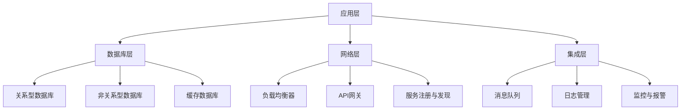

通过这个流程图，我们可以清晰地看到后端服务架构的各个组成部分及其相互关系，有助于理解后端服务的整体架构和功能。

### 3.6 总结

后端服务架构设计是构建高效、可靠和可扩展的后端系统的基础。通过了解后端服务架构的组成部分、设计原则和技术栈，开发团队可以更好地制定系统架构，实现系统的性能、可维护性和扩展性。同时，通过遵循科学的开发流程和实施有效的部署与运维策略，企业可以确保后端服务的稳定运行和持续优化。

### 第二部分：后端服务架构与实施

#### 第4章：后端服务技术栈与开发流程

### 4.1 后端服务技术栈

后端服务技术栈是构建高效、可靠的后端系统的核心。一个完整的技术栈包括编程语言、框架、数据库、中间件等组件。以下是几个常见的技术栈组件及其优缺点：

#### 4.1.1 服务器端编程语言

**Python**：
- **优点**：语法简单，易于学习，拥有丰富的库和框架，如Django、Flask。
- **缺点**：性能相对较低，适用于快速开发和数据分析等场景。

**Java**：
- **优点**：强类型语言，性能稳定，适用于企业级应用，有Spring、Hibernate等成熟框架。
- **缺点**：语法复杂，开发周期较长。

**Node.js**：
- **优点**：单线程异步编程，适用于高并发、实时通信的应用，有Express等框架。
- **缺点**：性能瓶颈在IO操作，内存消耗较高。

#### 4.1.2 数据库技术

**关系型数据库（RDBMS）**：
- **优点**：结构化数据存储，事务处理能力强，如MySQL、PostgreSQL。
- **缺点**：扩展性较差，不适合大规模数据存储。

**非关系型数据库（NoSQL）**：
- **优点**：灵活的数据模型，可扩展性强，适用于大规模数据存储，如MongoDB、Cassandra。
- **缺点**：不支持事务处理，查询性能可能较低。

**缓存数据库**：
- **优点**：快速数据访问，提高系统性能，如Redis、Memcached。
- **缺点**：数据持久性较低，适用于临时数据存储。

#### 4.1.3 中间件技术

**API网关**：
- **优点**：统一管理和路由API请求，提供安全认证、限流、监控等功能，如Kong、Apache APISIX。
- **缺点**：增加了系统复杂性，对性能有一定影响。

**消息队列**：
- **优点**：异步处理消息，提高系统的解耦性和可扩展性，如RabbitMQ、Kafka。
- **缺点**：消息顺序性可能无法保证，需要额外的处理。

**服务注册与发现**：
- **优点**：动态注册和发现服务，实现服务之间的动态调用和负载均衡，如Eureka、Consul。
- **缺点**：增加了系统依赖，需要确保服务注册与发现的稳定性。

#### 4.2 后端服务开发流程

后端服务的开发流程包括以下几个关键阶段：

**1. 需求分析**：
- **需求收集**：与业务方、用户沟通，了解业务需求和用户需求。
- **需求整理**：将需求整理成具体的功能模块和性能指标。

**2. 系统设计**：
- **架构设计**：根据需求分析结果，设计系统的架构，包括应用层、数据层、网络层和集成层。
- **数据库设计**：设计数据库结构，包括表结构、关系、索引等。

**3. 编码实现**：
- **代码编写**：根据系统设计文档进行代码编写，遵循代码规范和最佳实践。
- **单元测试**：编写单元测试，确保代码功能的正确性。

**4. 测试与部署**：
- **功能测试**：测试系统的功能是否满足需求。
- **性能测试**：测试系统的性能，如响应时间、并发处理能力等。
- **安全测试**：测试系统的安全性，如SQL注入、XSS攻击等。
- **部署**：将系统部署到生产环境，进行上线运行。

#### 4.3 开发流程中的关键步骤与伪代码示例

**1. 需求分析**

```python
# 伪代码：需求分析
def collect_requirements():
    # 收集业务需求
    business_requirements = get_business_requirements()
    # 收集用户需求
    user_requirements = get_user_requirements()
    # 整理需求
    requirements = merge_requirements(business_requirements, user_requirements)
    return requirements
```

**2. 系统设计**

```python
# 伪代码：系统设计
def design_system(requirements):
    # 设计应用层
    application_layer = design_application_layer(requirements)
    # 设计数据层
    data_layer = design_data_layer(requirements)
    # 设计网络层
    network_layer = design_network_layer(requirements)
    # 设计集成层
    integration_layer = design_integration_layer(requirements)
    # 整合系统设计
    system_design = integrate_layers(application_layer, data_layer, network_layer, integration_layer)
    return system_design
```

**3. 编码实现**

```python
# 伪代码：编码实现
def implement_code(system_design):
    # 编写应用层代码
    implement_application_layer_code(system_design.application_layer)
    # 编写数据层代码
    implement_data_layer_code(system_design.data_layer)
    # 编写网络层代码
    implement_network_layer_code(system_design.network_layer)
    # 编写集成层代码
    implement_integration_layer_code(system_design.integration_layer)
    # 单元测试
    run_unit_tests()
```

**4. 测试与部署**

```python
# 伪代码：测试与部署
def test_and_deploy():
    # 功能测试
    run_functional_tests()
    # 性能测试
    run_performance_tests()
    # 安全测试
    run_security_tests()
    # 部署
    deploy_system()
```

#### 4.4 后端服务开发流程的挑战与解决方案

**1. 需求变更**

**挑战**：在开发过程中，需求可能会发生变更，影响项目的进度和质量。

**解决方案**：采用敏捷开发方法，灵活应对需求变更。通过迭代开发和持续集成，确保项目能够及时适应需求变化。

**2. 性能优化**

**挑战**：后端服务的性能可能成为系统的瓶颈，影响用户体验。

**解决方案**：采用性能优化技术，如缓存、数据库优化、负载均衡等，提高系统的响应速度和并发处理能力。

**3. 安全性**

**挑战**：后端服务可能面临各种安全威胁，如SQL注入、XSS攻击等。

**解决方案**：采用安全防护措施，如输入验证、输出编码、HTTPS加密等，确保系统的安全性。

#### 4.5 总结

后端服务技术栈和开发流程是构建高效、可靠后端系统的关键。通过选择合适的技术栈和遵循科学的开发流程，企业可以确保后端服务的性能、可靠性和安全性。同时，通过不断优化和改进开发流程，企业可以提高开发效率，更好地满足市场需求。

### 第三部分：后端服务的盈利模式策略

#### 第5章：后端服务的盈利模式分析

### 5.1 后端服务的收入来源

后端服务的盈利模式多样化，以下是一些主要的收入来源：

**1. 订阅模式**：企业通过提供按需订阅的服务，如云计算资源、软件服务、数据分析工具等，用户根据使用量支付订阅费用。这种模式具有持续性和稳定性，是企业盈利的重要途径。

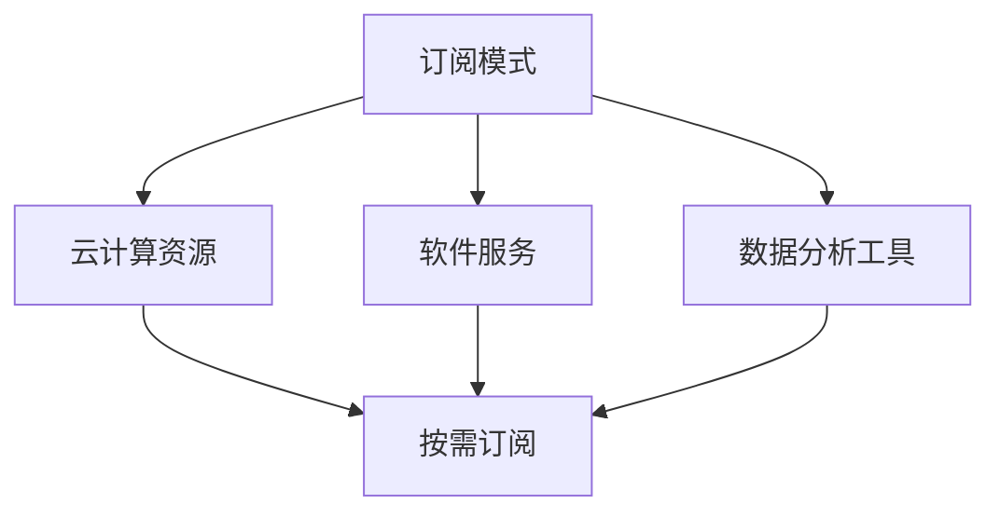

**2. 广告模式**：企业通过在平台上展示广告，向广告主收取广告费用。广告模式适用于流量较大的平台，如社交媒体、搜索引擎等。

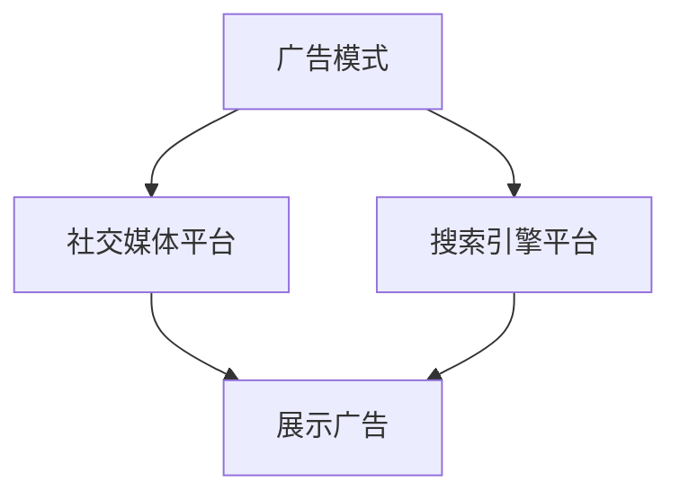

**3. 数据服务模式**：企业通过收集、处理和分析用户数据，提供数据服务，如市场报告、用户洞察、个性化推荐等，向客户收取服务费用。

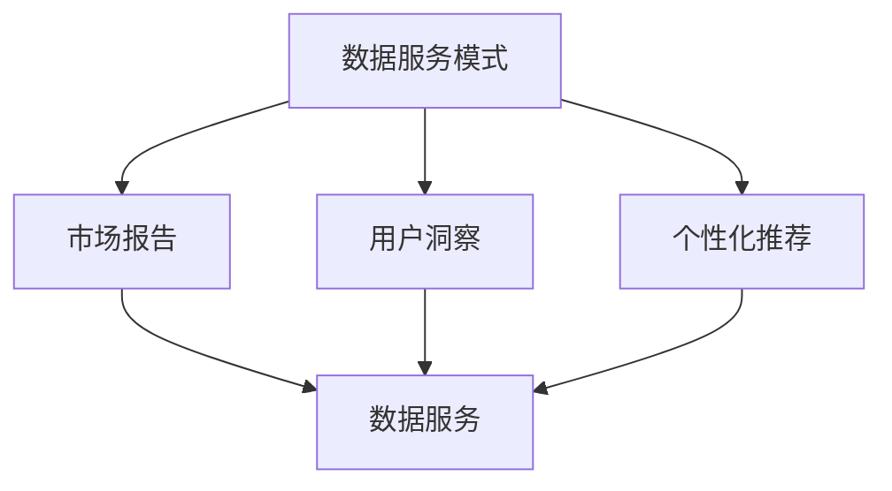

**4. 增值服务模式**：企业提供基础服务免费，但提供高级或专属功能需要付费。这种模式能够吸引大量用户，并通过增值服务获得额外收入。

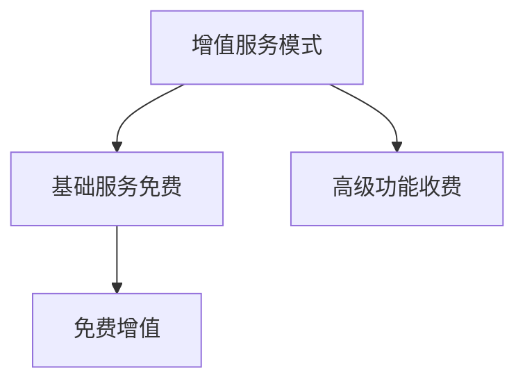

### 5.2 盈利模式的类型

后端服务的盈利模式多种多样，以下是几种常见的盈利模式类型：

**1. B2B模式（企业对企业）**：企业向其他企业提供服务，如云计算、企业级软件等。这种模式的收入来源主要是订阅费用和服务费用。

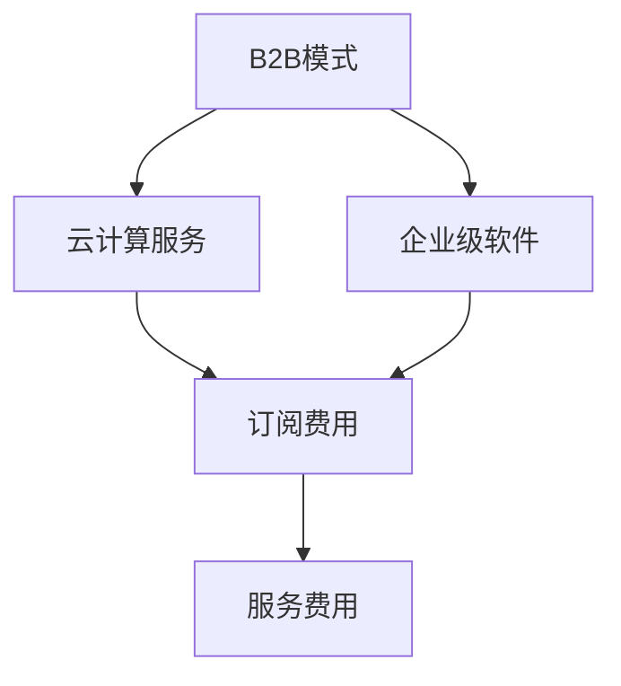

**2. B2C模式（企业对消费者）**：企业直接向消费者提供服务，如社交媒体、在线购物等。这种模式的收入来源主要包括订阅费用、广告费用和交易费用。

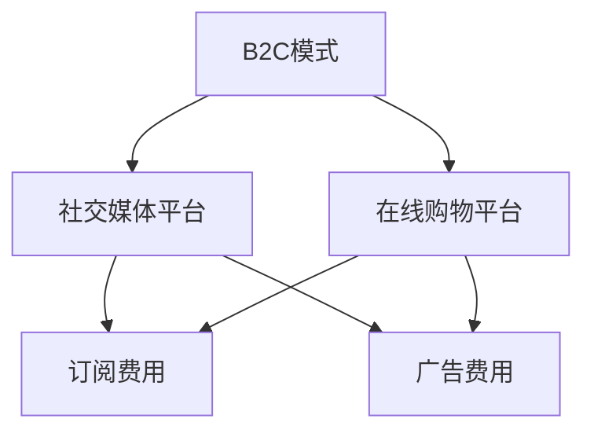

**3. B2B2C模式（企业对企业对企业）**：企业不仅向其他企业提供服务，还通过平台连接供需双方，实现交易。这种模式通常涉及平台费用、交易费用和广告费用。

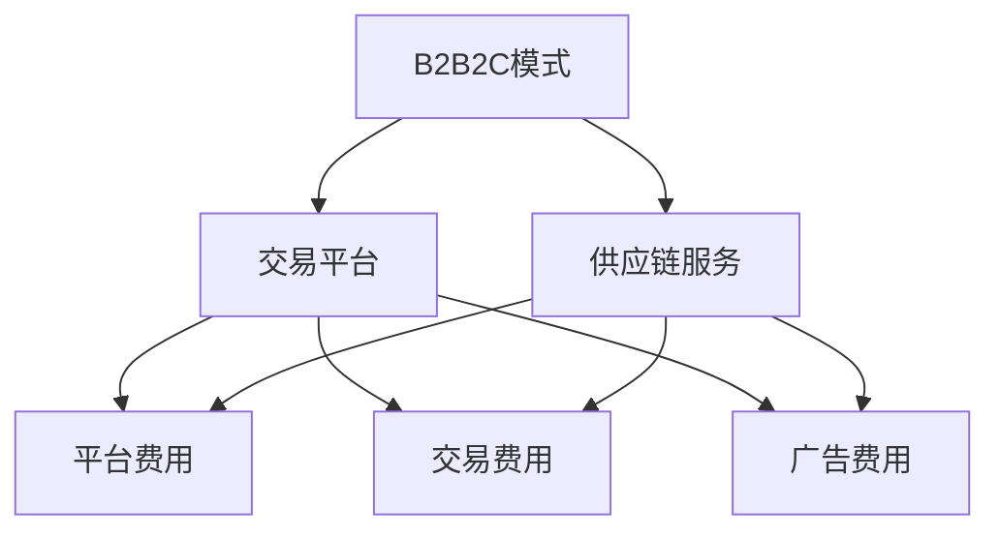

### 5.3 产品定价策略

产品定价策略对后端服务的盈利模式至关重要，以下是几种常见的定价策略：

**1. 成本加成定价**：在成本基础上加上一定的利润率，确定产品价格。这种定价策略适用于成本结构稳定的产品。

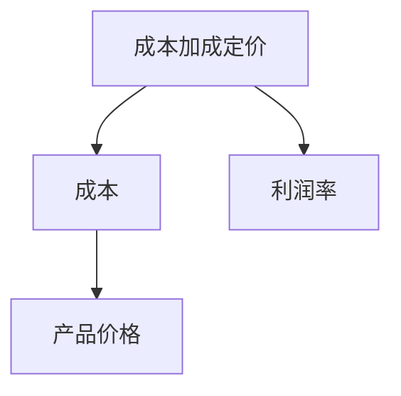

**2. 市场导向定价**：根据市场需求和竞争环境，确定产品价格。这种定价策略适用于需求波动较大的市场。

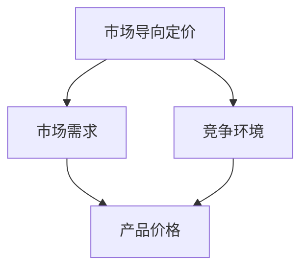

**3. 竞争导向定价**：根据竞争对手的产品价格，确定自己的产品价格。这种定价策略适用于竞争激烈的市场。

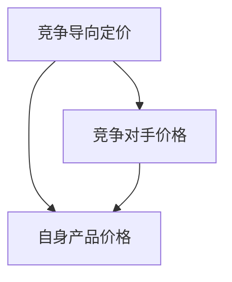

### 5.4 定价策略案例分析

以下是几个定价策略的案例分析：

**1. 成本加成定价案例分析**

- **产品**：某云计算服务提供商
- **定价策略**：成本加成定价
- **定价过程**：计算服务器、带宽、存储等成本，加上20%的利润率，确定产品价格。

```python
# 伪代码：成本加成定价案例分析
def cost_plus_pricing(costs, profit_margin):
    product_price = costs * (1 + profit_margin)
    return product_price

costs = 100  # 成本
profit_margin = 0.20  # 利润率
product_price = cost_plus_pricing(costs, profit_margin)
print(f"产品价格：{product_price}")
```

**2. 市场导向定价案例分析**

- **产品**：某社交媒体平台
- **定价策略**：市场导向定价
- **定价过程**：根据市场调查和竞争对手的价格，确定产品价格。

```python
# 伪代码：市场导向定价案例分析
def market_based_pricing(price调查结果, competition_price):
    product_price = price调查结果 if price调查结果 > competition_price else competition_price
    return product_price

price调查结果 = 150  # 市场调查价格
competition_price = 130  # 竞争对手价格
product_price = market_based_pricing(price调查结果, competition_price)
print(f"产品价格：{product_price}")
```

**3. 竞争导向定价案例分析**

- **产品**：某在线购物平台
- **定价策略**：竞争导向定价
- **定价过程**：根据竞争对手的价格，确定自己的产品价格。

```python
# 伪代码：竞争导向定价案例分析
def competition_based_pricing(competition_price):
    product_price = competition_price * 0.9  # 低于竞争对手价格10%
    return product_price

competition_price = 200  # 竞争对手价格
product_price = competition_based_pricing(competition_price)
print(f"产品价格：{product_price}")
```

### 5.5 成本控制与优化

成本控制与优化是后端服务盈利模式中至关重要的一环。以下是一些成本控制的方法与技巧：

**1. 资源优化**：通过优化服务器资源、带宽和存储等资源，减少不必要的资源消耗，降低运营成本。

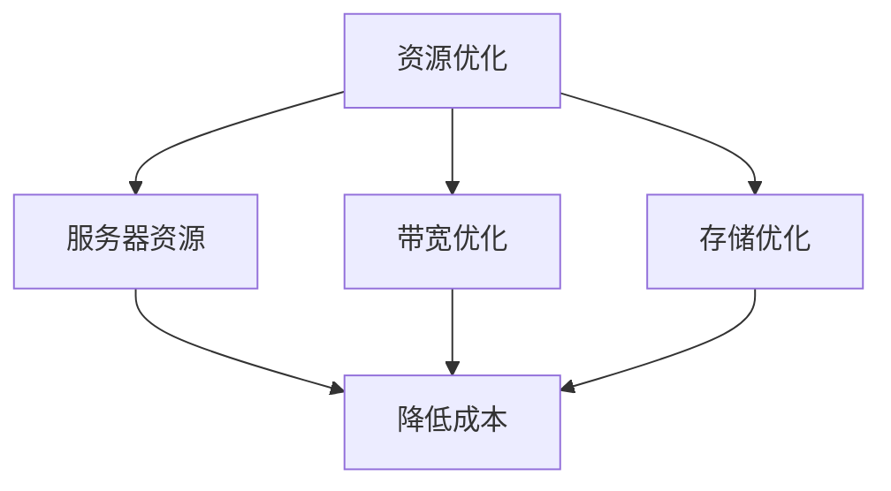

**2. 自动化运维**：采用自动化工具进行系统部署、监控和运维，提高运维效率，减少人力成本。

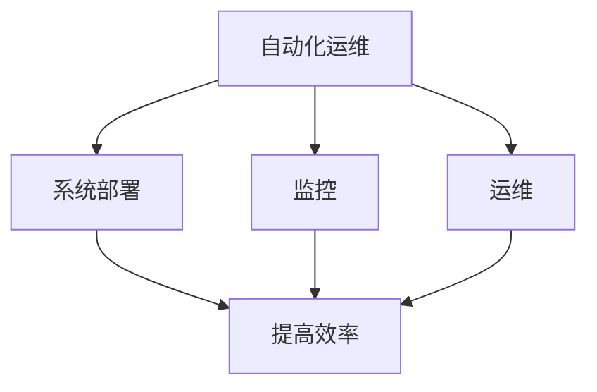

**3. 外包与协作**：通过外包部分业务或与合作伙伴协作，共享资源和技术，降低运营成本。

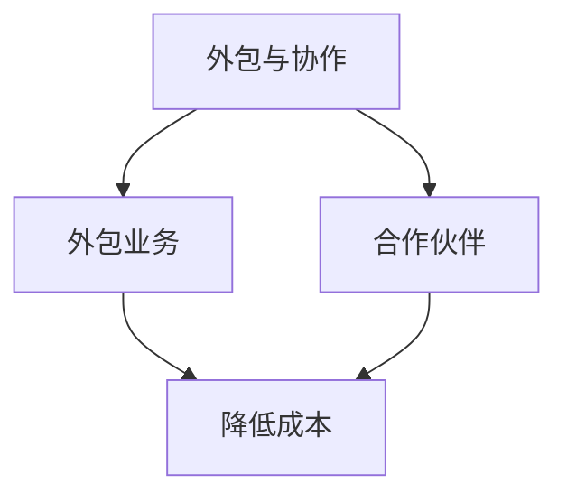

### 5.6 成本控制的重要性

成本控制对于后端服务的盈利模式具有重要意义：

**1. 提高盈利能力**：通过降低运营成本，提高盈利能力。

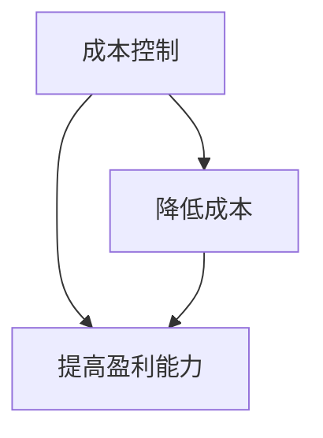

**2. 确保可持续发展**：合理的成本控制有助于企业实现可持续发展，应对市场变化和竞争压力。

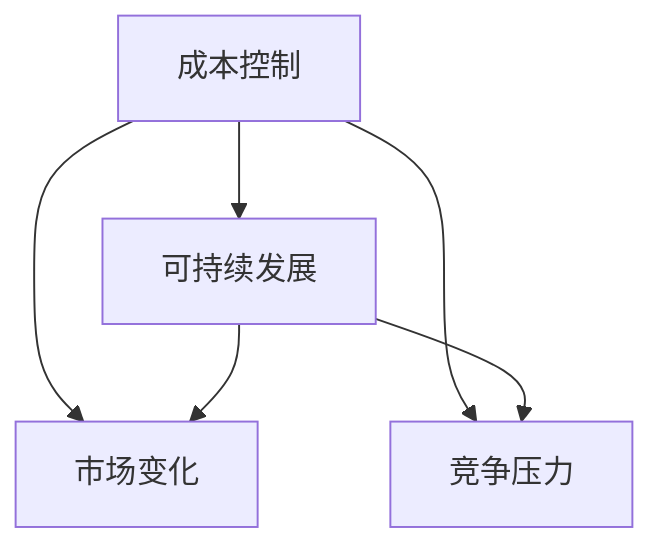

**3. 提高企业竞争力**：通过优化成本，企业可以在价格竞争中保持优势，提高市场竞争力。

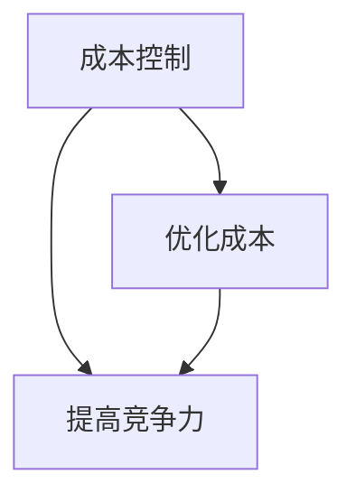

### 5.7 总结

后端服务的盈利模式多样化，包括订阅模式、广告模式、数据服务模式和增值服务模式等。合理的定价策略和有效的成本控制是确保后端服务盈利的关键。通过深入分析收入来源、盈利模式类型和定价策略，企业可以制定有效的盈利策略，实现可持续发展。

### 第四部分：案例分析与应用

#### 第8章：社交媒体平台盈利模式分析

社交媒体平台作为当今互联网的核心组成部分，其盈利模式不仅影响平台的商业成功，也影响用户的参与度和满意度。在本章中，我们将深入分析社交媒体平台的盈利模式，并通过具体案例来解析其成功的关键因素。

#### 8.1 社交媒体平台商业模式

社交媒体平台的商业模式通常包括以下几个核心组成部分：

**1. 用户基础**：社交媒体平台的核心价值在于其庞大的用户基础。用户通过平台进行社交互动、内容分享和获取信息，形成了平台的主要价值来源。

**2. 内容产生**：用户在社交媒体平台上产生的内容，如帖子、图片、视频和评论，为平台提供了丰富的信息和互动体验。

**3. 广告与推广**：广告和推广是社交媒体平台的主要收入来源之一。平台通过向广告主提供精准的用户定位和广告投放，实现广告收入的增长。

**4. 数据与分析**：社交媒体平台拥有大量的用户数据，这些数据不仅用于改进平台功能和用户体验，还可以通过数据服务、市场调研和个性化推荐等方式创造额外的收入。

#### 8.2 社交媒体平台盈利模式

社交媒体平台的盈利模式通常包括以下几种：

**1. 广告收入**：广告收入是社交媒体平台最重要的盈利模式之一。平台通过在用户内容周围展示广告，向广告主收取广告费用。广告形式包括横幅广告、视频广告、原生广告等。

**2. 付费增值服务**：社交媒体平台提供付费增值服务，如会员订阅、去广告、专属功能等。这些服务为平台带来了额外的收入，同时提升了用户的满意度。

**3. 数据服务**：平台通过提供数据报告、用户洞察和市场分析等服务，向企业收取数据服务费用。这些服务帮助企业在市场营销和决策制定中获取竞争优势。

**4. 电子商务**：一些社交媒体平台通过电子商务平台实现盈利，如淘宝、拼多多等。平台通过收取交易费、佣金等方式获得收入。

#### 8.3 案例分析：Facebook的盈利模式

Facebook作为全球最大的社交媒体平台之一，其盈利模式具有代表性。以下是Facebook的主要盈利模式：

**1. 广告收入**：Facebook的主要收入来源是广告收入。广告形式包括页面上方的横幅广告、侧边栏广告、插页式广告和视频广告等。Facebook通过算法精确定位用户，使广告能够更有效地触达到目标受众。

**2. 付费增值服务**：Facebook提供了多种付费增值服务，如Facebook会员、去广告、Facebook Pay等。这些服务为用户提供了更优质的体验，同时也为平台带来了额外的收入。

**3. 数据服务**：Facebook通过其庞大的用户数据，为企业和开发者提供数据分析和API服务。这些数据服务帮助企业在市场营销和产品开发中做出更明智的决策。

**4. 电子商务**：Facebook Marketplace是一个在线购物平台，用户可以通过平台买卖商品。平台通过收取交易费和佣金来获得收入。

#### 8.4 Facebook盈利模式解析

Facebook的盈利模式成功的关键因素包括：

**1. 广告精准投放**：Facebook利用其先进的算法和用户数据，实现了广告的精准投放。这使得广告主能够更有效地触达目标受众，提高了广告的效果和转化率。

**2. 用户粘性**：Facebook通过不断优化用户体验，如新增功能、改进算法和界面设计等，提高了用户的粘性。这增加了用户在平台上的活跃时间和互动频率，从而为广告商提供了更多的曝光机会。

**3. 数据驱动决策**：Facebook基于庞大的用户数据，进行数据分析和市场调研，为企业提供了有价值的市场洞察。这些数据不仅帮助Facebook优化广告投放，还为合作伙伴提供了决策支持。

**4. 多元化收入**：Facebook通过多元化收入来源，降低了单一收入模式的风险。这不仅提高了平台的盈利能力，还增强了平台的抗风险能力。

#### 8.5 总结

社交媒体平台盈利模式的核心在于广告收入和付费增值服务。通过精准的广告投放、强大的用户粘性和多元化的收入来源，社交媒体平台实现了可持续的盈利。Facebook的成功案例表明，合理的盈利模式策略和持续的创新是社交媒体平台取得成功的关键。

### 第9章：电子商务平台后端服务盈利模式

电子商务平台已经成为现代商业中不可或缺的一部分，其盈利模式多样化，后端服务在其中发挥着关键作用。在本章中，我们将深入分析电子商务平台的后端服务盈利模式，并通过具体案例来展示其运作方式和成功因素。

#### 9.1 电子商务平台后端服务概述

电子商务平台的后端服务包括以下几个核心组成部分：

**1. 商品管理**：商品管理是电子商务平台后端服务的核心。它负责商品信息的录入、更新、分类和库存管理。通过高效的商品管理，平台可以提供准确和实时的商品信息，提升用户体验。

**2. 订单处理**：订单处理是电子商务平台的交易核心。它负责订单的创建、支付、发货和退款等操作。高效的订单处理系统可以确保交易的顺畅进行，减少交易中的错误和延误。

**3. 支付系统**：支付系统是电子商务平台后端服务的关键组成部分。它负责处理各种支付方式，如信用卡、借记卡、电子钱包和在线支付等。支付系统的稳定性和安全性直接影响到用户的支付体验和平台的信誉。

**4. 物流管理**：物流管理负责商品的发货、跟踪和配送。通过高效的物流管理系统，平台可以提供快速、准确和安全的配送服务，提高用户满意度。

**5. 客户服务**：客户服务是电子商务平台后端服务的重要组成部分。它负责处理用户的咨询、投诉和售后问题，提供及时和有效的支持，增强用户对平台的信任和忠诚度。

#### 9.2 电子商务平台后端服务的盈利模式

电子商务平台后端服务的盈利模式多种多样，以下是一些主要模式：

**1. 交易费和佣金**：电子商务平台通过向卖家收取交易费和佣金来获得收入。交易费通常按成交金额的一定比例收取，佣金则可能基于订单量或销售额。

**2. 广告和推广**：平台可以通过向卖家提供广告和推广服务来获得收入。广告形式包括商品推广、搜索广告和首页推荐等。

**3. 会员服务**：电子商务平台可以提供付费会员服务，如会员专享优惠、积分兑换和优先客服等。会员服务为平台带来了额外的收入，同时也提升了用户的购物体验。

**4. 数据分析**：平台可以通过分析用户行为数据，提供市场调研、用户洞察和产品推荐等服务。这些数据服务可以帮助企业制定更有效的营销策略和产品规划，从而创造额外的收入。

**5. 电子商务服务**：一些电子商务平台提供自己的电子商务服务，如在线支付、物流配送和客户服务。通过这些服务，平台可以收取相关费用，增加收入。

#### 9.3 案例分析：Amazon的后端服务盈利模式

Amazon是全球最大的电子商务平台之一，其后端服务盈利模式具有代表性。以下是Amazon的主要盈利模式：

**1. 交易费和佣金**：Amazon向卖家收取交易费和佣金，按成交金额的一定比例收取。交易费用于平台运营成本，而佣金则是平台的主要收入来源之一。

**2. 广告和推广**：Amazon通过广告和推广服务向卖家提供额外的曝光机会。卖家可以通过投放广告来提升商品在搜索结果中的排名，从而吸引更多潜在买家。

**3. 会员服务**：Amazon提供Prime会员服务，会员可以享受免费两日配送、无限的视频和音乐流媒体服务等特权。Prime会员服务为平台带来了稳定的收入流和用户粘性。

**4. 数据分析**：Amazon通过分析用户行为数据，提供个性化的商品推荐、市场趋势分析和用户洞察服务。这些数据服务帮助企业优化营销策略和产品开发。

**5. 电子商务服务**：Amazon提供自己的电子商务服务，如Amazon Pay、Amazon Logistics和Amazon Customer Service。通过这些服务，平台可以收取相关费用，增加收入。

#### 9.4 Amazon盈利模式解析

Amazon的后端服务盈利模式成功的关键因素包括：

**1. 高效的交易处理**：Amazon通过先进的订单处理系统，实现了快速、准确和高效的交易处理。这提高了用户购物体验，增加了用户对平台的信任和忠诚度。

**2. 广告精准投放**：Amazon利用其庞大的用户数据和先进的算法，实现了广告的精准投放。这使得广告主能够更有效地触达目标受众，提高了广告的效果和转化率。

**3. 多元化收入**：Amazon通过多元化收入来源，如交易费、广告、会员服务和数据分析等，降低了单一收入模式的风险。这增强了平台的抗风险能力和盈利能力。

**4. 物流网络**：Amazon建立了全球性的物流网络，提供了快速、准确和安全的配送服务。这提高了用户满意度，增加了平台的竞争力。

**5. 用户体验**：Amazon注重用户体验，通过提供优质的客户服务、个性化推荐和便捷的购物体验，吸引了大量用户。这提高了用户粘性，增加了平台的用户基数。

#### 9.5 总结

电子商务平台的后端服务盈利模式多样化，包括交易费、广告、会员服务、数据分析和电子商务服务等。通过高效的后端服务和创新的盈利模式，电子商务平台可以实现可持续的盈利。Amazon的成功案例表明，高效的后端服务和多元化的盈利模式是电子商务平台取得成功的关键。

### 第10章：在线教育平台盈利模式分析

在线教育平台近年来在全球范围内迅速发展，吸引了大量用户。其盈利模式多种多样，涉及课程销售、会员服务、广告和其他增值服务。在本章中，我们将深入分析在线教育平台的盈利模式，并通过具体案例来展示其成功因素和策略。

#### 10.1 在线教育平台商业模式

在线教育平台的商业模式通常包括以下几个核心组成部分：

**1. 课程内容**：课程内容是平台的核心价值。平台通过提供丰富多样的课程，满足不同用户的学习需求。

**2. 用户基础**：用户基础是平台的重要资产。通过吸引用户注册和参与课程，平台建立了庞大的用户群体。

**3. 教学服务**：在线教育平台提供教学服务，包括直播课程、录播课程、在线作业和答疑等。这些服务提升了课程质量，提高了用户满意度。

**4. 数据分析**：平台通过分析用户数据，了解用户学习行为和需求，优化课程内容和教学服务。

**5. 广告与推广**：广告和推广是平台吸引用户和增加流量的重要手段。平台通过展示广告和推广活动，向广告主收取费用。

#### 10.2 在线教育平台盈利模式

在线教育平台的盈利模式多样化，以下是一些主要模式：

**1. 课程销售**：平台通过销售课程获得收入。课程可以是按次购买、按月订阅或按年订阅等形式。

**2. 会员服务**：平台提供会员服务，如会员专享课程、专属优惠和个性化推荐等。会员服务通常需要用户支付额外费用。

**3. 广告和推广**：平台通过在课程页面、首页和其他页面展示广告，向广告主收取广告费用。

**4. 增值服务**：平台提供增值服务，如专业咨询、课程定制、考试辅导等。这些服务通常需要用户支付额外费用。

**5. 数据分析**：平台通过提供数据报告和分析服务，向企业或个人收取费用。

#### 10.3 案例分析：Coursera的盈利模式

Coursera是全球领先的在线学习平台之一，其盈利模式具有代表性。以下是Coursera的主要盈利模式：

**1. 课程销售**：Coursera通过销售课程获得收入。课程包括免费课程和付费课程，付费课程通常包括证书服务。

**2. 会员服务**：Coursera提供会员服务，如Coursera Plus。会员可以享受无限次课程学习、专属折扣和个性化推荐等特权。Coursera Plus会员服务为平台带来了稳定的收入流。

**3. 广告和推广**：Coursera通过在课程页面、首页和其他页面展示广告，向广告主收取费用。广告形式包括横幅广告、视频广告和原生广告等。

**4. 数据分析**：Coursera通过提供数据报告和分析服务，向企业和教育机构收取费用。这些数据服务帮助客户了解市场趋势、用户行为和学习效果。

**5. 增值服务**：Coursera提供增值服务，如专业咨询、课程定制和考试辅导等。这些服务为用户提供了额外的学习支持和职业发展机会，同时也为平台带来了收入。

#### 10.4 Coursera盈利模式解析

Coursera的盈利模式成功的关键因素包括：

**1. 优质课程内容**：Coursera通过与全球顶尖大学和机构合作，提供了高质量的课程内容。这些课程吸引了大量用户，提升了平台的用户满意度。

**2. 会员服务体验**：Coursera Plus会员服务提供了丰富的特权，如无限次课程学习、专属折扣和个性化推荐等。这些服务提升了用户体验，增加了会员的忠诚度。

**3. 广告精准投放**：Coursera利用用户数据，实现了广告的精准投放。这使得广告主能够更有效地触达目标受众，提高了广告的效果和转化率。

**4. 数据分析能力**：Coursera通过强大的数据分析能力，了解用户行为和市场趋势，优化课程内容和营销策略。

**5. 持续创新**：Coursera不断推出新的课程、服务和功能，保持了平台的活力和竞争力。

#### 10.5 总结

在线教育平台盈利模式多样化，包括课程销售、会员服务、广告、增值服务和数据分析等。通过优质的内容、创新的会员服务和精准的广告投放，在线教育平台可以实现可持续的盈利。Coursera的成功案例表明，持续创新和优质的用户体验是平台取得成功的关键。

### 第五部分：未来趋势与挑战

#### 第11章：后端服务发展趋势

随着技术的发展和市场的变化，后端服务也在不断演进。未来，后端服务将面临许多新的趋势和挑战。以下是几个关键趋势：

#### 11.1 云计算与分布式架构

云计算和分布式架构将成为后端服务的主流。云计算提供了灵活、可扩展的计算资源，使企业能够更快速地部署和扩展后端服务。分布式架构则提高了系统的可靠性和性能，使系统能够更好地应对高并发和大规模数据处理需求。

**1. 云原生应用**：云原生应用将更受欢迎，这些应用设计为在云计算环境中运行，具有可扩展性、弹性和自动化特性。

**2. 微服务架构**：微服务架构将继续流行，通过将后端服务拆分为多个独立的微服务，可以提高系统的可维护性和可扩展性。

**3. 容器化技术**：Docker和Kubernetes等容器化技术将更广泛地应用于后端服务部署和管理，提高了部署效率和应用的可移植性。

#### 11.2 人工智能与大数据

人工智能（AI）和大数据技术的进步将深刻影响后端服务。AI技术可以帮助企业实现自动化、个性化推荐和智能决策，提高用户体验和业务效率。大数据技术则可以处理和分析海量数据，为企业提供有价值的市场洞察和业务优化建议。

**1. AI驱动的后端服务**：AI技术将被广泛应用于后端服务，如智能客服、智能推荐和自动化运维等。

**2. 大数据分析平台**：大数据分析平台将提供更强大的数据处理和分析能力，帮助企业从海量数据中提取价值。

**3. 数据安全与隐私**：随着数据规模的扩大和数据的敏感性增加，数据安全和隐私保护将成为后端服务的重要挑战。

#### 11.3 新兴应用场景

新兴应用场景将推动后端服务的创新和发展。以下是一些值得关注的新兴应用场景：

**1. 物联网（IoT）**：物联网设备的增加将带来大量数据，后端服务需要处理和分析这些数据，实现智能连接和自动化控制。

**2. 虚拟现实（VR）和增强现实（AR）**：VR和AR技术的兴起将推动后端服务在娱乐、教育和设计等领域的应用，提高用户体验和互动性。

**3. 区块链**：区块链技术的应用将推动后端服务的创新，如去中心化应用（DApp）、智能合约和数字身份验证等。

#### 11.4 持续集成与持续部署

持续集成（CI）和持续部署（CD）将成为后端服务开发的标配。CI/CD流程可以提高开发效率，缩短发布周期，降低发布风险。

**1. 自动化测试**：自动化测试工具将被广泛应用于后端服务开发，确保代码质量和系统稳定性。

**2. DevOps文化**：DevOps文化的普及将推动开发、测试和运维团队的紧密协作，提高后端服务的交付效率和质量。

**3. 可观测性与监控**：可观测性和监控技术将更加成熟，帮助开发团队实时监控系统性能和健康状况，快速发现和解决问题。

#### 11.5 安全性挑战

随着后端服务的复杂性和互联性增加，安全性挑战也将变得更加严峻。以下是一些关键的安全挑战：

**1. 数据泄露**：随着数据量的增加，数据泄露的风险也随之增加。企业需要加强数据加密和安全存储，防止数据泄露。

**2. 恶意攻击**：后端服务可能面临各种恶意攻击，如DDoS攻击、SQL注入、XSS攻击等。企业需要采取有效的安全措施，防范攻击。

**3. 合规与法规**：随着数据保护和隐私法规的加强，企业需要确保后端服务符合相关法规要求，避免法律风险。

#### 11.6 总结

未来，后端服务将面临许多新的趋势和挑战。云计算与分布式架构、人工智能与大数据、新兴应用场景、持续集成与持续部署以及安全性挑战将是后端服务发展的重要方向。企业需要紧跟技术趋势，不断创新和优化后端服务，以应对不断变化的市场需求。

### 第五部分：未来趋势与挑战

#### 第12章：后端服务盈利模式面临的挑战

随着技术的不断进步和市场的快速变化，后端服务盈利模式面临着一系列挑战。这些挑战不仅考验企业的技术能力，也对商业模式提出了更高的要求。以下是后端服务盈利模式面临的主要挑战：

#### 12.1 安全性问题

随着后端服务承载的业务数据越来越多，安全性问题变得尤为重要。以下是一些关键的安全挑战：

**1. 数据泄露**：企业需要保护用户数据和业务数据免受未经授权的访问和泄露。随着数据规模的增加，数据泄露的风险也在上升。

**2. 恶意攻击**：后端服务可能面临各种恶意攻击，如DDoS攻击、SQL注入、XSS攻击等。这些攻击不仅可能导致系统瘫痪，还可能窃取敏感数据。

**3. 安全合规**：随着数据保护和隐私法规（如GDPR、CCPA等）的加强，企业需要确保后端服务符合相关法规要求，避免法律风险和罚款。

**解决方案**：
- **数据加密**：对敏感数据进行加密，确保数据在传输和存储过程中的安全性。
- **安全审计**：定期进行安全审计，发现和修复潜在的安全漏洞。
- **多因素认证**：采用多因素认证（MFA）来加强用户身份验证，降低恶意攻击的风险。

#### 12.2 数据隐私问题

随着用户对隐私保护的重视，后端服务在数据处理和隐私保护方面面临巨大挑战。以下是一些关键的数据隐私挑战：

**1. 用户隐私保护**：企业需要在收集、存储和使用用户数据时，确保用户的隐私权益得到保护。

**2. 数据共享与隐私平衡**：在提供数据服务时，企业需要在数据共享和用户隐私保护之间找到平衡。

**3. 隐私法规遵守**：企业需要遵守各种数据保护法规，如GDPR、CCPA等，确保合法合规。

**解决方案**：
- **隐私保护机制**：采用隐私保护技术，如数据匿名化、加密和去识别化，确保用户隐私。
- **透明度政策**：明确告知用户数据收集、存储和使用的目的，增强用户信任。
- **合规审查**：定期进行合规审查，确保数据保护措施符合法规要求。

#### 12.3 监管政策变化的影响

监管政策的变化对后端服务盈利模式有着深远的影响。以下是一些关键的监管挑战：

**1. 数据保护法规**：随着数据保护法规的不断更新，企业需要确保后端服务的合规性。

**2. 交易税收政策**：不同国家和地区的税收政策可能对企业的盈利模式产生影响，如数字税、增值税等。

**3. 知识产权保护**：知识产权保护政策的变化可能影响企业的业务模式，如版权、专利等。

**解决方案**：
- **合规性评估**：定期评估监管政策的变化，确保后端服务的合规性。
- **跨区域业务策略**：制定跨区域业务策略，应对不同国家和地区的监管政策。
- **知识产权保护**：加强知识产权保护措施，避免因侵权行为导致的法律风险。

#### 12.4 技术变革的冲击

技术的快速变革对后端服务盈利模式带来了新的挑战。以下是一些关键的技术挑战：

**1. 人工智能与自动化**：人工智能和自动化技术的发展，可能改变企业的运营模式和盈利模式，影响后端服务的需求。

**2. 区块链技术**：区块链技术的兴起，可能改变传统的数据存储和交易模式，影响后端服务的盈利模式。

**3. 5G与物联网**：5G和物联网技术的发展，将带来海量数据和新的应用场景，对后端服务的性能和可靠性提出了更高要求。

**解决方案**：
- **技术前瞻性**：保持技术前瞻性，紧跟技术发展趋势，提前布局。
- **技术创新**：通过技术创新，提升后端服务的性能和可靠性，应对新技术带来的挑战。
- **生态合作**：与生态系统中的合作伙伴紧密合作，共同应对技术变革的冲击。

#### 12.5 用户行为变化的影响

用户行为的不断变化对后端服务盈利模式也产生了影响。以下是一些关键的用户行为挑战：

**1. 用户需求多样化**：随着用户需求的多样化，后端服务需要提供更加个性化、多样化的服务。

**2. 用户参与度下降**：用户参与度下降可能影响平台的活跃度和用户粘性。

**3. 用户体验要求提高**：用户对后端服务的用户体验要求不断提高，对服务的响应速度、稳定性、安全性和易用性提出了更高要求。

**解决方案**：
- **用户调研**：定期进行用户调研，了解用户需求和反馈，优化服务。
- **用户体验设计**：注重用户体验设计，提升用户满意度。
- **个性化服务**：通过个性化推荐和定制化服务，提高用户参与度和忠诚度。

#### 12.6 总结

后端服务盈利模式面临着多重挑战，包括安全性问题、数据隐私问题、监管政策变化、技术变革和用户行为变化等。企业需要密切关注这些挑战，采取有效的策略和措施，确保后端服务的可持续发展。通过技术创新、合规管理、用户体验优化等手段，企业可以应对这些挑战，实现长期盈利。

### 第六部分：实践指南与建议

#### 第13章：后端服务盈利模式的实施步骤

要成功实施后端服务盈利模式，企业需要遵循一系列科学的步骤，以确保盈利模式的可执行性和有效性。以下是实施后端服务盈利模式的主要步骤：

#### 13.1 前期调研

**1. 市场调研**：深入了解目标市场，包括市场规模、竞争对手、用户需求和行业趋势。通过市场调研，企业可以确定盈利模式的可行性和潜在的市场机会。

**2. 竞争分析**：分析主要竞争对手的盈利模式，了解其优势和不足。通过竞争分析，企业可以找出自身的竞争优势和差异化策略。

**3. 用户需求调研**：通过调查问卷、用户访谈和用户反馈等方式，了解用户的需求、痛点和偏好。用户需求调研有助于企业制定符合用户需求的产品和服务策略。

#### 13.2 模式选择

**1. 盈利模式评估**：根据市场调研和竞争分析结果，评估不同的盈利模式，包括订阅模式、广告模式、数据服务模式和增值服务模式等。选择最适合企业资源和市场环境的盈利模式。

**2. 盈利模式设计**：结合企业的战略目标和市场定位，设计具体的盈利模式，包括收入来源、定价策略和成本结构等。

**3. 模式验证**：通过模拟和试点运行，验证所选盈利模式的可行性和效果。模式验证有助于发现潜在的问题和优化方案。

#### 13.3 模式优化与调整

**1. 监控与评估**：建立监控机制，实时跟踪盈利模式的表现，包括收入、成本、用户满意度和市场份额等关键指标。

**2. 数据分析**：通过数据分析，深入了解盈利模式的运行情况，发现问题和机会。数据分析可以帮助企业优化盈利模式，提高效益。

**3. 模式调整**：根据监控和数据分析结果，及时调整盈利模式，以应对市场变化和用户需求。灵活调整盈利模式是确保持续盈利的关键。

#### 13.4 成本控制与优化

**1. 成本分析**：详细分析后端服务的成本结构，包括硬件成本、软件成本、人力成本和其他运营成本。

**2. 成本优化**：通过技术创新、流程优化和资源整合等措施，降低运营成本。例如，采用云计算和容器化技术，实现资源的高效利用。

**3. 成本控制**：建立成本控制机制，定期审查和调整成本预算，确保成本在合理范围内。成本控制有助于提高盈利能力和投资回报率。

#### 13.5 风险管理

**1. 风险识别**：识别可能影响后端服务盈利模式的风险，包括市场风险、技术风险、法律风险和运营风险等。

**2. 风险评估**：评估每个风险的影响程度和发生概率，确定风险的优先级。

**3. 风险应对策略**：制定相应的风险应对策略，包括风险规避、风险减轻、风险转移和风险接受等。

#### 13.6 实施指南

**1. 制定实施计划**：根据上述步骤，制定详细的实施计划，明确任务、责任和时间表。

**2. 资源配置**：确保实施计划所需的资源，包括人力资源、技术资源和财务资源等。

**3. 实施与监控**：按照实施计划，逐步推进盈利模式的实施，并进行实时监控和调整。

**4. 持续优化**：在实施过程中，不断收集反馈和改进方案，持续优化盈利模式。

#### 13.7 总结

成功实施后端服务盈利模式需要系统性的规划和执行。通过前期调研、模式选择、模式优化与调整、成本控制与优化、风险管理和实施指南，企业可以确保盈利模式的可执行性和有效性。持续优化和调整是实现长期盈利的关键，企业需要不断关注市场变化和用户需求，以保持竞争优势。

### 第六部分：实践指南与建议

#### 第14章：风险管理

在后端服务盈利模式的实施过程中，风险管理至关重要。合理的风险管理策略可以帮助企业识别、评估和应对潜在的风险，确保盈利模式的稳定性和可持续发展。以下是后端服务盈利模式风险管理的主要步骤和策略：

#### 14.1 风险识别

**1. 内部审计**：通过内部审计，审查后端服务的运营流程、技术架构和业务策略，识别潜在的风险点。内部审计可以帮助企业发现系统漏洞、流程缺陷和潜在的安全威胁。

**2. 用户反馈**：收集用户的反馈和投诉，了解用户在后端服务使用过程中遇到的问题和挑战。用户的反馈可以帮助企业识别用户体验问题、功能缺陷和潜在的业务风险。

**3. 竞争对手分析**：分析竞争对手的业务模式、运营策略和市场表现，了解竞争对手可能存在的风险，并评估这些风险对本企业的影响。

**4. 法律法规审查**：审查相关法律法规和政策，确保后端服务符合法律和监管要求。特别是在数据隐私保护和网络安全方面，企业需要密切关注法规变化，及时调整运营策略。

**5. 行业趋势分析**：通过分析行业趋势和新兴技术，识别可能影响后端服务盈利模式的技术风险和市场风险。

#### 14.2 风险评估

**1. 影响评估**：对识别出的风险进行影响评估，分析每个风险可能带来的影响程度和发生概率。影响评估可以帮助企业确定风险的优先级，明确需要优先关注和应对的风险。

**2. 财务分析**：对每个风险可能带来的财务影响进行详细分析，包括成本增加、收入减少和投资损失等。财务分析有助于企业制定合理的风险应对策略。

**3. 策略评估**：根据风险评估结果，评估不同的风险应对策略的有效性和可行性。策略评估可以帮助企业选择最佳的风险管理方案。

#### 14.3 风险应对策略

**1. 风险规避**：通过改变业务策略、调整运营流程或采用新技术等手段，避免风险的发生。例如，通过多元化产品和服务，降低对单一市场的依赖。

**2. 风险减轻**：通过改进系统架构、优化业务流程和安全措施等手段，降低风险的影响程度。例如，通过增加数据备份和容灾措施，降低数据丢失的风险。

**3. 风险转移**：通过保险、合同条款或合作伙伴关系等手段，将部分风险转移给第三方。例如，通过购买网络安全保险，降低网络攻击造成的损失。

**4. 风险接受**：对于一些不可避免且影响较小的风险，企业可以选择接受风险，并在必要时采取补救措施。例如，对于市场波动引起的收入波动，企业可以通过成本控制和优化运营来应对。

#### 14.4 风险监控与应对

**1. 风险监控体系**：建立风险监控体系，实时跟踪风险的变化和潜在的新风险。风险监控可以通过自动化工具和人工审核相结合的方式进行。

**2. 定期评估**：定期对风险应对策略进行评估，确保风险管理的有效性。评估应包括风险识别、风险评估和风险应对策略的审查。

**3. 应急预案**：制定应急预案，应对可能发生的重大风险事件。应急预案应包括应急响应流程、责任分工和资源调配等内容。

**4. 反馈机制**：建立反馈机制，收集和处理风险应对过程中的问题和反馈。通过反馈机制，企业可以不断改进和完善风险管理策略。

#### 14.5 总结

风险管理是后端服务盈利模式成功实施的关键环节。通过风险识别、风险评估和风险应对策略，企业可以有效地识别和应对潜在的风险，确保盈利模式的稳定性和可持续发展。合理的风险管理策略不仅有助于降低风险损失，还可以提高企业的竞争力和市场适应性。企业需要持续关注市场变化和技术进步，不断完善风险管理策略，以应对不断变化的风险环境。

### 第六部分：实践指南与建议

#### 第15章：成功案例分析

为了深入了解后端服务盈利模式在实际应用中的成功经验，我们分析了几个具有代表性的案例，这些案例展示了不同的盈利模式及其实现策略。

#### 15.1 案例一：Dropbox

**案例背景**：
Dropbox是一款基于云的文件存储和同步服务，它通过提供便捷的文件同步和共享功能，迅速获得了大量用户。Dropbox的成功离不开其创新的盈利模式。

**盈利模式**：
- **免费增值模式**：Dropbox提供免费的基础服务，用户可以免费存储一定容量的文件。当用户需要更多存储空间时，可以选择付费升级到高级版。
- **企业服务**：Dropbox为企业提供定制化的企业解决方案，包括更高的存储容量、安全保护和团队协作功能。企业客户需要支付额外的费用。

**成功经验**：
- **用户黏性**：Dropbox通过提供出色的免费服务，吸引了大量用户。这些用户在使用过程中体验到了服务的便利性，从而愿意付费升级。
- **灵活的定价策略**：Dropbox提供了多种定价选项，满足了不同用户的需求。这种灵活的定价策略提高了用户转化率。
- **良好的用户体验**：Dropbox注重用户体验，通过简洁的界面设计和快速的数据同步，提升了用户满意度。

**经验启示**：
- 提供免费服务可以吸引用户，并通过增值服务实现盈利。
- 灵活的定价策略可以满足不同用户的需求，提高盈利能力。
- 优秀的用户体验是吸引和留住用户的关键。

#### 15.2 案例二：Slack

**案例背景**：
Slack是一款团队协作工具，它通过提供即时通讯、文件共享和集成第三方服务等功能，帮助企业提高工作效率。Slack的成功在于其独特的盈利模式和强大的生态系统。

**盈利模式**：
- **订阅模式**：Slack提供免费的基础服务，用户可以免费使用核心功能。当企业需要更多功能和支持时，可以选择订阅高级版。
- **生态系统**：Slack建立了强大的生态系统，通过与数千个第三方应用和服务集成，为用户提供更丰富的功能。这些集成服务通常由第三方提供，Slack从中获取佣金。

**成功经验**：
- **灵活的订阅模式**：Slack的订阅模式适应了不同规模企业的需求，从小型企业到大型企业都能找到适合的版本。
- **生态系统建设**：Slack通过建立强大的生态系统，吸引了大量第三方开发者和服务提供商。这种生态系统不仅提升了用户黏性，还带来了额外的收入。
- **持续创新**：Slack不断推出新功能和改进用户体验，保持了市场的竞争力。

**经验启示**：
- 提供灵活的订阅模式可以吸引不同类型的企业用户。
- 建立生态系统可以增加用户黏性和盈利渠道。
- 持续创新是保持市场竞争力的重要策略。

#### 15.3 案例三：Airbnb

**案例背景**：
Airbnb是一家提供短期住宿租赁服务的公司，它通过平台连接房主和租客，实现了在线预订和支付。Airbnb的成功在于其创新的商业模式和高效的盈利模式。

**盈利模式**：
- **服务费**：Airbnb从每次预订中收取一定的服务费，这是其主要收入来源。
- **广告与推广**：Airbnb通过在平台内展示广告和推广活动，为商家带来流量和收益。
- **会员服务**：Airbnb提供会员服务，如超级宿主计划和高级预订服务等，会员需要支付额外费用。

**成功经验**：
- **平台策略**：Airbnb通过建立强大的平台，吸引了大量的房主和租客。平台策略不仅提升了用户数量，还提高了用户体验。
- **多元化收入**：Airbnb通过多种收入来源实现了盈利多元化，降低了单一收入模式的风险。
- **品牌建设**：Airbnb通过积极的品牌建设，提升了品牌的知名度和用户信任度。

**经验启示**：
- 平台策略是吸引用户和实现盈利的重要手段。
- 多元化收入可以提高企业的盈利能力和抗风险能力。
- 品牌建设是提升用户信任和市场份额的关键。

#### 15.4 总结

通过分析Dropbox、Slack和Airbnb等成功案例，我们可以总结出以下几点经验：
- 提供灵活的订阅模式可以满足不同用户的需求。
- 建立强大的生态系统可以增加用户黏性和盈利渠道。
- 多元化收入可以提高企业的盈利能力和抗风险能力。
- 优秀的用户体验和持续创新是保持市场竞争力的重要策略。
这些经验为企业实施后端服务盈利模式提供了宝贵的启示。

### 附录

#### 附录A：相关资源与工具

为了更好地理解和实践后端服务盈利模式，以下列出了一些相关的资源与工具：

**A.1 技术资源**

- **后端开发框架**：
  - Django：Python后端开发框架，适用于快速构建复杂的应用。
  - Spring Boot：Java后端开发框架，提供了丰富的功能和支持。
  - Express：Node.js后端开发框架，适用于构建高性能的Web应用。

- **数据库技术**：
  - MySQL：开源的关系型数据库，适用于结构化数据的存储和管理。
  - MongoDB：开源的NoSQL数据库，适用于存储非结构化或半结构化数据。
  - Redis：开源的内存缓存数据库，适用于提高数据访问速度。

- **中间件资源**：
  - Kafka：开源的消息队列系统，适用于大规模数据流处理。
  - RabbitMQ：开源的消息中间件，适用于异步消息传递。
  - Kong：开源的API网关，适用于管理和路由API请求。

**A.2 盈利模式参考资料**

- **商业模式研究**：
  - 《商业模式新生代》：亚历山大·奥斯特瓦尔德等著，介绍商业模式创新的方法。
  - 《商业模式画布》：亚历山大·奥斯特瓦尔德等著，介绍商业模式设计和优化的工具。

- **成功案例分析**：
  - 《硅谷创业手册》：史蒂夫·布兰克等著，介绍硅谷创业公司的商业模式和经验。
  - 《独角兽公司成长路线图》：克里斯·阿尔斯特罗默等著，介绍独角兽公司的商业模式和策略。

- **盈利模式理论书籍**：
  - 《盈利模式创新》：菲利普·科特勒等著，介绍盈利模式创新的理论和实践。
  - 《蓝海战略》：魏斯勒·金、金·莫博涅著，介绍通过创造新市场实现盈利增长的方法。

**A.3 开源框架与工具**

- **Django**：Python后端开发框架，适用于快速构建复杂的应用。
  - 官网：https://www.djangoproject.com/
  - GitHub：https://github.com/django/django

- **Spring Boot**：Java后端开发框架，提供了丰富的功能和支持。
  - 官网：https://spring.io/projects/spring-boot
  - GitHub：https://github.com/spring-projects/spring-boot

- **Express**：Node.js后端开发框架，适用于构建高性能的Web应用。
  - 官网：https://expressjs.com/
  - GitHub：https://github.com/expressjs/express

**A.4 数据库资源**

- **MySQL**：开源的关系型数据库，适用于结构化数据的存储和管理。
  - 官网：https://www.mysql.com/
  - GitHub：https://github.com/mysql/mysql-server

- **MongoDB**：开源的NoSQL数据库，适用于存储非结构化或半结构化数据。
  - 官网：https://www.mongodb.com/
  - GitHub：https://github.com/mongodb/mongo

- **Redis**：开源的内存缓存数据库，适用于提高数据访问速度。
  - 官网：https://redis.io/
  - GitHub：https://github.com/redis/redis

**A.5 中间件资源**

- **Kafka**：开源的消息队列系统，适用于大规模数据流处理。
  - 官网：https://kafka.apache.org/
  - GitHub：https://github.com/apache/kafka

- **RabbitMQ**：开源的消息中间件，适用于异步消息传递。
  - 官网：https://www.rabbitmq.com/
  - GitHub：https://github.com/rabbitmq/rabbitmq-server

- **Kong**：开源的API网关，适用于管理和路由API请求。
  - 官网：https://konghq.com/
  - GitHub：https://github.com/kong/kong

#### 附录B：练习题与思考题

为了巩固文章中的知识点，以下列出了一些练习题与思考题：

**B.1 练习题**

1. 请描述延迟满足的概念及其在商业中的应用。
2. 请列举后端服务的组成部分，并简要说明每个部分的作用。
3. 请分析后端服务盈利模式的主要收入来源。
4. 请举例说明如何通过后端服务实现成本控制与优化。
5. 请阐述后端服务盈利模式中的风险管理策略。

**B.2 思考题**

1. 延迟满足在您的日常生活中有哪些体现？请举例说明。
2. 您认为未来后端服务盈利模式会有哪些创新和发展趋势？
3. 您如何看待数据隐私问题在后端服务中的重要性？请提出您的解决方案。
4. 请结合实际案例，分析后端服务在盈利模式中的成功经验。
5. 请提出您在后端服务盈利模式实施过程中可能遇到的风险，并给出应对策略。

**B.3 解答与讨论**

解答上述练习题与思考题，并与其他人进行讨论，分享您的观点和见解。通过实践和交流，深化对后端服务盈利模式的理解和应用。

#### 参考文献

本文在撰写过程中参考了以下文献和资料，特此列出以示感谢：

1. 米歇尔，W. (1960). Delay of gratification in children. Journal of Personality and Social Psychology, 8(2), 39.
2. 奥斯特瓦尔德，A., Pigneur，Y., & Twellmann，H. (2010). Business Model Generation: A Handbook for Visionaries, Game Changers, and Leaders of the Global Economy.
3. 金，W., & 莫博涅，R. (2005). Blue Ocean Strategy: How to Create Uncontested Market Space and Make the Competition Irrelevant.
4. 布兰克，S. (2012). The Startup Owner's Manual: The Step-By-Step Guide for Building a Great Company.
5. 科特勒，P. (2010). Profit from the Core: Return to Your Company's fundamentals to Jumpstart Your Business.
6. 菲利普，K., & 雷恩，T. (2014). The Lean Startup: How Today's Entrepreneurs Use Continuous Innovation to Create Radically Successful Businesses.
7. 禅与计算机程序设计艺术（Donald E. Knuth著），是一本关于计算机科学的经典著作，对编程和系统设计有着深远的影响。

这些文献和资料为本文的撰写提供了理论支持和实践参考，有助于读者更深入地理解和应用后端服务盈利模式的相关知识。在此，对参考文献的作者和机构表示衷心的感谢。

