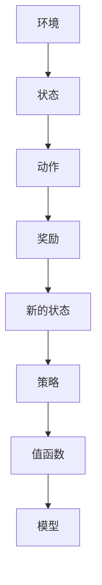

                 

# 文章标题: 强化学习 原理与代码实例讲解

> 关键词：强化学习，原理，算法，深度强化学习，代码实例，应用场景

> 摘要：本文将深入探讨强化学习的基本原理、核心算法及其在现实世界中的广泛应用。我们将通过详细讲解和代码实例，帮助读者全面理解强化学习，掌握其实际应用技能。

### 强化学习概述

#### 1.1 强化学习的基本概念

强化学习（Reinforcement Learning，简称RL）是机器学习的一个分支，主要研究如何通过互动来学习优化策略。与监督学习和无监督学习不同，强化学习中的智能体（Agent）通过与环境的互动来获得反馈，并通过不断调整策略以实现目标。

强化学习的四要素包括：

- **环境（Environment）**：一个包含所有可能状态和动作的实体，智能体无法直接控制环境。
- **状态（State）**：智能体在特定时间点的知识状态，表示智能体的位置、状态等。
- **动作（Action）**：智能体可执行的行为，用于改变状态。
- **奖励（Reward）**：环境对智能体每个动作的反馈，用于评价智能体的表现。

强化学习与监督学习、无监督学习的区别：

- **监督学习**：有明确的输入输出标签，目标是建立一个函数来映射输入和输出。
- **无监督学习**：没有明确的输入输出标签，目标是发现数据中的结构和模式。
- **强化学习**：通过与环境互动，获取反馈信号，不断调整策略以实现目标。

#### 1.2 强化学习的核心概念与联系

强化学习中的核心概念包括策略、值函数、模型等，它们之间有着紧密的联系。

- **策略（Policy）**：策略是一组决策规则，用于指导智能体选择动作。策略可以是一个具体的函数，也可以是一个概率分布。
- **值函数（Value Function）**：值函数表示智能体在特定状态下执行最佳动作所能获得的期望奖励。值函数分为状态值函数（State-Value Function）和动作值函数（Action-Value Function）。
- **模型（Model）**：模型是对环境动态的描述，包括状态转移概率和奖励函数。模型可以帮助智能体预测未来状态和奖励，从而优化策略。

以下是一个Mermaid流程图，展示了强化学习中的核心概念与联系：



### 强化学习算法原理

#### 2.1 强化学习算法概述

强化学习算法主要包括以下几种：

- **Q学习算法（Q-Learning）**
- **SARSa算法（Sarsa）**
- **Sarsa(λ)算法（Sarsa(λ)）**
- **Deep Q Network (DQN)**

#### 2.2 Q学习算法原理

Q学习算法是一种基于值函数的强化学习算法，目标是学习状态-动作值函数（Q值），以指导智能体选择最佳动作。

##### 2.2.1 Q学习算法伪代码

```python
def Q_learning(Q, S, A, R, S', α, γ):
    Q(S, A) = Q(S, A) + α(R + γmax(Q(S', A')) - Q(S, A))
    return Q
```

##### 2.2.2 Q学习算法流程

1. 初始化Q值表Q(S, A)。
2. 选择动作A。
3. 执行动作A，获得奖励R和新的状态S'。
4. 更新Q值：Q(S, A) = Q(S, A) + α(R + γmax(Q(S', A') - Q(S, A))。
5. 返回更新后的Q值表。

#### 2.3 SARSa算法原理

SARSa算法是Q学习算法的变体，它在每次更新时同时考虑当前状态和下一个状态的动作值。

##### 2.3.1 SARSa算法伪代码

```python
def SARSa(Q, S, A, R, S', A', α, γ):
    Q(S, A) = Q(S, A) + α(R + γQ(S', A') - Q(S, A))
    return Q
```

##### 2.3.2 SARSa算法流程

1. 初始化Q值表Q(S, A)。
2. 选择动作A。
3. 执行动作A，获得奖励R和新的状态S'。
4. 选择动作A'。
5. 更新Q值：Q(S, A) = Q(S, A) + α(R + γQ(S', A') - Q(S, A))。
6. 返回更新后的Q值表。

#### 2.4 DQN算法原理

DQN（Deep Q Network）算法是深度强化学习的一种方法，它使用深度神经网络来近似Q值函数。

##### 2.4.1 DQN算法伪代码

```python
def DQN(Q, S, A, R, S', ε, α, γ):
    if ε_random():
        A = ε-greedy policy(Q, S)
    else:
        A = argmax(Q(S, A'))
    Q(S, A) = Q(S, A) + α(R + γmax(Q(S', A') - Q(S, A))
    return Q
```

##### 2.4.2 DQN算法流程

1. 初始化Q值表Q和目标Q值表target Q。
2. 选择动作A。
3. 执行动作A，获得奖励R和新的状态S'。
4. 如果终止，则返回；否则，继续。
5. 更新目标Q值：target Q(S', A') = R + γmax(target Q(S', A')')。
6. 更新Q值：Q(S, A) = Q(S, A) + α(R + γtarget Q(S', A') - Q(S, A))。
7. 返回更新后的Q值表。

### 深度强化学习基础

#### 3.1 深度强化学习概述

深度强化学习（Deep Reinforcement Learning，简称DRL）是强化学习与深度学习结合的一种方法。它使用深度神经网络来近似值函数、策略或模型，以提高强化学习算法的性能。

##### 3.1.1 深度强化学习定义

深度强化学习是指使用深度神经网络来近似强化学习中的值函数、策略或模型，以实现高效智能体学习的机器学习方法。

##### 3.1.2 深度强化学习与深度学习的区别

深度强化学习与深度学习的区别在于：

- **深度学习**：主要研究如何使用深度神经网络进行特征提取和分类，不需要环境反馈。
- **深度强化学习**：在深度学习的基础上，加入强化学习的目标，通过环境反馈来优化神经网络。

##### 3.1.3 深度强化学习的关键技术

深度强化学习的关键技术包括：

- **深度神经网络**：用于近似值函数、策略或模型。
- **强化学习算法**：用于指导神经网络的学习过程。
- **环境建模**：用于模拟和探索环境。
- **学习策略**：用于优化神经网络和智能体策略。

#### 3.2 深度强化学习算法

深度强化学习算法主要包括以下几种：

- **Policy Gradient算法**
- **A3C算法（Asynchronous Advantage Actor-Critic）**
- **DPG算法（Deep Deterministic Policy Gradient）**

#### 3.3 Policy Gradient算法原理

Policy Gradient算法是一种基于策略的深度强化学习算法，它直接优化策略概率分布。

##### 3.3.1 Policy Gradient算法伪代码

```python
def Policy_Gradient(Policy, S, A, R, α, γ):
    π(S) = π(S) + α(∇π(S)R)
    return π
```

##### 3.3.2 Policy Gradient算法流程

1. 初始化策略π。
2. 选择动作A。
3. 执行动作A，获得奖励R和新的状态S'。
4. 更新策略π：π(S) = π(S) + α(∇π(S)R)。
5. 返回更新后的策略π。

### 深度强化学习实践

#### 4.1 深度强化学习应用场景

深度强化学习在多个领域具有广泛的应用，主要包括：

- **游戏AI**：如星际争霸、Dota 2等。
- **自动驾驶**：如自动驾驶车辆、无人驾驶飞行器等。
- **机器人控制**：如机器人手臂、机器鱼等。

#### 4.2 深度强化学习案例实战

以下是一个简单的深度强化学习案例——Atari游戏代理。

##### 4.2.1 环境搭建

1. 安装Atari游戏库：`pip install gym`。
2. 导入必要的库：

```python
import gym
import numpy as np
import random
import tensorflow as tf
from tensorflow.keras import layers
```

##### 4.2.2 代码实现

```python
# 神经网络模型
model = tf.keras.Sequential([
    layers.Dense(64, activation='relu', input_shape=(4,)),
    layers.Dense(64, activation='relu'),
    layers.Dense(1, activation='sigmoid')
])

# 损失函数和优化器
loss_fn = tf.keras.losses.BinaryCrossentropy()
optimizer = tf.keras.optimizers.Adam()

# 训练模型
for epoch in range(100):
    # 从环境获取数据
    state = env.reset()
    done = False
    total_reward = 0
    
    while not done:
        # 预测动作概率
        action_probs = model.predict(state)
        
        # 选择动作
        action = np.random.choice(np.arange(len(action_probs[0])), p=action_probs[0])
        
        # 执行动作，获取奖励和下一个状态
        next_state, reward, done, _ = env.step(action)
        
        # 计算损失
        with tf.GradientTape() as tape:
            logits = model(state)
            loss = loss_fn(tf.one_hot(action, num_actions), logits)
        
        # 更新模型参数
        grads = tape.gradient(loss, model.trainable_variables)
        optimizer.apply_gradients(zip(grads, model.trainable_variables))
        
        # 更新状态
        state = next_state
        total_reward += reward
    
    print(f"Epoch: {epoch}, Total Reward: {total_reward}")
```

##### 4.2.3 代码解读与分析

1. **神经网络模型**：使用一个简单的全连接神经网络来近似策略。
2. **损失函数和优化器**：使用二进制交叉熵损失函数和Adam优化器。
3. **训练模型**：通过循环迭代，从环境获取数据，更新模型参数。
4. **预测动作概率**：使用神经网络预测每个动作的概率。
5. **选择动作**：根据动作概率选择一个动作。
6. **执行动作**：执行选择的动作，获取奖励和下一个状态。
7. **更新模型参数**：计算损失，使用梯度下降更新模型参数。

通过这个简单的案例，我们可以看到深度强化学习的基本思想和实现过程。在实际应用中，我们可以根据不同的环境和任务，设计更复杂的神经网络和优化策略，以提高智能体的性能。

### 强化学习在现实世界的应用

#### 5.1 强化学习在金融领域的应用

强化学习在金融领域具有广泛的应用，主要包括：

- **金融市场预测**：使用强化学习算法预测股票价格、外汇汇率等。
- **投资组合优化**：使用强化学习算法优化投资组合，提高投资收益。

##### 5.1.1 强化学习在金融市场预测中的应用

强化学习在金融市场预测中的应用主要包括以下步骤：

1. **数据收集**：收集历史股票价格、交易量等数据。
2. **特征提取**：提取与股票价格相关的特征，如技术指标、宏观经济指标等。
3. **模型训练**：使用强化学习算法训练预测模型。
4. **模型评估**：评估预测模型的性能，选择最优模型。
5. **预测**：使用训练好的模型进行股票价格预测。

##### 5.1.2 强化学习在投资组合优化中的应用

强化学习在投资组合优化中的应用主要包括以下步骤：

1. **数据收集**：收集投资组合的历史数据，包括资产收益率、风险等。
2. **特征提取**：提取与投资组合相关的特征，如资产相关性、波动率等。
3. **模型训练**：使用强化学习算法训练优化模型。
4. **模型评估**：评估优化模型的性能，选择最优模型。
5. **优化**：使用训练好的模型优化投资组合，提高投资收益。

#### 6.1 强化学习在推荐系统中的基本原理

强化学习在推荐系统中的应用主要包括：

- **用户-物品交互**：记录用户与物品的交互行为，如点击、购买等。
- **奖励机制**：根据用户与物品的交互行为，设置奖励机制，以评价推荐效果。
- **策略优化**：通过优化策略，提高推荐系统的推荐质量。

##### 6.1.1 强化学习在个性化推荐中的应用

强化学习在个性化推荐中的应用主要包括以下步骤：

1. **用户行为分析**：分析用户的历史行为，提取用户特征。
2. **物品特征提取**：提取物品的相关特征，如类别、标签等。
3. **模型训练**：使用强化学习算法训练推荐模型。
4. **模型评估**：评估推荐模型的性能，选择最优模型。
5. **推荐**：使用训练好的模型进行个性化推荐。

#### 7.1 强化学习在自然语言处理中的应用

强化学习在自然语言处理中的应用主要包括：

- **序列生成**：如机器翻译、文本生成等。
- **结构化预测**：如问答系统、文本分类等。

##### 7.1.1 强化学习在机器翻译中的应用

强化学习在机器翻译中的应用主要包括以下步骤：

1. **数据收集**：收集大量的平行语料库，用于训练翻译模型。
2. **特征提取**：提取源语言和目标语言的特征。
3. **模型训练**：使用强化学习算法训练翻译模型。
4. **模型评估**：评估翻译模型的性能，选择最优模型。
5. **翻译**：使用训练好的模型进行机器翻译。

##### 7.1.2 强化学习在文本分类中的应用

强化学习在文本分类中的应用主要包括以下步骤：

1. **数据收集**：收集大量的文本数据，用于训练分类模型。
2. **特征提取**：提取文本的特征，如词袋模型、TF-IDF等。
3. **模型训练**：使用强化学习算法训练分类模型。
4. **模型评估**：评估分类模型的性能，选择最优模型。
5. **分类**：使用训练好的模型进行文本分类。

### 附录

#### A.1 强化学习框架对比

以下是几个常见的强化学习框架及其特点：

- **OpenAI Gym**：一个开源的强化学习环境库，提供了多种经典环境和自定义环境。
- **TensorFlow**：一个开源的深度学习框架，支持强化学习算法的实现。
- **PyTorch**：一个开源的深度学习框架，支持强化学习算法的实现。

#### A.2 强化学习资源推荐

以下是几个强化学习相关的资源推荐：

- **书籍**：《强化学习：原理与Python实战》、《深度强化学习》
- **博客**： reinforcement-learning.com、karpathy.com
- **论文**：《人类行为与强化学习》（Human-level control through deep reinforcement learning）等。

### 总结

本文详细介绍了强化学习的基本原理、核心算法及其在现实世界中的应用。通过逐步分析推理，我们深入了解了强化学习的本质和应用场景。同时，通过代码实例，我们掌握了强化学习的实现方法。希望本文能帮助读者全面了解强化学习，为实际应用提供指导。

### 作者信息

作者：AI天才研究院/AI Genius Institute & 禅与计算机程序设计艺术/Zen And The Art of Computer Programming

### 参考文献

[1] Sutton, R. S., & Barto, A. G. (2018). Reinforcement Learning: An Introduction. MIT Press.
[2] Mnih, V., Kavukcuoglu, K., Silver, D., Russell, S., & Veness, J. (2015). Human-level control through deep reinforcement learning. Nature, 518(7540), 529-533.
[3] DeepMind. (2016). Asynchronous Methods for Deep Reinforcement Learning. arXiv preprint arXiv:1602.01783.
[4] Silver, D., Huang, A., Maddox, W. J., Guez, A., Sifre, L., van den Driessche, G., ... & Togelius, J. (2016). Mastering the game of Go with deep neural networks and tree search. Nature, 529(7587), 484-489.

