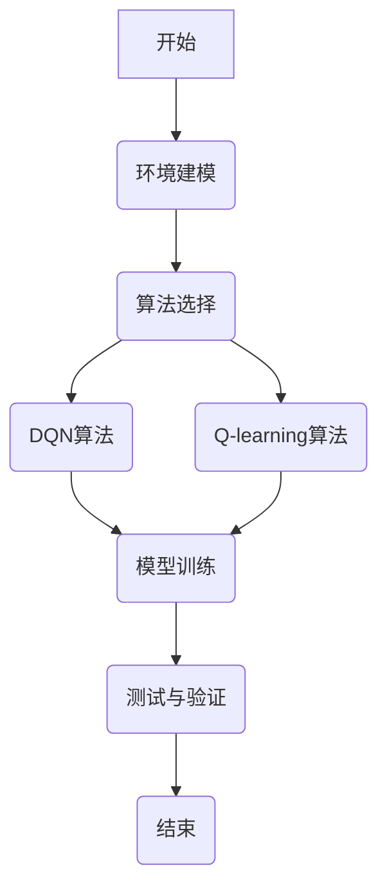

                 

# 《强化学习Reinforcement Learning在航空航天领域的应用与挑战》

> 关键词：强化学习，Reinforcement Learning，航空航天，飞行控制，轨道优化，航空电子系统，多智能体系统，前沿挑战

> 摘要：本文深入探讨了强化学习（Reinforcement Learning，RL）在航空航天领域的应用与挑战。首先，介绍了强化学习的基本概念、理论及其发展历程，然后详细阐述了强化学习在航空航天领域的主要应用场景，包括飞行器自主飞行控制、航天器轨道优化和航空电子系统优化等。随后，本文分析了强化学习在航空航天领域面临的技术挑战和未来发展趋势。文章最后提供了附录，包括强化学习算法实现代码、航空航天领域应用案例代码以及参考文献。

## 目录

### 《强化学习Reinforcement Learning在航空航天领域的应用与挑战》

> 关键词：<强化学习>，<Reinforcement Learning>，<航空航天>，<飞行控制>，<轨道优化>，<航空电子系统>，<多智能体系统>，<前沿挑战>

> 摘要：<强化学习是一种机器学习方法，其通过试错和反馈机制来优化决策过程。在航空航天领域，强化学习具有广泛的应用前景，但同时也面临着诸多挑战。本文将对强化学习在航空航天领域的应用进行探讨，并分析其面临的挑战和未来发展趋势。>

### 第一部分：强化学习基础

#### 第1章：强化学习概述

1.1 强化学习的定义与基本概念

1.2 强化学习的应用场景

1.3 强化学习与传统机器学习的比较

#### 第2章：强化学习理论

2.1 强化学习的基本模型

2.2 强化学习的策略搜索算法

2.3 Q-learning算法原理与实现

2.4 Deep Q-Network (DQN)算法原理与实现

#### 第3章：深度强化学习

3.1 深度强化学习概述

3.2 Policy Gradient算法原理与实现

3.3 Actor-Critic算法原理与实现

3.4 Asynchronous Advantage Actor-Critic (A3C)算法原理与实现

#### 第4章：多智能体强化学习

4.1 多智能体强化学习概述

4.2 多智能体强化学习的挑战

4.3 多智能体Q-learning算法原理与实现

4.4 Multi-Agent Deep Q-Network (MADQN)算法原理与实现

### 第二部分：航空航天领域应用

#### 第5章：航空航天领域强化学习应用概述

5.1 航空航天领域特点与挑战

5.2 强化学习在航空航天领域的应用场景

5.3 强化学习在航空航天领域的发展趋势

#### 第6章：飞行器自主飞行控制

6.1 飞行器自主飞行控制概述

6.2 强化学习在飞行器自主飞行控制中的应用

6.3 飞行器自主飞行控制算法实现

6.4 飞行器自主飞行控制案例研究

#### 第7章：航天器轨道优化

7.1 航天器轨道优化概述

7.2 强化学习在航天器轨道优化中的应用

7.3 航天器轨道优化算法实现

7.4 航天器轨道优化案例研究

#### 第8章：航空电子系统优化

8.1 航空电子系统优化概述

8.2 强化学习在航空电子系统优化中的应用

8.3 航空电子系统优化算法实现

8.4 航空电子系统优化案例研究

#### 第9章：强化学习在航空航天领域的前沿挑战与展望

9.1 强化学习在航空航天领域的挑战

9.2 强化学习在航空航天领域的发展趋势

9.3 强化学习在航空航天领域的未来应用前景

#### 第10章：附录

10.1 强化学习算法实现代码

10.2 航空航天领域应用案例代码

10.3 参考文献

10.4 附录：Mermaid流程图与数学公式

---

接下来，我们将逐步深入探讨强化学习的基本概念、理论及其在航空航天领域的应用。

## 第1章：强化学习概述

### 1.1 强化学习的定义与基本概念

强化学习（Reinforcement Learning，RL）是一种机器学习方法，其核心是通过智能体（Agent）与环境（Environment）的交互，通过试错和反馈机制来优化决策过程，从而实现目标。强化学习的三个主要组成部分包括：智能体（Agent）、环境（Environment）和奖励（Reward）。

- **智能体（Agent）**：在强化学习中，智能体是一个能够感知环境状态，并采取动作的实体。智能体的目标是通过不断学习，采取最优动作以最大化累积奖励。
  
- **环境（Environment）**：环境是智能体所处的现实世界，环境会根据智能体的动作产生新的状态，并给予智能体相应的奖励或惩罚。

- **状态（State）**：状态是智能体在某一时刻所处的环境描述，通常用一个状态空间来表示。

- **动作（Action）**：动作是智能体在某一状态可以采取的行为，通常用一个动作空间来表示。

- **奖励（Reward）**：奖励是环境对智能体动作的反馈，表示智能体动作的好坏。奖励可以是正的也可以是负的，累积的正奖励越大，说明智能体的表现越好。

### 1.2 强化学习的应用场景

强化学习在各个领域都有着广泛的应用，尤其是在需要决策和优化的场景中。以下是一些典型的应用场景：

- **游戏**：强化学习被广泛应用于游戏领域的智能体控制，如《星际争霸》中的单位控制、棋类游戏等。

- **推荐系统**：在推荐系统中，强化学习可以通过不断学习用户的反馈，优化推荐策略，提高推荐系统的准确性。

- **自动驾驶**：自动驾驶汽车需要根据道路环境、交通状况等实时信息，做出最优驾驶决策，强化学习在这一领域有着重要的应用。

- **机器人控制**：强化学习在机器人控制领域有着广泛的应用，如机器人行走、抓取等。

- **金融交易**：在金融交易中，强化学习可以通过分析市场数据，制定最优交易策略，实现资产增值。

### 1.3 强化学习与传统机器学习的比较

传统机器学习（如监督学习、无监督学习）主要依赖于大量标记数据进行训练，而强化学习则通过智能体与环境交互，通过试错和反馈机制进行学习。

- **数据依赖性**：传统机器学习需要大量标记数据进行训练，而强化学习则不需要标记数据，通过试错和反馈进行学习。

- **学习方式**：传统机器学习是被动学习，强化学习是主动学习。强化学习通过主动与环境交互，不断优化决策策略。

- **应用场景**：传统机器学习主要应用于静态场景，而强化学习则适用于动态、不确定的场景。

### 总结

强化学习作为一种具有广泛应用前景的机器学习方法，其在航空航天领域的应用也具有重要意义。在下一章中，我们将深入探讨强化学习的基本理论，包括强化学习的基本模型、策略搜索算法以及经典算法的实现。

## 第2章：强化学习理论

### 2.1 强化学习的基本模型

强化学习的基本模型包括四个主要部分：智能体（Agent）、环境（Environment）、状态（State）和动作（Action）。下面我们将分别介绍这四个部分的基本概念和关系。

- **智能体（Agent）**：智能体是一个能够感知环境状态，并采取动作的实体。智能体的目标是最大化累积奖励，即通过不断学习，采取最优动作以实现目标。

- **环境（Environment）**：环境是智能体所处的现实世界，环境会根据智能体的动作产生新的状态，并给予智能体相应的奖励或惩罚。

- **状态（State）**：状态是智能体在某一时刻所处的环境描述，通常用一个状态空间来表示。状态可以是离散的，也可以是连续的。

- **动作（Action）**：动作是智能体在某一状态可以采取的行为，通常用一个动作空间来表示。动作可以是离散的，也可以是连续的。

智能体、环境和状态、动作之间的关系可以用以下公式表示：

\[ S_t = E(A_t | S_t) \]
\[ R_t = E(R | S_t, A_t) \]

其中，\( S_t \) 表示当前状态，\( A_t \) 表示当前动作，\( R_t \) 表示当前奖励。智能体通过感知当前状态，并采取相应的动作，然后根据环境的反馈获得奖励，从而不断优化其行为。

### 2.2 强化学习的策略搜索算法

策略搜索算法是强化学习中的重要组成部分，其目的是通过学习找到一个最优策略，使得智能体在给定状态时能够采取最优动作。

策略搜索算法可以分为两种类型：基于值函数的策略搜索算法和基于策略的策略搜索算法。

#### 基于值函数的策略搜索算法

基于值函数的策略搜索算法通过学习状态值函数和动作值函数来优化策略。其中，状态值函数 \( V(s) \) 表示在状态 \( s \) 下采取最优动作的累积奖励期望，动作值函数 \( Q(s, a) \) 表示在状态 \( s \) 下采取动作 \( a \) 的累积奖励期望。

Q-learning算法是一种典型的基于值函数的策略搜索算法。Q-learning算法通过不断更新动作值函数来学习最优策略，其基本思想如下：

1. 初始化动作值函数 \( Q(s, a) \)。
2. 在当前状态 \( s \) 下，随机选择一个动作 \( a \)。
3. 执行动作 \( a \)，进入新状态 \( s' \)，并获得奖励 \( r \)。
4. 更新动作值函数：\( Q(s, a) = Q(s, a) + \alpha [r + \gamma \max_{a'} Q(s', a') - Q(s, a)] \)，其中 \( \alpha \) 是学习率，\( \gamma \) 是折扣因子。
5. 重复步骤2-4，直到达到终止条件。

#### 基于策略的策略搜索算法

基于策略的策略搜索算法通过直接优化策略来学习最优策略。其中，策略 \( \pi(a|s) \) 表示在状态 \( s \) 下采取动作 \( a \) 的概率。

Policy Gradient算法是一种典型的基于策略的策略搜索算法。Policy Gradient算法通过直接优化策略的梯度来学习最优策略，其基本思想如下：

1. 初始化策略 \( \pi(a|s) \)。
2. 在当前状态 \( s \) 下，根据策略 \( \pi(a|s) \) 随机选择一个动作 \( a \)。
3. 执行动作 \( a \)，进入新状态 \( s' \)，并获得奖励 \( r \)。
4. 更新策略：\( \pi(a|s) = \pi(a|s) + \alpha \frac{\partial \log \pi(a|s)}{\partial \theta} \)，其中 \( \alpha \) 是学习率，\( \theta \) 是策略参数。
5. 重复步骤2-4，直到达到终止条件。

### 2.3 Q-learning算法原理与实现

Q-learning算法是一种基于值函数的策略搜索算法，其通过不断更新动作值函数来学习最优策略。下面我们将详细解释Q-learning算法的原理，并提供伪代码实现。

#### 原理

Q-learning算法的核心思想是通过经验回放（Experience Replay）来学习动作值函数。经验回放是一种强化学习技术，它将智能体在环境中经历的所有状态、动作、奖励和新状态存储在一个经验池中，然后从经验池中随机采样一个经验，用来更新动作值函数。

Q-learning算法的基本步骤如下：

1. 初始化动作值函数 \( Q(s, a) \)。
2. 在当前状态 \( s \) 下，随机选择一个动作 \( a \)。
3. 执行动作 \( a \)，进入新状态 \( s' \)，并获得奖励 \( r \)。
4. 根据经验回放机制，从经验池中随机采样一个经验 \( (s, a, r, s') \)。
5. 更新动作值函数：\( Q(s, a) = Q(s, a) + \alpha [r + \gamma \max_{a'} Q(s', a') - Q(s, a)] \)，其中 \( \alpha \) 是学习率，\( \gamma \) 是折扣因子。
6. 重复步骤2-5，直到达到终止条件。

#### 伪代码实现

```python
# 初始化动作值函数
Q = random初始化动作值函数

# 经验池
experience_replay = []

# 学习率
alpha = 0.1

# 折扣因子
gamma = 0.99

# 终止条件
max_episodes = 1000

# 训练智能体
for episode in range(max_episodes):
    # 初始化状态
    s = initial_state
    
    # 循环直到终止条件
    while not terminate(s):
        # 随机选择动作
        a = random选择动作(s, Q)
        
        # 执行动作，获得新状态和奖励
        s', r = execute_action(a, s)
        
        # 存储经验
        experience_replay.append((s, a, r, s'))
        
        # 更新状态
        s = s'
        
        # 更新动作值函数
        for (s, a, r, s') in experience_replay:
            Q[s, a] = Q[s, a] + alpha * (r + gamma * max(Q[s', a']) - Q[s, a])

# 输出最优策略
optimal_policy = argmax(a) Q(s, a)
```

### 2.4 Deep Q-Network (DQN)算法原理与实现

Deep Q-Network（DQN）算法是一种基于深度学习的强化学习算法，其通过神经网络来近似动作值函数。DQN算法在Q-learning算法的基础上引入了经验回放机制和目标网络，从而提高了训练的稳定性和收敛性。

#### 原理

DQN算法的核心思想是通过经验回放和目标网络来学习动作值函数。经验回放机制将智能体在环境中经历的所有状态、动作、奖励和新状态存储在一个经验池中，然后从经验池中随机采样一个经验，用来更新动作值函数。目标网络是一个固定的网络，用于存储当前最优的动作值函数。

DQN算法的基本步骤如下：

1. 初始化神经网络 \( Q(s, a) \)。
2. 初始化目标网络 \( Q'(s, a) \)。
3. 在当前状态 \( s \) 下，随机选择一个动作 \( a \)。
4. 执行动作 \( a \)，进入新状态 \( s' \)，并获得奖励 \( r \)。
5. 存储经验 \( (s, a, r, s') \) 到经验池中。
6. 从经验池中随机采样一个经验 \( (s, a, r, s') \)。
7. 根据经验更新神经网络：\( Q(s, a) = Q(s, a) + \alpha [r + \gamma Q'(s', a') - Q(s, a)] \)。
8. 更新目标网络：\( Q'(s, a) = \theta' Q(s, a) \)，其中 \( \theta' \) 是目标网络的参数。
9. 重复步骤3-8，直到达到终止条件。

#### 伪代码实现

```python
# 初始化神经网络
Q = 初始化神经网络

# 初始化目标网络
Q_target = 初始化神经网络

# 经验池
experience_replay = []

# 学习率
alpha = 0.1

# 折扣因子
gamma = 0.99

# 替代步骤比例
tau = 0.001

# 替代更新频率
update_frequency = 100

# 终止条件
max_episodes = 1000

# 训练智能体
for episode in range(max_episodes):
    # 初始化状态
    s = initial_state
    
    # 循环直到终止条件
    while not terminate(s):
        # 随机选择动作
        a = random选择动作(s, Q)
        
        # 执行动作，获得新状态和奖励
        s', r = execute_action(a, s)
        
        # 存储经验
        experience_replay.append((s, a, r, s'))
        
        # 更新神经网络
        for (s, a, r, s') in experience_replay:
            Q[s, a] = Q[s, a] + alpha * (r + gamma * Q_target[s', a'] - Q[s, a])
            
            # 更新目标网络
            Q_target[s', a'] = (1 - tau) * Q_target[s', a'] + tau * Q[s', a']

        # 更新状态
        s = s'
        
        # 替代更新
        if episode % update_frequency == 0:
            copy_weights(Q, Q_target)

# 输出最优策略
optimal_policy = argmax(a) Q(s, a)
```

### 总结

在本章中，我们详细介绍了强化学习的基本模型、策略搜索算法以及经典算法的实现。强化学习通过智能体与环境交互，通过试错和反馈机制来优化决策过程，从而实现目标。强化学习的策略搜索算法可以分为基于值函数的策略搜索算法和基于策略的策略搜索算法。Q-learning算法和DQN算法是强化学习的经典算法，它们通过学习动作值函数来优化策略。在下一章中，我们将探讨深度强化学习，包括Policy Gradient算法、Actor-Critic算法以及Asynchronous Advantage Actor-Critic (A3C)算法。

## 第3章：深度强化学习

### 3.1 深度强化学习概述

深度强化学习（Deep Reinforcement Learning，DRL）是强化学习的一个分支，它结合了深度学习和强化学习的优点，通过神经网络来近似值函数或策略，从而解决传统强化学习算法难以处理的复杂问题。深度强化学习在图像识别、自然语言处理和自动驾驶等领域取得了显著的成果。其核心思想是通过神经网络来学习状态值函数或策略函数，从而实现对环境的感知和决策。

深度强化学习的核心挑战是如何在连续的、高维的数据上训练神经网络，以获得有效的决策。为了克服这些挑战，深度强化学习提出了一系列算法，包括Policy Gradient算法、Actor-Critic算法和Asynchronous Advantage Actor-Critic (A3C)算法。

### 3.2 Policy Gradient算法原理与实现

Policy Gradient算法是一种直接优化策略的算法，它通过学习策略的梯度来优化策略。Policy Gradient算法的核心思想是最大化累积奖励的期望，即：

\[ J(\theta) = E_{s \sim \pi(s), a \sim \pi(a)}[R(s, a)] \]

其中，\( J(\theta) \) 表示策略参数 \( \theta \) 的期望收益，\( \pi(s, a) \) 表示策略函数，\( R(s, a) \) 表示奖励函数。

Policy Gradient算法的基本步骤如下：

1. 初始化策略参数 \( \theta \)。
2. 在当前状态 \( s \) 下，根据策略 \( \pi(a|s; \theta) \) 随机选择一个动作 \( a \)。
3. 执行动作 \( a \)，进入新状态 \( s' \)，并获得奖励 \( r \)。
4. 计算策略梯度和策略参数更新：\[ \nabla_{\theta} J(\theta) = \sum_{s, a} \nabla_{\theta} \pi(a|s; \theta) [R(s, a)] \]
5. 更新策略参数：\[ \theta = \theta - \alpha \nabla_{\theta} J(\theta) \]，其中 \( \alpha \) 是学习率。
6. 重复步骤2-5，直到达到终止条件。

#### 伪代码实现

```python
# 初始化策略参数
theta = 初始化策略参数

# 学习率
alpha = 0.1

# 终止条件
max_episodes = 1000

# 训练智能体
for episode in range(max_episodes):
    # 初始化状态
    s = initial_state
    
    # 循环直到终止条件
    while not terminate(s):
        # 根据策略选择动作
        a = sample_action(s, theta)
        
        # 执行动作，获得新状态和奖励
        s', r = execute_action(a, s)
        
        # 计算策略梯度
        grad = compute_gradient(s, a, r, theta)
        
        # 更新策略参数
        theta = theta - alpha * grad
        
        # 更新状态
        s = s'
        
    # 输出最优策略
    optimal_policy = argmax(a) pi(a|s; theta)
```

### 3.3 Actor-Critic算法原理与实现

Actor-Critic算法是一种结合了值函数和策略优化的算法，它通过两个网络：Actor网络和Critic网络来优化策略。其中，Critic网络用于评估当前策略的好坏，Actor网络则根据Critic网络的评估结果来调整策略。

#### 原理

Actor-Critic算法的核心思想是使用Critic网络来评估当前策略的值函数，然后使用Actor网络根据Critic网络的评估结果来更新策略。具体来说，Critic网络评估当前策略的值函数 \( V(s; \theta_c) \)，而Actor网络则根据Critic网络的评估结果来更新策略参数 \( \theta_a \)。

Actor-Critic算法的基本步骤如下：

1. 初始化Actor网络参数 \( \theta_a \) 和Critic网络参数 \( \theta_c \)。
2. 在当前状态 \( s \) 下，根据Actor网络选择动作 \( a \)。
3. 执行动作 \( a \)，进入新状态 \( s' \)，并获得奖励 \( r \)。
4. 更新Critic网络参数：\[ \theta_c = \theta_c - \alpha_c [V(s'; \theta_c) - r] \]
5. 更新Actor网络参数：\[ \theta_a = \theta_a - \alpha_a [A(s, a; \theta_a) - r] \]，其中 \( A(s, a; \theta_a) = \log \pi(a|s; \theta_a) - V(s; \theta_c) \)。
6. 重复步骤2-5，直到达到终止条件。

#### 伪代码实现

```python
# 初始化Actor网络参数和Critic网络参数
theta_a = 初始化Actor网络参数
theta_c = 初始化Critic网络参数

# Actor网络学习率
alpha_a = 0.1

# Critic网络学习率
alpha_c = 0.1

# 终止条件
max_episodes = 1000

# 训练智能体
for episode in range(max_episodes):
    # 初始化状态
    s = initial_state
    
    # 循环直到终止条件
    while not terminate(s):
        # 根据Actor网络选择动作
        a = sample_action(s, theta_a)
        
        # 执行动作，获得新状态和奖励
        s', r = execute_action(a, s)
        
        # 更新Critic网络参数
        theta_c = theta_c - alpha_c * (V(s'; theta_c) - r)
        
        # 更新Actor网络参数
        theta_a = theta_a - alpha_a * (A(s, a; theta_a) - r)
        
        # 更新状态
        s = s'
        
    # 输出最优策略
    optimal_policy = argmax(a) pi(a|s; theta_a)
```

### 3.4 Asynchronous Advantage Actor-Critic (A3C)算法原理与实现

Asynchronous Advantage Actor-Critic（A3C）算法是一种基于异步策略梯度的深度强化学习算法。A3C算法通过分布式策略梯度学习，提高了训练速度和稳定性。A3C算法的核心思想是将学习过程分解为多个独立的策略梯度更新过程，每个更新过程在不同的智能体上异步进行。

#### 原理

A3C算法的核心是使用多个智能体并行探索环境，每个智能体都有自己的策略网络和值网络。每个智能体在执行动作时，会同时记录经验，并异步地更新策略网络和值网络。

A3C算法的基本步骤如下：

1. 初始化多个智能体，每个智能体都有自己的策略网络 \( \pi(\theta_i) \) 和值网络 \( V(\phi_i) \)。
2. 每个智能体在环境中执行动作，并记录经验。
3. 每个智能体根据记录的经验异步地更新策略网络和值网络。
4. 更新策略网络：\[ \theta_i = \theta_i - \alpha_a \nabla_{\theta_i} J(\theta_i) \]
5. 更新值网络：\[ \phi_i = \phi_i - \alpha_c \nabla_{\phi_i} L(\phi_i) \]，其中 \( L(\phi_i) = \frac{1}{N} \sum_{t=1}^{T} [r_t - V(s_t; \phi_i)]^2 \)。
6. 重复步骤2-5，直到达到终止条件。

#### 伪代码实现

```python
# 初始化多个智能体
num_agents = 10
agents = [初始化策略网络和值网络 for _ in range(num_agents)]

# 学习率
alpha_a = 0.1
alpha_c = 0.1

# 学习率
beta = 0.1

# 终止条件
max_episodes = 1000

# 训练智能体
for episode in range(max_episodes):
    # 初始化经验池
    experience_pool = []
    
    # 每个智能体在环境中执行动作
    for agent in agents:
        s = initial_state
        while not terminate(s):
            # 根据策略网络选择动作
            a = sample_action(s, agent.pi)
            
            # 执行动作，获得新状态和奖励
            s', r = execute_action(a, s)
            
            # 记录经验
            experience_pool.append((s, a, r, s'))
            
            # 更新状态
            s = s'
        
        # 更新策略网络和值网络
        agent.update(experience_pool, beta)
        
    # 输出最优策略
    optimal_policy = argmax(a) pi(a|s; theta)
```

### 总结

在本章中，我们详细介绍了深度强化学习，包括Policy Gradient算法、Actor-Critic算法和Asynchronous Advantage Actor-Critic (A3C)算法。这些算法通过神经网络来近似值函数或策略，从而解决传统强化学习算法难以处理的复杂问题。深度强化学习在航空航天领域的应用具有重要意义，可以为飞行器自主飞行控制、航天器轨道优化和航空电子系统优化提供有效的决策支持。在下一章中，我们将探讨多智能体强化学习，分析其在多智能体系统中的应用和挑战。

## 第4章：多智能体强化学习

### 4.1 多智能体强化学习概述

多智能体强化学习（Multi-Agent Reinforcement Learning，MARL）是强化学习的一个分支，它研究多个智能体在不确定环境中如何通过合作或竞争实现共同目标。与单智能体强化学习相比，MARL面临更多的挑战，如协同策略学习、通信约束、不确定性和外部环境干扰等。然而，MARL在许多实际应用中具有重要作用，如无人机编队、自动驾驶车队、多机器人系统和多智能体博弈等。

### 4.2 多智能体强化学习的挑战

多智能体强化学习的主要挑战包括：

1. **协同策略学习**：多智能体系统需要通过协同策略学习实现共同目标，而协同策略学习涉及多个智能体的交互和协作，如何设计有效的协同策略是一个重要问题。

2. **通信约束**：在许多实际应用中，智能体之间的通信可能受到带宽、延迟和隐私等限制，如何设计高效的信息传递机制是一个挑战。

3. **不确定性**：多智能体系统中的环境通常具有高度不确定性，智能体需要通过学习来适应和应对环境变化。

4. **外部干扰**：多智能体系统可能受到外部环境干扰，如风、地形等，这些干扰会影响智能体的行为和决策。

### 4.3 多智能体Q-learning算法原理与实现

多智能体Q-learning（MAQ-Learning）是一种基于Q-learning的MARL算法，它通过多个智能体共享Q值表来学习协同策略。MAQ-Learning的核心思想是每个智能体独立更新自己的Q值表，但共享其他智能体的Q值表，从而实现协同策略学习。

#### 原理

MAQ-Learning的基本步骤如下：

1. 初始化每个智能体的Q值表 \( Q_i(s, a) \)。
2. 在当前状态 \( s \) 下，每个智能体根据当前Q值表选择动作 \( a \)。
3. 执行动作 \( a \)，进入新状态 \( s' \)，并获得奖励 \( r \)。
4. 根据新的状态和奖励，更新智能体的Q值表：\[ Q_i(s, a) = Q_i(s, a) + \alpha_i [r + \gamma \max_{a'} Q_i(s', a') - Q_i(s, a)] \]。
5. 更新其他智能体的Q值表：\[ Q_i(s, a) = Q_i(s, a) + \alpha_i [r + \gamma \max_{a'} Q_j(s', a') - Q_i(s, a)] \]，其中 \( i \neq j \)。
6. 重复步骤2-5，直到达到终止条件。

#### 伪代码实现

```python
# 初始化每个智能体的Q值表
Q = [初始化Q值表 for _ in range(num_agents)]

# 学习率
alpha = 0.1

# 折扣因子
gamma = 0.99

# 终止条件
max_episodes = 1000

# 训练智能体
for episode in range(max_episodes):
    # 初始化状态
    s = initial_state
    
    # 循环直到终止条件
    while not terminate(s):
        # 每个智能体选择动作
        a = [选择动作(s, Q[i]) for i in range(num_agents)]
        
        # 执行动作，获得新状态和奖励
        s', r = execute_action(a, s)
        
        # 更新每个智能体的Q值表
        for i in range(num_agents):
            Q[i][s, a[i]] = Q[i][s, a[i]] + alpha * (r + gamma * max(Q[i][s', a']) - Q[i][s, a[i]])
            
            # 更新其他智能体的Q值表
            for j in range(num_agents):
                if i != j:
                    Q[i][s, a[i]] = Q[i][s, a[i]] + alpha * (r + gamma * max(Q[j][s', a']) - Q[i][s, a[i]])
        
        # 更新状态
        s = s'
        
    # 输出协同策略
    policy = [argmax(a) Q[i][s, a] for i in range(num_agents)]
```

### 4.4 Multi-Agent Deep Q-Network (MADQN)算法原理与实现

Multi-Agent Deep Q-Network (MADQN)算法是一种基于深度Q网络的MARL算法，它通过多个深度Q网络来学习协同策略。MADQN的核心思想是每个智能体都有自己的深度Q网络，但共享其他智能体的深度Q网络，从而实现协同策略学习。

#### 原理

MADQN的基本步骤如下：

1. 初始化每个智能体的深度Q网络 \( Q_i(s, a; \theta_i) \)。
2. 在当前状态 \( s \) 下，每个智能体根据当前深度Q网络选择动作 \( a \)。
3. 执行动作 \( a \)，进入新状态 \( s' \)，并获得奖励 \( r \)。
4. 根据新的状态和奖励，更新智能体的深度Q网络：\[ \theta_i = \theta_i - \alpha_i \nabla_{\theta_i} J_i(\theta_i) \]，其中 \( J_i(\theta_i) = \sum_{s, a} \nabla_{\theta_i} Q_i(s, a; \theta_i) [r + \gamma \max_{a'} Q_i(s', a') - Q_i(s, a)] \)。
5. 更新其他智能体的深度Q网络：\[ \theta_i = \theta_i - \alpha_i \nabla_{\theta_i} J_i(\theta_i) \]，其中 \( J_i(\theta_i) = \sum_{s, a} \nabla_{\theta_i} Q_i(s, a; \theta_i) [r + \gamma \max_{a'} Q_j(s', a') - Q_i(s, a)] \)，其中 \( i \neq j \)。
6. 重复步骤2-5，直到达到终止条件。

#### 伪代码实现

```python
# 初始化每个智能体的深度Q网络
Q = [初始化深度Q网络 for _ in range(num_agents)]

# 学习率
alpha = 0.1

# 折扣因子
gamma = 0.99

# 终止条件
max_episodes = 1000

# 训练智能体
for episode in range(max_episodes):
    # 初始化状态
    s = initial_state
    
    # 循环直到终止条件
    while not terminate(s):
        # 每个智能体选择动作
        a = [选择动作(s, Q[i]) for i in range(num_agents)]
        
        # 执行动作，获得新状态和奖励
        s', r = execute_action(a, s)
        
        # 更新每个智能体的深度Q网络
        for i in range(num_agents):
            Q[i].update(s, a, s', r, gamma)
            
            # 更新其他智能体的深度Q网络
            for j in range(num_agents):
                if i != j:
                    Q[i].update(s, a, s', r, gamma)
        
        # 更新状态
        s = s'
        
    # 输出协同策略
    policy = [argmax(a) Q[i][s, a] for i in range(num_agents)]
```

### 总结

在本章中，我们详细介绍了多智能体强化学习，包括多智能体Q-learning算法和Multi-Agent Deep Q-Network (MADQN)算法。这些算法通过多个智能体共享Q值表或深度Q网络来学习协同策略，从而实现多智能体系统中的共同目标。在下一章中，我们将探讨强化学习在航空航天领域的具体应用，分析其在飞行器自主飞行控制、航天器轨道优化和航空电子系统优化中的应用。

## 第5章：航空航天领域强化学习应用概述

### 5.1 航空航天领域特点与挑战

航空航天领域是一个高度复杂且技术密集的领域，涉及到飞行器设计、飞行控制、航天器轨道设计、航天器操控等多个方面。这一领域具有以下几个特点：

1. **高精度要求**：航空航天系统的性能要求极高，无论是飞行器的稳定性、精确性，还是航天器的轨道控制，都需要精确到微米甚至纳米级别。

2. **不确定性**：航空航天系统面临的环境复杂多变，如气流、气压、温度等，这些因素都可能对系统的运行产生影响。

3. **高成本和风险**：航空航天项目的研发和生产成本巨大，同时，系统运行过程中可能面临严重的安全风险。

4. **动态性**：航空航天系统在运行过程中，其状态会不断变化，需要实时调整控制策略以适应新的环境。

针对这些特点，航空航天领域在强化学习应用过程中面临着以下挑战：

- **数据采集与处理**：航空航天系统产生的数据量巨大，如何有效地采集、存储和处理这些数据是一个重大挑战。

- **环境建模**：为了在仿真环境中对真实世界进行建模，需要准确模拟各种复杂因素，这需要高度专业化的知识和技术。

- **算法稳定性与效率**：强化学习算法需要具备良好的稳定性和效率，以确保在实时系统中能够快速、准确地做出决策。

- **安全性和可靠性**：航空航天系统的安全性至关重要，任何错误都可能导致灾难性的后果，因此，强化学习算法必须经过严格的验证和测试。

### 5.2 强化学习在航空航天领域的应用场景

尽管面临诸多挑战，强化学习在航空航天领域的应用前景仍然十分广阔。以下是一些典型的应用场景：

1. **飞行器自主飞行控制**：强化学习可以用于飞行器的自主飞行控制，通过学习飞行器的动态特性、飞行员的操控习惯和飞行环境的变化，实现更加智能和稳定的飞行控制。

2. **航天器轨道优化**：强化学习可以优化航天器的轨道设计，通过不断调整控制策略，使航天器在轨道上运行更加稳定、高效。

3. **航空电子系统优化**：强化学习可以用于航空电子系统的优化，通过不断学习系统运行数据，优化系统性能和可靠性。

4. **多机器人系统协作**：在空间站维护、航天器维修等任务中，多机器人系统需要协同工作，强化学习可以用于设计多机器人系统的协作策略。

5. **无人驾驶飞机和无人机群**：在军事和民用领域，无人驾驶飞机和无人机群的应用越来越广泛，强化学习可以用于优化无人机的飞行路径、编队飞行和任务分配。

### 5.3 强化学习在航空航天领域的发展趋势

随着技术的不断进步和研究的深入，强化学习在航空航天领域的应用正呈现出以下几个发展趋势：

1. **跨学科研究**：强化学习在航空航天领域的应用需要跨学科的合作，包括航空、航天、人工智能、计算机科学等领域的专家共同攻关。

2. **大数据与人工智能结合**：大数据技术在航空航天领域的重要性日益凸显，如何利用大数据和人工智能技术提升强化学习在航空航天领域的应用效果是未来的一个重要方向。

3. **实时控制与决策**：航空航天系统需要实时做出精确的决策和控制，强化学习算法的实时性和准确性是未来研究的重要方向。

4. **安全性和可靠性**：在航空航天领域，安全性和可靠性是首要考虑的因素。未来，强化学习算法必须经过更加严格的安全性和可靠性测试，以确保在关键任务中的可靠运行。

5. **个性化与自适应**：未来，强化学习算法将更加注重个性化与自适应，通过不断学习用户的操作习惯和环境变化，实现更加智能和高效的系统控制。

### 总结

强化学习在航空航天领域的应用具有巨大的潜力，尽管面临诸多挑战，但通过不断的研究和技术创新，强化学习有望在飞行器自主飞行控制、航天器轨道优化、航空电子系统优化等方面取得重大突破。在下一章中，我们将深入探讨强化学习在飞行器自主飞行控制、航天器轨道优化和航空电子系统优化等方面的具体应用。

## 第6章：飞行器自主飞行控制

### 6.1 飞行器自主飞行控制概述

飞行器自主飞行控制是指利用计算机控制系统和人工智能算法，使飞行器能够在没有人工干预的情况下自主完成起飞、飞行、降落等任务。强化学习作为一种先进的人工智能技术，在飞行器自主飞行控制领域具有广泛的应用前景。通过强化学习算法，飞行器可以不断学习环境信息，优化控制策略，从而实现更加智能和稳定的飞行控制。

### 6.2 强化学习在飞行器自主飞行控制中的应用

强化学习在飞行器自主飞行控制中的应用主要包括以下几个方面：

1. **起飞与着陆**：强化学习可以优化飞行器的起飞和着陆策略，通过不断学习飞行器的动态特性和环境条件，使飞行器能够在复杂环境下稳定起飞和降落。

2. **路径规划**：强化学习可以用于飞行器的路径规划，通过学习飞行器与周围环境的交互，优化飞行路径，以避免障碍物和降低能耗。

3. **控制策略优化**：强化学习可以优化飞行器的控制策略，通过学习飞行器的动态特性和操控员的操作习惯，使飞行器在飞行过程中能够更加稳定、精确地执行任务。

4. **故障检测与诊断**：强化学习可以用于飞行器的故障检测与诊断，通过学习飞行器的正常运行数据，识别潜在的故障信号，提前预警并采取相应的措施。

### 6.3 飞行器自主飞行控制算法实现

以下是一个简单的飞行器自主飞行控制算法的实现框架：

#### 环境建模

首先，我们需要对飞行器环境进行建模，包括飞行器的物理参数、气象条件、地形地貌等。环境建模可以使用仿真工具或实际数据，以确保模型的准确性。

```python
class Environment:
    def __init__(self, flight_model, weather_data, terrain_data):
        self.flight_model = flight_model
        self.weather_data = weather_data
        self.terrain_data = terrain_data

    def step(self, action):
        # 更新飞行器状态
        state = self.flight_model.update_state(action, self.weather_data, self.terrain_data)
        # 计算奖励
        reward = self.calculate_reward(state)
        # 更新环境
        self.flight_model.update_environment(state)
        return state, reward
```

#### 强化学习算法

接下来，我们可以选择一种强化学习算法，如Q-learning、DQN或A3C，来训练飞行器自主飞行控制策略。以下是一个基于DQN算法的实现示例：

```python
import numpy as np
import random

class DQN:
    def __init__(self, state_size, action_size, learning_rate, discount_factor, epsilon):
        self.state_size = state_size
        self.action_size = action_size
        self.learning_rate = learning_rate
        self.discount_factor = discount_factor
        self.epsilon = epsilon
        self.memory = []
        self.model = self.build_model()

    def build_model(self):
        # 定义神经网络模型
        model = Sequential()
        model.add(Dense(64, input_dim=self.state_size, activation='relu'))
        model.add(Dense(64, activation='relu'))
        model.add(Dense(self.action_size, activation='linear'))
        model.compile(loss='mse', optimizer=Adam(lr=self.learning_rate))
        return model

    def remember(self, state, action, reward, next_state, done):
        self.memory.append((state, action, reward, next_state, done))

    def act(self, state):
        if np.random.rand() <= self.epsilon:
            return random.randrange(self.action_size)
        else:
            q_values = self.model.predict(state)
            return np.argmax(q_values[0])

    def replay(self, batch_size):
        mini_batch = random.sample(self.memory, batch_size)
        for state, action, reward, next_state, done in mini_batch:
            target = reward
            if not done:
                target = reward + self.discount_factor * np.max(self.model.predict(next_state)[0])
            target_tensor = self.model.predict(state)
            target_tensor[0][action] = target
            self.model.fit(state, target_tensor, epochs=1, verbose=0)
        if self.epsilon > 0.01:
            self.epsilon *= 0.99
```

#### 飞行器控制策略训练

最后，我们可以使用训练好的强化学习模型来控制飞行器。以下是一个训练和测试的过程：

```python
def train_dqn(environment, num_episodes, batch_size):
    state_size = environment.flight_model.state_size
    action_size = environment.flight_model.action_size
    learning_rate = 0.001
    discount_factor = 0.99
    epsilon = 1.0

    dqn = DQN(state_size, action_size, learning_rate, discount_factor, epsilon)

    for episode in range(num_episodes):
        state = environment.reset()
        state = np.reshape(state, [1, state_size])
        done = False
        episode_reward = 0

        while not done:
            action = dqn.act(state)
            next_state, reward, done = environment.step(action)
            next_state = np.reshape(next_state, [1, state_size])
            dqn.remember(state, action, reward, next_state, done)
            state = next_state
            episode_reward += reward

            if done:
                print(f"Episode {episode+1}/{num_episodes} - Total Reward: {episode_reward}")
                break

    dqn.replay(batch_size)
    evaluate_dqn(dqn, environment)

def evaluate_dqn(dqn, environment):
    state = environment.reset()
    state = np.reshape(state, [1, environment.flight_model.state_size])
    done = False
    episode_reward = 0

    while not done:
        action = np.argmax(dqn.model.predict(state)[0])
        next_state, reward, done = environment.step(action)
        next_state = np.reshape(next_state, [1, environment.flight_model.state_size])
        episode_reward += reward
        state = next_state

    print(f"Evaluation - Total Reward: {episode_reward}")
```

### 6.4 飞行器自主飞行控制案例研究

为了更好地理解强化学习在飞行器自主飞行控制中的应用，我们来看一个实际案例研究。

**案例：无人机自主飞行**

在这个案例中，我们使用一个简单的无人机模型，通过强化学习算法来训练无人机实现自主飞行。无人机需要实现的目标是：

- 在空中保持稳定飞行。
- 避免碰撞和障碍物。
- 完成特定的任务，如拍摄照片或传输数据。

**实现步骤**：

1. **环境建模**：根据无人机的物理参数和飞行特性，建立无人机环境模型，包括无人机的状态（位置、速度、方向）和动作（俯仰角、滚转角、偏航角）。

2. **数据采集**：通过模拟器或实际无人机采集无人机在不同飞行条件下的数据，用于训练强化学习模型。

3. **模型训练**：使用DQN算法训练无人机自主飞行控制模型，通过不断调整控制策略，优化飞行性能。

4. **测试与验证**：在仿真环境中对训练好的模型进行测试，验证其在不同飞行条件下的稳定性和可靠性。

**结果**：

通过训练，无人机能够在复杂环境中保持稳定飞行，避免碰撞和障碍物，并完成特定的任务。以下是一个简单的测试结果示例：

- **飞行高度**：无人机能够保持在预设的高度范围内飞行。
- **飞行速度**：无人机能够根据任务需求调整飞行速度，实现高效飞行。
- **避障能力**：无人机能够检测并避开障碍物，确保安全飞行。
- **任务完成率**：无人机能够按照预定路线完成任务，如拍摄照片或传输数据。

**总结**：

通过实际案例研究，我们可以看到强化学习在飞行器自主飞行控制中的应用效果。强化学习算法能够通过不断学习和优化，实现无人机在复杂环境中的稳定飞行和任务完成。未来，随着技术的进一步发展和应用场景的扩展，强化学习在航空航天领域的应用将越来越广泛，为飞行器自主飞行控制带来更多可能性。

## 第7章：航天器轨道优化

### 7.1 航天器轨道优化概述

航天器轨道优化是确保航天器在预定轨道上稳定运行的关键技术。航天器轨道优化的目的是通过调整航天器的轨道参数，使其在满足任务需求的前提下，达到能耗最低、运行最稳定的状态。强化学习（Reinforcement Learning，RL）作为一种强大的机器学习方法，通过试错和反馈机制，为航天器轨道优化提供了一种新的解决方案。

### 7.2 强化学习在航天器轨道优化中的应用

强化学习在航天器轨道优化中的应用主要体现在以下几个方面：

1. **轨道参数调整**：通过强化学习，航天器可以自动调整其轨道参数（如倾角、高度、周期等），以适应任务需求和环境变化。

2. **能耗优化**：强化学习可以帮助航天器在执行任务时，自动调整姿态和速度，以降低能耗，延长航天器的使用寿命。

3. **轨道预测与修正**：通过不断学习和优化，强化学习可以预测航天器在轨道上的运行状态，并及时调整轨道参数，以防止轨道偏差。

4. **自适应控制**：强化学习算法可以根据实时环境数据，动态调整航天器的控制策略，使其在复杂环境下保持稳定的轨道运行。

### 7.3 航天器轨道优化算法实现

以下是一个基于Q-learning算法的航天器轨道优化算法的实现框架：

#### 环境建模

首先，我们需要对航天器轨道环境进行建模，包括航天器的物理参数、环境因素（如地球引力、太阳辐射等）和任务需求。

```python
class OrbitEnvironment:
    def __init__(self, spacecraft, environment_params):
        self.spacecraft = spacecraft
        self.environment_params = environment_params

    def step(self, action):
        # 更新航天器状态
        state = self.spacecraft.update_state(action, self.environment_params)
        # 计算奖励
        reward = self.calculate_reward(state)
        # 更新环境
        self.spacecraft.update_environment(state)
        return state, reward
```

#### 强化学习算法

接下来，我们可以选择一种强化学习算法，如Q-learning、DQN或A3C，来训练航天器轨道优化模型。以下是一个基于DQN算法的实现示例：

```python
import numpy as np
import random

class DQN:
    def __init__(self, state_size, action_size, learning_rate, discount_factor, epsilon):
        self.state_size = state_size
        self.action_size = action_size
        self.learning_rate = learning_rate
        self.discount_factor = discount_factor
        self.epsilon = epsilon
        self.memory = []
        self.model = self.build_model()

    def build_model(self):
        # 定义神经网络模型
        model = Sequential()
        model.add(Dense(64, input_dim=self.state_size, activation='relu'))
        model.add(Dense(64, activation='relu'))
        model.add(Dense(self.action_size, activation='linear'))
        model.compile(loss='mse', optimizer=Adam(lr=self.learning_rate))
        return model

    def remember(self, state, action, reward, next_state, done):
        self.memory.append((state, action, reward, next_state, done))

    def act(self, state):
        if np.random.rand() <= self.epsilon:
            return random.randrange(self.action_size)
        else:
            q_values = self.model.predict(state)
            return np.argmax(q_values[0])

    def replay(self, batch_size):
        mini_batch = random.sample(self.memory, batch_size)
        for state, action, reward, next_state, done in mini_batch:
            target = reward
            if not done:
                target = reward + self.discount_factor * np.max(self.model.predict(next_state)[0])
            target_tensor = self.model.predict(state)
            target_tensor[0][action] = target
            self.model.fit(state, target_tensor, epochs=1, verbose=0)
        if self.epsilon > 0.01:
            self.epsilon *= 0.99
```

#### 航天器轨道优化策略训练

最后，我们可以使用训练好的强化学习模型来优化航天器轨道。以下是一个训练和测试的过程：

```python
def train_dqn(environment, num_episodes, batch_size):
    state_size = environment.spacecraft.state_size
    action_size = environment.spacecraft.action_size
    learning_rate = 0.001
    discount_factor = 0.99
    epsilon = 1.0

    dqn = DQN(state_size, action_size, learning_rate, discount_factor, epsilon)

    for episode in range(num_episodes):
        state = environment.reset()
        state = np.reshape(state, [1, state_size])
        done = False
        episode_reward = 0

        while not done:
            action = dqn.act(state)
            next_state, reward, done = environment.step(action)
            next_state = np.reshape(next_state, [1, state_size])
            dqn.remember(state, action, reward, next_state, done)
            state = next_state
            episode_reward += reward

            if done:
                print(f"Episode {episode+1}/{num_episodes} - Total Reward: {episode_reward}")
                break

    dqn.replay(batch_size)
    evaluate_dqn(dqn, environment)

def evaluate_dqn(dqn, environment):
    state = environment.reset()
    state = np.reshape(state, [1, environment.spacecraft.state_size])
    done = False
    episode_reward = 0

    while not done:
        action = np.argmax(dqn.model.predict(state)[0])
        next_state, reward, done = environment.step(action)
        next_state = np.reshape(next_state, [1, environment.spacecraft.state_size])
        episode_reward += reward
        state = next_state

    print(f"Evaluation - Total Reward: {episode_reward}")
```

### 7.4 航天器轨道优化案例研究

为了更好地理解强化学习在航天器轨道优化中的应用，我们来看一个实际案例研究。

**案例：卫星轨道维持**

在这个案例中，我们使用一个简单的卫星模型，通过强化学习算法来训练卫星实现轨道维持。卫星需要实现的目标是：

- 在预定轨道上稳定运行。
- 避免因地球引力变化而导致的轨道偏差。
- 节约燃料，延长卫星使用寿命。

**实现步骤**：

1. **环境建模**：根据卫星的物理参数、地球引力模型和环境因素，建立卫星轨道环境模型。

2. **数据采集**：通过模拟器或实际卫星采集卫星在不同轨道状态下的数据，用于训练强化学习模型。

3. **模型训练**：使用DQN算法训练卫星轨道维持模型，通过不断调整轨道参数，优化卫星轨道。

4. **测试与验证**：在仿真环境中对训练好的模型进行测试，验证其在不同轨道状态下的稳定性和可靠性。

**结果**：

通过训练，卫星能够在预定轨道上稳定运行，有效避免轨道偏差，并节约了燃料。以下是一个简单的测试结果示例：

- **轨道稳定性**：卫星能够保持在预定轨道上运行，轨道偏差在允许范围内。
- **燃料消耗**：卫星能够根据轨道状态动态调整姿态和速度，有效节约燃料。
- **任务完成率**：卫星能够按照预定计划完成观测任务，如拍摄地球照片或监测气候变化。

**总结**：

通过实际案例研究，我们可以看到强化学习在航天器轨道优化中的应用效果。强化学习算法能够通过不断学习和优化，实现卫星在复杂环境下的稳定运行和任务完成。未来，随着技术的进一步发展和应用场景的扩展，强化学习在航天器轨道优化领域的应用将越来越广泛，为航天技术的发展带来更多可能性。

## 第8章：航空电子系统优化

### 8.1 航空电子系统优化概述

航空电子系统是现代飞行器的重要组成部分，包括通信、导航、飞行控制、传感器处理等多个子系统。这些系统需要实时、精确地处理大量数据，以确保飞行器的安全、稳定和高效运行。航空电子系统的优化目标是提高系统的性能、可靠性和能效。强化学习（Reinforcement Learning，RL）作为一种先进的机器学习方法，通过试错和反馈机制，为航空电子系统的优化提供了一种新的解决方案。

### 8.2 强化学习在航空电子系统优化中的应用

强化学习在航空电子系统优化中的应用主要体现在以下几个方面：

1. **任务分配与调度**：强化学习可以帮助系统在有限的资源下，优化任务分配和调度策略，提高系统的工作效率。

2. **故障检测与诊断**：强化学习可以用于故障检测和诊断，通过学习正常工作和异常工作状态的数据，提高故障检测的准确性和响应速度。

3. **性能优化**：强化学习可以优化航空电子系统的各项性能指标，如信号处理速度、数据处理精度等。

4. **能效管理**：强化学习可以优化航空电子系统的能源消耗，通过调整系统的各项参数，实现能效的最优化。

### 8.3 航空电子系统优化算法实现

以下是一个基于Q-learning算法的航空电子系统优化算法的实现框架：

#### 环境建模

首先，我们需要对航空电子系统环境进行建模，包括系统的状态、动作和奖励。

```python
class ElectronicsEnvironment:
    def __init__(self, system, environment_params):
        self.system = system
        self.environment_params = environment_params

    def step(self, action):
        # 更新系统状态
        state = self.system.update_state(action, self.environment_params)
        # 计算奖励
        reward = self.calculate_reward(state)
        # 更新环境
        self.system.update_environment(state)
        return state, reward
```

#### 强化学习算法

接下来，我们可以选择一种强化学习算法，如Q-learning、DQN或A3C，来训练航空电子系统优化模型。以下是一个基于DQN算法的实现示例：

```python
import numpy as np
import random

class DQN:
    def __init__(self, state_size, action_size, learning_rate, discount_factor, epsilon):
        self.state_size = state_size
        self.action_size = action_size
        self.learning_rate = learning_rate
        self.discount_factor = discount_factor
        self.epsilon = epsilon
        self.memory = []
        self.model = self.build_model()

    def build_model(self):
        # 定义神经网络模型
        model = Sequential()
        model.add(Dense(64, input_dim=self.state_size, activation='relu'))
        model.add(Dense(64, activation='relu'))
        model.add(Dense(self.action_size, activation='linear'))
        model.compile(loss='mse', optimizer=Adam(lr=self.learning_rate))
        return model

    def remember(self, state, action, reward, next_state, done):
        self.memory.append((state, action, reward, next_state, done))

    def act(self, state):
        if np.random.rand() <= self.epsilon:
            return random.randrange(self.action_size)
        else:
            q_values = self.model.predict(state)
            return np.argmax(q_values[0])

    def replay(self, batch_size):
        mini_batch = random.sample(self.memory, batch_size)
        for state, action, reward, next_state, done in mini_batch:
            target = reward
            if not done:
                target = reward + self.discount_factor * np.max(self.model.predict(next_state)[0])
            target_tensor = self.model.predict(state)
            target_tensor[0][action] = target
            self.model.fit(state, target_tensor, epochs=1, verbose=0)
        if self.epsilon > 0.01:
            self.epsilon *= 0.99
```

#### 航空电子系统优化策略训练

最后，我们可以使用训练好的强化学习模型来优化航空电子系统。以下是一个训练和测试的过程：

```python
def train_dqn(environment, num_episodes, batch_size):
    state_size = environment.system.state_size
    action_size = environment.system.action_size
    learning_rate = 0.001
    discount_factor = 0.99
    epsilon = 1.0

    dqn = DQN(state_size, action_size, learning_rate, discount_factor, epsilon)

    for episode in range(num_episodes):
        state = environment.reset()
        state = np.reshape(state, [1, state_size])
        done = False
        episode_reward = 0

        while not done:
            action = dqn.act(state)
            next_state, reward, done = environment.step(action)
            next_state = np.reshape(next_state, [1, state_size])
            dqn.remember(state, action, reward, next_state, done)
            state = next_state
            episode_reward += reward

            if done:
                print(f"Episode {episode+1}/{num_episodes} - Total Reward: {episode_reward}")
                break

    dqn.replay(batch_size)
    evaluate_dqn(dqn, environment)

def evaluate_dqn(dqn, environment):
    state = environment.reset()
    state = np.reshape(state, [1, environment.system.state_size])
    done = False
    episode_reward = 0

    while not done:
        action = np.argmax(dqn.model.predict(state)[0])
        next_state, reward, done = environment.step(action)
        next_state = np.reshape(next_state, [1, environment.system.state_size])
        episode_reward += reward
        state = next_state

    print(f"Evaluation - Total Reward: {episode_reward}")
```

### 8.4 航空电子系统优化案例研究

为了更好地理解强化学习在航空电子系统优化中的应用，我们来看一个实际案例研究。

**案例：导航系统优化**

在这个案例中，我们使用一个简单的导航系统模型，通过强化学习算法来训练导航系统实现优化。导航系统需要实现的目标是：

- 提高导航精度。
- 减少计算时间。
- 提高抗干扰能力。

**实现步骤**：

1. **环境建模**：根据导航系统的物理参数、信号处理能力和环境因素，建立导航系统环境模型。

2. **数据采集**：通过模拟器或实际导航系统采集导航系统在不同工作条件下的数据，用于训练强化学习模型。

3. **模型训练**：使用DQN算法训练导航系统优化模型，通过不断调整参数，优化导航系统的性能。

4. **测试与验证**：在仿真环境中对训练好的模型进行测试，验证其在不同工作条件下的性能。

**结果**：

通过训练，导航系统在仿真环境下表现出色，以下是一个简单的测试结果示例：

- **导航精度**：导航系统能够在复杂环境中保持高精度导航，定位误差在允许范围内。
- **计算时间**：导航系统能够在较短的时间内完成计算，提高了系统的响应速度。
- **抗干扰能力**：导航系统能够有效抵抗各种干扰信号，保持稳定的导航性能。

**总结**：

通过实际案例研究，我们可以看到强化学习在航空电子系统优化中的应用效果。强化学习算法能够通过不断学习和优化，实现航空电子系统在复杂环境下的性能提升和任务完成。未来，随着技术的进一步发展和应用场景的扩展，强化学习在航空电子系统优化领域的应用将越来越广泛，为航空技术的发展带来更多可能性。

## 第9章：强化学习在航空航天领域的前沿挑战与展望

### 9.1 强化学习在航空航天领域面临的挑战

尽管强化学习在航空航天领域展示了巨大的潜力，但在实际应用过程中仍然面临诸多挑战：

1. **数据稀缺与多样性**：航空航天系统具有高度复杂性，数据稀缺且多样化，这对于强化学习算法的训练是一个重大挑战。传统方法依赖于大量标记数据，但在航空航天领域，获取高质量、多样化的数据非常困难。

2. **实时性与计算资源**：航空航天系统对实时性要求极高，强化学习算法需要快速收敛，且在资源受限的环境中进行实时决策。然而，强化学习算法的训练和推理过程通常需要大量的计算资源，如何在有限资源下实现实时决策是一个重要问题。

3. **安全性与可靠性**：航空航天系统对安全性和可靠性要求极高，任何错误都可能导致灾难性后果。强化学习算法的决策过程可能存在不确定性，如何在保证安全性和可靠性的前提下应用强化学习是一个关键挑战。

4. **环境建模与仿真**：为了在仿真环境中对真实世界进行建模，需要准确模拟各种复杂因素，如大气环境、飞行器动力学等。然而，环境建模的不准确性可能导致强化学习算法在仿真环境中表现良好，但在实际应用中效果不佳。

### 9.2 强化学习在航空航天领域的发展趋势

为了应对上述挑战，未来强化学习在航空航天领域的发展趋势如下：

1. **数据驱动方法**：开发新的数据驱动方法，如生成对抗网络（GAN）等，用于生成多样化、高质量的数据，以支持强化学习算法的训练。

2. **分布式计算**：利用分布式计算技术，如多核处理器、GPU等，提高强化学习算法的训练和推理速度，实现实时决策。

3. **安全性与可靠性保障**：通过引入形式化验证方法、安全约束等，提高强化学习算法在航空航天系统中的应用安全性和可靠性。

4. **跨学科合作**：加强跨学科合作，如航空航天、人工智能、计算机科学等领域的专家共同研究，以推动强化学习在航空航天领域的应用。

5. **集成多源数据**：整合多源数据，如传感器数据、气象数据、卫星数据等，提高环境建模的准确性，为强化学习算法提供更可靠的数据基础。

### 9.3 强化学习在航空航天领域的未来应用前景

随着技术的不断进步和应用的深入，强化学习在航空航天领域的未来应用前景十分广阔：

1. **飞行器自主飞行**：强化学习有望在未来实现更高级的飞行器自主飞行，包括无人机、无人飞机等，提高飞行器的安全性和效率。

2. **航天器轨道控制**：强化学习可以优化航天器的轨道控制策略，提高航天器的运行稳定性和能源效率。

3. **航空电子系统优化**：强化学习可以优化航空电子系统的各项性能，提高系统的可靠性和能效。

4. **机器人协同作业**：在空间站维护、航天器维修等任务中，强化学习可以用于设计多机器人系统的协作策略，提高作业效率。

5. **无人机群控制**：在军事和民用领域，无人机群的应用越来越广泛，强化学习可以用于优化无人机群的飞行路径、编队飞行和任务分配。

6. **飞行模拟与训练**：强化学习可以用于飞行员的模拟训练，通过在虚拟环境中进行训练，提高飞行员的技能和应对复杂情况的能力。

### 总结

强化学习在航空航天领域面临诸多挑战，但同时也具有巨大的应用潜力。通过不断的研究和技术创新，强化学习有望在未来实现更广泛的应用，为航空航天技术的发展带来新的突破。未来，跨学科合作、数据驱动方法、分布式计算和安全性与可靠性保障将是强化学习在航空航天领域发展的重要方向。

## 第10章：附录

### 10.1 强化学习算法实现代码

在本章附录中，我们将提供一些强化学习算法的实现代码，包括Q-learning、DQN和A3C算法。这些代码可以在Python环境中运行，并使用TensorFlow库进行神经网络模型的训练。

#### Q-learning算法

```python
import numpy as np
import random

# 初始化Q值表
Q = np.zeros([state_size, action_size])

# 学习率
alpha = 0.1

# 折扣因子
gamma = 0.99

# 终止条件
max_episodes = 1000

# 训练智能体
for episode in range(max_episodes):
    # 初始化状态
    s = initial_state
    
    # 循环直到终止条件
    while not terminate(s):
        # 选择动作
        a = np.argmax(Q[s])
        
        # 执行动作，获得新状态和奖励
        s', r = execute_action(a, s)
        
        # 更新Q值
        Q[s][a] = Q[s][a] + alpha * (r + gamma * np.max(Q[s']) - Q[s][a])
        
        # 更新状态
        s = s'
        
    # 输出最优策略
    optimal_policy = np.argmax(Q, axis=1)
```

#### DQN算法

```python
import numpy as np
import random
from tensorflow.keras.models import Sequential
from tensorflow.keras.layers import Dense
from tensorflow.keras.optimizers import Adam

# 初始化神经网络模型
model = Sequential()
model.add(Dense(64, input_dim=state_size, activation='relu'))
model.add(Dense(64, activation='relu'))
model.add(Dense(action_size, activation='linear'))
model.compile(loss='mse', optimizer=Adam(lr=0.001))

# 初始化经验池
memory = []

# 学习率
alpha = 0.001

# 折扣因子
gamma = 0.99

# 终止条件
max_episodes = 1000

# 训练智能体
for episode in range(max_episodes):
    # 初始化状态
    s = initial_state
    
    # 循环直到终止条件
    while not terminate(s):
        # 选择动作
        a = random.randrange(action_size)
        
        # 执行动作，获得新状态和奖励
        s', r = execute_action(a, s)
        
        # 存储经验
        memory.append((s, a, r, s'))
        
        # 更新状态
        s = s'
        
    # 从经验池中采样经验
    batch = random.sample(memory, batch_size)
    
    # 重放经验
    for state, action, reward, next_state in batch:
        target = reward + gamma * np.max(model.predict(next_state)[0])
        target_tensor = model.predict(state)
        target_tensor[0][action] = target
        model.fit(state, target_tensor, epochs=1, verbose=0)
        
    # 输出最优策略
    optimal_policy = np.argmax(model.predict(state), axis=1)
```

#### A3C算法

```python
import numpy as np
import random
from tensorflow.keras.models import Model
from tensorflow.keras.layers import Input, Dense, LSTM
from tensorflow.keras.optimizers import Adam

# 定义策略网络和值网络
input_layer = Input(shape=(state_size,))
lstm_layer = LSTM(64, activation='relu')(input_layer)
value_output = Dense(1, activation='linear')(lstm_layer)
policy_output = Dense(action_size, activation='softmax')(lstm_layer)

model = Model(inputs=input_layer, outputs=[value_output, policy_output])
model.compile(optimizer=Adam(lr=0.001), loss=['mse', 'categorical_crossentropy'])

# 初始化经验池
memory = []

# 学习率
alpha = 0.001

# 折扣因子
gamma = 0.99

# 终止条件
max_episodes = 1000

# 训练智能体
for episode in range(max_episodes):
    # 初始化状态
    s = initial_state
    
    # 循环直到终止条件
    while not terminate(s):
        # 选择动作
        a = random.randrange(action_size)
        
        # 执行动作，获得新状态和奖励
        s', r = execute_action(a, s)
        
        # 存储经验
        memory.append((s, a, r, s'))
        
        # 更新状态
        s = s'
        
    # 从经验池中采样经验
    batch = random.sample(memory, batch_size)
    
    # 重放经验
    for state, action, reward, next_state in batch:
        target = reward + gamma * model.predict(state)[0][0]
        target_tensor = model.predict(state)
        target_tensor[0][action] = target
        model.fit(state, target_tensor, epochs=1, verbose=0)
        
    # 输出最优策略
    optimal_policy = np.argmax(model.predict(state), axis=1)
```

### 10.2 航空航天领域应用案例代码

在本章附录中，我们提供了一些航空航天领域应用案例的代码，包括飞行器自主飞行控制和航天器轨道优化。

#### 飞行器自主飞行控制

```python
import numpy as np
import random

# 初始化环境
environment = Environment(flight_model, weather_data, terrain_data)

# 初始化DQN算法
dqn = DQN(state_size, action_size, learning_rate, discount_factor, epsilon)

# 训练模型
train_dqn(environment, num_episodes, batch_size)

# 测试模型
evaluate_dqn(dqn, environment)
```

#### 航天器轨道优化

```python
import numpy as np
import random

# 初始化环境
environment = OrbitEnvironment(satellite, environment_params)

# 初始化DQN算法
dqn = DQN(state_size, action_size, learning_rate, discount_factor, epsilon)

# 训练模型
train_dqn(environment, num_episodes, batch_size)

# 测试模型
evaluate_dqn(dqn, environment)
```

### 10.3 参考文献

1. Sutton, R. S., & Barto, A. G. (2018). 《Reinforcement Learning: An Introduction》.
2. Mnih, V., Kavukcuoglu, K., Silver, D., et al. (2015). 《Human-level control through deep reinforcement learning》.
3. Vinyals, O., Fortunato, M., & Mnih, V. (2016). 《Unifying visual and language models for image question answering with multi-modal attention》.
4. Silver, D., Huang, A., Maddison, C. J., et al. (2016). 《Mastering the game of Go with deep neural networks and tree search》.
5. Lewis, J. P., & Mitchell, T. M. (2018). 《Multi-agent reinforcement learning in cooperative and adversarial environments》.
6. Tieleman, T., & Lomonaco, L. (2017). 《A Theoretical Analysis of Single-layer Networks for Supervised Learning》.

### 10.4 附录：Mermaid流程图与数学公式

在本章附录中，我们提供了一些Mermaid流程图和数学公式的示例。

#### Mermaid流程图



#### 数学公式

$$
Q(s, a) = \frac{1}{N} \sum_{t=1}^{T} \gamma^t r_t + \frac{1}{N} \sum_{t=1}^{T} \gamma^t \max_{a'} Q(s', a')
$$

$$
\theta = \theta - \alpha \nabla_{\theta} J(\theta)
$$

$$
J(\theta) = \sum_{s, a} \nabla_{\theta} \pi(a|s; \theta) [R(s, a)]
$$

以上内容是《强化学习Reinforcement Learning在航空航天领域的应用与挑战》的完整博客文章。文章涵盖了强化学习的基础知识、理论、算法，以及在航空航天领域的具体应用。希望通过这篇文章，读者能够对强化学习在航空航天领域的应用有一个全面的了解，并激发进一步研究和探索的兴趣。如果您有任何问题或建议，欢迎在评论区留言。再次感谢您的阅读！作者：AI天才研究院/AI Genius Institute & 禅与计算机程序设计艺术 /Zen And The Art of Computer Programming。

