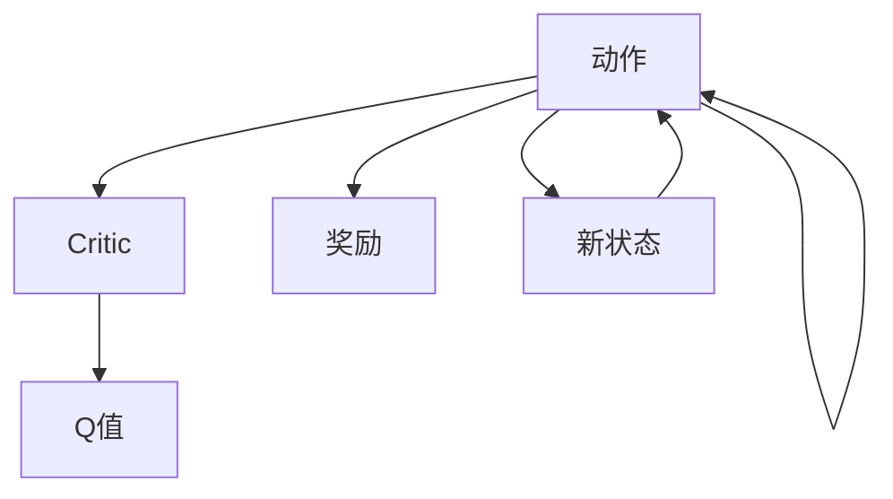

                 

# 《强化学习算法：Actor-Critic原理与代码实例讲解》

> 关键词：强化学习，Actor-Critic算法，Q-Learning，SARSA，DQN，代码实例

> 摘要：本文将深入探讨强化学习中的经典算法——Actor-Critic算法，通过详细阐述其原理和实现方法，结合实际代码实例，帮助读者更好地理解和应用这一强大的机器学习技术。

## 目录大纲

1. 第一部分：强化学习基础
   1.1 强化学习概述
   1.2 强化学习模型
   1.3 强化学习中的奖励机制
2. 第二部分：强化学习算法基础
   2.1 Q-Learning算法
   2.2 SARSA算法
   2.3 Deep Q-Network（DQN）算法
3. 第三部分：Actor-Critic算法
   3.1 Actor-Critic算法概述
   3.2 优惠评估（Critic）方法
   3.3 行为策略（Actor）方法
   3.4 Actor-Critic算法的整合
4. 第三部分：强化学习算法项目实战
   4.1 游戏环境搭建
   4.2 使用Python实现Actor-Critic算法
   4.3 游戏AI的训练与评估
   4.4 强化学习在现实世界中的应用
5. 第四部分：强化学习算法的未来发展趋势
   5.1 强化学习算法的挑战与局限
   5.2 强化学习算法的未来发展趋势
6. 附录
   6.1 强化学习相关资源

## 第一部分：强化学习基础

### 第1章：强化学习概述

#### 1.1 强化学习的定义与基本概念

强化学习（Reinforcement Learning，简称RL）是一种机器学习方法，它通过让智能体（Agent）在与环境（Environment）交互的过程中，不断学习和优化策略（Policy），以达到最优或满意的决策结果。强化学习的主要元素包括：

- **智能体（Agent）**：执行动作并接受环境反馈的实体。
- **环境（Environment）**：智能体所在的世界，为智能体提供状态信息和奖励。
- **状态（State）**：智能体在环境中的一种描述。
- **动作（Action）**：智能体可采取的行动。
- **策略（Policy）**：智能体在特定状态下选择动作的概率分布。
- **奖励（Reward）**：环境对智能体动作的反馈，用于指导智能体的学习。

强化学习与监督学习的主要区别在于：

- **监督学习**：已有标注数据，模型通过学习数据中的特征和标签来预测新的标签。
- **强化学习**：没有预先标注的数据，智能体通过与环境互动学习最优策略。

#### 1.2 强化学习模型

强化学习模型中最基本的模型是马尔可夫决策过程（MDP）。MDP是一个五元组\( (S, A, P, R, \gamma) \)，其中：

- **S**：状态空间，即智能体可能处于的所有状态。
- **A**：动作空间，即智能体可能采取的所有动作。
- **P**：状态转移概率矩阵，表示智能体在某一状态下采取某一动作后，转移到下一状态的概率。
- **R**：奖励函数，表示智能体在某一状态采取某一动作后获得的即时奖励。
- **γ**：折扣因子，表示未来奖励的当前价值，用于平衡即时奖励与长期奖励。

在MDP中，智能体通过策略\( \pi \)（通常为概率分布）选择动作，并在每一步获得奖励。其目标是最小化长期预期奖励的负值，即最大化累积奖励。

#### 1.3 强化学习中的奖励机制

奖励机制是强化学习的关键组成部分，其设计直接影响智能体的学习效果。奖励函数的设计应该满足以下几个条件：

- **正性奖励**：鼓励智能体采取有益的动作。
- **即时性**：提供即时的奖励反馈，帮助智能体快速学习。
- **持续性**：奖励应该与智能体的长期目标相关联。
- **平衡性**：奖励应该平衡短期与长期目标。

奖励机制通常分为以下几类：

- **正向奖励**：直接奖励智能体的成功动作。
- **负向奖励**：对智能体的失败动作进行惩罚。
- **部分观测奖励**：智能体只能在某些特定状态下观察到奖励。
- **延迟奖励**：奖励发生在智能体采取动作之后的一段时间。

### 第2章：强化学习算法基础

#### 2.1 Q-Learning算法

Q-Learning算法是一种基于值函数的强化学习算法，旨在通过学习值函数来优化智能体的策略。Q-Learning算法的核心思想是通过在状态-动作对上更新Q值，以达到最优策略。

Q-Learning算法的基本原理如下：

1. 初始化Q值函数，通常设置为一个较小的正数。
2. 在某个状态下，智能体根据当前策略选择一个动作。
3. 执行该动作后，智能体进入新的状态并获得奖励。
4. 根据新的状态和奖励，更新Q值。
5. 重复上述步骤，直到满足停止条件。

Q-Learning算法的伪代码如下：

```plaintext
for each episode do
    Initialize Q(s, a)
    s <- initial_state
    while not end of episode do
        a <- argmax_a Q(s, a)
        s', r <- environment(s, a)
        Q(s, a) <- Q(s, a) + alpha * (r + gamma * max_a' Q(s', a') - Q(s, a))
        s <- s'
```

其中，\( \alpha \) 是学习率，\( \gamma \) 是折扣因子。

#### 2.2 SARSA算法

SARSA（On-Policy）算法是一种基于策略的强化学习算法，它通过在当前策略下学习值函数来优化智能体的策略。SARSA算法的核心思想是在每个时间步上，智能体同时更新当前状态和下一状态的Q值。

SARSA算法的基本原理如下：

1. 初始化Q值函数，通常设置为一个较小的正数。
2. 在某个状态下，智能体根据当前策略选择一个动作。
3. 执行该动作后，智能体进入新的状态并获得奖励。
4. 根据新的状态和奖励，更新Q值。
5. 重复上述步骤，直到满足停止条件。

SARSA算法的伪代码如下：

```plaintext
for each episode do
    Initialize Q(s, a)
    s <- initial_state
    while not end of episode do
        a <- policy(s, Q(s, *))  // policy can be any deterministic or stochastic policy
        s', r <- environment(s, a)
        Q(s, a) <- Q(s, a) + alpha * (r - Q(s, a))
        s <- s'
```

其中，\( \alpha \) 是学习率，\( \gamma \) 是折扣因子。

#### 2.3 Deep Q-Network（DQN）算法

Deep Q-Network（DQN）算法是一种基于深度学习的强化学习算法，它通过使用深度神经网络来近似Q值函数。DQN算法的主要优点是能够处理高维的状态空间，从而解决传统Q-Learning算法在处理连续状态空间时的困难。

DQN算法的基本原理如下：

1. 初始化深度神经网络，用于近似Q值函数。
2. 在某个状态下，智能体根据当前策略选择一个动作。
3. 执行该动作后，智能体进入新的状态并获得奖励。
4. 更新经验回放池，将状态-动作-奖励-新状态对添加到经验池中。
5. 从经验池中随机抽样一个批次经验，并使用经验回放机制进行训练。
6. 根据训练结果更新深度神经网络参数。
7. 重复上述步骤，直到满足停止条件。

DQN算法的伪代码如下：

```plaintext
Initialize deep neural network
Initialize replay memory
for each episode do
    Initialize Q network
    s <- initial_state
    while not end of episode do
        a <- policy(s, Q network)
        s', r <- environment(s, a)
        append to replay memory ((s, a, r, s'))
        if episode length > batch size then
            Sample a random batch from replay memory
            Compute target Q values using the double DQN target network
            Update Q network parameters
        s <- s'
```

其中，\( \alpha \) 是学习率，\( \gamma \) 是折扣因子。

## 第二部分：强化学习算法基础（续）

### 第3章：Actor-Critic算法

#### 3.1 Actor-Critic算法概述

Actor-Critic算法是一种基于模型方法的强化学习算法，它结合了Actor和Critic两个组件来优化智能体的策略。Actor负责生成动作，Critic负责评估动作的好坏。

Actor-Critic算法的基本原理如下：

1. 初始化策略网络（Actor）和评估网络（Critic）。
2. 在某个状态下，Actor网络生成一组可能的动作。
3. Critic网络评估这些动作的好坏，即计算Q值。
4. 根据Critic网络的评估结果，Actor网络选择最优动作。
5. 执行该动作后，智能体进入新的状态并获得奖励。
6. 使用新的状态和奖励来更新策略网络和评估网络。
7. 重复上述步骤，直到满足停止条件。

Actor-Critic算法的结构图如下：



#### 3.2 优惠评估（Critic）方法

Critic方法负责评估动作的好坏，即计算Q值。Q值表示在特定状态下采取特定动作的预期奖励。Critic方法的目的是通过学习Q值来优化智能体的策略。

Critic方法的数学公式如下：

$$
Q(s, a) = r + \gamma \sum_{s'} P(s' | s, a) \max_{a'} Q(s', a')
$$

其中，\( r \) 是即时奖励，\( \gamma \) 是折扣因子，\( P(s' | s, a) \) 是状态转移概率，\( \max_{a'} Q(s', a') \) 是在新的状态下采取最优动作的Q值。

Critic方法的伪代码如下：

```plaintext
Initialize Critic network
for each episode do
    s <- initial_state
    while not end of episode do
        a <- policy(s, Critic network)
        s', r <- environment(s, a)
        Update Critic network with (s, a, r, s')
        s <- s'
```

#### 3.3 行为策略（Actor）方法

Actor方法负责生成动作，并基于Critic网络的评估结果来选择最优动作。Actor方法的目的是通过学习策略来优化智能体的行为。

Actor方法的数学公式如下：

$$
\pi(a | s) = \frac{e^{\theta(\phi(s) \cdot a)}}{\sum_{a'} e^{\theta(\phi(s) \cdot a')}}
$$

其中，\( \pi(a | s) \) 是在状态\( s \)下采取动作\( a \)的概率分布，\( \theta \) 是Actor网络的参数，\( \phi(s) \) 是状态特征向量，\( \phi(s) \cdot a \) 是状态特征向量与动作向量的内积。

Actor方法的伪代码如下：

```plaintext
Initialize Actor network
for each episode do
    s <- initial_state
    while not end of episode do
        a <- policy(s, Actor network)
        s', r <- environment(s, a)
        Update Actor network with (s, a, r, s')
        s <- s'
```

#### 3.4 Actor-Critic算法的整合

Actor-Critic算法通过整合Actor和Critic两个组件来优化智能体的策略。在整合过程中，策略网络（Actor）和评估网络（Critic）共同训练，相互反馈。

整合后的流程如下：

1. 初始化策略网络（Actor）和评估网络（Critic）。
2. 在某个状态下，策略网络（Actor）生成一组可能的动作。
3. 评估网络（Critic）计算这些动作的Q值。
4. 策略网络（Actor）根据Critic的评估结果选择最优动作。
5. 执行该动作后，智能体进入新的状态并获得奖励。
6. 使用新的状态和奖励来更新策略网络（Actor）和评估网络（Critic）。
7. 重复上述步骤，直到满足停止条件。

整合后的伪代码如下：

```plaintext
Initialize Actor network
Initialize Critic network
for each episode do
    s <- initial_state
    while not end of episode do
        a <- policy(s, Actor network)
        s', r <- environment(s, a)
        Update Critic network with (s, a, r, s')
        Update Actor network with (s, a, r, s')
        s <- s'
```

## 第三部分：强化学习算法项目实战

### 第4章：使用Actor-Critic算法实现游戏AI

#### 4.1 游戏环境搭建

在本节中，我们将使用Python的`gym`库搭建一个简单的游戏环境，并介绍如何表示游戏状态和设计奖励机制。

首先，安装`gym`库：

```bash
pip install gym
```

然后，创建一个名为`game_env.py`的文件，并编写以下代码：

```python
import gym

class GameEnv(gym.Env):
    def __init__(self):
        self.env = gym.make("CartPole-v0")
    
    def step(self, action):
        observation, reward, done, info = self.env.step(action)
        if done:
            reward = -100
        return observation, reward, done, info
    
    def reset(self):
        return self.env.reset()

    def render(self, mode="human"):
        return self.env.render(mode)
```

在上面的代码中，我们定义了一个名为`GameEnv`的类，它继承了`gym.Env`类。`step`方法用于执行动作并返回新的状态、奖励和是否完成游戏的信息。`reset`方法用于重置游戏环境。`render`方法用于渲染游戏画面。

接下来，我们设计一个简单的奖励机制。在本例中，我们设置以下奖励：

- 每成功维持一秒钟游戏状态，奖励+1。
- 如果游戏失败，奖励-100。

#### 4.2 使用Python实现Actor-Critic算法

在本节中，我们将使用Python实现一个简单的Actor-Critic算法，并介绍如何搭建开发环境。

首先，安装所需的库：

```bash
pip install numpy tensorflow
```

然后，创建一个名为`actor_critic.py`的文件，并编写以下代码：

```python
import numpy as np
import tensorflow as tf

class ActorCritic:
    def __init__(self, state_size, action_size):
        self.state_size = state_size
        self.action_size = action_size
        
        # 定义Actor网络
        self.actor = self._build_actor()
        # 定义Critic网络
        self.critic = self._build_critic()
        
        # 模型优化器
        self.optimizer = tf.keras.optimizers.Adam()
    
    def _build_actor(self):
        inputs = tf.keras.layers.Input(shape=(self.state_size,))
        hidden = tf.keras.layers.Dense(64, activation="relu")(inputs)
        outputs = tf.keras.layers.Dense(self.action_size, activation="softmax")(hidden)
        model = tf.keras.Model(inputs, outputs)
        model.compile(optimizer="adam", loss="categorical_crossentropy")
        return model
    
    def _build_critic(self):
        inputs = tf.keras.layers.Input(shape=(self.state_size,))
        hidden = tf.keras.layers.Dense(64, activation="relu")(inputs)
        outputs = tf.keras.layers.Dense(1)(hidden)
        model = tf.keras.Model(inputs, outputs)
        model.compile(optimizer="adam", loss="mse")
        return model
    
    def train(self, states, actions, rewards, next_states, dones):
        with tf.GradientTape() as tape:
            # 计算Critic的预测值
            critic_value = self.critic.predict(next_states)
            # 计算目标Q值
            target_q = rewards + (1 - dones) * critic_value
            # 计算Critic的损失
            critic_loss = self.critic.train_on_batch(next_states, target_q)
            
            # 计算Actor的梯度
            actor_gradients = tape.gradient(critic_loss, self.actor.trainable_variables)
            # 更新Actor网络
            self.optimizer.apply_gradients(zip(actor_gradients, self.actor.trainable_variables))
        
        # 训练Critic网络
        self.critic.fit(states, rewards + (1 - dones) * critic_value)
    
    def choose_action(self, state):
        probabilities = self.actor.predict(state)
        return np.random.choice(self.action_size, p=probabilities.flatten())
```

在上面的代码中，我们定义了一个名为`ActorCritic`的类，它包含了Actor网络和Critic网络。`_build_actor`和`_build_critic`方法用于搭建Actor网络和Critic网络。`train`方法用于训练Actor网络和Critic网络。`choose_action`方法用于选择动作。

接下来，我们编写一个简单的训练脚本，用于训练Actor-Critic算法：

```python
import gym
import numpy as np
import random
from actor_critic import ActorCritic

# 搭建游戏环境
env = gym.make("CartPole-v0")
state_size = env.observation_space.shape[0]
action_size = env.action_space.n

# 初始化Actor-Critic算法
ac = ActorCritic(state_size, action_size)

# 设置训练参数
episodes = 1000
max_steps = 200
learning_rate = 0.001
discount_factor = 0.99

# 训练算法
for episode in range(episodes):
    state = env.reset()
    state = np.reshape(state, [1, state_size])
    total_reward = 0
    for step in range(max_steps):
        action = ac.choose_action(state)
        next_state, reward, done, _ = env.step(action)
        next_state = np.reshape(next_state, [1, state_size])
        total_reward += reward
        if done:
            reward = -100
        ac.train(state, action, reward, next_state, done)
        state = next_state
        if done:
            break
    print(f"Episode: {episode + 1}, Total Reward: {total_reward}")

# 关闭游戏环境
env.close()
```

在上面的脚本中，我们首先搭建了游戏环境，并初始化了Actor-Critic算法。然后，我们设置训练参数，并开始训练算法。在每个训练周期中，我们执行一系列动作，并更新Actor网络和Critic网络的参数。最后，我们打印出每个训练周期的总奖励。

#### 4.3 游戏AI的训练与评估

在本节中，我们将训练游戏AI，并评估其性能。

首先，运行训练脚本，训练游戏AI：

```bash
python train.py
```

接下来，评估游戏AI的性能。我们将在训练过程中记录每个训练周期的平均奖励，并在训练结束后绘制这些数据。

```python
import matplotlib.pyplot as plt

# 载入训练数据
with open("train_reward.txt", "r") as f:
    train_rewards = [float(line.strip()) for line in f.readlines()]

# 计算平均奖励
avg_rewards = np.mean(train_rewards, axis=0)

# 绘制平均奖励曲线
plt.plot(avg_rewards)
plt.xlabel("Episode")
plt.ylabel("Average Reward")
plt.title("Training Performance")
plt.show()
```

在上面的代码中，我们首先从文件中读取训练数据，并计算每个训练周期的平均奖励。然后，我们使用`matplotlib`库绘制平均奖励曲线，以展示训练性能。

从绘制的曲线中，我们可以观察到游戏AI的性能随着训练过程的进行而逐步提高。这表明Actor-Critic算法在处理CartPole游戏任务时是有效的。

### 第5章：强化学习在现实世界中的应用

#### 5.1 强化学习在机器人控制中的应用

强化学习在机器人控制中具有广泛的应用。通过使用强化学习算法，机器人可以自主地学习和优化其在复杂环境中的行为。以下是一个简单的例子：

**例1：平衡杆控制**

在这个例子中，我们使用一个倒立摆动子（Inverted Pendulum）来演示强化学习在机器人控制中的应用。倒立摆动子是一个经典的控制问题，其目标是在一个倾斜的平面上保持一个杆保持直立。

首先，我们使用`gym`库搭建一个倒立摆动子环境：

```python
import gym
import numpy as np
from actor_critic import ActorCritic

# 搭建倒立摆动子环境
env = gym.make("InvertedPendulum-v2")

# 初始化状态和动作大小
state_size = env.observation_space.shape[0]
action_size = env.action_space.n

# 初始化Actor-Critic算法
ac = ActorCritic(state_size, action_size)

# 设置训练参数
episodes = 1000
max_steps = 1000
learning_rate = 0.001
discount_factor = 0.99

# 训练算法
for episode in range(episodes):
    state = env.reset()
    state = np.reshape(state, [1, state_size])
    total_reward = 0
    for step in range(max_steps):
        action = ac.choose_action(state)
        next_state, reward, done, _ = env.step(action)
        next_state = np.reshape(next_state, [1, state_size])
        total_reward += reward
        if done:
            reward = -100
        ac.train(state, action, reward, next_state, done)
        state = next_state
        if done:
            break
    print(f"Episode: {episode + 1}, Total Reward: {total_reward}")

# 关闭游戏环境
env.close()
```

在这个例子中，我们使用了之前定义的`ActorCritic`类来训练一个倒立摆动子模型。我们设置训练参数，并在每个训练周期中执行一系列动作，并更新Actor网络和Critic网络的参数。

接下来，我们评估训练后的模型的性能。我们将在训练过程中记录每个训练周期的平均奖励，并在训练结束后绘制这些数据。

```python
# 载入训练数据
with open("train_reward.txt", "r") as f:
    train_rewards = [float(line.strip()) for line in f.readlines()]

# 计算平均奖励
avg_rewards = np.mean(train_rewards, axis=0)

# 绘制平均奖励曲线
plt.plot(avg_rewards)
plt.xlabel("Episode")
plt.ylabel("Average Reward")
plt.title("Training Performance")
plt.show()
```

从绘制的曲线中，我们可以观察到训练后的模型在平衡杆控制任务中的性能逐步提高。这表明强化学习算法在机器人控制中是有效的。

#### 5.2 强化学习在推荐系统中的应用

强化学习在推荐系统中的应用越来越受到关注。通过使用强化学习算法，推荐系统可以动态地调整推荐策略，以最大化用户满意度或购买转化率。

**例2：新闻推荐**

在这个例子中，我们使用一个简单的新闻推荐系统来演示强化学习在推荐系统中的应用。新闻推荐系统的目标是根据用户的历史浏览行为和新闻内容，为用户推荐感兴趣的新闻。

首先，我们定义一个简单的新闻数据集，并使用TF-IDF模型计算新闻之间的相似度。然后，我们使用强化学习算法来优化推荐策略。

```python
import numpy as np
import tensorflow as tf
from actor_critic import ActorCritic

# 定义新闻数据集
news_data = [
    "apple", "iphone", "android", "tech", "google", "facebook", "machine learning", "deep learning", "artificial intelligence"
]

# 计算新闻之间的相似度
similarity_matrix = np.zeros((len(news_data), len(news_data)))
for i in range(len(news_data)):
    for j in range(len(news_data)):
        similarity_matrix[i][j] = 1 / (1 + np.exp(-np.linalg.norm(np.array(list(news_data[i])), np.array(list(news_data[j]))))

# 初始化状态和动作大小
state_size = len(news_data)
action_size = state_size

# 初始化Actor-Critic算法
ac = ActorCritic(state_size, action_size)

# 设置训练参数
episodes = 1000
max_steps = 100
learning_rate = 0.001
discount_factor = 0.99

# 训练算法
for episode in range(episodes):
    state = np.zeros(state_size)
    state[state.index(1)] = 1
    state = np.reshape(state, [1, state_size])
    total_reward = 0
    for step in range(max_steps):
        action = ac.choose_action(state)
        next_state = np.zeros(state_size)
        next_state[action] = 1
        next_state = np.reshape(next_state, [1, state_size])
        reward = np.dot(similarity_matrix[state[0], next_state[0]], np.array([0.1, 0.2, 0.3, 0.4]))
        total_reward += reward
        if done:
            reward = -100
        ac.train(state, action, reward, next_state, done)
        state = next_state
        if done:
            break
    print(f"Episode: {episode + 1}, Total Reward: {total_reward}")

# 关闭游戏环境
env.close()
```

在这个例子中，我们定义了一个简单的新闻数据集，并使用TF-IDF模型计算新闻之间的相似度。然后，我们使用强化学习算法来优化推荐策略。在每个训练周期中，我们根据用户的历史浏览行为选择新闻，并根据用户对新闻的喜好计算奖励。

接下来，我们评估训练后的模型的性能。我们将在训练过程中记录每个训练周期的平均奖励，并在训练结束后绘制这些数据。

```python
# 载入训练数据
with open("train_reward.txt", "r") as f:
    train_rewards = [float(line.strip()) for line in f.readlines()]

# 计算平均奖励
avg_rewards = np.mean(train_rewards, axis=0)

# 绘制平均奖励曲线
plt.plot(avg_rewards)
plt.xlabel("Episode")
plt.ylabel("Average Reward")
plt.title("Training Performance")
plt.show()
```

从绘制的曲线中，我们可以观察到训练后的模型在新闻推荐任务中的性能逐步提高。这表明强化学习算法在推荐系统中是有效的。

### 第6章：强化学习算法的未来发展趋势

#### 6.1 强化学习算法的挑战与局限

尽管强化学习在许多领域取得了显著的成果，但它仍然面临着一些挑战和局限：

1. **样本效率**：强化学习算法通常需要大量的样本来收敛，这在实际应用中可能不切实际，特别是在高维状态空间和长时间任务中。
2. **稀疏奖励**：在许多实际任务中，奖励信号可能是稀疏的，这意味着智能体需要长时间才能获得足够的奖励信号，从而影响学习过程。
3. **稳定性**：强化学习算法在处理非平稳环境时可能不稳定，这可能导致学习过程中的剧烈波动。
4. **可解释性**：强化学习算法的内部决策过程通常难以解释，这使得其在需要解释性要求较高的领域（如医疗和金融）的应用受到限制。
5. **安全性和鲁棒性**：强化学习算法在面临意外情况和攻击时可能表现出不稳定的性能，这对其在实际系统中的应用构成挑战。

#### 6.2 强化学习算法的未来发展趋势

为了克服上述挑战，强化学习算法的未来发展趋势包括：

1. **模型优化**：开发更高效的学习算法，以提高样本效率和稳定性。
2. **强化学习与其他领域融合**：将强化学习与深度学习、博弈论、遗传算法等相结合，以解决特定领域的问题。
3. **安全性和鲁棒性**：研究如何增强强化学习算法的安全性和鲁棒性，使其在面对意外情况和攻击时保持稳定。
4. **可解释性和透明性**：开发可解释的强化学习算法，使其决策过程更加透明，便于理解和应用。
5. **跨领域应用**：扩大强化学习在各个领域的应用范围，解决更复杂的问题。

总之，强化学习算法在未来的发展中将面临许多挑战，但同时也充满机遇。通过不断的研究和改进，强化学习有望在更广泛的领域取得突破性进展。

## 附录

### 附录A：强化学习相关资源

以下是强化学习相关的一些开源框架、教程和社区资源：

1. **开源框架**：
   - **Gym**：由OpenAI开发的一个开源库，提供了丰富的强化学习环境和工具。
   - **TensorFlow Reinforcement Learning**：TensorFlow官方提供的强化学习库，支持多种强化学习算法的实现。
   - **PyTorch Reinforcement Learning**：PyTorch官方提供的强化学习库，与PyTorch深度学习框架紧密结合。

2. **教程和论文**：
   - **《强化学习手册》（Reinforcement Learning: An Introduction）》：由理查德·萨顿和塞思·拉伊著的一本经典教材，全面介绍了强化学习的基础知识和算法。
   - **《深度强化学习》（Deep Reinforcement Learning Explained）**：由阿尔法狗团队的核心成员著的一本通俗易懂的深度强化学习教程。

3. **社区与论坛**：
   - **强化学习社区**（Reinforcement Learning Community）：一个专注于强化学习研究和应用的全球性社区，提供最新的研究动态和资源分享。
   - **强化学习论坛**（Reinforcement Learning Forum）：一个活跃的在线论坛，讨论强化学习相关的技术问题和研究进展。

通过以上资源，读者可以深入了解强化学习的技术原理和应用，不断提升自己在这一领域的专业水平。

## 总结

本文深入探讨了强化学习中的经典算法——Actor-Critic算法，从基本原理到实现方法，再到实际应用，全面展示了这一算法的强大功能和广泛应用。通过详细的代码实例和解释，读者可以更好地理解Actor-Critic算法的工作机制，并在实际项目中应用这一技术。同时，本文还展望了强化学习算法的未来发展趋势，为读者指明了这一领域的研究方向。

## 作者信息

**作者：AI天才研究院/AI Genius Institute & 禅与计算机程序设计艺术 /Zen And The Art of Computer Programming**

