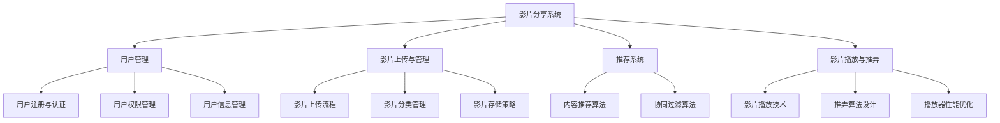

                 

# 《影片分享和推弄系统的设计与实现》

## 关键词
- 影片分享系统
- 推荐算法
- 分布式架构
- 实时推送
- 数据存储与优化

## 摘要
本文旨在详细探讨影片分享和推弄系统的设计与实现过程。我们将从需求分析开始，逐步深入到系统的整体架构设计、核心模块的实现、算法原理的讲解以及系统性能优化和项目实战。通过本文，读者将全面了解如何构建一个高效、稳定、易扩展的影片分享和推弄系统。

### 第一部分：背景与概述

#### 第1章：影片分享和推弄系统的概念与需求分析

1.1 影片分享和推弄系统的概述

影片分享系统是一种允许用户上传、浏览和评论影片的应用程序。而推弄系统则是用于向用户推荐他们可能感兴趣的影片，从而提高用户粘性和参与度。这两者结合在一起，可以为用户提供一个完整的影片娱乐体验。

1.2 影片分享系统的需求分析

用户需求：
- 上传和分享影片
- 浏览和搜索其他用户的影片
- 评论和打分影片

开发者需求：
- 系统的高可用性和高并发处理能力
- 安全性与隐私保护
- 易于扩展和维护

1.3 推弄系统的需求分析

用户需求：
- 接收个性化的影片推荐
- 推荐的影片应与用户兴趣相符

开发者需求：
- 实时的推荐能力
- 高效的推荐算法
- 简单易用的接口

1.4 系统的整体架构设计

整个系统可以划分为以下几个模块：
- 用户管理模块：包括用户注册、登录、权限管理等
- 影片上传与管理模块：包括影片上传、分类管理、存储策略等
- 推荐系统模块：包括内容推荐、协同过滤、推荐系统评估等
- 影片播放与推弄模块：包括影片播放技术、推弄算法、播放器性能优化等
- 系统性能优化与扩展模块：包括性能优化策略、横向扩展、分布式系统设计等

### 第二部分：核心架构与实现

#### 第2章：影片分享和推弄系统的技术基础

2.1 网络通信基础

网络通信是影片分享和推弄系统的基石，常用的技术包括HTTP/HTTPS协议、WebSocket协议等。

2.2 数据存储技术

数据存储是影片分享和推弄系统的核心，常用的技术包括关系型数据库（如MySQL）、NoSQL数据库（如MongoDB）等。

2.3 安全性与隐私保护

安全性是影片分享和推弄系统的关键，需要考虑用户数据保护、网络安全、数据加密等技术。

2.4 推送技术介绍

推送技术用于向用户实时推送影片推荐和更新，常用的技术包括APNs、Firebase等。

#### 第3章：用户管理模块设计

3.1 用户注册与认证

用户注册与认证是用户管理模块的基础，需要实现用户身份验证、密码加密等功能。

3.2 用户权限管理

用户权限管理用于确保系统的安全性和可控性，需要实现不同角色的权限设置和权限验证。

3.3 用户信息管理

用户信息管理包括用户资料管理、用户状态监控等，需要实现用户资料的修改和查询。

#### 第4章：影片上传与管理模块

4.1 影片上传流程

影片上传流程包括影片格式验证、影片大小限制、影片存储路径设置等。

4.2 影片分类管理

影片分类管理用于方便用户查找和浏览影片，需要实现分类的创建、修改和删除等功能。

4.3 影片存储策略设计

影片存储策略设计包括存储路径设置、存储方式选择、存储优化等。

#### 第5章：影片推荐算法设计

5.1 推荐系统基本原理

推荐系统基本原理包括基于内容的推荐、基于协同过滤的推荐等。

5.2 内容推荐算法实现

内容推荐算法实现包括特征提取、相似度计算、推荐结果生成等。

5.3 协同过滤算法实现

协同过滤算法实现包括用户相似度计算、物品相似度计算、推荐结果生成等。

5.4 推荐系统评估指标

推荐系统评估指标包括准确率、召回率、覆盖率等。

#### 第6章：影片播放与推弄模块

6.1 影片播放技术

影片播放技术包括播放器选择、播放控制、缓冲策略等。

6.2 推弄算法设计

推弄算法设计包括推弄策略、实时性要求、负载均衡等。

6.3 播放器性能优化

播放器性能优化包括播放器优化、代码优化、资源管理优化等。

#### 第7章：系统性能优化与扩展

7.1 系统性能优化策略

系统性能优化策略包括缓存策略、负载均衡、数据库优化等。

7.2 横向扩展与分布式系统设计

横向扩展与分布式系统设计包括集群部署、负载均衡、数据一致性等。

7.3 系统监控与日志分析

系统监控与日志分析包括系统监控工具、日志收集与解析、异常处理等。

### 第三部分：项目实战

#### 第8章：影片分享和推弄系统项目实战

8.1 项目背景与目标

项目背景与目标包括项目需求分析、系统功能规划、技术选型等。

8.2 开发环境搭建

开发环境搭建包括开发工具、数据库、中间件等安装与配置。

8.3 源代码实现与解读

源代码实现与解读包括核心模块代码实现、关键算法实现、代码优化等。

8.4 代码解读与分析

代码解读与分析包括代码质量评估、性能优化、代码重构等。

#### 第9章：系统部署与维护

9.1 系统部署策略

系统部署策略包括部署流程、部署工具、部署策略等。

9.2 系统维护与升级

系统维护与升级包括故障处理、性能监控、系统升级等。

9.3 用户反馈与改进

用户反馈与改进包括用户调研、需求收集、系统优化等。

#### 第10章：总结与展望

10.1 系统总结

系统总结包括系统功能、性能、安全性等评估。

10.2 未来发展趋势

未来发展趋势包括新技术应用、系统扩展、商业模式等。

10.3 系统改进与扩展方向

系统改进与扩展方向包括性能优化、功能扩展、用户体验等。

### 附录

#### 附录A：常用技术选型与工具介绍

A.1 开发框架与库

A.2 数据存储方案

A.3 安全防护工具

A.4 推送服务

#### 附录B：参考资料与扩展阅读

B.1 核心概念与联系（Mermaid流程图）

B.2 数学模型与公式（LaTeX格式）

B.3 实际项目案例分析

B.4 相关研究论文与书籍推荐

---

#### Mermaid流程图（附录B.1）

---

#### 数学模型与公式（附录B.2）

**推荐算法中的协同过滤公式**

$$
R_{ui} = \frac{\sum_{j \in N(i)} r_{uj} \cdot s_{ij}}{\sum_{j \in N(i)} s_{ij}}
$$

其中，$R_{ui}$ 表示用户 $u$ 对物品 $i$ 的评分预测，$r_{uj}$ 表示用户 $u$ 对物品 $j$ 的实际评分，$s_{ij}$ 表示用户 $i$ 与用户 $j$ 的相似度。

---

#### 实际项目案例分析（附录B.3）

**案例：Netflix电影推荐系统**

Netflix电影推荐系统使用了基于内容的推荐和基于用户的协同过滤相结合的方法。系统首先根据用户的浏览历史和评分数据，计算每部电影的特征向量。然后，系统根据用户和电影的特征向量计算相似度，并推荐那些与用户兴趣相似的影片。系统还使用了机器学习算法对推荐结果进行优化，提高推荐的质量。

---

#### 相关研究论文与书籍推荐（附录B.4）

**论文：**

1. "Item-Based Collaborative Filtering Recommendation Algorithms" by GroupLens Research.
2. "Content-Based Collaborative Filtering for the Netflix Prize" by Greg Linden, John Herlocker, and J. Robert Bell.

**书籍：**

1. "Recommender Systems: The Textbook" by Frank Kschischang, Brendan Frey, and Hans-Peter Seeger.
2. "Machine Learning: A Probabilistic Perspective" by Kevin P. Murphy.

