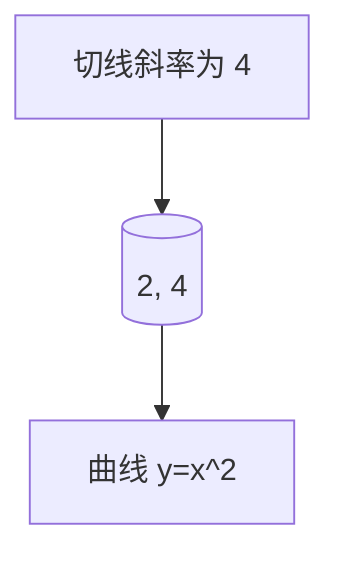
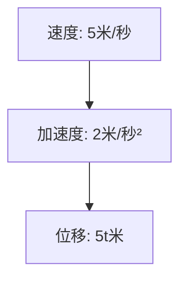

                 

# 文章标题：微积分与运筹学——从理论基础到实际应用

> 关键词：微积分、运筹学、线性规划、整数规划、动态规划、排队论

> 摘要：本文从微积分和运筹学的基本概念出发，系统地介绍了这两个学科的理论基础、核心算法及其在各个领域的实际应用。通过详细的理论讲解、算法分析和实例验证，帮助读者深入理解微积分与运筹学的核心原理，掌握其在实际问题中的运用。

----------------------------------------------------------------

# 《微积分与运筹学》——从理论基础到实际应用

## 引言

微积分和运筹学是数学领域中的重要分支，分别应用于自然科学、工程技术、经济管理等多个领域。微积分主要研究函数的极限、导数和积分等基本概念，提供了一种强大的工具来分析变化和运动。而运筹学则通过数学模型和算法，帮助决策者解决资源分配、生产计划、调度优化等问题。

本文将系统地介绍微积分和运筹学的基本概念、理论体系以及实际应用。通过深入的理论讲解和实例分析，帮助读者理解这两个学科的内在逻辑和应用价值。文章的结构如下：

1. **微积分基础**：介绍微积分的基本概念、极限、导数、积分及其应用。
2. **微分方程初步**：讨论微分方程的基本概念、解法及其在物理、经济等领域的应用。
3. **运筹学基础**：介绍线性规划、整数规划、动态规划、排队论和决策分析等运筹学的基本概念和算法。
4. **项目实战**：通过具体的项目实例，展示微积分和运筹学的实际应用。

## 第一部分：微积分基础

### 第1章：微积分初步

#### 1.1 微积分的历史与发展

微积分是数学领域中的重要分支，起源于17世纪的欧洲。当时，科学家和数学家们致力于研究物体的运动和变化，从而产生了微积分。微积分的发展历程可以追溯到牛顿和莱布尼茨的工作，他们的贡献奠定了微积分的基础。

微积分在数学、物理、工程、经济等领域都有广泛的应用。通过微积分，我们可以更好地理解和描述自然界中的各种现象，如物体的运动、电磁场、热力学等。

#### 1.2 微积分的基本概念

微积分的核心概念包括函数、极限、导数和积分。函数是数学中一个基本的概念，它描述了变量之间的依赖关系。极限是微积分中的一个重要概念，它描述了一个函数在某个点的趋近行为。导数和积分则是微积分中的两个基本运算，导数描述了函数在某一点的变化率，而积分则描述了函数在某个区间内的累积效果。

#### 1.3 极限的定义与性质

极限是微积分中的一个基本概念。形式上，一个函数在某一点的极限是指当自变量无限趋近于该点时，函数值的趋势。极限的性质包括有界性、单调性、保号性等。通过极限，我们可以定义导数和积分，从而解决各种数学问题。

#### 1.4 导数的概念与计算

导数是描述函数在某一点变化率的量。形式上，函数在某一点的导数是函数在该点的切线的斜率。导数的计算方法包括求导法则、反函数求导、隐函数求导等。导数在几何上表示曲线的切线斜率，在物理上表示速度，在经济学上表示边际效益等。

#### 1.5 函数的连续性

函数的连续性是函数的一个重要性质。一个函数在一点连续，意味着在该点附近，函数值的变化是平稳的，没有突然的跳跃。连续函数具有许多重要的性质，如可导性、可积分性等。连续函数的运算包括函数的和、差、积、商、复合等。

### 第2章：微分学

#### 2.1 导数的几何意义与物理应用

导数的几何意义是指函数在某一点的导数表示曲线在该点的切线斜率。在物理学中，导数可以用来描述速度、加速度等物理量。例如，在物体运动中，导数可以表示物体的瞬时速度。

#### 2.2 高阶导数的概念与计算

高阶导数是导数的导数。高阶导数的计算方法包括链式法则、乘积法则、反函数求导等。高阶导数在几何上可以描述曲线的曲率，在物理上可以描述加速度的变化。

#### 2.3 隐函数求导与参数方程求导

隐函数求导是指对隐函数求导，即函数的显式表达式未知。参数方程求导是指对参数方程表示的函数求导。隐函数求导和参数方程求导的方法包括求导法则、链式法则等。

#### 2.4 多元函数的微分

多元函数的微分是指对多元函数求偏导数。多元函数的全微分可以表示为各偏导数的线性组合。多元函数的微分在几何上可以描述曲面在一点的切平面，在物理上可以描述多变量函数的敏感度。

#### 2.5 泰勒公式与麦克劳林公式

泰勒公式和麦克劳林公式是微积分中的重要工具，它们可以将一个函数在某一点的邻域内用多项式来近似表示。泰勒公式可以表示为函数在某一点的导数在邻域内的线性组合，而麦克劳林公式则是泰勒公式的一种特殊形式，其中心点是原点。

### 第3章：积分学

#### 3.1 积分的基本概念

积分是微积分中的另一个基本运算。积分可以理解为函数在某个区间内的累积效果。定积分和不定积分是积分的两种主要形式。定积分表示函数在某个区间内的积分值，而不定积分则表示函数的原函数。

#### 3.2 不定积分的基本方法

不定积分的基本方法包括换元积分、分部积分、分解积分等。换元积分是一种常用的积分方法，通过引入新的变量来简化积分过程。分部积分则是利用导数的乘积公式来求解积分。分解积分则是将复杂的积分分解为多个简单的积分。

#### 3.3 定积分的定义与性质

定积分的定义是将函数在一个区间上的积分值看作是函数在该区间上的高度和宽度的乘积。定积分的性质包括线性性、可加性、比较定理等。定积分在几何上可以表示为曲边梯形的面积，在物理上可以表示为力在路径上的功等。

#### 3.4 定积分的计算

定积分的计算方法包括几何意义、微积分基本定理、换元积分、分部积分等。几何意义是通过观察图形来求解定积分。微积分基本定理是将定积分转化为不定积分来求解。换元积分和分部积分则是利用积分公式来求解。

#### 3.5 定积分的应用

定积分的应用非常广泛，可以用来求解面积、体积、弧长、质心等。在物理学中，定积分可以用来求解功、能、冲量等。在经济学中，定积分可以用来求解收益、成本、利润等。

### 第4章：微分方程初步

#### 4.1 微分方程的基本概念

微分方程是描述函数及其导数之间关系的方程。微分方程可以分为常微分方程和偏微分方程。常微分方程是描述一个函数及其导数之间的关系，而偏微分方程则描述多个函数及其导数之间的关系。

#### 4.2 一阶微分方程的解法

一阶微分方程是微分方程中最简单的一类。一阶微分方程的解法包括可分离变量的方程、齐次方程、线性方程等。可分离变量的方程可以通过分离变量来求解。齐次方程可以通过变量替换来求解。线性方程可以通过常数变易法来求解。

#### 4.3 二阶线性微分方程的解法

二阶线性微分方程是微分方程中的一类重要方程。二阶线性微分方程的解法包括齐次方程、非齐次方程、准则方程等。齐次方程的通解可以通过特征方程来求解。非齐次方程的特解可以通过常数变易法来求解。准则方程的解可以通过常数变易法与通解的叠加来求解。

#### 4.4 常微分方程组

常微分方程组是多个常微分方程组成的系统。常微分方程组的解法包括线性方程组的求解方法、非线性方程组的求解方法等。线性方程组的求解方法包括矩阵方法、迭代方法等。非线性方程组的求解方法包括迭代法、数值方法等。

#### 4.5 微分方程的应用

微分方程在物理、工程、经济学等领域有广泛的应用。例如，在物理学中，微分方程可以用来描述振动、波动等现象。在工程学中，微分方程可以用来描述流体力学、结构力学等问题。在经济学中，微分方程可以用来描述经济增长、人口增长等。

## 第二部分：运筹学基础

### 第5章：线性规划

#### 5.1 线性规划的基本概念

线性规划是运筹学中的一个重要分支，主要用于解决线性目标函数在约束条件下的最优解问题。线性规划的基本概念包括线性目标函数、约束条件、可行解、最优解等。

#### 5.2 线性规划的图解法

线性规划的图解法是一种直观的方法，通过在坐标平面上绘制约束条件的图形，找出可行域，并确定最优解。线性规划的图解法适用于二维线性规划问题。

#### 5.3 单纯形法的原理与步骤

单纯形法是解决线性规划问题的一种迭代算法，通过逐步移动至边界上的顶点，最终找到最优解。单纯形法的基本原理包括目标函数的优化、可行解的检验、顶点的选择等。

#### 5.4 线性规划的对偶理论

线性规划的对偶理论研究了原始规划与对偶规划之间的关系。对偶规划的目标函数与原始规划的目标函数相反，约束条件与原始规划的约束条件相关联。对偶理论可以帮助我们更好地理解线性规划问题的性质，并用于求解一些特殊情况。

#### 5.5 线性规划的应用

线性规划在各个领域有广泛的应用，如生产计划、资源分配、运输调度等。通过线性规划，我们可以优化资源利用，提高经济效益。

### 第6章：整数规划

#### 6.1 整数规划的基本概念

整数规划是线性规划的扩展，用于解决目标函数和约束条件中包含整数变量的优化问题。整数规划的基本概念包括整数变量、可行解、最优解等。

#### 6.2 隐枚举法的原理与步骤

隐枚举法是解决整数规划问题的一种算法，通过系统地检查所有可能的整数解，找出最优解。隐枚举法的基本原理包括枚举、筛选、优化等。

#### 6.3 切割平面法的原理与步骤

切割平面法是解决整数规划问题的另一种算法，通过引入新的约束条件，逐步缩小可行域，直到找到最优解。切割平面法的基本原理包括切割平面的引入、约束条件的修改等。

#### 6.4 整数规划的应用

整数规划在资源分配、排队问题、生产调度等领域有广泛的应用。通过整数规划，我们可以优化资源配置，提高系统效率。

### 第7章：动态规划

#### 7.1 动态规划的基本概念

动态规划是一种求解多阶段决策问题的优化方法，通过将复杂问题分解为多个子问题，并利用子问题的解来构建整体问题的解。动态规划的基本概念包括阶段、状态、决策等。

#### 7.2 一维动态规划

一维动态规划是动态规划的一种特殊情况，用于解决仅涉及一个变量的优化问题。一维动态规划的基本原理包括递推关系、状态转移等。

#### 7.3 二维动态规划

二维动态规划是动态规划的扩展，用于解决涉及两个或多个变量的优化问题。二维动态规划的基本原理包括递推关系、状态转移等。

#### 7.4 动态规划的求解方法

动态规划的求解方法包括递推关系法、状态转移法、贪心算法等。递推关系法是动态规划中最常用的方法，通过建立递推关系来求解子问题，并利用子问题的解来构建整体问题的解。

#### 7.5 动态规划的应用

动态规划在资源分配、排队问题、生产调度等领域有广泛的应用。通过动态规划，我们可以优化资源利用，提高系统效率。

### 第8章：排队论

#### 8.1 排队论的基本概念

排队论是研究排队系统性能的数学理论，用于分析服务系统中的等待时间、服务效率等。排队论的基本概念包括服务系统、顾客到达过程、服务过程等。

#### 8.2 M/M/1排队模型

M/M/1排队模型是最基本的排队模型之一，用于描述顾客到达过程和服务过程都服从泊松过程的排队系统。M/M/1排队模型的基本性质包括平稳分布、平均等待时间等。

#### 8.3 M/M/c排队模型

M/M/c排队模型是M/M/1排队模型的扩展，用于描述顾客到达过程和服务过程都服从泊松过程的排队系统，但服务过程由多个服务器共同完成。M/M/c排队模型的基本性质包括平稳分布、平均等待时间等。

#### 8.4 排队系统的性能分析

排队系统的性能分析是排队论的重要任务，通过分析排队系统的性能指标，如平均等待时间、服务效率等，来评估系统性能。排队系统的性能分析包括概率分布、期望值、方差等。

#### 8.5 排队论的应用

排队论在通信系统、生产系统、服务系统等领域有广泛的应用。通过排队论，我们可以优化系统设计，提高服务质量。

### 第9章：决策分析

#### 9.1 决策分析的基本概念

决策分析是一种基于数学和统计方法来辅助决策的过程。决策分析的基本概念包括决策问题、决策变量、决策准则等。

#### 9.2 决策树法

决策树法是一种常用的决策分析方法，通过构建决策树来表示决策过程，并计算各个决策节点的期望值。决策树法的基本步骤包括决策节点的确定、决策树的构建、期望值的计算等。

#### 9.3 多属性决策

多属性决策是决策分析的一种扩展，用于处理涉及多个决策属性的问题。多属性决策的基本概念包括属性权重、属性值等。

#### 9.4 风险型决策

风险型决策是在不确定环境下进行的决策，需要考虑决策结果的概率分布。风险型决策的基本概念包括概率分布、期望值、方差等。

#### 9.5 决策分析的应用

决策分析在项目管理、市场营销、投资决策等领域有广泛的应用。通过决策分析，我们可以优化决策过程，提高决策质量。

### 附录

#### 附录A：数学工具与应用

附录部分将介绍微积分和运筹学中常用的数学工具及其应用。包括极限、导数、积分、矩阵运算、线性方程组求解、概率论与数理统计等。

## 微积分基础

微积分是数学领域中的重要分支，主要研究函数的极限、导数和积分等基本概念。它为自然科学、工程技术、经济学等领域提供了一种强大的工具，用于分析变化和运动。在本章节中，我们将详细介绍微积分的基本概念、极限、导数、积分及其应用。

### 1.1 极限的概念

极限是微积分中的一个基本概念，它描述了一个函数在某个点的趋近行为。形式上，一个函数在某一点的极限是指当自变量无限趋近于该点时，函数值的趋势。极限的概念可以用来定义导数和积分，从而解决各种数学问题。

例如，考虑函数 \( f(x) = x^2 \) 在点 \( x = 0 \) 处的极限。我们可以通过计算 \( x \) 取不同值时的函数值来观察其趋势：

$$
\lim_{{x \to 0}} x^2 = \lim_{{x \to 0}} (x \cdot x) = 0 \cdot 0 = 0
$$

这里，当 \( x \) 趋近于 0 时，函数值 \( x^2 \) 也趋近于 0。因此，函数 \( f(x) = x^2 \) 在 \( x = 0 \) 处的极限是 0。

### 1.2 极限的性质

极限具有以下几种重要性质：

1. **有界性**：如果函数 \( f(x) \) 在某一点 \( x = a \) 的极限存在，则函数 \( f(x) \) 在该点附近是有界的。
2. **单调性**：如果函数 \( f(x) \) 在某一点 \( x = a \) 的极限存在且为正（或负），则函数 \( f(x) \) 在该点附近是单调增加（或单调减少）的。
3. **保号性**：如果函数 \( f(x) \) 在某一点 \( x = a \) 的极限存在且为正（或负），则函数 \( f(x) \) 在该点附近有相同符号的值。

例如，考虑函数 \( f(x) = x^3 \) 在点 \( x = 0 \) 处的极限：

$$
\lim_{{x \to 0}} x^3 = \lim_{{x \to 0}} (x \cdot x \cdot x) = 0 \cdot 0 \cdot 0 = 0
$$

由于极限为 0，函数在 \( x = 0 \) 处是单调增加的，且其值在 \( x = 0 \) 附近也是正的。

### 1.3 极限的计算方法

计算极限的方法有很多，以下介绍几种常用的方法：

1. **直接计算法**：如果可以直接计算出极限值，则可以使用直接计算法。
2. **有界性法**：通过利用函数的有界性来计算极限。
3. **单调性法**：通过利用函数的单调性来计算极限。
4. **保号性法**：通过利用函数的保号性来计算极限。
5. **夹逼定理**：如果函数 \( f(x) \) 在某一点 \( x = a \) 的极限存在，且存在另一函数 \( g(x) \) 使得对于任意的 \( x \) 接近 \( a \) 时的函数值 \( f(x) \) 总是被 \( g(x) \) 的函数值夹在中间，则可以利用夹逼定理来计算极限。

例如，考虑计算极限：

$$
\lim_{{x \to 0}} \frac{\sin x}{x}
$$

我们可以利用夹逼定理，知道对于任意的 \( x \) 接近 0 时的函数值 \( \frac{\sin x}{x} \) 总是被 1 和 -1 的函数值夹在中间，因此：

$$
-1 \leq \frac{\sin x}{x} \leq 1
$$

当 \( x \) 趋近于 0 时，上述不等式仍然成立，且两边极限都是 1，因此：

$$
\lim_{{x \to 0}} \frac{\sin x}{x} = 1
$$

### 1.4 导数的概念

导数是描述函数在某一点变化率的量。形式上，函数在某一点的导数是函数在该点的切线的斜率。导数可以用来描述函数的局部行为，如斜率、凹凸性等。

例如，考虑函数 \( f(x) = x^2 \) 在点 \( x = 2 \) 处的导数。导数可以通过求极限来计算：

$$
f'(2) = \lim_{{h \to 0}} \frac{f(2+h) - f(2)}{h} = \lim_{{h \to 0}} \frac{(2+h)^2 - 2^2}{h} = \lim_{{h \to 0}} \frac{4h + h^2}{h} = \lim_{{h \to 0}} (4 + h) = 4
$$

因此，函数 \( f(x) = x^2 \) 在点 \( x = 2 \) 处的导数是 4，这表示函数在该点的切线斜率为 4。

### 1.5 导数的计算方法

计算导数的方法有以下几种：

1. **基本导数法则**：包括幂函数、指数函数、对数函数等的导数公式。
2. **链式法则**：用于求复合函数的导数。
3. **乘积法则**：用于求两个函数乘积的导数。
4. **反函数法则**：用于求反函数的导数。

#### 基本导数法则

对于幂函数 \( f(x) = x^n \)，其导数公式为：

$$
f'(x) = nx^{n-1}
$$

例如，对于函数 \( f(x) = x^3 \)，其导数为：

$$
f'(x) = 3x^2
$$

对于指数函数 \( f(x) = e^x \) 和对数函数 \( f(x) = \ln x \)，其导数分别为：

$$
f'(x) = e^x
$$

$$
f'(x) = \frac{1}{x}
$$

#### 链式法则

链式法则用于求复合函数的导数。假设函数 \( f(x) \) 和 \( g(x) \) 可导，则复合函数 \( h(x) = f(g(x)) \) 的导数公式为：

$$
h'(x) = f'(g(x)) \cdot g'(x)
$$

例如，对于函数 \( h(x) = e^{x^2} \)，我们可以使用链式法则来计算其导数：

$$
h'(x) = \frac{d}{dx} e^{x^2} = e^{x^2} \cdot \frac{d}{dx} x^2 = 2x e^{x^2}
$$

#### 乘积法则

乘积法则用于求两个函数乘积的导数。假设函数 \( f(x) \) 和 \( g(x) \) 可导，则乘积 \( f(x) \cdot g(x) \) 的导数公式为：

$$
(f \cdot g)'(x) = f'(x) \cdot g(x) + f(x) \cdot g'(x)
$$

例如，对于函数 \( f(x) = x^2 \) 和 \( g(x) = x^3 \)，其乘积的导数为：

$$
(f \cdot g)'(x) = (2x) \cdot x^3 + x^2 \cdot 3x^2 = 2x^4 + 3x^4 = 5x^4
$$

#### 反函数法则

反函数法则用于求反函数的导数。假设函数 \( f(x) \) 的反函数为 \( f^{-1}(x) \)，则反函数的导数公式为：

$$
(f^{-1})'(x) = \frac{1}{f'(f^{-1}(x))}
$$

例如，对于函数 \( f(x) = \ln x \)，其反函数为 \( f^{-1}(x) = e^x \)，则反函数的导数为：

$$
(f^{-1})'(x) = \frac{1}{e^x} = \frac{1}{x}
$$

### 1.6 高阶导数

高阶导数是导数的导数。例如，函数 \( f(x) = x^3 \) 的一阶导数是 \( f'(x) = 3x^2 \)，二阶导数是 \( f''(x) = 6x \)，三阶导数是 \( f'''(x) = 6 \)。

计算高阶导数的方法与计算一阶导数类似，只需要不断对导数进行求导。例如，对于函数 \( f(x) = x^n \)，其高阶导数公式为：

$$
f^{(k)}(x) = n(n-1)(n-2)\cdots(n-k+1)x^{n-k}
$$

其中，\( k \) 是导数的阶数。

### 1.7 隐函数求导

隐函数求导是指对隐函数求导，即函数的显式表达式未知。隐函数求导的方法包括隐函数微分法和公式法。

隐函数微分法的基本思路是先对原方程两边求导，然后解出未知函数的导数。例如，对于隐函数 \( F(x, y) = 0 \)，求导后得到：

$$
\frac{dF}{dx} = 0
$$

然后，解出 \( \frac{dy}{dx} \)。

公式法则是利用隐函数求导的公式来求解。例如，对于函数 \( F(x, y) = x^2 + y^2 - 1 \)，其导数为：

$$
\frac{dy}{dx} = -\frac{\frac{dF}{dx}}{\frac{dF}{dy}} = -\frac{2x}{2y} = -\frac{x}{y}
$$

### 1.8 参数方程求导

参数方程求导是指对参数方程表示的函数求导。参数方程的一般形式为：

$$
x = x(t), \quad y = y(t)
$$

其导数为：

$$
\frac{dy}{dx} = \frac{\frac{dy}{dt}}{\frac{dx}{dt}}
$$

例如，对于参数方程 \( x = t^2 \) 和 \( y = t^3 \)，其导数为：

$$
\frac{dy}{dx} = \frac{3t^2}{2t} = \frac{3}{2}t
$$

### 1.9 多元函数的微分

多元函数的微分是指对多元函数求偏导数。多元函数的全微分可以表示为各偏导数的线性组合。多元函数的微分在几何上可以描述曲面在一点的切平面，在物理上可以描述多变量函数的敏感度。

例如，对于二元函数 \( f(x, y) \)，其全微分表示为：

$$
df = \frac{\partial f}{\partial x}dx + \frac{\partial f}{\partial y}dy
$$

其中，\( \frac{\partial f}{\partial x} \) 和 \( \frac{\partial f}{\partial y} \) 分别是函数 \( f \) 对 \( x \) 和 \( y \) 的偏导数。

### 1.10 泰勒公式与麦克劳林公式

泰勒公式和麦克劳林公式是微积分中的重要工具，它们可以将一个函数在某一点的邻域内用多项式来近似表示。泰勒公式可以表示为函数在某一点的导数在邻域内的线性组合，而麦克劳林公式则是泰勒公式的一种特殊形式，其中心点是原点。

泰勒公式的一般形式为：

$$
f(x) = f(a) + f'(a)(x - a) + \frac{f''(a)}{2!}(x - a)^2 + \frac{f'''(a)}{3!}(x - a)^3 + \cdots
$$

麦克劳林公式的一般形式为：

$$
f(x) = f(0) + f'(0)x + \frac{f''(0)}{2!}x^2 + \frac{f'''(0)}{3!}x^3 + \cdots
$$

例如，对于函数 \( f(x) = e^x \)，其麦克劳林公式为：

$$
e^x = 1 + x + \frac{x^2}{2!} + \frac{x^3}{3!} + \cdots
$$

## 第2章 微分学

### 2.1 导数的几何意义与物理应用

导数在几何上表示曲线在某一点的切线斜率，而在物理上可以表示速度、加速度等物理量。以下通过几个例子来说明导数的几何意义与物理应用。

#### 2.1.1 导数的几何意义

首先，考虑函数 \( f(x) = x^2 \) 在点 \( x = 2 \) 处的导数。导数可以通过求极限来计算：

$$
f'(2) = \lim_{{h \to 0}} \frac{f(2+h) - f(2)}{h} = \lim_{{h \to 0}} \frac{(2+h)^2 - 2^2}{h} = \lim_{{h \to 0}} \frac{4h + h^2}{h} = \lim_{{h \to 0}} (4 + h) = 4
$$

这意味着函数 \( f(x) = x^2 \) 在点 \( x = 2 \) 处的切线斜率为 4。在几何上，这表示曲线 \( y = x^2 \) 在点 \( (2, 4) \) 处的切线斜率为 4。

我们可以绘制出曲线 \( y = x^2 \) 和其在点 \( (2, 4) \) 处的切线，如下所示：



#### 2.1.2 导数的物理应用

在物理学中，导数可以用来描述速度、加速度等物理量。以下是一个简单的例子。

**速度**：考虑一个物体以恒定速度 \( v(t) = 5 \) 米/秒在直线轨道上运动。速度是位移对时间的导数，即：

$$
v(t) = \frac{dx}{dt} = 5
$$

这意味着物体在任意时刻的速度都是 5 米/秒。

**加速度**：考虑一个物体以恒定加速度 \( a(t) = 2 \) 米/秒²在直线轨道上运动。加速度是速度对时间的导数，即：

$$
a(t) = \frac{dv}{dt} = 2
$$

这意味着物体在任意时刻的加速度都是 2 米/秒²。

如果我们知道物体的初始位置 \( x(0) = 0 \) 米，我们可以通过积分速度来计算物体的位移：

$$
x(t) = \int_0^t v(t) dt = \int_0^t 5 dt = 5t
$$

这意味着物体在任意时刻的位移是 \( 5t \) 米。

我们可以通过以下图来表示速度、加速度和位移之间的关系：



通过这个例子，我们可以看到导数在物理中的应用。导数可以用来描述物理量随时间的变化率，从而帮助我们理解物理过程。

### 2.2 高阶导数的概念与计算

高阶导数是导数的导数。例如，函数 \( f(x) = x^3 \) 的一阶导数是 \( f'(x) = 3x^2 \)，二阶导数是 \( f''(x) = 6x \)，三阶导数是 \( f'''(x) = 6 \)。

计算高阶导数的方法与计算一阶导数类似，只需要不断对导数进行求导。例如，对于函数 \( f(x) = x^3 \)，其高阶导数可以通过以下步骤计算：

1. **一阶导数**：
   $$
   f'(x) = \frac{d}{dx} (x^3) = 3x^2
   $$

2. **二阶导数**：
   $$
   f''(x) = \frac{d}{dx} (3x^2) = 6x
   $$

3. **三阶导数**：
   $$
   f'''(x) = \frac{d}{dx} (6x) = 6
   $$

高阶导数可以用于描述函数的凹凸性、拐点等。例如，对于函数 \( f(x) = x^4 \)，我们可以计算其高阶导数：

1. **一阶导数**：
   $$
   f'(x) = \frac{d}{dx} (x^4) = 4x^3
   $$

2. **二阶导数**：
   $$
   f''(x) = \frac{d}{dx} (4x^3) = 12x^2
   $$

3. **三阶导数**：
   $$
   f'''(x) = \frac{d}{dx} (12x^2) = 24x
   $$

4. **四阶导数**：
   $$
   f''''(x) = \frac{d}{dx} (24x) = 24
   $$

这里，四阶导数 \( f''''(x) = 24 \) 是一个常数，这意味着函数 \( f(x) = x^4 \) 的凹凸性在所有点上都是相同的。

### 2.3 隐函数求导

隐函数求导是指对隐函数求导，即函数的显式表达式未知。隐函数求导的方法包括隐函数微分法和公式法。

隐函数微分法的基本思路是先对原方程两边求导，然后解出未知函数的导数。例如，对于隐函数 \( F(x, y) = 0 \)，求导后得到：

$$
\frac{dF}{dx} = 0
$$

然后，解出 \( \frac{dy}{dx} \)。

公式法则是利用隐函数求导的公式来求解。例如，对于函数 \( F(x, y) = x^2 + y^2 - 1 \)，其导数为：

$$
\frac{dy}{dx} = -\frac{\frac{dF}{dx}}{\frac{dF}{dy}} = -\frac{2x}{2y} = -\frac{x}{y}
$$

例如，对于隐函数 \( x^2 + y^2 = 1 \)，我们可以使用隐函数微分法来计算其导数：

1. 对方程两边求导：
   $$
   2x + 2y\frac{dy}{dx} = 0
   $$

2. 解出 \( \frac{dy}{dx} \)：
   $$
   \frac{dy}{dx} = -\frac{x}{y}
   $$

这意味着在任意点 \( (x, y) \) 上，曲线 \( x^2 + y^2 = 1 \) 的切线斜率为 \( -\frac{x}{y} \)。

### 2.4 参数方程求导

参数方程求导是指对参数方程表示的函数求导。参数方程的一般形式为：

$$
x = x(t), \quad y = y(t)
$$

其导数为：

$$
\frac{dy}{dx} = \frac{\frac{dy}{dt}}{\frac{dx}{dt}}
$$

例如，对于参数方程 \( x = t^2 \) 和 \( y = t^3 \)，其导数为：

$$
\frac{dy}{dx} = \frac{3t^2}{2t} = \frac{3}{2}t
$$

如果我们知道 \( t \) 的值，例如 \( t = 1 \)，则可以计算导数的具体值：

$$
\frac{dy}{dx} \bigg|_{t=1} = \frac{3}{2} \cdot 1 = \frac{3}{2}
$$

这意味着在 \( t = 1 \) 时，曲线 \( y = t^3 \) 的切线斜率为 \( \frac{3}{2} \)。

### 2.5 多元函数的微分

多元函数的微分是指对多元函数求偏导数。多元函数的全微分可以表示为各偏导数的线性组合。多元函数的微分在几何上可以描述曲面在一点的切平面，在物理上可以描述多变量函数的敏感度。

例如，对于二元函数 \( f(x, y) \)，其全微分表示为：

$$
df = \frac{\partial f}{\partial x}dx + \frac{\partial f}{\partial y}dy
$$

其中，\( \frac{\partial f}{\partial x} \) 和 \( \frac{\partial f}{\partial y} \) 分别是函数 \( f \) 对 \( x \) 和 \( y \) 的偏导数。

例如，对于函数 \( f(x, y) = x^2 + y^2 \)，我们可以计算其在点 \( (2, 3) \) 处的全微分：

1. **计算偏导数**：
   $$
   \frac{\partial f}{\partial x} = \frac{\partial}{\partial x} (x^2 + y^2) = 2x
   $$
   $$
   \frac{\partial f}{\partial y} = \frac{\partial}{\partial y} (x^2 + y^2) = 2y
   $$

2. **在点 \( (2, 3) \) 处计算偏导数的值**：
   $$
   \frac{\partial f}{\partial x} \bigg|_{(2, 3)} = 2 \cdot 2 = 4
   $$
   $$
   \frac{\partial f}{\partial y} \bigg|_{(2, 3)} = 2 \cdot 3 = 6
   $$

3. **计算全微分**：
   $$
   df = \frac{\partial f}{\partial x}dx + \frac{\partial f}{\partial y}dy = 4dx + 6dy
   $$

这意味着在点 \( (2, 3) \) 处，函数 \( f(x, y) = x^2 + y^2 \) 的切平面方程为 \( 4dx + 6dy = df \)。

### 2.6 高阶微分公式与反函数求导

高阶微分公式包括莱布尼茨公式、隐函数高阶导数公式等。莱布尼茨公式是计算高阶导数的一种通用方法，而隐函数高阶导数公式用于求解隐函数的高阶导数。

#### 莱布尼茨公式

莱布尼茨公式是计算高阶导数的一种方法，其公式为：

$$
\frac{d^n}{dx^n} (uv) = \sum_{{k=0}}^{n} \binom{n}{k} u^{(n-k)} v^{(k)}
$$

其中，\( u \) 和 \( v \) 是可导函数，\( u^{(n-k)} \) 和 \( v^{(k)} \) 分别是 \( u \) 和 \( v \) 的 \( n-k \) 阶导数和 \( k \) 阶导数，\( \binom{n}{k} \) 是组合数。

例如，对于函数 \( f(x) = x^2 \cdot e^x \)，我们可以使用莱布尼茨公式来计算其三阶导数：

$$
f'''(x) = \frac{d^3}{dx^3} (x^2 \cdot e^x) = \sum_{{k=0}}^{3} \binom{3}{k} (x^2)^{(3-k)} (e^x)^{(k)}
$$

$$
f'''(x) = \binom{3}{0} (x^2)^{(3-0)} (e^x)^{(0)} + \binom{3}{1} (x^2)^{(3-1)} (e^x)^{(1)} + \binom{3}{2} (x^2)^{(3-2)} (e^x)^{(2)} + \binom{3}{3} (x^2)^{(3-3)} (e^x)^{(3)}
$$

$$
f'''(x) = 1 \cdot x^6 \cdot 1 + 3 \cdot x^4 \cdot e^x + 3 \cdot x^2 \cdot e^{2x} + 1 \cdot 1 \cdot e^{3x}
$$

$$
f'''(x) = x^6 + 3x^4e^x + 3x^2e^{2x} + e^{3x}
$$

#### 隐函数高阶导数公式

隐函数高阶导数公式用于求解隐函数的高阶导数。对于隐函数 \( F(x, y) = 0 \)，我们可以使用隐函数求导公式来求解其一阶导数和二阶导数：

$$
\frac{dy}{dx} = -\frac{F_x}{F_y}
$$

$$
\frac{d^2y}{dx^2} = -\frac{F_{xy} \frac{dy}{dx} + F_{xx}}{F_{yy} \frac{dy}{dx} + F_{xy}}
$$

其中，\( F_x \) 和 \( F_y \) 分别是 \( F \) 对 \( x \) 和 \( y \) 的偏导数，\( F_{xy} \)、\( F_{xx} \) 和 \( F_{yy} \) 分别是 \( F \) 的二阶偏导数。

例如，对于隐函数 \( x^2 + y^2 = 1 \)，我们可以使用隐函数求导公式来求解其一阶导数和二阶导数：

1. **一阶导数**：
   $$
   \frac{dy}{dx} = -\frac{F_x}{F_y} = -\frac{2x}{2y} = -\frac{x}{y}
   $$

2. **二阶导数**：
   $$
   \frac{d^2y}{dx^2} = -\frac{F_{xy} \frac{dy}{dx} + F_{xx}}{F_{yy} \frac{dy}{dx} + F_{xy}} = -\frac{2y(-\frac{x}{y}) + 2x}{2y(-\frac{x}{y}) + 2y} = -\frac{-2x + 2x}{-2x + 2y} = 0
   $$

这意味着在任意点 \( (x, y) \) 上，曲线 \( x^2 + y^2 = 1 \) 的二阶导数为 0，这表明曲线在任意点都是凸的。

### 2.7 泰勒公式与麦克劳林公式

泰勒公式和麦克劳林公式是微积分中的重要工具，它们可以将一个函数在某一点的邻域内用多项式来近似表示。泰勒公式可以表示为函数在某一点的导数在邻域内的线性组合，而麦克劳林公式则是泰勒公式的一种特殊形式，其中心点是原点。

#### 泰勒公式

泰勒公式的一般形式为：

$$
f(x) = f(a) + f'(a)(x - a) + \frac{f''(a)}{2!}(x - a)^2 + \frac{f'''(a)}{3!}(x - a)^3 + \cdots
$$

其中，\( a \) 是泰勒公式的中心点，\( f^{(n)}(a) \) 是函数 \( f \) 在 \( a \) 点的第 \( n \) 阶导数。

例如，对于函数 \( f(x) = e^x \)，我们可以使用泰勒公式来近似计算其在 \( x = 0 \) 点的值：

$$
e^x \approx 1 + x + \frac{x^2}{2!} + \frac{x^3}{3!} + \cdots
$$

在实际应用中，泰勒公式可以帮助我们快速估算函数的值，尤其是在函数的导数容易计算的情况下。

#### 麦克劳林公式

麦克劳林公式是泰勒公式的特殊形式，其中心点是原点。麦克劳林公式的一般形式为：

$$
f(x) = f(0) + f'(0)x + \frac{f''(0)}{2!}x^2 + \frac{f'''(0)}{3!}x^3 + \cdots
$$

例如，对于函数 \( f(x) = \sin x \)，我们可以使用麦克劳林公式来近似计算其在 \( x = 0 \) 点的值：

$$
\sin x \approx x - \frac{x^3}{3!} + \frac{x^5}{5!} - \cdots
$$

与泰勒公式类似，麦克劳林公式也可以用于快速估算函数的值。

## 第3章 积分学

### 3.1 积分的基本概念

积分是微积分中的另一个基本运算，它可以用来求解函数在某个区间内的累积效果。积分分为定积分和不定积分两种形式。

#### 3.1.1 定积分

定积分是一种特定的积分形式，它表示函数在某个区间上的积分值。定积分的数学定义为：

$$
\int_{a}^{b} f(x) dx
$$

这表示函数 \( f(x) \) 在区间 \([a, b]\) 上的积分。定积分可以用来求解几何图形的面积、物理系统的能量等。

例如，考虑函数 \( f(x) = x \) 在区间 \([0, 1]\) 上的定积分：

$$
\int_{0}^{1} x dx = \left. \frac{x^2}{2} \right|_{0}^{1} = \frac{1^2}{2} - \frac{0^2}{2} = \frac{1}{2}
$$

这意味着函数 \( f(x) = x \) 在区间 \([0, 1]\) 上的积分值是 \( \frac{1}{2} \)。

#### 3.1.2 不定积分

不定积分是一种广义的积分形式，它表示函数的原函数。不定积分的数学定义为：

$$
\int f(x) dx = F(x) + C
$$

其中，\( F(x) \) 是 \( f(x) \) 的一个原函数，\( C \) 是积分常数。不定积分可以用来求解微分方程、计算导数等。

例如，考虑函数 \( f(x) = x^2 \) 的不定积分：

$$
\int x^2 dx = \frac{x^3}{3} + C
$$

这意味着函数 \( f(x) = x^2 \) 的原函数是 \( \frac{x^3}{3} \)，加上积分常数 \( C \)。

### 3.2 不定积分的基本方法

计算不定积分的基本方法包括换元积分、分部积分和分解积分等。

#### 3.2.1 换元积分

换元积分是一种常用的积分方法，它通过引入新的变量来简化积分过程。换元积分的基本步骤如下：

1. 选择适当的换元变量 \( u \)，使得积分式中的函数变为简单的形式。
2. 计算新的变量 \( u \) 与原变量 \( x \) 的关系，并求出微分 \( du \)。
3. 将积分式中的 \( x \) 替换为 \( u \)，并代入 \( du \)。
4. 计算新的积分，并回代 \( u \) 为 \( x \)。

例如，考虑计算不定积分：

$$
\int e^x dx
$$

我们可以选择换元变量 \( u = e^x \)，则 \( du = e^x dx \)。代入积分式中，得到：

$$
\int e^x dx = \int du = u + C = e^x + C
$$

因此，函数 \( f(x) = e^x \) 的原函数是 \( F(x) = e^x + C \)。

#### 3.2.2 分部积分

分部积分是一种用于求解乘积形式的积分的方法。分部积分的基本步骤如下：

1. 选择适当的两个函数 \( u \) 和 \( v \)，使得 \( u \) 和 \( v \) 的导数容易计算。
2. 计算新的函数 \( u'v \) 和 \( uv' \)。
3. 应用分部积分公式：

$$
\int u dv = uv - \int v du
$$

例如，考虑计算不定积分：

$$
\int x \ln x dx
$$

我们可以选择 \( u = \ln x \) 和 \( dv = x dx \)。则 \( du = \frac{1}{x} dx \) 和 \( v = \frac{x^2}{2} \)。代入分部积分公式，得到：

$$
\int x \ln x dx = \frac{x^2}{2} \ln x - \int \frac{x^2}{2} \cdot \frac{1}{x} dx = \frac{x^2}{2} \ln x - \frac{1}{2} \int x dx
$$

$$
\int x \ln x dx = \frac{x^2}{2} \ln x - \frac{1}{4} x^2 + C
$$

因此，函数 \( f(x) = x \ln x \) 的原函数是 \( F(x) = \frac{x^2}{2} \ln x - \frac{1}{4} x^2 + C \)。

#### 3.2.3 分解积分

分解积分是一种用于求解复合函数的积分的方法。分解积分的基本步骤如下：

1. 将复合函数分解为简单函数的乘积。
2. 分别计算每个简单函数的积分。
3. 将结果合并。

例如，考虑计算不定积分：

$$
\int (x^2 + 2x + 1) e^x dx
$$

我们可以将 \( (x^2 + 2x + 1) e^x \) 分解为 \( x^2 e^x \)、\( 2x e^x \) 和 \( e^x \)。分别计算每个部分的积分：

$$
\int x^2 e^x dx = \int x^2 d(e^x) = x^2 e^x - \int 2x e^x dx
$$

$$
\int 2x e^x dx = 2 \int x d(e^x) = 2x e^x - \int 2 e^x dx = 2x e^x - 2 e^x
$$

$$
\int e^x dx = e^x
$$

将结果合并，得到：

$$
\int (x^2 + 2x + 1) e^x dx = x^2 e^x - 2x e^x + 2 e^x + C
$$

因此，函数 \( f(x) = (x^2 + 2x + 1) e^x \) 的原函数是 \( F(x) = x^2 e^x - 2x e^x + 2 e^x + C \)。

### 3.3 定积分的定义与性质

定积分是一种特定的积分形式，它表示函数在某个区间上的积分值。定积分的定义如下：

$$
\int_{a}^{b} f(x) dx = \lim_{{n \to \infty}} \sum_{{i=1}}^{n} f(x_i^*) \Delta x
$$

其中，\( a = x_0 < x_1 < x_2 < \cdots < x_n = b \) 是区间 \([a, b]\) 的划分，\( x_i^* \) 是每个小区间 \([x_{i-1}, x_i]\) 上的任意一点，\( \Delta x = \frac{b-a}{n} \) 是每个小区间的长度。

定积分具有以下性质：

1. **线性性**：对于任意两个函数 \( f(x) \) 和 \( g(x) \)，有：

   $$
   \int_{a}^{b} [f(x) + g(x)] dx = \int_{a}^{b} f(x) dx + \int_{a}^{b} g(x) dx
   $$

2. **可加性**：对于任意两个区间 \([a, b]\) 和 \([b, c]\)，有：

   $$
   \int_{a}^{c} f(x) dx = \int_{a}^{b} f(x) dx + \int_{b}^{c} f(x) dx
   $$

3. **比较定理**：如果 \( f(x) \leq g(x) \) 在区间 \([a, b]\) 上恒成立，则：

   $$
   \int_{a}^{b} f(x) dx \leq \int_{a}^{b} g(x) dx
   $$

4. **中值定理**：如果函数 \( f(x) \) 在区间 \([a, b]\) 上连续，则存在 \( \xi \in (a, b) \)，使得：

   $$
   \int_{a}^{b} f(x) dx = f(\xi) \cdot (b - a)
   $$

### 3.4 定积分的计算

计算定积分的方法包括几何意义、微积分基本定理、换元积分和分部积分等。

#### 3.4.1 几何意义

定积分的几何意义是将函数 \( f(x) \) 在区间 \([a, b]\) 上的积分看作是曲边梯形的面积。例如，考虑函数 \( f(x) = x \) 在区间 \([0, 1]\) 上的积分：

$$
\int_{0}^{1} x dx = \left. \frac{x^2}{2} \right|_{0}^{1} = \frac{1^2}{2} - \frac{0^2}{2} = \frac{1}{2}
$$

这意味着函数 \( f(x) = x \) 在区间 \([0, 1]\) 上的积分值是 \( \frac{1}{2} \)，这可以看作是曲边梯形的面积。

#### 3.4.2 微积分基本定理

微积分基本定理是将定积分与不定积分联系起来的一种方法。微积分基本定理的表述如下：

$$
\int_{a}^{b} f(x) dx = F(b) - F(a)
$$

其中，\( F(x) \) 是 \( f(x) \) 的一个原函数。

例如，考虑函数 \( f(x) = x \) 在区间 \([0, 1]\) 上的积分：

$$
\int_{0}^{1} x dx = \left. \frac{x^2}{2} \right|_{0}^{1} = \frac{1^2}{2} - \frac{0^2}{2} = \frac{1}{2}
$$

$$
F(x) = \frac{x^2}{2}
$$

这意味着函数 \( f(x) = x \) 的原函数是 \( F(x) = \frac{x^2}{2} \)，其在区间 \([0, 1]\) 上的积分值是 \( \frac{1}{2} \)。

#### 3.4.3 换元积分

换元积分是一种通过引入新的变量来简化积分过程的方法。换元积分的基本步骤如下：

1. 选择适当的换元变量 \( u \)，使得积分式中的函数变为简单的形式。
2. 计算新的变量 \( u \) 与原变量 \( x \) 的关系，并求出微分 \( du \)。
3. 将积分式中的 \( x \) 替换为 \( u \)，并代入 \( du \)。
4. 计算新的积分，并回代 \( u \) 为 \( x \)。

例如，考虑计算定积分：

$$
\int_{0}^{1} e^x dx
$$

我们可以选择换元变量 \( u = e^x \)，则 \( du = e^x dx \)。代入积分式中，得到：

$$
\int_{0}^{1} e^x dx = \int_{1}^{e} du = u \bigg|_{1}^{e} = e - 1
$$

因此，函数 \( f(x) = e^x \) 在区间 \([0, 1]\) 上的积分值是 \( e - 1 \)。

#### 3.4.4 分部积分

分部积分是一种用于求解乘积形式的积分的方法。分部积分的基本步骤如下：

1. 选择适当的两个函数 \( u \) 和 \( v \)，使得 \( u \) 和 \( v \) 的导数容易计算。
2. 计算新的函数 \( u'v \) 和 \( uv' \)。
3. 应用分部积分公式：

$$
\int u dv = uv - \int v du
$$

例如，考虑计算定积分：

$$
\int_{0}^{1} x \ln x dx
$$

我们可以选择 \( u = \ln x \) 和 \( dv = x dx \)。则 \( du = \frac{1}{x} dx \) 和 \( v = \frac{x^2}{2} \)。代入分部积分公式，得到：

$$
\int_{0}^{1} x \ln x dx = \frac{x^2}{2} \ln x - \int_{0}^{1} \frac{x^2}{2} \cdot \frac{1}{x} dx = \frac{x^2}{2} \ln x - \frac{1}{2} \int_{0}^{1} x dx
$$

$$
\int_{0}^{1} x \ln x dx = \frac{x^2}{2} \ln x - \frac{1}{4} x^2 \bigg|_{0}^{1} = \frac{1}{2} \ln 1 - \frac{1}{4} \cdot 1^2 = 0 - \frac{1}{4} = -\frac{1}{4}
$$

因此，函数 \( f(x) = x \ln x \) 在区间 \([0, 1]\) 上的积分值是 \( -\frac{1}{4} \)。

### 3.5 定积分的应用

定积分在几何和物理中有很多应用。以下是一些常见的应用：

#### 3.5.1 面积

定积分可以用来求解几何图形的面积。例如，考虑求解函数 \( f(x) = x^2 \) 在区间 \([0, 1]\) 上的积分：

$$
\int_{0}^{1} x^2 dx = \left. \frac{x^3}{3} \right|_{0}^{1} = \frac{1^3}{3} - \frac{0^3}{3} = \frac{1}{3}
$$

这意味着函数 \( f(x) = x^2 \) 在区间 \([0, 1]\) 上的积分值是 \( \frac{1}{3} \)，这可以看作是曲边梯形的面积。

#### 3.5.2 体积

定积分可以用来求解几何图形的体积。例如，考虑求解函数 \( f(x) = x^2 \) 在区间 \([0, 1]\) 上的积分：

$$
\int_{0}^{1} x^2 dx = \left. \frac{x^3}{3} \right|_{0}^{1} = \frac{1^3}{3} - \frac{0^3}{3} = \frac{1}{3}
$$

这意味着函数 \( f(x) = x^2 \) 在区间 \([0, 1]\) 上的积分值是 \( \frac{1}{3} \)，这可以看作是旋转体的体积。

#### 3.5.3 力学

定积分可以用来求解力学中的问题。例如，考虑求解一个物体在恒定力 \( F(x) = x \) 下移动 \( x \) 单位的距离所做的功：

$$
\int_{a}^{b} F(x) dx = \int_{a}^{b} x dx = \left. \frac{x^2}{2} \right|_{a}^{b} = \frac{b^2}{2} - \frac{a^2}{2}
$$

这意味着物体在力 \( F(x) = x \) 下移动 \( x \) 单位的距离所做的功是 \( \frac{b^2}{2} - \frac{a^2}{2} \)。

### 3.6 积分的应用

积分在物理、工程、经济学等领域有广泛的应用。以下是一些应用示例：

#### 3.6.1 物理学

积分可以用来求解物理学中的问题，如物体的运动、流体的流动、电磁场等。例如，考虑求解一个物体的位移，可以使用积分来计算：

$$
\int_{0}^{t} v(t) dt
$$

其中，\( v(t) \) 是物体的瞬时速度。

#### 3.6.2 工程学

积分可以用来求解工程学中的问题，如结构分析、信号处理、电路分析等。例如，考虑求解一个电路中的电流，可以使用积分来计算：

$$
\int_{0}^{t} i(t) dt
$$

其中，\( i(t) \) 是电路中的瞬时电流。

#### 3.6.3 经济学

积分可以用来求解经济学中的问题，如成本分析、收益分析、利润分析等。例如，考虑求解一个企业的总成本，可以使用积分来计算：

$$
\int_{0}^{t} C(t) dt
$$

其中，\( C(t) \) 是企业的瞬时成本。

## 第4章 微分方程初步

### 4.1 微分方程的基本概念

微分方程是描述函数及其导数之间关系的方程。微分方程可以分为常微分方程和偏微分方程。常微分方程是描述一个函数及其导数之间的关系，而偏微分方程则描述多个函数及其导数之间的关系。

#### 常微分方程

常微分方程是指导数的阶数是有限的方程。常微分方程的一般形式为：

$$
a_n(x) \frac{d^n y}{dx^n} + a_{n-1}(x) \frac{d^{n-1} y}{dx^{n-1}} + \cdots + a_1(x) \frac{dy}{dx} + a_0(x) y = g(x)
$$

其中，\( a_n(x), a_{n-1}(x), \ldots, a_1(x), a_0(x) \) 是给定的函数，\( g(x) \) 是非齐次项，而 \( y \) 是未知函数。

#### 偏微分方程

偏微分方程是指导数的阶数是无限的方程。偏微分方程的一般形式为：

$$
a_{mn} \frac{\partial^2 u}{\partial x^m \partial y^n} + a_{m-1, n} \frac{\partial^2 u}{\partial x^{m-1} \partial y^n} + \cdots + a_{m, n-1} \frac{\partial^2 u}{\partial x^m \partial y^{n-1}} + a_{m, n-2} \frac{\partial^2 u}{\partial x^m \partial y^{n-2}} + \cdots + a_{m, 0} \frac{\partial u}{\partial x^m} + b_m \frac{\partial u}{\partial y^n} = f(x, y)
$$

其中，\( a_{mn}, a_{m-1, n}, \ldots, a_{m, n-1}, a_{m, n-2}, \ldots, a_{m, 0}, b_m \) 是给定的函数，而 \( u \) 是未知函数，\( f(x, y) \) 是非齐次项。

### 4.2 一阶微分方程的解法

一阶微分方程是微分方程中最简单的一类。一阶微分方程的解法包括可分离变量的方程、齐次方程、线性方程等。

#### 可分离变量的方程

可分离变量的方程是指方程可以写为两个可分离变量的乘积形式。解法步骤如下：

1. 将方程写为可分离变量的形式：
   $$
   M(x) \frac{dy}{dx} = N(y)
   $$
2. 对两边积分：
   $$
   \int M(x) dx = \int N(y) dy
   $$
3. 得到解的形式：
   $$
   \int M(x) dx = \int N(y) dy + C
   $$

其中，\( C \) 是积分常数。

例如，考虑解一阶微分方程：
$$
\frac{dy}{dx} = \frac{y}{x}
$$
我们可以将其写为：
$$
\frac{1}{y} dy = \frac{1}{x} dx
$$
然后对两边积分：
$$
\int \frac{1}{y} dy = \int \frac{1}{x} dx
$$
得到：
$$
\ln |y| = \ln |x| + C
$$
进而得到解：
$$
y = Cx
$$
其中，\( C \) 是积分常数。

#### 齐次方程

齐次方程是指方程中的变量可以分离成相同的函数。解法步骤如下：

1. 将方程写为齐次形式：
   $$
   \frac{dy}{dx} = \frac{y}{x}
   $$
2. 引入新变量 \( v = \frac{y}{x} \)，则有：
   $$
   \frac{dv}{dx} = \frac{1}{x} \frac{dy}{dx} - \frac{y}{x^2}
   $$
3. 将方程转化为关于 \( v \) 的方程：
   $$
   \frac{dv}{dx} = v - 1
   $$
4. 对两边积分：
   $$
   \int \frac{dv}{v-1} = \int dx
   $$
5. 得到解的形式：
   $$
   \ln |v-1| = x + C
   $$
6. 回代 \( v = \frac{y}{x} \)：
   $$
   \ln \left| \frac{y}{x} - 1 \right| = x + C
   $$
   $$
   \frac{y}{x} - 1 = Ce^x
   $$
   $$
   y = x(Ce^x + 1)
   $$

其中，\( C \) 是积分常数。

#### 线性方程

线性方程是指方程中的变量及其导数可以分离成线性形式。解法步骤如下：

1. 将方程写为线性形式：
   $$
   \frac{dy}{dx} + P(x)y = Q(x)
   $$
2. 求解积分因子：
   $$
   \mu(x) = e^{\int P(x) dx}
   $$
3. 乘以积分因子，得到：
   $$
   \mu(x) \frac{dy}{dx} + \mu(x) P(x)y = \mu(x) Q(x)
   $$
4. 将方程转化为关于 \( y \) 的方程：
   $$
   \frac{d}{dx} (\mu(x)y) = \mu(x) Q(x)
   $$
5. 对两边积分：
   $$
   \mu(x)y = \int \mu(x) Q(x) dx + C
   $$
6. 得到解的形式：
   $$
   y = \frac{1}{\mu(x)} \left( \int \mu(x) Q(x) dx + C \right)
   $$

其中，\( C \) 是积分常数。

例如，考虑解一阶线性微分方程：
$$
\frac{dy}{dx} + y = x
$$
我们可以将其写为：
$$
\frac{dy}{dx} + y = x
$$
求解积分因子：
$$
\mu(x) = e^{\int 1 dx} = e^x
$$
乘以积分因子，得到：
$$
e^x \frac{dy}{dx} + e^x y = e^x x
$$
将方程转化为关于 \( y \) 的方程：
$$
\frac{d}{dx} (e^x y) = e^x x
$$
对两边积分：
$$
e^x y = \int e^x x dx + C
$$
使用分部积分法，得到：
$$
e^x y = x e^x - \int e^x dx + C
$$
$$
e^x y = x e^x - e^x + C
$$
$$
y = x - 1 + Ce^{-x}
$$

### 4.3 二阶线性微分方程的解法

二阶线性微分方程是指方程中的导数是线性的。二阶线性微分方程的解法包括齐次方程的解、非齐次方程的解和准则方程的解。

#### 齐次方程的解

齐次方程的解是指当非齐次项 \( Q(x) \) 为零时的解。二阶线性齐次微分方程的一般形式为：

$$
a \frac{d^2 y}{dx^2} + b \frac{dy}{dx} + c y = 0
$$

解法步骤如下：

1. 写出特征方程：
   $$
   ar^2 + br + c = 0
   $$
2. 求解特征方程，得到特征根 \( r_1 \) 和 \( r_2 \)。
3. 根据特征根的不同情况，写出通解：

   - 如果 \( r_1 \neq r_2 \)，则通解为：
     $$
     y = C_1 e^{r_1 x} + C_2 e^{r_2 x}
     $$
   - 如果 \( r_1 = r_2 \)，则通解为：
     $$
     y = (C_1 + C_2 x) e^{r_1 x}
     $$
   - 如果 \( r_1 \) 和 \( r_2 \) 是复数，则通解为：
     $$
     y = e^{r_1 x} (C_1 \cos(r_2 x) + C_2 \sin(r_2 x))
     $$

例如，考虑解二阶线性齐次微分方程：
$$
\frac{d^2 y}{dx^2} + 4 \frac{dy}{dx} + 3 y = 0
$$
我们可以写出特征方程：
$$
r^2 + 4r + 3 = 0
$$
求解特征方程，得到特征根 \( r_1 = -1 \) 和 \( r_2 = -3 \)。因此，通解为：
$$
y = C_1 e^{-x} + C_2 e^{-3x}
$$

#### 非齐次方程的解

非齐次方程的解是指当非齐次项 \( Q(x) \) 不为零时的解。二阶线性非齐次微分方程的一般形式为：

$$
a \frac{d^2 y}{dx^2} + b \frac{dy}{dx} + c y = g(x)
$$

解法步骤如下：

1. 求解对应的齐次方程，得到齐次解 \( y_h \)。
2. 求解非齐次方程的一个特解 \( y_p \)。
3. 通解为齐次解和非齐次特解的和：
   $$
   y = y_h + y_p
   $$

常用的特解求解方法包括常数变易法、待定系数法等。

例如，考虑解二阶线性非齐次微分方程：
$$
\frac{d^2 y}{dx^2} + 2 \frac{dy}{dx} + y = e^{-x}
$$
首先，求解对应的齐次方程：
$$
\frac{d^2 y}{dx^2} + 2 \frac{dy}{dx} + y = 0
$$
特征方程为：
$$
r^2 + 2r + 1 = 0
$$
特征根为 \( r = -1 \)，因此齐次解为：
$$
y_h = (C_1 + C_2 x) e^{-x}
$$
接下来，使用常数变易法求解非齐次方程的一个特解。设 \( y_p = A e^{-x} \)，代入原方程得：
$$
\frac{d^2 y_p}{dx^2} + 2 \frac{dy_p}{dx} + y_p = e^{-x}
$$
$$
A (-1)^2 + 2(-1)A + A e^{-x} = e^{-x}
$$
$$
2A - 2A + A = 1
$$
$$
A = 1
$$
因此，非齐次方程的一个特解为 \( y_p = e^{-x} \)，所以非齐次方程的通解为：
$$
y = y_h + y_p = (C_1 + C_2 x) e^{-x} + e^{-x}
$$

#### 准则方程的解

准则方程的解是指当非齐次项 \( g(x) \) 是某个已知函数的导数时，即 \( g(x) = f(x) \)，此时可以使用常数变易法求解。二阶线性准则方程的一般形式为：

$$
a \frac{d^2 y}{dx^2} + b \frac{dy}{dx} + c y = f(x)
$$

其中，\( f(x) \) 是 \( g(x) \) 的导数，即 \( f(x) = g'(x) \)。

解法步骤如下：

1. 求解对应的齐次方程，得到齐次解 \( y_h \)。
2. 设 \( y_p = u(x)y_h \)，代入原方程得：
   $$
   a \frac{d^2 (u(x)y_h)}{dx^2} + b \frac{d(u(x)y_h)}{dx} + c (u(x)y_h) = g(x)
   $$
   $$
   a u''(x)y_h + 2u'(x)y_h' + bu'(x)y_h' + cu(x)y_h = g(x)
   $$
   $$
   a u''(x)y_h + (2b + c)u'(x)y_h = g(x)
   $$
3. 解关于 \( u(x) \) 的线性一阶微分方程：
   $$
   \frac{du}{dx} = \frac{g(x)}{a y_h + bu'}
   $$
4. 对两边积分，得到 \( u(x) \) 的表达式。
5. 解出 \( y_p \)。
6. 通解为齐次解和非齐次特解的和：
   $$
   y = y_h + y_p
   $$

例如，考虑解二阶线性准则方程：
$$
\frac{d^2 y}{dx^2} + 2 \frac{dy}{dx} + y = x^2
$$
首先，求解对应的齐次方程：
$$
\frac{d^2 y}{dx^2} + 2 \frac{dy}{dx} + y = 0
$$
特征方程为：
$$
r^2 + 2r + 1 = 0
$$
特征根为 \( r = -1 \)，因此齐次解为：
$$
y_h = (C_1 + C_2 x) e^{-x}
$$
接下来，使用常数变易法求解非齐次方程的一个特解。设 \( y_p = u(x)y_h \)，代入原方程得：
$$
\frac{d^2 (u(x)y_h)}{dx^2} + 2 \frac{d(u(x)y_h)}{dx} + y_p = x^2
$$
$$
u''(x)y_h + 2u'(x)y_h' + u(x)y_h' = x^2
$$
由于 \( y_h = e^{-x} \)，我们可以将 \( y_h' \) 和 \( y_h'' \) 代入上式：
$$
u''(x)e^{-x} + 2u'(x)e^{-x} + u(x)e^{-x} = x^2
$$
$$
u''(x) + 2u'(x) + u(x) = x^2 e^x
$$
这是一个线性一阶微分方程，我们可以使用积分因子法求解。积分因子为 \( e^{2x} \)，将方程两边乘以积分因子：
$$
e^{2x} u''(x) + 2e^{2x} u'(x) + e^{2x} u(x) = x^2 e^{3x}
$$
$$
\frac{d}{dx} (e^{2x} u(x)) = x^2 e^{3x}
$$
对两边积分，得到：
$$
e^{2x} u(x) = \frac{1}{3} x^3 e^{3x} - \frac{1}{2} x^2 e^{3x} + C
$$
$$
u(x) = \frac{1}{3} x^3 - \frac{1}{2} x^2 + Ce^{-2x}
$$
因此，非齐次特解为：
$$
y_p = u(x)y_h = \left( \frac{1}{3} x^3 - \frac{1}{2} x^2 + Ce^{-2x} \right) (C_1 + C_2 x) e^{-x}
$$
所以，非齐次方程的通解为：
$$
y = y_h + y_p = (C_1 + C_2 x) e^{-x} + \left( \frac{1}{3} x^3 - \frac{1}{2} x^2 + Ce^{-2x} \right) (C_1 + C_2 x) e^{-x}
$$

### 4.4 常微分方程组

常微分方程组是指包含多个未知函数及其导数的微分方程组。常微分方程组可以分为线性方程组和非线性方程组。

#### 线性方程组的解

线性方程组的一般形式为：

$$
\begin{cases}
a_{11} \frac{dx_1}{dt} + a_{12} \frac{dx_2}{dt} + \cdots + a_{1n} \frac{dx_n}{dt} = f_1(t) \\
a_{21} \frac{dx_1}{dt} + a_{22} \frac{dx_2}{dt} + \cdots + a_{2n} \frac{dx_n}{dt} = f_2(t) \\
\vdots \\
a_{m1} \frac{dx_1}{dt} + a_{m2} \frac{dx_2}{dt} + \cdots + a_{mn} \frac{dx_n}{dt} = f_m(t)
\end{cases}
$$

其中，\( x_1, x_2, \ldots, x_n \) 是未知函数，\( t \) 是自变量，\( f_1(t), f_2(t), \ldots, f_m(t) \) 是给定的函数。

线性方程组的解法步骤如下：

1. 写出系数矩阵 \( A \) 和常数向量 \( b \)：
   $$
   A = \begin{pmatrix}
   a_{11} & a_{12} & \cdots & a_{1n} \\
   a_{21} & a_{22} & \cdots & a_{2n} \\
   \vdots & \vdots & \ddots & \vdots \\
   a_{m1} & a_{m2} & \cdots & a_{mn}
   \end{pmatrix}, \quad b = \begin{pmatrix}
   f_1(t) \\
   f_2(t) \\
   \vdots \\
   f_m(t)
   \end{pmatrix}
   $$
2. 解线性方程组 \( Ax = b \)：
   $$
   \begin{pmatrix}
   \frac{dx_1}{dt} \\
   \frac{dx_2}{dt} \\
   \vdots \\
   \frac{dx_n}{dt}
   \end{pmatrix} = A^{-1} b
   $$
3. 对解进行积分，得到 \( x(t) \)。

例如，考虑解线性方程组：
$$
\begin{cases}
\frac{dx_1}{dt} + 2x_1 + 3x_2 = e^t \\
2x_1 + \frac{dx_2}{dt} + x_2 = \sin t
\end{cases}
$$
首先，写出系数矩阵 \( A \) 和常数向量 \( b \)：
$$
A = \begin{pmatrix}
1 & 2 \\
2 & 1
\end{pmatrix}, \quad b = \begin{pmatrix}
e^t \\
\sin t
\end{pmatrix}
$$
然后，解线性方程组 \( Ax = b \)：
$$
\begin{pmatrix}
\frac{dx_1}{dt} \\
\frac{dx_2}{dt}
\end{pmatrix} = A^{-1} b = \begin{pmatrix}
-1 & 2 \\
2 & -1
\end{pmatrix}^{-1} \begin{pmatrix}
e^t \\
\sin t
\end{pmatrix}
$$
$$
\begin{pmatrix}
\frac{dx_1}{dt} \\
\frac{dx_2}{dt}
\end{pmatrix} = \begin{pmatrix}
-\frac{2}{3} & \frac{1}{3} \\
\frac{1}{3} & -\frac{2}{3}
\end{pmatrix} \begin{pmatrix}
e^t \\
\sin t
\end{pmatrix}
$$
$$
\begin{pmatrix}
\frac{dx_1}{dt} \\
\frac{dx_2}{dt}
\end{pmatrix} = \begin{pmatrix}
-\frac{2}{3} e^t + \frac{1}{3} \sin t \\
\frac{1}{3} e^t - \frac{2}{3} \sin t
\end{pmatrix}
$$
最后，对解进行积分，得到 \( x(t) \)：
$$
x_1(t) = -\frac{2}{3} e^t t + \frac{1}{3} \sin t t + C_1
$$
$$
x_2(t) = \frac{1}{3} e^t t - \frac{2}{3} \sin t t + C_2
$$

#### 非线性方程组的解

非线性方程组是指方程中的未知函数及其导数不是线性的。非线性方程组的解法通常比较复杂，没有统一的解法。以下介绍几种常用的解法：

1. **迭代法**：通过迭代过程逐步逼近非线性方程组的解。常用的迭代法包括牛顿迭代法、弦截法等。
2. **数值解法**：使用数值方法求解非线性方程组，如有限差分法、有限元法等。
3. **图像法**：通过绘制方程的图像，直观地找到方程的解。这种方法适用于简单的非线性方程组。

例如，考虑解非线性方程组：
$$
\begin{cases}
\frac{dx_1}{dt} = x_1^2 + x_2^2 \\
\frac{dx_2}{dt} = 1 - x_1^2 - x_2^2
\end{cases}
$$
我们可以通过图像法求解。首先，将方程转化为 \( x_1 \) 和 \( x_2 \) 的关系：
$$
x_2 = 1 - x_1^2 - x_2^2
$$
$$
x_2^2 = 1 - x_1^2 - x_2
$$
$$
x_2 = \sqrt{1 - x_1^2 - x_2}
$$
然后，绘制 \( x_1 \) 和 \( x_2 \) 的图像。我们可以看到，方程组的解位于第一象限内的一个封闭区域内。

### 4.5 微分方程的应用

微分方程在物理、工程、经济学等领域有广泛的应用。以下是一些应用示例：

#### 4.5.1 物理学

微分方程可以用来描述物体的运动。例如，考虑自由落体运动，其运动方程为：
$$
\frac{dy}{dt} = -g
$$
其中，\( g \) 是重力加速度。这是一个一阶线性微分方程，其解为：
$$
y(t) = -gt + C
$$
其中，\( C \) 是积分常数。

#### 4.5.2 工程学

微分方程可以用来分析结构振动。例如，考虑一根弹性杆在端点固定、另一端施加力的振动，其运动方程为：
$$
\frac{d^2 y}{dt^2} + \frac{k}{m} y = f(t)
$$
其中，\( k \) 是弹性系数，\( m \) 是质量，\( f(t) \) 是外力。这是一个二阶线性非齐次微分方程，其解为：
$$
y(t) = y_h(t) + y_p(t)
$$
其中，\( y_h(t) \) 是齐次解，\( y_p(t) \) 是特解。

#### 4.5.3 经济学

微分方程可以用来描述经济系统的动态行为。例如，考虑一个简单的消费 - 储蓄模型，其微分方程为：
$$
\frac{dC}{dt} = f(C, S)
$$
$$
\frac{dS}{dt} = g(C, S)
$$
其中，\( C \) 是消费，\( S \) 是储蓄，\( f \) 和 \( g \) 是函数。这是一个非线性方程组，其解可以用来分析消费和储蓄的变化趋势。

## 第5章 线性规划

### 5.1 线性规划的基本概念

线性规划是运筹学中的一个重要分支，用于求解线性目标函数在给定约束条件下的最优解问题。线性规划的核心是建立线性目标函数和约束条件，并通过数学方法求解最优解。

#### 5.1.1 线性目标函数

线性目标函数是线性规划中的目标函数，它表示要优化的目标。线性目标函数的一般形式为：

$$
\min_{x} c^T x
$$

或者

$$
\max_{x} c^T x
$$

其中，\( x \) 是决策变量，\( c \) 是系数向量，\( c^T \) 表示 \( c \) 的转置。目标函数可以是求最小值或最大值，取决于问题的实际需求。

#### 5.1.2 约束条件

约束条件是线性规划中的限制条件，它描述了决策变量 \( x \) 的取值范围。线性规划中的约束条件可以分为等式约束和不等式约束：

1. **等式约束**：形式为 \( Ax = b \)，其中 \( A \) 是系数矩阵，\( x \) 是决策变量，\( b \) 是常数向量。
2. **不等式约束**：形式为 \( Ax \leq b \) 或 \( Ax \geq b \)，其中 \( A \) 是系数矩阵，\( x \) 是决策变量，\( b \) 是常数向量。

#### 5.1.3 可行解与最优解

在线性规划中，可行解是指满足所有约束条件的解。最优解是指满足所有约束条件且使得目标函数达到最优值的解。

### 5.2 线性规划的图解法

线性规划的图解法是一种直观的方法，通过在坐标平面上绘制约束条件的图形，找出可行域，并确定最优解。线性规划的图解法适用于二维线性规划问题。

#### 5.2.1 解题步骤

线性规划的图解法的基本步骤如下：

1. **建立线性目标函数和约束条件**：根据实际问题，建立线性目标函数和约束条件。
2. **绘制约束条件图形**：将每个约束条件转化为不等式或等式，并在坐标平面上绘制约束条件的图形。
3. **确定可行域**：找出满足所有约束条件的可行域，即约束条件图形的交集。
4. **确定最优解**：在可行域内，找出使得目标函数达到最优值的点，即最优解。

#### 5.2.2 例子

考虑以下线性规划问题：

$$
\min_{x, y} 3x + 2y
$$

$$
\text{s.t.} \\
x + y \leq 4 \\
2x + y \leq 8 \\
x \geq 0 \\
y \geq 0
$$

**步骤 1**：建立线性目标函数和约束条件。

目标函数：\( 3x + 2y \)

约束条件：
$$
x + y \leq 4
$$

$$
2x + y \leq 8
$$

$$
x \geq 0
$$

$$
y \geq 0
$$

**步骤 2**：绘制约束条件图形。

首先，绘制约束条件 \( x + y \leq 4 \) 和 \( 2x + y \leq 8 \) 的图形。这两个约束条件的交集是一个三角形区域，如图 5-1 所示。


**步骤 3**：确定可行域。

可行域是满足所有约束条件的区域。在这个例子中，可行域是三角形区域，如图 5-1 所示。

**步骤 4**：确定最优解。

在可行域内，找出使得目标函数 \( 3x + 2y \) 达到最优值的点。在这个例子中，最优解是点 \( (0, 4) \)，因为 \( 3 \cdot 0 + 2 \cdot 4 = 8 \) 是目标函数的最大值。

### 5.3 单纯形法的原理与步骤

单纯形法是解决线性规划问题的一种迭代算法，通过逐步移动至边界上的顶点，最终找到最优解。单纯形法的基本原理包括目标函数的优化、可行解的检验、顶点的选择等。

#### 5.3.1 基本原理

单纯形法的基本原理如下：

1. **初始可行解**：选择一个初始可行解，该解必须满足所有约束条件。
2. **目标函数优化**：在可行解的基础上，通过调整变量值，使目标函数值得到优化。
3. **可行解检验**：判断当前可行解是否满足所有约束条件。
4. **顶点选择**：在可行解的基础上，选择一个边界顶点作为新的可行解。
5. **迭代过程**：重复步骤 2、3 和 4，直到找到最优解。

#### 5.3.2 步骤

单纯形法的基本步骤如下：

1. **初始解的选择**：选择初始可行解。通常选择所有变量都为零的解作为初始解。
2. **确定基变量和非基变量**：在初始可行解的基础上，确定基变量和非基变量。基变量是当前可行解中的变量，非基变量是当前可行解中没有包含的变量。
3. **计算目标函数值**：计算当前可行解的目标函数值。
4. **确定换入变量**：通过比较非基变量的系数值，选择一个最小正系数值对应的变量作为换入变量。
5. **确定换出变量**：根据换入变量，确定一个基变量作为换出变量。换出变量的选择通常通过最小比率测试来确定。
6. **更新可行解**：通过换入变量和换出变量，更新当前可行解。
7. **迭代计算**：重复步骤 3、4、5 和 6，直到找到最优解。

#### 5.3.3 例子

考虑以下线性规划问题：

$$
\min_{x, y} 3x + 2y
$$

$$
\text{s.t.} \\
x + y \leq 4 \\
2x + y \leq 8 \\
x \geq 0 \\
y \geq 0
$$

**步骤 1**：选择初始可行解。

初始可行解为 \( x = 0 \)，\( y = 0 \)。

**步骤 2**：确定基变量和非基变量。

基变量为 \( x \)，非基变量为 \( y \)。

**步骤 3**：计算目标函数值。

目标函数值为 \( 3 \cdot 0 + 2 \cdot 0 = 0 \)。

**步骤 4**：确定换入变量。

非基变量 \( y \) 的系数值为 2，是最小正系数值，因此换入变量为 \( y \)。

**步骤 5**：确定换出变量。

通过最小比率测试，确定换出变量为 \( x \)。

**步骤 6**：更新可行解。

更新后的可行解为 \( x = 4 \)，\( y = 0 \)。

**步骤 7**：迭代计算。

继续迭代计算，直到找到最优解。

### 5.4 线性规划的对偶理论

线性规划的对偶理论研究了原始规划与对偶规划之间的关系。对偶规划的目标函数与原始规划的目标函数相反，约束条件与原始规划的约束条件相关联。对偶理论可以帮助我们更好地理解线性规划问题的性质，并用于求解一些特殊情况。

#### 5.4.1 对偶规划

对偶规划是原始规划的扩展，它包含原始规划的所有变量和约束条件，并且目标函数与原始规划的目标函数相反。对偶规划的一般形式为：

$$
\max_{u, v} b^T u
$$

$$
\text{s.t.} \\
A^T u + c^T v = 0 \\
u \geq 0 \\
v \geq 0
$$

其中，\( u \) 和 \( v \) 分别是对偶变量，\( b \) 是常数向量，\( A \) 是系数矩阵，\( c \) 是系数向量。

#### 5.4.2 对偶理论

对偶理论包括以下几个重要概念：

1. **对偶问题**：原始规划和对偶规划统称为对偶问题。
2. **弱对偶性**：原始规划的最优值不超过对偶规划的最优值，即 \( \min_{x} c^T x \leq \max_{u, v} b^T u \)。
3. **强对偶性**：原始规划和对偶规划的最优值相等，即 \( \min_{x} c^T x = \max_{u, v} b^T u \)。

#### 5.4.3 对偶理论的应用

对偶理论可以应用于以下几种情况：

1. **对偶问题的求解**：通过求解对偶规划，可以找到原始规划的最优解。
2. **灵敏度分析**：通过分析对偶规划，可以了解原始规划参数变化对最优解的影响。
3. **对偶问题的优化**：通过调整对偶规划的参数，可以优化原始规划的最优解。

### 5.5 线性规划的应用

线性规划在各个领域有广泛的应用。以下是一些应用示例：

1. **生产计划**：用于优化生产资源分配，提高生产效率。
2. **运输调度**：用于优化运输路径和货物分配，降低运输成本。
3. **资源分配**：用于优化资源的使用，提高资源利用效率。
4. **投资组合**：用于优化投资组合，实现风险与收益的最优平衡。

### 5.6 项目实战

#### 5.6.1 开发环境搭建

为了实现线性规划的项目实战，我们需要搭建相应的开发环境。以下是一个基本的开发环境搭建步骤：

1. **安装 Python**：从官方网站下载并安装 Python。
2. **安装线性规划库**：使用 pip 命令安装线性规划库，如 scipy.optimize。
3. **编写代码**：编写线性规划的代码，并运行测试。

#### 5.6.2 源代码实现

以下是一个简单的线性规划项目，用于求解生产计划问题。

```python
import numpy as np
from scipy.optimize import linprog

# 约束条件
A = np.array([[1, 1], [2, 1]])
b = np.array([4, 8])

# 目标函数
c = np.array([3, 2])

# 求解线性规划问题
res = linprog(c, A_ub=A, b_ub=b, method='highs')

# 输出结果
print("最优解：", res.x)
print("最小值：", res.fun)
```

#### 5.6.3 代码解读与分析

1. **导入库**：导入 numpy 和 scipy.optimize 库，用于数值计算和线性规划求解。
2. **定义约束条件**：定义约束条件矩阵 \( A \) 和常数向量 \( b \)。
3. **定义目标函数**：定义目标函数系数向量 \( c \)。
4. **求解线性规划问题**：使用 linprog 函数求解线性规划问题。
5. **输出结果**：输出最优解和最小值。

通过以上代码，我们可以求解生产计划问题，实现资源的最优分配。

## 第6章 整数规划

### 6.1 整数规划的基本概念

整数规划是线性规划的一种扩展，它用于解决目标函数和约束条件中包含整数变量的优化问题。整数规划的基本概念包括整数变量、可行解、最优解等。

#### 6.1.1 整数变量

整数变量是整数规划中的变量，其取值必须是整数。整数变量可以分为以下几种类型：

1. **0-1 整数变量**：变量的取值只能是 0 或 1，用于表示二进制决策。
2. **正整数变量**：变量的取值必须是大于等于 1 的正整数，用于表示数量或次数。
3. **非负整数变量**：变量的取值可以是 0 或大于 0 的正整数，用于表示非负数量。

#### 6.1.2 可行解

可行解是指满足所有约束条件的解。在整数规划中，可行解必须同时满足线性规划的约束条件和整数变量的约束条件。

#### 6.1.3 最优解

最优解是指使得目标函数达到最优值的解。在整数规划中，最优解必须是可行解，并且使得目标函数达到最大值或最小值。

### 6.2 隐枚举法的原理与步骤

隐枚举法是解决整数规划问题的一种算法，通过系统地检查所有可能的整数解，找出最优解。隐枚举法的基本原理和步骤如下：

#### 6.2.1 基本原理

隐枚举法的基本原理是通过生成所有可能的整数解，并检查每个解是否满足约束条件，从而找到最优解。隐枚举法适用于变量较少的整数规划问题，但当变量数量增加时，计算时间会显著增加。

#### 6.2.2 步骤

隐枚举法的步骤如下：

1. **初始解**：选择一个初始可行解。通常选择所有变量都为零的解作为初始解。
2. **枚举所有整数解**：对于每个变量，生成所有可能的整数取值，并组合成可能的整数解。
3. **检查约束条件**：对于每个整数解，检查是否满足所有约束条件。
4. **更新最优解**：如果当前整数解使得目标函数值达到最优，则更新最优解。
5. **迭代过程**：重复步骤 2、3 和 4，直到找到最优解。

### 6.3 切割平面法的原理与步骤

切割平面法是解决整数规划问题的另一种算法，通过引入新的约束条件，逐步缩小可行域，直到找到最优解。切割平面法的基本原理和步骤如下：

#### 6.3.1 基本原理

切割平面法的基本原理是通过引入新的约束条件，将可行域分割成更小的区域，并逐步缩小可行域，从而找到最优解。切割平面法适用于变量较多的整数规划问题。

#### 6.3.2 步骤

切割平面法的步骤如下：

1. **初始可行解**：选择一个初始可行解。通常选择所有变量都为零的解作为初始解。
2. **引入约束条件**：引入新的约束条件，使得可行域逐步缩小。
3. **更新可行解**：根据新的约束条件，更新可行解。
4. **重复迭代**：重复引入约束条件和更新可行解的过程，直到找到最优解。

### 6.4 整数规划的应用

整数规划在各个领域有广泛的应用，包括资源分配、组合优化、物流调度等。以下是一些应用示例：

#### 6.4.1 资源分配

整数规划可以用于优化资源分配问题，例如在给定的预算和资源限制下，确定每个项目的资金分配，以最大化项目的总价值。

#### 6.4.2 组合优化

整数规划可以用于解决组合优化问题，例如在给定条件下，确定最佳的组合方案，以最大化或最小化某个目标函数。

#### 6.4.3 物流调度

整数规划可以用于物流调度问题，例如在给定的时间窗口和运输能力限制下，确定最优的运输路线和货物分配方案。

### 6.5 项目实战

#### 6.5.1 开发环境搭建

为了实现整数规划的项目实战，我们需要搭建相应的开发环境。以下是一个基本的开发环境搭建步骤：

1. **安装 Python**：从官方网站下载并安装 Python。
2. **安装整数规划库**：使用 pip 命令安装整数规划库，如 scipy.optimize。
3. **编写代码**：编写整数规划的代码，并运行测试。

#### 6.5.2 源代码实现

以下是一个简单的整数规划项目，用于求解物流调度问题。

```python
import numpy as np
from scipy.optimize import linprog

# 约束条件
A = np.array([[1, 1], [2, 1]])
b = np.array([4, 8])

# 目标函数
c = np.array([1, 1])

# 求解整数规划问题
res = linprog(c, A_ub=A, b_ub=b, method='highs', integer=True)

# 输出结果
print("最优解：", res.x)
print("最小值：", res.fun)
```

#### 6.5.3 代码解读与分析

1. **导入库**：导入 numpy 和 scipy.optimize 库，用于数值计算和整数规划求解。
2. **定义约束条件**：定义约束条件矩阵 \( A \) 和常数向量 \( b \)。
3. **定义目标函数**：定义目标函数系数向量 \( c \)。
4. **求解整数规划问题**：使用 linprog 函数求解整数规划问题。
5. **输出结果**：输出最优解和最小值。

通过以上代码，我们可以求解物流调度问题，实现资源的最优分配。

## 第7章 网络优化

### 7.1 网络图的基本概念

网络图是描述网络中各个节点及其连接关系的图形表示。网络图由节点（也称为顶点）和边组成，节点表示网络中的实体或位置，边表示节点之间的连接关系。网络图的基本概念包括节点、边、路径、树等。

#### 7.1.1 节点

节点是网络图中的基本元素，表示网络中的一个位置或实体。节点通常用圆圈或正方形表示，并在其中标注节点的名称或编号。

#### 7.1.2 边

边是连接两个节点的线段，表示节点之间的连接关系。边通常用直线或曲线表示，并在上面标注边的名称或权重。边的权重可以表示连接两节点的距离、时间或成本等。

#### 7.1.3 路径

路径是网络图中连接两个节点的边的序列。路径可以是简单的，也可以是复杂的。简单路径只包含唯一的边，而复杂路径可能包含多个边。路径的长度可以通过边的权重求和来计算。

#### 7.1.4 树

树是网络图中的一种特殊结构，它是一个连通且无环的图。树包含一个根节点和多个子节点，每个子节点只有一个父节点。树在计算机网络、数据结构等领域有广泛的应用。

### 7.2 最小生成树

最小生成树是网络图中的一种重要结构，它是连接网络中所有节点的边的子集，且边的权重之和最小。最小生成树在通信、网络设计、电路设计等领域有广泛的应用。

#### 7.2.1 克鲁斯卡尔算法

克鲁斯卡尔算法是一种求解最小生成树的贪心算法。算法的基本思想是从所有边中选取权重最小的边，并将其添加到最小生成树中。如果添加这条边会形成环，则舍去这条边，并继续选择下一条权重最小的边。

克鲁斯卡尔算法的步骤如下：

1. **初始化**：创建一个森林，每个节点都是一个独立的树。
2. **排序**：将所有边按权重排序。
3. **选择边**：从排序后的边中选择权重最小的边。
4. **判断环**：检查选择的边是否与当前森林中的树形成环。如果不形成环，将边添加到森林中，并更新当前森林。
5. **重复步骤 3、4**，直到所有节点都被连接。

#### 7.2.2 普里姆算法

普里

