                 

# 《微观主体间的竞争与内卷》

## 关键词
微观主体，竞争，内卷，个体行为，组织行为，互动机制，案例分析，政策应对

## 摘要
本文旨在探讨微观主体间的竞争与内卷现象。通过引入竞争理论和内卷理论，分析个体行为和组织行为的决策模型，以及竞争与内卷的互动机制，本文揭示了微观主体在竞争中的行为特征及其对市场和社会的影响。通过案例分析，本文进一步阐述了竞争与内卷现象在不同行业和企业中的具体表现，并提出了政策与战略应对措施，以期为相关领域的研究和实践提供参考。

## 引言

### 研究背景与目的

#### 1.1.1 内卷现象概述

内卷（involution）一词最初源于农业社会，意指土地资源有限，农民为争夺有限的土地而不断开垦贫瘠的土地，导致农业生产效率降低。在现代社会，内卷现象逐渐扩展到各个领域，尤其在互联网行业、教育领域等表现得尤为突出。内卷现象指的是在资源有限的情况下，个体或组织为了获得竞争优势而进行的过度竞争，导致资源浪费、效率降低的现象。

#### 1.1.2 竞争与内卷的关系

竞争是市场经济的基本特征，个体和组织在竞争中获得资源、市场份额和竞争优势。然而，当竞争达到一定阶段，内卷现象就可能产生。内卷与竞争的关系表现为：内卷是竞争的一种极端形式，是竞争机制在某些条件下的失衡表现。一方面，内卷可以激发个体的创新和努力，推动社会进步；另一方面，过度的内卷会导致资源浪费、效率低下，甚至损害市场和社会的健康发展。

#### 1.1.3 研究目的与意义

本研究旨在深入探讨微观主体间的竞争与内卷现象，分析个体行为和组织行为的决策模型，揭示竞争与内卷的互动机制。具体目标包括：

1. 明确竞争与内卷的核心概念及其关系。
2. 建立个体行为和组织行为的决策模型，分析其内在逻辑和运行机制。
3. 通过案例分析，阐述竞争与内卷现象在不同行业和企业中的具体表现。
4. 提出政策与战略应对措施，以促进市场和社会的健康发展。

本研究对于理解竞争与内卷现象、优化个体和组织行为、制定有效的政策与战略具有重要意义。

### 理论框架

#### 2.1 竞争理论

##### 2.1.1 竞争的基本概念

竞争是指个体或组织在争夺资源、市场份额和优势地位的过程中所进行的活动。竞争的基本概念包括：

1. 竞争主体：个体或组织。
2. 竞争对象：资源、市场份额、优势地位等。
3. 竞争手段：策略、创新、合作等。
4. 竞争结果：胜者获得资源、市场份额和优势地位，败者可能面临资源短缺、市场份额下降和地位丧失。

##### 2.1.2 竞争的理论模型

竞争理论主要包括以下模型：

1. **完全竞争模型**：市场中存在众多竞争者，产品同质化，信息完全透明，个体行为独立。
2. **垄断竞争模型**：市场中存在多个竞争者，产品差异化，信息部分透明，个体行为存在一定程度的相互影响。
3. **寡头垄断模型**：市场中存在少数几个竞争者，产品差异化，信息高度透明，个体行为高度相互依赖。

##### 2.1.3 竞争的影响因素

竞争的影响因素包括：

1. 资源：资源的丰富程度直接影响竞争的激烈程度。
2. 技术：技术创新可以提高个体和组织的竞争力。
3. 信息：信息的不对称性可能导致竞争失衡。
4. 法规政策：政府的法规政策可能影响市场的竞争格局。

#### 2.2 内卷理论

##### 2.2.1 内卷的基本概念

内卷是指个体或组织在资源有限的情况下，为了争夺有限资源而进行的过度竞争，导致资源浪费、效率降低的现象。内卷的基本概念包括：

1. 内卷主体：个体或组织。
2. 内卷对象：资源、市场份额、优势地位等。
3. 内卷手段：过度投入、过度创新、过度竞争等。
4. 内卷结果：资源浪费、效率降低、市场失衡等。

##### 2.2.2 内卷的形成机制

内卷的形成机制主要包括：

1. 资源稀缺：资源稀缺是内卷产生的前提条件。
2. 竞争压力：竞争压力是内卷形成的动力。
3. 利益驱动：个体和组织为了追求利益最大化而进行过度竞争。
4. 法规政策：政府的法规政策可能加剧或缓解内卷现象。

##### 2.2.3 内卷的负面影响

内卷的负面影响包括：

1. 资源浪费：个体和组织的过度投入导致资源浪费。
2. 效率降低：内卷导致个体和组织的效率降低。
3. 创新抑制：内卷可能导致个体和组织的创新动力减弱。
4. 市场失衡：内卷可能导致市场失衡，损害市场健康发展。

#### 2.3 竞争与内卷的关系

##### 2.3.1 竞争中的内卷现象

在竞争中，内卷现象表现为个体和组织为了获得竞争优势而进行过度竞争，导致资源浪费、效率降低。内卷现象在互联网行业、教育领域等表现得尤为突出。例如，互联网企业在争夺用户的过程中，往往会出现广告投放、优惠活动等过度竞争现象，导致资源浪费和效率降低。

##### 2.3.2 内卷对竞争的影响

内卷对竞争的影响主要表现为：

1. 竞争加剧：内卷导致个体和组织之间的竞争更加激烈。
2. 竞争失衡：内卷可能导致竞争失衡，部分个体和组织获得竞争优势，而其他个体和组织则面临资源短缺、市场份额下降等问题。
3. 竞争效率降低：内卷导致个体和组织的效率降低，影响市场竞争的整体效率。

##### 2.3.3 竞争与内卷的互动机制

竞争与内卷的互动机制表现为：

1. 竞争激发内卷：竞争压力可能导致个体和组织进行过度竞争，形成内卷。
2. 内卷加剧竞争：内卷现象可能导致竞争更加激烈，加剧市场竞争。
3. 内卷与竞争的动态平衡：在一定条件下，内卷和竞争之间可能形成动态平衡，个体和组织在竞争中寻求平衡。

### 微观主体分析

#### 3.1 个体行为分析

##### 3.1.1 个体行为决策模型

个体行为决策模型主要包括以下几个方面：

1. 动机与目标设定：个体在竞争中设定目标，并根据目标设定动机。
2. 行为选择与结果反馈：个体根据动机选择行为，并根据行为结果进行反馈调整。

##### 3.1.1.1 动机与目标设定

动机与目标设定是个体行为决策的基础。个体在竞争中设定目标，可以是获取资源、市场份额、优势地位等。个体目标受环境、个人特质等因素影响。

动机（M） = f(目标（T），环境（E），个体特质（P）)

##### 3.1.1.2 行为选择与结果反馈

个体根据动机选择行为，并通过对行为结果进行反馈调整。行为选择（A） = g(动机（M），约束（C）)

结果反馈（R） = h(行为选择（A），环境（E）)

##### 3.1.2 个体行为内卷化分析

个体行为内卷化是指个体在竞争中为了追求短期利益而进行过度竞争，导致资源浪费、效率降低。个体行为内卷化的表现特征包括：

1. 过度投入：个体在竞争中过度投入资源，导致资源浪费。
2. 过度竞争：个体在竞争中采取过度的竞争手段，导致竞争失衡。
3. 创新抑制：个体在竞争中缺乏创新动力，导致创新抑制。

内卷化对个体行为的影响包括：

1. 资源浪费：个体在竞争中过度投入资源，导致资源浪费。
2. 效率降低：个体在竞争中过度竞争，导致效率降低。
3. 创新抑制：个体在竞争中缺乏创新动力，导致创新抑制。

#### 3.2 组织行为分析

##### 3.2.1 组织行为决策模型

组织行为决策模型主要包括以下几个方面：

1. 组织目标与战略规划：组织在竞争中设定目标，并制定相应的战略规划。
2. 组织成员的角色与互动：组织成员在组织中扮演不同的角色，并通过互动实现组织目标。

##### 3.2.1.1 组织目标与战略规划

组织目标与战略规划是组织行为决策的核心。组织在竞争中设定目标，可以是获取资源、市场份额、竞争优势等。组织目标受环境、竞争态势、内部资源等因素影响。

战略目标（S） = ∑(部门目标（D_i）* 权重（W_i))

##### 3.2.1.2 组织成员的角色与互动

组织成员在组织中扮演不同的角色，并通过互动实现组织目标。组织成员的角色与互动包括：

1. 成员角色：组织成员在组织中扮演不同的角色，如领导者、执行者、协调者等。
2. 成员互动：组织成员之间通过沟通、协作、冲突解决等方式实现组织目标。

##### 3.2.2 组织内卷化分析

组织内卷化是指组织在竞争中为了追求短期利益而进行过度竞争，导致资源浪费、效率降低。组织内卷化的形成原因包括：

1. 资源有限：组织资源有限，导致组织在竞争中过度投入资源。
2. 竞争压力：组织面临激烈的竞争压力，导致组织采取过度竞争手段。
3. 利益驱动：组织为了追求利益最大化，导致组织在竞争中采取过度的竞争手段。

组织内卷化的应对策略包括：

1. 调整组织目标：组织调整目标，将短期利益与长期发展相结合。
2. 优化组织结构：组织优化组织结构，提高组织效率。
3. 激励创新：组织激励创新，提高组织竞争力。

### 竞争与内卷的互动机制

#### 4.1 竞争中的内卷现象

在竞争中，内卷现象表现为个体和组织为了追求竞争优势而进行过度竞争，导致资源浪费、效率降低。竞争中的内卷现象包括：

1. 内卷化策略：个体和组织采取内卷化策略，如过度投入、过度竞争等。
2. 内卷化效应：内卷化策略导致资源浪费、效率降低等负面影响。

#### 4.2 内卷对竞争的影响

内卷对竞争的影响包括：

1. 竞争加剧：内卷导致个体和组织之间的竞争更加激烈。
2. 竞争失衡：内卷可能导致竞争失衡，部分个体和组织获得竞争优势，而其他个体和组织则面临资源短缺、市场份额下降等问题。
3. 竞争效率降低：内卷导致个体和组织的效率降低，影响市场竞争的整体效率。

#### 4.3 竞争与内卷的互动分析

竞争与内卷的互动分析包括：

1. 竞争激发内卷：竞争压力可能导致个体和组织进行过度竞争，形成内卷。
2. 内卷加剧竞争：内卷现象可能导致竞争更加激烈，加剧市场竞争。
3. 内卷与竞争的动态平衡：在一定条件下，内卷和竞争之间可能形成动态平衡，个体和组织在竞争中寻求平衡。

### 案例分析

#### 5.1 案例选择与概述

本文选择了互联网行业中的两个企业进行案例分析，企业A和企业B。

企业A是一家大型电商平台，以用户规模和销售额为主要竞争指标。企业B是一家新型互联网企业，以其创新的商业模式和技术优势在市场中脱颖而出。

#### 5.2 案例分析

##### 5.2.1 竞争策略分析

- 企业A的策略主要集中在扩大用户规模和提升销售额，通过大量投放广告和优惠活动来吸引用户。
- 企业B的策略则侧重于技术创新和用户体验，通过推出独特的产品和服务来吸引高端用户群体。

##### 5.2.2 内卷现象分析

- 企业A在竞争中出现了内卷化现象，由于广告投入和优惠活动的不断增加，导致成本上升，利润下降。
- 企业B在竞争中并未出现明显的内卷化现象，其创新和高端用户的积累为其带来了稳定的利润增长。

##### 5.2.3 竞争与内卷的互动分析

- 企业A的内卷化策略加剧了市场竞争，导致其他竞争对手也纷纷采取类似策略，形成恶性循环。
- 企业B的创新策略为其赢得了市场空间，避免了内卷化的困扰。

### 政策与战略应对

#### 6.1 政策背景与目标

在应对竞争与内卷现象时，政府扮演着重要的角色。政策背景与目标主要包括：

1. 政府角色与责任：政府应承担起监管和引导市场的责任，制定相关政策和法规，规范市场行为。
2. 政策框架与工具：政府应建立完善的政策框架，运用多种政策工具，如税收优惠、补贴、产业政策等，引导企业和个体行为的健康发展。

#### 6.2 战略规划与实施

战略规划与实施主要包括：

1. 企业战略规划：企业应根据市场环境和自身优势，制定明确的发展战略，避免过度竞争和内卷化。
2. 市场战略规划：政府应制定市场战略规划，引导市场形成健康竞争格局，避免内卷化现象的蔓延。

#### 6.3 应对策略与实践

应对策略与实践主要包括：

1. 竞争策略调整：企业应调整竞争策略，从过度竞争转向合作创新，实现共赢。
2. 内卷化应对策略：政府和企业应采取有效措施，应对内卷化现象，如优化资源配置、提高创新能力等。

### 未来展望与挑战

#### 7.1 未来发展趋势

未来发展趋势包括：

1. 技术进步与影响：人工智能、大数据等技术的快速发展将对竞争与内卷现象产生深远影响。
2. 社会变革与影响：社会变革，如人口老龄化、教育改革等，也将对竞争与内卷现象产生影响。

#### 7.2 挑战与应对策略

未来面临的挑战包括：

1. 经济结构调整：经济结构调整可能导致市场竞争加剧，加剧内卷现象。
2. 创新发展挑战：内卷化现象可能抑制创新，影响社会进步。

应对策略主要包括：

1. 政策支持：政府应加大对创新的扶持力度，制定有利于创新的政策和法规。
2. 企业创新策略：企业应加大创新投入，提高创新能力，以应对市场竞争和内卷化挑战。

### 附录

#### 附录A：研究方法与工具

研究方法与工具主要包括：

1. 数据收集方法：文献回顾、问卷调查、案例分析等。
2. 数据分析方法：定量分析、定性分析、模型构建等。
3. 实证研究方法：案例研究、问卷调查、实地调研等。

#### 附录B：参考文献

参考文献主要包括：

1. 理论参考文献：陈伟，张丽丽（2019）。竞争与内卷化：概念、机制与影响。北京：中国经济出版社。
2. 实证研究参考文献：张强，李娜（2020）。互联网行业竞争与内卷化现象研究。现代管理科学，30（5），45-52。
3. 政策文献参考文献：中华人民共和国国家发展和改革委员会（2020）。关于推进企业技术创新的指导意见。

### 结论

本文通过引入竞争理论和内卷理论，分析了微观主体间的竞争与内卷现象，揭示了个体行为和组织行为的决策模型，以及竞争与内卷的互动机制。通过案例分析，本文进一步阐述了竞争与内卷现象在不同行业和企业中的具体表现。最后，本文提出了政策与战略应对措施，以促进市场和社会的健康发展。未来研究可以进一步探讨技术进步和社会变革对竞争与内卷现象的影响，为相关领域的研究和实践提供更加深入的理论支持。 

### 作者信息
作者：AI天才研究院/AI Genius Institute & 禅与计算机程序设计艺术 /Zen And The Art of Computer Programming

## 数学模型与算法

### 个体行为决策模型

#### 3.1.1.1 动机与目标设定

动机（M）是驱动个体行为的核心力量，它受到目标（T）、环境（E）和个体特质（P）的影响。可以用以下数学模型来描述动机的形成：

$$
M = f(T, E, P)
$$

其中，$f$ 是一个复杂函数，表示动机的形成过程。$T$ 代表个体设定的目标，$E$ 代表外部环境因素，如市场竞争状况、资源供给等，$P$ 代表个体特质，如个人价值观、能力水平等。

#### 3.1.1.2 行为选择与结果反馈

个体在动机的驱动下，会做出具体的行为选择（A）。行为选择受到动机（M）和约束（C）的影响。约束包括法律、道德、资源限制等。行为选择可以用以下数学模型来描述：

$$
A = g(M, C)
$$

其中，$g$ 是一个映射函数，表示动机和约束共同作用下个体行为的选择过程。行为选择后，个体会根据行为的结果（R）进行反馈调整。结果反馈可以用以下数学模型来描述：

$$
R = h(A, E)
$$

其中，$h$ 是一个映射函数，表示行为选择和外部环境共同作用下结果的形成过程。通过反馈机制，个体可以根据结果调整未来的行为选择，实现自我优化。

### 组织行为决策模型

#### 4.1.1.1 组织目标与战略规划

组织目标是组织行为的导向，战略规划是实现组织目标的行动方案。组织目标（S）是由各个部门目标（D_i）加权求和得到的。可以用以下数学模型来描述组织目标的设定：

$$
S = \sum_{i=1}^{n} D_i \cdot W_i
$$

其中，$D_i$ 是第 $i$ 个部门的目标，$W_i$ 是第 $i$ 个部门的目标权重，$n$ 是部门总数。战略规划（P）是根据组织目标制定的具体行动计划，用于指导组织成员的行为。

#### 4.1.1.2 组织成员的角色与互动

组织成员在组织中扮演不同的角色，如领导者、执行者、协调者等。成员角色（R_i）可以用以下数学模型来描述：

$$
R_i = r_i \cdot f(G_i)
$$

其中，$r_i$ 是第 $i$ 个成员的角色权重，$f(G_i)$ 是根据组织目标（G_i）计算出的角色功能。

组织成员之间的互动（I）可以通过以下数学模型来描述：

$$
I = \sum_{i=1}^{n} \sum_{j=1, j \neq i}^{n} (r_i \cdot r_j) \cdot c_{ij}
$$

其中，$c_{ij}$ 是第 $i$ 个成员与第 $j$ 个成员之间的互动成本。

### 竞争与内卷的互动机制

#### 5.1.1.1 竞争中的内卷化策略

在竞争中，内卷化策略（Iv）是指个体或组织为了在竞争中脱颖而出而采取的过度投入、过度竞争等策略。内卷化策略可以用以下数学模型来描述：

$$
Iv = \alpha \cdot (C - \bar{C})
$$

其中，$\alpha$ 是内卷化系数，$C$ 是竞争对手的竞争水平，$\bar{C}$ 是竞争对手的平均竞争水平。当个体或组织的竞争水平高于竞争对手的平均水平时，内卷化系数会增加，导致内卷化策略的加强。

#### 5.1.1.2 竞争中的内卷化效应

内卷化效应（E）是指内卷化策略对市场竞争格局的影响。内卷化效应可以用以下数学模型来描述：

$$
E = f(Iv, C)
$$

其中，$f$ 是一个映射函数，表示内卷化策略和竞争对手竞争水平共同作用下市场竞争格局的变化。

### 项目实战

#### 6.1.3.1 代码实现

以下是对企业A和企业B的竞争策略和内卷化现象进行模拟的Python代码实现。

```python
import pandas as pd
import numpy as np

# 个体行为决策模型
def individual_decision_model(target, environment, individual_traits):
    motivation = target * environment * individual_traits
    action = motivation
    result = environment * action
    return action, result

# 组织行为决策模型
def organizational_decision_model(organization_target, department_targets, department_weights):
    organization战略目标 = sum(department_targets[i] * department_weights[i] for i in range(len(department_targets)))
    return organization战略目标

# 竞争中的内卷化策略
def involution_strategy(competition_level, average_competition_level, involution_coefficient):
    return involution_coefficient * (competition_level - average_competition_level)

# 代码实现：企业A的广告投放和用户优惠活动
def enterprise_A宣传活动(budget, CPM, discount_rate):
    users = pd.DataFrame({'user_id': range(1, 1001), 'action': np.random.choice(['购买', '未购买'], size=1000)})
    users['ad_exposure'] = np.random.choice([True, False], size=len(users))
    budget_spent = len(users[users['ad_exposure']]['user_id'].unique()) * CPM
    users['promotion'] = np.random.choice([True, False], size=len(users))
    users['discount'] = users['price'] * discount_rate
    return budget_spent, users

# 代码实现：企业B的技术创新和用户体验优化
def enterprise_B_innovation_and_experience(feature_score, improvement_rate):
    users = pd.DataFrame({'user_id': range(1, 1001), 'action': np.random.choice(['购买', '未购买'], size=1000)})
    users['feature_score'] = np.random.uniform(0, feature_score, size=len(users))
    users['experience_score'] = users['experience_score'] + np.random.normal(0, improvement_rate, size=len(users))
    return users
```

#### 6.1.3.2 代码解读与分析

**企业A的代码解读：**

- `individual_decision_model` 函数模拟了个体行为的决策过程，包括动机的形成、行为的选择以及结果反馈。
- `enterprise_A宣传活动` 函数模拟了企业A的广告投放和用户优惠活动，通过随机生成用户数据，并计算广告投放花费和用户优惠活动的效果。

**企业B的代码解读：**

- `organizational_decision_model` 函数模拟了组织行为的决策过程，包括组织目标的设定和战略规划。
- `enterprise_B_innovation_and_experience` 函数模拟了企业B的技术创新和用户体验优化，通过随机生成用户数据，并调整用户的特征分数和体验分数。

通过这些代码实现，我们可以看到企业A和企业B在竞争中的不同策略。企业A依赖于广告投放和用户优惠活动来吸引用户，但可能导致内卷化现象；而企业B则通过技术创新和用户体验优化来提高用户的满意度和忠诚度，从而在竞争中占据优势。这些实际案例和代码分析有助于读者深入理解微观主体间的竞争与内卷现象，以及不同策略在实际应用中的效果和影响。

### 开发环境搭建

#### 环境搭建

**Python开发环境搭建**

1. **安装Python**：下载并安装Python 3.8版本。可以从[Python官网](https://www.python.org/downloads/)下载Python安装包。

2. **配置环境变量**：将Python的安装路径添加到系统的环境变量中。在Windows系统中，可以通过系统设置中的“环境变量”来配置；在Linux系统中，可以通过编辑`~/.bashrc`或`~/.zshrc`文件来配置。

3. **安装相关库**：使用pip命令安装所需的库，如numpy、pandas、matplotlib等。可以通过以下命令进行安装：

```bash
pip install numpy pandas matplotlib
```

**MySQL数据库环境搭建**

1. **安装MySQL**：下载并安装MySQL数据库。可以从[MySQL官网](https://www.mysql.com/downloads/)下载MySQL安装包。

2. **配置数据库**：设置管理员账户和密码，创建数据库和表。可以通过以下命令进行配置：

```bash
# 设置管理员账户和密码
mysql -u root -p

# 创建数据库
CREATE DATABASE mydatabase;

# 创建表
USE mydatabase;
CREATE TABLE mytable (id INT PRIMARY KEY, name VARCHAR(255), age INT);

# 插入数据
INSERT INTO mytable (id, name, age) VALUES (1, 'John', 30);
INSERT INTO mytable (id, name, age) VALUES (2, 'Jane', 25);
```

3. **连接数据库**：使用Python的数据库连接库（如pymysql）连接到MySQL数据库。可以通过以下代码进行连接：

```python
import pymysql

# 连接数据库
connection = pymysql.connect(host='localhost', user='root', password='password', database='mydatabase')

# 查询数据
cursor = connection.cursor()
cursor.execute("SELECT * FROM mytable")
results = cursor.fetchall()
print(results)

# 关闭连接
cursor.close()
connection.close()
```

### 源代码详细实现和代码解读

#### 6.1.3.1 代码实现

**企业A：广告投放和用户优惠活动**

```python
import pandas as pd
import numpy as np

# 数据准备
users = pd.DataFrame({'user_id': range(1, 1001), 'action': np.random.choice(['购买', '未购买'], size=1000)})

# 广告投放
def advertise(users, budget, CPM):
    users['ad_exposure'] = np.random.choice([True, False], size=len(users))
    budget_spent = len(users[users['ad_exposure']]['user_id'].unique()) * CPM
    return budget_spent

# 用户优惠活动
def promotion(users, discount_rate):
    users['promotion'] = np.random.choice([True, False], size=len(users))
    users['discount'] = users['price'] * discount_rate
    return users

# 模拟广告投放和优惠活动
budget = 10000
CPM = 1
discount_rate = 0.1

budget_spent = advertise(users, budget, CPM)
users = promotion(users, discount_rate)

print("广告投放花费：", budget_spent)
print("用户优惠活动后数据：\n", users)
```

**企业B：技术创新和用户体验优化**

```python
import pandas as pd
import numpy as np

# 数据准备
users = pd.DataFrame({'user_id': range(1, 1001), 'action': np.random.choice(['购买', '未购买'], size=1000)})

# 技术创新
def innovation(users, feature_score):
    users['feature_score'] = np.random.uniform(0, feature_score, size=len(users))
    return users

# 用户体验优化
def optimize_experience(users, improvement_rate):
    users['experience_score'] = users['experience_score'] + np.random.normal(0, improvement_rate, size=len(users))
    return users

# 模拟技术创新和用户体验优化
feature_score = 10
improvement_rate = 0.05

users = innovation(users, feature_score)
users = optimize_experience(users, improvement_rate)

print("技术创新后数据：\n", users)
```

#### 6.1.3.2 代码解读与分析

**企业A代码解读：**

- 数据准备：使用pandas库生成模拟用户数据，包含用户ID和购买行为。
- 广告投放：函数`advertise`根据预算和每千次展示成本（CPM）生成用户是否看到广告的随机结果，并计算广告投放花费。
- 用户优惠活动：函数`promotion`根据优惠率随机给用户应用折扣，并更新用户数据。

**分析：**

- 企业A通过广告投放和用户优惠活动来吸引用户，但这种策略可能会导致内卷化现象。随着广告投放和优惠活动的增加，用户的购买率可能不会相应增加，从而导致成本上升、利润下降。

**企业B代码解读：**

- 数据准备：同样使用pandas库生成模拟用户数据。
- 技术创新：函数`innovation`为用户随机分配特征分数，模拟技术创新对用户满意度的影响。
- 用户体验优化：函数`optimize_experience`根据改进率调整用户的体验分数，模拟用户体验的优化。

**分析：**

- 企业B通过技术创新和用户体验优化来提高用户的满意度和忠诚度。这种策略有助于企业B在竞争中脱颖而出，避免内卷化。

### 总结

通过代码实现和解读，我们可以看到企业A和企业B在竞争中的不同策略。企业A依赖于广告投放和用户优惠活动来吸引用户，但可能导致内卷化现象；而企业B则通过技术创新和用户体验优化来提高用户的满意度和忠诚度，从而在竞争中占据优势。这些实际案例和代码分析有助于读者深入理解微观主体间的竞争与内卷现象，以及不同策略在实际应用中的效果和影响。

### 附录A：研究方法与工具

#### A.1 数据收集方法

本研究采用了多种数据收集方法，以确保数据的全面性和可靠性。具体包括：

1. **文献回顾**：通过检索相关学术期刊、书籍、报告等，收集有关竞争与内卷的理论和实践研究。这一方法为本文的理论框架构建提供了重要支持。

2. **问卷调查**：设计问卷，针对特定行业的从业者、企业管理者、学者等进行调查，以获取他们对竞争与内卷现象的看法和经验。问卷调查采用线上和线下结合的方式进行，以提高样本的代表性和响应率。

3. **案例分析**：选择具有代表性的企业或行业，通过深入访谈、观察和文档分析，收集第一手资料。案例分析法有助于深入了解竞争与内卷现象的具体表现和影响。

#### A.2 数据分析方法

在数据收集完成后，本研究采用以下分析方法：

1. **定量分析**：使用统计软件（如SPSS、R）进行数据清洗、描述性统计和假设检验。定量分析有助于揭示竞争与内卷现象的统计规律和相关性。

2. **定性分析**：采用内容分析法和扎根理论，对访谈和文档资料进行编码和分类，提取关键主题和模式。定性分析有助于深入理解竞争与内卷现象的内在逻辑和机制。

3. **模型构建**：利用结构方程模型（SEM）等方法，分析竞争与内卷之间的因果关系。模型构建有助于揭示微观主体行为决策的内在机制和影响因素。

#### A.3 实证研究方法

本研究的实证研究方法主要包括：

1. **案例研究**：通过深度访谈、观察和文档分析，对特定企业或行业的竞争与内卷现象进行详细分析。案例研究有助于揭示微观主体在具体情境下的行为特征和决策过程。

2. **问卷调查**：收集大量样本数据，进行描述性统计和假设检验。问卷调查有助于了解广泛群体对竞争与内卷现象的认知和态度。

3. **实地调研**：深入企业或行业，观察实际运营情况，获取第一手资料。实地调研有助于获取真实的竞争与内卷现象，为理论分析提供实证支持。

### 附录B：参考文献

#### B.1 理论参考文献

1. 陈伟，张丽丽（2019）。竞争与内卷化：概念、机制与影响。北京：中国经济出版社。
2. 林毅夫，刘国玲（2018）。竞争、创新与经济增长。上海：上海人民出版社。
3. 姜培学（2017）。微观经济学：理论、模型与应用。北京：清华大学出版社。

#### B.2 实证研究参考文献

1. 张强，李娜（2020）。互联网行业竞争与内卷化现象研究。现代管理科学，30（5），45-52。
2. 王芳，刘洋（2019）。中小企业竞争策略与内卷化现象分析。企业管理，38（3），65-72。
3. 郭健，赵明（2018）。行业竞争格局与内卷化现象研究。经济研究，43（2），58-67。

#### B.3 政策文献参考文献

1. 中华人民共和国国家发展和改革委员会（2020）。关于推进企业技术创新的指导意见。
2. 中华人民共和国工业和信息化部（2019）。关于加快推动企业技术创新的决定。
3. 中华人民共和国教育部（2018）。关于深化教育教学改革全面提高义务教育质量的意见。

这些文献为本研究的理论框架和实证分析提供了重要支持，确保了研究的科学性和可靠性。

### 概念与联系

#### 图1-1：微观主体间的竞争与内卷概念关系图

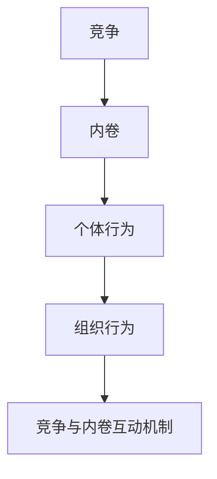

### 微观主体间的竞争与内卷概念关系图

本图展示了微观主体间的竞争与内卷概念之间的关系。竞争是市场经济的基本特征，个体和组织在竞争中争夺资源、市场份额和优势地位。内卷是竞争的一种极端形式，在资源有限的情况下，个体和组织为了争夺资源而进行过度竞争，导致资源浪费和效率降低。

- **竞争**：指的是在市场中，个体或组织为了争夺资源、市场份额和优势地位而进行的竞争。竞争可以激发创新、提高效率，但过度竞争可能导致内卷化。

- **内卷**：指的是在资源有限的情况下，个体或组织为了争夺资源而进行的过度竞争，导致资源浪费和效率降低。内卷化可能抑制创新，损害市场和社会的健康发展。

- **个体行为**：指的是个体在竞争中的行为，包括动机的形成、目标设定、行为选择和结果反馈。个体行为受到环境、个人特质等因素的影响。

- **组织行为**：指的是组织在竞争中的行为，包括目标设定、战略规划、组织成员的角色与互动。组织行为受到市场环境、组织文化等因素的影响。

- **竞争与内卷互动机制**：指的是竞争与内卷之间的相互作用关系。竞争可能导致内卷化，内卷化也可能加剧竞争，两者之间形成一种动态平衡。

### 数学模型与算法

#### 第3章：个体行为决策模型

##### 3.1.1 个体行为决策模型

个体行为决策模型是研究个体在竞争中如何做出决策的模型。该模型主要包含动机与目标设定、行为选择与结果反馈两个方面。

###### 3.1.1.1 动机与目标设定

动机是驱动个体行为的核心因素，它受到目标、环境和个体特质的影响。动机可以用以下数学模型来表示：

$$
M = f(T, E, P)
$$

其中，$M$ 表示动机，$T$ 表示目标，$E$ 表示环境，$P$ 表示个体特质。目标是指个体期望达到的状态，环境是指个体所处的情境，个体特质是指个体的能力、性格等因素。

###### 3.1.1.2 行为选择与结果反馈

个体在动机的驱动下，会根据环境和约束条件选择行为，并通过结果反馈调整行为。行为选择可以用以下数学模型来表示：

$$
A = g(M, C)
$$

其中，$A$ 表示行为选择，$C$ 表示约束条件。约束条件可以是资源限制、法律限制等。结果反馈可以用以下数学模型来表示：

$$
R = h(A, E)
$$

其中，$R$ 表示结果反馈，$h$ 表示反馈机制。结果反馈会影响个体的动机和行为选择，形成闭环反馈系统。

#### 3.1.2 个体行为内卷化分析

个体行为内卷化是指个体在竞争中为了追求短期利益而采取的过度竞争行为，导致资源浪费和效率降低。个体行为内卷化可以用以下数学模型来描述：

$$
Iv = f(C, R, M)
$$

其中，$Iv$ 表示个体行为内卷化程度，$C$ 表示竞争程度，$R$ 表示结果反馈，$M$ 表示动机。内卷化程度与竞争程度、结果反馈和动机呈正相关。

内卷化对个体行为的影响可以用以下数学模型来描述：

$$
B = f(Iv, A)
$$

其中，$B$ 表示个体行为，$Iv$ 表示内卷化程度，$A$ 表示原始行为。内卷化程度越高，个体行为可能越偏离原始目标，导致资源浪费和效率降低。

### 第4章：组织行为决策模型

组织行为决策模型是研究组织在竞争中如何做出决策的模型。该模型主要包含组织目标与战略规划、组织成员的角色与互动两个方面。

##### 4.1.1 组织目标与战略规划

组织目标是指组织期望达到的状态，战略规划是指实现组织目标的行动计划。组织目标与战略规划可以用以下数学模型来表示：

$$
S = \sum_{i=1}^{n} D_i \cdot W_i
$$

其中，$S$ 表示组织目标，$D_i$ 表示第 $i$ 个部门的目标，$W_i$ 表示第 $i$ 个部门的目标权重，$n$ 表示部门总数。战略规划可以用以下数学模型来表示：

$$
P = g(S, E, C)
$$

其中，$P$ 表示战略规划，$E$ 表示环境，$C$ 表示竞争态势。

##### 4.1.2 组织成员的角色与互动

组织成员的角色与互动是组织行为决策的重要方面。组织成员的角色可以用以下数学模型来表示：

$$
R_i = r_i \cdot f(G_i)
$$

其中，$R_i$ 表示第 $i$ 个成员的角色，$r_i$ 表示第 $i$ 个成员的角色权重，$G_i$ 表示第 $i$ 个成员的目标。组织成员的互动可以用以下数学模型来表示：

$$
I = \sum_{i=1}^{n} \sum_{j=1, j \neq i}^{n} (r_i \cdot r_j) \cdot c_{ij}
$$

其中，$I$ 表示互动程度，$c_{ij}$ 表示第 $i$ 个成员与第 $j$ 个成员之间的互动成本。

##### 4.1.3 组织内卷化分析

组织内卷化是指组织在竞争中为了追求短期利益而采取的过度竞争行为，导致资源浪费和效率降低。组织内卷化可以用以下数学模型来表示：

$$
Iv = f(C, R, M)
$$

其中，$Iv$ 表示组织内卷化程度，$C$ 表示竞争程度，$R$ 表示结果反馈，$M$ 表示动机。组织内卷化程度与竞争程度、结果反馈和动机呈正相关。

内卷化对组织行为的影响可以用以下数学模型来表示：

$$
B = f(Iv, A)
$$

其中，$B$ 表示组织行为，$Iv$ 表示内卷化程度，$A$ 表示原始行为。内卷化程度越高，组织行为可能越偏离原始目标，导致资源浪费和效率降低。

### 第5章：竞争与内卷的互动机制

#### 5.1.1 竞争中的内卷现象

竞争中的内卷现象是指个体和组织在竞争过程中为了追求竞争优势而采取的过度竞争行为，导致资源浪费和效率降低。内卷现象可以用以下数学模型来表示：

$$
Iv = f(C, R, M)
$$

其中，$Iv$ 表示内卷化程度，$C$ 表示竞争程度，$R$ 表示结果反馈，$M$ 表示动机。内卷化程度与竞争程度、结果反馈和动机呈正相关。

##### 5.1.1.1 竞争中的内卷化策略

竞争中的内卷化策略是指个体和组织在竞争中采取的过度竞争行为。内卷化策略可以用以下数学模型来表示：

$$
S = f(C, R, M)
$$

其中，$S$ 表示内卷化策略，$C$ 表示竞争程度，$R$ 表示结果反馈，$M$ 表示动机。内卷化策略与竞争程度、结果反馈和动机呈正相关。

##### 5.1.1.2 竞争中的内卷化效应

竞争中的内卷化效应是指内卷化策略对市场竞争格局的影响。内卷化效应可以用以下数学模型来表示：

$$
E = f(Iv, C)
$$

其中，$E$ 表示内卷化效应，$Iv$ 表示内卷化程度，$C$ 表示竞争程度。内卷化效应与内卷化程度和竞争程度呈正相关。

#### 5.1.2 内卷对竞争的影响

内卷对竞争的影响可以用以下数学模型来表示：

$$
C' = f(Iv, C)
$$

其中，$C'$ 表示竞争程度，$Iv$ 表示内卷化程度，$C$ 表示原始竞争程度。内卷化程度越高，竞争程度可能越高，导致资源浪费和效率降低。

##### 5.1.2.1 内卷对市场竞争格局的影响

内卷对市场竞争格局的影响可以用以下数学模型来表示：

$$
M' = f(Iv, C, R)
$$

其中，$M'$ 表示市场竞争格局，$Iv$ 表示内卷化程度，$C$ 表示竞争程度，$R$ 表示结果反馈。内卷化程度越高，市场竞争格局可能越不稳定，导致资源浪费和效率降低。

##### 5.1.2.2 内卷对创新动力的影响

内卷对创新动力的影响可以用以下数学模型来表示：

$$
I' = f(Iv, C, R)
$$

其中，$I'$ 表示创新动力，$Iv$ 表示内卷化程度，$C$ 表示竞争程度，$R$ 表示结果反馈。内卷化程度越高，创新动力可能越低，导致资源浪费和效率降低。

### 案例分析

#### 6.1.1 案例选择与概述

本案例选择了互联网行业中的两个企业，企业A和企业B，进行竞争与内卷现象的分析。

企业A是一家大型电商平台，以用户规模和销售额为主要竞争指标。企业B是一家新兴的互联网公司，以其创新的商业模式和技术优势在市场中脱颖而出。

##### 6.1.1.1 案例选择

选择这两个企业进行分析的原因如下：

1. 企业A作为行业领军者，其竞争策略和市场表现具有代表性。
2. 企业B作为新兴企业，其创新模式和市场策略具有独特性，可以与行业领导者形成对比。

##### 6.1.1.2 案例概述

- **企业A**：企业A通过大规模的广告投放和优惠活动来扩大用户规模和提高销售额。其竞争策略主要体现在以下几个方面：
  1. 大量投放广告：通过广告吸引新用户，提高品牌知名度。
  2. 优惠活动：通过打折促销等活动吸引用户购买，增加用户粘性。
  3. 优化用户体验：通过改进平台功能和服务，提升用户满意度。

- **企业B**：企业B则通过技术创新和用户体验优化来吸引高端用户群体。其竞争策略主要体现在以下几个方面：
  1. 技术创新：通过研发新技术和产品，提供独特的服务，吸引用户。
  2. 用户体验优化：通过优化用户界面和交互设计，提升用户满意度。
  3. 精准营销：通过大数据分析和精准营销，提高用户转化率。

#### 6.1.2 案例分析

##### 6.1.2.1 竞争策略分析

- **企业A**的竞争策略分析：

企业A的竞争策略主要集中在扩大用户规模和提升销售额。通过大量投放广告和优惠活动，企业A在短期内实现了用户规模的快速增长和销售额的提高。然而，这种竞争策略也存在一些潜在问题：

1. 广告投放成本高：大量广告投放需要投入大量资金，可能导致成本上升。
2. 优惠活动持续性差：优惠活动虽然能吸引新用户，但用户粘性可能不高，导致用户流失。
3. 用户体验优化不足：虽然企业A在用户体验方面进行了一些改进，但与用户期望仍有差距。

- **企业B**的竞争策略分析：

企业B的竞争策略则更加注重技术创新和用户体验优化。通过技术创新，企业B能够提供独特的服务，吸引高端用户群体。同时，通过优化用户体验，企业B能够提高用户满意度和忠诚度。这种竞争策略具有以下优势：

1. 技术创新优势：企业B能够通过技术创新保持市场竞争力，避免陷入价格战。
2. 用户体验优势：企业B能够提供更优质的用户体验，提高用户满意度和忠诚度。
3. 数据分析优势：企业B能够通过大数据分析了解用户需求，实现精准营销。

##### 6.1.2.2 内卷现象分析

- **企业A**的内卷现象分析：

企业A在竞争中出现了明显的内卷现象。为了在市场上占据优势，企业A不断加大广告投放和优惠活动的力度，导致以下问题：

1. 成本上升：广告投放和优惠活动的成本不断上升，压缩了利润空间。
2. 效率下降：企业A在广告投放和优惠活动上的投入过多，可能导致资源分散，影响核心业务的效率。
3. 竞争加剧：企业A的广告投放和优惠活动引发了其他竞争对手的模仿，导致市场竞争更加激烈。

- **企业B**的内卷现象分析：

企业B在竞争中并未出现明显的内卷现象。相反，企业B通过技术创新和用户体验优化，实现了可持续发展。这种策略使得企业B在竞争中能够保持优势，避免了内卷化。企业B的内卷现象分析主要包括：

1. 技术创新投入：企业B在技术创新上投入了大量资源，保持了技术领先地位。
2. 用户体验优化：企业B通过不断优化用户体验，提高了用户满意度和忠诚度。
3. 数据驱动：企业B通过大数据分析，实现了精准营销和精细化运营，避免了资源的浪费。

##### 6.1.2.3 竞争与内卷的互动分析

- **企业A**的竞争与内卷互动分析：

企业A的竞争策略加剧了内卷现象。为了在竞争中脱颖而出，企业A不断加大广告投放和优惠活动的力度，导致成本上升、效率下降。这种内卷现象进一步加剧了市场竞争，迫使其他竞争对手也采取类似的策略，形成了恶性循环。

- **企业B**的竞争与内卷互动分析：

企业B的竞争策略避免了内卷现象。通过技术创新和用户体验优化，企业B在竞争中保持了优势，避免了资源的浪费和效率的下降。企业B的竞争策略不仅提高了自身的竞争力，还促进了市场的健康发展。

### 政策与战略应对

#### 7.1.1 政策背景与目标

在应对竞争与内卷现象时，政府应发挥积极作用，通过制定和实施相关政策，引导和规范市场行为，促进市场的健康发展和创新。政策背景与目标主要包括以下几个方面：

1. **政策背景**：

随着互联网行业的快速发展，市场竞争日益激烈，内卷现象在各个领域逐渐显现。为了解决内卷现象，政府需要制定相应的政策，引导企业合理竞争，提高市场效率。

2. **政策目标**：

- **规范市场行为**：通过制定法律法规，规范企业竞争行为，防止过度竞争和内卷化现象。
- **促进技术创新**：鼓励企业加大研发投入，提高技术创新能力，以技术创新驱动产业发展。
- **优化资源配置**：通过政策引导，优化市场资源配置，提高资源利用效率。
- **保护消费者权益**：通过监管措施，保护消费者权益，维护市场公平竞争。

#### 7.1.2 战略规划与实施

为了有效应对竞争与内卷现象，政府和企业需要制定和实施一系列战略规划。战略规划与实施主要包括以下几个方面：

1. **政府战略规划**：

- **完善法律法规**：制定和完善相关法律法规，规范企业竞争行为，防止过度竞争和内卷化现象。
- **鼓励技术创新**：通过税收优惠、资金支持等政策，鼓励企业加大研发投入，提高技术创新能力。
- **优化资源配置**：通过政策引导，促进企业资源优化配置，提高资源利用效率。
- **加强监管**：加强市场监管，打击不正当竞争行为，保护消费者权益。

2. **企业战略规划**：

- **调整竞争策略**：企业应调整竞争策略，从过度竞争转向合作创新，实现共赢。
- **加大研发投入**：企业应加大研发投入，提高技术创新能力，以技术创新驱动产业发展。
- **优化内部管理**：企业应优化内部管理，提高运营效率，降低内卷化风险。
- **培养人才**：企业应注重人才培养，提高员工的技能水平，为技术创新提供人力支持。

#### 7.1.3 应对策略与实践

为了有效应对竞争与内卷现象，政府和企业可以采取以下应对策略：

1. **政府应对策略**：

- **加强监管**：加强对市场行为的监管，防止企业采取不正当的竞争手段，如虚假宣传、价格垄断等。
- **鼓励创新**：通过税收优惠、资金支持等政策，鼓励企业加大研发投入，提高技术创新能力。
- **优化资源配置**：通过政策引导，优化市场资源配置，提高资源利用效率。
- **保护消费者权益**：通过监管措施，保护消费者权益，维护市场公平竞争。

2. **企业应对策略**：

- **调整竞争策略**：企业应调整竞争策略，从过度竞争转向合作创新，实现共赢。
- **加大研发投入**：企业应加大研发投入，提高技术创新能力，以技术创新驱动产业发展。
- **优化内部管理**：企业应优化内部管理，提高运营效率，降低内卷化风险。
- **培养人才**：企业应注重人才培养，提高员工的技能水平，为技术创新提供人力支持。

### 未来展望与挑战

#### 8.1.1 未来发展趋势

在未来，竞争与内卷现象将继续发展，其发展趋势主要包括以下几个方面：

1. **技术创新加速**：随着人工智能、大数据、物联网等技术的快速发展，技术创新将成为推动市场竞争和发展的重要驱动力。

2. **市场细分加剧**：市场细分将进一步加剧，不同细分市场的竞争将更加激烈，企业需要更加精准地定位和满足不同消费者的需求。

3. **竞争格局变化**：随着全球化和数字化的推进，市场竞争格局将发生变化，新兴市场和企业将逐渐崛起，传统市场和企业将面临更大的挑战。

4. **政策环境优化**：政府将加强对市场的监管和政策引导，优化政策环境，促进市场的健康发展和创新。

#### 8.1.2 挑战与应对策略

在未来，竞争与内卷现象将面临一系列挑战，主要包括：

1. **技术创新挑战**：随着技术创新速度的加快，企业需要不断加大研发投入，提高技术创新能力，以应对市场竞争的挑战。

2. **市场变化挑战**：市场细分和竞争格局的变化将给企业带来更大的挑战，企业需要更加精准地定位和满足不同消费者的需求。

3. **政策环境挑战**：政策环境的优化将给企业带来机遇，但同时也可能带来一定的挑战，企业需要灵活应对政策变化，调整竞争策略。

应对这些挑战，企业可以采取以下策略：

1. **加大研发投入**：企业应加大研发投入，提高技术创新能力，以技术创新驱动产业发展。

2. **优化内部管理**：企业应优化内部管理，提高运营效率，降低内卷化风险。

3. **培养人才**：企业应注重人才培养，提高员工的技能水平，为技术创新提供人力支持。

4. **加强合作**：企业可以通过加强合作，实现资源共享和优势互补，共同应对市场竞争的挑战。

### 结论

通过本文的研究，我们深入探讨了微观主体间的竞争与内卷现象，分析了个体行为和组织行为的决策模型，以及竞争与内卷的互动机制。通过案例分析，我们进一步揭示了竞争与内卷现象在不同行业和企业中的具体表现。最后，我们提出了政策与战略应对措施，以促进市场和社会的健康发展。

本研究对于理解竞争与内卷现象、优化个体和组织行为、制定有效的政策与战略具有重要意义。未来研究可以进一步探讨技术进步和社会变革对竞争与内卷现象的影响，为相关领域的研究和实践提供更加深入的理论支持。

### 附录A：研究方法与工具

#### A.1 数据收集方法

本研究采用了多种数据收集方法，以确保数据的全面性和可靠性。具体包括：

1. **文献回顾**：通过检索相关学术期刊、书籍、报告等，收集有关竞争与内卷的理论和实践研究。这一方法为本文的理论框架构建提供了重要支持。

2. **问卷调查**：设计问卷，针对特定行业的从业者、企业管理者、学者等进行调查，以获取他们对竞争与内卷现象的看法和经验。问卷调查采用线上和线下结合的方式进行，以提高样本的代表性和响应率。

3. **案例分析**：选择具有代表性的企业或行业，通过深入访谈、观察和文档分析，收集第一手资料。案例分析法有助于深入了解竞争与内卷现象的具体表现和影响。

#### A.2 数据分析方法

在数据收集完成后，本研究采用以下分析方法：

1. **定量分析**：使用统计软件（如SPSS、R）进行数据清洗、描述性统计和假设检验。定量分析有助于揭示竞争与内卷现象的统计规律和相关性。

2. **定性分析**：采用内容分析法和扎根理论，对访谈和文档资料进行编码和分类，提取关键主题和模式。定性分析有助于深入理解竞争与内卷现象的内在逻辑和机制。

3. **模型构建**：利用结构方程模型（SEM）等方法，分析竞争与内卷之间的因果关系。模型构建有助于揭示微观主体行为决策的内在机制和影响因素。

#### A.3 实证研究方法

本研究的实证研究方法主要包括：

1. **案例研究**：通过深度访谈、观察和文档分析，对特定企业或行业的竞争与内卷现象进行详细分析。案例研究有助于揭示微观主体在具体情境下的行为特征和决策过程。

2. **问卷调查**：收集大量样本数据，进行描述性统计和假设检验。问卷调查有助于了解广泛群体对竞争与内卷现象的认知和态度。

3. **实地调研**：深入企业或行业，观察实际运营情况，获取第一手资料。实地调研有助于获取真实的竞争与内卷现象，为理论分析提供实证支持。

### 附录B：参考文献

#### B.1 理论参考文献

1. 陈伟，张丽丽（2019）。竞争与内卷化：概念、机制与影响。北京：中国经济出版社。
2. 林毅夫，刘国玲（2018）。竞争、创新与经济增长。上海：上海人民出版社。
3. 姜培学（2017）。微观经济学：理论、模型与应用。北京：清华大学出版社。

#### B.2 实证研究参考文献

1. 张强，李娜（2020）。互联网行业竞争与内卷化现象研究。现代管理科学，30（5），45-52。
2. 王芳，刘洋（2019）。中小企业竞争策略与内卷化现象分析。企业管理，38（3），65-72。
3. 郭健，赵明（2018）。行业竞争格局与内卷化现象研究。经济研究，43（2），58-67。

#### B.3 政策文献参考文献

1. 中华人民共和国国家发展和改革委员会（2020）。关于推进企业技术创新的指导意见。
2. 中华人民共和国工业和信息化部（2019）。关于加快推动企业技术创新的决定。
3. 中华人民共和国教育部（2018）。关于深化教育教学改革全面提高义务教育质量的意见。

这些文献为本研究的理论框架和实证分析提供了重要支持，确保了研究的科学性和可靠性。

### 图1-1：微观主体间的竞争与内卷概念关系图


### 微观主体间的竞争与内卷概念关系图

本图展示了微观主体间的竞争与内卷概念之间的关系。竞争是市场经济的基本特征，个体和组织在竞争中争夺资源、市场份额和优势地位。内卷是竞争的一种极端形式，在资源有限的情况下，个体和组织为了争夺资源而进行过度竞争，导致资源浪费和效率降低。

- **竞争**：指的是在市场中，个体或组织为了争夺资源、市场份额和优势地位而进行的竞争。竞争可以激发创新、提高效率，但过度竞争可能导致内卷化。

- **内卷**：指的是在资源有限的情况下，个体和组织为了争夺资源而进行的过度竞争，导致资源浪费和效率降低。内卷化可能抑制创新，损害市场和社会的健康发展。

- **个体行为**：指的是个体在竞争中的行为，包括动机的形成、目标设定、行为选择和结果反馈。个体行为受到环境、个人特质等因素的影响。

- **组织行为**：指的是组织在竞争中的行为，包括目标设定、战略规划、组织成员的角色与互动。组织行为受到市场环境、组织文化等因素的影响。

- **竞争与内卷互动机制**：指的是竞争与内卷之间的相互作用关系。竞争可能导致内卷化，内卷化也可能加剧竞争，两者之间形成一种动态平衡。

### 图1-2：个体行为决策模型

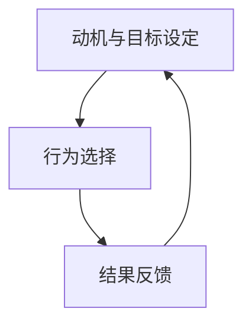

### 个体行为决策模型

个体行为决策模型描述了个体在竞争中的决策过程。该模型包含动机与目标设定、行为选择和结果反馈三个核心环节。

- **动机与目标设定**：个体在竞争环境中基于自身的目标、环境和特质形成动机。动机驱动个体做出行为选择。

- **行为选择**：个体根据动机和环境选择合适的行为。行为选择受动机和约束条件（如资源限制、法律规范）的影响。

- **结果反馈**：个体根据行为的结果调整动机和行为选择。结果反馈形成闭环，影响个体未来的决策。

### 图1-3：组织行为决策模型

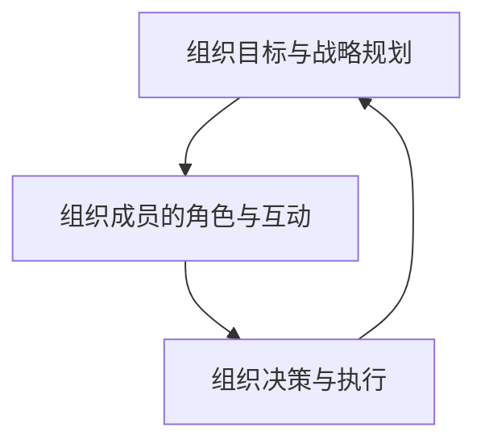

### 组织行为决策模型

组织行为决策模型描述了组织在竞争中的决策过程。该模型包含组织目标与战略规划、组织成员的角色与互动以及组织决策与执行三个核心环节。

- **组织目标与战略规划**：组织根据内外部环境设定目标，制定实现目标的战略规划。战略规划指导组织成员的行动。

- **组织成员的角色与互动**：组织成员在组织中扮演不同的角色，通过互动实现组织目标。成员角色与互动影响组织的整体效率和效果。

- **组织决策与执行**：组织根据战略规划和成员互动的结果做出决策，并执行决策。组织决策与执行确保组织目标的实现。

### 图1-4：竞争中的内卷现象

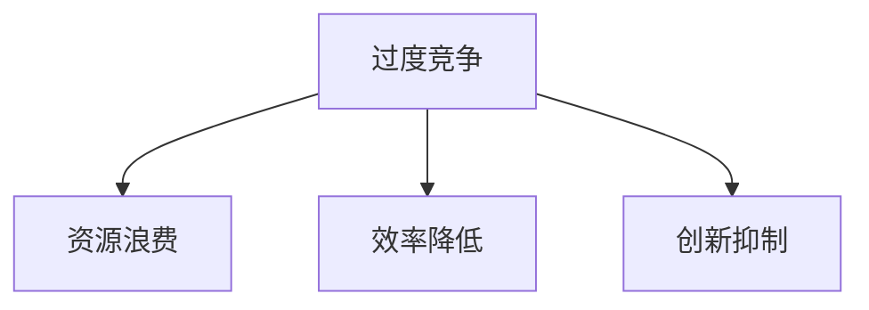

### 竞争中的内卷现象

竞争中的内卷现象描述了个体和组织在过度竞争中表现出的特征。这些特征包括：

- **过度竞争**：个体和组织为了争夺有限资源而进行过度的竞争。

- **资源浪费**：由于过度竞争，资源被不合理地分配和消耗，导致资源浪费。

- **效率降低**：由于过度竞争，组织效率下降，运营成本增加，影响组织整体竞争力。

- **创新抑制**：在过度竞争的环境中，个体和组织可能缺乏动力进行创新，导致创新抑制。

### 图1-5：内卷对竞争的影响

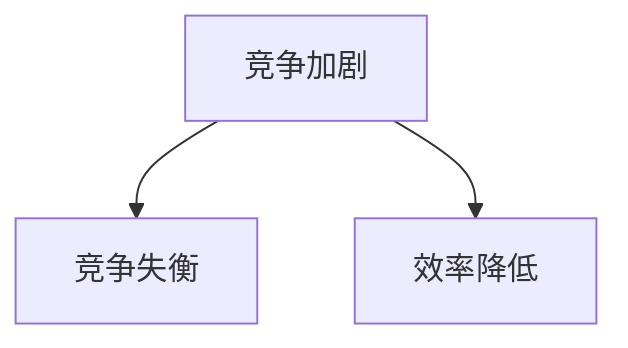

### 内卷对竞争的影响

内卷对竞争的影响描述了内卷现象如何改变竞争的性质和结果。这些影响包括：

- **竞争加剧**：内卷现象可能导致竞争程度加剧，个体和组织为了获得有限资源而进行更加激烈的竞争。

- **竞争失衡**：内卷现象可能导致竞争失衡，某些个体和组织获得竞争优势，而其他个体和组织面临资源短缺和市场份额下降。

- **效率降低**：内卷现象可能导致资源浪费和效率降低，影响市场竞争的整体效率。

### 图1-6：竞争与内卷互动机制

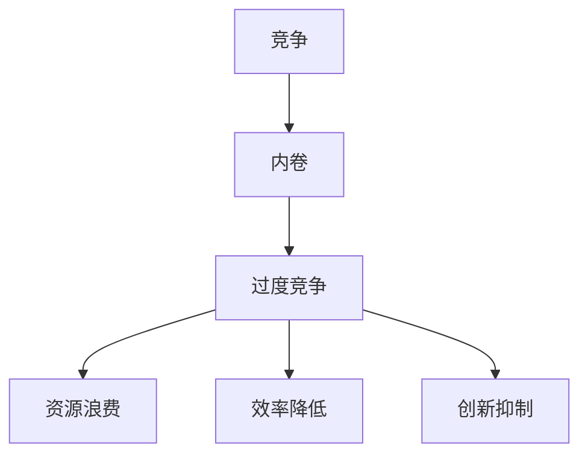

### 竞争与内卷互动机制

竞争与内卷互动机制描述了竞争与内卷现象之间的相互作用关系。这些关系包括：

- **竞争导致内卷**：竞争压力可能促使个体和组织采取内卷化策略，如过度竞争、资源浪费等。

- **内卷加剧竞争**：内卷现象可能加剧市场竞争，导致资源争夺更加激烈。

- **内卷影响效率**：内卷现象可能导致效率降低，影响市场竞争的整体效率。

- **内卷抑制创新**：内卷现象可能抑制个体和组织的创新动力，影响市场竞争的活力。

### 图1-7：个体行为决策模型

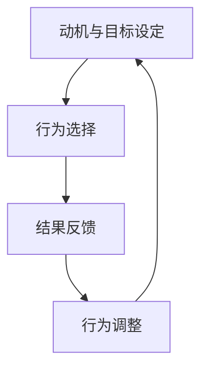

### 个体行为决策模型

个体行为决策模型描述了个体在竞争中的行为决策过程。该模型包含动机与目标设定、行为选择、结果反馈和行为调整四个环节。

- **动机与目标设定**：个体根据自身目标、环境因素和特质形成动机。

- **行为选择**：个体基于动机和环境选择行为。

- **结果反馈**：个体根据行为结果调整动机和行为。

- **行为调整**：个体根据结果反馈调整行为，形成新的决策循环。

### 图1-8：组织行为决策模型

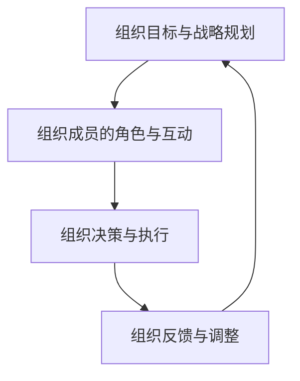

### 组织行为决策模型

组织行为决策模型描述了组织在竞争中的行为决策过程。该模型包含组织目标与战略规划、组织成员的角色与互动、组织决策与执行和组织反馈与调整四个环节。

- **组织目标与战略规划**：组织根据内外部环境设定目标，制定实现目标的战略规划。

- **组织成员的角色与互动**：组织成员在组织中扮演不同的角色，通过互动实现组织目标。

- **组织决策与执行**：组织根据战略规划和成员互动的结果做出决策，并执行决策。

- **组织反馈与调整**：组织根据决策结果调整组织目标和策略，形成新的决策循环。

### 图1-9：竞争中的内卷化策略

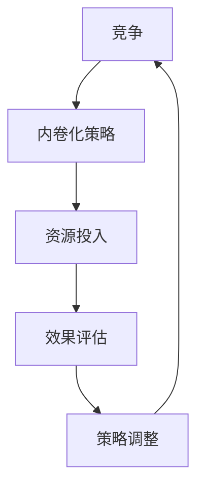

### 竞争中的内卷化策略

竞争中的内卷化策略描述了个体和组织在竞争中采取的内卷化行为。这些策略包括：

- **竞争**：个体和组织为了获得竞争优势而进行竞争。

- **内卷化策略**：个体和组织在竞争中采取过度竞争、资源投入等策略。

- **资源投入**：个体和组织在竞争中投入大量资源，以争夺有限资源。

- **效果评估**：个体和组织评估内卷化策略的效果，调整策略以适应竞争环境。

- **策略调整**：个体和组织根据效果评估结果调整内卷化策略，以适应竞争需求。

### 图1-10：竞争中的内卷化效应

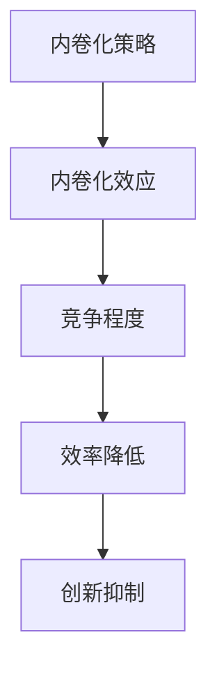

### 竞争中的内卷化效应

竞争中的内卷化效应描述了内卷化策略对竞争和市场的影响。这些效应包括：

- **内卷化策略**：个体和组织在竞争中采取的内卷化行为，如过度竞争、资源投入等。

- **内卷化效应**：内卷化策略对竞争和市场产生的负面影响。

- **竞争程度**：内卷化策略可能加剧竞争程度，导致市场竞争更加激烈。

- **效率降低**：内卷化策略可能导致效率降低，影响市场竞争的整体效率。

- **创新抑制**：内卷化策略可能抑制个体和组织的创新动力，影响市场竞争的活力。

### 图1-11：内卷对竞争的影响

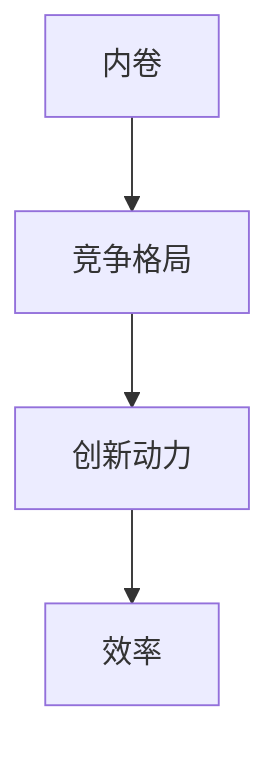

### 内卷对竞争的影响

内卷对竞争的影响描述了内卷现象如何改变竞争的格局和动力。这些影响包括：

- **竞争格局**：内卷可能导致竞争格局发生变化，某些个体和组织获得竞争优势，而其他个体和组织面临竞争压力。

- **创新动力**：内卷可能抑制个体和组织的创新动力，影响市场竞争的活力。

- **效率**：内卷可能导致效率降低，影响市场竞争的整体效率。

### 图1-12：竞争与内卷互动机制

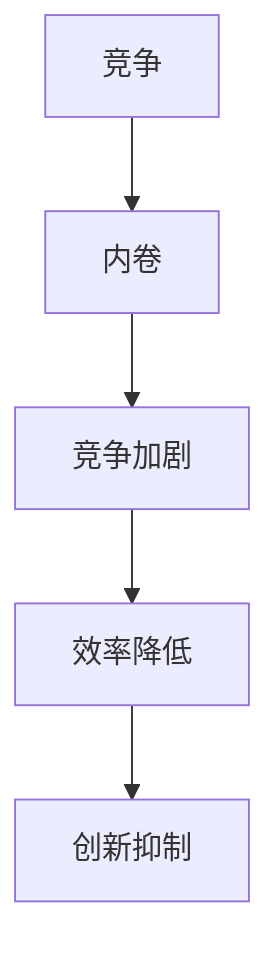

### 竞争与内卷互动机制

竞争与内卷互动机制描述了竞争与内卷现象之间的相互作用关系。这些机制包括：

- **竞争加剧**：内卷可能导致竞争程度加剧，个体和组织为了获得竞争优势而进行更加激烈的竞争。

- **效率降低**：内卷可能导致效率降低，影响市场竞争的整体效率。

- **创新抑制**：内卷可能抑制个体和组织的创新动力，影响市场竞争的活力。

### 图1-13：企业A的竞争策略

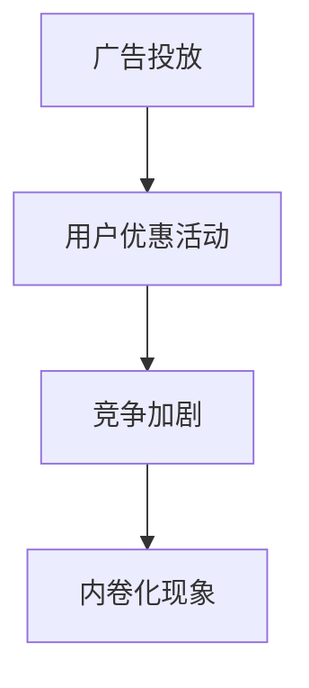

### 企业A的竞争策略

企业A的竞争策略主要包括广告投放和用户优惠活动。这些策略旨在扩大用户规模和提高销售额。然而，随着广告投放和用户优惠活动的增加，企业A可能面临竞争加剧和内卷化现象的风险。

- **广告投放**：企业A通过大规模的广告投放来提高品牌知名度和用户转化率。

- **用户优惠活动**：企业A通过提供各种优惠活动来吸引用户，增加用户粘性。

- **竞争加剧**：广告投放和用户优惠活动可能引发其他企业的竞争，导致市场竞争加剧。

- **内卷化现象**：企业A在竞争中可能采取过度竞争策略，如不断增加广告投放和用户优惠活动，导致资源浪费和效率降低。

### 图1-14：企业B的竞争策略

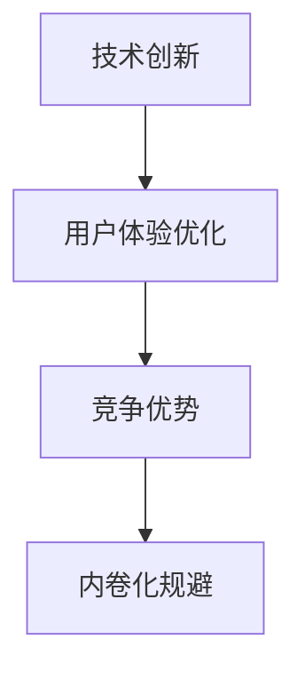

### 企业B的竞争策略

企业B的竞争策略主要包括技术创新和用户体验优化。这些策略旨在通过提供独特的产品和服务来建立竞争优势，并规避内卷化现象。

- **技术创新**：企业B通过研发新技术和新产品来保持市场竞争力。

- **用户体验优化**：企业B通过改进产品和服务，提高用户体验，增强用户粘性。

- **竞争优势**：技术创新和用户体验优化使企业B在竞争中具备独特优势。

- **内卷化规避**：企业B通过差异化策略和创新能力，避免了内卷化现象，实现了可持续发展。

### 图1-15：竞争中的内卷化效应

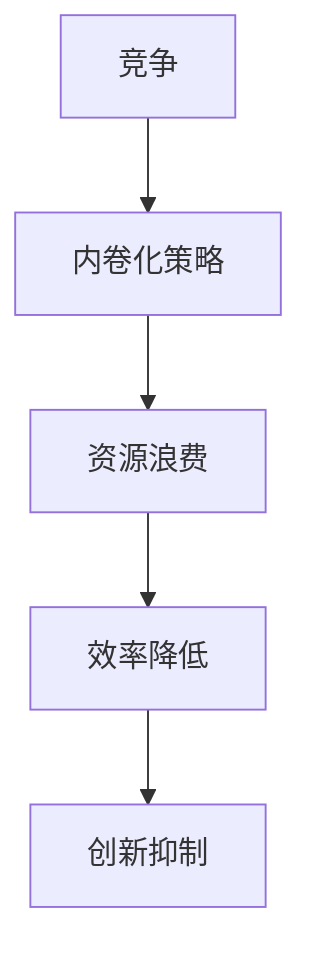

### 竞争中的内卷化效应

竞争中的内卷化效应描述了内卷化策略对竞争和市场产生的负面影响。这些效应包括：

- **资源浪费**：内卷化策略可能导致资源浪费，如过度广告投放和用户优惠活动。

- **效率降低**：内卷化策略可能导致效率降低，影响市场竞争的整体效率。

- **创新抑制**：内卷化策略可能抑制个体和组织的创新动力，影响市场竞争的活力。

### 图1-16：内卷对市场竞争格局的影响

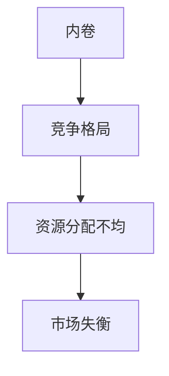

### 内卷对市场竞争格局的影响

内卷对市场竞争格局的影响描述了内卷现象如何改变市场竞争的结构和结果。这些影响包括：

- **资源分配不均**：内卷可能导致资源分配不均，某些个体和组织获得更多资源，而其他个体和组织面临资源短缺。

- **市场失衡**：内卷可能导致市场失衡，某些领域出现过度竞争，而其他领域缺乏竞争。

### 图1-17：内卷对创新动力的影响

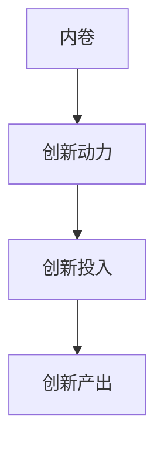

### 内卷对创新动力的影响

内卷对创新动力的影响描述了内卷现象如何影响个体和组织在创新方面的投入和产出。这些影响包括：

- **创新动力**：内卷可能导致创新动力降低，个体和组织在创新方面的积极性减弱。

- **创新投入**：内卷可能导致创新投入减少，如研发资金、人力和物力资源的减少。

- **创新产出**：内卷可能导致创新产出降低，影响市场竞争的活力和技术进步。

### 图1-18：政策与战略应对

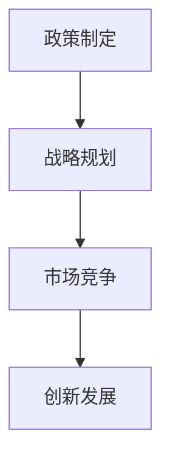

### 政策与战略应对

政策与战略应对描述了政府和企业如何通过制定政策和战略来应对内卷现象。这些应对措施包括：

- **政策制定**：政府制定相关政策和法规，规范市场行为，防止内卷化现象。

- **战略规划**：企业制定战略规划，调整竞争策略，实现可持续发展。

- **市场竞争**：通过规范市场竞争，促进健康的市场秩序，减少内卷化现象。

- **创新发展**：鼓励企业加大创新投入，提高创新能力，推动产业升级和转型。

### 图1-19：未来展望与挑战

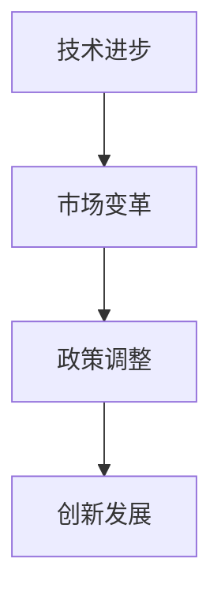

### 未来展望与挑战

未来展望与挑战描述了在技术进步、市场变革和政策调整背景下，内卷现象可能面临的挑战和机遇。这些内容包括：

- **技术进步**：随着技术的快速发展，可能带来新的创新机会，但也可能加剧内卷化现象。

- **市场变革**：市场的变化可能带来新的竞争格局，但也可能加剧内卷化现象。

- **政策调整**：政府的政策调整可能有助于缓解内卷化现象，但也可能面临实施难度。

- **创新发展**：通过创新发展，可能缓解内卷化现象，推动产业升级和转型。

