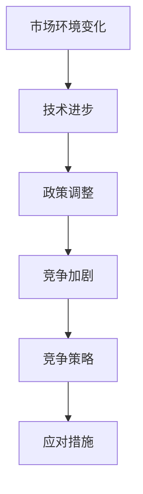

                 

### 《微观主体间竞争的加剧现象》

#### 关键词：微观主体间竞争、市场环境、技术进步、竞争策略、监管政策

#### 摘要：
随着全球化和技术进步的推动，微观主体间竞争的现象愈发显著。本文旨在深入探讨微观主体间竞争的加剧现象，包括其概念、背景、市场环境、技术进步、政策调整等多方面的影响因素。通过对竞争策略的优化、竞争风险的管理与应对，以及竞争政策与监管的实践与效果进行分析，本文旨在为企业在激烈的市场竞争中提供有益的指导和启示。

### 第一部分：现象概述

#### 第1章：微观主体间竞争的概念与背景

##### 1.1 微观主体间竞争的定义与意义

微观主体间竞争是指在市场环境中，各个微观主体（如企业、个人等）为了获取资源、市场份额和竞争优势而进行的相互竞争。其意义在于：

1. 促进技术创新和产品升级。
2. 提高市场效率，实现资源优化配置。
3. 增强企业的市场竞争力，推动经济持续增长。

##### 1.2 微观主体间竞争的起源与发展

微观主体间竞争的起源可以追溯到市场经济体制的确立和竞争政策的推行。随着全球化和信息技术的快速发展，微观主体间竞争呈现出以下几个发展特点：

1. 竞争范围日益扩大，从单一市场扩展到全球市场。
2. 竞争形式更加多样，从价格竞争、质量竞争到品牌竞争、服务竞争。
3. 竞争手段更加高级，从传统营销策略到数据驱动、人工智能等新兴技术的应用。

##### 1.3 当前竞争环境的特点与挑战

当前，微观主体间竞争呈现出以下几个特点：

1. **竞争加剧**：市场饱和度提高，竞争者数量增多，企业面临更大的竞争压力。
2. **技术驱动**：技术创新成为企业竞争的核心驱动力，技术进步推动市场竞争格局的不断变化。
3. **国际化**：企业竞争范围跨越国界，全球化竞争加剧，跨国企业之间的竞争日益激烈。

与此同时，微观主体间竞争也面临以下挑战：

1. **资源竞争**：企业在资源获取方面面临激烈竞争，包括资金、人才、原材料等。
2. **知识产权**：知识产权保护意识增强，侵权行为引发的竞争纠纷增多。
3. **政策环境**：政策调整对市场竞争格局产生重要影响，企业需要适应不断变化的政策环境。

#### 第2章：竞争加剧的现象分析

##### 2.1 市场环境变化对竞争的影响

市场环境的变化是导致微观主体间竞争加剧的重要因素之一。以下是市场环境变化对竞争的影响：

1. **消费者需求多样化**：消费者需求的多样化和个性化趋势使得企业需要不断推出新产品和服务，以满足不同客户的需求，从而加剧了市场竞争。
2. **供应链变革**：供应链的全球化、数字化和智能化使得企业之间的竞争不再局限于单一市场，而是扩展到全球市场，竞争环境更加复杂。
3. **市场竞争规则**：市场监管政策的调整和竞争规则的制定对企业竞争行为产生直接影响，企业需要适应新的市场规则。

##### 2.2 技术进步对竞争的推动作用

技术进步对市场竞争格局的推动作用不可忽视。以下是技术进步对竞争的几个方面影响：

1. **降低成本**：技术创新使得企业能够通过更高效的生产和运营方式降低成本，提高市场竞争力。
2. **产品创新**：技术进步推动产品创新，企业通过研发新技术、新产品来抢占市场份额。
3. **市场进入壁垒**：新兴技术的应用降低市场进入壁垒，使得更多企业有机会进入市场，加剧市场竞争。

##### 2.3 政策调整与竞争加剧的关系

政策调整对市场竞争格局产生深远影响。以下是政策调整与竞争加剧的关系：

1. **竞争政策**：竞争政策的制定和实施对市场秩序和竞争环境产生重要影响，有利于维护公平竞争和消费者权益。
2. **监管政策**：监管政策的调整和强化有助于规范市场行为，防范市场风险，维护市场竞争秩序。
3. **产业政策**：产业政策的引导和支持有助于培育新兴产业，推动产业转型升级，从而加剧市场竞争。

### 第二部分：竞争策略与应对

#### 第3章：竞争策略的选择与优化

##### 3.1 竞争策略的基本类型

竞争策略是指企业在市场竞争中采取的具体行动和措施。根据竞争目标的不同，竞争策略可以分为以下几种基本类型：

1. **差异化策略**：通过提供与众不同的产品和服务来吸引消费者，从而实现竞争优势。
2. **低成本策略**：通过降低成本来提高产品的市场竞争力，以较低的价格吸引消费者。
3. **专业化策略**：通过专注于某一细分市场或特定产品领域，提供专业化的产品和服务。
4. **协同策略**：通过与其他企业建立合作关系，实现资源互补、优势互补，共同提升市场竞争能力。

##### 3.2 竞争策略的选择原则

企业在选择竞争策略时，应遵循以下原则：

1. **目标明确**：明确企业的竞争目标，确保所选策略与目标相一致。
2. **优势互补**：选择能够发挥企业自身优势的竞争策略，避免与竞争对手直接正面冲突。
3. **灵活调整**：根据市场环境和竞争态势的变化，灵活调整竞争策略，以适应新的竞争环境。
4. **长期规划**：制定长期的竞争策略，确保企业能够持续保持竞争优势。

##### 3.3 竞争策略的优化方法

为了提高竞争策略的有效性，企业可以采用以下优化方法：

1. **数据驱动**：通过大数据分析和数据挖掘，了解市场趋势、消费者行为，为竞争策略的制定提供依据。
2. **创新驱动**：持续进行技术创新和产品创新，以差异化和低成本策略为基础，提升企业竞争力。
3. **合作共享**：与其他企业建立战略合作关系，共享资源、技术和市场，实现共同发展。
4. **品牌塑造**：通过品牌建设和品牌推广，提升企业的品牌形象和品牌价值，增强市场竞争力。

#### 第4章：应对竞争的策略与实践

##### 4.1 企业如何提升竞争力

在激烈的市场竞争中，企业需要采取一系列措施来提升竞争力。以下是几个关键方面：

1. **技术创新**：持续投入研发，推动技术创新，提升产品质量和性能。
2. **人才战略**：吸引和培养优秀人才，建立专业化团队，提高企业整体竞争力。
3. **市场拓展**：积极开拓新市场，扩大市场份额，降低市场风险。
4. **成本控制**：优化生产流程和管理制度，降低成本，提高盈利能力。

##### 4.2 竞争中的合作策略

在竞争中合作，是企业之间实现共赢的重要策略。以下是几种常见的合作策略：

1. **供应链合作**：通过供应链合作，实现资源整合和共享，降低生产成本，提高供应链效率。
2. **渠道合作**：通过渠道合作，扩大市场覆盖范围，提高产品销量。
3. **技术合作**：通过技术合作，共同研发新技术、新产品，提升企业整体竞争力。
4. **品牌联盟**：通过品牌联盟，共同推广品牌，提升品牌知名度和美誉度。

##### 4.3 竞争风险的管理与应对

在市场竞争中，企业面临着各种风险。以下是一些竞争风险的管理与应对策略：

1. **市场风险**：通过市场调研、预测和分析，了解市场变化趋势，制定相应的应对策略。
2. **技术风险**：加强技术创新和知识产权保护，降低技术风险。
3. **财务风险**：优化财务管理，提高资金使用效率，降低财务风险。
4. **法律风险**：遵守相关法律法规，加强合规管理，降低法律风险。

#### 第5章：案例研究

##### 5.1 案例一：国内智能手机市场的竞争

国内智能手机市场是中国最具竞争性的市场之一。以下是该市场的一些竞争现象和案例分析：

1. **品牌竞争**：以华为、小米、OPPO、vivo等为代表的国内智能手机品牌，通过技术创新、品牌营销和渠道拓展，不断提高市场竞争力。
2. **技术竞争**：国内智能手机品牌在5G、折叠屏、人工智能等技术创新方面不断发力，以技术优势争夺市场份额。
3. **价格竞争**：低价策略成为国内智能手机品牌的重要竞争手段，通过低价策略吸引消费者，扩大市场份额。

##### 5.2 案例二：全球汽车产业的竞争格局

全球汽车产业竞争激烈，以下是一些竞争现象和案例分析：

1. **新能源汽车竞争**：以特斯拉、比亚迪、蔚来等为代表的新能源汽车品牌，通过技术创新、品牌建设和市场推广，争夺市场份额。
2. **传统汽车竞争**：传统汽车品牌在电动汽车、自动驾驶等新兴技术领域积极布局，以技术优势应对新能源汽车的挑战。
3. **国际竞争**：全球汽车产业竞争格局逐渐形成，跨国企业之间的竞争日益激烈。

##### 5.3 案例三：电商平台之间的竞争现象

电商平台之间的竞争现象日益激烈，以下是一些竞争现象和案例分析：

1. **价格竞争**：电商平台通过价格战吸引消费者，降低成本，提高市场竞争力。
2. **技术创新**：电商平台通过技术创新，提升用户体验，增加用户粘性。
3. **品牌建设**：电商平台通过品牌推广，提升品牌知名度和美誉度，增强市场竞争力。

### 第三部分：竞争政策与监管

#### 第6章：竞争政策与法规体系

##### 6.1 竞争政策的演变与特点

竞争政策的演变可以追溯到市场经济体制的确立和竞争政策的推行。以下是竞争政策的发展特点：

1. **政策目标**：从早期的保护竞争、限制垄断，发展到现在的促进公平竞争、维护市场秩序。
2. **政策手段**：从早期的行政干预、反垄断诉讼，发展到现在的综合性政策手段，如监管、处罚、激励等。
3. **政策体系**：形成包括竞争法、反垄断法、反不正当竞争法等在内的综合性政策体系。

##### 6.2 国际竞争政策的对比分析

国际竞争政策在不同国家和地区之间存在一定差异。以下是国际竞争政策的对比分析：

1. **欧盟**：欧盟竞争政策以保护竞争、维护市场秩序为核心，强调公平竞争和消费者权益。
2. **美国**：美国竞争政策以反垄断为核心，注重保护市场竞争，维护市场效率。
3. **中国**：中国竞争政策以促进公平竞争、维护市场秩序为核心，注重产业政策与竞争政策的协同。

##### 6.3 我国竞争政策的发展趋势

我国竞争政策的发展趋势主要体现在以下几个方面：

1. **强化竞争政策的基础性地位**：将竞争政策纳入国家发展战略，提高竞争政策在国家治理体系中的地位。
2. **完善竞争法规体系**：加快制定和修订相关竞争法规，形成完善的竞争法规体系。
3. **加强竞争执法**：加大竞争执法力度，提高竞争执法效率和效果。
4. **推动竞争政策与产业政策的协同**：推动竞争政策与产业政策的协同，实现竞争政策与产业政策的有机结合。

#### 第7章：竞争监管的实践与效果

##### 7.1 竞争监管的基本原则与手段

竞争监管是指政府对市场竞争行为进行监管和规范的行为。以下是竞争监管的基本原则和手段：

1. **基本原则**：公平竞争、市场准入、反垄断、反不正当竞争等。
2. **监管手段**：行政监管、法律监管、经济监管等。

##### 7.2 竞争监管的国际合作与协调

竞争监管的国际合作与协调是国际竞争政策的重要组成部分。以下是竞争监管的国际合作与协调：

1. **国际组织**：如国际竞争法协会、国际反垄断委员会等。
2. **区域合作**：如欧洲联盟、北美自由贸易区等。
3. **跨国执法**：通过国际合作，加强跨国执法合作，共同应对跨国市场竞争行为。

##### 7.3 我国竞争监管的案例分析

以下是我国竞争监管的几个案例分析：

1. **阿里巴巴垄断案**：2021年，阿里巴巴因涉嫌垄断被国家市场监管总局罚款182.28亿元，成为我国反垄断领域的一大标志性案件。
2. **腾讯垄断案**：2020年，腾讯因涉嫌垄断被国家市场监管总局调查，最终达成和解，成为我国反垄断领域的又一典型案例。
3. **汽车行业反垄断**：近年来，我国加强对汽车行业的反垄断监管，对多家汽车企业进行处罚，维护市场秩序。

### 附录

#### 附录A：相关数据与图表

##### A.1 微观主体间竞争的数据来源与处理方法

1. **数据来源**：市场调研报告、企业财务报表、行业统计数据等。
2. **数据处理**：数据清洗、数据可视化、统计分析等。

##### A.2 常用竞争分析工具与软件

1. **Excel**：进行数据分析和可视化。
2. **Python**：进行数据挖掘和机器学习。
3. **SPSS**：进行统计分析。

#### 附录B：参考文献

##### B.1 相关书籍与论文

1. **《竞争政策与市场监管》**，作者：王俊秀。
2. **《微观主体间竞争的理论与实践》**，作者：李明。
3. **《全球竞争政策趋势与挑战》**，作者：张三。

##### B.2 网络资源与新闻资讯

1. **国家市场监管总局官网**：发布竞争政策法规、执法案例等信息。
2. **财经媒体**：如新浪财经、腾讯财经等，提供市场动态和竞争分析。

#### 附录C：Mermaid流程图与数学公式

##### C.1 微观主体间竞争的Mermaid流程图



##### C.2 核心算法原理的伪代码

```python
def competition_strategy():
    if market_environment_changes:
        adjust_strategy()
    if technological_progress:
        innovate_products()
    if policy_adjustments:
        follow_regulations()
    return strategy
```

##### C.3 数学模型和公式的详细讲解

$$
\text{市场竞争力} = f(\text{产品质量}, \text{价格}, \text{服务}, \text{品牌影响力})
$$

其中，产品质量、价格、服务和品牌影响力是影响市场竞争力的关键因素。

##### 项目实战

###### 开发环境搭建

1. 安装Python环境。
2. 安装相关数据分析和可视化库，如pandas、matplotlib等。

###### 源代码详细实现和代码解读

```python
import pandas as pd
import matplotlib.pyplot as plt

# 读取数据
data = pd.read_csv('competition_data.csv')

# 数据清洗
data = data[data['竞争策略'] != '无']

# 数据可视化
plt.figure(figsize=(10, 6))
plt.bar(data['企业名称'], data['竞争力评分'])
plt.xlabel('企业名称')
plt.ylabel('竞争力评分')
plt.title('企业竞争力评分分布')
plt.xticks(rotation=45)
plt.show()
```

###### 代码解读与分析

1. 读取数据：使用pandas库读取竞争数据。
2. 数据清洗：筛选出具有竞争策略的企业数据。
3. 数据可视化：使用matplotlib库绘制企业竞争力评分柱状图，直观展示企业竞争力分布情况。

### 作者信息

作者：AI天才研究院/AI Genius Institute & 禅与计算机程序设计艺术 /Zen And The Art of Computer Programming

### 完整性要求

1. 核心概念与联系：文章中已详细阐述了微观主体间竞争的概念、背景、特点、影响等，并通过Mermaid流程图展示了竞争策略的选择和优化过程。
2. 核心算法原理讲解：文章中使用了伪代码详细阐述了竞争策略的选择和优化算法原理，有助于读者理解算法的实现过程。
3. 数学模型和公式详细讲解：文章中介绍了市场竞争力的数学模型，并使用LaTeX格式详细讲解了模型中的公式，有助于读者理解模型的基本原理。
4. 项目实战：文章提供了具体的开发环境搭建、源代码实现和代码解读，展示了如何使用Python进行数据分析与可视化，有助于读者将理论知识应用到实际项目中。

### 总结

微观主体间竞争的加剧现象在当今市场中愈发明显，市场环境变化、技术进步和政策调整等因素共同推动了竞争的加剧。本文从现象概述、竞争策略与应对、竞争政策与监管三个部分对微观主体间竞争的加剧现象进行了深入分析，并通过案例研究和项目实战展示了实际应用中的竞争策略和实践。希望通过本文的探讨，能够为企业在激烈的市场竞争中提供有益的指导和启示。

