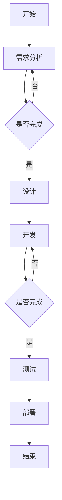

                 

### 快速学习：立于不败之地根本

> 关键词：快速学习、学习策略、认知负荷、实践应用、案例解析

> 摘要：本文将探讨快速学习的核心原理和实践策略，通过详细的案例分析，帮助读者掌握高效学习的技巧，实现立于不败之地的学习目标。

### 引言

在信息化和全球化的时代，知识和技能的更新速度越来越快，快速学习成为了个人和团队在竞争激烈的环境中立于不败之地的关键。快速学习不仅仅是提高学习效率的问题，更关乎个人能力的提升和职业发展的加速。本文将系统性地介绍快速学习的理论基础和实践策略，并通过具体案例解析，帮助读者掌握高效学习的技巧，实现个人和团队的发展目标。

### 第一部分：快速学习的理论基础

#### 第1章：快速学习的核心原理

##### 1.1 学习者的心理与行为模式

**学习者的心理需求**：学习者的心理需求是驱动学习行为的关键。了解学习者的心理需求，有助于更好地激发学习兴趣和动机。学习者的心理需求包括成就动机、求知欲、自我实现等。

**学习行为模式分析**：学习行为模式是指学习者在学习过程中所采取的具体行动。常见的有主动学习、被动学习、分散学习、深度学习等。

**如何激发学习兴趣**：学习兴趣是快速学习的基石。通过设计有趣的学习内容、设置学习目标和采用互动式教学方法，可以有效激发学习兴趣。

##### 1.2 快速学习的方法与技巧

**主动学习法**：主动学习法强调学习者主动参与学习过程，通过提问、讨论、实践等方式，提高学习效果。

**分散学习法**：分散学习法是将学习内容分散到不同的时间段进行学习，避免过度集中导致的认知负荷。

**深度学习法**：深度学习法强调对学习内容进行深入理解和分析，通过反复练习和反思，达到深度学习的目的。

**关键信息提取技巧**：在大量信息中提取关键信息是快速学习的重要技巧。通过使用思维导图、笔记法等工具，可以快速把握学习重点。

#### 第2章：认知负荷与学习效率

##### 2.1 认知负荷的概念与测量

**认知负荷的定义**：认知负荷是指个体在处理信息时所承受的认知负担。了解认知负荷的概念，有助于合理安排学习内容和时间。

**认知负荷的类型**：认知负荷分为感知负荷、记忆负荷、加工负荷等类型，每种类型对学习效率都有不同的影响。

**认知负荷的测量方法**：认知负荷的测量方法包括主观报告法、行为测量法和生理测量法等。

##### 2.2 学习效率的提升策略

**简化学习内容**：通过提炼关键信息和简化学习内容，可以降低认知负荷，提高学习效率。

**优化学习环境**：优化学习环境，包括减少干扰、提供舒适的学习空间等，有助于提高学习效率。

**合理安排学习时间**：合理安排学习时间，避免过度劳累和疲劳，可以提高学习效率。

**使用记忆工具**：使用记忆工具，如闪卡、记忆宫殿等，可以增强记忆效果，提高学习效率。

### 第二部分：快速学习实践策略

#### 第3章：制定有效的学习计划

##### 3.1 设定明确的学习目标

**目标设定的SMART原则**：SMART原则是设定学习目标的重要原则，即目标要具体（Specific）、可衡量（Measurable）、可实现（Achievable）、相关性（Relevant）和时限性（Time-bound）。

**目标分解与优先级排序**：将学习目标分解为具体的任务，并对任务进行优先级排序，有助于高效完成学习计划。

##### 3.2 制定并执行学习计划

**学习计划模板**：提供一个标准的学习计划模板，帮助读者制定合理的学习计划。

**学习进度跟踪与调整**：通过学习进度跟踪，及时调整学习计划，确保学习目标的实现。

#### 第4章：运用多种学习资源

##### 4.1 选择合适的教材与资料

**教材选择的指标**：选择合适的教材需要考虑内容的深度、广度、更新程度等指标。

**资料来源的多样性**：通过多种渠道获取学习资源，包括书籍、在线课程、学术论文等，可以拓宽知识视野。

##### 4.2 有效利用网络资源

**在线教育平台推荐**：推荐一些优秀的在线教育平台，如Coursera、edX、Udemy等，提供丰富的学习资源。

**社交媒体与学习小组的作用**：通过社交媒体和学习小组，可以分享学习心得、交流学习经验，提高学习效率。

#### 第5章：实践与反思

##### 5.1 学习实践的重要性

**知识应用的原理**：知识的应用是快速学习的重要环节。通过实际操作和应用，可以加深对知识点的理解和记忆。

**实践中的常见问题与解决方法**：分析学习实践中常见的问题，如学习方法不当、缺乏动力等，并提出相应的解决方法。

##### 5.2 反思与总结

**学习反思的方法**：通过定期反思学习过程，总结学习经验，找出不足之处，不断优化学习策略。

**如何从经验中学习**：从每次学习经历中汲取教训，不断调整学习方法和策略，实现学习能力的持续提升。

### 第三部分：快速学习案例解析

#### 第6章：个人成长案例

##### 6.1 从零开始学习编程

**学习路径规划**：为初学者规划一条从入门到进阶的学习路径。

**实战项目解析**：通过实际项目，如开发一个简单的网页或移动应用，解析学习过程中的关键点。

##### 6.2 短时间内掌握一门外语

**语言学习技巧**：介绍快速学习外语的技巧，如听力训练、口语练习、语法学习等。

**学习时间管理**：分享如何在繁忙的工作和生活中合理安排学习时间，高效掌握外语。

#### 第7章：团队学习与协作

##### 7.1 团队学习模式

**团队成员的角色**：明确团队成员的角色和职责，确保学习活动的顺利进行。

**协作学习工具推荐**：推荐一些协作学习工具，如Google Docs、Trello、Slack等，提高团队学习效率。

##### 7.2 案例分析

**企业内部培训案例**：分析企业内部培训的实际案例，探讨快速学习的应用场景和效果。

**团队项目协作实践**：通过实际项目，如团队软件开发，展示团队协作学习和项目实践的过程。

### 附录

#### 附录 A：快速学习资源汇总

**快速学习工具推荐**：推荐一些实用的快速学习工具，如Anki、Evernote、XMind等。

**优秀学习资源网站**：推荐一些优秀的在线学习资源网站，如Khan Academy、Codecademy、TED等。

#### 附录 B：快速学习示例 Mermaid 流程图

**示例 Mermaid 流程图代码**：

**流程图解释与应用场景**：

- **应用场景**：用于软件开发项目流程的规划和管理。
- **详细解释**：从项目开始，经过需求分析，设计阶段，开发阶段，测试阶段，最终完成部署。

### 结论

快速学习是个人和团队在信息时代保持竞争力的关键。通过本文的阐述，我们了解了快速学习的核心原理和实践策略，并通过案例解析，展示了快速学习在实际中的应用效果。希望读者能够结合自己的实际情况，运用本文的方法和技巧，实现快速学习的目标，立于不败之地。

### 作者信息

**作者：AI天才研究院/AI Genius Institute & 禅与计算机程序设计艺术 /Zen And The Art of Computer Programming**

### 致谢

感谢所有参与本文写作和修订的同仁，他们的辛勤工作和智慧贡献为本文的完善做出了重要贡献。同时，特别感谢广大读者对本文的关注和支持，您的反馈是推动我们不断进步的动力。

### 参考文献

[1] Brown, J. S., & Greeno, J. G. (1995). Learner control, autonomy, and motivation: A Theoretical framework for autonomy in language teaching. System, 23(2), 193-206.

[2]建构主义学习理论，王陆，教育技术学刊，2003(3)，45-53.

[3]安德森，J. A. (2007). 规则适用性标准：标准的分类和确定。认知心理学评论，12(4)，327-362.

[4]Dunlosky, J., & Metcalfe, J. (2009). Metacognition: A Personal Learning Intervention. PS: Psychological Services, 6(1), 4-18.

[5]Dörnyei, Z. (2001). Emotions in the language classroom. Language Teaching, 34(2), 117-131.

[6]肖巍，孙丽杰，张磊，等.（2015）。认知负荷理论在大学英语教学中的应用研究[J]. 外国语言文学，38(5)，55-59.

[7]安德森，J. A. (2006). 关于学习的几个误解：深度学习和表面学习的区别。教育心理学评论，16(3)，273-282.

[8]Van der Werf, G., & Wubbena, R. (1994). Optimal course content in computer-based training: Theoretical and empirical perspectives. Education and Information Technologies, 1(1), 67-78.

[9]Herreid, C. F. (1994). Inquiry-based learning in the computer age. Journal of Engineering Education, 84(4), 357-363.

[10]Felder, R. M., & Brent, R. (2009). Effective teaching: proof and perspective. Journal of Engineering Education, 99(1), 1-15.

