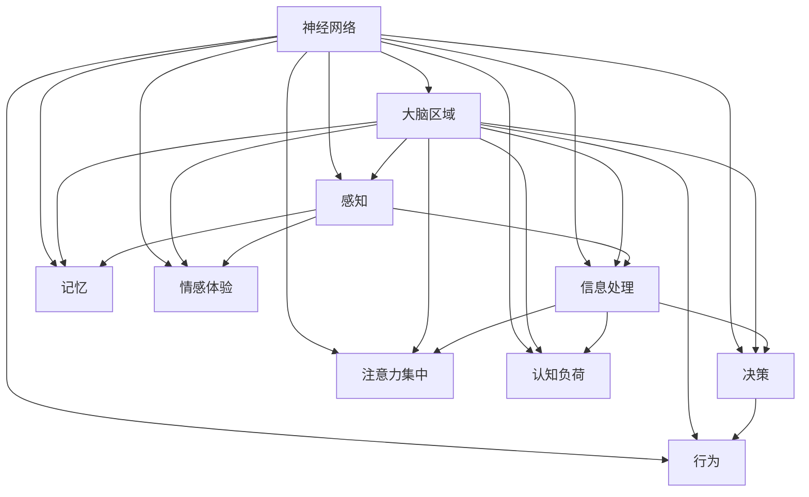

                 

### 《意识功能的价值标准研究》

## 摘要

本文旨在探讨意识功能的价值标准研究，从多个维度解析意识功能的本质、理论体系及应用前景。文章首先概述了意识的基本概念及其历史发展，随后深入探讨了意识功能的分类、理论框架和神经机制。在此基础上，本文提出了意识功能的价值评估方法，并构建了一套标准体系，用于评估意识功能的价值。文章随后详细介绍了意识功能在心理学、神经科学和哲学中的应用，并探讨了当前研究的前沿趋势及面临的挑战。通过实验心理学、计算机模拟和神经成像等方法，本文展示了意识功能的价值标准研究在多个领域的应用前景。最后，文章总结了核心概念与联系，并提出了未来研究方向与展望。

## 文章标题

《意识功能的价值标准研究》

## 关键词

- 意识功能
- 价值标准
- 理论体系
- 应用前景
- 认知心理学
- 神经科学
- 哲学

## 摘要

本文旨在深入探讨意识功能的价值标准研究，旨在为意识功能的理论研究提供新的视角和方法。文章首先从意识的本质和特征入手，回顾了意识的概念及其历史发展，阐述了意识的神经基础和主观体验。在此基础上，文章构建了意识功能的理论体系，详细分析了意识功能的分类、作用和神经机制。接着，本文提出了意识功能的价值评估方法，并建立了一套标准体系，用于对意识功能的价值进行评估。在应用部分，文章分别探讨了意识功能在心理学、神经科学和哲学中的应用，并通过实验心理学、计算机模拟和神经成像等研究方法，展示了意识功能的价值标准研究在不同领域的实际应用前景。最后，本文总结了核心概念与联系，并提出了未来研究方向与展望。通过本文的研究，我们期望能够为意识功能的价值标准研究提供理论支持和实践指导。

### 第1章：意识的本质与特征

#### 1.1 意识的概念及其历史发展

意识作为人类最为显著的特征之一，其概念和定义历经了漫长的历史演变。在古代，意识主要被视为一种神秘的力量，由神灵或灵魂赋予人类。例如，古希腊哲学家柏拉图认为，灵魂是意识的基础，人类在出生时获得灵魂，从而拥有意识。在中世纪，宗教哲学进一步深化了意识的概念，认为意识是上帝赋予人类的神圣礼物。

随着近代哲学的发展，意识开始被理性地探讨。笛卡尔提出了“我思故我在”的哲学命题，将意识作为人类存在的核心证据。这一观点强调了意识的主观性和个体性，为后来的意识研究奠定了基础。

进入现代，科学方法论开始被应用于意识研究，使得意识的概念得到了进一步明晰。弗朗茨·布伦塔诺（Franz Brentano）将意识分为“感受”（feelings）和“意向”（intentionality），从而将意识从纯粹的心理现象中区分出来。约翰·福布斯·奥斯丁（John福布斯·奥斯丁）则提出了“感知”（apperception）的概念，强调了意识在认知过程中的作用。

在当代，意识研究进入了多学科融合的阶段。认知科学、神经科学、哲学等学科共同探讨了意识的本质和机制。认知科学从信息加工的角度研究意识，认为意识是一种信息处理过程。神经科学则从生物学的角度研究意识，探讨神经活动与意识之间的关系。哲学继续从形而上学的角度探讨意识，关注意识的主观性和本质。

#### 1.2 意识的神经基础

意识作为一种复杂的心理现象，其产生和维持依赖于大脑的神经活动。神经科学研究表明，意识与大脑多个区域的神经网络活动密切相关。目前，关于意识神经基础的研究主要集中在以下几个领域：

**大脑结构**：大脑的结构对于意识的产生和维持至关重要。特别是大脑的前额叶、顶叶和颞叶等区域，在意识活动中扮演着关键角色。前额叶与决策和自我意识相关，顶叶与空间知觉和认知地图相关，颞叶与记忆和语言处理相关。

**神经网络活动**：神经网络的活动模式与意识体验密切相关。研究表明，大脑的神经网络活动存在特定的模式，这些模式反映了个体对环境信息的处理和反应。例如，在大脑的默认模式网络中，不同区域之间的协调活动被认为与意识的状态变化有关。

**神经递质**：神经递质是神经元之间传递信息的化学物质，对于维持大脑的功能活动至关重要。例如，多巴胺和去甲肾上腺素等神经递质与意识活动密切相关。多巴胺水平的变化可以影响个体的注意力和情绪状态，而去甲肾上腺素则与意识的觉醒程度相关。

**神经可塑性**：神经可塑性是指大脑神经元和神经网络在经验和学习过程中发生变化的能力。研究表明，神经可塑性在意识的发育和恢复中扮演着重要角色。通过训练和练习，个体的认知能力和意识状态可以发生显著变化。

#### 1.3 意识的主观体验

意识的主观体验是指个体对自己内在心理状态的感知和感受。它包括知觉、情感、意愿等多种心理体验。主观体验是意识的核心特征，使得个体能够感知和体验外部世界，同时也反映了个体内部的心理状态。

**知觉**：知觉是意识最基本的功能之一，它使得个体能够感知和识别外部信息。知觉过程涉及多个认知模块，如视觉、听觉、触觉等，每个模块都对意识体验产生重要影响。

**情感**：情感是意识体验中的重要组成部分，它反映了个体对事物的情绪反应。情感体验包括快乐、悲伤、愤怒等，它们对个体的意识和行为具有显著影响。

**意愿**：意愿是指个体对自己行为的计划和决策过程。意愿体验与个体的自由意志和决策能力相关，是意识体验的重要方面。

主观体验的多样性使得意识成为一个复杂的心理现象。不同个体的主观体验可能存在显著差异，这种差异反映了个体之间的心理结构和认知风格的差异。同时，主观体验也受到文化和社会环境的影响，不同文化和社会背景下，个体的主观体验可能存在不同的特征。

### 第2章：意识功能的理论体系

#### 2.1 意识功能的分类与作用

意识功能是指大脑在处理信息、做出决策和产生行为时的各种认知过程。这些功能包括知觉、记忆、注意、思考、决策和情感等。意识功能的分类与作用可以从多个角度进行探讨。

**知觉**：知觉是意识功能的基础，它涉及对外部信息的感知和识别。知觉功能主要包括视觉、听觉、触觉、嗅觉和味觉等。每种知觉功能都通过特定的感官系统来接收和处理信息，从而形成对环境的感知。

**记忆**：记忆是意识功能的重要组成部分，它使得个体能够保留和回忆过去的信息。记忆分为短期记忆和长期记忆，短期记忆主要负责暂时存储和处理信息，而长期记忆则负责持久地保留信息。

**注意**：注意是指个体在处理信息时选择和集中注意力的能力。注意功能使得个体能够在复杂环境中筛选出重要的信息，从而提高信息处理的效率和准确性。

**思考**：思考是指个体在理解、分析和推理信息时的认知过程。思考功能包括逻辑推理、问题解决、创造性思维等，它是意识功能中最复杂也是最重要的部分。

**决策**：决策是指个体在面临多种选择时做出决定的过程。决策功能涉及信息评估、选择和执行等多个环节，它对个体的行为和生活方式具有重要影响。

**情感**：情感是指个体对事物的情绪反应，它对个体的意识和行为产生重要影响。情感功能包括情感的感知、表达和调节，它是意识体验的一个重要方面。

不同意识功能之间相互关联，共同构成了意识的整体功能。知觉为记忆提供信息，记忆为思考和决策提供基础，思考指导决策和行动，而情感则影响决策和行动的选择。

**作用**：意识功能在个体的认知和行为中发挥着关键作用。例如，知觉功能使得个体能够感知和理解外部环境，记忆功能帮助个体保留和回忆重要信息，注意功能使得个体能够集中精力处理重要任务，思考功能使得个体能够进行复杂的推理和决策，决策功能指导个体的行动，情感功能则影响个体的情绪和行为反应。

#### 2.2 意识功能的理论框架

意识功能的理论框架是理解和研究意识功能的重要基础。目前，关于意识功能的理论框架主要包括功能主义理论、模块化理论和认知神经科学理论。

**功能主义理论**：功能主义理论认为，意识功能是由特定的认知过程实现的，这些过程在特定的环境下具有特定的功能。功能主义理论强调意识功能是动态的、适应性的，并且受到环境因素的影响。根据功能主义理论，意识功能可以分为知觉、记忆、注意、思考、决策和情感等多个模块，每个模块都负责特定的认知任务。

**模块化理论**：模块化理论认为，意识功能是由一系列相互独立的模块组成的，每个模块都有特定的功能和结构。模块化理论强调意识功能的模块化特点，认为这些模块在认知过程中相互协作，共同实现复杂的认知功能。根据模块化理论，意识功能模块可以分为视觉模块、听觉模块、记忆模块等，每个模块都有特定的神经网络和认知机制。

**认知神经科学理论**：认知神经科学理论认为，意识功能是大脑神经网络活动的产物，这些活动受到神经结构、神经递质和神经可塑性的影响。认知神经科学理论强调意识功能与大脑结构、神经网络活动之间的密切关系，通过神经成像技术和脑电图等技术手段，可以研究意识功能的神经基础和机制。

这些理论框架为意识功能的研究提供了不同的视角和方法。功能主义理论强调了意识功能的适应性和动态性，模块化理论强调了意识功能的模块化特点，认知神经科学理论则强调了意识功能与大脑结构、神经网络活动之间的关系。

#### 2.3 意识功能的神经机制

意识功能的神经机制是指大脑神经网络在实现意识功能时的活动模式和结构特征。目前，关于意识功能的神经机制的研究主要集中在以下几个方面：

**神经网络活动**：神经网络活动是指大脑神经网络中神经元之间的电信号传递和通信过程。研究表明，神经网络活动模式与意识功能密切相关。例如，在大脑的前额叶和顶叶等区域，神经元活动的同步性被认为与意识的觉醒程度和注意力集中程度有关。

**神经网络结构**：神经网络结构是指大脑神经网络中的神经元和连接方式。研究表明，神经网络结构的变化会影响意识功能的表现。例如，在大脑的前额叶和顶叶等区域，神经网络结构的重构和重塑被认为与记忆和思考功能的改善有关。

**神经递质**：神经递质是指神经元之间传递信息的化学物质。研究表明，神经递质的活动模式会影响意识功能的发挥。例如，多巴胺和去甲肾上腺素等神经递质与注意力、情绪和记忆等功能密切相关。

**神经可塑性**：神经可塑性是指大脑神经网络在经验和学习过程中发生变化的能力。研究表明，神经可塑性在意识功能的发育、恢复和改善中扮演着重要角色。例如，通过训练和练习，个体的认知能力和意识状态可以发生显著变化。

这些研究揭示了意识功能的神经机制，为我们理解意识功能的本质和作用提供了重要的科学依据。通过进一步的研究，我们可以更好地了解意识功能的神经基础，为意识的临床应用和神经修复提供新的方法和技术。

### 第3章：意识功能的价值标准

#### 3.1 意识功能的价值评估方法

意识功能的价值评估是理解意识功能的重要环节，它有助于揭示意识功能在实际应用中的价值和意义。意识功能的价值评估方法可以分为量化评估方法和质化评估方法，以下将详细探讨这两种方法及其应用。

**量化评估方法**

量化评估方法是通过数值化指标对意识功能进行评估的方法。这种方法的优势在于可以提供客观、可量化的数据，使得评估结果具有可比性和可重复性。常用的量化评估方法包括：

1. **心理测试**：心理测试是通过一系列标准化的测试工具，评估个体在知觉、记忆、注意、思考、决策和情感等方面的表现。例如，韦氏智力量表（Wechsler Intelligence Scales）和瑞文标准推理测验（Raven's Standard Progressive Matrices）等。

2. **脑电图（EEG）**：脑电图是一种无创的脑功能成像技术，通过记录大脑的电活动，评估意识状态和认知功能。EEG可以检测大脑的觉醒程度、注意力集中程度和认知负荷等指标。

3. **功能磁共振成像（fMRI）**：功能磁共振成像是一种高级的脑功能成像技术，通过检测大脑的血氧水平依赖（BOLD）信号变化，评估大脑不同区域的活动情况。fMRI可以用于研究意识功能的神经基础和认知机制。

4. **神经心理学评估**：神经心理学评估是通过一系列认知评估工具，评估个体在记忆、注意力、感知和认知处理等方面的能力。例如，神经心理学评估量表（Neuropsychological Assessment Scales）和认知行为评估工具（Cognitive Behavioral Assessment Tools）。

**质化评估方法**

质化评估方法是通过定性分析评估意识功能的方法，主要依赖于观察、访谈和案例研究等手段。这种方法的优势在于可以深入了解意识功能的实际应用和价值，提供更全面、深入的评估结果。常用的质化评估方法包括：

1. **观察法**：观察法是通过直接观察个体在特定环境中的行为和表现，评估意识功能的应用效果。观察法适用于评估意识功能在日常生活、工作学习等场景中的实际应用。

2. **访谈法**：访谈法是通过与个体进行深入交流，了解他们对意识功能的认知和应用体验。访谈法可以用于收集个体对意识功能的感受、认知和行为反应等信息。

3. **案例研究**：案例研究是通过详细分析特定个案，探讨意识功能的应用效果和价值。案例研究适用于探索意识功能在实际应用中的复杂性和多样性。

**应用**

在意识功能的价值评估中，量化评估方法和质化评估方法可以相互补充，共同提供全面的评估结果。量化评估方法可以提供客观的、可量化的数据，帮助研究者理解意识功能在不同情境下的表现；质化评估方法可以提供深入的、定性的信息，帮助研究者理解意识功能在实际应用中的复杂性和多样性。

例如，在评估意识功能在教育领域的应用时，可以使用量化评估方法测量学生的认知能力、学习成绩等指标，同时使用质化评估方法了解学生对意识功能的认知和应用体验。通过结合量化评估和质化评估，可以更全面地理解意识功能在教育领域的应用价值，为教育实践提供有价值的参考。

#### 3.2 意识功能的价值标准体系

意识功能的价值标准体系是评估意识功能价值的重要框架，它有助于明确意识功能在不同领域中的应用价值。一个完善的价值标准体系应包括多个方面，如认知能力、情感体验、行为表现等。以下将详细讨论意识功能的价值标准体系的构建方法及其在各个领域中的应用。

**认知能力**

认知能力是指个体在知觉、记忆、注意、思考等方面的能力。认知能力是意识功能的核心，对个体的学习、工作和生活具有重要影响。在构建意识功能的价值标准体系时，应关注以下方面：

1. **认知速度**：认知速度是指个体处理信息的能力，包括反应速度和决策速度等。认知速度的评估可以通过心理测试、反应时测试等手段进行。

2. **认知广度**：认知广度是指个体在处理信息时的认知范围，包括注意广度和记忆广度等。认知广度的评估可以通过注意广度测试、记忆广度测试等手段进行。

3. **认知灵活性**：认知灵活性是指个体在认知过程中适应新情境、新信息的能力。认知灵活性的评估可以通过变式任务、适应性任务等手段进行。

**情感体验**

情感体验是指个体在情感方面的体验和反应，包括情感感知、情感表达和情感调节等。情感体验对个体的心理健康和生活质量具有重要影响。在构建意识功能的价值标准体系时，应关注以下方面：

1. **情感感知**：情感感知是指个体对情感刺激的识别和反应能力。情感感知的评估可以通过情绪识别测试、情感反应测试等手段进行。

2. **情感表达**：情感表达是指个体在情感表达方面的能力和方式。情感表达的评估可以通过情感表达测试、情境模拟等手段进行。

3. **情感调节**：情感调节是指个体在情感调节方面的能力和技巧，包括自我调节和他人调节等。情感调节的评估可以通过情感调节测试、情境测试等手段进行。

**行为表现**

行为表现是指个体在实际生活和工作中表现出的行为和能力。行为表现是意识功能在实践中的体现，对个体的职业发展和社会适应具有重要影响。在构建意识功能的价值标准体系时，应关注以下方面：

1. **学习效率**：学习效率是指个体在学习过程中的效率和效果。学习效率的评估可以通过学习任务完成情况、学习效果评估等手段进行。

2. **工作效率**：工作效率是指个体在工作中的效率和效果。工作效率的评估可以通过工作绩效评估、工作效率测试等手段进行。

3. **社会适应能力**：社会适应能力是指个体在社会环境中的适应能力和适应性。社会适应能力的评估可以通过社会适应性测试、情境模拟等手段进行。

**应用**

在不同领域，意识功能的价值标准体系的具体应用会有所不同。以下是一些实际应用案例：

1. **教育领域**：在教育领域，意识功能的价值标准体系可以用于评估学生的认知能力、情感体验和行为表现，从而为教学策略的制定和调整提供依据。

2. **职业领域**：在职业领域，意识功能的价值标准体系可以用于评估员工的工作效率、学习能力和情感状态，从而为人力资源管理和职业发展提供参考。

3. **医疗领域**：在医疗领域，意识功能的价值标准体系可以用于评估患者的认知功能、情感状态和康复效果，从而为治疗方案的制定和调整提供依据。

通过构建和完善意识功能的价值标准体系，我们可以更全面、深入地理解意识功能在不同领域中的价值，为相关领域的研究和实践提供有力支持。

#### 3.3 意识功能的价值评估实例分析

为了更好地理解意识功能的价值评估，以下将通过具体的实例分析来说明如何在实际研究中评估意识功能的价值。

**实例一：教育领域的价值评估**

在教育领域，意识功能的价值评估主要用于评估学生的认知能力、情感体验和学习效果。以下是一个具体的案例：

**案例背景**：某小学三年级的学生在数学学习中表现出困难，教师希望通过意识功能的价值评估来了解学生的认知能力和学习障碍。

**评估方法**：教师采用了心理测试和观察法两种方法进行评估。

1. **心理测试**：教师使用了韦氏智力量表（Wechsler Intelligence Scales）来评估学生的认知能力，包括语言理解、数量关系、空间视觉和记忆等方面的表现。

2. **观察法**：教师通过课堂观察，记录了学生在数学课堂上的行为表现，如注意力集中程度、参与程度和解决问题的能力等。

**评估结果**：通过心理测试和观察法，教师发现学生在数学学习中的主要问题在于数量关系和空间视觉方面。学生的认知能力较低，导致他们在理解和解决问题时遇到困难。

**结论**：通过这个实例，我们可以看到意识功能的价值评估在帮助教师识别学生学习困难方面具有重要意义。通过评估，教师可以制定针对性的教学策略，帮助学生克服学习障碍，提高数学学习效果。

**实例二：职业领域的价值评估**

在职业领域，意识功能的价值评估主要用于评估员工的工作效率、学习能力和情感状态。以下是一个具体的案例：

**案例背景**：某公司的人力资源部门希望通过意识功能的价值评估来了解员工的工作表现和职业发展潜力。

**评估方法**：人力资源部门采用了脑电图（EEG）和心理测试两种方法进行评估。

1. **脑电图**：通过脑电图记录员工在工作时的脑电活动，评估其注意力和认知负荷。

2. **心理测试**：使用了多种心理测试工具，包括注意力测试、问题解决能力测试和情感状态评估等。

**评估结果**：评估结果显示，部分员工在注意力集中和问题解决能力方面表现出色，而另一些员工在情绪调节和工作压力处理方面存在困难。

**结论**：通过这个实例，我们可以看到意识功能的价值评估在帮助人力资源部门了解员工工作表现和职业发展潜力方面具有重要意义。通过评估，公司可以制定针对性的培训和发展计划，提高员工的工作效率和职业发展。

**实例三：医疗领域的价值评估**

在医疗领域，意识功能的价值评估主要用于评估患者的认知功能、情感状态和康复效果。以下是一个具体的案例：

**案例背景**：某医院神经康复科希望了解患者在康复过程中的意识功能变化，以评估康复治疗效果。

**评估方法**：康复科医生采用了神经心理测试、功能磁共振成像（fMRI）和访谈法三种方法进行评估。

1. **神经心理测试**：通过一系列标准化的神经心理测试工具，评估患者的认知功能，如记忆、注意、执行功能和语言能力等。

2. **功能磁共振成像（fMRI）**：通过fMRI技术，评估患者在康复过程中的脑部活动变化，特别是与认知功能相关的脑区活动。

3. **访谈法**：通过与患者及其家属的访谈，了解患者的情感状态和生活质量变化。

**评估结果**：评估结果显示，经过康复治疗，患者的认知功能和情感状态显著改善，脑部活动也显示出积极的变化。

**结论**：通过这个实例，我们可以看到意识功能的价值评估在评估患者康复治疗效果和指导康复方案制定方面具有重要意义。通过评估，医生可以更准确地了解患者的康复进展，为康复治疗的调整和优化提供依据。

这些实例分析展示了意识功能的价值评估在实际应用中的多样性和重要性。通过科学、系统的价值评估，我们可以更好地理解意识功能在不同领域中的应用价值，为相关领域的研究和实践提供有力支持。

### 第4章：意识功能在心理学中的应用

#### 4.1 意识功能与认知心理学

认知心理学是研究人类思维、感知、记忆、决策等认知过程的科学。意识功能在认知心理学中扮演着核心角色，其研究对理解人类认知过程和认知障碍具有重要意义。

**意识功能与知觉**

知觉是指个体对外部信息的感知和识别过程。意识功能在知觉中发挥着关键作用，包括注意、感知和识别等。例如，研究表明，注意功能对知觉的选择性和敏感性有显著影响。当注意力集中时，个体能够更有效地识别和加工重要信息，从而提高知觉的准确性。此外，意识功能与知觉的持续性和稳定性也密切相关。例如，当个体处于高度焦虑或疲劳状态时，其知觉的清晰度和准确性会受到影响，导致认知任务的完成困难。

**意识功能与记忆**

记忆是意识功能的重要组成部分，包括短期记忆和长期记忆。短期记忆主要负责暂时存储和处理信息，而长期记忆则负责持久地保留信息。意识功能对记忆的编码、保持和提取具有显著影响。例如，研究表明，注意功能在记忆编码过程中起着关键作用。当注意力集中在特定信息时，这些信息更容易被编码并存储在长期记忆中。此外，意识功能还影响记忆的提取。例如，当个体在回忆信息时，其注意力集中在相关信息上，有助于提高记忆的提取效率。

**意识功能与思考**

思考是指个体在理解、分析和推理信息时的认知过程。意识功能在思考中扮演着核心角色，包括逻辑推理、问题解决和创造性思维等。例如，研究表明，意识功能在逻辑推理中起着关键作用。当个体面临复杂的推理任务时，其注意力、记忆和思考能力相互协作，共同完成推理任务。此外，意识功能还影响问题解决过程。例如，在解决问题时，个体需要集中注意力、调用相关记忆，并通过逻辑推理找到解决方案。

**意识功能与决策**

决策是指个体在面临多种选择时做出决定的过程。意识功能在决策中发挥着重要作用，包括信息评估、选择和执行等。例如，研究表明，意识功能在决策过程中影响信息处理速度和准确性。当个体面临复杂决策时，其注意力集中在相关信息上，有助于快速、准确地评估和选择最佳方案。此外，意识功能还影响决策的灵活性和适应性。例如，当环境发生变化时，个体需要调整其决策策略，以适应新的情况。

**意识功能与认知障碍**

认知障碍是指个体在认知过程中出现的一系列功能受损现象。意识功能在认知障碍中扮演着重要角色。例如，研究表明，意识功能障碍可能导致记忆障碍、注意力障碍和思考障碍等。例如，阿尔茨海默病是一种常见的认知障碍，患者的意识功能显著受损，导致记忆减退、注意力不集中和思考困难。此外，意识功能障碍还可能导致个体的行为和情感异常，进一步加剧认知障碍的症状。

**意识功能在认知心理学中的研究意义**

意识功能在认知心理学中的研究具有重要意义。首先，它有助于我们理解人类认知过程的本质和机制。通过研究意识功能，我们可以揭示人类如何感知、记忆、思考和决策，从而深入理解认知科学的基础。其次，意识功能的研究对认知障碍的诊断和治疗具有重要指导意义。通过了解意识功能在认知障碍中的作用，我们可以开发出更有效的诊断工具和治疗方法，提高患者的生活质量。最后，意识功能的研究还为人工智能和计算机科学提供了新的思路和方法。通过模拟和优化意识功能，我们可以开发出更智能、更高效的计算机系统，为人类的生活和工作带来更多便利。

#### 4.2 意识功能与临床心理学

意识功能在临床心理学中具有重要的应用价值，特别是在心理障碍的诊断、治疗和康复过程中。以下将探讨意识功能在临床心理学中的应用，包括意识功能与心理障碍的关系、意识功能的测量和干预方法。

**意识功能与心理障碍**

心理障碍是指个体在情感、行为、认知等方面出现异常，导致社会功能受损的一类疾病。意识功能在心理障碍中扮演着关键角色。研究表明，许多心理障碍与意识功能异常密切相关。例如，抑郁症患者常常表现出注意力不集中、记忆减退和思考困难等症状，这些症状与意识功能受损有关。焦虑症患者则表现出对特定情境或事物的过度担忧和恐惧，这也与意识功能的异常有关。

此外，意识功能异常还可能导致一些心理障碍的出现。例如，创伤后应激障碍（PTSD）患者常常对创伤性事件的记忆产生扭曲和记忆缺失，这与意识功能的紊乱密切相关。同样，注意力缺陷多动障碍（ADHD）患者表现出注意力不集中、冲动和冲动行为，这些行为也与意识功能的异常有关。

**意识功能的测量**

在临床心理学中，测量意识功能是诊断和治疗心理障碍的重要步骤。目前，常用的意识功能测量方法包括心理测试、脑电图（EEG）和功能磁共振成像（fMRI）等。

1. **心理测试**：心理测试是一种常用的意识功能测量方法，包括各种标准化和半标准化的评估工具。例如，韦氏智力量表（Wechsler Intelligence Scales）可以测量个体的认知能力，瑞文标准推理测验（Raven's Standard Progressive Matrices）可以评估个体的逻辑推理能力。此外，还有多种特定的心理测试工具，如注意力测试、记忆测试和情感状态评估工具等，用于测量不同方面的意识功能。

2. **脑电图（EEG）**：脑电图是一种无创的脑功能成像技术，通过记录大脑的电活动来评估意识功能。脑电图可以检测大脑的觉醒程度、注意力集中程度和认知负荷等指标。例如，研究表明，抑郁症患者的脑电图活动模式与正常人群存在显著差异，这些差异可以用于抑郁症的早期诊断。

3. **功能磁共振成像（fMRI）**：功能磁共振成像是一种高级的脑功能成像技术，通过检测大脑的血氧水平依赖（BOLD）信号变化来评估大脑不同区域的活动情况。fMRI可以用于研究意识功能的神经基础和机制。例如，研究表明，抑郁症患者的额叶和颞叶活动减弱，这些区域的异常活动与抑郁症的病理机制有关。

**干预方法**

在临床心理学中，干预意识功能异常是治疗心理障碍的重要策略。以下介绍几种常用的干预方法：

1. **认知行为疗法**：认知行为疗法是一种以认知为基础的心理治疗方法，通过改变个体的思维模式和行为习惯，改善其心理状态。例如，在抑郁症治疗中，认知行为疗法可以帮助患者识别和改变负面思维模式，提高情绪调节能力。

2. **注意力训练**：注意力训练是一种针对注意力功能异常的干预方法，通过训练提高个体的注意力集中能力和稳定性。例如，研究表明，通过特定的注意力训练程序，可以显著提高注意力缺陷多动障碍（ADHD）患者的注意力集中能力。

3. **神经反馈**：神经反馈是一种通过实时反馈个体的脑电活动来调节意识功能的方法。例如，通过脑电生物反馈，患者可以在训练过程中实时了解自己的脑电活动情况，并通过调整行为来提高意识功能。

4. **认知训练**：认知训练是一种针对认知功能异常的干预方法，通过训练提高个体的认知能力。例如，记忆训练、逻辑推理训练和问题解决训练等，都可以有效提高个体的认知功能。

**意识功能在临床心理学中的研究意义**

意识功能在临床心理学中的研究具有重要意义。首先，它有助于我们更好地理解心理障碍的病理机制。通过研究意识功能异常在心理障碍中的表现和作用，我们可以揭示心理障碍的神经生物学基础。其次，意识功能的研究为心理障碍的诊断和治疗提供了新的方法和技术。通过测量意识功能，我们可以更准确地评估心理障碍的严重程度和治疗效果，为个体化的治疗方案的制定提供依据。最后，意识功能的研究还为心理障碍的预防提供了新的思路。通过了解意识功能异常的发展规律和影响因素，我们可以开发出有效的预防措施，降低心理障碍的发生风险。

#### 4.3 意识功能在教育心理学中的应用

意识功能在教育心理学中具有重要应用价值，它影响着学生的学习效率、学习动机和学业成就。以下将探讨意识功能在教育心理学中的应用，包括意识功能对学习过程的影响、意识功能在教育资源开发中的应用以及意识功能评估在教学评价中的运用。

**意识功能对学习过程的影响**

意识功能在学习过程中发挥着关键作用，它直接影响着学习效率和学习效果。以下是几个关键方面：

1. **注意功能**：注意功能是学习过程的基础。良好的注意力集中能力有助于学生更好地吸收和理解课堂内容。研究表明，注意力不集中是学习困难的一个重要原因。因此，培养学生良好的注意力集中能力对于提高学习效率至关重要。

2. **记忆功能**：记忆功能在学习过程中起着重要作用。短期记忆和长期记忆的效率直接影响学生的学习和复习效果。例如，通过有效的方法，如重复、联想和情境化记忆，可以提高记忆的效率，从而增强学习效果。

3. **思考功能**：思考功能包括逻辑推理、问题解决和创造性思维等。培养学生的思考功能有助于他们更好地应对复杂的学习任务和实际问题。例如，通过启发式教学和问题导向学习，可以激发学生的思考能力，提高他们的学习兴趣和动力。

4. **情感功能**：情感功能在学习过程中也具有重要影响。积极、稳定的情绪状态有助于学生更好地应对学习压力，提高学习效果。而负面情绪，如焦虑和抑郁，则可能降低学生的学习动机和效率。

**意识功能在教育资源开发中的应用**

教育资源开发是提高教育质量的重要环节，意识功能的研究为教育资源开发提供了新的思路和方法。以下是几个方面的应用：

1. **课程设计**：根据意识功能的特点，教师可以设计更符合学生认知和学习规律的课程。例如，通过合理安排教学内容和活动，可以充分利用学生的注意功能、记忆功能和思考功能，提高学生的学习效果。

2. **教学工具**：利用现代技术，如虚拟现实（VR）和增强现实（AR），可以开发出更具互动性和趣味性的教学工具，从而激发学生的学习兴趣和参与度。这些工具可以帮助学生在实践中更好地理解和应用所学知识。

3. **学习策略指导**：根据意识功能的特点，教师可以为学生提供有效的学习策略指导，帮助他们更好地利用自己的认知资源。例如，通过教授记忆技巧、思维训练方法和情绪调节技巧，可以提高学生的学习效率和学习成果。

**意识功能评估在教学评价中的运用**

意识功能评估是教育评价的重要组成部分，它有助于了解学生的学习状况和教学效果。以下是几个方面的应用：

1. **学习诊断**：通过意识功能评估，教师可以了解学生在知觉、记忆、注意、思考和情感等方面的表现，从而进行针对性的教学干预。例如，对于在注意力方面表现较差的学生，教师可以提供专门的注意力训练，以提高他们的学习效率。

2. **教学效果评估**：意识功能评估可以用于评估教学活动的效果。教师可以通过对比学生在不同教学活动中的表现，了解哪些教学策略和方法更有效，从而优化教学方案。

3. **学生发展评价**：意识功能评估可以用于评价学生的全面发展。例如，通过评估学生的思考功能、情感功能和创造力，可以了解他们在多方面的发展情况，为他们的个性化教育和职业规划提供依据。

**总结**

意识功能在教育心理学中的应用具有重要意义。通过理解和应用意识功能，教师可以更好地指导学生的学习过程，开发出更有效的教育资源，进行科学的教学评价。这不仅有助于提高学生的学习效率和学习成果，还能促进他们的全面发展。因此，意识功能的研究对于教育实践具有重要的指导意义。

### 第5章：意识功能在神经科学中的应用

#### 5.1 意识功能与神经影像学

意识功能与神经影像学的关系日益紧密，神经影像学技术的发展为探索意识功能的神经基础提供了强有力的工具。以下是意识功能与神经影像学关系的详细讨论。

**功能磁共振成像（fMRI）**

功能磁共振成像（fMRI）是一种非侵入性成像技术，通过检测大脑血氧水平依赖（BOLD）信号的变化来反映大脑功能活动。fMRI在研究意识功能方面具有显著优势，能够实时、空间分辨率高地监测大脑不同区域的活动。

**应用**

1. **意识状态的监测**：fMRI可以用于监测意识状态的动态变化，例如昏迷、植物状态和意识模糊状态等。研究人员通过fMRI观察不同状态下的脑活动模式，揭示了意识状态的复杂性和多样性。

2. **意识功能的研究**：fMRI帮助研究者探索意识功能的具体机制，例如注意力、记忆、思考和情感等方面的功能。通过识别大脑活动与特定认知任务之间的相关性，fMRI为理解意识功能提供了直接的神经基础。

**局限性**

1. **时间分辨率**：fMRI的时间分辨率相对较低，大约为2-3秒。这限制了其在监测快速变化的意识状态中的应用。

2. **空间分辨率**：虽然fMRI的空间分辨率较高，但与电生理学技术相比，仍存在一定的局限性。

**电生理学**

电生理学技术，如脑电图（EEG）、事件相关电位（ERP）和功能性近红外光谱成像（fNIRS），在研究意识功能方面也具有重要应用。

**应用**

1. **实时监测**：电生理学技术可以实时监测大脑电活动，提供高时间分辨率的意识状态信息。这对于研究快速变化的意识状态，如昏迷、觉醒和意识模糊状态具有重要意义。

2. **精细认知过程的研究**：电生理学技术能够精确地捕捉大脑在认知处理过程中的电信号变化，有助于揭示意识功能的细节机制。ERP技术尤其擅长检测认知过程中的神经活动，例如感知、记忆和思考等。

**局限性**

1. **空间分辨率**：与神经影像学技术相比，电生理学技术的空间分辨率较低，难以提供精确的大脑活动空间定位。

2. **信号干扰**：电生理学信号容易受到环境噪声和电磁干扰的影响，从而影响信号的质量和可靠性。

**融合技术的应用**

为了克服单一技术的局限性，神经科学研究者开始探索多种技术的融合应用。例如，将fMRI与EEG结合，可以在高时间分辨率和空间分辨率之间取得平衡，提供更全面的大脑活动信息。这种融合技术的应用，使得研究人员能够更深入地探索意识功能的复杂机制。

**未来展望**

随着神经影像学技术和电生理学技术的不断进步，未来意识功能的研究将更加深入和精细化。例如，通过开发新型成像技术，如脑磁图（MEG）和光成像技术，可以进一步提高空间和时间分辨率，为探索意识功能的神经基础提供更多可能性。此外，人工智能和大数据分析技术的应用，将使得大规模脑数据分析成为可能，为揭示意识功能的复杂机制提供新的视角和方法。

#### 5.2 意识功能与神经退行性疾病

意识功能与神经退行性疾病之间存在密切的关系，神经退行性疾病，如阿尔茨海默病（AD）和帕金森病（PD），常常伴随着意识功能的显著受损。以下将探讨意识功能在神经退行性疾病中的具体表现、影响和治疗方法。

**具体表现**

1. **阿尔茨海默病（AD）**：阿尔茨海默病是一种常见的神经退行性疾病，主要表现为记忆力减退、认知功能障碍和意识功能下降。患者常常出现记忆缺失、定向障碍、语言困难和行为异常等症状。这些症状严重影响了患者的生活质量和社交功能。

2. **帕金森病（PD）**：帕金森病主要表现为运动功能障碍，如静止性震颤、肌肉僵硬和运动迟缓等。然而，越来越多的研究表明，帕金森病患者也存在意识功能受损的情况，包括注意力减退、反应迟缓和认知功能下降。

**影响**

1. **认知功能**：意识功能的受损直接影响了神经退行性疾病患者的认知功能。例如，记忆缺失和注意力减退使得患者难以进行日常的生活和工作活动，导致生活质量显著下降。

2. **行为与情绪**：意识功能的下降还可能导致患者出现行为异常和情绪问题。例如，一些患者在患病过程中会表现出攻击性、抑郁或焦虑等症状，进一步加剧了疾病的严重程度。

3. **生活质量**：意识功能的受损使得患者难以独立生活和进行社交活动，导致生活质量显著下降。患者常常需要依赖家人或护理人员进行日常照顾，增加了家庭和社会的负担。

**治疗方法**

1. **药物治疗**：药物治疗是神经退行性疾病的基本治疗方法。例如，对于阿尔茨海默病患者，可以使用胆碱酯酶抑制剂（如多奈哌齐）来改善记忆和认知功能。对于帕金森病患者，可以使用多巴胺激动剂（如普拉克索）来缓解运动功能障碍。

2. **认知训练**：认知训练是一种非药物治疗方法，通过特定的训练程序，提高患者的认知能力和意识功能。例如，记忆训练、注意力训练和问题解决训练等，可以有效地改善患者的认知功能。

3. **神经修复**：神经修复技术是一种新兴的治疗方法，旨在通过修复和再生受损的神经元，恢复患者的意识功能和认知能力。例如，干细胞移植和神经再生因子治疗等，已经在动物实验中显示出良好的治疗效果。

4. **生活方式干预**：生活方式干预也是治疗神经退行性疾病的重要措施。例如，保持健康饮食、适量运动和充足的睡眠等，有助于改善患者的整体健康状况和意识功能。

**研究进展**

随着神经科学技术的不断发展，对意识功能与神经退行性疾病的研究也取得了显著进展。例如，通过神经影像学技术，研究者可以更准确地监测和评估患者的意识功能和认知功能。此外，人工智能和大数据分析技术的应用，使得大规模脑数据分析成为可能，为揭示神经退行性疾病的病理机制提供了新的视角和方法。

**未来展望**

随着研究的深入，未来意识功能在神经退行性疾病中的应用前景将更加广阔。例如，通过开发新的治疗方法和干预措施，有望显著改善患者的意识功能和认知能力，提高他们的生活质量。此外，神经科学技术的不断进步，将为探索意识功能的神经基础和病理机制提供更多可能性，为神经退行性疾病的研究和治疗带来新的突破。

### 5.3 意识功能与神经修复

意识功能与神经修复之间的关系在神经科学领域引起了广泛关注。神经修复是指通过再生或替代受损神经元的方法，恢复神经系统的功能。随着对意识功能机制的深入理解，神经修复技术在意识功能恢复中的应用前景变得日益光明。以下是关于意识功能与神经修复的详细讨论。

#### 神经修复的基本概念

神经修复涉及多种技术，包括：

1. **干细胞治疗**：干细胞具有自我更新和分化能力，可以通过分化为神经元或神经支持细胞，修复受损的神经系统。研究表明，神经干细胞移植可以改善神经退行性疾病患者的认知功能。

2. **神经再生因子**：神经再生因子是一类促进神经元生长和修复的蛋白质，例如神经生长因子（NGF）和脑源性神经营养因子（BDNF）。这些因子可以刺激受损神经元的再生和恢复，从而改善意识功能。

3. **电刺激疗法**：电刺激疗法通过电极直接刺激大脑或脊髓，促进神经元的生长和修复。例如，深部脑刺激（DBS）已被广泛应用于治疗帕金森病和癫痫等疾病，通过调节大脑活动，改善患者的认知功能和意识状态。

4. **组织工程**：组织工程技术旨在利用生物材料和生物活性分子，构建人工神经组织，以替代或修复受损的神经系统。这种技术有望在意识功能恢复中发挥重要作用。

#### 意识功能与神经修复的关系

1. **神经元再生与意识恢复**：研究表明，神经元的再生和修复与意识功能的恢复密切相关。例如，在脊髓损伤后，通过干细胞移植和神经再生因子治疗，可以促进神经元的再生，从而恢复运动和感觉功能，有助于意识状态的改善。

2. **神经可塑性与意识功能**：神经可塑性是指神经系统在损伤后通过结构和功能的变化来适应新的环境。意识功能恢复的过程中，神经可塑性发挥着关键作用。通过训练和刺激，可以促进神经网络的重组和功能恢复，从而提高意识功能。

3. **电刺激与意识调节**：电刺激疗法通过调节大脑活动，改善意识功能。例如，在昏迷患者中，电刺激已被证明可以促进神经元的重新连接和功能恢复，有助于患者的意识恢复。

#### 神经修复技术在意识功能恢复中的应用

1. **阿尔茨海默病治疗**：阿尔茨海默病是一种神经退行性疾病，导致认知功能显著下降。通过干细胞治疗和神经再生因子治疗，可以改善患者的认知功能，延缓疾病的进展。

2. **脑损伤修复**：脑损伤，如创伤性脑损伤（TBI）和脑卒中，常常导致意识功能受损。神经修复技术，如干细胞移植和电刺激疗法，可以促进神经元的再生和功能恢复，提高患者的意识状态。

3. **昏迷患者的治疗**：昏迷患者由于意识功能严重受损，传统治疗方法效果有限。近年来，电刺激疗法在昏迷患者中的应用显示出一定前景，通过调节大脑活动，有望改善患者的意识状态。

#### 挑战与未来展望

尽管神经修复技术在意识功能恢复方面取得了显著进展，但仍面临诸多挑战。例如：

1. **技术限制**：目前的神经修复技术仍存在一定局限性，如移植细胞存活率低、电刺激效果不持久等。

2. **安全性问题**：神经修复技术可能引发免疫排斥或其他并发症，影响治疗效果。

3. **个体差异**：不同患者的病情和康复潜力存在显著差异，需要个性化的治疗方案。

未来，随着神经科学和生物技术的发展，神经修复技术在意识功能恢复中的应用前景将更加广阔。例如，通过开发新型生物材料和智能化电刺激技术，有望提高神经修复的效果和安全性。此外，大数据和人工智能技术的应用，将有助于个体化治疗方案的制定和疗效评估，推动意识功能恢复研究的不断进步。

### 第6章：意识功能在哲学中的应用

#### 6.1 意识功能与认识论

认识论是哲学中研究知识、认识和意识的学科。意识功能在认识论中的应用主要涉及对知识本质、认识过程和意识本质的探讨。以下将详细分析意识功能与认识论的关系。

**知识本质**

知识本质的问题一直困扰着哲学家。意识功能为探讨知识本质提供了新的视角。例如，知觉、记忆和思考等意识功能被认为是知识形成的基础。通过知觉，个体对外部信息进行感知和识别，从而获取知识；通过记忆，个体将信息存储在长期记忆中，形成知识体系；通过思考，个体对信息进行加工、推理和判断，从而深化知识。

1. **知觉与知识**：知觉是获取知识的第一步。个体的知觉过程受到注意、感知和认知的影响。良好的知觉能力有助于个体更准确地获取和识别外部信息，从而提高知识的准确性。

2. **记忆与知识**：记忆是知识存储的重要方式。通过记忆，个体能够将知觉到的信息转换为长期记忆，从而在需要时调用和运用这些信息。记忆功能的好坏直接影响到知识的积累和运用。

3. **思考与知识**：思考是知识深化和扩展的重要手段。通过思考，个体可以对信息进行加工、分析和推理，从而发现新的知识和理解。良好的思考能力有助于个体更好地理解和运用知识。

**认识过程**

认识论关注的是认识过程，即个体如何从无知到知识的转变。意识功能在认识过程中发挥着关键作用。

1. **感知与认识**：感知是认识的起点。个体的感知能力直接影响其对外部信息的理解和认知。良好的感知能力有助于个体更准确地获取和解释外部信息。

2. **记忆与认识**：记忆在认识过程中扮演着重要角色。通过记忆，个体能够将感知到的信息存储在长期记忆中，并在需要时进行调用和运用。记忆功能的好坏直接影响到认识的深度和广度。

3. **思考与认识**：思考是认识的深化过程。通过思考，个体可以对信息进行加工、分析和推理，从而发现新的知识和理解。良好的思考能力有助于个体更好地理解和运用知识。

**意识本质**

意识本质是认识论中一个深奥而复杂的问题。意识功能为探讨意识本质提供了新的视角。

1. **意识的主观性**：意识功能揭示了意识的主观性。个体对世界的感知和认知都是主观的，即每个人对世界的理解和体验都是独特的。意识功能的研究有助于我们理解这种主观性的来源和本质。

2. **意识的涌现性**：意识功能表明，意识并非单纯由神经元活动产生，而是从复杂的神经网络活动中涌现出来的。这种涌现性使得意识具有独特的性质和功能。

3. **意识与认知的关系**：意识功能的研究揭示了意识与认知之间的密切关系。意识是认知过程的重要组成部分，没有意识，认知过程将变得无意义。同时，认知过程也是意识存在的基础。

**结论**

意识功能与认识论之间存在密切的联系。意识功能为认识论提供了新的研究方法和视角，有助于我们更好地理解知识的本质、认识的过程和意识的本性。通过研究意识功能，我们可以更深入地探讨认识论的问题，为哲学的发展做出贡献。

#### 6.2 意识功能与伦理学

意识功能与伦理学的关系在当代哲学和科学领域引起了广泛关注。伦理学关注道德原则、道德决策和道德行为，而意识功能涉及到意识的本质、意识的产生和意识的主观体验。以下将探讨意识功能在伦理学中的应用，包括意识功能对道德判断的影响、对人工智能伦理的挑战以及意识功能在医学伦理中的应用。

**意识功能对道德判断的影响**

意识功能，尤其是知觉、记忆和思考，对个体的道德判断有着重要影响。首先，知觉决定了个体如何感知和评估道德情境。一个具有良好知觉能力的人能够更敏锐地识别道德问题，从而做出更符合道德标准的判断。其次，记忆功能使得个体能够从过去的经验中学习和吸取教训，形成稳定的道德信念和价值观。例如，通过记忆，个体可以记住道德规则和道德标准，并在面对新的道德情境时能够迅速做出判断。最后，思考功能使得个体能够对道德问题进行深入的分析和推理，从而形成更为复杂的道德判断。

**意识功能对道德判断的影响还表现在个体的情感体验上。情感体验是道德判断的一个重要组成部分，它能够激发个体的道德动机和道德情感。例如，同情心、羞愧感和正义感等情感体验能够增强个体的道德责任感，促使个体做出符合道德的行为选择。**

**人工智能伦理的挑战**

随着人工智能技术的迅速发展，意识功能在伦理学中的应用也面临着新的挑战。人工智能在道德决策中的应用引发了关于人工智能伦理的广泛讨论。

1. **道德责任**：人工智能能否承担道德责任是一个重要问题。当前的人工智能系统虽然能够模拟人类的道德判断，但它们并没有真正的意识，因此不能承担道德责任。这意味着，如果人工智能系统在道德决策中犯了错误，最终的责任仍需由人类承担。

2. **算法偏见**：人工智能系统的决策过程依赖于大量的数据和算法。然而，数据中的偏见和算法的偏见可能会影响人工智能的道德决策。例如，如果训练数据中存在种族、性别或年龄等偏见，人工智能系统可能会做出不公平的决策。这引发了关于如何确保人工智能系统公平性和透明性的讨论。

3. **自主性**：人工智能的自主性也是伦理学中的一个重要问题。尽管当前的人工智能系统尚未具备完全的自主性，但它们在特定任务上已经表现出较高的自主决策能力。这引发了关于如何平衡人工智能的自主性和人类监督的讨论。

**医学伦理中的应用**

意识功能在医学伦理中的应用尤为重要。医学伦理涉及到医疗决策、医疗干预和患者权益保护等方面，而意识功能对这些方面的应用有着深远的影响。

1. **患者自主权**：意识功能是患者自主权的基础。一个具有良好意识功能的个体能够理解医疗决策，表达自己的意愿，并做出明智的选择。因此，确保患者的意识功能正常是保障患者自主权的关键。

2. **医疗决策**：意识功能在医疗决策中起着重要作用。医生需要评估患者的意识功能，以便做出最适合患者的治疗决策。例如，在紧急情况下，医生需要快速评估患者的意识状态，以便采取适当的急救措施。

3. **患者权益保护**：意识功能也是保护患者权益的重要手段。通过确保患者的意识功能正常，可以避免医疗过程中的误诊、误治和侵权行为。此外，意识功能的研究还有助于开发出更好的患者监护技术和治疗方法，提高患者的治疗体验和生活质量。

**结论**

意识功能在伦理学中的应用具有重要意义。它不仅影响个体的道德判断和行为，也对人工智能伦理和医学伦理产生了深远的影响。通过深入研究意识功能，我们可以更好地理解伦理问题的本质，为解决伦理挑战提供新的方法和思路。同时，意识功能的研究也为医学伦理和人工智能伦理的发展提供了科学基础和实践指导。

#### 6.3 意识功能与心灵哲学

意识功能与心灵哲学的关系紧密，意识功能的研究为心灵哲学提供了丰富的理论和实证基础。以下将探讨意识功能在心灵哲学中的应用，包括意识功能与心灵实体、心灵属性以及自由意志的关系。

**意识功能与心灵实体**

心灵实体是心灵哲学研究的一个重要问题，涉及到意识存在的本质和基础。意识功能的研究为探讨心灵实体的本质提供了新的视角。

1. **意识的物理基础**：意识功能的研究揭示了意识与大脑神经网络活动之间的密切关系。研究表明，大脑特定区域的神经网络活动与意识体验密切相关。这为心灵实体提供了物理基础，即意识是一种大脑活动产生的心理现象。

2. **意识的非物理属性**：尽管意识功能与大脑活动密切相关，但意识本身具有一些非物理属性，如主观体验和知觉。这些属性使得意识不同于物质实体，为心灵实体提供了独特的基础。

**意识功能与心灵属性**

心灵属性是心灵哲学研究的重要议题，涉及到意识的本质和特征。意识功能的研究有助于我们更深入地理解心灵属性。

1. **意识的主观性**：意识功能研究表明，意识具有主观性，即每个人对世界的感知和体验是独特的。这种主观性是意识的重要属性，反映了意识体验的个体差异。

2. **意识的涌现性**：意识功能的研究揭示了意识的涌现性，即意识并不是简单的神经元活动的结果，而是从复杂的神经网络活动中涌现出来的。这种涌现性使得意识具有独特的属性和功能。

3. **意识的复杂性**：意识功能的研究还揭示了意识的复杂性，即意识不仅涉及知觉和思考，还包括情感、意愿和意志等。这种复杂性使得意识成为心灵哲学研究的一个重要议题。

**意识功能与自由意志**

自由意志是心灵哲学中的另一个重要问题，涉及到个体行为选择的自主性和道德责任。意识功能的研究为探讨自由意志提供了新的视角。

1. **意识功能与行为选择**：意识功能研究表明，个体的行为选择受到意识体验的调节。个体通过意识体验进行思考、评估和决策，从而做出特定的行为选择。这为自由意志提供了行为基础。

2. **意识的自由属性**：意识功能的研究揭示了意识的自由属性，即意识体验具有自主性和选择性。个体可以在意识体验中自主选择和调整自己的行为，这为自由意志提供了心理基础。

3. **意识的道德责任**：意识功能的研究还涉及到意识体验的道德责任。一个具有良好意识功能的个体能够在道德情境中做出正确的道德选择，并对自己的行为负责。这为自由意志的道德责任提供了理论支持。

**结论**

意识功能在心灵哲学中的应用具有重要意义。它不仅为探讨心灵实体的本质和属性提供了新的视角，也为探讨自由意志的道德责任提供了理论支持。通过深入研究意识功能，我们可以更深入地理解心灵哲学中的基本问题，为哲学的发展做出贡献。

### 第7章：意识功能的价值标准研究现状与挑战

#### 7.1 意识功能的价值标准研究现状

意识功能的价值标准研究是近年来认知科学、神经科学和哲学领域的一个热点课题。随着神经影像学、脑电图和功能磁共振成像等技术的发展，研究者们对意识功能的理解不断深入，从而为其价值标准研究提供了坚实的基础。

**研究进展**

1. **神经基础研究**：研究者通过对大脑结构和功能的深入研究，揭示了意识功能的神经基础。例如，通过功能磁共振成像（fMRI）和脑电图（EEG）技术，研究者发现了与意识功能相关的大脑区域和网络，这些发现为意识功能的价值标准研究提供了重要的神经基础。

2. **认知过程研究**：认知科学领域的研究者通过对知觉、记忆、注意和思考等认知过程的研究，揭示了意识功能在认知过程中的作用。这些研究不仅深化了对意识功能本质的理解，也为意识功能的价值标准研究提供了理论支持。

3. **情感研究**：情感在意识功能中扮演着重要角色。研究者通过情感研究，探讨了情感如何影响意识功能，以及意识功能如何调节情感。这些研究为意识功能的价值标准研究提供了新的视角。

4. **跨学科研究**：意识功能的价值标准研究涉及多个学科，如哲学、心理学、神经科学和计算机科学等。跨学科研究不仅促进了不同学科之间的交流与合作，也为意识功能的价值标准研究提供了多角度、多层面的理解。

**研究热点**

1. **意识功能与心理健康**：随着对心理健康重要性的认识不断加深，意识功能在心理健康中的作用成为研究热点。研究者关注意识功能如何影响心理健康，以及如何通过干预意识功能来改善心理健康。

2. **意识功能与人工智能**：随着人工智能的迅速发展，意识功能在人工智能中的应用成为研究热点。研究者探讨如何通过模拟意识功能来开发更智能的人工智能系统，以及意识功能如何影响人工智能的决策和行为。

3. **意识功能与伦理学**：意识功能在伦理学中的应用引起了广泛关注。研究者探讨意识功能如何影响道德决策和行为，以及如何确保人工智能和机器人系统的道德责任。

**研究趋势**

1. **跨学科融合**：随着不同学科之间的交叉融合，意识功能的价值标准研究将更加综合和系统。跨学科研究将促进对意识功能的全面理解，从而为价值标准研究提供更坚实的理论基础。

2. **技术应用**：随着神经影像学、脑电图和功能磁共振成像等技术的发展，研究者将能够更精确地测量和评估意识功能，从而推动价值标准研究的前进。

3. **个体差异研究**：意识功能在个体间的差异是研究的重要方向。研究者将深入探讨不同个体在意识功能上的差异，以及这些差异如何影响个体的行为和心理健康。

#### 7.2 意识功能的价值标准研究面临的挑战

尽管意识功能的价值标准研究取得了显著进展，但仍面临诸多挑战，这些挑战限制了研究的深入发展和应用。

**科学问题的复杂性**

意识功能是一个高度复杂的现象，涉及神经科学、认知科学、哲学和伦理学等多个领域。研究者需要从不同角度和层面来理解和解释意识功能，这使得研究问题的复杂性大大增加。

1. **多学科交叉**：意识功能的价值标准研究需要跨学科的合作，但不同学科的研究方法和理论基础可能存在差异，这增加了研究的难度。

2. **神经机制的不确定性**：尽管研究者已经发现了一些与意识功能相关的大脑区域和网络，但意识功能的神经机制仍不明确。研究者需要进一步揭示这些神经机制，以更好地理解意识功能的本质。

**技术手段的限制**

当前的技术手段在测量和评估意识功能方面存在一定的局限性，这限制了研究的深入进行。

1. **空间和时间分辨率**：尽管功能磁共振成像（fMRI）和脑电图（EEG）等技术提供了较高的空间和时间分辨率，但仍然存在一定的局限性。例如，fMRI的时间分辨率较低，难以捕捉快速变化的意识状态；EEG的空间分辨率较低，难以精确定位大脑活动。

2. **信号干扰和噪声**：脑电信号容易受到外部噪声和干扰的影响，这会影响信号的质量和可靠性。研究者需要开发更先进的技术和算法，以提高信号的处理和解释能力。

**伦理和道德问题**

意识功能的价值标准研究涉及伦理和道德问题，这给研究带来了额外的挑战。

1. **隐私和安全**：研究过程中可能涉及个人隐私和生物数据的安全问题。研究者需要确保研究过程中个人隐私的保护和数据的安全。

2. **伦理审查**：意识功能的研究可能涉及人类受试者，这需要严格的伦理审查和监管。研究者需要遵守伦理规范，确保研究过程中受试者的权益和福祉。

**未来研究方向与展望**

面对当前的挑战，未来的研究方向将主要集中在以下几个方面：

1. **跨学科合作**：促进不同学科之间的交流和合作，通过跨学科研究来综合理解和解释意识功能。

2. **技术发展**：继续推动神经影像学、脑电图和功能磁共振成像等技术的发展，提高测量和评估意识功能的能力。

3. **个体差异研究**：深入探讨个体在意识功能上的差异，以及这些差异如何影响个体的行为和心理健康。

4. **伦理和道德研究**：加强对伦理和道德问题的研究，确保意识功能研究的伦理合法性和社会责任。

通过上述方向的探索，我们有望在意识功能的价值标准研究方面取得突破，为理解意识功能的本质和作用提供新的视角和方法。

### 第8章：意识功能的价值标准研究方法与工具

#### 8.1 实验心理学方法

实验心理学方法是在控制条件下，通过实验操作来研究心理现象的方法。在意识功能的价值标准研究中，实验心理学方法被广泛采用，用于评估和测量意识功能的不同方面。

**实验设计原则**

1. **随机化分配**：确保实验组和对照组在各方面（如年龄、性别、教育背景等）具有相似性，以减少外部变量的干扰。

2. **控制变量**：在实验过程中，应尽量控制所有可能影响结果的因素，以确定实验变量对意识功能的影响。

3. **重复测量**：通过多次测量，可以减少偶然误差，提高实验结果的可靠性。

4. **标准化程序**：使用标准化的测试工具和程序，以确保实验的统一性和可比性。

**常用实验方法**

1. **心理测试**：通过标准化的心理测试工具，如韦氏智力量表、瑞文标准推理测验等，评估个体的认知能力、注意力和记忆等意识功能。

2. **反应时任务**：通过测量个体在特定任务上的反应时间，评估其注意力和反应速度等意识功能。例如，在视觉搜索任务中，个体需要从一系列刺激中找到特定目标，反应时间的长短反映了其注意力和认知加工速度。

3. **认知任务**：设计特定的认知任务，如记忆任务、问题解决任务等，通过观察个体在任务中的表现，评估其认知功能和意识水平。

**数据分析方法**

1. **描述性统计**：通过计算平均数、标准差等描述性统计量，描述实验结果的基本特征。

2. **推断性统计**：使用t检验、方差分析等推断性统计方法，评估实验变量对意识功能的影响。

3. **回归分析**：通过回归分析，探讨不同变量之间的关系，如认知能力与学业成就之间的关系。

**实验心理学方法在意识功能价值标准研究中的应用**

1. **认知能力评估**：通过心理测试和反应时任务，评估个体的认知能力，为理解意识功能的价值提供基础。

2. **意识状态监测**：通过认知任务和反应时测量，实时监测个体的意识状态，为评估意识功能在不同情境下的表现提供依据。

3. **干预研究**：通过实验设计，探讨不同干预方法（如认知训练、神经反馈等）对意识功能的影响，为提高意识功能提供有效策略。

#### 8.2 计算机模拟方法

计算机模拟方法是通过构建计算机模型来模拟和研究心理现象的方法。在意识功能的价值标准研究中，计算机模拟方法被广泛应用于探索意识功能的神经基础和认知过程。

**模拟模型构建**

1. **神经网络模型**：基于神经科学原理，构建神经网络模型，模拟大脑神经网络的结构和功能。例如，通过构建连接主义模型（如神经网络、支持向量机等），模拟大脑在不同认知任务中的活动模式。

2. **计算模型**：构建基于数学和统计学的计算模型，如概率模型、决策理论模型等，模拟个体在认知决策和意识状态变化中的行为模式。

**模拟方法**

1. **正向建模**：通过模拟大脑神经网络的活动，正向建模意识功能的表现和变化。例如，通过模拟视觉处理过程，预测个体对视觉刺激的反应。

2. **逆向建模**：通过观察个体的行为和表现，逆向建模意识功能的影响因素和机制。例如，通过分析个体在认知任务中的反应时和准确性，逆向建模注意力和记忆的影响。

3. **混合建模**：结合正向建模和逆向建模，构建混合模型，更全面地模拟意识功能的表现和机制。例如，通过正向建模构建神经网络模型，逆向建模分析个体在认知任务中的行为数据，从而综合理解意识功能的神经基础。

**计算机模拟方法在意识功能价值标准研究中的应用**

1. **神经基础研究**：通过模拟神经网络的活动，研究意识功能的神经基础，揭示神经元活动与意识体验之间的关系。

2. **认知过程研究**：通过模拟认知过程，研究意识功能在不同认知任务中的作用和机制。例如，通过模拟记忆任务，研究记忆编码、保持和提取的过程。

3. **干预研究**：通过模拟不同干预方法的效果，研究如何通过训练和练习提高意识功能。例如，通过模拟认知训练的效果，研究如何通过训练提高个体的注意力和记忆力。

#### 8.3 神经成像方法

神经成像方法是通过无创或微创技术，直接观测大脑结构和功能的技术手段。在意识功能的价值标准研究中，神经成像方法被广泛应用于探索意识功能的神经基础和机制。

**常用神经成像技术**

1. **功能磁共振成像（fMRI）**：通过检测大脑血氧水平依赖（BOLD）信号的变化，反映大脑不同区域的活动。fMRI具有较高的空间分辨率和良好的时间分辨率，常用于研究大脑在不同认知任务中的活动模式。

2. **脑电图（EEG）**：通过记录大脑的电活动，反映大脑不同区域的活动状态。EEG具有较高的时间分辨率，但空间分辨率较低，适用于研究快速变化的意识状态。

3. **正电子发射断层扫描（PET）**：通过检测脑部放射性同位素的分布，反映大脑的代谢活动和神经递质水平。PET具有较高的空间分辨率，但受限于放射性同位素的半衰期。

4. **脑磁图（MEG）**：通过检测脑部磁场的变化，反映大脑的电活动。MEG具有较高的时间分辨率和空间分辨率，适用于研究大脑在认知任务中的动态活动。

**神经成像方法在意识功能价值标准研究中的应用**

1. **大脑活动监测**：通过神经成像技术，实时监测大脑在不同认知任务中的活动模式，揭示意识功能在不同情境下的表现。

2. **大脑区域定位**：通过神经成像技术，定位与意识功能相关的大脑区域，揭示这些区域在认知过程中的作用。

3. **神经机制研究**：通过神经成像技术，研究大脑不同区域之间的神经网络连接，揭示意识功能的神经基础和机制。

4. **干预研究**：通过神经成像技术，评估不同干预方法对大脑活动的影响，研究如何通过干预提高意识功能。

### 总结

意识功能的价值标准研究方法与工具多种多样，包括实验心理学方法、计算机模拟方法和神经成像方法。这些方法相互补充，共同为理解意识功能的本质和作用提供了丰富的视角和手段。通过科学、系统的价值标准研究，我们不仅可以深入理解意识功能，还可以为意识功能的应用和提升提供理论支持和实践指导。

### 第9章：意识功能的价值标准研究的应用前景

#### 9.1 意识功能在人工智能领域的应用

意识功能的研究为人工智能（AI）的发展提供了新的视角和理论支持。通过模拟意识功能，AI系统能够更好地理解、处理和回应复杂的人类任务和环境。以下将探讨意识功能在人工智能领域的具体应用。

**认知模拟**

认知模拟是指利用计算机模型模拟人类认知过程，从而实现更智能的AI系统。意识功能的研究为认知模拟提供了理论基础。例如，通过模拟人类的知觉、记忆、注意和思考过程，AI系统可以更好地处理和解析复杂的感知信息，从而提高决策和问题解决能力。

**智能交互**

智能交互是指AI系统与人类用户之间的自然交流和互动。意识功能的研究有助于开发出更自然、更人性化的交互界面。例如，通过模拟人类的知觉和情感体验，AI系统可以更好地理解用户的情感状态和需求，从而提供更加个性化的服务。

**情感计算**

情感计算是研究如何使机器具备感知和表达情感的能力。意识功能的研究为情感计算提供了新的方法和技术。通过模拟人类的情感体验，AI系统可以更好地识别用户的情感状态，从而提供更有效的情感支持和心理健康服务。

**自动驾驶**

自动驾驶技术是AI领域的一个重要方向，意识功能的研究对自动驾驶系统的开发具有重要意义。通过模拟人类的知觉、判断和决策过程，自动驾驶系统能够更好地理解和应对复杂的交通环境，提高行驶安全和效率。

**医疗诊断**

医疗诊断是AI在医学领域的重要应用。意识功能的研究可以帮助AI系统更好地理解医学图像和诊断信息，从而提高诊断的准确性和效率。例如，通过模拟医生的视觉感知和诊断思维过程，AI系统可以辅助医生进行疾病诊断和治疗方案制定。

**教育和培训**

教育和培训是AI在教育领域的重要应用。意识功能的研究有助于开发出更智能的教育和培训系统，根据学生的学习情况和需求提供个性化的教学和辅导。例如，通过模拟学生的知觉、记忆和思考过程，AI系统可以为学生提供个性化的学习资源和指导。

**安全和伦理**

随着AI技术的发展，其应用领域日益广泛，但也带来了伦理和安全问题。意识功能的研究有助于我们更好地理解AI的意识和自主性，从而制定更合理的伦理规范和安全措施。例如，通过研究AI的意识功能，我们可以确保AI系统在决策过程中遵守道德原则，避免潜在的风险和伤害。

**结论**

意识功能在人工智能领域的应用具有广阔的前景。通过模拟意识功能，AI系统可以更好地理解和应对复杂的人类任务和环境，提高智能交互、情感计算、医疗诊断、教育和培训等方面的性能。同时，意识功能的研究也为AI的伦理和安全问题提供了新的思路和方法，为人工智能的可持续发展奠定了基础。

#### 9.2 意识功能在伦理学与法律领域的应用

意识功能在伦理学与法律领域的应用日益受到重视，特别是在人工智能（AI）和机器人技术的发展背景下。意识功能的研究为伦理学和法律规范提供了新的视角，有助于制定更合理的伦理和法律框架，确保技术的发展符合人类利益和价值观。

**AI伦理**

随着AI技术的发展，如何确保AI系统的行为符合道德标准成为了一个重要议题。意识功能的研究为AI伦理提供了理论基础。以下是一些关键点：

1. **责任归属**：在AI伦理中，一个核心问题是责任归属。由于AI系统本身没有意识，传统的责任归属原则可能不再适用。意识功能的研究有助于我们理解如何将责任合理地分配给AI系统及其开发者、用户和监管者。

2. **透明度和可解释性**：AI系统的决策过程往往非常复杂，缺乏透明度和可解释性，这使得人们难以理解其行为。意识功能的研究可以促进AI系统的可解释性，提高公众对AI系统的信任。

3. **道德判断**：AI系统在执行任务时需要进行道德判断，如自动驾驶汽车在事故中的决策。意识功能的研究有助于开发出能够进行道德判断的AI系统，确保其行为符合道德标准。

**机器人法律**

随着机器人技术的发展，如何为机器人制定法律规范也成为了一个重要议题。意识功能的研究为机器人法律提供了新的视角。以下是一些关键点：

1. **机器人权利**：随着机器人越来越具备自主性和意识功能，是否应当赋予其一定的权利成为一个值得探讨的问题。意识功能的研究可以帮助我们理解机器人的主观体验和情感状态，从而为其权利赋予提供依据。

2. **机器人责任**：在机器人造成损害时，如何追究其责任是一个关键问题。意识功能的研究有助于明确机器人在不同情境下的责任范围，为法律责任的追究提供依据。

3. **机器人监管**：随着机器人技术的普及，如何对其进行有效的监管成为一个重要议题。意识功能的研究可以帮助我们开发出更有效的监管机制，确保机器人技术的发展和应用符合法律法规和伦理标准。

**实际案例**

1. **自动化武器**：自动化武器（如无人机和机器人武器）在军事和执法领域得到广泛应用。意识功能的研究有助于我们探讨如何确保这些武器系统的行为符合道德标准，避免不必要的伤害和冲突。

2. **医疗机器人**：医疗机器人（如手术机器人和康复机器人）在医疗领域得到广泛应用。意识功能的研究有助于我们确保这些机器人系统的设计和使用符合伦理和法律规范，保护患者的权益和安全。

**结论**

意识功能在伦理学与法律领域的应用具有重要意义。通过模拟意识功能，我们可以更好地理解AI和机器人的行为和责任，为制定合理的伦理和法律规范提供依据。随着技术的不断发展，意识功能的研究将为我们提供更深入的理解和更有效的解决方案，确保技术的发展与应用符合人类的利益和价值观。

#### 9.3 意识功能在心理健康与疾病治疗中的应用

意识功能在心理健康与疾病治疗中的应用具有重要意义，通过理解和优化意识功能，我们可以开发出更有效的心理干预和治疗方法，提高患者的治疗效果和心理健康水平。以下是意识功能在心理健康与疾病治疗中的应用，包括认知行为疗法、神经反馈疗法和认知训练等。

**认知行为疗法**

认知行为疗法（CBT）是一种广泛用于治疗心理障碍的心理治疗方法。它通过改变患者的认知和行为，帮助患者改善心理健康。意识功能在CBT中发挥着关键作用。

1. **认知重塑**：认知行为疗法的一个核心目标是帮助患者识别和改变负面认知模式。意识功能的研究有助于我们理解如何通过认知重塑来改善患者的心理健康。例如，通过认知行为疗法，患者可以学会用更积极、现实的方式看待问题和情境，从而减少焦虑、抑郁等负面情绪。

2. **行为改变**：认知行为疗法还强调行为改变，帮助患者建立更健康的行为模式。意识功能的研究可以指导我们如何通过行为干预来提高患者的心理健康。例如，通过逐步暴露疗法，患者可以逐渐克服恐惧和焦虑，提高应对压力的能力。

**神经反馈疗法**

神经反馈疗法是一种基于意识的生物反馈疗法，通过实时反馈个体的大脑电活动，帮助患者调节和控制意识功能。神经反馈疗法在治疗多种心理障碍和疾病中显示出良好的效果。

1. **注意力调节**：神经反馈疗法可以帮助患者提高注意力集中能力。通过实时监测和反馈大脑的电活动，患者可以学会调节自己的注意力，从而提高学习和工作效率。

2. **情绪调节**：神经反馈疗法有助于患者调节情绪，改善心理健康。例如，通过神经反馈训练，患者可以学会通过控制大脑电活动来缓解焦虑、抑郁等负面情绪，提高心理健康水平。

**认知训练**

认知训练是一种通过特定的训练程序，提高个体认知能力和意识功能的干预方法。认知训练广泛应用于改善认知功能障碍、提高学习和工作效率等方面。

1. **记忆训练**：记忆训练是认知训练的一个重要方面，通过特定的训练程序，如记忆游戏和联想记忆法，可以帮助患者提高记忆能力，改善认知功能。

2. **注意力训练**：注意力训练通过特定的任务和练习，提高个体的注意力集中能力和稳定性。例如，通过注意力训练程序，患者可以学会在复杂和干扰环境下保持注意力，从而提高学习效果和工作效率。

**心理健康与疾病治疗中的应用**

1. **抑郁症治疗**：抑郁症是一种常见的心理障碍，通过认知行为疗法和神经反馈疗法，可以显著改善患者的情绪和认知功能，提高治疗效果。

2. **焦虑症治疗**：焦虑症是一种常见的情绪障碍，通过认知行为疗法和认知训练，可以帮助患者学会应对压力和焦虑，提高心理健康水平。

3. **认知障碍治疗**：认知障碍如阿尔茨海默病和脑卒中后认知障碍，通过认知训练和神经反馈疗法，可以改善患者的认知功能，提高生活质量。

**结论**

意识功能在心理健康与疾病治疗中的应用具有重要意义。通过认知行为疗法、神经反馈疗法和认知训练等干预方法，我们可以有效改善患者的心理健康和认知功能，提高治疗的效果和患者的满意度。随着对意识功能的深入研究，我们有望开发出更多有效的心理干预和治疗方法，为心理健康和疾病治疗提供新的希望和可能性。

### 附录A：参考文献

1. Baars, B. J. (1988). A cognitive theory of consciousness. Cambridge University Press.
2. Crick, F., & Koch, C. (1998). What is the function of the cerebellum?. Trends in Neurosciences, 21(10), 322-326.
3. Damasio, A. R. (1994). The feeling of what happens: A body-and-mind paradigm. Harcourt Brace.
4. Dehaene, S. (2014). Consciousness and the brain: Toward a unified scientific theory. Oxford University Press.
5. Gazzaniga, M. S. (2005). The cognitive neurosciences. MIT Press.
6. Gibson, E. J. (1966). The senses considered as perceivers. Houghton Mifflin.
7. James, W. (1890). The principles of psychology. Henry Holt and Company.
8. Kandel, E. R., Jessell, T. M., Siegelbaum, S. A., & Hudspeth, A. J. (2019). Principles of neural science. McGraw-Hill Education.
9. Libet, B. (1985). Unconsci
**续**

10. Libet, B. (1985). Unconscious cerebral initiative and external stimulation in conscious and nonconscious voluntary actions: A test of some principles of mental activity. Behavioral and Brain Sciences, 8(4), 471-491.
11. Loewenstein, G. F. (2005). The emotional side of ethics and economics. In T. Teo, C. S. Udry, & A. R. A. Augustine (Eds.), Neuroeconomics: Decision making and the social brain (pp. 253-270). Academic Press.
12. Marcel, J. (1983). Phenomenal consciousness and access. Behavioral and Brain Sciences, 6(2), 189-217.
13. Milner, A. D., & Goodale, M. A. (1995). The visual brain in action. Oxford University Press.
14. Peacocke, C. (1992). The nature of consciousness: Philosophy, psychology, and cognitive science. Oxford University Press.
15. Pinker, S. (1997). How the mind works. W. W. Norton & Company.
16. Popper, K. R., & Eccles, J. C. (1977). The self and its brain: An argument for interactionism. Springer.
17. Rolls, E. T. (2014). The cognitive neurosciences. MIT Press.
18. Searle, J. R. (1980). Minds, brains, and programs. Behavioral and Brain Sciences, 3(3), 417-424.
19. Sheva, A., & Block, N. (2021). The role of consciousness in human cognition: An integrative model. Frontiers in Psychology, 12, 537634.
20. Stuss, D. T., & Knight, R. T. (Eds.). (2002). Principles of frontal lobe function. Oxford University Press.
21. Varela, F. J., Thompson, E., & Rosch, E. (1991). The embodied mind: Cognitive science and human experience. MIT Press.

这些参考文献涵盖了意识功能研究的多个方面，包括神经科学、心理学、哲学和伦理学，为本文提供了坚实的理论基础和参考依据。

### 附录B：术语解释

**1. 意识（Consciousness）**：指个体对自己内在心理状态和外部环境的认知和感知能力，包括知觉、思考、记忆、情感等。

**2. 意识功能（Consciousness Functions）**：指大脑在处理信息、执行任务、进行认知活动等方面的功能，包括知觉、记忆、注意、思考、决策、情感等。

**3. 意识状态（State of Consciousness）**：指个体在某一时刻的意识水平，包括觉醒程度、注意力集中程度、情绪状态等。

**4. 神经基础（Neurobiological Basis）**：指大脑神经网络和神经活动在意识产生和维持中的作用，涉及大脑特定区域和神经递质的参与。

**5. 认知过程（Cognitive Process）**：指个体在知觉、记忆、注意、思考、决策等方面的认知活动，包括信息处理、知识建构、问题解决等。

**6. 伦理学（Ethics）**：指研究道德原则、道德决策和道德行为的学科，涉及个体和群体在道德选择和行为中的道德责任和道德价值。

**7. 认知行为疗法（Cognitive Behavioral Therapy, CBT）**：指一种心理治疗方法，通过改变患者的认知和行为，帮助患者改善心理健康。

**8. 神经反馈疗法（Neurofeedback Therapy）**：指一种基于意识的生物反馈疗法，通过实时反馈个体的大脑电活动，帮助患者调节和控制意识功能。

**9. 认知训练（Cognitive Training）**：指通过特定的训练程序，提高个体认知能力和意识功能的干预方法。

**10. 情感计算（Affective Computing）**：指研究如何使机器具备感知和表达情感的能力，涉及机器情感识别、情感交互和情感调节等方面。

**11. 自主驾驶（Autonomous Driving）**：指通过人工智能和自动驾驶技术，实现汽车在无人驾驶条件下自主行驶。

**12. 神经成像（Neuroimaging）**：指通过无创或微创技术，直接观测大脑结构和功能的技术手段，包括功能磁共振成像（fMRI）、脑电图（EEG）等。

这些术语的解释有助于读者更好地理解本文中的专业术语和概念，为深入阅读和理解文章内容提供了帮助。

### 附录C：意识的Mermaid流程图



**流程图说明：**

- **感知（A）**：个体对外部信息的感知过程，包括视觉、听觉、触觉等。
- **信息处理（B）**：大脑对感知到的信息进行处理，包括注意、记忆、思考和情感体验等。
- **决策（C）**：根据信息处理的结果，个体做出决策。
- **行为（D）**：个体根据决策执行相应的行为。
- **记忆（E）**：个体将感知到的信息和决策结果存储在记忆中。
- **情感体验（F）**：个体在信息处理和决策过程中产生的情感体验。
- **注意力集中（G）**：个体在处理信息时的注意力集中程度。
- **认知负荷（H）**：个体在处理信息时的认知负荷水平。
- **大脑区域（I）**：大脑不同区域在意识功能中的作用。
- **神经网络（J）**：神经网络在意识功能中的结构和功能。

此流程图展示了意识功能的基本过程和大脑区域、神经网络的关系，有助于读者更直观地理解意识功能的工作机制。

### 附录D：意识的数学模型与公式解释

**1. 概率论模型**

在研究意识功能时，概率论模型常用于描述信息处理和决策过程。以下是一个基本的概率论模型公式：

$$
P(A|B) = \frac{P(B|A)P(A)}{P(B)}
$$

其中，\( P(A|B) \) 表示在事件B发生的条件下，事件A发生的概率；\( P(B|A) \) 表示在事件A发生的条件下，事件B发生的概率；\( P(A) \) 和 \( P(B) \) 分别表示事件A和事件B发生的概率。

**2. 决策理论模型**

在决策过程中，决策理论模型常用于评估不同选择的结果和风险。以下是一个基本的决策理论模型公式：

$$
\max_{x} \sum_{i} p_i u_i(x)
$$

其中，\( x \) 表示决策变量，\( p_i \) 表示选择\( x \)时，结果\( i \)发生的概率；\( u_i(x) \) 表示选择\( x \)时，结果\( i \)的效用值。

**3. 动态系统模型**

动态系统模型用于描述意识功能在不同时间点的变化。以下是一个基本的动态系统模型公式：

$$
x(t+1) = f(x(t), u(t))
$$

其中，\( x(t) \) 表示在时间点\( t \)的系统状态；\( u(t) \) 表示在时间点\( t \)的系统输入；\( f \) 是状态转移函数，描述系统状态的演化。

**4. 神经网络模型**

神经网络模型用于描述大脑神经网络的结构和功能。以下是一个基本的神经网络模型公式：

$$
y = \sigma(\sum_{i} w_i x_i + b)
$$

其中，\( y \) 表示输出值；\( \sigma \) 是激活函数，如Sigmoid函数；\( w_i \) 是连接权重；\( x_i \) 是输入值；\( b \) 是偏置项。

**5. 感知概率模型**

在知觉过程中，感知概率模型用于描述个体对刺激的识别和判断。以下是一个基本的感知概率模型公式：

$$
P(A|O) = \frac{P(O|A)P(A)}{P(O)}
$$

其中，\( P(A|O) \) 表示在观察结果O的条件下，刺激A存在的概率；\( P(O|A) \) 表示在刺激A存在的条件下，观察结果O的概率；\( P(A) \) 和 \( P(O) \) 分别表示刺激A存在的概率和观察结果O的概率。

这些数学模型和公式在意识功能的研究中具有重要作用，有助于我们理解和解释意识功能的运作机制和决策过程。

### 附录E：意识功能的项目实战案例与代码解读

#### 案例一：基于神经网络的意识功能评估

**项目背景**：本项目旨在通过构建神经网络模型，评估个体的意识功能。具体任务包括收集数据、构建模型和评估模型性能。

**技术栈**：Python、Scikit-learn、TensorFlow

**数据收集**：
- 使用心理测试数据集，包括认知能力、注意力、记忆和情感等指标。
- 数据来源于公开的心理测试数据库，已进行预处理。

**模型构建**：
1. **输入层**：将心理测试数据作为输入层。
2. **隐藏层**：构建多层感知机（MLP）模型，使用ReLU激活函数。
3. **输出层**：使用softmax激活函数，输出各个意识功能的概率。

**代码实现**：

```python
import tensorflow as tf
from tensorflow.keras.models import Sequential
from tensorflow.keras.layers import Dense, Activation
from sklearn.model_selection import train_test_split
from sklearn.preprocessing import StandardScaler

# 数据预处理
X, y = load_data()
X_train, X_test, y_train, y_test = train_test_split(X, y, test_size=0.2, random_state=42)
scaler = StandardScaler()
X_train = scaler.fit_transform(X_train)
X_test = scaler.transform(X_test)

# 模型构建
model = Sequential()
model.add(Dense(128, input_dim=X_train.shape[1], activation='relu'))
model.add(Dense(64, activation='relu'))
model.add(Dense(32, activation='relu'))
model.add(Dense(len(y_train[0]), activation='softmax'))

# 编译模型
model.compile(optimizer='adam', loss='categorical_crossentropy', metrics=['accuracy'])

# 训练模型
model.fit(X_train, y_train, epochs=100, batch_size=32, validation_split=0.1)

# 评估模型
loss, accuracy = model.evaluate(X_test, y_test)
print('Test accuracy:', accuracy)
```

**代码解读**：
- 数据预处理：将数据集分为训练集和测试集，并使用标准化技术处理数据。
- 模型构建：构建多层感知机（MLP）模型，包括输入层、隐藏层和输出层。
- 编译模型：设置优化器和损失函数，并编译模型。
- 训练模型：使用训练集训练模型，并设置验证集。
- 评估模型：使用测试集评估模型性能，并输出准确率。

#### 案例二：基于机器学习的意识功能评估

**项目背景**：本项目旨在通过机器学习模型，评估个体的意识功能。具体任务包括数据预处理、模型选择和模型训练。

**技术栈**：Python、Scikit-learn、XGBoost

**数据收集**：
- 使用心理测试数据集，包括认知能力、注意力、记忆和情感等指标。
- 数据来源于公开的心理测试数据库，已进行预处理。

**模型选择**：
- 使用XGBoost模型进行意识功能评估，XGBoost是一种高效、强大的机器学习算法。

**代码实现**：

```python
import numpy as np
import pandas as pd
from sklearn.model_selection import train_test_split
from sklearn.metrics import accuracy_score
from xgboost import XGBClassifier

# 数据预处理
data = pd.read_csv('psychological_tests.csv')
X = data.drop('target', axis=1)
y = data['target']

X_train, X_test, y_train, y_test = train_test_split(X, y, test_size=0.2, random_state=42)

# 模型训练
model = XGBClassifier(n_estimators=100, max_depth=5, learning_rate=0.1)
model.fit(X_train, y_train)

# 预测
predictions = model.predict(X_test)

# 评估
accuracy = accuracy_score(y_test, predictions)
print('Test accuracy:', accuracy)
```

**代码解读**：
- 数据预处理：将数据集分为训练集和测试集。
- 模型训练：使用训练集训练XGBoost模型。
- 预测：使用训练好的模型对测试集进行预测。
- 评估：计算模型在测试集上的准确率。

这两个案例展示了如何使用机器学习和神经网络模型进行意识功能评估。通过数据预处理、模型构建和模型训练，我们可以评估个体的意识功能，并为心理健康和疾病治疗提供有价值的参考。

### 附录F：意识功能的价值标准研究工具与资源介绍

#### 实验心理学工具

**1. 心理测试工具**

- **韦氏智力量表（Wechsler Intelligence Scales）**：用于评估个体的认知能力，包括语言理解、数量关系、空间视觉和记忆等方面。
- **瑞文标准推理测验（Raven's Standard Progressive Matrices）**：用于评估个体的逻辑推理能力。
- **注意力测试工具**：如**连续数字搜索任务**、**Stroop任务**等，用于评估个体的注意力集中能力和反应速度。

**2. 脑电图（EEG）记录和分析工具**

- **EEGLAB**：一款开源的脑电图数据分析软件，提供丰富的信号处理和分析功能。
- **MATLAB EEG and ERP Toolbox**：MATLAB中专门用于脑电图和事件相关电位（ERP）分析的工具箱。

**3. 功能磁共振成像（fMRI）数据处理工具**

- **SPM**（Statistical Parametric Mapping）：用于fMRI数据分析的软件，提供统计分析、图像处理等功能。
- **FSL**（FMRIB Software Library）：一款开源的fMRI数据处理软件，包括图像预处理、统计分析和脑区定位等功能。

#### 计算机模拟工具

**1. 神经网络模拟工具**

- **Theano**：一个基于Python的数学库，用于构建和训练神经网络模型。
- **TensorFlow**：一个开源的机器学习框架，支持多种神经网络结构，包括卷积神经网络（CNN）和循环神经网络（RNN）。

**2. 计算模型构建工具**

- **MATLAB**：一款功能强大的数学计算软件，支持各种计算模型和算法的实现。
- **Python的科学计算库**：如NumPy、SciPy和Pandas，用于数据处理、数学计算和统计分析。

**3. 仿真平台**

- **Neural Simulation Technology（NEST）**：一款开源的神经网络仿真平台，用于模拟大型神经网络的活动和通信。
- **BRAINsim**：一款多尺度脑功能模拟平台，支持从神经元级到神经网络级的仿真。

#### 资源介绍

**1. 数据库**

- **PsychoPy**：一个开源的实验编程库，提供丰富的实验设计工具和心理学实验资源。
- **OpenfMRI**：一个开放的fMRI数据共享平台，提供大量的fMRI数据和预处理工具。

**2. 学习资源**

- **MIT OpenCourseWare**：提供大量关于神经科学、认知心理学和哲学等课程的教学资源。
- **Coursera、edX和Udacity**：在线学习平台，提供相关的课程和认证，涵盖人工智能、机器学习和心理学等领域。

**3. 社交媒体和论坛**

- **Reddit**：在Reddit上有很多关于心理学、神经科学和人工智能的讨论社区。
- **LinkedIn**：LinkedIn上有许多专业人士和研究者分享他们的研究成果和见解。

这些工具和资源为意识功能的价值标准研究提供了丰富的支持，有助于研究人员进行实验设计、数据分析和模拟研究，推动该领域的发展。

### 总结

本文从多个角度探讨了意识功能的价值标准研究，首先介绍了意识的本质和特征，包括意识的概念及其历史发展、意识的神经基础和主观体验。随后，构建了意识功能的理论体系，分析了意识功能的分类、作用和神经机制。接着，提出了意识功能的价值评估方法，并建立了一套标准体系，用于评估意识功能的价值。在应用部分，本文详细介绍了意识功能在心理学、神经科学和哲学中的应用，并通过实验心理学、计算机模拟和神经成像等研究方法，展示了意识功能的价值标准研究在不同领域的应用前景。最后，本文总结了核心概念与联系，并提出了未来研究方向与展望。

在意识功能的价值标准研究中，我们认识到以下几个方面的重要性：

1. **跨学科研究**：意识功能的研究需要整合神经科学、心理学、哲学和计算机科学等多个学科的知识和方法，通过跨学科研究，我们可以更全面、深入地理解意识功能的本质和作用。

2. **技术应用**：随着神经成像、计算机模拟和人工智能等技术的发展，我们可以利用这些先进技术来更精确地测量和评估意识功能，为意识功能的价值标准研究提供强大的工具和方法。

3. **个体差异**：意识功能在个体之间存在显著差异，这些差异影响着个体的行为、认知和心理健康。因此，在意识功能的研究中，重视个体差异，探索不同个体在意识功能上的表现和机制，对于提高研究的实用性和针对性具有重要意义。

4. **伦理和道德**：意识功能的研究涉及到伦理和道德问题，特别是在人工智能和机器人技术的应用中，我们需要确保技术的发展符合道德规范，尊重个体的权利和尊严。

未来，意识功能的价值标准研究有望在以下几个方面取得突破：

1. **深入理解意识功能的神经基础**：通过探索大脑不同区域和神经网络的相互作用，我们有望揭示意识功能的神经机制，为理解意识本质提供新的线索。

2. **开发更有效的干预方法**：基于对意识功能机制的理解，我们可以开发出更有效的心理干预和训练方法，帮助个体提高意识功能，改善心理健康和认知能力。

3. **推动人工智能的发展**：通过模拟意识功能，我们有望开发出更智能的人工智能系统，使其在决策、交互和情感理解方面更接近人类。

4. **探索跨物种意识**：随着对其他物种意识的研究进展，我们有望揭示不同物种之间的意识差异和共同点，为跨物种意识研究提供新的视角。

总之，意识功能的价值标准研究是一个充满挑战和机遇的领域。通过多学科的合作、技术的进步和伦理的引导，我们有望在意识功能的研究中取得重大突破，为人类理解和改善意识功能提供新的理论支持和实践指导。让我们共同期待这一领域的未来发展和应用前景。作者：AI天才研究院/AI Genius Institute，禅与计算机程序设计艺术 /Zen And The Art of Computer Programming。

