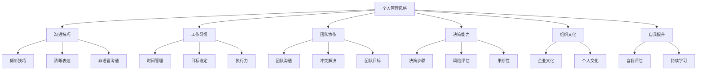

                 

## 第0章：引言

### 0.1 本书的目的

在当今快速发展的科技时代，个人管理风格已成为职场竞争力和职业发展的关键因素之一。本书旨在探讨个人管理风格的概念、构建方法及其在职场中的重要性，帮助读者了解如何通过优化个人管理风格来提升工作效率、增强团队合作能力和提高决策能力。通过系统的分析和实践指导，本书旨在为读者提供一套实用的个人管理风格方法论，助力他们在职场中实现更大的成功。

### 0.2 书的结构

本书共分为七个主要部分，结构如下：

1. **第一部分：个人管理风格的基本概念**：介绍个人管理风格的基本概念、重要性、评估方法和自我提升策略。
2. **第二部分：构建个人管理风格的方法**：详细阐述构建个人管理风格的具体方法，包括沟通技巧、工作习惯、团队协作和决策能力。
3. **第三部分：个人管理风格的应用与实践**：探讨个人管理风格在日常工作和突发事件中的实际应用，以及如何管理团队和激励员工。
4. **第四部分：个人管理风格的演变与未来趋势**：分析个人管理风格的历史演变、数字化时代的影响和未来趋势。
5. **第五部分：个人管理风格案例研究**：通过成功和失败的案例，探讨个人管理风格的特点和实践价值。
6. **第六部分：个人管理风格评估与优化**：介绍个人管理风格评估方法和优化策略，以及如何实现持续改进。
7. **第七部分：个人管理风格总结与展望**：总结个人管理风格的重要性，探讨未来发展前景，并给出建议。

### 0.3 读者对象

本书面向希望提升个人管理能力、在职场中发挥更大影响力的读者，包括企业经理、项目经理、团队负责人、IT专业人士、创业者以及其他希望在职业发展中取得突破的职场人士。通过阅读本书，读者可以了解个人管理风格的核心概念和方法论，并将其应用于实际工作中，实现个人和团队的共同成长。

### 0.4 文章结构概述

为了更好地理解本书的内容，以下是对文章结构的概述：

1. **引言**：介绍本书的目的、结构和读者对象。
2. **第一部分：个人管理风格的基本概念**：探讨个人管理风格的基本概念、重要性、评估方法和自我提升策略。
3. **第二部分：构建个人管理风格的方法**：详细阐述构建个人管理风格的具体方法，包括沟通技巧、工作习惯、团队协作和决策能力。
4. **第三部分：个人管理风格的应用与实践**：探讨个人管理风格在日常工作和突发事件中的实际应用，以及如何管理团队和激励员工。
5. **第四部分：个人管理风格的演变与未来趋势**：分析个人管理风格的历史演变、数字化时代的影响和未来趋势。
6. **第五部分：个人管理风格案例研究**：通过成功和失败的案例，探讨个人管理风格的特点和实践价值。
7. **第六部分：个人管理风格评估与优化**：介绍个人管理风格评估方法和优化策略，以及如何实现持续改进。
8. **第七部分：个人管理风格总结与展望**：总结个人管理风格的重要性，探讨未来发展前景，并给出建议。

通过以上结构，本书将带领读者深入了解个人管理风格，并提供实用的方法和策略，帮助读者在职场中取得更大的成功。

### Mermaid 流程图：个人管理风格核心概念与联系

以下是个人管理风格的核心概念与联系，通过Mermaid流程图展示：

### 核心概念与联系解读

该流程图通过节点和箭头展示了个人管理风格的核心概念及其相互之间的联系。以下是每个节点的详细解释：

- **个人管理风格**：作为整个流程的起点，是个人管理风格的核心。
- **沟通技巧**：包括倾听技巧、清晰表达和非语言沟通。
- **工作习惯**：包括时间管理和目标设定。
- **团队协作**：包括团队沟通和冲突解决。
- **决策能力**：包括决策步骤和风险评估。

此外，个人管理风格还与组织文化、企业文化、个人文化以及自我提升相关联：

- **组织文化**：包括企业文化和个人文化，影响个人管理风格的实践。
- **自我提升**：通过自我评估和持续学习，不断提升个人管理风格。

这些核心概念相互关联，共同构成一个完整的管理体系，帮助个人在职场中发挥更大的作用。

### 个人管理风格的重要性

个人管理风格的重要性在于它对职业发展的深远影响。一个高效的个人管理风格不仅能提升个人的工作效率，还能促进团队合作、提高决策能力，从而在职场中取得更大的成就。以下是个人管理风格对职业发展的具体影响：

1. **提升工作效率**：良好的个人管理风格有助于优化工作流程，合理安排时间和资源，从而提高工作效率。通过有效的目标设定和时间管理，个人能够更高效地完成工作任务，减少拖延和混乱。

2. **促进团队合作**：个人管理风格对团队合作的影响尤为显著。一个具有良好沟通技巧和团队协作能力的领导者或成员能够促进团队内部的沟通和协作，解决冲突，提高团队的整体效率。

3. **提高决策能力**：个人管理风格中的决策能力是领导者或管理者成功的关键。通过系统的决策过程和风险评估，个人能够在复杂情况下做出明智的决策，降低错误风险。

4. **增强职业竞争力**：在竞争激烈的职场环境中，具有优秀个人管理风格的人更容易脱颖而出。他们能够更好地应对工作挑战，展示出色的领导力和团队合作能力，从而在职业竞争中占据优势。

5. **提升个人影响力**：良好的个人管理风格不仅有助于提升个人能力，还能增强个人在组织中的影响力。通过有效的沟通和团队合作，个人能够建立良好的人际关系，提升自己的职业地位。

6. **促进职业发展**：优秀的个人管理风格能够帮助个人在职业发展中实现持续进步。通过不断学习和自我提升，个人能够适应职场变化，抓住更多发展机会。

总之，个人管理风格是职业发展的关键因素之一。通过优化个人管理风格，个人能够提高工作效率、促进团队合作、提升决策能力，从而在职场中取得更大的成就。

### 个人管理风格与领导力之间的关系

个人管理风格与领导力之间存在紧密的联系。领导力是个人管理风格的重要组成部分，而个人管理风格则是领导力的具体体现。以下将从多个方面探讨个人管理风格与领导力之间的关系：

#### 领导力的定义

领导力是指通过影响、激励和引导他人，实现共同目标的能力。领导力不仅包括决策和执行，还涵盖了沟通、激励、团队建设和创新等方面。领导力是一种综合性能力，能够帮助领导者带领团队克服挑战，实现组织目标。

#### 个人管理风格对领导力的影响

1. **沟通技巧**：良好的沟通技巧是领导力的重要组成部分。个人管理风格中的沟通技巧直接影响领导者的信息传递和反馈能力。一个具备优秀沟通技巧的领导者能够清晰传达愿景和目标，有效激励团队成员，增强团队凝聚力。

2. **团队协作**：个人管理风格中的团队协作能力有助于领导者构建高效的团队。通过促进团队成员之间的沟通和协作，领导者能够解决冲突，提升团队整体效率，实现共同目标。

3. **决策能力**：决策能力是领导力的核心要素之一。个人管理风格中的决策能力使领导者能够在复杂和不确定的环境中做出明智的决策。有效的决策不仅能够应对当前挑战，还能为团队未来的发展提供指导。

4. **自我提升**：个人管理风格中的自我提升能力是领导者持续成长的关键。通过不断学习和自我反思，领导者能够提升个人能力，适应新的领导环境和挑战，为团队带来创新和进步。

#### 领导力对个人管理风格的影响

1. **领导风格**：领导者的风格直接影响其个人管理风格。不同的领导风格（如民主式、专制式、参与式等）会对个人管理风格产生不同的影响。领导者的风格不仅决定了团队的管理方式，还影响了团队成员的行为和态度。

2. **团队文化**：领导力对组织文化的影响深远，进而影响个人管理风格。一个具有积极向上、创新开放的领导风格，能够塑造良好的组织文化，使个人管理风格更加灵活和适应性强。

3. **激励与反馈**：领导力中的激励和反馈机制对个人管理风格有重要影响。有效的激励和反馈能够激发团队成员的积极性，促进个人管理风格中的自我提升和能力发展。

总之，个人管理风格与领导力之间是相辅相成的。一个优秀的领导者不仅具备强大的领导力，还能通过个人管理风格来提升团队的整体绩效。通过不断优化个人管理风格，领导者能够更好地发挥领导力，实现组织目标。

### 个人管理风格对个人发展的意义

个人管理风格不仅对职业发展具有重要意义，也对个人的整体成长产生深远影响。以下是个人管理风格对个人发展的几个关键方面：

#### 提升工作效率

个人管理风格的一个核心要素是工作效率。通过合理的时间管理和目标设定，个人可以更有效地安排工作，减少拖延和混乱。有效的时间管理有助于提高工作效率，使个人能够更快地完成任务，从而为更多的学习和成长留出时间。此外，良好的工作习惯，如定期回顾和总结，也有助于持续提升工作效率。

#### 提高团队合作能力

个人管理风格中的团队协作能力是个人在职场中成功的重要保障。一个具备良好团队协作能力的个人能够与团队成员有效沟通、协调行动，共同实现目标。通过积极参与团队活动，个人可以提升协作技能，培养团队合作精神，增强团队凝聚力。这些能力不仅有助于当前工作的顺利完成，还为未来的职业发展奠定基础。

#### 增强决策能力

决策能力是个人管理风格的重要组成部分，也是个人在职场中取得成功的关键因素之一。通过培养良好的决策习惯，个人可以学会在复杂和不确定的环境中做出明智的决策。有效的决策不仅能够应对当前挑战，还能为未来的职业发展提供明确的指导。通过不断实践和反思，个人可以提升决策能力，增强自信和决心。

#### 提升自我管理能力

个人管理风格的核心在于自我管理。通过自我管理，个人可以更好地控制自己的情绪和行为，保持积极向上的态度。自我管理能力包括情绪管理、自我激励和自我反思等方面。通过提升自我管理能力，个人可以更好地应对压力和挑战，保持稳定的工作状态，从而实现持续成长。

#### 促进职业发展

个人管理风格对职业发展有着重要的影响。一个具备优秀个人管理风格的个人不仅能够在当前职位上表现出色，还能为未来的职业发展奠定坚实的基础。通过不断提升个人管理风格，个人可以更好地适应职场变化，抓住更多的发展机会，实现职业目标。

总之，个人管理风格对个人发展具有重要意义。通过优化个人管理风格，个人可以提升工作效率、增强团队合作能力、提高决策能力和自我管理能力，从而在职业发展中取得更大的成就。

### 个人管理风格与组织文化

个人管理风格与组织文化之间存在密切的关联，这种关联不仅影响了组织内部的运作方式，还深刻地塑造了员工的行为和工作态度。以下从多个方面探讨个人管理风格与组织文化之间的关系：

#### 组织文化的概念

组织文化是指一个组织在长期发展过程中形成的共同价值观、行为准则和工作方式。它包括组织的使命、愿景、价值观、工作流程和沟通模式等。组织文化不仅体现在组织的制度和规范中，还渗透到员工的日常工作和互动中。

#### 个人管理风格对组织文化的影响

1. **价值观的传递**：个人管理风格体现了个人对工作的态度和行为模式。当一个员工具备积极的个人管理风格时，他们的行为会传递组织的价值观，如诚信、责任感和团队合作。这种积极的示范作用可以激励其他员工效仿，从而增强组织文化的凝聚力。

2. **工作氛围的塑造**：个人管理风格对组织的工作氛围有重要影响。一个具备高效沟通和团队合作能力的员工可以促进组织内部的良好沟通和合作，创造一个开放、包容和创新的工作环境。这种工作氛围有助于员工充分发挥潜能，提高工作满意度。

3. **组织变革的推动**：个人管理风格对组织变革的推动作用也不容忽视。一个具有创新意识和自我提升能力的员工可以推动组织进行结构优化和管理创新，从而提升组织的竞争力和适应性。

#### 组织文化对个人管理风格的影响

1. **价值观的引导**：组织文化对员工的个人管理风格有深远的引导作用。在一个强调团队合作和创新的组织文化中，员工更容易培养出良好的沟通和协作能力。相反，在一个强调个体主义和竞争的组织文化中，员工的个人管理风格可能会更注重个人利益和竞争。

2. **行为规范的影响**：组织文化通过规章制度和行为准则规范员工的行为。这些规范不仅影响了员工的工作方式，也影响了他们的个人管理风格。例如，在一个重视绩效的组织文化中，员工可能会更注重效率和工作成果。

3. **工作支持的提供**：组织文化提供了员工在工作中的支持和资源。在一个支持个人发展和职业成长的组织文化中，员工可以更容易地获取培训和发展机会，从而提升个人管理风格。相反，在一个不支持个人发展的组织文化中，员工可能难以提升个人管理能力。

#### 个人管理风格与组织文化的互动

个人管理风格与组织文化之间的互动是动态的，两者相互影响，共同塑造了组织的运作方式和员工的行为。一个良好的组织文化可以促进员工培养积极的个人管理风格，而一个优秀的个人管理风格也可以推动组织文化的持续改进。

总之，个人管理风格与组织文化之间存在密切的关联。通过优化个人管理风格，员工可以更好地适应组织文化，提升工作表现；同时，一个积极的组织文化也能够促进员工的个人管理风格发展，实现组织与个人的共同成长。

### 个人管理风格评估与自我提升

个人管理风格的评估与自我提升是优化个人管理能力的关键环节。通过系统的方法进行评估，可以识别自身的优势和不足，进而制定有效的提升策略。以下将详细探讨评估个人管理风格的方法和自我提升的策略。

#### 评估个人管理风格的方法

1. **自我评估问卷**：通过设计一系列针对个人管理风格的问题，帮助个体评估自己的管理能力。这些问卷通常包括以下方面：
   - **沟通技巧**：如倾听能力、表达清晰度、非语言沟通等。
   - **时间管理**：如任务安排、优先级设定、时间利用效率等。
   - **团队协作**：如团队合作意愿、冲突解决能力、团队沟通效果等。
   - **决策能力**：如风险评估、决策果断性、决策后的反馈等。
   - **自我管理**：如情绪控制、自我激励、自我反思等。

2. **360度反馈**：通过收集来自上级、同事、下属和外部合作伙伴的反馈，全面了解个人的管理风格。这种评估方法可以提供多角度的视角，帮助个人识别盲点。

3. **行为观察**：通过观察个人在工作中的行为表现，评估其管理风格。这种方法可以更直观地了解个人在实际工作中的表现。

4. **心理测试**：使用专业的心理测试工具，如Myers-Briggs类型指标（MBTI）等，分析个人的性格特征和管理风格。

#### 自我提升的策略

1. **设定具体目标**：基于评估结果，设定明确的个人提升目标。这些目标应具体、可测量，并具有实际操作步骤。

2. **制定行动计划**：为每个提升目标制定详细的行动计划，包括具体的时间表、所需的资源和实施步骤。

3. **持续学习**：通过参加培训课程、阅读专业书籍、观看在线讲座等方式，不断学习新的管理理念和方法。

4. **实践和应用**：将学到的知识和技能应用到实际工作中，通过实践来验证和提升自己的管理能力。

5. **寻求反馈**：定期向同事、上级和下属寻求反馈，了解自己在提升过程中的进展和需要改进的地方。

6. **建立支持网络**：与同事和导师建立联系，分享经验和学习资源，共同进步。

7. **自我反思**：定期进行自我反思，总结提升过程中的成功和不足，调整提升策略。

总之，通过科学的评估和有效的自我提升策略，个人可以不断提升自己的管理能力，实现个人和职业发展的双重目标。

### 确定个人管理风格的类型

构建个人管理风格的第一步是明确个人管理风格的类型。不同的管理风格适用于不同的环境和任务，了解并确定自己的管理风格类型是提升管理能力的关键。以下是几种常见的个人管理风格类型及其特点：

#### 内向型管理风格

内向型管理风格的人通常倾向于独立工作和深思熟虑。他们在决策时更加慎重，倾向于通过内部思考和数据分析来做出决策。

- **特点**：
  - 倾向于深入思考和独立工作
  - 决策前需要充分的时间和信息收集
  - 更加注重细节和准确性
  - 善于倾听和理解他人的观点

- **适用场景**：适合需要深入分析和研究的任务，如技术研发、数据分析和战略规划。

#### 外向型管理风格

外向型管理风格的人通常喜欢与人交流和互动，倾向于在团队环境中工作。他们在沟通和协调方面表现出色，能够迅速调动团队的积极性和参与度。

- **特点**：
  - 喜欢与人交流和互动
  - 决策时喜欢快速行动和尝试新方法
  - 更注重沟通和团队合作
  - 活跃且富有创新思维

- **适用场景**：适合需要团队合作和沟通的任务，如市场推广、项目管理和社会活动。

#### 分析型管理风格

分析型管理风格的人注重逻辑和数据，擅长通过系统的方法解决问题。他们在处理复杂和不确定的情况时能够保持冷静，通过数据分析来做出决策。

- **特点**：
  - 注重逻辑和数据分析
  - 能够快速识别问题和解决方案
  - 善于使用工具和技术来辅助决策
  - 对风险有较强的预判能力

- **适用场景**：适合需要分析和决策的任务，如项目管理、风险评估和财务规划。

#### 行动型管理风格

行动型管理风格的人以结果为导向，喜欢快速行动并解决问题。他们在面对紧急任务时能够迅速响应，通过行动来推动项目进展。

- **特点**：
  - 注重行动和结果
  - 能够迅速制定并执行计划
  - 善于解决紧急问题和突发事件
  - 具有较强的执行力和决断力

- **适用场景**：适合需要快速响应和执行的任务，如危机管理、应急响应和项目管理。

#### 确定个人管理风格的步骤

1. **自我反思**：回顾自己在工作中的表现和反应，思考自己更倾向于哪种管理风格。
2. **他人反馈**：向同事、上级和下属征求意见，了解他人对自己管理风格的看法。
3. **使用评估工具**：借助专业评估工具，如MBTI、领导力测试等，分析个人管理风格。
4. **实践检验**：在实际工作中尝试应用不同的管理风格，观察效果并调整策略。

通过以上步骤，个人可以明确自己的管理风格类型，并在此基础上制定适合自身特点的管理策略，提升管理能力和工作效率。

### 提升沟通技巧

沟通技巧是个人管理风格的重要组成部分，良好的沟通技巧能够有效提升工作效率、增强团队合作能力，并改善团队氛围。以下将详细阐述提升沟通技巧的方法：

#### 1. 提高倾听技巧

倾听是有效沟通的基础，通过提高倾听技巧，可以确保信息的准确传递和理解。以下是一些建议：

- **全神贯注**：在与他人交流时，全神贯注地听，避免分心。避免在听对方讲话时处理其他事务，确保自己能够集中注意力。
- **避免打断**：在对方讲话时，不要急于插话或打断，给对方足够的时间表达自己的观点。这不仅可以尊重对方，还能确保信息的完整接收。
- **反馈确认**：在对方讲话结束后，通过提问或总结对方的内容来确认自己的理解是否准确。例如：“我理解您的问题是……，对吗？”

#### 2. 改善表达

清晰、简洁、有条理的表达能够使信息更容易被理解和接受。以下是一些建议：

- **明确目的**：在交流前明确自己的目的，确保表达的内容能够达到预期效果。避免模糊不清或冗长的表达。
- **使用简单语言**：尽量使用简单易懂的语言，避免使用过于专业或复杂的词汇。这有助于确保信息能够被广泛理解。
- **条理清晰**：在表达时，按照逻辑顺序逐步展开，确保信息条理清晰。可以使用“首先……其次……最后……”的结构来组织内容。

#### 3. 表达清晰与简洁

清晰和简洁的表达能够使信息更容易被理解和接受。以下是一些建议：

- **简洁明了**：在表达时，避免冗长和复杂的句子结构，尽量用简洁明了的语言传达信息。这有助于减少误解和混淆。
- **使用视觉辅助**：在适当的情况下，使用图表、幻灯片或图像等视觉辅助工具来传达信息。视觉元素能够增强信息的直观性和记忆效果。
- **练习与反思**：通过不断练习和反思，提升自己的表达能力。可以在会议、演讲或日常交流中练习，并反思自己的表达效果，逐步改进。

#### 4. 学会非语言沟通

非语言沟通，如肢体语言、面部表情和语气等，在沟通中发挥着重要作用。以下是一些建议：

- **保持眼神交流**：在与他人交流时，保持适度的眼神交流，这可以传达出尊重和关注。但也要注意适度，避免给对方造成压迫感。
- **注意肢体语言**：通过适当的肢体语言，如点头、微笑或手势等，表达出对对方的理解和认同。肢体语言可以增强沟通的效果。
- **调整语气和语调**：通过调整语气和语调，传达出自己的情感和态度。适当的语气和语调可以使信息更加生动和有说服力。

总之，通过提高倾听技巧、改善表达、表达清晰与简洁以及学会非语言沟通，个人可以显著提升沟通技巧，从而提升工作效率和团队合作能力。

### 建立高效的工作习惯

建立高效的工作习惯是提升个人管理能力的关键步骤，这不仅有助于提高工作效率，还能减少工作压力，提升工作满意度。以下将详细探讨如何建立和优化高效的工作习惯：

#### 1. 时间管理技巧

时间管理是高效工作习惯的核心，通过合理的时间管理，个人可以更好地安排工作和休息时间，从而提高工作效率。

- **制定计划**：在开始一天的工作前，制定详细的工作计划，明确当天需要完成的任务和优先级。使用日程表或时间管理应用来帮助记录和跟踪任务。
- **优先级设定**：将任务按照重要性和紧急性进行分类，优先处理重要且紧急的任务。这有助于确保关键任务得到及时完成。
- **避免拖延**：设定明确的截止日期和提醒，避免拖延任务的完成。如果遇到拖延，尝试找出原因并采取相应的策略来克服。
- **碎片化时间利用**：利用碎片化的时间，如等待会议开始的时间、通勤时间等，进行阅读、学习或处理简单的任务。

#### 2. 设置目标和优先级

明确的目标和优先级有助于个人集中精力，提高工作效率。

- **SMART原则**：设定具体、可衡量、可实现、相关性强和有时间限制的目标（SMART原则），确保目标明确且可操作。
- **定期回顾**：每周或每月定期回顾目标完成情况，评估是否需要调整目标和优先级。这有助于保持目标的持续性和适应性。

#### 3. 提高工作效率

提高工作效率可以减少冗余时间，使个人能够更高效地完成工作任务。

- **自动化和工具化**：利用自动化工具和软件，如电子邮件过滤器、项目管理工具和时间管理应用，自动化日常任务，减少手动操作。
- **消除干扰**：在工作时，尽量消除干扰因素，如关闭不必要的通知、避免频繁查收邮件或浏览社交媒体。这有助于保持专注，提高工作效率。
- **专注工作**：采用番茄工作法（Pomodoro Technique）等专注技巧，将工作时间划分为25分钟的工作周期，每个周期后休息5分钟。这有助于提高专注力和工作效率。

#### 4. 建立日常习惯

建立稳定的日常习惯有助于个人形成工作节奏，提高工作效率。

- **固定的作息时间**：保持固定的作息时间，确保每天有充足的睡眠和休息。这有助于提高身体和心理状态，从而更好地面对工作挑战。
- **日常任务清单**：每天制定一个任务清单，包括日常工作和例行任务，确保不会遗漏重要的任务。
- **反思和调整**：每天或每周结束时，反思当天的任务完成情况，总结经验和教训，调整下一步的工作计划。

通过以上方法，个人可以建立和优化高效的工作习惯，提高工作效率，减少工作压力，提升工作满意度。这不仅有助于个人职业发展，还能提升整个团队和组织的绩效。

### 发展团队协作能力

团队协作能力是个人管理风格中至关重要的一环，它不仅能够提高团队工作效率，还能增强团队凝聚力和创新能力。以下将从团队协作的原理、促进团队沟通和解决团队冲突三个方面，探讨如何有效发展团队协作能力。

#### 团队协作的原理

1. **共同目标**：团队协作的基础是共同的目标和愿景。团队成员应明确团队的目标，并围绕这一目标共同努力。通过共同的目标，可以增强团队成员之间的协作意愿和凝聚力。

2. **分工合作**：团队协作要求每个成员根据自身能力和特长，承担相应的责任和任务。合理的分工可以确保团队成员在各自擅长的领域发挥最大作用，提高整体工作效率。

3. **相互信任**：团队协作建立在信任的基础上。团队成员之间应相互信任，开放沟通，分享信息，共同面对挑战。信任能够减少误解和矛盾，提高团队协作的效率。

4. **有效沟通**：沟通是团队协作的关键。团队成员应保持开放和诚实的沟通，确保信息畅通无阻。有效的沟通能够帮助团队快速解决问题，提高决策质量。

5. **共同解决问题**：在团队协作中，面对问题和挑战时，团队成员应共同分析问题，提出解决方案，并共同实施。这种协作过程有助于培养团队成员的解决问题能力和团队凝聚力。

#### 促进团队沟通

1. **建立沟通机制**：团队应建立定期沟通的机制，如每周会议、项目进度汇报等。通过这些机制，团队成员可以及时分享信息、讨论问题，并协调工作。

2. **开放沟通环境**：创建一个开放、包容和尊重的沟通环境，鼓励团队成员畅所欲言，表达自己的观点和建议。避免压制不同意见，鼓励多元化思维。

3. **有效的沟通技巧**：团队成员应掌握有效的沟通技巧，如倾听、表达清晰、非语言沟通等。通过提高沟通技巧，可以减少误解和冲突，提高沟通效果。

4. **利用技术工具**：使用适当的沟通工具和技术，如电子邮件、即时通讯、视频会议等，确保信息能够及时传达和反馈。技术工具可以帮助团队跨越时间和空间的限制，实现高效沟通。

#### 解决团队冲突

1. **识别冲突根源**：在冲突发生时，首先要识别冲突的根源。了解冲突背后的原因，如目标不一致、沟通不畅、职责不清等，有助于找到解决问题的方法。

2. **建立解决机制**：团队应建立一套解决冲突的机制，如冲突调解会议、中立调解人等。通过这些机制，可以帮助团队在冲突发生时迅速找到解决方案。

3. **积极沟通**：在解决冲突时，团队成员应积极沟通，坦诚表达自己的观点和感受。通过有效的沟通，可以增进理解，找到共同点，化解冲突。

4. **寻求共识**：在冲突解决过程中，团队应寻求共识，找到一个双方都能接受的解决方案。通过达成共识，可以避免未来冲突的再次发生。

5. **持续反思和改进**：在解决冲突后，团队应进行反思和总结，分析冲突发生的原因和解决过程，从中汲取经验教训，改进团队协作方式。

总之，发展团队协作能力需要从团队协作的原理、促进团队沟通和解决团队冲突三个方面入手。通过建立共同目标、分工合作、相互信任、有效沟通和积极解决冲突，团队可以增强协作能力，提高整体绩效，实现共同目标。

### 培养决策能力

决策能力是个人管理风格中的重要组成部分，对于职业发展和团队领导具有至关重要的影响。以下是培养决策能力的几个关键步骤：

#### 1. 理解决策过程

决策过程通常包括以下几个步骤：

1. **问题识别**：首先，需要明确需要解决的问题或面临的挑战。这一步要求个人能够敏锐地识别问题，并对其进行初步分析。

2. **信息收集**：在识别问题后，需要收集相关信息，包括数据、事实、专家意见等。充分的信息收集有助于提高决策的准确性和全面性。

3. **方案生成**：基于收集到的信息，生成多个可能的解决方案或方案。这一步要求个人具备创新思维和创造力。

4. **方案评估**：对每个方案进行详细评估，包括评估其可行性、风险和潜在收益。通过综合评估，可以筛选出最优方案。

5. **方案选择**：在评估基础上，选择最佳方案进行实施。这一步需要个人具备果断和决断力。

6. **决策执行**：将决策付诸实施，并持续监控决策的执行情况，确保决策目标得以实现。

7. **决策反思**：在决策实施后，进行反思和总结，评估决策的效果，为未来提供经验和教训。

#### 2. 评估风险与收益

在决策过程中，评估风险与收益是至关重要的一环。以下是一些建议：

1. **识别潜在风险**：在制定方案时，要充分考虑可能出现的风险和问题，如技术风险、市场风险、资源限制等。

2. **量化风险**：对每个潜在风险进行量化评估，包括可能的风险程度和发生概率。这有助于更清晰地了解风险的影响。

3. **评估收益**：评估每个方案的潜在收益，包括直接收益和间接收益。通过对比不同方案的收益，可以更准确地选择最优方案。

4. **平衡风险与收益**：在决策过程中，需要平衡风险与收益，选择风险可控且收益最大的方案。这需要个人具备良好的风险评估和判断能力。

#### 3. 增强决策果断性

果断性是决策过程中不可或缺的品质。以下是一些建议：

1. **提高自信**：通过不断学习和实践，提高自己在决策领域的专业知识和信心。自信有助于在决策时更加果断。

2. **培养决断力**：在面对决策时，避免犹豫不决。通过设定明确的决策标准和时间限制，有助于提高决策果断性。

3. **避免过度分析**：在决策过程中，避免陷入过度分析的陷阱。过多的分析可能导致决策延误，反而降低决策的果断性。

4. **接受决策后果**：认识到任何决策都存在风险和不确定性。在决策时，要有勇气接受可能的负面后果，并从中学习和成长。

#### 4. 持续学习和实践

培养决策能力是一个持续的过程，需要通过学习和实践不断提升。以下是一些建议：

1. **阅读相关书籍和文章**：阅读关于决策理论和实践的书籍和文章，了解不同决策模型和方法。

2. **参加培训课程**：参加专业的决策培训课程，学习先进的决策工具和技巧。

3. **模拟决策**：通过模拟决策练习，提升自己的决策能力和应变能力。

4. **反思和总结**：在每次决策后，进行反思和总结，分析成功和失败的原因，从中汲取经验教训。

5. **寻求反馈**：向同事、上级和下属寻求反馈，了解自己的决策风格和效果，不断改进。

通过以上步骤，个人可以逐步培养和提高自己的决策能力，在职场中更加自信和有效地做出决策。

### 应对日常工作挑战

在职场中，日常工作挑战是不可避免的，这些挑战包括重复性工作、复杂项目管理等。有效应对这些挑战，不仅能够提升工作效率，还能提高工作满意度。以下将详细探讨应对日常工作挑战的策略：

#### 1. 处理重复性工作

重复性工作是职场中常见的问题，以下是一些有效处理重复性工作的策略：

- **自动化和工具化**：利用自动化工具和技术，如脚本、自动化软件和电子表格等，将重复性任务自动化。这不仅可以节省时间，还能减少人为错误。
- **制定标准操作流程（SOP）**：为重复性工作制定标准操作流程，确保每次执行任务时都有统一的标准和步骤，减少误差和混乱。
- **批量处理**：将类似的任务集中处理，一次性完成多个任务，避免频繁切换任务，提高工作效率。
- **任务分解**：将复杂的重复性任务分解为简单的子任务，逐个完成。这有助于降低任务的复杂度，使工作更加有序。

#### 2. 管理复杂项目

复杂项目是职场中的一大挑战，以下是一些管理复杂项目的策略：

- **制定详细的项目计划**：在项目启动前，制定详细的项目计划，包括项目目标、任务分工、时间表和资源分配等。这有助于确保项目能够按照预期进行。
- **风险管理**：识别项目中的潜在风险，并制定相应的风险应对策略。通过提前预防和应对，可以减少风险对项目的影响。
- **沟通和协作**：建立有效的沟通和协作机制，确保团队成员之间的信息畅通，避免因信息不对称导致的误解和冲突。
- **监控和调整**：定期监控项目进度和质量，及时发现和解决问题。如果项目出现偏差，应迅速调整计划和资源，确保项目能够按计划完成。
- **迭代和改进**：在项目实施过程中，不断迭代和改进，通过反馈和总结，优化项目流程和管理方法。

通过以上策略，个人可以更有效地应对日常工作的挑战，提升工作效率，确保项目顺利完成。

### 应对突发事件与危机

在职场中，突发事件与危机是不可避免的，这些事件可能会对组织的正常运营和员工的职业发展产生重大影响。有效应对突发事件与危机，不仅需要紧急反应策略，还需要恢复秩序的策略。以下将详细探讨应对突发事件与危机的具体策略：

#### 紧急反应策略

1. **快速识别**：突发事件发生时，首先需要快速识别事件的性质和影响范围。通过实时监控、及时汇报和迅速反应，确保事件能够被及时识别。

2. **启动应急响应计划**：在突发事件发生时，立即启动预先制定的应急响应计划。应急响应计划应包括应急步骤、责任分配和关键联系人等信息，确保在紧急情况下能够迅速采取行动。

3. **通知相关人员**：及时通知相关人员，包括团队、管理层和外部合作伙伴，确保他们了解事件的性质和影响。通过有效的沟通，可以协调各方资源，共同应对危机。

4. **评估风险**：对突发事件进行风险评估，识别潜在的风险和影响。通过评估，可以确定需要优先解决的问题和资源投入。

5. **采取行动**：根据应急响应计划和风险评估结果，采取紧急措施，如紧急修复、数据备份、人员疏散等，以减轻事件的影响。

#### 恢复秩序策略

1. **制定恢复计划**：在紧急情况得到控制后，立即制定恢复计划。恢复计划应包括恢复步骤、时间表和资源分配，确保在事件结束后能够迅速恢复正常运营。

2. **资源调配**：根据恢复计划，合理调配资源，包括人力、物资和设备等，确保恢复工作的顺利进行。

3. **沟通和协调**：恢复过程中，保持与内部团队和外部合作伙伴的密切沟通，确保信息畅通，避免误解和冲突。

4. **评估和总结**：在恢复秩序后，对事件进行评估和总结，识别事件中的教训和改进点。通过总结，可以优化应急响应计划和恢复策略，提高未来应对突发事件的能力。

5. **培训和教育**：根据评估结果，对员工进行相关培训和教育，提高他们的应急处理能力和危机管理意识。通过持续培训和提升，可以增强团队在应对突发事件和危机时的适应能力和反应速度。

通过以上策略，个人和组织可以更有效地应对突发事件和危机，快速恢复秩序，减少对正常运营和员工职业发展的影响。

### 管理团队与激励员工

管理团队与激励员工是个人管理风格的重要组成部分，这不仅关系到团队的整体绩效，还直接影响员工的职业满意度和个人成长。以下将详细探讨管理团队与激励员工的具体策略：

#### 1. 建立有效的工作关系

建立有效的工作关系是管理团队的首要任务。以下是一些建议：

- **了解员工需求**：与员工建立良好的沟通，了解他们的需求、期望和职业目标。通过了解员工的需求，可以更好地提供支持和发展机会。
- **建立信任**：信任是团队合作的基石。通过透明和诚实的沟通，建立信任关系，确保团队成员之间的互信和尊重。
- **明确角色和职责**：明确团队成员的角色和职责，确保每个人都知道自己的工作内容和期望。这有助于提高工作效率和避免职责重叠。
- **提供反馈**：定期提供反馈，包括正面和改进建议，帮助员工了解自己的工作表现，并促进个人成长。

#### 2. 提升员工积极性

提升员工积极性是管理团队的重要目标，以下是一些有效策略：

- **认可和奖励**：对员工的努力和成就给予认可和奖励，如表扬、奖金或晋升机会。这可以激励员工继续保持高水平的工作表现。
- **提供发展机会**：为员工提供培训、学习和发展的机会，帮助他们提升技能和知识。这不仅可以提高员工的职业素养，还能增强他们的职业满意度。
- **激励计划**：实施激励计划，如员工股票期权、奖金计划或团队竞赛等，激发员工的积极性和竞争意识。
- **鼓励创新**：鼓励员工提出新的想法和解决方案，创造一个开放、包容和创新的工作环境。这有助于激发员工的创造力和主动性。

#### 3. 管理团队冲突

团队冲突是职场中常见的问题，以下是一些有效管理团队冲突的策略：

- **及时处理**：在冲突发生时，及时介入并处理。避免让冲突升级，影响团队的合作和氛围。
- **了解冲突根源**：识别冲突的根源，包括个人差异、任务分配、沟通问题等。通过了解冲突的根源，可以更有效地解决冲突。
- **提供解决方案**：与冲突双方进行沟通，提供解决方案，并确保双方都接受。通过达成共识，可以消除冲突，恢复团队的合作氛围。
- **建立调解机制**：建立团队调解机制，为冲突双方提供一个中立的平台，通过调解人帮助解决冲突。这有助于减少冲突对团队的负面影响。

#### 4. 建立团队文化

团队文化是团队长期发展的基础，以下是一些建立健康团队文化的策略：

- **共同价值观**：确立团队的共同价值观，如诚信、责任、协作和创新等。通过共同价值观，可以统一团队的目标和行为。
- **积极沟通**：鼓励团队成员之间的积极沟通，建立开放、诚实和尊重的沟通环境。这有助于增强团队的凝聚力和合作意愿。
- **庆祝成功**：庆祝团队的每一个成功，包括小成就和里程碑事件。这可以增强团队的归属感和自豪感。
- **支持多样性**：鼓励团队中的多样性，包括性别、年龄、文化和背景等。多样性可以带来新的视角和想法，促进团队的创新和发展。

通过以上策略，个人可以更有效地管理团队和激励员工，提升团队的整体绩效和员工的职业满意度。

### 个人管理风格在领导中的体现

个人管理风格在领导中的体现是领导者成功的关键因素之一。有效的个人管理风格能够帮助领导者提升团队绩效、增强员工满意度和实现组织目标。以下从领导风格的类型、领导风格与员工满意度之间的关系以及如何塑造个人管理风格三个方面，探讨个人管理风格在领导中的体现。

#### 领导风格的类型

1. **权威型领导风格**：权威型领导风格强调领导者的决策权和控制力。领导者通过明确的指示和严格的规章制度来管理团队。这种风格在需要快速决策和高效执行的任务中表现出色，但可能导致员工的自主性和创新能力受到限制。

2. **民主型领导风格**：民主型领导风格强调团队合作和参与决策。领导者鼓励团队成员参与讨论，共同制定决策。这种风格有助于激发员工的积极性和创造力，提高团队的凝聚力和合作意愿，但在需要迅速决策的情况下可能会出现效率低下的问题。

3. **变革型领导风格**：变革型领导风格强调领导者的愿景和激励能力。领导者通过激发员工的内在动机，推动团队实现变革和创新。这种风格有助于组织适应外部环境的变化，提高竞争力和创新能力，但需要领导者具备高度的战略思维和领导力。

4. **参与型领导风格**：参与型领导风格强调领导者和团队成员之间的紧密互动和合作。领导者通过鼓励团队成员参与决策和提供反馈来管理团队。这种风格有助于提高员工的参与感和责任感，增强团队的凝聚力和信任，但需要领导者具备良好的沟通能力和团队管理技巧。

#### 领导风格与员工满意度之间的关系

领导风格对员工满意度有着重要影响。不同类型的领导风格对员工满意度的影响各有不同：

1. **权威型领导风格**：权威型领导风格在短期内可能会提高员工的工作效率，但长期来看，可能会降低员工的满意度和工作积极性。员工可能会感到压力过大、缺乏自主性，从而影响工作满意度和职业发展。

2. **民主型领导风格**：民主型领导风格能够提高员工的参与感和自主性，从而增加员工的工作满意度和忠诚度。员工感到被尊重和信任，更愿意为团队和组织做出贡献。

3. **变革型领导风格**：变革型领导风格能够激发员工的内在动机，提高员工的工作满意度和职业成就感。员工感受到领导者的愿景和激励，更愿意积极参与组织的变革和创新。

4. **参与型领导风格**：参与型领导风格能够增强员工的参与感和责任感，从而提高员工的工作满意度和忠诚度。员工感受到领导者的关心和支持，更有动力为团队和组织的目标努力。

#### 如何塑造个人管理风格

领导者需要根据自己的特点和团队需求，塑造适合自己的个人管理风格。以下是一些建议：

1. **自我评估**：领导者应定期进行自我评估，了解自己的优势和不足，识别自己的领导风格。通过自我评估，可以更好地了解自己，为塑造个人管理风格提供依据。

2. **学习和实践**：领导者应不断学习和实践新的领导理论和技巧，提升自己的领导能力。通过阅读相关书籍、参加培训课程和向优秀的领导者学习，可以丰富自己的领导经验和知识。

3. **沟通和反馈**：领导者应保持与团队成员的紧密沟通，了解员工的需求和反馈。通过有效的沟通和反馈，可以及时调整领导风格，满足员工的需求，提高团队的整体绩效。

4. **灵活调整**：领导者应根据不同的情况和需求，灵活调整自己的领导风格。在不同环境和任务中，选择最适合的领导风格，以达到最佳的管理效果。

5. **持续反思**：领导者应不断反思自己的领导行为和效果，总结经验和教训，为未来的领导实践提供参考。通过持续反思，可以不断提升自己的领导能力和个人管理风格。

总之，个人管理风格在领导中的体现是领导者成功的关键因素之一。通过了解领导风格的类型、认识领导风格与员工满意度之间的关系以及掌握如何塑造个人管理风格的方法，领导者可以更有效地管理团队，提高员工满意度和组织绩效。

### 个人管理风格与组织发展

个人管理风格不仅影响个人职业发展，还对组织的发展产生深远影响。一个有效的个人管理风格能够促进组织创新、提高组织适应性和推动组织文化变革。以下将详细探讨个人管理风格对组织发展的具体影响。

#### 促进组织创新

个人管理风格中的创新思维和创造力是组织发展的关键驱动力。具备创新意识的领导者或员工能够提出新的想法和解决方案，推动组织在产品开发、服务优化和管理方法上的创新。以下是一些具体方式：

1. **鼓励试错**：一个开放和支持的创新文化可以鼓励员工尝试新的方法，即使失败也不会受到惩罚。这种宽容的环境有助于员工敢于创新，从而激发组织的创新潜力。

2. **跨部门合作**：通过促进不同部门之间的合作，可以汇集不同领域的知识和技能，推动创新项目的实施。这种跨部门合作有助于打破壁垒，促进创新思维。

3. **资源分配**：有效的个人管理风格会确保创新项目得到适当的资源支持，包括人力、资金和设备等。资源的高效配置有助于创新项目的顺利进行，提高成功率。

4. **激励机制**：通过设置创新奖励和激励机制，可以鼓励员工积极参与创新活动，提高创新热情。激励机制不仅包括物质奖励，还可以是职业发展机会和认可。

#### 提高组织适应性

在快速变化的市场环境中，组织的适应性成为竞争力的关键。个人管理风格中的适应性和灵活性有助于组织快速响应市场变化，调整战略和业务模式。以下是一些提高组织适应性的策略：

1. **敏捷管理**：采用敏捷管理方法，如敏捷开发、精益管理和Scrum等，可以提高组织对市场变化的响应速度。这种管理风格强调快速迭代和持续改进，有助于组织及时调整战略。

2. **学习型组织**：培养学习型组织文化，鼓励员工不断学习和分享知识。通过持续学习，员工能够更快地掌握新技能和知识，提高组织的适应能力。

3. **信息共享**：建立有效的信息共享机制，确保组织内部信息畅通无阻。通过信息共享，员工可以更快地了解市场动态和客户需求，从而做出更快的决策。

4. **灵活的团队结构**：通过建立灵活的团队结构，如项目团队和虚拟团队，组织可以更快速地适应变化。这种结构有助于提高组织的灵活性和响应速度。

#### 推动组织文化变革

个人管理风格对组织文化的塑造和变革具有重要作用。一个积极的个人管理风格可以推动组织文化从传统和保守向创新和灵活转变。以下是一些推动组织文化变革的策略：

1. **领导示范**：领导者通过自身行为和价值观来塑造组织文化。一个具备创新和适应性的领导风格可以激发员工的创新意识和主动性，推动组织文化变革。

2. **价值观整合**：将创新和适应性价值观整合到组织的核心价值观中，确保所有员工都认同和追求这些价值观。通过价值观整合，可以形成共同的文化基础。

3. **文化倡导**：通过文化活动和宣传，倡导创新和适应性的文化理念。例如，举办创新研讨会、文化竞赛和分享会等，可以增强员工对组织文化的认同。

4. **员工参与**：鼓励员工参与组织文化的变革过程，提供反馈和建议。员工的参与不仅有助于提高文化变革的接受度，还能增强员工的归属感和责任感。

总之，个人管理风格对组织发展具有深远影响。通过促进组织创新、提高组织适应性和推动组织文化变革，个人管理风格能够帮助组织在竞争激烈的市场中脱颖而出，实现持续发展。

### 个人管理风格的历史演变

个人管理风格经历了多个阶段的历史演变，从早期的传统管理到现代的管理理念，每个阶段都有其独特的特点和贡献。以下将详细探讨个人管理风格的历史演变过程。

#### 传统管理阶段

传统管理阶段起源于工业革命时期，其主要特点是强调权威和控制。在这个阶段，管理者通过严格的规章制度和层级结构来管理员工。以下是一些主要特点：

- **权威主义**：管理者拥有绝对的决策权和控制权，员工的职责是执行管理者的指令。
- **生产效率**：传统管理的核心目标是提高生产效率，管理者通过标准化和流程化来确保生产效率的最大化。
- **层级结构**：组织结构以严格的层级制度为基础，从上到下形成了明确的指挥链。

传统管理在工业时代初期起到了重要作用，通过标准化和规模化的生产方式，推动了经济的快速发展。然而，这种管理风格也导致了员工自主性和创新能力的受限，难以适应快速变化的市场环境。

#### 现代管理阶段

随着企业环境的复杂性和不确定性增加，现代管理阶段应运而生。这个阶段强调人性化和团队合作，倡导以员工为中心的管理理念。以下是一些主要特点：

- **参与式管理**：管理者鼓励员工参与决策过程，通过民主和参与式管理提高员工的积极性和创造力。
- **团队协作**：现代管理强调团队协作，通过跨职能团队和项目管理来提高团队的整体绩效。
- **员工发展**：管理者注重员工的职业发展和个人成长，通过培训和发展计划来提升员工的技能和知识。

现代管理在信息时代中发挥了重要作用，通过促进员工参与和团队协作，提高了组织的灵活性和创新能力。这种管理风格有助于企业在快速变化的市场环境中保持竞争优势。

#### 当代管理阶段

当代管理阶段更加注重个体差异和个性化管理。这个阶段的个人管理风格强调自我管理、持续学习和灵活适应。以下是一些主要特点：

- **自我管理**：员工被鼓励自主管理和自我驱动，通过设定个人目标和自我监控来实现职业发展。
- **个性管理**：管理者根据员工的个性和需求，提供个性化的管理和发展方案，以最大化员工的潜力和绩效。
- **适应性管理**：管理者注重适应快速变化的环境，通过灵活的管理策略和动态调整来应对外部挑战。

当代管理风格在数字化转型和全球化的背景下尤为重要。它不仅有助于提升员工的工作满意度和忠诚度，还能提高组织的创新能力和市场适应能力。

#### 个人管理风格的历史演变总结

个人管理风格的历史演变反映了企业管理理念的进步和变革。从传统管理的权威和控制，到现代管理的参与和团队协作，再到当代管理的个性化和自我管理，每个阶段的个人管理风格都有其独特的贡献和影响。这些演变不仅推动了企业管理的发展，也为未来管理提供了宝贵的经验和启示。

### 个人管理风格与数字化时代

随着科技的快速发展，数字化时代已经深刻改变了企业的运营方式和管理模式。个人管理风格在数字化时代也面临着新的挑战和机遇。以下将从数字化技术对管理风格的影响、利用数字化工具提升管理效能以及适应数字化时代的个人管理风格三个方面，探讨个人管理风格在数字化时代的应用。

#### 数字化技术对管理风格的影响

1. **信息透明度**：数字化技术使得信息获取和处理更加迅速和透明。管理者可以通过实时数据分析，快速了解组织内部和外部的信息，从而做出更准确的决策。

2. **沟通效率**：数字化工具，如电子邮件、即时通讯和视频会议等，提高了沟通效率和沟通质量。团队成员可以随时随地交流，减少了因地理位置和时差带来的沟通障碍。

3. **自动化**：数字化技术使得许多重复性和低价值的工作可以自动化，如数据处理、报告生成和日常管理等。这有助于管理者将更多精力投入到战略决策和创新上。

4. **数据驱动决策**：数字化技术提供了大量数据，管理者可以通过数据分析来指导决策，提高决策的科学性和准确性。

5. **灵活性**：数字化工具和平台使得远程工作和灵活办公成为可能，管理者需要适应这种新的工作方式，培养团队的合作能力和适应性。

#### 利用数字化工具提升管理效能

1. **项目管理工具**：使用项目管理工具，如Trello、Asana和JIRA等，可以更好地规划和管理项目，确保项目按计划顺利进行。

2. **协作平台**：使用协作平台，如Slack、Microsoft Teams和Google Workspace等，可以促进团队内部和跨部门的沟通与合作。

3. **数据分析工具**：利用数据分析工具，如Tableau、Power BI和Google Analytics等，可以更直观地了解业务数据，从而做出数据驱动的决策。

4. **自动化工具**：使用自动化工具，如RPA（Robotic Process Automation）和聊天机器人等，可以自动化日常任务，提高工作效率。

5. **云存储和协作**：利用云存储和协作工具，如Google Drive、Dropbox和OneDrive等，可以方便地共享文件和协作编辑，提高团队的协作效率。

#### 适应数字化时代的个人管理风格

1. **终身学习**：在数字化时代，技术更新迅速，管理者需要不断学习和更新自己的知识和技能，以适应不断变化的技术环境。

2. **数据意识**：管理者应具备数据意识，能够理解和运用数据分析来指导决策，提高管理的科学性和精准性。

3. **适应性**：管理者需要具备适应变化的能力，能够灵活调整管理策略，以应对数字化带来的挑战和机遇。

4. **协作与沟通**：在数字化时代，良好的协作和沟通能力尤为重要。管理者应积极利用数字化工具，提高团队协作效率，确保信息的畅通无阻。

5. **灵活管理**：管理者应适应远程工作和灵活办公的模式，提供灵活的工作安排，以适应员工的不同需求和偏好。

总之，个人管理风格在数字化时代面临着新的挑战和机遇。通过利用数字化技术、提升管理效能和适应数字化时代的要求，管理者可以更好地应对数字化时代的变革，实现组织的持续发展和创新。

### 个人管理风格的未来趋势

随着科技的不断进步和社会的快速变化，个人管理风格也在不断演变，未来个人管理风格的发展趋势主要体现在以下几个方面：

#### 自主化管理

自主化管理是指员工在自我管理的基础上，拥有更多的自主权和决策权。未来，自主化管理将成为个人管理风格的重要趋势。以下是一些关键点：

- **自我驱动**：员工将被鼓励自我驱动，设定个人目标和职业发展路径，自我管理任务和进度。
- **灵活性**：灵活的工作时间和地点将更加普遍，员工可以根据个人需求和工作特点，灵活安排工作和生活。
- **自我反馈**：通过自我评估和反馈机制，员工可以更有效地监控自己的工作表现，持续提升个人管理能力。

自主化管理有助于激发员工的创造力和主动性，提高工作满意度和工作效率，同时也有助于组织培养更具适应性和创新性的团队。

#### 个性化管理

个性化管理是指根据员工的个性和需求，提供个性化的管理和发展方案。未来，个性化管理将更加注重以下几点：

- **个性识别**：通过数据分析和心理测评，识别员工的个性特点，了解其优势和短板。
- **定制化发展**：根据员工的个性，为其提供量身定制的发展计划，如培训课程、职业指导等。
- **个性化激励**：通过个性化的奖励和激励措施，满足员工的个性化需求，激发其工作热情和积极性。

个性化管理有助于提高员工的工作满意度和忠诚度，同时也有助于组织最大限度地发挥员工的潜力，实现个人与组织的共同成长。

#### 适应性管理

适应性管理是指管理者具备快速适应变化和应对不确定性的能力。未来，适应性管理将成为个人管理风格的重要趋势。以下是一些关键点：

- **灵活策略**：管理者需要具备灵活的管理策略，能够快速调整计划和目标，以适应环境的变化。
- **学习心态**：管理者应保持终身学习的心态，不断更新知识和技能，以应对快速变化的工作环境。
- **适应性团队**：通过培养适应性团队，确保团队成员能够在面对变化时保持高效和协同。

适应性管理有助于组织在快速变化的市场环境中保持竞争力，同时也有助于员工在变化中找到自己的定位和价值。

#### 持续学习与发展

持续学习与发展是未来个人管理风格的核心要素之一。以下是一些关键点：

- **知识更新**：随着科技的迅速发展，管理者需要不断更新自己的知识和技能，以适应新的工作要求。
- **在线学习**：在线学习平台和资源将为管理者提供丰富的学习机会，帮助其随时随地学习。
- **实践应用**：通过将学到的知识和技能应用到实际工作中，管理者可以不断提升自己的管理能力。

持续学习与发展有助于管理者保持竞争力，同时也有助于组织不断创新和进步。

#### 技术与人的融合

未来，技术与人的融合将成为个人管理风格的重要趋势。以下是一些关键点：

- **人工智能辅助**：利用人工智能和机器学习技术，可以提供个性化建议和优化方案，帮助管理者更高效地做出决策。
- **虚拟现实培训**：通过虚拟现实技术，管理者可以模拟不同的工作场景，进行实战演练，提升管理技能。
- **人机协作**：在复杂的决策环境中，人机协作将成为趋势，管理者可以利用人工智能工具来辅助决策，提高决策质量和效率。

技术与人的融合有助于提升管理的科学性和精准性，同时也有助于释放管理者的时间和精力，使其能够更多地关注战略规划和创新。

总之，未来个人管理风格的发展趋势将体现在自主化管理、个性化管理、适应性管理、持续学习与发展以及技术与人的融合等方面。通过适应这些趋势，个人可以不断提升管理能力，实现职业发展的目标。

### 综合技能的提升

在快速变化和竞争激烈的职场环境中，综合技能的提升成为个人管理风格的重要方面。以下将详细探讨如何提升个人综合技能，以应对职业发展的挑战。

#### 持续学习

持续学习是提升综合技能的关键。以下是一些建议：

1. **专业培训**：参加各种专业培训课程，如领导力培训、项目管理、数据分析等，以提升专业技能和知识。
2. **在线课程**：利用在线学习平台，如Coursera、edX和Udemy等，获取高质量的在线课程资源，扩展知识面。
3. **阅读**：定期阅读专业书籍、行业报告和学术论文，了解最新的行业动态和研究成果。
4. **研讨会和讲座**：参加行业研讨会、专业讲座和论坛，与同行交流，获取新的观点和经验。

#### 多元化经验

多元化经验有助于提升综合技能。以下是一些建议：

1. **跨部门合作**：主动参与跨部门的合作项目，拓展视野，学习不同领域的知识和技能。
2. **海外经验**：如果有条件，可以考虑海外工作或学习经历，了解不同文化和市场，增强国际视野。
3. **实习和实践**：通过实习和实践活动，将理论知识应用到实际工作中，提升实战能力。
4. **志愿服务**：参与志愿服务活动，学习团队合作、沟通和组织协调等技能。

#### 自我反思

自我反思是提升综合技能的重要环节。以下是一些建议：

1. **定期总结**：定期回顾自己的工作和学习经历，总结经验和教训，识别自身的优势和不足。
2. **寻求反馈**：主动向同事、上级和下属寻求反馈，了解自己的工作表现和改进方向。
3. **设定目标**：根据自我反思和反馈，设定明确的学习和发展目标，并制定实现目标的行动计划。
4. **持续改进**：通过不断学习和实践，持续改进自己的工作方法和技能，提高综合能力。

#### 跨领域技能

在数字化时代，跨领域技能尤为重要。以下是一些建议：

1. **数据分析**：掌握数据分析技能，能够更好地理解和利用数据，做出数据驱动的决策。
2. **编程技能**：学习编程技能，如Python、Java等，可以提高自动化和数据处理能力。
3. **数字营销**：了解数字营销的基本原理和方法，提升在线推广和品牌建设能力。
4. **人工智能**：了解人工智能的基本概念和应用，为未来的职业发展做好准备。

#### 团队协作

团队协作能力是综合技能的重要组成部分。以下是一些建议：

1. **沟通技巧**：提高沟通技巧，确保信息的准确传递和理解。
2. **冲突解决**：学会有效解决团队冲突，维护团队和谐与高效。
3. **领导力**：提升领导力，成为团队的核心和领导者。
4. **项目管理**：掌握项目管理技能，确保项目按时、按质完成。

通过持续学习、多元化经验、自我反思、跨领域技能和团队协作，个人可以不断提升综合技能，为职业发展奠定坚实的基础。

### 持续学习与适应

在快速变化的职场环境中，持续学习与适应是个人管理风格的重要组成部分。以下将详细探讨如何在个人管理风格中融入持续学习与适应的策略。

#### 1. 制定学习计划

制定系统化的学习计划是持续学习的基础。以下是一些建议：

- **目标设定**：明确学习目标，确保学习计划具有具体性和可操作性。目标可以是掌握新技能、获取新证书或深入了解某一领域。
- **时间安排**：合理规划学习时间，确保每天有固定的学习时间，避免因工作繁忙而中断学习。
- **资源整合**：利用各种学习资源，如在线课程、专业书籍、讲座和研讨会等，丰富学习内容。

#### 2. 建立学习习惯

建立学习习惯有助于持续学习。以下是一些建议：

- **定期复习**：定期复习所学知识，巩固记忆，避免遗忘。可以通过制作笔记、参加讨论和教授他人等方式加深理解和记忆。
- **实践应用**：将所学知识应用到实际工作中，通过实践来检验和提升自己的能力。例如，通过项目实践或参与实际业务，将新技能应用到具体场景中。
- **学习社群**：加入学习社群或小组，与他人交流和分享学习经验，互相激励和支持。这种社交学习方式可以提高学习效果和兴趣。

#### 3. 适应变化

适应变化是个人管理风格中的关键能力。以下是一些建议：

- **灵活思维**：培养灵活的思维模式，能够从不同角度看待问题，接受新观念和新方法。灵活思维有助于快速适应环境变化。
- **反馈机制**：建立有效的反馈机制，定期评估自己的适应能力，识别不足之处，并制定改进计划。通过反馈和反思，可以持续提升适应能力。
- **主动学习**：在变化发生时，主动学习新的技能和知识，提升自己的适应能力。例如，当新工具或新技术出现时，及时学习和掌握，以便更好地适应新环境。

#### 4. 不断更新知识

知识更新是持续学习的重要组成部分。以下是一些建议：

- **行业动态**：关注行业动态和前沿技术，通过阅读专业文章、参加行业会议和研讨会等方式，保持对行业发展的了解。
- **终身学习**：树立终身学习的观念，将学习视为一种生活方式，不断提升自己的知识和技能。
- **跨领域学习**：学习跨领域的知识和技能，增强自己的综合素质和适应能力。例如，了解商业、技术和管理等不同领域的知识，提升跨领域合作和解决问题的能力。

通过制定学习计划、建立学习习惯、适应变化和不断更新知识，个人可以不断提升自己的管理能力和适应能力，在快速变化的职场环境中保持竞争优势。

### 个人管理风格的重要性总结

个人管理风格对职业发展的意义不可忽视。首先，优秀的个人管理风格能够显著提升工作效率，通过合理的时间管理和工作习惯，使个人能够更高效地完成工作任务，减少拖延和混乱。其次，良好的个人管理风格有助于增强团队合作能力，通过有效的沟通技巧和团队协作能力，个人能够在团队中发挥积极作用，提升团队的整体绩效。此外，个人管理风格中的决策能力对职业发展至关重要，通过系统的决策过程和风险评估，个人能够在复杂和不确定的环境中做出明智的决策，降低错误风险。最后，个人管理风格对职业发展的影响还体现在提升自我管理能力和职业竞争力方面，通过不断学习和自我提升，个人能够适应职场变化，抓住更多的发展机会，从而在职业发展中取得更大的成就。总之，个人管理风格是职业发展的关键因素之一，通过优化个人管理风格，个人可以提升工作效率、增强团队合作能力、提高决策能力和自我管理能力，实现职业发展的目标。

### 个人管理风格的发展前景

个人管理风格的发展前景充满机遇和挑战。随着科技的不断进步和社会的快速变化，个人管理风格将继续演变，展现出以下几个趋势：

#### 个性化管理

个性化管理将成为未来发展的主流。未来的管理将更加注重个体差异，通过数据分析和心理测评，了解员工的个性和需求，提供个性化的管理和发展方案。这将有助于提高员工的工作满意度和忠诚度，同时也使组织能够更有效地利用员工的潜力。

#### 数字化转型

数字化转型将继续推动个人管理风格的变革。随着人工智能、大数据和物联网等技术的普及，个人管理风格将更加依赖于数字化工具和平台。例如，通过数据分析来优化决策过程，通过虚拟现实和增强现实技术来提升员工培训效果，通过自动化和智能化工具来提高工作效率。

#### 持续学习

持续学习将成为个人管理风格的重要组成部分。在快速变化的环境中，个人需要不断更新知识和技能，以保持竞争力。未来的个人管理风格将更加注重终身学习，通过在线学习平台、专业培训和社交学习等方式，不断提升个人能力。

#### 灵活性

灵活性的重要性将日益凸显。随着远程工作和灵活办公的普及，个人管理风格将更加注重适应性和灵活性。未来的管理者需要能够灵活调整工作安排，以适应员工的不同需求和偏好，同时保持团队的高效协作。

#### 适应变化

未来个人管理风格将更加注重适应变化的能力。快速变化的市场环境和技术进步要求个人具备快速适应和应对变化的能力。未来的个人管理风格将强调灵活性、敏捷性和持续学习，以帮助个人在变化中找到自己的定位和价值。

总之，未来个人管理风格的发展前景充满机遇和挑战。通过适应个性化管理、数字化转型、持续学习、灵活性和适应变化等趋势，个人可以不断提升管理能力和适应能力，在快速变化的职场环境中保持竞争优势。

### 总结与展望

在本文中，我们探讨了个人管理风格的概念、构建方法及其在职场中的重要性。首先，我们介绍了个人管理风格的基本概念，包括其重要性、评估方法和自我提升策略。接着，我们详细阐述了构建个人管理风格的方法，从沟通技巧、工作习惯、团队协作到决策能力，提供了系统的方法和实用的技巧。随后，我们探讨了个人管理风格在日常工作和突发事件中的应用，以及如何管理团队和激励员工。此外，我们还分析了个人管理风格的历史演变、数字化时代的影响以及未来的趋势。

个人管理风格的发展前景充满机遇和挑战。随着科技的不断进步和社会的快速变化，个性化管理、数字化转型、持续学习、灵活性和适应变化将成为未来发展的主要趋势。通过优化个人管理风格，个人可以提升工作效率、增强团队合作能力、提高决策能力和自我管理能力，从而在职业发展中取得更大的成就。

为了更好地实践个人管理风格，我们提供以下最佳实践建议：

1. **自我评估与反馈**：定期进行自我评估，识别自身优势和不足，并寻求他人的反馈，不断调整和改进个人管理风格。
2. **持续学习与成长**：保持终身学习的心态，利用在线课程、专业培训和阅读等方式不断提升知识和技能。
3. **灵活适应变化**：培养灵活的思维模式，能够快速适应环境变化，以应对快速变化的职场环境。
4. **建立有效的沟通机制**：通过定期会议、沟通工具和反馈机制，确保团队内部的沟通畅通无阻，增强团队协作能力。
5. **个性化管理**：了解员工的个性和需求，提供个性化的管理和发展方案，提高员工的工作满意度和忠诚度。
6. **实践与应用**：将所学知识和技能应用到实际工作中，通过实践来验证和提升个人管理能力。

通过以上最佳实践，个人可以不断优化个人管理风格，提升职业竞争力，实现个人和职业发展的目标。

总之，个人管理风格在职场中的重要性不容忽视。通过系统地构建和优化个人管理风格，个人可以提升工作效率、增强团队合作能力、提高决策能力和自我管理能力，从而在职业发展中取得更大的成就。我们鼓励读者积极实践个人管理风格，持续学习和成长，以在快速变化的职场环境中保持竞争优势。

### 附录

#### 附录A：个人管理风格评估工具

以下是一些常用的个人管理风格评估工具，帮助读者了解和评估自己的管理风格：

1. **MBTI（迈尔斯-布里格斯类型指标）**：MBTI是一种常见的个性评估工具，通过了解个人的性格类型，帮助识别个人管理风格的优势和改进点。

2. **Dawson管理风格问卷**：Dawson管理风格问卷（DSQ）是一种广泛使用的评估工具，用于评估个人在领导力和管理风格上的特点。

3. **Firo-B（社会需求调查）**：Firo-B是一种测量个体社交需求和社交动机的工具，有助于了解个人在团队协作中的行为模式。

4. **领导力行为量表（LBD）**：LBD是一种评估领导者行为和领导风格的行为量表，用于评估个人在领导力方面的表现。

5. **行为观察表**：行为观察表是一种通过观察个人在工作中的行为表现，评估个人管理风格的方法。

#### 附录B：个人管理风格发展资源

以下是一些推荐阅读和在线资源，帮助读者进一步了解和提升个人管理风格：

1. **《管理的实践》（彼得·德鲁克）**：这本书是管理学的经典之作，详细介绍了管理的基本理论和实践方法。

2. **《五项管理技能：让工作更高效》（史蒂芬·柯维）**：这本书提出了五项管理技能，包括时间管理、自我管理、人际关系管理、决策管理和目标管理，有助于提升个人管理能力。

3. **Coursera**：Coursera提供各种管理相关的在线课程，包括领导力、项目管理、沟通技巧等，适合想要提升管理技能的读者。

4. **LinkedIn Learning**：LinkedIn Learning提供丰富的管理培训视频和课程，涵盖各种管理领域的知识和技能。

5. **《哈佛商业评论》**：这是一个知名的商业杂志，经常发表关于管理、领导力和组织发展的深度文章，为读者提供前沿的管理理论和实践案例。

通过阅读这些资源和使用评估工具，读者可以更深入地了解个人管理风格，并找到适合自己的提升方法，实现个人和职业发展的目标。

