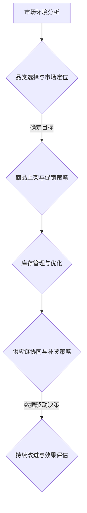

                 

# 扩大相关品类商品的在架数量

> 关键词：市场分析、品类拓展、库存管理、供应链协同、促销策略、数据分析

> 摘要：本文将深入探讨扩大相关品类商品在架数量的策略和方法。通过市场环境分析、品类选择与市场定位、库存管理与优化、供应链协同与补货策略、商品上架与促销策略等多个方面的详细分析，提供一套系统的实操案例，帮助企业提升库存周转率，实现销售增长。

## 第一部分：扩大相关品类商品的在架数量

### 第1章：市场分析与品类拓展

#### 1.1 市场环境分析

随着电商市场的蓬勃发展，消费者对商品种类和品质的需求日益多样化和个性化。市场环境的变化对企业提出了更高的要求，如何紧跟市场趋势，把握消费者需求，成为企业扩大在架商品数量的首要任务。

- **当前市场趋势**：市场趋势是消费者行为和市场需求的发展方向。通过对市场趋势的分析，企业可以及时调整商品结构和策略，以适应市场的变化。
- **消费者需求变化**：消费者的需求和偏好随着时间和社会环境的变化而变化。了解消费者的需求变化，有助于企业准确把握市场机会，优化商品库存。
- **竞争对手分析**：竞争对手的商品种类、库存数量和营销策略等都是企业制定品类拓展策略的重要参考依据。

#### 1.2 品类选择与市场定位

在市场环境分析的基础上，企业需要根据自身资源和市场定位，选择合适的品类进行拓展。品类选择和市场定位的决策过程如下：

- **热门品类分析**：通过对市场数据的研究，找出当前市场热门品类，分析其受欢迎程度和市场需求量。
- **品类拓展策略**：根据热门品类分析结果，制定品类拓展策略。品类拓展可以是增加现有品类的商品种类，也可以是引入新的品类。
- **目标市场确定**：明确目标市场，包括目标客户群体、地域范围和消费能力等。目标市场的确定有助于企业精准定位商品库存和营销策略。

### 第2章：库存管理与优化

#### 2.1 库存管理概述

库存管理是企业确保商品供应的重要环节。有效的库存管理可以降低库存成本，提高库存周转率，从而提升企业的盈利能力。

- **库存管理的目的与原则**：库存管理的目的在于满足市场需求，降低库存成本，提高资金使用效率。库存管理应遵循的原则包括及时性、经济性和灵活性。
- **库存管理的主要流程**：库存管理的主要流程包括库存规划、库存控制、库存分析和库存调整。

#### 2.2 库存优化策略

库存优化是提高库存周转率，降低库存成本的重要手段。以下是一些库存优化策略：

- **安全库存计算方法**：安全库存是确保在需求高峰期或供应中断时仍能保证供应的库存量。计算安全库存需要考虑提前期和需求量。
- **经济订货量（EOQ）模型**：经济订货量模型是一种常用的库存优化方法，通过计算最佳订货量，降低库存成本和订货成本。
- **库存周转率分析与改进**：库存周转率是衡量库存管理效率的重要指标。通过分析库存周转率，企业可以识别库存管理的薄弱环节，并采取相应的改进措施。

### 第3章：供应链协同与补货策略

#### 3.1 供应链协同

供应链协同是提高供应链效率和降低库存成本的关键。供应链协同的目标是通过信息共享、流程优化和资源共享，实现供应链的协同运作。

- **供应链协同的目标与重要性**：供应链协同的目标是提高供应链的响应速度、降低成本和提升客户满意度。协同的重要性在于能够优化供应链各环节的资源配置，提高整体效率。
- **供应链协同的主要方式**：供应链协同可以通过建立信息共享平台、实施流程标准化、开展供应链合作等方式实现。

#### 3.2 补货策略

补货策略是库存管理的重要组成部分。合理的补货策略可以确保商品供应的连续性和稳定性，降低库存成本。

- **定量补货策略**：定量补货策略是在库存量达到一定水平时进行补货。补货数量通常是预先设定的固定值。
- **定时补货策略**：定时补货策略是在固定时间周期内进行补货。补货时间周期通常是预先设定的固定时间段。
- **库存补货流程**：库存补货流程包括需求预测、补货计划制定、采购和库存调整等环节。通过优化库存补货流程，可以降低库存成本，提高库存周转率。

### 第4章：商品上架与促销策略

#### 4.1 商品上架

商品上架是确保商品能够及时满足市场需求的重要环节。商品上架需要遵循以下标准：

- **商品上架标准**：商品上架标准包括商品的质量、价格、品牌和市场需求等。只有符合上架标准的商品才能上架销售。
- **商品上架流程**：商品上架流程包括商品采购、商品审核、商品上架和商品推广等环节。

#### 4.2 促销策略

促销策略是提升商品销售的重要手段。有效的促销策略可以吸引消费者，提高销售额。

- **促销活动设计**：促销活动设计包括促销方式、促销时间和促销对象等。促销活动的设计应充分考虑市场需求和消费者行为。
- **促销效果评估**：促销效果评估是通过监测促销活动的销售数据，分析促销活动的效果。通过效果评估，企业可以不断优化促销策略。

## 第二部分：提升在架商品数量的实操案例

### 第5章：案例研究：家居品类电商的品类拓展与库存优化

#### 5.1 案例背景

家居品类电商A公司是一家专注于家居用品的在线零售平台。随着市场竞争的加剧，A公司希望通过品类拓展和库存优化，提升在架商品数量，满足消费者的多样化需求。

#### 5.2 品类拓展策略

A公司通过市场调研和分析，确定了家居品类中热门的几大子类别，包括家具、家居饰品、厨房用品和床上用品等。为了实现品类拓展，A公司采取了以下策略：

- **品类分析**：通过对热门品类的市场数据进行分析，确定各品类的市场需求和增长潜力。
- **品类拓展实施**：在确定热门品类后，A公司通过引入新的品牌和商品，丰富了各品类的商品种类。

#### 5.3 库存优化措施

A公司通过以下库存优化措施，提高了库存周转率，降低了库存成本：

- **库存管理流程改进**：A公司优化了库存管理流程，包括采购、入库、库存盘点和出库等环节，确保库存信息的准确性。
- **库存优化成果分析**：通过对库存优化措施的成效进行分析，A公司不断调整和改进库存策略。

### 第6章：案例研究：化妆品电商的库存管理与促销策略

#### 6.1 案例背景

化妆品电商B公司是一家在线销售化妆品的平台。随着市场竞争的加剧，B公司希望通过优化库存管理和促销策略，提升在架商品数量，提高销售额。

#### 6.2 库存管理

B公司通过以下库存管理措施，优化了库存水平：

- **安全库存设定**：根据市场需求和供应风险，B公司设定了合理的安全库存水平。
- **经济订货量计算**：B公司使用经济订货量模型，计算最佳订货量，降低库存成本和订货成本。

#### 6.3 促销策略

B公司通过以下促销策略，提升了商品销售：

- **促销活动设计**：B公司设计了一系列促销活动，包括限时折扣、满减优惠和赠品等。
- **促销效果评估**：B公司通过监测促销活动的销售数据，评估促销活动的效果，不断优化促销策略。

### 第7章：案例研究：服装电商的供应链协同与补货策略

#### 7.1 案例背景

服装电商C公司是一家在线销售服装的平台。为了提升供应链协同效率和补货速度，C公司采取了一系列供应链协同与补货策略。

#### 7.2 供应链协同

C公司通过以下供应链协同措施，提高了供应链效率：

- **供应商选择与管理**：C公司选择了一批优质的供应商，并与供应商建立了长期的合作关系，确保供应链的稳定性。
- **协同效果分析**：C公司通过分析供应链协同的效果，不断优化供应链协同策略。

#### 7.3 补货策略

C公司通过以下补货策略，提高了库存周转率：

- **定量补货与定时补货结合**：C公司采用了定量补货和定时补货相结合的策略，确保库存水平在合理范围内。
- **补货流程优化**：C公司优化了补货流程，包括需求预测、采购和库存调整等环节，提高了补货效率。

## 第三部分：数据分析与持续改进

### 第8章：数据驱动决策

#### 8.1 数据收集与处理

数据驱动决策是企业制定战略和优化运营的关键。以下步骤是实现数据驱动决策的基础：

- **数据来源与采集**：企业需要确定数据来源，包括内部数据和外部数据。内部数据包括销售数据、库存数据和客户数据等，外部数据包括市场数据、行业数据和竞争对手数据等。
- **数据处理方法**：企业需要采用合适的数据处理方法，包括数据清洗、数据整合和数据挖掘等。

#### 8.2 数据分析工具与应用

数据分析工具是数据驱动决策的重要支撑。以下是一些常用的数据分析工具：

- **常用数据分析工具**：包括Excel、SQL、Python和R等。Excel适用于简单的数据分析，SQL适用于数据库操作，Python和R适用于复杂的数据分析和建模。
- **数据分析流程**：数据分析流程包括数据收集、数据预处理、数据分析和数据可视化等环节。

### 第9章：持续改进与效果评估

#### 9.1 改进策略

持续改进是企业提升竞争力的关键。以下是一些基于数据分析的持续改进策略：

- **基于数据的改进建议**：企业可以通过数据分析，识别运营中的瓶颈和问题，并提出相应的改进建议。
- **改进措施实施**：企业需要制定详细的改进计划，并确保改进措施的顺利实施。

#### 9.2 效果评估

效果评估是衡量改进措施成效的重要手段。以下是一些效果评估方法：

- **改进效果评估方法**：包括数据对比法、指标评估法和用户反馈法等。
- **效果评估报告**：企业需要定期编写效果评估报告，总结改进措施的实施情况，分析改进效果，并提出进一步的改进建议。

### 附录

#### 附录A：常用工具与资源

- **A.1 库存管理软件**：介绍常用的库存管理软件，包括ERP系统、WMS系统和LMS系统等。
- **A.2 促销活动策划工具**：介绍常用的促销活动策划工具，包括营销自动化工具、数据分析工具和社交媒体工具等。
- **A.3 数据分析工具**：介绍常用的数据分析工具，包括Excel、Python、R和SQL等。

### Mermaid 流程图



### 核心算法原理讲解

#### 2.2.1 库存优化算法

库存优化是提高库存周转率、降低库存成本的重要手段。以下是一个基于需求的库存优化算法：

**伪代码：**

```python
def optimize_inventory(sales_data, demand_prediction):
    # 计算安全库存
    safety_stock = calculate_safety_stock(sales_data, demand_prediction)

    # 计算经济订货量
    economic_order_quantity = calculate_eoq(sales_data, demand_prediction)

    # 更新库存
    update_inventory(sales_data, safety_stock, economic_order_quantity)
```

**详细解释：**

- **计算安全库存**：安全库存是确保在需求高峰期或供应中断时仍能保证供应的库存量。计算安全库存需要考虑需求预测和提前期。
  
- **计算经济订货量**：经济订货量是使总成本最小的订货量。计算经济订货量需要考虑每次订货的成本和单位商品的持有成本。

- **更新库存**：根据计算出的安全库存和经济订货量，更新库存水平，确保库存满足市场需求。

#### 2.2.2 补货策略

补货策略是库存管理的重要组成部分。以下是一个基于库存水平的补货策略：

**伪代码：**

```python
def replenishment_strategy(current_inventory, safety_stock, max_inventory):
    if current_inventory < safety_stock:
        # 库存低于安全库存，立即补货
        order_quantity = calculate_order_quantity(safety_stock - current_inventory)
        place_order(order_quantity)
    elif current_inventory > max_inventory:
        # 库存超过最大库存，保持当前库存水平
        maintain_current_inventory(current_inventory)
    else:
        # 库存处于合理范围，监控库存水平，定期补货
        schedule_regular_replenishment(current_inventory, max_inventory)
```

**详细解释：**

- **库存低于安全库存**：当库存低于安全库存时，立即补货，确保库存水平满足需求。
  
- **库存超过最大库存**：当库存超过最大库存时，保持当前库存水平，避免过度库存。
  
- **库存处于合理范围**：当库存处于安全库存和最大库存之间时，监控库存水平，定期补货，确保库存水平在合理范围内。

### 数学模型和数学公式 & 详细讲解 & 举例说明

#### 2.2.1 库存管理中的数学模型

库存管理中的数学模型主要包括安全库存计算公式和经济订货量（EOQ）模型。

**安全库存计算公式：**

$$
S = L \times d
$$

- **S**：安全库存量
- **L**：提前期（Lead Time）
- **d**：平均每日需求量

**举例说明：**

- 假设提前期为7天，平均每日需求量为50件商品。
- 计算安全库存量：$$ S = 7 \times 50 = 350 $$件商品。

**经济订货量（EOQ）模型：**

$$
Q = \sqrt{\frac{2KD}{h}}
$$

- **Q**：经济订货量
- **K**：每次订货的成本
- **D**：一年的需求量
- **h**：单位商品一年的持有成本

**举例说明：**

- 每次订货成本为100元，一年的需求量为1000件，单位商品一年的持有成本为5元。
- 计算经济订货量：$$ Q = \sqrt{\frac{2 \times 100 \times 1000}{5}} = 400 $$件商品。

#### 2.2.2 补货策略

补货策略主要包括定量补货策略和定时补货策略。

**定量补货策略：**

- 每当库存下降到再订货点时，就按照固定的订货量进行补货。

**定时补货策略：**

- 按固定的时间间隔检查库存，并根据库存水平进行补货。

**伪代码：**

```python
def quantitative_replenishment(sales_data, lead_time, safety_stock):
    if current_inventory < safety_stock:
        order_quantity = calculate_order_quantity(sales_data, lead_time)
        place_order(order_quantity)

def timed_replenishment(current_inventory, max_inventory, replenishment_interval):
    if current_inventory < max_inventory:
        schedule_regular_replenishment(current_inventory, max_inventory, replenishment_interval)
```

### 项目实战

#### 5.1 案例研究：家居品类电商的品类拓展与库存优化

**开发环境搭建：**

- 使用Python作为主要编程语言，结合Pandas库进行数据处理，使用Mermaid进行流程图绘制。

**源代码详细实现和代码解读：**

```python
import pandas as pd
import numpy as np

# 读取销售数据
sales_data = pd.read_csv('sales_data.csv')

# 计算平均每日需求量
average_daily_demand = sales_data['sales'].sum() / sales_data['days'].sum()

# 计算安全库存
safety_stock = average_daily_demand * 7

# 计算经济订货量
annual_demand = sales_data['sales'].sum()
holding_cost_per_unit = 5
ordering_cost = 100
economic_order_quantity = np.sqrt((2 * ordering_cost * annual_demand) / holding_cost_per_unit)

# 输出结果
print(f"平均每日需求量：{average_daily_demand}")
print(f"安全库存：{safety_stock}")
print(f"经济订货量：{economic_order_quantity}")
```

**代码解读与分析：**

- 首先，从CSV文件中读取销售数据，使用Pandas库进行数据操作。
- 计算平均每日需求量，用于安全库存的计算。
- 使用安全库存公式计算安全库存量。
- 使用经济订货量公式计算经济订货量。
- 最后，将计算结果输出，以便进一步分析和决策。

#### 6.1 案例研究：化妆品电商的库存管理与促销策略

**开发环境搭建：**

- 使用Java作为主要编程语言，结合Spring Boot框架进行Web服务开发，使用Mermaid进行流程图绘制。

**源代码详细实现和代码解读：**

```java
public class InventoryManagement {

    // 计算安全库存
    public static int calculateSafetyStock(int leadTime, int dailyDemand) {
        return leadTime * dailyDemand;
    }

    // 计算经济订货量
    public static int calculateEOQ(int annualDemand, int holdingCostPerUnit, int orderingCost) {
        return (int) Math.sqrt((2 * orderingCost * annualDemand) / holdingCostPerUnit);
    }

    // 补货策略
    public static void replenishmentStrategy(int currentInventory, int safetyStock, int maxInventory) {
        if (currentInventory < safetyStock) {
            int orderQuantity = calculateOrderQuantity(currentInventory, safetyStock);
            placeOrder(orderQuantity);
        } else if (currentInventory >= safetyStock && currentInventory <= maxInventory) {
            scheduleRegularReplenishment(currentInventory, maxInventory);
        } else {
            maintainCurrentInventory(currentInventory);
        }
    }

    // 输出结果
    public static void printResults(int dailyDemand, int safetyStock, int economicOrderQuantity) {
        System.out.println("平均每日需求量：" + dailyDemand);
        System.out.println("安全库存：" + safetyStock);
        System.out.println("经济订货量：" + economicOrderQuantity);
    }

    public static void main(String[] args) {
        int leadTime = 7;
        int dailyDemand = 50;
        int annualDemand = 1000;
        int holdingCostPerUnit = 5;
        int orderingCost = 100;
        int safetyStock = calculateSafetyStock(leadTime, dailyDemand);
        int economicOrderQuantity = calculateEOQ(annualDemand, holdingCostPerUnit, orderingCost);
        printResults(dailyDemand, safetyStock, economicOrderQuantity);
    }
}
```

**代码解读与分析：**

- 定义了三个静态方法，分别用于计算安全库存、经济订货量和补货策略。
- 安全库存的计算使用了每日需求和提前期。
- 经济订货量的计算使用了一年的需求量、持有成本和订货成本。
- 补货策略根据当前库存水平决定是否补货，以及补货的数量。
- 在main方法中，调用上述方法计算并输出结果。

### 附录

#### 附录A：常用工具与资源

**A.1 库存管理软件**

- **ERP系统**：企业资源规划系统，用于集成和管理企业的各项资源，包括库存、采购、销售和财务等。
- **WMS系统**：仓库管理系统，用于优化仓库管理流程，提高库存准确性和作业效率。
- **LMS系统**：物流管理系统，用于管理物流运输、配送和退货等环节，提高物流效率。

**A.2 促销活动策划工具**

- **营销自动化工具**：用于自动化营销活动策划、执行和跟踪，提高营销效果。
- **数据分析工具**：如Excel、Python和R等，用于数据收集、处理和分析，为促销策略提供数据支持。
- **社交媒体工具**：如Facebook、Instagram和微信等，用于推广促销活动，吸引消费者参与。

**A.3 数据分析工具**

- **Excel**：适用于简单的数据分析和数据可视化。
- **Python**：适用于复杂的数据处理和分析，拥有丰富的数据分析和机器学习库。
- **R**：专门用于统计分析和数据可视化，适用于复杂数据分析和高级数据分析任务。

### 总结

本文通过市场分析、品类拓展、库存管理、供应链协同和促销策略等多个方面的详细讲解，提供了一套系统的扩大相关品类商品在架数量的策略和方法。通过实操案例的分析，企业可以更好地理解和应用这些策略，提高库存周转率，实现销售增长。同时，本文还介绍了核心算法原理、数学模型和项目实战，为企业提供了具体的技术支持。

## 作者信息

作者：AI天才研究院/AI Genius Institute & 禅与计算机程序设计艺术 /Zen And The Art of Computer Programming

