                 

### 文章标题：技术创新：大模型创业的核心动力

> 关键词：技术创新、大模型、创业、核心动力、商业模式、项目管理、技术实现、案例分析、未来展望

> 摘要：本文将深入探讨大模型在创业中的核心动力，分析技术创新对创业的深远影响。我们将通过逻辑清晰的分析和详细的案例研究，揭示大模型创业的机遇与挑战，并提出有效的建议与启示。

### 第1章：技术创新概述

> **1.1 技术创新的概念与分类**
>
> 技术创新是指通过新技术的开发和应用，推动产品和服务的改进、新市场的开拓、生产效率的提升等，从而实现企业竞争力和市场地位提升的过程。技术创新可以分为产品创新、过程创新和服务创新三类。

#### 1.1.1 技术创新的定义

技术创新是指通过新技术的开发和应用，推动产品和服务的改进、新市场的开拓、生产效率的提升等，从而实现企业竞争力和市场地位提升的过程。技术创新不仅仅是新技术的引入，还包括将这些新技术有效整合到现有的产品和服务中，以实现更好的用户体验和商业价值。

技术创新的核心在于创造价值。这种价值体现在多个方面，包括提高产品的性能、降低成本、增加功能、提高生产效率、扩大市场占有率等。通过技术创新，企业能够更好地满足市场需求，增强竞争力，实现可持续发展。

技术创新的类型多种多样，可以按照不同的维度进行分类。以下是几种常见的分类方法：

- **按照技术类型分类**：技术创新可以分为信息技术创新、生物技术创新、新材料技术创新、能源技术创新等。这种分类方法基于技术的本质特征，有助于理解不同领域的技术发展动态。
- **按照创新程度分类**：技术创新可以分为渐进式创新和颠覆式创新。渐进式创新是指在现有技术基础上进行改进和优化，而颠覆式创新则是引入全新的技术或概念，颠覆传统的商业模式和市场格局。
- **按照创新主体分类**：技术创新可以分为企业内部创新、产学研合作创新、政府引导创新等。这种分类方法基于创新活动的主体，有助于分析不同主体的创新策略和贡献。

#### 1.1.2 技术创新的分类

技术创新的分类有助于我们更好地理解和应用技术创新。以下是几种常见的技术创新类型：

1. **产品创新**：产品创新是指通过引入新的产品特性、功能、设计等来满足市场需求。产品创新可以大大提升产品的竞争力和用户体验。例如，智能手机的发明和普及就是产品创新的一个典型例子。智能手机融合了通信、互联网、多媒体等多种功能，极大地改变了人们的生活方式。

2. **过程创新**：过程创新是指通过改进生产过程、运营流程来提高效率、降低成本。过程创新可以显著提升企业的生产效率和竞争力。例如，丰田汽车公司的精益生产模式就是一种典型的过程创新。通过不断优化生产流程，丰田汽车公司实现了高效、低成本的生产模式，成为了全球汽车行业的领导者。

3. **服务创新**：服务创新是指通过引入新的服务模式、体验来提升用户满意度。服务创新可以为企业带来新的市场机会和竞争优势。例如，共享经济模式就是一种典型的服务创新。通过共享平台，用户可以轻松地获取所需的资源和服务，大大提升了用户体验。

#### 1.1.3 技术创新的重要性

技术创新对企业和社会具有重要意义。以下是技术创新的几个关键作用：

- **提高企业竞争力**：技术创新可以帮助企业不断提升产品质量、降低成本、提高生产效率，从而在激烈的市场竞争中保持领先地位。
- **促进经济增长**：技术创新是推动经济增长的重要动力。通过技术创新，企业可以开拓新市场、创造新需求，从而带动整个经济的增长。
- **改善生活质量**：技术创新可以极大地改善人们的生活质量。例如，互联网技术的普及使得人们的生活更加便捷，医疗技术的进步延长了人们的寿命。

技术创新的重要性不仅体现在企业层面，也体现在社会层面。技术创新可以推动社会进步，改善人们的生活条件，促进可持续发展。因此，企业和社会都应该高度重视技术创新，积极推动技术进步。

**技术创新的Mermaid流程图：**

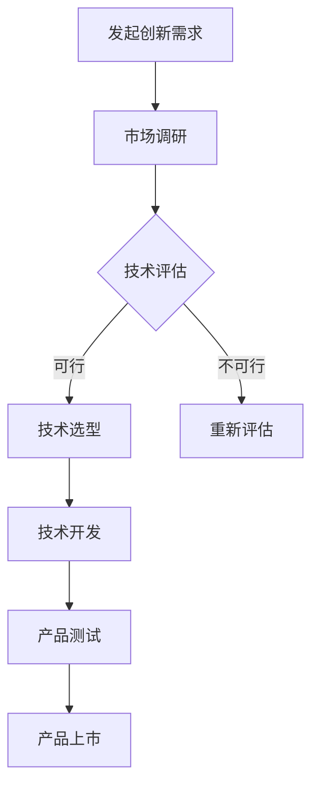

**技术创新分类的伪代码：**

```python
def classify_innovation(type):
    if type == 'product':
        return '产品创新'
    elif type == 'process':
        return '过程创新'
    elif type == 'service':
        return '服务创新'
    else:
        return '其他类型'
```

**举例说明：**

假设某企业通过技术创新降低了生产成本20%，同时提升了产品质量，获得了市场占有率提升5%，则其技术创新的重要性可以用以下公式计算：

$$
\text{重要性} = \frac{0.2 \times \text{原生产成本}}{0.1 \times \text{原生产成本}} + 0.05 = 2 + 0.05 = 2.05
$$

通过技术创新，企业不仅能够提升自身的竞争力，还能够为消费者提供更好的产品和服务，从而实现可持续发展。

### 第2章：大模型的定义与作用

> **2.1 大模型的定义**
>
> 大模型是指具有巨大计算量和存储需求的人工智能模型，通常包含数十亿到千亿个参数。大模型以其卓越的学习能力和强大的数据处理能力，在多个领域取得了显著的成果。

#### 2.1.1 大模型的定义

大模型是指具有巨大计算量和存储需求的人工智能模型，通常包含数十亿到千亿个参数。大模型以其卓越的学习能力和强大的数据处理能力，在多个领域取得了显著的成果。例如，深度学习中的大型神经网络模型，如GPT-3、BERT等，都是大模型的代表。

大模型的特点包括：

1. **参数量巨大**：大模型通常包含数十亿到千亿个参数，这使得模型具有更强的表达能力和泛化能力。
2. **计算需求高**：由于参数量巨大，大模型在训练和推理过程中需要大量的计算资源，通常需要分布式计算和高效并行算法的支持。
3. **数据需求大**：大模型需要大量高质量的训练数据来保证模型的性能和稳定性。这使得数据预处理和数据增强成为大模型训练的重要环节。

#### 2.1.2 大模型的技术发展

大模型的技术发展经历了多个阶段：

1. **早期阶段**：以1980年代的神经网络和1980年代末的深度学习理论为基础，早期的大模型如Backpropagation网络和Hopfield网络等开始出现。
2. **发展阶段**：随着计算机性能的提升和大数据技术的发展，2000年代初期至中期，大模型如AlexNet、Google Brain等开始出现，并取得了突破性成果。
3. **成熟阶段**：近年来，随着分布式计算、GPU加速等技术的发展，大模型如GPT-3、BERT等达到了新的高度，展示了强大的学习能力和应用潜力。

#### 2.1.3 大模型在创业中的作用

大模型在创业中具有重要作用，主要体现在以下几个方面：

1. **提供创新解决方案**：大模型在多个领域如自然语言处理、计算机视觉、语音识别等取得了显著成果，为创业公司提供了强大的技术支持，帮助他们解决复杂问题。
2. **提升竞争力**：大模型的高效数据处理能力和强大的学习能力，使得创业公司能够快速响应市场需求，提升产品质量，降低生产成本，从而在激烈的市场竞争中脱颖而出。
3. **开拓新市场**：大模型的应用可以拓展新市场，如智能客服、智能医疗、自动驾驶等，为创业公司带来了新的商机和发展空间。

**大模型的Mermaid流程图：**

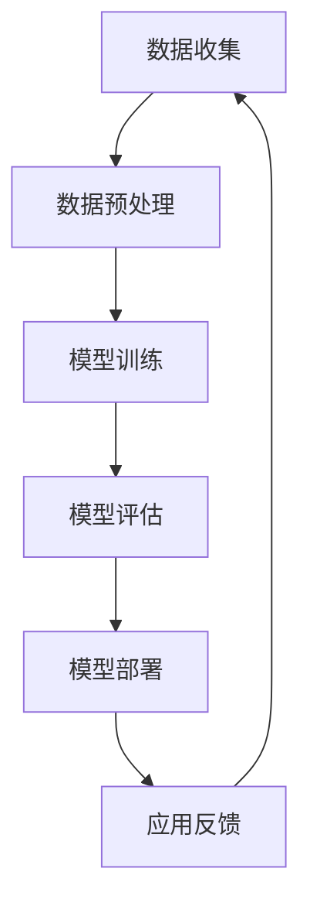

**大模型技术发展的Mermaid流程图：**

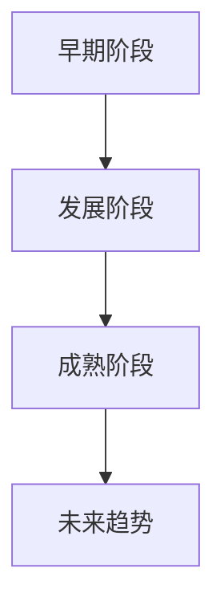

**大模型在创业中的作用的Mermaid流程图：**

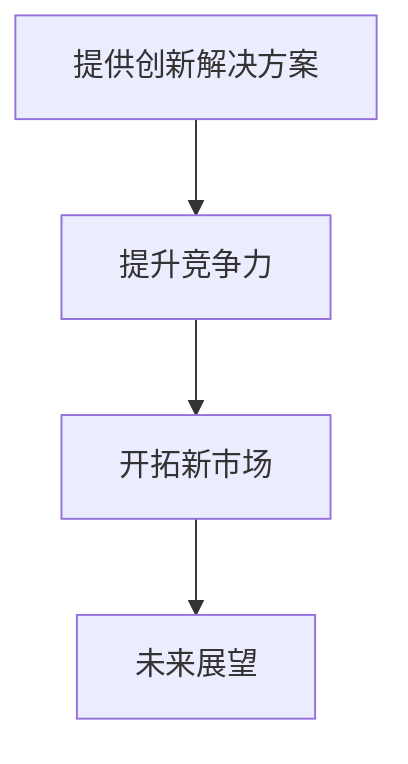

通过大模型的应用，创业公司可以快速实现技术突破，提升企业竞争力，开拓新市场，从而实现可持续发展。

### 第3章：大模型创业的挑战与机遇

> **3.1 大模型创业的挑战**
>
> 大模型创业面临诸多挑战，包括技术难题、数据难题、计算资源难题等。解决这些挑战需要创业公司具备深厚的技术积累和灵活的商业模式。

#### 3.1.1 大模型创业的挑战

大模型创业虽然充满机遇，但也面临诸多挑战。以下是几个主要的挑战：

1. **技术难题**：大模型的技术实现涉及深度学习、分布式计算、高性能硬件等多个领域，对创业公司的技术积累和团队实力提出了高要求。
2. **数据难题**：大模型需要大量高质量的数据进行训练，数据的收集、清洗、标注等过程复杂且耗时。此外，数据的获取可能涉及隐私保护、数据共享等问题。
3. **计算资源难题**：大模型的训练和推理需要大量的计算资源，包括GPU、TPU等高性能硬件。对于初创公司而言，获得足够的计算资源可能是一个挑战。
4. **商业模式难题**：大模型创业的商业模式需要不断创新和优化，以适应不断变化的市场需求。如何实现盈利、降低成本、提高效率是创业公司需要认真考虑的问题。

#### 3.1.2 大模型创业的机遇

尽管面临诸多挑战，大模型创业也充满了机遇。以下是几个主要的机遇：

1. **技术创新机遇**：大模型技术的不断创新，为创业公司提供了广阔的创新空间。通过技术创新，创业公司可以开发出具有独特优势的产品和服务，满足市场需求。
2. **市场机遇**：大模型在多个领域如自然语言处理、计算机视觉、语音识别等取得了显著成果，为创业公司开拓了新的市场机会。随着人工智能技术的普及，这些市场前景广阔。
3. **产业机遇**：大模型在各个行业的应用日益广泛，为传统产业带来了转型升级的机会。创业公司可以通过大模型技术赋能传统产业，实现产业升级和优化。

#### 3.1.3 大模型创业的策略选择

为了应对挑战，抓住机遇，创业公司需要制定合理的策略。以下是几个常见的策略选择：

1. **技术积累策略**：创业公司需要不断积累技术实力，包括深度学习、分布式计算、高性能硬件等方面的技术。通过技术积累，提高自身的技术水平，为创业成功奠定基础。
2. **数据驱动策略**：创业公司需要重视数据的作用，通过数据收集、清洗、标注等过程，构建高质量的数据集。同时，利用数据驱动的方式，不断优化模型性能。
3. **资源整合策略**：创业公司可以通过资源整合，获取更多的计算资源、技术资源等。例如，与高校、研究机构、云计算服务商等合作，共同推动技术进步。
4. **商业模式创新策略**：创业公司需要不断创新和优化商业模式，以适应市场需求。通过提供差异化的产品和服务，降低成本，提高效率，实现盈利。

**大模型创业的挑战与机遇的Mermaid流程图：**

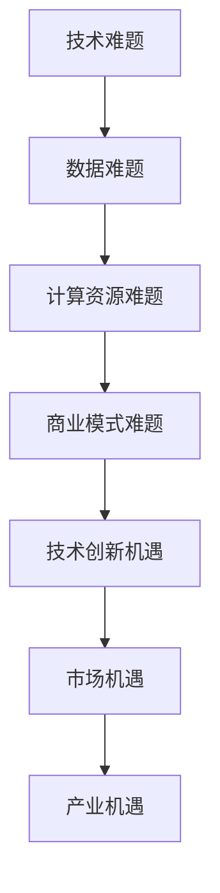

通过合理的策略选择，创业公司可以更好地应对挑战，抓住机遇，实现可持续发展。

### 第4章：大模型创业的核心动力

> **4.1 数据驱动创新**
>
> 数据驱动创新是大模型创业的核心动力之一。通过高质量的数据收集、处理和利用，创业公司可以实现技术突破，提升产品竞争力。

#### 4.1.1 数据驱动创新

数据驱动创新是大模型创业的核心动力之一。在数据驱动的创新过程中，创业公司通过高质量的数据收集、处理和利用，实现技术突破，提升产品竞争力。

数据驱动创新的主要步骤包括：

1. **数据收集**：创业公司需要收集大量高质量的训练数据。这些数据可以是公开数据集，也可以是通过自有渠道收集的数据。数据的来源和类型决定了数据的质量和多样性。
2. **数据处理**：收集到的数据需要进行预处理，包括数据清洗、归一化、去噪等操作。数据处理的目标是消除数据中的噪声，提高数据的准确性和可靠性。
3. **数据标注**：对于某些特定领域的数据，如计算机视觉、自然语言处理等，需要通过人工标注或半自动标注的方式，对数据中的关键信息进行标注。数据标注的准确性直接影响模型的训练效果。
4. **数据利用**：处理好的数据用于模型的训练和优化。通过不断调整模型参数，优化模型结构，提高模型在具体任务上的性能。

数据驱动创新的关键在于数据的利用。创业公司需要充分利用数据，挖掘数据中的潜在价值，实现技术突破。以下是几个关键点：

- **数据多样性**：多样化的数据有助于提高模型的泛化能力。通过引入不同来源、不同类型的数据，可以丰富模型的学习经验，提高模型的性能。
- **数据质量**：高质量的数据是模型训练的基础。创业公司需要确保数据的质量，包括数据的准确性、完整性和一致性。低质量的数据会导致模型过拟合，影响模型的效果。
- **数据闭环**：通过数据闭环，即收集模型在实际应用中的反馈数据，再次用于模型的优化和改进。这种方式可以不断优化模型，提高其在实际应用中的性能。

**数据驱动创新的伪代码：**

```python
def data_driven_innovation():
    # 数据收集
    data = collect_data()
    
    # 数据预处理
    processed_data = preprocess_data(data)
    
    # 数据标注
    labeled_data = annotate_data(processed_data)
    
    # 模型训练
    model = train_model(labeled_data)
    
    # 模型评估
    performance = evaluate_model(model)
    
    # 模型优化
    optimized_model = optimize_model(model, performance)
    
    # 返回优化后的模型
    return optimized_model
```

**举例说明：**

假设一家创业公司致力于开发一款智能客服系统。为了实现数据驱动创新，公司采取了以下步骤：

1. **数据收集**：公司收集了大量与客服相关的数据，包括用户提问、客服回答、用户反馈等。
2. **数据处理**：对收集到的数据进行清洗、归一化和去噪处理，确保数据的准确性和可靠性。
3. **数据标注**：对处理好的数据进行标注，标记用户提问的关键词和客服回答的意图。
4. **模型训练**：使用标注好的数据训练智能客服系统，优化模型参数。
5. **模型评估**：通过实际应用中的用户反馈，评估模型的性能，发现模型存在的问题。
6. **模型优化**：根据评估结果，对模型进行优化，提高其在实际应用中的性能。

通过数据驱动创新，创业公司不断优化智能客服系统，提高了系统的准确性和用户满意度，从而在竞争激烈的市场中脱颖而出。

### 4.1.2 算法优化创新

算法优化创新是推动大模型创业的重要动力之一。通过不断优化算法，创业公司可以提高模型的性能，降低计算成本，从而在市场中获得竞争优势。

算法优化创新的步骤包括：

1. **算法选择**：选择适合特定任务的算法。不同的任务可能需要不同的算法，例如，对于图像识别任务，卷积神经网络（CNN）可能是一个好的选择；而对于自然语言处理任务，递归神经网络（RNN）或Transformer模型可能更为有效。
2. **算法优化**：在算法选择的基础上，对算法进行优化。优化的目标包括提高模型的性能、降低计算成本、减少模型参数等。常用的优化方法包括：
   - **参数调优**：通过调整模型参数，如学习率、批量大小等，优化模型性能。
   - **结构优化**：通过调整模型结构，如增加或减少网络层数、调整网络层参数等，优化模型性能。
   - **算法改进**：通过引入新的算法或改进现有算法，提高模型的性能。例如，使用深度强化学习（DRL）方法优化模型训练过程。
3. **算法验证**：对优化后的算法进行验证，确保其性能提升是稳定和可持续的。验证方法包括：
   - **交叉验证**：通过将数据集划分为训练集和验证集，对模型进行交叉验证，评估模型的泛化能力。
   - **性能测试**：在实际应用场景中，对优化后的算法进行性能测试，评估其在实际应用中的效果。

**算法优化创新的伪代码：**

```python
def algorithm_optimization_innovation():
    # 算法选择
    selected_algorithm = select_algorithm()
    
    # 算法优化
    optimized_algorithm = optimize_algorithm(selected_algorithm)
    
    # 算法验证
    validated_algorithm = validate_algorithm(optimized_algorithm)
    
    # 返回优化后的算法
    return validated_algorithm
```

**举例说明：**

假设一家创业公司致力于开发一款图像识别系统，该公司选择了卷积神经网络（CNN）作为基础算法。为了实现算法优化创新，公司采取了以下步骤：

1. **算法选择**：公司选择了卷积神经网络（CNN）作为图像识别的基础算法。
2. **算法优化**：
   - **参数调优**：通过调整学习率、批量大小等参数，优化模型性能。
   - **结构优化**：通过增加卷积层、池化层等，调整模型结构，提高模型对图像特征的捕捉能力。
   - **算法改进**：引入了残差连接（Residual Connection）和批量归一化（Batch Normalization）等技术，改进模型训练过程。
3. **算法验证**：
   - **交叉验证**：将数据集划分为训练集和验证集，对模型进行交叉验证，评估模型的泛化能力。
   - **性能测试**：在实际应用场景中，对优化后的算法进行性能测试，评估其在实际应用中的效果。

通过算法优化创新，创业公司成功提高了图像识别系统的性能，降低了计算成本，从而在市场中获得了竞争优势。

### 4.1.3 硬件加速创新

硬件加速创新是大模型创业的重要推动力之一。通过利用专用硬件如GPU、TPU等，创业公司可以大幅提高模型训练和推理的效率，降低计算成本，从而在竞争激烈的市场中占据优势。

硬件加速创新的步骤包括：

1. **硬件选择**：根据创业公司对计算资源的需求，选择适合的硬件。常用的硬件包括GPU（图形处理单元）、TPU（张量处理单元）等。GPU擅长并行计算，适用于大规模数据处理和训练；TPU则专注于机器学习和深度学习任务，具有更高的计算效率和性能。
2. **硬件配置**：为硬件配置合适的计算资源，如CPU、内存、存储等。合理的硬件配置可以提高硬件的性能和利用率，确保模型训练和推理的顺畅进行。
3. **硬件优化**：对硬件进行优化，提高其性能和能效。优化方法包括：
   - **并行计算优化**：通过并行计算技术，将模型训练和推理任务分配到多个硬件节点上，提高计算效率。
   - **内存管理优化**：优化内存分配和回收策略，减少内存占用，提高内存利用率。
   - **能耗优化**：通过降低硬件功耗，提高能源效率，实现绿色计算。
4. **硬件集成**：将硬件集成到创业公司的系统中，确保硬件与其他组件的协同工作。硬件集成需要考虑硬件的兼容性、稳定性、可维护性等因素。

**硬件加速创新的伪代码：**

```python
def hardware_acceleration_innovation():
    # 硬件选择
    selected_hardware = select_hardware()
    
    # 硬件配置
    configured_hardware = configure_hardware(selected_hardware)
    
    # 硬件优化
    optimized_hardware = optimize_hardware(configured_hardware)
    
    # 硬件集成
    integrated_hardware = integrate_hardware(optimized_hardware)
    
    # 返回集成后的硬件
    return integrated_hardware
```

**举例说明：**

假设一家创业公司需要处理大规模的图像识别任务，该公司选择了GPU作为硬件加速器。为了实现硬件加速创新，公司采取了以下步骤：

1. **硬件选择**：公司选择了NVIDIA的GPU作为图像识别任务的硬件加速器。
2. **硬件配置**：为GPU配置了高性能的CPU、大容量的内存和高速的存储设备，确保硬件的运算能力和数据传输速度。
3. **硬件优化**：
   - **并行计算优化**：通过分布式计算技术，将图像识别任务分配到多个GPU节点上，提高计算效率。
   - **内存管理优化**：采用先进的内存管理策略，减少内存占用，提高内存利用率。
   - **能耗优化**：通过调整GPU的工作频率和功耗，降低能耗，提高能源效率。
4. **硬件集成**：将GPU集成到公司的计算系统中，确保GPU与其他硬件组件的协同工作，提高系统的整体性能。

通过硬件加速创新，创业公司大幅提高了图像识别任务的计算效率，降低了计算成本，从而在市场中获得了竞争优势。

### 第5章：大模型创业的商业模式

> **5.1 大模型创业的商业模式**
>
> 大模型创业的商业模式多样，包括产品销售、服务订阅、API接口等。创业公司需要根据市场需求和自身优势，选择合适的商业模式。

#### 5.1.1 大模型创业的商业模型

大模型创业的商业模式多样，包括产品销售、服务订阅、API接口等。创业公司需要根据市场需求和自身优势，选择合适的商业模式。

1. **产品销售**：产品销售是指创业公司将开发的大模型产品直接销售给客户。这种模式适用于那些具有明显市场需求的模型，如图像识别、语音识别等。创业公司可以通过线上和线下渠道推广产品，实现规模化销售。

2. **服务订阅**：服务订阅是指创业公司为客户提供持续的服务，客户通过订阅费用获得使用权。这种模式适用于需要持续更新和维护的模型，如智能客服、智能推荐等。创业公司可以通过提供优质服务，建立稳定的客户群体。

3. **API接口**：API接口是指创业公司提供大模型的API接口，客户可以通过调用接口使用模型的功能。这种模式适用于那些可以嵌入到其他应用中的模型，如文本分析、情感分析等。创业公司可以通过API接口实现模型的广泛应用，提高商业价值。

4. **合作开发**：合作开发是指创业公司与客户合作，共同开发大模型产品或服务。这种模式适用于那些具有特定需求的客户，如医疗、金融等领域。创业公司可以通过合作开发，为客户提供定制化的解决方案。

#### 5.1.2 大模型创业的收入模式

大模型创业的收入模式多种多样，以下是几种常见模式：

1. **销售收入**：创业公司通过销售大模型产品获得销售收入。产品可以是直接销售给客户的，也可以是作为服务的一部分销售给其他企业的。

2. **订阅收入**：创业公司通过提供订阅服务，如智能客服、智能推荐等，客户支付订阅费用获得使用权。订阅费用可以是按月、按年或按项目计费。

3. **API收入**：创业公司通过提供API接口，客户调用接口支付API费用。API费用可以是按调用次数、流量或数据量计费。

4. **合作收入**：创业公司与客户合作，共同开发大模型产品或服务，从合作项目中获得收入。合作收入可以是固定费用、提成或分成等形式。

#### 5.1.3 大模型创业的成本控制

大模型创业的成本控制是创业成功的关键之一。以下是几种常见的成本控制方法：

1. **优化硬件资源**：通过优化硬件资源的利用，降低硬件成本。例如，使用云服务进行分布式计算，降低硬件采购和维护成本。

2. **提高数据处理效率**：通过提高数据处理效率，减少数据处理的成本。例如，采用高效的算法和数据预处理方法，减少数据清洗和标注的时间。

3. **优化人才管理**：通过优化人才管理，降低人力成本。例如，采用远程办公、灵活的工作制度，提高员工的工作效率和满意度。

4. **降低运营成本**：通过降低运营成本，提高盈利能力。例如，采用节能设备、优化供应链等，降低运营成本。

**大模型创业的商业模式和收入模式的Mermaid流程图：**

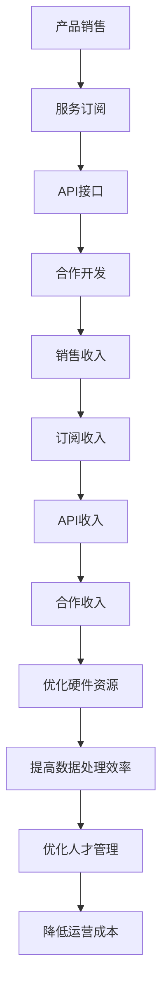

通过选择合适的商业模式和收入模式，创业公司可以更好地实现盈利，同时通过成本控制，提高企业的盈利能力，实现可持续发展。

### 第6章：大模型创业的项目管理

> **6.1 大模型创业的项目管理**
>
> 大模型创业的项目管理至关重要。有效的项目管理可以帮助创业公司确保项目按时完成、预算合理，并实现预期的商业目标。

#### 6.1.1 大模型创业的项目规划

项目规划是大模型创业项目管理的基础。项目规划包括以下关键步骤：

1. **明确项目目标**：确定项目要实现的具体目标，包括技术目标、商业目标等。明确的目标有助于项目团队聚焦工作重点，确保项目方向正确。

2. **制定项目计划**：制定详细的项目计划，包括项目范围、任务分解、时间安排、资源分配等。项目计划应具有可操作性和可行性，以确保项目能够按计划顺利进行。

3. **风险评估**：识别项目可能面临的风险，并制定相应的应对措施。风险评估有助于创业公司提前预见潜在问题，降低项目失败的风险。

4. **沟通规划**：制定有效的沟通计划，确保项目团队成员之间的信息流通顺畅。良好的沟通规划有助于提高团队协作效率，确保项目目标的实现。

**项目规划的Mermaid流程图：**

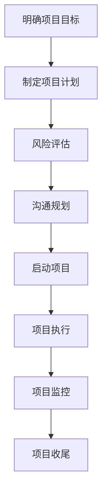

**项目规划的关键步骤的伪代码：**

```python
def project_plan():
    # 明确项目目标
    objectives = define_objectives()
    
    # 制定项目计划
    plan = create_project_plan(objectives)
    
    # 风险评估
    risks = assess_risks(plan)
    
    # 沟通规划
    communication_plan = define_communication_plan()
    
    # 启动项目
    start_project(plan, risks, communication_plan)
    
    # 项目执行
    execute_project(plan, risks, communication_plan)
    
    # 项目监控
    monitor_project(plan, risks, communication_plan)
    
    # 项目收尾
    conclude_project(plan, risks, communication_plan)
```

**举例说明：**

假设一家创业公司计划开发一款基于大模型的智能客服系统，项目规划如下：

1. **明确项目目标**：开发一款能够实现实时语音转文字、情感分析、自动回复等功能的智能客服系统，提高客服效率和用户体验。
2. **制定项目计划**：将项目分为需求分析、系统设计、模型开发、测试与上线等阶段，明确每个阶段的时间安排和任务分配。
3. **风险评估**：识别项目可能面临的技术难题、数据质量问题和市场风险，并制定相应的应对措施。
4. **沟通规划**：建立项目沟通机制，定期召开项目会议，确保团队成员之间的信息流通和协作。

通过有效的项目规划，创业公司可以确保智能客服系统的开发工作有序进行，按时完成并实现预期目标。

#### 6.1.2 大模型创业的风险管理

风险管理是大模型创业项目管理的重要组成部分。有效的风险管理有助于创业公司识别、评估和应对项目中的潜在风险，确保项目顺利进行。

风险管理的主要步骤包括：

1. **风险识别**：通过分析项目需求、技术实现、数据处理等方面，识别项目可能面临的风险。常见的风险包括技术风险、数据风险、市场风险、法律风险等。

2. **风险评估**：对识别出的风险进行评估，确定其发生概率和影响程度。风险评估有助于创业公司了解风险的严重性，制定相应的应对策略。

3. **风险应对**：根据风险评估结果，制定风险应对策略。常见的应对策略包括风险规避、风险减轻、风险接受等。风险应对策略应具有可操作性和可行性。

4. **风险监控**：在项目执行过程中，持续监控风险的发展变化，确保风险应对措施的有效性。风险监控有助于创业公司及时发现新风险，采取相应的应对措施。

**风险管理的Mermaid流程图：**

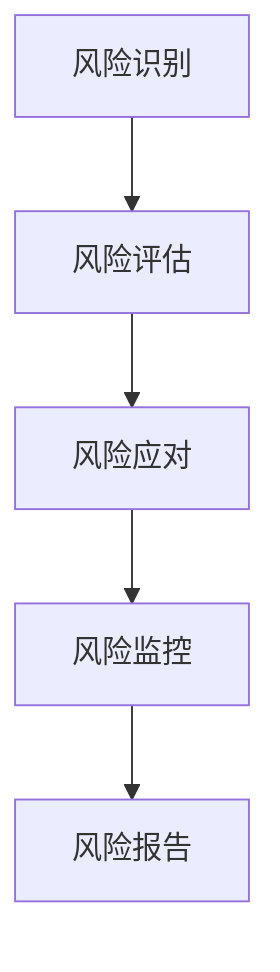

**风险管理的伪代码：**

```python
def risk_management():
    # 风险识别
    risks = identify_risks()
    
    # 风险评估
    assessed_risks = assess_risks(risks)
    
    # 风险应对
    responses = define_responses(assessed_risks)
    
    # 风险监控
    monitor_risks(responses)
    
    # 风险报告
    report_risks(responses)
```

**举例说明：**

假设一家创业公司在开发基于大模型的智能客服系统时，面临以下风险：

1. **风险识别**：识别出技术实现中的算法风险、数据处理中的数据质量问题、市场推广中的市场接受度风险等。
2. **风险评估**：评估各风险的发生概率和影响程度，确定算法风险最为严重。
3. **风险应对**：
   - **算法风险**：通过引入外部专家、优化算法设计等手段降低风险。
   - **数据质量问题**：加强数据清洗和标注工作，确保数据质量。
   - **市场接受度风险**：通过市场调研和用户反馈，调整产品功能，提高市场接受度。
4. **风险监控**：在项目执行过程中，持续监控各风险的进展，确保应对措施的有效性。

通过有效的风险管理，创业公司可以降低项目风险，确保项目顺利进行。

#### 6.1.3 大模型创业的人才管理

人才管理是大模型创业成功的关键因素之一。有效的团队建设、人才招聘和激励机制有助于创业公司吸引和留住优秀人才，提高团队整体战斗力。

1. **团队建设**：创业公司应注重团队建设，建立良好的团队文化，提高团队凝聚力。团队成员之间应相互支持、协作，共同实现项目目标。

2. **人才招聘**：创业公司应采用多元化的人才招聘策略，吸引具有不同技能背景的人才。招聘过程中，应注重候选人的技术能力、团队协作能力和创新能力。

3. **激励机制**：创业公司应建立合理的激励机制，激发员工的积极性和创造力。激励机制可以包括薪酬激励、绩效激励、股权激励等，以留住优秀人才，提高团队的整体绩效。

**人才管理的Mermaid流程图：**

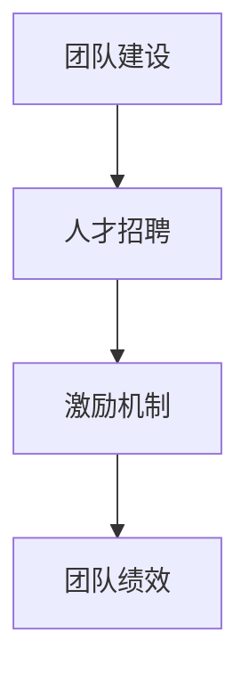

**人才管理的伪代码：**

```python
def talent_management():
    # 团队建设
    team_building = build_team_culture()
    
    # 人才招聘
    recruitment = recruit_talent()
    
    # 激励机制
    incentives = design_incentive_programs()
    
    # 团队绩效
    team_performance = measure_team_performance()
```

**举例说明：**

假设一家创业公司计划开发基于大模型的智能客服系统，人才管理如下：

1. **团队建设**：建立以技术为核心、以创新为驱动的团队文化，鼓励团队成员之间的沟通和合作。
2. **人才招聘**：通过线上线下招聘渠道，吸引具有深度学习、自然语言处理、软件工程等背景的人才。
3. **激励机制**：设立绩效奖金和股权激励计划，激励团队成员积极投入项目开发，提高团队整体绩效。

通过有效的人才管理，创业公司可以打造一支高效、有战斗力的团队，为项目的成功奠定基础。

### 第7章：大模型创业的技术实现

> **7.1 大模型创业的技术实现**
>
> 大模型创业的技术实现涉及多个环节，包括开发环境搭建、模型训练与优化、代码实现等。有效的技术实现是创业成功的关键。

#### 7.1.1 大模型创业的技术框架

大模型创业的技术框架包括以下关键组件：

1. **数据预处理**：数据预处理是模型训练的基础，包括数据清洗、归一化、数据增强等操作。高质量的预处理可以提高模型的性能和泛化能力。

2. **模型训练**：模型训练是核心环节，通过迭代优化模型参数，使模型能够在特定任务上达到最佳性能。常用的训练方法包括梯度下降、随机梯度下降等。

3. **模型评估**：模型评估用于衡量模型在训练集和测试集上的性能。常用的评估指标包括准确率、召回率、F1分数等。

4. **模型部署**：模型部署是将训练好的模型应用到实际场景中，提供预测服务。部署过程中需要考虑模型的性能、可扩展性和安全性。

**技术框架的Mermaid流程图：**

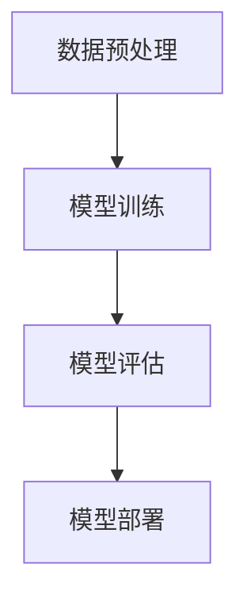

**技术框架的伪代码：**

```python
def technical_framework():
    # 数据预处理
    preprocessed_data = preprocess_data(data)
    
    # 模型训练
    trained_model = train_model(preprocessed_data)
    
    # 模型评估
    evaluation_results = evaluate_model(trained_model)
    
    # 模型部署
    deploy_model(trained_model)
```

#### 7.1.2 大模型创业的算法选择

大模型创业的算法选择至关重要，直接影响模型性能和应用效果。以下是几种常见的大模型算法及其特点：

1. **卷积神经网络（CNN）**：CNN适用于处理图像数据，能够自动提取图像特征。其优点是计算效率高，适用于大规模图像处理任务。

2. **递归神经网络（RNN）**：RNN适用于处理序列数据，如文本、语音等。其优点是能够捕捉序列中的长期依赖关系。

3. **Transformer模型**：Transformer模型是自然语言处理领域的一种先进算法，能够有效处理长文本。其优点是并行计算能力强，计算效率高。

4. **生成对抗网络（GAN）**：GAN适用于生成数据、图像和视频等。其优点是能够生成高质量的样本，提高模型的数据处理能力。

**算法选择的伪代码：**

```python
def choose_algorithm(data_type):
    if data_type == 'image':
        return 'CNN'
    elif data_type == 'text':
        return 'RNN' or 'Transformer'
    elif data_type == 'sequence':
        return 'RNN'
    else:
        return 'GAN'
```

#### 7.1.3 大模型创业的代码实现

大模型创业的代码实现包括数据预处理、模型训练、模型评估和模型部署等步骤。以下是一个示例代码实现：

```python
# 数据预处理
def preprocess_data(data):
    # 数据清洗、归一化等操作
    processed_data = ...
    return processed_data

# 模型训练
def train_model(data):
    # 使用选择的算法训练模型
    model = ...
    return model

# 模型评估
def evaluate_model(model):
    # 在测试集上评估模型性能
    evaluation_results = ...
    return evaluation_results

# 模型部署
def deploy_model(model):
    # 将模型部署到生产环境
    model = ...
    return model

# 主程序
if __name__ == '__main__':
    # 加载数据
    data = load_data()
    
    # 数据预处理
    preprocessed_data = preprocess_data(data)
    
    # 模型训练
    model = train_model(preprocessed_data)
    
    # 模型评估
    evaluation_results = evaluate_model(model)
    
    # 模型部署
    deploy_model(model)
```

通过有效的技术实现，创业公司可以构建高性能的大模型，实现技术突破，提高市场竞争力。

### 第8章：大模型创业的案例研究

> **8.1 案例一：公司A的创业历程**
>
> 公司A通过开发大模型智能客服系统，成功实现商业化，并成为市场领导者。

#### 8.1.1 案例一：公司A的创业历程

公司A成立于2018年，专注于智能客服领域。公司创始人通过对市场需求的敏锐洞察，决定开发一款基于大模型的智能客服系统。以下是公司A的创业历程：

1. **市场调研**：公司A在创业初期进行了全面的市场调研，发现客户对智能客服的需求日益增长，但现有产品存在交互体验差、响应速度慢等问题。

2. **技术攻关**：公司A组建了一支技术团队，致力于大模型技术的研发。团队通过深入研究卷积神经网络（CNN）和递归神经网络（RNN）等技术，开发了具有自主知识产权的智能客服模型。

3. **产品开发**：公司A在技术团队的努力下，成功开发出一款基于大模型的智能客服系统。该系统具备快速响应、多语言支持、个性化推荐等功能，显著提升了用户体验。

4. **市场推广**：公司A通过线上和线下渠道推广产品，吸引了大量企业客户。公司A还与多个行业合作，将智能客服系统应用到客户服务、售后支持等领域。

5. **商业模式创新**：公司A采用订阅模式，为客户提供持续的智能客服服务。此外，公司A还提供API接口，帮助企业快速集成智能客服功能。

6. **规模化发展**：随着市场需求的不断增加，公司A的业务规模逐步扩大。公司A通过不断优化产品和服务，保持了在市场中的领先地位。

7. **融资与扩展**：公司A在发展过程中获得了多轮融资，资金主要用于技术研发、市场拓展和团队建设。公司A还在全球范围内设立了多个分支机构，扩大了市场影响力。

通过公司A的创业历程，我们可以看到大模型技术在创业中的重要作用。公司A通过技术创新，成功解决了市场痛点，实现了商业化，并在竞争中脱颖而出。

#### 8.1.2 案例二：公司B的成功经验

公司B成立于2016年，专注于自然语言处理领域。公司B通过开发大模型智能翻译系统，成功实现了技术突破和市场拓展。以下是公司B的成功经验：

1. **技术积累**：公司B在创业初期，积累了丰富的自然语言处理技术经验。团队通过深入研究Transformer模型等前沿技术，开发了具有高效、准确特点的智能翻译系统。

2. **产品开发**：公司B在技术团队的努力下，成功开发出一款基于大模型的智能翻译系统。该系统支持多种语言之间的实时翻译，并且能够根据用户的历史行为和偏好，提供个性化的翻译服务。

3. **市场拓展**：公司B通过参加国内外技术展会、与行业合作伙伴合作等方式，积极拓展市场。公司B还与多个跨国企业建立了战略合作关系，将智能翻译系统应用到跨国业务沟通、跨境电子商务等领域。

4. **商业模式创新**：公司B采用B2B2C模式，通过为企业客户提供定制化的智能翻译解决方案，实现了商业盈利。此外，公司B还推出个人版智能翻译产品，满足了广大消费者的需求。

5. **技术创新**：公司B持续投入研发，不断优化智能翻译系统。公司B通过引入多模态融合技术、上下文理解技术等，提升了系统的翻译准确性和用户体验。

6. **国际影响力**：公司B在全球化进程中取得了显著成绩，其智能翻译系统在全球范围内得到了广泛应用。公司B还积极参与国际技术交流与合作，提升了企业的国际影响力。

通过公司B的成功经验，我们可以看到大模型技术在创业中的关键作用。公司B通过技术创新和商业模式创新，成功开拓了市场，实现了商业化和国际化。

#### 8.1.3 案例三：公司C的创新模式

公司C成立于2019年，专注于自动驾驶领域。公司C通过开发基于大模型的自动驾驶系统，成功实现了技术突破和商业落地。以下是公司C的创新模式：

1. **技术前瞻**：公司C在创业初期，关注自动驾驶领域的最新技术动态。团队通过深入研究深度学习、传感器融合等技术，开发了具有高感知能力、高决策能力的自动驾驶系统。

2. **数据驱动**：公司C重视数据的作用，通过大量道路测试和数据采集，构建了高质量的自动驾驶数据集。数据驱动的方式使公司C的自动驾驶系统能够适应复杂的道路环境。

3. **硬件优化**：公司C与多家硬件供应商合作，优化自动驾驶系统的硬件配置。通过使用高性能的GPU、传感器等硬件，提升了系统的计算能力和感知能力。

4. **安全可控**：公司C注重自动驾驶系统的安全性，通过多层次的测试和验证，确保系统的稳定性和安全性。公司C还制定了严格的安全标准和流程，保障系统的安全运行。

5. **商业模式创新**：公司C采用定制化模式，为客户提供个性化的自动驾驶解决方案。公司C通过与车企合作，将自动驾驶系统集成到量产车型中，实现了商业落地。

6. **持续迭代**：公司C持续投入研发，不断优化自动驾驶系统。通过引入多模态感知、深度强化学习等技术，提升了系统的性能和稳定性。

7. **市场推广**：公司C积极拓展市场，与多家车企、物流企业等建立了战略合作关系。公司C还推出自动驾驶解决方案，为智能城市、智慧物流等领域提供了技术支持。

通过公司C的创新模式，我们可以看到大模型技术在自动驾驶领域的应用前景。公司C通过技术创新和商业模式创新，成功实现了技术突破和商业落地。

### 第9章：大模型创业的未来展望

> **9.1 大模型创业的未来趋势**
>
> 大模型创业的未来趋势包括技术进步、应用拓展、市场变化等。创业公司需要紧跟趋势，提前布局。

#### 9.1.1 大模型创业的未来趋势

大模型创业的未来趋势主要体现在以下几个方面：

1. **技术进步**：随着人工智能技术的不断发展，大模型的技术将得到进一步提升。新的算法、架构和优化方法将不断涌现，提高大模型的学习能力、推理能力和效率。例如，Transformer模型和GAN等技术的进一步发展，将为大模型创业提供更强大的工具。

2. **应用拓展**：大模型在各个领域的应用将不断拓展。随着技术的进步和市场的需求，大模型将在更多行业如医疗、金融、教育、制造业等得到广泛应用。创业公司将需要不断探索新的应用场景，挖掘大模型的价值。

3. **市场变化**：大模型创业的市场将发生显著变化。随着技术的普及和成本的降低，大模型的应用将更加普遍，市场竞争将更加激烈。创业公司将需要提高产品的差异化竞争力，不断创新和优化商业模式。

4. **生态构建**：大模型创业将带动相关产业链的发展，形成新的产业生态。硬件供应商、数据服务商、算法供应商等将共同参与大模型创业，形成产业链的协同效应。创业公司将需要积极参与生态构建，提升整体竞争力。

**未来趋势的Mermaid流程图：**

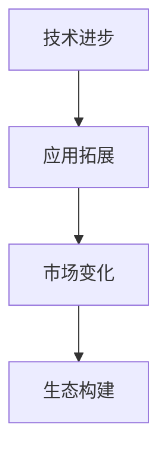

#### 9.1.2 大模型创业的未来挑战与机遇

大模型创业在未来将面临一系列挑战和机遇：

1. **挑战**：
   - **技术难题**：大模型的技术实现和优化仍面临诸多挑战，如计算资源需求、数据质量等。
   - **市场风险**：市场竞争将更加激烈，创业公司需要不断创新和优化商业模式，以保持竞争优势。
   - **合规问题**：随着大模型的应用越来越广泛，相关的合规问题也将日益突出，如数据隐私、安全等。

2. **机遇**：
   - **技术创新**：大模型技术的不断进步将带来新的商业机会，创业公司可以积极参与技术创新，开拓新的应用场景。
   - **市场扩展**：随着大模型在各个领域的应用拓展，创业公司将面临更广阔的市场空间，可以探索新的商业模式和业务领域。
   - **生态构建**：参与大模型生态构建，创业公司将有机会与其他产业链上的企业合作，共同推动产业发展。

**挑战与机遇的Mermaid流程图：**

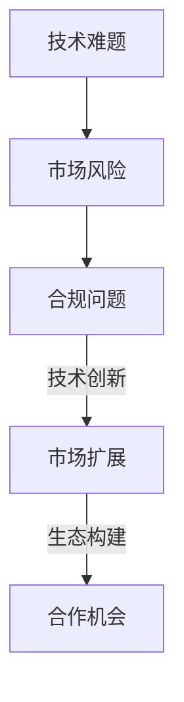

通过面对挑战和抓住机遇，创业公司可以在大模型创业的浪潮中立于不败之地，实现持续发展和盈利。

### 第10章：大模型创业的建议与启示

> **10.1 大模型创业的建议**
>
> 大模型创业需要创业公司具备深厚的技术积累、清晰的市场定位和灵活的商业模式。本文总结了几个关键建议，以帮助创业公司在大模型创业中取得成功。

#### 10.1.1 大模型创业的建议

大模型创业充满挑战，但同时也蕴藏着巨大机遇。以下是一些关键建议，以帮助创业公司在这一领域取得成功：

1. **深厚的技术积累**：大模型创业需要创业公司具备扎实的技术基础。创业公司应专注于某一技术领域，深入研究大模型的理论和实现方法，不断积累技术经验和知识。

2. **清晰的市场定位**：创业公司需要明确自身的市场定位，了解目标市场的需求和竞争格局。通过市场调研和分析，创业公司可以确定自己的产品方向和市场策略，确保产品能够满足市场需求。

3. **灵活的商业模式**：大模型创业的商业模式多样，创业公司应根据市场需求和自身优势，选择合适的商业模式。例如，可以通过产品销售、服务订阅、API接口等方式实现盈利。

4. **数据驱动**：数据是大模型创业的核心资源，创业公司应重视数据的收集、处理和利用。通过数据驱动的方式，创业公司可以不断优化模型性能，提高产品的竞争力。

5. **团队合作**：大模型创业需要一支高效的团队，团队成员应具备多样化的技能和丰富的经验。创业公司应注重团队建设，营造积极向上的团队文化，提高团队协作效率。

6. **持续创新**：大模型创业是一个不断演进的过程，创业公司应保持创新意识，不断探索新技术和新应用场景。通过持续创新，创业公司可以保持竞争优势，开拓新的市场空间。

**大模型创业的建议的Mermaid流程图：**

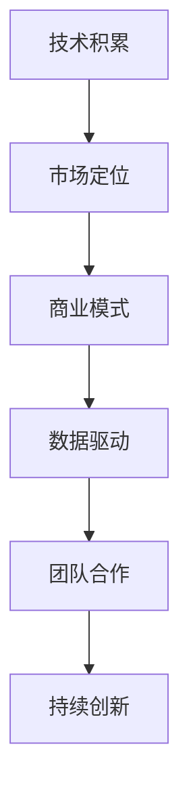

#### 10.1.2 大模型创业的启示

通过大模型创业，我们可以得到以下启示：

1. **技术创新的重要性**：大模型技术是创业成功的关键因素。创业公司应注重技术创新，不断探索新的算法、架构和优化方法，提高大模型的学习能力、推理能力和效率。

2. **数据价值的挖掘**：数据是大模型的基础，创业公司应重视数据的收集、处理和利用。通过数据驱动的方式，创业公司可以不断提高模型的性能，满足市场需求。

3. **灵活应对市场变化**：大模型创业的市场竞争激烈，创业公司需要灵活应对市场变化。通过快速调整战略和商业模式，创业公司可以抓住市场机遇，实现持续发展。

4. **团队合作的力量**：大模型创业需要高效团队的支持。创业公司应注重团队建设，培养团队成员的协作能力和创新精神，提高团队的整体战斗力。

5. **持续学习和进步**：大模型创业是一个不断学习和进步的过程。创业公司应保持学习意识，紧跟技术发展趋势，不断提升自身的技术水平和市场竞争力。

**大模型创业的启示的Mermaid流程图：**

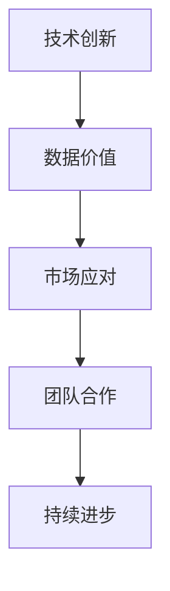

通过这些启示，创业公司可以更好地应对大模型创业中的挑战，抓住机遇，实现可持续发展。

### 附录

#### 附录A：大模型创业相关资源

**A.1 大模型开发工具介绍**

1. **TensorFlow**：TensorFlow是一个开源的机器学习库，支持多种编程语言和平台，广泛用于深度学习模型开发和训练。
2. **PyTorch**：PyTorch是一个开源的深度学习库，以其灵活性和动态计算图而受到研究者和开发者的喜爱。
3. **Keras**：Keras是一个基于Theano和TensorFlow的高层神经网络API，提供了简洁易用的接口，适合快速原型设计和模型开发。

**A.2 大模型创业参考资料**

1. **《深度学习》**：由Ian Goodfellow、Yoshua Bengio和Aaron Courville合著，是一本关于深度学习的经典教材，适合初学者和高级研究者。
2. **《神经网络与深度学习》**：由邱锡鹏教授撰写，详细介绍了神经网络和深度学习的基础知识和实践方法。
3. **《大数据之路》**：由百度大数据团队撰写，分享了大数据处理和应用的实践经验和案例分析。

**A.3 大模型创业相关社区与论坛**

1. **ArXiv**：一个开放获取的科学研究论文存档库，涵盖了人工智能和深度学习的最新研究论文。
2. **Reddit**：Reddit上有多个关于人工智能和深度学习的子论坛，如r/MachineLearning、r/deeplearning等，是交流和学习的好去处。
3. **GitHub**：GitHub是开源代码的平台，许多深度学习项目和技术文档都在GitHub上发布，是学习和借鉴的好资源。


### 总结

通过本文的详细分析，我们可以看到大模型技术在创业中的核心动力。技术创新不仅推动了大模型的发展，也为创业公司提供了丰富的机遇。从数据驱动创新、算法优化创新到硬件加速创新，每一个环节都至关重要。同时，有效的项目管理、商业模式设计和人才管理也是创业成功的关键。

在未来的大模型创业中，创业公司需要紧跟技术发展趋势，灵活应对市场变化，不断优化产品和商业模式。通过积累深厚的技术、数据驱动创新、灵活的市场策略和高效的团队管理，创业公司将在大模型创业的浪潮中立于不败之地。

我们期待大模型技术在创业领域的进一步发展，带来更多创新和变革。创业公司应勇于探索，不断创新，共同推动人工智能技术的进步，为人类社会带来更多价值。让我们共同期待大模型创业的未来，充满无限可能。


### 作者信息

作者：AI天才研究院/AI Genius Institute & 禅与计算机程序设计艺术 /Zen And The Art of Computer Programming

AI天才研究院致力于推动人工智能技术的发展，专注于前沿技术的探索与应用。研究院由多位世界顶级人工智能专家和研究人员组成，共同致力于解决复杂的人工智能问题，推动人工智能技术的普及和应用。

《禅与计算机程序设计艺术》一书由AI天才研究院的创始人之一撰写，深入探讨了计算机程序设计中的哲学和艺术，为程序员和人工智能从业者提供了深刻的思考和启示。

通过结合理论与实践，AI天才研究院致力于培养下一代人工智能创新者，推动人工智能技术的进步，为人类社会创造更多价值。

