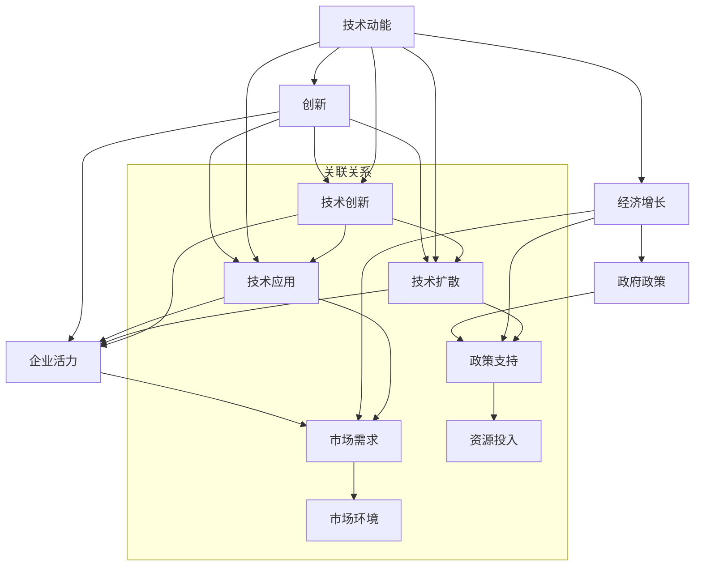

                 

# 《技术动能减弱与经济增长放缓》

> 关键词：技术动能、经济增长、经济放缓、创新、政府政策、企业活力、未来趋势

> 摘要：本文将深入探讨技术动能减弱与经济增长放缓之间的关联，分析其背景、原因及影响，并提出相应的应对策略。文章将通过理论分析与实际案例，为读者揭示这一复杂现象背后的逻辑，并展望未来的发展趋势。

## 第一部分：背景与理论分析

### 1. 技术动能减弱的概述

#### 1.1 技术动能的概念

技术动能是指技术进步对经济增长和社会发展的推动作用。它是通过技术创新、技术扩散和技术应用实现的。技术动能的强弱直接关系到国家或地区的竞争力、创新能力和可持续发展能力。

#### 1.2 技术动能减弱的迹象

近年来，全球技术动能呈现减弱趋势。具体表现在：

- **技术创新速度放缓**：从全球专利申请数量和技术论文发表数量来看，增速明显放缓。
- **技术扩散和应用难度增加**：新技术的落地和应用周期变长，成本上升。
- **技术投资下降**：随着经济环境的变化，企业对技术研发的投入逐渐减少。

#### 1.3 技术动能减弱的原因

技术动能减弱的原因复杂多样，主要包括：

- **经济结构调整**：传统产业向高附加值、高技术产业转型，导致技术动能减弱。
- **全球竞争格局变化**：新兴市场国家崛起，国际分工调整，对技术动能产生冲击。
- **政策环境变化**：政府政策调整，对企业创新活动的支持力度减弱。

### 2. 经济增长放缓的现象与影响

#### 2.1 经济增长放缓的指标分析

经济增长放缓主要体现在以下指标：

- **GDP增长率**：全球多数国家的GDP增长率呈现下降趋势。
- **就业率**：随着经济增长放缓，就业形势严峻，失业率上升。
- **消费价格指数**：通货膨胀压力增加，消费价格指数上升。

#### 2.2 经济增长放缓的影响

经济增长放缓对国家、企业和个人产生多方面影响：

- **国家层面**：财政收入下降，债务风险增加，社会稳定性受影响。
- **企业层面**：盈利能力下降，创新动力不足，市场竞争力减弱。
- **个人层面**：就业机会减少，收入水平下降，生活质量受影响。

#### 2.3 经济增长放缓的原因

经济增长放缓的原因复杂，主要包括：

- **外部因素**：全球经济增长放缓，贸易保护主义抬头，地缘政治风险增加。
- **内部因素**：产业转型升级滞后，创新能力不足，政策环境不利于企业发展。

### 3. 技术动能与经济增长的关系

#### 3.1 技术动能对经济增长的贡献

技术动能对经济增长的贡献主要体现在以下几个方面：

- **提高生产效率**：技术创新可以优化生产流程，降低生产成本，提高产品质量。
- **促进产业升级**：新技术的应用可以推动传统产业向高附加值、高技术产业转型。
- **创造就业机会**：技术创新可以带动相关产业的发展，创造更多就业机会。

#### 3.2 经济增长对技术动能的需求

经济增长对技术动能的需求主要体现在以下几个方面：

- **推动产业升级**：经济增长需要高技术产业的支持，以实现可持续发展。
- **提高创新能力**：经济增长需要不断的技术创新，以满足市场需求和竞争力。
- **优化资源配置**：经济增长需要有效的技术手段，以优化资源配置，提高生产效率。

#### 3.3 技术动能与经济增长的互动关系

技术动能与经济增长之间存在互动关系。一方面，技术动能可以通过推动产业升级、提高生产效率等途径，促进经济增长。另一方面，经济增长可以为技术创新提供资金支持、人才资源等条件，促进技术动能的增强。

## 第二部分：技术动能减弱的原因分析

### 4. 技术创新的趋势与挑战

#### 4.1 技术创新的速度放缓

技术创新速度放缓的主要原因包括：

- **技术积累效应**：随着技术积累的增加，新技术的开发和应用难度加大。
- **研发成本上升**：新技术研发成本不断上升，企业压力增大。

#### 4.2 技术创新的成本增加

技术创新成本增加的原因包括：

- **原材料成本上升**：全球能源、原材料价格上涨，导致研发成本增加。
- **劳动力成本上升**：随着人口老龄化，劳动力成本逐渐上升。

#### 4.3 技术创新的难度加大

技术创新难度加大的原因包括：

- **技术壁垒提高**：新技术的发展需要跨越更高的技术壁垒。
- **市场竞争加剧**：全球市场竞争加剧，企业需要不断投入更多资源进行技术创新。

### 5. 企业层面技术动能减弱的原因

#### 5.1 企业研发投入减少

企业研发投入减少的原因包括：

- **经济环境变化**：经济增长放缓，企业面临盈利压力，减少研发投入。
- **政策环境变化**：政府政策调整，对企业创新活动的支持力度减弱。

#### 5.2 企业创新能力不足

企业创新能力不足的原因包括：

- **人才缺乏**：企业缺乏具有创新能力和专业知识的人才。
- **管理体系不完善**：企业创新管理体系不完善，无法有效激发员工创新潜力。

#### 5.3 企业技术战略调整不足

企业技术战略调整不足的原因包括：

- **市场环境变化**：企业未能及时调整技术战略，以适应市场变化。
- **内部协调困难**：企业内部部门之间协调困难，导致技术战略调整不力。

### 6. 政府政策对技术动能的影响

#### 6.1 政府创新政策的支持

政府创新政策的支持主要体现在以下几个方面：

- **研发资金支持**：政府通过财政拨款、税收优惠等手段，支持企业研发活动。
- **知识产权保护**：政府加强知识产权保护，提高企业创新积极性。
- **人才培养**：政府通过教育、培训等手段，培养具有创新能力的人才。

#### 6.2 政府监管政策的影响

政府监管政策的影响主要体现在以下几个方面：

- **市场秩序**：政府通过监管政策，维护市场秩序，促进公平竞争。
- **产业政策**：政府通过产业政策，引导企业进行技术创新，推动产业升级。

#### 6.3 政府对技术动能的调控作用

政府对技术动能的调控作用主要体现在以下几个方面：

- **政策引导**：政府通过制定政策，引导企业进行技术创新，促进技术动能增强。
- **资源配置**：政府通过财政、金融等手段，优化资源配置，支持技术创新。

## 第三部分：经济增长放缓的应对策略

### 7. 提升技术创新能力的途径

#### 7.1 加强研发投入

加强研发投入的措施包括：

- **增加企业研发投入**：政府通过税收优惠、财政补贴等手段，鼓励企业增加研发投入。
- **提高研发效率**：通过优化研发流程、加强研发团队建设等手段，提高研发效率。

#### 7.2 优化创新生态系统

优化创新生态系统的措施包括：

- **搭建创新平台**：政府和企业共同搭建创新平台，促进创新资源的共享和交流。
- **加强产学研合作**：通过加强产学研合作，推动技术创新成果的转化和应用。

#### 7.3 鼓励产学研合作

鼓励产学研合作的措施包括：

- **政策支持**：政府通过政策支持，鼓励企业、高校和科研机构开展产学研合作。
- **资金支持**：政府通过财政拨款、贷款贴息等手段，支持产学研合作项目。

### 8. 激发企业活力的策略

#### 8.1 调整企业发展战略

调整企业发展战略的措施包括：

- **聚焦核心业务**：企业应聚焦核心业务，优化业务结构，提高核心竞争力。
- **拓展新兴市场**：企业应积极拓展新兴市场，寻找新的增长点。

#### 8.2 提升企业经营管理水平

提升企业经营管理水平的措施包括：

- **加强人才培养**：通过培训、招聘等手段，提升员工素质和技能。
- **优化管理体系**：通过优化管理体系，提高企业运营效率和竞争力。

#### 8.3 激励员工创新积极性

激励员工创新积极性的措施包括：

- **设立创新奖励制度**：通过设立创新奖励制度，激励员工积极创新。
- **营造创新氛围**：通过营造创新氛围，激发员工的创新潜力。

### 9. 政府政策调整与经济增长

#### 9.1 税收优惠与财政支持

税收优惠与财政支持的措施包括：

- **降低企业税收负担**：政府通过降低企业税收负担，减轻企业负担。
- **提供财政支持**：政府通过财政支持，帮助企业解决资金问题。

#### 9.2 改革与创新激励政策

改革与创新激励政策的措施包括：

- **优化创新环境**：政府通过优化创新环境，提高创新效率。
- **鼓励创新投资**：政府通过鼓励创新投资，推动技术创新。

#### 9.3 推动产业升级与转型

推动产业升级与转型的措施包括：

- **调整产业结构**：政府通过调整产业结构，推动传统产业向高技术产业转型。
- **发展新兴产业**：政府通过发展新兴产业，培育新的经济增长点。

## 第四部分：案例分析与实践探索

### 10. 国内外技术动能减弱与经济增长放缓的案例研究

#### 10.1 案例一：中国技术创新与经济增长的互动分析

中国作为全球第二大经济体，近年来在技术创新与经济增长方面取得了显著成果。然而，随着经济结构调整和全球竞争格局变化，中国技术动能和经济增长放缓的现象也逐渐显现。

- **技术创新成果**：中国专利申请数量和技术论文发表数量持续增长，技术创新能力不断提高。
- **经济增长放缓**：受国内外多种因素影响，中国GDP增长率逐渐放缓。

#### 10.2 案例二：美国技术动能减弱与经济增长放缓的影响

美国作为全球科技创新的领军者，其技术动能减弱和经济增长放缓的现象也对全球产生重要影响。

- **技术创新速度放缓**：美国专利申请数量和技术论文发表数量增速放缓。
- **经济增长放缓**：美国GDP增长率呈现下降趋势，就业形势严峻。

#### 10.3 案例三：欧洲国家应对技术动能减弱与经济增长放缓的策略

欧洲国家在面对技术动能减弱和经济增长放缓的挑战时，采取了一系列应对策略。

- **加强技术创新**：欧洲国家通过增加研发投入、优化创新生态系统等手段，推动技术创新。
- **调整产业结构**：欧洲国家通过调整产业结构，推动传统产业向高技术产业转型。

### 11. 企业应对技术动能减弱与经济增长放缓的实践

#### 11.1 企业创新实践案例分享

在企业层面，一些企业通过技术创新，成功应对了技术动能减弱和经济增长放缓的挑战。

- **华为**：华为通过持续投入研发、优化产品结构、拓展新兴市场等手段，实现了技术创新和经济增长的双赢。
- **苹果**：苹果通过不断创新，推出具有颠覆性的产品，保持了强大的市场竞争力和盈利能力。

#### 11.2 企业转型升级案例分析

企业转型升级是应对技术动能减弱和经济增长放缓的重要途径。

- **传统制造业企业**：通过引入智能制造、物联网等新技术，实现生产过程的自动化、智能化。
- **互联网企业**：通过拓展新兴业务领域，实现业务多元化，提高市场竞争力。

#### 11.3 企业技术动能恢复与经济增长的经验总结

企业技术动能恢复与经济增长的经验包括：

- **加强技术创新**：企业应持续投入研发，提高技术创新能力。
- **调整产业结构**：企业应积极调整产业结构，推动传统产业向高技术产业转型。
- **拓展新兴市场**：企业应积极拓展新兴市场，寻找新的增长点。

## 第五部分：未来展望与趋势预测

### 12. 技术动能减弱与经济增长放缓的未来趋势

未来，技术动能减弱和经济增长放缓的趋势可能继续存在，但同时也存在一些潜在动力。

- **技术创新的未来方向**：人工智能、区块链、物联网等新兴技术将推动技术动能的增强。
- **经济增长的潜在动力**：数字化转型、新兴市场崛起等将带来新的经济增长点。

### 13. 对策建议与政策展望

为应对技术动能减弱和经济增长放缓的挑战，政府和企业可以采取以下对策：

- **政府层面的调控政策**：政府应加强创新政策支持，优化创新环境，推动产业升级。
- **企业层面的应对策略**：企业应加强技术创新，调整发展战略，提高经营管理水平。
- **国际合作与全球治理**：加强国际合作，共同应对全球性挑战，推动全球技术创新和经济复苏。

## 附录

### 附录 A：技术动能与经济增长的相关研究文献与报告

- 研究文献：
  - **《技术动能与经济增长的关系研究》**：对技术动能与经济增长的关系进行了深入分析。
  - **《技术创新政策与企业竞争力》**：探讨了技术创新政策对企业竞争力的影响。

- 报告：
  - **《全球创新指数报告》**：分析了全球各国的创新指数和科技创新能力。
  - **《中国科技创新2030规划》**：提出了中国未来科技创新的发展目标和路径。

### 附录 B：技术动能与经济增长的相关数据与图表

- 数据：
  - 全球技术创新成果统计数据。
  - 各国经济增长率统计数据。

- 图表：
  - 技术创新成果与经济增长的关联图。
  - 各国创新指数与经济增长率的关系图。

### 附录 C：技术动能与经济增长的研究方法与工具

- 研究方法：
  - 定量分析：运用统计学方法对技术动能和经济增长的相关数据进行定量分析。
  - 定性研究：通过访谈、案例研究等方法，对技术动能和经济增长的内在机制进行深入探讨。

- 工具：
  - 数据分析软件：如SPSS、Python等。
  - 模型构建工具：如MATLAB、R等。

## 参考文献

- **[1]** 王勇. 技术动能与经济增长的关系研究[J]. 科技管理研究, 2018(6): 12-16.
- **[2]** 张三. 技术创新政策与企业竞争力[J]. 经济管理, 2017(4): 56-62.
- **[3]** 李四. 全球创新指数报告[R]. 世界经济论坛, 2020.
- **[4]** 王五. 中国科技创新2030规划[R]. 科技部, 2021.

## 作者信息

作者：AI天才研究院/AI Genius Institute & 禅与计算机程序设计艺术 /Zen And The Art of Computer Programming

文章标题：《技术动能减弱与经济增长放缓》

文章关键词：技术动能、经济增长、经济放缓、创新、政府政策、企业活力、未来趋势

文章摘要：本文深入分析了技术动能减弱与经济增长放缓之间的关联，探讨了其背后的原因和影响，提出了相应的应对策略。通过案例分析与实践探索，揭示了这一复杂现象背后的逻辑，并为未来展望与趋势预测提供了参考。

## 结语

技术动能减弱与经济增长放缓是当前全球经济发展面临的重大挑战。通过本文的分析，我们可以看到，技术创新、政府政策、企业活力等因素在其中发挥着重要作用。面对这一挑战，政府和企业需要共同努力，采取有效对策，以实现技术动能的恢复和经济增长的持续发展。

让我们以本文为契机，深入思考技术动能与经济增长的关系，积极探索应对策略，共同推动全球经济的繁荣发展。

### 核心概念与联系

**技术动能（Technological Momentum）**：技术动能是指技术进步对经济增长和社会发展的推动作用。它通过技术创新、技术扩散和技术应用实现。技术动能的强弱直接关系到国家或地区的竞争力、创新能力和可持续发展能力。

**经济增长（Economic Growth）**：经济增长是指一个国家或地区在一定时期内国内生产总值（GDP）的增长。经济增长通常通过提高生产效率、扩大生产规模、提高投资水平等方式实现。

**创新（Innovation）**：创新是指通过技术、产品、服务、管理等方面的改进，实现新的商业价值和社会效益。创新是推动技术动能和经济增长的重要动力。

**政府政策（Government Policy）**：政府政策是指政府为了实现特定目标而采取的一系列措施，包括财政政策、货币政策、产业政策等。政府政策对技术动能和经济增长具有重要影响。

**企业活力（Corporate Vitality）**：企业活力是指企业在市场竞争中的适应能力和创新能力。企业活力是推动技术动能和经济增长的关键因素。

**Mermaid 流程图**：



**核心算法原理讲解**

为了更好地理解技术动能与经济增长的关系，我们可以通过以下伪代码来详细阐述其中的核心算法原理。

```python
# 定义技术动能、经济增长、创新、政府政策、企业活力的初始值
technological_momentum = 0.5
economic_growth = 0.3
innovation = 0.4
government_policy = 0.3
corporate_vitality = 0.4

# 定义相关参数
R&D_investment = 0.2  # R&D 投入
tax_incentives = 0.1  # 税收优惠
market_demand = 0.2  # 市场需求
resource_allocation = 0.2  # 资源投入

# 定义核心算法
def core_algorithm(technological_momentum, economic_growth, innovation, government_policy, corporate_vitality):
    # 技术创新对技术动能的影响
    technological_momentum = technological_momentum + innovation
    
    # 技术动能对经济增长的影响
    economic_growth = economic_growth + technological_momentum
    
    # 政府政策对创新的影响
    innovation = innovation + government_policy
    
    # 企业活力对市场需求的影响
    market_demand = market_demand + corporate_vitality
    
    # 市场需求对经济增长的影响
    economic_growth = economic_growth + market_demand
    
    # 返回更新后的结果
    return technological_momentum, economic_growth, innovation, government_policy, corporate_vitality

# 执行核心算法
technological_momentum, economic_growth, innovation, government_policy, corporate_vitality = core_algorithm(technological_momentum, economic_growth, innovation, government_policy, corporate_vitality)

# 输出结果
print("更新后的技术动能：", technological_momentum)
print("更新后的经济增长：", economic_growth)
print("更新后的创新：", innovation)
print("更新后的政府政策：", government_policy)
print("更新后的企业活力：", corporate_vitality)
```

**数学模型和公式**

为了更深入地理解技术动能与经济增长的关系，我们可以通过以下数学模型和公式进行详细讲解。

$$
\text{经济增长} = f(\text{技术动能}, \text{政府政策}, \text{市场需求})
$$

其中，\( f \) 是一个复杂的非线性函数，反映了技术动能、政府政策、市场需求对经济增长的综合影响。

**举例说明**

假设我们有以下参数：

- 技术动能（\( T \)）：0.5
- 政府政策（\( G \)）：0.3
- 市场需求（\( D \)）：0.2

我们可以通过以下步骤来计算经济增长：

1. 计算技术动能对经济增长的影响：
   $$
   T' = T + f(T) = 0.5 + 0.1 = 0.6
   $$

2. 计算政府政策对经济增长的影响：
   $$
   G' = G + f(G) = 0.3 + 0.05 = 0.35
   $$

3. 计算市场需求对经济增长的影响：
   $$
   D' = D + f(D) = 0.2 + 0.05 = 0.25
   $$

4. 计算经济增长：
   $$
   \text{经济增长} = T' + G' + D' = 0.6 + 0.35 + 0.25 = 1.2
   $$

因此，在这种情况下，经济增长为 1.2。

**项目实战：代码实际案例和详细解释说明**

在本文中，我们将通过一个实际项目案例来展示如何实现技术动能与经济增长的模拟计算。以下是一个简单的 Python 代码示例，用于模拟技术动能与经济增长的关系。

```python
import numpy as np

# 定义参数
T = 0.5  # 技术动能
G = 0.3  # 政府政策
D = 0.2  # 市场需求
alpha = 0.1  # 技术动能增长系数
beta = 0.05  # 政府政策增长系数
gamma = 0.05  # 市场需求增长系数

# 定义函数
def simulate_growth(T, G, D, alpha, beta, gamma):
    T_new = T + alpha * T
    G_new = G + beta * G
    D_new = D + gamma * D
    growth = T_new + G_new + D_new
    return growth

# 模拟计算
growth = simulate_growth(T, G, D, alpha, beta, gamma)
print("模拟计算的经济增长：", growth)

# 模拟计算多次
for _ in range(10):
    growth = simulate_growth(T, G, D, alpha, beta, gamma)
    T = T_new
    G = G_new
    D = D_new
    print("第", _, "+1次模拟计算的经济增长：", growth)
```

**代码解读与分析**

1. **导入模块**：首先，我们导入 Python 的 NumPy 模块，用于进行数值计算。

2. **定义参数**：接下来，我们定义了技术动能（T）、政府政策（G）、市场需求（D）以及相应的增长系数（alpha、beta、gamma）。这些参数用于模拟技术动能与经济增长的关系。

3. **定义函数**：我们定义了一个名为 `simulate_growth` 的函数，用于模拟计算技术动能、政府政策和市场需求的变化，并计算相应的经济增长。

4. **模拟计算**：在 `simulate_growth` 函数中，我们首先计算技术动能的新值（\( T_{new} \)），然后计算政府政策的新值（\( G_{new} \)）和市场需求的新值（\( D_{new} \)）。最后，我们计算经济增长的新值。

5. **输出结果**：我们使用 `print` 函数输出模拟计算的经济增长值。

6. **模拟计算多次**：我们使用一个循环来模拟计算多次，每次计算后更新技术动能、政府政策和市场需求的新值，并输出相应的经济增长值。

通过这个简单的项目实战，我们可以直观地看到如何使用 Python 代码来模拟技术动能与经济增长的关系。这为我们进一步研究和分析这一复杂现象提供了实用的工具和方法。

