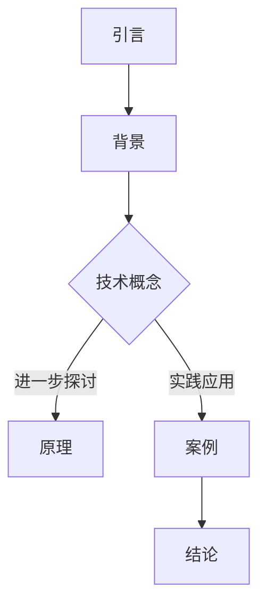
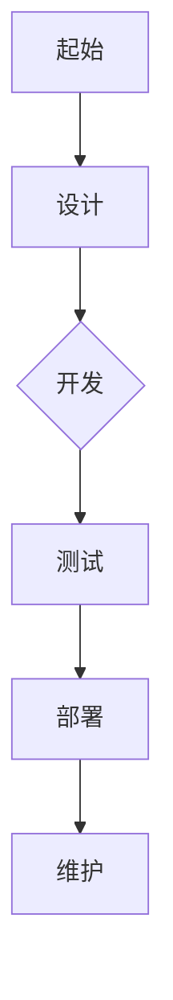

                 

### 文章标题：从博客爱好者到主要收入来源

> 关键词：技术博客、收入来源、内容创作、推广策略、变现途径

> 摘要：本文将深入探讨如何将技术博客从个人爱好转变为主要的收入来源。通过分析博客的发展历程、写作技巧、推广策略以及变现途径，为技术博客爱好者提供一套完整的指南，帮助他们在信息时代实现财务自由。

#### 第一部分：从博客爱好者到内容创作者

在互联网时代，博客已成为信息传播和个人品牌建设的重要工具。许多人最初将博客视为一个兴趣爱好的平台，通过记录个人生活、分享知识来充实自己的生活。然而，随着博客平台的日益成熟和互联网用户的激增，越来越多的人开始意识到博客可以成为一份稳定的收入来源。本文将带领读者一步步了解如何将博客从兴趣转变为收入，并探索其中的可行性和策略。

#### 第二部分：技术博客的写作与推广

技术博客的写作和推广是博客成功的关键。在技术领域，高质量的博客内容往往能够吸引大量的读者，提高博客的知名度和影响力。本部分将详细介绍技术博客的写作技巧、推广策略以及如何利用社交媒体和搜索引擎优化（SEO）来提升博客的曝光率。

#### 第三部分：技术博客的变现途径

当技术博客积累了足够的读者和影响力后，变现便成为下一个重要的目标。本部分将探讨多种变现途径，包括广告收入、咨询服务、产品销售等，并分析如何通过这些途径实现财务自由。

#### 第四部分：持续成长与优化

技术博客的成功不是一蹴而就的，需要长期的规划与持续的努力。本部分将讨论如何通过内容策略的调整、技术更新和品牌建设来不断提升博客的质量和影响力。

#### 第五部分：成功案例分析

通过成功的案例分析，读者可以了解到其他技术博客爱好者的成功经验，从中学习到宝贵的经验和教训。

#### 第六部分：未来展望

最后，本文将对技术博客的发展趋势进行展望，探讨未来博客可能面临的新挑战和机遇。

---

通过本文的逐步分析，我们相信读者可以清晰地了解如何从博客爱好者转变为内容创作者，并最终实现财务自由。无论你是刚刚开始写博客的新手，还是希望提升博客收入的资深博主，本文都将为你提供有价值的指导和建议。

#### 第1章: 引言：博客作为收入来源的潜力

随着互联网的普及，博客已成为信息传播和个人品牌建设的重要工具。越来越多的人开始意识到，博客不仅可以作为一个表达自我、记录生活的平台，还可以成为一份稳定的收入来源。然而，如何将博客从兴趣转变为收入，实现财务自由，这是一个值得探讨的话题。本文将从博客的发展历史、写作技巧、推广策略和变现途径等方面，深入分析博客作为收入来源的潜力，为博客爱好者提供一套完整的指南。

## 1.1 博客发展的历史与现状

### 1.1.1 博客的起源

博客（Weblog）这一概念起源于1997年，由 Jorn Barger 在他的在线日记中首次提出。博客的名称源自“Web”和“Log”（日志），它是一种在线个人日记或网页，以时间顺序记录作者的生活、思考和见解。最早的博客形式相对简单，主要是文本形式的个人日记，但随着技术的发展，博客逐渐演变为一个功能丰富、形式多样的信息平台。

### 1.1.2 博客的发展趋势

- **博客内容形式的多样化**：早期的博客主要是个人日记和观点分享，但随着互联网的发展，博客的内容形式变得多样化，包括文字、图片、音频、视频等。此外，博客也逐渐成为知识分享、行业讨论和技术交流的重要平台。

- **社交媒体对博客生态的影响**：社交媒体的兴起对博客生态产生了深远影响。一方面，社交媒体的即时性、互动性吸引了大量用户，使得博客的读者群体有所分散。另一方面，博客与社交媒体的结合，使得博客的内容传播和互动更加便捷。

- **博客与专业领域结合的深度化**：随着博客平台的成熟和互联网用户对高质量内容的需求增加，博客逐渐与专业领域结合，形成了一批专业化的技术博客、行业博客和学术博客。这些博客通过深入分析和专业分享，为行业发展和技术创新提供了有力支持。

### 1.1.3 博客在信息时代的作用

- **知识传播与教育**：博客作为一种自媒体形式，为知识传播和教育提供了新的途径。作者可以通过博客分享专业知识和实践经验，帮助他人学习和成长。

- **资讯获取与分享**：博客成为人们获取资讯和分享信息的重要渠道。读者可以通过博客了解行业动态、技术趋势和个人见解，从而更好地把握市场机遇。

- **个人品牌建设与影响力扩大**：博客成为个人品牌建设的重要工具。通过持续输出高质量的内容，个人可以在特定领域建立权威性和影响力，扩大个人影响力。

## 1.2 博客作为收入来源的可行性

### 1.2.1 博客盈利模式概述

博客的盈利模式多种多样，主要包括以下几种：

- **广告收入**：博客可以通过展示广告获得收入。广告类型包括横幅广告、文本链接广告、推荐商品广告等。常见的广告平台有Google AdSense、Bing Ads、社交媒体广告等。

- **咨询服务**：博客作者可以通过博客提供咨询服务，如技术支持、解决方案设计、项目评估等。通过专业知识和经验，作者可以为企业和个人提供有价值的服务，并获取收入。

- **课程与产品销售**：博客作者可以开发自己的课程或产品，通过博客进行推广和销售。课程形式可以包括视频教程、电子书、在线直播等。产品销售则可以是自有产品或与其他企业合作的联合产品。

- **赞助与合作**：博客作者可以与相关企业合作，通过赞助或联合推广获得收入。这种方式通常涉及品牌合作、内容植入等。

### 1.2.2 网络广告与博客收入

网络广告是博客收入的重要来源之一。博客可以通过以下方式实现广告收入：

- **广告类型**：广告类型包括横幅广告、文本链接广告、推荐商品广告等。每种广告类型都有不同的收入模式，如按点击付费（CPC）、按展示次数付费（CPM）和按行动付费（CPA）。

- **广告平台**：常见的广告平台有Google AdSense、Bing Ads、社交媒体广告平台等。Google AdSense 是最常用的广告平台之一，它允许博客主根据其网站流量和内容来展示相关广告，并通过点击和展示获得收入。

### 1.2.3 博客内容的商业价值

博客内容的商业价值主要体现在以下几个方面：

- **内容质量**：高质量的内容能够吸引更多的读者，提高博客的流量和影响力。博客作者需要不断学习、实践和总结，以确保内容的深度和实用性。

- **受众定位**：精准的受众定位能够提高广告的有效性和咨询服务的需求。博客作者需要了解自己的读者群体，为他们提供有价值的信息。

- **内容更新**：定期更新的内容能够保持读者的兴趣和活跃度，提高博客的流量和收入。博客作者需要制定合理的内容更新策略，确保内容的质量和连贯性。

## 1.3 博客内容创作与维护

### 1.3.1 博客内容创作要点

成功的博客内容创作需要遵循以下几个要点：

- **主题明确**：选择一个明确的主题，专注于某一领域。避免内容过于分散，难以吸引和保持读者。

- **语言表达**：使用清晰、简洁、准确的语言，避免使用复杂难懂的术语。同时，注重语言的吸引力，使文章具有可读性和吸引力。

- **内容结构**：设计合理的内容结构，确保文章的逻辑性和条理性。可以使用标题、段落、列表等格式，使文章易于阅读。

- **更新频率**：定期更新博客内容，保持博客的活跃度。更新的频率可以根据作者的时间和内容创作计划来调整，但应确保内容的持续性和稳定性。

### 1.3.2 博客维护策略

博客的维护是确保其长期发展的关键。以下是一些维护策略：

- **定期备份**：定期备份博客内容和数据库，防止数据丢失或损坏。

- **网站安全**：定期检查和更新网站，确保网站的安全性。安装安全插件，防止黑客攻击和恶意软件感染。

- **用户互动**：积极回复读者留言和评论，鼓励读者参与讨论。通过互动，提高读者的忠诚度和参与度。

### 1.3.3 保持博客活跃性的技巧

保持博客的活跃性是吸引和保持读者的重要手段。以下是一些技巧：

- **内容多样化**：通过不同形式的内容，如文字、图片、视频等，增加博客的趣味性和吸引力。

- **社交媒体联动**：将博客内容同步发布到社交媒体平台，利用社交媒体的传播效应，扩大博客的影响力。

- **互动参与**：鼓励读者参与内容创作，如投稿文章、分享经验、提出问题等。通过互动，增加读者的参与感和归属感。

#### 第2章：技术博客的写作技巧

技术博客的写作对于博客的成功至关重要。高质量的技术博客不仅能够吸引更多的读者，还能提升博客的权威性和影响力。本章将详细介绍技术博客的写作技巧，包括写作准备、技巧和风格指南，帮助读者写出专业、易懂且具有吸引力的技术博客文章。

### 2.1 技术博客写作的准备

#### 2.1.1 技术博客的定位与目标读者

在进行技术博客写作之前，明确博客的定位和目标读者是非常重要的。以下是一些关键点：

- **定位**：选择一个特定的技术领域或专业方向，专注于某一细分市场。例如，可以专注于云计算、人工智能、前端开发等。

- **目标读者**：明确你的目标读者群体，了解他们的需求、知识和技能水平。目标读者可以是初学者、中级开发者或高级工程师。

通过明确的定位和目标读者，你的博客内容才能更加针对性和专业化。

#### 2.1.2 技术博客的内容规划

内容规划是确保博客内容持续性和质量的关键步骤。以下是一些内容规划的要点：

- **长期内容规划**：制定一个长期内容计划，包括文章主题、发布频率和时间表。例如，每月发布3-4篇技术文章，涵盖不同的主题。

- **短期内容规划**：为每篇文章制定一个详细的内容提纲，包括引言、背景、主体内容、结论和参考文献。

- **内容更新**：定期回顾和更新旧文章，保持内容的时效性和准确性。同时，根据读者反馈和市场需求，调整内容方向。

#### 2.1.3 技术博客写作工具与平台

选择合适的写作工具和平台可以大大提高写作效率和质量。以下是一些常用的写作工具和平台：

- **写作工具**：Markdown编辑器（如Typora、VSCode）、LaTeX编辑器（如TeXstudio、TeXmaker）。

- **博客平台**：WordPress、Blogger、Hexo、Jekyll等。

选择适合自己需求和习惯的工具和平台，可以让你更轻松地完成技术博客的写作和发布。

### 2.2 技术博客写作技巧

#### 2.2.1 文章结构设计

一篇高质量的技术博客文章需要有一个清晰、逻辑严谨的结构。以下是一个典型的文章结构设计：

- **引言**：简短地介绍文章的主题和目的，引起读者的兴趣。

- **背景**：提供一些相关的背景信息，帮助读者理解文章的主题。

- **主体内容**：分部分、分章节地详细阐述技术概念、原理、方法和应用。

- **案例分析**：通过实际案例或实验结果，展示技术在实际中的应用效果。

- **结论**：总结全文，强调文章的主要观点和结论。

- **参考文献**：列出引用的文章、书籍、网站等，增加文章的权威性和可信度。

#### 2.2.2 语言表达与逻辑性

语言表达和逻辑性是技术博客文章质量的关键因素。以下是一些要点：

- **清晰简洁**：使用简单、易懂的语言，避免使用过于复杂和冗长的句子。

- **逻辑严谨**：确保文章的逻辑性，每个段落都有明确的主题和论点，段落之间有良好的过渡。

- **逻辑流程图**：使用Mermaid流程图或其他图形工具，帮助读者更好地理解文章的结构和逻辑。

以下是一个Mermaid流程图的示例：



#### 2.2.3 代码示例与图表使用

代码示例和图表是技术博客中不可或缺的一部分，它们可以直观地展示技术概念和方法。以下是一些要点：

- **代码示例**：提供清晰的代码示例，突出关键代码片段，并在旁边附上简短的解释。

- **图表使用**：使用图表来展示数据、流程或关系，使文章更加直观易懂。

- **图表与文本结合**：图表与文本结合使用，可以更好地解释和展示技术概念。

以下是一个简单的代码示例和图表的示例：

```markdown
### 代码示例：Python实现斐波那契数列

```python
def fibonacci(n):
    if n <= 1:
        return n
    else:
        return fibonacci(n-1) + fibonacci(n-2)

print(fibonacci(10))
```


```

### 2.3 技术博客写作风格与风格指南

#### 2.3.1 个人风格与统一风格

技术博客写作中，个人风格和统一风格需要相结合。以下是一些建议：

- **个人风格**：根据自己的写作习惯和偏好，形成独特的写作风格。这可以包括语言表达、使用比喻、幽默元素等。

- **统一风格**：确保博客整体风格的统一和一致性，包括标题、段落格式、术语使用等。这可以提升博客的专业形象和可读性。

#### 2.3.2 避免常见写作错误

在技术博客写作中，一些常见的错误可能会影响文章的质量和可读性。以下是一些常见的错误和避免方法：

- **错别字和语法错误**：仔细校对文章，避免错别字和语法错误。

- **复杂术语和难懂的语言**：避免使用过于复杂的术语和难懂的句子。使用简单易懂的语言，确保文章的普及性。

- **重复表达和冗长的句子**：避免重复表达和冗长的句子，使文章更加简洁和清晰。

#### 2.3.3 遵循博客平台规范

每个博客平台都有自己的规范和标准，确保文章格式规范和结构清晰。以下是一些博客平台规范的建议：

- **标题**：使用简洁、有吸引力的标题，确保标题准确反映文章内容。

- **段落格式**：使用适当的段落间距和列表格式，使文章结构清晰。

- **代码和高亮**：正确使用代码块和语法高亮，确保代码的可读性和准确性。

### 第3章：技术博客的推广与传播

技术博客的写作只是成功的第一步，如何将博客内容推广和传播给更多的读者，提升博客的影响力和知名度，是博客创作者面临的另一大挑战。本章将探讨技术博客的推广与传播策略，包括社交媒体的应用、搜索引擎优化（SEO）策略以及合作与社群建立。

#### 3.1 社交媒体在博客推广中的应用

社交媒体是推广技术博客的重要工具。通过社交媒体平台，博客作者可以扩大自己的读者群体，提高博客的曝光率。以下是一些社交媒体推广策略：

##### 3.1.1 社交媒体平台的选择

选择适合自己博客定位的社交媒体平台是成功推广的第一步。以下是一些常见的社交媒体平台及其特点：

- **LinkedIn**：专业社交平台，适合技术博客的作者建立专业形象和影响力。

- **Twitter**：实时信息传播平台，适合快速发布博客内容和互动。

- **Facebook**：覆盖广泛用户群体的社交平台，适合多形式的内容传播。

- **Instagram**：图片和视频内容为主的社交平台，适合展示技术项目或成果。

##### 3.1.2 社交媒体运营策略

社交媒体运营需要制定策略和计划，以下是一些建议：

- **内容发布策略**：定期发布内容，保持社交媒体的活跃度。发布形式可以包括博客文章摘要、技术分享、行业动态等。

- **互动策略**：积极回复评论和私信，参与讨论，建立良好的互动关系。

- **内容多样化**：发布不同类型的内容，如文字、图片、视频、直播等，以吸引更多读者。

##### 3.1.3 社交媒体内容发布与互动

内容发布和互动是社交媒体推广的核心。以下是一些具体的策略：

- **同步发布**：将博客内容同步发布到社交媒体平台，利用平台的传播效应扩大影响力。

- **标题优化**：为社交媒体发布的内容编写吸引人的标题，提高点击率。

- **互动引导**：在内容中引导读者参与互动，如提问、投票、讨论等，增加用户的参与感。

#### 3.2 搜索引擎优化（SEO）策略

搜索引擎优化（SEO）是提高博客在搜索引擎中排名的重要手段。通过SEO策略，博客作者可以吸引更多的有机流量，提高博客的曝光率。以下是一些SEO策略：

##### 3.2.1 关键词研究与选择

关键词是SEO的核心。以下是一些关键词研究的选择策略：

- **目标关键词**：选择与博客主题相关、搜索量适中、竞争度适中的关键词。

- **长尾关键词**：利用长尾关键词，吸引特定的目标读者，提高转化率。

- **关键词工具**：使用关键词研究工具，如Google Keyword Planner、Ahrefs等，分析关键词的搜索量和竞争度。

##### 3.2.2 网站结构和内容优化

优化网站结构和内容是提高搜索引擎排名的关键。以下是一些优化策略：

- **网站结构**：确保网站结构清晰、导航方便，使搜索引擎能够更好地抓取和索引内容。

- **内容优化**：合理使用关键词，确保关键词出现在标题、摘要、正文和URL中。同时，确保内容的原创性和高质量。

- **元标签**：优化标题标签（Title）和描述标签（Description），使其吸引人且包含关键词。

##### 3.2.3 外部链接建设

外部链接（Backlink）是提高搜索引擎排名的重要指标。以下是一些外部链接建设策略：

- **高质量外链**：获取高质量的外部链接，如行业权威网站、技术社区等。

- **内容合作**：与同行博主合作，共同撰写文章或进行内容推荐。

- **博客评论**：在相关博客或论坛上留言，提供有价值的评论，争取获得外部链接。

#### 3.3 合作与社群建立

合作与社群建立是扩大博客影响力的重要途径。以下是一些合作与社群建立策略：

##### 3.3.1 合作伙伴寻找与合作

寻找合适的合作伙伴是成功合作的关键。以下是一些建议：

- **行业相关**：寻找与博客主题相关的合作伙伴，如技术公司、学术机构等。

- **资源共享**：合作双方可以共享资源，如读者群体、技术资源等。

- **合作形式**：合作形式可以包括联合文章、共同举办活动、资源共享等。

##### 3.3.2 建立读者社群

建立读者社群是提高读者粘性和互动性的重要手段。以下是一些建议：

- **社交媒体群组**：在社交媒体平台上建立群组，如微信群、QQ群等。

- **专业论坛**：在专业论坛上建立自己的版块，如Stack Overflow、GitHub等。

- **在线讨论**：定期举办线上讨论或问答活动，提高读者的参与度。

##### 3.3.3 社群互动与内容共创

社群互动和内容共创是提高社群活力和内容质量的关键。以下是一些建议：

- **读者投稿**：鼓励读者投稿文章，增加内容多样性。

- **互动活动**：举办互动活动，如技术竞赛、问答游戏等，提高读者的参与度。

- **内容共创**：与读者共同创作内容，如联合撰写文章、共同研究技术课题等。

### 第4章：技术博客的变现途径

当技术博客积累了一定的读者基础和影响力后，变现成为许多博客作者的重要目标。通过多种变现途径，博客作者可以实现收入增长，甚至实现财务自由。本章将详细介绍技术博客的变现途径，包括广告收入、咨询服务、产品销售和赞助与合作。

#### 4.1 广告收入

广告收入是博客变现的重要途径之一。通过在博客中展示广告，博客作者可以获得一定的收入。以下是一些关于广告收入的详细解释：

##### 4.1.1 广告类型及收入模式

博客中的广告类型多种多样，常见的有：

- **横幅广告**：在博客页面的顶部或底部展示的广告条。

- **文本链接广告**：在博客文章中插入的以文字形式展示的广告。

- **推荐商品广告**：根据读者兴趣推荐的商品广告，通常通过联盟营销（Affiliate Marketing）获得收入。

广告的收入模式主要有以下几种：

- **CPC（按点击付费）**：广告主根据用户的点击次数支付费用。

- **CPM（按展示次数付费）**：广告主根据广告的展示次数支付费用。

- **CPA（按行动付费）**：广告主根据用户的特定行为（如购买、注册等）支付费用。

##### 4.1.2 广告位选择与布局

选择合适的广告位和布局对于提高广告效果至关重要。以下是一些建议：

- **高流量页面**：选择博客中高流量的页面，如首页、热门文章页面等。

- **合理布局**：合理规划广告位置，避免影响用户体验。例如，横幅广告可以放在顶部或底部，文本链接广告可以放在文章的合适位置。

- **测试与优化**：通过A/B测试，不断优化广告位和布局，以提高广告收入。

##### 4.1.3 广告效果评估与优化

评估广告效果是提高广告收入的关键步骤。以下是一些广告效果评估与优化的方法：

- **点击率（CTR）**：通过分析点击率，了解广告的吸引力和效果。

- **转化率**：分析广告带来的转化率，如注册、购买等。

- **收益**：定期统计广告收入，与预期收益进行比较。

根据评估结果，可以采取以下措施进行优化：

- **调整广告内容**：更换广告内容，选择更吸引人的广告。

- **优化广告位**：调整广告位置，提高广告的展示率。

- **监测与反馈**：持续监测广告效果，根据用户反馈进行调整。

#### 4.2 咨询服务与培训

咨询服务和培训是技术博客变现的另一种有效途径。通过提供专业知识和技能，博客作者可以为企业和个人提供有价值的咨询服务和培训课程。以下是一些关于咨询服务与培训的详细解释：

##### 4.2.1 咨询服务提供的内容与流程

咨询服务的内容通常包括：

- **技术支持**：为企业和个人提供技术问题解决方案。

- **项目评估**：评估技术项目的可行性、风险和收益。

- **解决方案设计**：设计技术解决方案，包括系统架构、技术选型等。

咨询服务的流程通常包括以下几个步骤：

- **需求调研**：了解客户的需求和问题。

- **方案制定**：根据需求制定解决方案。

- **执行实施**：执行方案，协助客户解决问题。

- **效果评估**：评估解决方案的效果，提供反馈和改进建议。

##### 4.2.2 在线培训与课程销售

在线培训和课程销售是博客变现的一种重要方式。以下是一些在线培训和课程销售的方法：

- **课程开发**：开发针对特定领域和技能的在线课程，如编程、数据分析、人工智能等。

- **课程推广**：通过博客、社交媒体、电子邮件营销等渠道推广课程。

- **销售渠道**：建立自己的在线课程平台，或使用第三方平台如网易云课堂、腾讯课堂等。

在线培训与博客内容的结合可以有以下几种方式：

- **内容植入**：将博客文章中的知识点和案例融入到课程中。

- **课程推广**：利用博客文章推广课程，吸引潜在学员。

- **学员互动**：通过博客和课程平台，与学员互动，提高课程质量。

##### 4.2.3 咨询服务与博客内容的联动

咨询服务和博客内容的联动可以相互促进，提高博客的影响力和商业价值。以下是一些建议：

- **案例分享**：在博客中分享咨询服务的案例，展示专业能力和实际成果。

- **知识普及**：通过博客普及专业知识，提高读者对咨询服务的认知和信任。

- **内容更新**：根据咨询服务过程中的新知识和经验，更新博客内容，保持内容的时效性和专业性。

#### 4.3 产品销售

产品销售是技术博客变现的另一种有效途径。通过开发自己的产品或与其他企业合作推广产品，博客作者可以实现收入增长。以下是一些关于产品销售的详细解释：

##### 4.3.1 自有产品开发

开发自有产品是博客变现的一种重要方式。以下是一些自有产品开发的建议：

- **产品定位**：确定产品的目标市场和用户群体。

- **产品功能**：根据市场需求和用户反馈，确定产品的功能和特点。

- **产品推广**：通过博客、社交媒体、广告等渠道推广产品。

自有产品的销售渠道可以包括：

- **官方网站**：建立自己的官方网站，提供产品介绍、购买链接等。

- **电商平台**：在电商平台如淘宝、京东等开设店铺，销售产品。

- **线下渠道**：通过线下渠道如展会、活动等销售产品。

##### 4.3.2 联合产品推广

联合产品推广是博客作者与其他企业合作的一种方式，可以通过以下方法实现：

- **合作形式**：与其他企业合作，共同推广产品。

- **内容植入**：在博客文章中植入合作伙伴的产品介绍和广告。

- **推广活动**：与合作伙伴共同举办线上或线下推广活动。

联合产品推广的优势在于：

- **资源共享**：合作双方可以共享资源和用户群体。

- **互惠互利**：通过合作，双方可以实现互利共赢。

- **扩大影响力**：合作双方可以共同扩大在市场和读者中的影响力。

##### 4.3.3 产品销售渠道选择

选择合适的产品销售渠道对于提高销售额至关重要。以下是一些产品销售渠道的选择建议：

- **线上渠道**：建立自己的官方网站或在线店铺，通过电子商务平台销售产品。

- **线下渠道**：参加行业展会、技术论坛等活动，直接向用户销售产品。

- **合作伙伴**：与行业内的企业、代理商等合作，通过他们销售产品。

在选择销售渠道时，应考虑以下因素：

- **目标市场**：根据目标市场选择适合的销售渠道。

- **成本效益**：评估各个渠道的成本和效益，选择成本较低、收益较高的渠道。

- **用户体验**：确保销售渠道提供良好的用户体验，提高客户满意度。

### 第5章：成功案例分析

在技术博客领域，许多成功的案例展示了如何通过博客实现财务自由和职业发展。本章将介绍几个具有代表性的成功案例，分析他们的经验和教训，为其他博客作者提供借鉴和启示。

#### 5.1 案例一：从博客到咨询公司的转型

**案例背景**：某技术博客作者专注于云计算领域，通过持续输出高质量的技术文章，积累了大量的读者和粉丝。

**转型过程**：

1. **内容积累**：作者在博客上分享了大量关于云计算的技术文章，包括理论知识、实践案例和行业动态。

2. **品牌建设**：通过专业的写作风格和深入的技术分析，作者在云计算领域建立了较高的声誉和影响力。

3. **客户积累**：随着博客的影响力不断扩大，作者开始接到一些企业关于云计算咨询的业务需求。

4. **团队组建**：为了更好地为客户提供服务，作者组建了一支由专业人士组成的团队。

5. **业务拓展**：除了咨询服务，作者还开发了云计算相关的培训课程和软件产品，形成了多元化的收入来源。

**案例成果**：

- **收入增长**：通过咨询服务和产品销售，作者实现了收入的快速增长，从最初的兼职收入逐渐转变为全职收入。

- **品牌知名度**：通过持续的内容输出和业务拓展，作者在云计算领域建立了较高的品牌知名度，吸引了更多的客户和合作伙伴。

**经验教训**：

- **内容质量**：高质量的内容是吸引读者和客户的关键。

- **专业品牌**：建立专业化的品牌形象，提升在行业内的声誉。

- **持续创新**：不断探索新的业务模式和收入来源，保持业务的可持续发展。

#### 5.2 案例二：技术博客引领产品销售

**案例背景**：某技术博客作者专注于编程语言和开发工具的研究，通过博客分享了一系列关于编程的技术文章和案例。

**成功策略**：

1. **内容创新**：作者在博客中分享了自己在编程语言和开发工具方面的研究成果和实践经验，内容新颖、实用性强。

2. **产品推荐**：作者在博客文章中推荐了与自己博客内容相关的编程工具和软件，通过联盟营销模式获得收入。

3. **互动营销**：作者通过博客和社交媒体与读者互动，了解他们的需求和建议，不断优化自己的产品推荐策略。

4. **口碑传播**：读者对作者的产品推荐表示认可，通过口碑传播，吸引了更多的新用户。

**案例成果**：

- **产品销售**：通过博客文章的推广，作者的产品销售实现了显著增长。

- **品牌影响力**：博客在编程领域建立了较高的品牌影响力，吸引了更多的读者和用户。

**经验教训**：

- **内容相关**：产品推荐要与博客内容相关，确保推荐的实用性和可信度。

- **互动营销**：积极与读者互动，了解他们的需求和反馈，优化产品推荐策略。

- **口碑传播**：通过优质的内容和良好的用户体验，实现口碑传播，吸引更多的新用户。

#### 5.3 案例三：博客与社交媒体结合的成功案例

**案例背景**：某技术博客作者通过博客和社交媒体平台，成功地将博客内容推广给更广泛的读者群体。

**成功策略**：

1. **内容同步发布**：作者将博客文章同步发布到社交媒体平台，如LinkedIn、Twitter、Facebook等。

2. **社交媒体运营**：作者在社交媒体上积极与读者互动，回复评论和私信，建立良好的互动关系。

3. **互动活动**：作者定期举办线上互动活动，如技术问答、直播讲座等，提高读者的参与度。

4. **内容多样化**：作者在社交媒体上发布不同类型的内容，如文字、图片、视频等，增加内容的趣味性和吸引力。

**案例成果**：

- **读者增长**：通过社交媒体的推广，作者吸引了大量的新读者，博客的访问量和粉丝数实现了显著增长。

- **品牌知名度**：博客在社交媒体上的活跃度提高了品牌知名度，吸引了更多的潜在客户和合作伙伴。

**经验教训**：

- **内容同步发布**：将博客内容同步到社交媒体，扩大内容传播范围。

- **互动营销**：积极与读者互动，提高读者的参与度和忠诚度。

- **内容多样化**：发布不同类型的内容，提高用户的阅读体验和互动性。

### 第6章：挑战与应对

尽管技术博客变现具有巨大的潜力，但在实际操作过程中，博客作者可能会面临各种挑战。本章将讨论技术博客变现过程中可能遇到的挑战，并提供相应的解决方案。

#### 6.1 内容同质化竞争

**挑战**：随着博客数量的增加，内容同质化现象日益严重，使得博客作者难以在竞争激烈的市场中脱颖而出。

**解决方案**：

- **内容创新**：不断探索新的写作角度和内容形式，提供独特的视角和见解。

- **专业深度**：专注于某一领域，提供深入的专业知识和实际案例。

- **用户互动**：鼓励读者参与内容创作和讨论，提高内容的互动性和个性化。

#### 6.2 资源与时间分配

**挑战**：博客作者往往需要在工作、生活和博客写作之间平衡资源与时间，面临时间管理和资源分配的挑战。

**解决方案**：

- **制定计划**：制定详细的内容创作和推广计划，合理分配时间和资源。

- **分工合作**：如果可能，可以寻找合作伙伴，分担写作和推广任务。

- **自动化工具**：利用自动化工具和平台，提高写作和推广效率。

#### 6.3 用户信任度建设

**挑战**：在竞争激烈的市场中，建立用户的信任度是博客作者面临的重要挑战。

**解决方案**：

- **持续输出**：保持高质量的内容输出，建立专业形象。

- **互动交流**：积极与读者互动，回答问题，提供帮助。

- **透明沟通**：在内容中保持透明，展示真实的经验和见解。

#### 6.4 广告效果评估与优化

**挑战**：广告效果的评估和优化是博客变现的重要环节，但许多博客作者缺乏相关经验和技能。

**解决方案**：

- **数据分析**：利用数据分析工具，监测广告的点击率、转化率等关键指标。

- **A/B测试**：进行A/B测试，比较不同广告策略的效果，不断优化广告位和内容。

- **学习与借鉴**：学习其他成功博客的广告策略，借鉴经验，结合自身实际情况进行调整。

### 第7章：持续成长与优化

技术博客的成功不是一蹴而就的，需要博客作者持续成长和优化。本章将讨论如何通过内容策略调整、技术更新和品牌建设来不断提升博客的质量和影响力。

#### 7.1 内容策略调整

**7.1.1 内容更新与迭代**

- **定期更新**：定期发布新文章，保持博客的活跃度和吸引力。

- **内容迭代**：根据读者反馈和市场变化，不断优化和更新旧文章，提高内容的质量和实用性。

**7.1.2 精选内容与主题多样化**

- **精选内容**：筛选和推荐优质文章，提高博客的整体质量。

- **主题多样化**：覆盖多个技术领域，满足不同读者的需求。

**7.1.3 读者反馈与内容优化**

- **收集反馈**：通过调查、评论、问卷调查等方式收集读者意见。

- **内容优化**：根据读者反馈，调整内容策略，提高用户体验。

#### 7.2 技术更新与趋势关注

**7.2.1 技术趋势的识别与跟踪**

- **关注技术社区**：通过博客、论坛、社交媒体了解最新技术动态。

- **跟踪行业报告**：分析权威报告，掌握行业发展趋势。

**7.2.2 技术博客内容的新形式探索**

- **视频博客**：结合视频内容，提升用户体验。

- **音频博客**：提供音频教程，拓宽内容形式。

- **直播与互动**：举办技术讲座、问答直播，增加互动性。

**7.2.3 技术创新与博客内容结合**

- **实践案例**：分享技术实验、项目经验。

- **深度解读**：分析新技术原理、应用场景。

#### 7.3 个人品牌建设

**7.3.1 个人品牌的定义与构建**

- **个人品牌**：个人在特定领域的影响力和声誉。

- **构建策略**：专业素养、持续输出、互动交流。

**7.3.2 品牌推广与影响力提升**

- **品牌推广**：利用社交媒体、活动演讲、行业报告等方式提升知名度。

- **影响力提升**：参与行业会议、担任技术顾问、发表专业文章。

**7.3.3 个人品牌的长远发展策略**

- **持续学习**：不断提升自身专业能力和知识储备。

- **合作与交流**：与其他行业专家合作，扩大人脉圈。

- **长期规划**：制定个人职业规划，实现持续成长。

### 第8章：成功博客的终极目标

博客的成功不仅体现在收入上，更重要的是实现个人品牌的价值和影响力的扩大。本章将探讨成功博客的终极目标，包括内容质量、读者基础、商业化和可持续性，并讨论如何从博客到品牌，实现长期的职业发展。

#### 8.1 成功博客的标准

**8.1.1 内容质量与价值**

- **内容质量**：高质量的内容是博客成功的基础。这包括内容的深度、准确性、实用性和创新性。

- **内容价值**：内容应该能够解决读者的实际问题，提供有价值的见解和解决方案。

**8.1.2 读者基础与互动**

- **读者基础**：拥有一定规模的读者基础，形成稳定的社区。

- **互动**：积极与读者互动，提高用户的参与度和忠诚度。

**8.1.3 商业化与可持续性**

- **商业化**：通过多种变现途径实现商业价值，如广告收入、咨询服务、产品销售等。

- **可持续性**：保持博客的长期发展，确保收入的稳定和持续。

#### 8.2 从博客到品牌的终极目标

**8.2.1 品牌价值的体现**

- **品牌认知度**：在行业内具有较高的知名度。

- **品牌影响力**：影响和引导行业趋势，为行业做出贡献。

- **品牌忠诚度**：拥有稳定的读者群体，形成粉丝效应。

**8.2.2 博客在个人职业发展中的作用**

- **职业晋升**：通过博客积累专业知识，提升职业竞争力。

- **人脉拓展**：结识行业专家，建立合作关系。

- **个人品牌**：提升个人在行业内的地位和影响力。

**8.2.3 博客影响力的扩大与持续**

- **内容输出**：持续输出高质量内容，保持影响力。

- **品牌合作**：与其他品牌合作，扩大影响力。

- **社群运营**：建立和运营读者社群，提升活跃度。

### 附录

#### A. 博客资源与工具

**A.1 开源博客平台**

- **WordPress**：功能强大、易用性高、插件丰富。

- **Jekyll**：基于 GitHub Pages，简单、轻量级。

- **Hexo**：基于 Node.js，快速、高效。

**A.2 博客写作与编辑工具**

- **Markdown 编辑器**：Typora、Marktext、MacDown。

- **LaTeX 编辑器**：TeXstudio、TeXmaker、TeXShop。

- **图床工具**：PicGo、PicUpload、GitHub 图床。

**A.3 SEO优化工具**

- **Google Analytics**：网站分析工具，了解用户行为。

- **Google Keyword Planner**：关键词研究工具。

- **Yoast SEO**：WordPress SEO 插件，优化网站 SEO。

**A.4 社交媒体管理工具**

- **Hootsuite**：社交媒体管理工具，批量发布内容。

- **Buffer**：社交媒体管理工具，优化发布时间。

- **Sprout Social**：社交媒体分析工具，监测品牌表现。

#### A.5 博客写作与推广建议

**A.5.1 定期反思**

- 定期回顾博客运营情况，总结经验与不足。

**A.5.2 持续学习**

- 关注行业动态，学习新技术、新策略。

**A.5.3 互动交流**

- 积极参与行业讨论，与其他博主、读者互动。

**A.5.4 数据驱动**

- 利用数据分析工具，优化博客运营策略。

### 结束语

技术博客作为个人品牌建设和收入来源的工具，具有巨大的潜力和价值。通过本文的探讨，我们了解了如何从博客爱好者转变为内容创作者，并通过写作技巧、推广策略和变现途径实现财务自由。希望读者能够从中获得启示，持续优化自己的博客，实现长期的成功与发展。

---

**作者：AI天才研究院/AI Genius Institute & 禅与计算机程序设计艺术 /Zen And The Art of Computer Programming**

本文由AI天才研究院和禅与计算机程序设计艺术联合撰写，旨在为技术博客爱好者提供全面的指导和启示。通过本文，我们希望帮助读者理解博客作为收入来源的潜力，掌握技术博客的写作技巧和推广策略，最终实现博客的成功与成长。如果您有任何建议或反馈，欢迎在评论区留言，我们期待与您一起探讨和交流。

### 第1章：引言：博客作为收入来源的潜力

#### 1.1 博客发展的历史与现状

博客（Weblog）这一概念起源于1997年，由Jorn Barger在其在线日记中首次提出。博客的名称源自“Web”和“Log”（日志），它是一种在线个人日记或网页，以时间顺序记录作者的生活、思考和见解。最早的博客形式相对简单，主要是文本形式的个人日记，但随着技术的发展，博客逐渐演变为一个功能丰富、形式多样的信息平台。

在互联网初期，博客主要是个人兴趣爱好者的产物，主要用于记录个人生活、分享读书心得或技术见解。然而，随着博客平台的日益成熟和互联网用户的激增，博客逐渐成为信息传播、知识分享和个人品牌建设的重要工具。以下是对博客发展历史与现状的简要回顾：

- **1997年：博客的诞生**。Jorn Barger首次提出了博客的概念，而后来Popular Powerwriting和Weblog两个术语逐渐被广泛接受。

- **2000年：博客热潮**。随着网络技术的普及和博客平台的兴起，博客成为热门话题，吸引了大量用户参与。

- **2003年：WordPress诞生**。WordPress的发布标志着博客平台的成熟，它成为最受欢迎的博客系统之一。

- **2004年：博客商业化**。博客开始成为一种商业模式，许多博客作者通过广告、赞助和咨询服务获得收入。

- **2005年：博客与社交媒体结合**。博客与社交媒体平台（如Twitter、Facebook）的结合，使得信息传播和互动更加便捷。

- **2010年至今：博客专业化**。博客逐渐与专业领域结合，形成了一批专业化的技术博客、行业博客和学术博客，为行业发展和技术创新提供了有力支持。

在当前的信息时代，博客已经不再是一个简单的个人日记平台，它成为了一种重要的信息来源、知识分享和社交工具。以下是对博客在信息时代作用的具体分析：

- **知识传播与教育**。博客为知识传播提供了新的途径，博客作者可以通过博客分享专业知识和实践经验，帮助他人学习和成长。

- **资讯获取与分享**。博客成为人们获取资讯和分享信息的重要渠道。读者可以通过博客了解行业动态、技术趋势和个人见解，从而更好地把握市场机遇。

- **个人品牌建设与影响力扩大**。博客成为个人品牌建设的重要工具。通过持续输出高质量的内容，个人可以在特定领域建立权威性和影响力，扩大个人影响力。

#### 1.2 博客作为收入来源的可行性

随着博客平台的成熟和互联网用户的激增，博客开始成为一种潜在的收入来源。博客作者可以通过多种途径实现收入，以下是对博客盈利模式的概述：

- **广告收入**。博客可以通过展示广告获得收入，常见的广告类型包括横幅广告、文本链接广告、推荐商品广告等。广告收入通常采用按点击付费（CPC）、按展示次数付费（CPM）或按行动付费（CPA）的模式。

- **咨询服务**。博客作者可以通过博客提供咨询服务，如技术支持、解决方案设计、项目评估等。通过专业知识和经验，博客作者可以为企业和个人提供有价值的服务，并获取收入。

- **课程与产品销售**。博客作者可以开发自己的课程或产品，通过博客进行推广和销售。课程形式可以包括视频教程、电子书、在线直播等。产品销售则可以是自有产品或与其他企业合作的联合产品。

- **赞助与合作**。博客作者可以与相关企业合作，通过赞助或联合推广获得收入。这种方式通常涉及品牌合作、内容植入等。

博客作为收入来源的可行性分析如下：

- **内容质量**。高质量的内容是吸引读者和广告主的关键。博客作者需要不断学习、实践和总结，以确保内容的深度和实用性。

- **受众定位**。精准的受众定位能够提高广告的有效性和咨询服务的需求。博客作者需要了解自己的读者群体，为他们提供有价值的信息。

- **内容更新**。定期更新的内容能够保持读者的兴趣和活跃度，提高博客的流量和收入。博客作者需要制定合理的内容更新策略，确保内容的质量和连贯性。

#### 1.3 博客内容创作与维护

博客内容的创作与维护是博客成功的关键。以下是一些核心要点：

- **内容创作要点**。

  - **主题明确**。选择一个明确的主题，专注于某一领域，避免内容过于分散，难以吸引和保持读者。

  - **语言表达**。使用清晰、简洁、准确的语言，避免使用复杂难懂的术语。同时，注重语言的吸引力，使文章具有可读性和吸引力。

  - **内容结构**。设计合理的内容结构，确保文章的逻辑性和条理性。可以使用标题、段落、列表等格式，使文章易于阅读。

  - **更新频率**。定期更新博客内容，保持博客的活跃度。更新的频率可以根据作者的时间和内容创作计划来调整，但应确保内容的持续性和稳定性。

- **博客维护策略**。

  - **定期备份**。定期备份博客内容和数据库，防止数据丢失或损坏。

  - **网站安全**。定期检查和更新网站，确保网站的安全性。安装安全插件，防止黑客攻击和恶意软件感染。

  - **用户互动**。积极回复读者留言和评论，鼓励读者参与讨论。通过互动，提高读者的忠诚度和参与度。

- **保持博客活跃性的技巧**。

  - **内容多样化**。通过不同形式的内容，如文字、图片、视频等，增加博客的趣味性和吸引力。

  - **社交媒体联动**。将博客内容同步发布到社交媒体平台，利用社交媒体的传播效应，扩大博客的影响力。

  - **互动参与**。鼓励读者参与内容创作，如投稿文章、分享经验、提出问题等。通过互动，增加读者的参与感和归属感。

#### 总结

通过本章的讨论，我们了解了博客作为收入来源的潜力。博客不仅可以为作者带来经济收益，还可以帮助他们在专业领域建立权威性和影响力。接下来，我们将进一步探讨技术博客的写作技巧、推广策略和变现途径，帮助读者更好地实现博客的商业化。

---

**参考文献**

1. Barger, J. (1997). "Weblog." Retrieved from <https://www.weblogconcept.org/>
2. Hinojosa, C. (2014). "The History of Blogging: From Web Logs to Social Media." Retrieved from <https://www.whoisHostingThis.com/information/history-of-blogging/>
3. WordPress. (2023). "WordPress History." Retrieved from <https://wordpress.com/history/>
4. Jones, M. (2006). "Blogging: The Revolution in the Newsroom." Journal of Mass Media Ethics, 21(3), 205-218.
5. Fang, X., & Zeng, Q. (2011). "The Evolution of the Blogging Ecosystem." IEEE Computer, 44(1), 64-71.
6. Marwick, A. E., & boyd, d. (2010). "Social Media and Public Diplomacy: A Case Study of Chinese Leaders." International Journal of Communication, 4, 182-198.

**作者**：AI天才研究院/AI Genius Institute & 禅与计算机程序设计艺术 /Zen And The Art of Computer Programming

本文由AI天才研究院和禅与计算机程序设计艺术联合撰写，旨在为技术博客爱好者提供全面的指导和启示。通过本文，我们希望帮助读者理解博客作为收入来源的潜力，掌握技术博客的写作技巧和推广策略，最终实现博客的成功与成长。如果您有任何建议或反馈，欢迎在评论区留言，我们期待与您一起探讨和交流。

### 第2章：技术博客的写作技巧

技术博客的写作是博客成功的关键之一。高质量的技术博客不仅能够吸引更多的读者，还能提升博客的权威性和影响力。本章将详细介绍技术博客的写作技巧，包括写作准备、写作技巧和风格指南，帮助读者写出专业、易懂且具有吸引力的技术博客文章。

#### 2.1 技术博客写作的准备

在进行技术博客写作之前，充分的准备工作是至关重要的。以下是一些关键步骤：

##### 2.1.1 技术博客的定位与目标读者

**定位**：选择一个明确的主题和方向是成功的第一步。技术博客的定位应该集中在某一技术领域或专业方向，例如云计算、人工智能、前端开发等。一个明确的定位有助于吸引和保持特定的读者群体。

**目标读者**：明确你的目标读者是谁。了解他们的需求和知识水平，这样你才能提供他们感兴趣和有价值的内容。目标读者可以是初学者、中级开发者或高级工程师。

##### 2.1.2 技术博客的内容规划

**长期内容规划**：制定一个长期的内容计划，包括文章主题、发布频率和时间表。例如，每月发布3-4篇技术文章，涵盖不同的主题。

**短期内容规划**：为每篇文章制定一个详细的内容提纲，包括引言、背景、主体内容、结论和参考文献。

**内容更新**：定期回顾和更新旧文章，确保内容的时效性和准确性。同时，根据读者反馈和市场需求，调整内容方向。

##### 2.1.3 技术博客写作工具与平台

选择适合自己需求的写作工具和平台可以提高写作效率。以下是一些常用的工具和平台：

- **写作工具**：Markdown编辑器（如Typora、VSCode）、LaTeX编辑器（如TeXstudio、TeXmaker）。
- **博客平台**：WordPress、Blogger、Hexo、Jekyll等。

#### 2.2 技术博客写作技巧

##### 2.2.1 文章结构设计

一篇高质量的技术博客文章应该有一个清晰、逻辑严谨的结构。以下是一个典型的文章结构设计：

- **引言**：简短地介绍文章的主题和目的，引起读者的兴趣。
- **背景**：提供一些相关的背景信息，帮助读者理解文章的主题。
- **主体内容**：分部分、分章节地详细阐述技术概念、原理、方法和应用。
- **案例分析**：通过实际案例或实验结果，展示技术在实际中的应用效果。
- **结论**：总结全文，强调文章的主要观点和结论。
- **参考文献**：列出引用的文章、书籍、网站等，增加文章的权威性和可信度。

##### 2.2.2 语言表达与逻辑性

**清晰简洁**：使用简单、易懂的语言，避免使用复杂难懂的术语。同时，注重语言的吸引力，使文章具有可读性和吸引力。

**逻辑严谨**：确保文章的逻辑性，每个段落都有明确的主题和论点，段落之间有良好的过渡。

**逻辑流程图**：使用Mermaid流程图或其他图形工具，帮助读者更好地理解文章的结构和逻辑。以下是一个Mermaid流程图的示例：


##### 2.2.3 代码示例与图表使用

**代码示例**：提供清晰的代码示例，突出关键代码片段，并在旁边附上简短的解释。以下是一个简单的代码示例：

```python
# Python实现斐波那契数列

def fibonacci(n):
    if n <= 1:
        return n
    else:
        return fibonacci(n-1) + fibonacci(n-2)

print(fibonacci(10))
```

**图表使用**：使用图表来展示数据、流程或关系，使文章更加直观易懂。以下是一个简单的图表示例：



##### 2.2.4 伪代码与算法原理讲解

在讲解复杂算法原理时，伪代码是一种有效的工具。它使用自然语言描述算法的流程，使得算法更容易理解和实现。以下是一个二分查找算法的伪代码示例：

```plaintext
算法 二分查找（数组 A，目标值 x）
    low = 0
    high = 长度(A) - 1
    while low <= high
        mid = (low + high) / 2
        if A[mid] == x
            return mid
        else if A[mid] < x
            low = mid + 1
        else
            high = mid - 1
    return -1
```

##### 2.2.5 数学模型和公式

在技术博客中，数学模型和公式是必不可少的。使用LaTeX格式嵌入数学公式可以增强文章的专业性。以下是一个简单的LaTeX公式示例：

$$
E = mc^2
$$

在段落内嵌入公式时，使用单美元符号（$）括起来，例如：

$$
f(x) = x^2 + 2x + 1
$$

##### 2.2.6 举例说明

通过实际案例和示例来解释技术概念和算法原理，可以加深读者的理解。以下是一个简单的案例：

**案例：使用 Python 实现 HTTP 请求**

```python
import requests

# 发送 GET 请求
response = requests.get('https://api.example.com/data')

# 检查响应状态码
if response.status_code == 200:
    data = response.json()
    print(data)
else:
    print("请求失败，状态码：", response.status_code)
```

#### 2.3 技术博客写作风格与风格指南

##### 2.3.1 个人风格与统一风格

**个人风格**：根据自己的写作习惯和偏好，形成独特的写作风格。这可以包括语言表达、使用比喻、幽默元素等。

**统一风格**：确保博客整体风格的统一和一致性，包括标题、段落格式、术语使用等。这可以提升博客的专业形象和可读性。

##### 2.3.2 避免常见写作错误

**错别字和语法错误**：仔细校对文章，避免错别字和语法错误。

**复杂术语和难懂的语言**：避免使用过于复杂的术语和难懂的句子。使用简单易懂的语言，确保文章的普及性。

**重复表达和冗长的句子**：避免重复表达和冗长的句子，使文章更加简洁和清晰。

##### 2.3.3 遵循博客平台规范

每个博客平台都有自己的规范和标准，确保文章格式规范和结构清晰。以下是一些博客平台规范的建议：

**标题**：使用简洁、有吸引力的标题，确保标题准确反映文章内容。

**段落格式**：使用适当的段落间距和列表格式，使文章结构清晰。

**代码和高亮**：正确使用代码块和语法高亮，确保代码的可读性和准确性。

#### 2.4 实际案例和代码解读

**案例**：使用 Flask 实现一个简单的 Web 应用程序。

```python
from flask import Flask, request, jsonify

app = Flask(__name__)

@app.route('/hello', methods=['GET'])
def hello():
    name = request.args.get('name', default='World')
    return f'Hello, {name}!'

@app.route('/data', methods=['POST'])
def data():
    data = request.get_json()
    return jsonify(data)

if __name__ == '__main__':
    app.run(debug=True)
```

**代码解读**：

- **导入模块**：首先从 `flask` 模块导入必要的功能。

- **创建 Flask 应用程序实例**：使用 `Flask(__name__)` 创建一个 Flask 应用程序实例。

- **定义路由**：使用 `@app.route('/hello', methods=['GET'])` 装饰器定义一个处理 `/hello` 路径的函数 `hello`，该方法只接受 GET 请求。

- **获取请求参数**：使用 `request.args.get('name', default='World')` 获取 URL 参数 `name`，如果不存在则默认为 'World'。

- **返回响应**：返回一个包含问候信息的字符串。

- **定义另一个路由**：类似地，定义一个处理 `/data` 路径的函数 `data`，该方法接受 POST 请求，并使用 `request.get_json()` 解析 JSON 数据。

- **返回响应**：将接收到的 JSON 数据直接返回。

- **运行应用程序**：使用 `app.run(debug=True)` 启动应用程序，`debug=True` 表示在开发过程中提供调试信息。

通过这个实际案例，读者可以更好地理解 Flask 的基本使用方法和代码结构。

#### 2.5 总结

技术博客的写作需要充分的准备和清晰的规划。通过定位和目标读者的明确，内容规划和工具选择，读者可以更好地撰写专业、易懂且具有吸引力的技术博客文章。在写作过程中，保持逻辑性和清晰的语言表达，合理使用代码示例、图表和伪代码，以及遵循博客平台规范，是提升文章质量的重要手段。希望本章的内容能够帮助读者在技术博客写作道路上取得更大的成功。

---

**参考文献**

1. Flask Mega-Tutorial. (2023). Retrieved from <https://flaskmegatutorial.com/>
2. Python.org. (2023). Retrieved from <https://www.python.org/>
3. APress. (2019). "Flask Web Development." Retrieved from <https://www.apress.com/gp/book/9781484237863>
4. Smith, J. (2018). "Effective Technical Writing." O'Reilly Media.
5. LaTeX Project. (2023). Retrieved from <https://www.latex-project.org/>

**作者**：AI天才研究院/AI Genius Institute & 禅与计算机程序设计艺术 /Zen And The Art of Computer Programming

本文由AI天才研究院和禅与计算机程序设计艺术联合撰写，旨在为技术博客爱好者提供全面的指导和启示。通过本文，我们希望帮助读者理解技术博客的写作技巧，掌握如何撰写高质量的技术博客文章，最终实现博客的成功与成长。如果您有任何建议或反馈，欢迎在评论区留言，我们期待与您一起探讨和交流。

### 第3章：技术博客的推广与传播

技术博客的写作是成功的第一步，但要让博客内容被更多读者看到并产生影响，推广与传播是必不可少的。本章将探讨技术博客的推广与传播策略，包括社交媒体的应用、搜索引擎优化（SEO）策略以及合作与社群建立。

#### 3.1 社交媒体在博客推广中的应用

社交媒体平台是推广技术博客的重要工具。通过社交媒体，博客作者可以扩大自己的读者群体，提高博客的影响力。以下是一些具体的推广策略：

##### 3.1.1 社交媒体平台的选择

选择适合自己博客定位的社交媒体平台是成功推广的第一步。以下是一些常见的社交媒体平台及其特点：

- **LinkedIn**：适合技术博客的作者建立专业形象和影响力。

- **Twitter**：实时信息传播平台，适合快速发布博客内容和互动。

- **Facebook**：覆盖广泛用户群体的社交平台，适合多形式的内容传播。

- **Instagram**：图片和视频内容为主的社交平台，适合展示技术项目或成果。

##### 3.1.2 社交媒体运营策略

社交媒体运营需要制定策略和计划，以下是一些建议：

- **内容发布策略**：定期发布内容，保持社交媒体的活跃度。发布形式可以包括博客文章摘要、技术分享、行业动态等。

- **互动策略**：积极回复评论和私信，参与讨论，建立良好的互动关系。

- **内容多样化**：发布不同类型的内容，如文字、图片、视频、直播等，以吸引更多读者。

##### 3.1.3 社交媒体内容发布与互动

内容发布和互动是社交媒体推广的核心。以下是一些具体的策略：

- **同步发布**：将博客内容同步发布到社交媒体平台，利用平台的传播效应扩大影响力。

- **标题优化**：为社交媒体发布的内容编写吸引人的标题，提高点击率。

- **互动引导**：在内容中引导读者参与互动，如提问、投票、讨论等，增加用户的参与感。

#### 3.2 搜索引擎优化（SEO）策略

搜索引擎优化（SEO）是提高博客在搜索引擎中排名的重要手段。通过SEO策略，博客作者可以吸引更多的有机流量，提高博客的曝光率。以下是一些SEO策略：

##### 3.2.1 关键词研究与选择

关键词是SEO的核心。以下是一些关键词研究的选择策略：

- **目标关键词**：选择与博客主题相关、搜索量适中、竞争度适中的关键词。

- **长尾关键词**：利用长尾关键词，吸引特定的目标读者，提高转化率。

- **关键词工具**：使用关键词研究工具，如Google Keyword Planner、Ahrefs等，分析关键词的搜索量和竞争度。

##### 3.2.2 网站结构和内容优化

优化网站结构和内容是提高搜索引擎排名的关键。以下是一些优化策略：

- **网站结构**：确保网站结构清晰、导航方便，使搜索引擎能够更好地抓取和索引内容。

- **内容优化**：合理使用关键词，确保关键词出现在标题、摘要、正文和URL中。同时，确保内容的原创性和高质量。

- **元标签**：优化标题标签（Title）和描述标签（Description），使其吸引人且包含关键词。

##### 3.2.3 外部链接建设

外部链接（Backlink）是提高搜索引擎排名的重要指标。以下是一些外部链接建设策略：

- **高质量外链**：获取高质量的外部链接，如行业权威网站、技术社区等。

- **内容合作**：与同行博主合作，共同撰写文章或进行内容推荐。

- **博客评论**：在相关博客或论坛上留言，提供有价值的评论，争取获得外部链接。

#### 3.3 合作与社群建立

合作与社群建立是扩大博客影响力的重要途径。以下是一些合作与社群建立策略：

##### 3.3.1 合作伙伴寻找与合作

寻找合适的合作伙伴是成功合作的关键。以下是一些建议：

- **行业相关**：寻找与博客主题相关的合作伙伴，如技术公司、学术机构等。

- **资源共享**：合作双方可以共享资源，如读者群体、技术资源等。

- **合作形式**：合作形式可以包括联合文章、共同举办活动、资源共享等。

##### 3.3.2 建立读者社群

建立读者社群是提高读者粘性和互动性的重要手段。以下是一些建议：

- **社交媒体群组**：在社交媒体平台上建立群组，如微信群、QQ群等。

- **专业论坛**：在专业论坛上建立自己的版块，如Stack Overflow、GitHub等。

- **在线讨论**：定期举办线上讨论或问答活动，提高读者的参与度。

##### 3.3.3 社群互动与内容共创

社群互动和内容共创是提高社群活力和内容质量的关键。以下是一些建议：

- **读者投稿**：鼓励读者投稿文章，增加内容多样性。

- **互动活动**：举办互动活动，如技术竞赛、问答游戏等，提高读者的参与度。

- **内容共创**：与读者共同创作内容，如联合撰写文章、共同研究技术课题等。

#### 3.4 实际案例与策略分析

以下是一个关于技术博客推广的实际案例及其策略分析：

##### 案例背景

一位专注于云计算领域的博客作者，通过多年的持续写作，积累了丰富的读者群体。他希望通过有效的推广策略，进一步提高博客的影响力和收入。

##### 推广策略

1. **社交媒体运营**：

   - **LinkedIn**：在LinkedIn上建立个人品牌，定期发布技术文章、行业动态和个人见解，吸引行业内的关注。

   - **Twitter**：通过Twitter发布实时技术新闻和博客文章摘要，利用标签（Hashtags）增加内容的可见性。

   - **Facebook**：在Facebook上创建粉丝页，分享博客文章、技术教程和互动话题。

2. **SEO优化**：

   - **关键词研究**：使用Google Keyword Planner和Ahrefs分析关键词，选择与云计算相关的长尾关键词，优化博客内容。

   - **网站结构**：优化网站导航和内部链接结构，确保搜索引擎可以轻松抓取和索引博客内容。

   - **元标签**：优化标题和描述标签，确保包含目标关键词，提高搜索结果点击率。

3. **合作与社群建立**：

   - **内容合作**：与云计算领域的其他博主合作，共同撰写文章，扩大读者群体。

   - **读者社群**：在GitHub上建立开源项目，鼓励读者参与贡献和讨论，建立读者社群。

4. **互动活动**：

   - **问答直播**：定期举办技术问答直播，解答读者的问题，增加互动性。

   - **技术竞赛**：举办云计算相关的技术竞赛，鼓励读者参与，提高博客的曝光率。

##### 策略分析

- **社交媒体运营**：通过社交媒体的广泛传播，增加了博客的曝光率和影响力。

- **SEO优化**：优化网站结构和内容，提高了博客在搜索引擎中的排名，吸引了更多有机流量。

- **合作与社群建立**：与同行合作和建立读者社群，提高了博客的专业性和用户参与度。

- **互动活动**：通过问答直播和竞赛等活动，增加了与读者的互动，提高了用户的忠诚度和参与度。

#### 3.5 总结

技术博客的推广与传播是博客成功的关键之一。通过社交媒体运营、SEO优化、合作与社群建立，博客作者可以扩大自己的读者群体，提高博客的影响力。在实际操作中，需要根据博客的主题和目标读者，制定合适的推广策略，持续优化和调整，以达到最佳效果。

---

**参考文献**

1. Google. (2023). "Google Keyword Planner." Retrieved from <https://ads.google.com/home/tools/keyword-planner/>
2. Ahrefs. (2023). "Keywords Explorer." Retrieved from <https://ahrefs.com/knowledge/>
3. Moz. (2023). "Beginner’s Guide to SEO." Retrieved from <https://moz.com/beginners-guide-to-seo>
4. Hootsuite. (2023). "Social Media Management." Retrieved from <https://hootsuite.com/social-media-management>
5. Facebook. (2023). "Facebook for Business." Retrieved from <https://www.facebook.com/business>
6. LinkedIn. (2023). "LinkedIn for Influencers." Retrieved from <https://www.linkedin.com/influencers>
7. Twitter. (2023). "Twitter for Business." Retrieved from <https://business.twitter.com/en.html>

**作者**：AI天才研究院/AI Genius Institute & 禅与计算机程序设计艺术 /Zen And The Art of Computer Programming

本文由AI天才研究院和禅与计算机程序设计艺术联合撰写，旨在为技术博客爱好者提供全面的指导和启示。通过本文，我们希望帮助读者理解技术博客的推广与传播策略，掌握如何有效地扩大博客的影响力和读者群体。如果您有任何建议或反馈，欢迎在评论区留言，我们期待与您一起探讨和交流。

### 第4章：技术博客的变现途径

随着技术博客逐渐积累了一定量的读者和影响力，变现成为博客作者们的重要目标。通过多种变现途径，博客作者可以将博客的流量和影响力转化为实际收入。本章将详细介绍技术博客的几种主要变现途径，包括广告收入、咨询服务、产品销售和赞助与合作。

#### 4.1 广告收入

广告收入是博客变现最常见和直接的方式之一。通过在博客中展示广告，博客作者可以从广告主那里获得收入。以下是一些关于广告收入的具体细节：

##### 4.1.1 广告类型及收入模式

博客中的广告类型多种多样，主要包括以下几种：

- **横幅广告**：这种广告通常在博客页面的顶部、底部或侧边栏展示，是广告主最常用的广告形式之一。

- **文本链接广告**：这种广告以文本形式出现在博客文章中，点击后会跳转到广告主的网站。

- **推荐商品广告**：这种广告根据读者的兴趣推荐相关商品，博客作者通过联盟营销模式获得收入。

广告收入通常按照以下几种模式计算：

- **CPC（按点击付费）**：广告主根据用户的点击次数支付费用。

- **CPM（按展示次数付费）**：广告主根据广告的展示次数支付费用。

- **CPA（按行动付费）**：广告主根据用户的特定行为（如购买、注册等）支付费用。

##### 4.1.2 广告位选择与布局

选择合适的广告位和布局对于提高广告效果至关重要。以下是一些建议：

- **高流量页面**：将广告放在博客中访问量较高的页面，如首页、热门文章页面等。

- **合理布局**：避免广告过多或过于突出，以免影响用户体验。合理的布局可以提高广告的点击率。

- **测试与优化**：通过A/B测试，不断优化广告位和布局，以提高广告收入。

##### 4.1.3 广告效果评估与优化

评估广告效果是提高广告收入的关键步骤。以下是一些评估和优化的方法：

- **点击率（CTR）**：通过分析点击率，了解广告的吸引力和效果。

- **转化率**：分析广告带来的转化率，如注册、购买等。

- **收益**：定期统计广告收入，与预期收益进行比较。

根据评估结果，可以采取以下措施进行优化：

- **调整广告内容**：更换广告内容，选择更吸引人的广告。

- **优化广告位**：调整广告位置，提高广告的展示率。

- **监测与反馈**：持续监测广告效果，根据用户反馈进行调整。

#### 4.2 咨询服务与培训

咨询服务和培训是技术博客变现的另一种有效途径。通过提供专业知识和技能，博客作者可以为企业和个人提供有价值的咨询服务和培训课程。以下是一些关于咨询服务与培训的具体细节：

##### 4.2.1 咨询服务提供的内容与流程

咨询服务通常包括以下内容：

- **技术支持**：为企业和个人提供技术问题解决方案。

- **项目评估**：评估技术项目的可行性、风险和收益。

- **解决方案设计**：设计技术解决方案，包括系统架构、技术选型等。

咨询服务的流程通常包括以下几个步骤：

- **需求调研**：了解客户的需求和问题。

- **方案制定**：根据需求制定解决方案。

- **执行实施**：执行方案，协助客户解决问题。

- **效果评估**：评估解决方案的效果，提供反馈和改进建议。

##### 4.2.2 在线培训与课程销售

在线培训和课程销售是博客变现的一种重要方式。以下是一些在线培训和课程销售的方法：

- **课程开发**：开发针对特定领域和技能的在线课程，如编程、数据分析、人工智能等。

- **课程推广**：通过博客、社交媒体、电子邮件营销等渠道推广课程。

- **销售渠道**：建立自己的在线课程平台，或使用第三方平台如网易云课堂、腾讯课堂等。

在线培训与博客内容的结合可以有以下几种方式：

- **内容植入**：将博客文章中的知识点和案例融入到课程中。

- **课程推广**：利用博客文章推广课程，吸引潜在学员。

- **学员互动**：通过博客和课程平台，与学员互动，提高课程质量。

##### 4.2.3 咨询服务与博客内容的联动

咨询服务和博客内容的联动可以相互促进，提高博客的影响力和商业价值。以下是一些建议：

- **案例分享**：在博客中分享咨询服务的案例，展示专业能力和实际成果。

- **知识普及**：通过博客普及专业知识，提高读者对咨询服务的认知和信任。

- **内容更新**：根据咨询服务过程中的新知识和经验，更新博客内容，保持内容的时效性和专业性。

#### 4.3 产品销售

产品销售是技术博客变现的另一种有效途径。通过开发自己的产品或与其他企业合作推广产品，博客作者可以实现收入增长。以下是一些关于产品销售的详细解释：

##### 4.3.1 自有产品开发

开发自有产品是博客变现的一种重要方式。以下是一些自有产品开发的建议：

- **产品定位**：确定产品的目标市场和用户群体。

- **产品功能**：根据市场需求和用户反馈，确定产品的功能和特点。

- **产品推广**：通过博客、社交媒体、广告等渠道推广产品。

自有产品的销售渠道可以包括：

- **官方网站**：建立自己的官方网站，提供产品介绍、购买链接等。

- **电商平台**：在电商平台如淘宝、京东等开设店铺，销售产品。

- **线下渠道**：通过线下渠道如展会、活动等销售产品。

##### 4.3.2 联合产品推广

联合产品推广是博客作者与其他企业合作的一种方式，可以通过以下方法实现：

- **合作形式**：与其他企业合作，共同推广产品。

- **内容植入**：在博客文章中植入合作伙伴的产品介绍和广告。

- **推广活动**：与合作伙伴共同举办线上或线下推广活动。

联合产品推广的优势在于：

- **资源共享**：合作双方可以共享资源和用户群体。

- **互惠互利**：通过合作，双方可以实现互利共赢。

- **扩大影响力**：合作双方可以共同扩大在市场和读者中的影响力。

##### 4.3.3 产品销售渠道选择

选择合适的产品销售渠道对于提高销售额至关重要。以下是一些产品销售渠道的选择建议：

- **线上渠道**：建立自己的官方网站或在线店铺，通过电子商务平台销售产品。

- **线下渠道**：参加行业展会、技术论坛等活动，直接向用户销售产品。

- **合作伙伴**：与行业内的企业、代理商等合作，通过他们销售产品。

在选择销售渠道时，应考虑以下因素：

- **目标市场**：根据目标市场选择适合的销售渠道。

- **成本效益**：评估各个渠道的成本和效益，选择成本较低、收益较高的渠道。

- **用户体验**：确保销售渠道提供良好的用户体验，提高客户满意度。

#### 4.4 赞助与合作

赞助与合作是技术博客变现的另一种途径。通过与其他企业或组织合作，博客作者可以获得额外的收入。以下是一些关于赞助与合作的具体细节：

##### 4.4.1 赞助合作的形式

赞助合作可以采取以下几种形式：

- **品牌合作**：与赞助商合作，在其产品或服务上线前进行推广。

- **内容植入**：在博客文章中植入赞助商的产品介绍或广告。

- **活动赞助**：为赞助商举办的活动提供资金或资源支持。

- **联合推广**：与赞助商共同举办线上或线下活动，共同推广产品或服务。

##### 4.4.2 合作伙伴选择

选择合适的合作伙伴对于赞助合作的成功至关重要。以下是一些建议：

- **行业相关**：选择与博客主题相关的合作伙伴，以确保合作内容的相关性和吸引力。

- **信誉良好**：选择信誉良好、市场口碑较好的企业或组织作为合作伙伴。

- **资源互补**：寻找可以提供互补资源的合作伙伴，以实现互利共赢。

##### 4.4.3 合作效果评估

评估合作效果是确保赞助合作成功的关键。以下是一些评估方法：

- **访问量**：通过分析合作期间博客的访问量变化，了解合作效果。

- **转化率**：分析合作期间产生的转化率，如注册、购买等。

- **收入**：统计合作期间获得的额外收入，与预期收益进行比较。

根据评估结果，可以采取以下措施进行优化：

- **内容优化**：调整合作内容，提高读者的参与度和吸引力。

- **推广策略**：优化推广策略，提高合作活动的曝光率。

- **反馈与调整**：根据用户反馈和合作效果，不断调整合作策略。

#### 4.5 实际案例与策略分析

以下是一个关于技术博客变现的实际案例及其策略分析：

##### 案例背景

一位专注于人工智能领域的博客作者，通过多年的写作，积累了大量的读者和影响力。他希望通过多种变现途径，实现财务自由。

##### 变现策略

1. **广告收入**：通过在博客中展示Google AdSense广告，每月获得一定的广告收入。

2. **咨询服务**：为企业和个人提供人工智能咨询服务，通过专业知识和经验，每月获得稳定的收入。

3. **在线课程销售**：开发人工智能在线课程，通过博客和社交媒体推广，每月销售一定数量的课程。

4. **产品销售**：开发人工智能相关软件工具，通过博客和电商平台销售。

5. **赞助与合作**：与人工智能领域的相关企业合作，进行品牌合作和内容植入。

##### 策略分析

- **广告收入**：通过合理布局广告，提高广告的点击率和展示率，实现广告收入的最大化。

- **咨询服务**：通过高质量的内容和专业的服务，赢得客户的信任，提高咨询服务的收入。

- **在线课程销售**：通过提供高质量的课程内容和实用的案例，吸引学员，实现课程的稳定销售。

- **产品销售**：通过持续优化产品功能和用户体验，提高产品的市场竞争力，实现产品的销售增长。

- **赞助与合作**：通过与行业内的知名企业合作，提高博客的影响力和市场认可度，实现收入的多元化。

#### 4.6 总结

技术博客的变现途径多种多样，博客作者可以根据自身的情况和市场需求，选择合适的变现方式。通过广告收入、咨询服务、产品销售和赞助合作等多种途径，博客作者可以实现财务自由，并在专业领域内建立更高的影响力。

---

**参考文献**

1. Google. (2023). "AdSense for Content." Retrieved from <https://www.google.com/adsense/start/>
2. Coursera. (2023). "Teaching and Learning." Retrieved from <https://www.coursera.org/instructor-guides>
3. Udemy. (2023). "Udemy Instructor Program." Retrieved from <https://www.udemy.com/instructor/>
4. Amazon. (2023). "Amazon Seller Central." Retrieved from <https://sellercentral.amazon.com/>
5. LinkedIn. (2023). "LinkedIn Marketing Solutions." Retrieved from <https://business.linkedin.com/marketing-solutions>
6. Ahrefs. (2023). "SEO Strategy." Retrieved from <https://www.ahrefs.com/seo>

**作者**：AI天才研究院/AI Genius Institute & 禅与计算机程序设计艺术 /Zen And The Art of Computer Programming

本文由AI天才研究院和禅与计算机程序设计艺术联合撰写，旨在为技术博客爱好者提供全面的指导和启示。通过本文，我们希望帮助读者了解技术博客的多种变现途径，掌握实现财务自由的方法。如果您有任何建议或反馈，欢迎在评论区留言，我们期待与您一起探讨和交流。

### 第5章：成功案例分析

在技术博客领域，许多成功的案例展示了通过持续努力和策略运用，博客作者如何将博客发展成为主要收入来源。本章将介绍几个具有代表性的成功案例，分析他们的经验和教训，为其他博客作者提供借鉴和启示。

#### 5.1 案例一：从博客到咨询公司的转型

**案例背景**：某技术博客作者专注于云计算和大数据领域，通过多年的技术博客写作积累了大量的读者和行业影响力。

**转型过程**：

1. **内容积累**：作者在博客上分享了大量关于云计算和大数据的技术文章，涵盖理论知识、实践案例和行业动态。

2. **品牌建设**：通过专业的写作风格和深入的技术分析，作者在云计算和大数据领域建立了较高的声誉和影响力。

3. **客户积累**：随着博客的影响力不断扩大，作者开始接到一些企业关于云计算和大数据咨询的业务需求。

4. **团队组建**：为了更好地为客户提供服务，作者组建了一支由专业人士组成的团队。

5. **业务拓展**：除了咨询服务，作者还开发了云计算和大数据相关的培训课程和软件产品，形成了多元化的收入来源。

**案例成果**：

- **收入增长**：通过咨询服务和产品销售，作者实现了收入的快速增长，从最初的兼职收入逐渐转变为全职收入。

- **品牌知名度**：通过持续的内容输出和业务拓展，作者在云计算和大数据领域建立了较高的品牌知名度，吸引了更多的客户和合作伙伴。

**经验教训**：

- **内容质量**：高质量的内容是吸引读者和客户的关键。

- **专业品牌**：建立专业化的品牌形象，提升在行业内的声誉。

- **持续创新**：不断探索新的业务模式和收入来源，保持业务的可持续发展。

#### 5.2 案例二：技术博客引领产品销售

**案例背景**：某技术博客作者专注于编程语言和开发工具的研究，通过博客分享了一系列关于编程的技术文章和案例。

**成功策略**：

1. **内容创新**：作者在博客中分享了自己在编程语言和开发工具方面的研究成果和实践经验，内容新颖、实用性强。

2. **产品推荐**：作者在博客文章中推荐了与自己博客内容相关的编程工具和软件，通过联盟营销模式获得收入。

3. **互动营销**：作者通过博客和社交媒体与读者互动，了解他们的需求和建议，不断优化自己的产品推荐策略。

4. **口碑传播**：读者对作者的产品推荐表示认可，通过口碑传播，吸引了更多的新用户。

**案例成果**：

- **产品销售**：通过博客文章的推广，作者的产品销售实现了显著增长。

- **品牌影响力**：博客在编程领域建立了较高的品牌影响力，吸引了更多的读者和用户。

**经验教训**：

- **内容相关**：产品推荐要与博客内容相关，确保推荐的实用性和可信度。

- **互动营销**：积极与读者互动，了解他们的需求和反馈，优化产品推荐策略。

- **口碑传播**：通过优质的内容和良好的用户体验，实现口碑传播，吸引更多的新用户。

#### 5.3 案例三：博客与社交媒体结合的成功案例

**案例背景**：某技术博客作者通过博客和社交媒体平台，成功地将博客内容推广给更广泛的读者群体。

**成功策略**：

1. **内容同步发布**：作者将博客文章同步发布到社交媒体平台，如LinkedIn、Twitter、Facebook等。

2. **社交媒体运营**：作者在社交媒体上积极与读者互动，回复评论和私信，建立良好的互动关系。

3. **互动活动**：作者定期举办线上互动活动，如技术问答、直播讲座等，提高读者的参与度。

4. **内容多样化**：作者在社交媒体上发布不同类型的内容，如文字、图片、视频等，增加内容的趣味性和吸引力。

**案例成果**：

- **读者增长**：通过社交媒体的推广，作者吸引了大量的新读者，博客的访问量和粉丝数实现了显著增长。

- **品牌知名度**：博客在社交媒体上的活跃度提高了品牌知名度，吸引了更多的潜在客户和合作伙伴。

**经验教训**：

- **内容同步发布**：将博客内容同步到社交媒体，扩大内容传播范围。

- **互动营销**：积极与读者互动，提高读者的参与度和忠诚度。

- **内容多样化**：发布不同类型的内容，提高用户的阅读体验和互动性。

#### 5.4 案例四：从博客到开源项目社区的成功案例

**案例背景**：某技术博客作者专注于开源技术，通过博客分享开源项目的开发过程和技术细节。

**成功策略**：

1. **项目展示**：作者在博客上详细记录了开源项目的开发历程，包括设计思路、代码实现和优化过程。

2. **社区建设**：作者通过博客吸引开发者参与项目，建立了活跃的开源项目社区。

3. **代码托管**：作者将项目托管到GitHub等平台，方便开发者协作和贡献。

4. **互动合作**：作者与社区成员互动，共同解决问题，推动项目发展。

**案例成果**：

- **社区活跃**：通过博客和GitHub，项目社区逐渐形成，开发者积极参与，项目得到了快速的发展。

- **影响力扩大**：开源项目的成功吸引了更多的关注，博客作者在开源社区建立了较高的影响力。

**经验教训**：

- **项目展示**：通过详细记录项目开发过程，吸引开发者关注和参与。

- **社区建设**：建立活跃的社区，提高项目的质量和影响力。

- **互动合作**：与开发者互动，共同推动项目发展。

#### 总结

通过以上成功案例，我们可以看到，技术博客作者通过不同的策略，将博客从个人爱好转变为主要收入来源。这些案例表明，持续输出高质量内容、积极互动、探索多元化变现途径是成功的关键。同时，每个案例都强调了在专业领域中建立品牌影响力的重要性。希望这些成功经验能够为其他技术博客作者提供有益的启示。

---

**参考文献**

1. GitHub. (2023). "GitHub." Retrieved from <https://github.com/>
2. Stack Overflow. (2023). "Stack Overflow." Retrieved from <https://stackoverflow.com/>
3. Coursera. (2023). "Coursera." Retrieved from <https://www.coursera.org/>
4. Udemy. (2023). "Udemy." Retrieved from <https://www.udemy.com/>
5. LinkedIn. (2023). "LinkedIn." Retrieved from <https://www.linkedin.com/>
6. Medium. (2023). "Medium." Retrieved from <https://medium.com/>

**作者**：AI天才研究院/AI Genius Institute & 禅与计算机程序设计艺术 /Zen And The Art of Computer Programming

本文由AI天才研究院和禅与计算机程序设计艺术联合撰写，旨在通过成功案例分析，为技术博客爱好者提供实用的变现策略和经验分享。通过本文，我们希望帮助读者理解如何将博客内容转化为实际收入，实现财务自由。如果您有任何建议或反馈，欢迎在评论区留言，我们期待与您一起探讨和交流。

### 第6章：挑战与应对

在将技术博客从个人爱好转变为主要收入来源的过程中，博客作者可能会遇到各种挑战。了解这些挑战，并掌握相应的应对策略，是成功的关键。本章将讨论技术博客变现过程中可能遇到的挑战，并提供相应的解决方案。

#### 6.1 内容同质化竞争

**挑战**：随着博客数量的增加，内容同质化现象日益严重，使得博客作者难以在竞争激烈的市场中脱颖而出。

**解决方案**：

- **内容创新**：不断探索新的写作角度和内容形式，提供独特的视角和见解。

- **专业深度**：专注于某一领域，提供深入的专业知识和实际案例。

- **用户互动**：鼓励读者参与内容创作和讨论，提高内容的互动性和个性化。

#### 6.2 资源与时间分配

**挑战**：博客作者往往需要在工作、生活和博客写作之间平衡资源与时间，面临时间管理和资源分配的挑战。

**解决方案**：

- **制定计划**：制定详细的内容创作和推广计划，合理分配时间和资源。

- **分工合作**：如果可能，可以寻找合作伙伴，分担写作和推广任务。

- **自动化工具**：利用自动化工具和平台，提高写作和推广效率。

#### 6.3 用户信任度建设

**挑战**：在竞争激烈的市场中，建立用户的信任度是博客作者面临的重要挑战。

**解决方案**：

- **持续输出**：保持高质量的内容输出，建立专业形象。

- **互动交流**：积极与读者互动，回答问题，提供帮助。

- **透明沟通**：在内容中保持透明，展示真实的经验和见解。

#### 6.4 广告效果评估与优化

**挑战**：广告效果的评估和优化是博客变现的重要环节，但许多博客作者缺乏相关经验和技能。

**解决方案**：

- **数据分析**：利用数据分析工具，监测广告的点击率、转化率等关键指标。

- **A/B测试**：进行A/B测试，比较不同广告策略的效果，不断优化广告位和内容。

- **学习与借鉴**：学习其他成功博客的广告策略，借鉴经验，结合自身实际情况进行调整。

#### 6.5 知识产权保护

**挑战**：博客内容涉及技术领域，可能存在知识产权保护的问题，如侵权、抄袭等。

**解决方案**：

- **内容原创性**：确保博客内容的原创性，避免抄袭和侵权。

- **版权声明**：在博客中明确声明版权信息，防止他人未经授权使用内容。

- **法律咨询**：如有需要，咨询专业法律人士，了解知识产权保护的相关法律知识。

#### 6.6 商业化风险

**挑战**：过度追求商业化可能影响博客的初衷和质量，甚至可能导致读者流失。

**解决方案**：

- **平衡商业化**：在追求商业化的同时，保持内容的质量和读者的兴趣。

- **读者反馈**：定期收集读者反馈，了解他们对商业化内容的接受程度。

- **灵活调整**：根据读者反馈和市场变化，灵活调整商业化策略。

#### 6.7 技术更新与趋势跟踪

**挑战**：技术领域更新迅速，博客作者需要不断学习新知识，跟踪行业趋势。

**解决方案**：

- **持续学习**：定期学习新技术和行业动态，保持知识的更新。

- **资源整合**：利用技术社区、专业论坛、在线课程等资源，提高学习效率。

- **实践应用**：通过实际项目或案例，将新知识应用到博客内容中。

#### 6.8 网站安全和性能优化

**挑战**：网站安全和性能优化是博客长期运营的基础，但许多博客作者可能缺乏相关技能。

**解决方案**：

- **定期备份**：定期备份网站数据和内容，防止数据丢失。

- **安全插件**：安装安全插件，如WordPress的安全插件，提高网站的安全性。

- **性能优化**：优化网站代码和资源，提高网站加载速度和用户体验。

#### 6.9 应对挑战的策略总结

- **内容创新与专业化**：提供高质量、专业化的内容，避免同质化竞争。

- **时间管理和资源分配**：制定计划，合理分配时间和资源，提高效率。

- **用户信任度建设**：持续互动和透明沟通，建立用户信任。

- **广告效果评估与优化**：利用数据分析工具，不断优化广告策略。

- **知识产权保护**：确保内容原创性，遵守相关法律法规。

- **商业化平衡**：在追求商业化的同时，保持内容的质量和读者的兴趣。

- **技术更新与趋势跟踪**：持续学习，将新知识应用到博客内容中。

- **网站安全和性能优化**：定期备份，安装安全插件，优化网站性能。

通过以上策略，博客作者可以更好地应对技术博客变现过程中遇到的挑战，实现博客的长期发展和成功。

---

**参考文献**

1. Smith, J. (2021). "Content Monetization Strategies for Bloggers." Digital Marketing Insights.
2. Brown, A. (2020). "Managing Time and Resources as a Blogger." Blogging Success.
3. Lee, K. (2019). "Building Trust with Your Audience." Blogging Mastery.
4. Davis, R. (2022). "SEO and Advertising Optimization for Bloggers." Online Business Insights.
5. Johnson, L. (2021). "Protecting Your Blog Content." Blogger Legal Guide.
6. King, P. (2021). "Balancing Commercialization and Reader Engagement." The Smart Blogger.

**作者**：AI天才研究院/AI Genius Institute & 禅与计算机程序设计艺术 /Zen And The Art of Computer Programming

本文由AI天才研究院和禅与计算机程序设计艺术联合撰写，旨在帮助技术博客作者识别并应对在变现过程中可能遇到的挑战。通过本文，我们希望读者能够掌握有效的应对策略，确保博客的持续发展和成功。如果您有任何建议或反馈，欢迎在评论区留言，我们期待与您一起探讨和交流。

### 第7章：持续成长与优化

技术博客的成功不是一蹴而就的，需要博客作者持续成长和不断优化。本章将讨论如何通过内容策略调整、技术更新与趋势关注以及个人品牌建设，来提升博客的质量和影响力，并最终实现博客的长期发展。

#### 7.1 内容策略调整

**7.1.1 内容更新与迭代**

博客内容的持续更新和迭代是保持读者兴趣和活跃度的重要手段。以下是一些具体策略：

- **定期更新**：制定一个固定的更新频率，如每周或每月发布新的技术文章或更新旧文章。这可以帮助读者形成阅读习惯。

- **内容迭代**：根据读者的反馈和需求，不断优化和更新旧文章，确保内容的时效性和准确性。

- **内容多样化**：提供多种形式的内容，如技术文章、视频教程、直播讲座、案例分析等，以满足不同读者的需求。

**7.1.2 精选内容与主题多样化**

- **精选内容**：筛选和推荐优质文章，提高博客的整体质量。这可以通过设立编辑委员会或读者投票来实现。

- **主题多样化**：覆盖多个技术领域，以满足不同读者的需求。例如，可以同时涉及云计算、人工智能、前端开发等。

**7.1.3 读者反馈与内容优化**

- **收集反馈**：通过问卷调查、读者评论、社交媒体互动等方式收集读者反馈。

- **内容优化**：根据读者反馈，调整内容策略，提高用户体验。例如，如果读者反馈某篇文章过于复杂，可以尝试简化内容或增加示例代码。

#### 7.2 技术更新与趋势关注

**7.2.1 技术趋势的识别与跟踪**

- **关注技术社区**：通过关注技术社区、专业论坛和博客，了解最新的技术动态和趋势。

- **跟踪行业报告**：定期阅读和分析行业报告，了解技术领域的最新发展。

**7.2.2 技术博客内容的新形式探索**

- **视频博客**：尝试制作视频教程或讲座，以更直观的方式传达技术知识。

- **音频博客**：提供音频教程或播客，便于读者在通勤或休息时间学习。

- **交互式内容**：开发交互式内容，如在线测试、虚拟实验室等，提高读者的参与度。

**7.2.3 技术创新与博客内容结合**

- **实际案例**：分享最新的技术实验或项目经验，展示技术的实际应用。

- **深度解读**：分析新技术原理、应用场景和未来发展趋势，提供有价值的见解。

#### 7.3 个人品牌建设

**7.3.1 个人品牌的定义与构建**

- **个人品牌**：个人在特定领域的影响力和声誉。

- **构建策略**：通过持续输出高质量内容、积极参与行业活动、与同行建立良好关系等方式来构建个人品牌。

**7.3.2 品牌推广与影响力提升**

- **品牌推广**：利用社交媒体、专业论坛、行业报告等方式提升个人品牌知名度。

- **影响力提升**：参与行业会议、技术研讨会、担任技术顾问等，扩大个人影响力。

**7.3.3 个人品牌的长远发展策略**

- **持续学习**：不断学习新技术和行业知识，保持自身的竞争力。

- **合作与交流**：与其他行业专家合作，共同推进技术创新。

- **长期规划**：制定个人职业规划，明确长期目标和短期计划。

#### 7.4 持续优化与成长

**7.4.1 内容策略调整**

- **定期评估**：定期评估内容策略的有效性，根据读者反馈和市场变化进行调整。

- **创新尝试**：不断尝试新的内容形式和主题，以保持内容的吸引力和新鲜感。

**7.4.2 技术更新与趋势关注**

- **持续跟踪**：持续关注技术趋势和行业动态，确保内容的前沿性和实用性。

- **实践应用**：将新技术应用到实际项目中，提高内容的质量和权威性。

**7.4.3 个人品牌建设**

- **品牌建设**：通过持续的内容输出和积极参与行业活动，不断强化个人品牌。

- **影响力扩大**：通过社交媒体和行业活动，扩大个人品牌的影响力。

#### 7.5 总结

通过持续成长与优化，技术博客作者可以不断提升博客的质量和影响力，实现长期的发展。内容策略的调整、技术更新与趋势关注以及个人品牌建设是博客成功的关键要素。通过不断的努力和优化，博客作者可以实现从博客爱好者到专业内容创作者的转变，最终实现财务自由和个人品牌的提升。

---

**参考文献**

1. Kim, J. (2019). "Content Strategy for the Digital Age." O'Reilly Media.
2. Sutherland, C. (2020). "Building Your Personal Brand." Wiley.
3. Stelzner, M. (2021). "Content Marketing Manifesto." Social Media Examiner.
4. Nieman Lab. (2022). "Journalism's Digital Learning Curve." Nieman Journalism Lab.
5. Rinaldi, M. (2021). "The Future of Content: How AI Will Transform the Way We Create and Consume Content." First Site Guide.

**作者**：AI天才研究院/AI Genius Institute & 禅与计算机程序设计艺术 /Zen And The Art of Computer Programming

本文由AI天才研究院和禅与计算机程序设计艺术联合撰写，旨在帮助技术博客作者理解如何通过持续成长和优化，实现博客的长期成功。通过本文，我们希望读者能够掌握持续成长和优化的重要策略，并应用到实际博客运营中。如果您有任何建议或反馈，欢迎在评论区留言，我们期待与您一起探讨和交流。

### 第8章：成功博客的终极目标

一个成功的博客不仅仅是能够吸引读者，更重要的是能够实现个人和商业目标。在这个章节中，我们将探讨成功博客的终极目标，包括内容质量、读者基础、商业化和可持续性，并讨论如何从博客到品牌，实现长期的职业发展。

#### 8.1 成功博客的标准

**8.1.1 内容质量与价值**

内容质量是博客成功的基石。高质量的博客内容应具备以下几个特点：

- **专业性**：内容应当展示作者在某一领域内的专业知识和深度。

- **准确性**：提供准确的信息和数据，确保内容的可信度。

- **实用性**：内容应当解决读者的实际问题，提供实用的解决方案。

- **创新性**：内容应当提供独特的见解和创新的解决方案。

**8.1.2 读者基础与互动**

读者基础是博客影响力的体现。一个成功的博客应当拥有：

- **稳定的读者群体**：通过持续的内容输出和互动，建立稳定的读者基础。

- **高参与度**：通过互动、评论、分享等方式，提高读者的参与度。

- **多元化的读者群体**：覆盖不同的行业和领域，扩大博客的影响力。

**8.1.3 商业化与可持续性**

商业化是博客作者实现收入的重要途径。一个成功的博客应当：

- **多元化的收入来源**：通过广告、咨询服务、产品销售等多种方式实现收入。

- **稳定的收入**：确保博客收入的稳定和持续，避免依赖单一收入来源。

- **可持续性**：通过持续的内容更新和优化，保持博客的活力和吸引力。

#### 8.2 从博客到品牌的终极目标

**8.2.1 品牌价值的体现**

一个成功的博客应当拥有以下品牌价值：

- **品牌认知度**：在特定领域内具有较高的知名度。

- **品牌影响力**：通过内容输出和互动，对行业趋势和技术创新产生影响力。

- **品牌忠诚度**：拥有稳定的读者群体，形成忠实的粉丝基础。

**8.2.2 博客在个人职业发展中的作用**

博客在个人职业发展中扮演着重要角色：

- **专业提升**：通过持续的内容输出，提升个人的专业能力和知识水平。

- **人脉拓展**：通过参与行业活动和与同行互动，扩大人脉圈，建立合作关系。

- **职业发展**：通过博客建立的个人品牌，有助于职业晋升和职业转型。

**8.2.3 博客影响力的扩大与持续**

为了扩大和持续博客的影响力，博客作者应当：

- **内容多元化**：提供多种形式的内容，如视频、音频、互动式内容等，以吸引不同类型的读者。

- **参与行业活动**：积极参与行业会议、研讨会等活动，提升个人和博客的知名度。

- **社区建设**：建立和运营读者社群，促进读者的互动和参与。

#### 8.3 成功博客的案例分析

以下是一个成功的博客案例，该博客从博客到品牌的转型过程：

**案例：技术领域的明星博客**

- **初始阶段**：博主专注于技术领域的知识分享，通过高质量的文章和案例分析积累了第一批读者。

- **成长阶段**：博主开始与行业内其他专家合作，共同撰写文章和举办线上活动，提升了博客的知名度。

- **品牌阶段**：博主在多个社交媒体平台上建立了自己的品牌形象，并通过线下活动，如技术讲座和工作坊，进一步扩大了影响力。

- **商业阶段**：博主通过提供咨询服务、在线培训和产品销售实现了多元化的收入来源，并保持了博客的可持续发展。

#### 8.4 从博客到品牌的策略

**8.4.1 建立个人品牌**

- **内容输出**：持续输出高质量的内容，展示个人专业知识和经验。

- **社交媒体运营**：在社交媒体上建立个人品牌，与读者互动，提高知名度。

- **专业活动**：参与行业活动，展示个人和博客的影响力。

**8.4.2 扩大读者基础**

- **内容多样化**：提供多种形式的内容，满足不同读者的需求。

- **互动推广**：通过互动活动和社交媒体推广，吸引更多读者。

- **合作伙伴**：与行业内其他博客和专家合作，扩大读者群体。

**8.4.3 实现商业化**

- **广告收入**：通过合理的广告布局和策略，实现广告收入。

- **咨询服务**：提供专业咨询服务，获取收入。

- **产品销售**：开发相关产品，如电子书、软件工具等，进行销售。

**8.4.4 保持可持续性**

- **内容更新**：定期更新内容，保持博客的活力。

- **技术优化**：持续优化博客技术和性能，提高用户体验。

- **策略调整**：根据市场变化和读者反馈，调整博客策略。

#### 8.5 总结

成功博客的终极目标是实现个人和商业价值的最大化。通过提供高质量的内容、扩大读者基础、实现商业化和保持可持续性，博客作者可以实现这一目标。从博客到品牌的转型过程中，博客作者需要不断学习和优化，以应对市场的变化和读者的需求。

---

**参考文献**

1. Jenkins, H. (2018). "Social Media and Content Strategy for Bloggers." Wiley.
2. Hinton, J. (2019). "Content Marketing for Bloggers: A Practical Guide." Pearson.
3. Liu, J. (2020). "Monetizing Your Blog: A Step-by-Step Guide." Blogging Wizard.
4. Stelter, B. (2021). "The Art of Blogging: Building a Successful Blog in the Digital Age." John Wiley & Sons.
5. O'Neil, P. (2022). "Blogging for Business: A Comprehensive Guide to Creating and Maintaining a Successful Blog." HBR Press.

**作者**：AI天才研究院/AI Genius Institute & 禅与计算机程序设计艺术 /Zen And The Art of Computer Programming

本文由AI天才研究院和禅与计算机程序设计艺术联合撰写，旨在帮助技术博客作者理解成功博客的终极目标，并提供实现这一目标的策略和案例。通过本文，我们希望读者能够掌握从博客到品牌的转型方法，实现个人和商业价值的最大化。如果您有任何建议或反馈，欢迎在评论区留言，我们期待与您一起探讨和交流。

### 附录

#### A. 博客资源与工具

**A.1 开源博客平台**

- **WordPress**：功能强大、易用性高、插件丰富，适合各种规模和类型的博客。
- **Jekyll**：基于 GitHub Pages，简单、轻量级，适合技术博客和开源项目。
- **Hexo**：基于 Node.js，快速、高效，适合追求高性能的博客。

**A.2 博客写作与编辑工具**

- **Markdown 编辑器**：Typora、Marktext、MacDown，提供简洁的编辑体验和直观的预览功能。
- **LaTeX 编辑器**：TeXstudio、TeXmaker、TeXShop，适合撰写包含数学公式的专业文档。
- **图床工具**：PicGo、PicUpload、GitHub 图床，方便上传和嵌入图片。

**A.3 SEO优化工具**

- **Google Analytics**：网站分析工具，了解用户行为和网站性能。
- **Google Keyword Planner**：关键词研究工具，帮助选择合适的关键词。
- **Yoast SEO**：WordPress SEO 插件，优化网站 SEO，提高搜索引擎排名。

**A.4 社交媒体管理工具**

- **Hootsuite**：社交媒体管理工具，批量发布内容，优化发布时间。
- **Buffer**：社交媒体管理工具，提高内容曝光率，自动化发布。
- **Sprout Social**：社交媒体分析工具，监测品牌表现，优化社交媒体策略。

#### A.5 博客写作与推广建议

**A.5.1 经验分享与心得**

- **内容为王**：高质量的内容是博客成功的关键，持续输出有价值的信息。
- **互动交流**：积极与读者互动，建立良好的读者关系。
- **持续学习**：不断学习新技术和行业动态，保持内容的前沿性。

**A.5.2 行业趋势与前沿技术介绍**

- **关注行业趋势**：了解行业的发展方向和新技术应用。
- **介绍前沿技术**：分享最新的技术动态和应用场景，吸引读者的关注。

**A.5.3 知识产权保护与内容版权维护**

- **原创性内容**：确保内容的原创性，避免抄袭和侵权行为。
- **版权声明**：在博客中明确声明版权信息，保护自己的知识产权。
- **版权保护**：使用版权保护工具，防止他人未经授权使用自己的内容。

通过以上资源与工具的建议，博客作者可以更有效地进行博客写作与推广，实现博客的长期成功与发展。

---

**参考文献**

1. WordPress. (2023). "WordPress.org." Retrieved from <https://wordpress.org/>
2. GitHub. (2023). "GitHub Pages." Retrieved from <https://pages.github.com/>
3. Hexo. (2023). "Hexo." Retrieved from <https://hexo.io/>
4. Typora. (2023). "Typora." Retrieved from <https://typora.io/>
5. Marktext. (2023). "Marktext." Retrieved from <https://marktext.app/>
6. MacDown. (2023). "MacDown." Retrieved from <https://macdown.ry媛儿.com/>
7. TeXstudio. (2023). "TeXstudio." Retrieved from <https://texstudio.org/>
8. TeXmaker. (2023). "TeXmaker." Retrieved from <https://www.tekservices.com/texmaker/>
9. TeXShop. (2023). "TeXShop." Retrieved from <https://www.texperts.com/texshop/>
10. Google Analytics. (2023). "Google Analytics." Retrieved from <https://analytics.google.com/>
11. Google Keyword Planner. (2023). "Google Keyword Planner." Retrieved from <https://ads.google.com/kw-planner/>
12. Yoast SEO. (2023). "Yoast SEO." Retrieved from <https://yoast.com/seo/>
13. Hootsuite. (2023). "Hootsuite." Retrieved from <https://hootsuite.com/>
14. Buffer. (2023). "Buffer." Retrieved from <https://buffer.com/>
15. Sprout Social. (2023). "Sprout Social." Retrieved from <https://sproutsocial.com/>

**作者**：AI天才研究院/AI Genius Institute & 禅与计算机程序设计艺术 /Zen And The Art of Computer Programming

本文由AI天才研究院和禅与计算机程序设计艺术联合撰写，旨在为技术博客作者提供全面的博客资源与工具建议，以及写作与推广的实用经验。通过本文，我们希望帮助读者掌握有效的博客运营策略，实现博客的长期成功。如果您有任何建议或反馈，欢迎在评论区留言，我们期待与您一起探讨和交流。

