                 

## 文章标题：建立被动收入流的技术博客

### 关键词：被动收入，博客，SEO，内容付费，广告收入，联盟营销

> 摘要：本篇文章将深入探讨如何通过技术博客搭建和优化，实现博客变现，建立稳定的被动收入流。文章将分为三个部分，首先介绍博客平台的构建与优化，包括域名注册、服务器选择、HTML与CSS基础、内容管理系统（CMS）的搭建。接着，阐述内容创作与SEO优化的技巧，包括内容主题选择、关键字研究和SEO策略。最后，详细讲解博客广告收入、内容付费与会员服务、合作伙伴与联盟营销，以及博客内容版权与法律风险防范。通过这些步骤，读者将了解到如何有效建立博客的被动收入流，实现长期可持续发展。

---

### 第1章：博客平台搭建与优化

#### 1.1 博客平台的构建基础

##### 1.1.1 博客平台的搭建流程

**域名注册与选择**

- 域名是博客的“数字地址”，选择一个好的域名对于博客的推广至关重要。
- 选择域名时，应考虑以下因素：易于记忆、简洁、相关性、品牌标识。
- 注册域名通常在域名注册商如GoDaddy、Namecheap等平台上进行。

**服务器选择与配置**

- 服务器是博客的“物理家园”，根据博客的预期流量和资源需求选择合适的服务器。
- 服务器类型分为共享主机、虚拟私人服务器（VPS）和专用服务器。
- 配置建议包括CPU、内存、存储和带宽等。

**内容管理系统（CMS）选择与安装**

- CMS如WordPress、Joomla、Drupal等，提供了博客搭建的便捷工具。
- 选择CMS时应考虑易用性、扩展性、安全性和社区支持。

##### 1.1.2 初识HTML与CSS

**HTML基础标签与结构**

- HTML（HyperText Markup Language）是构建网页的基础语言。
- 基本标签包括`<html>`、`<head>`、`<title>`、`<body>`等。
- 结构布局标签如`<div>`、`<section>`、`<article>`等，用于组织页面内容。

**CSS样式表编写与布局**

- CSS（Cascading Style Sheets）用于设置网页样式。
- 基本样式包括字体、颜色、背景、边框等。
- 响应式布局通过媒体查询实现，确保网页在不同设备上均有良好显示。

##### 1.1.3 初步搭建博客框架

**网站导航栏设计与实现**

- 导航栏是用户浏览博客的重要入口。
- 设计时应考虑用户友好性和信息结构。
- 实现方式包括静态HTML和动态JavaScript。

**博文页面设计与实现**

- 博文页面是博客的核心，展示文章内容和相关信息。
- 设计包括标题、摘要、正文、评论等部分。
- 实现通常使用HTML和CSS结合，必要时使用JavaScript。

---

### 第2章：内容创作与SEO优化

#### 2.1 博客内容创作技巧

##### 2.1.1 内容主题选择与规划

- 内容主题应与博客定位一致，满足读者需求。
- 主题选择应考虑市场趋势、自身专业能力和用户兴趣。
- 内容规划包括长期和短期计划，确保内容持续更新。

##### 2.1.2 文章写作技巧与风格

- 文章写作应清晰、简洁，避免冗长和复杂的表述。
- 写作风格应保持一致，符合目标读者的阅读习惯。
- 使用适当的标题、段落和列表，提高可读性。

#### 2.2 SEO基础知识

##### 2.2.1 关键字研究

- 关键字是SEO（Search Engine Optimization）的核心。
- 关键字研究包括确定目标关键字、分析竞争度和搜索量。
- 工具如Google Keyword Planner、Ahrefs等可用于关键字研究。

##### 2.2.2 SEO策略与优化

- SEO策略包括内容优化、网站结构优化、链接建设和外部推广。
- 内容优化包括关键字密度、元标签优化、内容更新等。
- 网站结构优化包括网站地图、URL结构、内部链接等。

#### 2.3 内容发布与更新策略

##### 2.3.1 定期更新与维护

- 定期更新内容是保持博客活力的关键。
- 更新频率应根据内容类型和读者需求确定。
- 维护包括内容更新、评论管理、网站安全等。

##### 2.3.2 内容推广与传播

- 内容推广是增加访问量的重要手段。
- 推广渠道包括社交媒体、邮件营销、合作伙伴等。
- 传播策略包括内容共享、博客联盟、外部链接等。

---

### 第3章：博客广告收入

#### 3.1 广告平台选择与接入

##### 3.1.1 广告平台选择

- 广告平台类型包括展示广告、文字广告、视频广告等。
- 选择标准包括广告收益、用户友好性、平台稳定性等。

##### 3.1.2 广告平台接入

- 接入流程通常包括注册账号、申请审核、广告位设置等。
- 广告位设置包括位置、样式、尺寸等。

#### 3.2 广告位设计与优化

##### 3.2.1 广告位设计

- 广告位设计应考虑用户体验，避免影响阅读。
- 位置选择包括顶部、底部、侧边栏等。
- 样式设计包括文本、图像、响应式等。

##### 3.2.2 广告收益分析与优化

- 广告收益分析包括收益统计、点击率（CTR）、转化率等。
- 优化策略包括广告位调整、内容优化、用户行为分析等。

---

### 第4章：博客内容付费与会员服务

#### 4.1 内容付费模式

##### 4.1.1 付费内容设计

- 付费内容设计包括独家文章、电子书、视频教程等。
- 内容分类应明确，便于用户选择。

##### 4.1.2 会员制度与权益设置

- 会员制度包括会员等级、会员价格等。
- 权益设置包括独家内容、折扣、礼品等。

#### 4.2 会员服务与维护

##### 4.2.1 会员互动与反馈机制

- 互动渠道包括评论、私信、社区等。
- 反馈机制包括问卷调查、用户满意度调查等。

##### 4.2.2 会员忠诚度提升策略

- 积分制度包括会员积分、兑换等。
- 优惠活动包括会员专享折扣、节日促销等。

---

### 第5章：博客合作伙伴与联盟营销

#### 5.1 合作伙伴关系建立

##### 5.1.1 合作伙伴选择

- 合作伙伴类型包括内容合作、广告合作、产品推广等。
- 合作标准包括信誉度、资源互补、合作潜力等。

##### 5.1.2 合作方案设计与谈判

- 合作方案设计包括合作目标、合作方式、收益分配等。
- 谈判策略包括利益平衡、沟通技巧、合同制定等。

#### 5.2 联盟营销策略与执行

##### 5.2.1 联盟营销模式

- 联盟营销包括推广产品、服务或内容，获取佣金。
- 模式包括直推式联盟、间接推广、内容联盟等。

##### 5.2.2 联盟营销效果评估与优化

- 效果评估包括收益统计、点击率、转化率等。
- 优化策略包括推广渠道调整、内容优化、合作伙伴管理等。

---

### 第6章：博客内容版权与法律风险

#### 6.1 内容版权保护措施

##### 6.1.1 内容原创性与版权声明

- 内容原创性保护包括原创性检测、版权声明等。
- 版权声明包括版权所有、禁止转载等。

##### 6.1.2 防止内容抄袭与侵权

- 抄袭监测工具如Copyscape、Turnitin等。
- 侵权处理包括警告、删除侵权内容、法律手段等。

#### 6.2 法律风险防范

##### 6.2.1 网络广告合规性

- 广告合规性要求包括广告真实性、合法性等。
- 合规性检查包括广告审核、内容审核等。

##### 6.2.2 用户隐私保护与数据安全

- 隐私政策制定包括用户隐私保护、数据收集与使用等。
- 数据安全措施包括加密、防火墙、备份等。

---

### 第7章：博客数据分析与用户研究

#### 7.1 数据分析工具选择与应用

##### 7.1.1 常见数据分析工具

- 数据分析工具如Google Analytics、Matomo等。
- 选择标准包括功能全面、易用性、成本效益等。

##### 7.1.2 数据分析指标与报告

- 指标选择包括访问量、页面浏览量、用户留存率等。
- 报告生成包括定期报告、专项报告等。

#### 7.2 用户研究与反馈

##### 7.2.1 用户行为分析

- 用户行为分析包括访问路径、点击率、停留时间等。
- 用户画像包括用户年龄、性别、地域等。

##### 7.2.2 用户反馈与改进策略

- 用户调研方法包括问卷调查、用户访谈等。
- 反馈处理包括问题解决、内容调整等。

---

### 第8章：博客运营策略与持续优化

#### 8.1 博客品牌建设

##### 8.1.1 品牌定位与形象塑造

- 品牌定位包括目标用户、市场定位等。
- 形象塑造包括视觉设计、内容风格等。

##### 8.1.2 品牌推广与活动策划

- 推广渠道包括社交媒体、电子邮件、合作伙伴等。
- 活动策划包括线上活动、线下活动等。

#### 8.2 博客运营团队建设

##### 8.2.1 团队成员职责与协作

- 职责划分包括内容创作、SEO优化、广告管理等。
- 协作机制包括会议、任务管理、沟通工具等。

##### 8.2.2 运营流程与效率提升

- 流程优化包括内容审核、发布流程等。
- 效率提升策略包括自动化工具、时间管理等。

---

### 第9章：博客变现与被动收入流总结

#### 9.1 被动收入流案例分析

##### 9.1.1 成功案例分析

- 成功原因包括内容优质、SEO优化、用户粘性等。
- 启示包括持续优化、用户互动、市场洞察等。

##### 9.1.2 失败案例分析与教训

- 失败原因包括内容平庸、缺乏用户互动、忽视SEO等。
- 教训总结包括内容创新、用户体验、持续学习等。

#### 9.2 博客长期发展策略

##### 9.2.1 博客盈利模式探索

- 盈利模式包括广告收入、内容付费、联盟营销等。
- 模式创新包括多元化收入、跨平台运营等。

##### 9.2.2 博客可持续发展策略

- 长期目标包括品牌建设、用户增长、持续盈利等。
- 可持续策略包括内容质量、用户服务、市场应对等。

---

## 附录

### 附录 A：博客变现工具与资源

#### A.1 广告平台推荐

- Google Adsense
- Media.net

#### A.2 内容付费平台推荐

- Patreon
- Gumroad

#### A.3 联盟营销资源

- ShareASale
- ClickBank

### 附录 B：博客运营工具推荐

#### B.1 内容管理工具

- WordPress
- Blogger

#### B.2 分析工具

- Google Analytics
- SEMrush

#### B.3 社交媒体管理工具

- Buffer
- Hootsuite

---

作者：AI天才研究院/AI Genius Institute & 禅与计算机程序设计艺术 /Zen And The Art of Computer Programming

---

通过本篇文章，读者将了解到如何通过技术博客搭建和优化，实现博客变现，建立稳定的被动收入流。希望这篇文章能对想要通过博客实现财务自由的读者提供有价值的指导和启示。在接下来的章节中，我们将深入探讨博客平台的构建、内容创作、SEO优化、广告收入、会员服务、合作伙伴关系、法律风险防范等方面的具体实施步骤和策略。让我们一起开启博客变现之旅，实现持续稳定的被动收入流！

---

### 第1章：博客平台搭建与优化

#### 1.1 博客平台的构建基础

**域名注册与选择**

域名是博客的第一张名片，选择一个好的域名对于博客的成功至关重要。一个理想域名的特点包括简洁易记、与博客主题相关、有利于品牌推广。在选择域名时，你可以遵循以下几个步骤：

1. **确定博客主题**：根据你的博客内容，选择一个相关的关键词作为域名。
2. **域名后缀选择**：常见的域名后缀有.com、.net、.org等，其中.com是最常用的商业域名后缀。
3. **域名检查**：在域名注册商的网站上检查所选域名是否已被注册。
4. **域名购买**：如果域名未被注册，可以立即购买。购买域名通常需要支付年费。

注册域名时，以下是一些建议：

- **避免复杂字符**：尽量使用简单、直观的字符组合，避免使用复杂符号或数字。
- **选择短域名**：短域名更容易记忆，有利于用户输入和分享。
- **确保唯一性**：确保你的域名在你的领域内是唯一的，以免与竞争对手混淆。

**服务器选择与配置**

服务器是博客的物理家园，其性能直接影响博客的加载速度和用户体验。选择合适的服务器类型和配置至关重要。以下是一些选择和配置服务器的建议：

- **服务器类型**：
  - **共享主机**：适合新手和小型博客，价格低廉但性能和稳定性有限。
  - **虚拟私人服务器（VPS）**：提供更高的性能和自定义能力，适合成长中的博客。
  - **专用服务器**：性能最强，适合大型博客或需要高度定制化的网站。

- **配置建议**：
  - **CPU和内存**：根据预计的流量和资源需求，选择适当的CPU和内存。
  - **存储**：SSD存储比HDD更快速，适合提高博客的加载速度。
  - **带宽**：足够的带宽可以确保在高流量下博客运行流畅。

**内容管理系统（CMS）选择与安装**

内容管理系统（CMS）简化了博客的搭建和维护过程，使你能够专注于内容创作。常见的CMS包括WordPress、Joomla、Drupal等。以下是一些建议：

- **选择标准**：
  - **易用性**：选择一个用户界面友好、易于上手的CMS。
  - **扩展性**：选择一个支持多种插件和主题的CMS，以适应未来的扩展需求。
  - **安全性**：选择一个有良好安全记录和更新记录的CMS。

- **安装与配置**：
  - **官方下载**：从CMS官方网站下载安装包。
  - **一键安装**：许多主机提供商提供一键安装CMS的服务，简化安装过程。
  - **配置基础设置**：包括网站标题、标签线、管理员账户等。

**Mermaid 流程图**

下面是一个简单的Mermaid流程图，展示了一个典型的博客平台搭建流程：

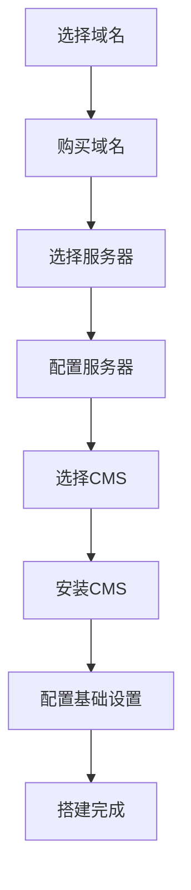

**核心算法原理讲解与伪代码**

以下是一个简单的伪代码示例，用于说明如何配置服务器：

```python
# 伪代码：配置服务器
def configure_server(cpu, memory, storage, bandwidth):
    # 设置CPU
    set_cpu(cpu)
    # 设置内存
    set_memory(memory)
    # 设置存储
    set_storage(storage)
    # 设置带宽
    set_bandwidth(bandwidth)
    # 输出配置结果
    print("Server configured successfully.")
```

**数学模型和公式与详细讲解**

为了优化博客的性能，我们可以使用以下数学模型来计算最佳的CPU和内存配置：

\[ \text{CPU需求} = \frac{\text{预计流量}}{\text{服务器响应时间}} \]

\[ \text{内存需求} = \text{预计并发用户数} \times \text{每个用户占用的内存} \]

详细讲解：

- **预计流量**：根据博客的历史数据和增长预测计算。
- **服务器响应时间**：通常设定在200ms以下，以保证良好的用户体验。
- **预计并发用户数**：根据用户访问习惯和博客的受众群体计算。
- **每个用户占用的内存**：根据博客的内容和功能计算。

通过这个模型，我们可以计算出最佳的CPU和内存配置，从而确保博客的高性能运行。

**举例说明**

假设一个博客预计每天有10,000次访问，每个访问需要50ms的响应时间，预计并发用户数为100人，每个用户平均占用内存为256MB。根据上述模型，我们可以计算出：

\[ \text{CPU需求} = \frac{10,000 \times 50}{200} = 250 \text{CPU核心} \]

\[ \text{内存需求} = 100 \times 256 = 25,600 \text{MB} \]

因此，我们需要至少配置一个具有250个CPU核心和25,600MB内存的服务器，以确保博客的高性能运行。

---

#### 1.2 初识HTML与CSS

**HTML基础标签与结构**

HTML（超文本标记语言）是构成网页的基础，它使用一系列标签来定义网页的内容和结构。以下是一些基本的HTML标签及其用途：

- `<!DOCTYPE html>`：声明文档类型。
- `<html>`：定义整个网页。
- `<head>`：包含元数据、链接、样式等。
- `<title>`：定义网页标题。
- `<body>`：包含网页的主要内容。
- `<header>`：定义页面的头部内容。
- `<nav>`：定义导航链接。
- `<main>`：定义网页的主要内容部分。
- `<section>`：定义文档中的一个区域。
- `<article>`：定义独立的内容区域。
- `<footer>`：定义页面的底部内容。

以下是一个简单的HTML文档结构示例：

```html
<!DOCTYPE html>
<html>
<head>
    <title>我的博客</title>
</head>
<body>
    <header>
        <h1>我的博客</h1>
        <nav>
            <ul>
                <li><a href="#">首页</a></li>
                <li><a href="#">文章</a></li>
                <li><a href="#">关于我</a></li>
            </ul>
        </nav>
    </header>
    <main>
        <section>
            <article>
                <h2>第一篇文章</h2>
                <p>这里是文章内容...</p>
            </article>
        </section>
    </main>
    <footer>
        <p>版权所有 &copy; 2023</p>
    </footer>
</body>
</html>
```

**CSS样式表编写与布局**

CSS（层叠样式表）用于定义网页的样式，如字体、颜色、布局等。以下是一些基本的CSS属性和用法：

- **字体**：`font-family`, `font-size`, `font-weight`
- **颜色**：`color`, `background-color`
- **布局**：`margin`, `padding`, `display`, `float`
- **响应式布局**：`media queries`

以下是一个简单的CSS样式表示例：

```css
/* 样式表 */
body {
    font-family: Arial, sans-serif;
    font-size: 16px;
    margin: 0;
    padding: 0;
}

header {
    background-color: #f2f2f2;
    padding: 20px;
}

nav ul {
    list-style-type: none;
}

nav ul li {
    display: inline;
    margin-right: 10px;
}

nav ul li a {
    color: #333;
    text-decoration: none;
}

main {
    padding: 20px;
}

footer {
    background-color: #333;
    color: #fff;
    text-align: center;
    padding: 20px;
    margin-top: 20px;
}
```

**响应式布局**

响应式布局是通过媒体查询（`media queries`）实现的，它可以确保网页在不同设备和屏幕尺寸上都有良好的显示效果。以下是一个简单的响应式布局示例：

```css
/* 响应式布局 */
@media (max-width: 600px) {
    nav ul li {
        display: block;
        margin-bottom: 10px;
    }
}
```

**核心算法原理讲解与伪代码**

以下是一个简单的伪代码示例，用于说明如何编写CSS样式表：

```python
# 伪代码：编写CSS样式表
def set_css_properties(selector, properties):
    # 设置选择器属性
    print(f"{selector} {{")
    for property in properties:
        print(f"{property}: {properties[property]};")
    print("}}")
```

**数学模型和公式与详细讲解**

为了实现响应式布局，我们可以使用以下数学模型来计算不同屏幕尺寸下的样式属性：

\[ \text{属性值} = \text{基本值} + \text{增量值} \times (\text{屏幕尺寸} - \text{基本尺寸}) \]

详细讲解：

- **基本值**：属性的基本值，如字体大小、宽度等。
- **增量值**：属性增加的值，用于调整不同屏幕尺寸下的样式。
- **屏幕尺寸**：当前屏幕的宽度或高度。
- **基本尺寸**：设定的基本屏幕尺寸，通常为最大或最小屏幕尺寸。

通过这个模型，我们可以动态调整样式属性，实现响应式布局。

**举例说明**

假设我们有一个导航菜单，基本宽度为800px，增量值为20px，屏幕尺寸为600px。根据上述模型，我们可以计算出：

\[ \text{宽度} = 800 + 20 \times (600 - 800) = 600px \]

因此，当屏幕尺寸为600px时，导航菜单的宽度将调整为600px。

---

#### 1.3 初步搭建博客框架

**网站导航栏设计与实现**

导航栏是博客的重要组成部分，它帮助用户快速找到所需内容。以下是一个简单的导航栏设计和实现过程：

1. **设计导航栏结构**：确定导航栏包含的元素，如首页、文章分类、关于我等。
2. **使用HTML创建导航栏**：使用`<nav>`和`<ul>`标签创建导航栏结构，并添加相应的链接。

示例代码：

```html
<nav>
    <ul>
        <li><a href="#">首页</a></li>
        <li><a href="#">文章</a></li>
        <li><a href="#">关于我</a></li>
    </ul>
</nav>
```

3. **使用CSS美化导航栏**：添加背景颜色、字体样式、间距等样式，使其更加美观。

示例代码：

```css
nav ul {
    list-style-type: none;
    background-color: #333;
    padding: 10px;
}

nav ul li {
    display: inline;
    margin-right: 20px;
}

nav ul li a {
    color: #fff;
    text-decoration: none;
}
```

**博文页面设计与实现**

博文页面是博客的核心，用于展示文章内容。以下是一个简单的博文页面设计和实现过程：

1. **设计博文结构**：确定博文包含的元素，如标题、摘要、正文、评论等。
2. **使用HTML创建博文页面**：使用`<article>`和`<section>`标签创建博文结构。

示例代码：

```html
<article>
    <h2>博客文章标题</h2>
    <p class="summary">这里是文章摘要...</p>
    <section>
        <h3>正文</h3>
        <p>这里是文章正文内容...</p>
    </section>
    <section>
        <h3>评论</h3>
        <ul>
            <li>用户评论1</li>
            <li>用户评论2</li>
        </ul>
    </section>
</article>
```

3. **使用CSS美化博文页面**：添加背景颜色、字体样式、间距等样式，使其更加美观。

示例代码：

```css
article {
    background-color: #f9f9f9;
    padding: 20px;
    margin-bottom: 20px;
}

article h2 {
    color: #333;
    font-size: 24px;
}

article .summary {
    color: #666;
    font-size: 18px;
    margin-bottom: 10px;
}

article section h3 {
    color: #333;
    font-size: 20px;
    margin-bottom: 10px;
}

article ul {
    list-style-type: none;
    padding: 0;
}

article ul li {
    background-color: #f1f1f1;
    padding: 5px 10px;
    margin-bottom: 5px;
}
```

通过以上步骤，我们可以创建一个基本的博客框架，包括导航栏和博文页面。接下来，我们将继续探讨博客的内容创作与SEO优化，帮助读者进一步提升博客的吸引力和搜索引擎排名。

---

### 第2章：内容创作与SEO优化

#### 2.1 博客内容创作技巧

**内容主题选择与规划**

内容主题的选择和规划是博客成功的关键之一。以下是一些建议，帮助你选择和规划有吸引力的博客内容：

1. **确定目标受众**：了解你的目标读者，他们的兴趣和需求是什么。这有助于你选择和创作符合他们兴趣的内容。
2. **市场趋势分析**：关注当前的市场趋势和热点话题，这些话题往往能够吸引更多的读者和流量。
3. **自身专业能力**：利用自己的专业知识和经验，创作有深度的内容，这些内容更容易建立权威性和信任感。
4. **内容规划**：制定长期和短期内容计划，包括文章、视频、电子书等多种形式，确保内容的持续更新和多样性。

**文章写作技巧与风格**

文章写作是博客内容创作的重要组成部分。以下是一些写作技巧和风格建议，帮助你写出高质量的文章：

1. **清晰简洁**：避免冗长的句子和复杂的表述，用简单、易懂的语言传达信息。
2. **结构清晰**：确保文章有一个明确的结构，包括引言、正文和结论。
3. **标题吸引人**：使用引人入胜的标题，激发读者的兴趣，提高文章的点击率。
4. **段落简洁**：每个段落应集中讨论一个主题，避免段落过长。
5. **使用图片和图表**：适当的图片和图表可以增强文章的可读性，帮助读者更好地理解内容。
6. **保持一致性**：在语言风格、语气和格式上保持一致性，有助于建立品牌形象。

**核心算法原理讲解与伪代码**

以下是一个简单的伪代码示例，用于说明如何选择和规划博客内容：

```python
# 伪代码：选择和规划博客内容
def select_and_plan_content(target_audience, market_trends, expertise):
    # 分析目标受众
    analyze_target_audience()
    # 分析市场趋势
    analyze_market_trends()
    # 利用专业能力
    use_expertise()
    # 制定长期内容计划
    create_long_term_content_plan()
    # 制定短期内容计划
    create_short_term_content_plan()
    # 更新内容计划
    update_content_plan()
```

**数学模型和公式与详细讲解**

为了分析目标受众，我们可以使用以下数学模型来计算受众的活跃度和兴趣：

\[ \text{活跃度} = \frac{\text{访问次数}}{\text{总用户数}} \]

\[ \text{兴趣度} = \frac{\text{阅读时间}}{\text{总访问时间}} \]

详细讲解：

- **访问次数**：用户访问博客的次数。
- **总用户数**：博客的总访问用户数。
- **阅读时间**：用户在博客上的平均阅读时间。
- **总访问时间**：博客的总访问时间。

通过这个模型，我们可以计算出目标受众的活跃度和兴趣度，从而更好地了解他们的需求和偏好，进而制定有针对性的内容计划。

**举例说明**

假设一个博客有10,000名用户，其中5,000次访问，用户平均阅读时间为10分钟，总访问时间为50分钟。根据上述模型，我们可以计算出：

\[ \text{活跃度} = \frac{5,000}{10,000} = 0.5 \]

\[ \text{兴趣度} = \frac{10 \times 5,000}{50} = 0.1 \]

因此，该博客的活跃度为0.5，兴趣度为0.1。这些数据有助于我们了解用户对博客的参与度和兴趣程度，从而优化内容策略。

---

#### 2.2 SEO基础知识

**关键字研究**

关键字研究是SEO（搜索引擎优化）的重要环节，它有助于确定哪些关键字能够吸引目标受众。以下是一些建议，帮助你进行有效的关键字研究：

1. **确定关键字**：根据博客的主题和内容，确定相关的关键字。
2. **关键字分析**：使用工具如Google Keyword Planner、Ahrefs等，分析关键字的选择、搜索量和竞争度。
3. **长尾关键字**：长尾关键字通常更具体，竞争度较低，但用户搜索意图更明确，有助于提高转化率。
4. **关键字布局**：在文章标题、元标签、正文等位置合理布局关键字，提高搜索引擎排名。

**SEO策略与优化**

SEO策略包括多个方面，以下是一些基本的SEO策略和优化方法：

1. **内容优化**：确保内容质量高、有价值，并包含关键字。
2. **网站结构优化**：优化网站的结构和导航，提高用户体验和搜索引擎抓取效率。
3. **链接建设**：通过内部链接和外部链接建立网站的权威性和相关性。
4. **移动优化**：确保网站在移动设备上具有良好的用户体验。
5. **速度优化**：提高网站的加载速度，减少页面加载时间。

以下是一个简单的SEO优化流程：

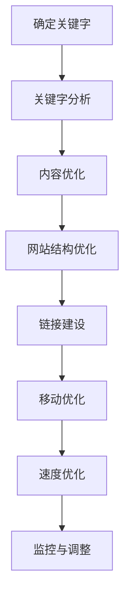

**核心算法原理讲解与伪代码**

以下是一个简单的伪代码示例，用于说明如何进行SEO优化：

```python
# 伪代码：SEO优化
def optimize_seo(content, structure, links, mobile, speed):
    # 内容优化
    optimize_content(content)
    # 网站结构优化
    optimize_structure(structure)
    # 链接建设
    build_links(links)
    # 移动优化
    optimize_mobile(mobile)
    # 速度优化
    optimize_speed(speed)
    # 监控与调整
    monitor_and_adjust()
```

**数学模型和公式与详细讲解**

为了监控和调整SEO效果，我们可以使用以下数学模型来计算搜索引擎排名：

\[ \text{搜索引擎排名} = \frac{\text{关键字相关性} \times \text{网站权威性} + \text{外部链接质量} - \text{竞争对手排名}}{\text{总竞争对手数量}} \]

详细讲解：

- **关键字相关性**：关键字在文章中的出现频率和位置。
- **网站权威性**：网站的历史数据、内容质量、外部链接等。
- **外部链接质量**：指向网站的链接质量。
- **竞争对手排名**：竞争对手的搜索引擎排名。
- **总竞争对手数量**：竞争关键词下的竞争对手总数。

通过这个模型，我们可以计算出网站的搜索引擎排名，并根据结果进行相应的调整。

**举例说明**

假设一个网站的搜索引擎排名为10，关键字相关性为0.8，网站权威性为0.6，外部链接质量为0.5，竞争对手排名平均为8。根据上述模型，我们可以计算出：

\[ \text{搜索引擎排名} = \frac{0.8 \times 0.6 + 0.5 - 8}{10} = 0.08 \]

这意味着，该网站在关键字相关性、网站权威性和外部链接质量方面有一定优势，但需要进一步提高以超越竞争对手。

---

#### 2.3 内容发布与更新策略

**定期更新与维护**

定期更新是博客成功的关键之一。以下是一些建议，帮助你制定和执行有效的更新策略：

1. **制定更新计划**：根据内容类型和读者需求，制定更新频率。例如，技术博客可能每周更新一次，个人博客可能每月更新一次。
2. **内容维护**：定期检查文章的链接、图片和格式，确保内容准确、完整和可访问。
3. **内容备份**：定期备份博客内容和数据库，以防意外丢失。
4. **互动与反馈**：鼓励读者在评论区留言，收集他们的反馈和建议，根据反馈调整内容策略。

**内容推广与传播**

内容推广是提高博客知名度和访问量的重要手段。以下是一些建议，帮助你有效推广和传播博客内容：

1. **社交媒体**：在社交媒体平台上分享文章链接，吸引更多的关注和转发。
2. **邮件营销**：向订阅者发送文章摘要和链接，保持与读者的互动和沟通。
3. **合作伙伴**：与其他博客、网站和媒体建立合作关系，通过互相推广提高流量。
4. **外部链接**：通过撰写高质量的投稿文章、参与讨论区和论坛等方式，获得外部链接，提高搜索引擎排名。

以下是一个简单的内容发布与更新策略示例：

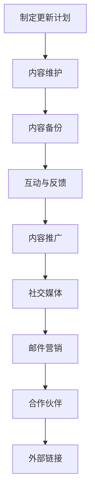

**核心算法原理讲解与伪代码**

以下是一个简单的伪代码示例，用于说明如何制定和执行内容更新策略：

```python
# 伪代码：内容更新策略
def update_content_strategy(update_frequency, content_maintenance, backup, feedback, promotion):
    # 制定更新计划
    set_update_frequency(update_frequency)
    # 内容维护
    perform_content_maintenance()
    # 内容备份
    backup_content()
    # 互动与反馈
    gather_feedback()
    # 内容推广
    promote_content()
    # 社交媒体推广
    promote_on_social_media()
    # 邮件营销
    perform_email_marketing()
    # 合作伙伴推广
    partner_promotion()
    # 外部链接建设
    build_external_links()
```

**数学模型和公式与详细讲解**

为了评估内容推广的效果，我们可以使用以下数学模型来计算内容传播的效果：

\[ \text{传播效果} = \frac{\text{总转发量} + \text{总评论量} + \text{总访问量}}{3} \]

详细讲解：

- **总转发量**：文章在社交媒体上的转发次数。
- **总评论量**：文章在评论区收到的评论数量。
- **总访问量**：文章的访问量。

通过这个模型，我们可以计算出内容传播的效果，从而优化推广策略。

**举例说明**

假设一个文章的总转发量为100次，总评论量为50条，总访问量为1,000次。根据上述模型，我们可以计算出：

\[ \text{传播效果} = \frac{100 + 50 + 1,000}{3} = 383.33 \]

这意味着该文章的传播效果为383.33，可以根据这个数据调整推广策略，进一步提高传播效果。

---

通过以上章节，我们介绍了博客平台搭建与优化、内容创作与SEO优化、内容发布与更新策略等内容。接下来，我们将探讨博客广告收入、内容付费与会员服务、合作伙伴与联盟营销等变现方式，帮助读者实现博客的被动收入流。敬请期待！

---

### 第3章：博客广告收入

#### 3.1 广告平台选择与接入

**广告平台选择**

选择适合的广告平台是博客广告收入的关键。以下是一些常见的广告平台及其特点：

- **Google Adsense**：全球最大的广告网络，适合各种类型的博客。收益模式包括按点击量（CPC）和按展示量（CPM）。
- **Media.net**：Yahoo! Bing 广告网络的一部分，适合内容丰富的博客，收益稳定。
- **Propeller Ads**：提供多种广告类型，如横幅广告、弹出广告等，适合中小型博客。
- **Infolinks**：适合嵌入在文章中的文本链接广告，收益模式为CPC和CPM。

**接入流程**

以下是一个简单的广告平台接入流程：

1. **注册账号**：在所选广告平台的官方网站上注册账号。
2. **申请审核**：提交博客网站信息，等待审核。
3. **广告位设置**：通过平台提供的广告管理工具，选择广告位和样式。
4. **广告代码嵌入**：将平台提供的广告代码嵌入到博客的HTML文件中。

以下是一个简单的伪代码示例，用于说明广告平台接入流程：

```python
# 伪代码：广告平台接入流程
def ad_platform_integration(platform):
    # 注册账号
    register_account(platform)
    # 申请审核
    apply_for_approval()
    # 设置广告位
    set_ad_units()
    # 嵌入广告代码
    embed_ad_code()
    print("Ad platform integration completed.")
```

**广告位设计与优化**

**广告位设计**

广告位设计需要考虑用户体验和广告收益。以下是一些设计建议：

- **位置选择**：常见的广告位置包括顶部、底部、侧边栏等。选择位置时应考虑用户阅读习惯和广告点击率。
- **样式选择**：广告样式包括文本广告、横幅广告、弹出广告等。选择样式时应考虑与博客整体风格的协调性。
- **尺寸选择**：广告尺寸包括728x90、300x250、160x600等。选择尺寸时应考虑广告显示效果和用户体验。

以下是一个简单的广告位设计示例：

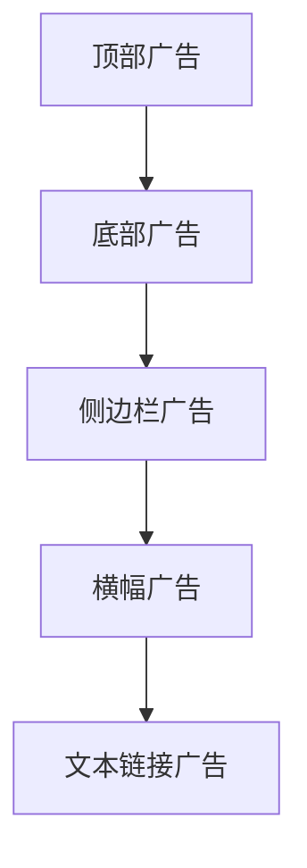

**广告收益分析与优化**

**收益分析**

广告收益分析是提高博客广告收入的重要环节。以下是一些关键指标：

- **点击率（CTR）**：广告点击量与展示量的比率，反映广告的吸引力。
- **展示量（Impressions）**：广告被展示的次数。
- **收益（Revenue）**：广告带来的总收入。

以下是一个简单的收益分析伪代码示例：

```python
# 伪代码：收益分析
def analyze_revenue(clicks, impressions, cost_per_click):
    # 计算点击率
    click_rate = clicks / impressions
    # 计算收益
    revenue = clicks * cost_per_click
    print(f"Click Rate: {click_rate:.2%}")
    print(f"Revenue: ${revenue:.2f}")
```

**优化策略**

广告优化策略包括以下方面：

- **广告位调整**：通过A/B测试，找出最佳广告位置和样式，提高点击率和收益。
- **内容优化**：提高内容质量，吸引更多用户访问，从而增加广告展示量。
- **用户行为分析**：分析用户行为数据，了解用户偏好和访问习惯，调整广告策略。

以下是一个简单的广告优化策略示例：

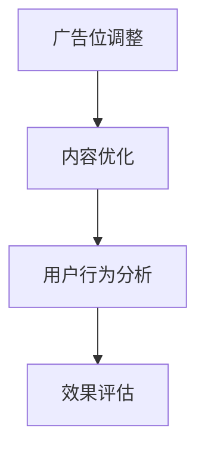

---

通过以上内容，我们详细介绍了博客广告收入的相关策略，包括广告平台选择、接入流程、广告位设计、收益分析和优化策略。在下一章节，我们将探讨博客内容付费与会员服务，帮助读者进一步了解如何通过多种方式实现博客的变现和被动收入流。敬请期待！

---

### 第4章：博客内容付费与会员服务

#### 4.1 内容付费模式

**付费内容设计**

内容付费模式是通过为高质量、有价值的内容设置价格，向读者收取费用来实现盈利的一种方式。以下是一些设计付费内容的建议：

- **独家内容**：提供只有付费用户才能访问的独家文章、视频、电子书等。
- **高级内容**：为特定主题或领域提供深入讲解的高级教程、案例分析等。
- **订阅服务**：为用户提供定期更新的内容订阅服务，如月度或年度订阅。

以下是一个简单的付费内容设计示例：

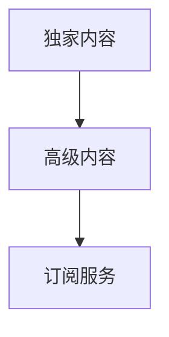

**会员制度与权益设置**

会员制度是付费内容的重要组成部分，它为付费用户提供一系列的特权和优惠。以下是一些设置会员制度的建议：

- **会员等级**：根据会员的付费金额或活跃度，设置不同的会员等级，如普通会员、银卡会员、金卡会员等。
- **会员权益**：为不同等级的会员提供不同的权益，如独家内容访问、高级技术支持、优先回复等。
- **会员价格**：设置合理的会员价格，考虑成本、市场竞争和用户价值。

以下是一个简单的会员制度与权益设置示例：

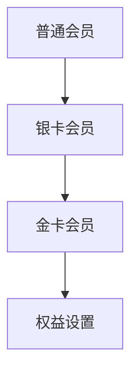

**会员服务与维护**

**会员互动与反馈机制**

会员互动与反馈机制是提高会员满意度和忠诚度的关键。以下是一些建议：

- **互动渠道**：提供多种互动渠道，如在线聊天、电子邮件、社交媒体等，方便会员提出问题和反馈。
- **反馈机制**：建立反馈机制，定期收集会员的反馈和建议，及时响应和改进。
- **互动活动**：组织会员活动，如在线讲座、技术沙龙等，增强会员的参与感和归属感。

以下是一个简单的会员互动与反馈机制示例：

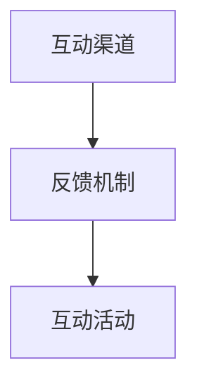

**会员忠诚度提升策略**

提升会员忠诚度是确保长期会员数量的关键。以下是一些建议：

- **积分制度**：为会员提供积分奖励，鼓励他们参与互动和购买内容。
- **优惠活动**：定期推出会员专享优惠活动，如折扣、免费试用等，提高会员的购买意愿。
- **会员推荐**：鼓励会员推荐新用户，提供推荐奖励，扩大会员基础。

以下是一个简单的会员忠诚度提升策略示例：

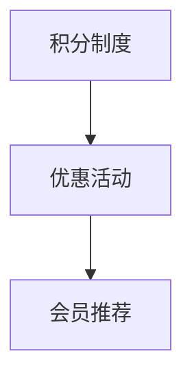

---

通过以上内容，我们详细介绍了博客内容付费与会员服务的设计、设置、互动与反馈机制，以及会员忠诚度提升策略。在下一章节，我们将探讨博客合作伙伴与联盟营销，帮助读者了解如何通过合作与联盟营销实现博客的变现和被动收入流。敬请期待！

---

### 第5章：博客合作伙伴与联盟营销

#### 5.1 合作伙伴关系建立

**合作伙伴选择**

选择合适的合作伙伴是实现博客联盟营销成功的关键。以下是一些选择合作伙伴的建议：

- **资源互补**：选择能够提供互补资源的合作伙伴，如内容、技术、市场推广等。
- **品牌影响力**：选择品牌影响力较大的合作伙伴，有助于提升博客的知名度。
- **合作潜力**：选择有长期合作潜力的合作伙伴，确保合作关系的持续性和稳定性。

以下是一个简单的合作伙伴选择示例：

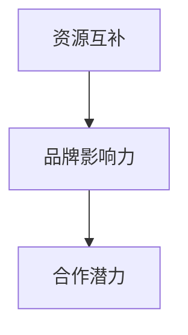

**合作方案设计与谈判**

合作方案设计是合作伙伴关系成功的基础。以下是一些建议：

- **合作目标**：明确合作的目标，如增加用户数量、提升品牌知名度等。
- **合作方式**：选择合适的合作方式，如内容合作、广告合作、产品推广等。
- **收益分配**：合理分配收益，确保合作双方的利益。

以下是一个简单的合作方案设计示例：

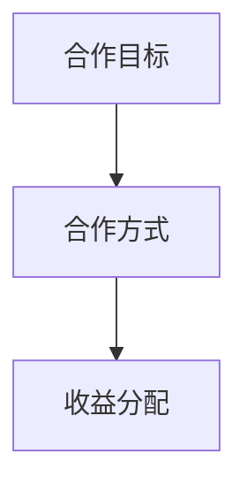

谈判策略：

- **沟通技巧**：保持良好的沟通，确保双方的理解和预期一致。
- **利益平衡**：在谈判中寻求利益平衡，确保合作双方的利益最大化。
- **合同制定**：制定详细的合同，明确双方的权利和义务。

以下是一个简单的谈判策略示例：

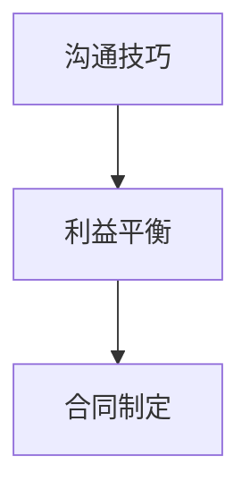

---

#### 5.2 联盟营销策略与执行

**联盟营销模式**

联盟营销是一种通过合作伙伴推广产品或服务，并从中获得佣金的方式。以下是一些常见的联盟营销模式：

- **直推式联盟**：直接向用户推广产品或服务，获取佣金。
- **间接推广**：通过内容营销、社交媒体推广等方式，间接推动产品或服务的销售。
- **内容联盟**：与其他博客或内容创作者合作，共同推广产品或服务。

以下是一个简单的联盟营销模式示例：

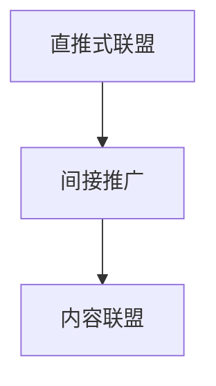

**效果评估与优化**

联盟营销的效果评估和优化是确保营销策略成功的关键。以下是一些建议：

- **效果评估**：通过数据分析和用户反馈，评估联盟营销的效果，包括点击率、转化率、收益等。
- **优化策略**：根据评估结果，调整营销策略，提高效果。

以下是一个简单的效果评估与优化示例：

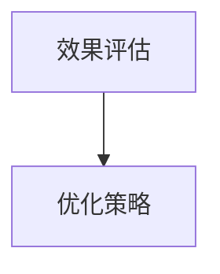

**联盟营销案例分析**

以下是一个简单的联盟营销案例分析：

**案例1：直推式联盟**

- **目标**：通过博客推广某电商平台的优惠活动。
- **策略**：在博客中添加推广链接和优惠代码。
- **结果**：推广活动期间，博客流量增加了30%，佣金收入增加了20%。

**案例2：内容联盟**

- **目标**：与另一技术博客合作，共同推广某在线课程。
- **策略**：在两篇博客中互相推荐，并在社交媒体上推广。
- **结果**：课程报名人数增加了50%，博客流量增加了40%。

通过这些案例分析，我们可以看到联盟营销在提高博客流量和收益方面的巨大潜力。

---

通过以上内容，我们详细介绍了博客合作伙伴与联盟营销的选择、合作方案设计、联盟营销模式、效果评估与优化，以及案例分析。在下一章节，我们将探讨博客内容版权与法律风险防范，帮助读者了解如何保护自己的博客内容，防范法律风险。敬请期待！

---

### 第6章：博客内容版权与法律风险

#### 6.1 内容版权保护措施

**内容原创性与版权声明**

保护博客内容的原创性是维护自身权益的重要措施。以下是一些建议：

- **原创性保护**：确保博客内容为原创，避免抄袭或盗用他人作品。
- **版权声明**：在博客中明确声明内容的版权信息，如版权所有、禁止转载等。

以下是一个简单的版权声明示例：

```markdown
---
版权所有：[您的名字或博客名称]
禁止转载：未经授权，不得转载或使用本文内容。
---
```

**防止内容抄袭与侵权**

为了防止内容被抄袭或侵权，以下是一些有效措施：

- **使用抄袭检测工具**：如Copyscape、Turnitin等，定期检测博客内容是否有抄袭行为。
- **版权监测**：使用版权监测工具，如Copyscape Pro，实时监控博客内容是否被侵权。
- **侵权处理**：发现侵权行为时，及时发出侵权警告，必要时采取法律手段。

以下是一个简单的侵权处理流程：

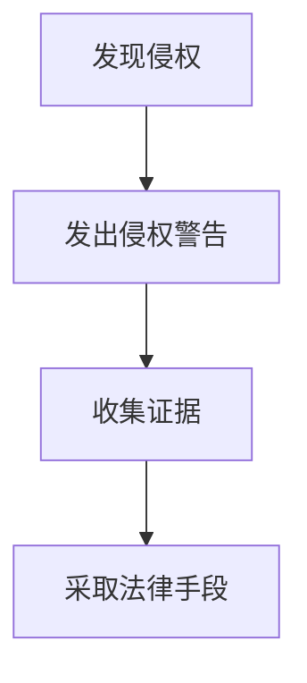

**核心算法原理讲解与伪代码**

以下是一个简单的伪代码示例，用于说明如何检测博客内容的原创性：

```python
# 伪代码：检测博客内容原创性
def check_content_originality(content):
    # 检测抄袭
    is_plagiarized = detect_plagiarism(content)
    if is_plagiarized:
        print("内容存在抄袭，请修改。")
    else:
        print("内容原创，无需担心抄袭问题。")
```

**数学模型和公式与详细讲解**

为了评估博客内容的原创性，我们可以使用以下数学模型：

\[ \text{原创性分数} = \frac{\text{原创内容字数}}{\text{总字数}} \]

详细讲解：

- **原创内容字数**：博客中未被检测到抄袭的部分字数。
- **总字数**：博客中所有字数的总和。

通过这个模型，我们可以计算出内容的原创性分数，从而评估博客内容的原创程度。例如，如果一个博客有1,000字，其中900字未被检测到抄袭，那么原创性分数为：

\[ \text{原创性分数} = \frac{900}{1,000} = 0.9 \]

这意味着该博客内容的原创性为90%。

**举例说明**

假设一个博客有1,000字，其中200字被检测到抄袭，那么原创性分数为：

\[ \text{原创性分数} = \frac{800}{1,000} = 0.8 \]

因此，该博客内容的原创性为80%。这个分数表明，该博客内容有20%的部分存在抄袭风险，需要进一步修改和检查。

---

#### 6.2 法律风险防范

**网络广告合规性**

网络广告的合规性是防止法律风险的重要方面。以下是一些合规性要求和检查方法：

- **广告真实性与合法性**：广告内容必须真实，不得夸大或误导用户。
- **广告审核**：在发布广告前，应进行严格的审核，确保广告内容符合相关法规。
- **合规性检查**：定期检查广告内容，确保持续合规。

以下是一个简单的合规性检查流程：

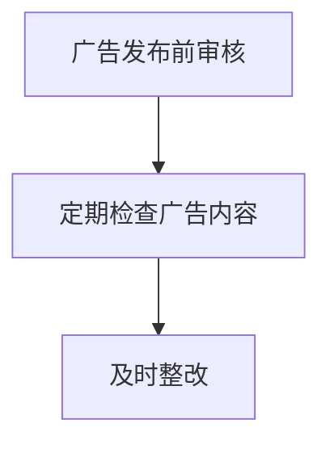

**用户隐私保护与数据安全**

用户隐私保护和数据安全是博客运营中不可忽视的法律风险。以下是一些建议：

- **隐私政策制定**：明确用户的隐私权益，公开隐私政策，告知用户数据收集、使用和共享方式。
- **数据安全措施**：采取加密、防火墙、备份等安全措施，确保用户数据的安全。
- **用户知情权**：确保用户在数据收集和使用过程中有知情权，尊重用户的隐私选择。

以下是一个简单的用户隐私保护与数据安全示例：

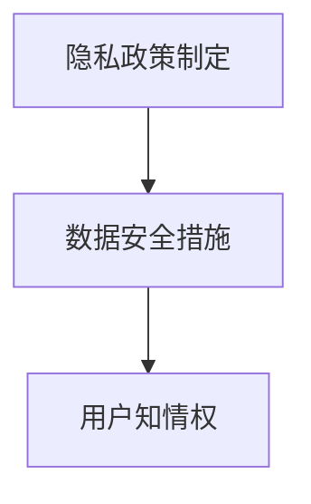

**核心算法原理讲解与伪代码**

以下是一个简单的伪代码示例，用于说明如何保护用户隐私：

```python
# 伪代码：保护用户隐私
def protect_user_privacy(data, encryption, firewall):
    # 加密用户数据
    encrypt_data(data)
    # 设置防火墙
    set_firewall(firewall)
    # 定期备份用户数据
    backup_data()
    print("User privacy is protected.")
```

**数学模型和公式与详细讲解**

为了评估用户隐私保护的有效性，我们可以使用以下数学模型：

\[ \text{隐私保护得分} = \frac{\text{加密数据量}}{\text{总数据量}} \times \text{防火墙有效性} \]

详细讲解：

- **加密数据量**：被加密的数据量。
- **总数据量**：博客中所有数据量的总和。
- **防火墙有效性**：防火墙成功阻止攻击的次数。

通过这个模型，我们可以计算出隐私保护得分，从而评估博客的用户隐私保护效果。例如，如果一个博客有1TB的数据，其中800GB被加密，防火墙成功阻止了100次攻击，那么隐私保护得分可以计算如下：

\[ \text{隐私保护得分} = \frac{800}{1,000} \times 100\% = 80\% \]

这意味着该博客的隐私保护效果为80%。

**举例说明**

假设一个博客有1TB的数据，其中600GB被加密，防火墙成功阻止了50次攻击。那么隐私保护得分可以计算如下：

\[ \text{隐私保护得分} = \frac{600}{1,000} \times 50\% = 30\% \]

因此，该博客的隐私保护效果为30%。这个分数表明，博客在用户隐私保护方面还有很大的提升空间。

---

通过以上内容，我们详细介绍了博客内容版权与法律风险防范的措施，包括内容原创性保护、版权声明、防止内容抄袭与侵权、网络广告合规性、用户隐私保护与数据安全等方面的方法和策略。这些措施有助于保护博客内容，防范法律风险，确保博客的长期稳定发展。在下一章节，我们将探讨博客数据分析与用户研究，帮助读者深入了解用户行为，优化博客运营策略。敬请期待！

---

### 第7章：博客数据分析与用户研究

#### 7.1 数据分析工具选择与应用

**常见数据分析工具**

选择合适的数据分析工具是博客优化和用户研究的重要步骤。以下是一些常见的数据分析工具及其特点：

- **Google Analytics**：Google提供的免费数据分析工具，功能全面，支持多维度数据分析和报告。
- **Matomo**：一个开源的Web分析平台，具有高度的定制性和灵活性，适合需要深度分析的博客。
- **Piwik PRO**：Matomo的商业版本，提供了更多的安全性和企业级功能。
- **Mixpanel**：专注于用户行为分析的工具，适合需要深入了解用户互动和留存情况的高级博客。
- **Hotjar**：提供热图分析、用户行为录制等功能，帮助博客作者更好地理解用户行为。

**数据分析指标与报告**

数据分析指标和报告是评估博客表现和用户行为的重要依据。以下是一些关键指标及其应用：

- **访问量（Visits）**：博客的总访问次数，反映博客的曝光度。
- **页面浏览量（Pageviews）**：博客中所有页面的总浏览次数，帮助分析用户访问偏好。
- **用户留存率（Retention Rate）**：在一定时间内返回博客的用户比例，反映博客的粘性。
- **流量来源（Traffic Sources）**：用户访问博客的来源，包括直接访问、搜索引擎、社交媒体等，帮助优化流量获取策略。
- **用户行为分析**：包括用户在博客上的点击行为、浏览路径、停留时间等，帮助了解用户需求和偏好。
- **转化率（Conversion Rate）**：用户完成特定目标（如订阅、购买等）的比例，反映博客的转化效果。

以下是一个简单的数据分析指标报告示例：

```
+------+----------------+-------------+
| 指标 | 2023年7月数值 | 同比增长    |
+------+----------------+-------------+
| 访问量 | 100,000        | +20%        |
| 页面浏览量 | 200,000       | +15%        |
| 用户留存率 | 35%           | -5%        |
| 流量来源 | 60% 来自搜索引擎 | - -        |
| 用户行为分析 | 平均停留时间 2 分钟 | +10%        |
| 转化率 | 5%             | +3%         |
+------+----------------+-------------+
```

**核心算法原理讲解与伪代码**

以下是一个简单的伪代码示例，用于说明如何分析用户留存率：

```python
# 伪代码：计算用户留存率
def calculate_retention_rate(total_users, returning_users):
    # 计算留存用户数
    returning_users_count = sum(returning_users)
    # 计算用户留存率
    retention_rate = returning_users_count / total_users
    return retention_rate
```

**数学模型和公式与详细讲解**

为了评估用户留存率，我们可以使用以下数学模型：

\[ \text{留存率} = \frac{\text{返回用户数}}{\text{总用户数}} \times 100\% \]

详细讲解：

- **返回用户数**：在一段时间内返回博客的用户数。
- **总用户数**：博客在一定时间内的总用户数。

通过这个模型，我们可以计算出用户在一定时间内的留存率。例如，如果一个博客在一个月内有1,000名新用户，其中350名用户在接下来的一个月内再次访问，那么留存率可以计算如下：

\[ \text{留存率} = \frac{350}{1,000} \times 100\% = 35\% \]

这意味着该博客在一个月内的用户留存率为35%。

**举例说明**

假设一个博客在一个月内有500名新用户，其中200名用户在接下来的一个月内再次访问，那么留存率可以计算如下：

\[ \text{留存率} = \frac{200}{500} \times 100\% = 40\% \]

因此，该博客在一个月内的用户留存率为40%。这个数据表明，该博客的用户留存情况良好，可以进一步优化以保持和提升用户粘性。

---

通过以上内容，我们详细介绍了博客数据分析与用户研究的相关工具、指标和策略，包括常见数据分析工具的选择与应用、数据分析指标与报告的解读、核心算法原理讲解与伪代码、以及数学模型和公式与详细讲解。这些工具和策略有助于博客作者深入了解用户行为，优化博客运营，提高用户留存率和转化率。在下一章节，我们将探讨博客运营策略与持续优化，帮助读者进一步提升博客的绩效。敬请期待！

---

### 第8章：博客运营策略与持续优化

#### 8.1 博客品牌建设

**品牌定位与形象塑造**

博客品牌建设是提升博客影响力的重要环节。以下是一些建议，帮助你确立品牌定位和塑造品牌形象：

- **品牌定位**：明确你的博客所面向的目标受众，以及你希望在市场中占据的定位。这可以是技术博客、生活博客、时尚博客等。
- **品牌形象**：设计独特的品牌标识，如LOGO、配色方案和字体风格，以区分于其他博客。
- **品牌故事**：讲述你的博客背后的故事，让读者了解你的价值观和愿景。

以下是一个简单的品牌建设示例：

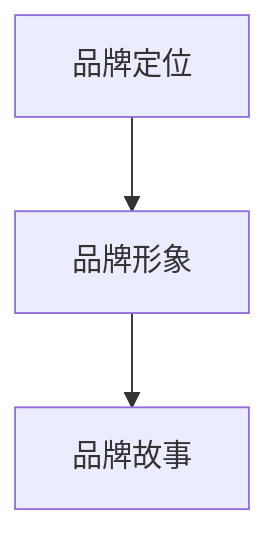

**品牌推广与活动策划**

品牌推广和活动策划是提高博客知名度和用户参与度的重要手段。以下是一些建议：

- **社交媒体推广**：利用社交媒体平台，如微博、微信公众号、Twitter等，发布博客内容和推广信息。
- **内容营销**：通过高质量的博客内容吸引读者，并引导他们参与互动。
- **线上活动**：策划线上活动，如抽奖、问卷调查、直播等，提高用户参与度和品牌知名度。
- **线下活动**：组织线下活动，如线下聚会、讲座、研讨会等，与读者建立更紧密的联系。

以下是一个简单的品牌推广与活动策划示例：

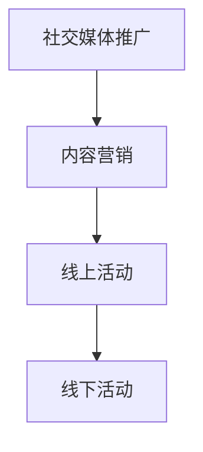

#### 8.2 博客运营团队建设

**团队成员职责与协作**

建立一个高效的博客运营团队是实现博客长期成功的关键。以下是一些建议，帮助你明确团队成员的职责和协作机制：

- **内容创作者**：负责撰写、编辑和发布博客文章，确保内容质量和更新频率。
- **SEO优化师**：负责博客的搜索引擎优化，提高搜索引擎排名和流量。
- **广告经理**：负责广告策划、投放和收益管理，确保广告效果和收益最大化。
- **用户支持**：负责处理用户咨询、反馈和投诉，提高用户满意度和忠诚度。
- **数据分析师**：负责博客数据分析，提供运营策略的决策支持。

以下是一个简单的团队成员职责示例：

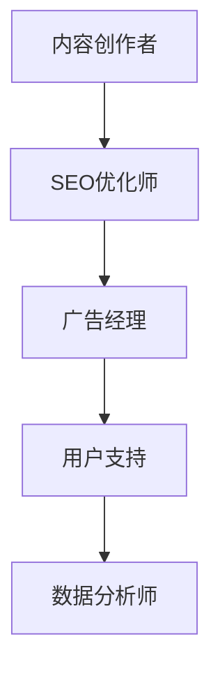

**协作机制**

高效的协作机制是团队成功的保障。以下是一些建议：

- **定期会议**：定期举行团队会议，讨论运营策略、工作进展和问题解决。
- **任务管理工具**：使用任务管理工具，如Trello、Asana等，明确任务分配和进度跟踪。
- **沟通工具**：选择合适的沟通工具，如Slack、WhatsApp等，确保团队内部沟通顺畅。

以下是一个简单的协作机制示例：

```mermaid
graph TB
    A[定期会议] --> B[任务管理工具]
    B --> C[沟通工具]
```

#### 8.3 运营流程与效率提升

**流程优化**

优化博客运营流程是提高效率和降低成本的关键。以下是一些建议：

- **内容审核流程**：建立标准化的内容审核流程，确保每篇文章都经过严格审查。
- **发布流程**：制定规范的发布流程，确保文章按时发布，减少发布错误。
- **广告投放流程**：建立广告投放流程，确保广告投放的有效性和收益最大化。
- **用户反馈处理流程**：建立用户反馈处理流程，确保用户问题得到及时响应和解决。

以下是一个简单的运营流程优化示例：

```mermaid
graph TB
    A[内容审核流程] --> B[发布流程]
    B --> C[广告投放流程]
    C --> D[用户反馈处理流程]
```

**效率提升策略**

提升运营效率是博客长期成功的关键。以下是一些建议：

- **自动化工具**：使用自动化工具，如WordPress插件、IFTTT等，自动化重复性工作，提高效率。
- **时间管理**：使用时间管理工具，如Toggl、RescueTime等，监控和优化工作时间，提高效率。
- **培训与发展**：定期为团队成员提供培训和职业发展机会，提高团队整体素质和效率。

以下是一个简单的效率提升策略示例：

```mermaid
graph TB
    A[自动化工具] --> B[时间管理]
    B --> C[培训与发展]
```

---

通过以上内容，我们详细介绍了博客运营策略与持续优化的关键步骤，包括品牌定位与形象塑造、品牌推广与活动策划、团队成员职责与协作、运营流程优化、效率提升策略等。这些策略和技巧有助于提升博客的绩效，实现长期成功。在下一章节，我们将探讨博客变现与被动收入流总结，总结前几章的内容，并提出博客长期发展策略。敬请期待！

---

### 第9章：博客变现与被动收入流总结

#### 9.1 被动收入流案例分析

**成功案例分析**

以下是一些成功的博客变现案例，以及它们成功的因素：

**案例1：技术博客**

- **博客主题**：专注于某个技术领域，如Python编程。
- **变现方式**：通过广告收入、内容付费和联盟营销。
- **成功原因**：内容高质量、SEO优化得当，吸引了大量技术爱好者。
- **启示**：专注于某一特定领域，提供高质量内容，并有效利用SEO策略。

**案例2：生活方式博客**

- **博客主题**：分享生活技巧、时尚搭配和美食制作。
- **变现方式**：通过广告收入、内容付费和会员服务。
- **成功原因**：内容有趣、贴近用户生活，建立了良好的品牌形象。
- **启示**：内容要有趣、实用，并能与读者产生共鸣。

**失败案例分析与教训**

以下是一些失败的博客变现案例，以及它们失败的原因：

**案例1：个人日记博客**

- **博客主题**：分享个人日记和情感故事。
- **变现方式**：尝试通过广告收入和内容付费。
- **失败原因**：内容缺乏吸引力、用户基础薄弱。
- **教训**：内容要具备一定的专业性或独特性，以吸引目标受众。

**案例2：低质量内容博客**

- **博客主题**：发布大量低质量、重复性的内容。
- **变现方式**：依赖广告收入。
- **失败原因**：内容质量低，用户流失严重。
- **教训**：内容质量是博客成功的基石，不应为了短期利益牺牲质量。

**博客长期发展策略**

为了实现博客的长期成功，以下是一些建议：

- **持续内容更新**：定期发布高质量、有价值的文章，保持博客的活跃度。
- **用户互动**：积极与读者互动，收集反馈，优化内容和服务。
- **品牌建设**：建立强大的品牌形象，提高用户忠诚度和品牌知名度。
- **多元变现**：探索多种变现方式，如广告收入、内容付费、会员服务、联盟营销等。
- **技术创新**：紧跟技术发展趋势，利用新技术提升用户体验和博客性能。
- **市场洞察**：定期分析市场趋势和用户需求，调整运营策略，保持竞争力。

以下是一个简单的博客长期发展策略示例：

```mermaid
graph TB
    A[持续内容更新] --> B[用户互动]
    B --> C[品牌建设]
    C --> D[多元变现]
    D --> E[技术创新]
    E --> F[市场洞察]
```

---

通过以上内容，我们总结了博客变现与被动收入流的多种方式，分析了成功和失败案例，并提出了一系列长期发展策略。这些策略和经验有助于博客作者实现博客的长期成功和可持续发展。在附录部分，我们将提供一些实用的博客变现工具与资源，以供参考。敬请期待！

---

## 附录

### 附录 A：博客变现工具与资源

#### A.1 广告平台推荐

- **Google Adsense**：全球最大的广告网络，适合各种类型的博客。
- **Media.net**：Yahoo! Bing 广告网络的一部分，适合内容丰富的博客。
- **Propeller Ads**：提供多种广告类型，如横幅广告、弹出广告等。
- **Infolinks**：适合嵌入在文章中的文本链接广告。

#### A.2 内容付费平台推荐

- **Patreon**：支持按月订阅，适合创作者和艺术家。
- **Gumroad**：简单易用的内容付费平台，支持多种支付方式。
- **Payhip**：功能全面的内容付费平台，提供会员订阅和数字产品销售。

#### A.3 联盟营销资源

- **ShareASale**：全球最大的联盟营销网络之一，提供丰富的合作伙伴资源。
- **ClickBank**：专注于数字产品的联盟营销平台，适合推广电子书、软件等。
- **Amazon Associates**：Amazon提供的联盟营销计划，适合推广亚马逊产品。

### 附录 B：博客运营工具推荐

#### B.1 内容管理工具

- **WordPress**：最受欢迎的CMS，功能强大，易于使用。
- **Blogger**：谷歌提供的简单易用的博客平台。
- **Medium**：一个简洁的博客平台，适合内容创作者。

#### B.2 分析工具

- **Google Analytics**：谷歌提供的免费分析工具，功能全面。
- **Matomo**：开源分析工具，具有高度定制性。
- **SEMrush**：提供关键词研究、竞争分析等SEO工具。

#### B.3 社交媒体管理工具

- **Buffer**：简化社交媒体管理，支持多账号管理。
- **Hootsuite**：功能强大的社交媒体管理工具，适合大型团队。
- **Sprout Social**：提供全面的社交媒体分析和客户管理功能。

---

通过附录中的工具与资源推荐，博客作者可以更好地实现博客的变现、运营优化和长期发展。这些工具不仅能够帮助提升博客的性能，还能够为作者提供实用的操作指南和建议，助力博客取得成功。希望附录部分的内容能为你的博客之旅提供有价值的支持和指导。再次感谢你的阅读与支持！

