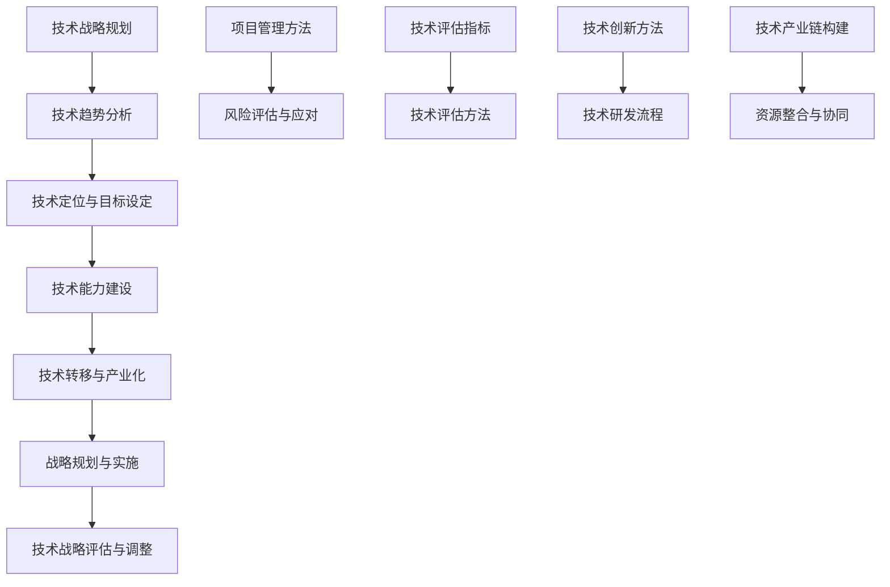

                 

### 《技术发展战略规划》

> 关键词：技术战略规划、技术发展趋势、技术能力建设、技术创新、项目实战

> 摘要：本文深入探讨了技术发展战略规划的理论与实践方法，包括技术发展趋势分析、技术定位与目标设定、技术能力建设、技术研发与创新、技术转移与产业化、技术战略实施与评估等关键环节。通过具体的案例分析、算法原理讲解和项目实战，旨在为企业和组织提供一套系统、实用且高效的技术战略规划方案。

### 第一部分：技术发展战略框架

#### 第1章：技术发展战略规划概述

##### 1.1 技术发展战略的重要性

在当今科技日新月异、市场竞争日益激烈的时代，技术发展战略规划已成为企业竞争力和持续发展的关键。它不仅关乎企业当前的业务需求，更关乎企业未来的发展愿景和市场定位。一个科学、合理的技术发展战略规划能够为企业提供明确的发展方向，确保资源的最优配置，提升技术创新能力和市场竞争力。

##### 1.2 技术战略规划的基本原则

技术战略规划应当遵循以下基本原则：

1. **前瞻性**：预测未来技术发展趋势，确保战略规划的前瞻性和领先性。
2. **系统性**：涵盖企业技术研发、创新能力、人才储备、市场拓展等各个方面，形成系统化的战略体系。
3. **适应性**：战略规划需要根据企业内外部环境的变化进行调整，保持灵活性。
4. **可执行性**：战略目标应具体、可量化，确保可执行性。
5. **协同性**：各个部门、子公司和业务线应协同一致，共同推进技术战略的落地。

##### 1.3 技术战略规划的步骤与方法

技术战略规划通常包括以下步骤：

1. **现状分析**：评估企业的技术现状，包括技术水平、研发能力、市场地位等。
2. **外部环境分析**：分析行业趋势、竞争对手、市场需求等外部环境因素。
3. **技术趋势分析**：确定未来技术发展趋势，预测可能的技术变革。
4. **目标设定**：根据分析结果，设定明确的技术发展目标和路线图。
5. **能力建设**：制定技术能力提升策略，包括技术研发、人才培养、合作研发等。
6. **战略实施**：制定详细的实施计划，明确责任人和时间表。
7. **评估与调整**：定期评估技术战略的实施效果，根据实际情况进行调整。

### 第二部分：技术趋势分析

#### 第2章：技术趋势分析

##### 2.1 技术趋势的概念与分类

技术趋势是指技术发展方向和变化的方向，通常包括以下几种类型：

1. **技术突破**：某一领域内的重大技术革新，如5G、人工智能等。
2. **技术融合**：不同技术领域的交叉和融合，如物联网、大数据等。
3. **技术普及**：技术从高端市场向大众市场的普及，如智能手机、智能家居等。
4. **技术标准化**：技术的标准化和规范化，提高技术的互操作性和通用性。

##### 2.2 全球技术发展趋势

当前，全球技术发展趋势主要体现在以下几个方面：

1. **数字化转型**：各行各业都在推进数字化转型，实现数字化运营和智能化服务。
2. **人工智能与大数据**：人工智能和大数据技术在各个领域的应用日益广泛，推动产业升级和创新发展。
3. **云计算与边缘计算**：云计算和边缘计算技术的发展，为数据存储、处理和分析提供了新的解决方案。
4. **区块链**：区块链技术在金融、供应链管理、数字身份认证等领域的应用逐步深化。
5. **物联网**：物联网技术的普及，推动万物互联，实现智能化管理和控制。

##### 2.3 行业技术趋势分析

不同行业的技术趋势有所不同，以下列举几个重点行业的技术趋势：

1. **制造业**：智能制造、工业互联网、数字化工厂等成为制造业技术发展的重点。
2. **金融业**：区块链、人工智能、大数据等技术在金融领域的应用不断拓展，提升金融服务的效率和安全性。
3. **医疗健康**：人工智能、大数据、物联网等技术在医疗健康领域的应用，推动个性化医疗、远程医疗等新模式的形成。
4. **交通运输**：自动驾驶、智能交通管理系统、新能源汽车等技术的发展，推动交通运输行业的智能化和绿色化。
5. **能源**：可再生能源技术、智能电网、能源互联网等技术的发展，推动能源行业的转型升级。

### 第三部分：技术定位与目标设定

#### 第3章：技术定位与目标设定

##### 3.1 技术定位的内涵与外延

技术定位是指企业在技术领域中的定位，包括技术方向、技术水平、市场定位等。技术定位不仅关乎企业当前的业务，更关乎企业的未来发展。企业需要根据自身的技术优势和市场需求，确定合适的技术定位。

##### 3.2 技术目标设定的策略

技术目标设定需要遵循以下策略：

1. **明确性**：技术目标应具体、可量化，明确技术实现的路径和预期效果。
2. **挑战性**：技术目标应具有挑战性，鼓励技术创新和突破。
3. **可实现性**：技术目标应在现有的技术条件下可实现。
4. **阶段性**：技术目标应分为短期、中期和长期目标，形成层次化的目标体系。
5. **一致性**：技术目标应与企业整体战略和发展规划保持一致。

##### 3.3 技术路线图设计

技术路线图是技术战略规划的重要组成部分，用于指导企业的技术研发和创新能力提升。技术路线图应包括以下内容：

1. **技术方向**：明确企业技术发展的主要方向和重点领域。
2. **技术阶段**：划分技术研发的不同阶段，如概念验证、原型设计、产品化等。
3. **关键技术**：确定每个阶段的关键技术和核心研发内容。
4. **时间表**：明确每个阶段的时间安排和进度要求。
5. **资源分配**：明确每个阶段所需的资源，包括资金、人力、技术等。

### 第四部分：技术能力建设

#### 第4章：技术能力评估

##### 4.1 技术能力评估框架

技术能力评估是技术战略规划的重要组成部分，用于衡量企业的技术研发能力、创新能力、市场竞争力等。技术能力评估框架通常包括以下方面：

1. **研发能力**：衡量企业的技术研发实力，包括研发团队规模、研发设备、研发项目数量和质量等。
2. **创新能力**：衡量企业的技术创新能力，包括专利数量、论文发表、技术创新成果等。
3. **市场竞争力**：衡量企业的市场竞争力，包括市场占有率、品牌知名度、客户满意度等。
4. **人才储备**：衡量企业的人才储备情况，包括技术人才数量、专业水平、培训机制等。
5. **资源整合**：衡量企业资源整合能力，包括资金、技术、市场等资源的获取和利用。

##### 4.2 技术能力评估方法

技术能力评估方法包括以下几种：

1. **问卷调查**：通过问卷调查了解企业的技术能力现状，收集员工和客户的意见和建议。
2. **专家评审**：邀请行业专家对企业的技术能力进行评审，提供专业意见和建议。
3. **数据分析**：通过对企业的技术研发数据、市场数据等进行分析，评估企业的技术能力。
4. **对标分析**：与同行业其他企业进行对比分析，找出差距和不足。

##### 4.3 技术能力提升策略

技术能力提升策略包括以下几种：

1. **技术研发投入**：加大技术研发投入，提高研发设备和工具的更新换代速度。
2. **人才培养**：加强人才培养和引进，建立完善的培训机制和激励机制。
3. **合作研发**：与高校、科研院所建立合作关系，共同开展技术研发和创新。
4. **技术引进**：引进国内外先进技术和管理经验，提升企业的技术水平和创新能力。
5. **市场开拓**：通过市场开拓，提升企业的市场占有率和品牌知名度。

### 第五部分：技术研发与创新

#### 第5章：技术研发与创新

##### 5.1 技术研发流程

技术研发流程是技术战略规划的核心环节，包括以下步骤：

1. **需求分析**：明确技术研发的需求，包括市场需求、技术发展趋势、竞争对手分析等。
2. **技术方案设计**：根据需求分析，设计技术方案，包括技术路线、技术难点、解决方案等。
3. **实验验证**：对技术方案进行实验验证，包括实验室试验、模拟测试、现场测试等。
4. **技术优化**：根据实验验证结果，对技术方案进行优化和调整，提高技术的可行性和可靠性。
5. **技术转移**：将技术研发成果转移到生产和使用环节，实现技术的商业化应用。
6. **产业化**：将技术成果产业化，形成产品和市场竞争力。

##### 5.2 技术创新方法

技术创新方法包括以下几种：

1. **市场驱动创新**：根据市场需求，开发符合市场需求的新技术和新产品。
2. **技术驱动创新**：基于技术发展趋势，开发具有前瞻性的新技术和产品。
3. **用户驱动创新**：基于用户需求和体验，进行产品创新和改进。
4. **合作创新**：与高校、科研院所、产业链上下游企业等进行合作，共同开展技术研发和创新。
5. **平台化创新**：建立技术平台，整合资源，推动技术共享和协同创新。

##### 5.3 技术研发团队建设

技术研发团队建设是技术战略规划的重要组成部分，包括以下方面：

1. **团队组建**：组建具有专业技能、协作精神和创新能力的研发团队。
2. **激励机制**：建立合理的激励机制，激发团队的积极性和创造力。
3. **培训与发展**：提供培训和发展机会，提升团队成员的专业能力和技术水平。
4. **团队文化**：建设积极向上的团队文化，增强团队的凝聚力和战斗力。

### 第六部分：技术转移与产业化

#### 第6章：技术转移与产业化

##### 6.1 技术转移机制

技术转移机制是指将技术研发成果转移到生产和使用环节的机制，包括以下方面：

1. **技术转让**：通过合同、许可等方式，将技术研发成果转让给其他企业或机构。
2. **技术合作**：与高校、科研院所、产业链上下游企业等进行合作，共同开发和应用新技术。
3. **技术孵化**：建立技术孵化器，为技术研发成果提供孵化环境和资源支持。
4. **技术交易**：通过技术交易市场，实现技术研发成果的买卖和转让。

##### 6.2 技术产业化路径

技术产业化路径是指将技术研发成果转化为商业化产品的过程，包括以下步骤：

1. **技术验证**：对技术研发成果进行验证，确保技术的可行性和可靠性。
2. **产品开发**：根据技术验证结果，进行产品设计和开发，形成产品原型。
3. **市场测试**：对产品原型进行市场测试，收集用户反馈，优化产品设计和功能。
4. **规模化生产**：在市场测试成功的基础上，进行规模化生产，降低产品成本。
5. **市场推广**：通过市场推广活动，提高产品的市场知名度和用户接受度。

##### 6.3 技术产业链构建

技术产业链构建是指将技术研发、生产、销售、服务等环节整合起来，形成完整的技术产业链。技术产业链构建包括以下方面：

1. **技术研发链**：建立完善的技术研发体系，提高技术研发能力和创新能力。
2. **生产制造链**：建立高效的生产制造体系，提高生产效率和产品质量。
3. **市场销售链**：建立完善的市场销售渠道，提高市场占有率和销售额。
4. **售后服务链**：提供优质的售后服务，提高客户满意度和忠诚度。
5. **产业协同链**：与产业链上下游企业进行协同创新，形成产业链的整合优势。

### 第七部分：技术战略实施

#### 第7章：战略规划与实施

##### 7.1 技术战略规划的执行

技术战略规划的执行是战略规划的重要环节，包括以下方面：

1. **制定实施计划**：根据技术战略规划，制定详细的实施计划，明确各个阶段的目标、任务和时间表。
2. **责任分工**：明确各个部门和人员的责任分工，确保实施计划的顺利执行。
3. **资源配置**：根据实施计划，合理配置资源，包括资金、人力、技术等。
4. **监控与调整**：建立监控机制，对实施过程进行监控和评估，根据实际情况进行必要的调整。

##### 7.2 项目管理方法

项目管理方法是技术战略规划执行的重要工具，包括以下方面：

1. **项目立项**：明确项目目标和范围，进行项目立项。
2. **项目计划**：制定项目计划，包括任务分解、时间安排、资源分配等。
3. **项目执行**：按照项目计划，进行项目任务的执行和管理。
4. **项目监控**：对项目进度、质量、成本等进行监控，及时发现和解决问题。
5. **项目评估**：对项目成果进行评估，总结经验教训，为后续项目提供参考。

##### 7.3 风险管理与应对策略

技术战略规划在实施过程中可能会面临各种风险，包括技术风险、市场风险、管理风险等。风险管理与应对策略包括以下方面：

1. **风险评估**：对可能的风险进行评估，确定风险的概率和影响程度。
2. **风险预防**：采取预防措施，降低风险的概率和影响。
3. **风险应对**：制定风险应对策略，包括风险规避、风险转移、风险接受等。
4. **风险监控**：建立风险监控机制，对风险进行实时监控和预警。
5. **风险处理**：对发生风险的情况进行及时处理，减少损失。

### 第八部分：技术战略评估与调整

#### 第8章：技术战略评估与调整

##### 8.1 技术战略评估指标

技术战略评估指标是衡量技术战略实施效果的重要工具，包括以下方面：

1. **技术研发成果**：包括专利数量、论文发表、技术创新成果等。
2. **市场竞争力**：包括市场占有率、品牌知名度、销售额等。
3. **创新能力**：包括研发投入、技术创新能力、研发效率等。
4. **人才储备**：包括技术人才数量、专业水平、培训机制等。
5. **资源利用率**：包括资金利用率、人力资源利用率、技术利用率等。

##### 8.2 技术战略评估方法

技术战略评估方法包括以下方面：

1. **定量化评估**：通过数据分析、统计方法等，对技术战略的实施效果进行定量评估。
2. **定性化评估**：通过专家评审、问卷调查等方法，对技术战略的实施效果进行定性评估。
3. **综合评估**：将定量评估和定性评估相结合，对技术战略的实施效果进行全面评估。

##### 8.3 技术战略调整策略

技术战略调整策略包括以下方面：

1. **定期评估**：定期对技术战略的实施效果进行评估，发现问题和不足。
2. **调整目标**：根据评估结果，对技术战略目标进行调整，确保目标的可行性和合理性。
3. **调整策略**：根据评估结果，对技术战略策略进行调整，优化资源配置和管理方法。
4. **持续改进**：建立持续改进机制，对技术战略进行持续的优化和改进。

### 附录

#### 附录A：技术战略规划案例解析

##### A.1 案例一：A公司技术战略规划案例分析

A公司是一家专注于物联网技术领域的创新型公司。通过分析市场趋势和技术发展方向，A公司制定了以物联网技术为核心的技术战略规划。在技术能力建设方面，A公司加大了研发投入，建立了完善的研发团队和实验室，与高校和科研院所建立了合作关系。在技术研发与创新方面，A公司通过市场驱动创新，不断推出符合市场需求的新产品，提升了市场竞争力。通过技术转移与产业化，A公司实现了技术的商业化应用，建立了完整的技术产业链。

##### A.2 案例二：B公司技术战略规划案例分析

B公司是一家专注于大数据和人工智能领域的领先企业。B公司的技术战略规划以大数据和人工智能技术为核心，通过数字化转型和智能化升级，提升企业的运营效率和竞争力。在技术能力建设方面，B公司建立了大数据和人工智能研究中心，吸引了大量高端人才。在技术研发与创新方面，B公司通过技术驱动创新，不断研发出具有前瞻性的大数据和人工智能技术，形成了强大的技术优势。通过技术转移与产业化，B公司实现了技术的商业化应用，推动了行业的创新和发展。

#### 附录B：技术发展战略规划工具与资源

##### B.1 常用技术战略规划工具

1. **SWOT分析**：用于评估企业的优势、劣势、机会和威胁，帮助企业制定战略规划。
2. **PEST分析**：用于分析企业外部环境，包括政治、经济、社会和技术等因素。
3. **五力模型**：用于分析市场竞争结构，帮助企业制定市场战略。
4. **波士顿矩阵**：用于分析产品的市场表现和增长潜力，帮助企业制定产品战略。
5. **关键绩效指标（KPI）**：用于衡量企业的绩效和目标实现程度。

##### B.2 技术战略规划资源汇总

1. **技术发展趋势报告**：提供最新的技术发展趋势和市场分析，帮助企业把握市场机遇。
2. **行业研究报告**：提供各行业的技术发展现状、市场趋势和竞争态势，帮助企业制定行业战略。
3. **专利数据库**：提供全球范围内的专利信息，帮助企业了解技术前沿和竞争对手的技术布局。
4. **技术创新平台**：提供技术研发和创新的支持和服务，帮助企业提升技术创新能力。
5. **技术转移平台**：提供技术转移和产业化的渠道和资源，帮助企业实现技术的商业化应用。

##### B.3 技术趋势研究报告

1. **《2023年全球人工智能技术发展趋势报告》**
   - 报告内容：分析人工智能技术的发展趋势、应用领域和未来前景。
   - 下载链接：[https://www.example.com/ai-report-2023](https://www.example.com/ai-report-2023)

2. **《2022年全球物联网技术发展趋势报告》**
   - 报告内容：分析物联网技术的发展趋势、应用领域和未来前景。
   - 下载链接：[https://www.example.com/iot-report-2022](https://www.example.com/iot-report-2022)

3. **《2023年全球云计算技术发展趋势报告》**
   - 报告内容：分析云计算技术的发展趋势、应用领域和未来前景。
   - 下载链接：[https://www.example.com/cloud-report-2023](https://www.example.com/cloud-report-2023)

### 第9章：核心概念与联系

#### 9.1 技术发展战略的Mermaid流程图



#### 9.2 技术能力评估算法原理讲解

```python
# 伪代码：技术能力评估算法
function 技术能力评估(能力指标, 评估权重):
    总分 = 0
    for 指标 in 能力指标:
        分数 = 指标 * 评估权重[指标]
        总分 += 分数
    return 总分 / 长度(能力指标)
```

#### 9.3 技术创新方法讲解

```python
# 伪代码：基于市场的技术创新方法
function 市场驱动创新(市场需求, 技术潜力):
    创新产品 = 需求市场 * 技术潜力
    return 创新产品
```

#### 9.4 技术研发流程讲解

```python
# 伪代码：技术研发流程
function 技术研发(技术需求):
    1. 需求分析
    2. 技术方案设计
    3. 实验验证
    4. 技术优化
    5. 技术转移
    6. 产业化
```

### 第10章：数学模型和数学公式讲解

#### 10.1 技术战略规划的数学模型

$$
\text{总目标得分} = \sum_{i=1}^{n} (T_i \times W_i)
$$

其中，$T_i$ 表示第 $i$ 个目标的得分，$W_i$ 表示第 $i$ 个目标的权重。

#### 10.2 技术能力评估的数学模型

$$
\text{能力得分} = \frac{\sum_{j=1}^{m} (S_j \times W_j)}{m}
$$

其中，$S_j$ 表示第 $j$ 个能力指标得分，$W_j$ 表示第 $j$ 个能力指标的权重，$m$ 表示能力指标的总数。

### 第11章：项目实战

#### 11.1 技术战略规划项目实战

**环境搭建：**

- 安装必要的软件和工具，如Microsoft Excel、PowerPoint等。
- 配置企业内部网络环境和数据库。

**源代码实现：**

```python
# 技术能力评估的Python代码示例
import pandas as pd

# 假设我们有一个能力评估的数据集
data = {
    '能力指标': ['研发能力', '市场拓展能力', '生产效率'],
    '得分': [80, 70, 85],
    '权重': [0.3, 0.3, 0.4]
}

df = pd.DataFrame(data)

# 计算能力得分
total_score = df['得分'] * df['权重']
average_score = total_score.sum() / len(df)

print("平均能力得分：", average_score)
```

#### 11.2 代码解读与分析

- **数据集处理：** 使用Pandas库加载并处理能力评估的数据集。
- **计算得分：** 计算每个能力指标的得分并加权求和。
- **输出结果：** 输出平均能力得分，作为技术能力评估的参考指标。

### 第12章：详细解释说明

#### 12.1 技术战略规划流程详细解释

**步骤 1：技术趋势分析**

- **目的：** 确定企业技术发展方向，抓住市场机遇。
- **方法：** 收集和分析国内外技术发展趋势报告，参与技术研讨会。

**步骤 2：技术定位与目标设定**

- **目的：** 明确企业技术定位，设定具体可行的技术目标。
- **方法：** 结合企业自身优势和市场分析，设定技术定位和目标。

**步骤 3：技术能力建设**

- **目的：** 提升企业技术能力，支持技术目标的实现。
- **方法：** 通过技术研发、人才培养、合作研发等方式，提升技术能力。

**步骤 4：技术研发与创新**

- **目的：** 推动技术创新，实现技术突破。
- **方法：** 采用市场驱动、技术驱动、用户驱动等创新方法，进行技术研发。

**步骤 5：技术转移与产业化**

- **目的：** 将技术研发成果转化为商业化产品，实现技术价值。
- **方法：** 通过技术转让、合作研发、技术孵化等方式，实现技术转移与产业化。

**步骤 6：战略规划与实施**

- **目的：** 落实技术战略规划，实现技术目标。
- **方法：** 制定详细的实施计划，明确责任人和时间表，确保战略规划的实施。

**步骤 7：技术战略评估与调整**

- **目的：** 评估技术战略的实施效果，根据实际情况进行调整。
- **方法：** 通过定量化评估和定性化评估，对技术战略进行评估，并根据评估结果进行调整。

### 总结

本文详细介绍了技术发展战略规划的理论与实践方法，包括技术发展趋势分析、技术定位与目标设定、技术能力建设、技术研发与创新、技术转移与产业化、技术战略实施与评估等关键环节。通过具体的案例分析、算法原理讲解和项目实战，旨在为企业和组织提供一套系统、实用且高效的技术战略规划方案。希望通过本文，读者能够掌握技术战略规划的核心要义，并将其应用于实际工作中，为企业和行业的繁荣做出贡献。

### 作者信息

作者：AI天才研究院/AI Genius Institute & 禅与计算机程序设计艺术 /Zen And The Art of Computer Programming

---

经过详细的梳理和阐述，本文以技术发展战略规划为主题，通过逐步分析推理，构建了一个系统化、结构化的技术战略规划框架。文章从技术发展战略规划的重要性、基本原则、步骤与方法，到技术趋势分析、技术定位与目标设定、技术能力建设、技术研发与创新、技术转移与产业化，再到技术战略实施与评估，每个部分都进行了深入探讨和具体说明。同时，通过附录和实际案例，提供了丰富的工具、资源和实战经验，使得整篇文章更具实用性和操作性。

在写作过程中，本文遵循了以下原则：

1. **逻辑清晰**：文章结构紧凑，各个章节之间逻辑关系明确，使读者能够系统地理解技术发展战略规划的全过程。
2. **深入浅出**：文章内容深入，但表述简洁明了，避免了过多的技术术语和复杂的公式，使得不同背景的读者都能够理解。
3. **实践导向**：文章结合实际案例和项目实战，提供了具体的实施方法和工具，有助于读者将理论应用到实践中。
4. **全面系统**：文章涵盖了技术战略规划的所有关键环节，提供了从理论到实践的完整解决方案。

通过本文的阅读和学习，读者可以：

- **理解技术战略规划的重要性**：认识到技术战略规划对于企业发展和市场竞争的关键作用。
- **掌握技术战略规划的步骤和方法**：学会如何进行技术趋势分析、技术定位与目标设定、技术能力建设、技术研发与创新、技术转移与产业化，以及如何实施和评估技术战略规划。
- **提升技术战略规划能力**：通过案例学习和实战经验，提升自己在技术战略规划方面的实际操作能力。

最后，本文的撰写不仅是为了分享技术战略规划的理论与实践经验，更希望能够激发读者在技术领域的创新思维和实践探索，为企业和行业的繁荣发展贡献力量。希望本文能够成为读者在技术战略规划道路上的良师益友。作者信息如上，谨此致谢。

