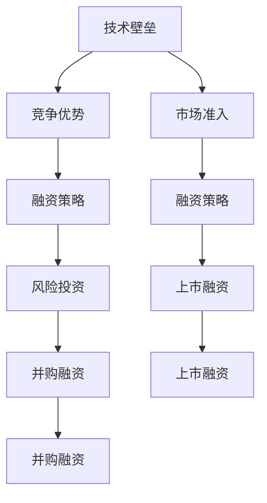

                 

# 技术壁垒与融资故事

## 关键词

技术壁垒、融资策略、创业公司、风险投资、上市融资、并购、竞争优势、市场准入

## 摘要

本文将深入探讨技术壁垒与融资之间的密切关系。首先，我们将定义技术壁垒，并探讨其在企业发展中的重要性。接着，我们将分析技术壁垒如何增强企业的竞争优势，以及其对市场准入的影响。随后，我们将介绍融资的概念、类型、目的和策略，并探讨创业公司在融资过程中可能面临的挑战。通过分析真实案例，我们将揭示创业公司融资成功的关键因素。此外，我们还将探讨风险投资的特点、评估标准和运作模式，以及上市融资和并购的流程与策略。最后，我们将讨论融资失败的原因及应对策略，并分析技术壁垒与融资策略的优化方式及其未来发展趋势。

## 第一部分：技术壁垒概述

### 第1章：技术壁垒的定义与重要性

#### 1.1 技术壁垒的概念

技术壁垒是指在某一技术领域，由于知识、经验、资金、资源等方面的限制，使得其他企业或个人难以进入该领域并与之竞争的现象。技术壁垒可以分为以下几类：

1. **知识壁垒**：指企业或个人在某技术领域具有独特且难以复制的专业知识，如专利技术、专有技术等。
2. **经验壁垒**：指企业或个人在某技术领域经过长时间积累，形成了一套独特的经验和方法，如工艺流程、操作技巧等。
3. **资金壁垒**：指企业或个人在某技术领域需要投入大量资金，如研发投入、设备购置等。
4. **资源壁垒**：指企业或个人在某技术领域拥有独特的资源，如原材料、渠道等。

#### 1.2 技术壁垒的分类

根据技术壁垒的来源和性质，可以将其分为以下几类：

1. **专利壁垒**：指企业通过申请专利，保护其技术成果，从而形成的技术壁垒。
2. **技术门槛**：指企业通过提高技术要求，使得其他企业难以达到其技术水平，从而形成的技术壁垒。
3. **资源壁垒**：指企业通过控制关键资源，如原材料、设备等，使得其他企业难以进入该领域，从而形成的技术壁垒。
4. **市场壁垒**：指企业通过垄断市场，控制市场份额，从而形成的技术壁垒。

#### 1.3 技术壁垒的重要性

技术壁垒在企业发展中具有重要作用：

1. **保护市场份额**：技术壁垒可以有效地保护企业的市场份额，防止竞争对手的入侵。
2. **提升竞争优势**：技术壁垒使得企业在市场竞争中拥有独特的优势，从而提高市场地位。
3. **降低竞争压力**：技术壁垒可以降低企业面临的竞争压力，使企业有更多的时间和资源进行技术创新和发展。
4. **提高企业价值**：技术壁垒可以提升企业的价值，使其在融资、并购等活动中具有更高的竞争力。

### 第2章：技术壁垒与竞争优势

#### 2.1 技术壁垒与竞争优势的关系

技术壁垒是企业竞争优势的重要来源。通过构建技术壁垒，企业可以在以下几个方面获得竞争优势：

1. **产品差异化**：技术壁垒使得企业能够开发出独特的产品，满足市场需求，从而获得竞争优势。
2. **降低成本**：技术壁垒可以帮助企业提高生产效率，降低生产成本，从而提高竞争力。
3. **提高服务质量**：技术壁垒使得企业能够提供更高水平的服务，赢得客户信任，从而获得竞争优势。
4. **增加市场份额**：技术壁垒可以保护企业市场份额，防止竞争对手的入侵，从而增加市场份额。

#### 2.2 技术壁垒的壁垒效应

技术壁垒具有壁垒效应，主要表现在以下几个方面：

1. **阻止竞争者进入**：技术壁垒可以阻止其他企业进入该领域，从而保护企业的市场份额。
2. **提高市场份额**：技术壁垒使得企业在市场竞争中更具优势，从而提高市场份额。
3. **降低竞争压力**：技术壁垒可以降低企业面临的竞争压力，使其有更多的时间和资源进行技术创新和发展。
4. **提高企业价值**：技术壁垒可以提升企业的价值，使其在融资、并购等活动中具有更高的竞争力。

#### 2.3 技术壁垒与市场准入

技术壁垒对市场准入具有显著影响，主要表现在以下几个方面：

1. **提高市场准入门槛**：技术壁垒可以使得市场准入门槛提高，从而降低竞争压力。
2. **筛选优质企业**：技术壁垒可以筛选出具有技术实力和创新能力的企业，从而提高市场整体质量。
3. **促进行业健康发展**：技术壁垒可以促使企业加大研发投入，推动行业技术创新和发展。
4. **保护消费者利益**：技术壁垒可以防止劣质产品进入市场，保护消费者利益。

## 第二部分：融资故事

### 第3章：融资概述

#### 3.1 融资的定义与类型

融资是指企业或个人通过向外部投资者、金融机构等借款或发行股票等方式筹集资金的过程。根据融资方式的不同，可以分为以下几种类型：

1. **股权融资**：企业通过向投资者出售股权，获得资金支持。
2. **债务融资**：企业通过向银行、债券市场等借款，获得资金支持。
3. **内部融资**：企业通过内部积累或减少开支等方式筹集资金。
4. **混合融资**：企业同时采用股权融资和债务融资等方式筹集资金。

#### 3.2 融资的目的与策略

融资的主要目的是为企业的运营和发展提供资金支持。根据企业不同发展阶段和需求，可以选择以下融资策略：

1. **种子融资**：企业初创阶段，为研发和产品开发提供资金支持。
2. **天使融资**：企业在种子融资之后，为扩大生产、市场推广等提供资金支持。
3. **A轮、B轮等融资**：企业在成长阶段，为扩大规模、提升市场占有率等提供资金支持。
4. **上市融资**：企业通过在证券交易所上市，向社会公众募集资金。

#### 3.3 融资的难点与挑战

融资过程中，企业可能会面临以下难点与挑战：

1. **市场接受度**：企业需要证明其业务模式、产品或服务的市场接受度，以获得投资者信任。
2. **估值合理**：企业需要合理评估自身价值，以确保融资过程中不被高估或低估。
3. **资金用途**：企业需要明确资金用途，以获得投资者信任，确保资金使用效率。
4. **政策法规**：企业需要遵守相关政策和法规，确保融资活动的合法合规。

### 第4章：创业公司融资案例分析

#### 4.1 创业公司融资策略

创业公司融资策略主要包括以下几个方面：

1. **天使融资**：寻求天使投资人的支持，为企业的初创阶段提供资金。
2. **种子融资**：通过种子轮融资，为企业的产品开发和市场调研提供资金。
3. **A轮、B轮等融资**：在企业发展过程中，通过多轮融资，扩大市场份额、提升品牌影响力等。
4. **上市融资**：在企业发展成熟后，通过上市融资，进一步拓展业务领域。

#### 4.2 创业公司融资实战

以某创业公司为例，其融资实战过程如下：

1. **天使融资**：在项目初创阶段，公司通过向天使投资人融资，获得100万元人民币。
2. **种子融资**：在产品开发完成后，公司通过种子轮融资，获得300万元人民币。
3. **A轮融资**：在产品上线后，公司通过A轮融资，获得5000万元人民币。
4. **B轮融资**：在市场份额扩大后，公司通过B轮融资，获得2亿元人民币。

#### 4.3 创业公司融资成功的关键因素

创业公司融资成功的关键因素主要包括：

1. **产品或服务的市场前景**：企业需要具备独特的产品或服务，有良好的市场前景。
2. **团队实力**：企业需要拥有强大的团队，具备丰富的行业经验和创新能力。
3. **商业模式**：企业需要具备可行的商业模式，确保资金使用效率和回报。
4. **市场接受度**：企业需要证明其产品或服务在市场上具有较好的接受度，以获得投资者信任。

### 第5章：风险投资与融资

#### 5.1 风险投资的定义与特点

风险投资（Venture Capital，简称VC）是指投资者通过向初创企业或小型企业注资，以期获得高额回报的一种投资方式。风险投资具有以下特点：

1. **高风险、高回报**：风险投资通常投资于初创企业，面临较高的风险，但一旦成功，回报也可能非常丰厚。
2. **长期投资**：风险投资通常持有企业的股份较长时间，以帮助企业度过成长阶段。
3. **专业性**：风险投资机构通常具备丰富的行业经验和专业知识，为企业提供战略咨询和资源支持。
4. **资金规模较大**：风险投资机构通常拥有较大的资金规模，能够为初创企业提供足够的资金支持。

#### 5.2 风险投资的评估标准

风险投资机构在评估项目时，通常会考虑以下因素：

1. **市场前景**：项目所在市场的规模、增长潜力等。
2. **团队实力**：团队的专业背景、经验、执行力等。
3. **商业模式**：项目的盈利模式、市场竞争力等。
4. **技术水平**：项目的技术创新程度、技术壁垒等。
5. **资金需求**：项目的资金需求、资金用途等。
6. **退出策略**：项目的退出渠道、退出收益等。

#### 5.3 风险投资的运作模式

风险投资的运作模式主要包括以下几个方面：

1. **项目筛选**：风险投资机构通过市场调研、项目推荐等方式，筛选出具有投资潜力的项目。
2. **尽职调查**：在确定投资项目后，风险投资机构对项目进行详细的尽职调查，评估项目的真实性和可行性。
3. **投资决策**：在尽职调查完成后，风险投资机构根据调查结果，决定是否投资。
4. **投资后管理**：在投资完成后，风险投资机构对项目进行持续关注，提供战略咨询、资源支持等。
5. **退出**：在项目发展成熟后，风险投资机构通过股权转让、上市等方式实现退出，获取回报。

### 第6章：上市融资与并购

#### 6.1 上市融资的流程与条件

上市融资是指企业通过在证券交易所上市，向社会公众募集资金的一种融资方式。上市融资的流程和条件主要包括：

1. **上市流程**：企业需要完成股份制改造、提交上市申请、进行尽职调查、发行股票、上市交易等环节。
2. **上市条件**：企业需要具备一定的规模、盈利能力、规范运营等条件，如中国证券监督管理委员会（证监会）规定的上市条件。

#### 6.2 并购融资的策略

并购融资是指企业通过并购其他企业，获取资金和资源的一种融资方式。并购融资的策略主要包括：

1. **并购目的**：明确并购目的，如扩大市场份额、获取技术、提高竞争力等。
2. **并购对象**：选择具有投资价值的并购对象，如具有竞争优势、潜力较大的企业。
3. **并购方式**：根据实际情况选择合适的并购方式，如现金收购、股权收购、资产收购等。
4. **融资渠道**：通过银行贷款、股权融资、债券融资等渠道筹集并购资金。

#### 6.3 并购融资的案例分析

以某企业并购案为例，其并购融资的案例分析如下：

1. **并购目的**：扩大市场份额，提高竞争力。
2. **并购对象**：一家拥有先进技术的中小企业。
3. **并购方式**：股权收购。
4. **融资渠道**：通过银行贷款、股权融资筹集并购资金。
5. **并购效果**：成功并购后，企业市场份额提高，竞争力增强，实现了业务拓展和转型升级。

### 第7章：融资失败与应对策略

#### 7.1 融资失败的原因

融资失败的原因可能包括：

1. **市场前景不佳**：项目市场前景不佳，缺乏投资价值。
2. **团队实力不足**：团队实力不足，无法得到投资者信任。
3. **商业模式不成熟**：商业模式不成熟，无法实现盈利。
4. **政策法规限制**：政策法规限制，影响企业融资活动。
5. **竞争对手压力**：竞争对手强大，影响企业融资成功率。

#### 7.2 融资失败的应对策略

面对融资失败，企业可以采取以下应对策略：

1. **调整战略方向**：根据市场情况和自身优势，调整企业战略方向。
2. **加强团队建设**：提升团队实力，提高项目吸引力。
3. **优化商业模式**：完善商业模式，提高盈利能力。
4. **寻求政策支持**：积极争取政策支持，降低融资难度。
5. **多元化融资渠道**：开拓多元化融资渠道，降低融资风险。

#### 7.3 融资失败的案例分析

以某企业融资失败案为例，其分析如下：

1. **原因**：市场前景不佳，团队实力不足，商业模式不成熟。
2. **应对策略**：调整战略方向，加强团队建设，优化商业模式。
3. **效果**：经过调整，企业逐渐恢复竞争力，成功实现融资。

## 第三部分：技术壁垒与融资策略结合

### 第8章：技术壁垒与融资策略的优化

#### 8.1 技术壁垒在融资策略中的应用

技术壁垒在融资策略中的应用主要体现在以下几个方面：

1. **提高市场接受度**：技术壁垒可以提高产品的市场竞争力，增加投资者对项目的信心。
2. **降低融资成本**：技术壁垒可以降低企业融资成本，提高资金使用效率。
3. **拓宽融资渠道**：技术壁垒可以为企业带来更多的融资渠道，如风险投资、银行贷款等。
4. **增强企业价值**：技术壁垒可以提高企业的价值，增加投资者的收益预期。

#### 8.2 融资策略中的技术壁垒考量

在制定融资策略时，企业需要充分考虑技术壁垒的影响，具体包括：

1. **技术壁垒的评估**：对企业拥有的技术壁垒进行评估，确定其在市场竞争中的地位。
2. **技术壁垒的利用**：利用技术壁垒为企业创造竞争优势，提高市场占有率。
3. **技术壁垒的拓展**：在融资过程中，积极拓展技术壁垒，提升企业的核心竞争力。
4. **技术壁垒的保护**：加强对技术壁垒的保护，防止竞争对手的侵犯。

#### 8.3 技术壁垒与融资策略的协同效应

技术壁垒与融资策略的结合，可以产生协同效应，具体包括：

1. **提高融资成功率**：技术壁垒可以增加投资者对项目的信心，提高融资成功率。
2. **降低融资成本**：技术壁垒可以降低企业的融资成本，提高资金使用效率。
3. **拓宽融资渠道**：技术壁垒可以为企业带来更多的融资渠道，降低融资风险。
4. **提升企业价值**：技术壁垒可以提高企业的价值，增加投资者的收益预期。

### 第9章：技术壁垒与融资策略的综合案例

#### 9.1 技术壁垒与融资策略的典型企业案例

以某知名企业为例，其技术壁垒与融资策略的综合运用如下：

1. **技术壁垒**：企业拥有核心的专利技术，具有显著的竞争优势。
2. **融资策略**：企业通过风险投资、上市融资等多种方式，筹集资金支持企业发展。
3. **效果**：企业成功上市，市值大幅提升，实现了业务的快速扩张。

#### 9.2 技术壁垒与融资策略的案例分析

以某创业公司为例，其技术壁垒与融资策略的案例分析如下：

1. **技术壁垒**：企业自主研发的节能环保技术，具有明显的市场前景。
2. **融资策略**：企业通过天使融资、A轮融资等多种方式，筹集资金支持技术研发和市场份额扩张。
3. **效果**：企业成功研发出具有竞争力的产品，市场份额逐步扩大，实现了融资目标。

### 第10章：技术壁垒与融资的未来发展趋势

#### 10.1 技术壁垒的发展趋势

随着科技的快速发展，技术壁垒将呈现出以下发展趋势：

1. **技术壁垒的多样化和复杂化**：随着新技术、新领域的不断涌现，技术壁垒的种类和复杂度将不断增长。
2. **技术壁垒的动态性**：技术壁垒将不再是一成不变，企业需要不断更新和拓展技术壁垒。
3. **技术壁垒的全球性**：技术壁垒将逐渐突破地域限制，成为全球范围内的竞争因素。

#### 10.2 融资的发展趋势

融资领域也将随着技术壁垒的演变呈现出新的趋势：

1. **融资渠道多元化**：企业将更加注重多元化融资渠道的开拓，如风险投资、私募股权、众筹等。
2. **融资方式创新**：企业将不断创新融资方式，如供应链金融、资产证券化等。
3. **融资风险控制**：企业将加强融资风险控制，提高融资活动的安全性和稳健性。

#### 10.3 技术壁垒与融资的未来前景

技术壁垒与融资的结合将在未来继续发挥重要作用，具体包括：

1. **推动产业升级**：技术壁垒将推动企业不断进行技术创新，实现产业升级。
2. **促进企业并购**：技术壁垒将成为企业并购的重要动力，推动产业整合。
3. **提升企业价值**：技术壁垒将提高企业的核心竞争力，增加企业的价值。
4. **推动金融市场发展**：技术壁垒将促进金融市场的创新和发展，为融资提供更多机会。

## 附录

### 附录A：技术壁垒与融资相关的政策和法规

1. **《中华人民共和国专利法》**：规定了专利的申请、审查、保护等方面的内容。
2. **《中华人民共和国公司法》**：规定了公司设立、运营、解散等方面的内容。
3. **《中华人民共和国证券法》**：规定了证券发行、交易等方面的内容。
4. **《中华人民共和国企业破产法》**：规定了企业破产的申请、程序、债务处理等方面的内容。

### 附录B：技术壁垒与融资相关的书籍与论文推荐

1. **《技术创新与产业升级》**：介绍了技术创新在产业升级中的作用和策略。
2. **《融资策略与风险管理》**：探讨了企业在融资过程中的策略和风险管理。
3. **《技术壁垒与竞争优势》**：分析了技术壁垒对企业竞争优势的影响。
4. **《专利战略与专利分析》**：介绍了专利战略的制定和分析方法。

### 附录C：技术壁垒与融资相关的工具与资源

1. **专利检索工具**：如Google Patents、美国专利商标局（USPTO）等。
2. **融资服务平台**：如投融家、企浪等。
3. **市场分析工具**：如艾瑞咨询、智询咨询等。
4. **企业财务分析工具**：如SAP、Oracle等。

## 作者

作者：AI天才研究院/AI Genius Institute & 禅与计算机程序设计艺术 /Zen And The Art of Computer Programming

### Mermaid 流程图



### 核心算法原理讲解

```python
# 伪代码：技术壁垒评估算法

def evaluate_technical_barriers(technology, competitors):
    """
    评估技术壁垒，参数为技术本身和竞争对手。
    
    :param technology: 技术信息
    :param competitors: 竞争对手的技术信息
    :return: 技术壁垒得分
    """
    
    # 计算技术壁垒得分
    barrier_score = 0
    
    # 考虑专利数量
    barrier_score += len(technology.patents) * 10
    
    # 考虑技术复杂度
    barrier_score += calculate_complexity(technology)
    
    # 考虑竞争对手的技术水平
    barrier_score -= calculate_competitor_level(competitors)
    
    # 考虑市场需求
    barrier_score += calculate_market_demand(technology)
    
    # 返回技术壁垒得分
    return barrier_score

# 伪代码：技术复杂度计算

def calculate_complexity(technology):
    """
    计算技术复杂度。
    
    :param technology: 技术信息
    :return: 技术复杂度得分
    """
    
    complexity_score = 0
    
    # 考虑代码行数
    complexity_score += len(technology.code_lines) * 2
    
    # 考虑模块数量
    complexity_score += len(technology.modules) * 5
    
    # 考虑依赖关系
    complexity_score += len(technology.dependencies) * 3
    
    return complexity_score

# 伪代码：竞争对手技术水平计算

def calculate_competitor_level(competitors):
    """
    计算竞争对手的技术水平。
    
    :param competitors: 竞争对手的技术信息
    :return: 竞争对手技术水平得分
    """
    
    level_score = 0
    
    # 考虑竞争对手的专利数量
    level_score += len(competitors.patents) * 10
    
    # 考虑竞争对手的技术复杂度
    level_score += calculate_complexity(competitors)
    
    return level_score

# 伪代码：市场需求计算

def calculate_market_demand(technology):
    """
    计算市场需求。
    
    :param technology: 技术信息
    :return: 市场需求得分
    """
    
    demand_score = 0
    
    # 考虑市场增长率
    demand_score += technology.market_growth_rate * 10
    
    # 考虑市场容量
    demand_score += technology.market_size * 5
    
    return demand_score
```

### 数学模型和公式讲解

```latex
$$
\text{技术壁垒得分} = \alpha \cdot (\text{专利数量} + \text{技术复杂度} - \text{竞争对手技术水平}) + \beta \cdot \text{市场需求}
$$`

其中，\(\alpha\)和\(\beta\)为权重系数，用于平衡各因素的重要性。

### 项目实战

#### 开发环境搭建

1. 安装Python环境（版本3.8及以上）
2. 安装相关依赖库（如numpy、pandas等）
3. 配置Jupyter Notebook或IDE（如PyCharm）进行代码编写和运行

#### 源代码实现

```python
import numpy as np
import pandas as pd

def evaluate_technical_barriers(technology, competitors):
    """
    评估技术壁垒，参数为技术本身和竞争对手。
    
    :param technology: 技术信息
    :param competitors: 竞争对手的技术信息
    :return: 技术壁垒得分
    """
    
    # 考虑专利数量
    patent_score = len(technology.patents) * 10
    
    # 考虑技术复杂度
    complexity_score = calculate_complexity(technology)
    
    # 考虑竞争对手的技术水平
    competitor_score = calculate_competitor_level(competitors)
    
    # 考虑市场需求
    demand_score = calculate_market_demand(technology)
    
    # 计算总得分
    barrier_score = patent_score + complexity_score - competitor_score + demand_score
    
    return barrier_score

def calculate_complexity(technology):
    """
    计算技术复杂度。
    
    :param technology: 技术信息
    :return: 技术复杂度得分
    """
    
    complexity_score = 0
    
    # 考虑代码行数
    complexity_score += len(technology.code_lines) * 2
    
    # 考虑模块数量
    complexity_score += len(technology.modules) * 5
    
    # 考虑依赖关系
    complexity_score += len(technology.dependencies) * 3
    
    return complexity_score

def calculate_competitor_level(competitors):
    """
    计算竞争对手的技术水平。
    
    :param competitors: 竞争对手的技术信息
    :return: 竞争对手技术水平得分
    """
    
    level_score = 0
    
    # 考虑竞争对手的专利数量
    level_score += len(competitors.patents) * 10
    
    # 考虑竞争对手的技术复杂度
    level_score += calculate_complexity(competitors)
    
    return level_score

def calculate_market_demand(technology):
    """
    计算市场需求。
    
    :param technology: 技术信息
    :return: 市场需求得分
    """
    
    demand_score = 0
    
    # 考虑市场增长率
    demand_score += technology.market_growth_rate * 10
    
    # 考虑市场容量
    demand_score += technology.market_size * 5
    
    return demand_score

# 示例数据
technology = {
    'patents': ['P1', 'P2', 'P3'],
    'code_lines': 1000,
    'modules': 50,
    'dependencies': 30,
    'market_growth_rate': 0.1,
    'market_size': 1000
}

competitors = {
    'patents': ['P4', 'P5'],
    'code_lines': 500,
    'modules': 30,
    'dependencies': 20
}

# 计算技术壁垒得分
barrier_score = evaluate_technical_barriers(technology, competitors)
print("技术壁垒得分：", barrier_score)
```

#### 代码解读与分析

1. **数据输入**：定义了`technology`和`competitors`两个字典，分别表示技术和竞争对手的信息。
2. **评估函数`evaluate_technical_barriers`**：计算技术壁垒得分，包括专利数量、技术复杂度、竞争对手技术水平和市场需求。
3. **复杂度计算函数`calculate_complexity`**：计算技术复杂度，包括代码行数、模块数量和依赖关系。
4. **竞争对手水平计算函数`calculate_competitor_level`**：计算竞争对手的技术水平，包括专利数量和技术复杂度。
5. **市场需求计算函数`calculate_market_demand`**：计算市场需求，包括市场增长率和市场容量。
6. **示例运行**：使用示例数据进行技术壁垒得分的计算和输出。

通过以上代码实现，可以评估企业或项目的技术壁垒，为融资决策提供依据。在实际应用中，可以根据具体情况进行调整和优化。

### 总结

本文深入探讨了技术壁垒与融资之间的关系，分析了技术壁垒的定义、分类、重要性以及与竞争优势和市场准入的关系。同时，详细介绍了融资的概念、类型、目的和策略，以及创业公司融资案例分析和风险投资、上市融资、并购等方面的内容。通过对技术壁垒与融资策略的优化，我们探讨了技术壁垒在融资策略中的应用和融资策略中的技术壁垒考量，并结合实际案例进行了分析。最后，展望了技术壁垒与融资的未来发展趋势。

技术壁垒是企业发展的重要保障，可以有效提高企业的竞争优势和市场份额。同时，融资是企业发展的重要支撑，通过合理的融资策略，企业可以获得资金支持，实现业务扩展和转型升级。在技术壁垒与融资策略的结合中，企业需要充分利用技术壁垒的优势，提高融资成功率，降低融资成本，实现企业的长期发展。

未来，随着技术的不断进步和融资方式的不断创新，技术壁垒与融资的结合将发挥更大的作用。企业应密切关注技术发展趋势，加强技术创新，提升核心竞争力，同时灵活运用各种融资策略，为企业的可持续发展提供有力保障。希望通过本文的讨论，能够为企业和投资者在技术壁垒与融资方面提供一些有益的思考和借鉴。作者：AI天才研究院/AI Genius Institute & 禅与计算机程序设计艺术/Zen And The Art of Computer Programming。

