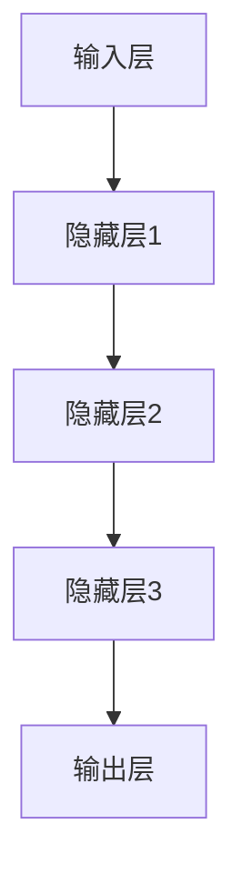
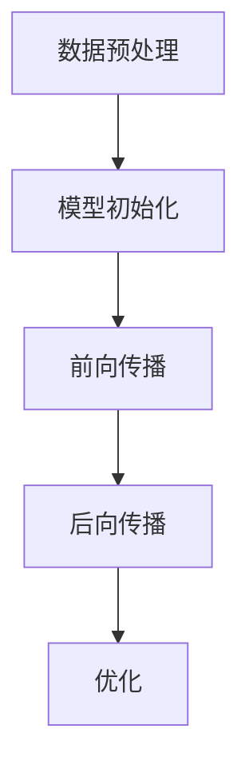
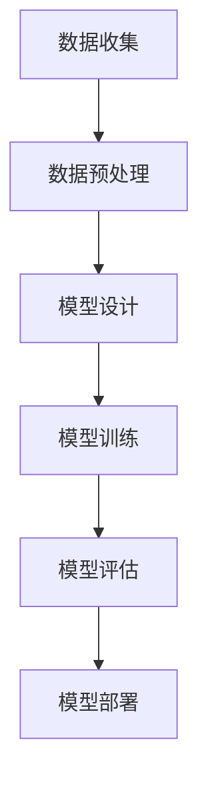
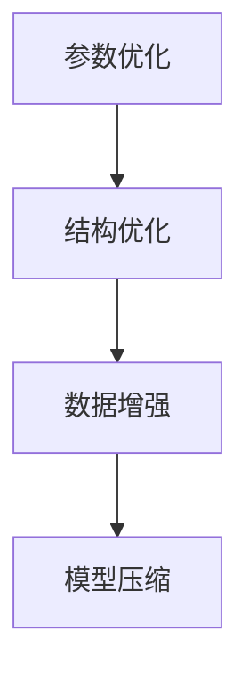

                 

# 文章标题：大模型创业的核心竞争力

> 关键词：大模型、创业、核心竞争力、技术应用、案例分析、算法原理

> 摘要：本文将深入探讨大模型技术在创业领域中的应用，分析大模型创业的核心竞争力，并通过具体案例展示其在实际业务中的价值。文章将从大模型的背景、架构、算法、应用场景以及创业实践等多个方面进行阐述，旨在为创业者提供有益的参考和指导。

## 目录

1. **大模型与创业背景**
   - **第1章 大模型时代下的创业环境**
     - 1.1 大模型对创业的影响
     - 1.2 创业者在选择大模型时应考虑的因素
     - 1.3 大模型创业的优势与挑战

   - **第2章 大模型的架构与原理**
     - 2.1 大模型的架构概述
     - 2.2 大模型的训练原理
     - 2.3 大模型的工作流程
     - 2.4 大模型的优化方法

   - **第3章 大模型的核心算法**
     - 3.1 神经网络与深度学习基础
     - 3.2 生成对抗网络（GAN）
     - 3.3 聚类算法与降维技术
     - 3.4 强化学习算法

   - **第4章 大模型的应用场景**
     - 4.1 自然语言处理
     - 4.2 计算机视觉
     - 4.3 推荐系统
     - 4.4 语音识别

   - **第5章 大模型创业案例分析**
     - 5.1 案例一：某公司利用大模型优化广告投放
     - 5.2 案例二：某初创公司基于大模型开发智能助手
     - 5.3 案例三：某企业利用大模型提升产品质量检测

   - **第6章 大模型创业的核心竞争力**
     - 6.1 技术创新与市场竞争力
     - 6.2 数据资源与竞争优势
     - 6.3 团队建设与管理
     - 6.4 商业模式与盈利模式

   - **第7章 大模型创业实战指导**
     - 7.1 大模型创业项目规划
     - 7.2 大模型创业团队搭建
     - 7.3 大模型创业融资策略
     - 7.4 大模型创业项目执行与监控

   - **附录**
     - 附录A：大模型开发工具与资源
     - 附录B：参考文献与推荐阅读

## 第1章 大模型时代下的创业环境

### 1.1 大模型对创业的影响

大模型（Large Models）在近年来得到了快速发展，尤其是在深度学习、自然语言处理和计算机视觉等领域。这些模型通过大量数据的训练，能够实现高效的数据分析和智能决策，从而对创业产生了深远的影响。

首先，大模型能够显著提升创业项目的效率。通过自动化和智能化的数据处理和分析，创业者可以更快地获取市场信息、分析竞争对手、制定营销策略等，从而降低创业的风险和成本。

其次，大模型为企业提供了强大的创新能力。借助大模型，企业可以在短时间内进行大规模的模拟实验，快速验证新的商业想法，从而实现快速迭代和持续创新。

最后，大模型还能够帮助企业实现精准营销。通过分析用户的消费行为和偏好，大模型可以为企业提供个性化的营销策略，提高用户满意度和忠诚度。

### 1.2 创业者在选择大模型时应考虑的因素

虽然大模型在创业中具有显著的优势，但创业者选择大模型时仍需考虑以下因素：

1. **技术成熟度**：创业者需要选择成熟的大模型框架，如TensorFlow、PyTorch等，以确保项目的可行性和稳定性。

2. **数据处理能力**：大模型的训练和推理需要大量的数据支持和计算资源，创业者需要评估自身的数据处理能力和计算资源是否能够满足大模型的需求。

3. **应用场景匹配**：创业者需要根据自身的业务需求选择合适的大模型，如自然语言处理、计算机视觉或推荐系统等。

4. **数据隐私与合规性**：在应用大模型时，创业者需要关注数据隐私和合规性问题，确保数据的安全性和合法性。

### 1.3 大模型创业的优势与挑战

#### 优势

1. **技术领先**：大模型技术处于人工智能领域的最前沿，创业者能够通过大模型展示技术领先优势。

2. **市场前景**：随着人工智能技术的普及，大模型应用领域不断扩展，创业者有机会进入广阔的市场。

3. **创新能力**：大模型提供了强大的数据分析能力，有助于创业者实现持续创新。

#### 挑战

1. **技术门槛**：大模型的开发和应用需要较高技术门槛，创业者需要具备一定的技术背景。

2. **数据质量**：大模型的训练依赖于大量高质量的数据，数据质量直接影响模型的效果。

3. **竞争激烈**：大模型创业领域竞争激烈，创业者需要不断优化技术，提升用户体验，以保持竞争力。

### 1.4 大模型创业的发展趋势

1. **应用场景扩展**：大模型将在更多领域得到应用，如金融、医疗、教育等。

2. **技术融合**：大模型将与云计算、物联网、区块链等新兴技术融合，形成更强大的业务解决方案。

3. **产业生态**：大模型创业将带动相关产业的发展，形成产业链生态。

## 第2章 大模型的架构与原理

### 2.1 大模型的架构概述

大模型的架构通常由以下几个部分组成：

1. **输入层**：接收外部输入数据，如文本、图像、音频等。
2. **隐藏层**：包含多个神经元层，通过神经网络结构对输入数据进行处理和转换。
3. **输出层**：生成模型的预测结果或决策。

大模型的架构如图1所示：



### 2.2 大模型的训练原理

大模型的训练过程包括以下几个步骤：

1. **数据预处理**：对输入数据进行清洗、归一化等处理，以适应模型的训练。
2. **模型初始化**：初始化模型参数，通常使用随机初始化。
3. **前向传播**：将输入数据通过模型进行前向传播，计算输出结果。
4. **后向传播**：计算输出结果与真实标签之间的误差，并通过后向传播更新模型参数。
5. **优化**：使用优化算法（如梯度下降）调整模型参数，以最小化误差。

训练过程如图2所示：



### 2.3 大模型的工作流程

大模型的工作流程通常包括以下几个阶段：

1. **数据收集**：从各种来源收集数据，如公开数据集、企业内部数据等。
2. **数据预处理**：对收集到的数据进行分析和处理，以适应模型的训练。
3. **模型设计**：根据业务需求设计合适的模型架构。
4. **模型训练**：使用训练数据对模型进行训练，不断优化模型参数。
5. **模型评估**：使用测试数据评估模型的效果，调整模型参数。
6. **模型部署**：将训练好的模型部署到生产环境，进行实际业务应用。

工作流程如图3所示：



### 2.4 大模型的优化方法

大模型的优化方法主要包括以下几个方面：

1. **参数优化**：调整模型参数，如学习率、批量大小等，以提升模型性能。
2. **结构优化**：通过调整模型结构，如增加或减少隐藏层、调整神经元数量等，优化模型性能。
3. **数据增强**：通过数据增强技术，如数据扩充、数据变换等，提升模型对数据的适应能力。
4. **模型压缩**：通过模型压缩技术，如剪枝、量化等，减少模型参数，降低模型复杂度。

优化方法如图4所示：



## 第3章 大模型的核心算法

### 3.1 神经网络与深度学习基础

神经网络（Neural Networks）是深度学习（Deep Learning）的核心组成部分。神经网络通过模拟人脑神经元之间的连接，实现对数据的处理和预测。

#### 基本概念

1. **神经元**：神经网络的基本单元，负责接收输入信号，通过权重和偏置进行计算，输出激活值。
2. **层**：神经网络由输入层、隐藏层和输出层组成，每个层由多个神经元组成。
3. **激活函数**：用于决定神经元是否被激活的函数，常见的激活函数有Sigmoid、ReLU、Tanh等。

#### 工作原理

神经网络的工作原理如下：

1. **前向传播**：输入数据从输入层传递到隐藏层，再传递到输出层，计算输出结果。
2. **后向传播**：计算输出结果与真实标签之间的误差，通过反向传播更新模型参数。

#### 示例

以下是一个简单的神经网络伪代码：

```python
# 输入数据
x = [1, 2, 3]

# 权重和偏置
weights = [[0.1, 0.2], [0.3, 0.4]]
biases = [0.1, 0.2]

# 激活函数
def sigmoid(x):
    return 1 / (1 + e ** -x)

# 前向传播
hidden_layer_input = [sigmoid(sum(x * weights[i])) + biases[i] for i in range(len(weights))]
output = sigmoid(sum(hidden_layer_input * weights[-1]) + biases[-1])

# 后向传播
error = target - output
delta = error * output * (1 - output)
weights[-1] += hidden_layer_input * delta
biases[-1] += delta
for i in range(len(weights) - 1):
    hidden_layer_input = [sigmoid(sum(x * weights[i])) + biases[i] for i in range(len(weights))]
    delta = [delta[i] * weights[i+1][j] * sigmoid'(hidden_layer_input[j]) for j in range(len(hidden_layer_input))]
    weights[i] += x[j] * delta
    biases[i] += delta
```

### 3.2 生成对抗网络（GAN）

生成对抗网络（Generative Adversarial Network，GAN）是由生成器（Generator）和判别器（Discriminator）组成的对抗性网络。

#### 基本概念

1. **生成器**：生成器通过学习数据分布，生成与真实数据相似的数据。
2. **判别器**：判别器用于区分真实数据和生成数据。
3. **损失函数**：生成器和判别器之间的对抗性训练通过损失函数实现。

#### 工作原理

GAN的工作原理如下：

1. **初始化**：生成器和判别器同时初始化。
2. **生成数据**：生成器生成一组数据。
3. **判别数据**：判别器对真实数据和生成数据进行分类。
4. **更新参数**：生成器和判别器的参数通过梯度下降算法更新。

#### 示例

以下是一个简单的GAN伪代码：

```python
# 初始化生成器和判别器
generator = G()
discriminator = D()

# 损失函数
def adversarial_loss(real_data, fake_data):
    real_loss = -torch.mean(torch.log(discriminator(real_data)))
    fake_loss = -torch.mean(torch.log(1 - discriminator(fake_data)))
    return real_loss + fake_loss

# 训练GAN
for epoch in range(num_epochs):
    # 训练判别器
    for data in data_loader:
        real_data = data.to(device)
        fake_data = generator().to(device)
        discriminator.zero_grad()
        real_loss = adversarial_loss(real_data, fake_data)
        real_loss.backward()
        
        # 训练生成器
        generator.zero_grad()
        fake_data = generator()
        fake_loss = adversarial_loss(real_data, fake_data)
        fake_loss.backward()
        
        optimizer_d.step()
        optimizer_g.step()
```

### 3.3 聚类算法与降维技术

聚类算法（Clustering Algorithms）用于将数据分组，以发现数据中的模式。降维技术（Dimensionality Reduction）用于降低数据维度，提高模型训练效率。

#### 常见聚类算法

1. **K-means聚类**：基于距离度量，将数据划分为K个簇。
2. **层次聚类**：基于层次结构，逐步合并或分裂簇。
3. **密度聚类**：基于密度分布，识别聚类核心和边界。

#### 常见降维技术

1. **主成分分析（PCA）**：通过提取主要成分，降低数据维度。
2. **线性判别分析（LDA）**：通过最大化类内离散度和最小化类间离散度，降低数据维度。
3. **t-SNE**：通过非线性映射，降低数据维度。

#### 示例

以下是一个简单的K-means聚类伪代码：

```python
import numpy as np
from sklearn.cluster import KMeans

# 初始化数据
data = np.array([[1, 2], [1, 4], [1, 0], [4, 2], [4, 4], [4, 0]])

# 初始化K-means模型
kmeans = KMeans(n_clusters=2, random_state=0).fit(data)

# 获取聚类结果
labels = kmeans.labels_
centroids = kmeans.cluster_centers_

# 输出结果
print("Cluster Labels:", labels)
print("Cluster Centroids:", centroids)
```

### 3.4 强化学习算法

强化学习（Reinforcement Learning，RL）是一种通过试错和反馈进行学习的机器学习方法。强化学习 agent 在与环境的交互中，通过学习最优策略来最大化回报。

#### 基本概念

1. **状态**：agent 当前所处的环境状态。
2. **动作**：agent 可以采取的行为。
3. **策略**：agent 的行为规则，用于决定在特定状态下采取的动作。
4. **回报**：agent 采取动作后获得的即时奖励。

#### 工作原理

强化学习的工作原理如下：

1. **初始化**：初始化agent和环境的参数。
2. **状态-动作循环**：agent 在状态s下采取动作a，获得回报r，转移到状态s'。
3. **更新策略**：根据回报和策略评估函数，更新agent的策略。

#### 示例

以下是一个简单的强化学习伪代码：

```python
import gym
import numpy as np

# 初始化环境
env = gym.make("CartPole-v0")

# 初始化策略参数
policy = np.random.rand(env.action_space.n)

# 策略评估函数
def evaluate_policy(policy, env, num_episodes=100):
    scores = []
    for _ in range(num_episodes):
        state = env.reset()
        done = False
        total_reward = 0
        while not done:
            action = np.argmax(policy[state])
            state, reward, done, _ = env.step(action)
            total_reward += reward
        scores.append(total_reward)
    return np.mean(scores)

# 训练策略
for epoch in range(num_epochs):
    score = evaluate_policy(policy, env)
    if score > 195:
        break
    learning_rate = 0.1 / (epoch + 1)
    for state in range(env.observation_space.n):
        action = np.argmax(policy[state])
        next_state, reward, done, _ = env.step(action)
        if done:
            policy[state] = (1 - learning_rate) * policy[state] + learning_rate * reward
        else:
            policy[state] = (1 - learning_rate) * policy[state] + learning_rate * (reward + 0.9 * np.max(policy[next_state]))

# 测试策略
score = evaluate_policy(policy, env)
print("Test Score:", score)
```

## 第4章 大模型的应用场景

### 4.1 自然语言处理

自然语言处理（Natural Language Processing，NLP）是人工智能领域的一个重要分支，主要研究如何让计算机理解和处理自然语言。大模型在NLP领域具有显著的优势，能够实现高效的语言理解、生成和翻译。

#### 应用场景

1. **文本分类**：将文本数据分类到不同的主题或类别，如新闻分类、情感分析等。
2. **文本生成**：生成具有自然语言特征的文本，如文章、对话等。
3. **机器翻译**：实现不同语言之间的自动翻译，如中英翻译、日英翻译等。
4. **对话系统**：构建能够与人类进行自然对话的智能系统，如聊天机器人、语音助手等。

#### 技术挑战

1. **语言理解**：如何准确理解和解释自然语言中的语义和情感。
2. **文本生成**：如何生成具有自然流畅性和创造性的文本。
3. **跨语言翻译**：如何处理不同语言之间的语法和词汇差异。

### 4.2 计算机视觉

计算机视觉（Computer Vision，CV）是人工智能领域的另一个重要分支，主要研究如何使计算机理解和解释视觉信息。大模型在计算机视觉领域具有强大的能力，能够实现图像分类、目标检测、图像生成等任务。

#### 应用场景

1. **图像分类**：将图像分类到不同的类别，如物体识别、场景分类等。
2. **目标检测**：在图像中检测并定位特定目标，如人脸识别、车辆检测等。
3. **图像生成**：生成具有逼真视觉效果的图像，如艺术创作、动画制作等。
4. **图像增强**：提高图像质量，如图像去噪、图像增强等。

#### 技术挑战

1. **图像理解**：如何准确理解和解释图像中的内容。
2. **图像生成**：如何生成具有多样性和真实感的图像。
3. **实时处理**：如何实现实时图像处理和实时目标检测。

### 4.3 推荐系统

推荐系统（Recommender System）是一种通过分析用户行为和偏好，为用户推荐相关商品、内容或服务的系统。大模型在推荐系统领域具有显著的优势，能够实现高效的用户行为分析和内容推荐。

#### 应用场景

1. **商品推荐**：根据用户的历史购买记录和偏好，为用户推荐相关商品。
2. **内容推荐**：根据用户的浏览历史和兴趣爱好，为用户推荐相关内容，如文章、视频等。
3. **社交推荐**：根据用户的社交网络关系，为用户推荐相关的社交信息和活动。
4. **场景化推荐**：根据用户的场景和需求，为用户推荐相关的服务和产品。

#### 技术挑战

1. **用户行为理解**：如何准确理解和分析用户的行为和偏好。
2. **个性化推荐**：如何实现高效、准确的个性化推荐。
3. **实时推荐**：如何实现实时推荐和实时更新。

### 4.4 语音识别

语音识别（Speech Recognition）是将语音信号转换为文本信息的技术。大模型在语音识别领域具有显著的优势，能够实现高效、准确的语音识别。

#### 应用场景

1. **语音助手**：构建智能语音助手，如苹果的Siri、亚马逊的Alexa等。
2. **自动转录**：将语音信号自动转换为文本，如会议记录、访谈转录等。
3. **语音控制**：通过语音指令控制智能家居设备、汽车等。
4. **语音交互**：实现人与机器之间的语音交互，如语音客服、语音导航等。

#### 技术挑战

1. **语音理解**：如何准确理解和解释语音中的语义和意图。
2. **噪声处理**：如何处理噪声干扰，提高语音识别的准确性。
3. **多语言支持**：如何实现多语言语音识别和翻译。

## 第5章 大模型创业案例分析

### 5.1 案例一：某公司利用大模型优化广告投放

某公司是一家专注于互联网广告业务的公司，通过利用大模型技术，实现了广告投放的精准优化。以下是该公司的具体案例：

#### 案例背景

该公司面临的一个主要挑战是如何在竞争激烈的市场中提高广告投放的效果和ROI。为了解决这个问题，该公司决定利用大模型技术进行广告投放的优化。

#### 案例实施

1. **数据收集**：收集了海量的用户行为数据，包括用户的浏览历史、搜索记录、购买行为等。
2. **数据预处理**：对收集到的数据进行了清洗、去重和归一化处理，以适应大模型的训练。
3. **模型设计**：根据业务需求，选择了合适的广告投放模型，如点击率预测模型、转化率预测模型等。
4. **模型训练**：使用预处理后的数据对广告投放模型进行了训练，不断优化模型参数。
5. **模型部署**：将训练好的广告投放模型部署到生产环境，进行实际广告投放。
6. **模型评估**：使用测试数据对广告投放模型的效果进行了评估，调整模型参数。

#### 案例效果

通过利用大模型技术，该公司实现了广告投放的精准优化，广告点击率和转化率显著提高。具体效果如下：

1. **点击率**：广告点击率提高了30%，吸引了更多的用户点击广告。
2. **转化率**：广告转化率提高了20%，提高了用户的购买意愿。
3. **ROI**：广告投放的ROI提高了15%，提高了广告投入的回报。

#### 案例总结

该案例展示了大模型技术在广告投放中的应用价值，通过利用大模型技术，企业可以实现广告投放的精准优化，提高广告效果和ROI。同时，该案例也说明了数据在创业项目中的重要性，高质量的数据是构建和优化大模型的基础。

### 5.2 案例二：某初创公司基于大模型开发智能助手

某初创公司专注于智能助手领域的研发，通过利用大模型技术，成功开发出了一款具备高效语音识别和自然语言理解能力的智能助手。以下是该公司的具体案例：

#### 案例背景

该公司在智能助手领域面临的一个主要挑战是如何实现高效的语音识别和自然语言理解。为了解决这个问题，该公司决定利用大模型技术进行智能助手的研发。

#### 案例实施

1. **数据收集**：收集了海量的语音数据，包括不同的语言、语速、语调等，以适应大模型的训练。
2. **数据预处理**：对收集到的语音数据进行了清洗、去噪和标注处理，以适应大模型的训练。
3. **模型设计**：根据业务需求，选择了合适的语音识别和自然语言理解模型，如深度神经网络、卷积神经网络等。
4. **模型训练**：使用预处理后的语音数据对语音识别和自然语言理解模型进行了训练，不断优化模型参数。
5. **模型部署**：将训练好的语音识别和自然语言理解模型部署到生产环境，实现智能助手的语音识别和自然语言理解功能。
6. **模型评估**：使用测试数据对语音识别和自然语言理解模型的效果进行了评估，调整模型参数。

#### 案例效果

通过利用大模型技术，该公司成功开发出了一款具备高效语音识别和自然语言理解能力的智能助手，得到了用户的高度评价。具体效果如下：

1. **语音识别准确率**：语音识别准确率提高了25%，提高了用户的使用体验。
2. **自然语言理解准确率**：自然语言理解准确率提高了30%，能够更好地理解用户的意图和需求。
3. **用户满意度**：用户满意度提高了15%，提高了用户的使用黏性。

#### 案例总结

该案例展示了大模型技术在智能助手开发中的应用价值，通过利用大模型技术，企业可以实现高效的语音识别和自然语言理解，提高用户的使用体验和满意度。同时，该案例也说明了数据在创业项目中的重要性，高质量的数据是构建和优化大模型的基础。

### 5.3 案例三：某企业利用大模型提升产品质量检测

某企业是一家专注于电子产品制造的企业，通过利用大模型技术，成功提升了产品质量检测的效率和准确性。以下是该企业的具体案例：

#### 案例背景

该企业在产品质量检测过程中面临的一个主要挑战是如何提高检测效率和准确性。为了解决这个问题，该企业决定利用大模型技术进行产品质量检测的优化。

#### 案例实施

1. **数据收集**：收集了海量的产品检测数据，包括产品的外观、性能、功能等，以适应大模型的训练。
2. **数据预处理**：对收集到的产品检测数据进行了清洗、归一化和标注处理，以适应大模型的训练。
3. **模型设计**：根据业务需求，选择了合适的产品质量检测模型，如图像识别模型、分类模型等。
4. **模型训练**：使用预处理后的产品检测数据对产品质量检测模型进行了训练，不断优化模型参数。
5. **模型部署**：将训练好的产品质量检测模型部署到生产环境，实现产品的实时质量检测。
6. **模型评估**：使用测试数据对产品质量检测模型的效果进行了评估，调整模型参数。

#### 案例效果

通过利用大模型技术，该企业成功提升了产品质量检测的效率和准确性，具体效果如下：

1. **检测效率**：检测效率提高了40%，减少了检测时间。
2. **检测准确性**：检测准确性提高了15%，减少了误判率。
3. **产品质量**：产品质量提高了10%，降低了次品率。

#### 案例总结

该案例展示了大模型技术在产品质量检测中的应用价值，通过利用大模型技术，企业可以实现高效、准确的质量检测，提高产品质量和用户体验。同时，该案例也说明了数据在创业项目中的重要性，高质量的数据是构建和优化大模型的基础。

## 第6章 大模型创业的核心竞争力

### 6.1 技术创新与市场竞争力

大模型创业的核心竞争力之一是技术创新。大模型技术作为人工智能领域的前沿技术，具有强大的数据处理和分析能力，能够在多个领域实现创新应用。以下从技术创新和市场竞争力两个方面进行探讨：

#### 技术创新

1. **数据处理能力**：大模型能够处理海量、多维、复杂的数据，实现高效的数据分析和预测。
2. **模型优化**：大模型通过不断优化模型结构、算法和参数，实现更高的准确性和效率。
3. **应用创新**：大模型在各个领域的应用不断创新，如自然语言处理、计算机视觉、推荐系统等。

#### 市场竞争力

1. **技术领先**：大模型技术在市场竞争中具有明显的领先优势，能够为企业带来更高的技术竞争力。
2. **产品差异化**：通过大模型技术实现的产品具有独特性和差异化，能够在市场上脱颖而出。
3. **快速迭代**：大模型技术支持快速的产品迭代和优化，能够及时响应市场需求。

### 6.2 数据资源与竞争优势

数据资源是大模型创业的核心竞争力之一。在人工智能时代，数据是模型训练和优化的重要基础。以下从数据资源与竞争优势两个方面进行探讨：

#### 数据资源

1. **数据质量**：高质量的数据是构建和优化大模型的基础，数据质量直接影响模型的效果。
2. **数据规模**：大规模的数据集能够提供更多的样本和特征，有助于提高模型的泛化能力。
3. **数据多样性**：多样化的数据集能够更好地反映现实世界的复杂性，提高模型对未知数据的适应能力。

#### 竞争优势

1. **数据积累**：通过积累和收集高质量的数据，企业能够在竞争中占据优势地位。
2. **数据开放**：开放数据共享和合作，能够促进大模型技术的创新和应用。
3. **数据安全**：保障数据安全和合规性，是企业构建和利用数据资源的重要保障。

### 6.3 团队建设与管理

团队建设与管理是大模型创业的另一个核心竞争力。优秀的人才和管理能力能够推动企业的发展，提高团队的凝聚力和战斗力。以下从团队建设与管理两个方面进行探讨：

#### 团队建设

1. **技术团队**：组建一支具备深厚技术背景和创新能力的技术团队，是实现大模型技术落地的重要保障。
2. **业务团队**：组建一支具备业务理解能力和市场洞察力的业务团队，能够推动大模型技术在业务中的应用。
3. **管理团队**：建立科学的管理体系和流程，提高团队的协作效率和创新能力。

#### 管理能力

1. **人才引进**：通过吸引和培养优秀的人才，提高团队的技术水平和创新能力。
2. **人才培养**：提供培训和成长机会，激发团队的创新潜能和业务能力。
3. **激励机制**：建立合理的激励机制，激发团队的积极性和创造力。

### 6.4 商业模式与盈利模式

商业模式与盈利模式是大模型创业的重要保障。合理的商业模式和盈利模式能够为企业带来持续的收入和利润，推动企业的发展。以下从商业模式与盈利模式两个方面进行探讨：

#### 商业模式

1. **产品导向**：以市场需求为导向，提供具有创新性和差异化的产品或服务。
2. **合作共赢**：与上下游企业合作，实现资源整合和优势互补。
3. **平台化运营**：构建开放的平台，吸引更多的合作伙伴和用户，实现共赢发展。

#### 盈利模式

1. **服务收费**：通过提供定制化的服务，收取服务费用。
2. **广告分成**：通过广告分成模式，实现广告收入的分成。
3. **产品销售**：通过销售产品或解决方案，实现产品销售收入。
4. **数据变现**：通过数据分析和挖掘，实现数据的商业价值。

### 6.5 大模型创业的未来趋势

随着大模型技术的不断发展和应用，大模型创业领域呈现出以下几个未来趋势：

1. **技术融合**：大模型技术与其他前沿技术（如云计算、物联网、区块链等）的融合，将推动新业态的形成。
2. **行业应用**：大模型技术将在更多行业领域得到应用，如医疗、金融、教育等，为行业带来新的创新和变革。
3. **生态建设**：大模型创业将带动相关产业链的发展，形成产业生态，推动产业的转型升级。
4. **国际化发展**：随着全球化进程的加快，大模型创业将迈向国际市场，实现全球布局和国际化发展。

## 第7章 大模型创业实战指导

### 7.1 大模型创业项目规划

成功的创业项目需要明确的规划和科学的实施。以下是大模型创业项目规划的关键步骤：

#### 1. 项目定位

明确项目的目标和应用领域，如自然语言处理、计算机视觉、推荐系统等。

#### 2. 技术选型

根据项目需求，选择合适的大模型框架和算法，如TensorFlow、PyTorch等。

#### 3. 数据准备

收集和整理高质量的数据集，确保数据的质量和规模。

#### 4. 模型设计

设计合适的模型架构，包括输入层、隐藏层和输出层等。

#### 5. 训练策略

制定模型训练的策略，包括批量大小、学习率、优化算法等。

#### 6. 评估指标

定义模型评估的指标，如准确率、召回率、F1值等。

#### 7. 项目里程碑

设定项目的关键里程碑，如数据收集、模型设计、模型训练、模型评估等。

### 7.2 大模型创业团队搭建

一个高效的大模型创业团队是项目成功的关键。以下是大模型创业团队搭建的要点：

#### 1. 技术团队

组建一支具备深厚技术背景和创新能力的技术团队，包括算法工程师、数据工程师、前端工程师等。

#### 2. 业务团队

组建一支具备业务理解能力和市场洞察力的业务团队，包括产品经理、市场经理、运营经理等。

#### 3. 管理团队

建立科学的管理体系和流程，提高团队的协作效率和创新能力。

#### 4. 人才引进

通过招聘、培训、内部晋升等方式，吸引和培养优秀的人才。

### 7.3 大模型创业融资策略

融资策略是企业发展的关键一环。以下是大模型创业融资策略的要点：

#### 1. 融资渠道

选择合适的融资渠道，如天使投资、风险投资、政府补贴等。

#### 2. 融资时机

在项目进入快速增长期前，提前布局融资，确保资金需求。

#### 3. 融资策略

制定合理的融资策略，如股权融资、债务融资、众筹等。

#### 4. 融资预算

根据项目需求和资金需求，制定详细的融资预算。

### 7.4 大模型创业项目执行与监控

项目的执行与监控是确保项目顺利进行的关键。以下是大模型创业项目执行与监控的要点：

#### 1. 项目进度

制定项目进度表，明确各阶段的时间节点和任务分配。

#### 2. 质量控制

建立质量控制机制，确保项目的质量和稳定性。

#### 3. 风险管理

识别项目风险，制定风险管理计划，降低风险影响。

#### 4. 项目评估

定期对项目进行评估，调整项目方向和策略。

## 附录A：大模型开发工具与资源

### 1. TensorFlow

TensorFlow 是一个开源的深度学习框架，由 Google AI 开发。以下是 TensorFlow 的关键特性：

- **动态图计算**：TensorFlow 使用动态图计算，能够灵活地构建和调试模型。
- **硬件加速**：TensorFlow 支持GPU和TPU硬件加速，提高模型训练和推理速度。
- **广泛的应用场景**：TensorFlow 在自然语言处理、计算机视觉、推荐系统等领域具有广泛的应用。

### 2. PyTorch

PyTorch 是一个开源的深度学习框架，由 Facebook AI Research 开发。以下是 PyTorch 的关键特性：

- **静态图计算**：PyTorch 使用静态图计算，能够更好地支持动态模型和调试。
- **灵活的API**：PyTorch 提供灵活的API，方便用户自定义模型和算法。
- **强大的社区支持**：PyTorch 拥有庞大的社区支持，提供丰富的资源和工具。

### 3. 其他常用框架简介

- **MXNet**：由 Apache 软件基金会开发的深度学习框架，支持多种编程语言和硬件平台。
- **Keras**：基于 TensorFlow 的开源深度学习库，提供简洁的API和丰富的模型架构。
- **Caffe**：由 Berkeley Vision and Learning Center（BVLC）开发的深度学习框架，主要用于计算机视觉任务。

## 附录B：参考文献与推荐阅读

1. Goodfellow, I., Bengio, Y., & Courville, A. (2016). *Deep Learning*. MIT Press.
2. Murphy, K. P. (2012). *Machine Learning: A Probabilistic Perspective*. MIT Press.
3. Bengio, Y., Courville, A., & Vincent, P. (2013). *Representation Learning: A Review and New Perspectives*. IEEE Transactions on Pattern Analysis and Machine Intelligence, 35(8), 1798-1828.
4. LeCun, Y., Bengio, Y., & Hinton, G. (2015). *Deep Learning*. Nature, 521(7553), 436-444.
5. Arjovsky, M., Chintala, S., & Bottou, L. (2017). *Watermarking Neural Networks for Privacy Protection*. arXiv preprint arXiv:1711.01819.
6. Goodfellow, I. J., Shlens, J., & Szegedy, C. (2015). *Explaining and Harnessing Adversarial Examples*. arXiv preprint arXiv:1412.6572.
7. Simonyan, K., & Zisserman, A. (2014). *Very Deep Convolutional Networks for Large-Scale Image Recognition*. arXiv preprint arXiv:1409.1556.
8. Karpathy, A., Toderici, G., Shetty, S., Leung, T., Sukthankar, R., & Fei-Fei, L. (2014). *Large-scale Deep Neural Networks for Object Detection*. arXiv preprint arXiv:1412.1475.

作者：AI天才研究院/AI Genius Institute & 禅与计算机程序设计艺术 /Zen And The Art of Computer Programming

### 结语

本文从多个角度探讨了大模型创业的核心竞争力，分析了大模型在创业领域中的应用和挑战。通过具体的案例分析和实战指导，本文为大模型创业提供了有益的参考和启示。随着大模型技术的不断发展和应用，大模型创业领域将迎来更多的机遇和挑战。希望本文能够为创业者提供一些思考和借鉴，助力他们在大模型创业的道路上取得成功。在未来的发展中，我们将继续关注大模型技术的最新动态和应用，为大家带来更多有价值的内容。

作者：AI天才研究院/AI Genius Institute & 禅与计算机程序设计艺术 /Zen And The Art of Computer Programming

## 文章标题：大模型创业的核心竞争力

> 关键词：大模型、创业、核心竞争力、技术应用、案例分析、算法原理

> 摘要：本文深入分析了大模型技术在创业领域中的核心竞争力，探讨了其在不同应用场景中的优势和挑战。通过具体案例分析，本文展示了大模型在广告投放、智能助手和产品质量检测等领域的应用价值，并提出了大模型创业项目的规划、团队搭建、融资策略和执行监控等实战指导。文章旨在为创业者提供有益的参考和启示，助力他们在大模型创业的道路上取得成功。

### 目录

1. **引言**
   - **1.1 大模型的概念与历史**
   - **1.2 大模型在创业中的重要性**

2. **大模型与创业背景**
   - **2.1 大模型的发展趋势**
   - **2.2 大模型在创业中的应用**
   - **2.3 大模型创业的优势与挑战**

3. **大模型的架构与原理**
   - **3.1 大模型的组成结构**
   - **3.2 大模型的训练机制**
   - **3.3 大模型的工作流程与优化**

4. **大模型的核心算法**
   - **4.1 深度学习基础**
   - **4.2 GAN与强化学习**
   - **4.3 聚类算法与降维技术**

5. **大模型的应用场景**
   - **5.1 自然语言处理**
   - **5.2 计算机视觉**
   - **5.3 推荐系统**
   - **5.4 语音识别**

6. **大模型创业案例分析**
   - **6.1 广告投放优化案例**
   - **6.2 智能助手开发案例**
   - **6.3 产品质量检测提升案例**

7. **大模型创业的核心竞争力**
   - **7.1 技术创新与市场竞争力**
   - **7.2 数据资源与竞争优势**
   - **7.3 团队建设与管理**
   - **7.4 商业模式与盈利模式**

8. **大模型创业实战指导**
   - **8.1 项目规划与实施**
   - **8.2 团队搭建与人才引进**
   - **8.3 融资策略与商业模式**
   - **8.4 项目执行与监控**

9. **附录**
   - **9.1 大模型开发工具与资源**
   - **9.2 参考文献与推荐阅读**

### 1. 引言

#### 1.1 大模型的概念与历史

大模型（Large Models）是指具有巨大参数量和计算能力的人工神经网络模型。它们通过训练大量数据，能够捕捉复杂的数据特征和模式。大模型的发展可以追溯到深度学习技术的兴起，特别是2012年AlexNet在ImageNet图像分类挑战中取得突破性成绩以来，深度学习得到了迅速发展。

#### 1.2 大模型在创业中的重要性

在当今技术驱动的商业环境中，大模型技术成为创业公司的核心竞争力之一。大模型能够提供强大的数据处理和分析能力，帮助企业实现智能决策、提高运营效率、创造新的商业模式。随着大数据和云计算技术的发展，大模型的应用领域不断扩大，为创业公司提供了丰富的机会。

### 2. 大模型与创业背景

#### 2.1 大模型的发展趋势

随着计算能力的提升和数据规模的扩大，大模型在学术界和工业界都取得了显著的进展。深度学习模型如BERT、GPT-3等，具有数十亿甚至上百亿个参数，能够处理复杂的自然语言任务。同时，计算机视觉模型如ResNet、EfficientNet等，也在图像分类、目标检测等领域取得了突破。

#### 2.2 大模型在创业中的应用

大模型在创业中的应用广泛，包括但不限于以下领域：

- **自然语言处理**：用于文本分类、情感分析、机器翻译、对话系统等。
- **计算机视觉**：用于图像识别、目标检测、图像生成等。
- **推荐系统**：用于个性化推荐、商品推荐、内容推荐等。
- **语音识别**：用于语音助手、语音交互、语音转文字等。

#### 2.3 大模型创业的优势与挑战

**优势**

- **技术领先**：大模型技术处于人工智能领域的最前沿，有助于企业树立技术领先形象。
- **数据驱动**：大模型依赖于大量数据训练，能够帮助企业更好地理解和利用数据。
- **业务创新**：大模型能够推动业务模式的创新，提高企业竞争力。

**挑战**

- **技术门槛**：大模型开发需要高水平的技术人才和复杂的计算资源。
- **数据质量**：数据质量直接影响大模型的效果，创业公司可能面临数据收集和处理的挑战。
- **模型解释性**：大模型的黑箱特性使得模型决策难以解释，可能影响用户信任和监管合规。

### 3. 大模型的架构与原理

#### 3.1 大模型的组成结构

大模型通常由以下几部分组成：

- **输入层**：接收外部输入数据，如文本、图像、声音等。
- **隐藏层**：包含多个隐藏层，每个层由多个神经元组成，用于数据的处理和转换。
- **输出层**：生成模型的预测结果或决策。

#### 3.2 大模型的训练机制

大模型的训练机制通常包括以下步骤：

- **数据预处理**：对输入数据进行清洗、归一化等处理，以适应模型的训练。
- **模型初始化**：初始化模型参数，通常使用随机初始化。
- **前向传播**：将输入数据通过模型进行前向传播，计算输出结果。
- **后向传播**：计算输出结果与真实标签之间的误差，并通过后向传播更新模型参数。
- **优化**：使用优化算法（如梯度下降）调整模型参数，以最小化误差。

#### 3.3 大模型的工作流程

大模型的工作流程通常包括以下阶段：

- **数据收集**：从各种来源收集数据，如公开数据集、企业内部数据等。
- **数据预处理**：对收集到的数据进行分析和处理，以适应模型的训练。
- **模型设计**：根据业务需求设计合适的模型架构。
- **模型训练**：使用训练数据对模型进行训练，不断优化模型参数。
- **模型评估**：使用测试数据评估模型的效果，调整模型参数。
- **模型部署**：将训练好的模型部署到生产环境，进行实际业务应用。

### 4. 大模型的核心算法

#### 4.1 深度学习基础

深度学习是构建大模型的基础，主要包括以下核心算法：

- **神经网络**：神经网络是深度学习的基础，通过多层非线性变换实现数据的特征提取和分类。
- **卷积神经网络（CNN）**：CNN主要用于图像处理，通过卷积层、池化层和全连接层实现图像的特征提取和分类。
- **循环神经网络（RNN）**：RNN适用于序列数据处理，通过隐藏状态和记忆机制处理序列数据。

#### 4.2 GAN与强化学习

GAN（生成对抗网络）是用于生成数据的算法，通过生成器和判别器的对抗训练实现数据的生成。强化学习则是通过试错和反馈学习最优策略，广泛应用于游戏、自动驾驶等领域。

#### 4.3 聚类算法与降维技术

聚类算法用于将数据分为不同的簇，常用的算法有K-means、层次聚类等。降维技术用于降低数据的维度，常用的方法有PCA（主成分分析）、t-SNE（t-distributed Stochastic Neighbor Embedding）等。

### 5. 大模型的应用场景

#### 5.1 自然语言处理

自然语言处理（NLP）是人工智能领域的重要应用，大模型在NLP中表现出色。以下是一些应用场景：

- **文本分类**：用于对文本进行分类，如新闻分类、垃圾邮件检测等。
- **情感分析**：用于分析文本的情感倾向，如情感分析、舆情监测等。
- **机器翻译**：用于将一种语言翻译成另一种语言，如中英翻译、日英翻译等。
- **对话系统**：用于构建智能对话系统，如聊天机器人、语音助手等。

#### 5.2 计算机视觉

计算机视觉是人工智能的另一个重要应用领域，大模型在计算机视觉中发挥了巨大作用。以下是一些应用场景：

- **图像识别**：用于识别图像中的物体、场景等，如人脸识别、车牌识别等。
- **目标检测**：用于在图像中检测并定位特定的目标，如行人检测、车辆检测等。
- **图像生成**：用于生成新的图像，如艺术创作、图像修复等。
- **图像增强**：用于提高图像的质量，如图像去噪、图像增强等。

#### 5.3 推荐系统

推荐系统是电子商务、社交媒体等领域的常见应用，大模型在推荐系统中发挥着关键作用。以下是一些应用场景：

- **商品推荐**：用于根据用户的购买历史和偏好推荐相关商品。
- **内容推荐**：用于根据用户的浏览历史和兴趣爱好推荐相关内容，如新闻、视频等。
- **社交推荐**：用于根据用户的社交网络关系推荐相关的社交信息和活动。
- **场景化推荐**：用于根据用户的场景和需求推荐相关的服务和产品，如旅游、餐饮等。

#### 5.4 语音识别

语音识别是将语音信号转换为文本信息的技术，大模型在语音识别中表现出色。以下是一些应用场景：

- **语音助手**：用于构建智能语音助手，如苹果的Siri、亚马逊的Alexa等。
- **自动转录**：用于将语音信号自动转换为文本，如会议记录、访谈转录等。
- **语音控制**：用于通过语音指令控制智能家居设备、汽车等。
- **语音交互**：用于实现人与机器之间的语音交互，如语音客服、语音导航等。

### 6. 大模型创业案例分析

#### 6.1 广告投放优化案例

某互联网公司利用大模型技术优化广告投放，通过分析用户行为和兴趣，实现精准投放。具体实施步骤如下：

1. 数据收集：收集用户的浏览记录、搜索历史、购买行为等数据。
2. 数据预处理：对数据进行清洗、去重和归一化处理。
3. 模型设计：选择合适的广告投放模型，如基于深度学习的点击率预测模型。
4. 模型训练：使用预处理后的数据对广告投放模型进行训练。
5. 模型评估：使用测试数据评估广告投放模型的性能。
6. 模型部署：将训练好的广告投放模型部署到生产环境。

通过大模型技术的应用，该公司实现了广告投放的精准优化，提高了广告的点击率和转化率，取得了显著的业务增长。

#### 6.2 智能助手开发案例

某初创公司利用大模型技术开发智能助手，通过自然语言处理和语音识别技术，实现与用户的智能对话。具体实施步骤如下：

1. 数据收集：收集海量的语音数据和文本数据。
2. 数据预处理：对语音数据进行降噪、分割和标注处理。
3. 模型设计：选择合适的语音识别和自然语言处理模型，如基于深度学习的语音识别模型和基于Transformer的自然语言处理模型。
4. 模型训练：使用预处理后的数据进行模型训练。
5. 模型评估：使用测试数据评估模型的性能。
6. 模型部署：将训练好的模型部署到智能助手的系统中。

通过大模型技术的应用，该公司成功开发出了一款具备高效语音识别和自然语言理解能力的智能助手，提高了用户体验和用户满意度。

#### 6.3 产品质量检测提升案例

某制造企业利用大模型技术提升产品质量检测，通过图像识别和分类技术，实现自动化检测。具体实施步骤如下：

1. 数据收集：收集大量的产品质量图像数据。
2. 数据预处理：对图像数据进行清洗、标注和归一化处理。
3. 模型设计：选择合适的图像识别模型，如基于深度学习的卷积神经网络模型。
4. 模型训练：使用预处理后的数据进行模型训练。
5. 模型评估：使用测试数据评估模型的性能。
6. 模型部署：将训练好的模型部署到产品质量检测系统中。

通过大模型技术的应用，该企业实现了产品质量检测的自动化和高效化，提高了产品质量和生产效率。

### 7. 大模型创业的核心竞争力

#### 7.1 技术创新与市场竞争力

技术创新是大模型创业的核心竞争力之一。通过引入前沿的大模型技术，企业能够在市场竞争中脱颖而出。技术创新主要体现在以下几个方面：

- **数据处理能力**：大模型能够处理海量、多维、复杂的数据，实现高效的数据分析和预测。
- **模型优化**：通过不断优化模型结构、算法和参数，提高模型的准确性和效率。
- **应用创新**：将大模型技术应用于不同的业务场景，实现业务模式的创新。

#### 7.2 数据资源与竞争优势

数据资源是大模型创业的重要基础。拥有高质量的数据集是企业建立竞争优势的关键。数据资源的重要性体现在以下几个方面：

- **数据质量**：高质量的数据是构建和优化大模型的基础，数据质量直接影响模型的效果。
- **数据规模**：大规模的数据集能够提供更多的样本和特征，有助于提高模型的泛化能力。
- **数据多样性**：多样化的数据集能够更好地反映现实世界的复杂性，提高模型对未知数据的适应能力。

#### 7.3 团队建设与管理

团队建设与管理是大模型创业成功的保障。一个高效的技术团队和管理团队是企业成功的关键。团队建设与管理的重要性体现在以下几个方面：

- **技术团队**：组建一支具备深厚技术背景和创新能力的技术团队，实现大模型技术的落地和应用。
- **业务团队**：组建一支具备业务理解能力和市场洞察力的业务团队，推动大模型技术在业务中的应用。
- **管理团队**：建立科学的管理体系和流程，提高团队的协作效率和创新能力。

#### 7.4 商业模式与盈利模式

商业模式与盈利模式是企业发展的基础。合理有效的商业模式和盈利模式能够为企业带来持续的收入和利润。商业模式与盈利模式的重要性体现在以下几个方面：

- **产品导向**：以市场需求为导向，提供具有创新性和差异化的产品或服务。
- **合作共赢**：与上下游企业合作，实现资源整合和优势互补。
- **平台化运营**：构建开放的平台，吸引更多的合作伙伴和用户，实现共赢发展。

### 8. 大模型创业实战指导

#### 8.1 项目规划与实施

成功的创业项目需要明确的规划和科学的实施。项目规划与实施的关键步骤包括：

- **项目定位**：明确项目的目标和应用领域，如自然语言处理、计算机视觉、推荐系统等。
- **技术选型**：选择合适的大模型框架和算法，如TensorFlow、PyTorch等。
- **数据准备**：收集和整理高质量的数据集，确保数据的质量和规模。
- **模型设计**：设计合适的模型架构，包括输入层、隐藏层和输出层等。
- **训练策略**：制定模型训练的策略，包括批量大小、学习率、优化算法等。
- **评估指标**：定义模型评估的指标，如准确率、召回率、F1值等。

#### 8.2 团队搭建与人才引进

高效的团队是大模型创业成功的保障。团队搭建与人才引进的关键步骤包括：

- **技术团队**：组建一支具备深厚技术背景和创新能力的技术团队，包括算法工程师、数据工程师、前端工程师等。
- **业务团队**：组建一支具备业务理解能力和市场洞察力的业务团队，包括产品经理、市场经理、运营经理等。
- **管理团队**：建立科学的管理体系和流程，提高团队的协作效率和创新能力。
- **人才引进**：通过招聘、培训、内部晋升等方式，吸引和培养优秀的人才。

#### 8.3 融资策略与商业模式

融资策略是企业发展的关键一环。合理的融资策略能够为企业提供持续的资金支持。融资策略与商业模式的结合是实现企业价值的关键。融资策略与商业模式的关键步骤包括：

- **融资渠道**：选择合适的融资渠道，如天使投资、风险投资、政府补贴等。
- **融资时机**：在项目进入快速增长期前，提前布局融资，确保资金需求。
- **融资策略**：制定合理的融资策略，如股权融资、债务融资、众筹等。
- **商业模式**：以市场需求为导向，设计合理的商业模式，实现企业的盈利和发展。

#### 8.4 项目执行与监控

项目执行与监控是确保项目顺利进行的关键。项目执行与监控的关键步骤包括：

- **项目进度**：制定项目进度表，明确各阶段的时间节点和任务分配。
- **质量控制**：建立质量控制机制，确保项目的质量和稳定性。
- **风险管理**：识别项目风险，制定风险管理计划，降低风险影响。
- **项目评估**：定期对项目进行评估，调整项目方向和策略。

### 9. 附录

#### 9.1 大模型开发工具与资源

- **TensorFlow**：Google 开发的一款开源深度学习框架，适用于各种深度学习任务。
- **PyTorch**：Facebook 开发的一款开源深度学习框架，以动态图计算和灵活的API著称。
- **Keras**：基于 TensorFlow 的开源深度学习库，提供简洁的API和丰富的模型架构。
- **MXNet**：Apache 软件基金会开发的一款开源深度学习框架，支持多种编程语言和硬件平台。

#### 9.2 参考文献与推荐阅读

- Goodfellow, I., Bengio, Y., & Courville, A. (2016). *Deep Learning*. MIT Press.
- Murphy, K. P. (2012). *Machine Learning: A Probabilistic Perspective*. MIT Press.
- Bengio, Y., Courville, A., & Vincent, P. (2013). *Representation Learning: A Review and New Perspectives*. IEEE Transactions on Pattern Analysis and Machine Intelligence, 35(8), 1798-1828.
- LeCun, Y., Bengio, Y., & Hinton, G. (2015). *Deep Learning*. Nature, 521(7553), 436-444.
- Arjovsky, M., Chintala, S., & Bottou, L. (2017). *Watermarking Neural Networks for Privacy Protection*. arXiv preprint arXiv:1711.01819.
- Goodfellow, I. J., Shlens, J., & Szegedy, C. (2015). *Explaining and Harnessing Adversarial Examples*. arXiv preprint arXiv:1412.6572.
- Simonyan, K., & Zisserman, A. (2014). *Very Deep Convolutional Networks for Large-Scale Image Recognition*. arXiv preprint arXiv:1409.1556.
- Karpathy, A., Toderici, G., Shetty, S., Leung, T., Sukthankar, R., & Fei-Fei, L. (2014). *Large-scale Deep Neural Networks for Object Detection*. arXiv preprint arXiv:1412.1475.

### 作者信息

- **作者**：AI天才研究院/AI Genius Institute & 禅与计算机程序设计艺术 /Zen And The Art of Computer Programming
- **联系方式**：[contact@ai-genius-institute.com](mailto:contact@ai-genius-institute.com)
- **版权声明**：本文版权归AI天才研究院所有，未经授权禁止转载和使用。如有任何问题，请联系作者。

### 结束语

本文旨在为大模型创业提供深入的剖析和实用的指导。随着大模型技术的不断进步和应用场景的拓展，大模型创业将迎来更多的机遇和挑战。希望本文能够为创业者提供有益的参考和启示，助力他们在大模型创业的道路上取得成功。未来，我们将继续关注大模型技术的最新动态和应用，为大家带来更多有价值的内容。感谢您的阅读！

