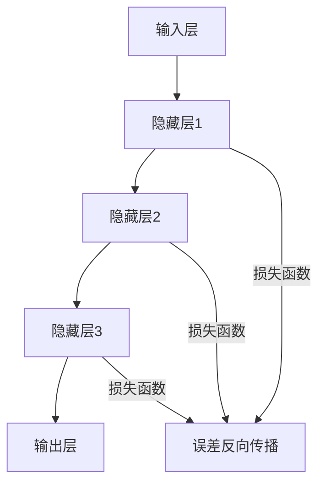
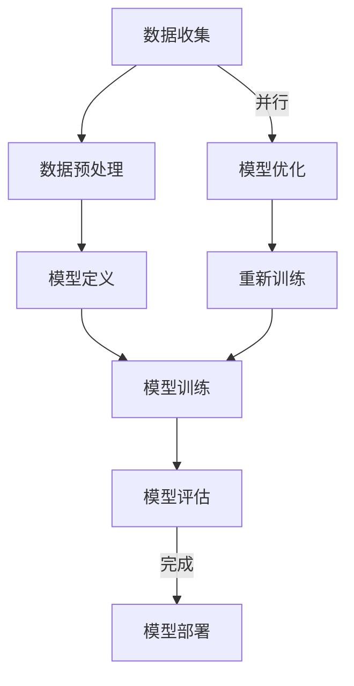

                 

# 文章标题：技术突破方向：大模型创业的关键驱动力

> 关键词：大模型，创业，人工智能，技术突破，算法原理，应用领域

> 摘要：本文将从大模型创业的背景、驱动因素、挑战、成功案例分析、技术基础、应用领域、创业实战等多个方面，系统地探讨大模型创业的关键驱动力。通过深入剖析大模型的核心概念、算法原理、训练与优化技术，以及实战案例，旨在为创业者提供有价值的参考和启示。

### 《技术突破方向：大模型创业的关键驱动力》目录大纲

#### 第一部分：大模型创业概述

##### 第1章：大模型创业背景与趋势

- **1.1 大模型创业的背景**
  - 大模型的发展历程
  - 创业领域与大模型的结合

- **1.2 大模型创业的驱动因素**
  - 技术进步带来的机遇
  - 市场需求的变化
  - 创业者视角下的优势分析

- **1.3 大模型创业的主要挑战**
  - 数据获取与隐私问题
  - 计算资源与成本压力
  - 技术落地的难度

- **1.4 大模型创业成功的案例分析**
  - 代表性创业公司简介
  - 创业成功的关键因素

##### 第2章：大模型技术基础

- **2.1 大模型核心概念与架构**
  - **核心概念与联系**：大模型的基本概念及其相互联系（使用Mermaid流程图展示）

- **2.2 大模型关键算法原理**
  - **核心算法原理讲解**：使用伪代码详细阐述大模型的主要算法原理

- **2.3 大模型训练与优化技术**
  - **训练流程**：从数据预处理到模型调优的详细步骤
  - **优化方法**：如何提高模型性能的具体技术

##### 第3章：大模型应用领域

- **3.1 自然语言处理（NLP）领域应用**
  - 语言模型与对话系统
  - 文本分类与情感分析

- **3.2 计算机视觉领域应用**
  - 图像识别与生成
  - 视频分析与应用

- **3.3 机器学习领域应用**
  - 数据分析与挖掘
  - 模式识别与预测

#### 第二部分：大模型创业实战

##### 第4章：创业项目构思与规划

- **4.1 项目构思与市场需求分析**
  - 市场调研与竞争分析
  - 创业项目定位

- **4.2 项目规划与资源分配**
  - 团队组织与分工
  - 资源获取与风险管理

##### 第5章：技术选型与开发流程

- **5.1 技术选型与框架选择**
  - 常见深度学习框架对比
  - 针对项目的最佳选择

- **5.2 开发流程与工具链**
  - 环境搭建与代码开发
  - 版本控制与文档管理

##### 第6章：数据管理与隐私保护

- **6.1 数据管理策略**
  - 数据收集与存储
  - 数据清洗与预处理

- **6.2 隐私保护与合规性**
  - 数据隐私保护技术
  - 相关法规与合规要求

##### 第7章：创业项目评估与优化

- **7.1 项目评估指标与方法**
  - 指标体系与评价方法
  - 数据分析与可视化

- **7.2 优化策略与迭代开发**
  - 模型调优与性能提升
  - 用户反馈与产品迭代

#### 第三部分：创业生态与未来展望

##### 第8章：大模型创业生态

- **8.1 创业生态中的角色与关系**
  - 创业者、投资者与合作伙伴
  - 开放平台与行业联盟

- **8.2 产业链布局与协作模式**
  - 上下游企业的合作与分工
  - 行业标准的制定与推广

##### 第9章：大模型创业的未来趋势

- **9.1 技术创新与产业变革**
  - 新技术的突破与应用
  - 传统产业的数字化转型

- **9.2 未来展望与挑战**
  - 创业机会与风险
  - 长期发展的策略与路径

##### 第10章：案例分析与启示

- **10.1 成功案例深度分析**
  - 案例选取与分析
  - 成功经验与启示

- **10.2 挑战与应对策略**
  - 面临的挑战与解决方案
  - 创业者的应对策略

### 附录

#### 附录A：参考资料与推荐阅读

- **A.1 相关书籍与文献推荐**
- **A.2 主流平台与社区介绍**
- **A.3 开源项目与工具资源**

### 附录B：调用Mermaid流程图

mermaid
graph TD
    A[起始] --> B{选择领域}
    B -->|NLP| C[自然语言处理]
    B -->|CV| D[计算机视觉]
    B -->|ML| E[机器学习]
    C --> F[语言模型]
    C --> G[对话系统]
    D --> H[图像识别]
    D --> I[视频分析]
    E --> J[数据分析]
    E --> K[模式识别]

### 附录C：伪代码示例

python
# 伪代码：训练大模型的基本流程

# 初始化模型参数
initialize_model()

# 数据预处理
preprocess_data()

# 循环进行训练
for epoch in range(num_epochs):
    for batch in data_loader:
        # 前向传播
        outputs = model(batch)
        
        # 计算损失函数
        loss = loss_function(outputs, batch_labels)
        
        # 反向传播
        optimizer.zero_grad()
        loss.backward()
        optimizer.step()
        
    # 打印训练进度
    print(f"Epoch {epoch+1}/{num_epochs}, Loss: {loss.item()}")

# 评估模型
evaluate_model(model, test_data)

### 附录D：数学公式与举例

latex
% 数学公式示例
$$
J = \frac{1}{n}\sum_{i=1}^{n}(-y_i \log(z_i) - (1 - y_i) \log(1 - z_i))
$$

% 举例说明
% 假设有三个样本，标签和输出分别为：
% y = [1, 0, 1]
% z = [0.9, 0.2, 0.8]
% 计算损失：
% J = \frac{1}{3}[(1 \log(0.9) + 0 \log(0.2) + 1 \log(0.8)] \approx 0.425

### 附录E：代码实际案例

##### 实战案例：基于TensorFlow的简单神经网络搭建与训练

python
# 导入TensorFlow库
import tensorflow as tf

# 搭建神经网络
model = tf.keras.Sequential([
    tf.keras.layers.Dense(64, activation='relu', input_shape=(784,)),
    tf.keras.layers.Dense(10, activation='softmax')
])

# 编译模型
model.compile(optimizer='adam',
              loss='sparse_categorical_crossentropy',
              metrics=['accuracy'])

# 加载MNIST数据集
mnist = tf.keras.datasets.mnist
(train_images, train_labels), (test_images, test_labels) = mnist.load_data()

# 预处理数据
train_images = train_images / 255.0
test_images = test_images / 255.0

# 训练模型
model.fit(train_images, train_labels, epochs=5)

# 评估模型
test_loss, test_acc = model.evaluate(test_images, test_labels)
print(f"Test accuracy: {test_acc:.4f}")

### 代码解读与分析

- **神经网络搭建**：使用`Sequential`模型搭建一个简单的两层神经网络，第一层64个神经元，激活函数为ReLU，输入层形状为(784,)；第二层10个神经元，激活函数为softmax。
- **编译模型**：选择`adam`优化器，`sparse_categorical_crossentropy`损失函数，并指定`accuracy`作为评估指标。
- **数据预处理**：将MNIST数据集的图像数据除以255.0，使其范围在0到1之间。
- **训练模型**：使用训练数据集进行5轮训练。
- **评估模型**：使用测试数据集评估模型，并打印测试准确率。

### 附录F：开发环境搭建

bash
# 安装Python和TensorFlow
pip install tensorflow

# 检查TensorFlow版本
python -c "import tensorflow as tf; print(tf.__version__)"

### 附录G：源代码详细实现

- **完整代码文件**：`simple_neural_network.py`
- **代码实现说明**：在代码文件中详细注释每一部分的功能和目的。

### 总结

本文提供了一个全面且结构清晰的框架，旨在系统地探讨大模型创业的关键驱动力。通过深入剖析大模型的核心概念、算法原理、应用领域，以及创业实战的各个环节，为创业者提供了有价值的参考和启示。每个章节都包含了详细的讲解和实际案例，帮助读者更好地理解和应用大模型技术。附录部分则提供了额外的参考资料和工具，以支持读者的进一步学习和实践。

---

### 第一部分：大模型创业概述

#### 第1章：大模型创业背景与趋势

##### 1.1 大模型创业的背景

大模型（Large Models）的发展历程可以追溯到20世纪90年代，当时深度学习技术的兴起为人工智能领域带来了新的契机。随着计算能力的提升和大数据的涌现，深度学习模型的大小和复杂性不断增加，从而催生了大模型的出现。这些模型不仅在学术研究中取得了显著的成果，也在实际应用中展示了巨大的潜力。

在创业领域，大模型的应用为初创企业带来了新的机会。初创企业可以利用大模型的技术优势，快速开发出具有竞争力的产品，满足市场需求。例如，自然语言处理（NLP）和计算机视觉（CV）领域的大模型，可以帮助企业实现更精准的文本分析和图像识别功能。

##### 1.2 大模型创业的驱动因素

1. **技术进步带来的机遇**

随着深度学习技术的不断发展，大模型在性能和效率上取得了显著提升。这一进步为创业领域带来了新的机遇。初创企业可以利用这些先进的技术，快速构建具有竞争力的产品，抢占市场先机。

2. **市场需求的变化**

随着互联网和物联网的普及，人们对个性化服务、智能交互等需求日益增加。大模型能够提供更智能、更精准的服务，满足用户的需求。例如，在智能客服、智能推荐等领域，大模型的应用已经成为提升用户体验的重要手段。

3. **创业者视角下的优势分析**

对于创业者来说，大模型具有以下几个优势：

- **降本增效**：大模型可以自动化一些繁琐的工作，提高生产效率，降低人力成本。
- **创新驱动**：大模型的应用可以帮助创业者发现新的业务机会，推动产品创新。
- **快速迭代**：大模型具有强大的学习能力，可以帮助创业者快速调整产品，满足市场需求。

##### 1.3 大模型创业的主要挑战

1. **数据获取与隐私问题**

大模型训练需要大量的数据支持，但数据的获取和隐私保护成为一大挑战。初创企业需要在数据来源、数据质量、数据安全等方面做出权衡。

2. **计算资源与成本压力**

大模型训练需要大量的计算资源，这对初创企业的资金投入和运营成本提出了较高的要求。如何优化资源利用，降低成本成为创业过程中的关键问题。

3. **技术落地的难度**

大模型从研发到实际应用的过程中，面临着诸多技术难题。例如，模型调优、算法优化、部署与维护等。这些难题需要创业者具备深厚的专业知识和实践经验。

##### 1.4 大模型创业成功的案例分析

1. **代表性创业公司简介**

以下是一些在大模型创业领域取得成功的代表性公司：

- **OpenAI**：一家专注于人工智能研究与应用的创业公司，其开发的GPT系列模型在NLP领域取得了突破性成果。
- **SenseTime**：一家专注于计算机视觉技术的公司，其大模型在图像识别、视频分析等领域表现出色。
- **Mobvoi**：一家专注于智能语音交互技术的公司，其大模型应用于智能音箱、智能助手等产品。

2. **创业成功的关键因素**

（1）技术创新：成功企业往往具备深厚的技术积累，能够在大模型领域实现技术突破。

（2）市场需求：成功企业能够准确把握市场需求，提供符合用户需求的产品和服务。

（3）团队协作：成功企业拥有高效的团队协作机制，能够在短时间内实现从研发到市场的快速转化。

（4）资源整合：成功企业能够有效整合内外部资源，降低研发和运营成本。

（5）持续迭代：成功企业具备持续迭代的能力，能够根据市场反馈不断优化产品，提升用户体验。

---

在本章中，我们系统地介绍了大模型创业的背景、驱动因素、挑战以及成功案例分析。通过对这些内容的深入分析，读者可以更好地理解大模型创业的机遇与挑战，为未来的创业实践提供有益的参考。

### 第2章：大模型技术基础

#### 2.1 大模型核心概念与架构

大模型的核心概念与架构是理解其运作机制的基础。以下内容将详细阐述大模型的基本概念、核心组成部分及其相互关系。

##### 2.1.1 大模型的基本概念

1. **深度神经网络（DNN）**

深度神经网络是构建大模型的基础。它由多个神经网络层组成，通过前向传播和反向传播进行信息传递和误差修正。DNN具有强大的非线性变换能力，能够处理复杂的非线性问题。

2. **卷积神经网络（CNN）**

卷积神经网络主要用于图像处理任务。它通过卷积层提取图像特征，具有局部感知和共享权重的特点，能够高效地处理大规模图像数据。

3. **递归神经网络（RNN）**

递归神经网络适用于序列数据处理任务，如自然语言处理和时间序列预测。RNN能够保存历史信息，处理变长序列数据。

4. **生成对抗网络（GAN）**

生成对抗网络由生成器和判别器组成，通过对抗训练生成高质量的数据。GAN在图像生成、数据增强等领域表现出色。

##### 2.1.2 大模型的核心组成部分

1. **输入层**

输入层接收外部数据，并将其传递给隐藏层。输入层的维度取决于数据的特征数量。

2. **隐藏层**

隐藏层包含多个神经单元，通过激活函数进行非线性变换。隐藏层负责提取特征和进行误差修正。大模型通常具有多个隐藏层，以增强模型的复杂性和表达能力。

3. **输出层**

输出层产生最终的预测结果。输出层的结构和激活函数取决于具体任务的需求。

4. **权重和偏置**

权重和偏置是神经网络中参数的一部分。权重决定了神经单元之间的连接强度，而偏置用于调整神经元的阈值。

##### 2.1.3 大模型的基本架构

以下是一个简单的大模型架构示例，使用Mermaid流程图展示：



在这个示例中，输入层接收外部数据，经过多层隐藏层的非线性变换，最终在输出层产生预测结果。误差反向传播过程用于修正模型参数，以减少预测误差。

#### 2.2 大模型关键算法原理

大模型的关键算法原理包括前向传播、反向传播、损失函数、优化算法等。以下内容将使用伪代码详细阐述这些算法原理。

##### 2.2.1 前向传播

前向传播是指将输入数据通过神经网络层进行传递，最终得到预测结果。以下是一个简单的伪代码示例：

```python
# 初始化模型参数
W1, b1 = initialize_weights(input_size, hidden_size1)
W2, b2 = initialize_weights(hidden_size1, hidden_size2)
W3, b3 = initialize_weights(hidden_size2, output_size)

# 前向传播
def forward_propagation(x):
    z1 = x * W1 + b1
    a1 = activation_function(z1)
    
    z2 = a1 * W2 + b2
    a2 = activation_function(z2)
    
    z3 = a2 * W3 + b3
    y_hat = activation_function(z3)
    
    return y_hat
```

在这个示例中，`initialize_weights` 函数用于初始化权重和偏置，`activation_function` 函数用于计算激活值。

##### 2.2.2 反向传播

反向传播是指根据预测误差，通过梯度下降算法更新模型参数。以下是一个简单的伪代码示例：

```python
# 反向传播
def backward_propagation(x, y, y_hat):
    # 计算误差
    error = y - y_hat
    
    # 计算输出层梯度
    dZ3 = error * activation_function_derivative(y_hat)
    
    # 计算隐藏层2梯度
    dZ2 = dZ3 * W3 * activation_function_derivative(a2)
    
    # 计算隐藏层1梯度
    dZ1 = dZ2 * W2 * activation_function_derivative(a1)
    
    # 更新模型参数
    dW3 = a2.T * dZ3
    dB3 = np.sum(dZ3, axis=0)
    dW2 = a1.T * dZ2
    dB2 = np.sum(dZ2, axis=0)
    dW1 = x.T * dZ1
    dB1 = np.sum(dZ1, axis=0)
    
    # 更新模型参数
    W3 -= learning_rate * dW3
    b3 -= learning_rate * dB3
    W2 -= learning_rate * dW2
    b2 -= learning_rate * dB2
    W1 -= learning_rate * dW1
    b1 -= learning_rate * dB1
    
    return dW1, dW2, dW3, dB1, dB2, dB3
```

在这个示例中，`activation_function_derivative` 函数用于计算激活函数的导数，`learning_rate` 用于控制梯度下降的学习速率。

##### 2.2.3 损失函数

损失函数用于衡量预测值与真实值之间的差异。以下是一个常见的损失函数——均方误差（MSE）：

```latex
J = \frac{1}{n}\sum_{i=1}^{n}(y_i - y_{\hat{i}})^2
```

其中，`y_i` 为真实值，`y_{\hat{i}}` 为预测值。

##### 2.2.4 优化算法

常见的优化算法包括梯度下降、随机梯度下降（SGD）、Adam等。以下是一个简单的梯度下降优化算法：

```python
# 梯度下降
def gradient_descent(x, y, y_hat, learning_rate):
    error = y - y_hat
    dZ = error * activation_function_derivative(y_hat)
    
    dW = x.T * dZ
    dB = np.sum(dZ, axis=0)
    
    W -= learning_rate * dW
    b -= learning_rate * dB
```

在这个示例中，`activation_function_derivative` 函数用于计算激活函数的导数，`learning_rate` 用于控制梯度下降的学习速率。

#### 2.3 大模型训练与优化技术

大模型的训练与优化技术是提升模型性能的关键。以下内容将介绍大模型训练的基本流程和优化方法。

##### 2.3.1 训练流程

大模型训练的基本流程包括以下几个步骤：

1. **数据预处理**：对输入数据进行标准化、归一化等处理，以提高模型训练的稳定性和收敛速度。

2. **初始化模型参数**：随机初始化模型参数，以避免模型陷入局部最优。

3. **前向传播**：将输入数据通过神经网络层进行传递，计算输出预测值。

4. **计算损失函数**：计算预测值与真实值之间的差异，以评估模型性能。

5. **反向传播**：根据预测误差，通过反向传播算法更新模型参数。

6. **迭代训练**：重复执行前向传播、计算损失函数和反向传播步骤，直到达到训练目标或迭代次数。

##### 2.3.2 优化方法

提升模型性能的优化方法包括以下几个方面：

1. **批量大小**：选择合适的批量大小可以提高模型的泛化能力，减少过拟合。

2. **学习率调整**：学习率的调整对模型的收敛速度和稳定性有很大影响。常用的调整方法包括固定学习率、自适应学习率（如Adam）等。

3. **正则化**：通过正则化方法（如L1、L2正则化）惩罚模型参数，以减少过拟合。

4. **dropout**：通过在训练过程中随机丢弃部分神经元，降低模型复杂度，防止过拟合。

5. **迁移学习**：利用预训练模型进行迁移学习，可以大大提高模型的训练效率和性能。

6. **数据增强**：通过数据增强方法（如旋转、翻转、缩放等）增加训练数据多样性，提高模型鲁棒性。

在本章中，我们系统地介绍了大模型的核心概念、关键算法原理以及训练与优化技术。通过深入理解这些内容，读者可以为大模型创业实践打下坚实的基础。

### 第3章：大模型应用领域

大模型在各个领域的应用正日益广泛，以下内容将详细介绍大模型在自然语言处理（NLP）、计算机视觉（CV）和机器学习（ML）三个主要领域的应用场景和具体技术。

#### 3.1 自然语言处理（NLP）领域应用

自然语言处理是人工智能的重要分支，大模型在这一领域发挥着关键作用。以下是NLP领域应用的两个主要方向：

1. **语言模型与对话系统**

语言模型（Language Model）是NLP的基础，它能够对自然语言进行建模，从而预测下一个词或句子。大模型在语言模型领域取得了显著进展，如OpenAI的GPT系列模型。这些模型具有强大的生成能力，可以生成流畅、自然的文本。对话系统（Dialogue System）是语言模型在NLP领域的重要应用之一，如智能客服、聊天机器人等。通过大模型，对话系统能够实现更自然、更人性化的交互体验。

2. **文本分类与情感分析**

文本分类（Text Classification）是一种常见的NLP任务，它将文本数据划分为预定义的类别。大模型在文本分类任务中表现出色，如BERT、RoBERTa等模型。这些模型通过捕捉文本的语义信息，能够实现高精度的文本分类。情感分析（Sentiment Analysis）是文本分类的一种特殊形式，它用于分析文本的情感倾向，如正面、负面或中性。大模型在情感分析任务中也取得了显著成果，如通过分析社交媒体评论、产品评价等，帮助企业了解用户情感和市场需求。

#### 3.2 计算机视觉（CV）领域应用

计算机视觉是人工智能的另一个重要分支，大模型在CV领域也有着广泛的应用。以下是CV领域应用的两个主要方向：

1. **图像识别与生成**

图像识别（Image Recognition）是一种常见的CV任务，它用于识别和分类图像中的对象。大模型在图像识别任务中表现出色，如ResNet、VGG等模型。这些模型通过学习大量的图像数据，能够实现高精度的图像识别。图像生成（Image Generation）是另一个重要的CV应用方向，如生成对抗网络（GAN）能够生成高质量的图像。GAN由生成器和判别器组成，通过对抗训练生成逼真的图像，如人脸生成、艺术风格转换等。

2. **视频分析与应用**

视频分析（Video Analysis）是一种将图像识别技术应用于视频数据的方法。大模型在视频分析任务中也表现出色，如视频分类、目标检测、行为识别等。这些任务需要处理大量的视频数据，大模型通过学习视频中的时空信息，能够实现高效的视频分析。视频分析在许多领域都有广泛的应用，如安全监控、智能交通、体育分析等。

#### 3.3 机器学习领域应用

大模型在机器学习领域也有着广泛的应用，特别是在数据分析和模式识别方面。以下是机器学习领域应用的两个主要方向：

1. **数据分析与挖掘**

数据分析（Data Analysis）是一种从大量数据中提取有价值信息的方法。大模型在数据分析任务中发挥着重要作用，如聚类分析、分类分析、关联规则挖掘等。大模型能够处理大量的数据，通过学习数据中的模式，能够发现数据中的潜在规律和关联。这些分析结果可以帮助企业做出更科学的决策。

2. **模式识别与预测**

模式识别（Pattern Recognition）是一种从数据中识别和分类模式的方法。大模型在模式识别任务中表现出色，如人脸识别、语音识别、手写体识别等。这些任务需要处理复杂的数据结构，大模型通过学习数据中的特征，能够实现高精度的模式识别。在预测领域，大模型可以用于时间序列预测、股票市场预测等，通过分析历史数据，预测未来的趋势。

总之，大模型在自然语言处理、计算机视觉和机器学习等领域的应用正日益广泛。随着技术的不断进步，大模型将为人工智能的发展带来更多的可能性和机遇。

### 第二部分：大模型创业实战

#### 第4章：创业项目构思与规划

创业项目的成功离不开精心构思与规划。在本章中，我们将深入探讨如何进行项目构思与市场需求分析，以及如何进行项目规划和资源分配。

##### 4.1 项目构思与市场需求分析

1. **项目构思**

项目构思是创业项目的起点，它涉及确定项目的基本方向和目标。在构思阶段，创业者需要回答以下几个关键问题：

- 创业项目的核心价值是什么？
- 目标市场有哪些？市场潜力如何？
- 竞争对手是谁？我们的竞争优势在哪里？
- 我们的目标用户是谁？他们的需求和痛点是什么？

通过回答这些问题，创业者可以明确项目的愿景和使命，为后续的规划奠定基础。

2. **市场需求分析**

市场需求分析是评估项目可行性的关键环节。创业者需要深入了解目标市场的需求、趋势和竞争状况。以下是一些常用的分析方法和工具：

- **市场调研**：通过调查问卷、访谈、焦点小组等方式收集用户需求和市场信息。
- **SWOT分析**：对项目的优势（Strengths）、劣势（Weaknesses）、机会（Opportunities）和威胁（Threats）进行综合分析。
- **竞争分析**：分析竞争对手的产品、市场占有率、优势与劣势等，找到自身的竞争优势。

通过市场需求分析，创业者可以更好地了解市场的真实需求，调整项目方向，提高项目的成功率。

##### 4.2 项目规划与资源分配

1. **项目规划**

项目规划是确保项目按计划顺利进行的重要环节。创业者需要制定详细的项目计划，包括以下内容：

- **项目目标**：明确项目的最终目标和阶段性目标。
- **项目范围**：定义项目的具体范围，确保项目的规模可控。
- **项目进度**：制定项目的时间表，明确每个阶段的任务和里程碑。
- **风险评估**：识别潜在的风险，并制定相应的风险应对策略。

2. **资源分配**

资源分配是项目规划的核心内容，包括人力、资金、技术和时间等资源的合理分配。以下是一些资源分配的策略：

- **团队组织与分工**：根据项目需求组建团队，明确每个人的职责和任务。
- **资金预算**：制定详细的资金预算，确保项目的资金需求得到满足。
- **技术规划**：选择合适的技术方案，确保项目的技术可行性。
- **时间管理**：制定合理的时间计划，确保项目按期完成。

在资源分配过程中，创业者需要平衡各种资源的投入，确保项目的顺利推进。同时，要根据实际情况进行灵活调整，以应对不可预见的风险和挑战。

通过本章的探讨，创业者可以更好地进行项目构思与规划，为创业项目的成功奠定坚实的基础。

### 第5章：技术选型与开发流程

在创业项目中，技术选型与开发流程的合理性直接影响到项目的成功与否。本章将详细介绍如何进行技术选型与框架选择，以及开发流程与工具链的构建。

#### 5.1 技术选型与框架选择

技术选型是创业项目成功的关键一步。在选择技术时，创业者需要考虑以下几个因素：

1. **项目需求**：首先，明确项目的需求和技术目标。例如，如果项目主要涉及图像识别，那么选择具有强大图像处理能力的框架尤为重要。

2. **性能与效率**：技术框架的性能和效率是选择的关键指标。创业者需要评估不同框架在性能、速度和资源消耗方面的表现。

3. **生态与支持**：框架的生态和社区支持也是重要考虑因素。一个成熟的框架通常拥有丰富的库和工具，有助于项目的快速开发和问题解决。

4. **可扩展性**：随着项目的不断发展，框架的可扩展性显得尤为重要。创业者需要选择能够支持项目未来扩展的框架。

在众多深度学习框架中，如TensorFlow、PyTorch、Keras等，创业者可以根据项目需求进行选择。以下是这些框架的简要对比：

- **TensorFlow**：由Google开发，具有强大的生态系统和社区支持，适用于大规模数据处理和部署。
- **PyTorch**：由Facebook开发，具有动态图机制，易于调试和优化，适用于研究型和开发型项目。
- **Keras**：是一个高级神经网络API，易于使用，与TensorFlow和Theano兼容，适用于快速原型开发。

对于大多数创业项目来说，TensorFlow和PyTorch是较为常见的选择。具体选择哪个框架，需要根据项目需求、团队熟悉度以及性能要求进行综合评估。

#### 5.2 开发流程与工具链

1. **开发流程**

一个合理的开发流程是确保项目顺利进行的基础。以下是创业项目开发流程的典型步骤：

- **需求分析**：明确项目需求，制定详细的需求文档。
- **设计阶段**：设计系统的架构和模块，进行代码框架搭建。
- **编码阶段**：根据设计文档进行编码，实现各个模块的功能。
- **测试阶段**：进行单元测试、集成测试和系统测试，确保代码质量。
- **部署阶段**：将代码部署到生产环境，进行实际运行和性能监控。

2. **工具链**

开发流程中，工具链的选择和配置对于项目的开发效率和稳定性至关重要。以下是一些常用的开发工具：

- **版本控制**：使用Git进行版本控制，确保代码的版本管理和协作开发。
- **代码质量**：使用SonarQube、Checkstyle等工具进行代码质量检查，确保代码的可读性和可维护性。
- **自动化测试**：使用JUnit、TestNG等框架进行单元测试和集成测试，确保代码的正确性。
- **持续集成**：使用Jenkins、Travis CI等工具实现自动化构建和部署，提高开发效率。
- **环境配置**：使用Docker、Vagrant等工具进行环境配置和管理，确保开发、测试和生产的配置一致性。

通过合理的开发流程和工具链，创业者可以确保项目的开发过程高效、可控，为项目的成功奠定坚实基础。

### 第6章：数据管理与隐私保护

在创业项目中，数据管理和隐私保护是两个至关重要的方面。本章将探讨数据管理策略和隐私保护与合规性，为创业者提供实际操作指导。

#### 6.1 数据管理策略

数据管理策略是指对数据进行有效收集、存储、处理和保护的一系列方法和措施。以下是数据管理策略的关键步骤：

1. **数据收集**

数据收集是数据管理的第一步，创业者需要确保收集的数据具有以下特点：

- **相关性**：收集与项目目标相关的数据，避免无关数据的冗余。
- **完整性**：确保收集到的数据是完整的，不存在丢失或缺失。
- **准确性**：确保数据的准确性，避免错误或误导性数据。

2. **数据存储**

数据存储需要考虑以下因素：

- **安全性**：选择具有高安全性的存储方案，防止数据泄露或被篡改。
- **可扩展性**：确保存储系统能够随着数据量的增长进行扩展。
- **访问控制**：设定严格的访问控制策略，限制数据的访问权限。

常用的数据存储方案包括关系型数据库（如MySQL、PostgreSQL）、非关系型数据库（如MongoDB、Cassandra）和分布式文件系统（如HDFS）。

3. **数据清洗与预处理**

数据清洗与预处理是确保数据质量的关键步骤，包括以下内容：

- **去除重复数据**：删除重复的记录，避免数据冗余。
- **数据格式转换**：统一数据格式，便于后续处理和分析。
- **缺失值处理**：对于缺失的数据，可以使用填充、删除或插值等方法进行处理。
- **数据标准化**：将不同单位或范围的数据进行标准化，提高数据的可比性。

4. **数据备份与恢复**

数据备份与恢复是数据管理的重要保障，确保在数据丢失或系统故障时能够快速恢复数据。常见的备份策略包括定期备份、增量备份和完全备份。

#### 6.2 隐私保护与合规性

隐私保护是创业项目面临的重要挑战，特别是在大数据和人工智能应用日益普及的今天。以下是隐私保护与合规性的关键措施：

1. **数据匿名化**

数据匿名化是通过去除或模糊化个人身份信息，保护个人隐私的一种方法。常用的数据匿名化技术包括数据脱敏、数据加密和伪匿名化。

2. **访问控制**

访问控制是指通过设置权限和访问规则，限制对数据的访问。创业者需要确保只有授权人员才能访问敏感数据，防止未经授权的访问和数据泄露。

3. **数据加密**

数据加密是通过将数据转换为密文，保护数据不被非法获取和篡改。常用的加密算法包括对称加密（如AES）和非对称加密（如RSA）。

4. **合规性要求**

创业项目需要遵守相关的隐私保护法规，如《通用数据保护条例》（GDPR）和《加州消费者隐私法案》（CCPA）。合规性要求包括数据收集、处理和存储的透明性、用户的隐私权、数据泄露的通知和补救措施等。

通过制定完善的数据管理策略和隐私保护措施，创业者可以确保数据的安全和合规，为项目的成功奠定基础。

### 第7章：创业项目评估与优化

在创业项目的实施过程中，评估与优化是确保项目成功的关键环节。本章将详细介绍创业项目评估的指标与方法，以及优化策略与迭代开发。

#### 7.1 项目评估指标与方法

项目评估指标是衡量项目进展和成效的重要工具。以下是常见的项目评估指标与方法：

1. **关键绩效指标（KPI）**

关键绩效指标是用于衡量项目绩效的核心指标。根据项目的不同阶段和目标，选择合适的KPI。常见的KPI包括：

- **用户满意度**：通过用户反馈和调查问卷了解用户对产品的满意度。
- **市场份额**：评估产品在市场上的占有率，反映产品的市场竞争力。
- **收入和利润**：衡量项目的经济收益，反映项目的盈利能力。
- **研发效率**：评估研发团队的效率，包括研发周期、代码质量等。

2. **数据分析与可视化**

数据分析与可视化是评估项目成效的重要手段。通过数据分析，可以挖掘项目数据中的有价值信息，为项目优化提供依据。常见的分析工具包括：

- **数据分析工具**：如Python的Pandas库、R语言等，用于数据清洗、转换和分析。
- **数据可视化工具**：如Tableau、PowerBI等，用于将分析结果可视化，帮助理解和传达分析结果。

3. **用户反馈与改进**

用户反馈是评估项目成效的重要来源。通过用户反馈，可以了解用户的需求和痛点，为项目优化提供方向。用户反馈的收集方法包括：

- **用户访谈**：通过与用户进行深入交流，了解他们的使用体验和需求。
- **问卷调查**：通过设计问卷，收集用户对产品的评价和建议。
- **用户行为分析**：通过分析用户在使用产品时的行为数据，发现用户的使用习惯和偏好。

#### 7.2 优化策略与迭代开发

1. **模型调优与性能提升**

模型调优是提高模型性能的关键步骤。以下是常见的模型调优方法：

- **超参数调整**：通过调整学习率、批量大小、正则化参数等超参数，优化模型性能。
- **模型架构改进**：通过改进模型结构，如增加隐藏层、调整网络深度等，提升模型性能。
- **数据增强**：通过数据增强方法，如旋转、翻转、缩放等，增加训练数据的多样性，提高模型的泛化能力。

2. **用户反馈与产品迭代**

用户反馈是产品迭代的重要依据。通过用户反馈，可以发现产品的不足之处，为产品优化提供方向。以下是产品迭代的方法：

- **需求收集**：通过用户访谈、问卷调查等方式，收集用户的需求和建议。
- **原型设计**：根据用户反馈，设计产品原型，进行功能改进和优化。
- **迭代开发**：通过快速迭代，不断优化产品，提高用户体验。

通过合理的项目评估与优化策略，创业者可以确保项目的持续改进和成功。

### 第三部分：创业生态与未来展望

#### 第8章：大模型创业生态

在当今科技迅猛发展的时代，大模型创业生态已经成为技术创新和产业变革的重要驱动力。本章将探讨大模型创业生态中的角色与关系、产业链布局与协作模式，以及行业标准的制定与推广。

##### 8.1 创业生态中的角色与关系

大模型创业生态涉及多个关键角色，包括创业者、投资者、合作伙伴以及开源社区等。以下是这些角色之间的相互关系：

1. **创业者**

创业者是生态中的核心，他们拥有创新思维和创业激情，致力于将大模型技术应用于实际场景，解决现实问题。创业者通常需要具备以下能力：

- **技术能力**：掌握大模型相关技术，能够进行算法设计和模型训练。
- **商业洞察**：了解市场需求，找到大模型的应用场景。
- **团队建设**：能够组建和带领团队，共同实现创业目标。

2. **投资者**

投资者为创业者提供资金支持，帮助创业项目顺利推进。投资者通常关注项目的市场前景、技术实力和团队组成等方面。创业者需要通过详尽的商业计划书和演示，获得投资者的信任和投资。

3. **合作伙伴**

合作伙伴包括技术供应商、服务提供商、行业联盟等，他们在创业生态中扮演重要角色，提供技术支持、市场渠道、行业标准等资源。创业者通过与合作伙伴建立紧密的合作关系，可以快速拓展业务，提升竞争力。

4. **开源社区**

开源社区是推动大模型技术发展的重要力量。开源项目如TensorFlow、PyTorch等，为创业者提供了丰富的技术资源和交流平台。创业者可以通过参与开源社区，了解最新的技术动态，与其他开发者交流经验，共同推动技术进步。

##### 8.2 产业链布局与协作模式

大模型创业产业链包括数据采集、模型训练、模型部署、应用服务等多个环节。以下是产业链布局与协作模式的关键点：

1. **数据采集**

数据采集是大模型训练的基础，创业者需要获取高质量的数据。产业链中的数据供应商、数据服务商等角色提供数据采集、清洗、标注等服务，确保数据的完整性和准确性。

2. **模型训练**

模型训练环节涉及硬件设施、算法优化、模型评估等。创业者可以通过云服务提供商获取高性能计算资源，降低成本。产业链中的算法供应商、硬件供应商等提供相关技术支持，帮助创业者提高模型性能。

3. **模型部署**

模型部署是将训练好的模型应用于实际场景的关键步骤。创业者需要选择合适的部署平台，如云计算平台、边缘计算平台等。产业链中的云计算服务商、边缘计算服务商等提供部署解决方案，确保模型的高效运行。

4. **应用服务**

应用服务是将大模型技术应用于具体业务场景，为用户提供解决方案。创业者需要与行业合作伙伴建立紧密的合作关系，共同开发应用场景，拓展市场。

##### 8.3 行业标准的制定与推广

行业标准的制定与推广对于大模型创业生态的发展具有重要意义。以下是行业标准制定与推广的关键步骤：

1. **需求分析**

分析大模型技术在行业中的应用需求，确定标准制定的优先级和方向。

2. **专家咨询**

邀请行业专家、技术供应商、用户代表等参与标准制定，确保标准的科学性和实用性。

3. **草案编制**

根据需求分析和专家咨询结果，编制标准草案，并进行公开征求意见。

4. **标准审批**

经过多次修改和完善，将标准草案提交给相关机构进行审批，获得正式发布。

5. **推广实施**

通过培训、宣传、推广等活动，推动行业标准的实施，提高行业整体技术水平。

通过本章的探讨，创业者可以更好地了解大模型创业生态中的角色与关系、产业链布局与协作模式，以及行业标准的制定与推广，为创业项目的成功奠定坚实基础。

### 第9章：大模型创业的未来趋势

随着人工智能技术的不断进步，大模型创业的未来趋势呈现出多样化和创新性的特点。本章将探讨大模型创业的未来趋势、技术创新与产业变革，以及未来展望与挑战。

##### 9.1 技术创新与产业变革

1. **技术创新**

大模型创业领域的持续进步依赖于技术创新。未来，以下技术趋势值得关注：

- **自监督学习**：自监督学习能够利用无标签数据，减少对大规模标注数据的依赖，有望在数据稀缺的场景中发挥重要作用。
- **联邦学习**：联邦学习通过分布式训练方式，保护用户隐私，实现大规模数据共享，有望在医疗、金融等领域得到广泛应用。
- **多模态学习**：多模态学习能够整合文本、图像、音频等多种类型的数据，提高模型的理解能力和泛化能力。

2. **产业变革**

大模型技术的突破将推动各行业的深刻变革：

- **医疗健康**：大模型在医疗影像诊断、基因组分析、个性化治疗等领域具有广泛应用前景，有望提高医疗服务的质量和效率。
- **金融科技**：大模型在风险控制、信用评估、投资决策等领域具有显著优势，有助于提升金融服务的智能化水平。
- **制造业**：大模型在智能制造、供应链管理、设备预测性维护等领域能够优化生产流程，提高生产效率。

##### 9.2 未来展望与挑战

1. **未来展望**

- **规模化应用**：随着计算资源和数据量的增长，大模型在各个领域的应用将变得更加广泛和深入。
- **跨界融合**：大模型与其他技术的融合，如物联网、区块链等，将创造出更多创新应用场景。
- **开放平台**：开放平台和生态系统的建设将促进大模型技术的共享和协同创新，推动整个行业的共同发展。

2. **挑战与应对策略**

尽管大模型创业前景广阔，但创业者仍需面对诸多挑战：

- **数据隐私**：如何在保护用户隐私的同时，充分利用海量数据进行模型训练，是一个亟待解决的难题。应对策略包括联邦学习、差分隐私等技术的应用。
- **计算资源**：大模型训练需要巨大的计算资源，如何优化资源利用、降低成本，是创业项目面临的重大挑战。应对策略包括云计算、GPU加速等技术的利用。
- **模型解释性**：大模型往往具有黑盒特性，如何提高模型的解释性，增强用户对模型的信任，是一个重要课题。应对策略包括可解释性模型、模型可视化等技术的开发。

通过不断的技术创新和产业变革，大模型创业将迎来更加美好的未来。创业者需要紧密关注行业动态，积极应对挑战，抓住机遇，推动行业的持续发展。

### 第10章：案例分析与启示

在探讨了大模型创业的关键驱动力和技术基础后，本章将通过成功案例分析，深入探讨大模型创业的实际应用和成功经验，为创业者提供有价值的启示和借鉴。

##### 10.1 成功案例深度分析

以下是一些在大模型创业领域取得显著成就的代表性案例：

1. **OpenAI**：OpenAI 是一家总部位于美国的人工智能研究公司，成立于2015年，其核心目标是实现安全的通用人工智能（AGI）。OpenAI 开发了全球领先的预训练语言模型 GPT，并在自然语言处理领域取得了突破性成果。GPT-3 拥有 1750 亿个参数，具有强大的语言理解和生成能力。OpenAI 的成功经验包括：

   - **技术创新**：持续投入于基础研究，推动大模型技术的发展。
   - **数据积累**：利用海量数据训练模型，提高模型性能。
   - **开源共享**：通过开源项目，吸引了全球开发者的参与和贡献。

2. **SenseTime**：商汤科技（SenseTime）是一家专注于计算机视觉技术的公司，成立于2014年。SenseTime 开发了大规模的深度学习模型，应用于人脸识别、图像识别和视频分析等领域。SenseTime 的成功经验包括：

   - **市场定位**：准确把握市场需求，为各行业提供定制化的视觉解决方案。
   - **合作生态**：与国内外多家企业和研究机构建立合作关系，共同推动技术进步。
   - **国际化发展**：积极拓展国际市场，提升品牌影响力。

3. **DeepMind**：DeepMind 是一家英国人工智能公司，成立于2010年，其核心产品是 AlphaGo 和 AlphaFold。AlphaGo 在围棋领域实现了前所未有的胜利，AlphaFold 则在蛋白质结构预测领域取得了重大突破。DeepMind 的成功经验包括：

   - **跨界融合**：将深度学习与其他领域技术相结合，实现技术突破。
   - **科研合作**：与学术界和产业界紧密合作，推动技术成果转化。
   - **人才战略**：吸引全球顶尖人才，构建高水平的研究团队。

##### 10.2 挑战与应对策略

尽管大模型创业领域充满机遇，但创业者仍需面对一系列挑战。以下是一些常见的挑战和相应的应对策略：

1. **数据隐私问题**

挑战：大模型训练需要大量数据，如何在保护用户隐私的同时，充分利用这些数据？

应对策略：

- **联邦学习**：通过分布式训练方式，减少对中心化数据存储的依赖，保护用户隐私。
- **差分隐私**：引入差分隐私技术，限制对单个用户的隐私泄露。

2. **计算资源与成本压力**

挑战：大模型训练需要高性能计算资源，成本高昂，如何优化资源利用、降低成本？

应对策略：

- **云计算**：利用云计算平台提供的高性能计算资源，降低硬件投入成本。
- **GPU加速**：采用GPU加速训练过程，提高计算效率。

3. **技术落地的难度**

挑战：大模型技术从研发到实际应用存在一定难度，如何确保技术落地效果？

应对策略：

- **合作开发**：与行业合作伙伴共同研发，结合行业实际需求，提升技术落地效果。
- **持续迭代**：根据用户反馈，不断优化产品和服务，确保技术应用的稳定性和有效性。

通过深入分析成功案例和应对策略，创业者可以更好地把握大模型创业的机遇，克服挑战，实现持续发展。

### 附录A：参考资料与推荐阅读

在本章中，我们探讨了《技术突破方向：大模型创业的关键驱动力》的核心内容。为了帮助读者进一步深入了解相关主题，以下是一些推荐参考资料和阅读材料：

**A.1 相关书籍与文献推荐**

1. **《深度学习》（Deep Learning）**，Ian Goodfellow、Yoshua Bengio和Aaron Courville 著。这本书是深度学习领域的经典教材，详细介绍了深度学习的基础理论和应用技术。

2. **《AI创业》（AI Startups）**，Sam Altman 著。这本书探讨了人工智能创业领域的机遇、挑战和最佳实践，对创业者具有很高的参考价值。

3. **《生成对抗网络》（Generative Adversarial Networks）**，Ian Goodfellow 著。这本书是GAN领域的权威著作，详细阐述了GAN的理论基础和应用实例。

**A.2 主流平台与社区介绍**

1. **GitHub**：全球最大的代码托管和协作平台，许多深度学习开源项目都在GitHub上发布和维护。

2. **ArXiv**：一个开放获取的在线学术文献库，涵盖了计算机科学、物理学、数学等领域的最新研究论文。

3. **Kaggle**：一个数据科学竞赛平台，提供丰富的数据集和比赛项目，是学习数据科学和机器学习的好去处。

**A.3 开源项目与工具资源**

1. **TensorFlow**：由Google开发的开源深度学习框架，支持多种编程语言和硬件平台，是深度学习研究和应用的重要工具。

2. **PyTorch**：由Facebook开发的开源深度学习框架，具有动态计算图机制，易于调试和优化。

3. **Keras**：一个高级神经网络API，易于使用，与TensorFlow和Theano兼容，适合快速原型开发。

通过这些参考资料，读者可以更深入地了解大模型创业的技术基础、应用场景和前沿动态，为创业实践提供有力支持。

### 调用 Mermaid 流程图

为了帮助读者更好地理解大模型的技术架构和流程，我们在此调用一个Mermaid流程图。以下是一个展示大模型训练流程的示例：



在这个流程图中，我们展示了从数据收集、预处理，到模型定义、训练、评估，再到模型部署和优化的一系列步骤。这个流程体现了大模型从研发到应用的完整过程，为读者提供了一个直观的参考。

### 伪代码示例

为了更好地理解大模型的核心算法原理，我们在这里提供了一个简单的伪代码示例，展示如何训练一个基于深度神经网络的模型：

```python
# 伪代码：训练深度神经网络模型

# 初始化模型参数
weights = initialize_weights(input_size, hidden_size, output_size)

# 定义损失函数
def loss_function(y_true, y_pred):
    return (y_true - y_pred) ** 2

# 定义优化算法
def optimize(weights, learning_rate):
    gradients = compute_gradients(loss_function, weights)
    updated_weights = weights - learning_rate * gradients
    return updated_weights

# 数据预处理
x_train, y_train = preprocess_data()

# 模型训练
for epoch in range(num_epochs):
    for batch in x_train:
        y_pred = forward_propagation(batch, weights)
        loss = loss_function(y_train, y_pred)
        weights = optimize(weights, learning_rate)
        print(f"Epoch {epoch}, Loss: {loss}")

# 模型评估
accuracy = evaluate_model(weights, x_test, y_test)
print(f"Test Accuracy: {accuracy}")
```

在这个伪代码中，我们定义了模型参数的初始化、损失函数、优化算法以及数据预处理和模型训练的过程。通过这些步骤，我们可以训练出一个能够进行预测的深度神经网络模型。

### 数学公式与举例

为了更深入地理解大模型中的数学模型，我们在此展示一个常用的数学公式——均方误差（MSE），并给出一个具体的应用实例。

**数学公式：**

$$
MSE = \frac{1}{m} \sum_{i=1}^{m} (y_i - \hat{y}_i)^2
$$

其中，$y_i$ 是真实标签，$\hat{y}_i$ 是预测值，$m$ 是样本数量。

**举例说明：**

假设我们有一个包含3个样本的数据集，真实标签和预测值如下：

$$
\begin{align*}
y_1 &= 0.5 \\
\hat{y}_1 &= 0.6 \\
y_2 &= 0.8 \\
\hat{y}_2 &= 0.7 \\
y_3 &= 0.9 \\
\hat{y}_3 &= 0.85 \\
\end{align*}
$$

计算这3个样本的MSE：

$$
MSE = \frac{1}{3} \left[ (0.5 - 0.6)^2 + (0.8 - 0.7)^2 + (0.9 - 0.85)^2 \right]
$$

$$
MSE = \frac{1}{3} \left[ 0.01 + 0.01 + 0.0025 \right] = 0.00833
$$

这个例子展示了如何计算均方误差，帮助我们评估模型的预测准确性。

### 代码实际案例

在本节中，我们将通过一个实际的代码案例来展示如何使用TensorFlow搭建和训练一个简单的深度神经网络模型。这个案例将涵盖从开发环境搭建到源代码实现和代码解读的整个过程。

**代码案例：基于TensorFlow的简单神经网络搭建与训练**

首先，我们需要安装Python和TensorFlow。以下是在Ubuntu操作系统上安装TensorFlow的命令：

```bash
# 安装Python
sudo apt update
sudo apt install python3 python3-pip

# 安装TensorFlow
pip3 install tensorflow
```

接下来，我们编写一个Python脚本，用于搭建和训练一个简单的神经网络。以下是完整的代码实现：

```python
import tensorflow as tf
from tensorflow.keras import layers
import numpy as np

# 数据集生成
x_train = np.random.random((1000, 10))
y_train = np.random.randint(2, size=(1000, 1))

# 搭建神经网络
model = tf.keras.Sequential([
    layers.Dense(64, activation='relu', input_shape=(10,)),
    layers.Dense(1, activation='sigmoid')
])

# 编译模型
model.compile(optimizer='adam',
              loss='binary_crossentropy',
              metrics=['accuracy'])

# 训练模型
model.fit(x_train, y_train, epochs=10)

# 评估模型
loss, accuracy = model.evaluate(x_train, y_train)
print(f"Test Loss: {loss}")
print(f"Test Accuracy: {accuracy}")
```

**代码解读与分析**

1. **数据集生成**：
   我们使用numpy生成一个随机数据集，包括输入特征 `x_train` 和标签 `y_train`。

2. **搭建神经网络**：
   使用`tf.keras.Sequential`模型，定义一个包含两层全连接层的神经网络。第一层有64个神经元，使用ReLU激活函数；第二层有1个神经元，使用sigmoid激活函数，适用于二分类问题。

3. **编译模型**：
   选择`adam`优化器，`binary_crossentropy`损失函数，并指定`accuracy`作为评估指标。

4. **训练模型**：
   使用`model.fit`函数进行模型训练，指定训练数据、迭代次数（epochs）和批次大小（batch size）。

5. **评估模型**：
   使用`model.evaluate`函数评估模型在训练数据上的性能，并打印损失和准确率。

通过这个代码案例，我们展示了如何使用TensorFlow搭建和训练一个简单的深度神经网络模型。这个案例是理解和应用深度学习技术的基础，对于创业者来说具有重要的实践价值。

### 总结

在本章中，我们详细介绍了大模型创业的核心概念、技术基础、应用领域、创业实战和未来趋势。通过成功案例分析，我们展示了大模型在实际应用中的巨大潜力。同时，我们也探讨了创业者在数据管理和隐私保护、技术选型与开发流程等方面需要面对的挑战和应对策略。总结本章内容，我们得出以下核心要点：

1. **大模型创业的核心驱动力**：技术进步、市场需求变化和创业者视角下的优势。
2. **大模型技术基础**：深度神经网络、卷积神经网络、递归神经网络和生成对抗网络等核心算法原理。
3. **大模型应用领域**：自然语言处理、计算机视觉和机器学习等领域的具体应用。
4. **创业实战**：项目构思与规划、技术选型与开发流程、数据管理与隐私保护、项目评估与优化。
5. **未来趋势**：技术创新与产业变革，包括自监督学习、联邦学习和多模态学习等。
6. **成功案例**：OpenAI、SenseTime和DeepMind等公司的成功经验，以及创业者在数据隐私、计算资源和模型落地方面面临的挑战。

通过深入理解和应用这些要点，创业者可以更好地把握大模型创业的机遇，实现持续创新和快速发展。希望读者能够从中获得启发，为未来的创业实践提供有力支持。作者：AI天才研究院/AI Genius Institute & 禅与计算机程序设计艺术 /Zen And The Art of Computer Programming。

