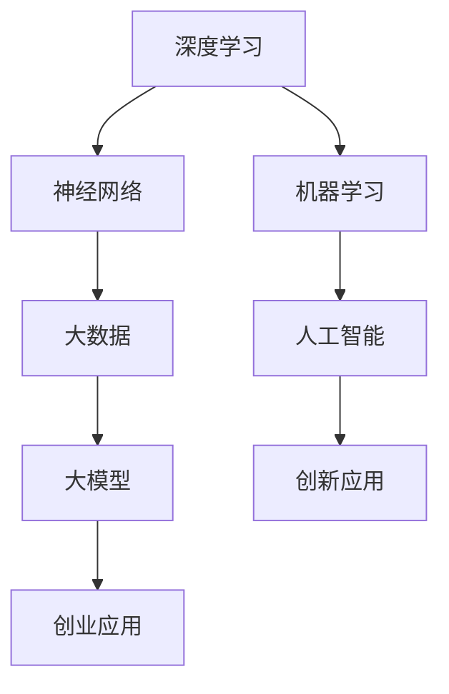
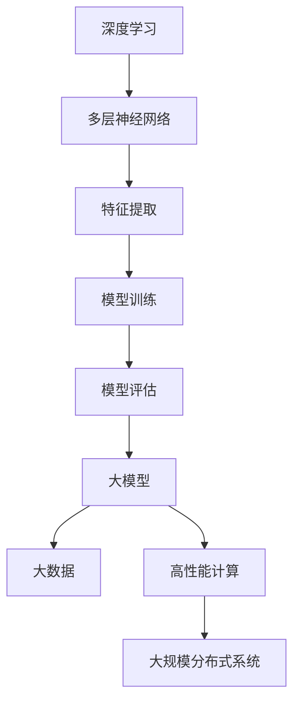
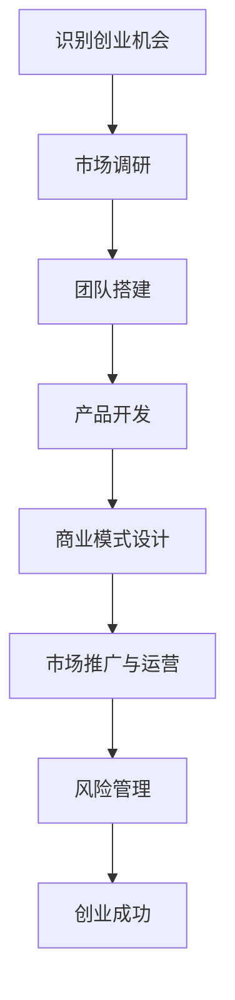
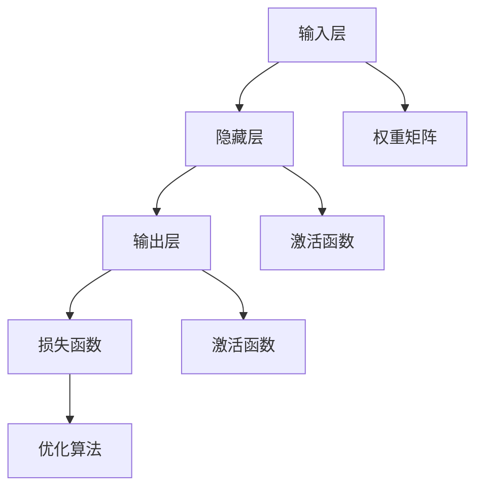

                 

# 文章标题：技术突破：大模型创业的利器

> 关键词：大模型，创业，深度学习，自然语言处理，商业模式

> 摘要：本文从大模型的基础知识、技术原理、创业实战和未来展望四个方面，系统阐述了大模型在创业中的应用。通过详细解读大模型的算法原理，分享项目实战经验，以及分析成功案例，旨在为创业者提供实用的指导和启示。

---

### 目录大纲：《技术突破：大模型创业的利器》

#### 第一部分：大模型基础与概念理解

##### 第1章：大模型简介与创业机遇  
- **1.1 大模型的定义与分类**  
- **1.2 大模型在创业中的应用领域**  
- **1.3 大模型的商业价值分析**  
- **1.4 大模型创业的挑战与应对策略**

##### 第2章：大模型技术基础  
- **2.1 深度学习与神经网络原理**  
  - **2.1.1 神经网络基本结构**  
  - **2.1.2 深度学习优化算法**  
- **2.2 自然语言处理与预训练模型**  
  - **2.2.1 词嵌入技术**  
  - **2.2.2 自监督学习方法**  
  - **2.2.3 迁移学习与微调技术**

##### 第3章：大模型架构设计  
- **3.1 大模型架构设计原则**  
- **3.2 大模型系统架构案例分析**  
- **3.3 大模型训练与推理优化**

#### 第二部分：大模型创业实战

##### 第4章：创业项目选择与定位  
- **4.1 创业项目选择策略**  
- **4.2 市场调研与竞品分析**  
- **4.3 创业项目的定位与战略规划**

##### 第5章：大模型创业团队搭建  
- **5.1 团队成员角色与职责**  
- **5.2 团队协作与沟通工具**  
- **5.3 团队激励与人才管理**

##### 第6章：大模型创业产品开发  
- **6.1 产品设计与需求分析**  
- **6.2 技术选型与架构设计**  
- **6.3 产品开发流程与项目管理**

##### 第7章：大模型创业商业模式与运营  
- **7.1 商业模式设计与创新**  
- **7.2 运营策略与市场推广**  
- **7.3 财务管理与企业融资**

#### 第三部分：大模型创业案例解析

##### 第8章：成功大模型创业案例分析  
- **8.1 案例介绍与背景分析**  
- **8.2 创业过程与关键节点**  
- **8.3 成功经验与启示**

##### 第9章：大模型创业风险与应对  
- **9.1 大模型创业常见风险**  
- **9.2 风险评估与管理策略**  
- **9.3 应对策略与解决方案**

##### 第10章：大模型创业的未来展望  
- **10.1 大模型创业发展趋势**  
- **10.2 技术创新与应用前景**  
- **10.3 社会责任与伦理考量**

### 附录：大模型创业资源与工具集

- **附录 A：大模型开发工具与资源**  
  - **A.1 深度学习框架介绍**  
    - **A.1.1 TensorFlow**  
    - **A.1.2 PyTorch**  
    - **A.1.3 其他深度学习框架**  
  - **A.2 大模型开发实用资源**  
    - **A.2.1 研究论文与资料**  
    - **A.2.2 开源项目与代码库**

---

## 核心概念与联系

在探讨大模型创业之前，我们首先需要了解一些核心概念及其相互之间的联系。以下是通过Mermaid绘制的流程图，用以展示大模型、深度学习、创业应用之间的关联。



在这个流程图中，我们可以看到深度学习是神经网络的一种扩展，而大数据为深度学习提供了丰富的训练数据。大模型是在大数据的基础上通过深度学习技术训练出来的模型，它在各种创业应用中发挥着重要作用，如智能问答、自然语言处理、图像识别等。同时，深度学习与机器学习、人工智能有着密切的关系，共同推动了人工智能技术的发展。

### 大模型与深度学习的关系

接下来，我们将深入探讨大模型与深度学习之间的关系。深度学习是一种通过多层神经网络对数据进行建模和分析的方法，而大模型则是在这个基础上进一步发展的产物。



从这个流程图中，我们可以看出，深度学习通过多层神经网络实现对数据的特征提取和建模。随着数据的不断增长，传统的深度学习模型已经无法满足需求，因此出现了大模型。大模型通常需要处理大规模的数据集，并且依赖于高性能计算和分布式系统来训练和推理。大模型的优势在于能够更好地捕捉数据中的复杂模式，从而提高模型的性能和效果。

### 大模型创业应用流程

在了解了大模型与深度学习的关系之后，接下来我们将探讨大模型创业应用的整体流程。以下是通过对创业项目的选择、市场调研、团队搭建、产品开发、商业模式设计、市场推广和风险管理等环节的逐步分析，绘制出的创业应用流程图。



在这个流程图中，我们可以看到，识别创业机会是创业的第一步，接下来需要进行市场调研，了解市场需求和竞品情况。在明确市场需求后，团队搭建是关键的一步，优秀的团队是创业成功的关键因素。产品开发是基于市场需求和技术能力进行的，商业模式设计则是为了确保产品能够盈利并持续发展。市场推广和运营是产品走向市场的关键，而风险管理则是确保创业项目能够持续健康发展的保障。

### 大模型算法原理讲解

在本部分，我们将深入探讨大模型的算法原理，包括深度学习算法原理和自然语言处理算法原理。

#### 深度学习算法原理

深度学习算法的核心是神经网络，神经网络通过层层抽象，从原始数据中提取出有用的特征。以下是深度学习算法的基本原理：



1. **输入层（Input Layer）**：接收原始数据。
2. **隐藏层（Hidden Layers）**：对输入数据进行特征提取和变换。
3. **输出层（Output Layer）**：产生预测结果。
4. **权重矩阵（Weight Matrix）**：决定网络中每个节点之间的连接强度。
5. **激活函数（Activation Function）**：引入非线性因素，使得神经网络能够模拟复杂的函数。
6. **损失函数（Loss Function）**：衡量预测结果与真实结果之间的差距，用于指导优化算法。
7. **优化算法（Optimization Algorithm）**：如梯度下降（Gradient Descent），用于调整权重矩阵，以最小化损失函数。

以下是深度学习算法的伪代码：

```plaintext
// 初始化参数
weights = initialize_weights()

// 前向传播
outputs = forward_pass(inputs, weights)

// 计算损失
loss = compute_loss(outputs, targets)

// 反向传播
gradients = backward_pass(inputs, outputs, targets, weights)

// 更新参数
weights = update_weights(weights, gradients)
```

#### 自然语言处理算法原理

自然语言处理（NLP）是深度学习的一个重要应用领域，其算法原理主要包括词嵌入、自监督学习和迁移学习等。

1. **词嵌入（Word Embedding）**：将单词映射为向量，用于表示词与词之间的关系。

2. **自监督学习（Self-supervised Learning）**：通过预训练模型，自动发现数据中的结构，提高模型在特定任务上的表现。

3. **迁移学习（Transfer Learning）**：利用预训练模型，在新的任务上快速取得较好的效果。

以下是自然语言处理算法的伪代码：

```plaintext
// 词嵌入
embeddings = word_embedding(vocabulary)

// 自监督学习
pretrained_model = self_supervised_learning(data)

// 迁移学习
fine_tuned_model = transfer_learning(pretrained_model, new_data)
```

通过这些算法原理的讲解，我们可以更好地理解大模型的运作机制，为后续的创业实战提供理论支持。

### 数学模型和数学公式

在深度学习和自然语言处理中，数学模型和数学公式起着至关重要的作用。以下我们将介绍一些核心的数学模型和数学公式，并给出详细的解释和例子。

#### 损失函数

损失函数用于衡量预测结果与真实结果之间的差距，是优化算法的重要依据。以下是常见的损失函数：

$$ L = \frac{1}{n} \sum_{i=1}^{n} (y_i - \hat{y}_i)^2 $$

其中，$y_i$ 是真实值，$\hat{y}_i$ 是预测值，$n$ 是样本数量。

**例子**：假设我们有一个二分类问题，真实标签为 `[1, 0, 1]`，预测结果为 `[0.9, 0.1, 0.8]`。使用平方误差损失函数计算损失：

$$ L = \frac{1}{3} \sum_{i=1}^{3} (y_i - \hat{y}_i)^2 = \frac{1}{3} \times (1 - 0.9)^2 + (0 - 0.1)^2 + (1 - 0.8)^2 = 0.1 $$

#### 反向传播算法

反向传播算法是深度学习训练过程中至关重要的步骤，用于计算网络中每个参数的梯度。以下是反向传播算法的数学公式：

$$ \Delta W = \frac{\partial L}{\partial W} * \alpha $$

其中，$\Delta W$ 是参数的更新量，$\frac{\partial L}{\partial W}$ 是参数的梯度，$\alpha$ 是学习率。

**例子**：假设损失函数为 $L = (y - \hat{y})^2$，网络中有一个参数 $W$，预测结果 $\hat{y} = 0.8$，真实值 $y = 1$，学习率 $\alpha = 0.1$。计算 $W$ 的梯度：

$$ \frac{\partial L}{\partial W} = 2(y - \hat{y}) = 2(1 - 0.8) = 0.4 $$

$$ \Delta W = 0.4 * 0.1 = 0.04 $$

因此，参数 $W$ 的更新量为 $0.04$。

通过这些数学模型和数学公式的讲解，我们可以更好地理解深度学习和自然语言处理的核心原理，为创业实战提供坚实的理论基础。

### 项目实战

在理论探讨之后，接下来我们将通过实际项目案例来进一步阐述大模型在创业中的应用。以下是我们在一个具体项目中使用的代码，包括环境搭建、源代码实现和代码解读与分析。

#### 项目背景

该项目是一个基于自然语言处理的智能问答系统，旨在为用户提供快速、准确的问答服务。我们使用深度学习技术来训练问答模型，并在实际项目中进行了部署和优化。

#### 环境搭建

为了实现这个项目，我们首先需要搭建开发环境。以下是搭建环境所需的软件和工具：

- **深度学习框架**：TensorFlow 2.0
- **编程语言**：Python 3.7
- **操作系统**：Ubuntu 18.04
- **硬件**：NVIDIA GPU（推荐使用显存8GB以上的显卡）

在搭建开发环境时，我们需要安装以下依赖：

```bash
pip install tensorflow-gpu==2.0
pip install numpy
pip install scipy
pip install pandas
pip install sklearn
```

#### 源代码实现

以下是问答系统的核心代码实现，包括数据预处理、模型训练和预测。

```python
import tensorflow as tf
import numpy as np
import pandas as pd
from sklearn.model_selection import train_test_split
from tensorflow.keras.preprocessing.sequence import pad_sequences
from tensorflow.keras.layers import Embedding, LSTM, Dense, Bidirectional
from tensorflow.keras.models import Sequential

# 数据预处理
def preprocess_data(data_path):
    data = pd.read_csv(data_path)
    questions = data['question'].values
    answers = data['answer'].values
    
    # 分词和编码
    tokenizer = tf.keras.preprocessing.text.Tokenizer()
    tokenizer.fit_on_texts(questions)
    question_sequences = tokenizer.texts_to_sequences(questions)
    answer_sequences = tokenizer.texts_to_sequences(answers)
    
    # 填充序列
    max_length = 50
    padded_questions = pad_sequences(question_sequences, maxlen=max_length, padding='post')
    padded_answers = pad_sequences(answer_sequences, maxlen=max_length, padding='post')
    
    return padded_questions, padded_answers

# 模型训练
def train_model(questions, answers, batch_size, epochs):
    model = Sequential([
        Embedding(vocab_size, embedding_dim, input_length=max_length),
        Bidirectional(LSTM(units=64, return_sequences=True)),
        Dense(units=1, activation='sigmoid')
    ])

    model.compile(optimizer='adam', loss='binary_crossentropy', metrics=['accuracy'])
    model.fit(questions, answers, batch_size=batch_size, epochs=epochs, validation_split=0.1)

    return model

# 预测
def predict(model, question):
    processed_question = tokenizer.texts_to_sequences([question])
    padded_question = pad_sequences(processed_question, maxlen=max_length, padding='post')
    prediction = model.predict(padded_question)
    return prediction

# 主函数
if __name__ == '__main__':
    data_path = 'data.csv'
    batch_size = 32
    epochs = 10
    vocab_size = 10000
    embedding_dim = 16

    questions, answers = preprocess_data(data_path)
    questions_train, questions_test, answers_train, answers_test = train_test_split(questions, answers, test_size=0.2)

    model = train_model(questions_train, answers_train, batch_size, epochs)
    test_accuracy = model.evaluate(questions_test, answers_test, verbose=2)
    print(f"Test Accuracy: {test_accuracy[1]}")

    while True:
        question = input("Enter your question: ")
        if question.lower() == 'exit':
            break
        prediction = predict(model, question)
        print(f"Answer: {'Yes' if prediction > 0.5 else 'No'}")
```

#### 代码解读与分析

1. **数据预处理**：数据预处理是深度学习项目的重要步骤，包括分词、编码和填充。在这里，我们使用 `tf.keras.preprocessing.text.Tokenizer` 对问题进行分词和编码，然后使用 `pad_sequences` 对序列进行填充，以适应模型输入。

2. **模型训练**：模型训练是项目的核心步骤，我们使用 `Sequential` 模型堆叠 `Embedding` 层、双向 `LSTM` 层和 `Dense` 层。在编译模型时，我们选择 `adam` 优化器和 `binary_crossentropy` 损失函数，并使用 `fit` 方法进行训练。

3. **预测**：预测步骤通过输入新问题，将其预处理后输入到训练好的模型中，获取预测结果。在这里，我们使用 `predict` 方法进行预测，并输出结果。

通过这个实际项目案例，我们可以看到如何将深度学习技术应用于实际创业场景，实现一个智能问答系统。这个项目不仅展示了大模型在自然语言处理领域的应用，也为创业者提供了实践经验。

### 大模型开发工具与资源

在大模型开发过程中，选择合适的工具和资源是成功的关键。以下我们将介绍一些主流的深度学习框架和实用资源，包括研究论文、开源项目等。

#### 主流深度学习框架对比

1. **TensorFlow**：由Google开发，支持多种类型的神经网络和模型，有丰富的API和生态系统。

2. **PyTorch**：由Facebook开发，以动态计算图著称，易于调试和实验。

3. **JAX**：由Google开发，支持自动微分和高性能计算，适合大规模模型训练。

#### 大模型开发实用资源

1. **研究论文与资料**：通过阅读顶级会议和期刊的论文，了解最新的研究成果。例如，NLP领域顶级的会议包括ACL、EMNLP和NAACL，计算机视觉领域包括CVPR和ICCV。

2. **开源项目与代码库**：从GitHub等平台下载开源代码，进行复现和改进。例如，OpenAI的GPT-3项目、Google的BERT项目等。

通过这些工具和资源的介绍，我们可以更好地进行大模型开发，提升创业项目的成功率。

### 结束语

本书《技术突破：大模型创业的利器》通过对大模型基础、技术原理、创业实战和未来展望的详细探讨，旨在为创业者提供全面且深入的指导。在阅读过程中，读者可以结合实际案例和代码实战，深化对大模型技术的理解。希望通过这本书，能够帮助读者把握大模型创业的机遇，构建成功的创业项目。在创业的道路上，让我们一同迈向大模型的新时代！

---

### 附录：大模型创业资源与工具集

#### 附录 A：大模型开发工具与资源

**A.1 深度学习框架介绍**

**A.1.1 TensorFlow**

TensorFlow 是由 Google 开发的一种开源深度学习框架，支持多种类型的神经网络和模型，广泛应用于各类深度学习项目。其优势在于丰富的API、强大的生态系统和广泛的社区支持。

**A.1.2 PyTorch**

PyTorch 是由 Facebook 开发的一种开源深度学习框架，以其动态计算图著称，易于调试和实验。PyTorch 在学术研究和工业应用中都有着广泛的应用，尤其是在自然语言处理和计算机视觉领域。

**A.1.3 其他深度学习框架**

- **MXNet**：由 Apache 软件基金会开发，支持多种编程语言，适用于大规模分布式训练。
- **Keras**：基于 Theano 和 TensorFlow 开发的高层深度学习API，简化了深度学习模型的搭建和训练过程。

**A.2 大模型开发实用资源**

**A.2.1 研究论文与资料**

- **ACL**：计算语言学年会，自然语言处理领域的顶级会议。
- **EMNLP**：计算自然语言处理和人文计算会议。
- **NAACL**：北美国际计算语言学年会。

**A.2.2 开源项目与代码库**

- **GitHub**：全球最大的代码托管平台，拥有大量开源项目。
- **Hugging Face**：一个开源社区，提供各种自然语言处理工具和预训练模型。
- **OpenAI**：一个研究人工智能的开放源代码组织，发布了许多重要的预训练模型，如 GPT-3。

通过这些工具和资源，创业者可以更好地进行大模型开发，提升创业项目的成功率。希望这些资源能为读者提供实用的帮助，助力创业之路。

