                 

### 《技术迭代与个人竞争力》

#### 关键词：技术迭代、个人竞争力、技能提升、创新能力、终身学习

> 摘要：随着科技的发展，技术迭代的速度越来越快，这不仅改变了产业结构和企业运营模式，也对个人的职业发展提出了新的挑战。本文旨在分析技术迭代对个人竞争力的影响，并提出一系列策略，帮助个人在快速变化的技术环境中提升自身的竞争力。

----------------------------------------------------------------

### 《技术迭代与个人竞争力》目录大纲

#### 第一部分：技术迭代背景与趋势

##### 第1章：技术迭代的背景与意义

###### 1.1 时代背景：从工业时代到信息时代

###### 1.2 技术迭代的驱动力

###### 1.3 技术迭代的影响与挑战

##### 第2章：技术发展的主要趋势

###### 2.1 人工智能与大数据

###### 2.2 互联网技术变革

###### 2.3 区块链与去中心化技术

###### 2.4 5G与物联网

##### 第3章：技术迭代对行业的影响

###### 3.1 产业结构调整

###### 3.2 企业运营模式的变革

###### 3.3 创新能力的提升

##### 第4章：技术迭代对个人职业发展的影响

###### 4.1 个人竞争力的定义

###### 4.2 技能需求的变化

###### 4.3 职业发展的路径选择

###### 4.4 终身学习的理念与实践

#### 第二部分：个人竞争力提升策略

##### 第5章：技术技能提升

###### 5.1 技术技能学习路径

###### 5.2 技术趋势追踪与学习

###### 5.3 技能认证与提升

##### 第6章：创新能力培养

###### 6.1 创新思维与工具

###### 6.2 项目管理与团队协作

###### 6.3 创新实践与案例分享

##### 第7章：个人品牌建设与影响力提升

###### 7.1 个人品牌塑造

###### 7.2 社交媒体与网络影响力

###### 7.3 专业网络拓展

###### 7.4 个人品牌维护与发展

#### 第三部分：实践与案例分析

##### 第8章：技术迭代与个人竞争力提升实践

###### 8.1 实践案例分享

###### 8.2 成功经验与教训总结

###### 8.3 实践中的问题与解决方案

##### 第9章：未来展望

###### 9.1 技术迭代的趋势预测

###### 9.2 个人竞争力的未来发展

###### 9.3 面向未来的能力提升策略

#### 附录

##### 附录A：相关技术资源与工具推荐

###### A.1 技术学习网站与资源

###### A.2 技术社区与论坛

###### A.3 在线课程与教程

##### 附录B：参考文献

###### B.1 书籍推荐

###### B.2 学术论文

###### B.3 行业报告

----------------------------------------------------------------

### 第一部分：技术迭代背景与趋势

#### 第1章：技术迭代的背景与意义

##### 1.1 时代背景：从工业时代到信息时代

随着人类社会的发展，技术迭代的速度日益加快。从工业时代的机械化、自动化，到信息时代的数据化、智能化，技术的每一次迭代都深刻地影响着全球经济、社会结构和人们的生活方式。

**Mermaid 流程图：**

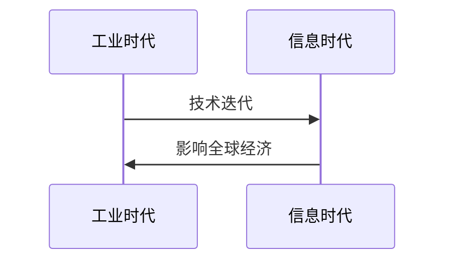

工业时代的主要特征是大规模的机械化生产，这一时期，蒸汽机、电力和内燃机等技术的应用，极大地提高了生产效率，推动了工业革命的发展。然而，工业时代的技术进步也带来了资源消耗、环境污染等问题。

进入信息时代，计算机、互联网和移动通信技术的发展，使得信息传递和处理的速度大大提高，人类进入了一个全新的数字化时代。信息时代不仅改变了传统的生产方式，也带来了数据的爆发性增长，为人工智能和大数据等新兴技术的发展提供了基础。

##### 1.2 技术迭代的驱动力

技术迭代的主要驱动力包括技术进步、市场需求和商业模式创新。

**技术进步**是技术迭代的核心动力，它推动了新技术的诞生和旧技术的淘汰。例如，半导体技术的发展，推动了计算机性能的不断提升，从而带动了互联网、大数据和人工智能等技术的快速发展。

**市场需求**是技术迭代的重要驱动力，消费者对更高效、更便捷的产品和服务有着持续的需求，这促使企业不断进行技术创新，以满足市场的需求。

**商业模式创新**是技术迭代的重要推动力，新的商业模式往往伴随着新技术的应用，如共享经济、电子商务等，这些新兴商业模式不仅改变了企业的运营模式，也改变了消费者的行为和生活方式。

##### 1.3 技术迭代的影响与挑战

技术迭代对个人、企业和整个社会都产生了深远的影响。

**对个人**的影响：技术迭代带来了新的职业机会，但也对个人的技能要求提出了更高的要求。个人需要不断学习新的技能，以适应快速变化的工作环境。同时，技术迭代也改变了人们的生活方式，如智能手机的普及，改变了人们的沟通方式和生活习惯。

**对企业**的影响：技术迭代推动了企业的数字化转型，提高了生产效率和服务质量。然而，技术迭代也带来了市场竞争的加剧，企业需要不断创新，以保持竞争优势。

**对社会**的影响：技术迭代改变了社会的生产方式、生活方式和思维方式。例如，大数据和人工智能技术的应用，使得社会更加智能化和个性化。同时，技术迭代也带来了新的伦理和隐私问题，如数据安全和隐私保护等。

**挑战**：技术迭代虽然带来了许多机遇，但也面临着一系列挑战。例如，技术进步可能导致失业问题，特别是那些重复性劳动岗位的消失。此外，技术迭代也加剧了信息鸿沟，使得科技素养较低的人群更加边缘化。

**Mermaid 流�程图：**

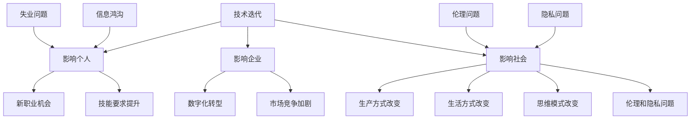

#### 第2章：技术发展的主要趋势

##### 2.1 人工智能与大数据

人工智能（AI）和大数据技术是当前技术迭代中最热门的两个方向。

**人工智能**：人工智能是一种模拟人类智能的技术，它通过机器学习、深度学习等算法，使计算机具有识别模式、自主学习和决策的能力。人工智能的应用领域广泛，包括语音识别、图像识别、自然语言处理、自动驾驶等。

**大数据**：大数据是指无法用传统数据库工具进行捕捉、管理和处理的数据集合。大数据技术包括数据存储、数据挖掘、数据分析等，它使企业能够从海量数据中提取有价值的信息，从而做出更明智的决策。

**Mermaid 流程图：**

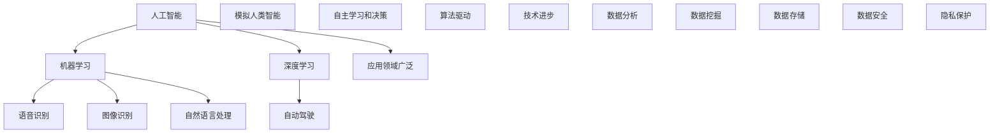

##### 2.2 互联网技术变革

互联网技术的不断进步，推动了信息时代的到来。互联网技术的变革主要表现在以下几个方面：

- **宽带互联网**：宽带互联网的普及，提高了网络速度和带宽，使得人们可以更快地获取和分享信息。
- **移动互联网**：移动互联网的兴起，使得人们可以通过手机等移动设备，随时随地访问互联网，改变了人们的沟通方式和生活习惯。
- **云计算**：云计算技术使得计算资源可以按需分配，降低了企业的IT成本，提高了资源利用率。

**Mermaid 流程图：**

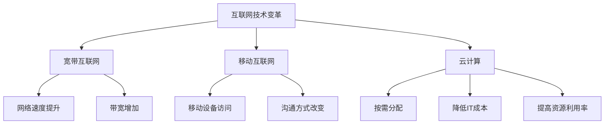

##### 2.3 区块链与去中心化技术

区块链和去中心化技术是当前技术迭代中的新兴领域，它们在金融、供应链管理、版权保护等领域有着广泛的应用。

- **区块链**：区块链是一种分布式数据库技术，它通过加密算法和共识机制，确保数据的真实性和不可篡改性。区块链技术主要应用于比特币、以太坊等加密货币，以及供应链管理、版权保护等领域。
- **去中心化技术**：去中心化技术是指通过去中心化的方式，实现数据的存储、处理和传输。去中心化技术的主要特点是去除了传统的中心化机构，使得数据更加安全、透明和高效。

**Mermaid 流程图：**

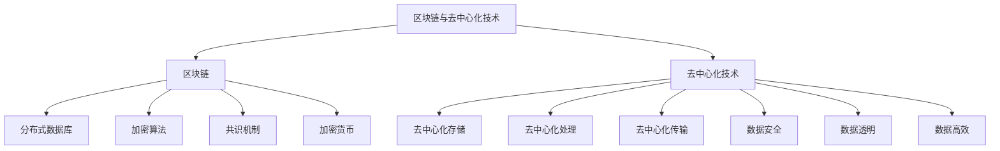

##### 2.4 5G与物联网

5G和物联网技术是未来技术迭代的重要方向，它们将进一步提升网络的速率和连接能力。

- **5G**：5G是第五代移动通信技术，它具有高速率、大容量、低延迟的特点，能够满足未来万物互联的需求。5G技术的主要应用包括自动驾驶、智能制造、远程医疗等。
- **物联网**：物联网是指通过互联网将各种设备连接起来，实现智能化的管理和控制。物联网技术的主要应用包括智能家居、智能交通、智能医疗等。

**Mermaid 流程图：**

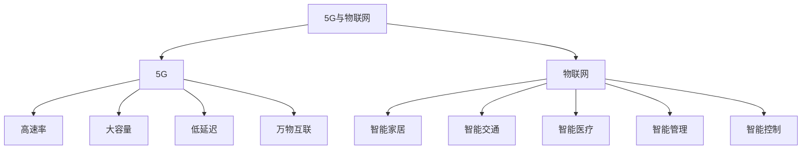

##### 2.5 技术迭代对行业的影响

技术迭代对各个行业产生了深远的影响，它不仅改变了企业的运营模式，也推动了产业的转型升级。

- **制造业**：智能制造是制造业的发展方向，通过物联网、大数据和人工智能等技术，实现生产过程的自动化、智能化，提高生产效率和质量。
- **金融业**：金融科技（FinTech）是金融业的重要变革力量，通过区块链、人工智能和大数据等技术，实现金融服务的创新和优化。
- **医疗健康**：医疗健康领域正在迎来数字化革命，通过远程医疗、医疗大数据和人工智能等技术，提高医疗服务质量和效率。
- **教育行业**：在线教育和数字化学习正在改变传统的教育模式，通过互联网和移动设备，实现教育资源的高效分配和个性化学习。

**Mermaid 流程图：**

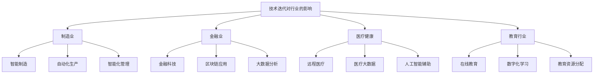

#### 第3章：技术迭代对行业的影响

##### 3.1 产业结构调整

技术迭代带来了产业结构的深刻变革，传统的产业模式和竞争优势正在被重新定义。

- **产业升级**：随着技术进步，一些传统产业正在向高附加值、高技术含量的产业转型。例如，制造业正从简单的加工制造向智能化、定制化生产转变。
- **新兴产业崛起**：人工智能、大数据、云计算等新兴产业的快速发展，推动了传统产业向数字化、智能化方向转型。这些新兴产业的崛起，也为个人提供了更多的职业机会。
- **产业融合**：技术迭代推动了不同产业之间的融合，形成了新的产业生态。例如，金融科技、医疗健康、教育等行业都在通过技术手段实现跨界融合。

**Mermaid 流程图：**

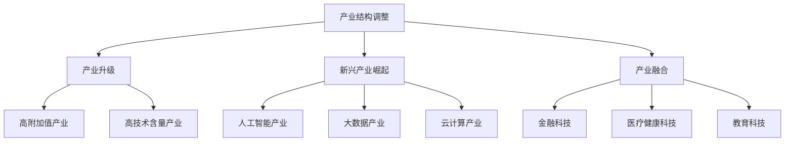

##### 3.2 企业运营模式的变革

技术迭代改变了企业的运营模式，推动了企业数字化转型。

- **数字化转型**：数字化转型是指企业利用数字技术，对其业务流程、运营模式和组织架构进行全面升级和重构。数字化转型使企业能够更灵活、更高效地应对市场变化，提高竞争力。
- **敏捷开发**：敏捷开发是一种以人为核心、迭代、持续改进的开发方法，它使企业能够更快地响应市场需求，提高开发效率。
- **云计算与大数据**：云计算和大数据技术的应用，使企业能够实现资源的按需分配、高效利用，并从海量数据中提取有价值的信息，为决策提供支持。

**Mermaid 流程图：**

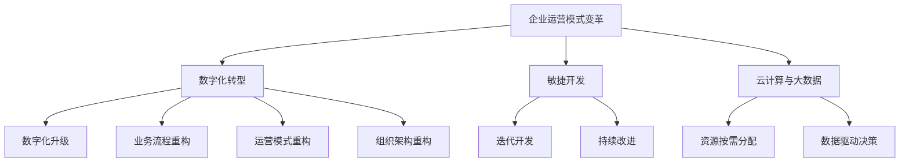

##### 3.3 创新能力的提升

技术迭代不仅改变了产业结构和企业运营模式，也推动了企业创新能力的提升。

- **技术创新**：技术创新是企业保持竞争优势的重要手段。通过引入新技术、新工艺，企业可以不断提高产品质量，降低成本，提升市场竞争力。
- **商业模式创新**：商业模式创新是指企业通过改变其商业模式，实现利润增长和市场扩张。例如，共享经济、平台经济等新兴商业模式，为企业带来了新的增长点。
- **协同创新**：协同创新是企业与科研机构、高校、合作伙伴等共同开展的创新活动。通过协同创新，企业可以充分利用外部资源，加速创新进程。

**Mermaid 流程图：**

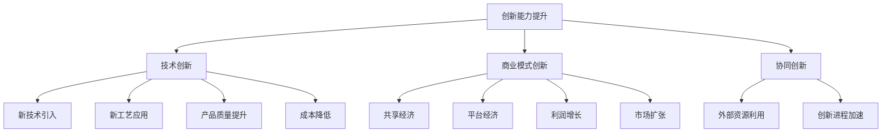

#### 第4章：技术迭代对个人职业发展的影响

##### 4.1 个人竞争力的定义

个人竞争力是指个人在职业生涯中，能够创造价值、适应环境、实现自我发展的能力。个人竞争力包括以下几个方面：

- **专业技能**：专业技能是指个人在特定领域所具备的专业知识和技能，如编程、数据分析、产品设计等。
- **学习能力**：学习能力是指个人快速掌握新知识、新技能的能力，是适应快速变化的技术环境的关键。
- **创新能力**：创新能力是指个人在工作和生活中，能够提出新的想法、创造新的价值的能力。
- **团队协作能力**：团队协作能力是指个人在团队中有效沟通、合作、协调的能力，是成功完成项目的关键。

**Mermaid 流程图：**

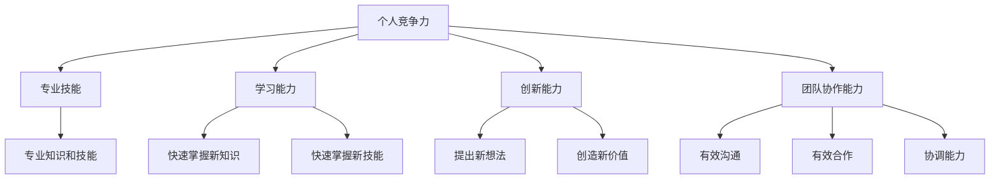

##### 4.2 技能需求的变化

技术迭代对个人的技能需求产生了深远的影响，传统的技能正在被新的技能所取代。

- **编程技能**：随着互联网和人工智能技术的发展，编程技能成为现代职场的基本技能。掌握一门或多门编程语言，如Python、Java、JavaScript等，已经成为许多职业的必备要求。
- **数据分析技能**：大数据技术的发展，使得数据分析成为企业决策的重要依据。掌握数据分析工具和算法，如SQL、Python、R等，已经成为许多职业的必备技能。
- **人工智能技能**：人工智能技术的发展，使得人工智能相关技能成为热门。掌握人工智能的基础知识，如机器学习、深度学习、自然语言处理等，已经成为许多职业的追求。
- **软技能**：随着团队合作的重要性日益凸显，软技能如沟通能力、团队协作能力、领导力等，也越来越受到企业的重视。

**Mermaid 流程图：**

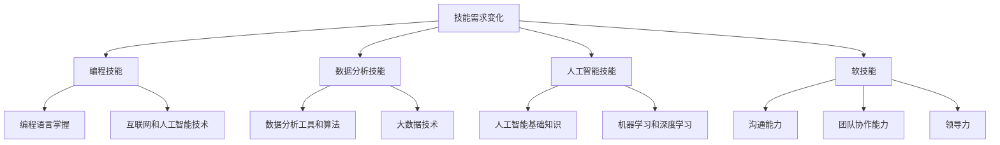

##### 4.3 职业发展的路径选择

在技术迭代快速发展的背景下，个人的职业发展路径也变得更加多样和灵活。

- **垂直发展**：垂直发展是指个人在某一专业领域内，不断深入学习和实践，提升专业技能和经验，成为该领域的专家。
- **横向发展**：横向发展是指个人在不同领域之间进行转换，通过拓展技能和知识领域，实现职业发展的多元化。
- **自主创业**：随着技术进步和创业环境的改善，越来越多的个人选择自主创业，通过创新和创业实现个人价值和职业发展。

**Mermaid 流程图：**

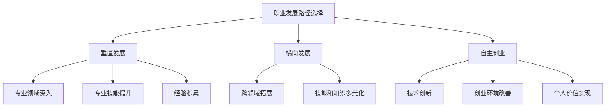

##### 4.4 终身学习的理念与实践

在技术迭代快速发展的背景下，终身学习成为个人提升竞争力的关键。

- **终身学习的理念**：终身学习是指个人在职业生涯中，不断学习新知识、新技能，以适应快速变化的工作环境。
- **学习资源的获取**：随着互联网的发展，个人可以通过各种在线平台和课程，获取丰富的学习资源。
- **学习方法的优化**：掌握有效的学习方法，如深度学习、刻意练习等，可以提高学习效率和质量。
- **实践与应用**：将学习到的知识应用于实际工作中，通过实践检验和提升自身的技能。

**Mermaid 流程图：**

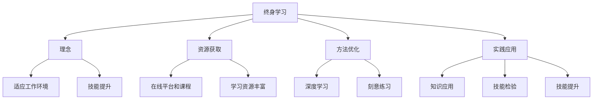

### 第二部分：个人竞争力提升策略

#### 第5章：技术技能提升

##### 5.1 技术技能学习路径

提升技术技能需要有一个系统化的学习路径，以下是一个推荐的学习路径：

1. **基础知识学习**：首先，需要掌握相关技术的基础知识，如编程语言、算法和数据结构等。可以通过在线课程、教科书和开源项目来学习。
2. **实战项目经验**：通过参与实际项目，将理论知识应用于实际工作中。可以从开源项目开始，逐渐参与到公司内部的项目中。
3. **持续学习**：技术迭代速度非常快，需要不断学习新的技术趋势和工具。可以通过阅读技术博客、参加技术会议和加入技术社区来保持学习的热情和动力。

**伪代码示例：**

```python
def learn_technology():
    # 学习基础知识
    knowledge = ["编程语言", "算法", "数据结构"]

    # 参与实际项目
    projects = ["开源项目", "公司项目"]

    # 持续学习
    while True:
        new_trend = "新技术趋势"
        blog = "技术博客"
        conference = "技术会议"
        community = "技术社区"

        # 学习新知识
        knowledge.append(new_trend)

        # 参加学习活动
        attend(blog, conference, community)

        # 检查学习效果
        if check_progress(knowledge):
            print("学习进度合格，继续学习。")
        else:
            print("学习进度不合格，需要加强学习。")

def attend(event, *args):
    # 参加学习活动
    for arg in args:
        print(f"参加{arg}。")

def check_progress(knowledge):
    # 检查学习进度
    return True if len(knowledge) > 10 else False
```

##### 5.2 技术趋势追踪与学习

技术趋势的追踪与学习是提升个人技术技能的重要环节。以下是一些方法：

- **阅读技术博客**：通过阅读知名技术博客，如Medium、Dev.to等，可以了解最新的技术动态和趋势。
- **参加技术会议**：技术会议是了解行业最新动态和趋势的重要渠道，如Google I/O、Facebook F8等。
- **关注技术社区**：加入技术社区，如Stack Overflow、GitHub等，可以与同行交流，分享经验和学习资源。

**Mermaid 流程图：**

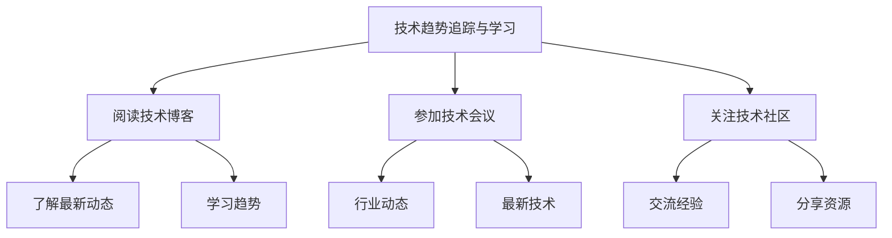

##### 5.3 技术认证与提升

技术认证是验证个人技术能力的重要手段。以下是一些常见的技术认证：

- **编程语言认证**：如Python Institute、Oracle Certified Professional等。
- **框架和工具认证**：如Spring Certification、Docker Certified Associate等。
- **行业认证**：如PMP（项目管理专业人士）、CISSP（认证信息系统安全专家）等。

**伪代码示例：**

```python
def get_certification(language, framework, industry):
    # 获取编程语言认证
    if language == "Python":
        print("获得Python Institute认证。")

    # 获取框架和工具认证
    if framework == "Spring":
        print("获得Spring Certification认证。")

    # 获取行业认证
    if industry == "项目管理":
        print("获得PMP认证。")
    elif industry == "信息安全":
        print("获得CISSP认证。")

get_certification("Python", "Spring", "项目管理")
```

### 第6章：创新能力培养

##### 6.1 创新思维与工具

创新思维是指个人在工作和生活中，能够独立思考、提出新想法的能力。以下是一些培养创新思维的方法：

- **发散思维**：通过多角度、多维度思考问题，寻找解决方案。
- **收敛思维**：在发散思维的基础上，对各种想法进行筛选和优化，找到最佳方案。
- **联想思维**：通过不同领域的知识和经验，寻找问题之间的联系，产生新的想法。

**Mermaid 流程图：**

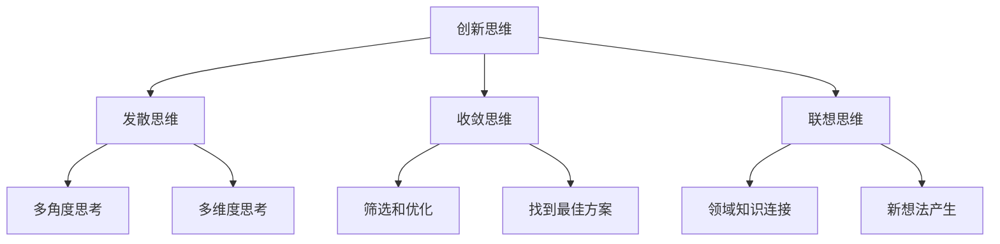

创新工具是指用于支持创新活动的软件和平台。以下是一些常用的创新工具：

- **思维导图**：如MindMeister、XMind等，用于梳理思路、整理知识。
- **协作工具**：如Trello、Asana等，用于团队协作和项目管理。
- **创意生成工具**：如Hackpad、Ideascale等，用于创意生成和方案优化。

**Mermaid 流程图：**

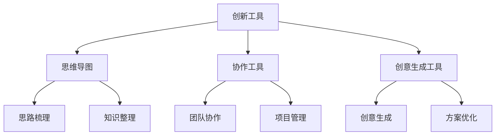

##### 6.2 项目管理与团队协作

项目管理和团队协作是创新活动成功的关键。以下是一些关键点：

- **项目规划**：明确项目目标、范围、时间和资源，制定详细的计划。
- **任务分配**：根据团队成员的特长和技能，合理分配任务。
- **进度监控**：定期检查项目进度，及时调整计划和资源。
- **沟通协作**：保持有效的沟通，确保团队成员之间的信息共享和协同工作。

**Mermaid 流程图：**

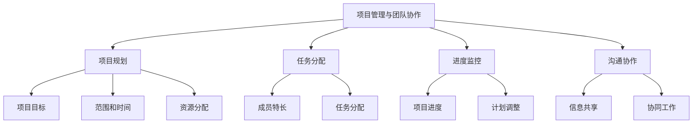

##### 6.3 创新实践与案例分享

创新实践是将创新思维和工具应用于实际工作中的过程。以下是一些创新实践的案例：

- **案例1：互联网企业的新产品发布**
  - **创新点**：通过用户调研和数据分析，发现市场需求，并提出创新性的解决方案。
  - **实施过程**：项目团队使用思维导图进行思路梳理，采用敏捷开发方法快速迭代，最终成功发布新产品。
- **案例2：传统企业的数字化转型**
  - **创新点**：利用云计算、大数据和人工智能等技术，优化企业的业务流程，提高运营效率。
  - **实施过程**：项目团队进行全面的现状分析，制定数字化转型计划，逐步实施并持续优化。

**Mermaid 流程图：**

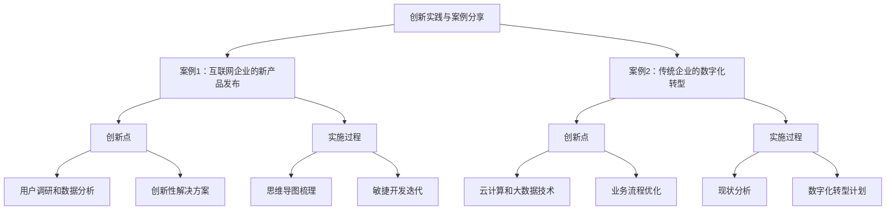

### 第7章：个人品牌建设与影响力提升

##### 7.1 个人品牌塑造

个人品牌是指个人在职业生涯中所建立的专业形象和声誉。以下是一些塑造个人品牌的方法：

- **专业知识和技能**：通过不断学习和实践，提升自身的专业知识和技能，树立专业形象。
- **社交媒体**：利用社交媒体平台，如LinkedIn、Twitter、微信公众号等，分享专业知识和经验，建立个人品牌。
- **演讲和写作**：参加技术会议、讲座，撰写技术博客，通过演讲和写作提升个人影响力。

**Mermaid 流程图：**

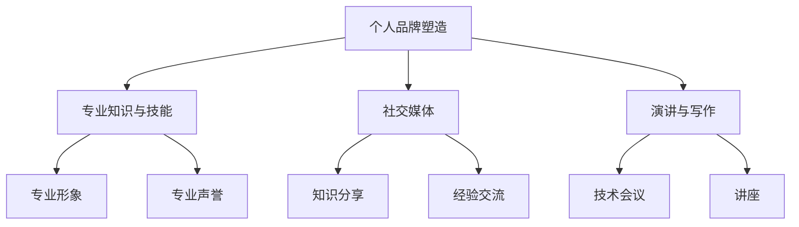

##### 7.2 社交媒体与网络影响力

社交媒体和网络影响力是个人品牌建设的重要组成部分。以下是一些提高社交媒体和网络影响力的方法：

- **内容创作**：创作高质量、有价值的内容，吸引关注和粉丝。
- **互动与分享**：积极参与社交媒体互动，分享他人的优质内容，建立良好的人际关系。
- **持续更新**：定期发布新的内容，保持活跃度，提高影响力。

**Mermaid 流程图：**

```mermaid
graph TD
A[社交媒体与网络影响力] --> B[内容创作]
A --> C[互动与分享]
A --> D[持续更新]
B --> E[高质量内容]
B --> F[价值交流]
C --> G[参与互动]
C --> H[分享内容]
D --> I[定期发布]
D --> J[保持活跃]
```

##### 7.3 专业网络拓展

专业网络拓展是个人品牌建设的重要一环。以下是一些拓展专业网络的方法：

- **参加行业活动**：参加技术会议、研讨会等活动，结识同行业的专业人士。
- **加入专业组织**：加入专业协会、俱乐部等组织，扩大人脉圈。
- **线上互动**：通过社交媒体、论坛等平台，与行业人士建立联系。

**Mermaid 流程图：**

```mermaid
graph TD
A[专业网络拓展] --> B[参加行业活动]
A --> C[加入专业组织]
A --> D[线上互动]
B --> E[结识专业人士]
B --> F[扩大人脉圈]
C --> G[加入协会]
C --> H[加入俱乐部]
D --> I[社交媒体]
D --> J[论坛]
```

##### 7.4 个人品牌维护与发展

个人品牌维护与发展是长期而持续的过程。以下是一些维护和发展个人品牌的方法：

- **持续学习**：不断学习新的知识和技能，保持专业竞争力。
- **积极沟通**：与同行业人士保持良好的沟通，建立长期合作关系。
- **品牌升级**：根据个人职业发展的需要，适时调整个人品牌定位和形象。

**Mermaid 流程图：**

```mermaid
graph TD
A[个人品牌维护与发展] --> B[持续学习]
A --> C[积极沟通]
A --> D[品牌升级]
B --> E[知识更新]
B --> F[专业竞争力]
C --> G[建立关系]
C --> H[合作关系]
D --> I[品牌定位]
D --> J[形象调整]
```

### 第8章：技术迭代与个人竞争力提升实践

##### 8.1 实践案例分享

以下是一些技术迭代与个人竞争力提升的实践案例：

- **案例1：程序员小明的职业发展**
  - **背景**：程序员小明在传统IT公司工作多年，面对技术迭代的挑战，他决定提升自己的技能。
  - **实践**：小明学习了Python编程语言，掌握了数据分析技能，并通过开源项目积累了实战经验。他还参加了多个技术会议，结识了许多行业专家，扩大了人脉圈。
  - **结果**：小明的技术能力和影响力得到了显著提升，成功转型为数据科学家，获得了更高的薪资和职位。

- **案例2：创业者小红的创新之路**
  - **背景**：小红在一家创业公司担任产品经理，面对激烈的市场竞争，她决定通过创新提升公司的竞争力。
  - **实践**：小红学习了敏捷开发方法，并引入了用户调研和数据分析工具，优化了产品设计和开发流程。她还积极参与行业活动，与同行业人士建立了良好的合作关系。
  - **结果**：小红的公司成功推出了一款创新产品，获得了用户和市场的认可，业务规模迅速扩大。

##### 8.2 成功经验与教训总结

通过以上实践案例，我们可以总结出以下成功经验与教训：

- **持续学习**：面对技术迭代，持续学习是提升个人竞争力的关键。只有不断更新知识和技能，才能保持专业竞争力。
- **实践与应用**：理论知识需要通过实践来检验和提升。参与实际项目和开源项目，可以积累宝贵的实战经验。
- **人脉网络**：建立良好的人际关系网络，可以获取更多的机会和资源，提高个人品牌影响力。
- **创新思维**：在快速变化的技术环境中，创新思维是推动个人和公司发展的关键。通过创新，可以找到新的商业机会和竞争优势。

##### 8.3 实践中的问题与解决方案

在技术迭代与个人竞争力提升的实践中，可能会遇到以下问题：

- **学习资源不足**：很多个人在学习过程中，可能面临学习资源不足的问题。解决方案是充分利用在线课程、开源项目和社区资源，拓展学习渠道。
- **时间管理困难**：在繁忙的工作和生活节奏中，个人可能难以抽出时间进行学习。解决方案是制定详细的学习计划，合理分配时间，确保学习目标的实现。
- **实践机会有限**：在没有足够实践机会的情况下，个人可能难以将所学知识应用到实际工作中。解决方案是积极参与开源项目，与同行交流，争取更多的实践机会。

### 第9章：未来展望

##### 9.1 技术迭代的趋势预测

技术迭代的趋势将继续加速，以下是一些可能的发展方向：

- **人工智能与大数据的深度融合**：人工智能和大数据技术的结合，将进一步提升数据处理和分析的能力，推动智能化的进一步发展。
- **5G与物联网的广泛应用**：5G和物联网技术的普及，将推动万物互联，实现更高效的通信和智能化的生活。
- **区块链技术的商业化应用**：区块链技术将在金融、供应链管理、版权保护等领域得到更广泛的应用，推动商业模式的创新。

##### 9.2 个人竞争力的未来发展

随着技术迭代的速度加快，个人竞争力的未来发展方向也将发生变化：

- **技能多元化**：个人需要掌握多种技能，如编程、数据分析、人工智能等，以适应多样化的工作需求。
- **创新能力提升**：创新能力将成为个人竞争力的核心，只有具备创新能力，才能在快速变化的技术环境中脱颖而出。
- **终身学习意识**：终身学习将成为个人发展的基本理念，只有不断学习，才能跟上技术迭代的步伐。

##### 9.3 面向未来的能力提升策略

为了适应未来的技术发展，以下是一些提升个人能力的方法：

- **技术技能提升**：通过学习新的编程语言、框架和工具，提升技术技能。
- **创新能力培养**：通过参加创新工作坊、学习创新思维方法，培养创新能力。
- **终身学习实践**：制定学习计划，坚持每天学习新知识，不断更新自己的知识库。

### 附录

#### 附录A：相关技术资源与工具推荐

##### A.1 技术学习网站与资源

- **Coursera**：提供丰富的在线课程，涵盖编程、数据分析、人工智能等多个领域。
- **edX**：全球知名的开源在线课程平台，提供来自世界顶尖大学和机构的课程。
- **Udemy**：提供广泛的在线课程，涵盖编程、设计、营销等多个领域。
- **GitHub**：全球最大的代码托管平台，可以学习开源项目，参与技术社区。

##### A.2 技术社区与论坛

- **Stack Overflow**：全球最大的程序员问答社区，可以解决编程问题，交流技术经验。
- **GitHub**：全球最大的代码托管平台，可以学习开源项目，参与技术社区。
- **Reddit**：涵盖多个技术领域的社区，可以获取最新的技术动态和讨论。

##### A.3 在线课程与教程

- **freeCodeCamp**：提供免费的编程学习资源，适合初学者。
- **Codecademy**：提供互动式的编程学习课程，适合初学者和有经验的程序员。
- **CodeSchool**：提供有趣的编程学习视频和练习，适合提高编程技能。

#### 附录B：参考文献

##### B.1 书籍推荐

- 《人工智能：一种现代的方法》
- 《深度学习》
- 《大数据技术导论》
- 《区块链：从数字货币到智能合约》
- 《程序员修炼之道》

##### B.2 学术论文

- Hinton, G. E., Osindero, S., & Teh, Y. W. (2006). A fast learning algorithm for deep belief nets. Neural computation, 18(7), 1527-1554.
- LeCun, Y., Bengio, Y., & Hinton, G. (2015). Deep learning. Nature, 521(7553), 436-444.
- Goodfellow, I., Bengio, Y., & Courville, A. (2016). Deep learning. MIT press.

##### B.3 行业报告

- Gartner. (2020). Market trends: artificial intelligence. Gartner.
- IDC. (2020). Worldwide semiannual artificial intelligence systems spending guide. IDC.
- McKinsey & Company. (2017). The age of sensors: How the Internet of Things will change the way we live, work, and learn. McKinsey & Company.

