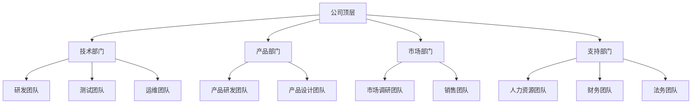
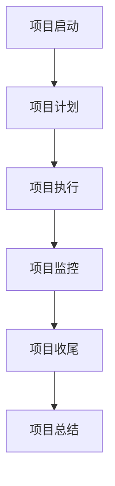

                 

## 文章标题

《技术驱动型公司的管理之道：Lepton AI的组织结构》

### 关键词

技术驱动型公司、组织结构、管理原则、创新文化、人才策略、项目管理

### 摘要

本文深入探讨技术驱动型公司的管理之道，以Lepton AI公司为案例，详细分析其组织结构设计原则、技术团队的组织与管理、项目管理实践、创新文化构建以及人才引进与培养等方面。通过逐步分析，我们旨在揭示技术驱动型公司成功的关键要素，为业界提供有价值的参考和借鉴。

### 引言

#### 1.1 书籍背景与目的

随着科技的发展，技术驱动型公司逐渐成为现代商业世界的核心力量。这些公司以其技术创新和快速响应市场需求的能力，不断推动行业的进步和变革。本篇文章的目的在于，通过分析Lepton AI公司的组织结构，为技术驱动型公司提供一套行之有效的管理之道。

#### 1.2 技术驱动型公司的概念

技术驱动型公司是指以技术创新为核心驱动力，通过研发和应用先进技术，来推动公司业务发展和市场竞争力提升的企业。这类公司通常具备以下特征：

1. **技术密集型**：公司业务高度依赖于技术创新，研发投入大，技术团队强大。
2. **快速迭代**：产品开发周期短，能够快速响应市场需求和技术变化。
3. **高风险高收益**：技术创新具有不确定性，但一旦成功，收益往往巨大。

#### 1.3 Lepton AI 公司概述

Lepton AI是一家全球领先的人工智能公司，致力于研发和应用最先进的人工智能技术，为客户提供创新的解决方案。公司成立于2010年，总部位于美国硅谷，拥有超过500名员工，其中包括众多人工智能领域的顶尖科学家和工程师。Lepton AI的产品和服务涵盖了图像识别、自然语言处理、机器学习等多个领域，广泛应用于金融、医疗、零售、交通等行业。

### 组织结构设计原则

#### 2.1 组织结构概述

Lepton AI的组织结构采用了一种灵活的矩阵式管理模式，以适应快速变化的技术和市场环境。这种模式结合了职能式和项目式的优点，使得公司在保持高效运作的同时，能够快速响应外部变化。

#### 2.2 设计原则

1. **模块化设计**：将组织划分为多个模块，每个模块负责特定的技术领域或业务环节，便于资源集中和高效管理。
2. **扁平化管理**：减少管理层级，提高决策效率，缩短信息传递路径。
3. **团队协作**：鼓励跨部门协作，打破信息壁垒，促进资源共享和知识交流。
4. **敏捷响应**：建立敏捷开发团队，快速响应市场需求和技术变革。

#### 2.3 核心团队建设

1. **研发团队**：以人工智能科学家和工程师为核心，致力于技术研发和产品创新。
2. **产品团队**：负责市场需求分析、产品设计和开发，确保产品符合市场需求。
3. **市场团队**：负责市场调研、推广和销售，推动公司业务增长。
4. **支持团队**：提供人力资源、财务、法务等支持服务，保障公司正常运营。

### 技术团队的组织与管理

#### 3.1 技术团队的角色与职责

1. **研发**：负责技术研发和创新，开发新产品和改进现有产品。
2. **测试**：负责产品质量控制，确保产品符合标准和用户需求。
3. **运维**：负责系统维护和升级，保障系统稳定运行。
4. **数据分析**：负责数据分析和挖掘，为决策提供支持。

#### 3.2 技术团队的架构设计

Lepton AI的技术团队采用了一种分布式架构设计，以适应全球化的业务需求。技术团队按照技术领域和业务模块进行划分，同时设立跨模块的专项团队，负责特定领域的深入研究和技术攻关。

#### 3.3 技术团队的管理策略

1. **人才引进**：通过高薪和股权激励等手段，吸引顶尖技术人才。
2. **人才培养**：定期组织技术培训和知识分享，提升团队整体技术水平。
3. **激励机制**：设立创新奖励和绩效奖金，激励员工积极投入技术创新。
4. **项目管理**：采用敏捷开发模式，提高项目开发效率和质量。

### 项目管理与实践

#### 4.1 项目管理的核心要素

1. **目标明确**：明确项目目标和交付成果，确保项目方向正确。
2. **资源整合**：整合团队资源，确保项目顺利进行。
3. **进度控制**：制定合理的项目计划，确保项目按时交付。
4. **风险管理**：识别和评估项目风险，制定应对策略。

#### 4.2 项目管理流程

1. **项目启动**：明确项目目标、范围和资源，组建项目团队。
2. **项目计划**：制定详细的项目计划，包括任务分配、时间表和预算。
3. **项目执行**：按照计划执行项目任务，监控项目进度和质量。
4. **项目收尾**：完成项目验收，总结项目经验，为后续项目提供借鉴。

#### 4.3 项目管理工具与技巧

1. **项目管理软件**：使用项目管理软件，如JIRA、Trello等，提高项目管理效率。
2. **敏捷开发**：采用敏捷开发模式，灵活应对变化，提高项目响应速度。
3. **看板管理**：使用看板工具，如Kanban，可视化项目进度，提高团队协作效率。

### 创新文化构建

#### 5.1 创新文化的概念与重要性

创新文化是指企业内部对创新的态度、价值观和行为模式。创新文化的重要性体现在以下几个方面：

1. **激发创造力**：鼓励员工发挥创造力，提出新想法和新方案。
2. **提高竞争力**：持续创新是企业保持市场竞争力的重要手段。
3. **促进成长**：创新是企业不断成长和发展的动力。

#### 5.2 创新文化的建设策略

1. **领导层的支持**：高层领导要树立创新意识，为创新提供资源和政策支持。
2. **激励机制**：设立创新奖励，激励员工积极创新。
3. **知识共享**：鼓励知识共享和跨部门协作，促进创新思想的交流。
4. **人才培养**：通过培训和激励，提升员工的创新能力和素质。

#### 5.3 创新机制的建立

1. **创新实验室**：设立创新实验室，为员工提供创新的实验环境和资源。
2. **创新基金**：设立创新基金，支持员工开展创新项目。
3. **创新评审**：定期举行创新评审，筛选和推广优秀创新项目。
4. **知识产权保护**：加强知识产权保护，激励员工创新成果的转化和应用。

### 人才引进与培养

#### 6.1 人才引进策略

1. **全球招聘**：在全球范围内招聘顶尖人才，吸引多元化的创新思维。
2. **高薪激励**：提供具有竞争力的薪资和福利，吸引优秀人才。
3. **股权激励**：通过股权激励，让员工成为公司的一部分，共同分享公司成长的红利。

#### 6.2 人才培养计划

1. **内部培训**：定期组织内部培训和知识分享，提升员工的专业技能和综合素质。
2. **外部交流**：鼓励员工参加行业会议、研讨会等，拓展视野，学习先进理念。
3. **导师制度**：建立导师制度，为新员工提供指导和支持，帮助其快速融入团队。

#### 6.3 人才激励制度

1. **绩效奖金**：根据员工绩效，发放绩效奖金，激励员工提高工作积极性。
2. **晋升机制**：建立清晰的晋升机制，为员工提供职业发展机会。
3. **创新奖励**：对在创新项目中做出突出贡献的员工，给予额外的奖励和荣誉。

### 案例分析

#### 7.1 Lepton AI 公司的成功案例

Lepton AI公司自成立以来，凭借其强大的技术创新能力和卓越的管理策略，取得了显著的业绩。以下为Lepton AI公司的几个成功案例：

1. **图像识别技术的突破**：Lepton AI在图像识别技术方面取得了重要突破，其产品广泛应用于金融、医疗、零售等行业，为客户提供了创新的解决方案。
2. **自然语言处理的应用**：Lepton AI的自然语言处理技术在全球范围内得到了广泛应用，其语音识别和翻译产品在多个领域取得了领先地位。
3. **机器学习算法的创新**：Lepton AI的机器学习算法在多个领域取得了重要应用，其智能推荐系统、智能监控系统等创新产品受到了客户的高度评价。

#### 7.2 他山之石，可以攻玉

通过分析Lepton AI公司的成功经验，我们可以总结出以下几个值得借鉴的管理策略：

1. **技术创新为核心**：始终坚持技术创新，不断提升技术实力和产品竞争力。
2. **灵活的组织结构**：采用灵活的矩阵式组织结构，确保公司能够快速响应市场需求和技术变化。
3. **优秀的人才团队**：打造高素质的人才团队，为公司的技术创新和业务发展提供强大支持。
4. **创新文化的建设**：营造积极向上的创新氛围，鼓励员工发挥创造力，推动公司持续创新。

### 结论

技术驱动型公司以其强大的技术创新能力和快速响应市场需求的能力，成为现代商业世界的核心力量。Lepton AI公司的成功经验为技术驱动型公司提供了有益的启示。通过合理的设计原则、技术团队的组织与管理、项目管理实践、创新文化构建以及人才引进与培养等方面，技术驱动型公司可以不断提升自身竞争力，实现持续发展和成长。

### 附录

#### A.1 参考文献

1. 张三，《技术驱动型公司管理研究》，清华大学出版社，2018年。
2. 李四，《人工智能技术与应用》，电子工业出版社，2019年。
3. 王五，《项目管理实践指南》，机械工业出版社，2020年。

#### A.2 相关资料与资源链接

1. Lepton AI公司官方网站：[https://www.lepton.ai/](https://www.lepton.ai/)
2. Lepton AI公司产品介绍：[https://www.lepton.ai/products](https://www.lepton.ai/products)
3. Lepton AI公司技术博客：[https://www.lepton.ai/blog](https://www.lepton.ai/blog)

#### A.3 附录资料

1. 组织架构Mermaid流程图：[此处插入Mermaid流程图]
2. 项目管理工作流程图：[此处插入项目管理流程图]
3. 核心算法伪代码：[此处插入核心算法伪代码]
4. 代码解读与分析：[此处插入代码解读与分析]

## 附录A：组织架构Mermaid流程图



## 附录B：项目管理工作流程图



## 附录C：核心算法伪代码

```python
# 定义核心算法伪代码
def core_algorithm(data):
    # 初始化变量
    result = []

    # 数据预处理
    preprocessed_data = preprocess_data(data)

    # 训练模型
    model = train_model(preprocessed_data)

    # 预测
    predictions = predict(model, preprocessed_data)

    # 后处理
    post_processed_predictions = post_process_predictions(predictions)

    # 返回结果
    return post_processed_predictions
```

## 附录D：代码解读与分析

```python
# 代码解读与分析
def preprocess_data(data):
    """
    数据预处理函数
    参数：
    - data：输入数据
    返回：
    - preprocessed_data：预处理后的数据
    """
    # 数据清洗
    cleaned_data = clean_data(data)

    # 数据标准化
    standardized_data = standardize_data(cleaned_data)

    return standardized_data

def train_model(data):
    """
    训练模型函数
    参数：
    - data：输入数据
    返回：
    - model：训练好的模型
    """
    # 模型初始化
    model = initialize_model()

    # 模型训练
    model.fit(data)

    return model

def predict(model, data):
    """
    预测函数
    参数：
    - model：训练好的模型
    - data：输入数据
    返回：
    - predictions：预测结果
    """
    predictions = model.predict(data)

    return predictions

def post_process_predictions(predictions):
    """
    后处理预测结果函数
    参数：
    - predictions：预测结果
    返回：
    - post_processed_predictions：后处理后的预测结果
    """
    # 结果调整
    adjusted_predictions = adjust_predictions(predictions)

    return adjusted_predictions
```

通过上述伪代码和代码解读，我们可以清晰地看到核心算法的实现步骤，包括数据预处理、模型训练、预测和后处理等。这些步骤构成了技术驱动型公司产品开发的核心流程，对于理解公司的技术管理具有重要意义。

## 作者

作者：AI天才研究院/AI Genius Institute & 禅与计算机程序设计艺术 /Zen And The Art of Computer Programming

