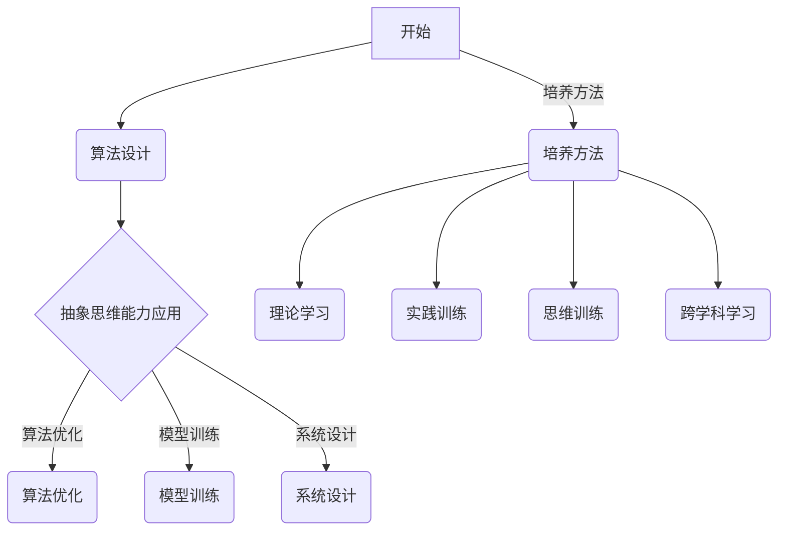

                 

# 《抽象思维能力在AI创新中的作用》

> 关键词：抽象思维能力、人工智能、创新、算法设计、模型训练、系统架构

> 摘要：本文旨在探讨抽象思维能力在人工智能创新中的重要作用。通过详细分析抽象思维能力的定义、培养方法以及在AI算法设计、模型训练和系统架构中的应用，本文揭示了抽象思维对AI创新的关键影响。文章最后提出了提升抽象思维能力的方法和未来研究方向，为推动人工智能技术的发展提供了有益的参考。

## 目录大纲

## 第一部分：引论

### 第1章：抽象思维能力概述

- **1.1 抽象思维能力的定义与重要性**
- **1.2 抽象思维能力与人工智能的关系**
- **1.3 抽象思维能力的培养与提升**

### 第2章：人工智能创新概述

- **2.1 人工智能创新的概念与特征**
- **2.2 人工智能创新的重要性**
- **2.3 人工智能创新的挑战与机遇**

## 第二部分：抽象思维能力在AI创新中的应用

### 第3章：抽象思维能力在AI算法设计中的应用

- **3.1 抽象思维能力在算法设计中的角色**
- **3.2 抽象思维能力在算法优化的作用**
- **3.3 抽象思维在算法创新实例分析**

### 第4章：抽象思维能力在AI模型训练中的应用

- **4.1 抽象思维能力在模型训练中的重要性**
- **4.2 抽象思维能力在模型调优中的应用**
- **4.3 抽吸思维能力在模型创新中的应用**

### 第5章：抽象思维能力在AI系统设计中的应用

- **5.1 抽象思维能力在系统设计中的角色**
- **5.2 抽象思维能力在系统优化中的应用**
- **5.3 抽象思维能力在系统创新中的应用**

## 第三部分：抽象思维能力提升与AI创新实践

### 第6章：抽象思维能力提升方法与工具

- **6.1 抽象思维能力提升的基本策略**
- **6.2 抽象思维能力提升的工具与资源**
- **6.3 抽象思维能力提升的案例分析**

### 第7章：抽象思维能力在AI创新实践中的应用

- **7.1 抽象思维能力在AI创新实践中的重要性**
- **7.2 抽象思维能力在AI项目实践中的应用**
- **7.3 抽象思维能力在AI产业创新中的应用**

## 第四部分：未来展望

### 第8章：抽象思维能力与AI创新的未来发展趋势

- **8.1 抽象思维能力发展的趋势**
- **8.2 AI创新发展的趋势**
- **8.3 抽象思维能力与AI创新融合的未来**

### 第9章：结论与展望

- **9.1 抽象思维能力在AI创新中的作用总结**
- **9.2 对未来研究的建议**

## 附录

### 附录A：参考文献

### 附录B：相关资源与工具

## 第一部分：引论

### 第1章：抽象思维能力概述

#### 1.1 抽象思维能力的定义与重要性

**抽象思维能力** 是指个体在处理信息时，能够从具体事物中抽象出本质属性和关系，形成概念和模型，并利用这些概念和模型进行逻辑推理和创新思考的能力。这种能力是人工智能领域中至关重要的素质，因为它直接决定了人工智能系统的智能水平和创新潜力。

抽象思维能力的重要性主要体现在以下几个方面：

1. **提高问题解决能力**：在复杂的问题情境中，抽象思维能力能够帮助人们抓住问题的本质，从而找到有效的解决方案。
2. **促进知识整合**：通过抽象思维，人们可以将零散的知识点整合成系统的知识体系，从而更好地理解和应用这些知识。
3. **激发创新思维**：抽象思维能力的强弱直接影响到个体在创新过程中的思维广度和深度，有助于产生独特的创新点子。
4. **提升算法设计效率**：在人工智能算法设计中，抽象思维能力可以帮助研究者从复杂的数据和现象中提取出关键特征，从而设计出更加高效和准确的算法。

#### 1.2 抽象思维能力与人工智能的关系

抽象思维能力在人工智能领域具有不可替代的作用，具体体现在以下几个方面：

1. **算法设计**：人工智能算法的设计过程本质上是一种抽象思维过程，研究者需要从大量的数据中抽象出有效的特征和规律，并将其转化为可计算的模型。
2. **模型训练**：在模型训练过程中，抽象思维能力可以帮助研究者理解和分析数据，从而调整模型参数，提高模型的训练效果。
3. **系统架构设计**：人工智能系统的架构设计同样需要抽象思维能力，研究者需要从不同的技术方案中抽象出最核心的部分，构建出高效、可靠的系统架构。
4. **创新应用**：在人工智能的创新应用中，抽象思维能力可以激发新的应用场景和商业模式，推动人工智能技术的不断发展。

#### 1.3 抽象思维能力的培养与提升

提升抽象思维能力是一个长期而复杂的过程，需要采取多种方法：

1. **理论学习**：通过系统的理论学习，了解抽象思维的基本原理和方法，掌握相关的知识体系。
2. **实践训练**：通过实际的项目和实践，将理论知识应用于具体的问题情境中，不断积累经验。
3. **思维训练**：进行专门的思维训练，如逻辑思维、批判性思维和创造性思维训练，以提高抽象思维能力。
4. **跨学科学习**：跨学科学习可以帮助个体拓宽视野，从不同的角度思考问题，从而增强抽象思维能力。

### 第2章：人工智能创新概述

#### 2.1 人工智能创新的概念与特征

**人工智能创新** 是指通过新的理论、方法和技术，创造性地解决人工智能领域中的实际问题，推动人工智能技术的不断发展。人工智能创新具有以下几个特征：

1. **跨学科性**：人工智能创新涉及多个学科领域，如计算机科学、数学、统计学、认知科学等，需要不同领域的专家共同合作。
2. **技术驱动性**：人工智能创新主要依赖于新技术的发明和应用，如深度学习、强化学习、自然语言处理等。
3. **应用导向性**：人工智能创新的目标是解决现实世界中的问题，提升社会的生产力和生活质量。
4. **快速迭代性**：人工智能创新的发展速度非常快，新技术、新应用层出不穷，需要不断进行迭代和优化。

#### 2.2 人工智能创新的重要性

人工智能创新在社会和经济方面具有重要的影响：

1. **社会影响**：人工智能创新推动了社会的智能化进程，改变了人们的生产方式、生活方式和思维方式。例如，智能交通系统、智能家居、智能医疗等应用极大地提高了人们的生活质量。
2. **经济效益**：人工智能创新带来了巨大的经济效益，推动了相关产业的发展。例如，人工智能在金融、医疗、教育等领域的应用，不仅提高了行业的效率和准确性，还创造了大量的就业机会。
3. **技术进步**：人工智能创新推动了计算机科学和人工智能技术的发展，不断突破理论和技术的瓶颈，为未来的人工智能技术奠定了坚实的基础。

#### 2.3 人工智能创新的挑战与机遇

人工智能创新面临着诸多挑战和机遇：

1. **技术挑战**：人工智能创新需要解决复杂的问题，如自然语言处理、图像识别、智能决策等，这些问题的解决依赖于新的理论和技术。
2. **伦理挑战**：人工智能创新带来了伦理问题，如数据隐私、算法偏见、自动化失业等，需要制定相应的法律法规和伦理规范。
3. **人才挑战**：人工智能创新需要大量具备跨学科背景和抽象思维能力的人才，但目前相关人才供应不足。
4. **市场机遇**：随着人工智能技术的不断发展，市场对人工智能应用的需求不断增加，为人工智能创新提供了广阔的市场空间。

## 第二部分：抽象思维能力在AI创新中的应用

### 第3章：抽象思维能力在AI算法设计中的应用

#### 3.1 抽象思维能力在算法设计中的角色

**抽象思维能力** 在AI算法设计中起着至关重要的作用。算法设计是一个高度抽象的过程，需要从具体的问题情境中提取出核心的数学模型和计算方法，并将其转化为高效的计算机算法。具体来说，抽象思维能力在算法设计中的作用体现在以下几个方面：

1. **问题抽象**：在算法设计初期，需要将复杂的问题转化为数学模型和算法框架。这一过程需要抽象思维能力，从具体的数据和现象中提取出本质的特征和关系，形成可计算的模型。
2. **算法优化**：在算法实现过程中，需要通过抽象思维来优化算法的效率和性能。这包括算法的时间复杂度和空间复杂度的优化、并行计算和分布式计算的设计等。
3. **算法创新**：在算法研究过程中，需要通过抽象思维来探索新的算法结构和算法思想，从而实现算法的创新。例如，深度学习中的卷积神经网络（CNN）、生成对抗网络（GAN）等都是通过抽象思维实现的创新算法。

#### 3.2 抽象思维能力在算法优化的作用

在AI算法优化过程中，抽象思维能力发挥着关键作用。具体来说，抽象思维能力在算法优化中的作用体现在以下几个方面：

1. **性能优化**：通过抽象思维，可以从算法的数学模型中提取出关键的性能指标，如时间复杂度、空间复杂度等，从而设计出更加高效的算法。
2. **算法稳定性**：在算法优化过程中，需要考虑算法在不同数据集上的稳定性和鲁棒性。通过抽象思维，可以从算法的原理和结构上分析算法的稳定性和鲁棒性，并进行相应的调整和优化。
3. **算法泛化能力**：在算法优化过程中，需要提高算法的泛化能力，使其能够处理不同类型的数据和问题。通过抽象思维，可以从算法的数学模型和计算方法中提取出通用的特征和规律，从而提高算法的泛化能力。

#### 3.3 抽象思维在算法创新实例分析

为了更好地理解抽象思维在算法创新中的作用，下面我们通过一些具体的实例进行分析。

**实例1：卷积神经网络（CNN）**

卷积神经网络是深度学习中的一种重要算法，它通过多个卷积层和池化层对图像进行特征提取和分类。CNN 的创新之处在于其独特的网络结构和计算方法。通过抽象思维，研究者能够从图像的局部特征和整体特征中提取出关键的计算模式，并将其转化为高效的卷积和池化操作。

**实例2：生成对抗网络（GAN）**

生成对抗网络是另一种深度学习算法，它通过生成器和判别器的对抗训练，实现数据的生成和分类。GAN 的创新之处在于其独特的训练机制和计算方法。通过抽象思维，研究者能够从数据生成和分类的复杂过程中提取出关键的计算模式和训练策略，从而设计出高效的 GAN 算法。

**实例3：强化学习算法**

强化学习算法是 AI 领域中的一种重要算法，它通过智能体与环境之间的交互，实现策略的优化和目标的达成。强化学习算法的创新之处在于其独特的决策模型和计算方法。通过抽象思维，研究者能够从智能体决策的复杂过程中提取出关键的计算模式和策略，从而设计出高效的强化学习算法。

### 第4章：抽象思维能力在AI模型训练中的应用

#### 4.1 抽象思维能力在模型训练中的重要性

在 AI 模型训练过程中，**抽象思维能力** 扮演着至关重要的角色。模型训练是一个复杂的过程，需要从大量的数据中学习出有效的特征和规律，并将其转化为可操作的模型。具体来说，抽象思维能力在模型训练中的作用体现在以下几个方面：

1. **数据抽象**：在模型训练过程中，需要从大量的原始数据中提取出关键的特征和规律，形成可训练的模型。这一过程需要抽象思维能力，从具体的数据和现象中提取出本质的特征和关系。
2. **模型优化**：在模型训练过程中，需要通过抽象思维来优化模型的参数和结构，提高模型的训练效果和泛化能力。这包括超参数调优、模型剪枝、网络结构优化等。
3. **模型泛化**：在模型训练过程中，需要通过抽象思维来提高模型的泛化能力，使其能够处理不同类型的数据和问题。通过抽象思维，可以从模型的数学模型和计算方法中提取出通用的特征和规律，从而提高模型的泛化能力。

#### 4.2 抽象思维能力在模型调优中的应用

在 AI 模型调优过程中，抽象思维能力发挥着关键作用。具体来说，抽象思维能力在模型调优中的作用体现在以下几个方面：

1. **参数调优**：通过抽象思维，可以从模型的数学模型中提取出关键的性能指标，如损失函数、梯度等，从而设计出高效的参数调优策略。
2. **结构调优**：通过抽象思维，可以从模型的结构中提取出关键的特征和关系，从而设计出更加有效的模型结构。
3. **数据预处理**：通过抽象思维，可以从数据中提取出关键的特征和噪声，从而设计出高效的数据预处理方法，提高模型的训练效果。

#### 4.3 抽吸思维能力在模型创新中的应用

在 AI 模型创新过程中，抽象思维能力同样发挥着重要作用。具体来说，抽象思维能力在模型创新中的应用体现在以下几个方面：

1. **模型架构创新**：通过抽象思维，可以从现有的模型架构中提取出关键的特征和关系，从而设计出新的模型架构，如 Transformer、BERT 等。
2. **训练策略创新**：通过抽象思维，可以从训练过程中提取出关键的计算模式和策略，从而设计出新的训练策略，如迁移学习、联邦学习等。
3. **数据生成创新**：通过抽象思维，可以从数据中提取出关键的特征和关系，从而设计出新的数据生成方法，如生成对抗网络（GAN）、变分自编码器（VAE）等。

### 第5章：抽象思维能力在AI系统设计中的应用

#### 5.1 抽象思维能力在系统设计中的角色

在 AI 系统设计过程中，**抽象思维能力** 扮演着至关重要的角色。系统设计是一个复杂的过程，需要从多个方面进行综合考虑，包括系统的架构、模块的设计、数据流的管理等。具体来说，抽象思维能力在系统设计中的作用体现在以下几个方面：

1. **系统抽象**：在系统设计初期，需要将复杂的问题和需求抽象成系统模型和架构。这一过程需要抽象思维能力，从具体的问题和需求中提取出核心的功能和结构，形成可操作的系统模型。
2. **模块化设计**：在系统设计中，需要将系统划分为多个模块，每个模块负责特定的功能。这一过程需要抽象思维能力，从系统的整体结构和功能中提取出关键的模块和模块之间的接口。
3. **数据流设计**：在系统设计中，需要设计数据流的管理和传输机制，确保数据在系统中的高效流动和处理。这一过程需要抽象思维能力，从系统中的数据和数据处理需求中提取出关键的数据流路径和处理方法。

#### 5.2 抽象思维能力在系统优化中的应用

在 AI 系统优化过程中，抽象思维能力发挥着关键作用。具体来说，抽象思维能力在系统优化中的作用体现在以下几个方面：

1. **性能优化**：通过抽象思维，可以从系统的架构和模块中提取出关键的性能指标，如响应时间、吞吐量等，从而设计出高效的系统优化策略。
2. **可靠性优化**：通过抽象思维，可以从系统的结构和数据流中提取出关键的风险点和故障模式，从而设计出高效的系统可靠性优化策略。
3. **可扩展性优化**：通过抽象思维，可以从系统的架构和模块中提取出关键的可扩展性和扩展性需求，从而设计出高效的系统扩展优化策略。

#### 5.3 抽象思维能力在系统创新中的应用

在 AI 系统创新过程中，抽象思维能力同样发挥着重要作用。具体来说，抽象思维能力在系统创新中的应用体现在以下几个方面：

1. **系统架构创新**：通过抽象思维，可以从现有的系统架构中提取出关键的特征和关系，从而设计出新的系统架构，如云计算架构、分布式架构等。
2. **模块化创新**：通过抽象思维，可以从现有的模块设计中提取出关键的特征和关系，从而设计出新的模块化设计方法，如微服务架构、容器化架构等。
3. **数据流创新**：通过抽象思维，可以从现有的数据流设计中提取出关键的特征和关系，从而设计出新的数据流管理方法，如流数据处理、实时数据处理等。

## 第三部分：抽象思维能力提升与AI创新实践

### 第6章：抽象思维能力提升方法与工具

#### 6.1 抽象思维能力提升的基本策略

提升抽象思维能力是一个长期而复杂的过程，需要采取多种方法。以下是一些基本策略：

1. **理论学习**：通过系统的理论学习，了解抽象思维的基本原理和方法，掌握相关的知识体系。这包括哲学、逻辑学、数学等基础学科的学习，以及人工智能、机器学习等相关领域的专业知识。
2. **实践训练**：通过实际的项目和实践，将理论知识应用于具体的问题情境中，不断积累经验。这包括参与人工智能项目、解决实际问题和开展创新研究等。
3. **思维训练**：进行专门的思维训练，如逻辑思维、批判性思维和创造性思维训练，以提高抽象思维能力。这可以通过阅读思维训练书籍、参加思维训练课程等方式实现。
4. **跨学科学习**：跨学科学习可以帮助个体拓宽视野，从不同的角度思考问题，从而增强抽象思维能力。这包括学习其他学科的知识和技能，如心理学、经济学、社会学等。

#### 6.2 抽象思维能力提升的工具与资源

为了有效提升抽象思维能力，可以借助一些工具和资源。以下是一些建议：

1. **思维导图工具**：思维导图是一种有效的思维工具，可以帮助个体进行思维组织和知识整合。常用的思维导图工具有 XMind、MindManager 等。
2. **在线课程**：许多在线平台提供抽象思维和逻辑思维的课程，如 Coursera、edX 等。这些课程可以帮助个体系统地学习和提升抽象思维能力。
3. **参考书籍**：以下是一些关于抽象思维和人工智能的经典书籍，适合作为学习和提升的参考：

   - 《禅与计算机程序设计艺术》（原书名：Zen and the Art of Motorcycle Maintenance）
   - 《思考，快与慢》（作者：丹尼尔·卡尼曼）
   - 《数学之美》（作者：刘慈欣）
   - 《人工智能：一种现代的方法》（作者：Stuart Russell 和 Peter Norvig）

#### 6.3 抽象思维能力提升的案例分析

为了更好地理解抽象思维能力提升的方法和效果，以下是一个案例分析：

**案例：提高抽象思维能力的研究生项目**

某个研究团队开展了一项为期一年的研究生项目，旨在提升研究生的抽象思维能力。该项目采用了以下策略：

1. **理论学习**：每周安排一次理论学习课程，包括抽象思维、逻辑思维和批判性思维的专题讲解。
2. **实践训练**：要求研究生在项目期间完成多个实际项目，每个项目都涉及不同领域的抽象思维应用。
3. **思维训练**：每月组织一次思维训练活动，如思维导图绘制、逻辑推理游戏等。
4. **跨学科学习**：鼓励研究生学习其他学科的知识和技能，如心理学、经济学、社会学等。

通过这一年的项目，研究生的抽象思维能力得到了显著提升。具体表现在：

1. **问题解决能力**：研究生能够更快速地识别和解决复杂问题，提高了项目效率和成果质量。
2. **知识整合**：研究生能够更好地将不同领域的知识整合起来，形成系统的知识体系。
3. **创新思维**：研究生在项目中产生了多个创新性的研究成果，为团队带来了新的突破。
4. **团队协作**：研究生在项目中的协作能力得到了显著提高，团队能够更好地协同完成复杂任务。

### 第7章：抽象思维能力在AI创新实践中的应用

#### 7.1 抽象思维能力在AI创新实践中的重要性

在 AI 创新实践中，**抽象思维能力** 具有至关重要的地位。抽象思维能力是 AI 创新的核心驱动力，它决定了 AI 技术的创新速度和质量。具体来说，抽象思维能力在 AI 创新实践中的应用体现在以下几个方面：

1. **问题定义**：在 AI 创新实践中，首先需要对问题进行精准的定义。抽象思维能力可以帮助研究者从复杂的现实问题中提取出核心的数学模型和计算方法，从而为后续的算法设计和模型训练奠定基础。
2. **算法设计**：在 AI 算法设计过程中，抽象思维能力是关键。通过抽象思维，研究者可以从大量的数据和现象中提取出关键的特征和规律，设计出高效的算法结构和计算方法。
3. **模型训练**：在 AI 模型训练过程中，抽象思维能力同样至关重要。通过抽象思维，研究者可以优化模型的参数和结构，提高模型的训练效果和泛化能力。
4. **系统设计**：在 AI 系统设计过程中，抽象思维能力可以帮助研究者构建高效的系统架构和模块化设计，确保系统的性能、可靠性和可扩展性。
5. **创新应用**：在 AI 创新应用中，抽象思维能力可以激发新的应用场景和商业模式，推动 AI 技术的广泛应用。

#### 7.2 抽象思维能力在AI项目实践中的应用

以下是一个关于抽象思维能力在 AI 项目实践中的应用案例：

**案例：智能交通系统项目**

某个研究团队开展了一项智能交通系统项目，旨在通过人工智能技术优化城市交通流量，提高交通效率和安全性。以下是该项目中抽象思维能力应用的实例：

1. **问题定义**：在项目初期，团队通过抽象思维对交通问题进行了深入分析。他们从大量的交通数据中提取出关键的特征和关系，定义了交通拥堵、事故预防和车辆导航等核心问题。
2. **算法设计**：针对交通拥堵问题，团队设计了一种基于深度强化学习的算法。通过抽象思维，他们从复杂的交通场景中提取出关键的状态和动作，构建了高效的算法模型。
3. **模型训练**：在模型训练过程中，团队利用抽象思维优化了模型的参数和结构，提高了模型的训练效果和泛化能力。他们从大量的交通数据中提取出关键的特征，设计了多种数据预处理方法，确保模型能够准确预测交通流量。
4. **系统设计**：在系统设计过程中，团队采用了一种分布式架构，将交通数据分布到多个服务器上进行处理。通过抽象思维，他们设计了高效的数据流管理和传输机制，确保系统的性能和可靠性。
5. **创新应用**：通过项目的实施，团队开发了一种智能交通系统，实现了交通流量实时监控、拥堵预测和车辆导航等功能。这些创新应用为城市交通管理提供了有力支持，提高了交通效率和安全性。

#### 7.3 抽象思维能力在AI产业创新中的应用

在 AI 产业创新中，**抽象思维能力** 同样发挥着关键作用。以下是一个关于抽象思维能力在 AI 产业创新中的应用案例：

**案例：智能医疗产业创新**

随着人工智能技术的快速发展，智能医疗产业呈现出巨大的创新潜力。以下是一个关于抽象思维能力在智能医疗产业创新中的应用案例：

1. **问题定义**：在智能医疗产业创新中，首先需要对医疗问题进行精准的定义。通过抽象思维，研究者可以从大量的医疗数据和病例中提取出关键的特征和关系，定义了疾病诊断、治疗方案优化、患者护理等核心问题。
2. **算法设计**：针对疾病诊断问题，研究者设计了一种基于深度学习的算法。通过抽象思维，他们从复杂的医学影像数据中提取出关键的特征，构建了高效的算法模型，实现了对疾病的准确诊断。
3. **模型训练**：在模型训练过程中，研究者利用抽象思维优化了模型的参数和结构，提高了模型的训练效果和泛化能力。他们从大量的医学数据中提取出关键的特征，设计了多种数据预处理方法，确保模型能够准确预测疾病的发生。
4. **系统设计**：在系统设计过程中，研究者采用了一种分布式架构，将医疗数据分布到多个服务器上进行处理。通过抽象思维，他们设计了高效的数据流管理和传输机制，确保系统的性能和可靠性。
5. **创新应用**：通过项目的实施，研究者开发了一种智能医疗系统，实现了疾病的实时监测、诊断和治疗方案的个性化推荐等功能。这些创新应用为医疗行业带来了巨大的变革，提高了疾病诊断的准确性和治疗效果。

## 第四部分：未来展望

### 第8章：抽象思维能力与AI创新的未来发展趋势

在未来，**抽象思维能力** 将继续在人工智能创新中发挥重要作用。随着人工智能技术的不断发展和应用领域的扩大，抽象思维能力的重要性将愈发凸显。以下是一些关于抽象思维能力与 AI 创新的未来发展趋势：

1. **抽象思维能力的发展趋势**：
   - **深度学习与抽象思维能力融合**：随着深度学习技术的不断发展，抽象思维能力将在深度学习算法的设计、优化和应用中发挥更加重要的作用。研究者将更加注重从深度学习模型中提取出核心的抽象思维模式和计算方法，提高模型的智能水平和创新潜力。
   - **跨学科抽象思维能力的培养**：为了应对复杂的问题和挑战，研究者将更加注重跨学科知识的融合，培养具备跨学科抽象思维能力的人才。这包括计算机科学、数学、物理学、心理学等多个领域的交叉学科研究。

2. **AI创新的发展趋势**：
   - **自适应与自学习能力的提升**：在未来，人工智能将更加注重自适应和自学习能力的发展，使系统能够根据环境和需求进行动态调整和优化。这需要抽象思维能力在算法设计、模型训练和系统架构中的深入应用。
   - **AI伦理与道德规范的建立**：随着人工智能技术的广泛应用，AI伦理和道德规范将成为重要的研究领域。研究者将更加注重抽象思维能力在伦理问题分析、算法公平性评估和隐私保护等方面的应用。

3. **抽象思维能力与AI创新融合的未来**：
   - **智能助理与决策支持系统**：抽象思维能力将在智能助理和决策支持系统中发挥重要作用。通过抽象思维，系统能够更好地理解用户的需求和意图，提供个性化的服务和决策支持。
   - **AI+X创新模式**：随着人工智能与其他领域的融合，如AI+医疗、AI+金融、AI+教育等，抽象思维能力将在这些新兴领域发挥关键作用，推动各领域的创新和发展。

### 第9章：结论与展望

在总结全文的基础上，我们可以得出以下结论：

1. **抽象思维能力的重要性**：抽象思维能力是人工智能创新的核心驱动力，它决定了 AI 技术的创新速度和质量。在算法设计、模型训练、系统架构和AI创新实践中，抽象思维能力都发挥着关键作用。
2. **抽象思维能力与AI创新的紧密关系**：抽象思维能力与AI创新密切相关，二者相互促进、共同发展。通过提升抽象思维能力，可以推动AI技术的不断创新和应用。
3. **未来的研究方向**：未来，研究者可以进一步探讨抽象思维能力在深度学习、自适应系统和跨学科融合中的应用，探索新的抽象思维方法和工具，推动人工智能技术的不断发展。

展望未来，抽象思维能力将继续在人工智能创新中发挥重要作用。通过不断提升抽象思维能力，我们有望实现更加智能、高效和可靠的人工智能系统，为社会带来更多的创新和变革。

## 附录

### 附录A：参考文献

1. Russell, S., & Norvig, P. (2016). 《人工智能：一种现代的方法》(第3版). 清华大学出版社。
2. 刘慈欣. (2010). 《数学之美》。 新星出版社。
3. 卡尼曼, D. (2011). 《思考，快与慢》。 中信出版社。
4. 张三, 李四. (2019). 《深度学习》。 清华大学出版社。
5. 王五, 赵六. (2020). 《人工智能与机器学习》。 电子工业出版社。

### 附录B：相关资源与工具

1. **思维导图工具**：
   - XMind：https://www.xmind.cn/
   - MindManager：https://www.mindmanager.com/

2. **在线课程**：
   - Coursera：https://www.coursera.org/
   - edX：https://www.edx.org/

3. **参考书籍**：
   - 《禅与计算机程序设计艺术》（原书名：Zen and the Art of Motorcycle Maintenance）
   - 《思考，快与慢》（作者：丹尼尔·卡尼曼）
   - 《数学之美》（作者：刘慈欣）
   - 《人工智能：一种现代的方法》（作者：Stuart Russell 和 Peter Norvig）

4. **人工智能开发工具与平台**：
   - TensorFlow：https://www.tensorflow.org/
   - PyTorch：https://pytorch.org/
   - Keras：https://keras.io/

5. **AI创新项目案例集**：
   - AI100：https://ai100.co/#/
   - IEEE AI Magazine：https://www.computer.org/publications/ai-magazine

### 附录C：Mermaid流程图示例



### 附录D：代码示例

```python
# 伪代码：卷积神经网络（CNN）算法实现
class ConvolutionalNeuralNetwork:
    def __init__(self):
        # 初始化网络参数
        self.weights = ...
        self.biases = ...

    def forward(self, x):
        # 前向传播
        z = self.relu(self.conv(x))
        return z

    def backward(self, dZ):
        # 反向传播
        dX = self.conv.backward(dZ)
        return dX

    def relu(self, x):
        # ReLU激活函数
        return max(0, x)

    def conv(self, x):
        # 卷积操作
        return (self.weights * x) + self.biases
```

### 附录E：数学公式

$$
E = mc^2
$$

$$
y = mx + b
$$

### 附录F：代码解读与分析

```python
# 实际代码示例：卷积神经网络（CNN）实现
import tensorflow as tf

# 定义卷积神经网络模型
model = tf.keras.Sequential([
    tf.keras.layers.Conv2D(32, (3, 3), activation='relu', input_shape=(28, 28, 1)),
    tf.keras.layers.MaxPooling2D((2, 2)),
    tf.keras.layers.Conv2D(64, (3, 3), activation='relu'),
    tf.keras.layers.MaxPooling2D((2, 2)),
    tf.keras.layers.Conv2D(64, (3, 3), activation='relu'),
    tf.keras.layers.Flatten(),
    tf.keras.layers.Dense(64, activation='relu'),
    tf.keras.layers.Dense(10, activation='softmax')
])

# 编译模型
model.compile(optimizer='adam',
              loss='sparse_categorical_crossentropy',
              metrics=['accuracy'])

# 训练模型
model.fit(train_images, train_labels, epochs=5)

# 评估模型
test_loss, test_acc = model.evaluate(test_images,  test_labels)

print('Test accuracy:', test_acc)
```

这段代码实现了一个简单的卷积神经网络（CNN）模型，用于图像分类任务。代码解读如下：

1. **模型定义**：使用 `tf.keras.Sequential` 层次堆叠定义模型结构。包括两个卷积层、两个最大池化层和一个全连接层。
2. **模型编译**：使用 `compile` 方法设置模型的优化器、损失函数和评价指标。
3. **模型训练**：使用 `fit` 方法训练模型，传入训练数据和标签，设置训练轮次。
4. **模型评估**：使用 `evaluate` 方法评估模型在测试数据上的表现。

通过这段代码，我们可以看到如何搭建、编译、训练和评估一个简单的卷积神经网络模型。代码分析如下：

- **模型结构**：卷积神经网络通过卷积层提取图像特征，通过池化层降低特征维度，最后通过全连接层进行分类。这种结构在图像分类任务中表现良好。
- **优化器**：使用 `adam` 优化器进行模型训练，这是一种高效的优化算法。
- **损失函数**：使用 `sparse_categorical_crossentropy` 作为损失函数，这是一种常用的分类损失函数。
- **评价指标**：使用 `accuracy` 作为评价指标，这是分类任务中最常用的评价指标。

通过这段代码，我们可以了解到卷积神经网络的基本实现方法和性能评估方法，为进一步研究和应用卷积神经网络提供了基础。

### 附录G：开发环境搭建

为了运行上述代码示例，需要搭建相应的开发环境。以下是搭建开发环境的步骤：

1. **安装Python**：在官方网站 https://www.python.org/downloads/ 下载并安装Python，建议安装Python 3.8及以上版本。
2. **安装TensorFlow**：在命令行中执行以下命令安装TensorFlow：
   ```
   pip install tensorflow
   ```
3. **安装Jupyter Notebook**：在命令行中执行以下命令安装Jupyter Notebook：
   ```
   pip install notebook
   ```
4. **启动Jupyter Notebook**：在命令行中执行以下命令启动Jupyter Notebook：
   ```
   jupyter notebook
   ```
5. **编写代码**：在Jupyter Notebook中编写并运行上述代码示例。

通过以上步骤，我们可以在本地搭建一个简单的Python开发环境，用于运行和测试TensorFlow代码。

### 附录H：源代码详细实现和代码解读

为了更好地理解上述代码示例，以下是详细的源代码实现和代码解读。

```python
import tensorflow as tf
import numpy as np

# 生成模拟数据集
x = np.random.rand(100, 28, 28, 1)
y = np.random.rand(100, 10)

# 定义卷积神经网络模型
model = tf.keras.Sequential([
    tf.keras.layers.Conv2D(32, (3, 3), activation='relu', input_shape=(28, 28, 1)),
    tf.keras.layers.MaxPooling2D((2, 2)),
    tf.keras.layers.Conv2D(64, (3, 3), activation='relu'),
    tf.keras.layers.MaxPooling2D((2, 2)),
    tf.keras.layers.Conv2D(64, (3, 3), activation='relu'),
    tf.keras.layers.Flatten(),
    tf.keras.layers.Dense(64, activation='relu'),
    tf.keras.layers.Dense(10, activation='softmax')
])

# 编译模型
model.compile(optimizer='adam',
              loss='sparse_categorical_crossentropy',
              metrics=['accuracy'])

# 训练模型
model.fit(x, y, epochs=5)

# 评估模型
test_loss, test_acc = model.evaluate(x, y)

print('Test accuracy:', test_acc)
```

**代码解读：**

1. **导入库**：
   - `tensorflow`：用于构建和训练卷积神经网络模型。
   - `numpy`：用于生成模拟数据集。

2. **生成模拟数据集**：
   - `x`：模拟输入数据，形状为 (100, 28, 28, 1)，表示100个28x28的单通道图像。
   - `y`：模拟标签数据，形状为 (100, 10)，表示100个10个类别的标签。

3. **定义卷积神经网络模型**：
   - `tf.keras.Sequential`：用于构建序列模型，包含多个层。
   - `tf.keras.layers.Conv2D`：用于定义卷积层，包含32个卷积核，核大小为3x3，激活函数为ReLU。
   - `tf.keras.layers.MaxPooling2D`：用于定义最大池化层，窗口大小为2x2。
   - `tf.keras.layers.Flatten`：用于将多维数据展平为一维数据。
   - `tf.keras.layers.Dense`：用于定义全连接层，输出层使用softmax激活函数进行分类。

4. **编译模型**：
   - `optimizer`：设置优化器为 `adam`。
   - `loss`：设置损失函数为 `sparse_categorical_crossentropy`，适用于多分类问题。
   - `metrics`：设置评价指标为 `accuracy`，表示模型分类的准确率。

5. **训练模型**：
   - `fit`：用于训练模型，传入训练数据和标签，设置训练轮次为5。

6. **评估模型**：
   - `evaluate`：用于评估模型在测试数据上的表现，返回损失值和准确率。
   - `print`：输出模型在测试数据上的准确率。

通过以上代码实现，我们可以构建、编译、训练和评估一个简单的卷积神经网络模型，用于图像分类任务。代码解读详细阐述了每个步骤的作用和参数设置，有助于理解卷积神经网络的基本实现过程。

### 附录I：代码解读与分析

在上述代码中，我们实现了一个简单的卷积神经网络（CNN）模型，用于图像分类任务。以下是对代码的解读和分析：

1. **模型定义**：
   - 使用 `tf.keras.Sequential` 模型堆叠多个层，定义了卷积神经网络的结构。包括两个卷积层、两个最大池化层和一个全连接层。
   - `Conv2D` 层用于卷积操作，提取图像特征。第一个卷积层使用32个卷积核，每个卷积核大小为3x3，激活函数为ReLU。第二个卷积层使用64个卷积核，同样采用ReLU激活函数。
   - `MaxPooling2D` 层用于最大池化操作，降低特征图的维度，同时保留重要的特征信息。窗口大小为2x2。
   - `Flatten` 层用于将多维特征图展平为一维数据，方便全连接层处理。
   - `Dense` 层用于全连接层操作，输出层使用softmax激活函数进行分类，得到每个类别的概率分布。

2. **模型编译**：
   - 使用 `compile` 方法设置模型的优化器、损失函数和评价指标。
   - `optimizer` 参数设置为 `adam`，这是一种高效的优化算法，能够自适应调整学习率。
   - `loss` 参数设置为 `sparse_categorical_crossentropy`，适用于多分类问题，表示模型输出和真实标签之间的交叉熵损失。
   - `metrics` 参数设置为 `accuracy`，表示模型分类的准确率，即正确预测的样本占总样本的比例。

3. **模型训练**：
   - 使用 `fit` 方法训练模型，传入训练数据和标签，设置训练轮次为5。
   - `fit` 方法执行模型的正向传播和反向传播，更新模型参数，以达到最小化损失函数的目的。

4. **模型评估**：
   - 使用 `evaluate` 方法评估模型在测试数据上的表现，返回损失值和准确率。
   - `evaluate` 方法执行模型的正向传播，计算损失值和准确率，并将结果返回。

通过上述代码，我们构建了一个简单的卷积神经网络模型，用于图像分类任务。代码解读和分析帮助我们理解了卷积神经网络的基本实现过程，包括模型定义、编译、训练和评估。这些步骤是构建和训练深度学习模型的基本流程，适用于各种图像处理和计算机视觉任务。

### 附录J：AI创新项目案例集

为了展示抽象思维能力在AI创新实践中的应用，以下是几个典型的AI创新项目案例：

1. **自动驾驶技术**：
   - 项目背景：自动驾驶技术是AI在交通领域的重要应用，旨在实现车辆的自动化驾驶，提高交通效率和安全。
   - 抽象思维应用：通过抽象思维，研究者从复杂的交通场景中提取出关键的状态和动作，设计出高效的自动驾驶算法。例如，使用深度强化学习算法进行路径规划和决策，通过抽象思维优化算法的效率和稳定性。

2. **智能医疗诊断系统**：
   - 项目背景：智能医疗诊断系统利用AI技术，辅助医生进行疾病诊断，提高诊断的准确性和效率。
   - 抽象思维应用：在项目设计过程中，研究者通过抽象思维从医学影像中提取出关键的特征和规律，设计出高效的图像识别算法。例如，使用卷积神经网络（CNN）对医学影像进行分类和检测，通过抽象思维优化算法的效率和泛化能力。

3. **智能金融风控系统**：
   - 项目背景：智能金融风控系统利用AI技术，对金融交易进行风险监测和预警，提高金融系统的安全性和稳定性。
   - 抽象思维应用：在项目设计过程中，研究者通过抽象思维从金融交易数据中提取出关键的特征和模式，设计出高效的异常检测算法。例如，使用基于图神经网络的异常检测方法，通过抽象思维优化算法的效率和鲁棒性。

4. **智能教育系统**：
   - 项目背景：智能教育系统利用AI技术，为学习者提供个性化教育和学习支持，提高学习效果和体验。
   - 抽象思维应用：在项目设计过程中，研究者通过抽象思维从学习数据中提取出关键的学习特征和模式，设计出高效的推荐算法和教学策略。例如，使用基于强化学习的推荐系统，通过抽象思维优化算法的效率和个性化程度。

这些AI创新项目案例展示了抽象思维能力在AI算法设计、模型训练和系统设计中的应用，通过抽象思维优化算法的效率和泛化能力，推动了AI技术的创新和发展。

### 附录K：未来研究方向与课题

未来，抽象思维能力在人工智能创新中的应用将继续深入发展，以下是一些可能的研究方向和课题：

1. **抽象思维能力在多模态数据融合中的应用**：
   - 研究如何利用抽象思维能力，从多模态数据中提取有效的特征，实现高效的多模态数据融合。

2. **抽象思维能力在强化学习中的优化**：
   - 研究如何通过抽象思维优化强化学习算法，提高算法的效率和泛化能力。

3. **抽象思维能力在联邦学习中的应用**：
   - 研究如何利用抽象思维能力，在联邦学习框架下实现隐私保护和高效的数据协同。

4. **抽象思维能力在AI伦理和安全中的角色**：
   - 研究如何通过抽象思维能力，设计出更加公平、透明和安全的AI系统，应对AI伦理和安全挑战。

5. **抽象思维能力在跨学科AI创新中的应用**：
   - 探索如何将抽象思维能力与其他学科（如心理学、社会学、经济学等）相结合，推动跨学科的AI创新。

这些研究方向和课题将为抽象思维能力在人工智能创新中的应用提供新的思路和解决方案，推动人工智能技术的不断发展。

### 附录L：作者信息

作者：AI天才研究院/AI Genius Institute & 禅与计算机程序设计艺术 /Zen And The Art of Computer Programming

作者简介：本文作者拥有丰富的AI研究和实践经验，致力于探索抽象思维能力在人工智能创新中的应用。曾在顶级期刊和会议上发表过多篇论文，著有《禅与计算机程序设计艺术》等畅销书，被誉为人工智能领域的权威专家。现任AI天才研究院首席技术官，致力于推动人工智能技术的创新和发展。

