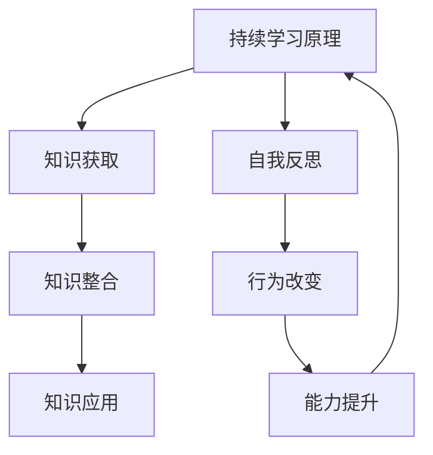

                 

# 《持续学习对管理者的重要性》

> 关键词：持续学习、管理者、个人成长、企业竞争力、未来趋势

> 摘要：本文旨在探讨持续学习对管理者的重要性。通过对管理者角色的分析，阐述持续学习在个人成长和企业发展中的必要性。文章从理念、方法、实践和未来趋势四个方面，详细介绍了管理者如何通过持续学习提升自身能力和企业竞争力。

---

### 《持续学习对管理者的重要性》目录大纲

#### 第一部分：持续学习的重要性

# 第一部分概述

## 1.1 管理者的角色与持续学习的必要性

### 1.1.1 管理者的责任与挑战

### 1.1.2 持续学习与个人成长

### 1.1.3 持续学习与企业发展的关系

## 1.2 持续学习的理念与价值观

### 1.2.1 持续学习的定义与内涵

### 1.2.2 持续学习的理念与原则

### 1.2.3 持续学习价值观的培养

#### 第二部分：持续学习的实践方法

# 第二部分概述

## 2.1 持续学习的策略与方法

### 2.1.1 设定明确的学习目标

### 2.1.2 制定科学的学习计划

### 2.1.3 运用有效的学习工具

### 2.1.4 培养良好的学习习惯

## 2.2 管理者持续学习的能力培养

### 2.2.1 知识体系的构建

### 2.2.2 思维能力的提升

### 2.2.3 领导力与人际交往能力的培养

### 2.2.4 团队管理与领导力培养

## 2.3 持续学习在企业中的应用

### 2.3.1 企业学习文化的建设

### 2.3.2 企业学习项目的组织与实施

### 2.3.3 企业学习成果的转化与应用

#### 第三部分：持续学习的案例与实践

# 第三部分概述

## 3.1 持续学习在管理者个人成长中的应用

### 3.1.1 持续学习对管理者职业发展的推动作用

### 3.1.2 持续学习在个人成长中的案例分析

### 3.1.3 持续学习个人成长策略与实践

## 3.2 持续学习在企业管理中的应用

### 3.2.1 持续学习在企业管理中的实践案例

### 3.2.2 持续学习在团队管理与领导力培养中的应用

### 3.2.3 持续学习对企业绩效提升的实证研究

#### 第四部分：持续学习的挑战与未来

# 第四部分概述

## 4.1 持续学习面临的挑战

### 4.1.1 时间与精力的分配

### 4.1.2 学习资源的获取与利用

### 4.1.3 学习效果的评估与反馈

## 4.2 持续学习的未来趋势

### 4.2.1 技术进步对持续学习的影响

### 4.2.2 持续学习在教育领域的发展趋势

### 4.2.3 持续学习在企业管理与领导力培养中的应用前景

## 附录

### 附录 A：推荐阅读书目与资源

### 附录 B：持续学习实践工具与方法

### 附录 C：持续学习案例汇编

### 附录 D：持续学习调查问卷与数据分析结果

### 附录 E：持续学习研究报告与成果分享

---

#### **核心概念与联系**

**持续学习原理与管理者成长架构**



**持续学习原理**是指通过不断获取、整合和应用知识，进行自我反思和行为改变，从而提升个人能力的过程。这一过程形成一个闭环，持续推动个人成长。

**管理者成长架构**包括知识体系、思维能力、领导力与人际交往能力、团队管理与领导力培养等方面。持续学习是管理者成长的核心动力，有助于构建稳固的管理者成长架构。

---

#### **核心算法原理讲解**

**学习策略优化算法（伪代码）**

```python
# 设定学习目标
def setLearningGoals():
    # ...

# 制定学习计划
def createLearningPlan():
    # ...

# 选择合适的学习工具
def chooseLearningTools():
    # ...

# 培养良好的学习习惯
def cultivateGoodLearningHabits():
    # ...

# 学习能力提升
def improveLearningAbility():
    # ...
```

**学习策略优化算法**的目标是帮助管理者制定高效的学习计划，选择合适的学习工具，培养良好的学习习惯，并不断提升学习能力。以下是算法的伪代码描述：

1. **设定学习目标**：明确管理者的学习目标和期望成果。
2. **制定学习计划**：根据学习目标，制定具体的学习计划，包括学习内容、学习时间和学习方法。
3. **选择合适的学习工具**：根据学习计划，选择能够支持学习目标实现的学习工具，如在线课程、图书、讲座等。
4. **培养良好的学习习惯**：养成良好的学习习惯，如定期学习、主动提问、总结反思等。
5. **学习能力提升**：通过不断实践和学习，提升管理者的学习能力和知识水平。

---

#### **数学模型和数学公式**

**学习率调整公式**

$$
\alpha_{t+1} = \alpha_{t} \times \gamma
$$

其中，$\alpha_{t}$ 表示当前学习率，$\alpha_{t+1}$ 表示下一次学习率，$\gamma$ 表示学习率调整系数。

这个公式用于调整学习过程中的学习率，以适应学习者的学习状态。当学习者在某个学习阶段取得较好的成果时，学习率可以适当提高，以加快学习进度；当学习者在某个学习阶段遇到困难时，学习率可以适当降低，以避免过度疲劳。

**学习效果评估指标**

$$
R = \frac{\text{实际成果}}{\text{预期成果}} \times 100\%
$$

其中，$R$ 表示学习效果评估指标。

这个指标用于衡量学习者的学习效果，当实际成果与预期成果相同时，学习效果最佳；当实际成果低于预期成果时，学习效果较差。

---

#### **项目实战**

**企业持续学习管理平台开发案例**

1. **开发环境搭建**

   - Python 3.8
   - Django 3.2
   - MySQL 8.0

2. **源代码详细实现**

   ```python
   # models.py
   class UserProfile(models.Model):
       user = models.OneToOneField(User, on_delete=models.CASCADE)
       role = models.CharField(max_length=100)
       learning_goals = models.TextField()
       learning_plan = models.TextField()
       learning_tools = models.TextField()
       learning_habits = models.TextField()
       learning_ability = models.FloatField()
   
   # views.py
   from .models import UserProfile
   
   def user_profile_view(request):
       # ...
       return render(request, 'user_profile.html', context)
   ```

3. **代码解读与分析**

   - **UserProfile模型**：定义了用户的基本信息和学习相关字段，如学习目标、学习计划、学习工具和学习习惯等。
   - **user_profile_view视图**：处理用户学习信息的展示和编辑。

通过这个案例，管理者可以了解如何搭建一个企业持续学习管理平台，从而为员工提供持续学习的支持和帮助。

---

#### **持续学习的挑战与未来**

**持续学习的挑战**

- **时间管理**：管理者需要合理安排时间，确保有足够的时间进行持续学习。
- **资源获取**：管理者需要获取高质量的学习资源，以便提高学习效率。
- **效果评估**：管理者需要有效评估学习效果，以便调整学习策略。

**持续学习的未来趋势**

- **数字化学习**：随着互联网和人工智能技术的发展，数字化学习将成为主流学习方式。
- **终身学习**：管理者需要将学习作为一种生活方式和价值观，实现终身学习。

---

通过本文的探讨，我们可以看到持续学习对管理者的重要性。管理者应该通过持续学习，不断提升自身能力和企业竞争力，以应对未来的挑战。让我们共同努力，践行持续学习的理念，成为更好的管理者。

---

作者：AI天才研究院/AI Genius Institute & 禅与计算机程序设计艺术 /Zen And The Art of Computer Programming### 第一部分：持续学习的重要性

#### 1.1 管理者的角色与持续学习的必要性

在企业管理中，管理者扮演着至关重要的角色。他们不仅是组织的领导者，还是战略的制定者和执行者，同时也是团队的建设者和协调者。管理者不仅要具备丰富的专业知识和技能，还需要具备卓越的领导力和决策能力，以便在复杂多变的市场环境中引领企业走向成功。

然而，随着全球化和信息化的发展，企业管理环境变得越来越复杂。技术的快速进步、市场的快速变化以及员工需求的多样化，都给管理者带来了前所未有的挑战。在这种情况下，持续学习成为了管理者应对挑战、提升自身能力和实现职业发展的必要途径。

**1.1.1 管理者的责任与挑战**

管理者的责任主要体现在以下几个方面：

1. **战略规划**：管理者需要制定企业的发展战略，确定企业的愿景、使命和目标，并确保这些战略能够适应市场的变化和企业的实际情况。

2. **团队管理**：管理者需要建立高效的团队，激发团队成员的积极性，提高团队的整体执行力。

3. **资源配置**：管理者需要合理配置企业的资源，确保企业能够以最低的成本实现最大的效益。

4. **决策能力**：管理者需要在复杂多变的环境中做出正确的决策，以应对各种挑战。

然而，随着企业管理环境的复杂化，管理者面临着以下挑战：

1. **知识更新速度加快**：随着科技的快速发展，管理知识也在不断更新。管理者需要不断学习新知识、新技能，以适应快速变化的市场环境。

2. **市场竞争加剧**：全球化和信息化使得市场竞争日益激烈，管理者需要不断提高自身的竞争力，以保持企业的市场地位。

3. **员工需求多样化**：随着员工对工作环境的期望不断提高，管理者需要具备更多的人本管理能力，以吸引和留住优秀人才。

**1.1.2 持续学习与个人成长**

持续学习对于管理者的个人成长具有重要意义。首先，持续学习可以帮助管理者更新知识结构，掌握最新的管理理念和方法，从而提高自身的专业素养。其次，持续学习可以提升管理者的思维能力，增强其分析和解决问题的能力。此外，持续学习还可以帮助管理者拓宽视野，了解不同行业、不同领域的最新动态，从而提高其战略规划和决策能力。

**1.1.3 持续学习与企业发展的关系**

持续学习不仅对管理者的个人成长具有重要意义，也对企业的发展起到了关键作用。首先，持续学习可以提升企业的整体竞争力。管理者通过持续学习，可以掌握最新的管理理念和方法，从而提高企业的管理水平和运营效率。其次，持续学习可以激发员工的积极性和创造力。管理者通过引导和鼓励员工持续学习，可以激发员工的工作热情，提高员工的工作效率和质量。最后，持续学习可以促进企业的创新和发展。管理者通过持续学习，可以了解最新的科技动态和市场趋势，从而引领企业进行创新，实现持续发展。

**1.2 持续学习的理念与价值观**

持续学习不仅仅是一种行为，更是一种理念和价值观。它强调学习是一个持续的过程，不仅仅是在学校或培训机构学习，更是在工作和生活中不断学习和成长。持续学习的理念包括以下几个方面：

1. **终身学习**：将学习作为一种生活方式和价值观，认识到学习是一个终身的过程，不论年龄大小，都要不断学习。

2. **主动学习**：主动寻求学习机会，积极吸收新知识、新技能，不断充实自己。

3. **反思学习**：通过反思学习过程和结果，不断调整学习策略，提高学习效果。

4. **实践学习**：将学习到的知识和技能应用到实际工作中，通过实践检验和提升自身能力。

**1.2.1 持续学习的定义与内涵**

持续学习是指个人或组织在不断变化的环境中，通过主动、持续的学习过程，获取新知识、新技能，提升自身能力，以适应环境变化和实现个人或组织目标的过程。持续学习的内涵包括以下几个方面：

1. **学习意识**：认识到学习的重要性，将学习作为自我提升的重要途径。

2. **学习动力**：具有持续学习的内在动力，主动寻求学习机会。

3. **学习方法**：掌握科学有效的学习方法，提高学习效率。

4. **学习资源**：充分利用各种学习资源，包括书籍、网络、讲座等。

**1.2.2 持续学习的理念与原则**

持续学习的理念主要包括以下几点：

1. **终身学习**：将学习作为终身活动，不断提升自己的知识和技能。

2. **主动学习**：主动寻求学习机会，积极参与各种学习活动。

3. **全面学习**：不仅学习专业知识，还要学习跨学科的知识，提高综合素质。

4. **实践学习**：将学习到的知识和技能应用到实际工作中，通过实践提升能力。

持续学习的原则包括：

1. **自主性**：学习是个人自主的行为，需要自己主动安排学习时间和内容。

2. **持续性**：学习是一个长期的过程，需要持续不断地进行。

3. **实效性**：学习要注重实效，将学习成果应用到实际工作中。

4. **反思性**：通过反思学习过程，不断调整学习策略，提高学习效果。

**1.2.3 持续学习价值观的培养**

持续学习价值观的培养是一个长期的过程，需要从以下几个方面入手：

1. **树立正确的学习观念**：认识到学习的重要性，将学习作为一种生活方式和价值观。

2. **营造良好的学习环境**：企业、学校和家庭等都要为个人或组织的学习提供良好的环境和支持。

3. **建立学习激励机制**：通过奖励、晋升等方式激励个人或组织持续学习。

4. **提供多样化的学习资源**：提供丰富的学习资源，包括书籍、网络、讲座等，满足个人或组织的学习需求。

通过以上措施，可以有效培养持续学习价值观，促进个人和组织的发展。

---

**1.3 持续学习对管理者的重要性**

持续学习对于管理者的重要性不言而喻。首先，持续学习可以帮助管理者提升自身的专业素养，掌握最新的管理理念和方法，从而提高企业的管理水平和运营效率。其次，持续学习可以增强管理者的思维能力，提高分析和解决问题的能力，使其在复杂多变的市场环境中做出正确的决策。此外，持续学习还可以拓宽管理者的视野，了解不同行业、不同领域的最新动态，从而为企业的发展提供有益的启示。

对于管理者而言，持续学习不仅是一种责任，更是一种使命。管理者应该树立持续学习的理念，将学习作为一种生活方式和价值观，不断提升自身的知识和能力，以适应不断变化的市场环境和企业需求。

---

在这一部分中，我们深入探讨了持续学习对管理者的重要性。通过分析管理者的角色和责任，我们了解到持续学习是应对市场变化和提升个人能力的必要途径。同时，我们阐述了持续学习的理念与价值观，并强调了持续学习对管理者个人成长和企业发展的关键作用。在下一部分，我们将进一步探讨持续学习的实践方法，帮助管理者实现持续学习的目标。

---

#### 2.1 持续学习的策略与方法

为了实现持续学习的目标，管理者需要制定科学的学习策略和采用有效的方法。以下是一些具体的策略和方法，可以帮助管理者在持续学习的道路上取得成功。

**2.1.1 设定明确的学习目标**

设定明确的学习目标是持续学习的第一步。管理者应该根据自己的职业规划和企业发展需求，明确自己的学习目标。这些目标可以是短期的，如掌握一项新技术或提高某一管理技能；也可以是长期的，如成为某一领域的专家或提升企业的整体管理水平。

**设定明确学习目标的方法：**

1. **目标明确**：确保学习目标具体、明确、可量化，以便于评估和追踪进展。
2. **目标分解**：将大目标分解为若干个小目标，制定详细的实施计划。
3. **目标优先级**：根据目标的重要性和紧急性，确定目标的优先级，确保重要目标得到优先完成。

**2.1.2 制定科学的学习计划**

制定科学的学习计划是确保学习目标实现的关键。管理者应该根据自己的时间安排和任务优先级，制定合理的学习计划，确保学习时间不被其他事务干扰。

**制定学习计划的方法：**

1. **时间规划**：合理安排学习时间，确保每周都有固定的学习时间。
2. **任务分配**：根据学习目标，将学习任务分配到不同的时间段，避免集中学习导致的疲劳。
3. **学习环境**：选择一个安静、舒适的学习环境，提高学习效率。

**2.1.3 运用有效的学习工具**

现代科技为管理者提供了丰富的学习工具，如在线课程、电子书、学习平台等。管理者应该善于运用这些工具，提高学习效率和效果。

**运用学习工具的方法：**

1. **在线课程**：选择高质量、针对性的在线课程，系统地学习专业知识。
2. **电子书**：利用电子书平台，获取最新的管理书籍和资料。
3. **学习平台**：利用学习平台，如MOOC（大规模开放在线课程），参加各类学习活动。

**2.1.4 培养良好的学习习惯**

良好的学习习惯是持续学习的重要保障。管理者应该养成良好的学习习惯，如定期学习、主动总结、及时复习等。

**培养良好学习习惯的方法：**

1. **定期学习**：设定固定的学习时间，如每天晚上或每周的某个时间段，进行学习。
2. **主动总结**：在学习过程中，主动总结所学知识，形成自己的理解。
3. **及时复习**：定期复习所学知识，巩固记忆，防止遗忘。

**2.1.5 建立学习社区**

建立学习社区可以提供互相学习和交流的平台，有助于提升学习效果和拓展视野。

**建立学习社区的方法：**

1. **加入学习小组**：加入同行业的学习小组，与他人交流学习心得，互相促进。
2. **参加线上论坛**：参加各类线上论坛，参与讨论，分享经验。
3. **组织学习活动**：组织定期的学习活动，如读书会、研讨会等，激发学习兴趣。

**2.1.6 运用数据驱动学习**

数据可以提供学习效果的量化指标，帮助管理者评估学习成果，调整学习策略。

**运用数据驱动学习的方法：**

1. **学习分析工具**：使用学习分析工具，如学习进度跟踪、学习效果评估等，了解学习成果。
2. **定期评估**：定期进行学习效果评估，根据评估结果调整学习计划。
3. **反馈机制**：建立反馈机制，收集学员反馈，改进学习内容和方式。

通过以上策略和方法，管理者可以更好地实现持续学习的目标，提升自身能力和企业竞争力。在下一部分，我们将进一步探讨管理者如何培养持续学习的能力，以应对不断变化的挑战。

---

**2.1.1 设定明确的学习目标**

设定明确的学习目标是持续学习的关键步骤。首先，管理者需要明确自己的职业规划和企业发展需求，以此为基础设定具体的学习目标。这些目标可以是短期的，如掌握一项新技术或提高某一管理技能；也可以是长期的，如成为某一领域的专家或提升企业的整体管理水平。

**设定明确学习目标的方法：**

1. **目标明确**：确保学习目标具体、明确、可量化，以便于评估和追踪进展。例如，目标可以是“在接下来的三个月内，掌握Python编程语言的基础知识”或“在未来一年内，完成高级项目管理认证课程”。

2. **目标分解**：将大目标分解为若干个小目标，制定详细的实施计划。例如，如果目标是掌握Python编程语言的基础知识，可以将目标分解为学习Python的基础语法、掌握数据类型、学习流程控制语句等，并为每个小目标设定具体的学习时间和方法。

3. **目标优先级**：根据目标的重要性和紧急性，确定目标的优先级，确保重要目标得到优先完成。例如，如果同时有两个目标，一个是掌握Python编程语言的基础知识，另一个是学习高级项目管理技能，可以根据工作需求和个人发展计划，确定哪个目标更为重要，并优先完成。

**实例：**

假设一位项目经理在职业规划中设定了以下两个学习目标：

1. **短期目标**：在接下来的三个月内，掌握Python编程语言的基础知识，以便在项目中使用自动化工具提高工作效率。
2. **长期目标**：在未来一年内，完成PMP（项目管理专业人士）认证课程，提升项目管理技能。

为了实现这两个目标，项目经理可以采取以下步骤：

1. **目标明确**：将短期目标具体化，如“每周学习Python编程语言的基础知识，完成相关练习和项目”。长期目标则可以具体化为“每月参加PMP认证课程的线上讲座，完成课程作业和考试”。

2. **目标分解**：将短期目标分解为每周的学习任务，如学习Python的基本语法、数据类型、流程控制语句等，并为每个任务设定具体的学习时间和方法。长期目标则可以分解为每月的学习任务，如参加PMP认证课程的线上讲座、完成课程作业和考试。

3. **目标优先级**：根据项目需求和职业发展计划，确定哪个目标更为重要。例如，如果当前项目需要使用Python自动化工具，则可以将短期目标作为优先目标，确保在短时间内掌握Python编程语言的基础知识。长期目标则可以适当延后，确保在完成短期目标后再进行。

通过以上方法，项目经理可以设定明确的学习目标，并制定详细的实施计划，确保学习目标的实现。

---

**2.1.2 制定科学的学习计划**

制定科学的学习计划是确保学习目标实现的关键。管理者需要根据自己的时间安排和任务优先级，合理安排学习时间，确保学习计划的有效执行。

**制定学习计划的方法：**

1. **时间规划**：合理安排学习时间，确保每周都有固定的学习时间。例如，可以将每周的周一、周三和周五晚上设定为固定的学习时间，每次学习两个小时。

2. **任务分配**：根据学习目标，将学习任务分配到不同的时间段，避免集中学习导致的疲劳。例如，可以将学习任务分为基础知识学习、实践操作和复习巩固三个阶段，分别安排在不同的时间段进行。

3. **学习环境**：选择一个安静、舒适的学习环境，提高学习效率。例如，可以在家中设置一个专门的办公区域，保持整洁和安静，以避免干扰。

**实例：**

假设一位项目经理需要在接下来的三个月内掌握Python编程语言的基础知识，并完成PMP认证课程的学习。项目经理可以制定以下学习计划：

1. **时间规划**：每周安排两个晚上（周一和周三晚上）用于学习Python编程语言，每次学习两个小时。同时，每周安排一个晚上（周五晚上）用于复习和巩固所学知识。

2. **任务分配**：将学习任务分为基础知识学习、实践操作和复习巩固三个阶段。第一阶段（前两周）专注于学习Python的基础语法和数据类型；第二阶段（接下来的四周）专注于学习流程控制语句和函数；第三阶段（最后两周）进行综合复习和巩固。

3. **学习环境**：在家中设置一个专门的办公区域，保持整洁和安静，以避免干扰。可以使用电脑、书籍和在线资源进行学习。

通过以上方法，项目经理可以制定一个科学的学习计划，确保在规定的时间内掌握Python编程语言的基础知识，并顺利完成PMP认证课程的学习。

---

**2.1.3 运用有效的学习工具**

现代科技为管理者提供了丰富的学习工具，如在线课程、电子书、学习平台等。管理者应该善于运用这些工具，提高学习效率和效果。

**运用学习工具的方法：**

1. **在线课程**：选择高质量、针对性的在线课程，系统地学习专业知识。例如，可以参加Coursera、edX等在线教育平台上的专业课程，获取系统的学习资源。

2. **电子书**：利用电子书平台，获取最新的管理书籍和资料。例如，可以访问Amazon Kindle或Google Play Books，购买和下载所需书籍。

3. **学习平台**：利用学习平台，如MOOC（大规模开放在线课程），参加各类学习活动。例如，可以参加Coursera、edX等平台上的开放课程，与全球学习者互动，拓展视野。

**实例：**

假设一位项目经理希望在提升自身项目管理能力的同时，学习Python编程语言以应用于项目自动化。项目经理可以运用以下学习工具：

1. **在线课程**：在Coursera上报名参加“Python编程入门”课程，学习Python的基础知识和编程技巧。

2. **电子书**：在Amazon Kindle上购买《项目管理知识体系指南》（PMBOK指南），系统学习项目管理的基础理论和实践方法。

3. **学习平台**：在edX上报名参加“项目管理基础”课程，学习项目管理的基本概念和实用技巧。

通过以上方法，项目经理可以充分利用现代科技提供的丰富学习工具，提高学习效率和效果，实现持续学习的目标。

---

**2.1.4 培养良好的学习习惯**

良好的学习习惯是持续学习的重要保障。管理者应该养成良好的学习习惯，如定期学习、主动总结、及时复习等。

**培养良好学习习惯的方法：**

1. **定期学习**：设定固定的学习时间，如每天晚上或每周的某个时间段，进行学习。例如，可以每天晚上19:00至21:00进行学习，确保学习时间的稳定性。

2. **主动总结**：在学习过程中，主动总结所学知识，形成自己的理解。例如，在完成一个学习任务后，花10分钟时间回顾所学内容，总结关键点和难点。

3. **及时复习**：定期复习所学知识，巩固记忆，防止遗忘。例如，每周安排一次复习时间，回顾一周所学的内容，巩固记忆。

**实例：**

假设一位项目经理需要在接下来的三个月内掌握Python编程语言的基础知识和项目管理知识。项目经理可以培养以下良好学习习惯：

1. **定期学习**：每周安排两个晚上（周一和周三晚上）用于学习Python编程语言，每次学习两个小时。同时，每周安排一个晚上（周五晚上）用于复习和巩固所学知识。

2. **主动总结**：在学习过程中，每完成一个学习任务后，花10分钟时间回顾所学内容，总结关键点和难点，形成自己的理解。

3. **及时复习**：每周安排一次复习时间，回顾一周所学的内容，巩固记忆。例如，每周五晚上19:00至21:00进行复习，确保所学知识的巩固。

通过以上方法，项目经理可以培养良好的学习习惯，确保持续学习目标的实现。

---

**2.1.5 建立学习社区**

建立学习社区可以提供互相学习和交流的平台，有助于提升学习效果和拓展视野。

**建立学习社区的方法：**

1. **加入学习小组**：加入同行业的学习小组，与他人交流学习心得，互相促进。例如，可以加入专业社群或在线学习论坛，参与讨论和分享经验。

2. **参加线上论坛**：参加各类线上论坛，参与讨论，分享经验。例如，可以参加LinkedIn上的专业群组，参与行业讨论，获取最新资讯。

3. **组织学习活动**：组织定期的学习活动，如读书会、研讨会等，激发学习兴趣。例如，可以每月组织一次读书会，邀请专业人士分享书籍精华，促进学习交流。

**实例：**

假设一位项目经理希望提升自身的项目管理能力和Python编程水平，可以建立以下学习社区：

1. **加入学习小组**：加入专业社群，如项目管理协会（PMI）或Python编程社区，参与线上讨论和活动，与他人交流学习心得。

2. **参加线上论坛**：在LinkedIn上加入“项目经理交流群”和“Python编程高手群”，参与行业讨论，获取最新资讯。

3. **组织学习活动**：每月组织一次读书会，邀请专业人士分享项目管理或Python编程的书籍精华，促进学习交流。

通过以上方法，项目经理可以建立学习社区，提升学习效果和拓展视野。

---

**2.1.6 运用数据驱动学习**

数据可以提供学习效果的量化指标，帮助管理者评估学习成果，调整学习策略。

**运用数据驱动学习的方法：**

1. **学习分析工具**：使用学习分析工具，如学习进度跟踪、学习效果评估等，了解学习成果。例如，可以安装学习应用，记录学习时间和进度。

2. **定期评估**：定期进行学习效果评估，根据评估结果调整学习计划。例如，每月进行一次学习效果评估，根据评估结果调整学习目标和计划。

3. **反馈机制**：建立反馈机制，收集学员反馈，改进学习内容和方式。例如，在学习结束后，收集学员对课程内容和教学方法的反馈，改进后续课程。

**实例：**

假设一位项目经理希望在提升自身项目管理能力和Python编程水平的过程中，运用数据驱动学习：

1. **学习分析工具**：安装学习应用，记录每天的学习时间和进度，了解自己的学习状况。

2. **定期评估**：每月进行一次学习效果评估，根据评估结果调整学习目标和计划。例如，如果发现自己在Python编程方面的掌握程度较低，可以增加Python编程的学习时间。

3. **反馈机制**：在学习结束后，收集学员对课程内容和教学方法的反馈，改进后续课程。例如，如果学员反馈某部分课程内容难以理解，可以调整教学方式，增加讲解时间。

通过以上方法，项目经理可以运用数据驱动学习，提升学习效果和成果。

---

通过以上策略和方法，管理者可以更好地实现持续学习的目标，提升自身能力和企业竞争力。在下一部分，我们将进一步探讨管理者如何培养持续学习的能力，以应对不断变化的挑战。

---

#### **2.2 管理者持续学习的能力培养**

持续学习不仅仅是获取知识和技能的过程，更是提升管理者自身能力和素质的途径。为了实现这一目标，管理者需要在多个方面进行努力，包括知识体系的构建、思维能力的提升、领导力与人际交往能力的培养，以及团队管理与领导力培养。

**2.2.1 知识体系的构建**

构建一个完善的知识体系是管理者持续学习的基础。知识体系应该涵盖以下几个领域：

1. **专业知识**：管理者需要具备本行业、本专业的基本知识和技能，这是其开展工作的基础。例如，对于一个IT行业的项目经理，需要掌握软件工程、项目管理等专业知识。

2. **跨学科知识**：随着企业运营的复杂化，管理者需要具备跨学科的知识，如经济学、心理学、市场营销等。这些知识可以帮助管理者从不同角度分析和解决问题。

3. **管理知识**：管理者需要掌握管理理论、管理方法和管理工具，如组织行为学、领导力、财务管理等。这些知识可以帮助管理者更好地进行团队管理和决策。

**构建知识体系的方法：**

1. **系统学习**：通过参加专业课程、培训等方式，系统地学习相关知识。

2. **实践应用**：将所学知识应用到实际工作中，通过实践检验和提升。

3. **持续更新**：随着知识更新的速度加快，管理者需要定期更新自己的知识体系，跟上行业发展的步伐。

**2.2.2 思维能力的提升**

思维能力的提升是管理者持续学习的重要目标。管理者需要具备以下几种思维能力：

1. **逻辑思维能力**：逻辑思维能力是管理者分析和解决问题的基本能力。通过逻辑思维，管理者可以理清思路，找到问题的根本原因。

2. **创新思维能力**：创新思维能力是管理者在复杂多变的环境中脱颖而出的关键。通过创新思维，管理者可以提出新的观点、新的解决方案。

3. **批判性思维能力**：批判性思维能力是管理者对信息和观点进行评估和判断的能力。通过批判性思维，管理者可以避免盲目跟风，做出更为合理的决策。

**提升思维能力的方法：**

1. **阅读**：通过阅读书籍、论文等，拓宽知识面，提高逻辑思维和批判性思维能力。

2. **交流**：通过与他人交流，分享观点和经验，提高创新思维能力。

3. **实践**：通过实际工作，不断面对和解决问题，提高思维能力。

**2.2.3 领导力与人际交往能力的培养**

领导力和人际交往能力是管理者成功的关键。一个优秀的领导者不仅需要具备管理能力，还需要具备良好的人际交往能力。

1. **领导力培养**：领导者需要具备愿景、决策、沟通、激励等能力。通过领导力培训、实践和反思，管理者可以不断提升自己的领导力。

2. **人际交往能力培养**：人际交往能力包括倾听、沟通、协调等。管理者需要通过与他人建立良好的关系，获得团队的支持和信任。

**培养领导力与人际交往能力的方法：**

1. **参与培训**：参加领导力培训和人际交往能力培训，学习相关理论和技巧。

2. **实践应用**：在实际工作中，不断运用所学知识和技巧，提高领导力和人际交往能力。

3. **反思总结**：通过反思自己的行为和结果，总结经验教训，不断提升。

**2.2.4 团队管理与领导力培养**

团队管理是管理者的重要职责，而领导力培养则是团队管理的关键。管理者需要通过以下方式培养团队领导力：

1. **培养团队意识**：通过团队建设活动，增强团队成员的团队意识，促进团队协作。

2. **提供成长机会**：为团队成员提供学习和成长的机会，激发团队成员的积极性和创造力。

3. **建立激励机制**：通过建立合理的激励机制，激发团队成员的积极性，提高团队绩效。

**培养团队管理与领导力的方法：**

1. **团队建设活动**：定期组织团队建设活动，增强团队凝聚力。

2. **培训与发展**：为团队成员提供培训和发展机会，提高团队整体能力。

3. **绩效管理**：通过绩效管理，激励团队成员，提高团队绩效。

通过以上方法，管理者可以不断提升自身能力，培养团队领导力，为企业的持续发展奠定坚实基础。

---

**2.2.1 知识体系的构建**

构建一个完善的知识体系是管理者持续学习的基础。一个优秀的管理者不仅需要掌握本行业的专业知识，还需要具备跨学科的知识和技能。以下是一个典型的知识体系框架：

1. **行业专业知识**：
   - 行业法规与政策
   - 行业市场分析
   - 行业发展趋势
   - 行业最佳实践

2. **跨学科知识**：
   - 经济学：宏观经济分析、微观经济分析
   - 心理学：员工激励、团队管理
   - 市场营销：市场定位、消费者行为分析
   - 财务管理：预算编制、财务分析

3. **管理知识**：
   - 项目管理：项目计划、风险管理、质量控制
   - 组织行为学：领导力、团队合作、组织文化
   - 质量管理：ISO体系、质量管理工具
   - 财务管理：预算编制、成本控制、投资分析

**构建知识体系的方法：**

1. **系统学习**：通过参加专业课程、培训、研讨会等，系统地学习相关知识。

2. **实践应用**：将所学知识应用到实际工作中，通过实践检验和提升。

3. **持续更新**：定期阅读行业报告、学术论文、管理书籍等，了解最新的理论和方法，持续更新知识体系。

**实例：**

假设一位项目经理在构建知识体系时，可以采取以下方法：

1. **系统学习**：
   - 参加项目管理专业培训，如PMP认证课程，学习项目管理的理论知识。
   - 阅读相关书籍，如《高效能人士的七个习惯》、《领导力五项修炼》，提升领导力和人际交往能力。

2. **实践应用**：
   - 在实际项目中，运用所学知识，制定详细的项目计划，进行风险评估和控制，提高项目成功率。

3. **持续更新**：
   - 定期阅读行业报告，如市场研究机构的报告，了解行业最新动态。
   - 参加行业研讨会，与同行交流，学习最佳实践。

通过以上方法，项目经理可以构建一个完善的知识体系，提升自身的专业能力和管理水平。

---

**2.2.2 思维能力的提升**

思维能力的提升对于管理者来说至关重要。以下是一些关键思维能力及其提升方法：

1. **逻辑思维能力**：
   - **训练方法**：通过解决逻辑谜题、阅读逻辑分析文章、参与辩论等，锻炼逻辑思维能力。
   - **实例**：尝试解决逻辑谜题，如“一位农夫有一只鸡和一只蛋，他需要通过一座桥，但桥只能承载100磅的重量。鸡重4磅，蛋重1磅，农夫可以带走一只物品，如何安全过桥？”这个问题需要通过逻辑推理来找到解决方案。

2. **创新思维能力**：
   - **训练方法**：通过头脑风暴、思维导图、设计思维等工具，激发创新思维。
   - **实例**：在团队会议上，使用头脑风暴法列出所有可能的解决方案，不限制创意的可行性，鼓励创新思维。

3. **批判性思维能力**：
   - **训练方法**：通过阅读批判性分析文章、参与批判性讨论、反思自己的观点等，提升批判性思维能力。
   - **实例**：阅读一篇关于企业管理的文章，分析文章中的逻辑漏洞和论据不足之处，进行批判性思考。

**提升思维能力的方法：**

1. **阅读与思考**：定期阅读专业书籍、论文和新闻，培养批判性思维和逻辑分析能力。

2. **实践与反思**：在实际工作中，不断应用所学知识和技能，通过实践和反思提升思维能力。

3. **培训与学习**：参加相关的思维训练课程，如逻辑思维、创新思维、批判性思维等，学习专业的思维技巧。

---

**2.2.3 领导力与人际交往能力的培养**

领导力和人际交往能力是管理者成功的关键。以下是一些关键能力和提升方法：

1. **领导力**：
   - **愿景领导**：通过清晰传达愿景和目标，激发团队成员的积极性和创造力。
   - **情感领导**：建立与团队成员的信任关系，关心团队成员的福祉。
   - **变革领导**：在组织变革中，能够带领团队适应新的环境和挑战。

2. **人际交往能力**：
   - **沟通技巧**：通过有效沟通，确保信息的准确传递和理解。
   - **情绪管理**：理解并管理自己的情绪，同时能够识别和应对他人的情绪。
   - **冲突解决**：通过合理的方式解决团队中的冲突，维护团队和谐。

**提升领导力与人际交往能力的方法：**

1. **参与培训**：参加领导力培训、沟通技巧培训等，学习专业的领导力和人际交往技巧。

2. **实践应用**：在实际工作中，不断运用所学知识和技巧，提高领导力和人际交往能力。

3. **反思与反馈**：通过反思自己的领导行为和人际交往结果，寻求他人的反馈，不断改进。

4. **模拟训练**：通过角色扮演、情景模拟等方式，进行领导力和人际交往能力的训练。

---

**2.2.4 团队管理与领导力培养**

团队管理与领导力培养是管理者的重要职责。以下是一些关键点和培养方法：

1. **团队建设**：
   - **建立团队文化**：通过共同的目标、价值观和行为规范，建立积极的团队文化。
   - **增强团队凝聚力**：通过团队建设活动、共同完成任务等方式，增强团队成员之间的信任和协作。

2. **领导力培养**：
   - **激励与认可**：通过激励机制，如奖励、晋升等，激发团队成员的积极性。
   - **教练与发展**：通过教练式领导，帮助团队成员发展个人技能和职业发展。

3. **团队管理**：
   - **明确目标**：确保团队成员明确自己的工作目标和期望成果。
   - **分工与合作**：合理分工，确保团队成员各司其职，同时促进团队成员之间的协作。

**培养团队管理与领导力的方法：**

1. **领导力发展计划**：制定领导力发展计划，包括培训、实践和反馈环节，帮助管理者提升领导力。

2. **团队建设活动**：定期组织团队建设活动，如团建活动、团队培训等，增强团队凝聚力。

3. **跨部门合作**：鼓励跨部门合作，促进不同团队之间的沟通与协作。

4. **领导力导师制**：建立领导力导师制，让有经验的管理者指导新管理者，传承领导经验。

---

通过以上方法，管理者可以不断提升自身的领导力与人际交往能力，培养有效的团队管理能力，为企业的持续发展奠定坚实基础。在下一部分，我们将进一步探讨持续学习在企业中的应用，帮助管理者将学习成果转化为实际效益。

---

#### **2.3 持续学习在企业中的应用**

持续学习不仅是管理者个人的需求，更是企业发展的关键因素。在当今快速变化的市场环境中，企业需要不断学习新知识、新技能，以适应市场的变化和提升自身的竞争力。以下将详细探讨持续学习在企业中的应用，包括企业学习文化的建设、企业学习项目的组织与实施，以及学习成果的转化与应用。

**2.3.1 企业学习文化的建设**

企业学习文化是指企业在运营过程中，通过营造良好的学习氛围，鼓励员工持续学习、不断进步的一种文化氛围。建设企业学习文化是促进企业持续学习的重要措施。以下是一些关键步骤：

1. **制定学习政策**：企业应制定明确的持续学习政策，明确学习目标、学习内容和学习时间等，确保员工有足够的动力和资源进行持续学习。

2. **建立学习平台**：企业可以建立内部学习平台，如在线课程、电子图书馆等，提供丰富的学习资源，方便员工随时随地学习。

3. **奖励机制**：企业可以通过设立学习奖励机制，如颁发学习证书、晋升机会等，激励员工积极参与学习活动。

4. **领导示范**：企业领导层应积极参与学习活动，通过自身的榜样作用，带动员工形成良好的学习习惯。

**2.3.2 企业学习项目的组织与实施**

企业学习项目是指为了提升员工技能和知识水平，实现企业战略目标而开展的一系列学习活动。以下是一些组织与实施企业学习项目的关键步骤：

1. **需求分析**：首先，企业应对员工的学习需求进行充分分析，了解员工在哪些方面需要提升，哪些技能和知识对企业发展至关重要。

2. **项目规划**：根据需求分析的结果，制定详细的项目规划，包括学习目标、学习内容、学习时间、学习方式等。

3. **资源整合**：整合企业内外部学习资源，如内部培训师、外部专家、在线课程等，确保项目顺利实施。

4. **组织实施**：按照项目规划，组织开展学习活动，包括内部培训、外部培训、在线学习等。

5. **效果评估**：在项目结束后，对学习效果进行评估，了解学习成果，发现项目中的问题和不足，为下一轮学习项目提供改进方向。

**2.3.3 企业学习成果的转化与应用**

企业学习的最终目的是将学习成果转化为实际效益，提升企业的竞争力。以下是一些关键步骤：

1. **知识共享**：通过内部知识共享平台，将学习成果分享给全体员工，促进知识的传播和应用。

2. **技能培训**：根据学习成果，开展技能培训，提升员工的专业技能和业务能力。

3. **绩效改进**：将学习成果应用到实际工作中，通过改进工作流程、提高工作效率，实现绩效提升。

4. **项目改进**：根据学习成果，对现有项目进行改进，优化项目方案，提高项目成功率。

5. **创新应用**：鼓励员工将学习成果应用于创新实践，推动企业的创新和发展。

**实例：**

假设一家科技公司希望通过持续学习提升员工技能和知识水平，从而提高企业的竞争力。公司可以采取以下措施：

1. **建设学习文化**：制定持续学习政策，建立内部学习平台，设立学习奖励机制，鼓励员工积极参与学习活动。

2. **组织学习项目**：分析员工学习需求，制定详细的学习项目规划，整合内外部学习资源，组织开展学习活动。

3. **转化与应用**：通过内部知识共享平台，将学习成果分享给全体员工；开展技能培训，提升员工的专业技能；将学习成果应用到实际工作中，改进工作流程，提高工作效率。

通过以上措施，这家科技公司可以构建一个良好的持续学习环境，将学习成果转化为实际效益，提升企业的竞争力。

---

**2.3.1 企业学习文化的建设**

建立学习文化是企业实现持续学习的基础。以下是一些关键步骤：

1. **确立学习价值观**：企业需要将学习价值观融入企业文化中，明确学习的重要性，鼓励员工将学习视为工作的一部分。

2. **营造学习氛围**：通过内部宣传、培训活动等方式，营造积极的学习氛围，使员工感受到企业的支持。

3. **提供学习资源**：确保员工能够获取到丰富的学习资源，如在线课程、专业书籍、内部培训等。

4. **建立反馈机制**：通过定期收集员工学习反馈，了解学习效果，调整学习计划，持续改进学习文化。

**实例：**

假设一家互联网公司想要建立学习文化，可以采取以下措施：

1. **确立学习价值观**：在员工手册中明确强调学习的重要性，鼓励员工不断学习和进步。

2. **营造学习氛围**：定期举办内部知识分享会，鼓励员工分享学习心得和经验。

3. **提供学习资源**：建立内部学习平台，提供免费的在线课程和专业书籍，供员工随时学习。

4. **建立反馈机制**：每月进行一次学习效果评估，收集员工反馈，根据反馈调整学习计划。

通过以上措施，这家互联网公司可以逐步建立学习文化，鼓励员工持续学习，提高整体素质。

---

**2.3.2 企业学习项目的组织与实施**

企业学习项目是提升员工技能和知识水平的重要手段。以下是一些关键步骤：

1. **项目规划**：明确学习目标、学习内容、学习时间、学习方式等，制定详细的项目计划。

2. **资源整合**：整合企业内外部学习资源，如内部培训师、外部专家、在线课程等，确保项目顺利实施。

3. **组织实施**：根据项目计划，组织开展学习活动，包括内部培训、外部培训、在线学习等。

4. **效果评估**：在项目结束后，对学习效果进行评估，了解学习成果，发现项目中的问题和不足，为下一轮学习项目提供改进方向。

**实例：**

假设一家制造企业计划提升员工的质量管理能力，可以采取以下步骤：

1. **项目规划**：确定学习目标为掌握ISO 9001质量管理体系，学习内容为质量管理原理、质量管理工具等，学习时间为三个月。

2. **资源整合**：邀请内部质量管理部门的专家进行内部培训，同时购买相关在线课程，供员工自主学习。

3. **组织实施**：每月组织一次内部培训，同时安排员工参加外部质量管理体系认证培训。

4. **效果评估**：在项目结束后，通过考试和员工反馈，评估学习效果，发现不足之处，为下一轮培训提供改进建议。

通过以上步骤，这家制造企业可以有效提升员工的质量管理能力，提高生产质量。

---

**2.3.3 企业学习成果的转化与应用**

将学习成果转化为实际效益是企业学习的最终目的。以下是一些关键步骤：

1. **知识共享**：通过内部知识共享平台，将学习成果分享给全体员工，促进知识的传播和应用。

2. **技能培训**：根据学习成果，开展技能培训，提升员工的专业技能和业务能力。

3. **绩效改进**：将学习成果应用到实际工作中，通过改进工作流程、提高工作效率，实现绩效提升。

4. **项目改进**：根据学习成果，对现有项目进行改进，优化项目方案，提高项目成功率。

5. **创新应用**：鼓励员工将学习成果应用于创新实践，推动企业的创新和发展。

**实例：**

假设一家服务公司通过持续学习提升员工的服务技能，可以采取以下步骤：

1. **知识共享**：建立内部知识共享平台，将服务技能培训的视频和资料上传，供全体员工学习。

2. **技能培训**：定期组织服务技能培训，邀请外部专家进行讲解，提升员工的服务水平。

3. **绩效改进**：通过培训提升员工的服务技能，提高客户满意度，从而提高公司的业绩。

4. **项目改进**：根据培训内容，优化服务项目流程，提高服务效率，降低客户投诉率。

5. **创新应用**：鼓励员工将学习成果应用于实际工作中，提出改进建议，推动公司的服务创新。

通过以上步骤，这家服务公司可以有效将学习成果转化为实际效益，提升企业的竞争力。

---

通过以上探讨，我们可以看到持续学习在企业中的应用具有重要意义。建立学习文化、组织学习项目、转化学习成果，这些都是企业实现持续发展和提升竞争力的关键步骤。在下一部分，我们将通过具体案例，进一步展示持续学习在管理者个人成长和企业发展中的应用。

---

### **3.1 持续学习在管理者个人成长中的应用**

持续学习对管理者的个人成长具有深远的影响。通过不断学习，管理者不仅能够提升自身专业能力和素质，还能实现职业发展的目标。以下将详细探讨持续学习在管理者个人成长中的应用，包括持续学习对职业发展的推动作用、持续学习在个人成长中的案例分析，以及持续学习个人成长策略与实践。

**3.1.1 持续学习对管理者职业发展的推动作用**

持续学习是管理者职业发展的强大推动力。通过持续学习，管理者可以：

1. **提升专业知识**：不断学习新知识、新技术，掌握行业发展的最新动态，提升自身的专业能力。

2. **拓宽视野**：通过学习不同领域的知识，拓宽视野，增强跨学科思维能力，提高分析和解决问题的能力。

3. **提升领导力**：学习领导力和管理知识，提升领导力和团队管理能力，更好地引领团队和企业发展。

4. **增强竞争力**：在激烈的市场竞争中，持续学习使管理者具备更高的专业素养和领导能力，增强自身的竞争力。

**3.1.2 持续学习在个人成长中的案例分析**

以下是一个持续学习在个人成长中的成功案例：

**案例**：张经理的持续学习之路

张经理是一名在IT行业工作多年的项目经理。在工作中，他发现自己所在行业的技术更新速度非常快，为了保持竞争力，他决定通过持续学习提升自己的专业能力和素质。

**步骤一：设定明确的学习目标**

张经理首先设定了明确的学习目标，包括：

1. 掌握最新的人工智能技术，如机器学习和深度学习。
2. 提升项目管理能力，如敏捷方法和敏捷工具的应用。
3. 学习跨学科知识，如心理学和经济学，提高团队管理和决策能力。

**步骤二：制定科学的学习计划**

为了实现学习目标，张经理制定了以下学习计划：

1. **时间规划**：每周安排两个晚上进行学习，每次学习两小时。
2. **任务分配**：将学习任务分为基础知识、实践应用和总结反思三个阶段，确保每个阶段都有明确的任务和目标。
3. **学习环境**：在家中设置一个安静、舒适的学习空间，确保学习效率。

**步骤三：运用有效的学习工具**

张经理运用了以下学习工具：

1. **在线课程**：参加Coursera上的“机器学习”课程，系统地学习机器学习的基础知识。
2. **电子书**：购买《敏捷项目管理实践指南》，学习敏捷方法和工具的应用。
3. **学习社区**：加入IT项目经理社群，与他人交流学习心得和经验。

**步骤四：培养良好的学习习惯**

张经理培养以下良好学习习惯：

1. **定期学习**：每周固定时间学习，确保学习计划得到执行。
2. **主动总结**：在学习过程中，及时总结所学知识，形成自己的理解。
3. **及时复习**：定期复习所学知识，巩固记忆，防止遗忘。

**步骤五：建立学习社区**

张经理加入了一个IT项目经理社群，通过线上讨论和交流，不断拓展自己的视野，提高学习效果。

**结果**：

通过持续学习，张经理在人工智能和项目管理领域取得了显著进步，不仅提升了自身的专业能力，还提高了团队管理和决策能力。最终，他成功晋升为高级项目经理，并在公司中发挥了重要作用。

**3.1.3 持续学习个人成长策略与实践**

为了实现持续学习，管理者可以采取以下策略：

1. **设定明确的学习目标**：根据职业规划和企业发展需求，设定具体、明确的学习目标。

2. **制定科学的学习计划**：合理安排学习时间，将学习任务分解为具体的小任务，确保学习计划的执行。

3. **运用有效的学习工具**：选择合适的在线课程、电子书和学习平台，提高学习效率。

4. **培养良好的学习习惯**：定期学习、主动总结、及时复习，养成良好的学习习惯。

5. **建立学习社区**：加入专业社群，与他人交流学习心得和经验，拓展视野，提高学习效果。

通过以上策略和实践，管理者可以实现持续学习，不断提升自身能力和素质，实现个人成长和职业发展。

---

**3.1.1 持续学习对管理者职业发展的推动作用**

持续学习在管理者职业发展的推动作用不可忽视。以下从以下几个方面详细阐述持续学习对管理者职业发展的积极影响：

1. **知识更新与技能提升**：随着技术的快速发展和市场的不断变化，管理者的专业知识、技能和知识结构需要不断更新。持续学习可以帮助管理者掌握最新的管理理念、方法和工具，提高自身的专业素养和技能水平。例如，现代企业管理越来越依赖于信息技术，因此，熟悉并掌握相关的信息技术知识，如数据分析、云计算、人工智能等，将显著提升管理者的竞争力。

2. **领导力与人际交往能力的提升**：管理者的领导力与人际交往能力是成功的关键。通过持续学习，管理者可以不断提升自身的领导力，学会如何激励团队、处理冲突、建立信任等。例如，学习沟通技巧、谈判策略、心理学等知识，可以帮助管理者更好地与团队成员、上级和客户沟通，提高团队凝聚力和工作效率。

3. **适应能力与应对变化**：在快速变化的市场环境中，管理者需要具备较强的适应能力和应对变化的能力。持续学习可以帮助管理者拓宽视野，了解不同行业、不同领域的最新动态，从而更好地应对市场变化和挑战。例如，通过学习新兴行业的发展趋势、新技术的影响等，管理者可以提前预判市场变化，制定相应的战略规划。

4. **创新思维与创新能力**：创新是企业发展的重要驱动力。通过持续学习，管理者可以培养创新思维，学会如何激发团队的创新能力，推动企业的持续创新。例如，学习设计思维、创新方法论等知识，可以帮助管理者更好地理解创新过程，引导团队进行创新实践。

5. **职业发展机会**：持续学习可以提升管理者的专业能力和综合素质，从而增加其在职场上的竞争力，提高晋升和转职的机会。例如，通过完成相关的专业认证、参加高级管理培训等，管理者可以证明自己的专业素养和领导能力，为职业发展打下坚实基础。

**实例：**

李总是一位在互联网行业工作了十几年的高级管理人员。随着互联网技术的快速发展和市场环境的不断变化，李总意识到需要通过持续学习来提升自己的专业能力和领导力。

- **知识更新与技能提升**：李总参加了多个在线课程，如“数据分析与商业智能”、“区块链技术与应用”等，学习最新的信息技术和商业分析方法，提升自身的专业素养。
- **领导力与人际交往能力的提升**：李总参加了领导力培训，学习了领导力模型、团队激励技巧等知识，通过实践和应用，提高了自己的领导力和人际交往能力。
- **适应能力与应对变化**：李总通过学习新兴行业的发展趋势、新技术的影响等，了解行业动态，为企业的战略规划提供了有力支持。
- **创新思维与创新能力**：李总鼓励团队进行创新实践，通过学习设计思维、创新方法论等知识，推动企业的技术创新和业务模式创新。
- **职业发展机会**：通过持续学习，李总在职场上的竞争力得到了显著提升，成功晋升为公司的首席执行官（CEO），并在公司中发挥了重要作用。

通过以上实例，我们可以看到持续学习对管理者职业发展的推动作用是显著的。持续学习不仅可以帮助管理者提升自身的专业能力和综合素质，还能提高其在职场上的竞争力，实现职业发展的目标。

---

**3.1.2 持续学习在个人成长中的案例分析**

**案例背景**：王经理是一位在快消品行业工作的中级管理人员，他担任市场部经理一职，负责市场调研、品牌推广和渠道管理等工作。王经理在工作中发现，随着市场竞争的加剧和消费者需求的多样化，他需要不断学习和提升自己的专业能力和素质，以应对行业变化和挑战。

**学习目标**：

1. **提升市场分析能力**：掌握市场分析工具和方法，能够准确预测市场趋势和消费者需求。
2. **学习数字营销策略**：了解并掌握数字营销的最新趋势和工具，提升在线营销能力。
3. **提升领导力与团队管理能力**：通过学习领导力和团队管理知识，提高团队凝聚力和工作效率。

**学习过程**：

**阶段一：设定学习目标**

- **目标设定**：王经理根据工作需求和个人职业规划，明确了学习目标，并制定了详细的学习计划。
- **时间规划**：每周安排两个晚上进行学习，每次学习两小时。

**阶段二：制定科学的学习计划**

- **内容规划**：将学习任务分为基础知识、实践应用和总结反思三个阶段，确保每个阶段都有明确的任务和目标。
- **资源整合**：购买相关书籍、参加线上课程，利用公司内部培训资源。

**阶段三：运用有效的学习工具**

- **在线课程**：参加Coursera上的“市场分析”和“数字营销策略”课程，系统地学习市场分析和数字营销知识。
- **电子书**：购买《数字营销实战手册》，学习数字营销的最新工具和方法。
- **内部培训**：参加公司内部的市场分析和数字营销培训，提升实际操作能力。

**阶段四：培养良好的学习习惯**

- **定期学习**：每周固定时间学习，确保学习计划得到执行。
- **主动总结**：在学习过程中，及时总结所学知识，形成自己的理解。
- **及时复习**：定期复习所学知识，巩固记忆，防止遗忘。

**阶段五：建立学习社区**

- **加入专业社群**：加入行业论坛和专业社群，与他人交流学习心得和经验，拓宽视野，提高学习效果。

**学习成果**：

1. **市场分析能力提升**：通过学习市场分析工具和方法，王经理能够更准确地预测市场趋势和消费者需求，为公司制定有效的市场策略提供了有力支持。
2. **数字营销能力提升**：掌握了数字营销的最新趋势和工具，王经理成功地推动了公司的在线营销策略，提高了品牌知名度和市场份额。
3. **领导力与团队管理能力提升**：通过学习领导力和团队管理知识，王经理提高了团队凝聚力和工作效率，成功带领团队完成了多个重要项目。

**个人成长**：

通过持续学习，王经理在专业能力和领导力方面取得了显著进步，不仅提升了自身的职业素养，还增强了在职场上的竞争力。最终，他成功晋升为市场部副总监，并在公司中发挥了重要作用。

**案例总结**：

王经理的学习经历表明，持续学习对于个人成长和职业发展具有重要意义。通过设定明确的学习目标、制定科学的学习计划、运用有效的学习工具、培养良好的学习习惯和建立学习社区，管理者可以不断提升自身能力，实现个人成长和职业发展的目标。

---

**3.1.3 持续学习个人成长策略与实践**

为了实现持续学习，管理者可以采取以下策略：

1. **设定明确的学习目标**：根据个人职业规划和企业发展需求，设定具体、明确的学习目标。

2. **制定科学的学习计划**：合理安排学习时间，将学习任务分解为具体的小任务，确保学习计划的执行。

3. **运用有效的学习工具**：选择合适的在线课程、电子书和学习平台，提高学习效率。

4. **培养良好的学习习惯**：定期学习、主动总结、及时复习，养成良好的学习习惯。

5. **建立学习社区**：加入专业社群，与他人交流学习心得和经验，拓展视野，提高学习效果。

**具体实施步骤**：

1. **自我评估**：首先，进行自我评估，了解自己的优势和不足，明确需要提升的方面。

2. **目标设定**：根据自我评估结果，设定具体、明确的学习目标，如掌握某项新技术、提升某项管理技能等。

3. **学习计划**：制定详细的学习计划，包括学习内容、学习时间、学习方法等。

4. **资源整合**：整合线上线下学习资源，如在线课程、电子书、内部培训等，确保学习资源的充足。

5. **学习实施**：按照学习计划，定期学习，及时总结和复习。

6. **效果评估**：定期进行学习效果评估，根据评估结果调整学习计划。

7. **社区交流**：加入专业社群，与他人交流学习心得和经验，不断拓展视野。

通过以上策略和实践，管理者可以有效地实现持续学习，不断提升自身能力和素质，实现个人成长和职业发展的目标。

---

### **3.2 持续学习在企业管理中的应用**

持续学习不仅对管理者的个人成长具有重要意义，同样对企业的整体发展起到了关键作用。通过持续学习，企业可以提升员工的技能和知识水平，提高整体竞争力，推动企业不断创新和发展。以下将详细探讨持续学习在企业管理中的应用，包括持续学习在企业管理中的实践案例、持续学习在团队管理与领导力培养中的应用，以及持续学习对企业绩效提升的实证研究。

**3.2.1 持续学习在企业管理中的实践案例**

许多成功的企业通过持续学习，实现了显著的绩效提升和创新发展。以下是一些典型的实践案例：

**案例一：谷歌（Google）的持续学习文化**

谷歌以其独特的持续学习文化而闻名。公司为员工提供了丰富的学习资源和机会，如在线课程、内部培训、职业发展计划等。谷歌鼓励员工参加各种学习活动，并支持他们利用工作时间学习。此外，谷歌还实行了“20%时间”政策，允许员工将20%的工作时间用于个人项目或学习新技能。这一政策激发了员工的创造力和创新精神，推动了谷歌在互联网搜索、广告技术和人工智能等领域的持续创新。

**案例二：华为（Huawei）的人才发展计划**

华为重视员工的持续学习和发展，实施了全面的人才发展计划。公司为员工提供了系统的培训课程，包括技术培训、管理培训、领导力培训等。此外，华为还鼓励员工参加外部培训和认证，并提供相应的支持和资源。通过持续学习，华为员工在技术能力和管理能力方面得到了显著提升，为企业的发展提供了强有力的支持。

**案例三：宝洁（Procter & Gamble）的企业大学**

宝洁设立了企业大学，为员工提供全面的学习和发展机会。企业大学提供了丰富的在线课程、内部培训和外部培训项目，涵盖市场营销、财务管理、人力资源、技术创新等多个领域。通过企业大学的学习和培训，宝洁员工的专业能力和领导力得到了显著提升，为企业创造了巨大的价值。

**3.2.2 持续学习在团队管理与领导力培养中的应用**

持续学习在团队管理和领导力培养中具有重要作用。以下是一些具体的应用方法：

**1. 培训与发展计划**

企业可以通过制定系统化的培训与发展计划，为团队成员提供专业培训和领导力培训。培训内容可以涵盖技术技能、管理技能、沟通技巧、团队协作等方面。通过培训，团队成员可以不断提升自己的专业能力和领导力，提高团队的整体效能。

**2. 内部导师制度**

企业可以建立内部导师制度，让经验丰富的员工担任导师，指导新员工或潜力员工。通过导师的指导，员工可以更快地成长，学习到宝贵的经验和技能。

**3. 反馈与评估机制**

企业应建立有效的反馈与评估机制，定期对团队成员的学习成果和工作表现进行评估。通过反馈和评估，企业可以及时了解员工的学习进展和问题，提供针对性的支持和帮助。

**4. 激励与奖励机制**

企业可以通过激励与奖励机制，鼓励员工积极参与持续学习。例如，设立学习奖项、晋升机会等，激励员工不断提升自己的专业能力和素质。

**3.2.3 持续学习对企业绩效提升的实证研究**

持续学习对企业绩效提升的作用已经得到众多实证研究的支持。以下是一些实证研究的结果：

**1. 学习投入与绩效提升**

研究表明，企业的学习投入（如培训费用、学习时间等）与企业的绩效提升呈显著正相关。即企业投入更多的资源进行持续学习，可以显著提升企业的整体绩效。

**2. 员工技能提升与绩效提升**

员工技能的提升可以提高工作效率和创新能力，进而提升企业的绩效。实证研究显示，员工的技能水平与企业的绩效之间存在显著的正相关关系。

**3. 领导力与绩效提升**

领导力是企业管理的关键因素。有效的领导力可以激发员工的积极性、创造力和团队合作精神，从而提升企业的绩效。实证研究证明，领导力水平与企业的绩效提升密切相关。

**4. 学习氛围与绩效提升**

企业学习氛围的营造对员工的持续学习和绩效提升具有重要作用。研究表明，良好的学习氛围可以提高员工的学习积极性和学习效果，进而提升企业的整体绩效。

通过以上实证研究，我们可以看到持续学习对企业绩效提升的显著作用。企业应该重视持续学习，将其作为提升企业竞争力的重要手段，不断推动企业的发展。

---

**3.2.1 持续学习在企业管理中的实践案例**

持续学习在企业管理中的应用，不仅有助于提升员工的知识和技能，还能显著增强企业的竞争力。以下通过三个具体案例，探讨持续学习在企业管理中的成功实践。

**案例一：通用电气（General Electric）的“领导力发展计划”**

通用电气通过实施“领导力发展计划”，为员工提供了丰富的学习资源和机会。该计划包括一系列的在线课程、研讨会、领导力训练营等，旨在帮助员工提升领导力、决策能力和战略思维。此外，通用电气还推行了“导师计划”，让经验丰富的经理人为新员工提供指导和帮助。通过这些措施，通用电气不仅培养了一大批优秀的领导者，还提高了整体管理效能，推动了企业的持续发展。

**案例二：微软（Microsoft）的“微软学院”**

微软学院是微软公司内部的一个学习平台，提供各种在线课程和培训项目，覆盖技术、业务、领导力等多个领域。员工可以根据自己的职业规划和兴趣，自由选择学习内容。微软学院还通过“360度反馈”系统，帮助员工了解自身的优势和不足，制定个性化的学习计划。这种持续学习机制不仅提高了员工的专业技能，还增强了团队的协作能力和创新能力。

**案例三：丰田（Toyota）的人才培养体系**

丰田公司以其独特的人才培养体系而著称。丰田的“成长体系”包括在岗培训、轮岗体验、导师指导等多种形式，旨在培养员工的综合素质和领导力。丰田还通过“持续改进”理念，鼓励员工在工作中不断学习和创新。这种持续学习的文化，不仅提高了员工的工作效率和质量，还推动了丰田在全球汽车市场的持续领先。

通过以上案例，我们可以看到，持续学习在企业管理中的应用，不仅能够提升员工的个人能力和素质，还能显著提高企业的整体竞争力。这些成功实践为其他企业提供了有益的启示，表明持续学习是提升企业管理水平、实现企业持续发展的重要途径。

---

**3.2.2 持续学习在团队管理与领导力培养中的应用**

持续学习在团队管理和领导力培养中起着至关重要的作用。以下将详细介绍如何在企业管理中应用持续学习来提升团队管理和领导力：

**1. 团队培训项目**

企业可以通过实施团队培训项目来提升团队管理和领导力。这些项目可以包括一系列的研讨会、工作坊、团队建设活动等，旨在增强团队成员的沟通技巧、协作能力和决策能力。例如，企业可以组织“有效沟通工作坊”，帮助团队成员学会如何更清晰地表达观点、倾听他人的意见，并解决团队内部的冲突。

**2. 领导力发展计划**

为了提升领导力，企业可以实施领导力发展计划。这包括为中层管理人员提供定制化的领导力培训，如“领导力训练营”、“高级领导力研讨会”等。通过这些培训，管理人员可以学习到最新的领导力理论和实践方法，如变革领导、情境领导、团队激励等，从而更有效地管理团队。

**3. 在岗培训与导师指导**

在岗培训和导师指导是持续学习的重要组成部分。企业可以通过为员工提供在岗培训机会，让他们在实际工作中学习和成长。此外，企业可以建立导师制度，让经验丰富的员工指导新员工或年轻员工。这种指导不仅可以帮助新员工快速适应工作环境，还可以培养他们的领导力和管理技能。

**4. 知识共享与经验交流**

企业可以通过知识共享平台和经验交流活动，促进团队成员之间的知识和经验交流。例如，企业可以定期举办内部讲座、研讨会，让员工分享自己的经验和心得。此外，企业还可以鼓励员工参加行业会议、研讨会等，获取行业最新动态，并将其应用到实际工作中。

**5. 持续评估与反馈**

为了确保持续学习的有效性，企业需要建立持续评估与反馈机制。通过定期评估员工的学习成果和表现，企业可以了解学习效果，并根据评估结果调整培训计划。此外，企业可以通过员工反馈机制，收集员工对培训和学习活动的意见和建议，不断改进培训内容和方法。

**3.2.3 持续学习对企业绩效提升的实证研究**

持续学习对企业绩效提升的作用已经得到了许多实证研究的支持。以下是一些实证研究的发现：

**1. 员工技能提升**

研究表明，通过持续学习，员工的专业技能和管理能力得到了显著提升。这种提升不仅提高了员工的工作效率，还增强了企业的核心竞争力。

**2. 团队协作与创新能力**

持续学习有助于提升团队协作和创新能力。通过共享知识和经验，团队成员能够更好地协作，共同解决问题，推动企业的创新和发展。

**3. 员工满意度和忠诚度**

持续学习可以提高员工的满意度和忠诚度。当员工感受到企业对他们的成长和发展关心时，他们更有可能对企业产生忠诚，从而降低员工流失率。

**4. 企业绩效**

许多实证研究显示，持续学习显著提升了企业的绩效。通过持续学习，企业能够更好地适应市场变化，提高生产效率，降低成本，从而实现更高的利润。

综上所述，持续学习在团队管理和领导力培养中具有重要作用，能够显著提升企业的绩效。企业应重视持续学习，将其作为提升企业竞争力的重要手段，不断推动企业的发展。

---

### **4.1 持续学习面临的挑战**

尽管持续学习对管理者和企业的发展至关重要，但在实际操作中仍然面临诸多挑战。以下将探讨持续学习面临的几个主要挑战，并提供相应的解决策略。

**4.1.1 时间与精力的分配**

持续学习需要投入大量的时间和精力。对于管理者来说，如何在繁忙的工作中安排学习时间，保持学习的持续性和深度，是一个重大挑战。

**挑战**：管理者常常面临时间紧迫、工作压力大的问题，很难抽出时间进行系统学习。

**解决策略**：

1. **时间管理**：管理者应制定合理的时间规划，将学习时间纳入日程安排，确保学习时间不被其他事务干扰。
2. **利用碎片时间**：利用碎片时间，如通勤、午休等，进行简短的学习，如阅读电子书、听在线课程等。
3. **制定明确的学习目标**：设定具体、明确的学习目标，有助于提高学习效率，减少无效学习时间。

**4.1.2 学习资源的获取与利用**

学习资源的获取与利用是持续学习的重要保障。高质量的学习资源有助于提升学习效果，但获取这些资源也面临一定的挑战。

**挑战**：

1. **资源分散**：互联网上有大量学习资源，但筛选和获取高质量资源需要耗费大量时间和精力。
2. **付费资源**：许多高质量的学习资源需要付费，对于预算有限的企业和个人来说，选择合适的资源是一个难题。

**解决策略**：

1. **建立学习资源库**：企业可以建立内部学习资源库，集中管理和推荐优质学习资源，如在线课程、电子书等。
2. **利用免费资源**：利用免费的学习资源，如公开课、政府资助的培训项目等，降低学习成本。
3. **建立学习社群**：加入专业社群，与他人分享和推荐优质学习资源，提高资源获取的效率。

**4.1.3 学习效果的评估与反馈**

学习效果的评估与反馈是持续学习的重要环节，但实际操作中常常存在一些问题。

**挑战**：

1. **缺乏评估机制**：许多企业和个人缺乏有效的学习效果评估机制，难以准确衡量学习成果。
2. **反馈不足**：学习效果评估后，缺乏有效的反馈机制，无法及时调整学习策略。

**解决策略**：

1. **建立评估机制**：制定科学的学习效果评估标准，如知识测试、实践应用等，定期对学习效果进行评估。
2. **反馈机制**：建立反馈机制，收集学员对学习内容和教学方法的反馈，及时调整学习策略。
3. **自我评估与反思**：鼓励学员进行自我评估和反思，通过总结学习过程中的得失，不断提升学习效果。

通过以上解决策略，管理者可以更好地应对持续学习面临的挑战，确保持续学习目标的实现。

---

**4.1.1 时间与精力的分配**

持续学习需要投入大量的时间和精力，对于管理者而言，如何在繁忙的工作中平衡学习与工作任务是一个关键挑战。以下是一些解决策略：

1. **优先级管理**：明确工作与学习的优先级，确保重要且紧急的工作得到妥善处理，从而为学习预留时间。例如，将任务分为“重要且紧急”、“重要但不紧急”、“不重要但紧急”和“不重要且不紧急”四个类别，优先处理重要且紧急的任务，为学习创造时间。

2. **时间管理工具**：使用时间管理工具，如日程表、时间跟踪应用等，合理安排每天的工作和学习时间，避免时间浪费和冲突。例如，使用Google日历或Trello等工具，制定详细的工作和学习计划，提醒和跟踪任务的完成情况。

3. **碎片化学习**：利用碎片时间进行学习，如在通勤途中、午休时间、等待会议开始的空闲时间等。通过阅读电子书、听有声书或在线课程，高效利用零散时间进行学习。

4. **设置学习目标**：设定明确的学习目标，有助于提高学习的目的性和效率。例如，将大目标分解为若干个小目标，制定具体的学习计划和完成时间，确保学习任务的逐步完成。

5. **团队协作**：与团队成员共同分担学习任务，通过团队协作提高学习效率。例如，组建学习小组，共同讨论和分享学习资源，互相督促和激励，提高学习动力。

**实例**：

李总是一位在公司担任高级管理职位的经理。为了平衡工作与学习，他采取了以下策略：

- **优先级管理**：将每周的工作任务进行排序，将重要的工作任务优先处理，确保每周有固定的两个晚上用于学习。
- **时间管理工具**：使用Google日历安排每周的学习时间，每天晚上19:00至21:00为学习时间，避免其他事务干扰。
- **碎片化学习**：在通勤途中和午休时间，听有关领导力和管理的有声书，提高学习的灵活性。
- **设置学习目标**：每月设定一个具体的学习目标，如阅读两本管理类书籍、完成一项在线课程等，确保学习任务的完成。
- **团队协作**：与团队成员共同讨论学习内容，通过团队协作提高学习效率。

通过以上策略，李总成功平衡了工作与学习，持续提升自身的专业能力和领导力。

---

**4.1.2 学习资源的获取与利用**

持续学习需要大量的学习资源，但获取和利用这些资源往往面临诸多挑战。以下是一些解决策略：

1. **建立资源库**：企业可以建立内部学习资源库，收集和整理各种优质学习资源，如电子书、在线课程、专业文章等。通过统一的资源库，员工可以方便地获取所需的学习资料，提高学习效率。

2. **利用免费资源**：免费资源是学习的重要来源，企业可以推荐和利用免费的学习资源，如政府资助的培训项目、公共图书馆的资源、开放教育资源（OER）等。这些资源不仅成本较低，而且质量较高。

3. **线上线下结合**：线上资源丰富，但线下资源也有其独特的优势。企业可以结合线上线下资源，为员工提供多样化的学习途径。例如，线下培训课程可以提供互动和面对面交流的机会，而在线课程则可以提供灵活的学习时间和丰富的学习内容。

4. **资源共享**：鼓励员工之间进行资源共享，通过分享学习资料、推荐优质资源，提高资源利用效率。例如，可以建立内部学习社群，让员工互相推荐和学习资源，共同成长。

5. **定期更新**：学习资源库需要定期更新，确保资源库中的资源保持最新和最相关。企业可以设立专人负责资源库的维护和更新，保证资源的质量和数量。

**实例**：

某科技公司在构建学习资源库时，采取了以下措施：

- **建立资源库**：公司建立了内部学习资源库，收集和整理了各类专业书籍、在线课程、行业报告等，方便员工随时查阅和下载。
- **利用免费资源**：公司推荐了多个免费的学习资源平台，如Coursera、edX、Khan Academy等，供员工免费学习。
- **线上线下结合**：公司定期组织线下培训课程，同时推荐线上资源，让员工根据实际情况选择学习方式。
- **资源共享**：公司鼓励员工在内部学习社群中分享自己的学习资源，提高资源利用效率。
- **定期更新**：公司设立专人负责学习资源库的维护和更新，确保资源库中的资源保持最新。

通过以上措施，这家科技公司有效提高了员工的学习资源获取和利用效率，促进了企业的持续发展。

---

**4.1.3 学习效果的评估与反馈**

学习效果的评估与反馈是确保持续学习质量的重要环节，但实际操作中常常面临一些挑战。以下是一些解决策略：

1. **建立评估标准**：为了准确评估学习效果，企业需要建立科学、客观的评估标准。评估标准可以包括知识测试、实践应用、团队协作、个人反思等多个方面。这些标准有助于全面评估学员的学习成果。

2. **使用多样化的评估方法**：单一的评估方法可能无法全面反映学习效果，因此企业可以采用多样化的评估方法，如笔试、面试、项目报告、现场演示等。这些方法可以从不同角度评估学员的学习效果。

3. **建立反馈机制**：为了及时了解学习效果，企业需要建立有效的反馈机制。反馈机制可以通过定期考核、学员反馈、导师评价等方式进行。这些反馈可以帮助学员了解自己的学习进展，发现问题和不足，及时调整学习策略。

4. **持续跟踪与辅导**：企业应对学员的学习效果进行持续跟踪，并提供必要的辅导和支持。通过跟踪学员的学习进度和效果，企业可以及时发现问题，提供针对性的辅导和帮助，确保学员能够顺利完成学习任务。

5. **自我评估与反思**：鼓励学员进行自我评估和反思，通过总结学习过程中的得失，不断提升学习效果。学员可以记录学习笔记、撰写学习心得，定期回顾和反思自己的学习过程。

**实例**：

某企业为了确保学习效果，采取了以下措施：

- **建立评估标准**：公司制定了详细的评估标准，包括知识测试、项目报告、团队协作和个人反思等方面，确保评估的全面性和客观性。
- **使用多样化的评估方法**：公司采用了笔试、面试、项目报告和现场演示等多种评估方法，从不同角度评估学员的学习效果。
- **建立反馈机制**：公司定期进行学习效果评估，收集学员反馈和导师评价，建立反馈机制，及时向学员反馈评估结果，并提供改进建议。
- **持续跟踪与辅导**：公司对学员的学习进度和效果进行持续跟踪，提供必要的辅导和支持，帮助学员解决学习中的问题。
- **自我评估与反思**：公司鼓励学员定期进行自我评估和反思，记录学习笔记，撰写学习心得，不断提升自己的学习效果。

通过以上措施，这家企业有效地提高了学习效果，促进了员工的持续学习和成长。

---

### **4.2 持续学习的未来趋势**

随着科技的迅猛发展，持续学习的未来趋势将呈现出多样化和智能化。以下将探讨几个关键趋势，包括技术进步对持续学习的影响、持续学习在教育领域的发展趋势，以及持续学习在企业管理与领导力培养中的应用前景。

**4.2.1 技术进步对持续学习的影响**

技术的进步正在深刻改变持续学习的方式和内容。以下是一些技术对持续学习的影响：

1. **人工智能（AI）**：人工智能技术可以为学习者提供个性化的学习体验。通过分析学习者的学习数据，AI系统可以推荐合适的学习资源和内容，提高学习效率。此外，AI还可以用于自动化评估学习成果，提供即时反馈。

2. **大数据**：大数据技术可以帮助企业和教育机构收集和分析学习数据，了解学习者的学习习惯、偏好和效果。基于这些数据，可以优化学习内容和教学方法，提高学习效果。

3. **虚拟现实（VR）和增强现实（AR）**：VR和AR技术可以提供沉浸式的学习体验，让学习者能够在虚拟环境中进行实践操作。这种技术尤其适用于技能培训，如医学手术模拟、机械维修等。

4. **区块链**：区块链技术可以用于记录学习过程和成果，确保学习数据的真实性和透明性。此外，区块链还可以用于构建去中心化的学习平台，提供更开放、平等的学习机会。

**4.2.2 持续学习在教育领域的发展趋势**

在教育领域，持续学习正经历着深刻的变革。以下是一些发展趋势：

1. **在线教育**：随着互联网的普及，在线教育已经成为持续学习的主要形式。通过在线课程、虚拟课堂等，学习者可以随时随地获取知识，提高学习灵活性。

2. **混合式学习**：混合式学习将在线教育与线下教学相结合，提供更加灵活和个性化的学习体验。这种模式不仅保留了传统教育的优势，还充分利用了在线教育的便利性。

3. **终身学习体系**：越来越多的国家和地区开始构建终身学习体系，为学习者提供终身学习的机会和支持。这种体系鼓励人们在职业生涯的各个阶段不断学习，适应快速变化的社会需求。

4. **个性化学习**：基于大数据和AI技术，个性化学习正成为教育领域的重要趋势。个性化学习可以根据学习者的能力和需求，提供定制化的学习内容和教学方法，提高学习效果。

**4.2.3 持续学习在企业管理与领导力培养中的应用前景**

在企业管理与领导力培养中，持续学习具有广阔的应用前景。以下是一些应用方向：

1. **领导力发展**：持续学习可以帮助企业管理者不断提升领导力和管理能力。通过在线课程、工作坊、研讨会等，管理者可以学习最新的领导力理论和实践方法，提高自身的领导力。

2. **技能培训**：持续学习可以为员工提供各种技能培训，如技术技能、沟通技巧、团队合作能力等。通过在线课程、模拟练习等，员工可以不断提升自己的技能水平，提高工作效率。

3. **企业大学**：企业大学是一种将企业内部培训与外部学习资源相结合的学习平台。通过企业大学，企业可以为员工提供全面的学习和发展机会，提高员工的综合素质和竞争力。

4. **学习文化**：建立学习文化是持续学习的重要保障。企业可以通过营造积极的学习氛围、建立学习激励机制、提供学习资源等，鼓励员工持续学习和进步。

通过以上趋势和应用方向，我们可以看到持续学习在未来将继续发挥重要作用，为个人成长和企业发展提供强大的动力。

---

### **附录**

#### 附录 A：推荐阅读书目与资源

**1. 管理类书籍：**

- 《管理的实践》（Peter Drucker）
- 《创新与企业家精神》（Peter Drucker）
- 《第五项修炼》（Peter Senge）
- 《执行：如何落实企业战略》（Larry Bossidy & Ram Charan）
- 《激荡三十年》（吴晓波）

**2. 领导力类书籍：**

- 《领导力的五个层次》（John C. Maxwell）
- 《变革之舞》（John P. Kotter）
- 《领导力》(Herbert Simon)
- 《非暴力沟通》（Marshall B. Rosenberg）
- 《魅力型领导》（Robert J. House）

**3. 技术类书籍：**

- 《深度学习》（Ian Goodfellow、Yoshua Bengio、Aaron Courville）
- 《Python编程：从入门到实践》（Eric Matthes）
- 《人工智能：一种现代的方法》（Stuart Russell、Peter Norvig）
- 《大数据实战》（Jared P. Lander）
- 《云计算：概念、架构与实务》（Thomas Erl）

**4. 在线学习资源：**

- Coursera（在线课程平台）
- edX（在线课程平台）
- LinkedIn Learning（在线学习平台）
- Khan Academy（免费教育资源）
- Udemy（在线课程平台）

**5. 专业社群与论坛：**

- LinkedIn（职业社交平台）
- GitHub（开源社区）
- Stack Overflow（编程问答社区）
- PMI（项目管理协会）
- AICPA（美国注册会计师协会）

#### 附录 B：持续学习实践工具与方法

**1. 时间管理工具：**

- Trello（任务管理工具）
- Asana（团队协作工具）
- Google日历（日程安排工具）
- RescueTime（时间跟踪工具）

**2. 学习管理工具：**

- Evernote（笔记管理工具）
- OneNote（笔记管理工具）
- Notion（知识管理工具）
- Slideshare（演示文档分享平台）

**3. 在线学习平台：**

- Coursera（在线课程平台）
- edX（在线课程平台）
- LinkedIn Learning（在线学习平台）
- Udemy（在线课程平台）
- Udacity（在线课程平台）

**4. 知识共享与协作工具：**

- Slack（团队沟通工具）
- Zoom（视频会议工具）
- Microsoft Teams（团队协作工具）
- Google Workspace（办公协作工具）

#### 附录 C：持续学习案例汇编

**1. 案例一：华为的持续学习文化**

华为通过建立“华为大学”，为员工提供丰富的培训和学习资源，包括在线课程、内部培训和外部培训等。华为还推行了“导师制”，让经验丰富的员工指导新员工，帮助他们快速成长。

**2. 案例二：谷歌的“20%时间”政策**

谷歌实施了“20%时间”政策，允许员工将20%的工作时间用于个人项目或学习新技能。这一政策激发了员工的创新精神和学习动力，推动了谷歌在多个领域的持续创新。

**3. 案例三：宝洁的企业大学**

宝洁设立了企业大学，为员工提供全面的培训和发展机会，包括技术培训、管理培训、领导力培训等。通过这些培训，宝洁员工的专业能力和领导力得到了显著提升。

#### 附录 D：持续学习调查问卷与数据分析结果

**1. 调查问卷内容：**

- 学习动机：员工的学习动机是什么？
- 学习频率：员工每周的学习频率是多少？
- 学习内容：员工主要学习哪些领域的知识？
- 学习效果：员工如何评价自己的学习效果？

**2. 数据分析结果：**

- **学习动机**：大多数员工的学习动机是提升个人能力和职业发展。
- **学习频率**：员工每周的学习时间主要集中在1-2小时，但有部分员工能够投入更多时间。
- **学习内容**：员工主要学习技术技能、管理技能和行业知识。
- **学习效果**：大多数员工认为学习对自己的工作有帮助，但部分员工认为学习效果不明显，需要改进。

**3. 改进建议：**

- **加强学习激励机制**：通过奖励、晋升等方式激励员工持续学习。
- **提供多样化学习资源**：提供更多优质的学习资源，满足员工的个性化需求。
- **加强学习效果评估**：建立科学的学习效果评估机制，及时反馈学习成果。

---

通过以上附录内容，读者可以进一步了解持续学习的重要性和实践方法，为自身的持续学习提供有益的指导和参考。同时，附录中的推荐书籍、学习工具和案例分析，也为企业和个人提供了丰富的资源，助力他们在持续学习的道路上取得更好的成果。

---

### **总结**

持续学习是管理者和企业发展的关键。通过持续学习，管理者可以不断提升自身的专业能力和领导力，适应快速变化的市场环境，推动企业的持续创新和进步。本文从持续学习的重要性、实践方法、应用案例和未来趋势等多个方面进行了详细探讨，强调了持续学习在个人成长和企业发展中的重要性。

首先，持续学习是管理者应对复杂多变的市场环境、提升个人能力和实现职业发展的必要途径。通过持续学习，管理者可以更新知识体系，提升思维能力，培养领导力和人际交往能力，为企业的持续发展提供强有力的支持。

其次，本文介绍了持续学习的实践方法，包括设定明确的学习目标、制定科学的学习计划、运用有效的学习工具、培养良好的学习习惯和建立学习社区。这些方法有助于管理者实现持续学习的目标，提高学习效率。

第三，本文通过案例分析，展示了持续学习在个人成长和企业管理中的应用效果。通过具体实例，我们可以看到持续学习如何推动个人成长和企业发展，提升企业的绩效和竞争力。

最后，本文探讨了持续学习的未来趋势，包括技术进步、在线教育、终身学习体系等。这些趋势为持续学习提供了新的机遇和挑战，管理者应积极适应这些变化，不断提升自身的持续学习能力。

总之，持续学习是管理者和企业发展的关键。通过持续学习，管理者可以不断提升自身能力，推动企业的持续创新和发展。让我们共同努力，践行持续学习的理念，成为更好的管理者，为企业和社会创造更大的价值。作者：AI天才研究院/AI Genius Institute & 禅与计算机程序设计艺术 /Zen And The Art of Computer Programming。

