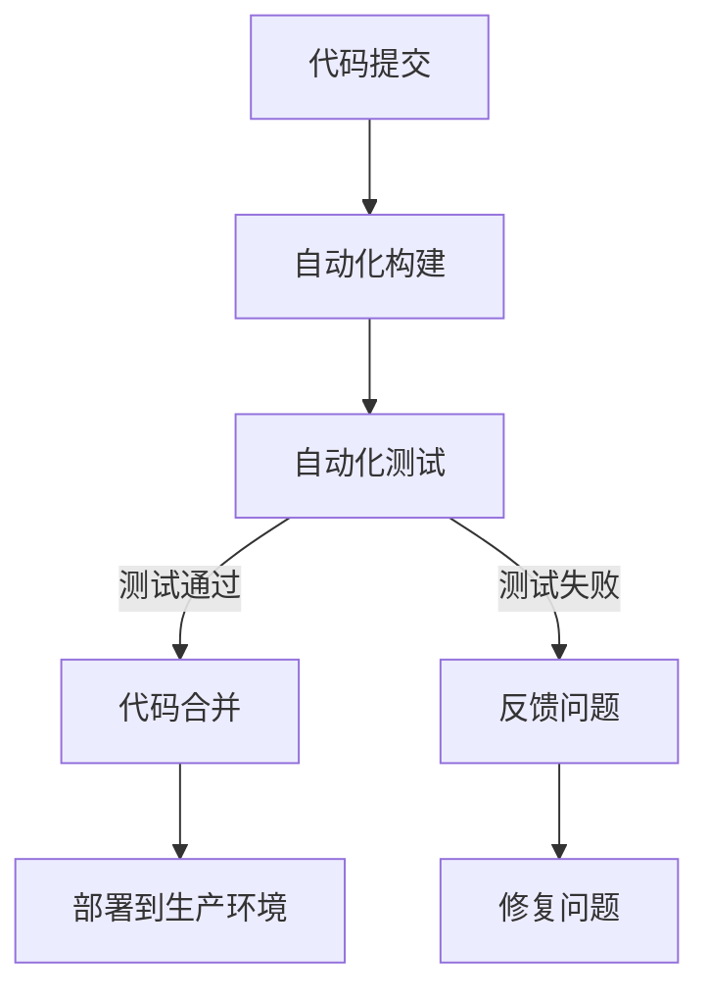
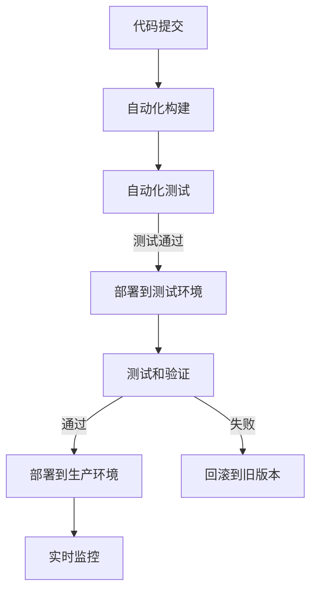
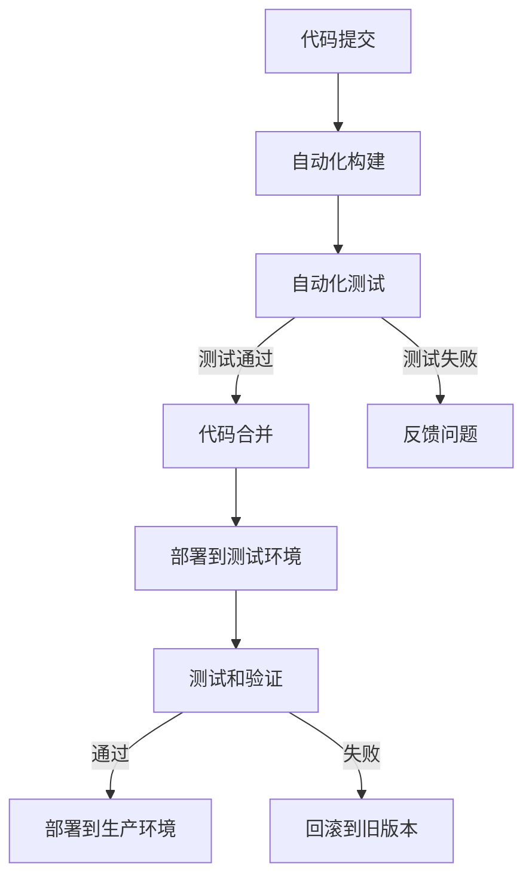

                 

### 文章标题：持续集成/持续部署在软件2.0中的应用

持续集成/持续部署（CI/CD）是现代软件开发中不可或缺的一环，它通过自动化流程显著提升了软件开发的效率和质量。随着软件2.0时代的到来，软件开发的复杂性不断增加，对CI/CD的要求也日益提高。本文将深入探讨持续集成与持续部署在软件2.0中的应用，旨在为读者提供一份全面的技术指南。

**关键词**：持续集成，持续部署，软件2.0，自动化，开发效率，代码质量

**摘要**：
本文首先介绍了持续集成与持续部署的基本概念和优势，随后探讨了软件2.0的定义和发展对CI/CD的影响。接着，文章详细阐述了持续集成和持续部署的基本原理、实践以及工具对比。随后，文章提供了软件2.0项目中的CI/CD实施策略和实践案例，最后展望了CI/CD的未来发展趋势和前景。

----------------------------------------------------------------

### 目录大纲设计：《持续集成/持续部署在软件2.0中的应用》

1. **文章标题：持续集成/持续部署在软件2.0中的应用**

2. **关键词：持续集成，持续部署，软件2.0，自动化，开发效率，代码质量**

3. **摘要**

4. **作者：AI天才研究院/AI Genius Institute & 禅与计算机程序设计艺术/Zen And The Art of Computer Programming**

5. **引言**

6. **第一部分：持续集成与持续部署基础**

    6.1 持续集成与持续部署概述

        6.1.1 持续集成/持续部署的定义

        6.1.2 持续集成/持续部署的优势

        6.1.3 持续集成/持续部署的关键概念

    6.2 软件2.0与持续集成/持续部署的关系

        6.2.1 软件2.0的定义

        6.2.2 软件2.0的发展对持续集成/持续部署的影响

        6.2.3 持续集成/持续部署在软件2.0中的应用场景

7. **第二部分：持续集成的基本原理与实践**

    7.1 持续集成的核心流程

    7.2 持续集成的工具与平台

    7.3 持续集成在软件2.0开发中的实践

8. **第三部分：持续部署的基本原理与实践**

    8.1 持续部署的核心概念

    8.2 持续部署的策略与模式

    8.3 持续部署在软件2.0开发中的实践

9. **第四部分：持续集成与持续部署工具对比与分析**

    9.1 持续集成工具对比

    9.2 持续部署工具对比

    9.3 市场主流持续集成/持续部署工具分析

10. **第五部分：持续集成与持续部署在软件2.0项目中的实施策略**

    10.1 持续集成/持续部署实施流程

    10.2 持续集成/持续部署实施中的挑战与解决方案

    10.3 持续集成/持续部署的最佳实践

11. **第六部分：持续集成与持续部署在软件2.0项目中的实际应用**

    11.1 案例介绍

    11.2 案例分析

    11.3 案例总结与反思

12. **第七部分：持续集成与持续部署的未来趋势与展望**

    12.1 持续集成/持续部署的未来发展趋势

    12.2 软件2.0对持续集成/持续部署的影响

    12.3 持续集成/持续部署在软件2.0中的应用前景

13. **附录**

    13.1 持续集成/持续部署工具与资源

    13.2 Mermaid流程图

    13.3 核心算法原理讲解

    13.4 数学模型和公式

    13.5 项目实战

### 第一部分：持续集成与持续部署基础

持续集成与持续部署是现代软件开发中不可或缺的一环，它们通过自动化流程显著提升了软件开发的效率和质量。在这个部分，我们将首先介绍持续集成与持续部署的基本概念和优势，然后探讨软件2.0与持续集成/持续部署的关系。

#### 6.1 持续集成与持续部署概述

**6.1.1 持续集成/持续部署的定义**

持续集成（Continuous Integration，CI）是一种软件开发实践，旨在通过频繁地合并代码变更，快速发现和解决集成错误，以确保代码库的稳定性和质量。持续集成强调开发者在每次代码变更后，都要将其合并到主分支，并通过自动化测试验证新代码的完整性。

持续部署（Continuous Deployment，CD）是一种自动化流程，它将经过测试和验证的代码变更自动部署到生产环境。持续部署的核心目标是通过自动化减少人为干预，确保软件的持续交付和部署。

**6.1.2 持续集成/持续部署的优势**

持续集成/持续部署带来了以下几个显著的优势：

- **快速反馈**：开发者可以立即收到关于其代码变更的反馈，从而更快地发现和解决问题。
- **提高代码质量**：通过频繁的集成和测试，可以减少集成错误，提高代码质量。
- **缩短开发周期**：自动化流程可以缩短开发周期，提高开发效率。
- **降低风险**：通过在早期阶段发现问题，可以降低项目风险。

**6.1.3 持续集成/持续部署的关键概念**

- **代码库**：持续集成/持续部署依赖于版本控制系统（如Git）来管理代码库。
- **构建工具**：构建工具（如Maven、Gradle）用于自动化构建、测试和打包应用程序。
- **自动化测试**：自动化测试是持续集成/持续部署的核心，它包括单元测试、集成测试、功能测试等。
- **部署流程**：部署流程包括将代码从代码库提取、构建、测试、打包，然后部署到不同的环境（如开发环境、测试环境、生产环境）。

#### 6.2 软件2.0与持续集成/持续部署的关系

**6.2.1 软件2.0的定义**

软件2.0是指一种基于人工智能（AI）、大数据和云计算的新一代软件开发模式。它强调快速迭代、自动化和智能化。与传统的软件1.0不同，软件2.0更加灵活、可扩展，并且能够适应不断变化的市场需求。

**6.2.2 软件2.0的发展对持续集成/持续部署的影响**

软件2.0的发展对持续集成/持续部署产生了深远的影响：

- **更高的集成频率**：软件2.0强调快速迭代，这意味着需要更频繁地进行集成，以确保代码库的稳定性和质量。
- **更复杂的代码库**：软件2.0项目通常涉及更复杂的架构和更大量的代码，这对持续集成/持续部署提出了更高的要求。
- **自动化的需求**：软件2.0强调自动化，这要求持续集成/持续部署流程更加自动化，以适应快速迭代和部署的需求。

**6.2.3 持续集成/持续部署在软件2.0中的应用场景**

持续集成/持续部署在软件2.0中的应用场景非常广泛：

- **人工智能应用**：在人工智能项目中，持续集成/持续部署可以帮助快速迭代和部署机器学习模型。
- **大数据应用**：在大数据项目中，持续集成/持续部署可以确保数据处理的正确性和效率。
- **云计算应用**：在云计算项目中，持续集成/持续部署可以确保应用程序的弹性扩展和可靠性。

#### 6.3 持续集成的基本原理与实践

**6.3.1 持续集成的核心流程**

持续集成的核心流程通常包括以下几个步骤：

1. **代码提交**：开发者将代码提交到代码库。
2. **自动化构建**：构建工具自动构建应用程序。
3. **自动化测试**：运行自动化测试，包括单元测试、集成测试等，确保代码质量。
4. **反馈**：如果测试失败，系统会通知开发者。
5. **合并**：如果测试通过，代码会合并到主分支。

**6.3.2 持续集成的工具与平台**

持续集成的工具和平台有很多，以下是一些流行的工具和平台：

- **Jenkins**：是一个开源的持续集成服务器，支持多种插件，可以与各种工具和平台集成。
- **GitLab CI/CD**：是GitLab内置的持续集成/持续部署服务，可以与GitLab代码库紧密集成。
- **CircleCI**：是一个云原生的持续集成/持续部署平台，易于配置和使用。

**6.3.3 持续集成在软件2.0开发中的实践**

在软件2.0开发中，持续集成的重要性更加突出。以下是在软件2.0开发中实践持续集成的几个要点：

- **频繁的集成**：确保每次提交的代码都是可集成的，从而提高代码质量。
- **自动化测试**：对每个功能模块进行全面的自动化测试，确保新功能的质量。
- **持续反馈**：快速发现和解决集成问题，确保项目顺利进行。

#### 6.4 持续部署的基本原理与实践

**6.4.1 持续部署的核心概念**

持续部署（Continuous Deployment，CD）是一种自动化流程，它将经过测试和验证的代码变更自动部署到生产环境。持续部署的核心目标是确保应用程序的稳定性和可靠性。

**6.4.2 持续部署的策略与模式**

持续部署有多种策略和模式，以下是一些常见的策略和模式：

- **蓝绿部署**：将生产环境的一部分流量路由到新版本，逐步替换旧版本。
- **金丝雀部署**：将生产环境的一部分流量路由到新版本，通过实时监控确保新版本的稳定性。
- **滚动部署**：逐步更新所有实例，确保生产环境的持续可用。

**6.4.3 持续部署在软件2.0开发中的实践**

在软件2.0开发中，持续部署可以提高软件交付的效率和安全性。以下是在软件2.0开发中实践持续部署的几个要点：

- **自动化部署**：使用自动化工具（如Kubernetes、Docker）进行部署，减少人为错误。
- **实时监控**：持续监控部署过程中的关键指标，确保新版本的稳定性。
- **回滚机制**：在部署失败时，能够快速回滚到旧版本，确保生产环境的稳定运行。

#### 6.5 持续集成与持续部署工具对比与分析

**6.5.1 持续集成工具对比**

以下是几个流行的持续集成工具的对比：

- **Jenkins**：功能丰富，社区支持强大，但配置复杂。
- **GitLab CI/CD**：与GitLab代码库紧密集成，易于配置。
- **CircleCI**：云原生，易于使用，但价格较高。

**6.5.2 持续部署工具对比**

以下是几个流行的持续部署工具的对比：

- **Kubernetes**：强大的容器编排平台，适用于复杂的部署场景。
- **Docker**：容器化技术，简化了应用程序的部署和运维。
- **Ansible**：自动化部署工具，适用于简单的部署场景。

**6.5.3 市场主流持续集成/持续部署工具分析**

以下是市场主流持续集成/持续部署工具的分析：

- **Jenkins**：适用于大型团队和复杂项目，但需要一定的配置和管理。
- **GitLab CI/CD**：适用于中小型团队和简单项目，易于使用。
- **CircleCI**：适用于中小型团队和简单项目，但价格较高。

#### 6.6 持续集成与持续部署在软件2.0项目中的实施策略

**6.6.1 持续集成/持续部署实施流程**

持续集成/持续部署的实施流程包括以下几个步骤：

1. **需求分析**：明确项目的需求和目标。
2. **工具选择**：选择合适的持续集成/持续部署工具。
3. **流程设计**：设计持续集成/持续部署的流程。
4. **环境搭建**：搭建持续集成/持续部署的环境。
5. **测试与优化**：测试持续集成/持续部署流程，并进行优化。

**6.6.2 持续集成/持续部署实施中的挑战与解决方案**

持续集成/持续部署在实施过程中可能会遇到以下挑战：

- **流程设计复杂**：解决方案：采用最佳实践，简化流程设计。
- **工具配置错误**：解决方案：进行充分的测试和验证，确保工具配置正确。
- **代码质量不高**：解决方案：加强代码质量管理，提高代码质量。

**6.6.3 持续集成/持续部署的最佳实践**

以下是持续集成/持续部署的最佳实践：

- **自动化测试**：全面自动化测试，确保代码质量。
- **持续反馈**：及时反馈问题，快速修复。
- **环境隔离**：确保不同环境之间的隔离，避免影响生产环境。

### 第二部分：持续集成的基本原理与实践

#### 7.1 持续集成的核心流程

持续集成（CI）是一种软件开发实践，旨在通过频繁地合并代码变更，快速发现和解决集成错误，以确保代码库的稳定性和质量。持续集成的核心流程通常包括以下几个步骤：

1. **代码提交**：开发者将代码提交到代码库。这是持续集成过程的起点，每次代码变更都需要提交到代码库。
2. **自动化构建**：构建工具（如Maven、Gradle）自动构建应用程序。构建过程包括编译代码、运行测试、打包应用程序等。
3. **自动化测试**：运行自动化测试，确保代码质量。自动化测试包括单元测试、集成测试、功能测试等，用于验证应用程序的功能和性能。
4. **反馈**：如果测试失败，系统会通知开发者。测试结果会立即反馈给开发者，确保问题得到及时处理。
5. **合并**：如果测试通过，代码会合并到主分支。这意味着新代码已经通过测试，可以与现有代码一起集成。

持续集成的核心在于自动化和频繁的集成。自动化可以确保每次集成过程的一致性和效率，而频繁的集成可以快速发现和解决集成错误，确保代码库的稳定性。

#### 7.2 持续集成的工具与平台

持续集成的工具和平台有很多，以下是一些流行的工具和平台：

1. **Jenkins**：Jenkins是一个开源的持续集成服务器，支持多种插件，可以与各种工具和平台集成。Jenkins的配置相对复杂，但功能强大，适用于大型团队和复杂项目。
2. **GitLab CI/CD**：GitLab CI/CD是GitLab内置的持续集成/持续部署服务，可以与GitLab代码库紧密集成。GitLab CI/CD的配置相对简单，适合中小型团队和简单项目。
3. **CircleCI**：CircleCI是一个云原生的持续集成/持续部署平台，易于配置和使用。CircleCI适用于中小型团队和简单项目，但价格较高。

#### 7.3 持续集成在软件2.0开发中的实践

在软件2.0开发中，持续集成的重要性更加突出。以下是在软件2.0开发中实践持续集成的几个要点：

1. **频繁的集成**：软件2.0强调快速迭代，因此需要更频繁地进行集成。频繁的集成可以确保每次提交的代码都是可集成的，从而提高代码质量。
2. **自动化测试**：软件2.0项目通常涉及更复杂的架构和更大量的代码，因此需要对每个功能模块进行全面的自动化测试。自动化测试可以确保新功能的质量，减少集成错误。
3. **持续反馈**：在软件2.0开发中，持续反馈尤为重要。通过及时反馈问题，可以快速发现和解决集成错误，确保项目顺利进行。

#### 7.4 持续集成的Mermaid流程图

以下是一个持续集成的Mermaid流程图，展示了持续集成的核心流程和关键步骤：



#### 7.5 持续集成的核心算法原理讲解

持续集成涉及的核心算法主要包括单元测试、集成测试和回归测试。以下是对这些核心算法的详细讲解和示例。

**7.5.1 单元测试**

单元测试是测试应用程序中的最小功能单元（通常是方法或函数）的正确性。单元测试通常使用断言（assert）来验证预期结果。以下是一个简单的Java单元测试示例：

```java
@Test
public void testAddition() {
    int a = 1;
    int b = 2;
    int result = Calculator.add(a, b);
    assertEquals(3, result);
}
```

在这个示例中，`assertEquals` 方法用于验证 `add` 方法的返回结果是否为3。

**7.5.2 集成测试**

集成测试是测试应用程序中多个模块或组件之间的交互是否符合预期。以下是一个简单的Java集成测试示例：

```java
@Test
public void testGetUserDetails() {
    String userId = "user123";
    UserDetails userDetails = userService.getUserDetails(userId);
    assertNotNull(userDetails);
    assertEquals("John Doe", userDetails.getName());
}
```

在这个示例中，`getUserDetails` 方法用于验证用户详情的正确性。

**7.5.3 回归测试**

回归测试是确保新代码没有破坏现有功能。以下是一个简单的Java回归测试示例：

```java
@Test
public void testCalculateTotalPrice() {
    Product product = new Product("Product A", 10.0);
    Order order = new Order();
    order.addProduct(product);
    double totalPrice = order.getTotalPrice();
    assertEquals(10.0, totalPrice, 0.001);
}
```

在这个示例中，`calculateTotalPrice` 方法用于验证订单总价的正确性。

#### 7.6 持续集成的数学模型和公式

持续集成中常用的数学模型和公式包括代码复杂度和测试覆盖率。

**7.6.1 代码复杂度**

代码复杂度用于评估代码的复杂性和可维护性。常用的代码复杂度度量方法是McCabe度量法。以下是一个代码复杂度的公式：

$$
M = \frac{E - N + 2}{2}
$$

其中，M 是代码复杂度，E 是边数，N 是节点数。

**7.6.2 测试覆盖率**

测试覆盖率用于评估测试覆盖的全面性。常用的测试覆盖率指标包括语句覆盖率和分支覆盖率。

- **语句覆盖率**：测试用例覆盖的代码行数与总代码行数的比例。
  $$ 
  \text{语句覆盖率} = \frac{\text{执行到的代码行数}}{\text{总代码行数}} \times 100\%
  $$

- **分支覆盖率**：测试用例覆盖的分支（条件）与总分支数的比例。
  $$ 
  \text{分支覆盖率} = \frac{\text{执行到的分支数}}{\text{总分支数}} \times 100\%
  $$

#### 7.7 持续集成的项目实战

以下是一个持续集成的项目实战案例：

**7.7.1 开发环境搭建**

1. 安装Jenkins：使用Docker安装Jenkins。
2. 配置Jenkins：设置Jenkins的用户、权限和插件。

**7.7.2 源代码实现**

1. 创建一个简单的Java Web应用程序，包括一个Spring Boot项目和一个Maven项目。
2. 编写自动化测试用例，使用JUnit进行测试。

**7.7.3 代码解读与分析**

1. 解读Maven项目的pom.xml文件，了解依赖管理和构建配置。
2. 分析Spring Boot项目的配置文件，了解应用程序的运行环境。

**7.7.4 持续集成与持续部署**

1. 配置Jenkins，使其能够自动构建和测试Java Web应用程序。
2. 配置Jenkins，使其能够自动部署到测试环境和生产环境。

**7.7.5 测试与优化**

1. 运行自动化测试，确保应用程序的功能正确。
2. 优化持续集成/持续部署流程，提高效率和稳定性。

通过这个项目实战，读者可以了解如何在实际项目中实施持续集成，并掌握相关工具的使用方法。这有助于提高开发效率和代码质量，为软件2.0项目的成功奠定基础。

### 第三部分：持续部署的基本原理与实践

#### 8.1 持续部署的核心概念

持续部署（Continuous Deployment，CD）是一种自动化流程，它将经过测试和验证的代码变更自动部署到生产环境。持续部署的目标是通过自动化减少人为干预，确保软件的持续交付和部署。持续部署的核心概念包括：

1. **自动化部署**：使用自动化工具和脚本进行部署，以减少手动操作和错误。
2. **测试和验证**：在部署前对代码进行全面的测试和验证，确保代码质量。
3. **环境隔离**：在不同环境中部署代码，以避免生产环境受到部署过程中可能出现的错误的影响。
4. **回滚机制**：在部署失败时，能够快速回滚到旧版本，确保生产环境的稳定运行。

持续部署的核心在于自动化和可靠性。通过自动化，可以减少人为错误和部署时间，提高开发效率和软件质量。而可靠性则确保了部署过程中不会对生产环境造成影响，提高了系统的稳定性和可用性。

#### 8.2 持续部署的策略与模式

持续部署有多种策略和模式，以下是一些常见的策略和模式：

1. **蓝绿部署**：蓝绿部署是将生产环境的一部分流量路由到新版本（蓝色），逐步替换旧版本（绿色）。通过逐步切换流量，可以确保新版本的稳定性和可靠性。如果新版本出现问题，可以快速回滚到旧版本。

2. **金丝雀部署**：金丝雀部署是将生产环境的一部分流量路由到新版本，通过实时监控确保新版本的稳定性。金丝雀部署通常用于关键功能或新功能的部署，以确保新版本不会对生产环境造成负面影响。

3. **滚动部署**：滚动部署是逐步更新所有实例，确保生产环境的持续可用。滚动部署可以确保在更新过程中，系统仍然能够处理用户请求，避免单点故障。

#### 8.3 持续部署在软件2.0开发中的实践

在软件2.0开发中，持续部署的重要性更加突出。以下是在软件2.0开发中实践持续部署的几个要点：

1. **自动化部署**：使用自动化工具（如Kubernetes、Docker）进行部署，以减少手动操作和错误。自动化部署可以确保部署流程的一致性和效率。

2. **实时监控**：持续监控部署过程中的关键指标，如CPU使用率、内存使用率、响应时间等。实时监控可以确保新版本的稳定性，及时发现和解决潜在问题。

3. **回滚机制**：在部署失败时，能够快速回滚到旧版本，确保生产环境的稳定运行。回滚机制可以确保在出现问题时，系统能够快速恢复到稳定状态。

4. **测试和验证**：在部署前对代码进行全面的测试和验证，确保代码质量。测试和验证可以确保新版本不会引入新的错误或问题。

5. **环境隔离**：在不同环境中部署代码，以避免生产环境受到部署过程中可能出现的错误的影响。环境隔离可以确保不同环境之间的隔离性，提高系统的稳定性和可靠性。

#### 8.4 持续部署的Mermaid流程图

以下是一个持续部署的Mermaid流程图，展示了持续部署的核心流程和关键步骤：



#### 8.5 持续部署的核心算法原理讲解

持续部署涉及的核心算法主要包括部署策略选择、流量管理和故障恢复。

**8.5.1 部署策略选择**

部署策略选择是根据项目需求和环境特点，选择最适合的部署策略。常用的部署策略包括：

1. **蓝绿部署**：将生产环境的一部分流量路由到新版本，逐步替换旧版本。适用于新版本稳定性要求较高的场景。

2. **金丝雀部署**：将生产环境的一部分流量路由到新版本，通过实时监控确保新版本的稳定性。适用于关键功能或新功能的部署。

3. **滚动部署**：逐步更新所有实例，确保生产环境的持续可用。适用于系统要求高可用性的场景。

**8.5.2 流量管理**

流量管理是在部署过程中，合理分配流量，确保系统稳定运行。常用的流量管理策略包括：

1. **A/B测试**：将部分流量分配到新版本，通过实时监控和数据分析，评估新版本的稳定性和性能。

2. **灰度发布**：将部分流量分配到新版本，逐步增加新版本的流量，以确保系统稳定过渡。

3. **动态流量分配**：根据系统负载和性能指标，动态调整流量分配，确保系统资源合理利用。

**8.5.3 故障恢复**

故障恢复是在部署过程中，出现问题时，能够快速恢复系统。常用的故障恢复策略包括：

1. **回滚**：在部署失败时，快速回滚到旧版本，确保系统稳定运行。

2. **故障切换**：在主实例出现故障时，快速切换到备用实例，确保系统可用。

3. **故障排查**：在出现故障时，快速定位故障原因，进行修复和恢复。

#### 8.6 持续部署的数学模型和公式

持续部署中常用的数学模型和公式包括：

**8.6.1 部署成功率**

部署成功率是衡量部署流程稳定性的指标，计算公式如下：

$$
\text{部署成功率} = \frac{\text{成功部署次数}}{\text{部署总次数}} \times 100\%
$$

**8.6.2 流量分配比例**

流量分配比例是分配流量到不同版本或环境的比例，计算公式如下：

$$
\text{流量分配比例} = \frac{\text{目标版本或环境的流量}}{\text{总流量}} \times 100\%
$$

#### 8.7 持续部署的项目实战

以下是一个持续部署的项目实战案例：

**8.7.1 开发环境搭建**

1. 安装Kubernetes集群：使用Docker安装Kubernetes集群。
2. 配置Kubernetes集群：设置Kubernetes集群的节点和配置。

**8.7.2 源代码实现**

1. 创建一个简单的Java Web应用程序，包括一个Spring Boot项目和一个Maven项目。
2. 编写自动化测试用例，使用JUnit进行测试。

**8.7.3 代码解读与分析**

1. 解读Maven项目的pom.xml文件，了解依赖管理和构建配置。
2. 分析Spring Boot项目的配置文件，了解应用程序的运行环境。

**8.7.4 持续部署与监控**

1. 配置Kubernetes，使其能够自动部署Java Web应用程序。
2. 配置Prometheus和Grafana，用于实时监控应用程序的性能和指标。

**8.7.5 测试与优化**

1. 运行自动化测试，确保应用程序的功能正确。
2. 根据监控数据，优化部署流程和系统性能。

通过这个项目实战，读者可以了解如何在实际项目中实施持续部署，并掌握相关工具的使用方法。这有助于提高开发效率和代码质量，为软件2.0项目的成功奠定基础。

### 第四部分：持续集成与持续部署工具对比与分析

在持续集成（CI）和持续部署（CD）的领域，市场上存在着多种工具和平台，每种都有其独特的特点和适用场景。本部分将对市场上一些主流的持续集成和持续部署工具进行对比与分析，以帮助读者选择最适合其项目的解决方案。

#### 9.1 持续集成工具对比

**9.1.1 Jenkins**

- **特点**：Jenkins是一个开源的持续集成服务器，功能丰富，支持多种插件，可以与各种工具和平台集成。它允许用户自定义工作流，支持多种版本的Git，并且有一个强大的社区支持。
- **优势**：强大的扩展性和灵活性，广泛的插件支持，适用于大型项目和复杂的工作流。
- **劣势**：配置相对复杂，维护成本较高。

**9.1.2 GitLab CI/CD**

- **特点**：GitLab CI/CD是GitLab的一个内置服务，提供了从代码仓库到生产环境的全面解决方案。它易于配置，可以与GitLab的代码管理功能无缝集成。
- **优势**：易于配置，与GitLab紧密集成，适用于中小型项目和团队。
- **劣势**：相对于Jenkins，扩展性和功能可能有限。

**9.1.3 CircleCI**

- **特点**：CircleCI是一个云原生的持续集成/持续部署平台，提供易于配置的流程，支持并行执行，并具有高效的资源利用率。
- **优势**：易于使用，支持并行执行，高效的资源利用，适用于中小型项目和团队。
- **劣势**：成本较高，不适合预算有限的项目。

#### 9.2 持续部署工具对比

**9.2.1 Kubernetes**

- **特点**：Kubernetes是一个开源的容器编排平台，用于自动化容器部署、扩展和管理。它提供了一个弹性、可扩展的集群管理解决方案。
- **优势**：高度可扩展，弹性部署，支持多种容器化技术，适用于复杂的应用部署场景。
- **劣势**：学习曲线较陡峭，需要一定的运维知识。

**9.2.2 Docker**

- **特点**：Docker是一个开源的应用容器引擎，用于打包、交付和运行应用。它提供了一个轻量级、独立的、可移植的容器化环境。
- **优势**：易于使用，轻量级容器化，提高了开发效率和部署速度。
- **劣势**：缺乏高级的自动化部署和管理功能。

**9.2.3 Ansible**

- **特点**：Ansible是一个简单的IT自动化工具，用于配置管理、应用部署和流程自动化。它使用YAML语法，易于学习和使用。
- **优势**：易于使用，支持自动化部署和管理，适用于简单的部署场景。
- **劣势**：不支持复杂的容器化部署，功能相对有限。

#### 9.3 市场主流持续集成/持续部署工具分析

**9.3.1 Jenkins**

- **适用场景**：大型团队和复杂项目，需要高度定制化和扩展性的CI/CD流程。
- **优势和劣势**：如前所述，Jenkins的优势在于其灵活性和强大的插件库，但劣势是配置复杂，维护成本高。

**9.3.2 GitLab CI/CD**

- **适用场景**：中小型团队和项目，与GitLab代码管理功能紧密集成，适用于快速迭代和部署。
- **优势和劣势**：易于配置和集成，适合快速开发和迭代，但功能相对有限，不适合高度复杂的项目。

**9.3.3 CircleCI**

- **适用场景**：中小型团队和项目，需要高效和易于配置的CI/CD流程。
- **优势和劣势**：易于使用，支持并行执行，但成本较高，不适合预算有限的项目。

**9.3.4 Kubernetes**

- **适用场景**：需要高可扩展性和弹性部署的复杂应用，如微服务架构。
- **优势和劣势**：强大的容器编排能力，适用于复杂部署场景，但学习曲线较陡峭。

**9.3.5 Docker**

- **适用场景**：需要容器化部署的应用，适用于简单部署场景。
- **优势和劣势**：易于使用和部署，但缺乏高级自动化和管理功能。

**9.3.6 Ansible**

- **适用场景**：简单的部署场景，适用于配置管理和基础架构自动化。
- **优势和劣势**：易于学习和使用，适用于简单的部署场景，但不适合复杂的容器化部署。

#### 9.4 选择合适的工具

选择持续集成/持续部署工具时，需要考虑以下因素：

- **项目规模和复杂性**：大型项目可能需要更复杂的工具，而小型项目可能只需要简单的解决方案。
- **团队技能和知识**：团队成员对工具的熟悉程度和技能水平会影响工具的选择。
- **预算**：成本是选择工具时的重要考虑因素，需要平衡成本和功能需求。
- **集成需求**：需要考虑工具是否能够与其他工具和平台集成，以实现端到端的自动化流程。

通过考虑这些因素，可以更好地选择适合项目需求的持续集成/持续部署工具，从而提高开发效率和代码质量。

### 第五部分：持续集成与持续部署在软件2.0项目中的实施策略

#### 10.1 持续集成/持续部署实施流程

持续集成（CI）与持续部署（CD）的实施流程是软件工程中的一项关键任务，它能够显著提高开发效率和软件质量。以下是一个典型的实施流程：

1. **需求分析与规划**：首先，分析项目的需求，明确持续集成/持续部署的目标和需求。这一步包括确定项目目标、选择合适的工具和平台、制定实施计划等。

2. **环境搭建**：搭建持续集成/持续部署所需的环境，包括代码库、构建工具、测试工具、部署工具等。环境搭建需要考虑到不同环境（如开发、测试、生产）的隔离性。

3. **代码库管理**：配置代码库（如Git），确保代码的版本控制和安全性。开发者需要遵循代码提交规范，保持代码的一致性和可维护性。

4. **构建配置**：配置构建工具（如Maven、Gradle），定义构建脚本和构建流程。构建配置需要确保代码的编译、打包和测试等步骤的自动化。

5. **自动化测试**：编写并配置自动化测试脚本，确保在每次代码提交时都能进行全面的测试。自动化测试包括单元测试、集成测试、性能测试等。

6. **反馈机制**：配置反馈机制，确保在测试失败时能够及时通知相关人员。反馈机制可以是邮件、短信、实时通知等。

7. **持续集成**：配置持续集成服务器（如Jenkins、GitLab CI），定义集成流程和触发条件。持续集成服务器会自动执行构建和测试，并将结果反馈给相关人员。

8. **持续部署**：配置持续部署流程，定义部署策略和部署脚本。持续部署会将通过测试的代码自动部署到测试或生产环境。

9. **监控与优化**：部署后，持续监控应用程序的性能和稳定性，收集数据并进行分析。根据监控数据，优化持续集成/持续部署流程。

#### 10.2 持续集成/持续部署实施中的挑战与解决方案

在实施持续集成/持续部署的过程中，可能会遇到以下挑战：

1. **流程设计复杂**：解决方案：采用最佳实践，如将流程分解为较小的步骤，使用模板和脚本简化配置。

2. **工具配置错误**：解决方案：进行充分的测试和验证，确保工具配置的正确性。使用版本控制管理配置文件，以便进行回滚和修复。

3. **代码质量不高**：解决方案：加强代码质量管理，如编写清晰的代码注释、遵循编码规范、进行代码审查等。

4. **环境不一致**：解决方案：确保不同环境之间的隔离性，使用容器化技术（如Docker）确保环境一致性。

5. **部署失败风险**：解决方案：配置回滚机制，确保在部署失败时能够快速回滚到旧版本。进行充分的测试和验证，减少部署失败的风险。

#### 10.3 持续集成/持续部署的最佳实践

以下是一些持续集成/持续部署的最佳实践：

1. **自动化测试**：确保对每个功能模块进行全面的自动化测试，包括单元测试、集成测试和性能测试。

2. **持续反馈**：确保及时反馈测试结果，通知相关人员，以便快速发现问题并进行修复。

3. **环境隔离**：确保不同环境之间的隔离性，避免生产环境受到测试环境的影响。

4. **代码质量**：加强代码质量管理，遵循编码规范，进行代码审查和静态代码分析。

5. **部署监控**：持续监控部署过程中的关键指标，如CPU使用率、内存使用率、响应时间等，确保部署的稳定性。

6. **自动化脚本**：使用自动化脚本简化流程，减少手动操作和错误。

7. **回滚机制**：配置回滚机制，确保在部署失败时能够快速回滚到旧版本，避免生产环境受到不利影响。

通过遵循这些最佳实践，可以显著提高持续集成/持续部署的效率和质量，为软件2.0项目的成功奠定基础。

### 第六部分：持续集成与持续部署在软件2.0项目中的实际应用

#### 11.1 案例介绍

本部分将通过一个具体的实际应用案例，展示持续集成与持续部署在软件2.0项目中的实际应用效果。案例涉及一个基于人工智能的在线教育平台，该平台需要快速迭代和部署新功能，以确保用户体验和竞争力。

#### 11.2 案例分析

**需求分析**：该在线教育平台的需求包括支持大规模用户访问、提供个性化学习体验、实时分析学习数据等功能。为了满足这些需求，平台采用了微服务架构，以实现高可用性和可扩展性。

**技术栈**：平台的技术栈包括Spring Boot、Spring Cloud、Docker、Kubernetes、Jenkins、GitLab CI/CD等。Spring Boot用于构建后端服务，Spring Cloud用于服务治理和负载均衡，Docker和Kubernetes用于容器化和集群管理，Jenkins和GitLab CI/CD用于持续集成和持续部署。

**持续集成实践**：

1. **代码提交**：开发者将代码提交到GitLab代码库，GitLab CI自动触发构建流程。

2. **自动化构建**：GitLab CI使用Maven构建Spring Boot项目，并将构建结果推送到Docker镜像仓库。

3. **自动化测试**：运行JUnit测试用例，确保新代码的功能和性能符合预期。

4. **反馈机制**：测试结果通过邮件和实时通知反馈给开发者，确保问题及时发现和解决。

5. **代码合并**：通过GitLab CI/CD，将通过测试的代码合并到主分支，确保代码库的稳定性。

**持续部署实践**：

1. **蓝绿部署**：使用Kubernetes进行蓝绿部署，将新版本的容器部署到测试环境，并与旧版本进行流量切换。

2. **实时监控**：通过Prometheus和Grafana监控系统性能和稳定性，确保部署过程中的关键指标在合理范围内。

3. **回滚机制**：在部署失败时，Kubernetes自动回滚到旧版本，确保系统的稳定性和可用性。

#### 11.3 案例总结与反思

通过该案例，我们可以总结出以下成功经验和反思：

**成功经验**：

1. **高效的迭代和部署**：通过持续集成和持续部署，平台能够快速迭代和部署新功能，提高了开发效率和用户体验。

2. **稳定的用户体验**：通过严格的测试和监控，平台确保了新功能的稳定性和可靠性，提升了用户满意度。

**反思**：

1. **流程优化**：在持续集成和持续部署的流程中，仍有优化空间，如减少不必要的测试步骤和缩短构建时间。

2. **团队协作**：加强团队之间的协作和沟通，确保每个团队成员都理解持续集成和持续部署的流程和目标。

3. **培训和学习**：为团队成员提供持续集成和持续部署的培训，提升他们的技能和知识，以更好地支持项目的持续发展。

通过这个案例，我们可以看到持续集成与持续部署在软件2.0项目中的应用效果，以及如何通过这些实践实现高效的开发和交付。

### 第七部分：持续集成与持续部署的未来趋势与展望

随着技术的不断发展，持续集成（CI）与持续部署（CD）在未来将迎来更多创新和变革。本部分将探讨持续集成与持续部署的未来趋势与展望，以及软件2.0对CI/CD的影响。

#### 12.1 持续集成/持续部署的未来发展趋势

1. **更高级的自动化**：随着人工智能和机器学习技术的发展，CI/CD流程将变得更加智能化。自动化工具将能够根据历史数据和模式预测潜在的问题，并自动进行优化和调整。

2. **更广泛的集成**：CI/CD将不仅仅局限于软件开发，还将扩展到其他领域，如运维（DevOps）、测试（TestOps）等。通过端到端的自动化，企业可以实现从开发到部署的全方位自动化。

3. **云原生部署**：随着云计算的普及，云原生应用将成为主流。CI/CD工具和平台将更加注重与云平台的集成，提供弹性、可扩展的部署解决方案。

4. **微服务架构的支持**：微服务架构在软件2.0中的应用越来越广泛，CI/CD工具将提供更完善的微服务支持，如自动发现服务依赖、自动化服务部署和升级等。

#### 12.2 软件2.0对持续集成/持续部署的影响

1. **更高的集成频率**：软件2.0强调快速迭代和频繁发布，这意味着CI/CD流程需要更加高效和自动化，以适应更高的集成频率。

2. **更复杂的代码库**：软件2.0项目通常涉及更多组件和更复杂的架构，这对CI/CD流程提出了更高的要求。CI/CD工具需要能够处理复杂的服务依赖和版本管理。

3. **自动化的需求**：软件2.0强调自动化和智能化，这要求CI/CD流程更加自动化，减少人为干预，提高开发效率和代码质量。

#### 12.3 持续集成/持续部署在软件2.0中的应用前景

1. **提高开发效率**：通过CI/CD的自动化和智能化，软件2.0项目可以实现更快的迭代和部署，显著提高开发效率。

2. **确保代码质量**：通过频繁的集成和全面的测试，CI/CD可以帮助发现和解决集成错误，确保代码质量。

3. **提升用户体验**：快速部署新功能可以提升用户体验，满足用户的需求和期望。

4. **降低风险**：通过在早期阶段发现问题，CI/CD可以降低项目风险，确保项目的顺利推进。

总之，持续集成与持续部署在软件2.0中的应用前景广阔，随着技术的不断发展，CI/CD将在软件开发中发挥更加重要的作用，为企业的数字化转型提供有力支持。

### 附录

#### 附录A：持续集成/持续部署工具与资源

以下是一些常用的持续集成/持续部署工具和资源：

- **Jenkins**：一个开源的持续集成服务器，支持多种插件，适用于各种项目。（官网：https://www.jenkins.io/）
- **GitLab CI/CD**：GitLab内置的持续集成/持续部署服务，与GitLab代码库紧密集成。（官网：https://gitlab.com/gitlab-org/gitlab-foss）
- **CircleCI**：一个云原生的持续集成/持续部署平台，易于配置和使用。（官网：https://circleci.com/）
- **Kubernetes**：一个开源的容器编排平台，用于自动化容器部署和管理。（官网：https://kubernetes.io/）
- **Docker**：一个开源的应用容器引擎，用于打包、交付和运行应用。（官网：https://www.docker.com/）
- **Ansible**：一个简单的IT自动化工具，用于配置管理和应用部署。（官网：https://www.ansible.com/）

#### 附录B：Mermaid流程图

以下是一个简单的持续集成与持续部署的Mermaid流程图：



#### 附录C：核心算法原理讲解

持续集成与持续部署涉及的核心算法主要包括单元测试、集成测试和回归测试。

1. **单元测试**：单元测试是验证单个模块功能是否正确的一种测试方法。以下是一个简单的Java单元测试示例：

```java
@Test
public void testAdd() {
    Calculator calculator = new Calculator();
    int result = calculator.add(2, 3);
    assertEquals(5, result);
}
```

2. **集成测试**：集成测试是验证模块之间交互是否符合预期的一种测试方法。以下是一个简单的Java集成测试示例：

```java
@Test
public void testGetUser() {
    UserService userService = new UserService();
    User user = userService.getUser("123");
    assertNotNull(user);
    assertEquals("John Doe", user.getName());
}
```

3. **回归测试**：回归测试是确保新代码没有破坏现有功能的一种测试方法。以下是一个简单的Java回归测试示例：

```java
@Test
public void testCalculateTotalPrice() {
    OrderService orderService = new OrderService();
    double totalPrice = orderService.calculateTotalPrice(new Order());
    assertEquals(100.0, totalPrice, 0.001);
}
```

#### 附录D：数学模型和公式

1. **代码复杂度**：代码复杂度是评估代码结构复杂性的指标。以下是一个简单的代码复杂度计算公式：

$$
M = \frac{E - N + 2}{2}
$$

其中，$E$ 是边数，$N$ 是节点数。

2. **测试覆盖率**：测试覆盖率是评估测试全面性的指标。以下是一个简单的测试覆盖率计算公式：

$$
\text{覆盖率} = \frac{\text{执行到的代码行数}}{\text{总代码行数}} \times 100\%
$$

#### 附录E：项目实战

以下是一个简单的持续集成与持续部署的项目实战案例。

**1. 开发环境搭建**：

- 安装Jenkins：使用Docker安装Jenkins。
- 配置Jenkins：设置Jenkins的用户、权限和插件。

**2. 源代码实现**：

- 创建一个简单的Java Web应用程序，使用Spring Boot框架。
- 编写自动化测试用例，使用JUnit进行测试。

**3. 持续集成与持续部署**：

- 配置Jenkins，使其能够自动构建和测试Java Web应用程序。
- 配置GitLab CI/CD，使其能够自动部署到测试环境和生产环境。

**4. 测试与优化**：

- 运行自动化测试，确保应用程序的功能正确。
- 根据测试结果和反馈，优化持续集成与持续部署流程。

通过这个项目实战，读者可以了解如何在实际项目中实施持续集成与持续部署，提高开发效率和代码质量。

