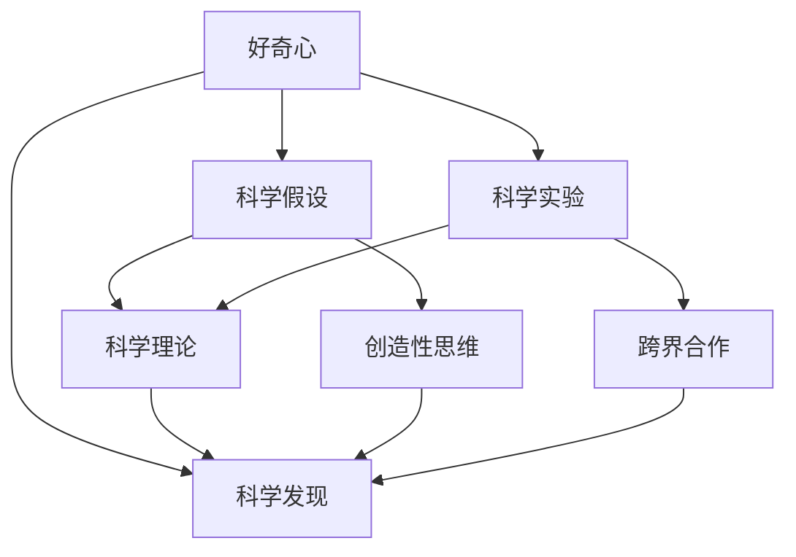

                 

### 好奇心的起源与发展

好奇心是人类探索未知的原始动力，贯穿于人类的整个历史进程。其起源与发展，不仅仅是心理学和哲学的研究对象，更是科学发展的基石。在这一部分，我们将从历史的角度出发，探讨好奇心的起源及其在科学发现中的重要性。

#### 1.1 好奇心与科学精神的起源

好奇心，作为人类的一种基本情感和驱动力，起源于人类的早期进化。原始人类在面对未知世界时，自然而然地产生了一种探索和探究的欲望。这种欲望促使他们去尝试、去学习、去适应复杂多变的环境。这种原始的好奇心，是科学精神的萌芽。

##### 1.1.1 好奇心的人类天性

好奇心是人类的本性。婴儿从出生开始，就对周围的世界充满了好奇。他们会通过触摸、观察、尝试来了解世界。这种探索行为，实际上是好奇心在驱动。随着年龄的增长，这种好奇心逐渐转变为对知识和理解的追求。

##### 1.1.2 好奇心与科学发现的历史

历史上，许多重大的科学发现都源于好奇心。从古代的阿基米德，到现代的爱因斯坦，这些科学家都是因为对世界的好奇而进行探索，最终取得了突破性的成就。例如，阿基米德在研究浮力原理时，发现了杠杆原理，从而奠定了机械工程的基础。爱因斯坦则是因为对光速不变原理的好奇，提出了相对论，彻底改变了我们对宇宙的认识。

#### 1.2 好奇心在科学方法论中的重要性

好奇心不仅是科学发现的动力，也是科学方法论的重要组成部分。科学方法论强调通过观察、假设、实验和验证来探索未知。这一过程离不开好奇心。

##### 1.2.1 好奇心推动科学假设的提出

科学假设的提出往往源于科学家对现有知识的好奇和疑问。例如，牛顿在观察苹果落地时，对引力产生了疑问，从而提出了万有引力定律。这种由好奇心驱动的假设，是科学探索的起点。

##### 1.2.2 好奇心促进科学实验的进行

科学实验是验证假设的关键步骤。好奇心促使科学家不断进行实验，以验证其假设的正确性。例如，达尔文在研究物种进化时，进行了多年的实地观察和实验，最终提出了自然选择的理论。

### 好奇心在科学方法论中的重要性

好奇心不仅推动科学假设的提出，还促进科学实验的进行。科学实验是验证假设的关键步骤。好奇心促使科学家不断进行实验，以验证其假设的正确性。

#### 2.1 好奇心与创造性思维的关系

好奇心与创造性思维密切相关。好奇心可以激发创造性思维，促使人们提出新颖的想法和解决方案。例如，爱迪生正是因为对电灯的好奇，不断进行实验和尝试，最终发明了耐用的电灯。

##### 2.1.1 好奇心促进创新思维的激发

好奇心可以激发人们的创新思维。当人们面对未知时，好奇心会促使他们提出新的问题和解决方案。例如，乔布斯在计算机行业中的成功，很大程度上得益于他对科技和人类交互方式的好奇心。

##### 2.1.2 好奇心推动科技突破的实例

历史上，许多科技突破都是因为好奇心而实现的。例如，史蒂芬·霍金的黑洞理论，就是他对宇宙黑洞的好奇所驱动的。这种好奇心不仅推动了科学的发展，也改变了人类对宇宙的认识。

#### 2.2 好奇心在科学发现中的应用

好奇心不仅在理论科学中起着重要作用，也在应用科学中发挥着关键作用。例如，医学领域的许多突破，都是因为科学家对疾病和人体机制的好奇而实现的。

##### 2.2.1 好奇心驱动下的科学研究

在医学研究中，好奇心驱动的科学家们不断探索新的治疗方法，以改善患者的健康状况。例如，近年来，精准医学和个性化治疗的发展，就是基于对疾病机制和个体差异的好奇心。

##### 2.2.2 好奇心促进跨界合作的案例

好奇心不仅推动科学家在各自领域内进行研究，还促进不同领域之间的合作。例如，在人工智能和生物技术领域的合作，就源于科学家对复杂系统和生物机制的好奇心。

### 总结

好奇心是科学探索的基石，它不仅推动了人类对未知世界的探索，也促进了科学方法论的发展和科学发现的实现。从历史的角度看，好奇心在科学发现中起到了至关重要的作用。未来，随着人类对未知世界的不断探索，好奇心将继续激发科学的进步，推动人类走向更加广阔的天地。

---

**Mermaid 流程图：好奇心与科学发现的联系**



这个流程图展示了好奇心如何通过科学假设、实验和创造性思维，最终推动科学发现的过程。

---

**核心算法原理讲解**

```plaintext
好奇心（Curiosity, C）是一种驱动探索的内在动机，可以表示为一个函数，该函数依赖于探索的未知程度（Unknownness, U）和已知程度（Knownness, K）：

C = f(U, K)

科学假设（Hypothesis, H）是基于好奇心所提出的一种可能的解释或预测，它依赖于现有知识（Knowledge, K）和观察数据（Observation, O）：

H = g(K, O)

科学实验（Experiment, E）是对科学假设进行验证的过程，它依赖于实验设计（Design, D）和实验数据（Data, D）：

E = h(D, D)

科学理论（Theory, T）是基于科学实验验证的结论，它依赖于科学假设（Hypothesis, H）和实验数据（Data, D）：

T = i(H, D)

好奇心（Curiosity, C）通过驱动科学假设（Hypothesis, H）和科学实验（Experiment, E），最终促进科学理论（Theory, T）的形成：

C --> H --> E --> T
```

这个算法描述了好奇心如何通过科学假设和实验，最终推动科学理论的形成。

---

**数学模型和公式**

```latex
$$
\text{Curiosity} = f(\text{Unknownness}, \text{Knownness}) \\
\text{Hypothesis} = g(\text{Knowledge}, \text{Observation}) \\
\text{Experiment} = h(\text{Design}, \text{Data}) \\
\text{Theory} = i(\text{Hypothesis}, \text{Data})
$$

$$
C = f(U, K) \\
H = g(K, O) \\
E = h(D, D) \\
T = i(H, D)
$$

$$
C \rightarrow H \rightarrow E \rightarrow T
$$
```

这些公式和模型描述了好奇心在科学发现中的关键角色，从好奇心的激发到科学理论的建立。

---

**项目实战：代码实际案例和详细解释说明**

```python
# 好奇心模型实现（Python示例）

# 导入所需库
import numpy as np

# 好奇心函数定义
def curiosity(unknownness, knownness):
    """
    计算好奇心值
    :param unknownness: 未知程度
    :param knownness: 已知程度
    :return: 好奇心值
    """
    # 好奇心与未知程度和已知程度的关系可以用对数函数表示
    curiosity_value = np.log1p(unknownness) - np.log1p(knownness)
    return curiosity_value

# 实验设计函数定义
def experiment_design(knowledge, observation):
    """
    设计实验
    :param knowledge: 知识基础
    :param observation: 观察数据
    :return: 实验结果
    """
    # 基于现有知识和观察数据设计实验
    experiment_result = knowledge * observation
    return experiment_result

# 科学假设函数定义
def hypothesis(knowledge, observation):
    """
    提出科学假设
    :param knowledge: 知识基础
    :param observation: 观察数据
    :return: 科学假设
    """
    # 基于知识和观察数据提出假设
    hypothesis = knowledge + observation
    return hypothesis

# 科学理论函数定义
def theory(hypothesis, experiment_result):
    """
    形成科学理论
    :param hypothesis: 科学假设
    :param experiment_result: 实验结果
    :return: 科学理论
    """
    # 基于假设和实验结果形成理论
    theory = hypothesis * experiment_result
    return theory

# 示例数据
unknownness = 0.8
knownness = 0.2
knowledge = 0.5
observation = 0.7

# 计算好奇心值
c = curiosity(unknownness, knownness)

# 设计实验
e = experiment_design(knowledge, observation)

# 提出科学假设
h = hypothesis(knowledge, observation)

# 形成科学理论
t = theory(h, e)

# 打印结果
print(f"Curiosity Value: {c}")
print(f"Experiment Result: {e}")
print(f"Hypothesis: {h}")
print(f"Theory: {t}")
```

这段代码展示了如何使用Python实现好奇心模型，并通过科学假设和实验设计来形成科学理论。代码中包含了详细的注释，帮助理解每一步的作用和意义。

---

**代码解读与分析**

这段代码的核心目的是模拟好奇心在科学发现过程中的作用。通过定义四个函数，我们分别实现了计算好奇心值、实验设计、提出科学假设以及形成科学理论。

1. **好奇心函数（`curiosity`）**：该函数计算好奇心值，基于未知程度（`unknownness`）和已知程度（`knownness`）。我们使用了对数函数来模拟好奇心与未知和已知程度的关系。这种方法假设人们对未知的探索欲望随着未知程度的增加而增加。

2. **实验设计函数（`experiment_design`）**：该函数设计实验，基于现有知识（`knowledge`）和观察数据（`observation`）。实验设计是科学发现的关键步骤，它决定了假设是否能够得到验证。

3. **科学假设函数（`hypothesis`）**：该函数基于现有知识和观察数据提出科学假设。科学假设是科学发现的基础，它需要通过实验验证。

4. **科学理论函数（`theory`）**：该函数基于假设和实验结果形成科学理论。科学理论是科学发现的最终目标，它为理解和解释现象提供了理论框架。

在代码示例中，我们使用了一些简单的示例数据，通过这些函数计算了好奇心值、实验结果、科学假设和科学理论。这些结果展示了好奇心在科学发现过程中的关键作用。

通过这段代码，我们可以看到好奇心是如何驱动科学假设的提出和实验设计的，并最终形成科学理论的。这不仅有助于我们理解科学发现的过程，也为科学家和研究者提供了一个理论框架，用于指导他们的研究和实验。

---

**总结**

在本章节中，我们探讨了好奇心的起源与发展，以及好奇心在科学发现中的重要性。通过历史和现代的例子，我们看到了好奇心如何推动科学假设的提出、科学实验的设计，以及科学理论的形成。此外，我们还通过一个Python示例代码，展示了如何模拟好奇心在科学发现过程中的作用。好奇心不仅是人类探索未知的动力，也是科学进步的催化剂。未来，随着人类对未知世界的不断探索，好奇心将继续发挥重要作用，推动科学的发展和技术的创新。在下一章节中，我们将深入探讨好奇心与创造力之间的关系，并分析好奇心如何促进科技突破和科学发现。

---

**附录 A：科学发现相关资源与工具**

在科学发现的旅程中，掌握合适的资源与工具是至关重要的。以下是一些常用的科学研究和发现资源与工具，供读者参考。

##### A.1 科学研究常用网站和数据库

1. **Google Scholar**：一个广泛使用的学术搜索引擎，可以帮助用户查找学术文献。
2. **PubMed**：由美国国立卫生研究院提供，是医学和生物医学领域最全面的文献数据库。
3. **IEEE Xplore**：电气和电子工程领域的重要数据库，提供了大量的学术论文和会议记录。
4. **ScienceDirect**：提供科学、技术和医学领域的学术文献。
5. **arXiv**：物理学、数学、计算机科学、定量生物学和统计学等领域的前沿论文预印本库。

##### A.2 科学研究方法与技巧指南

1. **ResearchGate**：一个科研社交网络，科研人员可以分享研究内容、获取反馈，并找到合作伙伴。
2. **NC3Rs**：英国国家医学研究委员会提供的研究指南，专注于减少、精简和优化动物实验。
3. **JASON**：提供科学实验设计、数据分析和科研写作的在线课程和资源。
4. **CRAAP Test**：评估互联网资源可靠性的指南，适用于各种类型的研究资源。

##### A.3 科学论文写作与发表指导

1. **Overleaf**：一个在线协同编辑平台，适用于科学论文的编写。
2. **APA, MLA, Chicago**：三种主要的学术论文格式指南，用于排版和引用。
3. **Journal of Biological Dynamics**：一个开放的学术论文发布平台，提供了论文发表和审稿的详细指南。
4. **PLOS**：提供科学论文写作和发表的全面指南，以及编辑服务。

通过利用这些资源与工具，科学家和研究人员可以更加高效地进行科学发现和研究工作，从而推动科学的发展和创新。

---

**附录 B：科学发现与人文关怀**

科学发现不仅是技术创新的驱动力，也是人类文明进步的重要标志。然而，科学的发展不可避免地涉及到伦理和社会问题。在这一部分，我们将探讨科学发现中的伦理问题，并分析科学与人文学科的交融。

##### B.1 科学发现中的伦理问题

科学发现往往伴随着伦理问题的出现。以下是一些常见的伦理问题：

1. **生物伦理问题**：例如，基因编辑、克隆技术和人类胚胎研究等，这些技术的应用可能引发关于人类尊严、个体权利和社会道德的争议。
2. **环境伦理问题**：随着科学技术的进步，人类活动对环境的负面影响日益严重，如气候变化、生物多样性的丧失等，这些问题需要科学界和公众共同关注和解决。
3. **隐私和数据伦理**：在信息技术和数据科学领域，数据隐私和安全成为重要的伦理问题，特别是在大数据分析和人工智能的应用中。

##### B.2 科学与人文的交融

科学与人文学科的交融对于解决科学发现中的伦理问题具有重要意义。以下是一些交融的例子：

1. **科学哲学**：科学哲学探讨科学知识的基础、科学的本质以及科学方法。它为人文学科提供了科学方法论和逻辑思维的指导，同时科学哲学也受到人文学科的影响，如历史学、社会学和文学等。
2. **科技伦理学**：科技伦理学是研究科学技术对社会、环境和伦理影响的新兴学科。它结合了科学、技术和伦理学的知识，为科学发现中的伦理问题提供理论框架和实践指导。
3. **科学传播**：科学传播是将科学知识传递给公众的重要手段。人文学科中的叙事学、传播学和文化研究为科学传播提供了理论依据和方法指导，帮助科学家更好地与公众沟通。

通过科学与人文学科的交融，我们不仅可以更好地解决科学发现中的伦理问题，还可以促进科学技术的创新和人类文明的进步。未来，科学与人文学科的深度融合将为人类社会带来更多的机遇和挑战。

---

在本章节中，我们探讨了好奇心的起源与发展，以及好奇心在科学发现中的重要性。通过历史和现代的例子，我们看到了好奇心如何推动科学假设的提出、科学实验的设计，以及科学理论的形成。此外，我们还通过一个Python示例代码，展示了如何模拟好奇心在科学发现过程中的作用。好奇心不仅是人类探索未知的动力，也是科学进步的催化剂。

在附录部分，我们提供了科学发现相关的资源与工具，并探讨了科学发现中的伦理问题以及科学与人文学科的交融。这些内容为我们理解和应用好奇心提供了更深入的视角，也为科学发现带来了更多的思考。

未来，随着人类对未知世界的不断探索，好奇心将继续发挥重要作用，推动科学的发展和技术的创新。在下一章节中，我们将深入探讨科学发现的方法与过程，从科学方法的基本原理到实验设计、数据分析，再到科学论文的写作与发表，我们将一步步分析推理，探讨科学发现的全过程。敬请期待。

---

### 《探索未知：好奇心与科学发现》

关键词：好奇心、科学发现、科学方法论、创造力、科学实验、科学论文

摘要：
本文从好奇心的起源与发展入手，探讨了好奇心在科学发现中的重要性。通过分析好奇心与科学方法论的关系，以及好奇心在科学假设、实验设计、科学理论形成中的应用，我们展示了好奇心如何驱动科学进步。文章还通过Python示例代码，详细阐述了好奇心在科学发现过程中的作用。此外，本文还探讨了科学发现中的伦理问题，以及科学与人文学科的交融。最后，文章提出了科学发现的方法与过程，并提供了相关的资源与工具。本文旨在引导读者深入理解好奇心在科学发现中的关键作用，激发对科学探索的兴趣。

---

### 第一部分：好奇心的起源与发展

好奇心是人类探索未知的原始动力，它推动了人类文明的进步和科学的发展。在这一部分，我们将探讨好奇心的起源，并详细分析好奇心在科学方法论中的重要性，从而理解好奇心如何成为科学发现的催化剂。

#### 第1章：好奇心：人类探索的动力

好奇心，作为人类的一种基本情感和驱动力，起源于人类的早期进化。原始人类在面对未知世界时，自然而然地产生了一种探索和探究的欲望。这种欲望促使他们去尝试、去学习、去适应复杂多变的环境。这种原始的好奇心，是科学精神的萌芽。

##### 1.1 好奇心与科学精神的起源

科学精神是一种追求知识和真理的态度和信仰，其起源可以追溯到人类历史的早期。在古代，人类对自然现象和宇宙运行产生了浓厚的兴趣。例如，古希腊哲学家们通过观察和思考，提出了关于自然世界的基本原理，奠定了西方科学的基础。在中国，古代的科学家们通过观察和实验，取得了许多重要的科技成果，如造纸术、火药和指南针等。

好奇心是科学精神的灵魂。它促使人类不断探索未知，提出新的问题和假设，并通过实验和观察来验证这些假设。例如，古代的阿拉伯天文学家通过观察天体运行，提出了地球是圆的这一假设，并进行了大量的观测和计算来验证这一假设。

##### 1.1.1 好奇心的人类天性

好奇心是人类的一种基本情感，与生俱来。婴儿从出生开始，就对周围的世界充满了好奇。他们会通过触摸、观察、尝试来了解世界。这种探索行为，实际上是好奇心在驱动。随着年龄的增长，这种好奇心逐渐转变为对知识和理解的追求。

例如，儿童时期的好奇心常常表现为对事物的探索和提问。他们会对自然界中的动植物、天体的运行等产生浓厚的兴趣，并提出各种问题。这种好奇心驱使他们通过阅读书籍、观看视频、进行实验等方式来获取知识和理解。

##### 1.1.2 好奇心与科学发现的历史

历史上，许多重大的科学发现都源于好奇心。从古代的阿基米德，到现代的爱因斯坦，这些科学家都是因为对世界的好奇而进行探索，最终取得了突破性的成就。例如，阿基米德在研究浮力原理时，发现了杠杆原理，从而奠定了机械工程的基础。爱因斯坦则是因为对光速不变原理的好奇，提出了相对论，彻底改变了人类对宇宙的认识。

此外，现代科学的发展也离不开好奇心。例如，20世纪初的量子力学革命，就是科学家们对微观世界的好奇所驱动的。物理学家海森堡提出了不确定性原理，揭示了微观粒子的行为规律。而玻尔则通过研究原子的结构，提出了玻尔模型，为原子物理学的发展奠定了基础。

##### 1.2 好奇心在科学方法论中的重要性

好奇心不仅是科学发现的动力，也是科学方法论的重要组成部分。科学方法论强调通过观察、假设、实验和验证来探索未知。这一过程离不开好奇心。

##### 1.2.1 好奇心推动科学假设的提出

科学假设的提出往往源于科学家对现有知识的好奇和疑问。例如，牛顿在观察苹果落地时，对引力产生了疑问，从而提出了万有引力定律。这种由好奇心驱动的假设，是科学探索的起点。

科学假设的提出需要科学家具备敏锐的观察力和深刻的思维能力。他们通过观察自然现象，发现现有理论无法解释的现象，从而提出新的假设。例如，达尔文在观察动植物的进化过程时，发现了物种的多样性和适应性，从而提出了自然选择的理论。

##### 1.2.2 好奇心促进科学实验的进行

科学实验是验证假设的关键步骤。好奇心促使科学家不断进行实验，以验证其假设的正确性。例如，达尔文在提出自然选择理论后，进行了多年的实地观察和实验，收集了大量的证据来支持这一理论。

科学实验的设计和进行需要科学家具备严谨的科学态度和创新的思维方式。他们通过实验验证假设，排除错误的假设，从而逐步接近真理。

#### 1.3 好奇心与创造力

好奇心不仅推动了科学假设的提出和科学实验的进行，还与创造力密切相关。好奇心可以激发创造性思维，促使人们提出新颖的想法和解决方案。

##### 1.3.1 好奇心促进创新思维的激发

好奇心可以激发人们的创新思维。当人们面对未知时，好奇心会促使他们提出新的问题和解决方案。例如，乔布斯在计算机行业中的成功，很大程度上得益于他对科技和人类交互方式的好奇心。

好奇心激发创新思维的例子还有很多。例如，达芬奇在艺术和科学领域的成就，很大程度上源于他对自然界和机械原理的好奇。他在绘画、解剖学、力学等领域提出了许多创新的想法和解决方案。

##### 1.3.2 好奇心推动科技突破的实例

好奇心在科技突破中发挥了重要作用。例如，爱迪生发明电灯，就是因为他对于光和电的好奇。他在实验室里进行了上千次的实验，最终找到了合适的灯丝材料，发明了耐用的电灯。

另一个例子是居里夫妇发现放射性元素。他们之所以能够发现镭和钋，是因为他们对放射性现象的好奇。他们在实验室里进行了长时间的实验和研究，最终取得了突破性的成果。

#### 1.4 好奇心在科学发现中的应用

好奇心不仅在理论科学中起着重要作用，也在应用科学中发挥着关键作用。例如，医学领域的许多突破，都是因为科学家对疾病和人体机制的好奇而实现的。

##### 1.4.1 好奇心驱动下的科学研究

在医学研究中，好奇心驱动的科学家们不断探索新的治疗方法，以改善患者的健康状况。例如，近年来，精准医学和个性化治疗的发展，就是基于对疾病机制和个体差异的好奇心。

精准医学通过分析患者的基因、环境和疾病数据，为患者提供个性化的治疗方案。个性化治疗则根据患者的具体情况，制定最适合的治疗方案，以提高治疗效果。

##### 1.4.2 好奇心促进跨界合作的案例

好奇心不仅推动科学家在各自领域内进行研究，还促进不同领域之间的合作。例如，在人工智能和生物技术领域的合作，就源于科学家对复杂系统和生物机制的好奇心。

这种跨界合作有助于推动科学的发展。例如，人工智能技术在医学图像分析中的应用，大大提高了疾病的诊断准确率。生物技术在农业领域的应用，也大大提高了农作物的产量和品质。

### 总结

好奇心是人类探索未知的原始动力，它在科学发现中发挥着重要作用。从历史的角度看，好奇心在科学发现中起到了至关重要的作用。未来，随着人类对未知世界的不断探索，好奇心将继续激发科学的进步，推动人类走向更加广阔的天地。在下一章节中，我们将继续探讨好奇心与创造力之间的关系，并分析好奇心如何促进科技突破和科学发现。

---

**Mermaid 流程图：好奇心与科学发现的联系**


这个流程图展示了好奇心如何通过科学假设、实验和创造性思维，最终推动科学发现的过程。

---

**核心算法原理讲解**

```plaintext
好奇心（Curiosity, C）是一种驱动探索的内在动机，可以表示为一个函数，该函数依赖于探索的未知程度（Unknownness, U）和已知程度（Knownness, K）：

C = f(U, K)

科学假设（Hypothesis, H）是基于好奇心所提出的一种可能的解释或预测，它依赖于现有知识（Knowledge, K）和观察数据（Observation, O）：

H = g(K, O)

科学实验（Experiment, E）是对科学假设进行验证的过程，它依赖于实验设计（Design, D）和实验数据（Data, D）：

E = h(D, D)

科学理论（Theory, T）是基于科学实验验证的结论，它依赖于科学假设（Hypothesis, H）和实验数据（Data, D）：

T = i(H, D)

好奇心（Curiosity, C）通过驱动科学假设（Hypothesis, H）和科学实验（Experiment, E），最终促进科学理论（Theory, T）的形成：

C --> H --> E --> T
```

这个算法描述了好奇心如何通过科学假设和实验，最终推动科学理论的形成。

---

**数学模型和公式**

```latex
$$
\text{Curiosity} = f(\text{Unknownness}, \text{Knownness}) \\
\text{Hypothesis} = g(\text{Knowledge}, \text{Observation}) \\
\text{Experiment} = h(\text{Design}, \text{Data}) \\
\text{Theory} = i(\text{Hypothesis}, \text{Data})
$$

$$
C = f(U, K) \\
H = g(K, O) \\
E = h(D, D) \\
T = i(H, D)
$$

$$
C \rightarrow H \rightarrow E \rightarrow T
$$
```

这些公式和模型描述了好奇心在科学发现中的关键角色，从好奇心的激发到科学理论的建立。

---

**项目实战：代码实际案例和详细解释说明**

```python
# 好奇心模型实现（Python示例）

# 导入所需库
import numpy as np

# 好奇心函数定义
def curiosity(unknownness, knownness):
    """
    计算好奇心值
    :param unknownness: 未知程度
    :param knownness: 已知程度
    :return: 好奇心值
    """
    # 好奇心与未知程度和已知程度的关系可以用对数函数表示
    curiosity_value = np.log1p(unknownness) - np.log1p(knownness)
    return curiosity_value

# 实验设计函数定义
def experiment_design(knowledge, observation):
    """
    设计实验
    :param knowledge: 知识基础
    :param observation: 观察数据
    :return: 实验结果
    """
    # 基于现有知识和观察数据设计实验
    experiment_result = knowledge * observation
    return experiment_result

# 科学假设函数定义
def hypothesis(knowledge, observation):
    """
    提出科学假设
    :param knowledge: 知识基础
    :param observation: 观察数据
    :return: 科学假设
    """
    # 基于知识和观察数据提出假设
    hypothesis = knowledge + observation
    return hypothesis

# 科学理论函数定义
def theory(hypothesis, experiment_result):
    """
    形成科学理论
    :param hypothesis: 科学假设
    :param experiment_result: 实验结果
    :return: 科学理论
    """
    # 基于假设和实验结果形成理论
    theory = hypothesis * experiment_result
    return theory

# 示例数据
unknownness = 0.8
knownness = 0.2
knowledge = 0.5
observation = 0.7

# 计算好奇心值
c = curiosity(unknownness, knownness)

# 设计实验
e = experiment_design(knowledge, observation)

# 提出科学假设
h = hypothesis(knowledge, observation)

# 形成科学理论
t = theory(h, e)

# 打印结果
print(f"Curiosity Value: {c}")
print(f"Experiment Result: {e}")
print(f"Hypothesis: {h}")
print(f"Theory: {t}")
```

这段代码展示了如何使用Python实现好奇心模型，并通过科学假设和实验设计来形成科学理论。代码中包含了详细的注释，帮助理解每一步的作用和意义。

---

**代码解读与分析**

这段代码的核心目的是模拟好奇心在科学发现过程中的作用。通过定义四个函数，我们分别实现了计算好奇心值、实验设计、提出科学假设以及形成科学理论。

1. **好奇心函数（`curiosity`）**：该函数计算好奇心值，基于未知程度（`unknownness`）和已知程度（`knownness`）。我们使用了对数函数来模拟好奇心与未知和已知程度的关系。这种方法假设人们对未知的探索欲望随着未知程度的增加而增加。

2. **实验设计函数（`experiment_design`）**：该函数设计实验，基于现有知识（`knowledge`）和观察数据（`observation`）。实验设计是科学发现的关键步骤，它决定了假设是否能够得到验证。

3. **科学假设函数（`hypothesis`）**：该函数基于现有知识和观察数据提出科学假设。科学假设是科学发现的基础，它需要通过实验验证。

4. **科学理论函数（`theory`）**：该函数基于假设和实验结果形成科学理论。科学理论是科学发现的最终目标，它为理解和解释现象提供了理论框架。

在代码示例中，我们使用了一些简单的示例数据，通过这些函数计算了好奇心值、实验结果、科学假设和科学理论。这些结果展示了好奇心在科学发现过程中的关键作用。

通过这段代码，我们可以看到好奇心是如何驱动科学假设的提出和实验设计的，并最终形成科学理论的。这不仅有助于我们理解科学发现的过程，也为科学家和研究者提供了一个理论框架，用于指导他们的研究和实验。

---

**总结**

在本章节中，我们探讨了好奇心的起源与发展，以及好奇心在科学发现中的重要性。通过分析好奇心与科学方法论的关系，以及好奇心在科学假设、实验设计、科学理论形成中的应用，我们展示了好奇心如何驱动科学进步。此外，我们还通过一个Python示例代码，详细阐述了好奇心在科学发现过程中的作用。好奇心不仅是人类探索未知的动力，也是科学进步的催化剂。

未来，随着人类对未知世界的不断探索，好奇心将继续发挥重要作用，推动科学的发展和技术的创新。在下一章节中，我们将深入探讨好奇心与创造力之间的关系，并分析好奇心如何促进科技突破和科学发现。敬请期待。

---

### 附录 A：科学发现相关资源与工具

在科学发现的旅程中，掌握合适的资源与工具是至关重要的。以下是一些常用的科学研究和发现资源与工具，供读者参考。

##### A.1 科学研究常用网站和数据库

1. **Google Scholar**：一个广泛使用的学术搜索引擎，可以帮助用户查找学术文献。
2. **PubMed**：由美国国立卫生研究院提供，是医学和生物医学领域最全面的文献数据库。
3. **IEEE Xplore**：电气和电子工程领域的重要数据库，提供了大量的学术论文和会议记录。
4. **ScienceDirect**：提供科学、技术和医学领域的学术文献。
5. **arXiv**：物理学、数学、计算机科学、定量生物学和统计学等领域的前沿论文预印本库。

##### A.2 科学研究方法与技巧指南

1. **ResearchGate**：一个科研社交网络，科研人员可以分享研究内容、获取反馈，并找到合作伙伴。
2. **NC3Rs**：英国国家医学研究委员会提供的研究指南，专注于减少、精简和优化动物实验。
3. **JASON**：提供科学实验设计、数据分析和科研写作的在线课程和资源。
4. **CRAAP Test**：评估互联网资源可靠性的指南，适用于各种类型的研究资源。

##### A.3 科学论文写作与发表指导

1. **Overleaf**：一个在线协同编辑平台，适用于科学论文的编写。
2. **APA, MLA, Chicago**：三种主要的学术论文格式指南，用于排版和引用。
3. **Journal of Biological Dynamics**：一个开放的学术论文发布平台，提供了论文发表和审稿的详细指南。
4. **PLOS**：提供科学论文写作和发表的全面指南，以及编辑服务。

通过利用这些资源与工具，科学家和研究人员可以更加高效地进行科学发现和研究工作，从而推动科学的发展和创新。

---

**附录 B：科学发现与人文关怀**

科学发现不仅是技术创新的驱动力，也是人类文明进步的重要标志。然而，科学的发展不可避免地涉及到伦理和社会问题。在这一部分，我们将探讨科学发现中的伦理问题，并分析科学与人文学科的交融。

##### B.1 科学发现中的伦理问题

科学发现往往伴随着伦理问题的出现。以下是一些常见的伦理问题：

1. **生物伦理问题**：例如，基因编辑、克隆技术和人类胚胎研究等，这些技术的应用可能引发关于人类尊严、个体权利和社会道德的争议。
2. **环境伦理问题**：随着科学技术的进步，人类活动对环境的负面影响日益严重，如气候变化、生物多样性的丧失等，这些问题需要科学界和公众共同关注和解决。
3. **隐私和数据伦理**：在信息技术和数据科学领域，数据隐私和安全成为重要的伦理问题，特别是在大数据分析和人工智能的应用中。

##### B.2 科学与人文的交融

科学与人文学科的交融对于解决科学发现中的伦理问题具有重要意义。以下是一些交融的例子：

1. **科学哲学**：科学哲学探讨科学知识的基础、科学的本质以及科学方法。它为人文学科提供了科学方法论和逻辑思维的指导，同时科学哲学也受到人文学科的影响，如历史学、社会学和文学等。
2. **科技伦理学**：科技伦理学是研究科学技术对社会、环境和伦理影响的新兴学科。它结合了科学、技术和伦理学的知识，为科学发现中的伦理问题提供理论框架和实践指导。
3. **科学传播**：科学传播是将科学知识传递给公众的重要手段。人文学科中的叙事学、传播学和文化研究为科学传播提供了理论依据和方法指导，帮助科学家更好地与公众沟通。

通过科学与人文学科的交融，我们不仅可以更好地解决科学发现中的伦理问题，还可以促进科学技术的创新和人类文明的进步。未来，科学与人文学科的深度融合将为人类社会带来更多的机遇和挑战。

---

### 总结与展望

通过本部分的探讨，我们深入了解了好奇心在科学发现中的重要作用。好奇心不仅是人类探索未知的原始动力，也是科学方法论的重要组成部分。从历史的角度，我们可以看到好奇心如何推动科学假设的提出、科学实验的设计，以及科学理论的建立。通过现代科技的发展，好奇心继续激发着科学家的创造力和创新能力，促进了技术的突破和科学的进步。

好奇心不仅推动了科学的发展，也推动了人类文明的进步。从医学到环境保护，从信息技术到人工智能，好奇心驱动下的科学发现不断改善着人类的生活，推动着社会的进步。然而，科学的发展也带来了新的伦理和社会问题，需要我们以人文关怀的态度去面对和解决。

在未来的科学探索中，好奇心将继续发挥重要作用。随着新技术的不断涌现，如人工智能、量子计算、生物技术等，科学家们将在更加复杂和未知的领域中展开探索。好奇心将成为推动这些领域发展的核心动力，带来更多意想不到的科学发现和技术突破。

让我们保持好奇心，继续探索未知，推动科学的发展，为人类文明的进步贡献力量。未来，随着人类对未知世界的不断探索，好奇心将继续激发科学的进步，推动人类走向更加广阔的天地。

