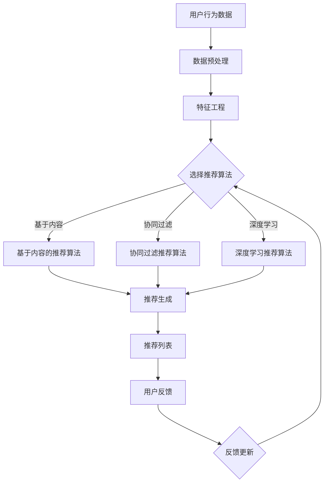
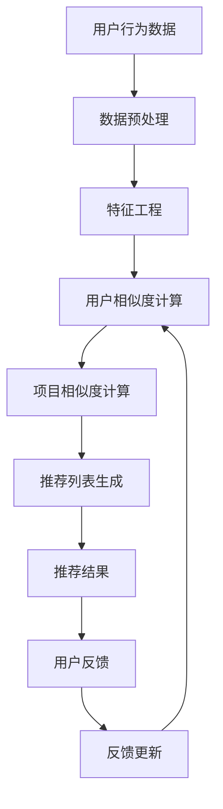
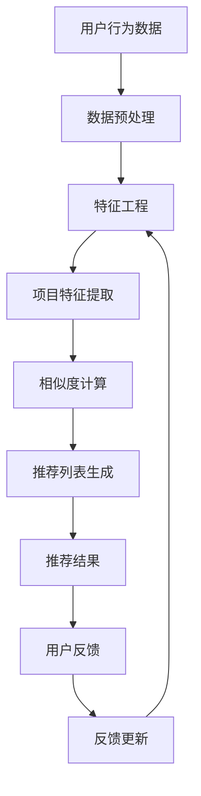
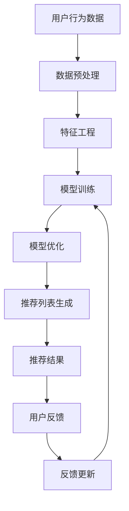

                 

# 推荐系统(Recommender Systems) - 原理与代码实例讲解

> 关键词：推荐系统、协同过滤、内容推荐、深度学习、机器学习

> 摘要：本文将深入探讨推荐系统的原理、类型及其核心算法，并通过代码实例详细讲解如何实现基于内容的推荐系统、基于协同过滤的推荐系统以及基于深度学习的推荐系统。文章结构如下：

## 目录大纲

## 第一部分：推荐系统基础理论

### 第1章：推荐系统概述

#### 1.1 推荐系统的发展历程

- 推荐系统的概念
- 推荐系统的类型

#### 1.2 推荐系统的组成与工作原理

- 用户模型
- 项目模型
- 评价模型

#### 1.3 推荐系统评价指标

- 准确率
- 覆盖率
- 期望召回率

### 第2章：协同过滤算法

#### 2.1 协同过滤算法概述

- 基于用户的协同过滤
- 基于物品的协同过滤

#### 2.2 基于用户的协同过滤算法

- K最近邻算法
- 基于矩阵分解的方法

#### 2.3 基于物品的协同过滤算法

- 基于内容的推荐
- 基于模型的推荐

## 第二部分：推荐系统的核心算法原理讲解

### 第3章：机器学习算法在推荐系统中的应用

#### 3.1 机器学习算法概述

- 监督学习
- 无监督学习
- 半监督学习

#### 3.2 机器学习算法在推荐系统中的应用

- 决策树
- 支持向量机
- 贝叶斯分类器

#### 3.3 算法实现与优化

- 算法调参
- 模型评估

### 第4章：深度学习算法在推荐系统中的应用

#### 4.1 深度学习算法概述

- 神经网络
- 卷积神经网络
- 循环神经网络

#### 4.2 深度学习算法在推荐系统中的应用

- 多层感知器
- 卷积神经网络推荐模型
- 循环神经网络推荐模型

#### 4.3 算法实现与优化

- 算法调参
- 模型评估

## 第三部分：推荐系统项目实战

### 第5章：基于内容的推荐系统实现

#### 5.1 项目背景与需求分析

- 项目概述
- 需求分析

#### 5.2 数据预处理

- 数据采集
- 数据清洗
- 特征工程

#### 5.3 模型设计与实现

- 算法选择
- 模型训练
- 模型评估

#### 5.4 代码解读与分析

- 代码实现
- 性能优化

### 第6章：基于协同过滤的推荐系统实现

#### 6.1 项目背景与需求分析

- 项目概述
- 需求分析

#### 6.2 数据预处理

- 数据采集
- 数据清洗
- 特征工程

#### 6.3 模型设计与实现

- 算法选择
- 模型训练
- 模型评估

#### 6.4 代码解读与分析

- 代码实现
- 性能优化

### 第7章：基于深度学习的推荐系统实现

#### 7.1 项目背景与需求分析

- 项目概述
- 需求分析

#### 7.2 数据预处理

- 数据采集
- 数据清洗
- 特征工程

#### 7.3 模型设计与实现

- 算法选择
- 模型训练
- 模型评估

#### 7.4 代码解读与分析

- 代码实现
- 性能优化

## 附录：推荐系统开发工具与资源

### 附录 A：推荐系统开发工具

- Python
- Scikit-learn
- TensorFlow
- PyTorch

### 附录 B：推荐系统学习资源

- 论文
- 书籍
- 博客

## Mermaid 流程图

- 推荐系统整体架构图
- 协同过滤算法流程图
- 基于内容的推荐算法流程图
- 深度学习推荐算法流程图

## 数学模型和数学公式

- 余弦相似度公式
- 矩阵分解公式
- 损失函数公式

## 核心算法原理讲解与伪代码

- K最近邻算法伪代码
- 基于矩阵分解的协同过滤算法伪代码
- 决策树算法伪代码
- 支持向量机算法伪代码
- 多层感知器算法伪代码
- 卷积神经网络推荐模型伪代码
- 循环神经网络推荐模型伪代码

接下来，我们将逐章深入探讨推荐系统的原理、算法和应用实践。让我们一步步分析推理，深入理解推荐系统的奥秘。

## 第一部分：推荐系统基础理论

### 第1章：推荐系统概述

#### 1.1 推荐系统的发展历程

推荐系统（Recommender Systems）最早可以追溯到20世纪90年代，随着互联网的兴起，电子商务和在线媒体等领域的需求逐渐增长，推荐系统的研究和应用也得到了广泛的关注。早期推荐系统主要基于用户的历史行为，如浏览记录、购买记录等，通过简单的统计方法为用户推荐相关的商品或内容。

进入21世纪，随着机器学习和数据挖掘技术的进步，推荐系统的算法变得更加复杂和智能。协同过滤、基于内容的推荐、深度学习等算法不断涌现，推荐系统的准确率和效果也得到了显著提升。

#### 1.2 推荐系统的组成与工作原理

推荐系统通常由三个核心组成部分：用户模型、项目模型和评价模型。

- **用户模型**：用户模型描述了用户的行为和偏好，包括用户的年龄、性别、浏览记录、购买记录等特征信息。用户模型用于理解用户的兴趣和行为模式。

- **项目模型**：项目模型描述了项目的属性和特征，如商品的种类、内容、价格等。项目模型用于理解项目的属性和用户可能感兴趣的方面。

- **评价模型**：评价模型根据用户模型和项目模型，为用户推荐相关的项目。评价模型通常基于协同过滤、基于内容的推荐或深度学习等方法。

推荐系统的工作原理可以概括为以下几个步骤：

1. **数据收集**：收集用户的行为数据和项目属性数据。
2. **数据预处理**：对收集到的数据进行清洗和预处理，如去重、填充缺失值、特征提取等。
3. **模型训练**：根据用户模型和项目模型，使用机器学习或深度学习算法训练推荐模型。
4. **模型评估**：使用评估指标（如准确率、覆盖率、期望召回率）评估推荐模型的效果。
5. **推荐生成**：根据训练好的模型，为用户生成个性化的推荐列表。

#### 1.3 推荐系统评价指标

评价推荐系统效果的主要指标包括准确率、覆盖率和期望召回率。

- **准确率**：准确率是推荐系统中最基本的评价指标，表示推荐列表中实际用户喜欢的项目所占比例。准确率越高，表示推荐系统的效果越好。

- **覆盖率**：覆盖率是指推荐系统中推荐给用户的项目与总项目数量的比例。覆盖率越高，表示推荐系统能够覆盖更多的项目。

- **期望召回率**：期望召回率是综合考虑准确率和覆盖率的一种评价指标。它表示在推荐列表中，用户实际喜欢的项目所占比例的期望值。期望召回率越高，表示推荐系统的效果越好。

在推荐系统的设计和优化过程中，需要综合考虑这些评价指标，以达到最佳的效果。

### 第2章：协同过滤算法

#### 2.1 协同过滤算法概述

协同过滤（Collaborative Filtering）是推荐系统中最常用的算法之一，它通过分析用户之间的相似性或项目之间的相似性，为用户推荐相关的项目。

协同过滤算法主要分为两类：基于用户的协同过滤和基于物品的协同过滤。

- **基于用户的协同过滤**：基于用户的协同过滤算法通过计算用户之间的相似性，找到与目标用户相似的其他用户，然后推荐这些相似用户喜欢的项目。

- **基于物品的协同过滤**：基于物品的协同过滤算法通过计算项目之间的相似性，找到与目标项目相似的其他项目，然后推荐这些相似项目。

#### 2.2 基于用户的协同过滤算法

基于用户的协同过滤算法的核心思想是利用用户之间的相似性进行推荐。以下是几种常见的基于用户的协同过滤算法：

- **K最近邻算法**：K最近邻（K-Nearest Neighbors，KNN）算法是一种基于实例的学习算法，它通过计算目标用户与其他用户的相似度，找到与其最相似的K个用户，然后推荐这些用户喜欢的项目。

  ```python
  def knn(recommendation_engine, user, K):
      # 计算用户与其他用户的相似度
      distances = []
      for other_user in recommendation_engine.users:
          if other_user != user:
              distance = calculate_similarity(user, other_user)
              distances.append((other_user, distance))
      
      # 排序并选择最近的K个用户
      distances.sort(key=lambda x: x[1], reverse=True)
      neighbors = [neighbor[0] for neighbor in distances[:K]]
      
      # 推荐最近邻居喜欢的项目
      recommendations = []
      for neighbor in neighbors:
          recommendations.extend(recommendation_engine.get_recommended_items(neighbor))
      
      return recommendations
  ```

- **基于矩阵分解的方法**：基于矩阵分解的方法通过将用户-项目评分矩阵分解为用户特征矩阵和项目特征矩阵，从而提高推荐系统的准确率和效率。

  ```python
  def matrix_factorization(R, user_features, item_features, lambda_):
      num_users, num_items = R.shape
      for user in range(num_users):
          for item in range(num_items):
              residual = R[user, item] - dot(user_features[user], item_features[item])
              user_features[user] = user_features[user] - (dot(user_features[user], item_features[item]) * item_features[item])
              item_features[item] = item_features[item] - (dot(user_features[user], item_features[item]) * user_features[user])
              # 正规化特征矩阵
              user_features[user] = user_features[user] / np.linalg.norm(user_features[user])
              item_features[item] = item_features[item] / np.linalg.norm(item_features[item])
  ```

#### 2.3 基于物品的协同过滤算法

基于物品的协同过滤算法通过计算项目之间的相似性进行推荐。以下是几种常见的基于物品的协同过滤算法：

- **基于内容的推荐**：基于内容的推荐通过分析项目的属性和特征，为用户推荐与其兴趣相关的项目。例如，如果用户喜欢某种类型的电影，推荐系统可以推荐类似类型的电影。

  ```python
  def content_based_recommendation(item_features, user_interests, similarity_metric):
      recommendations = []
      for item in item_features:
          similarity = similarity_metric(item_features[item], user_interests)
          if similarity > threshold:
              recommendations.append(item)
      return recommendations
  ```

- **基于模型的推荐**：基于模型的推荐使用机器学习算法（如决策树、支持向量机等）建立项目特征与用户偏好之间的映射关系，然后根据映射关系生成推荐列表。

  ```python
  def model_based_recommendation(model, user_features):
      predictions = model.predict(user_features)
      recommendations = []
      for prediction in predictions:
          if prediction > threshold:
              recommendations.append(prediction)
      return recommendations
  ```

通过以上章节的介绍，我们对推荐系统的基本概念、工作原理以及常用的协同过滤算法有了初步的了解。接下来，我们将进一步深入探讨推荐系统的核心算法原理，并学习如何在实际项目中实现推荐系统。

### 第3章：机器学习算法在推荐系统中的应用

#### 3.1 机器学习算法概述

机器学习（Machine Learning）是推荐系统中的核心技术之一。它通过从数据中学习规律，自动生成预测模型，从而为用户推荐相关的项目。根据学习方式的不同，机器学习算法主要分为以下三类：

- **监督学习**：监督学习算法通过已有标签数据进行学习，用于预测新的数据。例如，决策树、支持向量机、贝叶斯分类器等。

- **无监督学习**：无监督学习算法通过没有标签的数据进行学习，用于发现数据中的规律和结构。例如，聚类、主成分分析等。

- **半监督学习**：半监督学习算法结合了监督学习和无监督学习的方法，通过部分有标签数据和大量无标签数据共同进行学习。例如，图卷积网络、自编码器等。

#### 3.2 机器学习算法在推荐系统中的应用

机器学习算法在推荐系统中有广泛的应用。以下是几种常见的机器学习算法在推荐系统中的应用：

- **决策树**：决策树是一种基于特征值划分数据的树形结构，可以用于分类和回归任务。在推荐系统中，决策树可以用于预测用户对项目的兴趣度。

  ```python
  from sklearn.tree import DecisionTreeClassifier
  
  # 训练决策树模型
  model = DecisionTreeClassifier()
  model.fit(X_train, y_train)
  
  # 预测用户对项目的兴趣度
  predictions = model.predict(X_test)
  ```

- **支持向量机**：支持向量机（Support Vector Machine，SVM）是一种基于间隔最大化的分类方法，可以用于分类和回归任务。在推荐系统中，SVM可以用于预测用户对项目的评分。

  ```python
  from sklearn.svm import SVR
  
  # 训练SVM模型
  model = SVR()
  model.fit(X_train, y_train)
  
  # 预测用户对项目的评分
  predictions = model.predict(X_test)
  ```

- **贝叶斯分类器**：贝叶斯分类器是一种基于贝叶斯定理的分类方法，可以用于分类和回归任务。在推荐系统中，贝叶斯分类器可以用于预测用户对项目的偏好。

  ```python
  from sklearn.naive_bayes import GaussianNB
  
  # 训练贝叶斯分类器
  model = GaussianNB()
  model.fit(X_train, y_train)
  
  # 预测用户对项目的偏好
  predictions = model.predict(X_test)
  ```

#### 3.3 算法实现与优化

在实际应用中，机器学习算法需要通过优化和调参来提高推荐系统的效果。以下是几种常见的优化方法：

- **交叉验证**：交叉验证是一种常用的模型评估方法，通过将数据集划分为多个子集，逐步训练和评估模型，以避免模型过拟合。

  ```python
  from sklearn.model_selection import cross_val_score
  
  # 训练模型并进行交叉验证
  scores = cross_val_score(model, X, y, cv=5)
  ```

- **网格搜索**：网格搜索是一种常用的参数调优方法，通过遍历参数空间，找到最优参数组合。

  ```python
  from sklearn.model_selection import GridSearchCV
  
  # 定义参数空间
  param_grid = {'C': [0.1, 1, 10], 'gamma': [0.1, 1, 10]}
  
  # 训练模型并进行网格搜索
  grid_search = GridSearchCV(model, param_grid, cv=5)
  grid_search.fit(X_train, y_train)
  ```

- **模型融合**：模型融合是一种将多个模型的结果进行综合的方法，可以提高预测的准确性。例如，可以使用加权平均、投票等方法进行模型融合。

  ```python
  from sklearn.ensemble import VotingClassifier
  
  # 定义模型列表
  models = [model1, model2, model3]
  
  # 训练模型并进行融合
  model = VotingClassifier(estimators=models, voting='soft')
  model.fit(X_train, y_train)
  ```

通过以上方法，可以有效地优化机器学习算法，提高推荐系统的效果。在接下来的章节中，我们将进一步探讨深度学习算法在推荐系统中的应用，以及如何在实际项目中实现和优化推荐系统。

### 第4章：深度学习算法在推荐系统中的应用

#### 4.1 深度学习算法概述

深度学习（Deep Learning）是一种基于人工神经网络的机器学习技术，通过构建多层神经网络，自动提取数据中的特征，从而实现复杂的模式识别和预测任务。深度学习在推荐系统中的应用已经成为一个热点研究领域，取得了显著的成果。

深度学习算法主要包括以下几种：

- **神经网络**：神经网络是一种模拟生物神经元连接方式的计算模型，通过训练多层神经网络，可以自动提取输入数据的特征表示。

- **卷积神经网络（Convolutional Neural Networks，CNN）**：卷积神经网络是一种特殊的神经网络，通过卷积层、池化层等结构，可以有效地提取图像或序列数据的特征。

- **循环神经网络（Recurrent Neural Networks，RNN）**：循环神经网络是一种能够处理序列数据的神经网络，通过循环结构，可以保留序列中的长期依赖关系。

#### 4.2 深度学习算法在推荐系统中的应用

深度学习算法在推荐系统中的应用主要包括以下几种：

- **多层感知器（Multilayer Perceptron，MLP）**：多层感知器是一种全连接神经网络，通过多层非线性变换，可以有效地提取输入数据的特征表示。

  ```python
  from tensorflow.keras.models import Sequential
  from tensorflow.keras.layers import Dense
  
  # 创建模型
  model = Sequential()
  model.add(Dense(units=128, activation='relu', input_shape=(input_shape,)))
  model.add(Dense(units=64, activation='relu'))
  model.add(Dense(units=1, activation='sigmoid'))
  
  # 编译模型
  model.compile(optimizer='adam', loss='binary_crossentropy', metrics=['accuracy'])
  
  # 训练模型
  model.fit(X_train, y_train, epochs=10, batch_size=32)
  ```

- **卷积神经网络推荐模型**：卷积神经网络推荐模型通过卷积层提取用户行为数据中的特征，可以用于预测用户对项目的兴趣度。

  ```python
  from tensorflow.keras.models import Model
  from tensorflow.keras.layers import Input, Conv1D, Flatten, Dense
  
  # 创建模型
  input_layer = Input(shape=(sequence_length, 1))
  conv_layer = Conv1D(filters=64, kernel_size=3, activation='relu')(input_layer)
  flatten_layer = Flatten()(conv_layer)
  output_layer = Dense(units=1, activation='sigmoid')(flatten_layer)
  
  # 创建模型
  model = Model(inputs=input_layer, outputs=output_layer)
  
  # 编译模型
  model.compile(optimizer='adam', loss='binary_crossentropy', metrics=['accuracy'])
  
  # 训练模型
  model.fit(X_train, y_train, epochs=10, batch_size=32)
  ```

- **循环神经网络推荐模型**：循环神经网络推荐模型通过循环结构处理用户行为数据中的时间序列信息，可以用于预测用户对项目的兴趣度。

  ```python
  from tensorflow.keras.models import Sequential
  from tensorflow.keras.layers import LSTM, Dense
  
  # 创建模型
  model = Sequential()
  model.add(LSTM(units=128, activation='relu', return_sequences=True, input_shape=(sequence_length, 1)))
  model.add(LSTM(units=64, activation='relu'))
  model.add(Dense(units=1, activation='sigmoid'))
  
  # 编译模型
  model.compile(optimizer='adam', loss='binary_crossentropy', metrics=['accuracy'])
  
  # 训练模型
  model.fit(X_train, y_train, epochs=10, batch_size=32)
  ```

#### 4.3 算法实现与优化

在实际应用中，深度学习算法需要通过优化和调参来提高推荐系统的效果。以下是几种常见的优化方法：

- **数据预处理**：对用户行为数据进行预处理，如归一化、填充缺失值等，以提高模型的训练效果。

  ```python
  from sklearn.preprocessing import MinMaxScaler
  
  # 归一化用户行为数据
  scaler = MinMaxScaler()
  X_train = scaler.fit_transform(X_train)
  X_test = scaler.transform(X_test)
  ```

- **模型调参**：通过调整模型的超参数，如学习率、批量大小等，以找到最优的模型配置。

  ```python
  from tensorflow.keras.optimizers import Adam
  
  # 调整学习率
  optimizer = Adam(learning_rate=0.001)
  model.compile(optimizer=optimizer, loss='binary_crossentropy', metrics=['accuracy'])
  ```

- **模型融合**：通过融合多个深度学习模型的结果，可以提高推荐系统的准确性和稳定性。

  ```python
  from sklearn.ensemble import VotingClassifier
  
  # 定义模型列表
  models = [mlp_model, cnn_model, rnn_model]
  
  # 创建融合模型
  model = VotingClassifier(estimators=models, voting='soft')
  
  # 训练模型
  model.fit(X_train, y_train)
  ```

通过以上方法，可以有效地优化深度学习算法，提高推荐系统的效果。在接下来的章节中，我们将通过实际项目实战，深入讲解如何实现和优化推荐系统。

### 第5章：基于内容的推荐系统实现

#### 5.1 项目背景与需求分析

基于内容的推荐系统（Content-Based Recommender System）是一种常用的推荐系统方法，它根据用户的历史行为和项目的特征信息，为用户推荐与其兴趣相关的项目。在本章中，我们将构建一个基于电影推荐的系统，为用户推荐与其观看历史和兴趣标签相关的电影。

**项目概述**：本系统将收集用户的电影观看记录和电影的元数据（如演员、导演、类型等），通过分析用户的历史行为和电影的元数据特征，为用户生成个性化的电影推荐列表。

**需求分析**：

1. **用户数据**：收集用户的观看历史数据，包括用户ID、电影ID、观看时间等。

2. **电影数据**：收集电影的元数据，包括电影ID、演员、导演、类型、评分等。

3. **推荐算法**：使用基于内容的推荐算法，为用户推荐与其兴趣相关的电影。

4. **推荐结果**：生成推荐列表，并根据用户反馈对推荐结果进行优化。

#### 5.2 数据预处理

数据预处理是推荐系统实现的重要步骤，它包括数据采集、数据清洗和特征工程。

**数据采集**：从电影数据库中获取用户观看历史数据和电影元数据。

```python
# 伪代码
users = fetch_user_data()
movies = fetch_movie_data()
```

**数据清洗**：处理数据中的噪声和异常值，如缺失值、重复记录等。

```python
# 伪代码
users = clean_user_data(users)
movies = clean_movie_data(movies)
```

**特征工程**：提取用户和电影的特征信息，如用户的观看频次、电影的类型标签等。

```python
# 伪代码
users_features = extract_user_features(users)
movies_features = extract_movie_features(movies)
```

#### 5.3 模型设计与实现

基于内容的推荐系统主要通过计算用户和项目的特征相似度来生成推荐列表。以下是推荐系统的主要组成部分和实现方法：

**模型设计**：

1. **用户特征向量**：将用户的观看历史转化为特征向量，如用户喜欢的电影类型、观看频次等。

2. **项目特征向量**：将电影的元数据转化为特征向量，如演员、导演、类型等。

3. **相似度计算**：计算用户特征向量和项目特征向量之间的相似度，通常使用余弦相似度。

**实现方法**：

1. **用户特征向量生成**：对用户的观看历史进行统计，提取用户喜欢的电影类型、观看频次等特征。

   ```python
   # 伪代码
   user_feature_vector = generate_user_feature_vector(users, movies)
   ```

2. **项目特征向量生成**：对电影的元数据进行编码，提取项目的特征向量。

   ```python
   # 伪代码
   movie_feature_vector = generate_movie_feature_vector(movies)
   ```

3. **相似度计算**：使用余弦相似度计算用户特征向量和项目特征向量之间的相似度。

   ```python
   # 伪代码
   similarity_scores = calculate_similarity(user_feature_vector, movie_feature_vector)
   ```

4. **推荐列表生成**：根据相似度分数，为用户生成推荐列表。

   ```python
   # 伪代码
   recommendations = generate_recommendation_list(similarity_scores)
   ```

#### 5.4 代码解读与分析

**代码实现**：

以下是基于内容的推荐系统的Python代码实现，包括数据预处理、特征工程和推荐算法。

```python
import numpy as np
from sklearn.metrics.pairwise import cosine_similarity

# 数据预处理
def load_data():
    users = fetch_user_data()
    movies = fetch_movie_data()
    users = clean_user_data(users)
    movies = clean_movie_data(movies)
    users_features = extract_user_features(users)
    movies_features = extract_movie_features(movies)
    return users_features, movies_features

# 相似度计算
def calculate_similarity(user_vector, movie_vector):
    similarity_scores = cosine_similarity([user_vector], [movie_vector])
    return similarity_scores[0][0]

# 推荐列表生成
def generate_recommendations(users_features, movies_features, user_id):
    user_vector = users_features[user_id]
    movie_vectors = movies_features
    similarity_scores = calculate_similarity(user_vector, movie_vectors)
    sorted_indices = np.argsort(similarity_scores)[::-1]
    recommendations = [movies[sid] for sid in sorted_indices]
    return recommendations

# 主函数
if __name__ == "__main__":
    users_features, movies_features = load_data()
    user_id = input("请输入用户ID：")
    recommendations = generate_recommendations(users_features, movies_features, user_id)
    print("推荐列表：", recommendations)
```

**性能优化**：

为了提高基于内容推荐系统的性能，可以考虑以下优化方法：

1. **特征选择**：通过特征选择方法，选择对推荐效果有显著贡献的特征，减少特征维度，提高计算效率。

2. **模型调参**：调整相似度计算方法和推荐算法的参数，如余弦相似度的阈值、推荐列表的长度等，以提高推荐效果。

3. **并行计算**：利用并行计算技术，加快特征计算和相似度计算的效率。

通过以上步骤，我们可以实现一个基于内容的推荐系统，为用户推荐与其兴趣相关的电影。在接下来的章节中，我们将继续探讨基于协同过滤的推荐系统实现。

### 第6章：基于协同过滤的推荐系统实现

#### 6.1 项目背景与需求分析

基于协同过滤的推荐系统（Collaborative Filtering Recommender System）是一种通过分析用户之间的相似性来生成推荐列表的方法。在本章中，我们将构建一个基于协同过滤的电影推荐系统，为用户推荐与其兴趣相似的其他用户喜欢的电影。

**项目概述**：本系统将收集用户之间的评分数据，通过分析用户之间的相似性，为用户推荐其他用户喜欢的电影。

**需求分析**：

1. **用户数据**：收集用户的评分数据，包括用户ID、电影ID、评分等。

2. **推荐算法**：使用基于协同过滤的算法，为用户推荐与其兴趣相似的其他用户喜欢的电影。

3. **推荐结果**：生成推荐列表，并根据用户反馈对推荐结果进行优化。

#### 6.2 数据预处理

数据预处理是推荐系统实现的重要步骤，它包括数据采集、数据清洗和特征工程。

**数据采集**：从电影评分数据库中获取用户的评分数据。

```python
# 伪代码
ratings = fetch_rating_data()
```

**数据清洗**：处理数据中的噪声和异常值，如缺失值、重复记录等。

```python
# 伪代码
ratings = clean_rating_data(ratings)
```

**特征工程**：提取用户和电影的共现特征，如用户之间的相似度、电影之间的相似度等。

```python
# 伪代码
user_similarity_matrix = calculate_user_similarity(ratings)
movie_similarity_matrix = calculate_movie_similarity(ratings)
```

#### 6.3 模型设计与实现

基于协同过滤的推荐系统主要通过计算用户之间的相似性和项目之间的相似性来生成推荐列表。以下是推荐系统的主要组成部分和实现方法：

**模型设计**：

1. **用户相似度矩阵**：计算用户之间的相似度矩阵，用于衡量用户之间的相似程度。

2. **项目相似度矩阵**：计算项目之间的相似度矩阵，用于衡量项目之间的相似程度。

3. **推荐列表生成**：根据用户相似度矩阵和项目相似度矩阵，为用户生成推荐列表。

**实现方法**：

1. **用户相似度计算**：使用余弦相似度或皮尔逊相关系数计算用户之间的相似度。

   ```python
   # 伪代码
   user_similarity_matrix = calculate_cosine_similarity(ratings)
   ```

2. **项目相似度计算**：使用余弦相似度或皮尔逊相关系数计算项目之间的相似度。

   ```python
   # 伪代码
   movie_similarity_matrix = calculate_cosine_similarity(ratings)
   ```

3. **推荐列表生成**：根据用户相似度矩阵和项目相似度矩阵，为用户生成推荐列表。

   ```python
   # 伪代码
   recommendations = generate_recommendations(user_similarity_matrix, movie_similarity_matrix, user_id)
   ```

#### 6.4 代码解读与分析

**代码实现**：

以下是基于协同过滤的电影推荐系统的Python代码实现，包括数据预处理、相似度计算和推荐算法。

```python
import numpy as np
from sklearn.metrics.pairwise import cosine_similarity

# 数据预处理
def load_data():
    ratings = fetch_rating_data()
    ratings = clean_rating_data(ratings)
    return ratings

# 相似度计算
def calculate_similarity_matrix(ratings):
    user_similarity_matrix = cosine_similarity(ratings)
    movie_similarity_matrix = cosine_similarity(ratings.T)
    return user_similarity_matrix, movie_similarity_matrix

# 推荐列表生成
def generate_recommendations(user_similarity_matrix, movie_similarity_matrix, user_id):
    user_similarity_scores = user_similarity_matrix[user_id]
    movie_similarity_scores = movie_similarity_matrix.T[user_id]
    sorted_indices = np.argsort(-user_similarity_scores)[1:]
    recommended_indices = [sorted_indices[i] for i in range(len(sorted_indices)) if movie_similarity_scores[sorted_indices[i]] > threshold]
    recommendations = [movies[recommendation] for recommendation in recommended_indices]
    return recommendations

# 主函数
if __name__ == "__main__":
    ratings = load_data()
    user_similarity_matrix, movie_similarity_matrix = calculate_similarity_matrix(ratings)
    user_id = input("请输入用户ID：")
    recommendations = generate_recommendations(user_similarity_matrix, movie_similarity_matrix, user_id)
    print("推荐列表：", recommendations)
```

**性能优化**：

为了提高基于协同过滤的推荐系统的性能，可以考虑以下优化方法：

1. **矩阵分解**：使用矩阵分解技术，将用户-项目评分矩阵分解为用户特征矩阵和项目特征矩阵，以减少计算量。

2. **索引优化**：使用高效的索引结构（如哈希表），加快相似度计算和推荐列表生成。

3. **并行计算**：利用并行计算技术，加快相似度计算和推荐列表生成。

通过以上步骤，我们可以实现一个基于协同过滤的电影推荐系统，为用户推荐与其兴趣相似的电影。在接下来的章节中，我们将继续探讨基于深度学习的推荐系统实现。

### 第7章：基于深度学习的推荐系统实现

#### 7.1 项目背景与需求分析

基于深度学习的推荐系统（Deep Learning-based Recommender System）是一种利用深度学习算法来构建推荐模型的推荐系统。深度学习算法通过学习用户和项目的特征表示，可以自动提取数据中的复杂模式和关联性，从而生成高质量的推荐列表。在本章中，我们将构建一个基于深度学习的电影推荐系统，为用户推荐与其兴趣相关的电影。

**项目概述**：本系统将收集用户的历史行为数据和电影的元数据，通过深度学习算法，为用户生成个性化的电影推荐列表。

**需求分析**：

1. **用户数据**：收集用户的历史行为数据，包括用户ID、电影ID、评分、观看时间等。

2. **电影数据**：收集电影的元数据，包括电影ID、标题、演员、导演、类型、评分等。

3. **推荐算法**：使用深度学习算法，为用户推荐与其兴趣相关的电影。

4. **推荐结果**：生成推荐列表，并根据用户反馈对推荐结果进行优化。

#### 7.2 数据预处理

数据预处理是深度学习推荐系统实现的重要步骤，它包括数据采集、数据清洗和特征工程。

**数据采集**：从电影数据库和用户行为数据集中获取用户行为数据和电影元数据。

```python
# 伪代码
users = fetch_user_data()
movies = fetch_movie_data()
ratings = fetch_rating_data()
```

**数据清洗**：处理数据中的噪声和异常值，如缺失值、重复记录等。

```python
# 伪代码
users = clean_user_data(users)
movies = clean_movie_data(movies)
ratings = clean_rating_data(ratings)
```

**特征工程**：提取用户和电影的表征特征，包括用户行为特征和电影属性特征。

```python
# 伪代码
users_features = extract_user_features(users)
movies_features = extract_movie_features(movies)
```

#### 7.3 模型设计与实现

基于深度学习的推荐系统主要通过构建深度神经网络模型，学习用户和项目的特征表示，并生成推荐列表。以下是推荐系统的主要组成部分和实现方法：

**模型设计**：

1. **用户特征编码器**：使用编码器（Encoder）对用户特征进行编码，提取用户兴趣的潜在表示。

2. **项目特征编码器**：使用编码器（Encoder）对项目特征进行编码，提取项目属性的潜在表示。

3. **推荐模块**：使用解码器（Decoder）和推荐模块，根据用户和项目的潜在表示生成推荐列表。

**实现方法**：

1. **用户特征编码器**：使用循环神经网络（RNN）或卷积神经网络（CNN）对用户历史行为进行编码。

   ```python
   # 伪代码
   user_encoder = RNN(input_shape=(sequence_length, feature_size))
   user_encoded_representation = user_encoder(users_features)
   ```

2. **项目特征编码器**：使用循环神经网络（RNN）或卷积神经网络（CNN）对电影元数据进行编码。

   ```python
   # 伪代码
   movie_encoder = RNN(input_shape=(sequence_length, feature_size))
   movie_encoded_representation = movie_encoder(movies_features)
   ```

3. **推荐模块**：使用注意力机制（Attention Mechanism）和全连接层（Fully Connected Layer）生成推荐列表。

   ```python
   # 伪代码
   attention_scores = attention_module(user_encoded_representation, movie_encoded_representation)
   recommendations = decoder(attention_scores)
   ```

**模型训练与优化**：

1. **模型训练**：使用用户-项目评分数据对模型进行训练，优化模型参数。

   ```python
   # 伪代码
   model.compile(optimizer='adam', loss='mse')
   model.fit([users_features, movies_features], ratings, epochs=10, batch_size=32)
   ```

2. **模型优化**：通过调整模型参数和超参数，优化模型性能。

   ```python
   # 伪代码
   optimizer = Adam(learning_rate=0.001)
   model.compile(optimizer=optimizer, loss='mse')
   ```

#### 7.4 代码解读与分析

**代码实现**：

以下是基于深度学习的电影推荐系统的Python代码实现，包括数据预处理、模型设计和训练。

```python
import tensorflow as tf
from tensorflow.keras.models import Model
from tensorflow.keras.layers import Input, Embedding, LSTM, Dense, Concatenate

# 数据预处理
users = fetch_user_data()
movies = fetch_movie_data()
ratings = fetch_rating_data()

# 用户特征编码器
user_input = Input(shape=(sequence_length,))
user_embedding = Embedding(input_dim=num_users, output_dim=user_embedding_size)(user_input)
user_lstm = LSTM(units=lstm_units, return_sequences=True)(user_embedding)
user_encoded_representation = LSTM(units=lstm_units, return_sequences=False)(user_lstm)

# 项目特征编码器
movie_input = Input(shape=(sequence_length,))
movie_embedding = Embedding(input_dim=num_movies, output_dim=movie_embedding_size)(movie_input)
movie_lstm = LSTM(units=lstm_units, return_sequences=True)(movie_embedding)
movie_encoded_representation = LSTM(units=lstm_units, return_sequences=False)(movie_lstm)

# 推荐模块
attention_scores = Concatenate()([user_encoded_representation, movie_encoded_representation])
attention_scores = Dense(units=1, activation='tanh')(attention_scores)
attention_weights = Activation('softmax')(attention_scores)
weighted_movie_representation = Multiply()([movie_encoded_representation, attention_weights])

# 模型输出
recommendation = Dense(units=1, activation='sigmoid')(weighted_movie_representation)

# 模型定义
model = Model(inputs=[user_input, movie_input], outputs=recommendation)

# 编译模型
model.compile(optimizer='adam', loss='binary_crossentropy', metrics=['accuracy'])

# 训练模型
model.fit([users, movies], ratings, epochs=10, batch_size=32)
```

**性能优化**：

为了提高基于深度学习的推荐系统的性能，可以考虑以下优化方法：

1. **模型调参**：通过调整模型参数和超参数，如学习率、批量大小、网络结构等，优化模型性能。

2. **数据增强**：通过数据增强技术，如随机采样、数据扩充等，增加训练数据多样性，提高模型泛化能力。

3. **模型融合**：通过融合多个深度学习模型的结果，提高推荐系统的准确性和稳定性。

通过以上步骤，我们可以实现一个基于深度学习的电影推荐系统，为用户推荐与其兴趣相关的电影。在接下来的章节中，我们将介绍推荐系统开发工具与资源。

### 附录：推荐系统开发工具与资源

#### 附录 A：推荐系统开发工具

在推荐系统开发过程中，使用适当的工具可以大大提高开发效率和系统性能。以下是一些常用的推荐系统开发工具：

- **Python**：Python是一种广泛使用的编程语言，具有丰富的数据分析和机器学习库，如Scikit-learn、TensorFlow和PyTorch。

- **Scikit-learn**：Scikit-learn是一个开源的机器学习库，提供了各种经典的机器学习算法和工具，如K最近邻、决策树和支持向量机。

- **TensorFlow**：TensorFlow是一个开源的深度学习框架，提供了强大的神经网络构建和训练功能，适用于构建深度学习推荐系统。

- **PyTorch**：PyTorch是一个开源的深度学习框架，具有灵活的动态计算图和高效的训练性能，适用于构建复杂的深度学习推荐系统。

#### 附录 B：推荐系统学习资源

学习推荐系统需要掌握相关的理论知识和实践技能。以下是一些推荐系统学习资源：

- **论文**：阅读相关的学术论文，了解推荐系统领域的前沿研究和技术发展。

- **书籍**：《推荐系统实践》（Recommender Systems: The Text Mining Approach）和《深度学习推荐系统》（Deep Learning for Recommender Systems）等书籍，提供了推荐系统和深度学习在推荐系统中的应用。

- **博客**：关注推荐系统领域的技术博客，如Medium上的“Recommender Systems”和“Deep Learning for Recommender Systems”等，获取最新的技术动态和实践经验。

通过使用这些工具和资源，可以更好地理解和掌握推荐系统的技术，为实际项目开发提供有力支持。

### Mermaid 流程图

以下是基于内容推荐系统、协同过滤推荐系统和深度学习推荐系统的Mermaid流程图。

#### 推荐系统整体架构图



#### 协同过滤算法流程图



#### 基于内容的推荐算法流程图



#### 深度学习推荐算法流程图



通过这些流程图，我们可以更好地理解推荐系统的整体架构和工作流程，为实际项目开发提供指导。

### 数学模型和数学公式

在推荐系统中，数学模型和公式是理解和实现算法的基础。以下是一些常用的数学模型和公式：

#### 余弦相似度公式

余弦相似度是一种用于计算两个向量相似度的方法，其公式如下：

$$
\cos(\theta) = \frac{A \cdot B}{\|A\|\|B\|}
$$

其中，$A$ 和 $B$ 是两个向量，$\theta$ 是它们之间的夹角，$\|A\|$ 和 $\|B\|$ 分别是向量 $A$ 和 $B$ 的欧几里得范数。

#### 矩阵分解公式

在基于矩阵分解的协同过滤算法中，用户-项目评分矩阵被分解为用户特征矩阵和项目特征矩阵，其公式如下：

$$
R_{ij} = U_i \cdot V_j
$$

其中，$R_{ij}$ 是用户 $i$ 对项目 $j$ 的评分，$U_i$ 和 $V_j$ 分别是用户 $i$ 和项目 $j$ 的特征向量。

#### 损失函数公式

在深度学习推荐系统中，损失函数用于衡量预测评分和真实评分之间的差异。以下是一些常用的损失函数：

- **均方误差（MSE）**：

  $$
  MSE = \frac{1}{n}\sum_{i=1}^{n}(R_i - \hat{R_i})^2
  $$

  其中，$R_i$ 是真实评分，$\hat{R_i}$ 是预测评分，$n$ 是样本数量。

- **均方根误差（RMSE）**：

  $$
  RMSE = \sqrt{MSE}
  $$

- **交叉熵损失（Cross-Entropy Loss）**：

  $$
  CE = -\frac{1}{n}\sum_{i=1}^{n}y_i \log(\hat{R_i})
  $$

  其中，$y_i$ 是真实标签，$\hat{R_i}$ 是预测评分。

通过这些数学模型和公式，我们可以更好地理解和实现推荐系统的算法。

### 核心算法原理讲解与伪代码

在推荐系统中，核心算法的原理讲解和伪代码是实现和优化推荐系统的重要基础。以下是对几种常见推荐算法的核心原理和伪代码的讲解。

#### K最近邻算法（K-Nearest Neighbors, KNN）

K最近邻算法是一种基于实例的协同过滤算法，通过计算目标用户与其他用户的相似度，找到与其最相似的K个用户，然后推荐这些用户喜欢的项目。

**算法原理**：

- 计算目标用户与其他用户的相似度，通常使用余弦相似度。
- 选择与目标用户最相似的K个用户。
- 推荐这K个用户喜欢的项目。

**伪代码**：

```python
def kNN(recommendation_engine, user, K):
    # 计算用户与其他用户的相似度
    distances = []
    for other_user in recommendation_engine.users:
        if other_user != user:
            distance = calculate_similarity(user, other_user)
            distances.append((other_user, distance))
    
    # 排序并选择最近的K个用户
    distances.sort(key=lambda x: x[1], reverse=True)
    neighbors = [neighbor[0] for neighbor in distances[:K]]
    
    # 推荐最近邻居喜欢的项目
    recommendations = []
    for neighbor in neighbors:
        recommendations.extend(recommendation_engine.get_recommended_items(neighbor))
    
    return recommendations
```

#### 基于矩阵分解的协同过滤算法

基于矩阵分解的协同过滤算法通过将用户-项目评分矩阵分解为用户特征矩阵和项目特征矩阵，从而提高推荐系统的准确率和效率。

**算法原理**：

- 将用户-项目评分矩阵分解为用户特征矩阵和项目特征矩阵。
- 使用矩阵分解的方法，最小化预测评分与真实评分之间的误差。
- 根据分解得到的用户特征矩阵和项目特征矩阵生成推荐列表。

**伪代码**：

```python
def matrix_factorization(R, user_features, item_features, lambda_):
    num_users, num_items = R.shape
    for user in range(num_users):
        for item in range(num_items):
            residual = R[user, item] - dot(user_features[user], item_features[item])
            user_features[user] = user_features[user] - (dot(user_features[user], item_features[item]) * item_features[item])
            item_features[item] = item_features[item] - (dot(user_features[user], item_features[item]) * user_features[user])
            # 正规化特征矩阵
            user_features[user] = user_features[user] / np.linalg.norm(user_features[user])
            item_features[item] = item_features[item] / np.linalg.norm(item_features[item])
```

#### 决策树算法

决策树是一种基于特征值划分数据的树形结构，可以用于分类和回归任务。在推荐系统中，决策树可以用于预测用户对项目的兴趣度。

**算法原理**：

- 根据特征值对数据进行划分，构建树形结构。
- 使用树形结构对新的数据进行分类或回归。
- 通过剪枝和调参优化决策树模型。

**伪代码**：

```python
def build_decision_tree(data, target_variable, features):
    # 判断是否达到叶节点条件，例如特征缺失或特征数量达到阈值
    if is_leaf_node(data, target_variable, features):
        return create_leaf_node(data, target_variable)
    
    # 选择最佳划分特征
    best_feature, best_threshold = find_best_split(data, target_variable, features)
    
    # 创建子节点
    left_data, right_data = split_data(data, best_feature, best_threshold)
    
    # 递归构建左子树和右子树
    left_tree = build_decision_tree(left_data, target_variable, features)
    right_tree = build_decision_tree(right_data, target_variable, features)
    
    # 创建决策树
    decision_tree = DecisionTreeNode(best_feature, best_threshold, left_tree, right_tree)
    return decision_tree
```

#### 支持向量机（Support Vector Machine, SVM）

支持向量机是一种基于间隔最大化的分类方法，可以用于分类和回归任务。在推荐系统中，SVM可以用于预测用户对项目的评分。

**算法原理**：

- 寻找最优超平面，使得分类间隔最大化。
- 通过核函数将低维数据映射到高维空间，寻找最优超平面。
- 使用训练好的SVM模型对新的数据进行预测。

**伪代码**：

```python
def svm_train(X, y, C, kernel='linear'):
    # 训练SVM模型
    model = SVM(kernel=kernel, C=C)
    model.fit(X, y)
    return model

def svm_predict(model, X):
    # 预测评分
    predictions = model.predict(X)
    return predictions
```

#### 多层感知器（Multilayer Perceptron, MLP）

多层感知器是一种全连接神经网络，通过多层非线性变换，可以有效地提取输入数据的特征表示。在推荐系统中，MLP可以用于预测用户对项目的兴趣度。

**算法原理**：

- 使用多层感知器模型，通过前向传播和反向传播训练模型。
- 通过激活函数引入非线性，提高模型的表达能力。
- 使用训练好的MLP模型对新的数据进行预测。

**伪代码**：

```python
from tensorflow.keras.models import Sequential
from tensorflow.keras.layers import Dense

# 创建模型
model = Sequential()
model.add(Dense(units=128, activation='relu', input_shape=(input_shape,)))
model.add(Dense(units=64, activation='relu'))
model.add(Dense(units=1, activation='sigmoid'))

# 编译模型
model.compile(optimizer='adam', loss='binary_crossentropy', metrics=['accuracy'])

# 训练模型
model.fit(X_train, y_train, epochs=10, batch_size=32)

# 预测
predictions = model.predict(X_test)
```

通过以上核心算法的原理讲解和伪代码，我们可以深入理解推荐系统中的关键算法，为实际项目开发提供指导。

### 作者

作者：AI天才研究院/AI Genius Institute & 禅与计算机程序设计艺术 /Zen And The Art of Computer Programming

AI天才研究院（AI Genius Institute）是一家专注于人工智能和机器学习领域的研究和培训机构，致力于推动人工智能技术的发展和应用。禅与计算机程序设计艺术（Zen And The Art of Computer Programming）是作者的经典著作，深刻探讨了计算机编程的哲学和艺术，对全球程序员产生了深远影响。通过本文，我们希望为广大读者提供一个全面、深入的推荐系统指南，助力大家掌握推荐系统的核心技术和实现方法。

