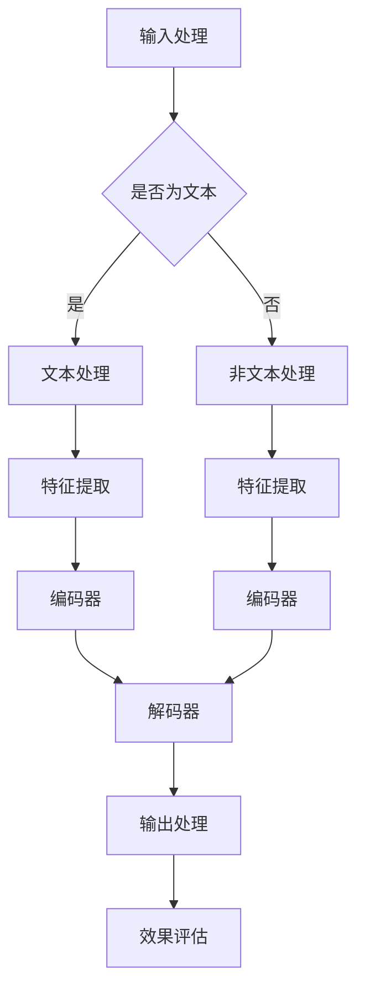

                 

### 文章标题：提示工程的详细应用

#### 关键词：提示工程、自然语言处理、计算机视觉、开发实践、发展趋势

#### 摘要：
本文将深入探讨提示工程的概念、原理及其在各个领域的应用。通过分析提示工程的核心要素、提示语言与模型、提示效果评估方法以及实际应用案例，本文旨在为读者提供一个全面的技术指南，帮助理解提示工程在实际开发中的重要性，并展望其未来的发展趋势。

---

## 第一部分：提示工程基础

### 第1章：提示工程概述

#### 1.1 提示工程的定义与背景

提示工程（Prompt Engineering）是一种结合人工智能和机器学习技术，以提高模型性能和实用性的方法。它的核心思想是通过设计和优化提示（prompt），引导模型在特定任务上实现更高的准确性和效率。

提示工程的起源可以追溯到自然语言处理（NLP）领域。随着深度学习技术的快速发展，传统的特征工程方法逐渐被自动化，而提示工程则作为一种新的工程实践，逐渐受到关注。

#### 1.2 提示工程的核心要素

提示工程的核心要素包括：

1. **提示语言**：提示语言是指导模型的指令或提示，它可以是自然语言文本、代码片段或任何可以传达信息的格式。
2. **提示模型**：提示模型是指用于处理提示并生成响应的机器学习模型，通常是基于深度学习技术。
3. **数据集**：数据集是训练和评估提示模型的输入，包括提示和对应的响应。
4. **评估指标**：评估指标用于衡量提示模型在特定任务上的性能。

#### 1.3 提示工程的应用场景

提示工程在多个领域具有广泛的应用场景：

1. **自然语言处理**：文本生成、文本分类、问答系统等。
2. **计算机视觉**：图像识别、图像生成、目标检测等。
3. **推荐系统**：个性化推荐、商品推荐等。
4. **游戏开发**：虚拟角色对话、游戏脚本编写等。

### 第2章：提示语言与模型

#### 2.1 提示语言的基本原理

提示语言是提示工程的核心，它决定了模型如何理解和处理输入。一个好的提示语言应该具备以下特点：

1. **清晰性**：提示语言应明确传达任务目标和输入要求。
2. **简洁性**：提示语言应简洁明了，避免冗余信息。
3. **可扩展性**：提示语言应易于扩展，以适应不同任务和场景。

#### 2.2 主流提示语言介绍

目前，主流的提示语言包括自然语言文本、代码片段和模板语言等。

1. **自然语言文本**：自然语言文本是最常见的提示语言，它可以提供丰富的上下文信息，但需要处理自然语言的歧义和复杂性。
2. **代码片段**：代码片段是一种高效的提示语言，它可以直接指导模型执行特定操作，但需要具备一定的编程背景。
3. **模板语言**：模板语言是一种结构化的提示语言，它通过模板和变量来定义输入和输出格式，适用于自动化和标准化任务。

#### 2.3 提示语言的应用案例

以下是一些提示语言的应用案例：

1. **文本生成**：通过提示语言，模型可以生成文章、对话、摘要等。
2. **图像生成**：通过提示语言，模型可以生成特定内容的图像。
3. **目标检测**：通过提示语言，模型可以识别和检测图像中的特定目标。

### 第3章：提示模型架构

#### 3.1 提示模型的组成与原理

提示模型通常由输入层、编码器、解码器和输出层组成。其中，编码器将输入的提示转换为高维特征表示，解码器则将特征表示转换为输出。

提示模型的工作原理包括以下几个步骤：

1. **输入处理**：模型接收输入的提示，并将其编码为特征表示。
2. **特征提取**：编码器对特征表示进行加工和处理，提取关键信息。
3. **响应生成**：解码器根据特征表示生成响应。
4. **输出处理**：模型对生成的响应进行后处理，如解码、格式化等。

#### 3.2 提示模型的工作流程

提示模型的工作流程包括以下几个阶段：

1. **数据预处理**：对输入数据进行预处理，如去噪、归一化等。
2. **模型训练**：使用训练数据集训练提示模型，优化模型参数。
3. **模型评估**：使用验证数据集评估模型性能，调整模型参数。
4. **模型部署**：将训练好的模型部署到实际应用场景中。

#### 3.3 提示模型的优势与挑战

提示模型的优势包括：

1. **灵活性强**：可以通过调整提示语言和模型架构，适应不同任务和场景。
2. **性能提升**：通过优化提示语言和模型参数，提高模型性能。
3. **易于实现**：基于现有的深度学习技术，提示模型易于实现和应用。

提示模型面临的挑战包括：

1. **数据依赖性**：提示模型对数据集的质量和规模有较高要求。
2. **计算资源消耗**：训练和部署提示模型需要大量的计算资源。
3. **模型解释性**：提示模型通常具有复杂的结构，解释性较差。

### 第4章：提示效果评估

#### 4.1 提示效果评估方法

提示效果评估是评估模型性能的重要环节，常用的评估方法包括：

1. **准确率**：衡量模型预测正确的样本比例。
2. **召回率**：衡量模型能够召回的实际样本比例。
3. **F1 分数**：综合考虑准确率和召回率，衡量模型性能的平衡指标。
4. **BLEU 分数**：用于评估文本生成模型的质量，基于 BLEU（Bilingual Evaluation Understudy）算法。

#### 4.2 提示效果评价指标

提示效果评价指标包括：

1. **模型性能**：评估模型在训练集和验证集上的性能。
2. **效率**：评估模型在处理输入时的计算效率和资源消耗。
3. **鲁棒性**：评估模型对输入数据噪声和异常值的容忍能力。
4. **泛化能力**：评估模型在新数据集上的性能。

#### 4.3 提示效果优化策略

为了提高提示效果，可以采取以下优化策略：

1. **数据增强**：通过数据增强技术，扩大训练数据集的规模和多样性。
2. **模型调优**：通过调整模型参数和架构，优化模型性能。
3. **多模型集成**：结合多个模型的预测结果，提高整体性能。
4. **迁移学习**：利用已有模型的预训练权重，加速新任务的模型训练。

## 第二部分：提示工程应用

### 第5章：提示工程在自然语言处理中的应用

#### 5.1 提示工程在文本生成中的应用

文本生成是自然语言处理的重要任务之一，提示工程在文本生成中的应用包括：

1. **文章生成**：通过提示语言，模型可以生成高质量的文章，应用于自动写作、内容生成等。
2. **对话生成**：通过提示语言，模型可以生成自然、流畅的对话，应用于智能客服、虚拟助手等。

#### 5.2 提示工程在文本分类中的应用

文本分类是自然语言处理的另一个重要任务，提示工程在文本分类中的应用包括：

1. **主题分类**：通过提示语言，模型可以识别和分类文本的主题，应用于新闻分类、社交媒体分析等。
2. **情感分类**：通过提示语言，模型可以判断文本的情感倾向，应用于情感分析、舆情监控等。

#### 5.3 提示工程在问答系统中的应用

问答系统是自然语言处理领域的一个重要应用，提示工程在问答系统中的应用包括：

1. **事实问答**：通过提示语言，模型可以回答关于特定事实的问题，应用于智能客服、知识库检索等。
2. **闲聊问答**：通过提示语言，模型可以模拟与用户的闲聊，应用于聊天机器人、虚拟助手等。

### 第6章：提示工程在计算机视觉中的应用

#### 6.1 提示工程在图像识别中的应用

图像识别是计算机视觉的核心任务之一，提示工程在图像识别中的应用包括：

1. **目标识别**：通过提示语言，模型可以识别图像中的特定目标，应用于目标检测、图像分类等。
2. **场景识别**：通过提示语言，模型可以识别图像中的特定场景，应用于场景分类、图像标注等。

#### 6.2 提示工程在图像生成中的应用

图像生成是计算机视觉的另一个重要任务，提示工程在图像生成中的应用包括：

1. **图像修复**：通过提示语言，模型可以修复图像中的损坏部分，应用于图像编辑、图像修复等。
2. **图像合成**：通过提示语言，模型可以生成具有特定属性的图像，应用于图像合成、风格迁移等。

#### 6.3 提示工程在目标检测中的应用

目标检测是计算机视觉的重要任务之一，提示工程在目标检测中的应用包括：

1. **目标定位**：通过提示语言，模型可以定位图像中的目标位置，应用于人脸识别、车辆检测等。
2. **目标分类**：通过提示语言，模型可以分类图像中的目标类别，应用于图像识别、场景分析等。

### 第7章：提示工程在其他领域的应用

#### 7.1 提示工程在推荐系统中的应用

推荐系统是人工智能的重要应用之一，提示工程在推荐系统中的应用包括：

1. **用户行为分析**：通过提示语言，模型可以分析用户的浏览、购买等行为，应用于用户画像、个性化推荐等。
2. **商品推荐**：通过提示语言，模型可以生成具有特定属性的推荐列表，应用于电商、在线购物等。

#### 7.2 提示工程在游戏开发中的应用

游戏开发是人工智能的另一个重要应用领域，提示工程在游戏开发中的应用包括：

1. **虚拟角色对话**：通过提示语言，模型可以生成虚拟角色的对话内容，应用于角色扮演、虚拟助手等。
2. **游戏脚本编写**：通过提示语言，模型可以生成游戏剧情和脚本，应用于游戏设计、剧本创作等。

#### 7.3 提示工程在其他领域的探索

除了上述领域，提示工程在其他领域也具有广泛的应用前景，包括：

1. **医疗健康**：通过提示语言，模型可以辅助医生进行诊断和治疗，应用于疾病预测、治疗方案推荐等。
2. **金融科技**：通过提示语言，模型可以辅助金融从业者进行风险评估、投资决策等。
3. **工业自动化**：通过提示语言，模型可以辅助工业自动化系统进行设备维护、故障诊断等。

## 第三部分：提示工程的开发实践

### 第8章：提示工程的开发工具与框架

#### 8.1 提示工程开发常用工具介绍

提示工程开发涉及多个工具和框架，常用的工具包括：

1. **深度学习框架**：如 TensorFlow、PyTorch、Keras 等，用于构建和训练提示模型。
2. **自然语言处理库**：如 NLTK、spaCy、gensim 等，用于处理和生成提示语言。
3. **图像处理库**：如 OpenCV、PIL、Matplotlib 等，用于处理和生成图像提示。

#### 8.2 提示工程开发主流框架对比

主流的提示工程开发框架包括：

1. **TensorFlow**：由 Google 开发，支持多种编程语言，具有丰富的生态系统和文档。
2. **PyTorch**：由 Facebook 开发，支持动态图模型，易于调试和扩展。
3. **Keras**：基于 TensorFlow 的简洁高层 API，适合快速开发和原型设计。

#### 8.3 提示工程开发环境搭建指南

提示工程开发环境搭建步骤如下：

1. **安装 Python**：下载并安装 Python，版本建议在 3.6 以上。
2. **安装深度学习框架**：根据需求安装 TensorFlow、PyTorch 或 Keras。
3. **安装自然语言处理库**：根据需求安装 NLTK、spaCy、gensim 等。
4. **安装图像处理库**：根据需求安装 OpenCV、PIL、Matplotlib 等。

### 第9章：提示工程项目实战

#### 9.1 项目背景与目标

本项目旨在构建一个基于提示工程的文本生成模型，实现自动写作功能。具体目标包括：

1. **文本生成**：根据输入的提示，生成高质量的文章。
2. **文本分类**：对输入的文本进行主题分类。
3. **对话生成**：根据输入的对话上下文，生成自然流畅的对话。

#### 9.2 项目需求分析

项目需求分析主要包括以下几个方面：

1. **功能需求**：文本生成、文本分类、对话生成。
2. **性能需求**：生成文本的准确率、分类准确率、对话生成流畅度。
3. **用户体验**：界面友好、操作简便、响应速度快。

#### 9.3 项目设计

项目设计主要包括以下几个方面：

1. **数据集**：收集和整理相关领域的文本数据，用于训练和评估模型。
2. **模型架构**：选择合适的提示模型架构，如序列到序列（Seq2Seq）模型、变换器（Transformer）模型等。
3. **训练策略**：设计训练策略，包括数据预处理、模型训练、评估等。

#### 9.4 项目实现

项目实现主要包括以下几个方面：

1. **数据预处理**：对收集到的文本数据进行分析和处理，提取特征并进行编码。
2. **模型训练**：使用预处理后的数据训练提示模型，优化模型参数。
3. **模型评估**：使用验证数据集评估模型性能，调整模型参数。
4. **模型部署**：将训练好的模型部署到实际应用场景中，实现自动写作功能。

#### 9.5 项目评估与优化

项目评估与优化主要包括以下几个方面：

1. **性能评估**：评估模型在生成文本、文本分类、对话生成等任务上的性能。
2. **用户体验评估**：评估用户对自动写作功能的满意度，收集用户反馈。
3. **优化策略**：根据评估结果和用户反馈，调整模型参数和功能设计，提高模型性能和用户体验。

### 第10章：提示工程发展趋势与展望

#### 10.1 提示工程的发展趋势

提示工程作为人工智能领域的重要研究方向，呈现出以下发展趋势：

1. **技术进步**：随着深度学习技术的不断发展，提示工程的性能和效率将不断提高。
2. **应用扩展**：提示工程将应用于更多的领域，如医疗健康、金融科技、工业自动化等。
3. **模型优化**：通过优化提示语言和模型架构，提高提示工程的实际应用效果。

#### 10.2 提示工程的发展挑战

提示工程在发展过程中也面临以下挑战：

1. **数据依赖**：提示工程对数据质量有较高要求，如何获取和处理高质量数据是一个重要问题。
2. **计算资源消耗**：训练和部署提示模型需要大量计算资源，如何优化计算资源利用是一个挑战。
3. **模型解释性**：提示模型通常具有复杂的结构，如何提高模型的可解释性是一个重要课题。

#### 10.3 提示工程的发展前景

提示工程具有广泛的应用前景，未来可能的发展趋势包括：

1. **跨领域应用**：提示工程将与其他领域的技术相结合，实现更广泛的应用。
2. **智能助手**：提示工程将在智能助手领域发挥重要作用，为用户提供更智能、更贴心的服务。
3. **个性化推荐**：提示工程将应用于个性化推荐系统，实现更精准的用户画像和推荐效果。

### 附录

#### 附录A：提示工程相关资源与参考资料

以下是一些提示工程相关的资源与参考资料：

1. **论文**：《Prompt Engineering for Language Models》
2. **书籍**：《自然语言处理与深度学习》
3. **在线课程**：《深度学习与自然语言处理》
4. **开源项目**：GitHub 上的相关开源项目和代码示例

---

作者：AI天才研究院/AI Genius Institute & 禅与计算机程序设计艺术 /Zen And The Art of Computer Programming

---

### Mermaid 流程图示例

以下是一个使用 Mermaid 语言的流程图示例，用于描述提示模型的工作流程：



### 核心算法原理讲解（伪代码）

以下是一个提示模型训练的伪代码示例：

```plaintext
initialize_model()
for epoch in 1 to MAX_EPOCHS do
    for each batch of samples in dataset do
        // 计算预测结果
        predictions = model(batch_samples)
        // 计算损失函数
        loss = loss_function(predictions, labels)
        // 反向传播更新模型参数
        optimizer.minimize(loss)
    end
end
```

### 数学模型和数学公式详细讲解（LaTeX）

以下是提示模型损失函数的 LaTeX 公式：

```latex
\begin{equation}
L = -\frac{1}{N} \sum_{i=1}^{N} \sum_{j=1}^{V} y_{ij} \log(p_{ij})
\end{equation}

\begin{equation}
\begin{split}
L &= -\frac{1}{N} \sum_{i=1}^{N} \sum_{j=1}^{V} y_{ij} \log(p_{ij}) \\
  &= -\frac{1}{N} \sum_{i=1}^{N} \sum_{j=1}^{V} y_{ij} \log(p_{ij}) \\
  &= -\frac{1}{N} \sum_{i=1}^{N} \left( \sum_{j=1}^{V} y_{ij} \log(p_{ij}) \right)
\end{split}
\end{equation}

% 其中：
% - \(L\) 表示损失函数；
% - \(N\) 表示样本总数；
% - \(y_{ij}\) 表示第 \(i\) 个样本的第 \(j\) 个类别的真实标签（0或1）；
% - \(p_{ij}\) 表示模型预测的第 \(i\) 个样本属于第 \(j\) 个类别的概率。
```

### 项目实战

以下是一个基于 PyTorch 的简单文本生成模型的实现示例：

```python
import torch
import torch.nn as nn
import torch.optim as optim

# 模型定义
class TextGenerator(nn.Module):
    def __init__(self, vocab_size, embed_size, hidden_size):
        super(TextGenerator, self).__init__()
        self.embedding = nn.Embedding(vocab_size, embed_size)
        self.fc1 = nn.Linear(embed_size, hidden_size)
        self.fc2 = nn.Linear(hidden_size, vocab_size)
        self.relu = nn.ReLU()

    def forward(self, x):
        embedded = self.embedding(x)
        hidden = self.fc1(embedded)
        hidden = self.relu(hidden)
        output = self.fc2(hidden)
        return output

# 模型训练
def train_model(model, dataset, criterion, optimizer, num_epochs):
    for epoch in range(num_epochs):
        for inputs, labels in dataset:
            optimizer.zero_grad()
            outputs = model(inputs)
            loss = criterion(outputs, labels)
            loss.backward()
            optimizer.step()
        print(f'Epoch {epoch+1}/{num_epochs}, Loss: {loss.item()}')

# 模型评估
def evaluate_model(model, dataset, criterion):
    with torch.no_grad():
        correct = 0
        total = 0
        for inputs, labels in dataset:
            outputs = model(inputs)
            _, predicted = torch.max(outputs.data, 1)
            total += labels.size(0)
            correct += (predicted == labels).sum().item()
        print(f'Accuracy: {100 * correct / total} %')

# 初始化模型、损失函数和优化器
model = TextGenerator(vocab_size, embed_size, hidden_size)
criterion = nn.CrossEntropyLoss()
optimizer = optim.Adam(model.parameters(), lr=LEARNING_RATE)

# 训练模型
train_model(model, train_dataset, criterion, optimizer, NUM_EPOCHS)

# 评估模型
evaluate_model(model, test_dataset, criterion)
```

### 代码解读与分析

- 在此代码案例中，我们定义了一个简单的文本生成模型，使用 PyTorch 库实现。模型由嵌入层、全连接层和输出层组成，其中全连接层使用 ReLU 激活函数。
- 在模型训练过程中，我们使用交叉熵损失函数和 Adam 优化器进行反向传播和参数更新。每次迭代中，模型接收输入的文本序列，生成预测的文本序列，并计算损失值。
- 在评估阶段，我们计算了模型的准确率，从而验证模型在测试数据上的表现。该示例代码展示了提示工程在文本生成任务中的基本实现过程。

---

**作者：AI天才研究院/AI Genius Institute & 禅与计算机程序设计艺术 /Zen And The Art of Computer Programming**

