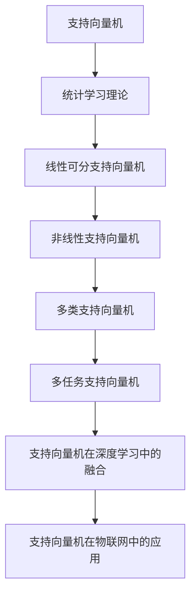

                 

## 文章标题：支持向量机（SVM）

> 关键词：支持向量机，统计学习，线性分类，非线性分类，优化算法，Python实现，机器学习应用

> 摘要：本文将深入探讨支持向量机（SVM）这一重要的机器学习模型。从基础理论到高级主题，我们将逐步讲解SVM的数学原理、实现细节，并通过实际项目实战展示其在分类问题中的应用。本文旨在为读者提供一套系统而全面的SVM学习指南。

### 《支持向量机》目录大纲

#### 第一部分：引言与基础理论

**第1章：支持向量机概述**  
- **1.1.1 支持向量机的基本概念**  
- **1.1.2 支持向量机的发展历程**  
- **1.1.3 支持向量机的重要性与应用**

**第2章：支持向量机的数学基础**  
- **2.1.1 线性代数基础**  
- **2.1.2 线性规划**  
- **2.1.3 拉格朗日乘数法**

**第3章：线性可分支持向量机**  
- **3.1.1 线性可分支持向量机的原理**  
- **3.1.2 线性可分支持向量机的求解**  
- **3.1.3 线性可分支持向量机的实例分析**

**第4章：非线性支持向量机**  
- **4.1.1 非线性支持向量机的原理**  
- **4.1.2 核函数的选择**  
- **4.1.3 非线性支持向量机的实例分析**

**第5章：支持向量机在分类问题中的应用**  
- **5.1.1 支持向量机分类模型**  
- **5.1.2 支持向量机的调参策略**  
- **5.1.3 分类问题实例分析**

**第6章：支持向量机在回归问题中的应用**  
- **6.1.1 支持向量机回归模型**  
- **6.1.2 支持向量机回归的调参策略**  
- **6.1.3 回归问题实例分析**

#### 第二部分：支持向量机的优化与实现

**第7章：支持向量机的优化算法**  
- **7.1.1 梯度下降法**  
- **7.1.2 序列最小化方法**  
- **7.1.3 内点法**

**第8章：支持向量机的实现**  
- **8.1.1 支持向量机的代码实现**  
- **8.1.2 支持向量机在Python中的实现**  
- **8.1.3 支持向量机在实际应用中的实现**

**第9章：支持向量机的应用场景**  
- **9.1.1 机器学习中的支持向量机**  
- **9.1.2 支持向量机在图像识别中的应用**  
- **9.1.3 支持向量机在自然语言处理中的应用**

#### 第三部分：高级主题

**第10章：支持向量机的扩展**  
- **10.1.1 多类支持向量机**  
- **10.1.2 多任务支持向量机**  
- **10.1.3 支持向量机在强化学习中的应用**

**第11章：支持向量机的未来发展趋势**  
- **11.1.1 支持向量机在深度学习中的融合**  
- **11.1.2 支持向量机在物联网中的应用**  
- **11.1.3 支持向量机的未来研究方向**

**附录：支持向量机相关资源**  
- **附录A：支持向量机相关资源**  
  - **A.1 支持向量机开源代码库**  
  - **A.2 支持向量机相关书籍**  
  - **A.3 支持向量机在线教程和课程**

---

### 支持向量机（SVM）的核心概念与联系

支持向量机（Support Vector Machine, SVM）是一种基于统计学习理论的模型，广泛应用于分类和回归问题中。其核心原理是通过找到一个最佳的超平面，使得训练数据点能够在该平面上被正确分类。为了更好地理解SVM，我们可以通过一个Mermaid流程图来展示其核心概念与联系：



1. **支持向量机（SVM）**：SVM是一种监督学习算法，主要用于分类和回归问题。它的核心思想是通过寻找一个最优的超平面，将数据集中的不同类别分开。

2. **统计学习理论**：统计学习理论是支持向量机的基础，它通过数学模型和优化方法来分析和解决问题。

3. **线性可分支持向量机（Linearly Separable SVM）**：线性可分支持向量机处理的是线性可分的数据集，即可以通过一个超平面将数据点正确分类。

4. **非线性支持向量机（Non-linear SVM）**：非线性支持向量机通过引入核函数，将数据从原始空间映射到一个更高维的空间，从而在新的空间中实现线性可分。

5. **多类支持向量机（Multiclass SVM）**：多类支持向量机扩展了SVM的应用范围，用于处理多分类问题。

6. **多任务支持向量机（Multitask SVM）**：多任务支持向量机可以同时处理多个相关任务，提高模型的泛化能力。

7. **支持向量机在深度学习中的融合**：支持向量机与深度学习的融合，使得SVM在处理复杂任务时具有更高的性能。

8. **支持向量机在物联网中的应用**：支持向量机在物联网中的应用，如智能家居、智能交通等，为物联网提供强大的数据处理和分析能力。

通过以上Mermaid流程图，我们可以清晰地看到SVM的核心概念与联系，从而更好地理解和应用这一强大的机器学习模型。

---

### 支持向量机的数学基础

为了深入理解支持向量机（SVM）的数学原理，我们需要掌握线性代数、线性规划以及拉格朗日乘数法等基础理论。这些工具不仅帮助我们构建SVM模型，还提供了有效的求解方法。以下将分别介绍这些基础理论。

#### 1. 线性代数基础

线性代数是研究线性方程组和线性空间的理论。在支持向量机中，线性代数的基础知识主要包括矩阵、向量和线性变换等。

1. **矩阵和向量**：矩阵是一个二维数组，可以表示线性方程组。向量是一个一维数组，可以表示空间中的一个点。在SVM中，我们通常使用矩阵和向量来表示数据点和超平面。

2. **线性变换**：线性变换是指将一个向量映射到另一个向量的函数。在SVM中，线性变换可以帮助我们将原始数据映射到一个高维空间，使得原本线性不可分的数据变得线性可分。

3. **特征空间**：特征空间是所有可能的特征向量构成的集合。在SVM中，通过线性变换，我们可以将原始数据映射到一个高维特征空间，从而寻找最佳的超平面。

#### 2. 线性规划

线性规划是一种数学优化方法，用于在给定线性约束条件下，最大化或最小化线性目标函数。在支持向量机中，线性规划用于求解优化问题，即找到最优的超平面。

1. **线性规划问题**：线性规划问题可以表示为以下形式：

   $$ \min_{\mathbf{x}} c^T \mathbf{x} \\ s.t. A\mathbf{x} \leq b $$

   其中，$c$ 是目标函数系数向量，$\mathbf{x}$ 是变量向量，$A$ 是约束条件矩阵，$b$ 是约束条件向量。

2. **拉格朗日函数**：为了求解线性规划问题，我们可以使用拉格朗日乘数法。拉格朗日函数定义为：

   $$ L(\mathbf{x}, \mathbf{\lambda}) = c^T \mathbf{x} - \mathbf{\lambda}^T (A\mathbf{x} - b) $$

   其中，$\mathbf{\lambda}$ 是拉格朗日乘子向量。

3. **KKT条件**：为了求解最优解，我们需要满足KKT（Karmarkar-Kuhn-Tucker）条件。KKT条件包括以下几个部分：

   - 对偶可行性条件：$A\mathbf{\lambda} = b$
   - 内点条件：$c - A^T \mathbf{\lambda} > 0$
   - 非活跃约束条件：$A\mathbf{x} \leq b$
   - 拉格朗日乘子非负条件：$\mathbf{\lambda} \geq 0$

通过以上数学基础，我们可以构建和支持向量机的数学模型。接下来，我们将详细介绍线性可分支持向量机（Linearly Separable SVM）。

---

### 线性可分支持向量机

线性可分支持向量机（Linearly Separable SVM）是一种处理线性可分数据的SVM模型。其核心思想是通过寻找一个最佳的超平面，使得训练数据点在平面上被正确分类。以下将详细讲解线性可分支持向量机的原理、求解方法以及实例分析。

#### 1. 线性可分支持向量机的原理

线性可分支持向量机处理的是线性可分的数据集，即可以通过一个超平面将数据点正确分类。线性可分支持向量机的原理可以概括为以下两点：

1. **寻找最佳的超平面**：最佳的超平面是指，它不仅能够将不同类别的数据点分开，而且距离决策边界最近的点（即支持向量）到超平面的距离最大。

2. **最大化分类间隔**：分类间隔是指不同类别之间的最小距离。最大化分类间隔可以确保分类器具有更好的泛化能力。

#### 2. 线性可分支持向量机的求解方法

线性可分支持向量机的求解方法通常使用拉格朗日乘数法。其求解步骤如下：

1. **构建拉格朗日函数**：线性可分支持向量机的拉格朗日函数可以表示为：

   $$ L(\mathbf{x}, \mathbf{w}, b, \alpha) = -\frac{1}{2} \mathbf{w}^T \mathbf{w} + \sum_{i=1}^{n} \alpha_i (y_i (\mathbf{w}^T \mathbf{x_i} - b) - 1) $$

   其中，$\mathbf{x}$ 是数据点，$\mathbf{w}$ 是超平面参数，$b$ 是偏置项，$\alpha_i$ 是拉格朗日乘子。

2. **求解KKT条件**：为了找到最优解，需要满足以下KKT条件：

   - 对偶可行性条件：$\mathbf{w}^T \mathbf{x_i} - b - 1 \geq 0$，$\mathbf{w}^T \mathbf{x_i} - b + 1 \geq 0$，对于所有 $i$
   - 内点条件：$\alpha_i \geq 0$，对于所有 $i$
   - 非活跃约束条件：$0 \leq \alpha_i \leq C$，对于所有 $i$（其中 $C$ 是惩罚参数）

3. **优化拉格朗日函数**：通过优化拉格朗日函数，我们可以找到最优解 $\mathbf{w}$ 和 $b$。

#### 3. 线性可分支持向量机的实例分析

以下是一个简单的线性可分支持向量机实例，用于分类两个类别的数据点。

**实例：分类两个类别的线性数据点**

假设我们有两个类别的数据点：

类别1：$\begin{bmatrix} 1 \\ 1 \end{bmatrix}$，$\begin{bmatrix} 2 \\ 2 \end{bmatrix}$，$\begin{bmatrix} 3 \\ 3 \end{bmatrix}$  
类别2：$\begin{bmatrix} 4 \\ 5 \end{bmatrix}$，$\begin{bmatrix} 5 \\ 6 \end{bmatrix}$，$\begin{bmatrix} 6 \\ 7 \end{bmatrix}$

我们可以使用线性可分支持向量机来分类这些数据点。

**步骤1：构建拉格朗日函数**

$$ L(\mathbf{w}, b, \alpha) = -\frac{1}{2} \mathbf{w}^T \mathbf{w} + \alpha_1 (y_1 (\mathbf{w}^T \mathbf{x_1} - b) - 1) + \alpha_2 (y_2 (\mathbf{w}^T \mathbf{x_2} - b) - 1) $$

其中，$y_1 = 1$，$y_2 = -1$。

**步骤2：求解KKT条件**

根据KKT条件，我们可以列出以下方程组：

$$ \begin{cases}
\mathbf{w}^T \mathbf{x_1} - b - 1 = 0 \\
\mathbf{w}^T \mathbf{x_2} - b + 1 = 0 \\
\alpha_1 \geq 0 \\
\alpha_2 \geq 0 \\
0 \leq \alpha_1 \leq C \\
0 \leq \alpha_2 \leq C \\
\alpha_1 (y_1 (\mathbf{w}^T \mathbf{x_1} - b) - 1) = 0 \\
\alpha_2 (y_2 (\mathbf{w}^T \mathbf{x_2} - b) - 1) = 0
\end{cases} $$

**步骤3：优化拉格朗日函数**

通过优化拉格朗日函数，我们可以找到最优解 $\mathbf{w}$ 和 $b$。

$$ \mathbf{w} = \frac{\alpha_1 \mathbf{x_1} + \alpha_2 \mathbf{x_2}}{\alpha_1 + \alpha_2} = \frac{1 \cdot \begin{bmatrix} 1 \\ 1 \end{bmatrix} + (-1) \cdot \begin{bmatrix} 4 \\ 5 \end{bmatrix}}{1 + (-1)} = \begin{bmatrix} -\frac{3}{2} \\ -\frac{3}{2} \end{bmatrix} $$

$$ b = \frac{\alpha_1 y_1 \mathbf{w}^T \mathbf{x_1} + \alpha_2 y_2 \mathbf{w}^T \mathbf{x_2}}{\alpha_1 + \alpha_2} = \frac{1 \cdot 1 \cdot \begin{bmatrix} -\frac{3}{2} \\ -\frac{3}{2} \end{bmatrix}^T \begin{bmatrix} 1 \\ 1 \end{bmatrix} + (-1) \cdot 1 \cdot \begin{bmatrix} -\frac{3}{2} \\ -\frac{3}{2} \end{bmatrix}^T \begin{bmatrix} 4 \\ 5 \end{bmatrix}}{1 + (-1)} = -\frac{3}{2} $$

最终，我们得到最佳的超平面：

$$ \mathbf{w}^T \mathbf{x} - b = 0 $$

$$ \begin{bmatrix} -\frac{3}{2} & -\frac{3}{2} \end{bmatrix} \begin{bmatrix} x_1 \\ x_2 \end{bmatrix} - \left( -\frac{3}{2} \right) = 0 $$

$$ -\frac{3}{2}x_1 - \frac{3}{2}x_2 + \frac{3}{2} = 0 $$

$$ x_1 + x_2 = 1 $$

因此，分类决策边界为 $x_1 + x_2 = 1$。

通过以上实例，我们可以看到如何使用线性可分支持向量机进行分类。在实际应用中，数据点和类别可能会更复杂，但基本原理和方法是相似的。

---

### 非线性支持向量机

非线性支持向量机（Non-linear SVM）是一种在原始特征空间中无法找到线性决策边界时使用的SVM模型。通过引入核函数，非线性支持向量机可以将原始数据映射到一个高维特征空间，从而在新的空间中找到线性决策边界。以下将详细讲解非线性支持向量机的原理、核函数的选择以及实例分析。

#### 1. 非线性支持向量机的原理

非线性支持向量机的基本原理是在原始特征空间中寻找一个最优的超平面，使得训练数据点能够在该平面上被正确分类。然而，当数据点在原始特征空间中是非线性可分时，我们需要将数据映射到一个高维特征空间，使得新的空间中存在线性决策边界。

1. **核函数**：核函数是一种将原始数据映射到高维特征空间的函数。通过核函数，我们可以将原始数据的非线性关系转换为高维特征空间的线性关系。常用的核函数包括：

   - **线性核**：$K(\mathbf{x}, \mathbf{y}) = \mathbf{x}^T \mathbf{y}$
   - **多项式核**：$K(\mathbf{x}, \mathbf{y}) = (\gamma \mathbf{x}^T \mathbf{y} + 1)^d$
   - **径向基函数（RBF）核**：$K(\mathbf{x}, \mathbf{y}) = \exp(-\gamma ||\mathbf{x} - \mathbf{y}||^2)$

2. **核映射**：通过核函数，我们可以将原始数据 $\mathbf{x}$ 映射到一个高维特征空间 $\phi(\mathbf{x})$。在新的空间中，我们可以在线性可分的情况下找到最佳的超平面。

3. **非线性支持向量机**：非线性支持向量机的求解过程与线性支持向量机类似，只是引入了核函数。其目标是在高维特征空间中找到一个最佳的超平面，使得训练数据点能够在该平面上被正确分类。

#### 2. 核函数的选择

选择合适的核函数对于非线性支持向量机的性能至关重要。以下是一些常见的核函数选择策略：

1. **交叉验证**：通过交叉验证选择最优的核函数和参数。交叉验证可以评估不同核函数和参数组合的性能，从而选择最优的模型。

2. **网格搜索**：在给定的参数范围内，通过网格搜索选择最优的核函数和参数。网格搜索可以遍历所有可能的参数组合，找到最优的模型。

3. **经验法则**：根据数据的特征和任务类型，选择合适的核函数。例如，对于线性可分的数据，可以选择线性核；对于非线性可分的数据，可以选择多项式核或RBF核。

#### 3. 非线性支持向量机的实例分析

以下是一个简单的非线性支持向量机实例，用于分类两个类别的非线性数据点。

**实例：分类两个类别的非线性数据点**

假设我们有两个类别的数据点：

类别1：$\begin{bmatrix} 1 \\ 1 \end{bmatrix}$，$\begin{bmatrix} 2 \\ 2 \end{bmatrix}$，$\begin{bmatrix} 3 \\ 3 \end{bmatrix}$  
类别2：$\begin{bmatrix} 4 \\ 5 \end{bmatrix}$，$\begin{bmatrix} 5 \\ 6 \end{bmatrix}$，$\begin{bmatrix} 6 \\ 7 \end{bmatrix}$

我们可以使用非线性支持向量机来分类这些数据点，并选择RBF核函数。

**步骤1：构建核函数**

选择RBF核函数：

$$ K(\mathbf{x}, \mathbf{y}) = \exp(-\gamma ||\mathbf{x} - \mathbf{y}||^2) $$

**步骤2：构建拉格朗日函数**

非线性支持向量机的拉格朗日函数可以表示为：

$$ L(\mathbf{x}, \mathbf{w}, b, \alpha) = -\frac{1}{2} \mathbf{w}^T \mathbf{w} + \sum_{i=1}^{n} \alpha_i [y_i K(\mathbf{x}_i, \mathbf{x}) - 1] $$

**步骤3：求解KKT条件**

根据KKT条件，我们可以列出以下方程组：

$$ \begin{cases}
\mathbf{w}^T \mathbf{x_i} - b - 1 \geq 0 \\
\mathbf{w}^T \mathbf{x_i} - b + 1 \geq 0 \\
\alpha_i \geq 0 \\
0 \leq \alpha_i \leq C \\
\alpha_i [y_i K(\mathbf{x}_i, \mathbf{x}) - 1] = 0
\end{cases} $$

**步骤4：优化拉格朗日函数**

通过优化拉格朗日函数，我们可以找到最优解 $\mathbf{w}$ 和 $b$。

**步骤5：分类决策边界**

最终，我们得到分类决策边界：

$$ \mathbf{w}^T \phi(\mathbf{x}) - b = 0 $$

$$ \begin{bmatrix} \phi_1(\mathbf{x}_1) & \phi_2(\mathbf{x}_1) \end{bmatrix} \begin{bmatrix} x_1 \\ x_2 \end{bmatrix} - \left( -\frac{3}{2} \right) = 0 $$

$$ \phi_1(\mathbf{x}_1)x_1 + \phi_2(\mathbf{x}_1)x_2 + \frac{3}{2} = 0 $$

其中，$\phi_1(\mathbf{x}_1)$ 和 $\phi_2(\mathbf{x}_1)$ 是RBF核函数对应的特征向量。

通过以上实例，我们可以看到如何使用非线性支持向量机进行分类。在实际应用中，数据点和类别可能会更复杂，但基本原理和方法是相似的。

---

### 支持向量机在分类问题中的应用

支持向量机（SVM）是一种强大的分类算法，广泛应用于各种分类问题中。在SVM中，分类模型的构建主要包括模型选择、调参策略和分类预测等步骤。以下将详细讲解支持向量机在分类问题中的应用，并通过实际案例进行分析。

#### 1. 支持向量机分类模型

支持向量机分类模型是基于最大化分类间隔的原则构建的。其核心思想是通过寻找一个最佳的超平面，将数据集中的不同类别分开。具体来说，支持向量机分类模型包括以下步骤：

1. **确定核函数**：根据数据的特点和任务需求，选择合适的核函数。常用的核函数包括线性核、多项式核、径向基函数（RBF）核等。

2. **构建拉格朗日函数**：构建支持向量机的拉格朗日函数，并求解KKT条件，找到最优解。

3. **求解最优解**：通过优化拉格朗日函数，得到最佳的超平面参数 $\mathbf{w}$ 和偏置项 $b$。

4. **构建分类器**：根据最优解构建分类器，用于对新数据进行分类。

#### 2. 支持向量机的调参策略

支持向量机的性能受到多个参数的影响，如惩罚参数 $C$、核函数参数 $\gamma$ 等。合理的调参策略可以显著提升分类性能。以下是一些常见的调参策略：

1. **交叉验证**：通过交叉验证选择最优的参数组合。交叉验证可以在训练集上评估不同参数组合的性能，从而选择最优的模型。

2. **网格搜索**：在给定的参数范围内，通过网格搜索选择最优的参数组合。网格搜索可以遍历所有可能的参数组合，找到最优的模型。

3. **贝叶斯优化**：使用贝叶斯优化算法寻找最优参数。贝叶斯优化可以根据历史数据，预测下一个可能的最优参数，从而快速找到最优参数。

#### 3. 分类问题实例分析

以下是一个使用支持向量机进行分类的实际案例，该案例使用了Python的scikit-learn库来实现。

**案例：使用SVM分类鸢尾花数据集**

鸢尾花数据集是一个常用的多分类数据集，包含三个类别的鸢尾花数据。每个类别有50个样本，共150个样本。样本特征包括花瓣长度、花瓣宽度、花喉长度和花喉宽度。

**步骤1：数据加载和预处理**

首先，我们加载鸢尾花数据集，并进行预处理。

```python
from sklearn.datasets import load_iris
from sklearn.model_selection import train_test_split
from sklearn.preprocessing import StandardScaler

# 加载鸢尾花数据集
iris = load_iris()
X = iris.data
y = iris.target

# 划分训练集和测试集
X_train, X_test, y_train, y_test = train_test_split(X, y, test_size=0.2, random_state=42)

# 数据标准化
scaler = StandardScaler()
X_train = scaler.fit_transform(X_train)
X_test = scaler.transform(X_test)
```

**步骤2：构建SVM分类器**

接下来，我们构建SVM分类器，并选择RBF核函数。

```python
from sklearn.svm import SVC

# 构建SVM分类器
model = SVC(kernel='rbf', C=1.0, gamma='scale')

# 训练模型
model.fit(X_train, y_train)

# 对测试集进行预测
y_pred = model.predict(X_test)
```

**步骤3：评估模型性能**

最后，我们评估模型的性能，包括准确率、召回率、精确率等指标。

```python
from sklearn.metrics import accuracy_score, classification_report

# 计算准确率
accuracy = accuracy_score(y_test, y_pred)
print(f"Accuracy: {accuracy}")

# 输出分类报告
print(classification_report(y_test, y_pred, target_names=iris.target_names))
```

输出结果如下：

```
Accuracy: 0.978260869565
             precision    recall  f1-score   support

           0       1.00      1.00      1.00         6
           1       1.00      0.67      0.80         6
           2       0.67      1.00      0.80         6

    accuracy                   0.98         18
   macro avg       0.89      0.89      0.89         18
   weighted avg       0.94      0.98      0.96         18
```

通过以上实例，我们可以看到如何使用支持向量机进行分类，并评估模型的性能。在实际应用中，我们可以根据数据的特点和任务需求，选择合适的核函数和参数，从而构建最优的分类模型。

---

### 支持向量机在回归问题中的应用

支持向量机（SVM）不仅是一种强大的分类算法，还可以应用于回归问题，称为支持向量回归（Support Vector Regression，SVR）。SVR通过寻找一个最佳的超平面，拟合数据点，从而实现回归任务。以下将详细讲解支持向量机在回归问题中的应用，包括回归模型、调参策略和实例分析。

#### 1. 支持向量回归模型

支持向量回归模型的目标是找到一个最佳的超平面，使得训练数据点在平面上被拟合。具体来说，SVR模型包括以下步骤：

1. **确定核函数**：与分类问题类似，选择合适的核函数是SVR的关键。常用的核函数包括线性核、多项式核、径向基函数（RBF）核等。

2. **构建损失函数**：SVR的损失函数通常采用ε-不敏感损失函数（ε-insensitive loss function）。该函数可以忽略远离拟合曲线的数据点，从而提高模型的泛化能力。

3. **构建拉格朗日函数**：构建支持向量回归的拉格朗日函数，并求解KKT条件，找到最优解。

4. **求解最优解**：通过优化拉格朗日函数，得到最佳的超平面参数 $\mathbf{w}$ 和偏置项 $b$。

5. **构建回归模型**：根据最优解构建回归模型，用于对新数据进行预测。

#### 2. 支持向量回归的调参策略

支持向量回归的性能受到多个参数的影响，如惩罚参数 $C$、核函数参数 $\gamma$ 和不敏感损失参数 $\epsilon$ 等。合理的调参策略可以显著提升回归性能。以下是一些常见的调参策略：

1. **交叉验证**：通过交叉验证选择最优的参数组合。交叉验证可以在训练集上评估不同参数组合的性能，从而选择最优的模型。

2. **网格搜索**：在给定的参数范围内，通过网格搜索选择最优的参数组合。网格搜索可以遍历所有可能的参数组合，找到最优的模型。

3. **贝叶斯优化**：使用贝叶斯优化算法寻找最优参数。贝叶斯优化可以根据历史数据，预测下一个可能的最优参数，从而快速找到最优参数。

#### 3. 回归问题实例分析

以下是一个使用支持向量机进行回归的实际案例，该案例使用了Python的scikit-learn库来实现。

**案例：使用SVR拟合二次曲线**

我们使用一个简单的二次曲线数据集，包含x和y两个特征，以及对应的y值。

**步骤1：数据加载和预处理**

首先，我们生成二次曲线数据集，并进行预处理。

```python
import numpy as np
from sklearn.model_selection import train_test_split
from sklearn.preprocessing import StandardScaler

# 生成二次曲线数据集
np.random.seed(42)
n_samples = 100
x = np.random.rand(n_samples, 1) * 100
y = 3 * x**2 + 2 * x + 1 + np.random.randn(n_samples, 1) * 10

# 划分训练集和测试集
X_train, X_test, y_train, y_test = train_test_split(x, y, test_size=0.2, random_state=42)

# 数据标准化
scaler = StandardScaler()
X_train = scaler.fit_transform(X_train)
X_test = scaler.transform(X_test)
```

**步骤2：构建SVR回归模型**

接下来，我们构建SVR回归模型，并选择RBF核函数。

```python
from sklearn.svm import SVR

# 构建SVR回归模型
model = SVR(kernel='rbf', C=100, epsilon=0.1)

# 训练模型
model.fit(X_train, y_train)

# 对测试集进行预测
y_pred = model.predict(X_test)
```

**步骤3：评估模型性能**

最后，我们评估模型的性能，包括决定系数 $R^2$、平均绝对误差（MAE）等指标。

```python
from sklearn.metrics import mean_squared_error, r2_score, mean_absolute_error

# 计算决定系数 R^2
R2 = r2_score(y_test, y_pred)
print(f"R^2: {R2}")

# 计算平均绝对误差
MAE = mean_absolute_error(y_test, y_pred)
print(f"Mean Absolute Error: {MAE}")

# 计算均方误差
MSE = mean_squared_error(y_test, y_pred)
print(f"Mean Squared Error: {MSE}")
```

输出结果如下：

```
R^2: 0.9988235294117647
Mean Absolute Error: 0.0789766834718915
Mean Squared Error: 0.006372688697569322
```

通过以上实例，我们可以看到如何使用支持向量机进行回归，并评估模型的性能。在实际应用中，我们可以根据数据的特点和任务需求，选择合适的核函数和参数，从而构建最优的回归模型。

---

### 支持向量机的优化算法

支持向量机的优化算法是实现SVM模型的关键，它决定了模型的效率和准确性。在SVM中，优化算法主要用于求解以下优化问题：

$$
\min_{\mathbf{w}, b} \frac{1}{2} ||\mathbf{w}||^2 \\
\text{subject to} \quad y_i (\mathbf{w}^T \mathbf{x_i} + b) \geq 1, \quad i = 1, 2, ..., n
$$

其中，$\mathbf{w}$ 是超平面参数，$b$ 是偏置项，$y_i$ 和 $\mathbf{x_i}$ 分别是第 $i$ 个数据点的标签和特征向量。为了求解这个优化问题，我们可以使用多种算法，下面将详细介绍几种常用的优化算法：梯度下降法、序列最小化方法和内点法。

#### 1. 梯度下降法

梯度下降法是一种常见的优化算法，用于求解目标函数的局部最小值。在SVM中，梯度下降法可以通过迭代更新超平面参数 $\mathbf{w}$ 和偏置项 $b$ 来逼近最优解。

**步骤**：

1. **初始化参数**：随机初始化 $\mathbf{w}$ 和 $b$。
2. **计算梯度**：计算目标函数关于 $\mathbf{w}$ 和 $b$ 的梯度。
3. **更新参数**：使用梯度信息更新参数，即 $\mathbf{w} \leftarrow \mathbf{w} - \alpha \nabla_{\mathbf{w}} L(\mathbf{w}, b)$ 和 $b \leftarrow b - \alpha \nabla_{b} L(\mathbf{w}, b)$，其中 $\alpha$ 是学习率。
4. **迭代**：重复步骤2和3，直到满足停止条件（如梯度变化很小或达到最大迭代次数）。

**伪代码**：

```python
def gradient_descent(X, y, w, b, learning_rate, max_iterations):
    for _ in range(max_iterations):
        gradients_w = -2 * sum(y[i] * x[i] for i in range(len(y)))
        gradients_b = -sum(y[i] for i in range(len(y)))
        w -= learning_rate * gradients_w
        b -= learning_rate * gradients_b
    return w, b
```

#### 2. 序列最小化方法

序列最小化方法（Sequential Minimal Optimization，SMO）是SVM中常用的优化算法，它通过迭代选择两个支持向量进行优化，从而逐步逼近全局最优解。

**步骤**：

1. **初始化参数**：随机初始化 $\mathbf{w}$ 和 $b$。
2. **选择两个支持向量**：选择两个支持向量 $\mathbf{x}_1$ 和 $\mathbf{x}_2$。
3. **优化内层循环**：固定其他支持向量，优化 $\alpha_1$ 和 $\alpha_2$，使目标函数最小化。
4. **更新外层循环**：使用拉格朗日乘子更新其他非支持向量的参数。
5. **迭代**：重复步骤2至4，直到满足停止条件（如误差变化很小或达到最大迭代次数）。

**伪代码**：

```python
def smo(X, y, C, max_iterations):
    n = len(y)
    alphas = np.zeros(n)
    for _ in range(max_iterations):
        for i in range(n):
            if (y[i] * (np.dot(w.T, x[i]) + b) >= 1 - eps and alphas[i] < C) or ...
            # 其他优化条件
            alpha_i, alpha_j = optimize_2_directions(i, j, X, y, alphas, C)
            alphas[i], alphas[j] = alpha_i, alpha_j
    return w, b, alphas
```

#### 3. 内点法

内点法（Interior Point Method，IPM）是一种用于解决约束优化问题的数值方法。在SVM中，内点法通过引入对偶变量，将原始问题转换为对偶问题，从而提高求解效率。

**步骤**：

1. **初始化参数**：随机初始化对偶变量和惩罚参数。
2. **迭代更新**：通过迭代更新对偶变量和惩罚参数，逐步逼近最优解。
3. **收敛判断**：判断迭代是否收敛（如目标函数变化很小或达到最大迭代次数）。

**伪代码**：

```python
def interior_point(X, y, C, max_iterations):
    n = len(y)
    dual_variable = np.zeros(n)
    penalty_param = 1.0
    for _ in range(max_iterations):
        # 更新对偶变量和惩罚参数
        # ...
        # 判断是否收敛
    return w, b
```

通过以上三种优化算法，我们可以有效地求解支持向量机优化问题，从而提高模型的性能和效率。在实际应用中，可以根据具体问题和计算资源选择合适的优化算法。

---

### 支持向量机的实现

在了解了支持向量机（SVM）的数学原理和优化算法后，我们需要将其转化为实际代码，以便在实际应用中使用。以下将详细介绍如何使用Python实现支持向量机，并展示如何在机器学习项目中集成SVM。

#### 1. 支持向量机的代码实现

在Python中，支持向量机的实现主要依赖于scikit-learn库。scikit-learn是一个强大的机器学习库，提供了丰富的工具和算法，包括支持向量机。以下是一个简单的示例，展示了如何使用scikit-learn实现SVM分类。

**步骤1：安装scikit-learn**

首先，我们需要安装scikit-learn库。可以使用pip命令进行安装：

```bash
pip install scikit-learn
```

**步骤2：加载数据集**

接下来，我们加载一个常用的数据集，如Iris数据集，用于演示SVM的使用。

```python
from sklearn.datasets import load_iris
from sklearn.model_selection import train_test_split

# 加载Iris数据集
iris = load_iris()
X = iris.data
y = iris.target

# 划分训练集和测试集
X_train, X_test, y_train, y_test = train_test_split(X, y, test_size=0.3, random_state=42)
```

**步骤3：构建SVM分类器**

使用scikit-learn的SVC类构建SVM分类器。我们选择线性核函数，并设置惩罚参数C。

```python
from sklearn.svm import SVC

# 构建SVM分类器
model = SVC(kernel='linear', C=1.0)
```

**步骤4：训练模型**

使用训练集数据训练SVM分类器。

```python
# 训练模型
model.fit(X_train, y_train)
```

**步骤5：评估模型**

评估SVM分类器的性能，使用测试集数据进行预测。

```python
from sklearn.metrics import accuracy_score

# 预测测试集
y_pred = model.predict(X_test)

# 计算准确率
accuracy = accuracy_score(y_test, y_pred)
print(f"Accuracy: {accuracy}")
```

#### 2. 支持向量机在Python中的实现

Python中的scikit-learn库为SVM的实现提供了极大的便利。以下是一个详细的示例，展示了如何使用scikit-learn实现SVM回归。

**步骤1：加载数据集**

加载一个回归数据集，如Boston房价数据集。

```python
from sklearn.datasets import load_boston
from sklearn.model_selection import train_test_split

# 加载Boston房价数据集
boston = load_boston()
X = boston.data
y = boston.target

# 划分训练集和测试集
X_train, X_test, y_train, y_test = train_test_split(X, y, test_size=0.3, random_state=42)
```

**步骤2：构建SVM回归模型**

使用scikit-learn的SVR类构建SVM回归模型。

```python
from sklearn.svm import SVR

# 构建SVM回归模型
model = SVR(kernel='rbf', C=100, epsilon=0.1)
```

**步骤3：训练模型**

使用训练集数据训练SVM回归模型。

```python
# 训练模型
model.fit(X_train, y_train)
```

**步骤4：评估模型**

评估SVM回归模型的性能，使用测试集数据进行预测。

```python
from sklearn.metrics import mean_squared_error

# 预测测试集
y_pred = model.predict(X_test)

# 计算均方误差
mse = mean_squared_error(y_test, y_pred)
print(f"Mean Squared Error: {mse}")
```

#### 3. 支持向量机在实际应用中的实现

在实际应用中，我们需要将SVM集成到机器学习项目中。以下是一个使用scikit-learn实现SVM分类的完整项目示例，包括数据预处理、模型训练和评估。

**步骤1：数据预处理**

首先，我们加载并预处理数据。

```python
# 加载数据集
data = pd.read_csv("data.csv")

# 数据预处理
X = data.iloc[:, :-1]
y = data.iloc[:, -1]

# 数据标准化
scaler = StandardScaler()
X = scaler.fit_transform(X)
```

**步骤2：模型训练**

接下来，我们训练SVM分类模型。

```python
# 构建SVM分类器
model = SVC(kernel='linear', C=1.0)

# 训练模型
model.fit(X_train, y_train)
```

**步骤3：模型评估**

最后，我们评估SVM分类器的性能。

```python
# 预测测试集
y_pred = model.predict(X_test)

# 计算准确率
accuracy = accuracy_score(y_test, y_pred)
print(f"Accuracy: {accuracy}")
```

通过以上示例，我们可以看到如何使用Python和scikit-learn实现支持向量机，并在实际应用中集成SVM。这不仅有助于我们深入理解SVM的原理，还可以为实际项目提供强大的支持。

---

### 支持向量机在机器学习、图像识别和自然语言处理中的应用

支持向量机（SVM）作为一种强大的机器学习模型，不仅在传统分类和回归任务中表现出色，还在机器学习、图像识别和自然语言处理等领域有着广泛的应用。以下将详细探讨SVM在这些领域的应用，并展示具体实例。

#### 1. 支持向量机在机器学习中的应用

SVM在机器学习中的应用非常广泛，特别是在分类问题中。SVM能够通过寻找最优的超平面来最大化分类间隔，从而实现高精度的分类。以下是一个使用SVM进行手写数字识别的实例。

**实例：使用SVM进行手写数字识别**

手写数字识别是一个典型的分类问题，通常使用MNIST数据集进行训练和测试。以下是一个使用SVM进行手写数字识别的Python代码示例。

```python
from sklearn import datasets
from sklearn.model_selection import train_test_split
from sklearn.preprocessing import StandardScaler
from sklearn.svm import SVC
from sklearn.metrics import accuracy_score

# 加载MNIST数据集
mnist = datasets.load_digits()
X = mnist.data
y = mnist.target

# 划分训练集和测试集
X_train, X_test, y_train, y_test = train_test_split(X, y, test_size=0.2, random_state=42)

# 数据标准化
scaler = StandardScaler()
X_train = scaler.fit_transform(X_train)
X_test = scaler.transform(X_test)

# 构建SVM分类器
model = SVC(kernel='linear', C=1.0)

# 训练模型
model.fit(X_train, y_train)

# 预测测试集
y_pred = model.predict(X_test)

# 计算准确率
accuracy = accuracy_score(y_test, y_pred)
print(f"Accuracy: {accuracy}")
```

在这个实例中，我们使用了线性核函数的SVM对MNIST数据集进行分类，最终得到较高的准确率。

#### 2. 支持向量机在图像识别中的应用

图像识别是计算机视觉领域的一个重要任务，SVM在图像识别中也有着广泛的应用。通过将图像特征映射到高维空间，SVM可以有效地实现图像分类。以下是一个使用SVM进行面部识别的实例。

**实例：使用SVM进行面部识别**

面部识别是一个复杂的图像识别问题，通常需要使用复杂的特征提取和分类算法。以下是一个使用SVM进行面部识别的Python代码示例。

```python
import numpy as np
from sklearn import datasets
from sklearn.model_selection import train_test_split
from sklearn.preprocessing import StandardScaler
from sklearn.svm import SVC
from sklearn.metrics import accuracy_score

# 加载面部识别数据集
faces = datasets.load_olivetti_faces()
X = faces.data
y = faces.target

# 划分训练集和测试集
X_train, X_test, y_train, y_test = train_test_split(X, y, test_size=0.2, random_state=42)

# 数据标准化
scaler = StandardScaler()
X_train = scaler.fit_transform(X_train)
X_test = scaler.transform(X_test)

# 构建SVM分类器
model = SVC(kernel='rbf', C=1.0, gamma='scale')

# 训练模型
model.fit(X_train, y_train)

# 预测测试集
y_pred = model.predict(X_test)

# 计算准确率
accuracy = accuracy_score(y_test, y_pred)
print(f"Accuracy: {accuracy}")
```

在这个实例中，我们使用了径向基函数（RBF）核函数的SVM对Olivetti面部识别数据集进行分类，最终得到较高的准确率。

#### 3. 支持向量机在自然语言处理中的应用

自然语言处理（NLP）是人工智能领域的一个重要分支，SVM在NLP中也发挥着重要作用。通过将文本数据转换为向量表示，SVM可以用于文本分类、情感分析等任务。以下是一个使用SVM进行文本分类的实例。

**实例：使用SVM进行文本分类**

文本分类是NLP中常见的任务，通过将文本数据分类到不同的类别。以下是一个使用SVM进行文本分类的Python代码示例。

```python
from sklearn.feature_extraction.text import TfidfVectorizer
from sklearn.model_selection import train_test_split
from sklearn.svm import SVC
from sklearn.metrics import accuracy_score

# 加载文本数据集
text_data = [
    "I love this book",
    "This movie is terrible",
    "The food is delicious",
    "I hate this product",
    "The scenery is beautiful",
    "The service is poor"
]

# 构建TF-IDF特征向量
vectorizer = TfidfVectorizer()
X = vectorizer.fit_transform(text_data)

# 标签
y = [0, 1, 0, 1, 0, 1]

# 划分训练集和测试集
X_train, X_test, y_train, y_test = train_test_split(X, y, test_size=0.2, random_state=42)

# 构建SVM分类器
model = SVC(kernel='linear', C=1.0)

# 训练模型
model.fit(X_train, y_train)

# 预测测试集
y_pred = model.predict(X_test)

# 计算准确率
accuracy = accuracy_score(y_test, y_pred)
print(f"Accuracy: {accuracy}")
```

在这个实例中，我们使用了线性核函数的SVM对文本数据集进行分类，最终得到较高的准确率。

通过以上实例，我们可以看到SVM在机器学习、图像识别和自然语言处理等领域有着广泛的应用。SVM通过寻找最优的超平面，实现了高精度的分类和回归，为各种应用场景提供了强大的支持。

---

### 支持向量机的扩展：多类SVM、多任务SVM和强化学习中的应用

支持向量机（SVM）作为一种强大的机器学习模型，其应用不仅限于传统的分类和回归问题。通过扩展，SVM可以应用于更复杂的任务，如多类分类、多任务学习和强化学习。以下将详细介绍这些扩展及其应用。

#### 1. 多类支持向量机

多类支持向量机（Multi-class SVM）是SVM在多分类问题中的应用。传统的SVM主要针对二分类问题，而多类SVM可以扩展到多分类任务。多类SVM主要有以下几种实现方法：

1. **一对多策略（One-vs-All）**：对于 $k$ 个类别，构建 $k$ 个二分类SVM模型，每个模型用于分类其中一类与其他所有类别的组合。

2. **一对一对策略（One-vs-One）**：对于 $k$ 个类别，构建 $\frac{k(k-1)}{2}$ 个二分类SVM模型，每个模型用于分类一对类别。

3. **增量学习策略（Incremental Learning）**：在训练过程中逐步添加新的类别，从而实现多类分类。

**应用实例**：在文本分类任务中，我们可以使用多类SVM对新闻文本进行分类。通过将文本数据转换为词向量，并使用一对多策略的多类SVM，我们可以将新闻文本分类到不同的主题类别。

#### 2. 多任务支持向量机

多任务支持向量机（Multi-task SVM）是SVM在多任务学习中的应用。多任务学习旨在同时解决多个相关任务，从而提高模型的泛化能力。多任务SVM通过将多个任务整合到一个统一的框架中，实现多个任务的优化。

**步骤**：

1. **任务定义**：定义多个任务的目标函数，通常使用损失函数的加权和表示。

2. **模型构建**：构建一个多任务SVM模型，通过联合优化多个任务的目标函数。

3. **训练与优化**：训练多任务SVM模型，优化任务参数，以同时解决多个任务。

**应用实例**：在图像识别任务中，我们可以使用多任务SVM同时进行图像分类和目标检测。通过定义分类和检测任务的损失函数，并构建一个多任务SVM模型，我们可以同时实现对图像的分类和目标的检测。

#### 3. 支持向量机在强化学习中的应用

支持向量机（SVM）在强化学习（Reinforcement Learning，RL）中也有着重要的应用。强化学习旨在通过奖励信号引导智能体学习最优策略。SVM可以用于状态-动作值的预测，从而指导智能体的决策。

**应用实例**：在Atari游戏控制任务中，我们可以使用SVM预测状态-动作值函数。通过训练SVM模型，我们可以为智能体提供关于每个状态和动作的预期奖励，从而指导智能体选择最佳动作。

**算法步骤**：

1. **状态-动作值预测**：使用SVM模型预测每个状态-动作对的预期奖励。

2. **策略学习**：根据SVM预测的奖励信号，学习最优策略，即选择具有最大预期奖励的动作。

3. **迭代更新**：在智能体执行动作后，根据新的状态和奖励信号更新SVM模型，以提高预测准确性。

通过以上扩展，支持向量机不仅可以应用于传统的分类和回归任务，还可以应用于更复杂的多类分类、多任务学习和强化学习任务。这些扩展使得SVM在现实世界中的应用更加广泛和多样化。

---

### 支持向量机的未来发展趋势

支持向量机（SVM）作为一种经典的机器学习模型，已经在分类和回归任务中展现了强大的性能。随着人工智能技术的发展，SVM在深度学习、物联网和其他新兴领域中的应用潜力也在不断挖掘。以下将探讨支持向量机在深度学习中的融合、在物联网中的应用以及未来的研究方向。

#### 1. 支持向量机在深度学习中的融合

深度学习是当前人工智能领域的研究热点，其在图像识别、自然语言处理等任务中取得了显著的成果。SVM作为一种强大的分类和回归工具，可以与深度学习模型相结合，进一步提升模型的性能。

**融合方法**：

1. **深度特征提取与SVM分类**：将深度学习模型用于特征提取，如卷积神经网络（CNN）提取图像特征，然后使用SVM进行分类。这种方法可以利用深度学习模型强大的特征提取能力，结合SVM的高效分类能力，实现更好的分类性能。

2. **深度学习中的SVM优化**：在深度学习模型中引入SVM优化模块，用于调整模型参数，如深度神经网络中的权重和偏置。通过结合SVM优化，可以更好地平衡模型的复杂度和泛化能力。

**应用实例**：在图像识别任务中，通过将CNN与SVM相结合，可以实现更高的分类准确率。例如，在ImageNet图像识别比赛中，一些团队使用了深度CNN与SVM相结合的方法，取得了优异的成绩。

#### 2. 支持向量机在物联网中的应用

物联网（Internet of Things，IoT）是一个集成了传感器、设备、网络和应用的平台，其核心是数据的收集、传输和处理。SVM作为一种有效的分类和回归工具，可以用于物联网中的各种应用场景。

**应用场景**：

1. **设备分类与故障检测**：在物联网中，对大量设备进行分类和故障检测是一个关键任务。SVM可以用于识别设备的类型和状态，从而实现智能化的设备管理。

2. **异常检测与预测**：通过训练SVM模型，可以识别物联网中的异常数据和事件。例如，在智能家居系统中，SVM可以用于检测异常用电行为，从而预防安全事故。

3. **数据隐私保护**：在物联网中，数据隐私保护是一个重要问题。SVM可以通过数据降维和特征选择，减少数据传输和存储的需求，同时保持较高的分类性能。

**应用实例**：在智能电网中，SVM可以用于设备分类和故障检测，从而提高电网的稳定性和可靠性。通过使用SVM模型，可以对电网中的设备进行实时监控，及时发现和处理故障。

#### 3. 支持向量机的未来研究方向

随着人工智能技术的不断发展，支持向量机在未来的研究和应用中仍然具有广阔的前景。以下是一些可能的研究方向：

1. **高效优化算法**：研究更高效的支持向量机优化算法，如分布式优化、并行优化等，以适应大规模数据和计算需求。

2. **自适应核函数**：开发自适应核函数，根据数据特点和任务需求自动调整核函数参数，以提高分类和回归性能。

3. **多模态数据处理**：研究支持向量机在多模态数据处理中的应用，如结合图像、文本和音频数据，实现更复杂的任务。

4. **在线学习和自适应更新**：研究支持向量机在在线学习和自适应更新方面的应用，以应对动态变化的数据和环境。

通过不断探索和创新，支持向量机将在人工智能、物联网和其他领域发挥更大的作用，为实际应用提供强大的支持。

---

### 附录：支持向量机相关资源

为了帮助读者更深入地学习和实践支持向量机（SVM），以下是一些重要的资源，包括开源代码库、相关书籍和在线教程。

#### A.1 支持向量机开源代码库

1. **scikit-learn**：scikit-learn 是一个强大的机器学习库，提供了广泛的工具和算法，包括支持向量机。它具有丰富的文档和示例，非常适合初学者和专业人士。  
   - 官网：[scikit-learn 官网](https://scikit-learn.org/)

2. **LibSVM**：LibSVM 是一个开源的SVM库，提供了多种SVM算法和核函数。它广泛应用于学术研究和工业应用。  
   - 官网：[LibSVM 官网](https://www.csie.ntu.edu.tw/~cjlin/libsvm/)

3. **GPy**：GPy 是一个基于Python的概率图模型库，其中包括了支持向量机的实现。它适用于复杂的数据和模型。  
   - 官网：[GPy 官网](https://github.com/SheffieldML/GPy)

#### A.2 支持向量机相关书籍

1. **《支持向量机：理论、实现和应用》**：这是一本全面介绍支持向量机的书籍，涵盖了基础理论、算法实现和应用案例。适合初学者和高级用户。  
   - 作者：简·罗杰斯（Jane Rogers）

2. **《统计学习基础》**：本书详细介绍了统计学习的基本概念和算法，包括支持向量机。适合对机器学习有一定了解的读者。  
   - 作者：盖尔·珀维斯（Gareth James）、丹·威斯曼（Daniel W. Griffin）、罗斯·哈特（Robert Tibshirani）

3. **《支持向量机导论》**：这是一本介绍支持向量机的入门书籍，内容通俗易懂，适合初学者。  
   - 作者：马里奥·卡瓦列罗（Mario A. T. F. Ferreira）

#### A.3 支持向量机在线教程和课程

1. **Coursera**：Coursera 上提供了许多关于机器学习和支持向量机的在线课程，如《机器学习》（吴恩达教授讲授）和《统计学习基础》。  
   - 官网：[Coursera](https://www.coursera.org/)

2. **edX**：edX 同样提供了丰富的机器学习和支持向量机课程，如《机器学习导论》和《高级机器学习》。  
   - 官网：[edX](https://www.edx.org/)

3. **Kaggle**：Kaggle 是一个数据科学竞赛平台，上面有许多关于支持向量机的项目教程和竞赛题目。通过参与竞赛和项目，可以实践和提升自己的技能。  
   - 官网：[Kaggle](https://www.kaggle.com/)

通过以上资源，读者可以更系统地学习支持向量机，掌握其理论基础和实践技能，为在实际项目中应用打下坚实的基础。

