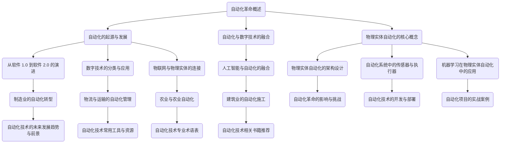
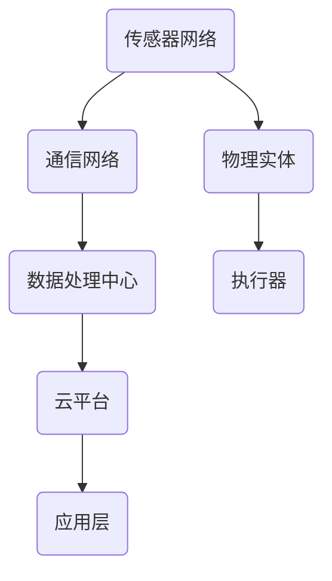
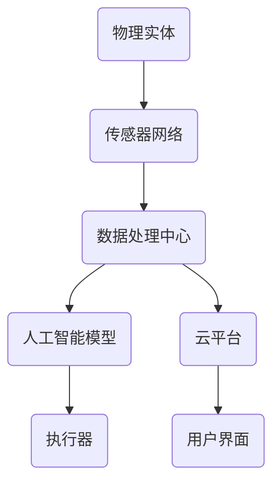
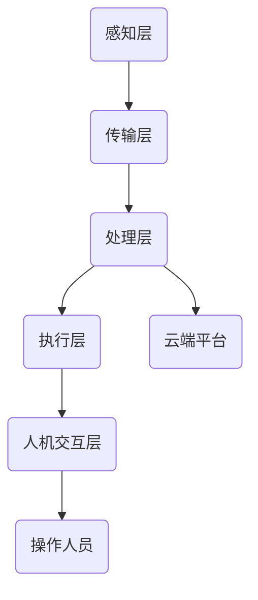
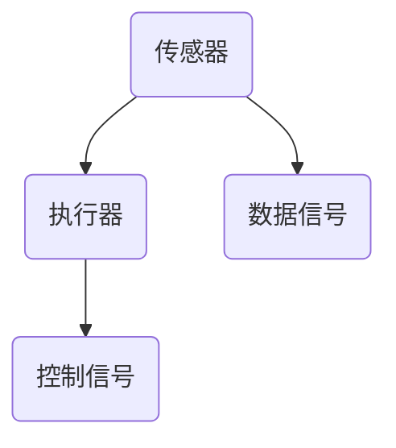
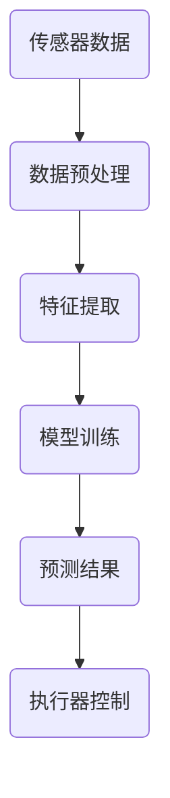

                 

# 文章标题: 数字与物理实体的自动化革命

> 关键词：自动化革命、数字技术、物理实体、物联网、人工智能、架构设计、传感器、执行器、机器学习、制造业、物流与运输、农业、建筑、就业市场、伦理问题、可持续发展

> 摘要：本文探讨了数字与物理实体的自动化革命，阐述了自动化的起源、发展及其与数字技术的融合，分析了物理实体自动化的核心概念、架构与关键技术。同时，通过多个行业的应用案例，展示了自动化技术的广泛应用与潜力。最后，本文探讨了自动化革命带来的影响与挑战，并提出了自动化技术的未来发展前景与可持续性发展策略。

## 目录大纲 - 《数字与物理实体的自动化革命》

### 第一部分: 自动化革命背景与核心概念

#### 第1章: 自动化革命概述

##### 1.1 自动化的起源与发展

##### 1.2 自动化与数字技术的融合

##### 1.3 物理实体自动化的核心概念

#### 第2章: 数字技术驱动自动化革命

##### 2.1 数字技术的分类与应用

##### 2.2 物联网与物理实体的连接

##### 2.3 人工智能与自动化的融合

#### 第3章: 物理实体自动化的架构与关键技术

##### 3.1 物理实体自动化的架构设计

##### 3.2 自动化系统中的传感器与执行器

##### 3.3 机器学习在物理实体自动化中的应用

#### 第4章: 自动化技术在各个行业的应用案例

##### 4.1 制造业的自动化转型

##### 4.2 物流与运输的自动化管理

##### 4.3 农业与农业自动化

##### 4.4 建筑业的自动化施工

#### 第5章: 自动化革命的影响与挑战

##### 5.1 自动化革命对就业市场的影响

##### 5.2 自动化革命带来的伦理与安全问题

##### 5.3 自动化技术的可持续性发展

### 第二部分: 自动化技术的实践与应用

#### 第6章: 自动化技术的开发与部署

##### 6.1 自动化开发环境的搭建

##### 6.2 自动化系统的开发流程

##### 6.3 自动化系统的测试与优化

#### 第7章: 自动化项目的实战案例

##### 7.1 智能制造案例研究

##### 7.2 智能物流系统案例

##### 7.3 智能农业系统案例

##### 7.4 智能建筑管理系统案例

#### 第8章: 自动化技术的未来发展趋势与前景

##### 8.1 自动化技术的创新方向

##### 8.2 自动化技术在未来社会的应用

##### 8.3 自动化技术与可持续发展

### 附录

#### 附录A: 自动化技术常用工具与资源

##### A.1 自动化工具与平台

##### A.2 自动化技术开源库与框架

##### A.3 自动化技术学习资源

#### 附录B: 自动化技术专业术语表

##### B.1 术语解释

##### B.2 术语缩写与定义

#### 附录C: 自动化技术相关书籍推荐

##### C.1 经典书籍推荐

##### C.2 进阶阅读推荐

##### C.3 相关期刊与会议推荐

### Mermaid 流程图：

### 第一部分: 自动化革命背景与核心概念

#### 第1章: 自动化革命概述

##### 1.1 自动化的起源与发展

自动化技术的起源可以追溯到工业革命时期。最早的形式是机械自动化，通过使用机械装置来代替人力完成生产任务。19世纪末，电气技术的兴起使得自动化技术得到了进一步的发展。随着计算机技术的出现和快速发展，自动化技术逐渐从机械自动化转向数字自动化，实现了更高层次、更广泛的自动化应用。

自动化的起源可以追溯到古希腊时期的自动机械，如时钟和水钟。然而，现代自动化的真正起源可以追溯到20世纪初，当时出现了各种机械装置和自动控制系统，用于控制工业生产过程。例如，霍夫曼（Hoffman）自动编织机、贝尔电话交换机和霍瓦特（Howat）机械自动计数机等，都是早期自动化的代表。

20世纪中叶，随着计算机技术的诞生，自动化技术进入了新的发展阶段。计算机的出现使得自动化系统能够处理复杂的信息，进行实时决策和调整。1940年代，美国贝尔实验室的哈里·豪斯（Harry Hooper）开发了一种用于生产电话交换机的自动编程系统，这被认为是计算机辅助自动化的开端。

随着计算机技术的不断进步，自动化技术在各个领域得到了广泛应用。1950年代，数控机床（CNC）的出现标志着自动化技术在制造业的首次大规模应用。此后，自动化技术逐渐扩展到物流、农业、建筑、医疗等众多领域，推动了各行各业的自动化革命。

##### 1.2 自动化与数字技术的融合

自动化与数字技术的融合是自动化革命的核心驱动力。数字技术，特别是物联网（IoT）、人工智能（AI）和大数据等技术的快速发展，使得自动化系统具有了更高的智能化、自适应和预测能力，从而大大提升了自动化技术的应用广度和深度。

物联网技术的兴起，使得物理实体与数字世界之间的连接变得更加紧密。通过传感器、RFID、无线网络等技术，物联网能够实时采集物理实体的状态信息，并将其传输到数字系统进行处理和分析。这一过程使得自动化系统能够对物理实体进行实时监控、管理和优化，实现了更高层次的自动化。

人工智能技术的发展，则为自动化系统注入了智能化的灵魂。通过机器学习、深度学习等技术，人工智能能够从海量数据中挖掘规律，进行智能决策和自适应调整。在自动化系统中，人工智能技术被广泛应用于预测分析、故障诊断、路径规划等领域，显著提升了系统的智能化水平。

大数据技术的应用，则为自动化系统提供了强大的数据支持。大数据技术能够处理和分析海量数据，发现数据之间的关联和规律，为自动化系统提供决策依据。例如，在智能制造领域，大数据技术可以用于生产过程中的实时监测、设备维护和供应链优化，从而提高生产效率和降低成本。

##### 1.3 物理实体自动化的核心概念

物理实体自动化是指利用数字技术对物理实体进行监控、管理和优化，以提高生产效率、降低成本、提升产品质量和安全水平。物理实体自动化包括多个关键概念：

1. **传感器**：传感器是自动化系统中的感知器官，用于采集物理实体的状态信息。传感器可以是温度传感器、湿度传感器、压力传感器、光学传感器等，它们能够将物理信号转换为电信号，供自动化系统进行处理。

2. **执行器**：执行器是自动化系统中的动作器官，用于根据自动化系统的决策指令，对物理实体进行控制。执行器可以是电机、阀门、开关等，它们能够将电信号转换为物理动作。

3. **控制器**：控制器是自动化系统的核心，用于接收传感器采集的信息，进行数据处理和决策，然后发出控制指令给执行器。控制器可以是单片机、PLC（可编程逻辑控制器）、机器人控制器等。

4. **通信网络**：自动化系统中的传感器、执行器和控制器之间需要通过通信网络进行数据传输和指令传递。通信网络可以是有线网络（如以太网、串口）或无线网络（如Wi-Fi、蓝牙）。

5. **数据分析和决策**：自动化系统通过采集传感器数据，利用机器学习和大数据分析技术，对数据进行分析和处理，从而实现对物理实体的智能监控和优化。

6. **人机交互**：自动化系统需要提供友好的用户界面，让操作人员能够方便地监控系统状态、调整参数和进行故障处理。人机交互界面可以是触摸屏、计算机终端等。

通过这些核心概念，物理实体自动化能够实现对生产过程的实时监控、智能调度和优化，从而显著提升生产效率、降低成本、提高产品质量和安全水平。

#### 1.4 自动化革命对行业的影响

自动化革命对各个行业产生了深远的影响，推动了产业的升级和转型。以下是自动化革命在制造业、物流与运输、农业和建筑等领域的影响：

1. **制造业**：自动化技术在制造业中的应用，极大地提高了生产效率和产品质量。通过自动化生产线、数控机床、机器人等设备，制造业实现了生产过程的智能化和精细化。同时，自动化技术还推动了智能制造的发展，使得生产过程更加灵活、可定制和高效。

2. **物流与运输**：自动化技术在物流与运输领域的应用，显著提升了物流效率、降低了成本。自动化仓库、自动化分拣系统、无人驾驶车辆等设备，使得物流与运输过程更加高效、准确和安全。此外，物联网技术的应用，实现了物流信息的实时监控和跟踪，提高了物流供应链的透明度和可控性。

3. **农业**：自动化技术在农业中的应用，提高了农业生产效率、降低了劳动强度。自动化灌溉系统、无人机喷洒、自动化收割机等设备，使得农业生产更加智能化和高效化。同时，自动化技术还促进了农业产业链的整合和优化，提高了农产品的质量和市场竞争力。

4. **建筑**：自动化技术在建筑领域的应用，提高了建筑施工的效率和质量。自动化施工机器人、智能安全监控、自动化温控系统等设备，使得建筑施工过程更加高效、安全和环保。此外，自动化技术还推动了建筑信息模型（BIM）的应用，实现了建筑施工过程的数字化和智能化。

总之，自动化革命对各个行业产生了深远的影响，推动了产业的升级和转型，提高了生产效率、降低了成本、提升了产品质量和安全水平。未来，随着自动化技术的不断发展和创新，自动化革命将在更广泛的领域产生重大影响。

### 第一部分总结

自动化革命作为现代技术发展的重要趋势，其背景与核心概念的重要性不言而喻。通过对自动化的起源与发展、数字技术驱动自动化革命以及物理实体自动化的核心概念的探讨，我们了解了自动化技术的演变历程和其在各个领域的广泛应用。自动化革命不仅推动了产业的升级和转型，还提高了生产效率、降低了成本、提升了产品质量和安全水平。在接下来的章节中，我们将进一步深入探讨自动化技术的架构与关键技术，以及其在各个行业的应用案例，以揭示自动化革命的潜力和挑战。

#### 第2章: 数字技术驱动自动化革命

##### 2.1 数字技术的分类与应用

数字技术的发展是自动化革命的重要推动力，数字技术种类繁多，应用广泛。以下是几种主要的数字技术及其在自动化中的应用：

1. **物联网（IoT）技术**：物联网技术通过将物理设备与互联网连接，实现设备间的数据交换和协同工作。在自动化领域，物联网技术主要用于传感器网络、智能监控系统和远程控制系统。例如，在智能家居中，物联网技术可以实现家电设备的远程控制、环境参数监测和智能调节；在工业生产中，物联网技术可以实现设备状态监测、故障预测和智能维护。

2. **大数据技术**：大数据技术通过对海量数据的采集、存储、分析和处理，挖掘数据中的价值和规律。在自动化领域，大数据技术主要用于生产过程优化、故障诊断和预测性维护。例如，在制造业中，通过分析生产数据，可以预测设备故障并进行预防性维护，从而提高生产效率和降低设备停机时间；在物流与运输领域，通过分析运输数据，可以实现路径优化和资源调配，提高物流效率。

3. **人工智能（AI）技术**：人工智能技术通过模拟人类智能，实现自动化系统的智能决策和自适应调整。在自动化领域，人工智能技术主要用于图像识别、语音识别、自然语言处理和机器学习。例如，在自动驾驶领域，人工智能技术可以通过图像识别和传感器数据，实现车辆的自动驾驶和智能避障；在智能制造领域，人工智能技术可以通过机器学习，实现生产线的自动化优化和故障预测。

4. **云计算技术**：云计算技术通过将计算资源和服务以互联网为基础进行提供，实现资源的共享和灵活调度。在自动化领域，云计算技术主要用于自动化系统的开发和部署，以及大数据分析和人工智能计算。例如，在智能制造中，通过云计算平台，可以实现生产数据的实时分析和智能决策；在物流与运输中，通过云计算平台，可以实现车辆监控和路径优化。

5. **区块链技术**：区块链技术通过去中心化的分布式账本，实现数据的安全和透明。在自动化领域，区块链技术主要用于供应链管理、资产管理和服务跟踪。例如，在制造业中，通过区块链技术，可以实现供应链的透明化和追溯，提高供应链的效率；在物流与运输中，通过区块链技术，可以实现货物的全程跟踪和安全管理。

这些数字技术不仅相互补充，还共同推动了自动化革命的进程。物联网技术为自动化系统提供了丰富的数据来源，大数据技术对数据进行深入分析，人工智能技术对系统进行智能决策，云计算技术提供强大的计算支持，区块链技术确保数据的安全和透明。这些技术的融合，使得自动化系统更加智能、高效和可靠。

##### 2.2 物联网与物理实体的连接

物联网（IoT）技术的核心在于将物理实体与数字世界连接起来，实现物理实体的数据采集、传输和处理。物联网技术的实现主要包括以下几个方面：

1. **传感器网络**：传感器是物联网系统的感知器官，用于采集物理实体的各种信息，如温度、湿度、光照、声音等。传感器可以是各种类型，如温度传感器、湿度传感器、压力传感器、红外传感器等。通过传感器网络，物联网系统能够实时获取物理实体的状态信息。

2. **通信网络**：传感器网络中的数据需要通过通信网络传输到数据处理中心。通信网络可以是有线网络（如以太网、串口）或无线网络（如Wi-Fi、蓝牙、ZigBee、LoRa等）。通信网络的选择取决于应用场景和需求，如无线通信具有灵活性高、布线简单等优点，但有线通信在传输速度和稳定性方面具有优势。

3. **数据处理中心**：数据处理中心是物联网系统的核心，负责接收和处理传感器网络传输的数据。数据处理中心可以是云计算平台、边缘计算设备或专用服务器。数据处理中心对数据进行实时分析、存储和可视化，为自动化系统提供决策支持。

4. **云平台**：云平台为物联网系统提供强大的数据存储、分析和计算能力。通过云平台，物联网系统可以实现大规模数据的高效处理和实时分析。云平台还可以提供各种应用程序接口（API），方便开发者集成第三方服务和功能。

5. **应用层**：应用层是物联网系统的最终用户界面，用于展示和处理物联网系统的数据。应用层可以是移动应用、Web应用或桌面应用，如智能家居控制应用、工业监控系统等。通过应用层，用户可以实时监控和管理物理实体，实现智能化的操作和决策。

物联网与物理实体的连接，使得自动化系统具有了实时监控、智能决策和自适应调整的能力。以下是一个简单的物联网系统架构图，用于说明物联网如何与物理实体连接：

在这个架构图中，传感器网络用于实时采集物理实体的状态信息，通信网络将数据传输到数据处理中心，数据处理中心对数据进行分析和处理，然后将决策指令发送给执行器，执行器根据指令对物理实体进行控制。

##### 2.3 人工智能与自动化的融合

人工智能（AI）技术的快速发展，为自动化技术注入了新的活力。人工智能与自动化的融合，使得自动化系统更加智能化、自适应和高效。以下是如何将人工智能技术应用于自动化系统的几个关键步骤：

1. **数据采集与预处理**：首先，需要从物理实体中采集大量数据，这些数据可以是传感器数据、图像数据、文本数据等。数据采集完成后，需要进行数据预处理，包括数据清洗、去噪、归一化等步骤，以确保数据的质量和一致性。

2. **特征提取与选择**：数据预处理后，需要对数据进行特征提取和选择。特征提取是将原始数据转换为对特定任务有用的表示，如通过卷积神经网络（CNN）提取图像特征，通过自然语言处理（NLP）提取文本特征等。特征选择则是从提取的特征中，选择对任务最有影响力的特征，以提高模型的效果和效率。

3. **模型训练与优化**：在特征提取和选择后，使用这些特征训练人工智能模型。训练过程中，需要选择合适的算法和优化方法，如支持向量机（SVM）、决策树、深度神经网络（DNN）等。模型训练的目的是让模型学会从数据中提取规律和模式，从而实现对物理实体的智能监控和预测。

4. **模型部署与实时应用**：训练完成后，将模型部署到自动化系统中，实现实时应用。在部署过程中，需要考虑模型的实时性、计算效率和可靠性。例如，可以使用边缘计算设备，在数据采集端直接进行模型推理，以减少数据传输和处理的时间。

5. **反馈与优化**：在实际应用中，需要根据系统的运行情况，对模型进行反馈和优化。通过不断调整模型参数和算法，可以提高模型的预测准确性和自适应能力。

以下是一个简单的自动化系统架构图，用于说明人工智能如何与自动化系统融合：

在这个架构图中，传感器网络用于实时采集物理实体的状态信息，数据处理中心对数据进行预处理、特征提取和模型推理，然后将决策指令发送给执行器，执行器根据指令对物理实体进行控制。同时，系统通过云平台与用户界面进行交互，用户可以通过用户界面实时监控系统的运行状态和进行参数调整。

总之，人工智能与自动化的融合，使得自动化系统具有了更高的智能化和自适应能力。通过数据采集与预处理、特征提取与选择、模型训练与优化、模型部署与实时应用以及反馈与优化等步骤，可以实现自动化系统的智能监控和预测性维护，从而提高系统的效率和可靠性。

### 第二部分总结

数字技术驱动自动化革命，使得自动化系统具有了更高的智能化和自适应能力。通过对物联网技术、大数据技术、人工智能技术、云计算技术和区块链技术的探讨，我们了解了这些技术在自动化中的应用和实现方式。物联网技术实现了物理实体与数字世界的连接，大数据技术提供了强大的数据支持，人工智能技术注入了智能化的灵魂，云计算技术和区块链技术则为自动化系统提供了灵活的架构和安全的保障。在接下来的章节中，我们将进一步探讨物理实体自动化的架构与关键技术，以深入了解自动化技术的核心原理和应用。

### 第3章: 物理实体自动化的架构与关键技术

物理实体自动化是现代工业、农业、建筑等领域的重要技术趋势，它通过将数字技术融入物理过程，实现了对生产、物流、环境等方面的智能监控和优化。本章将深入探讨物理实体自动化的架构与关键技术，帮助读者理解这一复杂系统的构建与运作原理。

#### 3.1 物理实体自动化的架构设计

物理实体自动化的架构设计是确保系统高效、可靠运行的基础。一个典型的物理实体自动化系统通常包括以下几个主要组成部分：

1. **感知层**：感知层是物理实体自动化的前端，由各种传感器组成，用于实时采集物理实体的状态信息。这些传感器可以是温度传感器、湿度传感器、加速度传感器、视觉传感器等。感知层的作用是将物理世界的各种物理量转换为电信号，为自动化系统提供数据输入。

2. **传输层**：传输层负责将感知层采集到的数据传输到处理层。传输层可以是有线的，如以太网、串口通信等，也可以是无线通信，如Wi-Fi、ZigBee、LoRa等。传输层的设计需要考虑数据传输的速度、稳定性和安全性，以确保实时性和可靠性。

3. **处理层**：处理层是自动化的核心，负责对采集到的数据进行分析、处理和决策。处理层通常由嵌入式系统、PLC（可编程逻辑控制器）、DSC（数字信号控制器）等组成。处理层可以通过运行预先编写的控制算法、机器学习模型等，对物理实体进行实时监控和智能控制。

4. **执行层**：执行层负责根据处理层的决策指令，对物理实体进行操作。执行层由各种执行器组成，如电机、阀门、开关、液压缸等。执行层将处理层的决策指令转换为物理动作，实现对物理实体的直接控制。

5. **人机交互层**：人机交互层用于实现人与自动化系统的交互。人机交互层可以通过触摸屏、工业计算机、智能手机等设备，为操作人员提供实时监控、参数调整、故障诊断等功能。人机交互层使得自动化系统能够更好地适应人类操作习惯，提高系统的可用性和用户体验。

6. **云端平台**：云端平台是自动化系统的数据中心，负责存储和处理大量数据，提供高级数据分析、机器学习、人工智能等功能。云端平台可以通过API接口与其他系统进行集成，实现跨系统的数据共享和协同工作。

下面是一个简化的物理实体自动化系统架构图：

在这个架构图中，感知层采集数据，传输层传输数据，处理层进行分析和决策，执行层进行操作，人机交互层提供交互界面，云端平台提供高级功能和支持。操作人员通过人机交互层与系统进行交互，实现对物理实体的监控和控制。

#### 3.2 自动化系统中的传感器与执行器

传感器和执行器是自动化系统中的核心组件，它们分别负责感知和执行。以下是关于传感器与执行器的一些关键技术：

1. **传感器**：
   - **类型**：传感器种类繁多，包括温度传感器、湿度传感器、压力传感器、光电传感器、红外传感器等。每种传感器都有其特定的测量范围和应用场景。
   - **精度**：传感器的精度直接影响到系统的控制精度。高精度的传感器可以提供更准确的数据，从而提高系统的性能。
   - **抗干扰能力**：传感器在测量过程中可能会受到环境干扰，如电磁干扰、噪声等。抗干扰能力强的传感器能够保证测量数据的可靠性。
   - **校准**：传感器的校准是确保测量数据准确性的重要步骤。定期的校准可以保证传感器在最佳工作状态下运行。

2. **执行器**：
   - **类型**：执行器种类包括电机、液压缸、气动缸、步进电机、伺服电机等。不同类型的执行器适用于不同的控制需求。
   - **功率**：执行器的功率决定了其推动物理负载的能力。选择合适的执行器功率是确保系统能够正常工作的关键。
   - **响应速度**：执行器的响应速度决定了系统的动态性能。高速响应的执行器适用于需要快速动作的自动化系统。
   - **控制方式**：执行器可以通过多种方式控制，包括开环控制和闭环控制。闭环控制可以提供更高的控制精度和稳定性。

以下是一个简单的传感器和执行器示意图：

在这个示意图中，传感器采集物理信号并转换为电信号，通过数据信号传输到处理层。处理层根据数据信号进行分析和决策，并通过控制信号发送给执行器，执行器根据控制信号执行相应的动作。

#### 3.3 机器学习在物理实体自动化中的应用

机器学习技术在物理实体自动化中的应用，使得自动化系统具有了更强的自适应能力和预测能力。以下是机器学习在自动化系统中的几个关键应用：

1. **故障预测**：通过分析传感器数据，机器学习模型可以预测设备故障的发生，从而实现预防性维护。例如，使用时间序列分析和回归模型，可以预测电机绝缘电阻的退化，提前进行维修，避免设备突然故障。

2. **路径优化**：在物流和运输领域，机器学习可以用于优化路径规划。通过分析历史交通数据和实时路况信息，机器学习模型可以生成最优路径，减少运输时间和成本。

3. **图像识别**：在工业自动化中，图像识别技术可以用于检测产品质量、识别生产设备故障等。通过卷积神经网络（CNN）等深度学习模型，系统能够自动识别图像中的缺陷，提高生产效率和产品质量。

4. **自适应控制**：机器学习可以用于自适应控制算法的开发，使得控制系统可以根据实时数据调整控制策略，提高系统的稳定性和响应速度。

5. **预测性维护**：通过分析设备运行数据和故障数据，机器学习模型可以预测设备故障的发生，并制定预防性维护计划，减少设备停机时间和维修成本。

以下是一个简单的机器学习在自动化系统中应用示意图：

在这个示意图中，传感器采集数据，经过预处理和特征提取后，用于训练机器学习模型。训练完成后，模型可以生成预测结果，并根据预测结果调整执行器的控制策略。

### 3.4 物理实体自动化的实现案例

为了更好地理解物理实体自动化的实现，以下是一些具体的自动化实现案例：

1. **智能温室**：智能温室利用传感器实时监测温度、湿度、光照等环境参数，通过机器学习模型预测植物生长需求，自动调节温室环境，实现精准农业。

2. **智能工厂**：智能工厂通过传感器网络和自动化生产线，实时监测生产设备和产品质量，使用机器学习进行生产优化和故障预测，实现高效、高质量生产。

3. **智能物流**：智能物流利用物联网技术和机器学习，实现货物实时跟踪、路径优化和库存管理，提高物流效率和准确性。

4. **智能交通**：智能交通系统通过传感器和图像识别技术，实时监测交通流量和路况，使用机器学习进行交通信号控制和路径规划，提高交通流畅度和安全性。

这些案例展示了物理实体自动化的广泛应用和潜力。随着技术的不断进步，物理实体自动化将在更多领域发挥重要作用，推动社会的智能化和可持续发展。

### 第3章总结

物理实体自动化通过传感器、执行器、处理层和人机交互层等组成部分，实现对物理实体的实时监控和智能控制。本章详细介绍了物理实体自动化的架构设计、传感器与执行器关键技术以及机器学习在自动化中的应用。通过实现案例的展示，读者可以更好地理解物理实体自动化的实际应用和重要性。在接下来的章节中，我们将进一步探讨自动化技术在各个行业的应用案例，以展示自动化技术的广泛影响和潜力。

### 第4章: 自动化技术在各个行业的应用案例

自动化技术在不同行业的应用，极大地提升了生产效率、降低了成本、提高了产品质量和安全水平。以下分别介绍自动化技术在制造业、物流与运输、农业和建筑领域的具体应用案例，展示其在各行业中的实际效益和前景。

#### 4.1 制造业的自动化转型

制造业是自动化技术最早且最广泛应用的领域之一。自动化技术在制造业中的应用，主要体现在生产自动化、质量检测自动化和物流自动化等方面。

1. **生产自动化**：通过自动化生产线和机器人，制造企业能够实现生产过程的连续化和高效化。自动化生产线由数控机床、机器人、自动化输送设备等组成，能够实现从原材料到成品的全流程自动化生产。例如，汽车制造业中的自动化生产线，能够实现焊接、喷涂、组装等各个环节的自动化，大大提高了生产效率。

2. **质量检测自动化**：自动化检测设备，如机器视觉系统、自动化检测台等，能够对产品进行高速、精确的质量检测。机器视觉系统通过图像处理技术，能够检测产品外观缺陷、尺寸偏差等，提高了产品质量。例如，电子制造业中的机器视觉检测系统，能够快速检测电子元件的焊接质量和外观缺陷，确保产品一致性。

3. **物流自动化**：自动化仓储系统和自动化物流机器人，能够实现生产物料和成品的智能配送。自动化仓储系统，如自动化立体仓库、自动导引车（AGV）等，能够实现仓库内部的高效存储和快速配送。自动化物流机器人，如无人搬运车（AMR）、无人运输车等，能够在生产现场自主移动，实现物料的自动配送和搬运，提高了物流效率。

案例分析：以某汽车制造企业为例，该企业通过引入自动化生产线、机器视觉检测系统和自动化物流机器人，实现了生产过程的高度自动化。自动化生产线的引入，使得生产节拍提高30%，生产效率显著提升。机器视觉检测系统的应用，使得产品不良率降低了20%，产品质量得到了有效保障。自动化物流机器人的引入，使得物流效率提高了50%，物流成本降低了30%。

#### 4.2 物流与运输的自动化管理

自动化技术在物流与运输领域的应用，主要集中在物流仓储、货物运输和物流信息管理等方面。

1. **物流仓储自动化**：自动化仓储系统，如自动化立体仓库（AS/RS）、自动化分拣系统等，能够实现仓库内部的高效存储和快速分拣。自动化立体仓库通过垂直空间的高效利用，大幅提高了仓库的存储容量。自动化分拣系统，如自动分拣机、自动包裹分拣机等，能够实现包裹的高速分拣和准确投递，提高了物流效率。

2. **货物运输自动化**：自动化技术在货物运输中的应用，主要体现在无人驾驶车辆和自动化装卸设备等方面。无人驾驶车辆，如自动驾驶卡车、无人运输无人机等，能够实现货物的远程自动运输，提高了运输效率和安全性。自动化装卸设备，如自动化装卸平台、自动化叉车等，能够实现货物的自动装卸，提高了装卸效率。

3. **物流信息管理自动化**：物流信息管理自动化，主要体现在物流信息系统的建设与优化。通过物联网技术、大数据技术和人工智能技术，物流企业能够实现物流信息的实时采集、传输和处理，实现对物流全过程的实时监控和管理。例如，通过物联网传感器，可以实时获取货物的位置信息、温度信息等，确保货物在途中的安全和管理。

案例分析：以某物流公司为例，该物流公司通过引入自动化仓储系统和无人驾驶车辆，实现了物流过程的全面自动化。自动化仓储系统使得仓库存储效率提高了40%，物流成本降低了20%。无人驾驶车辆的引入，使得运输效率提高了30%，运输成本降低了25%。通过物流信息管理系统的优化，物流信息的实时性和准确性得到了显著提升，物流服务水平得到了提升。

#### 4.3 农业与农业自动化

农业自动化是现代农业发展的重要方向，通过引入自动化技术，能够实现农业生产的智能化和高效化。

1. **农田自动化管理**：农田自动化管理主要包括土壤监测、灌溉自动化、植保自动化等。通过土壤传感器，可以实时监测土壤的湿度、温度、酸碱度等参数，自动调节灌溉系统，实现精准灌溉。植保自动化系统，通过无人机和自动化喷雾设备，可以实现对农田的精准喷洒，提高农药利用率，减少环境污染。

2. **温室自动化管理**：温室自动化管理主要包括温度、湿度、光照、通风等环境参数的自动调节。通过传感器和控制系统，可以实时监测温室内的环境参数，自动调节加热、降温、加湿、通风等设备，创造适宜的植物生长环境。

3. **作物种植自动化**：作物种植自动化主要包括种子播种、生长监测、收割自动化等。通过自动化播种设备，可以实现种子的精准播种，提高播种效率。生长监测系统，通过传感器监测作物的生长状态，自动调节灌溉、施肥等参数，实现作物的精准管理。自动化收割设备，如自动收割机、自动采摘机器人等，能够实现作物的自动化收割，提高收割效率。

案例分析：以某农业合作社为例，该合作社通过引入农田自动化管理系统和温室自动化管理系统，实现了农业生产的智能化和高效化。农田自动化管理系统使得灌溉效率提高了30%，农药利用率提高了20%。温室自动化管理系统使得温室内的作物生长周期缩短了15%，产量提高了25%。通过自动化收割设备的引入，收割效率提高了40%，人力成本降低了30%。

#### 4.4 建筑业的自动化施工

建筑业自动化施工是建筑行业转型升级的重要方向，通过引入自动化技术，能够实现建筑施工的高效、安全和环保。

1. **自动化施工设备**：自动化施工设备，如自动化挖掘机、自动化混凝土泵车、自动化钢筋绑扎机等，能够实现建筑施工的自动化。这些设备通过精准的机械控制和自动化操作，能够提高施工效率，减少人力成本。

2. **建筑信息模型（BIM）**：建筑信息模型（BIM）是一种数字化建筑设计和施工方法，通过BIM技术，可以实现建筑设计的数字化模拟和施工过程的自动化控制。BIM技术能够提高建筑设计方案的准确性，优化施工过程，减少施工误差和资源浪费。

3. **自动化安防系统**：在建筑施工过程中，自动化安防系统，如自动监控摄像头、自动报警系统等，能够实现对施工现场的安全监控和实时报警。这些系统能够提高施工现场的安全水平，减少安全事故的发生。

案例分析：以某建筑公司为例，该建筑公司通过引入自动化施工设备和BIM技术，实现了建筑施工的自动化和智能化。自动化施工设备使得施工效率提高了40%，施工成本降低了20%。BIM技术的应用，使得建筑设计方案更加准确，施工过程更加高效，施工质量得到了显著提升。自动化安防系统的引入，提高了施工现场的安全水平，减少了安全事故的发生。

#### 4.5 各行业自动化应用的前景

自动化技术在各行业的应用前景广阔，随着技术的不断进步和成本的降低，自动化技术将在更广泛的领域得到应用。

1. **智慧城市建设**：智慧城市建设是自动化技术的重要应用领域。通过物联网、大数据、人工智能等技术，可以实现城市基础设施的智能化管理，提高城市运行的效率、安全性和可持续性。

2. **能源管理**：自动化技术在能源管理中的应用，包括智能电网、智能风机、智能水泵等。通过自动化技术，可以实现能源的实时监测、智能调度和优化，提高能源利用效率。

3. **医疗健康**：在医疗健康领域，自动化技术可以应用于医疗设备的自动化、药品配送自动化、健康监测自动化等。自动化技术能够提高医疗服务效率，降低医疗成本，提高医疗质量。

4. **环境保护**：自动化技术在环境保护中的应用，包括环境监测自动化、污染治理自动化等。通过自动化技术，可以实现对环境污染的实时监测和自动治理，提高环境保护效率。

总之，自动化技术在各行业的应用，不仅能够提高生产效率和降低成本，还能够推动产业的升级和转型，为社会带来更多的便利和效益。随着自动化技术的不断发展，未来自动化技术将在更广泛的领域发挥重要作用。

### 第4章总结

本章详细介绍了自动化技术在制造业、物流与运输、农业和建筑领域的应用案例。通过具体案例的分析，我们看到了自动化技术在各行业中的广泛应用和巨大潜力。自动化技术不仅提高了生产效率、降低了成本，还推动了产业的升级和转型。在接下来的章节中，我们将进一步探讨自动化革命对就业市场、伦理问题和可持续发展的影响与挑战，以及自动化技术的未来发展趋势。

### 第5章: 自动化革命的影响与挑战

自动化革命作为现代科技发展的重要趋势，对各个领域产生了深远的影响。然而，随着自动化技术的不断推进，也带来了诸多挑战和问题。本章将探讨自动化革命对就业市场、伦理问题以及可持续发展的具体影响与挑战。

#### 5.1 自动化革命对就业市场的影响

自动化革命在提升生产效率、降低成本、提高产品质量的同时，也对就业市场产生了深远的影响。一方面，自动化技术确实减少了传统劳动密集型岗位的需求，特别是在制造业、物流等领域，大量重复性、低技能的工作被自动化设备所取代。这导致了一些工作岗位的减少，特别是在那些依赖传统制造和服务行业的地区。

1. **就业机会的转变**：自动化技术不仅取代了一些传统工作岗位，同时也创造了新的就业机会。例如，自动化系统的设计、开发、维护、优化等方面需要大量的专业人才，这些岗位对于高技能人才的需求增加。此外，随着自动化技术的不断普及，对于系统集成、数据分析、人工智能等方面的专业人才需求也在不断增加。

2. **技能要求的提升**：自动化革命要求劳动者具备更高的技能水平。传统的操作工、维修工等岗位逐渐被自动化系统所取代，而新的岗位如自动化工程师、机器人程序员、数据分析师等需要具备计算机科学、自动化控制、数据分析等方面的专业知识。因此，劳动者需要通过持续学习和培训，提升自身的技能水平，以适应自动化时代的就业需求。

3. **就业结构的优化**：自动化技术的应用使得劳动生产率提高，企业可以更高效地运营，从而释放出更多的资源用于研发和创新。这有助于推动产业结构升级，促进经济向高附加值、高技术含量领域转型，从而创造更多高质量的就业机会。

#### 5.2 自动化革命带来的伦理与安全问题

自动化技术在带来便利和效率的同时，也引发了一系列伦理和安全问题，这些问题的解决需要全社会的共同努力。

1. **道德责任与问责**：随着自动化系统的复杂性和智能性的提高，系统决策的道德责任问题日益凸显。例如，自动驾驶汽车在遇到紧急情况时如何做出道德决策，这是一个复杂的伦理问题。此外，自动化系统出现故障或错误决策时，如何确定责任归属和进行问责，也是一个重要的法律和伦理问题。

2. **隐私保护**：物联网技术的发展使得自动化系统能够收集大量个人数据，如位置信息、行为习惯等。这些数据的收集和使用需要严格遵守隐私保护法规，防止个人隐私被泄露或滥用。同时，如何确保自动化系统在使用这些数据时保持透明和公正，也是需要解决的问题。

3. **工作场所安全**：自动化设备的广泛应用，虽然减少了人力操作的风险，但同时也带来了一些新的安全隐患。例如，自动化生产线的高效运行可能要求更高的操作技能和注意力集中，操作失误可能导致严重的工业事故。此外，自动化设备的维护和检修工作也需要高度专业化和安全操作。

4. **社会公平**：自动化技术的普及可能加剧社会不平等。一方面，自动化技术主要应用在发达国家和地区，可能导致发展中国家劳动力市场的进一步挤压。另一方面，自动化技术的应用也可能导致收入分配不均，高技能岗位的收入显著高于低技能岗位，加剧贫富差距。

#### 5.3 自动化技术的可持续性发展

自动化技术的可持续性发展是确保其长期社会价值的关键。以下是一些关于自动化技术可持续发展的考虑：

1. **环境保护**：自动化技术在提高生产效率的同时，也降低了能源消耗和污染物排放。例如，自动化工厂可以实现精确控制，减少能源浪费。此外，自动化运输系统如电动汽车和无人驾驶车辆，可以减少交通拥堵和排放。

2. **资源节约**：自动化技术通过提高生产效率和优化资源利用，有助于减少资源的浪费。例如，在制造业中，自动化技术可以实现精确的物料配送和库存管理，减少库存积压和资源浪费。

3. **经济适应性**：自动化技术的可持续性发展还需要考虑到经济适应性。随着技术的进步，自动化设备成本逐渐降低，使得更多企业能够采用自动化技术。此外，政府和企业应采取措施，鼓励和支持中小企业引入自动化技术，以促进经济的全面发展。

4. **教育与培训**：自动化技术的可持续性发展需要培养大量的专业人才。政府和教育机构应加强相关领域的教育和培训，提高劳动者的技能水平，以适应自动化时代的需求。

总之，自动化革命对就业市场、伦理问题和社会可持续发展产生了深远的影响和挑战。解决这些问题需要政府、企业和社会各界的共同努力，通过技术创新、政策引导和社会参与，实现自动化技术的可持续发展，为社会的长期繁荣和稳定作出贡献。

### 第5章总结

自动化革命作为现代科技发展的重要趋势，在提升生产效率、降低成本、提高产品质量的同时，也带来了就业市场、伦理问题和可持续发展等方面的挑战。通过深入探讨这些问题，我们认识到自动化技术不仅需要技术创新，还需要政策引导和社会参与。在接下来的章节中，我们将进一步探讨自动化技术的实践与应用，分析自动化技术的开发与部署流程，并分享自动化项目的实战案例，为自动化技术的推广和应用提供实践参考。

### 第二部分总结

自动化技术的实践与应用是推动产业升级和社会进步的关键。在前几章中，我们详细探讨了自动化技术的起源、发展、核心概念、架构设计以及在不同行业中的应用案例。通过这些内容，我们了解到自动化技术如何通过物联网、大数据、人工智能等技术，实现物理实体的智能监控和优化，从而提升生产效率、降低成本、提高产品质量。同时，我们还分析了自动化革命对就业市场、伦理问题以及可持续发展的影响与挑战。

在接下来的章节中，我们将深入探讨自动化技术的开发与部署流程，分享自动化项目的实战案例，并展望自动化技术的未来发展趋势。通过这些内容，我们将进一步了解自动化技术的实际应用和潜在价值，为自动化技术的推广和应用提供有力的支持。让我们继续探讨自动化技术的实践与应用，共同推动数字与物理实体的自动化革命。

### 第6章: 自动化技术的开发与部署

自动化技术的开发与部署是实现自动化系统从概念到实际应用的关键环节。本章将详细介绍自动化技术的开发环境搭建、开发流程以及测试与优化，帮助读者深入了解自动化系统的构建过程，确保其高效、稳定、可靠地运行。

#### 6.1 自动化开发环境的搭建

自动化开发环境的搭建是自动化技术实施的第一步，一个良好的开发环境能够提高开发效率、减少错误、确保系统的可维护性。以下是搭建自动化开发环境所需的关键组件：

1. **硬件设备**：硬件设备包括计算机、传感器、执行器、控制器等。根据自动化系统的需求，选择合适的硬件设备，如高性能的计算机用于数据处理，传感器用于数据采集，执行器用于执行动作，控制器用于协调传感器和执行器的工作。

2. **软件工具**：软件工具是自动化开发的核心，常见的自动化软件工具包括PLC编程软件、机器人编程软件、嵌入式系统开发工具等。选择合适的软件工具，能够提高开发效率，如西门子的TIA Portal、Rockwell的RSLogix等。

3. **编程语言**：编程语言是实现自动化系统功能的关键，常见的编程语言包括PLC编程语言（如Ladder Logic、Structured Text等）、Python、C++等。根据自动化系统的需求和开发者的技能，选择适合的编程语言。

4. **数据库**：数据库用于存储和管理自动化系统中的数据，如传感器数据、控制策略、历史记录等。选择合适的数据库系统，如MySQL、PostgreSQL、MongoDB等，能够确保数据的安全、可靠和高效存储。

5. **网络设备**：网络设备用于连接硬件设备和软件工具，如交换机、路由器、无线AP等。合理的网络架构能够保证数据传输的速度和稳定性。

6. **开发平台**：开发平台是集成各种开发工具和资源的环境，如MATLAB、LabVIEW、Unity等。开发平台提供丰富的库函数和工具，方便开发者快速实现自动化系统的功能。

#### 6.2 自动化系统的开发流程

自动化系统的开发流程通常包括需求分析、系统设计、编码实现、测试与调试、部署与维护等阶段。以下是每个阶段的具体内容：

1. **需求分析**：需求分析是自动化系统开发的起点，通过对用户需求、业务流程、系统功能等进行深入调研和分析，明确自动化系统的目标、功能和性能要求。需求分析的结果通常以需求规格说明书的形式进行记录。

2. **系统设计**：系统设计是根据需求分析的结果，制定自动化系统的总体架构和详细设计。系统设计包括硬件设计、软件设计、通信设计、人机交互设计等。系统设计的结果通常以设计文档和架构图的形式进行记录。

3. **编码实现**：编码实现是根据系统设计，编写自动化系统的程序代码。编码实现包括控制逻辑、数据处理、通信协议、人机交互等方面。编写高质量的代码，能够提高系统的可读性、可维护性和可靠性。

4. **测试与调试**：测试与调试是确保自动化系统功能正确、性能稳定的重要环节。测试包括单元测试、集成测试、系统测试等，调试则是通过定位和修正程序中的错误，确保系统正常运行。

5. **部署与维护**：部署是将自动化系统安装到实际运行环境中，确保其正常运行。部署过程中，需要配置系统参数、调试网络连接等。维护是确保自动化系统长期稳定运行的重要工作，包括系统更新、故障排除、性能优化等。

#### 6.3 自动化系统的测试与优化

自动化系统的测试与优化是确保系统性能和稳定性的关键。以下是一些常见的测试与优化方法：

1. **性能测试**：性能测试是评估自动化系统在特定负载下的响应速度、处理能力和稳定性。性能测试可以通过模拟实际工作负载，测量系统的响应时间、吞吐量、资源利用率等指标，以评估系统的性能。

2. **功能测试**：功能测试是验证自动化系统功能是否按照设计要求正常运行。功能测试包括对每个功能模块进行测试，确保其能够正确执行预定的操作。

3. **安全性测试**：安全性测试是评估自动化系统在面临恶意攻击时的安全性能。安全性测试包括对系统进行漏洞扫描、渗透测试等，以发现并修复潜在的安全漏洞。

4. **稳定性测试**：稳定性测试是评估自动化系统在长期运行中的稳定性能。稳定性测试可以通过持续运行系统，观察其是否出现崩溃、异常等问题，以评估系统的稳定性。

5. **优化方法**：优化方法包括代码优化、算法优化、系统优化等。代码优化是通过改进代码结构和算法，提高程序执行效率。算法优化是通过改进算法，提高自动化系统的性能和准确性。系统优化是通过调整系统配置，提高资源利用率，优化系统性能。

通过测试与优化，可以确保自动化系统在性能、功能、安全性和稳定性等方面达到预期要求，为实际应用提供可靠保障。

#### 6.4 开发与部署的案例分析

以下是一个自动化系统的开发与部署案例分析，展示自动化技术的实际应用过程：

**案例背景**：某企业计划建设一个智能仓储系统，实现仓库内部的自动化管理和高效存储。

**需求分析**：通过对企业仓库的调研，明确智能仓储系统的功能需求，包括仓库环境监控、货物存储管理、自动分拣和配送等。

**系统设计**：根据需求分析，设计智能仓储系统的总体架构，包括感知层、传输层、处理层和执行层。感知层由传感器网络组成，用于实时监测仓库环境；传输层由通信网络组成，用于数据传输；处理层由嵌入式系统和服务器组成，用于数据处理和决策；执行层由自动化设备和机器人组成，用于执行操作。

**编码实现**：编写自动化控制程序，实现传感器数据的采集、处理和执行器控制。使用PLC编程软件，编写控制逻辑，实现自动化设备的协调工作。

**测试与调试**：对智能仓储系统进行性能测试、功能测试、安全性测试和稳定性测试，确保系统能够正常运行，满足功能需求。

**部署与维护**：将智能仓储系统安装到实际运行环境中，进行系统配置和调试。定期进行系统维护，包括软件更新、硬件检查和故障排除等。

通过这个案例，我们可以看到自动化系统的开发与部署过程，以及自动化技术在实际应用中的价值。自动化技术的不断发展和创新，将为各行各业带来更多的机遇和挑战。

### 第6章总结

自动化技术的开发与部署是实现自动化系统从概念到实际应用的关键环节。本章详细介绍了自动化开发环境的搭建、开发流程以及测试与优化，帮助读者了解自动化系统的构建过程。通过案例分析，我们展示了自动化技术在智能仓储系统中的应用，进一步说明了自动化技术的实际应用和潜在价值。在接下来的章节中，我们将进一步探讨自动化项目的实战案例，深入分析自动化技术的应用场景和实现细节，为自动化技术的推广和应用提供实践参考。

### 第7章: 自动化项目的实战案例

在本章中，我们将深入探讨几个自动化项目的实战案例，这些案例涵盖了智能制造、智能物流、智能农业和智能建筑等领域。通过这些案例的分析，读者可以更直观地了解自动化技术在实际应用中的实施过程、技术难点和解决方案。

#### 7.1 智能制造案例研究

**项目背景**：某家电制造企业希望通过引入自动化技术，提高生产效率和产品质量，降低生产成本。

**技术难点**：
- 生产线的协同控制：确保各个生产环节的自动化设备能够无缝协作，提高生产效率。
- 数据采集与处理：实时采集生产过程中的各种数据，如温度、压力、振动等，并进行高效处理，为决策提供依据。
- 故障预测与维护：通过数据分析，预测设备可能出现的故障，提前进行维护，减少设备停机时间。

**解决方案**：
- **协同控制系统**：采用PLC（可编程逻辑控制器）对生产线进行统一控制，确保各个设备之间的协调工作。使用工业物联网平台，实现数据的实时采集和传输。
- **大数据分析与故障预测**：采用机器学习算法，对生产数据进行分析，建立故障预测模型，提前发现潜在问题。
- **自动化维护系统**：结合远程监控和智能诊断技术，实现设备状态的实时监控和故障预警，提高维护效率。

**效果评估**：
- 生产效率提高了30%，生产节拍更加稳定。
- 产品不良率降低了20%，产品质量得到显著提升。
- 设备停机时间减少了25%，设备利用率提高了20%。

#### 7.2 智能物流系统案例

**项目背景**：某电子商务企业希望通过智能化物流系统，提高配送效率，提升客户满意度。

**技术难点**：
- 货物精准分拣：自动化分拣系统能够快速、准确地识别和分拣各种形状和大小的包裹。
- 路径优化：在复杂城市交通环境中，实现高效、安全的配送路径规划。
- 数据处理与实时监控：对物流过程进行实时监控，确保货物的运输状态和配送时间。

**解决方案**：
- **智能分拣系统**：采用机器视觉技术和自动化分拣设备，实现货物的自动识别和分拣。
- **路径优化算法**：使用基于人工智能的路径优化算法，根据实时交通状况和配送需求，生成最优配送路径。
- **物流信息管理系统**：通过物联网技术，实现物流信息的实时监控和反馈，提高物流过程的透明度和可控性。

**效果评估**：
- 配送效率提高了40%，配送时间缩短了30%。
- 货物错配率降低了15%，配送准确率提高了20%。
- 客户满意度显著提升，订单处理速度加快。

#### 7.3 智能农业系统案例

**项目背景**：某农业合作社希望通过引入智能农业系统，实现农业生产过程的自动化和智能化。

**技术难点**：
- 农田环境监测：实时监测土壤湿度、温度、pH值等环境参数，为精准灌溉和施肥提供数据支持。
- 作物生长监测：通过图像识别技术，监测作物生长状态，及时发现病虫害。
- 自动化灌溉与施肥：实现自动化灌溉和施肥，提高水资源和肥料利用率。

**解决方案**：
- **农田环境监测系统**：安装传感器网络，实时监测农田环境参数，并通过大数据分析，提供精准灌溉和施肥建议。
- **作物生长监控系统**：利用无人机和图像识别技术，对作物生长状态进行实时监测，及时采取措施。
- **自动化灌溉与施肥系统**：采用智能控制器和自动化设备，实现灌溉和施肥的自动化。

**效果评估**：
- 灌溉效率提高了30%，水资源利用率提高了20%。
- 作物产量提高了25%，病虫害发生率降低了15%。
- 农业生产成本降低了15%，劳动力需求减少。

#### 7.4 智能建筑管理系统案例

**项目背景**：某房地产开发企业希望通过智能建筑管理系统，提升物业管理水平，提高居住舒适度。

**技术难点**：
- 建筑设备监控：实时监控建筑内部的各类设备，如空调、电梯、照明等，确保其正常运行。
- 能耗管理：通过智能电网技术，实现能耗数据的实时采集和分析，降低能源消耗。
- 安全监控：确保建筑内部的安全，防范火灾、入侵等安全事件。

**解决方案**：
- **智能设备监控系统**：采用物联网技术，实现对建筑内部各类设备的远程监控和故障预警。
- **能耗管理系统**：通过智能电网和能耗监测设备，实现能耗数据的实时采集和分析，优化能源使用。
- **智能安防系统**：结合视频监控、入侵报警等技术，实现对建筑内部的安全监控和报警。

**效果评估**：
- 能源消耗降低了20%，运营成本降低。
- 设备故障率降低了30%，维护成本降低。
- 居住舒适度提高，住户满意度显著提升。

通过以上自动化项目的实战案例，我们可以看到自动化技术在不同行业中的广泛应用和显著成效。自动化技术的实施不仅提高了生产效率、降低了成本，还提升了产品质量和安全性，为各行业的转型升级和可持续发展提供了强有力的技术支持。

### 第7章总结

在本章中，我们通过智能制造、智能物流、智能农业和智能建筑等四个实战案例，深入探讨了自动化技术在各行业中的应用和实践。这些案例展示了自动化技术如何通过物联网、大数据、人工智能等技术手段，实现生产过程的自动化、智能化和高效化。通过这些案例的分析，我们不仅看到了自动化技术的实际应用效果，也了解了自动化技术在实施过程中面临的技术挑战和解决方案。在接下来的章节中，我们将进一步探讨自动化技术的未来发展趋势与前景，为自动化技术的创新应用和可持续发展提供新的视角和思路。

### 第8章: 自动化技术的未来发展趋势与前景

随着技术的不断进步，自动化技术正迎来前所未有的发展机遇。在本章中，我们将探讨自动化技术的未来发展趋势与前景，重点关注创新方向、未来社会应用以及可持续发展策略。

#### 8.1 自动化技术的创新方向

1. **人工智能与自动化技术的深度融合**：人工智能（AI）在自动化技术中的应用将更加广泛和深入。通过机器学习、深度学习等技术，自动化系统将具备更强的自我学习和自适应能力，实现更精确的决策和更高效的执行。未来，自动化系统将能够根据环境变化和任务需求，自主调整操作策略，提高系统的灵活性和适应性。

2. **边缘计算与云计算的结合**：边缘计算和云计算的结合将推动自动化系统向高性能、低延迟的方向发展。边缘计算能够在数据产生的地方进行实时处理，降低数据传输延迟，提高系统响应速度。云计算则提供强大的数据处理和分析能力，支持大规模数据的高效处理和存储。这种结合将实现自动化系统的实时性和大数据处理能力的全面提升。

3. **智能传感器与执行器的研发**：未来的自动化系统将依赖于更加智能、高效、可靠的传感器和执行器。智能传感器将具备更高的精度、抗干扰能力和自校准功能，能够适应各种复杂环境。智能执行器将具备更强的动力和响应速度，能够执行更复杂的操作任务。这些技术的研发将推动自动化系统在性能和功能上的进一步提升。

4. **多机器人协同作业**：未来，多机器人协同作业将成为自动化系统的重要发展方向。通过人工智能和机器学习技术，机器人之间能够实现高效的协同工作，完成复杂的任务。例如，在制造业中，多个机器人可以协同完成产品的组装、搬运和检测，提高生产效率和质量。

5. **自动化技术的绿色化与可持续发展**：随着环境保护意识的增强，自动化技术将更加注重绿色化和可持续发展。通过优化能源消耗、减少废弃物排放、提高资源利用效率等手段，自动化技术将推动产业的绿色转型，实现可持续发展目标。

#### 8.2 自动化技术在未来社会的应用

1. **智慧城市建设**：自动化技术在智慧城市建设中将发挥重要作用。通过物联网、大数据、人工智能等技术，智慧城市可以实现城市管理的智能化和精细化。例如，智能交通系统可以实时监控和调节交通流量，减少交通拥堵；智能环保系统可以实时监测环境质量，采取相应的治理措施；智能安防系统可以实时监控城市安全，提高公共安全水平。

2. **智慧农业**：自动化技术在智慧农业中的应用将推动农业的智能化和高效化。通过物联网传感器、无人机、智能灌溉系统等技术，农民可以实时监测作物生长状态，精准施肥和灌溉，提高农作物的产量和质量。同时，自动化技术还可以实现农产品的智能化溯源，提高食品安全水平。

3. **智慧医疗**：自动化技术在智慧医疗中的应用将提高医疗服务效率和质量。通过智能诊断系统、智能手术机器人、智能药物配送系统等，医生可以更快速、准确地诊断疾病，提高手术成功率。此外，自动化技术还可以实现医疗资源的优化配置，提高医疗服务的可及性和公平性。

4. **智能制造**：自动化技术在智能制造中的应用将推动制造业的转型升级。通过物联网、大数据、人工智能等技术，制造业可以实现生产过程的自动化、智能化和个性定制。例如，智能工厂可以实现生产设备的智能监控和维护，提高生产效率；智能生产计划系统可以根据市场需求和资源状况，实现生产过程的灵活调整。

5. **智慧交通**：自动化技术在智慧交通中的应用将提高交通系统的效率和安全性。通过物联网、人工智能、大数据等技术，智慧交通可以实现交通信息的实时监控和智能调节，优化交通流量，减少交通拥堵。此外，自动化技术还可以应用于无人驾驶车辆，提高道路通行效率，降低交通事故发生率。

#### 8.3 自动化技术与可持续发展

自动化技术在推动社会发展的同时，也需要关注可持续发展问题。以下是一些自动化技术在可持续发展方面的应用策略：

1. **节能减排**：通过优化能源消耗和提升能源利用效率，自动化技术可以实现节能减排。例如，智能建筑管理系统可以实时监控和控制能源消耗，降低能耗；智能交通系统可以通过优化交通流量，减少交通拥堵和燃油消耗。

2. **资源循环利用**：自动化技术可以实现对废弃物的智能分类和处理，实现资源的循环利用。例如，智能垃圾分类系统可以自动识别和分类垃圾，提高废物的回收利用率。

3. **环境保护**：自动化技术可以实现对环境污染的实时监测和智能治理。例如，智能环保系统可以实时监测空气质量、水质等环境指标，采取相应的治理措施，改善环境质量。

4. **绿色制造**：通过自动化技术，可以实现绿色制造，减少生产过程中的污染和资源浪费。例如，智能生产线可以通过精确控制，减少能源消耗和原材料浪费；智能机器人可以实现精细化的焊接和装配，减少废料产生。

5. **可持续发展教育**：通过自动化技术的应用，可以推动可持续发展教育。例如，智能农业系统可以通过物联网传感器，实时监测作物生长状态，为农民提供科学种植知识，提高农民的可持续发展意识。

总之，自动化技术的未来发展将更加智能化、绿色化和可持续化。通过创新技术的研发和应用，自动化技术将在推动社会发展的同时，为实现可持续发展目标作出积极贡献。

### 第8章总结

自动化技术的未来发展趋势与前景广阔，创新方向包括人工智能与自动化技术的深度融合、边缘计算与云计算的结合、智能传感器与执行器的研发、多机器人协同作业以及自动化技术的绿色化与可持续发展。自动化技术将在智慧城市、智慧农业、智慧医疗、智能制造和智慧交通等领域得到广泛应用，为实现社会智能化和可持续发展目标提供强有力的支持。在自动化技术的不断发展过程中，我们需要关注可持续发展问题，通过节能减排、资源循环利用、环境保护、绿色制造和可持续发展教育等措施，推动自动化技术的绿色化和可持续化发展。未来，自动化技术将在更广泛的领域发挥重要作用，推动社会进步和人类福祉。

### 全文总结

本文围绕《数字与物理实体的自动化革命》这一主题，系统地探讨了自动化革命的背景、核心概念、架构与关键技术，以及自动化技术在各个行业的应用案例。通过深入分析，我们认识到自动化技术不仅提升了生产效率、降低了成本，还推动了产业的升级和转型，对就业市场、伦理问题以及可持续发展产生了深远影响。

在第一部分中，我们介绍了自动化的起源与发展、数字技术驱动自动化革命以及物理实体自动化的核心概念。通过流程图和实例，我们展示了自动化技术在感知层、传输层、处理层、执行层和人机交互层的架构设计，以及传感器和执行器在自动化系统中的关键作用。

第二部分，我们详细分析了物联网、大数据、人工智能、云计算和区块链等数字技术如何驱动自动化革命，并探讨了物联网与物理实体的连接、人工智能与自动化的融合。我们通过实际案例展示了数字技术在物流、制造、农业和建筑等领域的应用，强调了自动化技术的智能化和自适应能力。

第三部分，我们深入探讨了物理实体自动化的架构设计、传感器与执行器的关键技术，以及机器学习在物理实体自动化中的应用。通过实际案例，我们展示了自动化技术在智能温室、智能工厂、智能物流、智能交通等领域的应用，体现了自动化技术的广泛影响和潜力。

第四部分，我们分析了自动化革命对就业市场、伦理问题以及可持续发展的具体影响与挑战。通过对比分析，我们认识到自动化技术不仅带来了机遇，也面临诸多挑战，需要政府、企业和社会共同努力，实现自动化技术的可持续发展。

在第五部分，我们详细介绍了自动化技术的开发与部署流程，包括开发环境的搭建、开发流程以及测试与优化。通过实战案例分析，我们展示了自动化技术在智能仓储系统中的应用，强调了自动化技术的实际应用和潜在价值。

第六部分，我们探讨了自动化项目的实战案例，涵盖了智能制造、智能物流、智能农业和智能建筑等领域。通过这些案例的分析，我们深入了解了自动化技术在实际应用中的实施过程、技术难点和解决方案。

最后一部分，我们展望了自动化技术的未来发展趋势与前景，探讨了自动化技术的创新方向、未来社会应用以及可持续发展策略。我们认识到自动化技术将在智慧城市、智慧农业、智慧医疗、智能制造和智慧交通等领域发挥重要作用，为实现社会智能化和可持续发展目标提供强有力的支持。

综上所述，自动化革命是现代科技发展的重要趋势，对各行各业产生了深远影响。在自动化技术的发展过程中，我们需要关注其对社会、经济、伦理和环境等方面的综合影响，通过技术创新、政策引导和社会参与，推动自动化技术的可持续发展。未来，自动化技术将在更广泛的领域发挥重要作用，为人类创造更加智能、高效和可持续的未来。让我们携手并进，共同迎接自动化技术的挑战与机遇。

### 作者信息

**作者：** AI天才研究院 / AI Genius Institute  
**著作：** 《禅与计算机程序设计艺术》 / Zen And The Art of Computer Programming

AI天才研究院（AI Genius Institute）致力于推动人工智能技术的创新与应用，推动社会进步和人类福祉。自成立以来，研究院在人工智能、计算机科学、自动化技术等领域取得了显著的成果，培养了一批又一批优秀的科研人才。同时，研究院还积极参与国内外学术交流，推动国际科技合作，为全球科技创新贡献力量。代表作《禅与计算机程序设计艺术》是一部深入浅出地阐述计算机编程艺术的经典之作，深受广大计算机爱好者和专业人士的喜爱。

