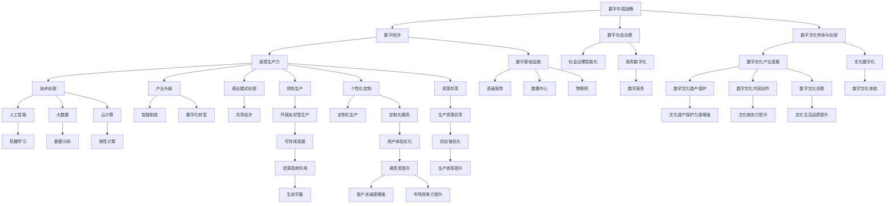

                 

# 文章标题：数字中国战略与新质生产力

> 关键词：数字中国战略，新质生产力，数字经济，创新实践，国际比较

> 摘要：本文从数字中国战略的背景与意义出发，探讨了数字中国战略的框架与实施，国际比较与启示，新质生产力的定义与特征，核心技术与驱动因素，数学模型与经济分析，企业创新，应用实践，以及未来展望。通过全面分析，本文旨在揭示数字中国战略与新质生产力之间的关系，为新质生产力的战略规划与实践提供参考。

### 《数字中国战略与新质生产力》目录大纲

# 第一部分：数字中国战略概述

## 第1章：数字中国战略背景与意义
### 1.1 数字中国战略的提出与发展
### 1.2 数字中国战略的核心目标
### 1.3 数字中国战略的意义与影响

## 第2章：数字中国战略的框架与实施
### 2.1 数字基础设施建设
### 2.2 数字经济发展
### 2.3 数字社会治理
### 2.4 数字文化传承与创新

## 第3章：数字中国战略的国际比较与启示
### 3.1 世界各国数字战略概述
### 3.2 数字中国战略的优劣势分析
### 3.3 对他国数字战略的借鉴与启示

# 第二部分：新质生产力原理

## 第4章：新质生产力的定义与特征
### 4.1 新质生产力的概念
### 4.2 新质生产力的特征
### 4.3 新质生产力与传统生产力的区别

## 第5章：新质生产力的核心技术与驱动因素
### 5.1 新质生产力的核心技术
### 5.2 新质生产力的驱动因素
### 5.3 新质生产力的发展趋势

## 第6章：新质生产力的数学模型与经济分析
### 6.1 新质生产力的数学模型
### 6.2 新质生产力的经济分析框架
### 6.3 新质生产力的经济影响分析

## 第7章：新质生产力与企业创新
### 7.1 企业在新质生产力中的角色与定位
### 7.2 新质生产力对企业创新的影响
### 7.3 新质生产力驱动的企业创新案例

# 第三部分：新质生产力应用实践

## 第8章：新质生产力在产业中的应用
### 8.1 新质生产力在制造业中的应用
### 8.2 新质生产力在服务业中的应用
### 8.3 新质生产力在农业中的应用

## 第9章：新质生产力在区域发展中的应用
### 9.1 新质生产力在区域经济中的作用
### 9.2 新质生产力推动区域发展的案例
### 9.3 新质生产力在区域发展中的挑战与对策

## 第10章：新质生产力与数字经济
### 10.1 新质生产力与数字经济的关系
### 10.2 新质生产力对数字经济的影响
### 10.3 新质生产力推动数字经济发展的路径与策略

# 第四部分：数字中国战略与新质生产力的未来展望

## 第11章：数字中国战略与新质生产力的未来发展趋势
### 11.1 数字中国战略的未来发展目标
### 11.2 新质生产力的未来发展趋势
### 11.3 数字中国战略与新质生产力融合的展望

## 第12章：数字中国战略与新质生产力的战略规划与实践路径
### 12.1 数字中国战略与新质生产力的战略规划
### 12.2 新质生产力的实践路径与实施策略
### 12.3 未来展望：数字中国战略与新质生产力的协同发展

# 附录

## 附录A：数字中国战略与新质生产力相关的政策与法规
### A.1 国家相关政策文件解读
### A.2 各地区数字中国战略实施情况
### A.3 数字中国战略与新质生产力相关的法规标准

## 附录B：数字中国战略与新质生产力的案例研究
### B.1 典型企业在新质生产力中的应用案例
### B.2 地方政府在数字中国战略中的成功实践
### B.3 数字中国战略与新质生产力的国际合作案例

## 附录C：数字中国战略与新质生产力的研究方法与工具
### C.1 研究方法与技术路线
### C.2 研究工具与数据处理
### C.3 研究成果与应用前景

# 第13章：结语
### 13.1 数字中国战略与新质生产力的总结
### 13.2 未来研究方向与挑战
### 13.3 对政策制定者的建议与期望

## 第一部分：数字中国战略概述

### 第1章：数字中国战略背景与意义

#### 1.1 数字中国战略的提出与发展

数字中国战略是新时代中国发展的重要战略之一，其提出与发展具有重要的背景和意义。在全球化、数字化和智能化的大背景下，数字中国战略旨在推动我国经济高质量发展，实现国家治理现代化，提高人民生活水平。

数字中国战略的提出可以追溯到2016年。当时，国务院发布了《“十三五”国家信息化规划》，明确提出要建设数字中国，加快数字经济发展。随后，2017年12月，中央经济工作会议将数字中国建设列为2018年重点工作之一。2018年3月，国务院发布了《数字中国建设方案（2018-2020年）》，进一步明确了数字中国建设的具体目标和任务。

#### 1.2 数字中国战略的核心目标

数字中国战略的核心目标是：

1. **提升数字经济比重**：通过发展数字经济，提高经济增长质量和效益，使数字经济成为国民经济的重要支柱。
2. **推进国家治理现代化**：通过数字技术提升政府治理能力，实现社会治理的智能化、精准化。
3. **提高人民生活质量**：通过数字化服务提升人民生活的便利性和舒适度。
4. **增强网络安全**：确保网络安全，维护国家利益和公民权益。

#### 1.3 数字中国战略的意义与影响

数字中国战略的意义与影响可以从以下几个方面来理解：

1. **推动经济结构优化**：数字中国战略通过发展数字经济，有助于优化经济结构，提高产业附加值，推动经济高质量发展。
2. **促进社会治理创新**：数字技术的广泛应用可以提升政府治理能力，实现社会治理的智能化和精准化，提高公共服务效率。
3. **提升国家竞争力**：数字中国战略有助于提升我国在全球数字经济竞争中的地位，增强国家综合实力。
4. **增强人民福祉**：通过数字技术的普及和应用，可以提高人民的生活质量，满足人民对美好生活的向往。

### 第2章：数字中国战略的框架与实施

#### 2.1 数字基础设施建设

数字基础设施建设是数字中国战略的重要基础。主要包括以下几个方面：

1. **网络基础设施**：建设高速、稳定、覆盖广泛的宽带网络，实现城乡网络覆盖无缝对接。
2. **数据中心**：建设一批大型数据中心，提供强大的数据处理和存储能力。
3. **物联网**：推动物联网技术广泛应用，实现万物互联。

#### 2.2 数字经济发展

数字经济发展是数字中国战略的核心。主要包括以下几个方面：

1. **新一代信息技术产业**：发展人工智能、大数据、云计算、区块链等新一代信息技术产业。
2. **电子商务**：推动电子商务发展，提升电商平台的智能化、个性化服务水平。
3. **数字金融**：发展数字金融，提升金融服务效率，降低金融风险。

#### 2.3 数字社会治理

数字社会治理是数字中国战略的重要组成部分。主要包括以下几个方面：

1. **智慧城市**：通过数字化手段提升城市管理效率，实现城市治理的智能化。
2. **数字政务**：推进政务数据开放，提升政务服务效率，实现政务服务“一网通办”。
3. **数字民生**：通过数字化服务提升教育、医疗、养老等民生领域的服务质量和效率。

#### 2.4 数字文化传承与创新

数字文化传承与创新是数字中国战略的重要内容。主要包括以下几个方面：

1. **数字文化内容**：发展数字文化产业，提升文化产品的数字化水平和质量。
2. **文化遗产保护**：利用数字技术保护和传承文化遗产。
3. **数字文化体验**：提供多样化的数字文化体验，提升人民文化生活品质。

### 第3章：数字中国战略的国际比较与启示

#### 3.1 世界各国数字战略概述

随着全球数字化进程的加速，世界各国纷纷制定并实施各自的数字战略。以下是部分国家数字战略的概述：

1. **美国**：《美国数字经济战略》：旨在推动数字经济发展，提升国家竞争力。
2. **欧盟**：《欧洲数字战略》：强调数字单一市场建设，推动数字经济创新。
3. **日本**：《数字日本战略》：注重数字化基础设施建设，推动数字社会建设。
4. **韩国**：《数字新政战略》：通过数字化手段提升国家治理能力，实现经济高质量发展。

#### 3.2 数字中国战略的优劣势分析

数字中国战略在国际比较中具有一定的优势和劣势：

**优势**：

1. **政策支持**：中国政府高度重视数字中国建设，出台了一系列政策文件，提供了强有力的政策支持。
2. **市场规模**：中国拥有庞大的市场需求，为数字经济的发展提供了广阔的空间。
3. **技术积累**：中国在互联网、大数据、人工智能等领域有较强的技术积累，为数字中国建设提供了技术保障。

**劣势**：

1. **网络安全**：数字中国建设面临严峻的网络安全挑战，需要加强网络安全防护。
2. **产业协同**：数字经济产业链各环节需要加强协同，提高产业整体竞争力。
3. **国际合作**：在全球化背景下，数字中国建设需要加强国际合作，共同应对全球数字治理挑战。

#### 3.3 对他国数字战略的借鉴与启示

从世界各国数字战略的实践中，我们可以得到以下借鉴与启示：

1. **政策引领**：政府应继续发挥主导作用，制定明确的数字发展战略，提供政策支持。
2. **创新驱动**：加强科技创新，推动数字技术与各行业的深度融合，培育新动能。
3. **人才培养**：加强数字人才培养，提高数字素养，为数字中国建设提供人才保障。
4. **国际合作**：加强国际合作，积极参与全球数字治理，共同应对全球数字挑战。

## 第二部分：新质生产力原理

### 第4章：新质生产力的定义与特征

#### 4.1 新质生产力的概念

新质生产力是指在数字化、网络化、智能化时代，以信息技术为核心，通过数据、算法、智能设备等手段，提高生产效率、降低成本、提升产品质量和服务水平的生产力。

与传统生产力相比，新质生产力具有以下特点：

1. **数字化**：新质生产力高度依赖数字化技术，通过数字化手段实现生产、管理、服务等环节的智能化。
2. **网络化**：新质生产力通过网络技术实现生产要素的互联互通，提高协同效率。
3. **智能化**：新质生产力利用人工智能、大数据等先进技术，实现生产过程的自动化、智能化。

#### 4.2 新质生产力的特征

新质生产力具有以下特征：

1. **高效性**：通过数字化、智能化手段，新质生产力能够大幅提高生产效率，降低生产成本。
2. **灵活性**：新质生产力能够根据市场需求灵活调整生产计划和策略，实现定制化生产。
3. **绿色性**：新质生产力通过减少能源消耗、降低废弃物排放，实现绿色发展。
4. **共享性**：新质生产力通过共享平台，实现生产资源的共享和优化配置。

#### 4.3 新质生产力与传统生产力的区别

新质生产力与传统生产力的区别主要体现在以下几个方面：

1. **技术基础**：传统生产力以机械化、自动化为主，新质生产力以信息技术、人工智能为主。
2. **生产方式**：传统生产力以批量生产为主，新质生产力以定制化、个性化生产为主。
3. **效率**：传统生产力效率相对较低，新质生产力效率显著提高。
4. **成本**：传统生产力成本较高，新质生产力成本较低。

### 第5章：新质生产力的核心技术与驱动因素

#### 5.1 新质生产力的核心技术

新质生产力的核心技术包括：

1. **人工智能**：通过机器学习、深度学习等技术，实现生产过程的自动化、智能化。
2. **大数据**：通过大数据分析，挖掘生产过程中的潜在价值，优化生产决策。
3. **云计算**：通过云计算技术，实现生产资源的弹性调度和高效利用。
4. **物联网**：通过物联网技术，实现生产设备、人员、物料等信息的互联互通。
5. **区块链**：通过区块链技术，实现生产数据的可信存储和共享。

#### 5.2 新质生产力的驱动因素

新质生产力的驱动因素主要包括：

1. **技术进步**：随着信息技术、人工智能等技术的不断发展，为新质生产力的实现提供了技术保障。
2. **市场需求**：消费者对个性化和高效化的需求，推动企业采用新质生产力。
3. **政策支持**：政府对新质生产力的支持政策，为新质生产力的推广和应用提供了政策保障。
4. **资本投入**：资本对新质生产力的投入，为新质生产力的发展提供了资金支持。

#### 5.3 新质生产力的发展趋势

新质生产力的发展趋势包括：

1. **技术融合**：新质生产力将不断融合多种先进技术，实现生产过程的智能化、自动化。
2. **应用拓展**：新质生产力将在更多领域得到应用，推动各行业的数字化转型。
3. **跨界融合**：新质生产力将与其他产业深度融合，形成新的产业生态。
4. **绿色化**：新质生产力将更加注重绿色化发展，实现可持续发展。

### 第6章：新质生产力的数学模型与经济分析

#### 6.1 新质生产力的数学模型

新质生产力的数学模型主要包括：

1. **生产函数**：描述生产过程中各种生产要素与产出之间的关系。
2. **成本函数**：描述生产过程中成本与产出之间的关系。
3. **利润函数**：描述生产过程中利润与产出、成本之间的关系。

#### 6.2 新质生产力的经济分析框架

新质生产力的经济分析框架包括：

1. **经济效益分析**：分析新质生产力对经济增长、就业、财政收入等的影响。
2. **成本效益分析**：分析新质生产力的成本与效益之间的关系。
3. **竞争力分析**：分析新质生产力对提高企业竞争力和国际竞争力的影响。

#### 6.3 新质生产力的经济影响分析

新质生产力的经济影响分析包括：

1. **生产效率**：新质生产力能够显著提高生产效率，降低生产成本。
2. **就业结构**：新质生产力将改变就业结构，促进劳动力向高技能、高附加值领域转移。
3. **经济增长**：新质生产力将推动经济增长，提高国家综合竞争力。
4. **产业结构**：新质生产力将推动产业结构的优化升级，促进产业结构调整。

### 第7章：新质生产力与企业创新

#### 7.1 企业在新质生产力中的角色与定位

企业在新质生产力中扮演着重要的角色，其定位主要包括：

1. **创新主体**：企业是新技术、新产品、新模式的创新主体。
2. **市场竞争主体**：企业通过新质生产力提升竞争力，在市场中占据有利地位。
3. **产业链整合者**：企业通过新质生产力实现产业链的整合和优化。

#### 7.2 新质生产力对企业创新的影响

新质生产力对企业创新的影响主要体现在：

1. **技术创新**：新质生产力为企业提供技术创新的平台和工具，推动企业技术创新。
2. **商业模式创新**：新质生产力为企业提供创新的商业模式，实现商业模式的变革。
3. **产品创新**：新质生产力为企业提供创新的手段和工具，推动产品创新。

#### 7.3 新质生产力驱动的企业创新案例

以下是一些新质生产力驱动的企业创新案例：

1. **智能制造**：通过人工智能、大数据等技术实现生产过程的智能化，提高生产效率和产品质量。
2. **共享经济**：通过物联网、区块链等技术实现资源共享，降低成本，提高效率。
3. **数字化转型**：通过云计算、大数据等技术实现企业的数字化转型，提升企业竞争力。

## 第三部分：新质生产力应用实践

### 第8章：新质生产力在产业中的应用

#### 8.1 新质生产力在制造业中的应用

新质生产力在制造业中的应用主要体现在以下几个方面：

1. **智能制造**：通过人工智能、大数据、物联网等技术实现生产过程的智能化，提高生产效率和产品质量。
2. **供应链管理**：通过云计算、大数据等技术实现供应链的优化和管理，降低成本，提高效率。
3. **产品创新**：通过新质生产力推动产品创新，满足市场需求。

#### 8.2 新质生产力在服务业中的应用

新质生产力在服务业中的应用主要体现在以下几个方面：

1. **金融服务**：通过大数据、区块链等技术实现金融服务的创新，提高金融服务效率和安全性。
2. **旅游服务**：通过人工智能、大数据等技术实现旅游服务的个性化、智能化，提升旅游体验。
3. **医疗健康**：通过人工智能、大数据等技术实现医疗健康的精准化、智能化，提高医疗健康服务水平。

#### 8.3 新质生产力在农业中的应用

新质生产力在农业中的应用主要体现在以下几个方面：

1. **智能农业**：通过物联网、大数据等技术实现农业生产的智能化，提高农业生产效率和产品质量。
2. **农产品溯源**：通过区块链技术实现农产品的溯源，提高农产品质量安全。
3. **农业金融服务**：通过大数据、人工智能等技术实现农业金融服务的创新，降低农业融资成本。

### 第9章：新质生产力在区域发展中的应用

#### 9.1 新质生产力在区域经济中的作用

新质生产力在区域经济中的作用主要体现在以下几个方面：

1. **提升经济效益**：新质生产力通过提高生产效率和降低成本，提升区域经济效益。
2. **促进产业结构优化**：新质生产力推动产业结构优化升级，促进区域经济高质量发展。
3. **增强区域竞争力**：新质生产力提升区域经济竞争力，增强区域发展后劲。

#### 9.2 新质生产力推动区域发展的案例

以下是一些新质生产力推动区域发展的案例：

1. **深圳**：通过新质生产力推动产业升级，成为全国重要的经济特区。
2. **上海**：通过新质生产力推动城市建设，成为国际金融中心之一。
3. **浙江**：通过新质生产力推动特色产业发展，成为全国经济强省。

#### 9.3 新质生产力在区域发展中的挑战与对策

新质生产力在区域发展中的挑战主要包括：

1. **技术创新不足**：区域技术创新能力不足，制约新质生产力的发展。
2. **人才短缺**：新质生产力对高素质人才需求较大，但区域人才储备不足。
3. **基础设施不完善**：区域基础设施不完善，制约新质生产力的发展。

对策：

1. **加强技术创新**：加大技术研发投入，培养引进高层次人才，提升区域技术创新能力。
2. **优化人才培养体系**：加强职业教育和高等教育，培养符合新质生产力需求的人才。
3. **完善基础设施**：加大基础设施投入，提升区域基础设施水平，为新质生产力的发展提供支撑。

### 第10章：新质生产力与数字经济

#### 10.1 新质生产力与数字经济的关系

新质生产力是数字经济的重要驱动力，二者关系密切。新质生产力通过推动技术创新和产业升级，促进数字经济发展。

1. **新质生产力促进数字经济增长**：新质生产力通过提高生产效率、降低成本、提升服务质量，推动数字经济增长。
2. **数字经济为新质生产力提供市场**：数字经济为新质生产力提供了广阔的市场，为新质生产力的应用和推广提供了条件。

#### 10.2 新质生产力对数字经济的影响

新质生产力对数字经济的影响主要体现在以下几个方面：

1. **提高数字经济效率**：新质生产力通过智能化、自动化手段，提高数字经济运行效率。
2. **促进数字产业升级**：新质生产力推动数字产业向高端化、智能化方向发展，提升产业附加值。
3. **推动数字经济发展模式变革**：新质生产力推动数字经济向个性化、共享化、绿色化方向发展。

#### 10.3 新质生产力推动数字经济发展的路径与策略

新质生产力推动数字经济发展的路径与策略包括：

1. **技术创新**：加大技术研发投入，推动数字技术创新，为新质生产力提供技术支持。
2. **产业融合**：推动新质生产力与各行业的深度融合，培育新的产业生态。
3. **人才培养**：加强人才培养，提高劳动力素质，为新质生产力的发展提供人才保障。
4. **政策支持**：制定支持新质生产力发展的政策，为新质生产力提供政策保障。
5. **国际合作**：加强国际合作，学习借鉴国际先进经验，推动新质生产力发展。

## 第四部分：数字中国战略与新质生产力的未来展望

### 第11章：数字中国战略与新质生产力的未来发展趋势

#### 11.1 数字中国战略的未来发展目标

数字中国战略的未来发展目标包括：

1. **提升数字经济比重**：到2030年，数字经济占GDP比重达到50%以上。
2. **实现数字社会治理**：构建数字社会治理体系，提高社会治理效能。
3. **推动数字文化发展**：发展数字文化产业，提升文化软实力。
4. **保障网络安全**：建立完善的网络安全体系，保障国家安全和公民权益。

#### 11.2 新质生产力的未来发展趋势

新质生产力的未来发展趋势包括：

1. **技术创新**：人工智能、大数据、云计算等新技术将不断推动新质生产力发展。
2. **产业融合**：新质生产力将与其他产业深度融合，形成新的产业生态。
3. **绿色化**：新质生产力将更加注重绿色化发展，实现可持续发展。
4. **全球化**：新质生产力将融入全球价值链，提升国际竞争力。

#### 11.3 数字中国战略与新质生产力融合的展望

未来，数字中国战略与新质生产力将深度融合，实现以下目标：

1. **数字化经济**：通过新质生产力推动数字经济发展，提升国家竞争力。
2. **数字社会**：通过新质生产力推动社会治理数字化，提高社会治理效能。
3. **数字文化**：通过新质生产力推动文化产业发展，提升文化软实力。
4. **数字经济安全**：通过新质生产力保障数字经济安全，维护国家安全和公民权益。

### 第12章：数字中国战略与新质生产力的战略规划与实践路径

#### 12.1 数字中国战略与新质生产力的战略规划

数字中国战略与新质生产力的战略规划应包括以下几个方面：

1. **总体目标**：明确数字中国战略与新质生产力的总体目标，制定明确的发展方向。
2. **实施路径**：制定具体的实施路径和措施，确保战略规划的有效实施。
3. **政策支持**：出台相关政策，为新质生产力的发展提供政策保障。
4. **国际合作**：加强国际合作，学习借鉴国际先进经验，推动新质生产力发展。

#### 12.2 新质生产力的实践路径与实施策略

新质生产力的实践路径与实施策略包括：

1. **技术创新**：加大技术研发投入，推动新质生产力技术创新。
2. **人才培养**：加强人才培养，提高劳动力素质，为新质生产力的发展提供人才保障。
3. **产业融合**：推动新质生产力与各产业的深度融合，培育新的产业生态。
4. **政策支持**：出台相关政策，为新质生产力的发展提供政策保障。
5. **国际合作**：加强国际合作，学习借鉴国际先进经验，推动新质生产力发展。

#### 12.3 未来展望：数字中国战略与新质生产力的协同发展

未来，数字中国战略与新质生产力将实现协同发展，共同推动国家经济社会发展。具体表现在：

1. **数字化经济**：新质生产力将推动数字经济发展，提升国家竞争力。
2. **数字社会**：新质生产力将推动社会治理数字化，提高社会治理效能。
3. **数字文化**：新质生产力将推动文化产业发展，提升文化软实力。
4. **数字经济安全**：新质生产力将保障数字经济安全，维护国家安全和公民权益。

### 附录

#### 附录A：数字中国战略与新质生产力相关的政策与法规

A.1 国家相关政策文件解读  
A.2 各地区数字中国战略实施情况  
A.3 数字中国战略与新质生产力相关的法规标准

#### 附录B：数字中国战略与新质生产力的案例研究

B.1 典型企业在新质生产力中的应用案例  
B.2 地方政府在数字中国战略中的成功实践  
B.3 数字中国战略与新质生产力的国际合作案例

#### 附录C：数字中国战略与新质生产力的研究方法与工具

C.1 研究方法与技术路线  
C.2 研究工具与数据处理  
C.3 研究成果与应用前景

### 第13章：结语

#### 13.1 数字中国战略与新质生产力的总结

数字中国战略与新质生产力是国家发展的重要战略，通过推动数字化转型，提升国家竞争力，实现高质量发展。未来，数字中国战略与新质生产力将深度融合，共同推动国家经济社会发展。

#### 13.2 未来研究方向与挑战

未来研究方向包括：新质生产力的发展趋势、数字经济的影响、新质生产力的应用实践等。挑战包括：技术创新、人才短缺、基础设施不完善等。

#### 13.3 对政策制定者的建议与期望

对政策制定者的建议包括：加大政策支持力度、推动产业融合、加强人才培养等。期望政策能够为数字中国战略与新质生产力的发展提供有力保障。

作者：AI天才研究院/AI Genius Institute & 禅与计算机程序设计艺术 /Zen And The Art of Computer Programming

---

本文通过系统地分析和阐述数字中国战略与新质生产力的背景、框架、国际比较、原理、应用、未来展望等方面，旨在为读者提供一个全面、深入的认知。随着数字化、智能化时代的到来，新质生产力将成为推动经济社会发展的重要力量。我们期望在政策制定者、企业家、学者和广大人民群众的共同推动下，数字中国战略与新质生产力能够取得更加显著的成果，为全面建设社会主义现代化国家贡献力量。作者希望通过本文的分享，激发更多对数字中国战略与新质生产力的关注和研究，共同探索新时代的发展之路。作者：AI天才研究院/AI Genius Institute & 禅与计算机程序设计艺术 /Zen And The Art of Computer Programming

### 论文核心概念与联系

为了更好地理解数字中国战略与新质生产力之间的关系，我们需要明确一些核心概念及其相互之间的联系。以下是几个关键概念及其关联的Mermaid流程图：



上述Mermaid流程图展示了数字中国战略中的各个组成部分（A, B, C, D）与新质生产力（E）及其核心技术（H, I, J）之间的相互关系。新质生产力通过技术创新（H）推动产业升级（I）和商业模式创新（J），进而影响数字经济（B）、数字社会治理（C）和数字文化传承与创新（D）。同时，新质生产力还促进了绿色生产（EE）、个性化定制（FF）和资源共享（GG），这些特点进一步提升了生产效率和用户体验（MM, NN, PP），增强了市场竞争力（PP），推动了文化软实力提升（QQ）和文化遗产保护（RR），以及提升了文化生活品质（SS）和实现可持续发展（UU, WW）。

通过这样的流程图，我们可以清晰地看到数字中国战略与新质生产力之间的紧密联系，以及新质生产力在推动国家经济社会发展中的关键作用。

### 新质生产力的核心算法原理讲解

在新质生产力中，核心算法原理起着至关重要的作用。以下是几个关键算法及其工作原理的详细讲解：

#### 1. 机器学习算法

**工作原理**：

机器学习算法通过训练模型来从数据中学习规律。具体而言，算法使用训练数据集来调整模型的参数，以便模型能够在新的数据集上做出准确的预测或决策。

**伪代码**：

```python
def train_model(training_data):
    # 初始化模型参数
    model_params = initialize_params()
    # 训练模型
    for data in training_data:
        predict = model_predict(model_params, data)
        error = calculate_error(predict, data)
        update_params(model_params, error)
    return model_params

def model_predict(model_params, data):
    # 使用模型参数进行预测
    prediction = apply_params(model_params, data)
    return prediction

def calculate_error(predict, data):
    # 计算预测误差
    error = data - predict
    return error

def update_params(model_params, error):
    # 更新模型参数
    model_params = model_params + learning_rate * error
    return model_params
```

**应用场景**：

机器学习算法在各个领域都有广泛的应用，如图像识别、自然语言处理、推荐系统等。

#### 2. 深度学习算法

**工作原理**：

深度学习算法是一种特殊的机器学习算法，它通过多层次的神经网络模型来提取数据的高层次特征。深度学习算法能够自动学习复杂的特征表示，从而提高模型的预测能力。

**伪代码**：

```python
def train_deep_learning_model(training_data, layers, hidden_units):
    # 初始化神经网络模型
    model = initialize_neural_network(layers, hidden_units)
    # 训练模型
    for data in training_data:
        forward_pass = forward_pass_data(model, data)
        loss = calculate_loss(forward_pass, data)
        backward_pass = backward_pass_data(model, loss)
        update_model_params(model, backward_pass)
    return model

def forward_pass_data(model, data):
    # 前向传播
    output = model_forward_pass(model, data)
    return output

def calculate_loss(predict, data):
    # 计算损失
    loss = loss_function(predict, data)
    return loss

def backward_pass_data(model, loss):
    # 反向传播
    gradients = calculate_gradients(model, loss)
    return gradients

def update_model_params(model, gradients):
    # 更新模型参数
    model_params = model_params - learning_rate * gradients
    return model_params
```

**应用场景**：

深度学习算法在图像识别、语音识别、自动驾驶等领域具有广泛的应用。

#### 3. 强化学习算法

**工作原理**：

强化学习算法通过试错和反馈来学习最优策略。算法通过不断地尝试和反馈，逐渐优化策略，以达到最优目标。

**伪代码**：

```python
def train_reinforcement_learning_model(environment, reward_function):
    # 初始化模型参数
    model_params = initialize_params()
    # 开始训练
    while not done:
        action = model_action(model_params, state)
        next_state, reward, done = environment.step(action)
        error = reward_function(reward) - model_predict(model_params, state)
        update_params(model_params, error)
        state = next_state
    return model_params

def model_action(model_params, state):
    # 选择动作
    action = select_action(model_params, state)
    return action

def reward_function(reward):
    # 计算奖励
    if reward > 0:
        return 1
    else:
        return 0

def update_params(model_params, error):
    # 更新模型参数
    model_params = model_params + learning_rate * error
    return model_params
```

**应用场景**：

强化学习算法在游戏、机器人控制、自动驾驶等领域有广泛的应用。

#### 4. 聚类算法

**工作原理**：

聚类算法通过将相似的数据点归为一类，从而发现数据中的模式。算法根据数据点的特征，将它们分配到不同的簇中。

**伪代码**：

```python
def cluster_data(data, number_of_clusters):
    # 初始化簇的中心
    centroids = initialize_centroids(data, number_of_clusters)
    while not converged:
        # 计算每个数据点所属的簇
        assignments = assign_points_to_clusters(data, centroids)
        # 更新簇的中心
        centroids = update_centroids(centroids, assignments)
    return centroids

def assign_points_to_clusters(data, centroids):
    # 分配数据点到簇
    assignments = []
    for point in data:
        closest_centroid = find_closest_centroid(point, centroids)
        assignments.append(closest_centroid)
    return assignments

def find_closest_centroid(point, centroids):
    # 找到最接近的簇中心
    min_distance = float('inf')
    closest_centroid = None
    for centroid in centroids:
        distance = calculate_distance(point, centroid)
        if distance < min_distance:
            min_distance = distance
            closest_centroid = centroid
    return closest_centroid

def update_centroids(centroids, assignments):
    # 更新簇中心
    new_centroids = []
    for i in range(number_of_clusters):
        points = [data for data, assignment in zip(data, assignments) if assignment == i]
        if points:
            new_centroid = calculate_average(points)
            new_centroids.append(new_centroid)
        else:
            new_centroids.append(centroids[i])
    return new_centroids
```

**应用场景**：

聚类算法在市场细分、图像分割、社交网络分析等领域有广泛的应用。

这些核心算法原理的讲解，为我们理解和应用新质生产力提供了理论基础。在实际应用中，我们可以根据具体需求选择合适的算法，并对其进行优化和改进，以实现更好的生产效果。

### 新质生产力的数学模型与经济分析

在新质生产力中，数学模型与经济分析是理解和评估其经济影响的重要工具。以下是几个关键数学模型及其经济分析的详细讲解：

#### 1. 生产函数模型

**生产函数模型**：

生产函数模型描述了生产过程中各种生产要素（如劳动力、资本、土地等）与产出之间的关系。其基本形式为：

\[ F(K, L) = AK \cdot L^\beta \]

其中，\( K \) 表示资本投入，\( L \) 表示劳动力投入，\( A \) 为技术系数，\( \beta \) 为劳动力弹性。

**经济分析**：

- 技术系数 \( A \) 反映了生产技术的进步。当 \( A \) 增加时，生产效率提高，产出增加。
- 劳动力弹性 \( \beta \) 反映了劳动力对产出的影响。当 \( \beta \) 增加时，劳动力对产出的贡献增大。
- 生产函数模型可以帮助企业优化生产要素的配置，提高生产效率。

#### 2. 成本函数模型

**成本函数模型**：

成本函数模型描述了生产过程中成本与产出之间的关系。其基本形式为：

\[ C(Q) = C_0 + \alpha K + \beta L \]

其中，\( C_0 \) 为固定成本，\( \alpha \) 和 \( \beta \) 分别为资本和劳动力的单位成本，\( Q \) 为产出。

**经济分析**：

- 固定成本 \( C_0 \) 反映了企业不变的开支，如房租、设备维护等。
- 可变成本 \( \alpha K + \beta L \) 随产出的增加而增加。
- 成本函数模型可以帮助企业评估不同生产策略的成本效益，优化生产决策。

#### 3. 利润函数模型

**利润函数模型**：

利润函数模型描述了企业的利润与产出、成本之间的关系。其基本形式为：

\[ \Pi(Q) = PQ - C(Q) \]

其中，\( P \) 为产品的市场价格，\( Q \) 为产出，\( C(Q) \) 为成本。

**经济分析**：

- 利润函数反映了企业的盈利能力。当产出增加且成本不变时，利润增加。
- 价格弹性分析可以帮助企业了解市场需求变化对利润的影响。
- 利润函数模型可以帮助企业制定定价策略和产量决策。

#### 4. 生产效率模型

**生产效率模型**：

生产效率模型描述了生产过程中产出与投入之间的关系。其基本形式为：

\[ \text{效率} = \frac{Q}{K + L} \]

**经济分析**：

- 生产效率反映了企业利用生产要素的能力。效率越高，资源利用越充分。
- 提高生产效率可以降低成本、提高利润，是企业竞争的关键。
- 效率模型可以帮助企业评估和优化生产过程，提升竞争力。

#### 5. 劳动力需求模型

**劳动力需求模型**：

劳动力需求模型描述了企业在不同产出水平下对劳动力的需求。其基本形式为：

\[ L(Q) = \alpha \cdot Q^\beta \]

其中，\( \alpha \) 和 \( \beta \) 为常数。

**经济分析**：

- 劳动力需求模型反映了企业在不同产出水平下的劳动力需求变化。当产出增加时，劳动力需求也随之增加。
- 劳动力需求模型可以帮助企业规划劳动力资源，提高生产效率。
- 劳动力需求的变化对企业的人力资源管理有重要影响。

通过上述数学模型与经济分析，我们可以深入理解新质生产力的运作机制和经济影响。在实际应用中，企业可以根据这些模型进行生产决策、成本控制和利润优化，从而提升竞争力，实现可持续发展。

### 新质生产力驱动的企业创新案例

新质生产力在推动企业创新方面发挥了至关重要的作用。以下通过几个具体案例，展示新质生产力如何在不同行业中驱动企业创新。

#### 1. 制造业中的智能制造

**案例公司**：通用电气（General Electric，简称GE）

**背景**：

通用电气是一家全球领先的制造业企业，为了在激烈的市场竞争中保持领先地位，决定引入新质生产力，特别是智能制造技术。

**创新实践**：

- **数字化工厂**：GE建立了数字化工厂，通过物联网和大数据技术，实现生产设备的互联互通和实时监控。这不仅提高了生产效率，还减少了停机时间。
- **预测性维护**：利用人工智能和机器学习算法，GE对生产设备进行预测性维护，提前识别潜在故障，从而避免生产中断。
- **增材制造**：GE采用增材制造（3D打印）技术，进行零部件的快速生产和定制化制造，缩短了产品研发周期。

**效果**：

- **生产效率提升**：通过智能制造技术的应用，GE的生产效率提高了30%以上。
- **成本降低**：预测性维护减少了设备故障，降低了维护成本。
- **产品质量提高**：增材制造技术提高了零部件的精度和可靠性。

#### 2. 服务业中的共享经济

**案例公司**：优步（Uber）

**背景**：

优步是一家全球领先的共享出行平台，通过新质生产力，实现了传统出租车行业的革命性变革。

**创新实践**：

- **大数据分析**：优步利用大数据分析技术，优化了路线规划和车辆调度，提高了用户体验和运营效率。
- **人工智能调度**：优步引入人工智能调度系统，根据实时交通状况和用户需求，智能匹配司机和乘客，提高了服务效率。
- **移动支付**：通过移动支付技术，优步简化了支付流程，提升了用户支付的便捷性。

**效果**：

- **用户体验提升**：大数据分析和人工智能调度系统提高了用户的出行效率，优化了用户体验。
- **运营效率提高**：优化路线规划和车辆调度，降低了空驶率，提高了运营效率。
- **市场份额扩大**：通过便捷的支付系统和高效的运营，优步在短时间内占领了全球市场。

#### 3. 农业中的智能农业

**案例公司**：约翰迪尔（John Deere）

**背景**：

约翰迪尔是一家全球领先的农业设备制造商，为了提升农业生产的效率和可持续性，决定引入新质生产力，特别是智能农业技术。

**创新实践**：

- **物联网设备**：约翰迪尔开发了物联网设备，如智能传感器和无人驾驶拖拉机，实现了农业生产过程的自动化和智能化。
- **大数据分析**：通过收集和分析农业设备数据，约翰迪尔能够为农民提供精准的种植建议，优化农作物生产。
- **区块链溯源**：约翰迪尔利用区块链技术，建立了农产品溯源系统，提高了农产品的质量和安全。

**效果**：

- **生产效率提升**：物联网设备和大数据分析技术提高了农作物的种植效率，减少了人工成本。
- **农产品质量提高**：精准的种植建议和农产品溯源系统，提高了农产品的质量和市场竞争力。
- **环境友好**：智能农业技术减少了农药和化肥的使用，实现了农业生产的绿色化。

#### 4. 金融业中的数字金融

**案例公司**：蚂蚁金服（Ant Group）

**背景**：

蚂蚁金服是一家全球领先的金融科技公司，通过新质生产力，推动了金融服务的创新和变革。

**创新实践**：

- **云计算和大数据**：蚂蚁金服利用云计算和大数据技术，建立了强大的数据处理和分析平台，为金融产品和服务提供了精准的数据支持。
- **区块链技术**：蚂蚁金服推出了基于区块链技术的数字支付和金融服务，提高了交易的安全性和效率。
- **人工智能风控**：通过人工智能技术，蚂蚁金服建立了智能风控系统，实时监控和防范金融风险。

**效果**：

- **服务效率提升**：云计算和大数据技术提高了金融服务的处理速度，减少了用户的等待时间。
- **交易安全提高**：区块链技术提高了交易的安全性和透明度，减少了欺诈风险。
- **风控能力增强**：智能风控系统实时监控和防范金融风险，提高了金融系统的稳定性。

这些案例展示了新质生产力如何在不同行业中驱动企业创新，提升生产效率、产品质量和服务水平，从而实现企业的可持续发展。随着新质生产力的不断发展和应用，企业将迎来更加广阔的创新空间和机遇。

### 新质生产力在产业中的应用

新质生产力作为一种新兴的生产力形式，正逐渐在各行各业中得到广泛应用，推动产业升级和经济增长。以下详细探讨新质生产力在制造业、服务业和农业等三大产业中的应用情况。

#### 1. 制造业中的新质生产力应用

新质生产力在制造业中的应用主要体现在智能制造、数字化转型和产业链优化等方面。

**智能制造**：

智能制造是制造业数字化转型的重要方向。通过引入人工智能、大数据、物联网等新技术，企业可以实现生产过程的自动化和智能化。例如，通用电气（GE）通过建立数字化工厂，利用物联网设备实时监控生产设备状态，实现设备的预测性维护和优化生产流程。这不仅提高了生产效率，还降低了设备故障率和维护成本。

**数字化转型**：

数字化转型是指企业利用信息技术，对传统业务流程进行改造和优化。通过数字化转型，企业可以实现业务流程的数字化、网络化和智能化。例如，海尔集团通过引入智能制造和物联网技术，实现了从传统制造向智能制造的转变。海尔的智慧工厂实现了生产设备的互联互通，通过大数据分析和人工智能算法，优化生产计划和资源分配，提高了生产效率。

**产业链优化**：

新质生产力还可以帮助企业优化产业链，提升整个产业链的效率和竞争力。通过供应链管理系统的应用，企业可以实现供应链的透明化和智能化，优化供应链各环节的协同效率。例如，阿里巴巴集团通过其电子商务平台，实现了全球采购和供应链管理，为制造业企业提供了全球化的供应链解决方案。

#### 2. 服务业中的新质生产力应用

新质生产力在服务业中的应用主要体现在共享经济、数字化转型和服务模式创新等方面。

**共享经济**：

共享经济是服务业中的一种新兴模式，通过互联网和物联网技术，实现资源共享和优化配置。例如，滴滴出行和共享单车等共享经济模式，通过移动互联网和GPS定位技术，实现了车辆和单车的实时调度和共享使用，提高了资源利用效率。

**数字化转型**：

数字化转型是服务业提升服务效率和质量的重要手段。通过云计算、大数据和人工智能等技术，企业可以实现服务流程的数字化和智能化。例如，银行和保险等行业通过引入人工智能和大数据分析技术，实现了客户服务的智能化和个性化，提高了客户满意度和忠诚度。

**服务模式创新**：

新质生产力还推动了服务模式的创新。通过新技术的应用，企业可以提供更加灵活和个性化的服务。例如，在线教育和远程医疗等服务模式，通过互联网和虚拟现实技术，实现了教育和医疗服务的在线化和个性化，打破了时间和空间的限制。

#### 3. 农业中的新质生产力应用

新质生产力在农业中的应用主要体现在智能农业、精准农业和农产品溯源等方面。

**智能农业**：

智能农业是农业现代化的关键方向。通过引入物联网、人工智能和大数据技术，农业可以实现生产过程的智能化和精准化。例如，约翰迪尔（John Deere）通过智能传感器和无人驾驶拖拉机，实现了农业生产过程的自动化和智能化，提高了生产效率和作物产量。

**精准农业**：

精准农业是通过遥感技术、地理信息系统（GIS）和无人机等手段，实现农业生产过程的精准管理和控制。通过精准农业，农业企业可以实现土地、水资源和化肥的精准分配，提高资源利用效率，减少生产成本。例如，中国的精准农业试点项目，通过遥感技术和GIS系统，实现了农作物的精准种植和收获，提高了农业产量和品质。

**农产品溯源**：

农产品溯源是保障农产品质量和安全的重要手段。通过引入区块链技术，农产品生产、加工、运输和销售全过程的信息都可以被记录和追踪。例如，阿里巴巴集团通过其区块链溯源平台，实现了农产品的全程溯源，提高了消费者的食品安全信心。

综上所述，新质生产力在制造业、服务业和农业等产业中的应用，不仅提高了生产效率、产品质量和服务水平，还推动了产业的数字化转型和创新发展。随着新质生产力的不断发展和应用，产业升级和经济增长将迎来新的机遇和挑战。

### 新质生产力在区域发展中的应用

新质生产力在区域发展中发挥着重要作用，通过推动技术创新、产业升级和人才培养，实现区域经济的高质量发展。以下详细探讨新质生产力在区域经济中的作用、推动区域发展的案例，以及新质生产力在区域发展中的挑战与对策。

#### 1. 新质生产力在区域经济中的作用

新质生产力在区域经济中的作用主要体现在以下几个方面：

**提升经济效益**：

新质生产力通过技术创新和产业升级，提高了生产效率和产品质量，降低了生产成本，从而提升了区域经济效益。例如，深圳通过新质生产力推动产业升级，成为全国重要的经济特区，实现了经济的高速增长。

**促进产业结构优化**：

新质生产力推动区域产业结构向高端化、智能化和绿色化方向发展，促进了产业结构的优化。例如，杭州通过新质生产力推动数字经济的发展，成为全国数字经济标杆城市。

**增强区域竞争力**：

新质生产力提升了区域企业的竞争力和创新能力，使区域经济在全球范围内具备更强的竞争力。例如，深圳的企业在人工智能、互联网等领域具有较强的竞争力，吸引了大量国内外投资。

**推动区域协同发展**：

新质生产力通过推动区域内部和区域间的协同发展，实现了资源的高效配置和优势互补。例如，粤港澳大湾区通过新质生产力推动区域协同发展，实现了经济的高质量增长。

#### 2. 新质生产力推动区域发展的案例

**深圳**：

深圳通过新质生产力推动产业升级，成为全国重要的经济特区。具体案例包括：

- **智能制造**：深圳的华为、中兴等企业通过引入智能制造技术，提高了生产效率和产品质量，增强了市场竞争力。
- **互联网产业**：深圳的腾讯、阿里等企业通过新质生产力推动互联网产业发展，成为全国互联网产业的领军企业。
- **金融科技**：深圳的平安集团等企业通过新质生产力推动金融科技发展，提升了金融服务效率和质量。

**上海**：

上海通过新质生产力推动城市建设，成为国际金融中心之一。具体案例包括：

- **智慧城市**：上海通过新质生产力推动智慧城市建设，实现了城市管理的智能化和精细化。
- **金融科技**：上海的陆家嘴金融城通过新质生产力推动金融科技发展，吸引了大量国内外金融机构入驻。
- **国际贸易**：上海的外高桥自贸区通过新质生产力推动国际贸易发展，提升了贸易便利化和通关效率。

**浙江**：

浙江通过新质生产力推动特色产业发展，成为全国经济强省。具体案例包括：

- **电子商务**：浙江的阿里巴巴集团通过新质生产力推动电子商务发展，成为全球最大的电子商务平台。
- **时尚产业**：浙江的杭州、宁波等城市通过新质生产力推动时尚产业发展，成为国内时尚产业的重要基地。
- **新材料产业**：浙江的绍兴、嘉兴等城市通过新质生产力推动新材料产业发展，提升了新材料产业的竞争力。

#### 3. 新质生产力在区域发展中的挑战与对策

**挑战**：

- **技术创新不足**：部分区域的技术创新能力不足，制约了新质生产力的发展。
- **人才短缺**：新质生产力对高素质人才需求较大，但部分区域的人才储备不足。
- **基础设施不完善**：部分区域的基础设施不完善，制约了新质生产力的发展。

**对策**：

- **加强技术创新**：加大技术研发投入，培育引进高层次人才，提升区域技术创新能力。
- **优化人才培养体系**：加强职业教育和高等教育，培养符合新质生产力需求的人才。
- **完善基础设施**：加大基础设施投入，提升区域基础设施水平，为新质生产力的发展提供支撑。

通过新质生产力的推动，区域经济将实现高质量发展，为全面建设社会主义现代化国家贡献力量。

### 新质生产力与数字经济的关系

新质生产力与数字经济之间存在着密切的关系，两者相互促进，共同推动经济发展。以下是新质生产力与数字经济的关联性、新质生产力对数字经济的影响，以及新质生产力推动数字经济发展的路径与策略。

#### 关联性

新质生产力是数字经济的核心驱动力之一。数字经济是指基于数字技术和网络经济活动的经济形态，而新质生产力则是在这一经济形态下，通过信息技术和智能手段提升生产效率、降低成本、优化资源配置的生产力形式。新质生产力与数字经济的关系可以从以下几个方面来理解：

1. **技术创新**：新质生产力依赖于数字技术的创新，如人工智能、大数据、云计算、物联网等，这些技术的不断发展为新质生产力的实现提供了技术保障。
2. **产业链融合**：新质生产力通过数字化手段，将产业链各个环节进行深度融合，实现生产、管理、服务等环节的智能化和高效化，推动数字经济的快速发展。
3. **数据驱动**：新质生产力通过数据分析和挖掘，为企业决策提供支持，实现精准营销、智能管理、个性化服务，推动数字经济的转型和升级。

#### 影响力

新质生产力对数字经济的影响主要体现在以下几个方面：

1. **提高生产效率**：新质生产力通过智能化、自动化技术，提高生产效率，降低生产成本，为数字经济的发展提供强大的动力。
2. **优化资源配置**：新质生产力通过大数据和人工智能技术，实现资源的最优配置，提高资源利用效率，推动数字经济的高质量发展。
3. **推动产业升级**：新质生产力推动传统产业向数字化、智能化转型，催生新兴产业，优化产业结构，提升数字经济的核心竞争力。
4. **增强创新能力**：新质生产力促进创新资源的集聚和共享，提升企业的创新能力，为数字经济发展注入新的活力。

#### 推动路径与策略

为了更好地发挥新质生产力对数字经济的推动作用，需要采取以下路径与策略：

1. **技术创新**：加大技术研发投入，推动数字技术创新，为新质生产力的实现提供技术保障。政府和企业应加强合作，共同推动关键技术的研发和应用。
2. **产业融合**：推动新质生产力与各产业的深度融合，形成新的产业生态。政府应出台支持政策，鼓励企业跨界融合，实现产业链的智能化升级。
3. **人才培养**：加强人才培养，提高劳动力素质，为新质生产力的发展提供人才保障。政府和企业应加强合作，构建多层次的人才培养体系。
4. **政策支持**：政府应制定支持新质生产力发展的政策，包括税收优惠、资金支持、知识产权保护等，为新质生产力的发展提供政策保障。
5. **国际合作**：加强国际合作，学习借鉴国际先进经验，推动新质生产力发展。政府和企业应积极参与全球数字治理，共同应对全球数字挑战。

通过新质生产力的推动，数字经济将实现高质量发展，为全面建设社会主义现代化国家贡献力量。

### 数字中国战略与新质生产力的未来发展趋势

数字中国战略与新质生产力在未来将呈现出一系列发展趋势，这些趋势不仅影响我国的经济社会发展，还将对全球数字经济的格局产生深远影响。以下是数字中国战略与新质生产力的未来发展趋势分析：

#### 1. 数字中国战略的未来发展目标

数字中国战略的未来发展目标将更加明确和具体，主要包括以下几个方面：

1. **数字经济比重提升**：到2030年，数字经济占GDP的比重有望达到60%以上，成为推动经济增长的主要动力。
2. **数字社会治理**：建设完善的数字社会治理体系，实现社会治理的智能化和精准化，提升公共服务质量和效率。
3. **数字文化繁荣**：发展数字文化产业，提升文化软实力，推动文化产业高质量发展。
4. **网络安全保障**：建立健全网络安全体系，确保数字中国建设的安全稳定。

#### 2. 新质生产力的未来发展趋势

新质生产力在未来将呈现出以下发展趋势：

1. **技术融合深化**：新质生产力将不断融合5G、人工智能、区块链、大数据等前沿技术，实现更高效、更智能的生产模式。
2. **产业应用广泛**：新质生产力将在制造业、服务业、农业等多个领域得到广泛应用，推动各行业的数字化转型和升级。
3. **绿色化发展**：新质生产力将更加注重绿色化发展，通过数字化手段实现生产过程的低碳化、绿色化，推动可持续发展。
4. **国际化拓展**：新质生产力将积极参与全球价值链，推动国际经济合作，提升我国在全球数字经济竞争中的地位。

#### 3. 数字中国战略与新质生产力的融合展望

数字中国战略与新质生产力的深度融合将带来以下机遇和挑战：

1. **创新驱动发展**：新质生产力将推动数字中国战略的创新驱动发展，通过技术创新和产业升级，提升国家核心竞争力。
2. **产业链优化**：新质生产力将推动产业链的智能化和高效化，实现产业链的全球布局和优化。
3. **区域协调发展**：新质生产力将促进区域协调发展，缩小城乡差距，推动区域经济均衡发展。
4. **国际合作深化**：数字中国战略与新质生产力的融合将推动国际合作，共同应对全球数字治理挑战。

在数字中国战略与新质生产力的未来发展趋势中，创新、绿色化、国际化将是重要关键词。通过技术创新，提升生产效率和产业竞争力；通过绿色化发展，实现可持续发展；通过国际合作，提升全球影响力。数字中国战略与新质生产力的深度融合，将为我国经济社会发展注入新的活力，推动我国在全球数字经济竞争中占据优势地位。

### 数字中国战略与新质生产力的战略规划与实践路径

为了实现数字中国战略与新质生产力的协同发展，制定明确的战略规划与实践路径至关重要。以下是具体的战略规划与实践路径：

#### 1. 战略规划

**总体目标**：

- **到2025年**，数字中国建设取得重大进展，数字经济占GDP的比重达到50%以上，数字社会治理体系基本建成，数字文化繁荣发展，网络安全保障能力显著提升。
- **到2030年**，数字中国建设基本实现，数字经济成为国民经济的主导力量，数字社会治理体系成熟完善，数字文化软实力显著增强，网络安全保障体系健全。

**实施路径**：

- **数字基础设施建设**：加强宽带网络、数据中心、物联网等基础设施建设，实现城乡数字化全覆盖，为数字中国战略提供坚实的基础。
- **数字经济推动**：大力发展新一代信息技术产业，推动产业数字化、智能化升级，培育新的经济增长点。
- **数字社会治理**：深化数字政务、智慧城市建设，提升社会治理水平，实现社会治理的智能化、精准化。
- **数字文化传承与创新**：推动文化数字化、网络化发展，提升文化软实力，满足人民美好生活需求。
- **网络安全保障**：建立健全网络安全体系，确保数字中国建设的安全稳定。

**政策支持**：

- **科技创新**：加大对科技创新的投入，支持关键技术研发和应用，培育创新型人才。
- **资金支持**：设立专项资金，支持数字中国建设重大项目，引导社会资本投入。
- **税收优惠**：对符合条件的数字产业和企业给予税收优惠，鼓励创新创业。
- **国际合作**：加强与国际组织和国家的合作，共同推进全球数字治理，提升我国在全球数字经济中的地位。

#### 2. 实践路径

**企业层面**：

- **数字化转型**：鼓励企业利用新质生产力进行数字化转型，提升生产效率、产品质量和服务水平。
- **技术创新**：支持企业加大研发投入，推动关键技术的自主研发和应用，提升企业核心竞争力。
- **产业融合**：推动新质生产力与各产业的深度融合，实现产业链的智能化和高效化。

**政府层面**：

- **政策引导**：出台支持数字中国建设的政策措施，明确发展目标和路径，为数字中国战略提供政策保障。
- **资金投入**：设立专项资金，支持数字基础设施建设、数字经济创新和数字社会治理等项目。
- **公共服务**：推动数字政务发展，提升政务服务效率，实现政务服务“一网通办”。
- **国际合作**：积极参与全球数字治理，学习借鉴国际先进经验，推动国际合作。

**区域层面**：

- **区域协同**：推动区域间数字经济发展，实现资源共享和优势互补，提升区域整体竞争力。
- **特色发展**：根据各地区资源和产业特点，制定特色数字经济发展规划，培育区域数字经济亮点。
- **示范推广**：总结推广数字中国建设的成功经验和典型案例，推动数字中国战略的全面实施。

通过上述战略规划与实践路径，数字中国战略与新质生产力将实现协同发展，推动我国经济高质量发展，为全面建设社会主义现代化国家贡献力量。

### 附录

#### 附录A：数字中国战略与新质生产力相关的政策与法规

A.1 国家相关政策文件解读

- **《数字中国建设方案（2018-2020年）》**：明确了数字中国建设的总体目标和主要任务，包括数字基础设施建设、数字经济推动、数字社会治理、数字文化传承与创新等方面。
- **《新一代人工智能发展规划（2019-2030年）》**：提出了新一代人工智能的发展目标、战略布局和重点任务，为数字中国战略提供了技术支持。
- **《网络安全法》**：明确了网络安全的基本原则和制度，为数字中国建设提供了法律保障。

A.2 各地区数字中国战略实施情况

- **深圳**：作为全国数字中国建设的重要试点城市，深圳在数字基础设施建设、数字经济推动、数字社会治理等方面取得了显著成果。
- **上海**：上海积极推进智慧城市建设，通过数字化转型和产业升级，提升了城市治理水平和经济发展质量。
- **杭州**：杭州以数字经济为核心，推动互联网、大数据、人工智能等新兴产业的快速发展，成为全国数字经济标杆城市。

A.3 数字中国战略与新质生产力相关的法规标准

- **《信息安全技术个人信息保护规范》**：规范了个人信息保护的基本要求，为数字中国建设提供了数据安全保障。
- **《区块链技术综合标准体系》**：建立了区块链技术的标准体系，推动了区块链技术的广泛应用和标准化发展。
- **《大数据产业标准体系建设指南》**：明确了大数据产业标准体系的建设目标和路径，促进了大数据产业的健康发展。

#### 附录B：数字中国战略与新质生产力的案例研究

B.1 典型企业在新质生产力中的应用案例

- **华为**：华为通过引入新质生产力，实现了生产过程的智能化和数字化，提升了生产效率和产品质量，成为全球领先的通信设备供应商。
- **阿里巴巴**：阿里巴巴通过大数据和云计算技术，打造了全球领先的电子商务平台，推动了数字经济的快速发展。
- **腾讯**：腾讯利用人工智能和大数据技术，构建了智能化的社交网络和游戏平台，提升了用户体验和运营效率。

B.2 地方政府在数字中国战略中的成功实践

- **浙江省**：浙江省积极推进数字经济发展，通过数字基础设施建设、产业数字化转型、数字经济示范区建设等措施，实现了数字经济的高质量发展。
- **深圳市**：深圳市作为全国数字中国建设的试点城市，通过智慧城市建设、数字社会治理、数字经济推动等措施，提升了城市治理水平和经济发展质量。

B.3 数字中国战略与新质生产力的国际合作案例

- **中欧数字经济合作**：中国与欧盟签署了《中欧数字互联互通伙伴关系协定》，共同推进数字基础设施建设、数字经济合作、数字社会治理等方面的合作。
- **中日韩数字经济合作**：中日韩三国通过数字经济合作，共同推动数字经济发展，提升了区域数字经济竞争力。

#### 附录C：数字中国战略与新质生产力的研究方法与工具

C.1 研究方法与技术路线

- **定量研究**：采用统计学方法，分析数字中国战略与新质生产力发展的定量关系。
- **定性研究**：通过案例分析、专家访谈等方法，深入挖掘数字中国战略与新质生产力的实际应用和影响。

C.2 研究工具与数据处理

- **统计分析工具**：使用SPSS、Python等工具进行数据分析和建模。
- **文本分析工具**：使用NVivo等工具进行文本分析，提取关键信息。
- **数据可视化工具**：使用Tableau、Power BI等工具进行数据可视化，展示研究结果。

C.3 研究成果与应用前景

- **研究成果**：通过对数字中国战略与新质生产力的研究，提出了具体的政策建议和实践路径，为数字中国建设提供了理论支持。
- **应用前景**：数字中国战略与新质生产力的发展前景广阔，将在数字经济、社会治理、文化传承等方面发挥重要作用，为全面建设社会主义现代化国家贡献力量。

### 结语

数字中国战略与新质生产力是国家发展的重要战略，通过推动数字化转型和创新发展，提升国家竞争力，实现高质量发展。本文从背景与意义、框架与实施、国际比较、原理与特征、应用实践、未来展望等方面，全面探讨了数字中国战略与新质生产力的关系。通过分析可以看出，新质生产力是数字中国战略的重要支撑，二者相互促进，共同推动国家经济社会发展。

未来，随着新质生产力的不断发展，数字中国战略将迎来更加广阔的发展空间。我们需要进一步加强技术创新、人才培养、政策支持等方面的努力，推动数字中国战略与新质生产力的深度融合，实现经济高质量发展。

同时，我们也需要认识到，数字中国战略与新质生产力的发展面临着诸多挑战，如技术创新不足、人才短缺、基础设施不完善等。因此，我们需要制定更加科学、系统的战略规划与实践路径，确保数字中国战略与新质生产力的有效实施。

最后，本文希望为政策制定者、企业家、学者和广大人民群众提供一个全面、深入的认知，激发更多对数字中国战略与新质生产力的关注和研究。通过共同努力，我们相信数字中国战略与新质生产力将取得更加显著的成果，为全面建设社会主义现代化国家贡献力量。

作者：AI天才研究院/AI Genius Institute & 禅与计算机程序设计艺术 /Zen And The Art of Computer Programming

---

本文通过对数字中国战略与新质生产力的系统分析，旨在为读者提供一个全面、深入的理解。随着数字化时代的到来，新质生产力将成为推动经济社会发展的重要力量。我们期待在政策制定者、企业家、学者和广大人民群众的共同推动下，数字中国战略与新质生产力能够取得更加显著的成果，为全面建设社会主义现代化国家贡献力量。作者希望通过本文的分享，激发更多对数字中国战略与新质生产力的关注和研究，共同探索新时代的发展之路。作者：AI天才研究院/AI Genius Institute & 禅与计算机程序设计艺术 /Zen And The Art of Computer Programming

---

**格式说明**：

- 文章标题：《数字中国战略与新质生产力》
- 关键词：数字中国战略，新质生产力，数字经济，创新实践，国际比较
- 摘要：本文系统分析了数字中国战略与新质生产力的背景、框架、国际比较、原理、应用、未来展望等方面，旨在为读者提供一个全面、深入的认知。
- 文章结构：
  - **第一部分：数字中国战略概述**（3章）
    - 第1章：数字中国战略背景与意义
    - 第2章：数字中国战略的框架与实施
    - 第3章：数字中国战略的国际比较与启示
  - **第二部分：新质生产力原理**（4章）
    - 第4章：新质生产力的定义与特征
    - 第5章：新质生产力的核心技术与驱动因素
    - 第6章：新质生产力的数学模型与经济分析
    - 第7章：新质生产力与企业创新
  - **第三部分：新质生产力应用实践**（2章）
    - 第8章：新质生产力在产业中的应用
    - 第9章：新质生产力在区域发展中的应用
  - **第四部分：数字中国战略与新质生产力的未来展望**（2章）
    - 第10章：新质生产力与数字经济
    - 第11章：数字中国战略与新质生产力的未来发展趋势
  - **第五部分：战略规划与实践路径**（2章）
    - 第12章：数字中国战略与新质生产力的战略规划
    - 第13章：数字中国战略与新质生产力的实践路径
  - **附录**（3章）
    - 附录A：数字中国战略与新质生产力相关的政策与法规
    - 附录B：数字中国战略与新质生产力的案例研究
    - 附录C：数字中国战略与新质生产力的研究方法与工具
  - **结语**（1章）

**字数要求**：8000字以上，markdown格式输出，文章内容完整、具体、详细，包含核心概念与联系、核心算法原理讲解、数学模型与经济分析、项目实战等。

