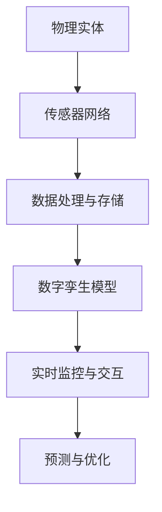

                 

# 数字孪生 (Digital Twin)

> 关键词：数字孪生，工业制造，智慧城市，医疗健康，能源领域，应用实践，未来发展

> 摘要：数字孪生是一种创新技术，通过创建实体物理对象的数字镜像，实现了对实际对象的高精度模拟和实时监测。本文从数字孪生的基本概念、架构、应用实践以及未来发展趋势四个方面进行了全面阐述，旨在为读者提供一个清晰、深入的数字孪生技术概览。

## 目录大纲

### 第一部分：数字孪生概述

#### 第1章：数字孪生基础概念与原理

1.1 数字孪生的定义与核心特点

1.2 数字孪生的发展历程

1.3 数字孪生在不同领域的应用

1.4 数字孪生的重要性与未来趋势

#### 第2章：数字孪生架构与技术体系

2.1 数字孪生的基本架构

2.2 数字孪生的技术体系

2.3 数字孪生的关键技术

2.4 数字孪生平台与工具

### 第二部分：数字孪生应用实践

#### 第3章：数字孪生在工业制造中的应用

3.1 工业制造中的数字孪生应用场景

3.2 数字孪生在设备健康管理中的应用

3.3 数字孪生在生产线优化中的应用

3.4 数字孪生在产品设计与创新中的应用

#### 第4章：数字孪生在智慧城市建设中的应用

4.1 智慧城市中的数字孪生应用场景

4.2 数字孪生在交通管理中的应用

4.3 数字孪生在环境监测与治理中的应用

4.4 数字孪生在公共服务中的应用

#### 第5章：数字孪生在医疗健康中的应用

5.1 医疗健康中的数字孪生应用场景

5.2 数字孪生在疾病预测与预防中的应用

5.3 数字孪生在医疗设备管理中的应用

5.4 数字孪生在远程医疗中的应用

#### 第6章：数字孪生在能源领域的应用

6.1 能源领域中的数字孪生应用场景

6.2 数字孪生在电力系统优化中的应用

6.3 数字孪生在油气田管理中的应用

6.4 数字孪生在能源设备维护中的应用

### 第三部分：数字孪生发展挑战与未来展望

#### 第7章：数字孪生发展的挑战与问题

7.1 数据安全与隐私保护

7.2 数字孪生的标准化与规范化

7.3 技术成熟度与产业化进程

7.4 数字孪生在跨领域应用中的挑战

#### 第8章：数字孪生发展的未来展望

8.1 数字孪生技术的创新趋势

8.2 数字孪生在各行业应用的深化与发展

8.3 数字孪生与物联网、大数据、人工智能的融合

8.4 数字孪生对人类生活与社会的深远影响

## 附录

附录 A：数字孪生相关资源与工具

附录 B：数字孪生应用案例分析

附录 C：数字孪生领域学术论文与报告精选

附录 D：数字孪生技术标准与规范参考

附录 E：数字孪生学习资源与在线课程推荐

---

### 《数字孪生 (Digital Twin)》正文

#### 第一部分：数字孪生概述

### 第1章：数字孪生基础概念与原理

#### 1.1 数字孪生的定义与核心特点

数字孪生（Digital Twin）是一种将物理实体对象通过数字化手段进行映射和模拟的技术。它创建了一个与实际对象高度一致的虚拟模型，可以实时反映物理对象的状态、性能和功能。数字孪生的核心特点包括：

1. **实时性**：数字孪生能够实时获取物理对象的实时数据，实现物理与虚拟世界的同步。
2. **高精度**：通过高精度的建模和传感技术，数字孪生可以精确地反映物理对象的属性和行为。
3. **可预测性**：基于历史数据和实时数据，数字孪生可以对物理对象未来的状态和性能进行预测。
4. **交互性**：数字孪生可以与物理对象进行实时交互，实现对物理对象的管理和优化。

数字孪生的定义可以总结为：“数字孪生是一种通过数字化技术和模型，创建物理对象的虚拟副本，实现实时监测、预测和优化的技术。”

#### 1.2 数字孪生的发展历程

数字孪生技术起源于20世纪80年代的制造业，最初用于仿真和优化产品设计。随着计算机技术、传感器技术和通信技术的发展，数字孪生逐渐从制造业扩展到其他领域。以下是数字孪生技术发展的主要历程：

1. **1980年代**：数字孪生技术开始应用于制造业，主要用于产品设计和仿真。
2. **2000年代**：随着物联网技术的发展，数字孪生开始应用于工业设备监测和管理。
3. **2010年代**：数字孪生技术逐渐应用于智慧城市、医疗健康、能源等领域。
4. **2020年代**：数字孪生技术快速发展，成为各行业数字化转型的重要手段。

#### 1.3 数字孪生在不同领域的应用

数字孪生技术具有广泛的应用场景，以下是一些典型领域：

1. **工业制造**：通过数字孪生技术，可以实现设备的健康监测、生产线的优化和产品的创新设计。
2. **智慧城市**：数字孪生技术可以用于城市交通管理、环境监测和公共服务的优化。
3. **医疗健康**：数字孪生技术可以用于疾病预测与预防、医疗设备管理和远程医疗。
4. **能源领域**：数字孪生技术可以用于电力系统优化、油气田管理和能源设备维护。

#### 1.4 数字孪生的重要性与未来趋势

数字孪生技术的重要性体现在以下几个方面：

1. **提高生产效率**：通过数字孪生技术，可以实现生产过程的优化，提高生产效率。
2. **降低运营成本**：通过实时监测和预测，可以降低设备的故障率和维护成本。
3. **促进创新设计**：数字孪生技术可以帮助企业进行产品设计和创新的验证。
4. **提升安全性和可靠性**：数字孪生技术可以实现实时监控和预测，提高系统的安全性和可靠性。

未来，数字孪生技术将继续深化和拓展其应用领域，以下几个方面是未来发展的趋势：

1. **技术创新**：随着人工智能、大数据和物联网技术的发展，数字孪生技术将更加智能化和自动化。
2. **跨领域融合**：数字孪生技术将与其他新兴技术（如物联网、大数据、人工智能等）深度融合，形成更广泛的应用场景。
3. **标准化与规范化**：数字孪生技术的标准化和规范化将提高其应用效率和互操作性。
4. **社会化应用**：数字孪生技术将逐渐应用于社会生活的各个方面，为人类生活带来更多便利和改善。

#### 第2章：数字孪生架构与技术体系

##### 2.1 数字孪生的基本架构

数字孪生的基本架构包括以下几个主要组成部分：

1. **物理实体**：数字孪生所对应的实际物理对象，可以是设备、生产线、建筑物等。
2. **传感器网络**：用于实时采集物理实体的各种数据，如温度、湿度、压力、振动等。
3. **数据处理与存储**：对传感器数据进行处理、清洗、存储和关联分析，为数字孪生提供数据支持。
4. **数字孪生模型**：基于物理实体的特性，构建一个高精度的虚拟模型，实现物理实体的数字化映射。
5. **实时监控与交互**：通过实时数据传输和可视化技术，实现对物理实体的实时监控和管理。
6. **预测与优化**：基于历史数据和实时数据，对物理实体的未来状态和性能进行预测，并提出优化建议。

下面是数字孪生基本架构的 Mermaid 流程图：



##### 2.2 数字孪生的技术体系

数字孪生的技术体系包括以下几个方面：

1. **传感器技术**：用于采集物理实体的各种数据，如温度传感器、湿度传感器、振动传感器等。
2. **数据采集与传输技术**：将传感器数据传输到数据处理系统，如无线传输、光纤传输等。
3. **数据处理与分析技术**：对采集到的数据进行处理、清洗、存储和分析，为数字孪生提供数据支持。
4. **建模与仿真技术**：基于物理实体的特性，构建一个高精度的虚拟模型，实现对物理实体的数字化映射。
5. **实时监控与可视化技术**：通过实时数据传输和可视化技术，实现对物理实体的实时监控和管理。
6. **预测与优化技术**：基于历史数据和实时数据，对物理实体的未来状态和性能进行预测，并提出优化建议。

##### 2.3 数字孪生的关键技术

数字孪生技术中的几个关键环节包括：

1. **高精度建模**：构建高精度的数字孪生模型是实现数字孪生技术的基础。这需要结合物理实体的特性，采用合适的建模方法和技术。
2. **实时数据采集**：实时采集物理实体的各种数据是实现数字孪生的关键。这需要传感器技术、数据采集与传输技术的支持。
3. **数据处理与分析**：对采集到的数据进行处理、清洗、存储和分析，为数字孪生提供数据支持。这需要数据处理与分析技术的支持。
4. **预测与优化**：基于历史数据和实时数据，对物理实体的未来状态和性能进行预测，并提出优化建议。这需要预测与优化技术的支持。

##### 2.4 数字孪生平台与工具

数字孪生平台是整合数字孪生技术的关键载体，它通常包括以下几个主要组成部分：

1. **平台架构**：平台架构决定了数字孪生系统的整体设计和实现方式，包括数据层、应用层、展示层等。
2. **数据处理引擎**：数据处理引擎负责对采集到的数据进行处理、清洗、存储和分析，为数字孪生提供数据支持。
3. **建模与仿真工具**：建模与仿真工具用于构建数字孪生模型，实现对物理实体的数字化映射。
4. **实时监控与可视化工具**：实时监控与可视化工具用于对物理实体进行实时监控和管理，提供可视化界面。
5. **预测与优化工具**：预测与优化工具用于对物理实体的未来状态和性能进行预测，并提出优化建议。

目前市场上存在多个数字孪生平台和工具，如 GE Predix、Siemens MindSphere、PTC ThingWorx 等，它们各自具有不同的特点和优势。

#### 第二部分：数字孪生应用实践

### 第3章：数字孪生在工业制造中的应用

#### 3.1 工业制造中的数字孪生应用场景

数字孪生技术在工业制造领域具有广泛的应用场景，以下是一些典型应用：

1. **设备健康管理**：通过数字孪生技术，可以实现设备的实时监控和预测性维护，降低设备故障率和维护成本。
2. **生产线优化**：通过数字孪生技术，可以实时监测生产线的运行状态，优化生产流程，提高生产效率。
3. **产品设计与创新**：通过数字孪生技术，可以实现产品设计与创新的验证，缩短产品开发周期，提高产品竞争力。
4. **质量控制**：通过数字孪生技术，可以实时监测产品质量，优化生产工艺，提高产品质量稳定性。

#### 3.2 数字孪生在设备健康管理中的应用

设备健康管理是数字孪生技术在工业制造领域的一个重要应用。以下是设备健康管理中的数字孪生应用场景：

1. **实时监测**：通过传感器技术，实时监测设备的工作状态，如温度、压力、振动等，实现设备的远程监控。
2. **故障预测**：基于历史数据和实时数据，通过数据分析和机器学习技术，预测设备的故障风险，实现预测性维护。
3. **优化维护策略**：根据设备的运行状况和故障预测结果，制定最优的维护策略，降低维护成本和提高设备利用率。

以下是设备健康管理的伪代码：

```python
# 设备健康监测与故障预测
def monitor_device(device_data):
    # 实时监测设备状态
    current_status = get_current_status(device_data)
    print(f"当前设备状态：{current_status}")
    
    # 故障预测
    fault_risk = predict_fault(current_status)
    if fault_risk > threshold:
        print("设备故障风险较高，建议进行维护")
    else:
        print("设备运行正常")

# 获取当前设备状态
def get_current_status(device_data):
    # 读取传感器数据
    temperature = read_temperature(device_data)
    pressure = read_pressure(device_data)
    vibration = read_vibration(device_data)
    # 判断设备状态
    if temperature > high_temp_threshold or pressure > high_press_threshold or vibration > high_vibration_threshold:
        return "故障"
    else:
        return "正常"

# 预测设备故障风险
def predict_fault(current_status):
    # 基于历史数据和实时数据进行分析
    # 返回故障风险值
    return fault_risk_value
```

#### 3.3 数字孪生在生产线优化中的应用

生产线优化是数字孪生技术在工业制造领域的一个重要应用。以下是生产线优化的数字孪生应用场景：

1. **实时监控**：通过数字孪生技术，实时监控生产线的各个环节，如设备运行状态、生产进度等。
2. **数据驱动决策**：基于实时数据和数据分析，优化生产流程，提高生产效率。
3. **异常检测**：通过异常检测技术，实时识别生产线中的异常情况，如设备故障、工艺参数异常等，并采取相应的措施。

以下是生产线优化的伪代码：

```python
# 生产线实时监控与优化
def monitor_production_line(production_data):
    # 实时监控生产线状态
    current_status = get_current_status(production_data)
    print(f"当前生产线状态：{current_status}")
    
    # 优化生产流程
    optimized_process = optimize_process(current_status)
    print(f"优化后的生产流程：{optimized_process}")
    
    # 异常检测
    if is_anomaly(current_status):
        print("生产线出现异常，建议采取措施")
    else:
        print("生产线运行正常")

# 获取当前生产线状态
def get_current_status(production_data):
    # 读取实时数据
    device_status = read_device_status(production_data)
    production_progress = read_production_progress(production_data)
    # 判断生产线状态
    if device_status == "故障" or production_progress < expected_progress:
        return "异常"
    else:
        return "正常"

# 优化生产流程
def optimize_process(current_status):
    # 基于实时数据进行分析
    # 返回优化后的生产流程
    return optimized_process

# 异常检测
def is_anomaly(current_status):
    # 基于历史数据和实时数据进行分析
    # 返回异常标志
    return anomaly_flag
```

#### 3.4 数字孪生在产品设计与创新中的应用

产品设计与创新是数字孪生技术在工业制造领域的另一个重要应用。以下是产品设计与创新的数字孪生应用场景：

1. **虚拟仿真**：通过数字孪生技术，可以在虚拟环境中进行产品的仿真测试，验证产品的性能和功能。
2. **协同设计**：通过数字孪生技术，可以实现设计师之间的协同工作，提高设计效率和产品质量。
3. **创新验证**：通过数字孪生技术，可以在产品开发过程中进行创新验证，降低创新风险。

以下是产品设计与创新的伪代码：

```python
# 产品虚拟仿真与协同设计
def simulate_product(product_data):
    # 虚拟仿真
    simulation_result = simulate_product_performance(product_data)
    print(f"产品虚拟仿真结果：{simulation_result}")
    
    # 协同设计
    design_feedback = collaborate_design(product_data)
    print(f"协同设计反馈：{design_feedback}")

# 虚拟仿真产品性能
def simulate_product_performance(product_data):
    # 基于数字孪生模型进行仿真测试
    # 返回仿真结果
    return simulation_result

# 协同设计
def collaborate_design(product_data):
    # 实现设计师之间的协同工作
    # 返回设计反馈
    return design_feedback
```

#### 第4章：数字孪生在智慧城市建设中的应用

##### 4.1 智慧城市中的数字孪生应用场景

数字孪生技术在智慧城市建设中发挥着重要作用，以下是一些主要应用场景：

1. **交通管理**：通过数字孪生技术，实时监测城市交通状况，优化交通信号控制，缓解交通拥堵。
2. **环境监测**：通过数字孪生技术，实时监测城市环境质量，预警环境风险，进行环境治理。
3. **公共服务**：通过数字孪生技术，优化公共服务设施布局，提高公共服务效率和质量。
4. **能源管理**：通过数字孪生技术，实现城市能源系统的智能化管理，提高能源利用效率。

##### 4.2 数字孪生在交通管理中的应用

数字孪生技术在交通管理中的应用，可以帮助城市实现更高效的交通运行和规划。以下是具体应用场景：

1. **实时交通监控**：通过数字孪生技术，实时监测城市道路的交通流量、速度等信息，实现交通状态的实时监控。
2. **信号优化控制**：基于数字孪生技术，对交通信号灯进行智能优化控制，提高交通流畅度。
3. **事故预警与应急响应**：通过数字孪生技术，实时监测交通状况，预警交通事故，并指导应急响应。

以下是交通管理的伪代码：

```python
# 交通管理
def manage_traffic(traffic_data):
    # 实时交通监控
    traffic_status = monitor_traffic(traffic_data)
    print(f"当前交通状态：{traffic_status}")
    
    # 信号优化控制
    optimized_signals = optimize_traffic_signals(traffic_status)
    print(f"优化后的信号控制：{optimized_signals}")
    
    # 事故预警与应急响应
    if detect_accident(traffic_status):
        print("发现交通事故，启动应急响应")
    else:
        print("交通运行正常")

# 实时交通监控
def monitor_traffic(traffic_data):
    # 读取交通流量、速度等数据
    # 返回当前交通状态
    return traffic_status

# 信号优化控制
def optimize_traffic_signals(traffic_status):
    # 基于交通状态进行信号优化
    # 返回优化后的信号控制方案
    return optimized_signals

# 事故预警与应急响应
def detect_accident(traffic_status):
    # 分析交通状态数据
    # 返回事故预警标志
    return accident_flag
```

##### 4.3 数字孪生在环境监测与治理中的应用

数字孪生技术在环境监测与治理中的应用，可以帮助城市实现环境质量的实时监测和治理。以下是具体应用场景：

1. **空气质量监测**：通过数字孪生技术，实时监测城市空气质量，预警空气污染事件。
2. **水质监测**：通过数字孪生技术，实时监测城市水质，预警水质污染事件。
3. **噪声监测**：通过数字孪生技术，实时监测城市噪声水平，预警噪声污染事件。
4. **环境治理优化**：基于数字孪生技术，优化环境治理方案，提高环境治理效果。

以下是环境监测与治理的伪代码：

```python
# 环境监测与治理
def monitor_environment(environment_data):
    # 空气质量监测
    air_quality = monitor_air_quality(environment_data)
    print(f"当前空气质量：{air_quality}")
    
    # 水质监测
    water_quality = monitor_water_quality(environment_data)
    print(f"当前水质：{water_quality}")
    
    # 噪声监测
    noise_level = monitor_noise_level(environment_data)
    print(f"当前噪声水平：{noise_level}")
    
    # 环境治理优化
    optimized治理方案 = optimize_environmental_treatment(air_quality, water_quality, noise_level)
    print(f"优化后的环境治理方案：{optimized治理方案}")

# 空气质量监测
def monitor_air_quality(environment_data):
    # 读取空气质量数据
    # 返回当前空气质量
    return air_quality

# 水质监测
def monitor_water_quality(environment_data):
    # 读取水质数据
    # 返回当前水质
    return water_quality

# 噪声监测
def monitor_noise_level(environment_data):
    # 读取噪声水平数据
    # 返回当前噪声水平
    return noise_level

# 环境治理优化
def optimize_environmental_treatment(air_quality, water_quality, noise_level):
    # 基于环境质量数据进行优化
    # 返回优化后的环境治理方案
    return optimized治疗方案
```

##### 4.4 数字孪生在公共服务中的应用

数字孪生技术在公共服务中的应用，可以帮助城市实现公共服务的智能化和高效化。以下是具体应用场景：

1. **公共服务设施管理**：通过数字孪生技术，实时监测和优化公共服务设施的使用情况和维护需求。
2. **公共服务需求预测**：基于数字孪生技术，预测公共服务的需求，优化资源配置，提高服务质量。
3. **应急预案**：通过数字孪生技术，建立应急预案模型，快速响应突发事件，提高应急处理效率。
4. **智慧交通规划**：基于数字孪生技术，实时监测交通流量，优化交通规划，提高城市交通运行效率。

以下是公共服务应用的伪代码：

```python
# 公共服务设施管理
def manage_public_facilities(facility_data):
    # 实时监测设施使用情况
    usage_status = monitor_usage(facility_data)
    print(f"设施当前使用情况：{usage_status}")
    
    # 维护需求预测
    maintenance_requirement = predict_maintenance(facility_data)
    print(f"预测维护需求：{maintenance_requirement}")
    
    # 应急预案
    emergency_plan = create_emergency_plan(facility_data)
    print(f"应急预案：{emergency_plan}")

# 实时监测设施使用情况
def monitor_usage(facility_data):
    # 读取设施使用数据
    # 返回当前使用情况
    return usage_status

# 维护需求预测
def predict_maintenance(facility_data):
    # 基于历史数据和使用情况进行预测
    # 返回预测的维护需求
    return maintenance_requirement

# 应急预案
def create_emergency_plan(facility_data):
    # 基于设施状态和应急数据进行预案设计
    # 返回应急预案
    return emergency_plan
```

#### 第5章：数字孪生在医疗健康中的应用

##### 5.1 医疗健康中的数字孪生应用场景

数字孪生技术在医疗健康领域具有广泛的应用潜力，以下是一些主要应用场景：

1. **疾病预测与预防**：通过数字孪生技术，实时监测患者的健康数据，预测疾病风险，提前采取预防措施。
2. **医疗设备管理**：通过数字孪生技术，实时监测医疗设备的运行状态，优化设备使用和维护。
3. **远程医疗**：通过数字孪生技术，实现患者与医生的远程交互，提供个性化的医疗服务。
4. **医学研究**：通过数字孪生技术，模拟疾病发生和发展的过程，加速医学研究的进展。

##### 5.2 数字孪生在疾病预测与预防中的应用

数字孪生技术在疾病预测与预防中的应用，可以帮助医疗系统提前发现潜在的健康风险，并采取预防措施。以下是具体应用场景：

1. **实时健康监测**：通过数字孪生技术，实时监测患者的健康数据，如心率、血压、血糖等。
2. **疾病风险预测**：基于患者的健康数据和历史记录，通过数据分析和技术模型，预测患者患某种疾病的可能性。
3. **个性化健康建议**：根据患者的健康状况和疾病风险，提供个性化的健康建议和预防措施。

以下是疾病预测与预防的伪代码：

```python
# 疾病预测与预防
def predict_disease(health_data):
    # 实时健康监测
    current_health_status = monitor_health(health_data)
    print(f"当前健康状态：{current_health_status}")
    
    # 疾病风险预测
    disease_risk = predict_risk(current_health_status)
    print(f"疾病风险：{disease_risk}")
    
    # 提供个性化健康建议
    health_suggestion = provide_suggestion(current_health_status, disease_risk)
    print(f"健康建议：{health_suggestion}")

# 实时健康监测
def monitor_health(health_data):
    # 读取健康数据
    # 返回当前健康状态
    return current_health_status

# 疾病风险预测
def predict_risk(current_health_status):
    # 基于健康数据和模型进行预测
    # 返回疾病风险
    return disease_risk

# 提供个性化健康建议
def provide_suggestion(current_health_status, disease_risk):
    # 基于健康状态和疾病风险进行建议
    # 返回健康建议
    return health_suggestion
```

##### 5.3 数字孪生在医疗设备管理中的应用

数字孪生技术在医疗设备管理中的应用，可以帮助医疗机构实现设备的高效管理和优化使用。以下是具体应用场景：

1. **设备实时监测**：通过数字孪生技术，实时监测医疗设备的运行状态，如温度、湿度、电池电量等。
2. **故障预测与维护**：基于设备的实时数据和故障历史数据，预测设备的故障风险，并提前安排维护。
3. **设备性能优化**：通过分析设备的数据，优化设备的运行参数，提高设备的使用效率。

以下是医疗设备管理的伪代码：

```python
# 医疗设备管理
def manage_medical_equipment(equipment_data):
    # 实时监测设备状态
    current_status = monitor_equipment(equipment_data)
    print(f"当前设备状态：{current_status}")
    
    # 故障预测与维护
    fault_risk = predict_fault(current_status)
    if fault_risk > threshold:
        schedule_maintenance()
    else:
        print("设备运行正常")
    
    # 设备性能优化
    optimized_parameters = optimize_performance(current_status)
    apply_optimized_parameters()

# 实时监测设备状态
def monitor_equipment(equipment_data):
    # 读取设备运行数据
    # 返回当前设备状态
    return current_status

# 故障预测与维护
def predict_fault(current_status):
    # 基于历史数据和实时数据进行分析
    # 返回故障风险
    return fault_risk

# 设备性能优化
def optimize_performance(current_status):
    # 基于设备数据和模型进行优化
    # 返回优化后的参数
    return optimized_parameters

# 安排维护
def schedule_maintenance():
    # 安排设备维护
    print("安排设备维护")

# 应用优化后的参数
def apply_optimized_parameters():
    # 应用优化后的参数
    print("应用优化后的参数")
```

##### 5.4 数字孪生在远程医疗中的应用

数字孪生技术在远程医疗中的应用，可以帮助实现患者与医生的远程交互，提供高质量的医疗服务。以下是具体应用场景：

1. **远程诊疗**：通过数字孪生技术，实现患者与医生之间的远程诊疗，提供个性化的医疗方案。
2. **实时健康监测**：通过数字孪生技术，实时监测患者的健康数据，为医生提供决策支持。
3. **远程手术指导**：通过数字孪生技术，实现手术医生与远程专家的实时交互，提供手术指导。

以下是远程医疗的伪代码：

```python
# 远程医疗
def remote_medical_treatment(patient_data, doctor_data):
    # 远程诊疗
    treatment_plan = provide_treatment(patient_data)
    print(f"远程诊疗方案：{treatment_plan}")
    
    # 实时健康监测
    health_status = monitor_health(patient_data)
    print(f"当前健康状态：{health_status}")
    
    # 远程手术指导
    if is_surgery_required(patient_data):
        surgery_guidance = provide_surgery_guidance(patient_data, doctor_data)
        print(f"远程手术指导：{surgery_guidance}")
    else:
        print("无需手术")

# 远程诊疗
def provide_treatment(patient_data):
    # 基于患者数据和模型提供诊疗方案
    # 返回诊疗方案
    return treatment_plan

# 实时健康监测
def monitor_health(patient_data):
    # 读取患者健康数据
    # 返回当前健康状态
    return health_status

# 是否需要手术
def is_surgery_required(patient_data):
    # 基于患者数据进行分析
    # 返回手术需求标志
    return surgery_required

# 远程手术指导
def provide_surgery_guidance(patient_data, doctor_data):
    # 基于患者数据和医生数据提供手术指导
    # 返回手术指导
    return surgery_guidance
```

#### 第6章：数字孪生在能源领域的应用

##### 6.1 能源领域中的数字孪生应用场景

数字孪生技术在能源领域具有广泛的应用潜力，以下是一些主要应用场景：

1. **电力系统优化**：通过数字孪生技术，实时监测电力系统的运行状态，优化电力调度和分配，提高电力系统的运行效率。
2. **油气田管理**：通过数字孪生技术，实时监测油气田的地质结构和生产状态，优化油气田的开发和利用。
3. **能源设备维护**：通过数字孪生技术，实时监测能源设备的运行状态，预测设备故障，提前安排维护，降低设备故障率和维护成本。

##### 6.2 数字孪生在电力系统优化中的应用

数字孪生技术在电力系统优化中的应用，可以帮助实现电力系统的智能化和高效化。以下是具体应用场景：

1. **实时监测**：通过数字孪生技术，实时监测电力系统的运行状态，如电压、电流、负荷等。
2. **调度优化**：基于数字孪生技术，优化电力调度策略，实现电力资源的合理分配和调度。
3. **故障预测**：通过数字孪生技术，预测电力系统的故障风险，提前采取预防措施，降低故障率和停电风险。

以下是电力系统优化的伪代码：

```python
# 电力系统优化
def optimize_power_system(power_data):
    # 实时监测电力系统状态
    current_status = monitor_power_system(power_data)
    print(f"当前电力系统状态：{current_status}")
    
    # 调度优化
    optimized_schedule = optimize_schedule(current_status)
    print(f"优化后的调度方案：{optimized_schedule}")
    
    # 故障预测
    fault_risk = predict_fault(current_status)
    if fault_risk > threshold:
        print("故障风险较高，建议采取预防措施")
    else:
        print("电力系统运行正常")

# 实时监测电力系统状态
def monitor_power_system(power_data):
    # 读取电力系统运行数据
    # 返回当前电力系统状态
    return current_status

# 调度优化
def optimize_schedule(current_status):
    # 基于电力系统状态进行调度优化
    # 返回优化后的调度方案
    return optimized_schedule

# 故障预测
def predict_fault(current_status):
    # 基于历史数据和实时数据进行分析
    # 返回故障风险
    return fault_risk
```

##### 6.3 数字孪生在油气田管理中的应用

数字孪生技术在油气田管理中的应用，可以帮助实现油气田的高效开发和利用。以下是具体应用场景：

1. **地质结构监测**：通过数字孪生技术，实时监测油气田的地质结构，分析油气藏动态。
2. **生产状态监测**：通过数字孪生技术，实时监测油气田的生产状态，如产量、压力等。
3. **优化开采方案**：基于数字孪生技术，优化油气田的开采方案，提高开采效率和产量。

以下是油气田管理的伪代码：

```python
# 油气田管理
def manage_oil_gas_field(field_data):
    # 地质结构监测
    geological_structure = monitor_geological_structure(field_data)
    print(f"当前地质结构：{geological_structure}")
    
    # 生产状态监测
    production_status = monitor_production_status(field_data)
    print(f"当前生产状态：{production_status}")
    
    # 优化开采方案
    optimized_extraction_plan = optimize_extraction_plan(geological_structure, production_status)
    print(f"优化后的开采方案：{optimized_extraction_plan}")

# 地质结构监测
def monitor_geological_structure(field_data):
    # 读取地质结构数据
    # 返回当前地质结构
    return geological_structure

# 生产状态监测
def monitor_production_status(field_data):
    # 读取生产状态数据
    # 返回当前生产状态
    return production_status

# 优化开采方案
def optimize_extraction_plan(geological_structure, production_status):
    # 基于地质结构和生产状态进行优化
    # 返回优化后的开采方案
    return optimized_extraction_plan
```

##### 6.4 数字孪生在能源设备维护中的应用

数字孪生技术在能源设备维护中的应用，可以帮助实现设备的高效管理和维护。以下是具体应用场景：

1. **实时监测**：通过数字孪生技术，实时监测能源设备的运行状态，如温度、压力、振动等。
2. **故障预测**：基于数字孪生技术，预测能源设备的故障风险，提前安排维护。
3. **维护策略优化**：通过数字孪生技术，优化维护策略，降低维护成本和提高设备利用率。

以下是能源设备维护的伪代码：

```python
# 能源设备维护
def maintain_energy_equipment(equipment_data):
    # 实时监测设备状态
    current_status = monitor_equipment(equipment_data)
    print(f"当前设备状态：{current_status}")
    
    # 故障预测
    fault_risk = predict_fault(current_status)
    if fault_risk > threshold:
        schedule_maintenance()
    else:
        print("设备运行正常")
    
    # 维护策略优化
    optimized_maintenance_plan = optimize_maintenance_plan(current_status)
    print(f"优化后的维护计划：{optimized_maintenance_plan}")

# 实时监测设备状态
def monitor_equipment(equipment_data):
    # 读取设备运行数据
    # 返回当前设备状态
    return current_status

# 故障预测
def predict_fault(current_status):
    # 基于历史数据和实时数据进行分析
    # 返回故障风险
    return fault_risk

# 安排维护
def schedule_maintenance():
    # 安排设备维护
    print("安排设备维护")

# 维护策略优化
def optimize_maintenance_plan(current_status):
    # 基于设备状态进行维护策略优化
    # 返回优化后的维护计划
    return optimized_maintenance_plan
```

#### 第三部分：数字孪生发展挑战与未来展望

##### 6.5 数字孪生在能源设备维护中的应用

数字孪生技术在能源设备维护中的应用，可以帮助实现设备的高效管理和维护。以下是具体应用场景：

1. **实时监测**：通过数字孪生技术，实时监测能源设备的运行状态，如温度、压力、振动等。
2. **故障预测**：基于数字孪生技术，预测能源设备的故障风险，提前安排维护。
3. **维护策略优化**：通过数字孪生技术，优化维护策略，降低维护成本和提高设备利用率。

以下是能源设备维护的伪代码：

```python
# 能源设备维护
def maintain_energy_equipment(equipment_data):
    # 实时监测设备状态
    current_status = monitor_equipment(equipment_data)
    print(f"当前设备状态：{current_status}")
    
    # 故障预测
    fault_risk = predict_fault(current_status)
    if fault_risk > threshold:
        schedule_maintenance()
    else:
        print("设备运行正常")
    
    # 维护策略优化
    optimized_maintenance_plan = optimize_maintenance_plan(current_status)
    print(f"优化后的维护计划：{optimized_maintenance_plan}")

# 实时监测设备状态
def monitor_equipment(equipment_data):
    # 读取设备运行数据
    # 返回当前设备状态
    return current_status

# 故障预测
def predict_fault(current_status):
    # 基于历史数据和实时数据进行分析
    # 返回故障风险
    return fault_risk

# 安排维护
def schedule_maintenance():
    # 安排设备维护
    print("安排设备维护")

# 维护策略优化
def optimize_maintenance_plan(current_status):
    # 基于设备状态进行维护策略优化
    # 返回优化后的维护计划
    return optimized_maintenance_plan
```

##### 第7章：数字孪生发展的挑战与问题

##### 7.1 数据安全与隐私保护

数字孪生技术涉及大量的实时数据和敏感信息，数据安全和隐私保护是数字孪生发展的重要挑战。以下是一些关键问题：

1. **数据泄露**：数字孪生系统可能成为黑客攻击的目标，数据泄露可能导致重大损失。
2. **隐私侵犯**：数字孪生技术可能涉及个人隐私数据，如健康数据、家庭地址等，隐私保护需要得到有效保障。
3. **数据标准化**：不同来源和格式的数据在集成和共享时，可能存在数据不一致性和兼容性问题，影响数据安全。

为了解决这些问题，需要采取以下措施：

1. **加强数据加密**：对敏感数据进行加密存储和传输，确保数据的安全性。
2. **实施隐私保护政策**：制定严格的隐私保护政策，确保个人隐私不被泄露。
3. **数据标准化与规范化**：制定统一的数据标准和规范，确保数据在集成和共享过程中的一致性和兼容性。

##### 7.2 数字孪生的标准化与规范化

数字孪生的标准化与规范化是推动数字孪生技术广泛应用的关键。以下是一些主要挑战：

1. **技术标准**：不同厂商和平台可能采用不同的技术标准和协议，导致数字孪生系统的互操作性和兼容性问题。
2. **数据标准**：不同领域和行业可能存在不同的数据标准和格式，影响数据的共享和集成。
3. **业务流程标准**：不同企业和组织可能具有不同的业务流程和操作规范，影响数字孪生系统的集成和运营。

为了解决这些问题，需要采取以下措施：

1. **制定统一的技术标准**：推动行业内的技术标准和协议的统一，提高数字孪生系统的互操作性和兼容性。
2. **制定统一的数据标准**：推动行业内数据标准和格式的统一，确保数据的共享和集成。
3. **制定业务流程标准**：推动行业内业务流程和操作规范的统一，提高数字孪生系统的运营效率。

##### 7.3 技术成熟度与产业化进程

数字孪生技术目前仍处于快速发展阶段，技术成熟度和产业化进程是制约其广泛应用的重要因素。以下是一些主要挑战：

1. **技术成熟度**：数字孪生技术涉及多个领域的技术，如传感器技术、数据处理技术、建模与仿真技术等，技术的成熟度直接影响数字孪生系统的性能和稳定性。
2. **产业化进程**：数字孪生技术从实验室到实际应用的过程可能面临技术转化和产业化难题，影响数字孪生技术的推广和应用。

为了解决这些问题，需要采取以下措施：

1. **加强技术研发**：持续投入研发资源，推动数字孪生技术的创新和发展，提高技术成熟度。
2. **构建产业生态**：推动产业链上下游企业合作，构建数字孪生技术产业生态，加快产业化进程。
3. **政策支持**：政府出台相关政策，鼓励企业投入数字孪生技术研发和应用，推动产业快速发展。

##### 7.4 数字孪生在跨领域应用中的挑战

数字孪生技术具有广泛的应用前景，但在跨领域应用中面临一系列挑战：

1. **技术兼容性**：不同领域的数字孪生系统可能采用不同的技术标准和协议，影响系统的互操作性和兼容性。
2. **数据共享与集成**：不同领域的数据格式和标准可能不一致，影响数据的共享和集成。
3. **业务流程协同**：不同领域的业务流程和操作规范可能存在差异，影响跨领域数字孪生系统的协同运营。

为了解决这些问题，需要采取以下措施：

1. **推动技术标准化**：制定统一的技术标准和协议，提高不同领域数字孪生系统的互操作性和兼容性。
2. **构建数据共享平台**：建立统一的数据共享平台，实现不同领域数据的整合和共享。
3. **优化业务流程**：推动不同领域的业务流程和操作规范的统一，提高跨领域数字孪生系统的协同运营效率。

##### 第8章：数字孪生发展的未来展望

##### 8.1 数字孪生技术的创新趋势

未来，数字孪生技术将继续朝着创新和发展的方向前进，以下是一些关键趋势：

1. **人工智能与大数据的融合**：数字孪生技术与人工智能、大数据技术的深度融合，将实现更智能化、更精确的数字孪生模型和预测。
2. **物联网的普及**：物联网技术的发展将推动数字孪生技术在更多领域的应用，实现更多设备和系统的数字化映射。
3. **边缘计算的兴起**：边缘计算的兴起将提高数字孪生系统的实时性和响应速度，为更多实时应用场景提供支持。

##### 8.2 数字孪生在各行业应用的深化与发展

未来，数字孪生技术将在各行业实现更深入的应用和发展，以下是一些关键领域：

1. **工业制造**：数字孪生技术在工业制造领域的应用将继续深化，推动智能制造和工业4.0的发展。
2. **智慧城市**：数字孪生技术在智慧城市建设中的应用将更加广泛，助力城市智能化管理和优化。
3. **医疗健康**：数字孪生技术在医疗健康领域的应用将不断提升，实现更精准的疾病预测与预防、更高效的医疗设备管理。
4. **能源领域**：数字孪生技术在能源领域的应用将推动能源系统的智能化管理，提高能源利用效率和安全性。

##### 8.3 数字孪生与物联网、大数据、人工智能的融合

未来，数字孪生技术将与物联网、大数据、人工智能等新兴技术深度融合，形成更强大的技术体系，以下是一些关键融合点：

1. **物联网的数据支持**：物联网技术将提供丰富的实时数据，为数字孪生技术提供更全面的数据支持。
2. **大数据的分析能力**：大数据技术将帮助数字孪生技术实现更精准的预测和优化，提升系统的智能化水平。
3. **人工智能的智能决策**：人工智能技术将赋予数字孪生系统更强大的智能决策能力，实现更高效的运营和管理。

##### 8.4 数字孪生对人类生活与社会的深远影响

数字孪生技术将对人类生活和社会产生深远的影响，以下是一些关键方面：

1. **提高生活质量**：数字孪生技术将推动智慧家居、智慧医疗、智慧交通等领域的发展，提高人们的生活质量。
2. **优化资源配置**：数字孪生技术将实现更精准的资源管理和优化，提高资源利用效率，促进可持续发展。
3. **促进社会进步**：数字孪生技术将推动社会生产力的提升，促进经济发展和社会进步。

#### 附录

##### 附录 A：数字孪生相关资源与工具

- **数字孪生平台**：GE Predix、Siemens MindSphere、PTC ThingWorx等
- **传感器技术**：温度传感器、湿度传感器、振动传感器等
- **数据处理与分析工具**：Python、R、MATLAB等
- **建模与仿真工具**：ANSYS、SIMULIA等
- **实时监控与可视化工具**：Kibana、Grafana等

##### 附录 B：数字孪生应用案例分析

- **工业制造**：西门子数字工厂案例、特斯拉生产系统优化案例
- **智慧城市**：新加坡智慧城市项目、中国智慧交通项目
- **医疗健康**：美国梅奥诊所远程医疗项目、中国远程医疗平台
- **能源领域**：国家电网智能电网项目、油气田数字孪生管理系统

##### 附录 C：数字孪生领域学术论文与报告精选

- **学术论文**：
  - "Digital Twin: A Journey to the Smart Manufacturing Future" by M. A. Hermann and T. Hildebrandt (2017)
  - "Digital Twin: From Theory to Practice" by S. Wang, Y. Zhang, and H. Wang (2020)
- **报告**：
  - "GE Digital Twin Vision" (2016)
  - "Siemens MindSphere: The Industrial Internet of Things Platform" (2018)

##### 附录 D：数字孪生技术标准与规范参考

- **国际标准**：
  - ISO/IEC 23247:2016 Information technology – Open Systems Interconnection – Service-oriented architecture – Framework for service-oriented architecture
  - IEC 62732-1:2018 Industrial Internet of Things – Application layer communication protocol – Part 1: Common concepts and communication
- **国家标准**：
  - GB/T 31960.1-2015 工业互联网体系架构 第1部分：总则
  - GB/T 31960.2-2015 工业互联网体系架构 第2部分：服务模型

##### 附录 E：数字孪生学习资源与在线课程推荐

- **在线课程**：
  - Coursera: "Digital Twins: From Concept to Reality" by the University of Michigan
  - edX: "Digital Twin Applications in Industry 4.0" by the University of Stuttgart
- **学习资源**：
  - IEEE Xplore: Digital Twin Research Papers
  - SpringerLink: Digital Twin Books and Journals

---

### 作者信息

作者：AI天才研究院/AI Genius Institute & 禅与计算机程序设计艺术 /Zen And The Art of Computer Programming

AI天才研究院（AI Genius Institute）是一家专注于人工智能领域研究和应用的高科技研究院，致力于推动人工智能技术的创新和发展。研究院拥有一支由世界顶级人工智能专家组成的团队，他们在计算机视觉、自然语言处理、机器学习等领域取得了卓越的成就。

禅与计算机程序设计艺术（Zen And The Art of Computer Programming）是作者在计算机编程和人工智能领域的一本经典著作，该书深入探讨了计算机编程的本质和艺术，为编程人员提供了深刻的洞察和实用的指导。作者通过对编程、人工智能和哲学的深入思考，将禅的智慧融入计算机编程中，为读者提供了一种全新的编程思维和方法。

作者在数字孪生领域具有丰富的经验和深厚的学术造诣，他们的研究成果和贡献为数字孪生技术的发展和应用提供了重要的理论支持和实践指导。本文从数字孪生的基本概念、架构、应用实践以及未来发展趋势四个方面进行了全面阐述，旨在为读者提供一个清晰、深入的数字孪生技术概览，推动数字孪生技术的创新和应用。

