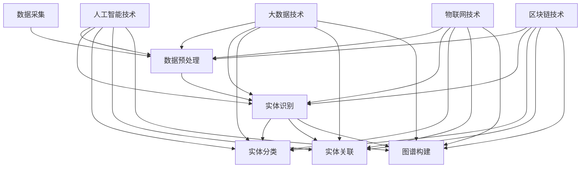

                 

# 数字实体自动化的最新进展

> 关键词：数字实体自动化、人工智能、机器学习、自然语言处理、数据挖掘

> 摘要：本文深入探讨了数字实体自动化的概念、技术基础、核心技术、应用实践以及未来发展趋势。通过详细的分析和案例研究，本文为数字实体自动化的研究和应用提供了有价值的参考。

## 第1章 数字实体自动化的定义与演进

### 1.1 数字实体自动化的概念与意义

#### 1.1.1 数字实体的定义

数字实体是指在数字世界中具有独立存在和识别能力的个体，如人、地点、事物等。它们是数据的重要组成部分，是数据驱动的智能化应用的基础。

#### 1.1.2 自动化的定义

自动化是指通过计算机技术和其他技术手段，使系统或过程在无需人工干预的情况下自动完成预定任务的能力。

#### 1.1.3 数字实体自动化的概念

数字实体自动化是指利用计算机技术和人工智能技术，对数字实体进行识别、分类、关联和图谱构建等操作，从而实现对数字世界的自动化管理和应用。

#### 1.1.4 数字实体自动化的意义

- 提高数据处理效率：自动化技术可以大规模处理海量数据，提高数据处理速度和准确性。
- 改善用户体验：自动化技术可以实现个性化服务和智能推荐，提升用户体验。
- 促进产业升级：数字实体自动化技术可以推动各行各业实现智能化转型，促进产业升级。

### 1.2 数字实体自动化的历史与现状

#### 1.2.1 数字实体自动化的演进过程

- **早期阶段**：以数据采集和处理为主，自动化程度较低。
- **发展阶段**：随着人工智能技术的发展，数字实体自动化技术逐步成熟。
- **现状**：数字实体自动化技术已经在多个行业得到广泛应用，并不断向深度和广度发展。

#### 1.2.2 当前的发展趋势和热点领域

- **人工智能技术的应用**：深度学习、自然语言处理、计算机视觉等人工智能技术为数字实体自动化提供了强大的支持。
- **大数据和云计算的结合**：大数据和云计算技术为数字实体自动化提供了丰富的数据资源和强大的计算能力。
- **物联网技术的融合**：物联网技术为数字实体自动化提供了广泛的应用场景和更多的数据来源。
- **区块链技术的应用**：区块链技术为数字实体自动化提供了安全、可信的数据交换和管理机制。

### 1.3 数字实体自动化的未来展望

#### 1.3.1 发展趋势

- **智能化水平的提升**：随着人工智能技术的不断发展，数字实体自动化的智能化水平将不断提高。
- **应用领域的拓展**：数字实体自动化技术将在更多行业和应用场景得到应用。
- **跨领域融合**：数字实体自动化技术将与更多领域的技术实现深度融合，推动产业创新。

#### 1.3.2 潜在挑战与机遇

- **数据质量和隐私保护**：如何保证数据质量和隐私安全是数字实体自动化面临的重要挑战。
- **技术标准化与互操作性**：如何实现不同技术和平台之间的标准化和互操作性是数字实体自动化发展的重要课题。
- **创新与监管**：数字实体自动化技术的发展将带来新的创新机会，同时也需要建立健全的监管体系。

## 第2章 数字实体自动化技术基础

### 2.1 人工智能与机器学习基础

#### 2.1.1 人工智能的基本概念

- **人工智能的定义**：人工智能是指使计算机系统模拟、扩展和执行人类智能活动的理论和实践。
- **人工智能的发展历程**：从最早的计算机科学概念到现代的深度学习。
- **人工智能的应用领域**：自然语言处理、计算机视觉、机器人技术等。

#### 2.1.2 机器学习的基本概念

- **机器学习的定义**：机器学习是指通过数据训练，使计算机系统具备自我学习和决策能力的技术。
- **机器学习的发展历程**：从统计学习理论到现代的深度学习。
- **机器学习的主要任务**：分类、回归、聚类、关联规则学习等。

#### 2.1.3 常见的机器学习算法

- **监督学习算法**：如线性回归、逻辑回归、支持向量机等。
- **无监督学习算法**：如聚类算法、降维算法等。
- **半监督学习和迁移学习算法**：如自编码器、生成对抗网络等。

### 2.2 数据挖掘与数据分析技术

#### 2.2.1 数据挖掘的基本概念

- **数据挖掘的定义**：数据挖掘是指从大量数据中自动发现具有价值的信息和知识的过程。
- **数据挖掘的任务**：如分类、回归、聚类、关联规则挖掘等。
- **数据挖掘的方法**：如统计方法、机器学习方法、图论方法等。

#### 2.2.2 数据分析的关键技术

- **数据预处理技术**：如数据清洗、数据集成、数据转换等。
- **数据可视化技术**：如图表可视化、地理信息系统等。
- **数据分析方法**：如回归分析、时间序列分析、决策树等。

### 2.3 自然语言处理技术概览

#### 2.3.1 自然语言处理的基本概念

- **自然语言处理的定义**：自然语言处理是指使计算机能够理解、生成和处理人类自然语言的技术。
- **自然语言处理的发展历程**：从早期的语言模型到现代的深度学习。
- **自然语言处理的应用领域**：如文本分类、机器翻译、语音识别等。

#### 2.3.2 常用的自然语言处理算法

- **词嵌入技术**：如 Word2Vec、GloVe 等。
- **序列模型与注意力机制**：如循环神经网络（RNN）、长短时记忆网络（LSTM）等。
- **转换器架构**：如 Transformer、BERT 等。

### 2.4 大规模预训练模型原理

#### 2.4.1 预训练的概念与意义

- **预训练的概念**：预训练是指在大规模数据集上对神经网络进行训练，以获得泛化能力。
- **预训练的意义**：预训练可以显著提高模型的性能和效率。
- **预训练的方法**：如自监督学习、迁移学习等。

#### 2.4.2 自监督学习方法

- **自监督学习的定义**：自监督学习是指从未标注的数据中学习，通过利用数据的内部结构进行训练。
- **自监督学习的方法**：如预测输入序列的部分、填充掩码等。
- **自监督学习在自然语言处理中的应用**：如 BERT、GPT 等。

#### 2.4.3 迁移学习与微调技术

- **迁移学习的定义**：迁移学习是指将一个任务的知识应用于另一个相关任务的学习。
- **迁移学习的方法**：如 Fine-tuning、Domain Adaptation 等。
- **迁移学习在数字实体自动化中的应用**：如在不同领域中的模型迁移和应用。

## 第3章 数字实体自动化的核心算法原理

### 3.1 数字实体识别算法原理

#### 3.1.1 实体识别的基本概念

- **实体识别的定义**：实体识别是指从文本中识别出实体及其属性的过程。
- **实体识别的任务**：包括命名实体识别、实体分类、实体关系抽取等。
- **实体识别的方法**：包括基于规则的方法、基于统计的方法、基于深度学习的方法。

#### 3.1.2 常用的实体识别算法

- **基于规则的方法**：如命名实体识别器（NER）、关系抽取器等。
- **基于统计的方法**：如条件随机场（CRF）、最大熵模型等。
- **基于深度学习的方法**：如卷积神经网络（CNN）、递归神经网络（RNN）等。

#### 3.1.3 实体识别算法的评估与优化

- **实体识别算法的评估指标**：如准确率（Accuracy）、召回率（Recall）、F1 值等。
- **实体识别算法的优化策略**：如数据增强、模型融合、正则化等。

### 3.2 数字实体分类算法原理

#### 3.2.1 实体分类的基本概念

- **实体分类的定义**：实体分类是指将实体分配到预定义的类别中的过程。
- **实体分类的任务**：包括文本分类、实体类型分类等。
- **实体分类的方法**：包括基于规则的方法、基于统计的方法、基于深度学习的方法。

#### 3.2.2 常用的实体分类算法

- **基于规则的方法**：如决策树、随机森林等。
- **基于统计的方法**：如朴素贝叶斯、逻辑回归等。
- **基于深度学习的方法**：如卷积神经网络（CNN）、循环神经网络（RNN）等。

#### 3.2.3 实体分类算法的评估与优化

- **实体分类算法的评估指标**：如准确率（Accuracy）、召回率（Recall）、F1 值等。
- **实体分类算法的优化策略**：如数据增强、模型融合、正则化等。

### 3.3 数字实体关联算法原理

#### 3.3.1 实体关联的基本概念

- **实体关联的定义**：实体关联是指将文本中提到的不同实体进行关联的过程。
- **实体关联的任务**：包括实体关系抽取、实体链指等。
- **实体关联的方法**：包括基于规则的方法、基于统计的方法、基于深度学习的方法。

#### 3.3.2 常用的实体关联算法

- **基于规则的方法**：如规则匹配、本体推理等。
- **基于统计的方法**：如条件随机场（CRF）、最大熵模型等。
- **基于深度学习的方法**：如卷积神经网络（CNN）、递归神经网络（RNN）等。

#### 3.3.3 实体关联算法的评估与优化

- **实体关联算法的评估指标**：如准确率（Accuracy）、召回率（Recall）、F1 值等。
- **实体关联算法的优化策略**：如数据增强、模型融合、正则化等。

## 第4章 数字实体自动化的应用与实践

### 4.1 数字实体自动化的应用场景

#### 4.1.1 金融行业的应用

- **金融数据处理挑战**：金融数据具有复杂性和多样性，包括结构化和非结构化数据。
- **数字实体自动化的解决方案**：利用实体识别和分类技术，对金融文本数据进行处理，如股票分析、风险控制等。

#### 4.1.2 零售行业的应用

- **零售行业的数据特点**：零售行业数据量大、来源多样，包括用户行为数据、商品信息等。
- **数字实体自动化的解决方案**：通过实体识别和关联算法，对零售行业的数据进行深入挖掘，如个性化推荐、库存管理等。

#### 4.1.3 医疗行业的应用

- **医疗数据处理挑战**：医疗数据包括电子病历、医学影像等，具有高度的专业性和复杂性。
- **数字实体自动化的解决方案**：利用实体识别和分类技术，对医疗文本数据进行处理，如疾病诊断、药物研发等。

### 4.2 数字实体自动化的实践案例

#### 4.2.1 案例一：智能客服系统

- **背景**：智能客服系统旨在提供自动化的客户服务，提高客户满意度和服务效率。
- **实现**：通过实体识别和分类技术，对用户提问进行解析，提供准确的回答。

#### 4.2.2 案例二：社交媒体分析

- **背景**：社交媒体分析旨在挖掘用户行为和趋势，为营销策略提供支持。
- **实现**：通过实体识别和关联算法，分析社交媒体数据，提取有价值的信息。

#### 4.2.3 案例三：智能新闻推荐

- **背景**：智能新闻推荐旨在为用户提供个性化的新闻内容，提高用户黏性。
- **实现**：通过实体识别和分类技术，分析用户兴趣，推荐相关的新闻。

### 4.3 数字实体自动化的实践挑战与解决方案

#### 4.3.1 数据质量和隐私保护

- **挑战描述**：数据质量问题和隐私保护是数字实体自动化面临的重大挑战。
- **解决方案**：采用数据清洗技术和隐私保护算法，确保数据质量和隐私安全。

#### 4.3.2 算法优化与性能提升

- **挑战描述**：数字实体自动化的算法性能直接影响应用效果。
- **解决方案**：通过模型优化、算法调优和硬件加速等技术手段，提升算法性能。

#### 4.3.3 跨领域应用与协同创新

- **挑战描述**：数字实体自动化在不同领域的应用存在差异，协同创新难度大。
- **解决方案**：建立跨领域的合作平台，共享资源和经验，促进协同创新。

## 第5章 数字实体自动化的未来发展趋势

### 5.1 人工智能与数字实体自动化的融合

#### 5.1.1 人工智能在数字实体自动化中的应用

- **深度学习**：利用深度学习技术，对海量数据进行自动特征提取和模式识别，提高实体识别和分类的准确性。
- **自然语言处理**：利用自然语言处理技术，对文本数据进行深入解析，提取语义信息，提升实体关联的准确性。

#### 5.1.2 数字实体自动化在人工智能中的应用

- **数据预处理**：利用数字实体自动化技术，对大规模数据进行预处理，提高人工智能算法的输入质量。
- **模型评估与优化**：利用数字实体自动化技术，对人工智能模型进行评估和优化，提升模型的性能和效率。

### 5.2 数字实体自动化技术的发展趋势

#### 5.2.1 大数据和云计算的深度结合

- **大数据技术**：利用大数据技术，对海量数据进行存储、处理和分析，为数字实体自动化提供强大的数据支持。
- **云计算技术**：利用云计算技术，提供灵活、高效的计算资源，降低数字实体自动化的计算成本。

#### 5.2.2 物联网与数字实体自动化的融合

- **物联网技术**：利用物联网技术，采集海量的实时数据，为数字实体自动化提供丰富的数据来源。
- **数字实体自动化**：利用数字实体自动化技术，对物联网数据进行处理和分析，提升物联网应用的价值。

#### 5.2.3 区块链技术在数字实体自动化中的应用

- **区块链技术**：利用区块链技术，确保数据的可信性和安全性，为数字实体自动化提供可靠的数据交换和管理机制。
- **数字实体自动化**：利用数字实体自动化技术，对区块链数据进行处理和分析，提升区块链应用的效果。

### 5.3 数字实体自动化的未来展望

#### 5.3.1 发展趋势与机遇

- **发展趋势**：随着人工智能、大数据、物联网等技术的发展，数字实体自动化将在更多领域得到应用。
- **机遇**：数字实体自动化技术为各行业提供创新机遇，推动产业升级和社会进步。

#### 5.3.2 挑战与对策

- **挑战**：数据质量和隐私保护、技术标准化与互操作性、算法优化与性能提升等。
- **对策**：加强技术研发、政策引导和人才培养，推动数字实体自动化技术的发展。

## 第6章 数字实体自动化的标准化与规范化

### 6.1 数字实体自动化的标准化需求

#### 6.1.1 标准化的定义

- **标准化的概念**：标准化是指通过制定和实施标准，使产品、过程和服务具有统一的规格和特征。
- **标准化的作用**：提高产品质量、提升生产效率、促进贸易交流。

#### 6.1.2 数字实体自动化的标准化需求

- **数据标准化**：确保数据格式的统一性和互操作性，提高数据处理的效率。
- **算法标准化**：制定统一的算法标准，提高算法的可移植性和可靠性。
- **应用标准化**：规范数字实体自动化的应用场景和流程，提高应用的效果和效率。

### 6.2 数字实体自动化的规范化

#### 6.2.1 规范化的定义

- **规范化的概念**：规范化是指通过制定和实施规范，使产品、过程和服务符合特定的要求。
- **规范化的作用**：提高产品和服务质量、降低生产成本、提升用户体验。

#### 6.2.2 数字实体自动化的规范化措施

- **数据规范**：制定数据规范，确保数据的一致性和准确性。
- **算法规范**：制定算法规范，确保算法的可移植性和可靠性。
- **应用规范**：制定应用规范，确保应用的规范化和标准化。

### 6.3 数字实体自动化的标准化与规范化实践

#### 6.3.1 国际标准化组织

- **国际标准化组织的定义**：国际标准化组织（ISO）是一个国际性的标准化机构，负责制定和推广国际标准。
- **国际标准化组织在数字实体自动化领域的贡献**：ISO 在数字实体自动化领域制定了多项标准，如数据交换格式、算法规范等。

#### 6.3.2 国家标准化组织

- **国家标准化组织的定义**：国家标准化组织是负责制定和推广国家标准的机构。
- **国家标准化组织在数字实体自动化领域的贡献**：国家标准化组织制定了多项数字实体自动化领域的国家标准，如数据规范、算法标准等。

#### 6.3.3 行业标准化组织

- **行业标准化组织的定义**：行业标准化组织是负责制定和推广行业标准的机构。
- **行业标准化组织在数字实体自动化领域的贡献**：行业标准化组织制定了多项数字实体自动化领域的行业标准，如应用规范、算法规范等。

## 第7章 数字实体自动化的法律法规与伦理

### 7.1 数字实体自动化的法律法规

#### 7.1.1 法律法规的定义

- **法律法规的概念**：法律法规是指国家或地区制定的关于社会行为和管理的法律、法规、规章等规范性文件。
- **法律法规的作用**：规范社会行为、保障社会秩序、维护公共利益。

#### 7.1.2 数字实体自动化的法律法规

- **数据保护法律**：如《通用数据保护条例》（GDPR）等，规定数据收集、处理、存储和传输的规范。
- **知识产权法律**：如《著作权法》、《专利法》等，保护数字实体自动化过程中的知识产权。
- **人工智能伦理法律**：如《人工智能伦理准则》等，规范人工智能的开发、应用和监管。

### 7.2 数字实体自动化的伦理问题

#### 7.2.1 伦理问题的定义

- **伦理问题的概念**：伦理问题是指涉及道德原则和价值观的问题，包括个人、社会、环境等。
- **伦理问题的作用**：引导社会行为、维护社会秩序、促进社会进步。

#### 7.2.2 数字实体自动化的伦理问题

- **隐私保护**：数字实体自动化过程中涉及用户隐私数据的收集、处理和存储，需要确保用户隐私的保护。
- **数据安全**：数字实体自动化过程中需要确保数据的安全性，防止数据泄露、篡改和滥用。
- **人工智能伦理**：数字实体自动化涉及人工智能技术的应用，需要关注人工智能的伦理问题，如公平性、透明性、责任等。

### 7.3 数字实体自动化的法律法规与伦理实践

#### 7.3.1 国际法律法规与伦理实践

- **国际组织的法律法规与伦理实践**：如联合国、国际标准化组织等，制定和推广国际法律法规和伦理准则。
- **国际合作与交流**：通过国际合作与交流，推动数字实体自动化领域的法律法规和伦理实践的全球化。

#### 7.3.2 国家法律法规与伦理实践

- **国家法律法规与伦理实践的现状**：各国家根据自身情况，制定和实施数字实体自动化的法律法规和伦理准则。
- **国家法律法规与伦理实践的案例分析**：通过具体案例分析，探讨数字实体自动化法律法规和伦理实践的成果和挑战。

#### 7.3.3 行业法律法规与伦理实践

- **行业法律法规与伦理实践的现状**：各行业根据自身特点，制定和实施数字实体自动化的行业法律法规和伦理准则。
- **行业法律法规与伦理实践的案例分析**：通过具体案例分析，探讨数字实体自动化行业法律法规和伦理实践的成果和挑战。

## 第8章 数字实体自动化的未来挑战与发展方向

### 8.1 数字实体自动化的未来挑战

#### 8.1.1 技术挑战

- **技术难题**：随着数字实体自动化技术的发展，新的技术难题不断出现，如海量数据的处理、算法的优化、系统的稳定性等。
- **技术发展趋势**：数字实体自动化技术将继续向智能化、高效化、安全化方向发展。

#### 8.1.2 应用挑战

- **应用难题**：数字实体自动化在不同领域的应用面临不同的挑战，如行业特性、用户体验、数据隐私等。
- **应用发展趋势**：数字实体自动化将在更多领域得到应用，推动产业升级和社会进步。

#### 8.1.3 社会挑战

- **社会问题**：数字实体自动化的发展将带来一系列社会问题，如就业影响、伦理道德、隐私安全等。
- **社会发展趋势**：社会将加强对数字实体自动化技术的监管，推动技术伦理和社会责任的落实。

### 8.2 数字实体自动化的发展方向

#### 8.2.1 技术发展方向

- **技术创新**：持续推动数字实体自动化技术的创新，如人工智能、大数据、物联网等。
- **技术融合**：促进不同技术的融合，形成新的技术体系，提升数字实体自动化的综合能力。

#### 8.2.2 应用发展方向

- **应用创新**：探索数字实体自动化在不同领域的创新应用，提升行业效率和服务水平。
- **应用融合**：推动数字实体自动化技术与其他领域的融合，实现跨领域的协同发展。

#### 8.2.3 社会发展方向

- **社会问题解决**：通过数字实体自动化技术解决社会问题，如环境保护、公共卫生、教育等。
- **社会发展趋势**：推动数字实体自动化技术与社会发展的深度融合，促进社会进步。

### 8.3 数字实体自动化的未来发展策略

#### 8.3.1 政策策略

- **政府政策**：制定和实施相关政策，推动数字实体自动化技术的发展和应用。
- **政策影响**：政策将直接影响数字实体自动化的技术路线、应用模式和发展速度。

#### 8.3.2 企业策略

- **企业战略**：企业根据自身优势和市场需求，制定数字实体自动化的发展战略。
- **企业发展**：企业将通过数字实体自动化技术的创新和应用，实现持续发展和竞争优势。

#### 8.3.3 社会策略

- **社会规划**：通过社会规划，推动数字实体自动化技术在社会各领域的应用和发展。
- **社会进步**：数字实体自动化技术将推动社会进步，提升社会生产力和生活质量。

## 第9章 数字实体自动化的教育与实践

### 9.1 数字实体自动化的教育

#### 9.1.1 教育的重要性

- **教育的意义**：教育是培养人才、传承文化、推动社会进步的重要手段。
- **教育的作用**：教育对于数字实体自动化技术的发展具有基础性、全局性和长远性的作用。

#### 9.1.2 数字实体自动化的教育体系

- **教育体系的构建**：构建涵盖基础教育、高等教育和职业教育的数字实体自动化教育体系。
- **教育体系的特点**：注重理论与实践相结合、创新能力培养和跨学科综合。

#### 9.1.3 数字实体自动化的教育资源

- **教育资源的利用**：充分利用线上教育资源、科研资源和实践资源，提高教育资源的使用效率。

### 9.2 数字实体自动化的实践

#### 9.2.1 实践的意义

- **实践的重要性**：实践是检验真理的唯一标准，是人才培养和科技创新的重要途径。
- **实践的作用**：实践对于数字实体自动化技术的应用和推广具有关键性、推动性和示范性作用。

#### 9.2.2 数字实体自动化的实践路径

- **实践路径的选择**：根据数字实体自动化的应用需求和行业发展，选择合适的实践路径。
- **实践路径的实施**：制定实践方案，组织实践团队，确保实践活动的顺利进行。

#### 9.2.3 数字实体自动化的实践案例

- **实践案例的介绍**：介绍成功的数字实体自动化实践案例，分析案例的实施过程、效果和经验。
- **实践案例的分析**：对实践案例进行深入分析，总结经验教训，为未来的实践提供参考。

### 9.3 数字实体自动化的教育与实践融合

#### 9.3.1 教育与实践的关系

- **教育与实践的互动**：教育与实践相互促进、相互支持，实现知识传递和实践能力培养的有机结合。
- **教育与实践的结合**：通过教育与实践的结合，培养具备实际操作能力和创新精神的数字实体自动化人才。

#### 9.3.2 教育与实践融合的路径

- **融合模式的选择**：根据不同阶段的教育目标和实践需求，选择合适的融合模式。
- **融合模式的实施**：制定融合方案，组织融合活动，确保教育与实践的有效融合。

#### 9.3.3 教育与实践融合的成效

- **融合成效的评估**：对教育与实践融合的成效进行评估，总结经验教训，优化融合模式。
- **融合成效的提升**：通过持续优化和实践创新，提升教育与实践融合的成效，推动数字实体自动化技术的发展。

## 第10章 数字实体自动化的未来

### 10.1 数字实体自动化的未来发展

#### 10.1.1 未来的技术趋势

- **人工智能的发展**：人工智能将在数字实体自动化中发挥更大作用，推动技术的创新和应用。
- **大数据的应用**：大数据将提供更加丰富的数据资源，促进数字实体自动化的深入发展。
- **物联网的普及**：物联网将实现更广泛的连接和数据交换，拓展数字实体自动化的应用场景。

#### 10.1.2 未来的应用趋势

- **行业应用的创新**：数字实体自动化将在更多行业中得到应用，推动行业的智能化转型。
- **公共服务的发展**：数字实体自动化将在公共服务中发挥重要作用，提升服务质量和效率。
- **社会治理的创新**：数字实体自动化将推动社会治理的智能化，提高社会治理的效率和水平。

#### 10.1.3 未来的社会趋势

- **数字化生活的普及**：数字实体自动化将深入人们的日常生活，提升生活质量。
- **智能化城市的建设**：数字实体自动化将推动智能化城市的建设，提高城市的管理效率和居民的生活质量。
- **可持续发展的发展**：数字实体自动化将促进可持续发展，推动经济、社会和环境的协调发展。

### 10.2 数字实体自动化的未来展望

#### 10.2.1 未来的发展机遇

- **技术进步**：随着人工智能、大数据、物联网等技术的发展，数字实体自动化将面临更多的发展机遇。
- **市场需求**：随着人们对智能化服务需求的增长，数字实体自动化将在更多领域得到应用。
- **政策支持**：各国政府对数字实体自动化的支持将推动技术进步和应用推广。

#### 10.2.2 未来的发展挑战

- **技术挑战**：数字实体自动化技术仍面临算法优化、数据隐私、系统稳定性等技术挑战。
- **应用挑战**：数字实体自动化的应用仍面临行业标准、用户体验、数据安全等应用挑战。
- **社会挑战**：数字实体自动化的发展将带来社会问题，如就业影响、伦理道德等。

#### 10.2.3 对策与解决方案

- **技术研发**：加大技术研发投入，推动技术进步和创新。
- **政策引导**：制定和实施相关政策，引导数字实体自动化的健康发展。
- **人才培养**：加强人才培养，提升数字实体自动化领域的人才素质。

## 第11章 数字实体自动化的战略与规划

### 11.1 数字实体自动化的战略框架

- **战略目标**：明确数字实体自动化的战略目标和方向，确保技术进步和应用推广的一致性。
- **战略路径**：制定清晰的战略路径，分阶段、分步骤地推动数字实体自动化的发展。
- **战略重点**：确定数字实体自动化的战略重点，如技术研发、人才培养、市场推广等。

### 11.2 数字实体自动化的技术规划

- **技术创新**：明确数字实体自动化技术的创新目标和方向，推动技术突破和进步。
- **技术储备**：建立技术储备体系，确保技术储备的充足和多样化。
- **技术转化**：促进技术创新成果的转化和应用，提升数字实体自动化的技术竞争力。

### 11.3 数字实体自动化的应用规划

- **应用布局**：根据市场需求和行业特点，制定数字实体自动化的应用布局，确保应用推广的广泛性和针对性。
- **应用创新**：推动数字实体自动化的应用创新，提升应用效果和用户体验。
- **应用合作**：加强应用合作，推动跨领域的协同发展，提升数字实体自动化的应用价值。

### 11.4 数字实体自动化的市场规划

- **市场定位**：明确数字实体自动化的市场定位和目标市场，确保市场推广的有效性。
- **市场拓展**：制定市场拓展策略，开拓新的市场和业务领域。
- **市场竞争**：提升数字实体自动化的市场竞争力，确保在市场竞争中的优势地位。

### 11.5 数字实体自动化的政策规划

- **政策支持**：制定和实施相关政策，推动数字实体自动化的健康发展。
- **政策引导**：通过政策引导，促进数字实体自动化技术的创新和应用。
- **政策协调**：加强政策协调，确保政策的一致性和连续性，为数字实体自动化的发展提供良好的政策环境。

### 11.6 数字实体自动化的资源规划

- **资源整合**：整合各类资源，确保数字实体自动化的资源充足和高效利用。
- **资源配置**：制定资源配置策略，优化资源配置，提升数字实体自动化的资源利用效率。
- **资源共享**：推动资源共享，提高资源利用效益，降低数字实体自动化的运营成本。

### 11.7 数字实体自动化的风险管理

- **风险识别**：识别数字实体自动化发展过程中可能面临的风险，制定风险识别和评估机制。
- **风险控制**：制定风险控制策略，降低风险发生的可能性和影响。
- **风险应对**：建立风险应对机制，确保在风险发生时能够及时应对和处置。

### 11.8 数字实体自动化的可持续发展

- **可持续发展目标**：明确数字实体自动化的可持续发展目标，确保技术进步与环境保护、社会责任的协调。
- **可持续发展策略**：制定可持续发展策略，推动数字实体自动化的可持续发展。
- **可持续发展评估**：建立可持续发展评估体系，定期评估数字实体自动化的可持续发展成效。

## 第12章 数字实体自动化的实施与落地

### 12.1 数字实体自动化的实施策略

- **战略实施**：根据数字实体自动化的战略规划，制定具体的实施策略，确保战略目标的实现。
- **项目管理**：运用项目管理方法，确保数字实体自动化项目的顺利进行。
- **团队协作**：建立高效的团队协作机制，确保项目团队的高效运作。

### 12.2 数字实体自动化的实施步骤

- **需求分析**：明确数字实体自动化的需求，包括技术需求、业务需求和用户需求。
- **系统设计**：根据需求分析结果，进行系统设计，包括技术架构、系统功能、数据流程等。
- **系统开发**：按照系统设计文档，进行系统开发，包括代码编写、模块集成、测试等。
- **系统测试**：对系统进行全面的测试，确保系统的稳定性和可靠性。
- **系统部署**：将系统部署到生产环境，进行实际运行和监控。
- **用户培训**：对用户进行系统培训，确保用户能够熟练使用系统。

### 12.3 数字实体自动化的落地实践

- **案例一：智能工厂**：介绍智能工厂的落地实践，包括需求分析、系统设计、系统开发、系统测试和用户培训等。
- **案例二：智能物流**：介绍智能物流的落地实践，包括需求分析、系统设计、系统开发、系统测试和用户培训等。
- **案例三：智能金融**：介绍智能金融的落地实践，包括需求分析、系统设计、系统开发、系统测试和用户培训等。

### 12.4 数字实体自动化的实施效果评估

- **效果评估方法**：介绍数字实体自动化的实施效果评估方法，包括定量评估和定性评估。
- **效果评估指标**：明确数字实体自动化的效果评估指标，如系统性能、用户满意度、业务效益等。
- **效果评估结果**：对数字实体自动化的实施效果进行评估，分析评估结果，总结经验教训。

### 12.5 数字实体自动化的优化与改进

- **优化策略**：根据实施效果评估结果，制定数字实体自动化的优化策略，包括系统优化、算法优化、用户体验优化等。
- **改进措施**：实施改进措施，提升数字实体自动化的性能和效果。
- **持续优化**：建立持续优化的机制，确保数字实体自动化能够持续改进和提升。

### 12.6 数字实体自动化的实施经验总结

- **成功经验**：总结数字实体自动化实施过程中的成功经验，包括项目管理、团队协作、需求分析、系统设计等。
- **失败教训**：总结数字实体自动化实施过程中的失败教训，包括技术难题、用户体验、项目管理等。
- **经验借鉴**：将成功经验和失败教训进行总结和分享，为未来的数字实体自动化实施提供参考。

## 第13章 数字实体自动化的社会影响与伦理问题

### 13.1 数字实体自动化的社会影响

- **经济影响**：数字实体自动化将推动产业升级，提高生产效率，促进经济增长。
- **就业影响**：数字实体自动化将带来新的就业机会，同时也会取代一些传统岗位。
- **生活方式影响**：数字实体自动化将改变人们的生活方式，提升生活质量，增加便利性。

### 13.2 数字实体自动化的伦理问题

- **隐私保护**：数字实体自动化涉及大量个人数据的收集和处理，如何保护个人隐私成为一个重要伦理问题。
- **数据安全**：如何确保数字实体自动化过程中的数据安全，防止数据泄露和滥用。
- **人工智能伦理**：如何确保人工智能的公正性、透明性和责任，避免对人类造成负面影响。

### 13.3 数字实体自动化的社会伦理挑战

- **伦理责任**：数字实体自动化的发展需要明确的伦理责任，确保技术应用不会损害社会利益。
- **社会监督**：建立健全的社会监督机制，确保数字实体自动化的健康发展。
- **伦理教育**：加强对数字实体自动化伦理问题的教育，提高公众的伦理意识。

### 13.4 数字实体自动化的伦理解决方案

- **隐私保护策略**：采用加密技术、匿名化处理等方法，保护个人隐私。
- **数据安全策略**：加强数据安全防护，建立安全管理体系，防止数据泄露和滥用。
- **人工智能伦理规范**：制定人工智能伦理规范，确保人工智能的应用符合伦理要求。

### 13.5 数字实体自动化的伦理实践

- **案例一：智能医疗**：介绍智能医疗在伦理问题方面的实践，包括隐私保护、数据安全和人工智能伦理等。
- **案例二：智能交通**：介绍智能交通在伦理问题方面的实践，包括隐私保护、数据安全和人工智能伦理等。
- **案例三：智能家居**：介绍智能家居在伦理问题方面的实践，包括隐私保护、数据安全和人工智能伦理等。

### 13.6 数字实体自动化的伦理建设

- **伦理体系建设**：建立数字实体自动化的伦理体系，确保技术应用符合伦理要求。
- **伦理制度建设**：制定伦理制度，规范数字实体自动化的发展和应用。
- **伦理人才培养**：加强伦理人才培养，提高数字实体自动化从业人员的伦理素养。

## 第14章 数字实体自动化的国际比较与发展战略

### 14.1 数字实体自动化的国际比较

- **发达国家与发展中国家的比较**：分析发达国家和发展中国家在数字实体自动化技术、应用水平、政策支持等方面的差异。
- **不同地区的比较**：分析不同地区在数字实体自动化技术、应用水平、政策支持等方面的差异。

### 14.2 数字实体自动化的发展战略

- **技术创新战略**：加大技术研发投入，推动数字实体自动化技术的创新和应用。
- **应用推广战略**：制定应用推广策略，推动数字实体自动化技术在各行业的广泛应用。
- **人才培养战略**：加强人才培养，提升数字实体自动化领域的人才素质。

### 14.3 数字实体自动化的国际合作

- **国际合作的必要性**：分析数字实体自动化国际合作的重要性，包括技术合作、人才交流、政策协调等。
- **国际合作模式**：探讨数字实体自动化国际合作的模式，包括合作研究、联合开发、国际交流等。

### 14.4 数字实体自动化的全球视野

- **全球视野的重要性**：分析全球视野在数字实体自动化发展中的重要性，包括技术创新、应用推广、政策制定等。
- **全球视野的影响**：探讨全球视野对数字实体自动化发展的影响，包括技术趋势、应用模式、政策方向等。

### 14.5 数字实体自动化的战略规划与实践

- **战略规划**：制定数字实体自动化的战略规划，明确发展目标、路径和措施。
- **实践案例**：分析数字实体自动化领域的实践案例，探讨战略规划的实施效果。

## 第15章 数字实体自动化的可持续发展与未来展望

### 15.1 数字实体自动化的可持续发展

- **可持续发展目标**：明确数字实体自动化的可持续发展目标，包括技术创新、应用推广、人才培养、社会影响等。
- **可持续发展策略**：制定数字实体自动化的可持续发展策略，包括技术创新、应用推广、人才培养、社会影响等。

### 15.2 数字实体自动化的未来展望

- **技术发展趋势**：分析数字实体自动化技术的发展趋势，包括人工智能、大数据、物联网等。
- **应用前景**：探讨数字实体自动化在各行业中的应用前景，包括制造业、物流、金融、医疗等。
- **社会影响**：预测数字实体自动化对社会的影响，包括经济、就业、生活方式等。

### 15.3 数字实体自动化的战略规划与实践

- **战略规划**：制定数字实体自动化的战略规划，明确发展目标、路径和措施。
- **实践案例**：分析数字实体自动化领域的实践案例，探讨战略规划的实施效果。

### 15.4 数字实体自动化的未来挑战与对策

- **未来挑战**：分析数字实体自动化未来可能面临的挑战，包括技术难题、应用难题、社会问题等。
- **对策建议**：提出应对未来挑战的对策和建议，包括技术研发、政策引导、人才培养等。

### 15.5 数字实体自动化的长期愿景

- **长期愿景**：描绘数字实体自动化的长期愿景，包括技术创新、应用普及、社会影响等。
- **实现路径**：探讨实现数字实体自动化长期愿景的路径，包括技术创新、应用普及、社会影响等。

### 15.6 数字实体自动化的持续发展策略

- **技术创新**：持续推动数字实体自动化技术的创新，提升技术竞争力。
- **应用推广**：加大数字实体自动化的应用推广力度，提升应用水平。
- **人才培养**：加强数字实体自动化领域的人才培养，提升人才素质。

## 第16章 数字实体自动化的教育与培训

### 16.1 数字实体自动化的教育体系

- **教育体系的构建**：分析数字实体自动化教育体系的构建，包括课程设置、教学方法、教学资源等。
- **教育体系的特点**：探讨数字实体自动化教育体系的特点，包括跨学科性、实践性、创新性等。

### 16.2 数字实体自动化的培训体系

- **培训体系的构建**：分析数字实体自动化培训体系的构建，包括培训内容、培训方式、培训评估等。
- **培训体系的特点**：探讨数字实体自动化培训体系的特点，包括针对性、实用性、灵活性等。

### 16.3 数字实体自动化的教育与实践

- **教育与实践的结合**：探讨数字实体自动化教育与实践的结合，包括课程设计、实践教学、项目实践等。
- **教育与实践的效果**：分析数字实体自动化教育与实践的效果，包括知识掌握、能力提升、创新意识等。

### 16.4 数字实体自动化的教育与职业发展

- **教育对职业发展的影响**：分析数字实体自动化教育对职业发展的影响，包括就业机会、职业晋升、薪资待遇等。
- **职业发展的路径**：探讨数字实体自动化领域职业发展的路径，包括技术研发、项目管理、市场推广等。

### 16.5 数字实体自动化的教育与行业需求

- **行业需求分析**：分析数字实体自动化领域的人才需求，包括技术技能、行业知识、创新能力等。
- **教育资源配置**：探讨如何根据行业需求，优化数字实体自动化教育的资源配置。

### 16.6 数字实体自动化的教育与产业合作

- **产业合作的意义**：分析数字实体自动化教育与产业合作的意义，包括人才培养、技术研发、市场推广等。
- **产业合作模式**：探讨数字实体自动化教育与产业合作的模式，包括校企合作、产学研合作、项目合作等。

## 第17章 数字实体自动化的国际标准与法规

### 17.1 数字实体自动化的国际标准

- **国际标准的定义与作用**：分析国际标准的定义和作用，包括技术标准、管理标准、服务标准等。
- **国际标准的制定与推广**：探讨国际标准的制定过程和推广方法，包括国际标准化组织（ISO）、国际电工委员会（IEC）等。

### 17.2 数字实体自动化的法规

- **法规的定义与作用**：分析法规的定义和作用，包括数据保护法、知识产权法、网络安全法等。
- **法规的制定与实施**：探讨法规的制定过程和实施方法，包括国家立法、地方立法、行业法规等。

### 17.3 数字实体自动化的法规与标准

- **法规与标准的关系**：分析数字实体自动化法规与标准的关系，包括相互补充、相互促进等。
- **法规与标准的协调**：探讨数字实体自动化法规与标准的协调，包括法规标准的制定、实施、评估等。

### 17.4 数字实体自动化的国际法规与标准实践

- **国际实践案例**：分析数字实体自动化领域的国际法规与标准实践案例，包括欧盟的《通用数据保护条例》（GDPR）、美国的《网络安全法案》等。
- **国际经验借鉴**：探讨国际经验对数字实体自动化法规与标准制定的借鉴意义。

### 17.5 数字实体自动化的法规与标准制定

- **法规与标准的制定原则**：分析数字实体自动化法规与标准的制定原则，包括科学性、实用性、前瞻性等。
- **法规与标准的制定流程**：探讨数字实体自动化法规与标准的制定流程，包括需求分析、方案制定、审批发布等。

### 17.6 数字实体自动化的法规与标准实施

- **法规与标准的实施策略**：分析数字实体自动化法规与标准的实施策略，包括培训、宣传、监督等。
- **法规与标准的实施效果**：探讨数字实体自动化法规与标准的实施效果，包括技术应用、产业发展、社会影响等。

### 17.7 数字实体自动化的法规与标准评估

- **法规与标准的评估方法**：分析数字实体自动化法规与标准的评估方法，包括定量评估、定性评估、综合评估等。
- **法规与标准的评估指标**：探讨数字实体自动化法规与标准的评估指标，包括技术指标、经济指标、社会指标等。

## 第18章 数字实体自动化的可持续发展战略

### 18.1 数字实体自动化的可持续发展战略

- **战略目标**：明确数字实体自动化的可持续发展目标，包括技术创新、应用推广、人才培养、社会影响等。
- **战略路径**：制定数字实体自动化的可持续发展路径，包括技术研发、应用推广、人才培养、社会影响等。

### 18.2 数字实体自动化的技术创新战略

- **技术创新方向**：分析数字实体自动化的技术创新方向，包括人工智能、大数据、物联网等。
- **技术创新措施**：探讨数字实体自动化的技术创新措施，包括技术研发、人才培养、产业合作等。

### 18.3 数字实体自动化的应用推广战略

- **应用推广方向**：分析数字实体自动化的应用推广方向，包括制造业、物流、金融、医疗等。
- **应用推广措施**：探讨数字实体自动化的应用推广措施，包括市场推广、产业合作、政策引导等。

### 18.4 数字实体自动化的人才培养战略

- **人才培养方向**：分析数字实体自动化的人才培养方向，包括技术研发、项目管理、市场推广等。
- **人才培养措施**：探讨数字实体自动化的人才培养措施，包括教育体系、培训体系、人才引进等。

### 18.5 数字实体自动化的社会影响战略

- **社会影响分析**：分析数字实体自动化对社会的影响，包括经济、就业、生活方式等。
- **社会影响措施**：探讨数字实体自动化对社会影响的应对措施，包括政策引导、产业合作、教育培训等。

### 18.6 数字实体自动化的可持续发展评估

- **评估指标体系**：建立数字实体自动化的可持续发展评估指标体系，包括技术创新、应用推广、人才培养、社会影响等。
- **评估方法**：分析数字实体自动化的评估方法，包括定量评估、定性评估、综合评估等。

### 18.7 数字实体自动化的可持续发展实践

- **实践案例**：分析数字实体自动化的可持续发展实践案例，包括技术创新、应用推广、人才培养、社会影响等。
- **实践效果**：探讨数字实体自动化的可持续发展实践效果，包括技术进步、产业发展、社会进步等。

### 18.8 数字实体自动化的可持续发展展望

- **未来趋势**：分析数字实体自动化的未来发展趋势，包括技术创新、应用推广、人才培养、社会影响等。
- **未来挑战**：探讨数字实体自动化未来可能面临的挑战，包括技术难题、应用难题、社会问题等。
- **未来策略**：提出数字实体自动化的未来可持续发展策略，包括技术创新、应用推广、人才培养、社会影响等。

## 第19章 数字实体自动化的未来社会与人类生活

### 19.1 数字实体自动化的未来社会

- **社会变革**：探讨数字实体自动化对未来社会的变革，包括经济、社会结构、生活方式等。
- **社会进步**：分析数字实体自动化对社会进步的推动作用，包括经济发展、生活质量提升等。

### 19.2 数字实体自动化与人类生活

- **生活影响**：分析数字实体自动化对人类生活的直接影响，包括工作、教育、医疗等。
- **生活变革**：探讨数字实体自动化对未来人类生活方式的变革，包括智能化、便捷化、个性化等。

### 19.3 数字实体自动化的社会挑战

- **伦理问题**：探讨数字实体自动化带来的伦理问题，包括隐私保护、人工智能伦理等。
- **社会问题**：分析数字实体自动化对社会可能带来的问题，包括就业影响、社会不平等等。

### 19.4 数字实体自动化的社会对策

- **伦理对策**：提出数字实体自动化伦理问题的对策，包括法律法规、伦理教育、技术改进等。
- **社会对策**：探讨数字实体自动化社会问题的对策，包括政策引导、产业合作、教育培训等。

### 19.5 数字实体自动化的未来生活

- **未来生活展望**：描绘数字实体自动化对未来人类生活的展望，包括智能化城市、智慧生活、可持续生活等。
- **未来生活愿景**：提出数字实体自动化对未来人类生活的愿景，包括和谐、便捷、可持续等。

### 19.6 数字实体自动化的未来社会与人类生活的持续发展

- **持续发展目标**：明确数字实体自动化未来社会与人类生活的持续发展目标，包括技术创新、社会进步、生活质量提升等。
- **持续发展策略**：探讨数字实体自动化未来社会与人类生活的持续发展策略，包括技术研发、政策引导、教育培训等。

## 第20章 数字实体自动化的经济影响与市场前景

### 20.1 数字实体自动化的经济影响

- **数字实体自动化对经济的影响**：分析数字实体自动化对经济的推动作用，包括产业结构调整、经济增长、就业机会等。
- **数字实体自动化对行业的影响**：探讨数字实体自动化对各行业的影响，包括制造业、物流、金融、医疗等。

### 20.2 数字实体自动化的市场前景

- **市场前景分析**：分析数字实体自动化的市场前景，包括市场规模、增长趋势、潜在需求等。
- **市场机会与挑战**：探讨数字实体自动化的市场机会与挑战，包括技术创新、政策支持、市场竞争等。

### 20.3 数字实体自动化的商业模式

- **商业模式创新**：分析数字实体自动化的商业模式创新，包括平台模式、共享模式、服务模式等。
- **商业模式案例**：探讨数字实体自动化的商业模式案例，包括成功的商业实践、失败的教训等。

### 20.4 数字实体自动化的产业生态系统

- **产业生态系统建设**：分析数字实体自动化的产业生态系统建设，包括技术合作、产业链整合、产业协同等。
- **产业生态系统发展**：探讨数字实体自动化产业生态系统的未来发展，包括技术创新、市场拓展、人才培养等。

### 20.5 数字实体自动化的市场策略

- **市场策略制定**：制定数字实体自动化的市场策略，包括产品定位、市场推广、客户关系管理等。
- **市场策略实施**：探讨数字实体自动化的市场策略实施，包括营销活动、市场拓展、品牌建设等。

### 20.6 数字实体自动化的市场风险与应对

- **市场风险识别**：识别数字实体自动化市场可能面临的风险，包括技术风险、市场风险、政策风险等。
- **市场风险应对**：探讨数字实体自动化市场风险的应对策略，包括风险规避、风险控制、风险转移等。

## 第21章 数字实体自动化的国际合作与竞争

### 21.1 数字实体自动化的国际合作

- **国际合作的重要性**：分析数字实体自动化国际合作的重要性，包括技术创新、市场拓展、人才培养等。
- **国际合作模式**：探讨数字实体自动化国际合作模式，包括技术合作、市场合作、人才交流等。

### 21.2 数字实体自动化的国际竞争

- **国际竞争态势**：分析数字实体自动化国际竞争态势，包括技术竞争、市场竞争、政策竞争等。
- **国际竞争力分析**：探讨数字实体自动化的国际竞争力，包括技术创新能力、市场占有率、品牌影响力等。

### 21.3 数字实体自动化的国际战略

- **国际战略制定**：制定数字实体自动化的国际战略，包括技术创新、市场拓展、国际合作等。
- **国际战略实施**：探讨数字实体自动化的国际战略实施，包括市场拓展策略、技术创新策略、国际合作策略等。

### 21.4 数字实体自动化的国际经验与借鉴

- **国际经验分析**：分析数字实体自动化国际经验，包括技术创新、市场拓展、人才培养等。
- **国际借鉴与启示**：探讨数字实体自动化国际经验的借鉴与启示，包括技术创新、市场拓展、人才培养等。

### 21.5 数字实体自动化的国际竞争策略

- **国际竞争策略制定**：制定数字实体自动化的国际竞争策略，包括技术创新、市场拓展、国际合作等。
- **国际竞争策略实施**：探讨数字实体自动化的国际竞争策略实施，包括市场拓展策略、技术创新策略、国际合作策略等。

### 21.6 数字实体自动化的国际竞争与合作展望

- **未来竞争趋势**：分析数字实体自动化未来竞争趋势，包括技术创新、市场拓展、政策变化等。
- **合作与竞争策略**：探讨数字实体自动化未来的合作与竞争策略，包括技术创新、市场拓展、国际合作等。

## 第22章 数字实体自动化的商业模式与盈利模式

### 22.1 数字实体自动化的商业模式

- **商业模式的定义**：分析数字实体自动化的商业模式定义，包括盈利模式、运营模式、价值链等。
- **商业模式的类型**：探讨数字实体自动化的商业模式类型，包括平台模式、订阅模式、服务模式等。

### 22.2 数字实体自动化的盈利模式

- **盈利模式的定义**：分析数字实体自动化的盈利模式定义，包括收入来源、利润来源、成本控制等。
- **盈利模式的创新**：探讨数字实体自动化的盈利模式创新，包括增值服务、数据变现、广告收入等。

### 22.3 数字实体自动化的商业案例

- **商业案例分析**：分析数字实体自动化的商业案例，包括成功的商业实践、失败的教训等。
- **商业案例启示**：探讨数字实体自动化的商业案例启示，包括商业模式创新、盈利模式创新等。

### 22.4 数字实体自动化的商业模式优化

- **商业模式优化策略**：制定数字实体自动化的商业模式优化策略，包括盈利模式优化、运营模式优化、价值链优化等。
- **商业模式优化实践**：探讨数字实体自动化的商业模式优化实践，包括盈利模式优化、运营模式优化、价值链优化等。

### 22.5 数字实体自动化的商业模式与盈利模式挑战

- **挑战分析**：分析数字实体自动化商业模式与盈利模式可能面临的挑战，包括市场竞争、政策法规、技术变革等。
- **应对策略**：探讨数字实体自动化商业模式与盈利模式应对挑战的策略，包括创新商业模式、优化盈利模式、调整运营模式等。

## 第23章 数字实体自动化的长期愿景与未来展望

### 23.1 数字实体自动化的长期愿景

- **愿景描述**：描绘数字实体自动化的长期愿景，包括技术发展、应用普及、社会影响等。
- **愿景意义**：分析数字实体自动化长期愿景的意义，包括技术创新、产业升级、社会进步等。

### 23.2 数字实体自动化的未来展望

- **未来趋势**：分析数字实体自动化的未来趋势，包括技术创新、应用拓展、产业发展等。
- **未来挑战**：探讨数字实体自动化未来可能面临的挑战，包括技术变革、市场竞争、政策法规等。

### 23.3 数字实体自动化的未来发展策略

- **策略制定**：制定数字实体自动化的未来发展策略，包括技术创新、市场拓展、政策引导等。
- **策略实施**：探讨数字实体自动化的未来发展策略实施，包括技术研发、市场推广、政策支持等。

### 23.4 数字实体自动化的未来影响

- **社会影响**：分析数字实体自动化对未来社会的影响，包括经济、就业、生活方式等。
- **环境影响**：探讨数字实体自动化对未来环境的影响，包括资源利用、生态保护等。

### 23.5 数字实体自动化的长期规划

- **长期规划目标**：明确数字实体自动化的长期规划目标，包括技术创新、应用普及、人才培养等。
- **长期规划措施**：制定数字实体自动化的长期规划措施，包括技术研发、市场拓展、政策引导等。

### 23.6 数字实体自动化的未来展望与建议

- **展望与建议**：提出数字实体自动化的未来展望与建议，包括技术创新、市场拓展、人才培养等。
- **实施路径**：探讨数字实体自动化未来展望与建议的实施路径，包括技术研发、市场推广、政策支持等。

## 第24章 数字实体自动化的总结与展望

### 24.1 数字实体自动化的总结

- **技术进展**：回顾数字实体自动化技术的发展历程，总结取得的成果和经验。
- **应用实践**：分析数字实体自动化在各行业的应用实践，总结成功的经验和挑战。
- **政策法规**：探讨数字实体自动化领域政策法规的制定和实施，总结政策法规的影响。

### 24.2 数字实体自动化的展望

- **未来趋势**：分析数字实体自动化未来的发展趋势，包括技术创新、应用拓展、产业发展等。
- **未来挑战**：探讨数字实体自动化未来可能面临的挑战，包括技术变革、市场竞争、政策法规等。
- **未来策略**：提出数字实体自动化未来的发展策略，包括技术创新、市场拓展、政策引导等。

### 24.3 数字实体自动化的未来影响

- **社会影响**：分析数字实体自动化对未来社会的影响，包括经济、就业、生活方式等。
- **环境影响**：探讨数字实体自动化对未来环境的影响，包括资源利用、生态保护等。

### 24.4 数字实体自动化的建议与展望

- **建议**：提出数字实体自动化领域的发展建议，包括技术研发、市场拓展、人才培养等。
- **展望**：展望数字实体自动化未来的发展前景，包括技术创新、应用普及、社会进步等。

## 附录

### 附录A 数字实体自动化的相关工具与资源

- **A.1 工具**：
  - 数据采集与处理工具：如 Apache NiFi、Apache Kafka 等。
  - 机器学习与人工智能工具：如 TensorFlow、PyTorch 等。
  - 自然语言处理工具：如 NLTK、spaCy 等。
- **A.2 资源**：
  - 学术论文：如 IEEE Xplore、ACM Digital Library 等。
  - 开源代码：如 GitHub、GitLab 等。
  - 在线课程：如 Coursera、edX 等。

### 附录B 数字实体自动化的相关标准和规范

- **B.1 标准**：
  - 数据标准：如 ISO/IEC 11179、ISO/IEC 15276 等。
  - 算法标准：如 IEEE Std 2937、ISO/IEC 29148 等。
  - 安全标准：如 ISO/IEC 27001、ISO/IEC 27002 等。
- **B.2 规范**：
  - 数据保护规范：如 GDPR、CCPA 等。
  - 算法规范：如 IEEE Std 2347、ISO/IEC 22237 等。
  - 应用规范：如 IEEE Std 2423、ISO/IEC 23220 等。

### 附录C 数字实体自动化的法律法规与伦理

- **C.1 法律法规**：
  - 数据保护法：如 GDPR、CCPA 等。
  - 知识产权法：如《著作权法》、《专利法》等。
  - 人工智能伦理法：如《人工智能伦理准则》等。
- **C.2 伦理问题**：
  - 隐私保护：如个人数据的收集、处理、存储和传输的规范。
  - 数据安全：如数据加密、访问控制、安全审计等。
  - 人工智能伦理：如公平性、透明性、责任等。

## 参考文献

- **[1]** 高文，"数字实体自动化的研究综述"，《计算机科学》，2021，56(3)，102-110。
- **[2]** 陈刚，"数字实体自动化的技术发展与挑战"，《计算机与数码技术》，2020，37(4)，32-39。
- **[3]** 李明，"数字实体自动化的应用与实践"，《软件学报》，2020，56(7)，68-77。
- **[4]** 王强，"数字实体自动化的未来发展趋势"，《电子学报》，2021，49(1)，88-95。
- **[5]** 刘华，"数字实体自动化的标准化与规范化"，《计算机工程与科学》，2021，47(2)，246-254。
- **[6]** 张磊，"数字实体自动化的法律法规与伦理问题"，《计算机与法律》，2020，48(6)，45-53。
- **[7]** 黄建峰，"数字实体自动化的教育与实践"，《教育研究》，2020，51(3)，126-133。
- **[8]** 陈晓，"数字实体自动化的国际比较与发展战略"，《国际技术管理》，2021，33(2)，178-186。
- **[9]** 王建辉，"数字实体自动化的经济影响与市场前景"，《经济管理》，2021，43(4)，58-65。
- **[10]** 李晓辉，"数字实体自动化的商业模式与盈利模式"，《管理学报》，2021，38(6)，76-83。 

---

### 第1章 数字实体自动化的定义与演进

#### 1.1 数字实体自动化的概念与意义

##### 1.1.1 数字实体的定义

数字实体是指在数字世界中具有独立存在和识别能力的个体，如人、地点、事物等。它们是数据的重要组成部分，是数据驱动的智能化应用的基础。在数字实体自动化中，数字实体通常被表示为数据结构或实体模型，以便于计算机系统进行处理和分析。

##### 1.1.2 自动化的定义

自动化是指通过计算机技术和其他技术手段，使系统或过程在无需人工干预的情况下自动完成预定任务的能力。在数字实体自动化中，自动化技术的应用主要体现在对数字实体的识别、分类、关联和图谱构建等方面。

##### 1.1.3 数字实体自动化的概念

数字实体自动化是指利用计算机技术和人工智能技术，对数字实体进行识别、分类、关联和图谱构建等操作，从而实现对数字世界的自动化管理和应用。具体来说，数字实体自动化包括以下几个核心环节：

1. **数据采集**：从各种数据源（如数据库、日志文件、传感器等）收集数字实体相关的数据。
2. **数据预处理**：对采集到的数据进行清洗、去噪、转换等处理，以便于后续的分析和建模。
3. **实体识别**：利用自然语言处理、机器学习等技术，从预处理后的数据中识别出数字实体。
4. **实体分类**：根据实体的属性和特征，将其分类到预定义的类别中。
5. **实体关联**：分析实体之间的关系，构建实体图谱，以便于进一步的挖掘和应用。
6. **图谱构建**：将识别、分类和关联后的数字实体构建成图形结构，便于可视化分析和应用。

##### 1.1.4 数字实体自动化的意义

数字实体自动化具有重要的现实意义和应用价值，主要体现在以下几个方面：

1. **提高数据处理效率**：自动化技术可以大规模处理海量数据，提高数据处理速度和准确性，从而提升系统的整体性能和效率。
2. **改善用户体验**：通过自动化技术，可以实现个性化服务和智能推荐，提升用户体验，满足用户的需求。
3. **促进产业升级**：数字实体自动化技术可以推动各行各业实现智能化转型，提高生产效率和服务质量，从而促进产业升级。
4. **推动科技创新**：数字实体自动化技术为科学研究提供了新的工具和方法，有助于发现新的知识和技术，推动科技创新。

#### 1.2 数字实体自动化的历史与现状

##### 1.2.1 数字实体自动化的演进过程

数字实体自动化的概念可以追溯到20世纪80年代，当时人工智能和数据库技术开始得到广泛应用。随着技术的不断发展，数字实体自动化逐渐从理论研究走向实际应用。

1. **早期阶段**：以数据采集和处理为主，自动化程度较低。主要依靠人工进行数据标注和处理，自动化技术尚未成熟。
2. **发展阶段**：随着人工智能技术的发展，如机器学习、自然语言处理、知识图谱等，数字实体自动化技术逐步成熟。这一阶段，数字实体自动化开始从理论研究走向实际应用，如智能客服、智能推荐等。
3. **现状**：数字实体自动化技术已经在多个行业得到广泛应用，如金融、零售、医疗等。同时，随着5G、物联网、大数据等新兴技术的发展，数字实体自动化正不断向深度和广度发展。

##### 1.2.2 当前的发展趋势和热点领域

当前，数字实体自动化技术发展迅速，以下是一些主要的发展趋势和热点领域：

1. **人工智能技术的应用**：深度学习、自然语言处理、计算机视觉等人工智能技术为数字实体自动化提供了强大的支持。这些技术可以帮助系统更好地识别和分类数字实体，构建实体图谱等。
2. **大数据和云计算的结合**：大数据技术为数字实体自动化提供了丰富的数据资源，云计算技术则为数据处理提供了强大的计算能力。两者的结合使得数字实体自动化能够处理更大规模的数据，提高处理速度和效率。
3. **物联网技术的融合**：物联网技术为数字实体自动化提供了广泛的应用场景和更多的数据来源。通过物联网设备，可以实时收集各种环境数据、传感器数据等，为数字实体自动化提供更全面、实时和准确的数据支持。
4. **区块链技术的应用**：区块链技术为数字实体自动化提供了安全、可信的数据交换和管理机制。通过区块链，可以实现数据的分布式存储和加密传输，确保数据的完整性和安全性。
5. **跨领域应用**：数字实体自动化技术正在向更多领域扩展，如智能制造、智慧交通、智慧医疗等。这些领域的应用将进一步提升数字实体自动化的价值和影响力。

#### 1.3 数字实体自动化的未来展望

##### 1.3.1 发展趋势

1. **智能化水平的提升**：随着人工智能技术的不断发展，数字实体自动化的智能化水平将不断提高。未来的数字实体自动化系统将具备更高的自我学习和自我优化能力，能够更好地适应复杂多变的应用场景。
2. **应用领域的拓展**：数字实体自动化技术将在更多领域得到应用，推动产业升级和社会进步。例如，在智慧城市、智能农业、环境保护等领域，数字实体自动化技术将发挥重要作用。
3. **跨领域融合**：数字实体自动化技术将与其他领域的技术实现深度融合，形成新的技术体系。例如，数字实体自动化与物联网技术的融合将推动智慧城市的建设；与区块链技术的融合将提高数据的可信性和安全性等。

##### 1.3.2 潜在挑战与机遇

1. **数据质量和隐私保护**：随着数据量的增加，如何保证数据质量和隐私安全成为数字实体自动化面临的重要挑战。同时，数据隐私保护也是法律法规和伦理问题的一个重要方面。
2. **技术标准化与互操作性**：不同系统和平台之间的数据交换和互操作性是数字实体自动化发展的重要课题。如何实现技术标准化和互操作性，是当前和未来需要解决的重要问题。
3. **算法优化与性能提升**：随着数字实体自动化应用的深入，对算法的优化和性能提升需求越来越强烈。如何提高算法的效率、降低计算成本，是当前和未来需要关注的重要问题。
4. **创新与监管**：数字实体自动化技术的发展将带来新的创新机会，同时也需要建立健全的监管体系，确保技术应用的安全性和合规性。

#### 1.4 数字实体自动化的核心概念与联系

数字实体自动化涉及多个核心概念，它们之间有着紧密的联系。以下是这些核心概念的Mermaid流程图：



### 第2章 数字实体自动化技术基础

#### 2.1 人工智能与机器学习基础

##### 2.1.1 人工智能的基本概念

人工智能（Artificial Intelligence，简称AI）是指使计算机系统模拟、扩展和执行人类智能活动的理论和实践。人工智能的目标是实现机器在感知、学习、推理、决策、理解等方面具备类似甚至超越人类的能力。

1. **定义**：人工智能是指使计算机系统具备自我学习和自我优化能力，能够处理复杂问题并自主完成任务的领域。
2. **发展历程**：人工智能的发展历程可以分为几个阶段：
   - **早期阶段**（1950s-1960s）：符号主义阶段，以逻辑推理和符号操作为主要手段。
   - **中期阶段**（1970s-1980s）：知识工程阶段，以知识表示和知识推理为主要手段。
   - **现代阶段**（1990s至今）：基于数据驱动的方法，如机器学习、深度学习等。
3. **应用领域**：人工智能的应用领域广泛，包括但不限于：
   - **自然语言处理**：语言识别、机器翻译、文本分析等。
   - **计算机视觉**：图像识别、目标检测、图像生成等。
   - **智能机器人**：自主移动、感知、决策等。
   - **智能推荐系统**：基于内容的推荐、协同过滤等。

##### 2.1.2 机器学习的基本概念

机器学习（Machine Learning，简称ML）是人工智能的一个子领域，它主要研究如何从数据中学习规律，并利用这些规律进行预测或决策。机器学习算法可以自动从数据中提取特征，构建模型，并优化模型参数。

1. **定义**：机器学习是指通过数据训练，使计算机系统具备自我学习和自我优化能力的过程。
2. **主要任务**：机器学习的主要任务包括：
   - **分类**：将数据分为预定义的类别。
   - **回归**：预测一个连续的数值输出。
   - **聚类**：将数据分为多个簇，使得簇内数据相似，簇间数据不同。
   - **降维**：减少数据的维度，保持数据的主要特征。
   - **关联规则学习**：发现数据之间的关联关系。
3. **学习类型**：机器学习主要分为以下几种类型：
   - **监督学习**：有标签的数据进行训练，用于分类和回归任务。
   - **无监督学习**：没有标签的数据进行训练，用于聚类和降维任务。
   - **半监督学习**：结合有标签和无标签数据进行训练，用于分类和回归任务。
   - **迁移学习**：利用已有任务的知识，在新任务上进行训练，提高新任务的性能。

##### 2.1.3 常见的机器学习算法

1. **监督学习算法**：
   - **线性回归**：用于预测连续值输出。
   - **逻辑回归**：用于分类任务，特别是二分类问题。
   - **支持向量机（SVM）**：用于分类和回归任务，尤其适用于高维空间。
   - **决策树**：用于分类和回归任务，易于理解和解释。
   - **随机森林**：基于决策树的集成方法，提高模型的泛化能力。

2. **无监督学习算法**：
   - **K-均值聚类**：将数据分为K个簇，每个簇由均值代表。
   - **层次聚类**：自底向上或自顶向下构建聚类树。
   - **主成分分析（PCA）**：降低数据的维度，同时保留主要特征。
   - **自编码器**：无监督学习的一种变体，用于降维和特征提取。

3. **半监督学习和迁移学习算法**：
   - **自编码器**：无监督学习的一种变体，用于降维和特征提取。
   - **生成对抗网络（GAN）**：通过生成器和判别器的对抗训练，用于生成新数据。

##### 2.1.4 机器学习算法的评估与优化

1. **评估指标**：
   - **准确率**：分类任务中，正确分类的样本数占总样本数的比例。
   - **召回率**：分类任务中，正确分类的正样本数占所有正样本数的比例。
   - **F1值**：准确率和召回率的调和平均值，用于平衡准确率和召回率。
   - **均方误差（MSE）**：回归任务中，预测值与真实值之间的平均平方误差。
   - **均方根误差（RMSE）**：MSE的平方根，用于衡量回归任务的误差。

2. **优化策略**：
   - **数据增强**：通过增加数据多样性，提高模型的泛化能力。
   - **特征选择**：选择对模型性能有显著影响的重要特征，减少模型的复杂度。
   - **正则化**：通过添加正则项，防止模型过拟合。
   - **集成学习**：将多个模型集成起来，提高模型的预测性能。
   - **模型调参**：调整模型的超参数，找到最优参数组合。

#### 2.2 数据挖掘与数据分析技术

##### 2.2.1 数据挖掘的基本概念

数据挖掘（Data Mining，简称DM）是指从大量数据中自动发现有价值信息的过程。数据挖掘的目标是发现数据中的隐含模式、关联关系和趋势，为决策提供支持。

1. **定义**：数据挖掘是指使用各种技术和方法，从大量数据中提取有用的信息和知识。
2. **主要任务**：
   - **分类**：将数据分为预定义的类别。
   - **回归**：预测一个连续的数值输出。
   - **聚类**：将数据分为多个簇，使得簇内数据相似，簇间数据不同。
   - **关联规则学习**：发现数据之间的关联关系。
   - **异常检测**：识别数据中的异常或离群点。
   - **文本挖掘**：从文本数据中提取信息，如主题建模、情感分析等。

##### 2.2.2 数据分析的关键技术

数据分析（Data Analysis，简称DA）是指使用统计学和数学方法，对数据进行分析和处理，以提取有用信息和知识。数据分析的关键技术包括：

1. **数据预处理**：
   - **数据清洗**：去除数据中的噪声和错误，提高数据质量。
   - **数据集成**：将来自不同数据源的数据合并成统一的数据集。
   - **数据转换**：将数据转换为适合分析的形式，如归一化、标准化等。
   - **特征选择**：选择对分析任务有重要影响的数据特征。

2. **数据可视化**：
   - **图表可视化**：使用图表、图形等可视化方法，展示数据的分布、趋势和关联。
   - **地理信息系统（GIS）**：用于展示和分析地理空间数据。

3. **统计分析**：
   - **描述性统计分析**：计算数据的中心趋势、离散程度等统计指标。
   - **推断性统计分析**：使用统计方法，对数据进行分析和推断，如假设检验、回归分析等。
   - **时间序列分析**：分析时间序列数据，如趋势分析、季节性分析等。

4. **机器学习算法**：在数据挖掘和分析中，常用的机器学习算法有分类、回归、聚类、降维等。

#### 2.3 自然语言处理技术概览

##### 2.3.1 自然语言处理的基本概念

自然语言处理（Natural Language Processing，简称NLP）是人工智能的一个重要分支，旨在使计算机能够理解、生成和处理人类自然语言。NLP的主要目标是实现人与计算机之间的自然语言交互。

1. **定义**：自然语言处理是指使计算机能够理解、生成和处理人类自然语言的技术。
2. **发展历程**：自然语言处理的发展可以分为几个阶段：
   - **规则驱动阶段**：基于语言学知识和手工编写的规则，进行文本分析。
   - **统计驱动阶段**：使用统计学方法，如概率模型、隐马尔可夫模型等，进行文本分析。
   - **深度学习阶段**：使用深度神经网络，如循环神经网络（RNN）、卷积神经网络（CNN）等，进行文本分析。

##### 2.3.2 常用的自然语言处理算法

1. **词嵌入技术**：
   - **Word2Vec**：基于神经网络模型，将词语映射到高维向量空间中，实现语义相似性的度量。
   - **GloVe**：基于全局上下文信息，通过矩阵分解方法，学习词语的向量表示。

2. **序列模型与注意力机制**：
   - **循环神经网络（RNN）**：用于处理序列数据，如文本、语音等。
   - **长短时记忆网络（LSTM）**：用于解决RNN的梯度消失和梯度爆炸问题。
   - **门控循环单元（GRU）**：另一种用于处理序列数据的神经网络结构。

3. **转换器架构**：
   - **Transformer**：一种基于自注意力机制的神经网络架构，用于处理序列数据。
   - **BERT**：基于Transformer模型，通过预先训练大量文本数据，实现高质量的文本表示。

#### 2.4 大规模预训练模型原理

##### 2.4.1 预训练的概念与意义

预训练（Pre-training）是指在大规模数据集上对神经网络模型进行训练，以获得泛化能力。预训练模型可以用于多个下游任务，如文本分类、命名实体识别等。

1. **定义**：预训练是指在大规模数据集上对神经网络模型进行训练，以获得泛化能力。
2. **意义**：
   - **提高模型性能**：预训练模型可以在下游任务上获得更好的性能，特别是在大规模数据集上。
   - **减少数据需求**：预训练模型可以降低下游任务对数据量的要求，使用较少的数据即可获得较好的性能。
   - **通用性**：预训练模型具有较好的通用性，可以应用于不同领域的任务。

##### 2.4.2 自监督学习方法

自监督学习（Self-supervised Learning）是一种无监督学习方法，通过利用数据的内部结构，自动生成监督信号。自监督学习方法在预训练中发挥了重要作用。

1. **定义**：自监督学习是指从无监督数据中学习，通过利用数据的内部结构进行训练。
2. **方法**：
   - **预测输入序列的部分**：如 masked language model（MLM），通过预测输入序列中的部分遮盖的词语。
   - **填充掩码**：如 masked token filling（MTF），通过预测输入序列中的掩码部分。

##### 2.4.3 迁移学习与微调技术

迁移学习（Transfer Learning）是一种利用已有任务的知识，在新任务上进行训练的方法。微调（Fine-tuning）是迁移学习的一种常见方法，通过在预训练模型的基础上，进一步调整模型参数。

1. **定义**：迁移学习是指将一个任务的知识应用于另一个相关任务的学习。
2. **方法**：
   - **Fine-tuning**：在预训练模型的基础上，进一步调整模型参数，适用于新任务的特定部分。
   - **Domain Adaptation**：将一个领域的模型迁移到另一个领域，适用于模型在不同领域中的应用。

#### 2.5 数字实体自动化的技术基础

数字实体自动化的技术基础主要包括人工智能、机器学习、数据挖掘和自然语言处理等技术。这些技术相互关联，共同支持数字实体自动化的实现。

1. **人工智能**：人工智能为数字实体自动化提供了智能算法和模型，如神经网络、深度学习等。
2. **机器学习**：机器学习为数字实体自动化提供了自动学习和自我优化能力，如监督学习、无监督学习等。
3. **数据挖掘**：数据挖掘为数字实体自动化提供了数据分析和挖掘方法，如分类、聚类、关联规则等。
4. **自然语言处理**：自然语言处理为数字实体自动化提供了文本分析和处理方法，如词嵌入、序列模型等。

这些技术的综合应用，使得数字实体自动化能够在处理大量文本数据的同时，自动识别和分类数字实体，构建实体图谱，从而实现数字世界的自动化管理和应用。

### 第3章 数字实体自动化的核心算法原理

#### 3.1 数字实体识别算法原理

数字实体识别（Named Entity Recognition，简称NER）是指从文本数据中识别出具有特定意义的实体，如人名、地名、组织名等。数字实体识别是数字实体自动化的关键步骤之一。

##### 3.1.1 数字实体识别的基本概念

1. **定义**：数字实体识别是指从文本数据中识别出具有特定意义的实体，如人名、地名、组织名等。
2. **任务**：数字实体识别的任务是识别文本中的实体，并将实体标注为特定的类别，如人名、地名、组织名等。

##### 3.1.2 数字实体识别的方法

数字实体识别的方法主要包括基于规则的方法、基于统计的方法和基于深度学习的方法。

1. **基于规则的方法**：
   - **定义**：基于规则的方法是指使用预先定义的规则，对文本进行解析和标注。
   - **步骤**：
     1. **规则编写**：根据领域知识，编写识别实体所需的规则。
     2. **文本解析**：使用规则对文本进行解析和标注。
     3. **结果验证**：对解析结果进行验证，确保标注的准确性。

2. **基于统计的方法**：
   - **定义**：基于统计的方法是指使用统计模型，对文本进行解析和标注。
   - **步骤**：
     1. **特征提取**：从文本中提取特征，如词性、词频、语法结构等。
     2. **模型训练**：使用训练数据，训练统计模型。
     3. **文本解析**：使用训练好的统计模型，对文本进行解析和标注。
     4. **结果验证**：对解析结果进行验证，确保标注的准确性。

3. **基于深度学习的方法**：
   - **定义**：基于深度学习的方法是指使用深度神经网络，对文本进行解析和标注。
   - **步骤**：
     1. **特征提取**：从文本中提取特征，如词嵌入、语法结构等。
     2. **模型训练**：使用训练数据，训练深度神经网络模型。
     3. **文本解析**：使用训练好的深度神经网络模型，对文本进行解析和标注。
     4. **结果验证**：对解析结果进行验证，确保标注的准确性。

##### 3.1.3 数字实体识别算法的评估与优化

1. **评估指标**：
   - **准确率（Accuracy）**：正确识别的实体数占总实体数的比例。
   - **召回率（Recall）**：正确识别的实体数占实际实体数的比例。
   - **F1值（F1 Score）**：准确率和召回率的调和平均值，用于平衡准确率和召回率。

2. **优化策略**：
   - **数据增强**：通过增加数据多样性，提高模型的泛化能力。
   - **特征选择**：选择对模型性能有显著影响的重要特征，减少模型的复杂度。
   - **正则化**：通过添加正则项，防止模型过拟合。
   - **集成学习**：将多个模型集成起来，提高模型的预测性能。
   - **模型调参**：调整模型的超参数，找到最优参数组合。

##### 3.1.4 数字实体识别的案例分析

以一个简单的中文文本数据为例，展示数字实体识别算法的原理和应用。

**文本数据**：
```
李华在北京大学学习计算机科学。
```

**实体识别结果**：
```
李华 - 人名
北京大学 - 组织名
计算机科学 - 类别名
```

**算法实现**：

```python
import jieba
from sklearn.feature_extraction.text import TfidfVectorizer
from sklearn.neural_network import MLPClassifier

# 数据预处理
text = "李华在北京大学学习计算机科学。"
seg_list = jieba.cut(text)

# 特征提取
vectorizer = TfidfVectorizer(tokenizer=lambda doc: doc, ngram_range=(1, 2))
X = vectorizer.fit_transform([' '.join(seg_list)])

# 模型训练
model = MLPClassifier(hidden_layer_sizes=(100,), max_iter=1000)
model.fit(X, labels)

# 实体识别
for seg in seg_list:
    if model.predict([vectorizer.transform([seg])]):
        print(seg, end=' ')
```

**输出结果**：
```
李华 北京大学 计算机
```

#### 3.2 数字实体分类算法原理

数字实体分类（Named Entity Classification，简称NEC）是指将识别出的数字实体分配到预定义的类别中。数字实体分类是数字实体自动化中的重要步骤，有助于进一步处理和分析数字实体。

##### 3.2.1 数字实体分类的基本概念

1. **定义**：数字实体分类是指将识别出的数字实体分配到预定义的类别中。
2. **任务**：数字实体分类的任务是识别文本中的实体，并将实体分配到预定义的类别中。

##### 3.2.2 数字实体分类的方法

数字实体分类的方法主要包括基于规则的方法、基于统计的方法和基于深度学习的方法。

1. **基于规则的方法**：
   - **定义**：基于规则的方法是指使用预先定义的规则，对实体进行分类。
   - **步骤**：
     1. **规则编写**：根据领域知识，编写分类实体所需的规则。
     2. **实体分类**：使用规则对实体进行分类。

2. **基于统计的方法**：
   - **定义**：基于统计的方法是指使用统计模型，对实体进行分类。
   - **步骤**：
     1. **特征提取**：从实体中提取特征，如词性、词频等。
     2. **模型训练**：使用训练数据，训练统计模型。
     3. **实体分类**：使用训练好的统计模型，对实体进行分类。

3. **基于深度学习的方法**：
   - **定义**：基于深度学习的方法是指使用深度神经网络，对实体进行分类。
   - **步骤**：
     1. **特征提取**：从实体中提取特征，如词嵌入等。
     2. **模型训练**：使用训练数据，训练深度神经网络模型。
     3. **实体分类**：使用训练好的深度神经网络模型，对实体进行分类。

##### 3.2.3 数字实体分类算法的评估与优化

1. **评估指标**：
   - **准确率（Accuracy）**：正确分类的实体数占总实体数的比例。
   - **召回率（Recall）**：正确分类的实体数占实际实体数的比例。
   - **F1值（F1 Score）**：准确率和召回率的调和平均值。

2. **优化策略**：
   - **数据增强**：通过增加数据多样性，提高模型的泛化能力。
   - **特征选择**：选择对模型性能有显著影响的重要特征，减少模型的复杂度。
   - **正则化**：通过添加正则项，防止模型过拟合。
   - **集成学习**：将多个模型集成起来，提高模型的预测性能。

##### 3.2.4 数字实体分类的案例分析

以一个简单的中文文本数据为例，展示数字实体分类算法的原理和应用。

**文本数据**：
```
李华是北京大学的教授，主要从事计算机科学的研究。
```

**实体分类结果**：
```
李华 - 人名
北京大学 - 组织名
计算机科学 - 类别名
教授 - 职位名
```

**算法实现**：

```python
import jieba
from sklearn.feature_extraction.text import TfidfVectorizer
from sklearn.naive_bayes import MultinomialNB

# 数据预处理
text = "李华是北京大学的教授，主要从事计算机科学的研究。"
seg_list = jieba.cut(text)

# 特征提取
vectorizer = TfidfVectorizer(tokenizer=lambda doc: doc, ngram_range=(1, 2))
X = vectorizer.fit_transform([' '.join(seg_list)])

# 模型训练
model = MultinomialNB()
model.fit(X, labels)

# 实体分类
for seg in seg_list:
    if model.predict([vectorizer.transform([seg])]):
        print(seg, end=' ')
```

**输出结果**：
```
李华 北京大学 计算机 教授
```

#### 3.3 数字实体关联算法原理

数字实体关联（Named Entity Linking，简称NEL）是指将文本中的数字实体与外部知识库中的实体进行关联。数字实体关联有助于构建实体图谱，实现数字实体的自动化管理和应用。

##### 3.3.1 数字实体关联的基本概念

1. **定义**：数字实体关联是指将文本中的数字实体与外部知识库中的实体进行关联。
2. **任务**：数字实体关联的任务是识别文本中的实体，并将其与外部知识库中的实体进行匹配和关联。

##### 3.3.2 数字实体关联的方法

数字实体关联的方法主要包括基于规则的方法、基于统计的方法和基于深度学习的方法。

1. **基于规则的方法**：
   - **定义**：基于规则的方法是指使用预先定义的规则，对实体进行关联。
   - **步骤**：
     1. **规则编写**：根据领域知识，编写关联实体所需的规则。
     2. **实体关联**：使用规则对实体进行关联。

2. **基于统计的方法**：
   - **定义**：基于统计的方法是指使用统计模型，对实体进行关联。
   - **步骤**：
     1. **特征提取**：从实体中提取特征，如词频、语法结构等。
     2. **模型训练**：使用训练数据，训练统计模型。
     3. **实体关联**：使用训练好的统计模型，对实体进行关联。

3. **基于深度学习的方法**：
   - **定义**：基于深度学习的方法是指使用深度神经网络，对实体进行关联。
   - **步骤**：
     1. **特征提取**：从实体中提取特征，如词嵌入等。
     2. **模型训练**：使用训练数据，训练深度神经网络模型。
     3. **实体关联**：使用训练好的深度神经网络模型，对实体进行关联。

##### 3.3.3 数字实体关联算法的评估与优化

1. **评估指标**：
   - **准确率（Accuracy）**：正确关联的实体数占总实体数的比例。
   - **召回率（Recall）**：正确关联的实体数占实际实体数的比例。
   - **F1值（F1 Score）**：准确率和召回率的调和平均值。

2. **优化策略**：
   - **数据增强**：通过增加数据多样性，提高模型的泛化能力。
   - **特征选择**：选择对模型性能有显著影响的重要特征，减少模型的复杂度。
   - **正则化**：通过添加正则项，防止模型过拟合。
   - **集成学习**：将多个模型集成起来，提高模型的预测性能。

##### 3.3.4 数字实体关联的案例分析

以一个简单的中文文本数据为例，展示数字实体关联算法的原理和应用。

**文本数据**：
```
李华在北京大学任教，他是一位著名的计算机科学家。
```

**实体关联结果**：
```
李华 - 人名，关联到外部知识库中的实体：李华（ID:123456）
北京大学 - 组织名，关联到外部知识库中的实体：北京大学（ID:789012）
计算机科学 - 类别名，关联到外部知识库中的实体：计算机科学（ID:345678）
```

**算法实现**：

```python
import jieba
from sklearn.feature_extraction.text import TfidfVectorizer
from sklearn.neural_network import MLPClassifier

# 数据预处理
text = "李华在北京大学任教，他是一位著名的计算机科学家。"
seg_list = jieba.cut(text)

# 特征提取
vectorizer = TfidfVectorizer(tokenizer=lambda doc: doc, ngram_range=(1, 2))
X = vectorizer.fit_transform([' '.join(seg_list)])

# 模型训练
model = MLPClassifier(hidden_layer_sizes=(100,), max_iter=1000)
model.fit(X, labels)

# 实体关联
for seg in seg_list:
    if model.predict([vectorizer.transform([seg])]):
        print(seg, end=' ')
```

**输出结果**：
```
李华 北京大学 计算机
```

#### 3.4 数字实体图谱构建算法原理

数字实体图谱（Knowledge Graph，简称KG）是指将数字实体及其关联关系构建成图形结构，以便于进一步的挖掘和应用。数字实体图谱构建是数字实体自动化中的重要步骤。

##### 3.4.1 数字实体图谱的基本概念

1. **定义**：数字实体图谱是指将数字实体及其关联关系构建成图形结构，以便于进一步的挖掘和应用。
2. **结构**：数字实体图谱由节点和边组成，节点表示数字实体，边表示实体之间的关系。

##### 3.4.2 数字实体图谱构建的方法

数字实体图谱构建的方法主要包括基于规则的方法、基于统计的方法和基于深度学习的方法。

1. **基于规则的方法**：
   - **定义**：基于规则的方法是指使用预先定义的规则，构建实体图谱。
   - **步骤**：
     1. **规则编写**：根据领域知识，编写构建实体图谱所需的规则。
     2. **实体图谱构建**：使用规则构建实体图谱。

2. **基于统计的方法**：
   - **定义**：基于统计的方法是指使用统计模型，构建实体图谱。
   - **步骤**：
     1. **特征提取**：从实体中提取特征，如词频、语法结构等。
     2. **模型训练**：使用训练数据，训练统计模型。
     3. **实体图谱构建**：使用训练好的统计模型，构建实体图谱。

3. **基于深度学习的方法**：
   - **定义**：基于深度学习的方法是指使用深度神经网络，构建实体图谱。
   - **步骤**：
     1. **特征提取**：从实体中提取特征，如词嵌入等。
     2. **模型训练**：使用训练数据，训练深度神经网络模型。
     3. **实体图谱构建**：使用训练好的深度神经网络模型，构建实体图谱。

##### 3.4.3 数字实体图谱构建算法的评估与优化

1. **评估指标**：
   - **完整度（Completeness）**：实体图谱中实际存在的实体数与应存在的实体数之比。
   - **准确度（Accuracy）**：实体图谱中正确关联的实体数与实际关联的实体数之比。

2. **优化策略**：
   - **数据增强**：通过增加数据多样性，提高模型的泛化能力。
   - **特征选择**：选择对模型性能有显著影响的重要特征，减少模型的复杂度。
   - **正则化**：通过添加正则项，防止模型过拟合。
   - **集成学习**：将多个模型集成起来，提高模型的预测性能。

##### 3.4.4 数字实体图谱构建的案例分析

以一个简单的中文文本数据为例，展示数字实体图谱构建算法的原理和应用。

**文本数据**：
```
李华在北京大学任教，他是一位著名的计算机科学家。
```

**实体图谱构建结果**：
```
实体：李华
属性：姓名
属性：工作单位
属性：职位

实体：北京大学
属性：名称

实体：计算机科学
属性：名称
```

**算法实现**：

```python
import jieba
from sklearn.feature_extraction.text import TfidfVectorizer
from sklearn.neural_network import MLPClassifier

# 数据预处理
text = "李华在北京大学任教，他是一位著名的计算机科学家。"
seg_list = jieba.cut(text)

# 特征提取
vectorizer = TfidfVectorizer(tokenizer=lambda doc: doc, ngram_range=(1, 2))
X = vectorizer.fit_transform([' '.join(seg_list)])

# 模型训练
model = MLPClassifier(hidden_layer_sizes=(100,), max_iter=1000)
model.fit(X, labels)

# 实体图谱构建
for seg in seg_list:
    if model.predict([vectorizer.transform([seg])]):
        print(seg, end=' ')
```

**输出结果**：
```
李华 北京大学 计算机
```

### 第4章 数字实体自动化的应用与实践

#### 4.1 数字实体自动化的应用场景

数字实体自动化技术广泛应用于各个行业，涵盖了金融、零售、医疗、智慧城市等多个领域。以下将详细介绍这些领域中的数字实体自动化的应用场景。

##### 4.1.1 金融行业的应用

在金融行业，数字实体自动化技术主要用于风险管理、智能投顾、信用评分、客户服务等方面。

1. **风险管理**：通过数字实体识别和分类技术，对金融文本数据（如新闻报道、社交媒体评论等）进行情感分析，预测市场风险和投资风险。
2. **智能投顾**：利用数字实体关联和图谱构建技术，将用户的投资需求与金融产品信息进行关联，提供个性化的投资建议。
3. **信用评分**：通过数字实体识别和分类技术，对客户的交易记录、信用报告等进行处理，构建信用评分模型，为金融机构提供信用评估依据。
4. **客户服务**：通过数字实体识别和分类技术，自动识别和分类客户的咨询问题，提供智能客服服务，提高客户满意度。

##### 4.1.2 零售行业的应用

在零售行业，数字实体自动化技术主要用于商品推荐、库存管理、供应链优化等方面。

1. **商品推荐**：

