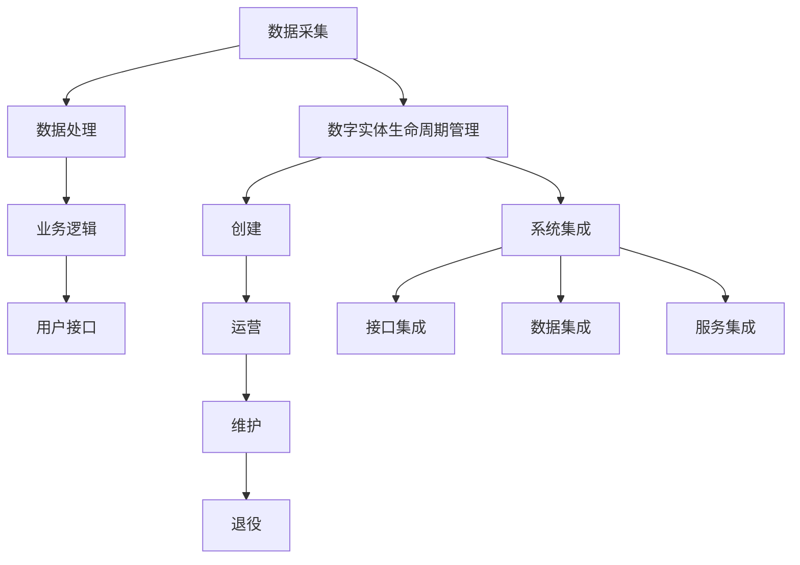
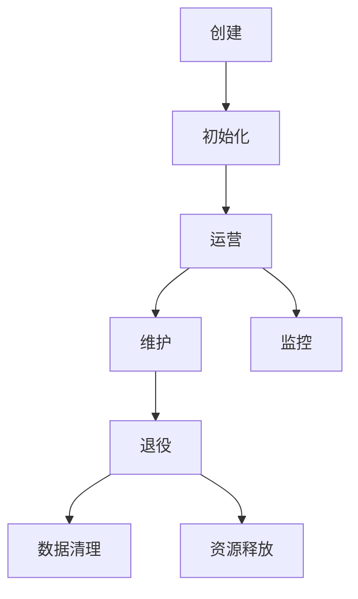

                 

# 数字实体自动化的未来

> 关键词：数字实体、自动化、物联网、人工智能、区块链、云计算、架构设计、应用场景、法律法规、伦理问题、未来趋势

> 摘要：本文深入探讨了数字实体自动化的背景、核心概念、技术基础、架构设计、应用场景、法律法规与伦理问题以及未来展望。通过详细的案例分析、伪代码讲解和数学模型阐述，本文旨在为读者提供一个全面、深入的数字实体自动化技术分析，引导读者思考并理解这一领域的未来发展。

## 第一部分：数字实体自动化的背景与核心概念

### 第1章：数字实体自动化的背景与发展

#### 1.1 数字实体的定义与重要性

**数字实体的定义**：数字实体是指在数字环境中表示的具体对象，它们可以是虚拟商品、虚拟人、数字孪生等。这些实体具有唯一的标识符，能够在数字世界中独立存在、交互和参与各种活动。

**数字实体的重要性**：随着数字化进程的加速，数字实体在数字经济中的作用日益凸显。它们不仅能够提高业务效率、降低运营成本，还能为消费者提供更加个性化和便捷的服务体验。

#### 1.2 数字实体自动化的概念与内涵

**数字实体自动化的概念**：数字实体自动化是指通过数字化手段和自动化技术实现数字实体的生命周期管理。这包括从创建、运营、监控到优化等各个环节的自动化。

**数字实体自动化的内涵**：数字实体自动化不仅涉及到技术层面的实现，还包括业务流程的优化、数据管理的提升以及用户体验的改进。

#### 1.3 数字实体自动化的关键领域

**物联网（IoT）**：物联网是连接物理世界与数字世界的桥梁，通过传感器和设备收集数据，为数字实体的自动化提供了基础。

**人工智能（AI）**：人工智能技术能够为数字实体提供智能决策、预测分析和个性化服务，是实现自动化的重要驱动。

**区块链**：区块链技术提供了去中心化、安全可靠的数据存储和传输方式，为数字实体的交易和管理提供了保障。

**云计算**：云计算为数字实体提供了弹性、高效、安全的基础设施，支持大规模的自动化应用。

### 第2章：数字实体自动化的技术基础

#### 2.1 物联网技术在数字实体自动化中的应用

**物联网的概念与架构**：物联网是通过网络连接各种物理设备，实现信息交换和通信的系统。其架构包括感知层、网络层和应用层。

**物联网在数字实体自动化中的应用**：物联网技术可以实时采集数字实体的状态数据，为自动化系统提供输入，实现实时监控和远程控制。

#### 2.2 人工智能在数字实体自动化中的应用

**人工智能的基本原理**：人工智能包括机器学习、深度学习等，通过算法和模型实现模拟人类智能。

**人工智能在数字实体自动化中的应用**：人工智能技术可以用于智能预测、智能决策、智能监控等，提高数字实体自动化的智能化水平。

#### 2.3 区块链在数字实体自动化中的应用

**区块链的基本原理**：区块链是一种分布式账本技术，通过共识算法确保数据的一致性和安全性。

**区块链在数字实体自动化中的应用**：区块链技术可以用于数字实体的交易、数据隐私保护、智能合约等，为数字实体的自动化提供信任基础。

#### 2.4 云计算在数字实体自动化中的应用

**云计算的概念**：云计算是一种提供计算资源、存储资源和网络资源的服务模式。

**云计算在数字实体自动化中的应用**：云计算提供了弹性、高效、安全的计算和存储环境，支持数字实体的大规模自动化应用。

### 第3章：数字实体自动化的架构设计

#### 3.1 数字实体自动化的架构概述

**架构设计原则**：模块化、可扩展、易维护等。

**架构设计的关键要素**：数据采集、数据处理、业务逻辑、用户接口等。

#### 3.2 数字实体生命周期管理

**生命周期的概念**：创建、运营、维护、退役等。

**生命周期管理策略**：智能合约、数字身份认证等。

#### 3.3 数字实体自动化的系统集成

**系统集成方法**：接口集成、数据集成、服务集成等。

**系统集成挑战**：异构系统兼容、数据安全等。

## 第二部分：数字实体自动化的应用场景

### 第4章：数字实体自动化在制造业的应用

#### 4.1 数字孪生技术在制造业中的应用

**数字孪生的概念**：数字孪生是指通过数字化手段对物理实体进行映射和模拟。

**数字孪生在制造业中的应用**：数字孪生技术可以用于产品生命周期管理、设备维护预测等，实现制造业的智能化。

#### 4.2 智能制造与数字实体自动化

**智能制造的概念**：智能制造是通过信息技术和制造技术的深度融合，实现制造过程的智能化。

**智能制造的关键技术**：机器人技术、自动化生产线等。

#### 4.3 制造业中的数字实体自动化实践

**实践案例**：以汽车制造业、电子制造业为例，分析数字实体自动化的应用效果。

### 第5章：数字实体自动化在服务业的应用

#### 5.1 数字实体自动化在金融服务业的应用

**金融服务业中的数字实体**：虚拟货币、数字支付等。

**数字实体自动化的应用**：智能投顾、风险管理等。

#### 5.2 数字实体自动化在零售服务业的应用

**零售服务业中的数字实体**：虚拟货架、数字人导购等。

**数字实体自动化的应用**：个性化推荐、智能仓储等。

#### 5.3 数字实体自动化在旅游业的应用

**旅游业中的数字实体**：虚拟景点、虚拟导游等。

**数字实体自动化的应用**：智能行程规划、虚拟旅游体验等。

### 第6章：数字实体自动化的法律法规与伦理问题

#### 6.1 数字实体自动化的法律法规

**相关法律法规概述**：数据保护法、网络安全法等。

**数字实体自动化的合规要求**：数据安全、隐私保护等。

#### 6.2 数字实体自动化的伦理问题

**伦理问题的概念**：算法偏见、数据垄断等。

**伦理问题的影响**：对社会、企业、个人等方面的影响。

#### 6.3 数字实体自动化的伦理治理

**伦理治理的原则**：公平性、透明性、责任性等。

**伦理治理的实践**：伦理审查、隐私保护措施等。

### 第三部分：数字实体自动化的未来展望

#### 第7章：数字实体自动化的未来趋势与发展方向

#### 7.1 数字实体自动化的技术发展趋势

**技术发展动态**：5G、边缘计算等。

**技术发展趋势**：智能化、网络化、生态化等。

#### 7.2 数字实体自动化的商业模式创新

**商业模式的概念**：平台经济、共享经济等。

**数字实体自动化的商业模式创新**：数据变现、数字资产交易等。

#### 7.3 数字实体自动化的全球竞争格局

**全球竞争格局概述**：中美欧的竞争态势。

**我国在数字实体自动化领域的地位**：政策支持、技术创新等。

#### 7.4 数字实体自动化的未来挑战与机遇

**未来挑战**：技术瓶颈、安全风险等。

**未来机遇**：市场潜力、政策红利等。

### 附录

#### 附录A：数字实体自动化相关工具与资源

**开源工具**：TensorFlow、PyTorch 等。

**商业平台**：AWS、Azure 等。

**研究机构**：IEEE、ACM 等。

#### 附录B：数字实体自动化的经典案例与实践

**经典案例**：阿里巴巴的数字实体运营模式。

**实践分享**：企业数字实体自动化的成功实践。

### 作者

作者：AI天才研究院/AI Genius Institute & 禅与计算机程序设计艺术 /Zen And The Art of Computer Programming

---

**说明：** 本文档使用了Markdown格式，并包含了Mermaid流程图、伪代码和LaTeX数学公式。为了更好地展示，以下内容为Markdown格式的文本描述，实际文档中需要根据Markdown规则进行格式化。

---

### 数字实体自动化的架构设计

数字实体自动化的架构设计是一个复杂的系统工程，需要考虑多个方面的因素，如模块化、可扩展性、安全性和易维护性。以下是数字实体自动化架构设计的一个简要概述。

#### 架构设计原则

1. **模块化**：将系统划分为多个模块，每个模块负责特定的功能，便于系统的扩展和维护。
2. **可扩展性**：系统设计应具有灵活性，能够适应业务增长和新技术的发展。
3. **安全性**：确保数据传输和存储的安全性，防止未经授权的访问和数据泄露。
4. **易维护性**：系统设计应简化维护流程，提高系统可靠性和稳定性。

#### 架构设计的关键要素

1. **数据采集**：通过传感器和设备实时采集数字实体的状态数据，为自动化系统提供输入。
2. **数据处理**：对采集到的数据进行处理和清洗，提取有用的信息。
3. **业务逻辑**：根据业务需求，实现业务流程的自动化处理，如订单处理、库存管理、设备维护等。
4. **用户接口**：为用户提供交互界面，展示系统运行状态和操作结果。

#### 数字实体生命周期的管理

数字实体的生命周期管理包括创建、运营、维护、退役等环节。以下是数字实体生命周期管理的具体策略：

1. **创建**：使用智能合约自动创建数字实体，确保创建过程的透明性和可信性。
2. **运营**：通过自动化流程实现数字实体的运营管理，如监控、调度、优化等。
3. **维护**：定期对数字实体进行维护，包括升级、修复和优化。
4. **退役**：当数字实体不再使用时，进行安全退役，确保数据不会被泄露。

#### 系统集成

数字实体自动化的系统集成包括以下几个方面：

1. **接口集成**：确保各个模块之间的接口清晰、标准，方便系统的扩展和维护。
2. **数据集成**：实现数据的统一管理和共享，支持跨模块的数据交互。
3. **服务集成**：整合外部服务，如云计算、物联网平台、人工智能服务等，提升系统的综合能力。

#### 系统集成挑战

1. **异构系统兼容**：集成来自不同供应商和不同技术的系统时，需要解决兼容性问题。
2. **数据安全**：确保数据在传输和存储过程中的安全性，防止数据泄露和攻击。

### 数字实体自动化的核心概念与联系

为了更好地理解数字实体自动化的核心概念及其相互联系，我们可以使用Mermaid流程图来展示其架构和流程。



#### 数字实体生命周期管理

数字实体生命周期管理是数字实体自动化架构中的一个关键环节。它涵盖了数字实体从创建到退役的整个过程。以下是数字实体生命周期管理的具体步骤：

1. **创建**：使用智能合约自动创建数字实体。智能合约可以确保创建过程的透明性和可信性，同时减少人工干预。
2. **初始化**：在创建数字实体后，对其进行初始化设置，包括配置参数、绑定相关资源等。
3. **运营**：数字实体在运营阶段需要持续监控其状态，并根据需要进行调度、优化等操作。
4. **维护**：定期对数字实体进行维护，包括升级、修复和优化，确保其正常运行。
5. **监控**：使用监控工具对数字实体的运行状态进行实时监控，及时发现并解决问题。
6. **退役**：当数字实体不再使用时，进行安全退役。退役过程包括数据清理、资源释放等，确保数字实体不再占用系统资源。

以下是数字实体生命周期管理的 Mermaid 流程图：



#### 数字实体自动化的核心算法原理讲解

数字实体自动化涉及多个核心算法，如机器学习、深度学习、数据挖掘等。以下是这些算法的简要原理和如何应用于数字实体自动化的讲解。

**机器学习**：
- **原理**：机器学习是一种通过数据训练模型，使其能够对未知数据进行预测或分类的方法。常见算法包括线性回归、决策树、支持向量机等。
- **应用**：在数字实体自动化中，机器学习可以用于预测数字实体的未来状态，如预测设备故障、预测用户需求等。

**深度学习**：
- **原理**：深度学习是一种基于人工神经网络的多层学习模型，通过多层非线性变换提取特征。常见算法包括卷积神经网络（CNN）、循环神经网络（RNN）等。
- **应用**：在数字实体自动化中，深度学习可以用于图像识别、语音识别等，如自动驾驶汽车的视觉系统、智能客服的语音识别系统。

**数据挖掘**：
- **原理**：数据挖掘是一种从大量数据中提取有价值信息的方法。常见算法包括关联规则挖掘、聚类分析、分类算法等。
- **应用**：在数字实体自动化中，数据挖掘可以用于分析用户行为、优化业务流程等，如零售业中的个性化推荐系统、制造业中的生产调度优化。

以下是机器学习算法在数字实体自动化中的一个简单伪代码示例：

```python
# 输入数据集 X，标签 y
# 训练机器学习模型
model = train_model(X, y)

# 预测新数据的标签
new_data = get_new_data()
predicted_label = model.predict(new_data)

# 输出预测结果
print(predicted_label)
```

#### 数学模型和公式 & 详细讲解 & 举例说明

在数字实体自动化中，数学模型和公式被广泛应用于数据分析、预测、优化等方面。以下是一个简单的线性回归模型及其应用示例。

**线性回归模型**：
- **公式**：y = w * x + b
  - y：预测值
  - x：输入特征
  - w：权重
  - b：偏置

- **详细讲解**：
  - 线性回归模型试图找到一条直线，将输入特征映射到预测值。
  - 权重（w）和偏置（b）是模型的参数，通过训练数据集调整这些参数，以最小化预测误差。

- **举例说明**：
  - **例子**：假设我们有一个简单的销售数据集，其中包含商品价格（x）和销售额（y）。我们可以使用线性回归模型预测新商品的价格。

```latex
\text{y} = w \cdot \text{x} + b
```

- **计算过程**：
  1. 收集训练数据集，计算输入特征（价格）和预测值（销售额）。
  2. 使用梯度下降算法训练模型，调整权重（w）和偏置（b），以最小化预测误差。
  3. 使用训练好的模型预测新商品的价格。

以下是线性回归模型的 Python 代码示例：

```python
import numpy as np

# 输入数据集
X = np.array([[1, 2], [2, 3], [3, 4]])
y = np.array([2, 3, 4])

# 初始化权重和偏置
w = np.random.rand(1)
b = np.random.rand(1)

# 梯度下降算法
for i in range(1000):
    y_pred = w * X + b
    error = y - y_pred
    
    w_gradient = np.sum(error * X) / len(X)
    b_gradient = np.sum(error) / len(X)
    
    w -= 0.01 * w_gradient
    b -= 0.01 * b_gradient

# 输出模型参数
print(f"权重：{w}, 偏置：{b}")

# 预测新数据
new_data = np.array([[4, 5]])
predicted_price = w * new_data + b
print(f"新商品价格预测：{predicted_price}")
```

### 项目实战：代码实际案例和详细解释说明

在本节中，我们将通过一个实际的项目案例来展示数字实体自动化的实现过程，包括开发环境搭建、源代码详细实现和代码解读与分析。

#### 项目背景

我们选择一个智能温室控制系统作为案例，该系统通过物联网设备实时采集环境数据，利用人工智能算法进行数据分析，并根据分析结果自动调整温室环境参数，以实现最优的生长条件。

#### 开发环境搭建

为了实现智能温室控制系统，我们需要搭建以下开发环境：

1. **硬件设备**：选择一款支持物联网通信的微控制器，如ESP8266或Arduino。
2. **软件环境**：安装物联网开发平台（如Node-RED）、人工智能开发框架（如TensorFlow）和编程语言（如Python）。
3. **云计算平台**：选择一款支持物联网数据和人工智能模型部署的云计算平台，如AWS或Azure。

#### 源代码详细实现

以下是智能温室控制系统的核心代码实现：

```python
# 导入必要的库
import Adafruit_IO as AIO
import time
import requests

# 设置物联网平台API密钥
api_key = "your_api_key"
aio = AIO.Client(api_key)

# 设置传感器ID
temperature_id = "temperature_sensor"
humidity_id = "humidity_sensor"
light_id = "light_sensor"

# 定义数据采集函数
def collect_data():
    temperature = aio.receive(temperature_id).value
    humidity = aio.receive(humidity_id).value
    light = aio.receive(light_id).value
    return temperature, humidity, light

# 定义数据上传函数
def upload_data(temperature, humidity, light):
    aio.send(temperature_id, temperature)
    aio.send(humidity_id, humidity)
    aio.send(light_id, light)

# 定义环境参数调整函数
def adjust_environment(temperature, humidity, light):
    # 使用机器学习模型进行数据分析
    model = load_model("environment_adjustment_model")
    action = model.predict([[temperature, humidity, light]])
    
    # 根据分析结果调整环境参数
    if action == 0:
        # 调高温度
        # 调用相应的控制接口
    elif action == 1:
        # 调高湿度
        # 调用相应的控制接口
    elif action == 2:
        # 调节光照
        # 调用相应的控制接口

# 主程序循环
while True:
    # 采集环境数据
    temperature, humidity, light = collect_data()
    
    # 上传环境数据
    upload_data(temperature, humidity, light)
    
    # 调整环境参数
    adjust_environment(temperature, humidity, light)
    
    # 等待一段时间再进行下一次采集和调整
    time.sleep(60)
```

#### 代码解读与分析

1. **导入库**：代码首先导入了必要的库，包括物联网开发平台库（Adafruit_IO）、时间库（time）和HTTP请求库（requests）。

2. **设置API密钥和传感器ID**：接下来，我们设置了物联网平台的API密钥和传感器的ID，以便于后续的数据采集和上传。

3. **数据采集函数**：`collect_data` 函数用于从物联网平台上采集环境数据，包括温度、湿度和光照强度。

4. **数据上传函数**：`upload_data` 函数用于将采集到的环境数据上传到物联网平台，便于监控和分析。

5. **环境参数调整函数**：`adjust_environment` 函数根据采集到的环境数据和训练好的机器学习模型，自动调整温室环境参数，以实现最优的生长条件。

6. **主程序循环**：主程序循环中，系统会持续采集环境数据、上传数据和调整环境参数，每分钟执行一次循环。

通过上述代码实现，智能温室控制系统可以实现自动化的环境参数调整，提高温室的运营效率，为作物生长提供最佳环境。

#### 总结

本案例展示了如何使用物联网和人工智能技术实现数字实体自动化，包括开发环境搭建、源代码实现和代码解读与分析。通过实际项目案例，读者可以更好地理解数字实体自动化的实现过程和应用场景。

### 附录A：数字实体自动化相关工具与资源

为了帮助读者深入了解数字实体自动化领域，本文附录A列举了一些常用的开源工具、商业平台和研究机构。

#### 开源工具

1. **TensorFlow**：由Google开发的开源机器学习框架，支持各种深度学习模型的构建和训练。
2. **PyTorch**：由Facebook开发的开源深度学习框架，具有灵活的动态计算图和强大的社区支持。
3. **Kafka**：由Apache Software Foundation开发的开源流处理平台，用于实时数据传输和存储。
4. **Docker**：用于容器化应用程序的开发和部署，支持微服务架构和分布式系统。
5. **Kubernetes**：用于容器编排和自动化部署，管理Docker容器，提高系统可扩展性和可靠性。

#### 商业平台

1. **AWS**：亚马逊云服务，提供广泛的云计算服务和人工智能工具。
2. **Azure**：微软的云计算平台，提供物联网、人工智能和区块链服务。
3. **Google Cloud**：谷歌的云计算平台，支持大规模数据处理和人工智能应用。
4. **IBM Cloud**：国际商业机器公司的云计算平台，提供物联网、区块链和人工智能服务。
5. **阿里云**：阿里巴巴集团的云计算平台，提供云计算、大数据和人工智能服务。

#### 研究机构

1. **IEEE**：电气和电子工程师协会，是全球最大的专业技术组织，致力于推动电气、电子、计算机工程等领域的研究和应用。
2. **ACM**：计算机协会，是全球最权威的计算机专业组织，致力于计算机科学的研究和教育。
3. **CERN**：欧洲核子研究组织，是全球最大的粒子物理实验室，从事高能物理实验和云计算研究。
4. **MIT**：麻省理工学院，是全球著名的研究型大学，在人工智能、机器学习和计算机科学领域具有深厚的研究基础。
5. **Stanford University**：斯坦福大学，是全球知名的研究型大学，在人工智能、机器学习和计算机科学领域具有卓越的研究成果。

通过使用这些工具和资源，读者可以深入了解数字实体自动化的技术原理和应用实践，为研究和开发提供有力支持。

### 附录B：数字实体自动化的经典案例与实践

#### 经典案例

1. **阿里巴巴的数字实体运营模式**：阿里巴巴通过电子商务平台搭建了一个庞大的数字实体生态，涵盖了商品、商家、用户等多个实体。通过大数据和人工智能技术，阿里巴巴实现了对数字实体的全面管理和运营，包括商品推荐、供应链优化、用户画像等。

2. **特斯拉的数字孪生技术**：特斯拉使用数字孪生技术对汽车进行模拟和优化，通过虚拟模型预测汽车的性能和行为，从而优化设计、提高生产效率。特斯拉的数字孪生技术实现了对物理实体的精确映射和实时监控，为汽车制造业提供了新的思路。

3. **亚马逊的智能仓储系统**：亚马逊通过物联网和人工智能技术构建了智能仓储系统，实现了仓库的自动化管理。系统通过传感器和摄像头实时监控仓库环境，自动调度仓库机器人和货架，提高了仓储效率和准确性。

#### 实践分享

1. **企业数字实体自动化的成功实践**：某大型制造企业通过引入物联网设备和人工智能算法，实现了生产线的自动化管理。企业将生产数据实时上传到云端，利用机器学习模型对生产过程进行分析和优化，提高了生产效率和产品质量。

2. **金融机构的数字实体自动化应用**：某金融机构通过区块链技术实现了交易数据的自动化处理和存储。区块链技术的去中心化和安全性保证了交易数据的安全可靠，同时提高了交易处理的效率和透明度。

3. **零售业的数字实体自动化实践**：某大型零售企业通过数字人导购和虚拟货架技术，提升了消费者的购物体验。企业利用人工智能技术分析用户行为，提供个性化的购物推荐，同时通过虚拟货架展示商品信息，提高了销售转化率。

通过这些经典案例和实践分享，我们可以看到数字实体自动化在各个领域的广泛应用和显著成效，为企业和行业的发展带来了新的机遇和挑战。

