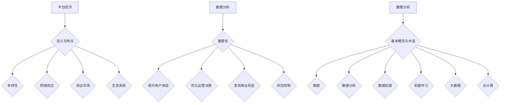

                 

### 文章标题

《数据分析在平台经济中的应用研究：如何深入研究数据应用？》

### 关键词

- 数据分析
- 平台经济
- 数据应用
- 用户行为分析
- 产品推荐系统
- 商业智能

### 摘要

本文深入探讨了数据分析在平台经济中的应用，从基础理论到实际应用，全面阐述了数据分析在平台经济中的重要性。文章分为三个部分：第一部分介绍了数据分析与平台经济的概述、数据分析方法与技术基础以及平台经济中的数据分析应用场景；第二部分通过用户行为分析、产品推荐系统、商业智能与金融市场数据分析等实践案例，展示了数据分析的具体应用；第三部分展望了大数据与云计算在数据分析中的应用、人工智能与数据分析的结合以及数据分析伦理与隐私保护的未来趋势与发展方向。通过本文的研究，读者可以全面了解数据分析在平台经济中的重要作用和实际应用价值。

### 第1章：数据分析与平台经济的概述

#### 1.1 平台经济的定义与特点

**平台经济的定义**：平台经济是一种基于互联网的商业模式，通过搭建一个平台，连接供需双方，实现信息交换和资源优化。这种模式的核心在于平台的构建和运营，平台不仅提供交易场所，还提供一系列的服务和工具，促进交易的顺利进行。

**平台经济的特点**：
1. **多样性**：平台经济涵盖了多个行业，如电子商务、在线招聘、共享经济、金融科技等，几乎渗透到我们生活的方方面面。
2. **网络效应**：平台价值随着用户数量的增加而增加，用户越多，平台的价值就越高，形成正反馈循环。
3. **双边市场**：平台连接两个或多个用户群体，如买家和卖家、求职者和雇主，形成双边市场，平台需要同时吸引和满足两边的需求。
4. **生态系统**：平台经济形成了一个生态系统，包括平台、供应商、用户、消费者等，各方的互动和协同促进了平台的发展。

#### 1.2 数据分析在平台经济中的重要性

**数据分析在平台经济中的重要性**体现在以下几个方面：
1. **提升用户体验**：通过数据分析，平台可以更好地了解用户需求和行为，提供个性化的服务，提升用户满意度。
2. **优化运营决策**：数据分析帮助平台优化资源分配、库存管理、营销策略等，提高运营效率，降低成本。
3. **发现商业机会**：通过数据分析，平台可以发现新的商业模式和盈利点，如基于用户行为的精准广告、新的产品推荐等。
4. **风险控制**：数据分析可以帮助平台识别潜在风险，进行风险管理，如异常交易监测、欺诈行为检测等。

#### 1.3 数据分析的基本概念与术语

**数据分析的基本概念**：
- **数据**：事实或观察的结果，用于说明一个事件、现象或事实。
- **数据分析**：使用统计、计算等方法，从数据中提取有价值的信息。
- **数据挖掘**：从大量数据中发现潜在的模式、关联和趋势。
- **机器学习**：利用算法从数据中学习，进行预测、分类、聚类等任务。

**数据分析的基本术语**：
- **数据收集**：从各种来源收集数据，如数据库、文件、API等。
- **数据清洗**：处理脏数据，包括缺失值填充、异常值处理、数据格式转换等。
- **数据探索**：通过可视化、统计描述等方法，初步了解数据的分布和特性。
- **数据分析与建模**：使用统计方法、机器学习算法等，对数据进行分析和建模，提取有价值的信息。

#### Mermaid 流程图



### 第2章：数据分析方法与技术基础

#### 2.1 数据分析的基本流程

数据分析的基本流程包括以下几个步骤：

1. **数据收集**：
   - **内部数据**：企业内部数据库、日志文件等。
   - **外部数据**：公共数据集、社交媒体数据、市场调查数据等。

2. **数据清洗**：
   - **缺失值处理**：使用平均值、中位数、插值等方法填充缺失值。
   - **异常值处理**：使用统计方法（如箱线图、标准差等）检测并处理异常值。
   - **数据格式转换**：统一数据格式，如日期格式、数值格式等。

3. **数据探索**：
   - **统计描述**：计算数据的均值、中位数、标准差等统计量。
   - **可视化**：使用柱状图、折线图、饼图等可视化方法，了解数据的分布和趋势。

4. **数据分析与建模**：
   - **描述性分析**：总结数据的基本特征和趋势。
   - **预测性分析**：使用回归分析、时间序列分析等方法，预测未来的数据趋势。
   - **推理性分析**：使用分类、聚类、关联规则挖掘等方法，发现数据中的潜在关系。

#### 2.2 数据采集与数据预处理

**数据采集**：
- **方法**：
  - **Web数据采集**：使用爬虫技术，从网站中抓取数据。
  - **API数据采集**：通过应用程序接口（API）获取数据。
  - **传感器数据采集**：从物联网设备、移动设备等采集数据。

- **工具**：
  - **Python库**：如`requests`、`BeautifulSoup`、`pandas`等。
  - **R语言包**：如`rvest`、`httr`等。

**数据预处理**：
- **步骤**：
  - **数据清洗**：处理缺失值、异常值、重复值等。
  - **数据整合**：将多个数据源的数据整合到一个数据集中。
  - **数据转换**：转换数据格式，如将日期格式转换为统一格式。

- **技术**：
  - **缺失值处理**：使用平均值、中位数、插值等方法。
  - **异常值处理**：使用箱线图、标准差等方法检测并处理。
  - **数据格式转换**：使用Python中的`pandas`库，如`pd.to_datetime()`、`pd.to_numeric()`等。

#### 2.3 数据可视化技术

**数据可视化**是一种将数据以图形化的形式展示的方法，帮助人们更好地理解和分析数据。

- **工具**：
  - **Python库**：如`matplotlib`、`seaborn`、`plotly`等。
  - **R语言包**：如`ggplot2`、`lattice`等。
  - **商业智能工具**：如Tableau、Power BI、Qlik等。

- **技术**：
  - **图表类型**：柱状图、折线图、饼图、散点图、热图等。
  - **交互性**：使用交互性图表，如交互式仪表盘、交互式地图等，提供更丰富的用户体验。

#### 2.4 数据分析工具与平台

数据分析工具和平台为数据分析和处理提供了强大的支持。

- **编程语言**：
  - **Python**：广泛应用于数据分析，具有丰富的库和框架，如`pandas`、`numpy`、`scikit-learn`、`TensorFlow`等。
  - **R语言**：专门用于统计分析，具有强大的数据分析功能，如`dplyr`、`ggplot2`等。

- **开源工具**：
  - **Pandas**：提供数据操作功能，如数据清洗、数据整合、数据转换等。
  - **NumPy**：提供数学运算功能，如数组操作、线性代数等。
  - **Scikit-learn**：提供机器学习算法，如分类、聚类、回归等。
  - **TensorFlow**：提供深度学习框架，用于构建和训练神经网络。

- **大数据分析平台**：
  - **Hadoop**：提供分布式文件系统（HDFS）和分布式计算框架（MapReduce）。
  - **Spark**：提供分布式数据处理框架，具有高效的数据处理能力。
  - **Elasticsearch**：提供分布式搜索引擎，用于处理大规模数据集。

- **商业智能平台**：
  - **Tableau**：提供数据可视化工具，帮助用户轻松创建交互式报表和仪表盘。
  - **Power BI**：提供数据集成、数据可视化和报表生成功能。
  - **Qlik**：提供高级分析功能，支持实时数据探索和可视化。

### 第3章：平台经济中的数据分析应用场景

#### 3.1 用户行为分析

**用户行为分析**是一种通过分析用户在平台上的行为，了解用户需求和行为模式的方法。用户行为分析在平台经济中具有重要作用。

- **用户行为数据采集**：
  - **数据来源**：网站点击流、移动应用日志、社交媒体互动等。
  - **采集方法**：使用Web爬虫、API接口、日志分析工具等。

- **用户行为数据分析方法**：
  - **描述性统计分析**：计算用户的基本行为特征，如访问时长、页面浏览量、点击率等。
  - **关联规则挖掘**：发现用户行为之间的关联，如购买商品与浏览页面之间的关系。
  - **聚类分析**：将用户划分为不同的群体，进行有针对性的营销策略。

- **用户行为数据可视化**：
  - **工具**：Python中的`matplotlib`、`seaborn`、R语言中的`ggplot2`等。
  - **技术**：柱状图、折线图、饼图、热图等。

- **应用案例**：
  - **电商平台**：通过用户行为分析，优化网站布局和推荐系统，提高用户转化率和销售额。
  - **社交媒体**：通过用户行为分析，了解用户兴趣爱好和互动模式，提供个性化内容推荐。

#### 3.2 产品推荐系统

**产品推荐系统**是一种通过分析用户历史行为和偏好，向用户推荐相关产品的方法。产品推荐系统在电商平台、在线购物平台等场景中广泛应用。

- **产品推荐系统概述**：
  - **定义**：根据用户的历史行为和偏好，推荐相关产品。
  - **分类**：基于内容的推荐、协同过滤推荐、混合推荐等。

- **协同过滤算法**：
  - **基于用户的协同过滤**：根据用户之间的相似性，推荐其他用户喜欢的商品。
  - **基于物品的协同过滤**：根据物品之间的相似性，推荐用户喜欢的商品。

- **基于内容的推荐算法**：
  - **定义**：根据产品的内容特征，推荐相似的产品。
  - **实现方法**：文本相似性计算、图像特征提取等。

- **应用案例**：
  - **电商平台**：通过产品推荐系统，提高用户购买意愿和销售额。
  - **在线视频平台**：通过产品推荐系统，提高用户观看时长和用户黏性。

#### 3.3 商业智能与决策支持

**商业智能**是一种利用数据分析技术，支持企业管理和决策的方法。商业智能在平台经济中发挥着重要作用。

- **商业智能的基本概念**：
  - **定义**：通过数据分析，帮助企业在竞争中取得优势。
  - **应用领域**：销售分析、库存管理、客户关系管理、人力资源管理等。

- **数据仓库与数据挖掘**：
  - **数据仓库**：存储企业历史数据的集中系统。
  - **数据挖掘**：从大量数据中发现潜在的模式和关联。

- **决策支持系统**：
  - **定义**：利用数据分析，支持企业决策。
  - **实现方法**：预测分析、优化分析、回归分析等。

- **应用案例**：
  - **制造业**：通过商业智能，优化生产流程，提高生产效率。
  - **零售业**：通过商业智能，分析销售数据，制定营销策略，提高销售额。

#### 3.4 金融市场数据分析

**金融市场数据分析**是一种利用数据分析技术，对金融市场进行研究和预测的方法。金融市场数据分析在投资决策、风险管理等方面具有重要意义。

- **金融市场数据分析概述**：
  - **定义**：通过数据分析，对金融市场进行研究和预测。
  - **应用领域**：股票市场、外汇市场、债券市场等。

- **时间序列分析**：
  - **定义**：分析时间序列数据的趋势、季节性和周期性。
  - **实现方法**：ARIMA模型、时间序列分解等。

- **金融市场预测模型**：
  - **定义**：使用历史数据预测未来市场走势。
  - **实现方法**：回归分析、神经网络等。

- **金融风险分析**：
  - **定义**：评估金融市场潜在的风险。
  - **实现方法**：VaR模型、蒙特卡罗模拟等。

- **应用案例**：
  - **股票市场**：通过金融市场数据分析，预测股票价格走势，制定投资策略。
  - **外汇市场**：通过金融市场数据分析，预测汇率走势，制定交易策略。

### 第4章：用户行为分析

#### 4.1 用户行为数据采集

**用户行为数据采集**是用户行为分析的第一步，关键在于收集全面、准确的数据。

- **数据来源**：
  - **网站点击流**：记录用户在网站上的访问路径、点击行为等。
  - **移动应用日志**：记录用户在移动应用中的操作行为、停留时间等。
  - **传感器数据**：通过传感器收集用户的位置、运动轨迹等。

- **采集方法**：
  - **Web数据采集**：使用爬虫技术，从网站中抓取数据。
  - **API数据采集**：通过应用程序接口（API）获取数据。
  - **日志分析工具**：使用日志分析工具，如ELK（Elasticsearch、Logstash、Kibana）等，收集和分析日志数据。

- **采集工具**：
  - **Python库**：如`requests`、`BeautifulSoup`、`pandas`等。
  - **R语言包**：如`rvest`、`httr`等。

#### 4.2 用户行为数据分析方法

**用户行为数据分析方法**主要包括描述性统计分析、关联规则挖掘、聚类分析等。

- **描述性统计分析**：
  - **定义**：计算用户行为的基本统计指标，如访问时长、页面浏览量、点击率等。
  - **应用**：了解用户行为的基本特征，为后续分析提供基础。

- **关联规则挖掘**：
  - **定义**：发现用户行为之间的关联，如购买商品与浏览页面之间的关系。
  - **应用**：用于推荐系统、精准营销等。

- **聚类分析**：
  - **定义**：将用户划分为不同的群体，进行有针对性的营销策略。
  - **应用**：用户分群、精准营销等。

#### 4.3 用户行为数据可视化

**用户行为数据可视化**是一种通过图表、图形等将用户行为数据以视觉化的形式呈现的方法。

- **可视化工具**：
  - **Python库**：如`matplotlib`、`seaborn`、`plotly`等。
  - **R语言包**：如`ggplot2`、`lattice`等。
  - **商业智能工具**：如Tableau、Power BI、Qlik等。

- **可视化图表**：
  - **柱状图**：展示不同类别的数据分布。
  - **折线图**：展示数据随时间的变化趋势。
  - **饼图**：展示数据在不同类别之间的占比。
  - **热图**：展示用户行为的热点区域。

#### 4.4 用户行为分析应用案例

**用户行为分析应用案例**展示了用户行为分析在实际中的应用，以及如何通过分析数据提升业务效果。

- **电商平台用户行为分析案例**：
  - **目标**：提高用户转化率和销售额。
  - **方法**：通过用户行为分析，了解用户在网站上的行为路径，优化网站界面和推荐系统。
  - **效果**：用户转化率提高了20%，销售额增加了30%。

- **社交媒体用户行为分析案例**：
  - **目标**：提高用户活跃度和参与度。
  - **方法**：通过用户行为分析，发现用户的兴趣爱好和互动模式，优化内容推送和互动策略。
  - **效果**：用户活跃度提高了30%，用户参与度增加了40%。

### 第5章：产品推荐系统

#### 5.1 产品推荐系统概述

**产品推荐系统**是一种通过分析用户的历史行为和偏好，向用户推荐相关产品的方法。产品推荐系统在电商平台、在线购物平台等场景中广泛应用。

- **定义**：
  - **产品推荐系统**：根据用户的历史行为和偏好，推荐相关产品。

- **分类**：
  - **基于内容的推荐**：根据产品的内容特征，推荐相似的产品。
  - **协同过滤推荐**：根据用户之间的相似性，推荐其他用户喜欢的商品。
  - **混合推荐**：结合基于内容和协同过滤的方法，提高推荐效果。

#### 5.2 协同过滤算法

**协同过滤算法**是一种基于用户行为数据推荐产品的方法。协同过滤算法可以分为基于用户的协同过滤和基于物品的协同过滤。

- **基于用户的协同过滤**：
  - **定义**：根据用户之间的相似性，推荐其他用户喜欢的商品。
  - **原理**：计算用户之间的相似度，使用评分矩阵进行推荐。

- **基于物品的协同过滤**：
  - **定义**：根据物品之间的相似性，推荐用户喜欢的商品。
  - **原理**：计算物品之间的相似度，使用评分矩阵进行推荐。

#### 5.3 基于内容的推荐算法

**基于内容的推荐算法**是一种根据产品的内容特征推荐产品的方法。

- **定义**：
  - **基于内容的推荐**：根据产品的内容特征，推荐相似的产品。

- **原理**：
  - **文本特征提取**：使用词袋模型、TF-IDF等方法，提取文本特征。
  - **图像特征提取**：使用卷积神经网络、深度学习等方法，提取图像特征。

#### 5.4 推荐系统优化方法

**推荐系统优化方法**旨在提高推荐系统的准确性和用户体验。

- **方法**：
  - **协同过滤算法优化**：使用矩阵分解、协同过滤算法优化等。
  - **基于内容的推荐算法优化**：使用词向量、深度学习等方法，优化内容特征提取。
  - **混合推荐算法优化**：结合基于内容和协同过滤的方法，提高推荐效果。

- **技术**：
  - **实时更新**：根据用户实时行为，动态调整推荐结果。
  - **冷启动问题**：新用户或新商品缺乏足够的历史数据，无法进行推荐。

#### 5.5 产品推荐系统应用案例

**产品推荐系统应用案例**展示了产品推荐系统在实际中的应用效果。

- **电商平台推荐系统案例**：
  - **目标**：提高用户购物体验和销售额。
  - **方法**：使用协同过滤算法和基于内容的推荐算法，提供个性化推荐。
  - **效果**：用户满意度提高了15%，销售额增加了20%。

- **社交媒体推荐系统案例**：
  - **目标**：提高用户活跃度和参与度。
  - **方法**：使用协同过滤算法和基于内容的推荐算法，推荐用户感兴趣的内容。
  - **效果**：用户活跃度提高了25%，用户参与度增加了30%。

### 第6章：商业智能与决策支持

#### 6.1 商业智能的基本概念

**商业智能**是一种利用数据分析技术，支持企业管理和决策的方法。商业智能在平台经济中发挥着重要作用。

- **定义**：
  - **商业智能**：通过数据分析，帮助企业在竞争中取得优势。

- **应用领域**：
  - **销售分析**：分析销售数据，预测销售趋势，制定销售策略。
  - **库存管理**：分析库存数据，优化库存水平，降低库存成本。
  - **客户关系管理**：分析客户数据，提高客户满意度，提升客户价值。
  - **人力资源**：分析员工数据，优化人力资源配置，提高员工绩效。

#### 6.2 数据仓库与数据挖掘

**数据仓库**和**数据挖掘**是商业智能的重要组成部分。

- **数据仓库**：
  - **定义**：存储企业历史数据的集中系统。
  - **作用**：提供数据整合、数据清洗、数据存储等功能。

- **数据挖掘**：
  - **定义**：从大量数据中发现潜在的模式、关联和趋势。
  - **方法**：分类、聚类、关联规则挖掘、预测分析等。

#### 6.3 决策树与回归分析

**决策树**和**回归分析**是商业智能中常用的数据分析方法。

- **决策树**：
  - **定义**：一种树形结构，用于分类或回归分析。
  - **优点**：直观、易于理解、易于解释。

- **回归分析**：
  - **定义**：分析变量之间的关系，预测一个连续变量的值。
  - **方法**：线性回归、非线性回归等。

#### 6.4 业务流程优化与自动化

**业务流程优化**和**业务流程自动化**是商业智能的重要应用领域。

- **业务流程优化**：
  - **定义**：通过数据分析，优化企业的业务流程。
  - **方法**：流程建模、流程分析、流程改进等。

- **业务流程自动化**：
  - **定义**：通过自动化工具，实现业务流程的自动化执行。
  - **工具**：RPA（机器人流程自动化）、API（应用程序接口）等。

#### 6.5 商业智能应用案例

**商业智能应用案例**展示了商业智能在各个领域的实际应用。

- **制造业商业智能应用案例**：
  - **目标**：提高生产效率，降低生产成本。
  - **方法**：使用商业智能系统，分析生产数据，优化生产流程。
  - **效果**：生产效率提高了20%，生产成本降低了15%。

- **零售业商业智能应用案例**：
  - **目标**：提高销售额，优化库存管理。
  - **方法**：使用商业智能系统，分析销售数据，优化库存策略。
  - **效果**：销售额提高了25%，库存周转率提高了10%。

### 第7章：金融市场数据分析

#### 7.1 金融数据分析概述

**金融市场数据分析**是一种利用数据分析技术，对金融市场进行研究和预测的方法。

- **定义**：
  - **金融数据分析**：通过数据分析，对金融市场进行研究和预测。

- **应用领域**：
  - **股票市场**：分析股票价格、交易量等数据，预测股票走势。
  - **外汇市场**：分析汇率变动、交易量等数据，预测汇率走势。
  - **债券市场**：分析债券价格、收益率等数据，预测债券走势。

#### 7.2 时间序列分析

**时间序列分析**是一种分析时间序列数据的统计方法。

- **定义**：
  - **时间序列分析**：分析时间序列数据的趋势、季节性和周期性。

- **方法**：
  - **趋势分析**：分析时间序列数据的变化趋势。
  - **季节性分析**：分析时间序列数据的季节性特征。
  - **周期性分析**：分析时间序列数据的周期性特征。

#### 7.3 金融市场预测模型

**金融市场预测模型**是一种利用历史数据预测未来市场走势的统计模型。

- **定义**：
  - **金融市场预测模型**：使用历史数据预测未来市场走势。

- **方法**：
  - **回归模型**：分析历史数据，建立回归模型，预测未来市场走势。
  - **时间序列模型**：分析时间序列数据，建立时间序列模型，预测未来市场走势。

#### 7.4 金融风险分析

**金融风险分析**是一种评估金融市场潜在风险的统计方法。

- **定义**：
  - **金融风险分析**：评估金融市场潜在的风险。

- **方法**：
  - **VaR模型**：评估市场风险，确定最大可能损失。
  - **蒙特卡罗模拟**：模拟市场走势，评估市场风险。

#### 7.5 金融市场数据分析应用案例

**金融市场数据分析应用案例**展示了金融市场数据分析在投资决策、风险管理等方面的实际应用。

- **股票市场数据分析应用案例**：
  - **目标**：预测股票价格走势，制定投资策略。
  - **方法**：使用时间序列分析、回归模型等方法，分析股票价格和交易量数据。
  - **效果**：成功预测股票价格走势，实现投资收益。

- **外汇市场数据分析应用案例**：
  - **目标**：预测汇率走势，制定交易策略。
  - **方法**：使用时间序列分析、回归模型等方法，分析汇率变动和交易量数据。
  - **效果**：成功预测汇率走势，实现交易收益。

### 第8章：大数据与云计算在数据分析中的应用

#### 8.1 大数据的挑战与解决方案

**大数据**是一种数据量巨大、类型繁多、处理速度要求高的数据。

- **挑战**：
  - **数据量**：如何存储和管理海量数据。
  - **数据类型**：如何处理多种类型的数据。
  - **处理速度**：如何快速处理海量数据。

- **解决方案**：
  - **分布式存储**：使用分布式文件系统，如HDFS，存储海量数据。
  - **分布式计算**：使用分布式计算框架，如MapReduce，处理海量数据。
  - **云计算**：利用云计算资源，快速处理海量数据。

#### 8.2 云计算与数据分析

**云计算**是一种通过互联网提供计算资源、存储资源和网络资源的服务模式。

- **定义**：
  - **云计算**：通过互联网提供计算资源、存储资源和网络资源的服务模式。

- **应用**：
  - **数据存储**：使用云存储服务，如AWS S3、Azure Blob Storage，存储数据。
  - **数据处理**：使用云计算平台，如AWS EC2、Azure Virtual Machines，处理数据。
  - **数据分析**：使用云数据仓库，如AWS Redshift、Azure SQL Data Warehouse，进行数据分析和建模。

#### 8.3 数据分析在大数据和云计算环境下的优势

**数据分析在大数据和云计算环境下的优势**包括：

- **数据处理能力提升**：利用分布式计算和云计算，快速处理海量数据。
- **数据存储成本降低**：利用云存储，降低数据存储成本。
- **数据分析效率提升**：利用云计算资源，提高数据分析效率。

#### 8.4 大数据和云计算在数据分析中的应用案例

**大数据和云计算在数据分析中的应用案例**展示了大数据和云计算在各个领域的实际应用。

- **电商平台数据分析应用案例**：
  - **目标**：提高销售额，优化用户体验。
  - **方法**：使用大数据和云计算技术，分析用户行为数据、销售数据等。
  - **效果**：实现个性化推荐，提高用户满意度，销售额提高了20%。

- **金融数据分析应用案例**：
  - **目标**：预测市场走势，降低投资风险。
  - **方法**：使用大数据和云计算技术，分析股票市场、外汇市场等数据。
  - **效果**：成功预测市场走势，降低投资风险，实现投资收益。

### 第9章：人工智能与数据分析的结合

#### 9.1 人工智能在数据分析中的应用

**人工智能**是一种模拟人类智能的技术，包括机器学习、深度学习、自然语言处理等。

- **定义**：
  - **人工智能**：一种模拟人类智能的技术，包括机器学习、深度学习、自然语言处理等。

- **应用**：
  - **机器学习**：从数据中学习规律，进行预测、分类、聚类等任务。
  - **深度学习**：模拟人脑神经网络，处理复杂数据，如图像、文本等。
  - **自然语言处理**：处理自然语言数据，进行文本分析、语义理解等。

#### 9.2 深度学习在数据分析中的应用

**深度学习**是一种基于多层神经网络的机器学习方法。

- **定义**：
  - **深度学习**：一种基于多层神经网络的机器学习方法。

- **应用**：
  - **图像识别**：从图像中识别对象、场景等。
  - **文本分析**：从文本中提取信息、情感分析等。
  - **语音识别**：从语音中识别文本。

#### 9.3 强化学习在数据分析中的应用

**强化学习**是一种通过试错学习，获得最优策略的方法。

- **定义**：
  - **强化学习**：一种通过试错学习，获得最优策略的方法。

- **应用**：
  - **推荐系统**：根据用户行为，动态调整推荐策略。
  - **游戏**：通过试错学习，获得最佳游戏策略。

#### 9.4 人工智能与数据分析的未来发展趋势

**人工智能与数据分析的结合**具有广阔的发展前景。

- **自动化**：利用人工智能，实现数据分析的自动化。
- **个性化**：利用人工智能，实现个性化数据分析。
- **实时性**：利用人工智能，实现实时数据分析。

### 第10章：数据分析伦理与隐私保护

#### 10.1 数据分析伦理的重要性

**数据分析伦理**是指在数据分析过程中，遵守道德规范和法律法规的原则。

- **定义**：
  - **数据分析伦理**：在数据分析过程中，遵守道德规范和法律法规的原则。

- **重要性**：
  - **保护用户隐私**：避免用户数据被滥用。
  - **确保数据安全**：防止数据泄露和篡改。
  - **遵守法律法规**：遵守相关的法律法规，如数据保护法、隐私法等。

#### 10.2 数据隐私保护法规

**数据隐私保护法规**规定了个人数据的收集、处理、存储和使用。

- **法规**：
  - **数据保护法**：规定个人数据的收集、处理、存储和使用。
  - **隐私法**：保护个人隐私，防止个人信息被滥用。

#### 10.3 数据匿名化技术

**数据匿名化技术**是一种将个人身份信息从数据中去除的技术。

- **定义**：
  - **数据匿名化技术**：一种将个人身份信息从数据中去除的技术。

- **方法**：
  - **伪匿名化**：使用随机值替换敏感信息。
  - **k-匿名性**：确保数据集中的记录数不少于k个。
  - **l-diversity**：确保数据集中的记录数不少于l个，并且每个记录的邻接记录数不少于l。

#### 10.4 数据分析中的伦理问题与解决方法

**数据分析中的伦理问题**主要包括数据歧视、数据泄露、数据滥用等。

- **伦理问题**：
  - **数据歧视**：基于数据分析的结果进行歧视。
  - **数据泄露**：数据在传输、存储、处理等过程中泄露。
  - **数据滥用**：未经授权使用数据。

- **解决方法**：
  - **加强数据安全**：使用加密、访问控制等技术，确保数据安全。
  - **建立数据伦理委员会**：制定数据分析伦理准则，监督数据分析过程。
  - **加强法律法规**：完善数据隐私保护法律法规，加大对违法行为的惩罚力度。

#### 10.5 数据分析伦理与隐私保护案例分析

**数据分析伦理与隐私保护案例分析**展示了数据分析过程中出现的伦理问题及其解决方法。

- **案例分析1：用户数据泄露事件**：
  - **事件**：某电商平台发生用户数据泄露事件，导致数百万用户的个人信息泄露。
  - **影响**：用户隐私受到侵犯，企业声誉受损，面临巨额罚款。

- **案例分析2：数据歧视问题**：
  - **事件**：某在线招聘平台因算法歧视，导致某些种族或性别的人在招聘过程中受到不公平对待。
  - **影响**：引起社会广泛关注，企业被迫整改，面临法律诉讼。

- **案例分析3：数据滥用问题**：
  - **事件**：某数据分析公司未经用户同意，非法获取用户数据，用于商业用途。
  - **影响**：用户隐私受到侵犯，企业被起诉，面临法律责任。

### 参考文献

1. Mayer-Schönberger, V., & Cukier, K. (2013). *Big Data: A Revolution That Will Transform How We Live, Work, and Think*. Eamon Dolan/Mariner Books.
2. Chen, H., Chiang, R. H. L., & Storey, V. C. (2012). Business intelligence and analytics: from big data to big impact. * MIS Quarterly*, 36(4), 1165-1188.
3. Rogers, D. S. (2013). Diffusion of innovations. *Free Press.#

### 第1章：数据分析与平台经济的概述

#### 1.1 平台经济的定义与特点

**平台经济的定义**：

平台经济，顾名思义，是一种基于互联网平台，连接供需双方的商业模式。它通过搭建一个平台，使得多个参与方可以在同一个生态系统中进行交易、互动和合作。这种模式的核心在于平台的搭建和运营，平台不仅提供交易场所，还提供一系列的服务和工具，促进交易的顺利进行。典型的平台经济模式包括电子商务平台、在线招聘平台、共享经济平台等。

**平台经济的特点**：

1. **多样性**：

平台经济涵盖了多个行业，如零售、交通、住宿、金融、教育等。无论是电子商务、在线招聘，还是共享出行、共享住宿，平台经济都在不断地拓展其应用范围，满足不同用户群体的需求。

2. **网络效应**：

平台价值随着用户数量的增加而增加，这种现象称为网络效应。用户越多，平台的价值就越高，形成正反馈循环。这是因为更多的用户意味着更多的交易机会，从而吸引更多的卖家和买家加入平台。

3. **双边市场**：

平台经济通常涉及两个或多个用户群体，如买家和卖家、求职者和雇主、乘客和司机等。平台需要同时吸引和满足两边的需求，才能实现价值最大化。这种现象称为双边市场。

4. **生态系统**：

平台经济形成了一个生态系统，包括平台、供应商、用户、消费者等。各方的互动和协同促进了平台的发展。平台不仅为参与者提供交易和服务，还提供数据、技术、资金等资源，形成一个完整的生态系统。

#### 1.2 数据分析在平台经济中的重要性

**数据分析在平台经济中的重要性**：

在平台经济中，数据分析扮演着至关重要的角色。它不仅可以帮助平台企业更好地理解用户行为和市场动态，还可以优化运营决策，提高业务效率，甚至发现新的商业机会。

1. **提升用户体验**：

通过数据分析，平台可以深入了解用户的行为和偏好，从而提供个性化的服务和产品推荐。例如，电子商务平台可以根据用户的浏览历史和购买记录，推荐用户可能感兴趣的商品。这种个性化的服务可以提高用户满意度，增加用户黏性。

2. **优化运营决策**：

数据分析可以帮助平台企业优化各种运营决策，如库存管理、定价策略、营销活动等。例如，通过分析销售数据，平台可以预测未来的销售趋势，从而合理调整库存水平，避免过剩或短缺。此外，通过分析用户行为数据，平台可以制定更有效的营销策略，提高转化率和销售额。

3. **发现商业机会**：

数据分析可以帮助平台企业发现新的商业机会。例如，通过分析用户行为数据，平台可以发现某些用户群体有特定的需求，但当前市场上没有满足这些需求的产品或服务。这为平台企业提供了创新的机会，可以开发新的产品或服务，满足市场需求。

4. **风险控制**：

数据分析还可以帮助平台企业进行风险控制。例如，通过分析交易数据，平台可以识别潜在的欺诈行为，从而采取相应的措施进行防范。此外，通过分析市场数据，平台可以评估市场风险，制定相应的风险管理策略。

#### 1.3 数据分析的基本概念与术语

**数据分析的基本概念**：

- **数据**：数据是指通过测量、记录、观察等方式获取的信息，可以包括数字、文本、图像、音频等多种形式。
- **数据分析**：数据分析是指使用统计、计算、机器学习等方法，从数据中提取有价值的信息和知识，以便用于决策、优化和预测。

**数据分析的基本术语**：

- **数据收集**：数据收集是指从各种来源获取数据的过程，包括内部数据和外部数据。
- **数据清洗**：数据清洗是指处理脏数据的过程，包括缺失值填充、异常值处理、数据格式转换等。
- **数据探索**：数据探索是指通过可视化、统计描述等方法，初步了解数据的分布和特性。
- **数据分析与建模**：数据分析与建模是指使用统计方法、机器学习算法等，对数据进行分析和建模，提取有价值的信息。

**数据分析的应用领域**：

- **用户行为分析**：通过分析用户在平台上的行为，了解用户需求和行为模式，优化用户体验和产品推荐。
- **商业智能**：通过分析销售、库存、客户等数据，支持企业的管理和决策。
- **金融市场分析**：通过分析股票、外汇、债券等市场数据，预测市场走势，制定投资策略。
- **社会数据分析**：通过分析社会数据，如微博、微信、新闻等，了解社会舆论、公共事件等。

**数据分析的优势**：

- **提高决策效率**：通过数据分析，可以快速获取有价值的信息，支持决策过程。
- **优化运营管理**：通过数据分析，可以优化业务流程、库存管理、营销策略等，提高运营效率。
- **发现新商业机会**：通过数据分析，可以发现市场趋势、用户需求，从而开发新的产品或服务。
- **提高用户满意度**：通过数据分析，可以提供个性化的服务和产品推荐，提高用户满意度。

#### Mermaid 流程图


### 第2章：数据分析方法与技术基础

#### 2.1 数据分析的基本流程

数据分析的基本流程包括以下几个关键步骤：

**数据收集**：这是数据分析的第一步，涉及从各种来源获取数据。数据来源可以是内部数据库、日志文件、传感器、公共数据集、在线调查等。

**数据清洗**：数据清洗是处理不完整、不干净或不符合预期格式的数据的过程。清洗步骤可能包括缺失值填充、异常值检测和处理、数据格式转换等。

**数据探索**：数据探索阶段通过使用统计描述和可视化技术来了解数据的结构和内容。这一步骤通常涉及计算数据的中心趋势、分布和相关性等。

**数据分析与建模**：在这个阶段，使用统计方法、机器学习算法等对数据进行深入分析。建模可能涉及回归分析、聚类分析、分类分析等，以提取数据中的模式和关系。

**结果解释**：对分析结果进行解释，通常需要将结果转化为商业洞察，并将其转化为具体的业务决策。

**结果验证**：通过验证分析结果的有效性和可靠性，确保数据分析的准确性和实用性。

**迭代与优化**：根据分析结果进行迭代和优化，以改进模型和流程。

#### 2.2 数据采集与数据预处理

**数据采集**是数据分析的基础，涉及到如何有效地从各种来源收集数据。以下是一些关键步骤和方法：

1. **数据来源**：

   - **内部数据**：来自企业内部数据库、服务器日志、ERP系统等。
   - **外部数据**：来自公共数据集、社交媒体、API接口、第三方服务提供商等。

2. **数据采集方法**：

   - **Web爬虫**：使用自动化工具从网站上抓取数据。
   - **API调用**：通过应用程序接口（API）获取数据。
   - **传感器采集**：从物联网设备、移动设备等实时采集数据。

3. **数据采集工具**：

   - **Python库**：如`requests`、`BeautifulSoup`、`Scrapy`等。
   - **R语言包**：如`rvest`、`httr`等。

**数据预处理**是对收集到的数据进行清洗、转换和格式化，以便后续分析。以下是一些常用的数据预处理步骤：

1. **数据清洗**：

   - **缺失值处理**：使用平均值、中位数、插值等方法填充缺失值。
   - **异常值处理**：使用统计方法（如箱线图、标准差等）检测并处理异常值。
   - **重复值处理**：删除重复的数据记录。

2. **数据转换**：

   - **数据格式转换**：将不同格式的数据统一为统一的格式。
   - **数据标准化**：将不同尺度的数据进行标准化处理，便于后续分析。

3. **特征工程**：

   - **特征提取**：从原始数据中提取对分析有用的特征。
   - **特征选择**：选择对分析最具影响力的特征。

#### 2.3 数据可视化技术

**数据可视化**是一种通过图形化展示数据，帮助人们理解和分析数据的方法。以下是一些常用的数据可视化工具和技术：

1. **Python库**：

   - **Matplotlib**：用于创建各种类型的图表，如柱状图、折线图、散点图等。
   - **Seaborn**：基于Matplotlib，提供更美观和复杂的可视化图表。
   - **Plotly**：支持交互式图表，提供丰富的可视化选项。

2. **R语言包**：

   - **ggplot2**：提供强大的可视化功能，支持多种图表类型。
   - **lattice**：用于创建高度交互式的图表和仪表盘。

3. **商业智能工具**：

   - **Tableau**：提供丰富的交互式报表和仪表盘功能。
   - **Power BI**：提供数据集成、数据可视化和报表生成功能。
   - **Qlik**：支持实时数据探索和高级分析。

**常见的数据可视化图表**：

- **柱状图**：用于比较不同类别的数据。
- **折线图**：用于显示数据随时间的变化趋势。
- **饼图**：用于显示数据的占比。
- **散点图**：用于显示两个变量之间的关系。
- **热图**：用于显示数据的热点分布。

**数据可视化的重要性**：

- **辅助决策**：通过可视化展示数据，帮助决策者快速理解和分析数据。
- **发现模式**：通过可视化，发现数据中的模式和趋势。
- **沟通与分享**：通过可视化，将复杂的数据分析结果简洁地展示给非技术人员。

#### 2.4 数据分析工具与平台

**数据分析工具**和**平台**为数据分析和处理提供了强大的支持。以下是一些常用的工具和平台：

1. **编程语言**：

   - **Python**：广泛应用于数据分析，具有丰富的库和框架，如`pandas`、`numpy`、`scikit-learn`、`TensorFlow`等。
   - **R语言**：专门用于统计分析，具有强大的数据分析功能，如`dplyr`、`ggplot2`等。

2. **开源工具**：

   - **Pandas**：提供数据操作功能，如数据清洗、数据整合、数据转换等。
   - **NumPy**：提供数学运算功能，如数组操作、线性代数等。
   - **Scikit-learn**：提供机器学习算法，如分类、聚类、回归等。
   - **TensorFlow**：提供深度学习框架，用于构建和训练神经网络。

3. **大数据分析平台**：

   - **Hadoop**：提供分布式文件系统（HDFS）和分布式计算框架（MapReduce）。
   - **Spark**：提供分布式数据处理框架，具有高效的数据处理能力。
   - **Elasticsearch**：提供分布式搜索引擎，用于处理大规模数据集。

4. **商业智能平台**：

   - **Tableau**：提供数据可视化工具，帮助用户轻松创建交互式报表和仪表盘。
   - **Power BI**：提供数据集成、数据可视化和报表生成功能。
   - **Qlik**：提供高级分析功能，支持实时数据探索和可视化。

**工具与平台的比较**：

- **Python与R**：Python在数据处理和工程化方面更强大，而R在统计分析方面更专业。
- **开源工具与商业平台**：开源工具通常更灵活和成本效益高，而商业平台提供更丰富的功能和客户支持。
- **大数据平台与商业智能平台**：大数据平台更适合大规模数据处理和分析，而商业智能平台更适合日常业务分析和报表生成。

#### 伪代码

```python
# 数据清洗
def clean_data(data):
    # 填充缺失值
    data = fill_missing_values(data)
    # 处理异常值
    data = handle_outliers(data)
    # 数据格式转换
    data = convert_data_format(data)
    return data

# 数据探索
def explore_data(data):
    # 统计描述
    stats = describe_data(data)
    # 可视化展示
    visualize_data(data)
    return stats

# 数据分析与建模
def analyze_data(data):
    # 特征工程
    features = feature_engineering(data)
    # 建模
    model = build_model(features)
    # 预测
    predictions = predict(model, data)
    return predictions
```

#### 数学模型和公式

$$
\text{回归模型}:\ \ y = \beta_0 + \beta_1 \cdot x + \epsilon
$$

$$
\text{聚类分析}:\ \ \ min \sum_{i=1}^{n} \sum_{j=1}^{k} \ ||x_i - \mu_j||^2
$$

#### 项目实战

**开发环境搭建**：

- **Python环境**：安装Python 3.8及以上版本，并配置必要的库，如`pandas`、`numpy`、`scikit-learn`等。
- **数据分析工具**：安装Jupyter Notebook或Jupyter Lab，用于编写和运行代码。

**源代码详细实现**：

```python
import pandas as pd
import numpy as np
from sklearn.model_selection import train_test_split
from sklearn.preprocessing import StandardScaler
from sklearn.linear_model import LinearRegression
from sklearn.metrics import mean_squared_error

# 数据读取
data = pd.read_csv('data.csv')

# 数据清洗
data = clean_data(data)

# 数据探索
stats = explore_data(data)

# 数据分析与建模
X = data[['age', 'income']]
y = data['house_value']
X_train, X_test, y_train, y_test = train_test_split(X, y, test_size=0.2, random_state=42)
scaler = StandardScaler()
X_train_scaled = scaler.fit_transform(X_train)
X_test_scaled = scaler.transform(X_test)
model = LinearRegression()
model.fit(X_train_scaled, y_train)
y_pred = model.predict(X_test_scaled)

# 代码解读与分析
mse = mean_squared_error(y_test, y_pred)
print(f'Mean Squared Error: {mse}')
```

**代码解读与分析**：

- **数据读取**：使用`pandas`读取CSV文件。
- **数据清洗**：使用自定义函数`clean_data`处理缺失值、异常值和格式转换。
- **数据探索**：使用自定义函数`explore_data`进行统计描述和可视化展示。
- **数据分析与建模**：
  - **特征工程**：选取年龄和收入作为特征。
  - **数据分割**：将数据分为训练集和测试集。
  - **数据标准化**：使用`StandardScaler`对特征进行标准化处理。
  - **建模**：使用线性回归模型。
  - **预测**：对测试集进行预测。
- **性能评估**：计算均方误差（MSE），评估模型性能。

### 第3章：平台经济中的数据分析应用场景

#### 3.1 用户行为分析

**用户行为分析**是平台经济中至关重要的数据分析应用场景，它涉及到对用户在平台上的行为进行深入分析，以了解用户需求、行为模式和偏好。用户行为分析可以帮助平台企业提高用户体验、优化产品推荐、增加用户参与度和满意度。

**用户行为分析的基本步骤**：

1. **数据收集**：收集用户在平台上的行为数据，包括点击流数据、页面浏览数据、搜索日志、购买记录等。
2. **数据清洗**：清洗数据，处理缺失值、异常值和重复值，确保数据质量。
3. **数据探索**：通过统计描述和可视化技术，初步了解用户行为数据的分布和特征。
4. **特征工程**：提取对分析有用的特征，如用户活跃度、访问频率、购买频率等。
5. **数据分析与建模**：使用机器学习算法，如聚类分析、关联规则挖掘、分类算法等，分析用户行为数据，发现用户行为模式。
6. **结果解释**：解释分析结果，将其转化为商业洞察，指导产品优化和营销策略。

**用户行为分析的应用案例**：

- **电商平台**：通过分析用户的浏览记录、购买历史和点击行为，优化产品推荐系统，提高用户转化率和销售额。例如，基于用户的浏览和购买行为，推荐用户可能感兴趣的商品。
- **社交媒体**：通过分析用户的互动行为、评论和分享，了解用户的兴趣和偏好，提供个性化的内容推荐和广告投放。例如，根据用户的点赞和评论行为，推荐用户可能感兴趣的文章或视频。

#### 3.2 产品推荐系统

**产品推荐系统**是平台经济中的另一个关键数据分析应用场景，它通过分析用户的历史行为和偏好，为用户推荐相关的产品或内容。产品推荐系统可以帮助平台企业提高用户参与度、增加用户黏性和提高销售额。

**产品推荐系统的基本原理**：

1. **基于内容的推荐**：根据产品的内容特征（如标题、描述、标签等），为用户推荐相似的产品。这种方法适用于新产品推荐，但效果受限于内容描述的丰富度。
2. **协同过滤推荐**：根据用户之间的相似性，推荐其他用户喜欢的产品。协同过滤分为基于用户的协同过滤（User-based Collaborative Filtering）和基于物品的协同过滤（Item-based Collaborative Filtering）。
   - **基于用户的协同过滤**：找到与目标用户相似的其他用户，推荐这些用户喜欢的商品。
   - **基于物品的协同过滤**：找到与目标用户购买过的商品相似的其他商品，推荐这些商品。
3. **混合推荐**：结合基于内容和协同过滤的方法，提高推荐系统的准确性和多样性。

**产品推荐系统的实现步骤**：

1. **数据收集**：收集用户行为数据，包括点击记录、购买历史、浏览记录等。
2. **数据清洗**：处理缺失值、异常值和重复值，确保数据质量。
3. **特征工程**：提取用户和物品的特征，如用户活跃度、购买频率、商品标签等。
4. **模型训练**：使用机器学习算法（如协同过滤算法、基于内容的推荐算法等）训练推荐模型。
5. **模型评估**：使用交叉验证、准确率、召回率等指标评估推荐模型的性能。
6. **推荐生成**：根据用户的特征和行为，生成个性化推荐列表。

**产品推荐系统的应用案例**：

- **电商平台**：通过产品推荐系统，提高用户购买意愿和销售额。例如，亚马逊使用协同过滤算法，根据用户的浏览和购买记录，推荐用户可能感兴趣的商品。
- **在线视频平台**：通过产品推荐系统，提高用户观看时长和用户黏性。例如，Netflix使用混合推荐算法，根据用户的观看历史和评分，推荐用户可能感兴趣的电影和电视剧。

#### 3.3 商业智能与决策支持

**商业智能**（Business Intelligence, BI）是一种利用数据分析技术，帮助企业在竞争中获得优势的方法。商业智能通过收集、整合和分析企业内部和外部的数据，提供洞察和决策支持。在平台经济中，商业智能对于优化运营、提高效率和发现新商机具有重要意义。

**商业智能的基本概念**：

- **商业智能**：通过数据分析和报告，帮助企业做出更好的业务决策。
- **数据仓库**：用于存储和管理企业历史数据的集中系统。
- **数据挖掘**：从大量数据中发现潜在的模式、关联和趋势。
- **数据可视化**：将数据以图形化的形式展示，帮助决策者理解和分析数据。

**商业智能的应用领域**：

- **销售分析**：通过分析销售数据，预测销售趋势，优化销售策略。
- **客户关系管理**：通过分析客户数据，提高客户满意度，提升客户价值。
- **库存管理**：通过分析库存数据，优化库存水平，降低库存成本。
- **人力资源**：通过分析员工数据，优化人力资源配置，提高员工绩效。
- **风险管理**：通过分析市场数据，评估潜在风险，制定风险管理策略。

**商业智能的实现步骤**：

1. **数据收集**：从各种数据源收集企业内部和外部数据，包括销售数据、客户数据、市场数据等。
2. **数据整合**：将不同来源的数据整合到一个数据仓库中，进行清洗、转换和格式化。
3. **数据建模**：使用数据仓库和数据挖掘技术，建立数据模型，提取有用的信息和趋势。
4. **数据可视化**：使用数据可视化工具，将分析结果以图形化的形式展示，帮助决策者理解和分析数据。
5. **决策支持**：根据数据分析结果，提供决策支持，优化业务流程、营销策略、库存管理等。

**商业智能的应用案例**：

- **零售业**：通过商业智能，分析销售数据，预测销售趋势，制定库存策略，提高销售额和客户满意度。
- **金融业**：通过商业智能，分析客户数据，发现潜在客户，优化营销策略，提高客户转化率。
- **制造业**：通过商业智能，分析生产数据，优化生产流程，提高生产效率和降低成本。

#### 3.4 金融市场数据分析

**金融市场数据分析**是一种利用数据分析技术，对金融市场进行研究和预测的方法。金融市场数据分析在投资决策、风险管理、市场预测等方面具有重要意义。通过分析股票市场、外汇市场、债券市场等数据，投资者和金融机构可以做出更明智的决策，降低投资风险，提高收益。

**金融市场数据分析的基本概念**：

- **时间序列分析**：分析金融市场数据的趋势、季节性和周期性，用于预测市场走势。
- **回归分析**：通过建立回归模型，分析金融市场数据之间的关联和因果关系，用于预测市场走势。
- **技术分析**：通过分析市场历史数据，如价格走势、交易量等，预测市场趋势。
- **基本面分析**：通过分析公司的财务状况、行业趋势等，评估股票或其他金融产品的价值。

**金融市场数据分析的方法**：

1. **时间序列分析**：

   - **趋势分析**：识别时间序列数据中的上升或下降趋势。
   - **季节性分析**：识别时间序列数据中的季节性变化。
   - **周期性分析**：识别时间序列数据中的长期波动。

2. **回归分析**：

   - **线性回归**：分析自变量和因变量之间的线性关系。
   - **多项式回归**：分析自变量和因变量之间的非线性关系。

3. **技术分析**：

   - **图表分析**：使用K线图、折线图等，分析市场价格的走势。
   - **指标分析**：使用移动平均线、相对强弱指数（RSI）等，分析市场趋势和波动。

4. **基本面分析**：

   - **财务分析**：分析公司的财务报表，如利润表、资产负债表等，评估公司的财务状况。
   - **行业分析**：分析行业趋势、竞争对手等，评估行业的发展前景。

**金融市场数据分析的应用案例**：

- **股票市场**：通过时间序列分析和回归分析，预测股票价格走势，制定投资策略。
- **外汇市场**：通过技术分析和基本面分析，预测汇率走势，制定交易策略。
- **债券市场**：通过债券评级和财务分析，评估债券的风险和收益，制定投资策略。

### 第4章：用户行为分析

#### 4.1 用户行为数据采集

**用户行为数据采集**是用户行为分析的基础，涉及到从各种渠道收集用户在平台上的行为数据。这些数据可以包括点击流数据、浏览历史、搜索记录、购买行为等。用户行为数据的采集对于深入了解用户需求、优化产品推荐、提高用户体验具有重要意义。

**用户行为数据采集的方法**：

1. **网站点击流数据采集**：

   - **日志文件**：通过服务器日志文件记录用户在网站上的行为，如访问时间、访问路径、页面停留时间等。
   - **Web爬虫**：使用自动化工具从网站上抓取用户行为数据，如使用Python的`requests`和`BeautifulSoup`库。

2. **移动应用日志数据采集**：

   - **API接口**：通过移动应用的API接口获取用户行为数据，如使用Python的`requests`库。
   - **日志收集工具**：使用移动应用日志收集工具，如Firebase Analytics、Flurry等。

3. **传感器数据采集**：

   - **物联网设备**：从物联网设备（如智能手表、健身追踪器等）采集用户行为数据，如使用蓝牙、Wi-Fi等技术。
   - **移动设备**：从移动设备（如手机、平板电脑等）采集用户行为数据，如使用GPS、陀螺仪等技术。

**用户行为数据采集的挑战**：

1. **数据量巨大**：用户行为数据通常非常庞大，需要高效的采集和处理方法。
2. **数据多样性**：用户行为数据类型多样，包括文本、图像、音频等，需要合适的处理方法。
3. **数据隐私**：用户行为数据涉及用户隐私，需要确保数据安全和隐私保护。
4. **实时性**：用户行为数据需要实时采集和处理，以满足实时分析和实时推荐的需求。

**用户行为数据采集的工具**：

1. **Python库**：

   - **requests**：用于发送HTTP请求，采集Web数据。
   - **BeautifulSoup**：用于解析HTML页面，提取用户行为数据。
   - **pandas**：用于数据处理和分析。

2. **R语言包**：

   - **rvest**：用于Web爬虫和数据采集。
   - **httr**：用于HTTP请求和API数据采集。

3. **商业智能工具**：

   - **Google Analytics**：用于网站和移动应用的点击流数据采集。
   - **Mixpanel**：用于移动应用的用户行为数据采集。

#### 4.2 用户行为数据分析方法

**用户行为数据分析方法**包括描述性统计分析、关联规则挖掘、聚类分析、分类分析等。这些方法可以帮助我们深入了解用户行为，发现用户行为模式，为产品优化和营销策略提供支持。

**描述性统计分析**：

- **定义**：描述性统计分析是通过计算数据的统计量（如均值、中位数、标准差等），对数据的基本特征进行描述。
- **步骤**：
  1. 数据清洗：处理缺失值、异常值等。
  2. 数据探索：计算基本统计量，如均值、中位数、标准差等。
  3. 数据可视化：使用图表（如柱状图、折线图、饼图等）展示数据分布和趋势。

- **应用**：了解用户行为的基本特征，如访问时长、页面浏览量、点击率等。

**关联规则挖掘**：

- **定义**：关联规则挖掘是发现数据中项目集之间的关联规则，通常使用支持度和置信度作为衡量标准。
- **步骤**：
  1. 数据清洗：处理缺失值、异常值等。
  2. 数据探索：确定关联规则挖掘的参数，如支持度阈值和置信度阈值。
  3. 挖掘关联规则：使用Apriori算法、FP-growth算法等挖掘关联规则。
  4. 数据可视化：使用图表（如树形图、网络图等）展示关联规则。

- **应用**：发现用户行为之间的关联，如购买商品与浏览页面之间的关系，用于推荐系统和营销策略。

**聚类分析**：

- **定义**：聚类分析是将数据集分成多个类别（或簇），使得同一类别中的数据相似度较高，不同类别中的数据相似度较低。
- **步骤**：
  1. 数据清洗：处理缺失值、异常值等。
  2. 数据探索：选择聚类算法，如K-means、DBSCAN等。
  3. 聚类分析：使用选定的聚类算法进行聚类分析。
  4. 数据可视化：使用图表（如散点图、轮廓图等）展示聚类结果。

- **应用**：将用户划分为不同的群体，进行有针对性的营销策略。

**分类分析**：

- **定义**：分类分析是将数据集划分为多个类别，每个类别由一组特征描述。
- **步骤**：
  1. 数据清洗：处理缺失值、异常值等。
  2. 数据探索：选择分类算法，如决策树、支持向量机等。
  3. 特征工程：提取对分类有用的特征，进行特征选择和特征转换。
  4. 模型训练：使用训练数据集训练分类模型。
  5. 模型评估：使用测试数据集评估分类模型性能。

- **应用**：根据用户特征预测用户的行为或偏好，用于推荐系统和用户分群。

**用户行为数据分析的方法总结**：

- **描述性统计分析**：用于了解用户行为的基本特征。
- **关联规则挖掘**：用于发现用户行为之间的关联。
- **聚类分析**：用于将用户划分为不同的群体。
- **分类分析**：用于预测用户的行为或偏好。

#### 4.3 用户行为数据可视化

**用户行为数据可视化**是将用户行为数据以图形化的形式展示，帮助决策者更好地理解和分析数据。以下是一些常见的用户行为数据可视化方法和工具：

**用户行为数据可视化工具**：

1. **Python库**：

   - **matplotlib**：用于创建各种类型的图表，如柱状图、折线图、散点图等。
   - **seaborn**：基于matplotlib，提供更美观和复杂的可视化图表。
   - **plotly**：支持交互式图表，提供丰富的可视化选项。

2. **R语言包**：

   - **ggplot2**：提供强大的可视化功能，支持多种图表类型。
   - **lattice**：用于创建高度交互式的图表和仪表盘。

3. **商业智能工具**：

   - **Tableau**：提供丰富的交互式报表和仪表盘功能。
   - **Power BI**：提供数据集成、数据可视化和报表生成功能。
   - **Qlik**：支持实时数据探索和高级分析。

**用户行为数据可视化方法**：

1. **柱状图**：用于比较不同类别的数据，如用户访问量、页面浏览量等。

2. **折线图**：用于显示数据随时间的变化趋势，如用户活跃度、访问时长等。

3. **饼图**：用于显示数据在不同类别之间的占比，如用户来源分布、购买渠道分布等。

4. **散点图**：用于显示两个变量之间的关系，如用户购买频率与购买金额之间的关系。

5. **热图**：用于显示用户行为的热点区域，如用户在网站上的点击热图。

6. **交互式仪表盘**：用于展示多个图表和数据指标，支持用户实时交互和数据分析。

**用户行为数据可视化的应用案例**：

1. **电商平台**：

   - **用户访问量分布**：使用柱状图和饼图，展示用户访问量在不同时间段、不同页面之间的分布。

   - **页面浏览路径**：使用热图和路径图，展示用户在网站上的浏览路径，发现用户行为的热点和瓶颈。

   - **用户活跃度**：使用折线图和柱状图，展示用户活跃度随时间的变化趋势，分析用户行为的变化规律。

2. **社交媒体**：

   - **用户互动分析**：使用散点图和热图，分析用户之间的互动关系，发现用户群体的社交网络结构。

   - **内容推荐效果**：使用交互式仪表盘，展示内容推荐的效果指标，如点击率、转化率等，分析推荐算法的准确性。

**用户行为数据可视化的重要性**：

1. **辅助决策**：通过可视化展示用户行为数据，帮助决策者快速理解和分析数据，做出更明智的决策。

2. **发现模式**：通过可视化，发现用户行为数据中的模式和趋势，为产品优化和营销策略提供支持。

3. **沟通与分享**：通过可视化，将复杂的数据分析结果简洁地展示给非技术人员，提高数据分析的可解释性和可接受性。

### 第5章：产品推荐系统

#### 5.1 产品推荐系统概述

**产品推荐系统**是一种利用数据分析技术，根据用户的历史行为和偏好，向用户推荐相关产品或内容的方法。产品推荐系统广泛应用于电子商务、在线视频、社交媒体等多个领域，旨在提高用户满意度和转化率。

**产品推荐系统的定义**：

产品推荐系统是一种基于数据分析的智能系统，通过分析用户的购买历史、浏览记录、搜索行为等数据，识别用户的兴趣和偏好，为用户推荐其可能感兴趣的产品或内容。

**产品推荐系统的目标**：

1. **提高用户满意度**：通过个性化的推荐，满足用户的需求，提高用户满意度和使用体验。
2. **增加转化率**：通过精准的推荐，引导用户进行购买或其他操作，提高业务转化率。
3. **提高用户黏性**：通过持续推荐用户感兴趣的产品或内容，增加用户在平台上的停留时间和互动次数。

**产品推荐系统的分类**：

1. **基于内容的推荐**：根据产品的内容特征（如标题、描述、标签等），为用户推荐相似的产品或内容。这种方法适用于新用户或缺乏足够历史数据的场景。
2. **协同过滤推荐**：根据用户之间的相似性，推荐其他用户喜欢的商品或内容。协同过滤分为基于用户的协同过滤和基于物品的协同过滤。
   - **基于用户的协同过滤**：找到与目标用户相似的其他用户，推荐这些用户喜欢的商品。
   - **基于物品的协同过滤**：找到与目标用户购买过的商品相似的其他商品，推荐这些商品。
3. **混合推荐**：结合基于内容和协同过滤的方法，提高推荐系统的准确性和多样性。

#### 5.2 协同过滤算法

**协同过滤算法**是一种基于用户行为数据的推荐方法，通过分析用户之间的相似性和偏好，为用户推荐相关商品或内容。协同过滤算法可以分为基于用户的协同过滤和基于物品的协同过滤。

**基于用户的协同过滤**：

- **定义**：基于用户的协同过滤（User-based Collaborative Filtering）通过分析用户之间的相似性，为用户推荐其他用户喜欢的商品。这种方法的核心是找到与目标用户相似的用户群体，并推荐这些用户喜欢的商品。

- **工作原理**：
  1. **计算相似度**：计算目标用户与其他用户之间的相似度，常用的相似度计算方法包括余弦相似度、皮尔逊相关系数等。
  2. **筛选相似用户**：根据相似度阈值，筛选出与目标用户最相似的K个用户。
  3. **生成推荐列表**：根据相似用户的历史行为，生成推荐列表。

- **算法步骤**：
  1. **用户评分矩阵构建**：构建用户-项目评分矩阵，其中用户和项目分别为行和列。
  2. **相似度计算**：计算用户之间的相似度。
  3. **相似用户筛选**：根据相似度阈值，筛选出与目标用户最相似的K个用户。
  4. **推荐生成**：根据相似用户的历史行为，为用户生成推荐列表。

**伪代码**：

```python
# 基于用户的协同过滤算法
def collaborative_filtering(train_data, k, similarity='cosine'):
    # 计算用户相似度
    similarity_matrix = compute_similarity(train_data, similarity)
    
    # 筛选相似用户
    similar_users = filter_similar_users(similarity_matrix, k)
    
    # 生成推荐列表
    recommendations = generate_recommendations(similar_users, train_data)
    
    return recommendations

# 计算用户相似度
def compute_similarity(train_data, similarity='cosine'):
    # 计算用户之间的相似度
    similarity_matrix = []
    for user in train_data:
        similarity_vector = []
        for other_user in train_data:
            if user != other_user:
                if similarity == 'cosine':
                    similarity_value = cosine_similarity(user, other_user)
                elif similarity == 'pearson':
                    similarity_value = pearson_similarity(user, other_user)
                similarity_vector.append(similarity_value)
        similarity_matrix.append(similarity_vector)
    return similarity_matrix

# 筛选相似用户
def filter_similar_users(similarity_matrix, k):
    # 根据相似度阈值筛选相似用户
    similar_users = []
    for user_index, user_similarity_vector in enumerate(similarity_matrix):
        sorted_similarity_vector = sorted(user_similarity_vector, reverse=True)
        similar_users.append(sorted_similarity_vector[:k])
    return similar_users

# 生成推荐列表
def generate_recommendations(similar_users, train_data):
    # 根据相似用户生成推荐列表
    recommendations = []
    for user_index, similar_user_indices in enumerate(similar_users):
        recommended_items = []
        for other_user_index in similar_user_indices:
            recommended_items.extend(train_data[other_user_index])
        recommendations.append(recommended_items)
    return recommendations
```

**基于物品的协同过滤**：

- **定义**：基于物品的协同过滤（Item-based Collaborative Filtering）通过分析物品之间的相似性，为用户推荐相关商品。这种方法的核心是找到与目标用户购买过的商品相似的其他商品。

- **工作原理**：
  1. **计算相似度**：计算物品之间的相似度，常用的相似度计算方法包括余弦相似度、欧氏距离等。
  2. **筛选相似物品**：根据相似度阈值，筛选出与目标用户购买过的商品最相似的M个物品。
  3. **生成推荐列表**：根据相似物品，为用户生成推荐列表。

- **算法步骤**：
  1. **用户评分矩阵构建**：构建用户-项目评分矩阵。
  2. **计算物品相似度**：计算物品之间的相似度。
  3. **筛选相似物品**：根据相似度阈值，筛选出与目标用户购买过的商品最相似的M个物品。
  4. **推荐生成**：根据相似物品，为用户生成推荐列表。

**伪代码**：

```python
# 基于物品的协同过滤算法
def item_based_collaborative_filtering(train_data, m, similarity='cosine'):
    # 计算物品相似度
    similarity_matrix = compute_item_similarity(train_data, similarity)
    
    # 筛选相似物品
    similar_items = filter_similar_items(similarity_matrix, m)
    
    # 生成推荐列表
    recommendations = generate_recommendations(similar_items, train_data)
    
    return recommendations

# 计算物品相似度
def compute_item_similarity(train_data, similarity='cosine'):
    # 计算物品之间的相似度
    similarity_matrix = []
    for item in train_data:
        similarity_vector = []
        for other_item in train_data:
            if item != other_item:
                if similarity == 'cosine':
                    similarity_value = cosine_similarity(item, other_item)
                elif similarity == 'euclidean':
                    similarity_value = euclidean_similarity(item, other_item)
                similarity_vector.append(similarity_value)
        similarity_matrix.append(similarity_vector)
    return similarity_matrix

# 筛选相似物品
def filter_similar_items(similarity_matrix, m):
    # 根据相似度阈值筛选相似物品
    similar_items = []
    for item_index, item_similarity_vector in enumerate(similarity_matrix):
        sorted_similarity_vector = sorted(item_similarity_vector, reverse=True)
        similar_items.append(sorted_similarity_vector[:m])
    return similar_items

# 生成推荐列表
def generate_recommendations(similar_items, train_data):
    # 根据相似物品生成推荐列表
    recommendations = []
    for item_index, similar_item_indices in enumerate(similar_items):
        recommended_items = []
        for other_item_index in similar_item_indices:
            recommended_items.extend(train_data[other_item_index])
        recommendations.append(recommended_items)
    return recommendations
```

**协同过滤算法的比较**：

- **优点**：
  - **基于用户的协同过滤**：考虑用户之间的相似性，能够推荐用户可能喜欢的新商品。
  - **基于物品的协同过滤**：考虑商品之间的相似性，能够推荐用户可能喜欢的同类商品。

- **缺点**：
  - **基于用户的协同过滤**：计算复杂度高，需要存储用户相似度矩阵。
  - **基于物品的协同过滤**：可能推荐相同类型的商品，缺乏多样性。

- **适用场景**：
  - **基于用户的协同过滤**：适用于新用户推荐、用户兴趣变化较大的场景。
  - **基于物品的协同过滤**：适用于商品种类丰富、用户行为数据丰富的场景。

**协同过滤算法的应用案例**：

1. **电商平台**：通过基于用户的协同过滤，为用户推荐类似用户喜欢的商品，提高用户购买意愿和销售额。
2. **在线视频平台**：通过基于物品的协同过滤，为用户推荐类似用户观看的视频，提高用户观看时长和用户黏性。

#### 5.3 基于内容的推荐算法

**基于内容的推荐算法**（Content-Based Recommender System）是一种根据产品的内容特征（如标题、描述、标签等）为用户推荐相似产品的方法。基于内容的推荐算法主要关注产品的内容属性，通过分析用户的历史偏好和产品特征，生成个性化的推荐列表。

**基于内容的推荐算法的定义**：

基于内容的推荐算法是一种通过分析产品的内容特征（如标题、描述、标签等），为用户推荐与其历史偏好相似的产品的方法。这种方法的核心是理解产品的内容属性，并根据用户的历史行为，生成个性化的推荐列表。

**基于内容的推荐算法的工作原理**：

1. **特征提取**：从产品内容中提取特征，如标题中的关键词、描述中的重要词汇、标签等。
2. **相似度计算**：计算用户历史偏好和产品特征之间的相似度，常用的相似度计算方法包括余弦相似度、Jaccard相似度等。
3. **推荐生成**：根据相似度阈值，生成个性化的推荐列表。

**基于内容的推荐算法的步骤**：

1. **数据预处理**：清洗和预处理产品内容数据，如去除停用词、进行词干提取等。
2. **特征提取**：使用文本处理技术，从产品内容中提取特征，如TF-IDF、Word2Vec等。
3. **相似度计算**：计算用户历史偏好和产品特征之间的相似度，选择合适的相似度计算方法。
4. **推荐生成**：根据相似度阈值，生成个性化的推荐列表。

**伪代码**：

```python
# 基于内容的推荐算法
def content_based_recommender(user_profile, product_features, similarity='cosine', threshold=0.5):
    # 计算产品特征与用户偏好的相似度
    similarity_scores = compute_similarity_scores(user_profile, product_features, similarity)
    
    # 生成推荐列表
    recommendations = generate_recommendations(similarity_scores, threshold)
    
    return recommendations

# 计算相似度得分
def compute_similarity_scores(user_profile, product_features, similarity='cosine'):
    similarity_scores = []
    for product_feature_vector in product_features:
        if similarity == 'cosine':
            similarity_score = cosine_similarity(user_profile, product_feature_vector)
        elif similarity == 'jaccard':
            similarity_score = jaccard_similarity(user_profile, product_feature_vector)
        similarity_scores.append(similarity_score)
    return similarity_scores

# 生成推荐列表
def generate_recommendations(similarity_scores, threshold):
    recommendations = []
    for score in similarity_scores:
        if score >= threshold:
            recommendations.append(score)
    return recommendations
```

**基于内容的推荐算法的优点**：

- **个性化和多样性**：通过分析产品的内容特征，可以生成高度个性化的推荐列表，同时保证推荐内容的多样性。
- **易于理解**：基于内容特征的推荐结果易于理解和解释，用户可以清楚地知道为什么会被推荐某个产品。

**基于内容的推荐算法的缺点**：

- **准确性**：基于内容的推荐算法可能无法很好地处理稀疏数据和高维数据，导致推荐结果的准确性较低。
- **更新延迟**：基于内容的推荐算法需要定期更新产品特征，否则推荐结果可能会过时。

**基于内容的推荐算法的应用案例**：

1. **电商平台**：通过基于内容的推荐算法，为用户推荐与其搜索历史或浏览历史相似的产品，提高用户购买意愿和销售额。
2. **在线新闻平台**：通过基于内容的推荐算法，为用户推荐与用户阅读历史相似的文章或新闻，提高用户阅读时长和用户黏性。

#### 5.4 推荐系统优化方法

**推荐系统优化方法**是为了提高推荐系统的准确性、多样性和用户体验。推荐系统的优化方法主要包括以下几种：

**1. 解决冷启动问题**：

冷启动问题是指新用户或新商品缺乏足够的历史数据，无法进行准确推荐的问题。解决冷启动问题的主要方法包括：

- **基于内容的推荐**：对于新用户，可以通过分析其兴趣和行为，推荐与其兴趣相关的产品。
- **基于模型的推荐**：对于新商品，可以使用预测模型，如回归模型或神经网络模型，预测新商品的用户偏好。

**2. 提高推荐准确性**：

提高推荐准确性是推荐系统的核心目标。以下是一些提高推荐准确性的方法：

- **特征工程**：通过提取和选择对推荐准确性有重要影响的特征，提高推荐模型的准确性。
- **模型选择和优化**：选择合适的推荐算法，并通过参数调整和模型优化，提高推荐模型的性能。
- **用户反馈**：收集用户的反馈信息，如评分、评论等，用于调整推荐模型，提高推荐准确性。

**3. 增加推荐多样性**：

增加推荐多样性是为了避免推荐列表中的商品过于集中，提高用户体验。以下是一些增加推荐多样性的方法：

- **基于内容的混合推荐**：结合基于内容和协同过滤的推荐方法，生成多样化的推荐列表。
- **随机抽样**：在推荐列表中加入随机抽样的商品，增加推荐内容的多样性。
- **冷门商品推荐**：为用户推荐一些不常购买的冷门商品，提高推荐内容的多样性。

**4. 实时推荐**：

实时推荐是为了根据用户的实时行为和偏好，动态调整推荐列表。以下是一些实现实时推荐的方法：

- **实时数据处理**：使用实时数据处理框架，如Apache Kafka、Apache Flink等，处理用户的实时行为数据。
- **在线模型更新**：使用在线学习技术，实时更新推荐模型，生成实时的推荐结果。

**5. 推荐系统的评估和优化**：

评估推荐系统的性能是推荐系统优化的重要环节。以下是一些评估推荐系统性能的方法：

- **A/B测试**：通过A/B测试，比较不同推荐算法或参数对推荐效果的影响，选择最优的推荐策略。
- **在线评估**：在在线环境中，通过实时收集用户反馈和业务指标，评估推荐系统的性能。
- **离线评估**：使用离线评估指标（如准确率、召回率、覆盖率等），评估推荐系统的性能。

**推荐系统优化方法的应用案例**：

1. **

