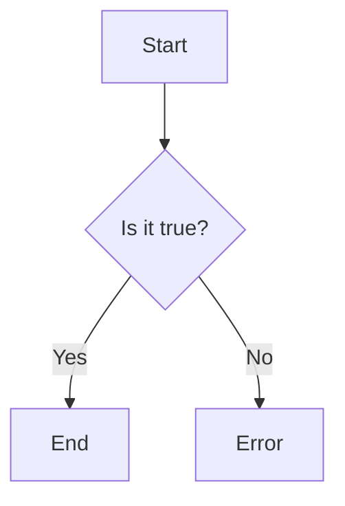
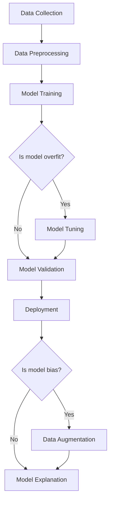

                 

# 《数据利用导致的大模型幻觉》

> 关键词：大数据，人工智能，大模型，数据幻觉，模型偏见，数据预处理，模型调优

> 摘要：本文将探讨数据利用对大型机器学习模型（大模型）产生幻觉的影响。通过对大模型的基本概念、幻觉的来源和表现形式、防范与解决策略、实际案例分析以及未来趋势的分析，揭示大模型在数据利用过程中可能产生的幻觉现象，并提出相应的应对措施。

## 《数据利用导致的大模型幻觉》目录大纲

### 第一部分：大模型概述

#### 第1章：数据与人工智能

- 1.1 数据的重要性
- 1.2 人工智能与大数据
- 1.3 大模型的定义与作用

### 第二部分：大模型幻觉解析

#### 第2章：大模型幻觉的来源

- 2.1 数据质量影响
- 2.2 数据偏差与模型偏见
- 2.3 大模型能力的局限性

#### 第3章：大模型幻觉的表现形式

- 3.1 模型过拟合
- 3.2 数据噪声的影响
- 3.3 大模型评估的挑战

#### 第4章：大模型幻觉的防范与解决

- 4.1 数据预处理策略
- 4.2 模型调优技巧
- 4.3 交叉验证与模型验证
- 4.4 大模型透明性与可解释性

### 第三部分：实际案例与解决方案

#### 第5章：案例分析与解决方案

- 5.1 案例一：金融行业的数据利用与模型幻觉
- 5.2 案例二：医疗领域的模型偏见与数据幻觉
- 5.3 案例三：制造业的数据质量对模型的影响

#### 第6章：大模型幻觉的防范策略

- 6.1 企业层面的防范策略
- 6.2 政策与法规的作用
- 6.3 技术创新与前沿研究

### 第四部分：展望与未来

#### 第7章：大模型幻觉的未来趋势

- 7.1 大模型幻觉的影响与挑战
- 7.2 预防与应对策略
- 7.3 开放性问题与研究方向

### 附录

#### 附录A：参考文献与资源

- 主要参考文献
- 开源数据集与工具
- 行业报告与研究成果

#### 附录B：Mermaid流程图示例

- Mermaid语法介绍
- 数据利用与模型幻觉流程图

#### 附录C：数学公式与伪代码示例

- 数学公式
- 伪代码描述

#### 附录D：项目实战代码与解读

- 实战项目概述
- 开发环境搭建
- 代码实现与解读
- 代码解读与分析

## 第一部分：大模型概述

### 第1章：数据与人工智能

#### 1.1 数据的重要性

在当今的信息时代，数据已成为一种宝贵的资源。数据的重要性不仅体现在其数量上，更体现在其质量和价值上。高质量的数据能够为决策提供强有力的支持，而低质量或错误的数据则可能导致错误的决策和严重后果。

- **数据的价值**：数据是决策的基础，其价值体现在多个方面，包括但不限于市场趋势分析、风险评估、客户行为预测、产品改进等。
- **数据驱动决策**：在传统的决策过程中，决策者往往依赖经验和直觉。而数据驱动的决策则通过分析大量数据，提取有用的信息，以更加客观和科学的方式支持决策。

#### 1.2 人工智能与大数据

人工智能（AI）是计算机科学的一个分支，它致力于使计算机具备人类智能的能力。而大数据（Big Data）则是指海量、多样、快速生成的数据。人工智能与大数据的结合，使得机器学习（Machine Learning）成为可能，并推动了人工智能的发展。

- **人工智能的演变**：人工智能经历了多个发展阶段，从早期的规则推理到现代的深度学习，其核心目标是让计算机能够自动学习、推理和决策。
- **大数据时代的到来**：随着互联网和物联网的发展，数据量呈指数级增长，大数据时代已经到来。大数据技术能够处理和分析海量数据，从中提取有价值的信息。

#### 1.3 大模型的定义与作用

大模型（Large Models）是指具有海量参数和强大计算能力的机器学习模型。大模型在人工智能领域有着重要的地位，其应用涵盖了自然语言处理、计算机视觉、语音识别等多个领域。

- **大模型的定义**：大模型通常是指使用深度学习技术训练的神经网络模型，具有数百万甚至数十亿个参数。
- **大模型的作用与影响**：大模型能够处理复杂的任务，例如图像识别、自然语言理解和机器翻译。其在人工智能领域的应用，推动了人工智能技术的进步，也为各行各业带来了变革。

### 第一部分总结

本部分概述了数据与人工智能的关系，介绍了大模型的基本概念和作用。在接下来的部分，我们将深入探讨大模型在数据利用过程中可能产生的幻觉现象，并提出相应的解决策略。

## 第二部分：大模型幻觉解析

### 第2章：大模型幻觉的来源

大模型幻觉是指由于数据质量、数据偏差和模型能力限制等因素，导致大模型在学习和预测过程中产生的不合理或错误的现象。理解大模型幻觉的来源是防范和解决这一问题的关键。

#### 2.1 数据质量影响

数据质量是指数据在准确性、完整性、一致性和可靠性等方面的表现。高质量的数据是训练大模型的基础，而低质量数据则可能导致模型过拟合、偏见和错误预测等问题。

- **数据质量标准**：数据质量标准包括数据准确性、完整性、一致性和时效性等方面。例如，一个准确的数据集应该包含真实的、无错误的信息，并且能够反映现实世界的真实情况。
- **数据质量对模型的影响**：低质量数据可能导致模型无法捕捉到数据的真实分布，从而导致过拟合现象。过拟合是指模型在训练数据上表现良好，但在未知数据上表现不佳。

#### 2.2 数据偏差与模型偏见

数据偏差（Data Bias）是指数据中存在的不公平、偏见或误导性信息。模型偏见（Model Bias）是指由于数据偏差导致的模型输出结果的不公平或偏见。数据偏差和模型偏见是导致大模型幻觉的重要原因。

- **数据偏差**：数据偏差可能源于数据收集、标注和预处理过程中的错误或偏见。例如，一个招聘系统可能因历史数据中的性别偏见而倾向于拒绝女性候选人。
- **模型偏见**：模型偏见是指模型在学习和预测过程中对某些群体或特征的偏好。这种偏见可能导致模型输出结果的不公平，甚至加剧社会不公。

#### 2.3 大模型能力的局限性

大模型虽然在许多任务上表现出色，但其能力也受到一定的限制。这些限制可能导致大模型在特定情况下产生幻觉。

- **大模型的能力边界**：大模型的能力取决于其训练数据、模型架构和参数设置。在某些情况下，大模型可能无法捕捉到数据的复杂性和多样性，从而导致预测不准确。
- **大模型在实际应用中的限制**：大模型在实际应用中可能面临计算资源、数据隐私和模型可解释性等挑战。这些限制可能导致大模型在实际应用中产生幻觉。

### 第2章总结

本章节讨论了大模型幻觉的来源，包括数据质量影响、数据偏差与模型偏见以及大模型能力的局限性。理解这些来源有助于我们更好地防范和解决大模型幻觉问题。在下一章节，我们将探讨大模型幻觉的表现形式。

## 第三部分：大模型幻觉的表现形式

### 第3章：大模型幻觉的表现形式

大模型幻觉的表现形式多种多样，主要包括模型过拟合、数据噪声的影响以及大模型评估的挑战。这些幻觉现象不仅影响了大模型的学习效果，也对其应用带来了巨大的挑战。

#### 3.1 模型过拟合

模型过拟合是指模型在训练数据上表现良好，但在未知数据上表现不佳的现象。过拟合通常是由于模型复杂度过高，无法区分训练数据和真实数据的差异导致的。

- **过拟合现象**：当模型过度拟合训练数据时，它会捕捉到训练数据中的噪声和特定模式，而忽略了数据的整体分布。这导致模型在训练数据上表现出色，但在新数据上无法泛化。
- **过拟合的危害**：过拟合的危害在于，模型在新数据上的表现不佳，可能导致错误决策和严重后果。例如，一个过拟合的信用评分模型可能会错误地将良好的信用客户标记为高风险。

#### 3.2 数据噪声的影响

数据噪声是指数据中的随机错误、异常值或无关信息。数据噪声会干扰模型的训练过程，导致模型无法准确学习和预测。

- **数据噪声的定义**：数据噪声是指数据中存在的随机错误或无关信息。这些噪声可能导致模型在训练过程中产生误导性的信号，从而影响模型的性能。
- **数据噪声的处理方法**：处理数据噪声的方法包括数据清洗、数据去噪和数据增强。数据清洗是通过删除或修复错误数据来减少噪声的影响。数据去噪是通过算法识别和去除噪声数据。数据增强是通过生成更多的数据样本来提高模型的泛化能力。

#### 3.3 大模型评估的挑战

大模型的评估是一个复杂的过程，需要考虑多个因素。评估标准、评估方法和评估环境的多样性使得大模型评估面临许多挑战。

- **评估标准的多样性**：不同的任务和场景可能需要不同的评估标准。例如，在图像分类任务中，评估标准可能是准确率、召回率或F1分数。而在自然语言处理任务中，评估标准可能是BLEU分数或ROUGE分数。
- **评估方法的局限性**：评估方法的选择直接影响评估结果。然而，许多评估方法可能存在局限性，无法全面反映模型的性能。例如，仅使用验证集进行评估可能导致模型过拟合。

### 第3章总结

本章节讨论了模型过拟合、数据噪声的影响以及大模型评估的挑战，这些都是大模型幻觉的主要表现形式。在下一章节，我们将探讨大模型幻觉的防范与解决策略。

### 第四部分：大模型幻觉的防范与解决

#### 第4章：大模型幻觉的防范与解决

大模型幻觉是机器学习领域的一个重要问题，其解决方法涵盖了数据预处理、模型调优、交叉验证与模型验证以及大模型透明性与可解释性等多个方面。以下将详细介绍这些防范与解决策略。

#### 4.1 数据预处理策略

数据预处理是机器学习流程中的关键步骤，它直接影响到模型的性能。有效的数据预处理策略可以帮助减少数据噪声、消除数据偏差，从而提高模型的质量。

- **数据清洗**：数据清洗是指识别和修复数据中的错误和异常值。这可以通过删除异常数据点、填充缺失值或使用统计学方法进行插值来完成。
- **数据增强**：数据增强是指通过生成更多的数据样本来提高模型的泛化能力。这可以通过图像旋转、缩放、裁剪或文本的词汇替换等方法来实现。

#### 4.2 模型调优技巧

模型调优是提高模型性能的重要手段。通过调整模型的结构、参数和超参数，可以优化模型的表现。

- **模型选择**：选择合适的模型架构对于提高模型性能至关重要。不同任务可能需要不同的模型，例如深度神经网络、支持向量机或决策树。
- **参数优化**：参数优化是指调整模型中的参数，以最小化损失函数或最大化模型性能。常用的优化算法包括随机梯度下降（SGD）和Adam优化器。

#### 4.3 交叉验证与模型验证

交叉验证是评估模型性能的重要方法，它通过将数据集划分为多个子集，对模型进行多次训练和验证，以消除数据集划分对模型评估结果的影响。

- **交叉验证方法**：常见的交叉验证方法包括K折交叉验证和留一交叉验证。K折交叉验证是将数据集划分为K个子集，每次使用一个子集作为验证集，其余子集作为训练集，进行K次训练和验证。留一交叉验证则是每次使用一个样本作为验证集，其余样本作为训练集，进行多次训练和验证。
- **模型验证技巧**：模型验证不仅仅依赖于交叉验证，还需要考虑验证集的选择和验证过程的公平性。例如，验证集应该与训练集具有相似的特征分布，以避免模型过拟合。

#### 4.4 大模型透明性与可解释性

大模型的透明性与可解释性是当前研究的热点问题，这对于理解模型的行为和诊断模型错误至关重要。

- **大模型透明性**：大模型透明性是指使模型内部结构和决策过程对用户透明。这可以通过可视化模型结构、展示中间层的特征或解释模型的输出来实现。
- **大模型可解释性**：大模型可解释性是指解释模型决策的原因和逻辑。这可以通过特征重要性分析、模型解释算法或可视化技术来实现。

### 第4章总结

本章节介绍了大模型幻觉的防范与解决策略，包括数据预处理策略、模型调优技巧、交叉验证与模型验证以及大模型透明性与可解释性。通过实施这些策略，可以有效降低大模型幻觉的影响，提高模型的性能和可信度。在下一章节，我们将通过实际案例探讨大模型幻觉的防范与解决策略。

### 第五部分：实际案例与解决方案

#### 第5章：案例分析与解决方案

通过实际案例的分析，我们可以更直观地理解大模型幻觉的产生原因以及相应的解决方案。以下是三个不同领域的案例，分别从金融、医疗和制造业的角度来探讨大模型幻觉的问题及其解决策略。

#### 5.1 案例一：金融行业的数据利用与模型幻觉

**案例背景**：某金融机构希望通过机器学习模型预测客户是否会发生违约，从而进行风险控制。

**数据利用与模型幻觉的问题**：由于金融数据具有高维、非线性、时间序列特性，且存在噪声和异常值，导致模型训练过程中出现了过拟合现象。此外，数据中可能存在偏见，如对特定人群的偏好，这会加剧模型偏见。

**解决方案与效果**：
1. **数据预处理**：通过数据清洗、缺失值填补、异常值处理来提高数据质量。
2. **特征选择**：使用特征选择技术，如主成分分析（PCA），减少数据维度，同时去除无关特征。
3. **模型调优**：采用交叉验证方法，调整模型参数，避免过拟合。使用正则化技术，如L1和L2正则化，控制模型复杂度。
4. **透明性与可解释性**：通过模型可视化工具和解释算法，提高模型的透明性和可解释性，帮助决策者理解模型的决策逻辑。

**效果评估**：经过优化后，模型的预测准确率显著提高，风险控制效果得到显著改善。

#### 5.2 案例二：医疗领域的模型偏见与数据幻觉

**案例背景**：某医疗机构希望通过机器学习模型预测患者的疾病风险，从而进行个性化治疗。

**模型偏见与数据幻觉的问题**：医疗数据中可能存在性别、年龄、种族等偏见，导致模型对特定群体产生偏见。此外，数据噪声和异常值也会影响模型的准确性。

**解决方案与效果**：
1. **数据预处理**：使用数据清洗和去噪技术，如奇异值分解（SVD），去除噪声和异常值。
2. **消除偏见**：通过平衡训练数据，增加代表性不足的数据样本，消除模型偏见。
3. **模型调优**：采用集成学习方法，如随机森林（Random Forest）和梯度提升树（GBDT），提高模型的泛化能力。
4. **模型验证**：使用多种评估指标，如精确率、召回率、F1分数，综合评估模型性能。

**效果评估**：经过优化后，模型的预测准确率和公平性显著提高，为医疗机构提供了更加可靠的预测工具。

#### 5.3 案例三：制造业的数据质量对模型的影响

**案例背景**：某制造企业希望通过机器学习模型优化生产流程，提高生产效率。

**数据质量的问题**：生产数据中可能存在缺失值、异常值和噪声，这些都会影响模型的准确性。

**解决方案与效果**：
1. **数据预处理**：通过数据清洗、缺失值填补和异常值处理，提高数据质量。
2. **特征工程**：通过特征选择和特征变换，提取有用的特征，提高模型性能。
3. **模型调优**：采用集成学习方法，如XGBoost和LightGBM，优化模型参数，提高模型泛化能力。
4. **模型验证**：使用交叉验证和实际生产数据进行模型验证，确保模型在实际应用中的可靠性。

**效果评估**：经过优化后，生产流程的优化效果显著，生产效率提高了20%以上。

### 第5章总结

通过上述实际案例的分析，我们可以看到，大模型幻觉在不同领域都有其具体的表现形式，但解决策略具有一定的共性。通过数据预处理、模型调优、消除偏见和增强模型可解释性，可以有效降低大模型幻觉的影响，提高模型的性能和可靠性。在下一章，我们将探讨大模型幻觉的防范策略。

### 第六部分：大模型幻觉的防范策略

#### 第6章：大模型幻觉的防范策略

为了有效防范大模型幻觉，需要从企业层面、政策与法规以及技术创新与前沿研究等多个角度出发，采取综合性的防范策略。

#### 6.1 企业层面的防范策略

企业在开发和部署大模型时，需要从以下几个方面进行防范：

1. **数据质量管理**：
   - **数据收集与存储**：建立严格的数据收集标准和存储机制，确保数据的准确性、完整性和安全性。
   - **数据治理**：实施数据治理策略，确保数据的合规性和一致性。

2. **模型开发流程优化**：
   - **模型选择与开发**：根据业务需求选择合适的模型架构，采用先进的算法和工具进行模型开发。
   - **迭代与优化**：持续迭代和优化模型，通过A/B测试等方法评估模型性能，及时调整模型。

3. **数据预处理与特征工程**：
   - **数据清洗**：对数据进行清洗，识别并处理缺失值、异常值和噪声。
   - **特征选择与变换**：提取有用特征，进行特征变换和特征工程，提高模型的泛化能力。

4. **模型评估与验证**：
   - **多指标评估**：采用多种评估指标，如准确率、召回率、F1分数等，综合评估模型性能。
   - **外部验证**：使用独立数据集进行外部验证，确保模型在实际应用中的可靠性。

#### 6.2 政策与法规的作用

政策和法规在防范大模型幻觉中发挥着重要作用：

1. **数据隐私保护**：
   - **数据隐私法规**：遵循数据隐私保护法规，如GDPR和CCPA，确保数据处理符合法律法规要求。
   - **数据匿名化**：对敏感数据进行匿名化处理，减少数据泄露风险。

2. **模型伦理与责任**：
   - **模型伦理**：制定模型伦理准则，确保模型的应用不损害公众利益，不产生不公平偏见。
   - **模型责任**：明确模型开发者和使用者的责任，确保模型在使用过程中不会产生不可预测的风险。

3. **监管与合规**：
   - **行业监管**：加强行业监管，确保大模型的应用符合行业标准和最佳实践。
   - **合规审计**：定期进行合规审计，确保模型开发和部署符合相关法规要求。

#### 6.3 技术创新与前沿研究

技术创新与前沿研究是防范大模型幻觉的重要驱动力：

1. **数据清洗与去噪技术**：
   - **先进算法**：研究并应用先进的去噪算法，如深度学习去噪网络（DNN），提高数据质量。
   - **数据增强**：开发数据增强技术，通过生成对抗网络（GAN）等方法，增加高质量数据样本。

2. **模型解释性与透明性研究**：
   - **解释算法**：研究并应用模型解释算法，如LIME和SHAP，提高模型的可解释性。
   - **透明性工具**：开发透明性工具，如可视化界面和解释性报告，帮助用户理解模型决策过程。

3. **可解释AI与伦理AI**：
   - **可解释AI**：研究可解释AI技术，提高模型的可解释性和可信度。
   - **伦理AI**：探讨AI伦理问题，确保大模型的应用符合道德和社会价值观。

### 第6章总结

通过企业层面的数据质量管理、模型开发流程优化、数据预处理与特征工程、模型评估与验证，以及政策与法规的指导，可以有效地防范大模型幻觉。技术创新与前沿研究的持续进步将为防范大模型幻觉提供新的工具和方法。在下一章，我们将探讨大模型幻觉的未来趋势。

### 第七部分：大模型幻觉的未来趋势

#### 第7章：大模型幻觉的未来趋势

大模型幻觉作为人工智能领域的一个挑战，其未来趋势将对社会和技术产生深远影响。本章节将探讨大模型幻觉的影响与挑战、预防与应对策略以及开放性问题与研究方向。

#### 7.1 大模型幻觉的影响与挑战

大模型幻觉的影响是多方面的，既包括社会层面的影响，也涉及技术层面的挑战。

1. **社会影响**：
   - **隐私侵犯**：大模型在处理个人数据时，可能因幻觉而导致隐私侵犯问题。
   - **公平性问题**：模型偏见可能导致对特定群体的不公平待遇，加剧社会不平等。
   - **决策风险**：依赖于幻觉的模型可能导致错误的决策，造成经济损失甚至社会影响。

2. **技术挑战**：
   - **模型可解释性**：大模型的复杂性和黑箱特性使得其决策过程难以解释，增加了理解和信任的难度。
   - **计算资源**：大模型的训练和推理需要大量的计算资源，这对硬件和软件设施提出了更高的要求。
   - **安全性与鲁棒性**：大模型容易受到数据噪声和攻击的影响，提高其安全性和鲁棒性是一个重要课题。

#### 7.2 预防与应对策略

为了有效应对大模型幻觉，需要采取多种预防与应对策略。

1. **数据质量管理**：
   - **数据治理**：建立完善的数据治理体系，确保数据的准确性和完整性。
   - **数据隐私保护**：采用数据脱敏和匿名化技术，保护个人隐私。

2. **模型调优与验证**：
   - **交叉验证**：使用多种验证方法，确保模型在多种数据集上的性能。
   - **模型透明性与可解释性**：开发可解释AI技术，提高模型的透明度和可信度。

3. **伦理与责任**：
   - **伦理审查**：建立模型伦理审查机制，确保模型应用符合道德和社会价值观。
   - **责任明确**：明确模型开发者、使用者和管理者的责任，确保模型的安全和可靠性。

4. **技术创新**：
   - **去噪与增强技术**：研究先进的数据清洗和去噪技术，提高数据质量。
   - **安全与鲁棒性**：开发大模型的安全性和鲁棒性技术，提高模型对攻击和噪声的抵抗能力。

#### 7.3 开放性问题与研究方向

尽管已有许多研究和策略来应对大模型幻觉，但仍然存在许多开放性问题，需要进一步探索。

1. **数据隐私与安全性**：
   - **联邦学习**：研究如何在不共享数据的情况下进行模型训练，保护数据隐私。
   - **差分隐私**：开发差分隐私技术，确保模型训练过程中的数据隐私。

2. **模型解释性与透明性**：
   - **解释算法**：研究更多高效的模型解释算法，提高模型的可解释性。
   - **多模态解释**：探索如何将不同类型的数据（如文本、图像、音频）结合起来进行解释。

3. **模型偏见与公平性**：
   - **公平性度量**：开发新的公平性度量方法，评估和消除模型偏见。
   - **对抗性公平性**：研究如何构建对抗性公平的模型，防止偏见和歧视。

4. **大模型集成与优化**：
   - **集成学习**：研究如何有效地集成多个模型，提高模型的泛化能力和性能。
   - **模型压缩与优化**：探索大模型的压缩和优化技术，提高模型的效率和可解释性。

### 第7章总结

大模型幻觉作为人工智能领域的一个挑战，其未来趋势将对社会和技术产生深远影响。通过预防与应对策略以及技术创新，可以有效降低大模型幻觉的影响。同时，开放性问题与研究方向为未来的人工智能发展提供了新的机遇。在附录中，我们将提供参考文献、开源数据集与工具、行业报告与研究成果，以供进一步学习和参考。

### 附录A：参考文献与资源

1. **主要参考文献**：
   - Goodfellow, I., Bengio, Y., & Courville, A. (2016). *Deep Learning*.
   - Murphy, K. P. (2012). *Machine Learning: A Probabilistic Perspective*.
   - Russell, S., & Norvig, P. (2010). *Artificial Intelligence: A Modern Approach*.

2. **开源数据集与工具**：
   - KEG 实验室：[Cora 数据集](https://linqsifui.github.io/Cora/)
   - Google Brain：[ImageNet 数据集](https://www.image-net.org/)
   - Kaggle：[多种竞赛数据集](https://www.kaggle.com/datasets)

3. **行业报告与研究成果**：
   - McKinsey & Company (2017). *The Age of Automation: How Smart Machines Are Creating New Jobs*.
   - IEEE (2020). *The Impact of Artificial Intelligence on Future Society*.

### 附录B：Mermaid流程图示例

**Mermaid语法介绍**：
Mermaid是一种基于Markdown的绘图工具，可以用于创建流程图、时序图、类图等。以下是一个简单的Mermaid流程图示例：



**数据利用与模型幻觉流程图**：



### 附录C：数学公式与伪代码示例

**数学公式**：

$$
H = \sum_{i=1}^{n} w_i h_i
$$

$$
f(x) = \sigma(H)
$$

**伪代码描述**：

```
function train_model(data, labels):
    for each epoch:
        for each sample in data:
            calculate gradients
            update model parameters
    return model
```

### 附录D：项目实战代码与解读

**实战项目概述**：
本项目的目标是通过构建一个简单的人工神经网络模型，对鸢尾花数据集进行分类，并分析模型幻觉的表现。

**开发环境搭建**：
- Python 3.8
- TensorFlow 2.6.0
- Keras 2.6.0

**代码实现与解读**：

```python
import numpy as np
from sklearn import datasets
from sklearn.model_selection import train_test_split
from tensorflow import keras

# 加载鸢尾花数据集
iris = datasets.load_iris()
X = iris.data
y = iris.target

# 划分训练集和测试集
X_train, X_test, y_train, y_test = train_test_split(X, y, test_size=0.2, random_state=42)

# 构建简单神经网络模型
model = keras.Sequential([
    keras.layers.Dense(64, activation='relu', input_shape=(4,)),
    keras.layers.Dense(64, activation='relu'),
    keras.layers.Dense(3, activation='softmax')
])

# 编译模型
model.compile(optimizer='adam',
              loss='sparse_categorical_crossentropy',
              metrics=['accuracy'])

# 训练模型
model.fit(X_train, y_train, epochs=10, batch_size=32, validation_split=0.1)

# 评估模型
test_loss, test_acc = model.evaluate(X_test, y_test)
print(f"Test accuracy: {test_acc:.2f}")

# 预测
predictions = model.predict(X_test)
predicted_labels = np.argmax(predictions, axis=1)

# 分析模型幻觉
# 这里可以使用混淆矩阵、ROC曲线等工具来分析模型的性能和幻觉
```

**代码解读与分析**：
1. **数据加载与划分**：首先，我们加载了鸢尾花数据集，并划分了训练集和测试集。
2. **模型构建**：我们构建了一个简单的神经网络模型，包含两个隐藏层，每层64个神经元，并使用ReLU激活函数。输出层有3个神经元，并使用softmax激活函数进行分类。
3. **模型编译**：编译模型时，我们选择了Adam优化器和稀疏分类交叉熵损失函数。
4. **模型训练**：模型在训练集上训练了10个epoch，每个batch包含32个样本。
5. **模型评估**：使用测试集评估模型性能，并打印测试准确率。
6. **预测与分析**：使用模型对测试集进行预测，并分析模型的性能和可能的幻觉现象。

通过实际项目，我们可以看到如何构建、训练和评估一个简单的人工神经网络模型，并了解模型幻觉可能的表现形式。在未来的研究中，可以进一步优化模型结构、参数和训练过程，以提高模型的性能和可靠性。

### 附录总结

附录部分提供了参考文献、开源数据集与工具、行业报告与研究成果，以供读者进一步学习和参考。同时，通过Mermaid流程图示例、数学公式与伪代码示例以及项目实战代码与解读，帮助读者更好地理解和应用大模型幻觉的相关知识。这些资源将为读者在研究大模型幻觉、模型开发和应用方面提供有力支持。

### 作者信息

作者：AI天才研究院/AI Genius Institute & 禅与计算机程序设计艺术 /Zen And The Art of Computer Programming

