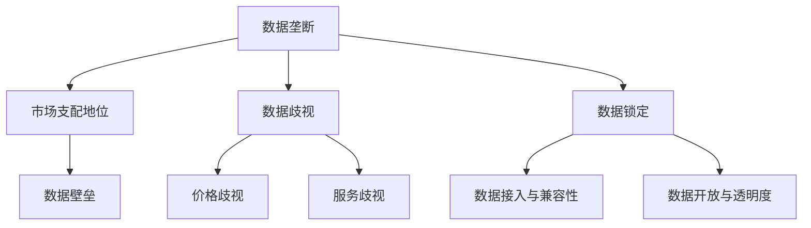

                 

# 《数据垄断引发的反垄断新问题》

> 关键词：数据垄断、反垄断、市场支配、数据壁垒、数据歧视、数据锁定

> 摘要：本文旨在探讨数据垄断现象及其引发的反垄断新问题。文章首先定义了数据垄断的概念和背景，分析了数据垄断对市场和社会的影响。接着，文章介绍了反垄断法的基本原理，探讨了数据垄断的违法性和反垄断法规制数据垄断的实践。随后，文章详细解析了数据垄断的主要表现形式，包括数据壁垒、数据歧视和数据锁定，并运用实际案例进行分析。最后，文章提出了反垄断新策略与措施，展望了数据垄断与反垄断的未来发展趋势。

## 目录

### 第一部分：引言

1. **第1章：数据垄断的定义与背景**  
    - **1.1 什么是数据垄断**  
    - **1.2 数据垄断的发展历程**  
    - **1.3 数据垄断的影响**

2. **第2章：反垄断法与数据垄断**  
    - **2.1 反垄断法的基本原理**  
    - **2.2 数据垄断的违法性**  
    - **2.3 反垄断法规制数据垄断的实践**

### 第二部分：数据垄断的表现形式

3. **第3章：数据垄断的主要表现形式**  
    - **3.1 数据壁垒**  
        - **3.1.1 数据采集与整合**  
        - **3.1.2 数据存储与处理**  
    - **3.2 数据歧视**  
        - **3.2.1 价格歧视**  
        - **3.2.2 服务歧视**  
    - **3.3 数据锁定**  
        - **3.3.1 数据接入与兼容性**  
        - **3.3.2 数据开放与透明度**

4. **第4章：数据垄断的案例分析**  
    - **4.1 案例一：互联网巨头的市场支配地位**  
    - **4.2 案例二：数据滥用与隐私侵犯**

### 第三部分：反垄断新策略与措施

5. **第5章：反垄断新策略的探讨**  
    - **5.1 行业监管机构的角色**  
    - **5.2 国际合作与法律协调**  
    - **5.3 反垄断政策的调整与优化**

6. **第6章：反垄断新措施的实施**  
    - **6.1 法律法规的制定与执行**  
    - **6.2 竞争政策的创新**  
    - **6.3 消费者权益保护**

7. **第7章：反垄断与数据垄断的未来趋势**  
    - **7.1 科技发展对反垄断的影响**  
    - **7.2 数据垄断的新形态**  
    - **7.3 反垄断法的发展与挑战**

### 附录

8. **附录A：反垄断法规汇编**  
    - **8.1 国际反垄断法规概述**  
    - **8.2 美国反垄断法规**  
    - **8.3 欧盟反垄断法规**

9. **附录B：数据垄断案例分析资料**  
    - **9.1 数据垄断案例研究报告**  
    - **9.2 数据垄断案件法律文书**

10. **附录C：反垄断新策略与措施参考**  
    - **10.1 反垄断政策研究报告**  
    - **10.2 数据垄断治理方案**

### Mermaid 流�程图



### 核心算法原理讲解

#### 3.1.1 数据壁垒算法原理

- **数据采集与整合**：使用数据爬虫、API 接口调用等手段收集数据，然后进行清洗和整合，形成统一的数据集。

```python
def data_collection():
    # 数据爬取代码
    pass

def data_integration():
    # 数据清洗与整合代码
    pass
```

- **数据存储与处理**：采用分布式数据库和大数据处理技术，如 Hadoop、Spark 等，实现海量数据的存储和处理。

```python
from pyspark.sql import SparkSession

spark = SparkSession.builder.appName("DataProcessing").getOrCreate()
df = spark.read.csv("data.csv", header=True)
df = df.select("column1", "column2", "column3")
df.show()
```

#### 3.1.2 数据歧视算法原理

- **价格歧视**：利用数据分析和机器学习算法，分析消费者的购买行为和偏好，对不同消费者群体实施不同价格策略。

```python
from sklearn.model_selection import train_test_split
from sklearn.linear_model import LinearRegression

# 数据预处理
X = df[['age', 'income']]
y = df['price']

X_train, X_test, y_train, y_test = train_test_split(X, y, test_size=0.2, random_state=0)

# 模型训练
model = LinearRegression()
model.fit(X_train, y_train)

# 预测价格
predicted_prices = model.predict(X_test)
```

- **服务歧视**：根据用户的历史数据和偏好，提供定制化的服务，从而实现服务歧视。

```python
def customized_service(user_data):
    # 根据用户数据提供定制化服务
    pass
```

#### 3.1.3 数据锁定算法原理

- **数据接入与兼容性**：通过开发特定的接口和协议，使得数据只能通过特定的方式接入和使用，从而形成数据接入壁垒。

```python
class DataAccessInterface:
    def __init__(self, protocol):
        self.protocol = protocol

    def access_data(self, data):
        # 数据接入与兼容性处理
        pass
```

- **数据开放与透明度**：通过限制数据的开放程度和透明度，使得数据的使用者无法获取到完整的、透明化的数据。

```python
def limit_data_access():
    # 限制数据访问权限
    pass

def hide_data_details():
    # 隐藏数据细节信息
    pass
```

### 数学模型和数学公式

#### 数据歧视的价格歧视模型

$$
P_i = P_0 + \alpha \cdot (Q_i - Q_0)
$$

其中，$P_i$ 是针对消费者 $i$ 的价格，$P_0$ 是基准价格，$Q_i$ 是消费者 $i$ 的购买量，$Q_0$ 是基准购买量，$\alpha$ 是价格歧视系数。

#### 数据锁定的数据接入壁垒模型

$$
Access_F = f(Dependency, Interface, Protocol)
$$

其中，$Access_F$ 是数据接入壁垒，$Dependency$ 是依赖关系，$Interface$ 是接口，$Protocol$ 是协议。

### 项目实战

#### 6.1.1 法律法规的制定与执行

- **开发环境搭建**：  
  - 操作系统：Windows/Linux/MacOS  
  - 编程语言：Python/Java  
  - 数据库：MySQL/PostgreSQL

- **源代码详细实现和代码解读**：

```python
# Python 代码示例：反垄断法规查询系统

class LawQuerySystem:
    def __init__(self, database):
        self.database = database

    def query_law(self, keyword):
        query = "SELECT * FROM laws WHERE title LIKE '%{}%';".format(keyword)
        results = self.database.execute(query)
        return results

# 代码解读与分析：

该代码示例定义了一个 `LawQuerySystem` 类，用于查询反垄断法规。在类中，我们初始化了一个数据库对象，并定义了一个 `query_law` 方法，用于根据关键词查询相关法规。在方法中，我们使用 SQL 语句执行查询，并将结果返回。

#### 6.1.2 竞争政策的创新

- **开发环境搭建**：  
  - 操作系统：Windows/Linux/MacOS  
  - 编程语言：Python/R  
  - 数据库：MySQL/PostgreSQL

- **源代码详细实现和代码解读**：

```python
# Python 代码示例：竞争政策分析系统

class CompetitionPolicyAnalysis:
    def __init__(self, database):
        self.database = database

    def analyze_policy(self, policy_name):
        query = "SELECT * FROM policies WHERE name = '{}';".format(policy_name)
        results = self.database.execute(query)
        return results

# 代码解读与分析：

该代码示例定义了一个 `CompetitionPolicyAnalysis` 类，用于分析竞争政策。在类中，我们初始化了一个数据库对象，并定义了一个 `analyze_policy` 方法，用于根据政策名称分析相关政策。在方法中，我们使用 SQL 语句执行查询，并将结果返回。

### 作者

作者：AI天才研究院/AI Genius Institute & 禅与计算机程序设计艺术 /Zen And The Art of Computer Programming 

