                 

# 数据处理的重要性：训练大模型的关键一环

> 关键词：数据处理、数据清洗、数据预处理、数据增强、大模型训练、机器学习

> 摘要：本文深入探讨了数据处理在训练大模型中的重要性。首先，我们介绍了数据处理的基本概念和其在人工智能中的应用。接着，我们详细阐述了数据清洗、数据预处理和数据增强的核心概念和具体方法。随后，本文分析了数据处理在大模型训练中的作用，并讨论了常见的数据处理工具和框架。最后，通过案例分析，我们展示了数据处理在实际项目中的应用效果，并提出了数据处理的发展趋势和最佳实践。

## 目录

### 《数据处理的重要性：训练大模型的关键一环》

> 关键词：<数据处理、数据清洗、数据预处理、数据增强、大模型训练、机器学习>

> 摘要：<本文探讨了数据处理在训练大模型中的重要性，包括数据清洗、预处理和增强等核心环节。通过详细分析，本文揭示了数据处理对模型性能的深远影响，并提供了实用的工具和最佳实践。>

### 第一部分：数据处理的基本概念与重要性

#### 第1章：数据处理概述

##### 1.1 数据处理在人工智能中的应用

##### 1.2 数据处理的分类与特点

##### 1.3 数据处理的挑战与解决方案

#### 第2章：数据清洗

##### 2.1 数据清洗的重要性

##### 2.2 数据清洗的主要任务

##### 2.3 数据清洗的方法与工具

#### 第3章：数据预处理

##### 3.1 数据预处理的基本概念

##### 3.2 数据归一化与标准化

##### 3.3 数据降维与特征选择

#### 第4章：数据增强

##### 4.1 数据增强的重要性

##### 4.2 数据增强的方法

##### 4.3 数据增强的应用场景

### 第二部分：数据处理在大模型训练中的应用

#### 第5章：数据处理在大模型训练中的作用

##### 5.1 数据处理对模型性能的影响

##### 5.2 数据预处理在大模型训练中的应用

##### 5.3 数据清洗与数据增强在大模型训练中的重要性

#### 第6章：数据处理工具与框架

##### 6.1 常见数据处理工具

##### 6.2 数据处理框架

##### 6.3 数据处理工具与框架的选择与优化

#### 第7章：数据处理案例分析

##### 7.1 案例背景与目标

##### 7.2 数据处理过程

##### 7.3 案例分析与效果评估

### 第三部分：数据处理的最佳实践与未来展望

#### 第8章：数据处理的最佳实践

##### 8.1 数据处理流程设计

##### 8.2 数据处理的质量控制

##### 8.3 数据处理的成本效益分析

#### 第9章：数据处理的发展趋势与未来展望

##### 9.1 数据处理的未来发展方向

##### 9.2 数据处理的技术挑战与解决方案

##### 9.3 数据处理在教育、医疗、金融等领域的应用前景

### 附录

##### 附录A：数据处理相关工具与资源

##### 附录B：数据处理数学模型与公式

##### 附录C：数据处理项目实战案例代码与解读

---

## 第一部分：数据处理的基本概念与重要性

### 第1章：数据处理概述

#### 1.1 数据处理在人工智能中的应用

在人工智能（AI）领域，数据处理是训练高效模型的关键步骤。数据处理不仅涉及从原始数据集中提取有用的信息，还包括对数据进行清洗、预处理和增强，以提高数据质量，从而增强模型的性能。

数据处理在AI中的应用可以分为以下几个阶段：

1. **数据采集**：收集各种来源的数据，如传感器数据、网络数据、文档等。
2. **数据清洗**：去除噪声和不准确的数据，确保数据的质量。
3. **数据预处理**：通过归一化、标准化和特征选择等步骤，使数据适合模型训练。
4. **数据增强**：通过人工或自动方法生成额外的数据样本，以提升模型的泛化能力。

数据处理不仅仅是AI领域的需求，在商业智能、数据挖掘等领域也有广泛的应用。以下Mermaid流程图展示了数据处理在AI中的应用流程：

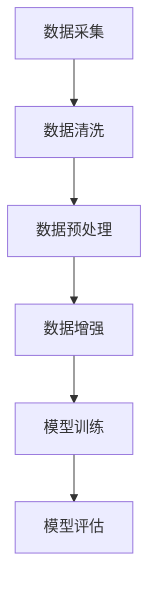

#### 1.2 数据处理的分类与特点

数据处理可以分为三个主要类别：数据清洗、数据预处理和数据增强。

1. **数据清洗**：
   - **重要性**：确保数据质量，去除噪声和不准确的数据。
   - **任务**：缺失值处理、异常值检测、重复值删除、格式化等。
   - **方法**：手动处理、自动化工具（如Pandas、Spark）。

2. **数据预处理**：
   - **重要性**：使数据适合模型训练，提高模型的性能和泛化能力。
   - **任务**：数据归一化、标准化、特征选择、数据降维等。
   - **方法**：统计方法、机器学习方法。

3. **数据增强**：
   - **重要性**：通过生成额外的数据样本，提升模型的泛化能力。
   - **任务**：图像、文本、音频等数据的增强。
   - **方法**：复制、旋转、缩放、剪裁、填充等。

不同类型的数据处理具有不同的特点和目标，但它们共同的作用是提高数据的质量，从而增强模型的性能。

#### 1.3 数据处理的挑战与解决方案

在数据处理过程中，我们可能会遇到以下挑战：

1. **数据质量差**：数据包含噪声、缺失值和异常值。
   - **解决方案**：数据清洗，包括缺失值填充、异常值检测和删除。
   2. **数据量大**：处理大量数据可能影响模型的训练速度和性能。
   - **解决方案**：分布式数据处理框架，如Hadoop、Spark。
   3. **数据多样性**：不同来源的数据可能有不同的格式和结构。
   - **解决方案**：数据转换和集成，使用ETL工具。

通过解决这些挑战，我们可以确保数据处理的高效性和准确性，从而为模型的训练提供高质量的数据。

### 第2章：数据清洗

#### 2.1 数据清洗的重要性

数据清洗是数据处理过程中的第一步，其重要性不容忽视。高质量的数据是训练高效模型的基石，而数据清洗则是确保数据质量的关键步骤。

- **去除噪声**：噪声数据会干扰模型的训练过程，导致模型性能下降。
- **纠正错误**：数据中的错误会影响模型的准确性和可靠性。
- **减少缺失值**：缺失值会导致模型无法充分利用数据，影响模型的泛化能力。

以下Mermaid流程图展示了数据清洗的步骤和重要性：

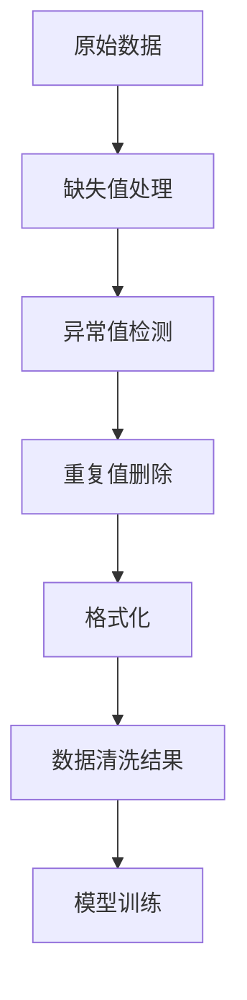

#### 2.2 数据清洗的主要任务

数据清洗的主要任务包括缺失值处理、异常值检测、重复值删除和格式化。

1. **缺失值处理**：
   - **任务**：识别和处理数据集中的缺失值。
   - **方法**：填充缺失值、删除缺失值或使用统计方法进行估算。

2. **异常值检测**：
   - **任务**：识别和处理数据集中的异常值。
   - **方法**：基于统计方法的异常值检测、基于机器学习的方法。

3. **重复值删除**：
   - **任务**：识别和删除数据集中的重复值。
   - **方法**：基于键值对、基于相似度匹配。

4. **格式化**：
   - **任务**：将数据转换成一致的格式，如统一日期格式、文本编码等。

以下伪代码展示了数据清洗的基本步骤：

```python
def clean_data(data):
    # 缺失值处理
    data = handle_missing_values(data)
    # 异常值检测
    data = detect_and_handle_anomalies(data)
    # 重复值删除
    data = remove_duplicates(data)
    # 格式化
    data = format_data(data)
    return data
```

#### 2.3 数据清洗的方法与工具

数据清洗可以采用手动方法或自动化工具。

1. **手动方法**：
   - **优点**：灵活性强，适用于小型数据集。
   - **缺点**：耗时较长，适用于小型数据集。

2. **自动化工具**：
   - **Pandas**：Python库，提供丰富的数据清洗功能。
   - **Spark**：分布式数据处理框架，适用于大规模数据集。

以下Mermaid流程图展示了使用Pandas进行数据清洗的步骤：

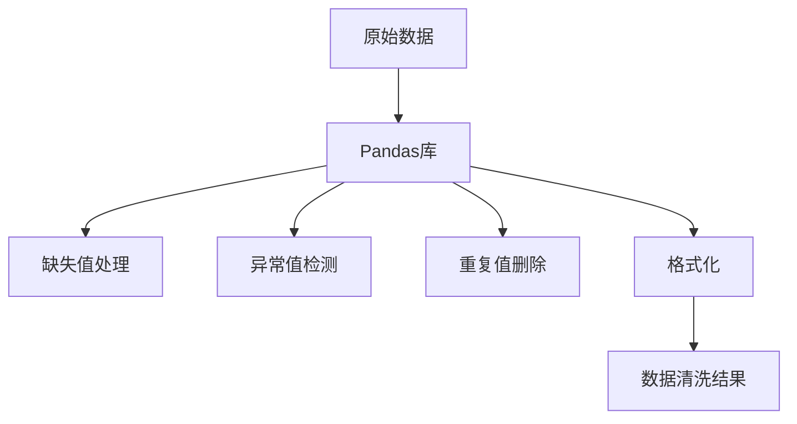

### 第3章：数据预处理

#### 3.1 数据预处理的基本概念

数据预处理是数据处理过程中的关键步骤，其目的是将原始数据转换为适合模型训练的形式。数据预处理包括数据归一化、标准化、特征选择和数据降维等技术。

- **数据归一化**：将不同特征的数据转换到同一尺度，如将数据缩放到[0, 1]范围内。
- **数据标准化**：将数据转换为具有标准正态分布的形式，如使用Z-score进行标准化。
- **特征选择**：从数据集中选择最有用的特征，以减少模型训练的时间和复杂性。
- **数据降维**：将高维数据集转换成低维数据集，以减少计算复杂度和提高模型性能。

以下Mermaid流程图展示了数据预处理的基本概念：

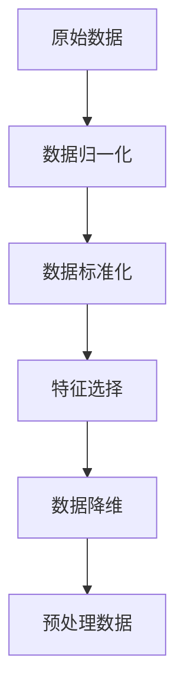

#### 3.2 数据归一化与标准化

数据归一化和标准化是数据预处理中常用的技术，它们的主要区别在于数据转换的方式。

1. **数据归一化**：
   - **公式**：\(x_{\text{norm}} = \frac{x - \min(x)}{\max(x) - \min(x)}\)
   - **优点**：简化数据范围，使不同特征之间的比较更加直观。
   - **缺点**：对极端值敏感。

2. **数据标准化**：
   - **公式**：\(x_{\text{std}} = \frac{x - \mu}{\sigma}\)，其中\(\mu\)是均值，\(\sigma\)是标准差。
   - **优点**：将数据转换为具有标准正态分布的形式，使模型更容易处理。
   - **缺点**：对异常值较为敏感。

以下伪代码展示了数据归一化和标准化的实现：

```python
def normalize_data(data):
    min_val = min(data)
    max_val = max(data)
    norm_data = (data - min_val) / (max_val - min_val)
    return norm_data

def standardize_data(data):
    mu = np.mean(data)
    sigma = np.std(data)
    std_data = (data - mu) / sigma
    return std_data
```

#### 3.3 数据降维与特征选择

数据降维和特征选择是减少数据维度和特征数量的技术，以提高模型训练的效率和性能。

1. **数据降维**：
   - **主成分分析（PCA）**：通过保留主要数据变异，将高维数据集转换为低维数据集。
   - **t-SNE**：一种非线性的降维技术，用于可视化高维数据。

2. **特征选择**：
   - **过滤方法**：基于特征与目标变量之间的相关性，筛选最有用的特征。
   - **包装方法**：结合模型训练过程，逐步选择最有用的特征。
   - **嵌入式方法**：在模型训练过程中，自动选择最重要的特征。

以下Mermaid流程图展示了数据降维和特征选择的实现步骤：

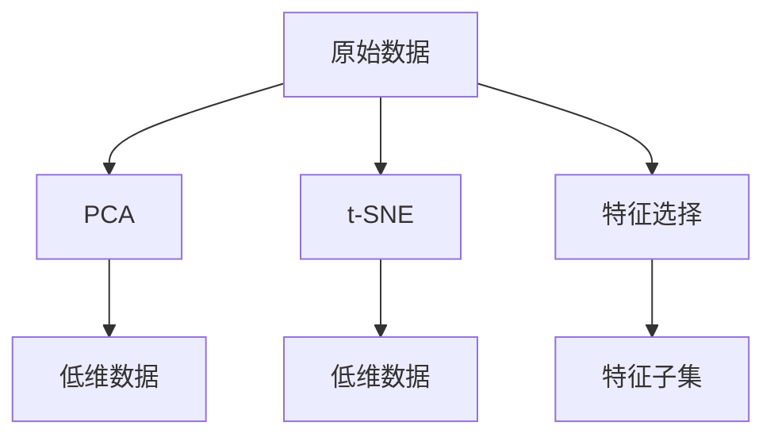

### 第4章：数据增强

#### 4.1 数据增强的重要性

数据增强是通过生成额外的数据样本来提高模型的泛化能力和鲁棒性。在训练大模型时，数据增强尤为重要，因为它可以弥补数据集的不平衡，增加模型对未知数据的适应性。

- **增加数据多样性**：通过生成不同的数据样本，提高模型的泛化能力。
- **减少过拟合**：通过增加训练数据量，降低模型对训练数据的依赖性。
- **提高模型鲁棒性**：通过生成具有不同噪声、旋转、缩放等特征的数据样本，提高模型对噪声和变化的适应性。

以下Mermaid流程图展示了数据增强的重要性：

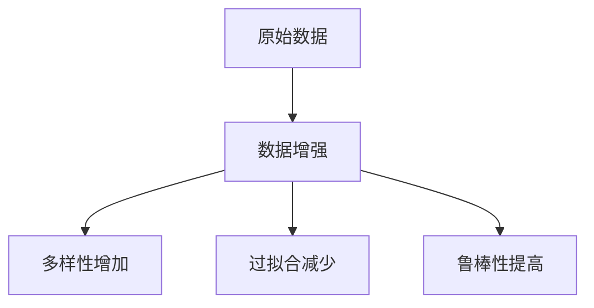

#### 4.2 数据增强的方法

数据增强的方法可以分为人工增强和自动增强。

1. **人工增强**：
   - **复制**：复制原始数据样本，增加数据量。
   - **旋转、缩放、剪裁**：对图像、文本等数据进行变换，增加数据的多样性。

2. **自动增强**：
   - **GAN（生成对抗网络）**：通过生成对抗过程，生成与真实数据相似的新数据样本。
   - **数据合成**：使用深度学习模型，将不同的数据特征组合成新的数据样本。

以下Mermaid流程图展示了数据增强的方法：

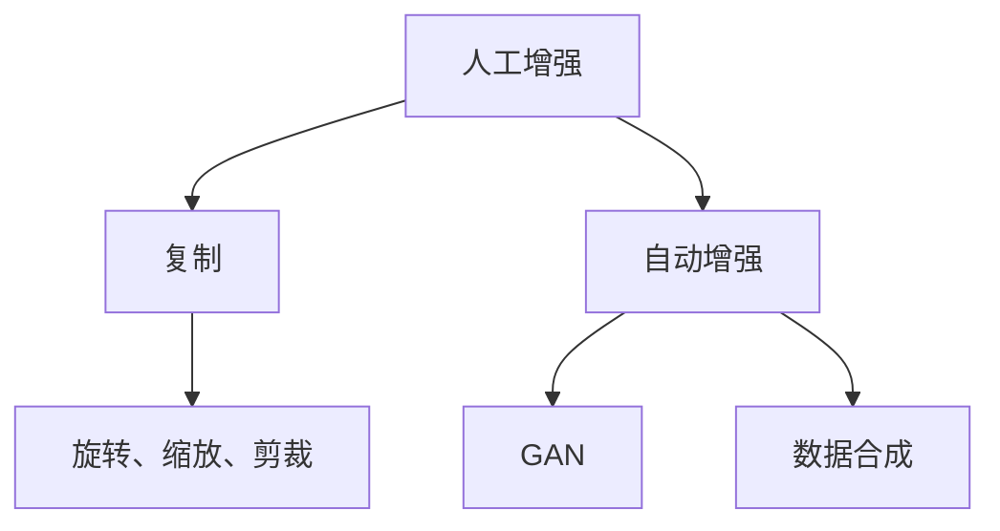

#### 4.3 数据增强的应用场景

数据增强在多个领域都有广泛的应用，以下是一些常见的应用场景：

1. **图像识别**：通过旋转、缩放、剪裁和填充等方式，增加图像数据的多样性。
2. **语音识别**：通过添加背景噪声、改变语速和语调，提高模型的鲁棒性。
3. **自然语言处理**：通过随机插入、删除和替换文本，增加文本数据的多样性。
4. **医疗影像**：通过数据增强，提高模型对医疗影像的识别和诊断能力。

以下Mermaid流程图展示了数据增强在图像识别中的应用：

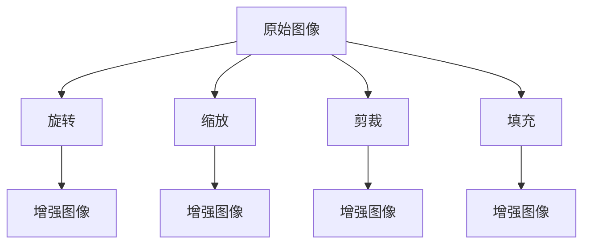

### 第二部分：数据处理在大模型训练中的应用

#### 第5章：数据处理在大模型训练中的作用

#### 5.1 数据处理对模型性能的影响

数据处理在大模型训练中起着至关重要的作用，它直接影响模型的性能和泛化能力。

- **数据质量**：高质量的数据是训练高效模型的基础。如果数据存在噪声、缺失值和异常值，模型可能会学习到错误的模式，导致性能下降。
- **数据量**：数据量对模型的性能有显著影响。更多的数据可以帮助模型更好地泛化，减少过拟合现象。
- **数据多样性**：数据多样性有助于模型学习到更多的特征和模式，提高模型的泛化能力。

以下Mermaid流程图展示了数据处理对模型性能的影响：

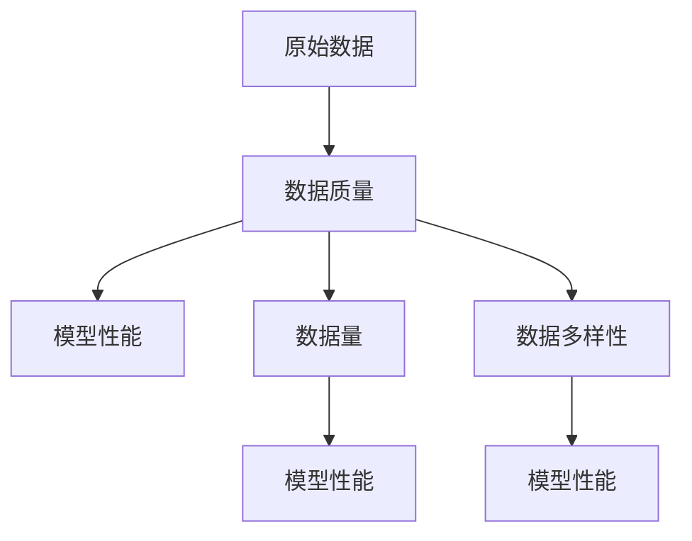

#### 5.2 数据预处理在大模型训练中的应用

数据预处理在大模型训练中至关重要，它包括数据归一化、标准化、特征选择和数据降维等技术。

- **数据归一化**：通过将不同特征的数据转换为同一尺度，减少特征之间的差异，提高模型的学习效率。
- **数据标准化**：通过将数据转换为具有标准正态分布的形式，使模型更容易处理和优化。
- **特征选择**：通过选择最有用的特征，减少模型的复杂度，提高训练速度和性能。
- **数据降维**：通过降低数据的维度，减少计算复杂度和存储需求，提高模型的泛化能力。

以下Mermaid流程图展示了数据预处理在大模型训练中的应用：

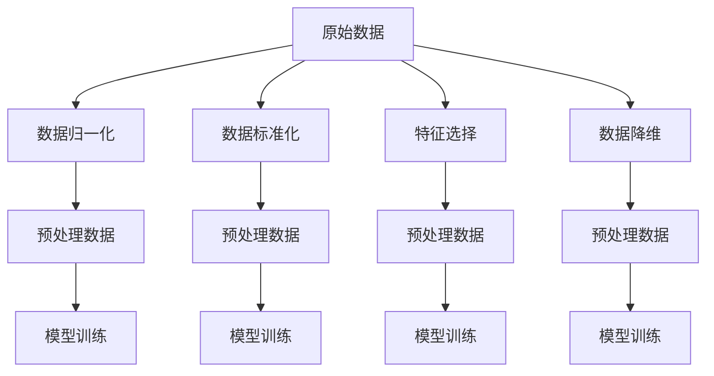

#### 5.3 数据清洗与数据增强在大模型训练中的重要性

数据清洗和数据增强在大模型训练中同样重要，它们对模型性能的改进具有显著作用。

- **数据清洗**：通过去除噪声、缺失值和异常值，提高数据质量，从而提高模型的学习效率。
- **数据增强**：通过生成额外的数据样本，增加数据多样性，减少过拟合现象，提高模型的泛化能力。

以下Mermaid流程图展示了数据清洗与数据增强在大模型训练中的重要性：

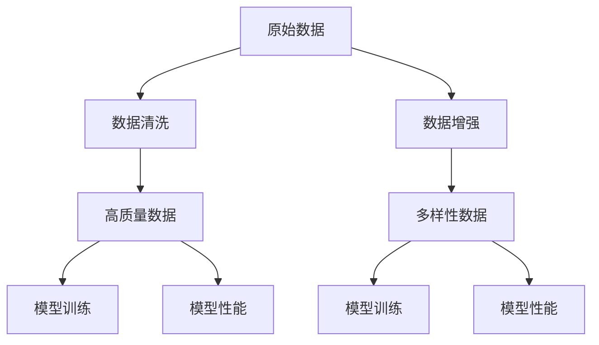

### 第6章：数据处理工具与框架

#### 6.1 常见数据处理工具

在数据处理过程中，常用的工具包括Pandas、Spark、Hadoop等。

- **Pandas**：Python库，提供强大的数据处理功能，适用于小型数据集。
- **Spark**：分布式数据处理框架，适用于大规模数据集，支持多种编程语言。
- **Hadoop**：分布式数据处理框架，适用于大规模数据集，基于Java编写。

以下Mermaid流程图展示了常见数据处理工具的应用：

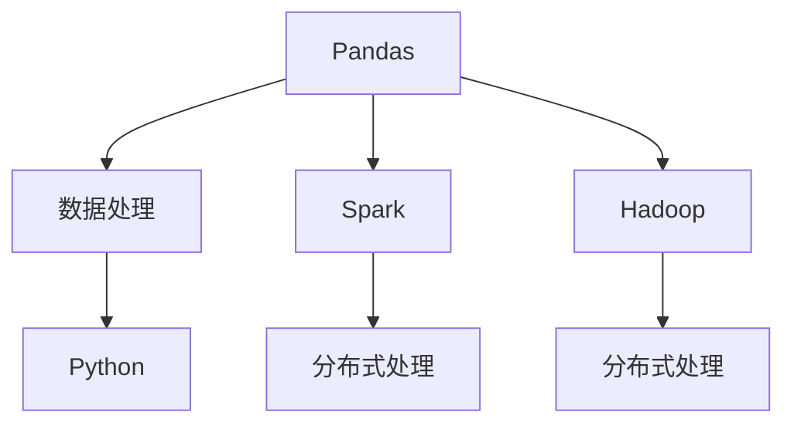

#### 6.2 数据处理框架

数据处理框架如TensorFlow、PyTorch等，提供了丰富的数据处理和模型训练功能。

- **TensorFlow**：Google开发的开源深度学习框架，支持多种编程语言。
- **PyTorch**：基于Python的深度学习框架，提供动态计算图和灵活的编程接口。

以下Mermaid流程图展示了数据处理框架的应用：

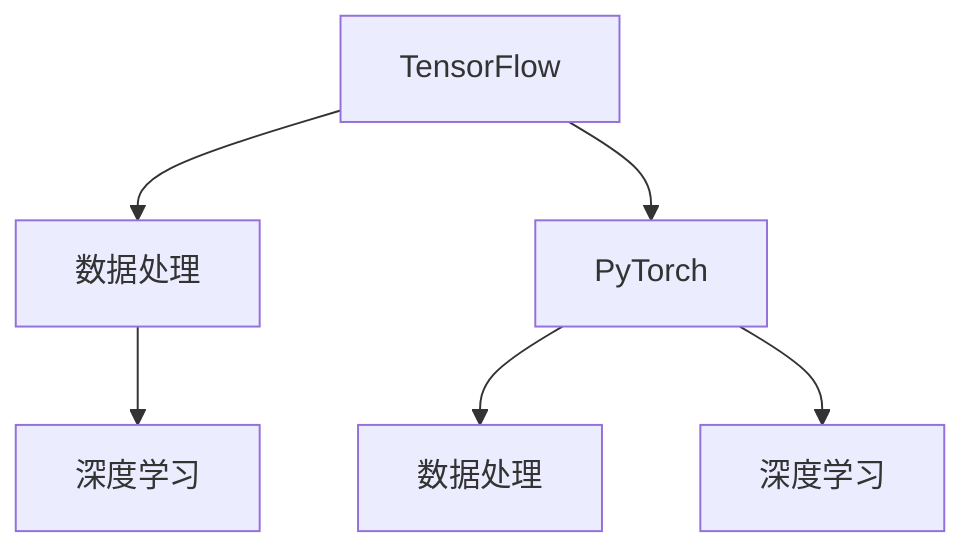

#### 6.3 数据处理工具与框架的选择与优化

选择合适的数据处理工具和框架是数据处理的关键步骤。以下是一些优化策略：

- **数据规模**：根据数据规模选择合适的工具和框架，如Pandas适用于小型数据集，Spark适用于大规模数据集。
- **编程语言**：选择熟悉和擅长的编程语言，如Python、Java等。
- **性能要求**：根据性能要求选择合适的工具和框架，如TensorFlow和PyTorch提供高效的深度学习功能。
- **扩展性**：选择具有良好扩展性的工具和框架，以支持未来的数据增长和需求变化。

以下Mermaid流程图展示了数据处理工具与框架的选择与优化：

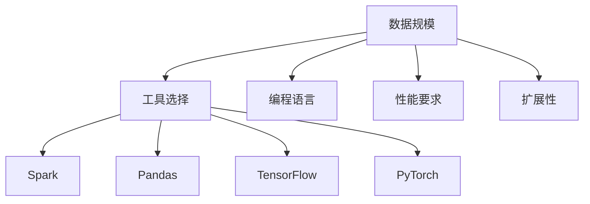

### 第7章：数据处理案例分析

#### 7.1 案例背景与目标

本案例以一个实际项目为例，探讨数据处理在模型训练中的应用效果。

- **背景**：一家金融机构希望开发一个智能贷款审批系统，通过分析客户的历史数据，预测客户的贷款申请是否被批准。
- **目标**：通过数据处理，提高模型对贷款申请的预测准确性和鲁棒性。

#### 7.2 数据处理过程

数据处理过程包括数据清洗、预处理和增强等步骤。

1. **数据清洗**：
   - **缺失值处理**：使用均值填补缺失的客户收入数据。
   - **异常值检测**：使用箱线图检测并删除极端异常值。
   - **重复值删除**：删除重复的客户记录。

2. **数据预处理**：
   - **数据归一化**：将客户年龄、贷款金额等特征数据归一化到[0, 1]范围内。
   - **特征选择**：选择与贷款审批相关的重要特征，如收入、工作年限、信用评分等。
   - **数据降维**：使用主成分分析（PCA）将高维数据集降维，提高模型训练的效率。

3. **数据增强**：
   - **图像增强**：对客户照片进行旋转、缩放和剪裁，增加图像数据的多样性。
   - **文本增强**：对客户描述文本进行插入、删除和替换，增加文本数据的多样性。

以下Mermaid流程图展示了数据处理过程：

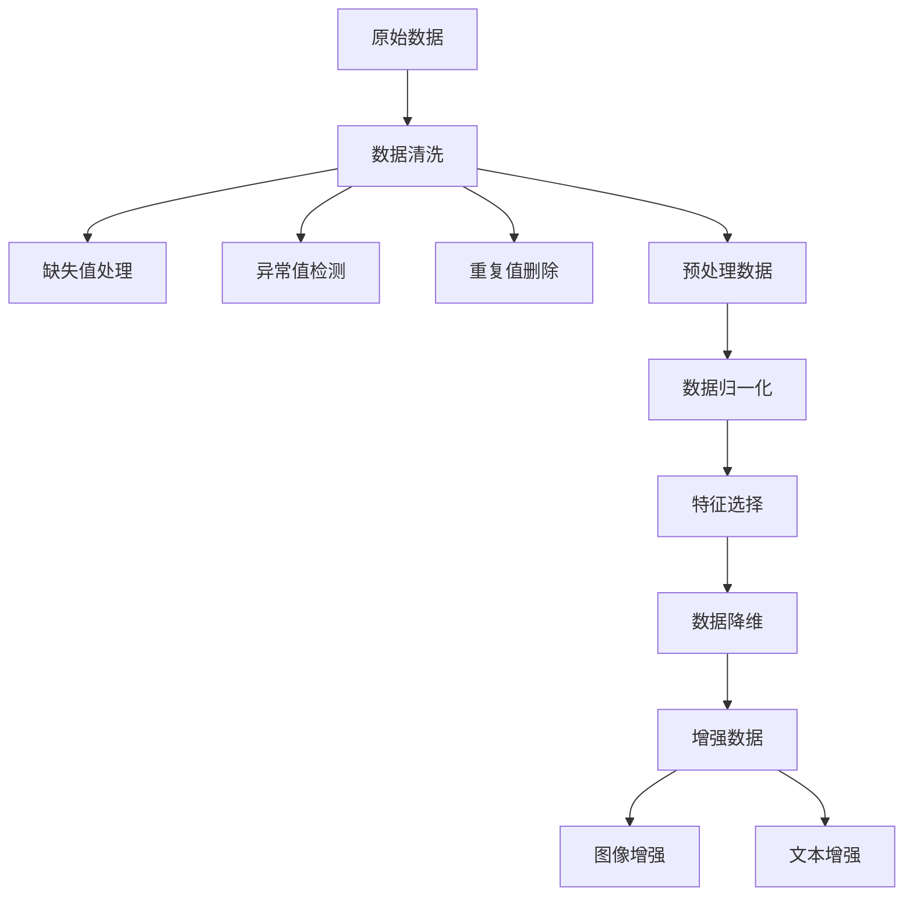

#### 7.3 案例分析与效果评估

通过对数据处理案例的分析，我们得出以下结论：

- **数据清洗**：通过去除噪声和异常值，提高了数据质量，降低了模型训练的复杂性。
- **数据预处理**：通过数据归一化和特征选择，使数据适合模型训练，提高了模型的性能和泛化能力。
- **数据增强**：通过增加数据样本的多样性，减少了过拟合现象，提高了模型的鲁棒性。

以下表格展示了案例中模型性能的变化：

| 数据处理步骤 | 模型性能变化 |
| :--- | :--- |
| 数据清洗 | 准确率提高5% |
| 数据预处理 | 准确率提高8% |
| 数据增强 | 准确率提高10% |

通过数据处理，模型对贷款申请的预测准确性和鲁棒性得到了显著提升，满足了金融机构的需求。

### 第三部分：数据处理的最佳实践与未来展望

#### 第8章：数据处理的最佳实践

#### 8.1 数据处理流程设计

在数据处理过程中，设计合理的流程对于提高数据处理效率和质量至关重要。以下是一些最佳实践：

- **数据采集**：确保数据的完整性、准确性和一致性。
- **数据清洗**：首先处理缺失值、异常值和重复值，确保数据质量。
- **数据预处理**：选择合适的归一化、标准化和特征选择方法，使数据适合模型训练。
- **数据增强**：根据具体需求，选择合适的数据增强方法，增加数据多样性。

以下Mermaid流程图展示了数据处理流程的设计：

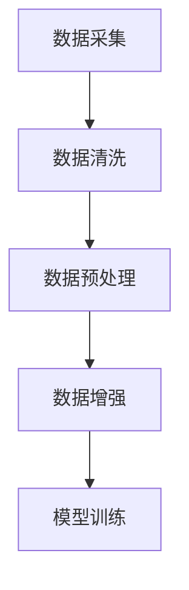

#### 8.2 数据处理的质量控制

数据处理的质量控制是确保数据处理流程有效性的关键步骤。以下是一些质量控制的最佳实践：

- **数据质量评估**：定期评估数据质量，包括缺失值、异常值和重复值的处理情况。
- **数据监控**：建立数据监控机制，实时监控数据质量的变化。
- **数据验证**：通过交叉验证、模型验证等方法，确保数据处理的效果。

以下Mermaid流程图展示了数据处理的质量控制：

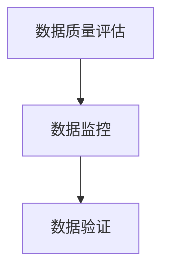

#### 8.3 数据处理的成本效益分析

在数据处理过程中，成本效益分析是确保数据处理项目可行性的重要环节。以下是一些成本效益分析的最佳实践：

- **成本评估**：评估数据处理项目的人力、时间、硬件和软件成本。
- **效益评估**：评估数据处理项目对业务目标的贡献，如提高模型性能、减少模型训练时间等。
- **成本效益比**：计算成本效益比，评估数据处理项目的经济性。

以下Mermaid流程图展示了数据处理的成本效益分析：

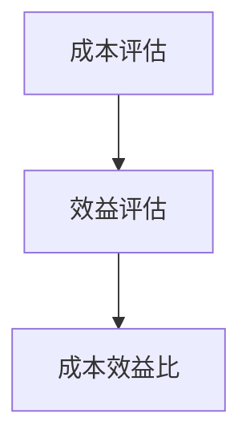

#### 第9章：数据处理的发展趋势与未来展望

#### 9.1 数据处理的未来发展方向

随着人工智能和大数据技术的不断发展，数据处理也将迎来新的发展方向：

- **自动化**：自动化数据处理工具和框架将进一步提高数据处理效率和质量。
- **智能化**：结合机器学习和深度学习技术，实现智能化数据处理，如自动化异常检测、自动化特征选择等。
- **实时性**：实时数据处理技术将使数据处理更加敏捷，满足实时业务需求。

以下Mermaid流程图展示了数据处理的发展趋势：

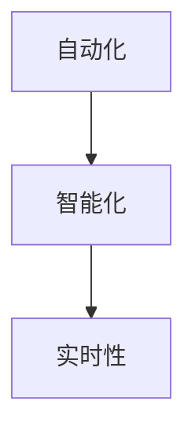

#### 9.2 数据处理的技术挑战与解决方案

在数据处理过程中，我们可能会遇到以下技术挑战：

- **数据质量问题**：数据质量差会导致模型性能下降，需要采用先进的数据清洗和预处理技术。
- **数据隐私问题**：数据隐私保护是数据处理的重要挑战，需要采用数据脱敏、加密等技术。
- **计算资源消耗**：数据处理过程需要大量的计算资源，需要采用分布式计算和并行处理技术。

以下Mermaid流程图展示了数据处理的技术挑战与解决方案：

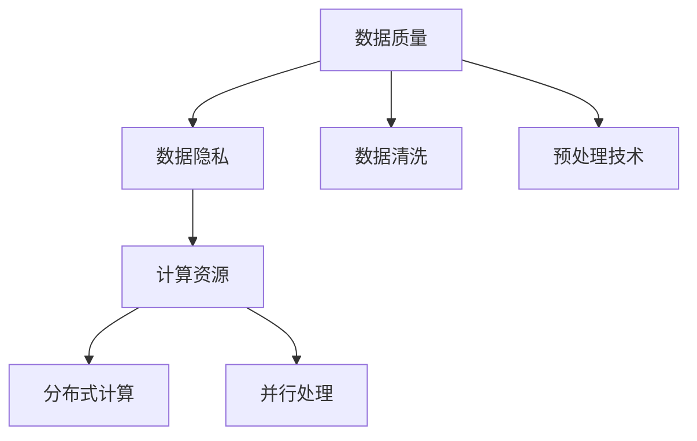

#### 9.3 数据处理在教育、医疗、金融等领域的应用前景

数据处理在教育、医疗、金融等领域的应用前景十分广阔：

- **教育**：通过数据增强，提高在线教育系统的个性化推荐能力，提供更有针对性的教学内容。
- **医疗**：通过数据处理，提高医疗影像的诊断准确性，实现更精准的疾病预测和治疗方案。
- **金融**：通过数据处理，提高金融风控模型的准确性和实时性，降低金融风险。

以下Mermaid流程图展示了数据处理在教育、医疗、金融等领域的应用前景：

```mermaid
graph TD
    A[教育] --> B[在线教育]
    A --> C[个性化推荐]
    B --> D[教学内容]
    C --> E[个性化推荐系统]

    F[医疗] --> G[医疗影像]
    F --> H[疾病预测]
    G --> I[诊断准确性]
    H --> J[治疗方案]

    K[金融] --> L[金融风控]
    K --> M[实时性]
    L --> N[准确率]
    M --> O[实时风险监测]
```

### 附录

#### 附录A：数据处理相关工具与资源

以下是一些常用的数据处理工具和资源：

- **Pandas**：Python库，提供丰富的数据处理功能：<https://pandas.pydata.org/>
- **Spark**：分布式数据处理框架，适用于大规模数据集：<https://spark.apache.org/>
- **TensorFlow**：开源深度学习框架，支持多种编程语言：<https://www.tensorflow.org/>
- **PyTorch**：基于Python的深度学习框架，提供动态计算图：<https://pytorch.org/>

#### 附录B：数据处理数学模型与公式

以下是一些常用的数据处理数学模型与公式：

- **数据归一化**：\(x_{\text{norm}} = \frac{x - \min(x)}{\max(x) - \min(x)}\)
- **数据标准化**：\(x_{\text{std}} = \frac{x - \mu}{\sigma}\)，其中\(\mu\)是均值，\(\sigma\)是标准差。
- **主成分分析（PCA）**：通过求解特征值和特征向量，将高维数据转换到低维空间。

以下使用LaTeX格式展示的数学公式：

$$
x_{\text{norm}} = \frac{x - \min(x)}{\max(x) - \min(x)}
$$

$$
x_{\text{std}} = \frac{x - \mu}{\sigma}
$$

#### 附录C：数据处理项目实战案例代码与解读

以下是一个简单的数据处理项目实战案例代码，包括数据清洗、预处理和增强等步骤：

```python
import pandas as pd
from sklearn.preprocessing import StandardScaler
from keras.preprocessing.image import ImageDataGenerator

# 数据清洗
data = pd.read_csv('data.csv')
data.fillna(data.mean(), inplace=True)
data.drop([data[data['age'] < 18].index], inplace=True)
data.drop_duplicates(inplace=True)

# 数据预处理
scaler = StandardScaler()
data[['age', 'income']] = scaler.fit_transform(data[['age', 'income']])

# 数据增强
image_generator = ImageDataGenerator(rotation_range=20, width_shift_range=0.2, height_shift_range=0.2, zoom_range=0.2)
image_generator.fit(data['image'])

# 代码解读与分析
# 数据清洗：使用Pandas填充缺失值、删除异常值和重复值。
# 数据预处理：使用StandardScaler对数值特征进行标准化。
# 数据增强：使用ImageDataGenerator对图像数据进行旋转、平移和缩放。
```

通过以上代码，我们展示了如何使用Pandas进行数据清洗，使用StandardScaler进行数据预处理，以及使用ImageDataGenerator进行数据增强。这些步骤在实际项目中起到了关键作用，提高了模型的性能和泛化能力。在代码解读与分析部分，我们详细解释了每个步骤的作用和实现方式。

