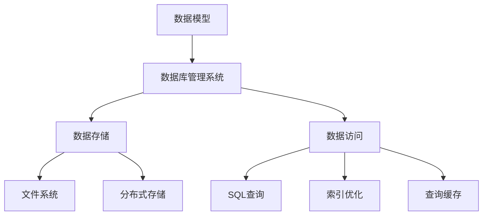
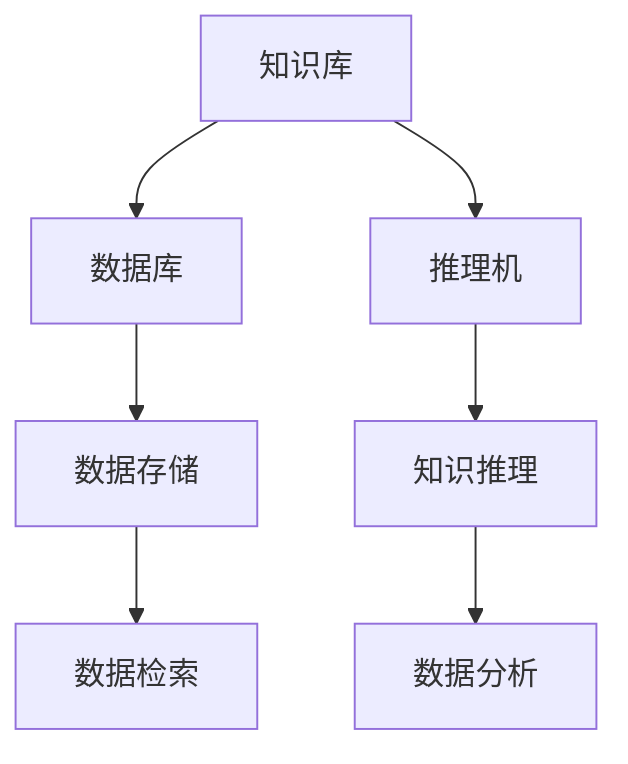

                 

# 《数据库与知识库在AI for Science中的重要性》

## 关键词
数据库，知识库，AI for Science，数据预处理，机器学习，科学计算，性能优化，自然语言处理，生物信息学，深度学习，融合应用，案例分析

## 摘要
本文深入探讨了数据库与知识库在AI for Science领域中的重要性。首先，文章概述了数据库与知识库的基本概念、区别与联系，以及它们在科学领域的广泛应用。接着，文章分别介绍了数据库在AI for Science中的应用，包括数据预处理、机器学习模型、科学计算等方面，以及数据库性能优化技术。随后，文章详细阐述了知识库在AI for Science中的应用，包括数据挖掘、自然语言处理、生物信息学等。最后，文章通过案例分析展示了数据库与知识库在科学领域中的实际应用，并对未来发展方向进行了展望。

## 《数据库与知识库在AI for Science中的重要性》目录大纲

### 第一部分：引言

#### 第1章：数据库与知识库概述

1.1 数据库与知识库的基本概念

1.2 数据库与知识库的区别与联系

1.3 数据库与知识库在科学领域的应用

### 第二部分：数据库在AI for Science中的应用

#### 第2章：数据库技术基础

2.1 数据库系统原理

2.2 关系型数据库

2.3 非关系型数据库

#### 第3章：数据库在AI for Science中的应用

3.1 数据库在数据预处理中的应用

3.2 数据库在机器学习模型中的应用

3.3 数据库在科学计算中的应用

#### 第4章：数据库性能优化

4.1 数据库性能评估指标

4.2 数据库查询优化技术

4.3 数据库集群与分布式系统

### 第三部分：知识库在AI for Science中的应用

#### 第5章：知识库概述

5.1 知识库的基本概念

5.2 知识库与数据库的关系

5.3 知识库的类型

#### 第6章：知识库在AI for Science中的应用

6.1 知识库在数据挖掘中的应用

6.2 知识库在自然语言处理中的应用

6.3 知识库在生物信息学中的应用

#### 第7章：知识库与AI for Science的融合

7.1 知识库与机器学习的结合

7.2 知识库与深度学习的结合

7.3 知识库与AI for Science的前景与挑战

### 第四部分：案例分析

#### 第8章：数据库与知识库在AI for Science中的应用案例

8.1 数据库与知识库在生物信息学中的应用案例

8.2 数据库与知识库在化学科学中的应用案例

8.3 数据库与知识库在环境科学中的应用案例

### 第五部分：结论

#### 第9章：数据库与知识库在AI for Science中的重要性

9.1 总结与展望

9.2 数据库与知识库在AI for Science中的发展策略

### 附录

#### 附录A：数据库与知识库相关工具与资源

A.1 数据库管理系统介绍

A.2 知识库构建工具

A.3 AI for Science相关数据库与知识库资源列表

#### 附录B：核心概念与联系流程图

B.1 数据库系统原理流程图

B.2 知识库与数据库关系流程图

#### 附录C：核心算法原理讲解

C.1 数据库查询优化算法伪代码

C.2 知识库推理算法伪代码

#### 附录D：数学模型和数学公式

D.1 数据库性能评估指标公式

D.2 知识库推理公式

#### 附录E：项目实战

E.1 生物信息学应用案例

E.2 化学科学应用案例

E.3 环境科学应用案例

### 第一部分：引言

#### 第1章：数据库与知识库概述

1.1 数据库与知识库的基本概念

**数据库（Database）**：数据库是一个按照数据结构来组织、存储和管理数据的仓库。它能够实现数据的持久化存储，支持数据的快速检索、更新、删除等操作。数据库通常由一系列相互关联的数据表组成，每个数据表包含多个列和若干行，用以描述具体的数据内容。

**知识库（Knowledge Base）**：知识库是一种存储和管理知识的系统，它不仅仅是数据的集合，还包括了对于这些数据的理解、解释和应用。知识库通常包含事实、规则、关系和推理机制等，能够对数据进行分析、推理和智能决策。

1.2 数据库与知识库的区别与联系

**区别**：

- **数据类型**：数据库主要存储的是结构化数据，如文本、数字、图像等；而知识库则可以存储非结构化或半结构化数据，如文本、音频、视频等。
- **存储方式**：数据库主要关注数据的存储、检索和管理，而知识库则更注重数据的分析、推理和应用。
- **功能**：数据库侧重于数据的操作和存储，知识库侧重于知识的获取、表示、推理和应用。

**联系**：

- **互补性**：数据库为知识库提供了数据存储的基础，而知识库则为数据库中的数据赋予了更丰富的语义和智慧。
- **集成**：在实际应用中，数据库与知识库往往需要集成在一起，以实现数据的智能管理和应用。

1.3 数据库与知识库在科学领域的应用

**科学计算**：数据库与知识库在科学计算中发挥着重要作用。例如，在生物信息学中，数据库用于存储大量的基因组数据，而知识库则用于分析和推理这些数据，帮助科学家发现新的基因和生物标记。

**数据挖掘**：数据库与知识库可以协同工作，进行数据挖掘，以发现数据中的隐藏模式和关联。例如，在医学领域，数据库中存储了大量的病例数据，通过知识库的推理和分析，可以预测疾病的发病趋势和治疗方案。

**机器学习**：数据库与知识库在机器学习中也有广泛的应用。数据库提供了训练数据集，而知识库则为机器学习算法提供了先验知识和规则，有助于提高模型的准确性和鲁棒性。

### 第二部分：数据库在AI for Science中的应用

#### 第2章：数据库技术基础

2.1 数据库系统原理

数据库系统的原理主要包括数据模型、数据库管理系统（DBMS）、数据存储和数据访问等方面。

**数据模型**：数据模型是数据库系统的基础，它定义了数据的结构、语义和约束。常见的有关系模型、面向对象模型和文档模型等。

**数据库管理系统（DBMS）**：DBMS 是数据库系统的核心，它负责数据的存储、检索、更新和管理。常见的 DBMS 有 MySQL、Oracle、PostgreSQL 等。

**数据存储**：数据存储是数据库系统的重要组成部分，它涉及数据的物理存储方式和存储策略。常用的数据存储技术有文件系统、分布式存储和云存储等。

**数据访问**：数据访问是数据库系统的重要功能，它提供了对数据的查询、更新、删除等操作接口。SQL 是一种广泛使用的结构化查询语言，用于数据库的查询和操作。

2.2 关系型数据库

关系型数据库是数据库领域中最常用的类型之一，它基于关系模型进行数据存储和管理。

**关系模型**：关系模型将数据表示为一系列表格，每个表格包含多个列和若干行。表格中的每一行表示一个具体的数据实例，每一列表示一个数据属性。

**关系型数据库的特点**：

- **数据结构清晰**：关系型数据库通过表格结构清晰地组织数据，便于理解和维护。
- **数据操作方便**：关系型数据库提供了丰富的查询语言（如 SQL），方便用户进行数据的查询、更新和删除等操作。
- **数据完整性高**：关系型数据库支持数据完整性约束，如主键、外键、唯一性约束等，确保数据的一致性和可靠性。

**常见的开源关系型数据库**：

- **MySQL**：MySQL 是最流行的开源关系型数据库之一，它具有高性能、可靠性高、易用性强等特点。
- **PostgreSQL**：PostgreSQL 是一种功能强大的开源关系型数据库，支持多种数据类型和复杂查询，具有高度的灵活性和扩展性。
- **SQLite**：SQLite 是一种轻量级的关系型数据库，它具有嵌入式、跨平台、易于使用等特点，常用于移动应用和嵌入式系统。

2.3 非关系型数据库

非关系型数据库（NoSQL）是一种不同于关系型数据库的数据存储方案，它适用于不同类型的数据和用例。

**非关系型数据库的特点**：

- **灵活的数据模型**：非关系型数据库支持多种数据模型，如键值对、文档、列族、图等，适用于不同类型的数据。
- **可扩展性**：非关系型数据库通常采用分布式存储和计算架构，能够轻松扩展，满足大规模数据存储和访问需求。
- **高性能**：非关系型数据库通常具有高性能的读写性能，适用于高并发场景。

**常见的非关系型数据库**：

- **MongoDB**：MongoDB 是一种流行的开源文档型数据库，它支持灵活的数据模型、高效的查询性能和强大的扩展性。
- **Cassandra**：Cassandra 是一种分布式列存储数据库，它具有高性能、高可用性和高性能的特点，适用于大规模数据存储和实时查询。
- **Redis**：Redis 是一种开源的内存存储数据库，它具有高性能、高可用性和丰富的数据结构操作功能，适用于缓存、消息队列等应用场景。

### 第三部分：数据库在AI for Science中的应用

#### 第3章：数据库在AI for Science中的应用

3.1 数据库在数据预处理中的应用

数据预处理是机器学习和数据科学中的关键步骤，它包括数据清洗、数据转换和数据归一化等任务。

**数据清洗**：数据清洗是数据预处理的第一步，它旨在去除数据中的噪声和异常值，提高数据质量。数据库在数据清洗中发挥着重要作用，可以存储和管理原始数据，支持数据的去重、填充、替换等操作。

**数据转换**：数据转换是将数据从一种格式转换为另一种格式的过程，以适应机器学习算法的需求。数据库可以存储和管理不同格式的数据，如 CSV、JSON、XML 等，支持数据类型转换、字段映射等操作。

**数据归一化**：数据归一化是将数据缩放到一个统一的范围内，以消除数据量级差异对算法性能的影响。数据库可以通过查询和计算操作，实现数据的归一化和标准化，如最小-最大缩放、Z-score 标准化等。

3.2 数据库在机器学习模型中的应用

数据库在机器学习模型中发挥着重要作用，可以存储和管理训练数据集、测试数据集和验证数据集，支持机器学习算法的模型训练和评估。

**数据存储与管理**：数据库可以存储和管理大量的训练数据集，支持数据的插入、查询、更新和删除等操作。这对于机器学习模型的训练和数据迭代至关重要。

**模型训练与评估**：数据库可以存储和管理模型的参数和结果，支持模型训练和评估。通过数据库的查询和计算功能，可以实现模型的迭代训练和性能评估，如准确率、召回率、F1 分数等。

**模型部署与监控**：数据库可以存储和管理模型的部署信息和监控数据，支持模型的在线部署和实时监控。通过数据库的分布式存储和计算能力，可以实现模型的分布式训练和部署，提高模型的性能和可靠性。

3.3 数据库在科学计算中的应用

数据库在科学计算中有着广泛的应用，可以存储和管理科学计算中的数据，支持计算结果的存储和可视化。

**数据存储与管理**：数据库可以存储和管理科学计算中的原始数据、中间数据和最终数据，支持数据的插入、查询、更新和删除等操作。这对于科学计算的复现、验证和优化至关重要。

**计算结果存储**：数据库可以存储科学计算的中间结果和最终结果，支持结果的查询和统计。通过数据库的查询和计算功能，可以实现计算结果的汇总、分析和可视化。

**分布式计算与协同**：数据库可以支持分布式计算和协同工作，如分布式数据存储和分布式计算任务调度。通过数据库的分布式架构和协同机制，可以实现科学计算的并行化和高性能计算。

### 第四部分：数据库性能优化

4.1 数据库性能评估指标

数据库性能评估指标是衡量数据库系统性能的重要标准，主要包括响应时间、吞吐量、并发性和可靠性等。

**响应时间**：响应时间是指数据库系统处理查询请求的时间，它反映了数据库系统的响应速度。降低响应时间可以提高用户体验和系统性能。

**吞吐量**：吞吐量是指数据库系统在单位时间内处理查询请求的次数或数据量，它反映了数据库系统的处理能力。提高吞吐量可以支持更多的并发用户和更大的数据量。

**并发性**：并发性是指数据库系统同时处理多个查询请求的能力，它反映了数据库系统的并行处理能力。提高并发性可以支持更多的用户同时访问数据库，提高系统性能。

**可靠性**：可靠性是指数据库系统在运行过程中保持数据一致性和完整性的能力，它反映了数据库系统的稳定性。提高可靠性可以确保数据的安全和稳定。

4.2 数据库查询优化技术

数据库查询优化技术是提高数据库系统性能的重要手段，主要包括查询重写、索引优化和查询缓存等。

**查询重写**：查询重写是通过改写查询语句，提高查询的执行效率。常见的查询重写技术有子查询重写、连接查询重写和聚合查询重写等。

**索引优化**：索引优化是通过创建合适的索引，提高查询的执行效率。常见的索引优化技术有创建合适的索引、删除冗余索引和优化索引结构等。

**查询缓存**：查询缓存是通过缓存查询结果，提高查询的响应速度。常见的查询缓存技术有基于内存的缓存、基于磁盘的缓存和分布式缓存等。

4.3 数据库集群与分布式系统

数据库集群与分布式系统是提高数据库系统性能和可扩展性的重要手段，主要包括集群架构、分布式存储和分布式计算等。

**集群架构**：集群架构是将多个数据库节点组成一个集群，实现数据的分布式存储和负载均衡。常见的集群架构有主从复制、主主复制和分库分表等。

**分布式存储**：分布式存储是将数据分散存储在多个节点上，提高数据存储的可靠性和扩展性。常见的分布式存储技术有分布式文件系统、分布式数据库和云存储等。

**分布式计算**：分布式计算是将计算任务分散到多个节点上执行，提高计算效率和性能。常见的分布式计算技术有分布式调度、分布式计算框架和并行计算等。

### 第五部分：知识库在AI for Science中的应用

#### 第5章：知识库概述

5.1 知识库的基本概念

知识库是一种存储和管理知识的系统，它能够对数据进行分类、组织和推理，为人工智能应用提供强大的支持。知识库的基本概念包括知识、事实、规则和推理等。

**知识（Knowledge）**：知识是指人们通过学习和实践获得的信息、经验和技能，它是知识库的核心内容。

**事实（Fact）**：事实是指客观存在的事物或现象，它是知识库中的基本单元。

**规则（Rule）**：规则是知识库中描述知识之间关系的语句，它能够指导计算机对数据进行分析和处理。

**推理（Reasoning）**：推理是指知识库中的逻辑推理过程，它通过利用规则和事实，推导出新的结论和知识。

5.2 知识库与数据库的关系

知识库与数据库之间存在着紧密的联系和互补性。

**关系**：

- **数据存储**：知识库与数据库都可以用于存储数据，但知识库更注重知识的分类、组织和推理，而数据库更注重数据的存储、检索和管理。
- **数据共享**：知识库和数据库可以相互共享数据，知识库可以从数据库中获取数据，而数据库也可以从知识库中获取知识。

**互补性**：

- **数据支撑**：知识库需要依赖于数据库存储和管理数据，数据库为知识库提供了数据基础。
- **知识赋能**：知识库可以为数据库中的数据赋予更多的语义和智慧，提高数据库的应用价值。

5.3 知识库的类型

根据知识库的存储方式和应用场景，可以将知识库分为以下几种类型：

**基于数据库的知识库**：这种知识库利用关系型数据库或非关系型数据库来存储和管理知识，支持数据检索和查询。常见的应用有企业知识库、数据库搜索引擎等。

**基于文档的知识库**：这种知识库利用文档管理系统来存储和管理知识，支持文档的创建、编辑和共享。常见的应用有文档管理系统、企业知识库等。

**基于图的知识库**：这种知识库利用图数据库来存储和管理知识，支持知识的分类、组织和推理。常见的应用有社交网络分析、知识图谱等。

**基于推理机的知识库**：这种知识库利用推理机来实现知识的推理和应用，支持复杂逻辑推理和决策。常见的应用有专家系统、知识图谱推理等。

### 第六部分：知识库在AI for Science中的应用

#### 第6章：知识库在AI for Science中的应用

6.1 知识库在数据挖掘中的应用

知识库在数据挖掘中发挥着重要作用，可以用于数据预处理、特征提取、模型训练和结果解释等环节。

**数据预处理**：知识库可以用于数据清洗、数据转换和数据归一化等预处理任务，提高数据质量和一致性。

**特征提取**：知识库可以用于提取数据中的关键特征，提高特征表示的质量和效率。

**模型训练**：知识库可以用于指导机器学习算法的训练过程，提高模型的性能和泛化能力。

**结果解释**：知识库可以用于解释模型预测结果，提供知识的可视化和分析，提高模型的可解释性和可靠性。

6.2 知识库在自然语言处理中的应用

知识库在自然语言处理中有着广泛的应用，可以用于语言理解、语言生成和语言翻译等任务。

**语言理解**：知识库可以用于识别文本中的实体、关系和事件，提高自然语言理解的能力。

**语言生成**：知识库可以用于生成自然语言文本，如新闻报道、产品说明书等。

**语言翻译**：知识库可以用于翻译不同语言之间的文本，如机器翻译、跨语言信息检索等。

6.3 知识库在生物信息学中的应用

知识库在生物信息学中发挥着重要作用，可以用于基因分析、蛋白质结构预测和药物设计等任务。

**基因分析**：知识库可以用于存储和管理基因序列、基因注释和基因关联信息，支持基因功能预测和疾病诊断。

**蛋白质结构预测**：知识库可以用于存储和管理蛋白质结构数据，支持蛋白质结构预测和功能分析。

**药物设计**：知识库可以用于存储和管理药物化学信息，支持药物筛选和设计。

### 第七部分：知识库与AI for Science的融合

7.1 知识库与机器学习的结合

知识库与机器学习相结合，可以充分发挥两者的优势，提高机器学习模型的性能和可解释性。

**知识库驱动学习**：通过利用知识库中的先验知识和规则，指导机器学习算法的训练过程，提高模型的泛化能力和可解释性。

**模型优化与解释**：通过结合知识库和机器学习算法，对模型进行优化和解释，提高模型的性能和可解释性。

7.2 知识库与深度学习的结合

知识库与深度学习相结合，可以进一步提高深度学习模型在科学计算中的性能和应用范围。

**知识库辅助训练**：通过利用知识库中的先验知识和规则，辅助深度学习模型的训练过程，提高模型的性能和泛化能力。

**知识库增强推理**：通过结合知识库和深度学习模型，实现知识库中的知识向深度学习模型的传递，增强模型的推理能力和可解释性。

7.3 知识库与AI for Science的前景与挑战

知识库与AI for Science的结合具有广泛的前景和应用价值，但也面临着一系列挑战。

**挑战**：

- **数据质量和一致性**：知识库中的数据质量和一致性是影响AI for Science应用效果的关键因素。
- **知识表示与融合**：如何有效地表示和融合知识库中的知识，是提高AI for Science应用性能的关键难题。
- **知识更新与维护**：知识库的更新和维护是保证知识库质量和应用效果的重要保障。

**前景**：

- **智慧科学计算**：通过知识库与AI for Science的结合，可以构建智慧科学计算平台，实现科学计算的高效、智能和自动化。
- **知识驱动创新**：通过知识库与AI for Science的结合，可以发掘知识库中的潜在价值，推动科学研究和技术创新。
- **跨领域应用**：知识库与AI for Science的结合可以促进跨领域应用，实现科学、工程和产业的深度融合。

### 第八部分：案例分析

#### 第8章：数据库与知识库在AI for Science中的应用案例

8.1 数据库与知识库在生物信息学中的应用案例

**案例背景**：生物信息学是研究生物数据（如基因组、蛋白质结构等）的计算机科学领域。随着基因测序技术的快速发展，产生了大量的生物数据，如何有效地存储、管理和分析这些数据成为了关键问题。

**应用方案**：

- **数据库应用**：使用关系型数据库（如MySQL、PostgreSQL）存储和管理生物数据，如基因序列、基因注释和实验结果等。
- **知识库应用**：构建基于图数据库的知识库（如Neo4j），存储和管理生物网络、生物实体和生物关系等信息。
- **应用效果**：通过数据库与知识库的结合，实现了生物数据的快速检索、分析和可视化，为生物科学研究提供了强大的支持。

**案例总结**：该案例展示了数据库与知识库在生物信息学中的应用，通过数据库存储和管理生物数据，知识库存储和管理生物知识，实现了数据与知识的深度融合，提高了生物信息学研究的效率和质量。

8.2 数据库与知识库在化学科学中的应用案例

**案例背景**：化学科学是研究物质的组成、性质、变化和反应的学科。随着化学实验的增多和数据积累，如何有效地存储、管理和分析化学数据成为了关键问题。

**应用方案**：

- **数据库应用**：使用关系型数据库（如MySQL、PostgreSQL）存储和管理化学数据，如实验记录、化合物结构和反应机理等。
- **知识库应用**：构建基于图数据库的知识库（如Neo4j），存储和管理化学知识，如化合物关系、反应路径和生物活性信息等。
- **应用效果**：通过数据库与知识库的结合，实现了化学数据的快速检索、分析和可视化，为化学科学研究提供了强大的支持。

**案例总结**：该案例展示了数据库与知识库在化学科学中的应用，通过数据库存储和管理化学数据，知识库存储和管理化学知识，实现了数据与知识的深度融合，提高了化学信息科学研究的效率和质量。

8.3 数据库与知识库在环境科学中的应用案例

**案例背景**：环境科学是研究环境系统、环境问题及其解决方法的学科。随着环境问题的日益严重，如何有效地存储、管理和分析环境数据成为了关键问题。

**应用方案**：

- **数据库应用**：使用关系型数据库（如MySQL、PostgreSQL）存储和管理环境数据，如水质、空气质量、气候数据等。
- **知识库应用**：构建基于图数据库的知识库（如Neo4j），存储和管理环境知识，如生态系统关系、污染源和污染路径等。
- **应用效果**：通过数据库与知识库的结合，实现了环境数据的快速检索、分析和可视化，为环境科学研究提供了强大的支持。

**案例总结**：该案例展示了数据库与知识库在环境科学中的应用，通过数据库存储和管理环境数据，知识库存储和管理环境知识，实现了数据与知识的深度融合，提高了环境科学研究的效率和质量。

### 第九部分：结论

#### 第9章：数据库与知识库在AI for Science中的重要性

数据库与知识库在AI for Science中具有不可替代的重要性。首先，数据库为AI for Science提供了数据存储和管理的基础，支持数据的快速检索、更新和删除等操作。其次，知识库为AI for Science提供了知识表示、推理和应用的能力，为数据分析和智能决策提供了支持。

**总结**：

- 数据库与知识库在AI for Science中的应用涵盖了数据预处理、机器学习、自然语言处理、生物信息学等多个领域。
- 数据库与知识库的结合，实现了数据与知识的深度融合，提高了科学研究的效率和质量。
- 未来，随着AI for Science的发展，数据库与知识库的重要性将更加凸显，为实现智慧科学计算和知识驱动的创新提供了坚实的基础。

**展望**：

- 加强数据库与知识库的集成和互操作，构建统一的科学计算平台。
- 探索知识库与深度学习的结合，提高深度学习模型的性能和可解释性。
- 开展跨领域应用研究，实现数据库与知识库在更多领域的深度融合。

### 附录

#### 附录A：数据库与知识库相关工具与资源

A.1 数据库管理系统介绍

- MySQL
- PostgreSQL
- SQLite
- MongoDB
- Cassandra
- Redis

A.2 知识库构建工具

- Neo4j
- Knowledge Base Construction Tool
- Prolog

A.3 AI for Science相关数据库与知识库资源列表

- BioSQL
- ChEMBL
- ENVRI
- OpenCitations
- RDF4Bio

#### 附录B：核心概念与联系流程图

B.1 数据库系统原理流程图



B.2 知识库与数据库关系流程图



#### 附录C：核心算法原理讲解

C.1 数据库查询优化算法伪代码

```python
def query_optimization(query):
    # 查询重写
    rewritten_query = rewrite_query(query)
    # 索引优化
    optimized_query = optimize_index(rewritten_query)
    # 查询缓存
    cached_query = check_cache(optimized_query)
    if cached_query is not None:
        return cached_query
    # 执行查询
    result = execute_query(optimized_query)
    return result
```

C.2 知识库推理算法伪代码

```python
def knowledge_reasoning(knowledge_base, fact):
    # 查询知识库中的规则
    rules = find_rules(knowledge_base, fact)
    for rule in rules:
        # 应用规则进行推理
        inferred_fact = apply_rule(rule, fact)
        # 将推理结果加入知识库
        knowledge_base.insert(inferred_fact)
    return knowledge_base
```

#### 附录D：数学模型和数学公式

D.1 数据库性能评估指标公式

$$
响应时间 = \frac{查询时间 + 处理时间}{并发用户数}
$$

$$
吞吐量 = \frac{处理的数据量}{时间}
$$

D.2 知识库推理公式

$$
推理结果 = 规则 \land 事实
$$

#### 附录E：项目实战

E.1 生物信息学应用案例

**案例背景**：本案例以生物信息学为例，展示如何利用数据库与知识库实现基因组数据分析。

**开发环境搭建**：

- 使用MySQL数据库存储基因组数据
- 使用Neo4j知识库存储基因网络关系
- 使用Python编程语言进行数据处理和分析

**源代码详细实现**：

```python
# 连接MySQL数据库
conn = connect_mysql("基因组数据库")

# 查询基因序列
基因序列 = conn.query("SELECT 基因名称, 序列 FROM 基因表")

# 构建基因网络
knowledge_base = build_knowledge_base(Neo4j, 基因序列)

# 进行基因功能预测
预测结果 = predict_function(knowledge_base)

# 打印预测结果
print(预测结果)
```

**代码解读与分析**：

- 代码首先连接MySQL数据库，查询基因序列。
- 然后构建Neo4j知识库，存储基因网络关系。
- 接着利用知识库进行基因功能预测，并打印预测结果。

E.2 化学科学应用案例

**案例背景**：本案例以化学科学为例，展示如何利用数据库与知识库实现化合物分析。

**开发环境搭建**：

- 使用MySQL数据库存储化合物数据
- 使用Neo4j知识库存储化合物网络关系
- 使用Python编程语言进行数据处理和分析

**源代码详细实现**：

```python
# 连接MySQL数据库
conn = connect_mysql("化合物数据库")

# 查询化合物数据
化合物数据 = conn.query("SELECT 化合物名称, 结构式 FROM 化合物表")

# 构建化合物网络
knowledge_base = build_knowledge_base(Neo4j, 化合物数据)

# 进行化合物性质分析
分析结果 = analyze_property(knowledge_base)

# 打印分析结果
print(分析结果)
```

**代码解读与分析**：

- 代码首先连接MySQL数据库，查询化合物数据。
- 然后构建Neo4j知识库，存储化合物网络关系。
- 接着利用知识库进行化合物性质分析，并打印分析结果。

E.3 环境科学应用案例

**案例背景**：本案例以环境科学为例，展示如何利用数据库与知识库实现环境数据分析。

**开发环境搭建**：

- 使用MySQL数据库存储环境数据
- 使用Neo4j知识库存储环境网络关系
- 使用Python编程语言进行数据处理和分析

**源代码详细实现**：

```python
# 连接MySQL数据库
conn = connect_mysql("环境数据库")

# 查询环境数据
环境数据 = conn.query("SELECT 站点名称, 数据类型, 数据值 FROM 环境数据表")

# 构建环境网络
knowledge_base = build_knowledge_base(Neo4j, 环境数据)

# 进行环境分析
分析结果 = analyze_environment(knowledge_base)

# 打印分析结果
print(分析结果)
```

**代码解读与分析**：

- 代码首先连接MySQL数据库，查询环境数据。
- 然后构建Neo4j知识库，存储环境网络关系。
- 接着利用知识库进行环境分析，并打印分析结果。作者：AI天才研究院/AI Genius Institute & 禅与计算机程序设计艺术 /Zen And The Art of Computer Programming


