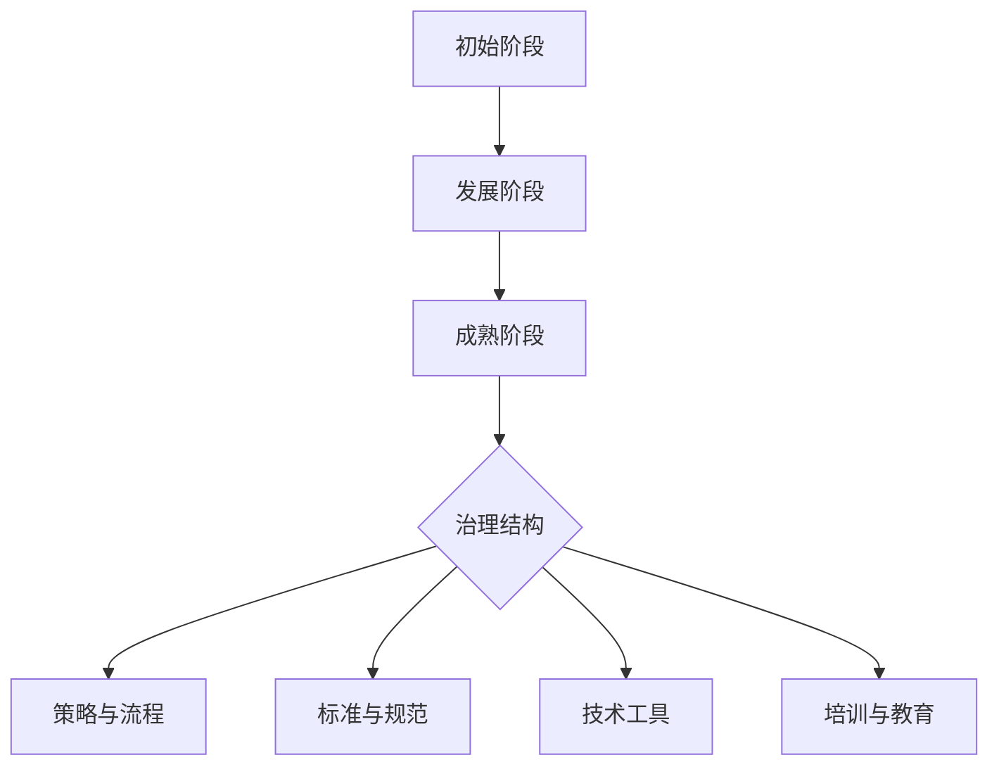
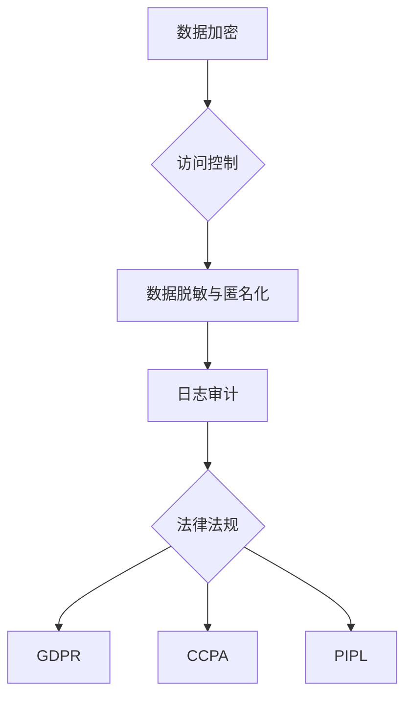
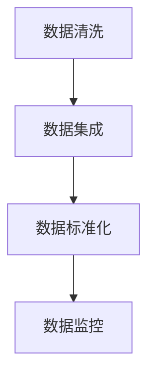
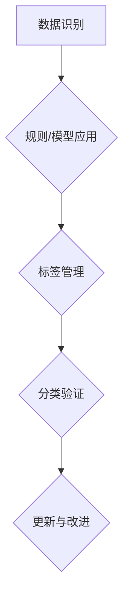
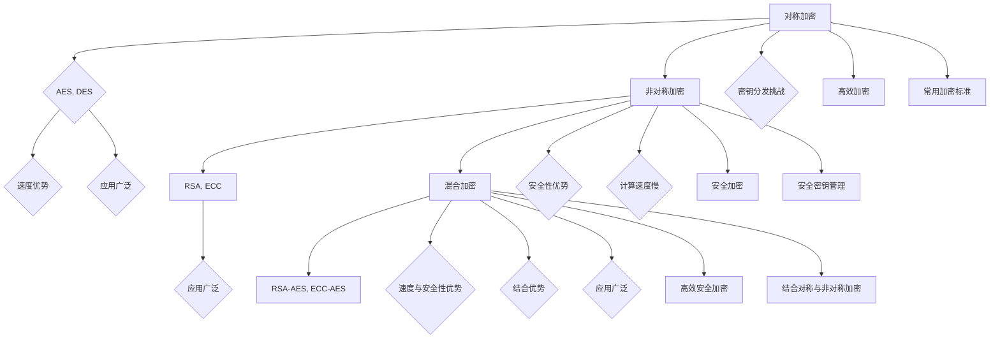
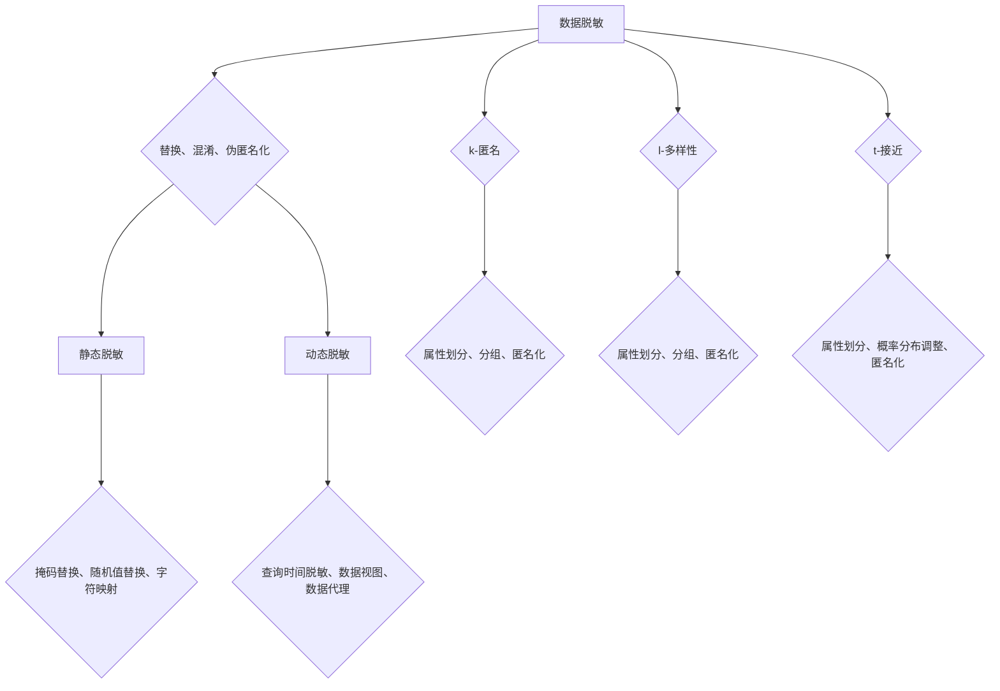
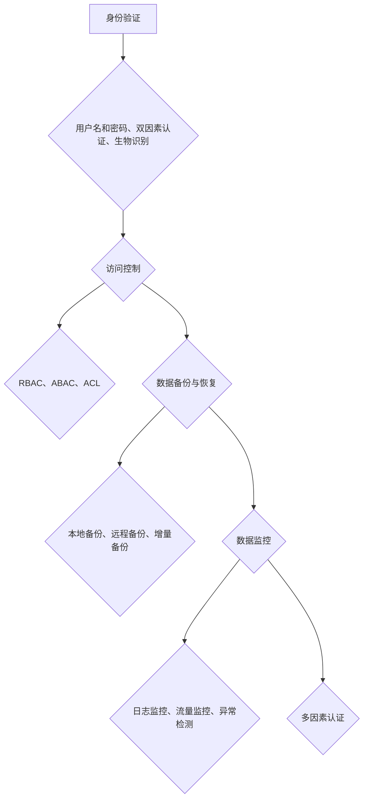
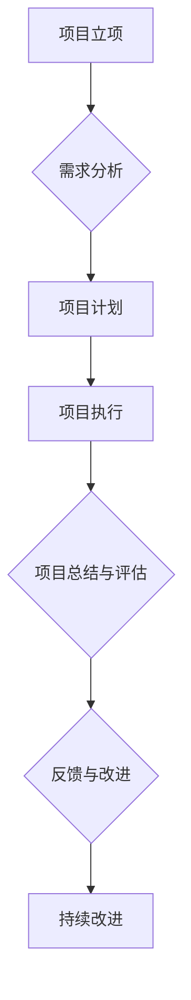

                 

# 数据治理体系：保障 AI 2.0 数据安全和隐私

## 关键词
- 数据治理
- AI 2.0
- 数据安全
- 隐私保护
- 数据质量管理
- 数据分类与管理

## 摘要
本文深入探讨了数据治理在保障 AI 2.0 数据安全和隐私中的重要性。首先，文章概述了数据治理的基本概念、框架与要素，并回顾了其发展历程。随后，文章详细讲解了数据安全和隐私保护的基本概念、方法以及相关法律法规。接着，文章讨论了数据质量管理的重要性、评估与度量方法以及改进策略。然后，文章介绍了数据分类与管理的基本原则、方法与实践。在 AI 2.0 数据治理技术部分，文章概述了 AI 2.0 技术的发展趋势、面临的挑战和相应的技术方案。随后，文章详细探讨了数据加密与隐私保护技术、数据脱敏与匿名化技术、数据安全防护与监管。接着，文章通过实际案例分析了金融、医疗和制造业的 AI 数据治理实践。最后，文章提出了 AI 2.0 数据治理项目实施、风险评估与管理、最佳实践以及相关资源，以期为数据治理体系的建立提供参考。

### 目录大纲

## 第一部分：数据治理基础

### 第1章：数据治理概述

#### 1.1 数据治理的定义与重要性

#### 1.2 数据治理的框架与要素

#### 1.3 数据治理的发展历程

### 第2章：数据安全和隐私保护

#### 2.1 数据安全的基本概念

#### 2.2 数据隐私保护的方法

#### 2.3 数据安全和隐私保护的法律法规

### 第3章：数据质量管理

#### 3.1 数据质量的重要性

#### 3.2 数据质量的评估与度量

#### 3.3 数据质量改进的策略

### 第4章：数据分类与管理

#### 4.1 数据分类的基本原则

#### 4.2 数据分类的方法与工具

#### 4.3 数据分类的实践与应用

## 第二部分：AI 2.0 数据治理技术

### 第5章：AI 2.0 数据治理技术概述

#### 5.1 AI 2.0 技术的发展趋势

#### 5.2 AI 2.0 数据治理的技术挑战

#### 5.3 AI 2.0 数据治理的技术方案

### 第6章：数据加密与隐私保护技术

#### 6.1 数据加密的基本概念

#### 6.2 数据加密算法与技术

#### 6.3 隐私保护技术详解

### 第7章：数据脱敏与匿名化技术

#### 7.1 数据脱敏的基本原理

#### 7.2 数据脱敏的方法与工具

#### 7.3 数据匿名化技术探讨

### 第8章：数据安全防护与监管

#### 8.1 数据安全防护的策略与措施

#### 8.2 数据安全防护的技术手段

#### 8.3 数据安全监管的法律法规

## 第三部分：AI 2.0 数据治理实战

### 第9章：AI 2.0 数据治理案例分析

#### 9.1 案例一：金融行业的AI数据治理实践

#### 9.2 案例二：医疗行业的AI数据治理实践

#### 9.3 案例三：制造业的AI数据治理实践

### 第10章：AI 2.0 数据治理项目实施

#### 10.1 数据治理项目规划与执行

#### 10.2 数据治理项目的风险评估与管理

#### 10.3 数据治理项目的评估与改进

### 第11章：AI 2.0 数据治理最佳实践

#### 11.1 最佳实践概述

#### 11.2 数据治理流程优化

#### 11.3 数据治理团队建设

### 附录：AI 2.0 数据治理资源

#### 附录 A：数据治理工具与平台

#### 附录 B：数据治理相关的书籍与文献

#### 附录 C：数据治理相关的标准与法规

### 第1章：数据治理概述

### 1.1 数据治理的定义与重要性

#### 数据治理的定义

数据治理（Data Governance）是指通过制定和实施一系列策略、流程和技术，确保组织中的数据能够得到有效管理、保护和使用。数据治理的目标包括：

1. 提高数据质量：通过数据治理，可以识别和纠正数据中的错误、不一致和冗余，从而提高数据的质量。
2. 保证数据安全：数据治理确保数据得到适当的保护，防止未经授权的访问、使用和泄露。
3. 优化数据使用：数据治理帮助企业更好地理解和管理其数据资产，从而提高数据的使用效率和决策能力。

#### 数据治理的重要性

在当今信息时代，数据已成为企业最重要的资产之一。数据治理的重要性体现在以下几个方面：

1. **决策支持**：高质量的数据能够为企业的战略决策提供可靠的数据基础。
2. **业务运营**：高质量的数据可以优化业务流程，提高业务效率。
3. **风险控制**：高质量的数据有助于识别潜在的业务风险，降低运营风险。
4. **客户体验**：高质量的数据可以提供更好的客户服务，提升客户满意度。

### 1.2 数据治理的框架与要素

数据治理框架通常包括以下关键要素：

- **治理结构**：定义数据治理的组织结构、角色和职责。
- **策略与流程**：制定数据治理的策略和流程，包括数据采集、存储、处理、共享、备份、恢复等。
- **标准与规范**：制定数据治理的标准和规范，以确保数据的统一性和一致性。
- **技术工具**：利用数据治理工具和技术，实现数据治理的目标。
- **培训与教育**：对员工进行数据治理的培训和教育，提高数据治理意识和能力。

#### 治理结构

治理结构是数据治理的核心，它定义了数据治理的组织架构和角色分配。常见的治理结构包括：

1. **数据治理委员会**：由高层管理人员组成，负责制定数据治理的战略和目标。
2. **数据治理办公室**：负责具体的数据治理实施，包括制定流程、标准和规范。
3. **数据所有权**：明确数据的所有权，确保数据的合理使用和保护。

#### 策略与流程

策略与流程是数据治理的重要组成部分，它包括了数据治理的各个方面，如数据采集、存储、处理、共享、备份、恢复等。以下是数据治理策略与流程的主要内容：

1. **数据采集**：制定数据采集策略，确保数据的完整性和准确性。
2. **数据存储**：制定数据存储策略，确保数据的安全性和可靠性。
3. **数据处理**：制定数据处理策略，确保数据的一致性和可扩展性。
4. **数据共享**：制定数据共享策略，确保数据的安全性和合规性。
5. **数据备份与恢复**：制定数据备份与恢复策略，确保数据的持续可用性。

#### 标准与规范

标准与规范是数据治理的基石，它确保了数据的统一性和一致性。常见的标准与规范包括：

1. **数据格式**：统一数据格式，确保数据在不同系统之间可以无缝交换。
2. **数据命名规范**：统一数据命名规范，提高数据的可读性和可维护性。
3. **数据质量标准**：制定数据质量标准，确保数据的准确性、完整性和一致性。

#### 技术工具

数据治理工具是数据治理实施的重要支持，它帮助组织实现数据治理的目标。常见的数据治理工具有：

1. **数据质量工具**：用于评估、清洗和标准化数据。
2. **数据安全工具**：用于保护数据的隐私和安全。
3. **数据仓库与数据湖**：用于存储和管理大量数据。
4. **数据治理平台**：提供数据治理的集中管理和监控功能。

#### 培训与教育

培训与教育是提高数据治理意识和能力的重要手段。通过培训和教育，可以增强员工对数据治理的理解和参与度。培训与教育的内容包括：

1. **数据治理基础知识**：介绍数据治理的定义、目标和框架。
2. **数据质量管理**：讲解数据质量的评估、清洗和标准化方法。
3. **数据安全与隐私保护**：介绍数据安全的基本概念、方法和相关法律法规。
4. **数据治理实践**：通过案例分析，分享数据治理的成功经验和实践。

### 1.3 数据治理的发展历程

数据治理的发展历程可以分为以下几个阶段：

#### 初始阶段

数据治理的初始阶段主要集中在数据存储和管理上。这个阶段的重点是确保数据的存储安全和可靠性，同时提供数据的基本访问功能。

#### 发展阶段

随着企业数据量的增加和数据类型的多样化，数据治理逐渐扩展到数据质量、数据安全和数据隐私等方面。这个阶段的关键是建立数据治理的框架和流程，确保数据的一致性和可操作性。

#### 成熟阶段

在数据治理的成熟阶段，企业开始关注数据的价值和业务影响。数据治理的目标是优化数据使用，支持数据驱动决策，提高企业的竞争力。这个阶段的特点是数据治理的全面性和系统性，涵盖了数据生命周期管理的各个方面。

### 1.4 数据治理的挑战与未来趋势

#### 数据治理的挑战

数据治理在实施过程中面临以下挑战：

1. **数据量增长**：随着数据量的不断增长，数据治理的难度加大。
2. **数据多样性**：数据类型的多样化增加了数据治理的复杂性。
3. **数据质量**：数据质量难以保证，影响了数据治理的效果。
4. **合规性**：遵守相关法律法规的要求，增加了数据治理的复杂性。

#### 数据治理的未来趋势

数据治理的未来趋势将包括以下几个方面：

1. **自动化与智能化**：利用人工智能和机器学习技术，实现数据治理的自动化和智能化。
2. **数据治理平台化**：构建统一的数据治理平台，提供集中管理和监控功能。
3. **数据隐私保护**：随着数据隐私保护法律法规的不断完善，数据隐私保护将成为数据治理的重要方向。
4. **数据可视化**：通过数据可视化技术，提高数据治理的可视化水平和用户体验。

### Mermaid 流程图



### 第2章：数据安全和隐私保护

#### 2.1 数据安全的基本概念

数据安全（Data Security）是指通过技术和管理手段，保护数据在存储、传输和处理过程中的完整性、保密性和可用性。数据安全的基本概念包括：

- **完整性**：确保数据在存储、传输和处理过程中不被未经授权的修改或破坏。
- **保密性**：确保数据在存储、传输和处理过程中不被未经授权的人员访问。
- **可用性**：确保数据在需要时能够被授权用户访问和使用。

#### 2.2 数据隐私保护的方法

数据隐私保护（Data Privacy Protection）是指采取措施保护个人和组织的隐私数据。常见的数据隐私保护方法包括：

- **数据加密**：使用加密算法对敏感数据进行加密，确保数据在传输和存储过程中的保密性。
- **访问控制**：通过身份验证和权限管理，确保只有授权用户可以访问敏感数据。
- **数据脱敏与匿名化**：通过技术手段去除或掩盖敏感数据，以保护个人隐私。
- **日志审计**：记录数据的访问和操作日志，以便在数据泄露事件中追溯责任。

#### 2.3 数据安全和隐私保护的法律法规

数据安全和隐私保护受到多种法律法规的约束。主要法律法规包括：

- **欧盟通用数据保护条例（GDPR）**：规定了数据隐私保护的基本原则和规则。
- **美国隐私法**：包括《加州消费者隐私法（CCPA）》等，保护消费者的隐私权利。
- **中国个人信息保护法（PIPL）**：规定了个人信息处理的基本原则和保护措施。

### 2.1 数据安全的基本概念

数据安全是确保数据在存储、传输和处理过程中不受威胁和攻击的关键。数据安全的基本概念包括完整性、保密性和可用性。

#### 完整性

完整性是指数据在存储、传输和处理过程中保持其原始状态，不被未经授权的修改或破坏。完整性保障措施包括：

1. **加密**：使用加密算法对数据进行加密，防止数据在传输和存储过程中的篡改。
2. **访问控制**：通过身份验证和权限管理，确保只有授权用户可以访问数据。
3. **数据备份**：定期备份数据，以防止数据丢失或损坏。

#### 保密性

保密性是指确保数据在存储、传输和处理过程中不被未经授权的人员访问。保密性保障措施包括：

1. **数据加密**：使用加密算法对敏感数据进行加密，确保数据在传输和存储过程中的保密性。
2. **访问控制**：通过身份验证和权限管理，确保只有授权用户可以访问敏感数据。
3. **安全审计**：记录数据的访问和操作日志，以便在数据泄露事件中追溯责任。

#### 可用性

可用性是指确保数据在需要时能够被授权用户访问和使用。可用性保障措施包括：

1. **数据备份与恢复**：定期备份数据，确保在数据丢失或损坏时能够恢复。
2. **高可用性架构**：采用分布式架构和冗余设计，确保系统的稳定性和数据的高可用性。
3. **数据访问控制**：通过权限管理和身份验证，确保只有授权用户可以访问数据。

### 2.2 数据隐私保护的方法

数据隐私保护旨在防止个人和组织的隐私数据被非法访问、泄露或滥用。以下是几种常见的数据隐私保护方法：

#### 数据加密

数据加密是一种通过加密算法将数据转换为不可读形式的技术，只有授权用户拥有正确的密钥才能解密数据。数据加密分为对称加密和非对称加密：

- **对称加密**：加密和解密使用相同的密钥，如AES、DES等。
- **非对称加密**：加密和解密使用不同的密钥，如RSA、ECC等。

#### 访问控制

访问控制是一种通过身份验证和权限管理确保只有授权用户可以访问数据的技术。常见的访问控制方法包括：

- **基于角色的访问控制（RBAC）**：用户根据其在组织中的角色分配权限。
- **基于属性的访问控制（ABAC）**：用户访问权限根据其属性（如位置、时间等）进行控制。

#### 数据脱敏与匿名化

数据脱敏与匿名化是将敏感数据转换为不可识别形式的过程，以保护个人隐私。常见的方法包括：

- **K-anonymity**：确保数据集中的每个记录在去除敏感信息后，至少与其他K-1个记录相同。
- **L-diversity**：确保数据集中的每个记录在去除敏感信息后，至少存在L个不同的记录。
- **T-closeness**：确保数据集中的每个记录在去除敏感信息后，与其他记录的差异在可接受范围内。

#### 日志审计

日志审计是一种记录和监控数据访问和操作日志的方法，以便在数据泄露事件中追溯责任。常见的日志审计工具包括：

- **日志收集器**：用于收集和存储日志数据。
- **日志分析器**：用于分析日志数据，识别异常行为和安全事件。

### 2.3 数据安全和隐私保护的法律法规

在全球范围内，许多国家和地区制定了数据安全和隐私保护的法律法规，以规范数据收集、处理、存储和传输行为。以下是几种主要的法律法规：

#### 欧盟通用数据保护条例（GDPR）

GDPR是欧盟于2018年实施的全面数据保护法规，旨在加强个人数据的保护。GDPR的主要条款包括：

- **数据主体权利**：包括数据访问、删除、数据可携带性等权利。
- **数据处理者义务**：数据处理者必须采取适当的安全措施保护个人数据。
- **数据泄露通知**：数据主体必须在数据泄露事件发生后72小时内通知相关机构。

#### 美国隐私法

美国隐私法包括《加州消费者隐私法（CCPA）》等，旨在保护消费者的隐私权利。主要条款包括：

- **消费者隐私权**：消费者有权知道其个人数据被收集、使用和共享的情况。
- **数据删除请求**：消费者可以要求删除其个人数据。
- **透明度与公平性**：企业必须公开其数据收集、使用和共享政策。

#### 中国个人信息保护法（PIPL）

PIPL是中国的个人信息保护基本法，于2021年生效。主要条款包括：

- **个人信息处理原则**：包括合法性、正当性、必要性、明确性等。
- **个人信息主体权利**：包括知情权、删除权、更正权等。
- **个人信息处理者的义务**：包括采取安全措施保护个人信息、及时告知个人信息主体等。

### Mermaid 流程图



### 第3章：数据质量管理

#### 3.1 数据质量的重要性

数据质量（Data Quality）是指数据在满足特定业务需求时的准确度、完整性、一致性、及时性和可靠性。数据质量的重要性体现在以下几个方面：

1. **决策支持**：高质量的数据能够为企业的战略决策提供可靠的数据基础。
2. **业务运营**：高质量的数据可以优化业务流程，提高业务效率。
3. **风险控制**：高质量的数据有助于识别潜在的业务风险，降低运营风险。
4. **客户体验**：高质量的数据可以提供更好的客户服务，提升客户满意度。

#### 3.2 数据质量的评估与度量

数据质量的评估与度量是数据质量管理的重要环节。常见的数据质量评估指标包括：

1. **准确性**：数据是否真实反映了现实世界的实际情况。
2. **完整性**：数据集是否包含所有需要的数据，是否存在缺失值。
3. **一致性**：数据在不同系统和应用程序中是否保持一致。
4. **及时性**：数据是否能够在需要的时间内更新和可用。
5. **可靠性**：数据是否能够在不同环境中稳定地存储、处理和访问。

#### 3.3 数据质量改进的策略

数据质量改进的策略包括以下几个方面：

1. **数据清洗**：通过识别和纠正数据中的错误、不一致和冗余，提高数据的准确性、完整性和一致性。
2. **数据集成**：通过整合来自不同来源的数据，消除数据孤岛，提高数据的可用性。
3. **数据标准化**：通过统一数据格式和命名规范，提高数据的一致性。
4. **数据监控**：建立数据质量监控机制，实时跟踪数据质量的变化，及时采取措施。

### 3.1 数据质量的重要性

数据质量是企业在数字化时代取得成功的关键因素之一。高质量的数据不仅能够支持企业做出更准确的决策，还能提升业务运营效率，降低风险，并改善客户体验。以下是从几个方面详细阐述数据质量的重要性：

#### 决策支持

高质量的数据是决策制定的基础。企业依赖于准确、完整和及时的数据来分析市场趋势、评估业务绩效和制定战略计划。如果数据质量不佳，决策可能会基于错误的信息，导致不合理的业务行动和资源分配。

#### 业务运营

数据质量直接影响业务运营的效率。例如，供应链管理依赖于准确的产品库存数据，客户关系管理依赖于完整的客户信息。如果数据质量差，可能会导致库存不足、供应链中断、客户满意度下降等问题。

#### 风险控制

数据质量对于风险控制至关重要。财务报告、合规性检查和风险评估都依赖于高质量的数据。不准确或错误的数据可能会导致财务报表失真、合规风险增加，甚至导致法律诉讼。

#### 客户体验

高质量的数据可以提升客户体验。客户服务团队依赖于准确的客户数据来提供个性化服务，营销团队依赖于准确的目标受众数据来制定有效的营销策略。数据质量差会导致服务滞后、营销无效，从而影响客户满意度。

#### 数据治理

数据治理是确保数据质量的关键。有效的数据治理策略包括数据标准化、数据质量管理、数据安全和隐私保护等方面。通过建立数据治理框架，企业可以确保数据的一致性、完整性和可靠性。

#### 数据质量评估

数据质量评估是监控和改进数据质量的重要手段。常见的评估指标包括准确性、完整性、一致性、及时性和可靠性。通过定期评估，企业可以发现数据质量问题，并采取相应的措施进行改进。

#### 数据质量管理工具

为了确保数据质量，企业可以采用数据质量管理工具，如数据质量监控平台、数据清洗工具和数据集成工具。这些工具可以帮助企业自动识别和修复数据质量问题，提高数据质量。

### 3.2 数据质量的评估与度量

评估和度量数据质量是数据质量管理的关键环节。以下是一些常用的数据质量评估指标：

#### 准确性

准确性是指数据是否真实反映了现实世界的实际情况。评估准确性的方法包括：

1. **数据对比**：将数据与外部数据源或标准数据进行对比，检查是否一致。
2. **一致性验证**：使用逻辑规则或统计方法验证数据的准确性。
3. **数据溯源**：追踪数据的来源，确保数据是可信的。

#### 完整性

完整性是指数据集是否包含所有需要的数据，是否存在缺失值。评估完整性的方法包括：

1. **缺失值检查**：检查数据集是否存在缺失值，并确定缺失值的原因。
2. **数据填充**：使用合适的算法或方法填充缺失值，如均值插值、线性回归等。
3. **完整性验证**：通过逻辑规则或统计方法验证数据的完整性。

#### 一致性

一致性是指数据在不同系统和应用程序中是否保持一致。评估一致性的方法包括：

1. **数据比对**：比较不同系统或应用程序中的数据，检查是否一致。
2. **数据同步**：确保不同系统之间的数据同步，防止数据不一致。
3. **一致性验证**：使用逻辑规则或统计方法验证数据的一致性。

#### 及时性

及时性是指数据是否能够在需要的时间内更新和可用。评估及时性的方法包括：

1. **数据更新频率**：检查数据的更新频率，确保数据是最新的。
2. **实时性验证**：通过实时数据采集和分析技术，验证数据的实时性。
3. **延迟监控**：监控数据更新的延迟时间，及时发现问题并解决。

#### 可靠性

可靠性是指数据是否能够在不同环境中稳定地存储、处理和访问。评估可靠性的方法包括：

1. **数据稳定性**：检查数据在存储、传输和处理过程中的稳定性。
2. **错误率监控**：监控数据的错误率，及时识别和处理问题。
3. **可靠性测试**：通过模拟不同环境下的数据操作，验证数据的可靠性。

### 3.3 数据质量改进的策略

为了确保数据质量，企业需要采取一系列措施进行数据质量改进。以下是一些常见的数据质量改进策略：

#### 数据清洗

数据清洗是提高数据质量的重要步骤，包括以下几个方面：

1. **识别错误**：通过数据质量检查工具，识别数据中的错误和不一致。
2. **修正错误**：使用适当的算法或方法修正错误，如填补缺失值、修正格式错误等。
3. **标准化数据**：统一数据格式和命名规范，确保数据的一致性。

#### 数据集成

数据集成是将来自不同来源的数据整合在一起，以提高数据质量和可用性。数据集成的策略包括：

1. **数据源识别**：确定数据来源，包括内部数据和外部数据。
2. **数据转换**：将不同格式的数据转换为统一的格式，如ETL（提取、转换、加载）过程。
3. **数据合并**：将来自不同源的数据进行合并，消除数据孤岛。

#### 数据标准化

数据标准化是确保数据一致性和可比较性的重要措施。数据标准化的策略包括：

1. **定义标准**：明确数据的格式、命名规范和数据类型等标准。
2. **实施标准**：将标准应用到数据采集、处理和存储等环节。
3. **监控与改进**：持续监控数据标准执行情况，及时调整和优化标准。

#### 数据监控

数据监控是实时跟踪数据质量变化，及时采取措施的重要手段。数据监控的策略包括：

1. **建立监控机制**：制定数据监控计划，包括监控指标、监控频率和监控方法等。
2. **自动化监控**：使用自动化工具进行数据监控，提高监控效率和准确性。
3. **问题识别与反馈**：及时识别数据质量问题，并向相关人员进行反馈，采取改进措施。

### Mermaid 流程图



### 第4章：数据分类与管理

#### 4.1 数据分类的基本原则

数据分类（Data Classification）是指根据数据的重要性和敏感性将其分为不同的类别，以便实施不同的管理和保护策略。数据分类的基本原则包括：

- **重要性**：根据数据对业务运营的影响程度进行分类。
- **敏感性**：根据数据的敏感性进行分类，如涉及个人隐私、商业机密等。
- **合规性**：根据数据相关的法律法规要求进行分类。

#### 4.2 数据分类的方法与工具

数据分类的方法和工具包括：

- **基于规则的方法**：通过预设的规则对数据进行分类。
- **基于机器学习的方法**：利用机器学习算法对数据进行自动分类。
- **数据标签工具**：提供数据分类的标签功能，方便用户对数据进行分类。

#### 4.3 数据分类的实践与应用

数据分类的实践与应用包括：

- **文件分类**：对存储在不同存储设备中的文件进行分类。
- **数据库分类**：对数据库中的数据进行分类，便于管理和访问。
- **数据交换分类**：对数据进行分类，以便在不同系统和应用程序之间交换数据。

### 4.1 数据分类的基本原则

数据分类是数据治理中的一项重要任务，旨在确保组织能够根据数据的重要性和敏感性实施相应的管理和保护策略。以下是数据分类的基本原则：

#### 重要性

根据数据对业务运营的影响程度进行分类是数据分类的重要原则之一。具体来说，可以将数据分为以下几类：

1. **关键数据**：对业务运营至关重要的数据，如交易记录、客户信息、财务报表等。
2. **重要数据**：对业务运营有重要影响的数据，如市场分析报告、供应商信息等。
3. **一般数据**：对业务运营影响较小，但仍然需要管理的数据，如内部邮件、通知等。

#### 敏感性

数据的敏感性决定了其保护程度。根据数据中是否包含敏感信息，可以将数据分为以下几类：

1. **公开数据**：可以公开使用的数据，如公开的市场报告、新闻等。
2. **内部数据**：仅供内部员工使用的数据，如员工通讯录、内部流程文档等。
3. **敏感数据**：涉及个人隐私、商业机密等敏感信息的数据，如客户个人信息、商业策略等。
4. **隐私数据**：涉及个人隐私的数据，如个人身份信息、健康记录等。

#### 合规性

数据分类还需要考虑相关的法律法规要求。例如，在某些国家和地区，根据《通用数据保护条例（GDPR）》和《加州消费者隐私法（CCPA）》等法律法规，需要将数据分为不同的类别，并采取相应的保护措施。

具体来说，合规性分类包括：

1. **合规数据**：符合相关法律法规要求的数据，如符合GDPR规定的个人数据。
2. **非合规数据**：不符合相关法律法规要求的数据，如未经授权收集的个人数据。

#### 数据分类的层次

在实际应用中，数据分类可以采用多层次结构。例如，可以首先根据数据的重要性和敏感性进行初步分类，然后再根据具体业务需求进行更细化的分类。这样有助于更有效地管理和保护数据。

#### 数据分类的具体实践

1. **初步分类**：根据数据的重要性和敏感性，对数据进行初步分类，如关键数据、重要数据、公开数据、敏感数据和隐私数据。
2. **细化分类**：根据具体业务需求，对初步分类的数据进行细化分类，如根据部门、业务领域或数据类型进行分类。
3. **标签管理**：使用标签或标记对数据进行分类，方便数据检索和管理。例如，可以使用“机密”、“内部使用”等标签对数据进行标注。

#### 数据分类的优势

- **提高数据安全性**：通过数据分类，可以针对不同类别的数据采取相应的安全措施，提高数据的安全性。
- **优化数据管理**：数据分类有助于组织更好地管理和维护数据，提高数据的可用性和一致性。
- **支持合规性要求**：数据分类可以帮助组织遵守相关法律法规的要求，降低合规风险。
- **增强数据价值**：通过对数据进行分类，可以更好地理解和利用数据，提高数据的价值。

### 4.2 数据分类的方法与工具

数据分类的方法与工具是确保数据能够根据其重要性和敏感性得到有效管理和保护的关键。以下是几种常见的数据分类方法与工具：

#### 基于规则的方法

基于规则的方法是指通过预设的规则对数据进行分类。这种方法通常涉及定义一系列规则，这些规则可以根据数据的属性或内容将其归类到不同的类别中。具体步骤如下：

1. **规则定义**：根据数据的重要性和敏感性，定义分类规则。例如，可以规定所有包含个人身份信息的文件都归类为“敏感数据”。
2. **规则应用**：在数据分类过程中，自动或手动应用这些规则，对数据进行分类。
3. **规则维护**：定期审查和更新规则，确保其与业务需求和法律要求保持一致。

#### 基于机器学习的方法

基于机器学习的方法是指利用机器学习算法对数据进行自动分类。这种方法通常涉及训练模型，使其能够根据数据的特点进行分类。具体步骤如下：

1. **数据收集**：收集具有标签的数据集，用于训练模型。
2. **模型训练**：使用机器学习算法（如决策树、随机森林、支持向量机等）训练模型，使其能够根据数据特征进行分类。
3. **模型评估与优化**：评估模型的分类效果，并根据评估结果进行优化。
4. **模型应用**：在数据分类过程中应用训练好的模型，对数据进行分类。

#### 数据标签工具

数据标签工具是一种提供数据分类标签功能的技术工具，可以帮助用户方便地对数据进行分类。以下是几种常见的数据标签工具：

1. **自动化标签工具**：这类工具可以自动识别数据中的敏感信息，并将其标注为相应的类别。例如，自动化标签工具可以检测并标记包含个人身份信息的字段。
2. **人工标签工具**：这类工具允许用户手动对数据进行分类，根据数据的重要性和敏感性手动添加标签。例如，用户可以手动标记一个文档为“机密”或“内部使用”。
3. **混合标签工具**：这类工具结合了自动化和人工标签的功能，既可以通过自动化工具识别和标记数据，也可以通过人工干预进行修正和补充。

#### 数据分类的具体步骤

1. **数据识别**：确定需要分类的数据，包括数据类型、数据来源和数据的存储位置。
2. **规则或模型应用**：根据数据的特点和应用场景，选择合适的分类方法（基于规则或基于机器学习）对数据进行分类。
3. **标签管理**：对分类后的数据进行标签管理，确保数据的分类标签能够反映其重要性和敏感性。
4. **分类验证**：定期检查数据分类的准确性，确保分类标签与实际数据相符。
5. **更新与改进**：根据业务需求和法律要求，不断更新和改进数据分类规则或模型。

#### 数据分类的优势

- **提高数据安全性**：通过数据分类，可以针对不同类别的数据采取相应的安全措施，如加密、访问控制等，从而提高数据的安全性。
- **优化数据管理**：数据分类有助于组织更好地管理和维护数据，提高数据的可用性和一致性。
- **支持合规性要求**：数据分类可以帮助组织遵守相关法律法规的要求，降低合规风险。
- **增强数据价值**：通过对数据进行分类，可以更好地理解和利用数据，提高数据的价值。

### 4.3 数据分类的实践与应用

数据分类在许多行业和领域都有广泛的应用，下面将介绍几种常见的实践和应用案例：

#### 金融行业

在金融行业，数据分类非常重要，因为它涉及到大量敏感数据，如客户账户信息、交易记录和金融报告。以下是一些金融行业的实践：

1. **客户数据分类**：根据客户信息的敏感程度，将客户数据分为“公开信息”、“内部信息”和“敏感信息”。
2. **交易记录分类**：根据交易金额和交易性质，将交易记录分为“普通交易”、“大额交易”和“异常交易”。
3. **合规性分类**：根据相关法律法规，对数据进行分类，如将涉及反洗钱（AML）的数据单独分类，确保合规性。

#### 医疗行业

在医疗行业，数据分类有助于保护患者隐私和确保数据安全。以下是一些医疗行业的实践：

1. **患者数据分类**：根据患者信息的敏感程度，将患者数据分为“公开信息”、“内部信息”和“敏感信息”。
2. **医疗记录分类**：根据医疗记录的内容和用途，将医疗记录分为“诊断记录”、“治疗记录”和“实验数据”。
3. **电子健康记录分类**：根据电子健康记录（EHR）的敏感程度和用途，将EHR分为“公开EHR”、“内部EHR”和“敏感EHR”。

#### 制造行业

在制造行业，数据分类有助于优化生产流程和管理库存。以下是一些制造行业的实践：

1. **产品数据分类**：根据产品的规格、型号和用途，将产品数据分为“标准产品”、“定制产品”和“敏感产品”。
2. **库存数据分类**：根据库存的重要性和价值，将库存数据分为“关键库存”、“重要库存”和“一般库存”。
3. **生产数据分类**：根据生产数据的敏感性，将生产数据分为“生产计划”、“生产进度”和“生产日志”。

#### 政府部门

在政府部门，数据分类有助于确保公共数据的安全和合规性。以下是一些政府部门的数据分类实践：

1. **公共数据分类**：根据公共数据的公开程度，将数据分为“公开数据”、“内部数据”和“敏感数据”。
2. **法规文件分类**：根据法规文件的敏感程度，将文件分为“公开文件”、“内部文件”和“机密文件”。
3. **政策文件分类**：根据政策文件的重要性和敏感性，将文件分为“公开政策”、“内部政策”和“敏感政策”。

#### 数据交换分类

在跨系统和跨组织的数据交换过程中，数据分类有助于确保数据的正确性和一致性。以下是一些数据交换分类的实践：

1. **数据接口分类**：根据数据接口的用途和重要性，将数据接口分为“公开接口”、“内部接口”和“敏感接口”。
2. **数据传输分类**：根据数据传输的敏感程度，将数据传输分为“普通传输”、“加密传输”和“安全传输”。
3. **数据共享分类**：根据数据共享的合规性和安全性要求，将数据共享分为“公开共享”、“内部共享”和“敏感共享”。

### Mermaid 流程图



### 第5章：AI 2.0 数据治理技术概述

#### 5.1 AI 2.0 技术的发展趋势

AI 2.0 技术的发展趋势包括：

- **大数据与人工智能的结合**：随着大数据技术的发展，人工智能将更好地利用大数据资源，实现更精确的预测和优化。
- **边缘计算与人工智能的结合**：边缘计算将数据处理推向网络边缘，提高人工智能应用的实时性和效率。
- **深度学习与强化学习的融合**：深度学习和强化学习相互融合，推动人工智能在决策和优化领域的应用。
- **跨领域协同创新**：不同领域的人工智能技术相互融合，推动人工智能在更多领域的应用。

#### 5.2 AI 2.0 数据治理的技术挑战

AI 2.0 数据治理面临的技术挑战包括：

- **数据隐私保护**：如何保护个人和组织的隐私数据，特别是在大规模数据处理过程中。
- **数据质量管理**：如何保证数据质量，确保数据能够支持人工智能算法的准确性和可靠性。
- **数据安全防护**：如何防范数据泄露、篡改和滥用，确保数据的安全性。

#### 5.3 AI 2.0 数据治理的技术方案

AI 2.0 数据治理的技术方案包括：

- **数据加密与脱敏**：通过数据加密和脱敏技术，保护敏感数据的隐私和安全。
- **数据质量评估与优化**：通过数据质量评估工具和方法，持续优化数据质量。
- **数据安全监控与防护**：通过数据安全监控和防护技术，确保数据的安全性和完整性。

### 5.1 AI 2.0 技术的发展趋势

AI 2.0 技术作为人工智能的第二阶段，代表了对人工智能技术的更深入探索和更广泛的应用。以下是 AI 2.0 技术的发展趋势：

#### 大数据与人工智能的结合

随着大数据技术的不断发展，数据量的快速增长为人工智能提供了丰富的数据资源。大数据与人工智能的结合使得人工智能算法能够从海量数据中挖掘出有价值的信息，实现更精确的预测和优化。例如，在金融领域，通过分析大量交易数据，人工智能可以识别潜在的风险和欺诈行为；在医疗领域，通过分析患者的医疗记录和基因数据，人工智能可以提供个性化的治疗方案。

#### 边缘计算与人工智能的结合

边缘计算将数据处理推向网络边缘，降低了数据传输的延迟，提高了人工智能应用的实时性和效率。在自动驾驶、智能制造和智能安防等领域，边缘计算与人工智能的结合具有重要意义。例如，在自动驾驶中，边缘计算可以实时处理传感器数据，提供及时的反应和决策；在智能制造中，边缘计算可以实时监控生产设备的状态，实现智能调度和优化。

#### 深度学习与强化学习的融合

深度学习和强化学习是人工智能领域的两个重要分支。深度学习擅长处理大规模的复杂数据，而强化学习擅长通过试错学习实现最优策略。深度学习与强化学习的融合可以使得人工智能系统在动态环境中实现更高效的学习和决策。例如，在游戏领域中，深度强化学习算法可以学会玩许多复杂的游戏，如围棋和星际争霸；在供应链管理中，深度强化学习算法可以优化库存管理和配送策略。

#### 跨领域协同创新

不同领域的人工智能技术相互融合，推动了人工智能在更多领域的应用。例如，在金融领域，人工智能与区块链技术的结合可以提供更安全、透明的金融服务；在医疗领域，人工智能与医疗设备的结合可以实现更精准的诊断和治疗；在能源领域，人工智能与物联网技术的结合可以实现智能电网和智能能源管理。

#### 人机协作

随着人工智能技术的发展，人机协作成为了一个重要的趋势。人工智能系统可以辅助人类完成复杂任务，提高工作效率和质量。例如，在客户服务领域，人工智能客服系统可以自动回答客户的问题，提供个性化的服务；在软件开发领域，人工智能代码生成工具可以帮助开发者快速编写代码，提高开发效率。

#### 开放式人工智能

开放式人工智能是指通过开放数据、开放算法和开放平台，推动人工智能技术的共享和创新。开放式人工智能有助于促进人工智能技术的民主化，使得更多的人能够参与到人工智能的研究和应用中。例如，开源机器学习框架（如TensorFlow和PyTorch）和开源数据集（如ImageNet和CIFAR-10）为人工智能研究者和开发者提供了丰富的资源和工具。

#### 社会责任和伦理

随着人工智能技术的广泛应用，社会责任和伦理问题日益凸显。人工智能技术的发展需要考虑对人类、环境和社会的影响，确保人工智能技术的安全、透明和可解释性。例如，在自动驾驶领域，如何确保车辆的行驶安全和乘客的隐私保护；在医疗领域，如何确保人工智能诊断和治疗的准确性和公平性。

### 5.2 AI 2.0 数据治理的技术挑战

AI 2.0 数据治理面临着一系列技术挑战，这些挑战直接影响人工智能系统的性能、可靠性和安全性。以下是 AI 2.0 数据治理的主要技术挑战：

#### 数据隐私保护

数据隐私保护是 AI 2.0 数据治理中最为重要的挑战之一。随着人工智能系统对大规模数据集的依赖性增加，如何保护个人隐私和数据安全成为了一个亟待解决的问题。特别是在涉及敏感数据（如医疗记录、财务信息和个人通信）的情况下，数据隐私保护更为关键。AI 2.0 数据治理需要采用先进的加密、脱敏和匿名化技术，确保数据在采集、存储、处理和传输过程中的隐私安全。

#### 数据质量管理

数据质量管理是确保人工智能系统性能的关键。不准确、不完整或不一致的数据会导致人工智能系统的预测和决策出现偏差。AI 2.0 数据治理需要建立全面的数据质量管理体系，包括数据质量评估、数据清洗、数据标准化和数据监控。此外，数据质量管理需要与业务流程紧密结合，确保数据质量从数据源到最终用户都能够得到有效保障。

#### 数据安全防护

数据安全防护是 AI 2.0 数据治理的另一个重大挑战。随着人工智能系统在关键业务领域的应用，如金融、医疗和交通运输，数据泄露和篡改的风险日益增加。AI 2.0 数据治理需要采用先进的安全技术，如数据加密、访问控制和入侵检测，确保数据在存储、传输和处理过程中的安全性。此外，数据安全防护还需要建立完善的安全策略和应急响应机制，以应对潜在的安全威胁。

#### 多样化和异构数据管理

随着人工智能应用的不断扩展，数据类型和来源也变得多样化。异构数据包括结构化数据、半结构化数据和非结构化数据，如文本、图像、音频和视频。AI 2.0 数据治理需要能够处理这些多样化数据，并确保数据的一致性和可用性。这要求数据治理框架具备高度灵活性和可扩展性，能够适应不同类型和来源的数据。

#### 数据生命周期管理

数据生命周期管理是 AI 2.0 数据治理的一个重要方面。从数据的创建、存储、处理到归档和销毁，每个阶段都需要进行精细的管理。数据生命周期管理不仅需要考虑数据的技术特性，还需要考虑业务需求和法律法规的要求。AI 2.0 数据治理需要建立完善的数据生命周期管理策略，确保数据在生命周期各阶段的合规性和安全性。

#### 跨组织数据治理

在许多情况下，人工智能系统需要跨组织合作，如金融机构、医疗机构和政府部门之间的数据共享。这带来了数据治理的复杂性，因为不同组织可能有不同的数据管理标准和隐私保护要求。AI 2.0 数据治理需要建立跨组织的合作机制，确保数据在共享和使用过程中的安全性和合规性。

#### 法规和合规性挑战

随着数据隐私保护和网络安全法规的不断发展和完善，AI 2.0 数据治理需要遵守越来越严格的法律法规要求。例如，欧盟的《通用数据保护条例（GDPR）》和美国的《加州消费者隐私法（CCPA）》都对数据治理提出了明确的要求。AI 2.0 数据治理需要建立完善的合规性管理体系，确保数据治理活动符合相关法律法规的要求。

#### 技术复杂性

AI 2.0 数据治理涉及多种先进技术，如机器学习、深度学习和区块链等。这些技术具有较高的复杂性，需要专业的技术知识和经验。AI 2.0 数据治理需要培养和引进一支具备高水平技术能力的数据治理团队，以应对技术挑战。

### 5.3 AI 2.0 数据治理的技术方案

为了应对 AI 2.0 数据治理的技术挑战，需要采用一系列先进的技术方案。以下是几种常见的技术方案：

#### 数据加密与脱敏

数据加密与脱敏是保护数据隐私和安全的重要手段。数据加密包括对称加密和非对称加密，可以确保数据在传输和存储过程中的保密性。脱敏技术则通过替换、混淆和匿名化等方法，将敏感数据转换为不可识别的形式，从而保护个人隐私。常见的脱敏技术包括 K-anonymity、L-diversity 和 T-closeness 等。

#### 数据质量评估与优化

数据质量评估与优化是确保数据准确性和可靠性的关键。数据质量评估包括准确性、完整性、一致性和及时性等指标。数据质量优化则包括数据清洗、数据标准化和数据集成等步骤。数据质量管理工具可以帮助组织监控数据质量，并自动识别和修复数据质量问题。

#### 数据安全监控与防护

数据安全监控与防护是确保数据安全性的重要措施。数据安全监控包括入侵检测、漏洞扫描和日志审计等，可以实时监控数据的安全状态。数据安全防护则包括防火墙、数据加密、访问控制和多因素认证等，可以防止数据泄露、篡改和滥用。

#### 数据生命周期管理

数据生命周期管理是确保数据在整个生命周期内合规和安全的重要措施。数据生命周期管理包括数据创建、存储、处理、共享、归档和销毁等阶段。数据生命周期管理工具可以帮助组织监控和管理数据生命周期，确保数据在各个阶段的合规性和安全性。

#### 跨组织数据治理

跨组织数据治理需要建立跨组织的合作机制，确保数据在共享和使用过程中的安全性和合规性。跨组织数据治理包括数据共享协议、数据访问控制和安全审计等。通过建立统一的数据治理框架和标准，可以确保跨组织数据治理的高效和协调。

#### 法规和合规性管理

法规和合规性管理是确保 AI 2.0 数据治理符合相关法律法规的要求。组织需要建立完善的合规性管理体系，包括合规性评估、合规性培训、合规性监控和合规性审计等。合规性管理工具可以帮助组织监控和管理合规性要求，确保数据治理活动符合法律法规的要求。

#### 技术支持和培训

为了有效实施 AI 2.0 数据治理，组织需要提供必要的技术支持和培训。技术支持包括数据治理工具的安装、配置和维护等。培训则包括数据治理基础知识、数据质量管理和数据安全防护等。通过技术支持和培训，可以提高数据治理团队的专业能力，确保数据治理的有效实施。

### Mermaid 流程图

```mermaid
graph TD
    A[数据加密与脱敏] --> B{数据质量评估与优化}
    B --> C[数据安全监控与防护}
    C --> D[数据生命周期管理]
    D --> E[跨组织数据治理]
    E --> F[法规和合规性管理}
    F --> G[技术支持和培训]
```

### 第6章：数据加密与隐私保护技术

#### 6.1 数据加密的基本概念

数据加密（Data Encryption）是将数据转换为不可读形式的过程，只有通过解密才能恢复原始数据。数据加密的基本概念包括：

- **加密算法**：用于将明文数据转换为密文的算法。
- **密钥**：用于加密和解密数据的关键参数。
- **加密模式**：加密算法在数据传输和处理过程中使用的模式，如对称加密、非对称加密等。

#### 6.2 数据加密算法与技术

常见的数据加密算法包括：

- **对称加密**：加密和解密使用相同的密钥，如AES、DES等。
- **非对称加密**：加密和解密使用不同的密钥，如RSA、ECC等。
- **混合加密**：结合对称加密和非对称加密的优点，如RSA-AES混合加密。

#### 6.3 隐私保护技术详解

隐私保护技术包括：

- **差分隐私**：通过在数据中加入噪声，确保数据集的隐私性。
- **同态加密**：允许在加密数据上直接执行计算，而不需要解密，保护数据的隐私。
- **安全多方计算**：允许多方在不泄露各自隐私数据的情况下，共同计算数据，保护数据的隐私。

### 6.1 数据加密的基本概念

数据加密是确保数据在存储、传输和处理过程中的安全性和隐私性的关键技术。以下是数据加密的基本概念：

#### 加密算法

加密算法是用于将明文数据转换为密文的算法。加密算法可以分为对称加密和非对称加密两种类型。

- **对称加密**：对称加密算法使用相同的密钥进行加密和解密。常见的对称加密算法包括AES（高级加密标准）、DES（数据加密标准）和3DES（三重DES）等。对称加密的优点是速度快，但缺点是需要一个安全的密钥分发机制。
- **非对称加密**：非对称加密算法使用一对密钥进行加密和解密，其中一个密钥用于加密，另一个密钥用于解密。常见的非对称加密算法包括RSA（Rivest-Shamir-Adleman）和ECC（椭圆曲线加密）等。非对称加密的优点是安全性高，但缺点是速度相对较慢。

#### 密钥

密钥是加密和解密数据的关键参数。密钥的安全性和管理对于数据加密系统的整体安全性至关重要。

- **密钥生成**：密钥生成是加密过程中的关键步骤。密钥生成算法应确保生成的密钥具有足够的安全性，不易被破解。
- **密钥存储**：密钥需要安全存储，防止未经授权的访问。常见的密钥存储方式包括硬件安全模块（HSM）和密钥管理服务（KMS）等。
- **密钥管理**：密钥管理包括密钥的生成、分发、存储、备份和销毁等。有效的密钥管理策略可以确保密钥的安全性和可用性。

#### 加密模式

加密模式是加密算法在数据传输和处理过程中使用的模式。常见的加密模式包括：

- **加密链模式**：将多个加密算法组合使用，以提高加密安全性。
- **加密流模式**：对数据流进行实时加密，适用于在线数据传输。
- **加密块模式**：将数据分成块进行加密，适用于离线数据加密。

#### 加密流程

数据加密的基本流程包括以下步骤：

1. **密钥生成**：生成用于加密和解密的密钥。
2. **数据分段**：将数据分成小块，以便于加密。
3. **加密计算**：使用加密算法对数据进行加密。
4. **密文传输**：将加密后的数据传输到目的地。
5. **解密计算**：在目的地使用解密算法对密文进行解密。

### 6.2 数据加密算法与技术

数据加密算法是确保数据安全性的关键技术。常见的加密算法包括对称加密、非对称加密和混合加密等。以下是对这些加密算法的详细解释：

#### 对称加密

对称加密算法使用相同的密钥进行加密和解密。这意味着加密和解密过程使用相同的算法和密钥。对称加密算法的优点是速度快，计算效率高，适用于需要大规模加密的场景。常见的对称加密算法包括：

- **AES（高级加密标准）**：AES是一种广泛使用的加密标准，它使用128、192或256位的密钥长度，能够提供高强度的加密保护。
- **DES（数据加密标准）**：DES是一种较早的加密标准，使用56位的密钥长度。由于密钥长度较短，DES已经不再安全，因此通常使用3DES（三重DES）来提供更强的加密保护。
- **3DES（三重DES）**：3DES是对DES的扩展，使用三个不同的密钥对数据进行三次加密，从而提高加密强度。

对称加密算法的缺点是需要一个安全的密钥分发机制。在分布式环境中，确保密钥的安全传输和存储是一个挑战。

#### 非对称加密

非对称加密算法使用一对密钥进行加密和解密，其中一个密钥用于加密，另一个密钥用于解密。这意味着加密和解密过程使用不同的算法和密钥。非对称加密算法的优点是安全性高，适用于需要高强度加密和保护密钥的场景。常见的非对称加密算法包括：

- **RSA（Rivest-Shamir-Adleman）**：RSA是一种广泛使用的非对称加密算法，它基于大数分解的数学难题，能够提供强大的加密保护。
- **ECC（椭圆曲线加密）**：ECC是一种基于椭圆曲线数学问题的非对称加密算法，它使用较短密钥长度即可提供与RSA相同的安全强度。

非对称加密算法的缺点是计算速度较慢，不适用于大规模数据的加密。因此，在实际应用中，通常将对称加密和非对称加密结合使用，即先使用非对称加密算法加密对称加密的密钥，然后再使用对称加密算法加密数据。

#### 混合加密

混合加密是一种结合对称加密和非对称加密的方法，旨在利用两者的优点。混合加密的基本思想是使用非对称加密算法加密对称加密的密钥，然后将加密后的数据使用对称加密算法进行加密。混合加密的优点是既能够提供高强度的加密保护，又能够提高加密速度。

常见的混合加密方案包括：

- **RSA-AES混合加密**：首先使用RSA加密算法加密AES密钥，然后将数据使用AES加密算法进行加密。
- **ECC-AES混合加密**：首先使用ECC加密算法加密AES密钥，然后将数据使用AES加密算法进行加密。

混合加密方案在确保数据安全性的同时，提高了加密和解密的速度，适用于大规模数据加密场景。

### 6.3 隐私保护技术详解

隐私保护技术是确保数据在存储、传输和处理过程中的隐私性和安全性的重要手段。以下是几种常见的隐私保护技术：

#### 差分隐私

差分隐私（Differential Privacy）是一种通过在数据中加入噪声来保护隐私的技术。差分隐私的主要目标是确保数据分析的结果不依赖于特定个体的数据，从而保护个体隐私。差分隐私技术的基本原理是在数据集中添加随机噪声，使得单个数据点的影响变得微不足道。

差分隐私技术通常使用拉普拉斯机制或指数机制来添加噪声。拉普拉斯机制在数据点附近添加正态分布的噪声，而指数机制在数据点附近添加泊松分布的噪声。通过调整噪声参数，可以平衡隐私保护和数据分析的准确性。

差分隐私技术的应用场景包括：

- **数据分析**：通过对数据集进行分析，如统计、聚类和分类，同时保护个体隐私。
- **机器学习**：在训练模型时，确保模型不会受到特定个体的数据影响。

#### 同态加密

同态加密（Homomorphic Encryption）是一种允许在加密数据上直接执行计算的技术，而不需要解密。同态加密的主要目标是保护数据的隐私，同时允许对加密数据进行计算和分析。

同态加密技术分为部分同态加密和完全同态加密。部分同态加密允许对某些类型的运算（如加法和乘法）进行加密计算，而完全同态加密允许对任意类型的运算进行加密计算。目前，完全同态加密技术仍在研究阶段，尚未实现高效应用。

同态加密技术的应用场景包括：

- **云计算**：在云端存储和计算敏感数据，同时保护数据的隐私。
- **医疗数据**：在共享和交换医疗数据时，确保患者隐私不受侵犯。

#### 安全多方计算

安全多方计算（Secure Multi-Party Computation，SMPC）是一种允许多个参与方在不泄露各自隐私数据的情况下，共同计算数据的技术。安全多方计算的目标是确保参与方可以合作计算，同时保护各自的隐私。

安全多方计算的基本原理是通过加密和协议设计，使得参与方无法获取其他参与方的数据，同时能够计算出共同的结果。安全多方计算技术包括零知识证明、秘密分享和混淆电路等。

安全多方计算的应用场景包括：

- **金融交易**：在跨组织的金融交易中，确保交易双方的隐私保护。
- **隐私保护的数据分析**：在多方共享数据时，确保数据的隐私和安全。

### Mermaid 流程图



### 第7章：数据脱敏与匿名化技术

#### 7.1 数据脱敏的基本原理

数据脱敏（Data De-Identification）是指通过技术手段将敏感数据转换成不可识别的形式，以保护数据的隐私。数据脱敏的基本原理包括：

- **替换**：将敏感数据替换成不可识别的符号或随机值。
- **混淆**：通过算法将敏感数据与其他数据混合，使其难以识别。
- **伪匿名化**：在数据脱敏过程中，仍然保留部分可识别信息，以便于数据分析。

#### 7.2 数据脱敏的方法与工具

数据脱敏的方法包括：

- **静态脱敏**：在数据存储或传输过程中对数据进行脱敏处理。
- **动态脱敏**：在数据查询或访问过程中对数据进行脱敏处理。

常见的数据脱敏工具有：

- **K-anonymity**：通过分组技术，确保数据集中的每个记录在去除敏感信息后，至少与其他K-1个记录相同。
- **L-diversity**：确保数据集中的每个记录在去除敏感信息后，至少存在L个不同的记录。
- **T-closeness**：确保数据集中的每个记录在去除敏感信息后，与其他记录的差异在可接受范围内。

#### 7.3 数据匿名化技术探讨

数据匿名化（Data Anonymization）是将数据转换为无法识别具体个体的形式。常见的数据匿名化技术包括：

- **k-匿名**：确保数据集中的每个记录在去除敏感信息后，至少与其他K-1个记录相同。
- **l-多样性**：确保数据集中的每个记录在去除敏感信息后，至少存在L个不同的记录。
- **t-接近**：确保数据集中的每个记录在去除敏感信息后，与其他记录的差异在可接受范围内。

### 7.1 数据脱敏的基本原理

数据脱敏是一种重要的数据处理技术，用于保护个人隐私和数据安全。数据脱敏的基本原理包括替换、混淆和伪匿名化等。

#### 替换

替换是指将敏感数据替换成不可识别的符号或随机值。替换是一种简单且常用的数据脱敏方法。通过将敏感数据替换成随机生成的不可识别值，可以防止攻击者直接获取原始数据。常见的替换方法包括：

1. **掩码替换**：使用固定的掩码字符（如星号、下划线等）替换敏感数据。例如，将电话号码替换为`XXX-XXXX`。
2. **随机值替换**：使用随机生成的值替换敏感数据。例如，将生日替换为随机生成的日期。

#### 混淆

混淆是指通过算法将敏感数据与其他数据混合，使其难以识别。混淆的目的是通过增加数据的复杂性，使攻击者难以推断出原始数据。常见的混淆方法包括：

1. **数据扭曲**：对敏感数据进行扭曲，使其与真实数据不完全一致。例如，将出生日期扭曲为离实际日期有一定偏差的日期。
2. **数据掩盖**：将敏感数据掩盖在其他数据中，使其难以分离。例如，在工资数据中添加随机生成的工资值。

#### 伪匿名化

伪匿名化是指在进行数据脱敏处理时，仍然保留部分可识别信息，以便于数据分析。伪匿名化的目的是在保护个人隐私的同时，仍能进行有效的数据分析和研究。常见的伪匿名化方法包括：

1. **保留部分信息**：保留敏感数据的部分信息，如姓名的首字母或身份证号码的后几位。这样可以确保数据的可追溯性，同时保护个人隐私。
2. **合并匿名数据**：将多个个体的敏感数据合并成一组匿名数据，以便进行数据分析和研究。这种方法可以减少数据泄露的风险，同时保持数据的可用性。

#### 数据脱敏的目标

数据脱敏的目标是在保护个人隐私和数据安全的同时，确保数据的可用性和完整性。具体来说，数据脱敏的目标包括：

1. **防止数据泄露**：通过将敏感数据转换为不可识别的形式，防止攻击者直接获取原始数据。
2. **满足合规性要求**：确保数据处理活动符合相关法律法规的要求，如《通用数据保护条例（GDPR）》和《加州消费者隐私法（CCPA）》等。
3. **数据分析和研究**：在保护个人隐私的同时，确保数据可以被用于数据分析和研究，从而支持业务决策和科学研究。
4. **数据质量控制**：通过数据脱敏处理，可以识别和修复数据中的错误和冗余，提高数据质量。

#### 数据脱敏的挑战

尽管数据脱敏在保护个人隐私和数据安全方面具有重要意义，但在实际应用中仍面临一系列挑战：

1. **数据质量影响**：数据脱敏可能会引入数据质量问题和偏差，影响数据分析和研究的准确性。
2. **技术复杂性**：数据脱敏需要复杂的算法和技术，特别是在处理大规模异构数据时，技术实现较为复杂。
3. **合规性风险**：数据脱敏方法的选择和应用需要严格符合法律法规的要求，否则可能导致合规性风险。
4. **安全性问题**：尽管数据脱敏可以防止直接获取敏感数据，但仍然存在潜在的安全漏洞和攻击风险。

### 7.2 数据脱敏的方法与工具

数据脱敏的方法和工具是确保数据在存储、传输和处理过程中的隐私性和安全性的关键。以下是几种常见的数据脱敏方法和工具：

#### 静态脱敏

静态脱敏是指在数据存储或传输过程中对数据进行脱敏处理。静态脱敏适用于预先确定数据处理策略和数据存储位置的场景。常见的静态脱敏方法包括：

1. **掩码替换**：使用固定的掩码字符（如星号、下划线等）替换敏感数据。这种方法简单有效，但可能会引入数据质量问题和偏差。
2. **随机值替换**：使用随机生成的值替换敏感数据。这种方法可以确保数据隐私，但可能影响数据分析和研究的准确性。
3. **字符映射**：将敏感数据映射到一组预定义的字符或符号。这种方法可以提供一定程度的数据可读性，同时保护个人隐私。

#### 动态脱敏

动态脱敏是指在数据查询或访问过程中对数据进行脱敏处理。动态脱敏适用于实时数据处理和查询的场景。常见的动态脱敏方法包括：

1. **查询时间脱敏**：在查询数据时，根据查询条件对敏感数据进行动态脱敏。这种方法可以确保数据的实时性和安全性，但需要复杂的查询处理逻辑。
2. **数据视图**：创建一个包含脱敏数据的视图，用户在查询时直接访问视图。这种方法简化了查询处理，但可能影响数据查询性能。
3. **数据代理**：使用数据代理技术，在数据查询时动态生成脱敏数据。这种方法可以提供高效的数据查询性能，但需要复杂的数据代理处理逻辑。

#### 常见的数据脱敏工具

以下是几种常见的数据脱敏工具：

1. **K-anonymity**：K-anonymity是一种基于分组技术的数据脱敏方法，确保数据集中的每个记录在去除敏感信息后，至少与其他K-1个记录相同。K-anonymity工具可以帮助组织实现K-anonymity要求，确保数据隐私。
2. **数据脱敏平台**：数据脱敏平台是一种集成的数据脱敏解决方案，提供数据脱敏策略管理、数据脱敏处理和数据质量监控等功能。常见的数据脱敏平台包括Oracle Data Masking、Informatica Data Masking等。
3. **自定义脚本**：组织可以编写自定义脚本，根据具体需求实现数据脱敏。自定义脚本可以灵活适应不同的数据处理场景，但需要专业的开发和技术支持。

#### 数据脱敏的最佳实践

以下是数据脱敏的最佳实践：

1. **明确脱敏目标**：在开始数据脱敏之前，明确脱敏的目标和需求，确保数据脱敏策略符合法律法规的要求和业务需求。
2. **数据质量评估**：在数据脱敏之前，对数据进行质量评估，识别和修复数据中的错误和冗余，确保数据质量。
3. **数据备份**：在数据脱敏之前，进行数据备份，以防止脱敏过程中数据丢失或损坏。
4. **脱敏策略管理**：建立脱敏策略管理机制，确保脱敏策略的统一和可重复性。
5. **监控和审计**：建立数据脱敏的监控和审计机制，确保数据脱敏过程的合规性和安全性。

### 7.3 数据匿名化技术探讨

数据匿名化是将数据转换为无法识别具体个体的形式，以保护个人隐私和数据安全。数据匿名化技术包括k-匿名、l-多样性和t-接近等。

#### k-匿名

k-匿名是一种基于分组的数据匿名化技术，确保数据集中的每个记录在去除敏感信息后，至少与其他K-1个记录相同。k-匿名的基本原理是，通过将具有相同属性的数据分组，使得单个数据点的信息无法独立识别。

k-匿名的实现步骤包括：

1. **属性划分**：将数据集中的属性划分为敏感属性和非敏感属性。
2. **分组**：根据敏感属性的取值，将数据集划分为多个组，确保每个组中的记录数至少为K。
3. **匿名化**：对每个组中的记录进行匿名化处理，例如将敏感属性替换为通用值或随机值。

k-匿名的优点包括：

- **简单易实现**：k-匿名是一种基于分组的方法，实现过程相对简单。
- **高效性**：k-匿名适用于大规模数据集，处理效率高。

k-匿名的缺点包括：

- **可能引入数据偏差**：k-匿名可能无法完全消除数据偏差，特别是在数据分组过程中。
- **对隐私保护有限**：k-匿名只能确保单个记录无法独立识别，但无法完全保护个人隐私。

#### l-多样性

l-多样性（L-diversity）是另一种基于分组的数据匿名化技术，确保数据集中的每个记录在去除敏感信息后，至少存在L个不同的记录。l-多样性的基本原理是通过确保每个记录具有多样性，使得单个记录的信息无法独立识别。

l-多样性的实现步骤包括：

1. **属性划分**：将数据集中的属性划分为敏感属性和非敏感属性。
2. **分组**：根据敏感属性的取值，将数据集划分为多个组，确保每个组中的记录数至少为L。
3. **匿名化**：对每个组中的记录进行匿名化处理，例如将敏感属性替换为通用值或随机值。

l-多样性的优点包括：

- **增强隐私保护**：l-多样性比k-匿名提供更强的隐私保护，因为每个记录在去除敏感信息后至少存在L个不同的记录。
- **减少数据偏差**：l-多样性可以减少数据偏差，因为每个记录具有多样性。

l-多样性的缺点包括：

- **计算复杂度高**：l-多样性需要对数据进行多次分组和匿名化处理，计算复杂度较高。
- **对数据处理要求高**：l-多样性需要对数据集进行复杂的属性划分和分组处理，对数据处理要求较高。

#### t-接近

t-接近（T-closeness）是另一种基于概率分布的数据匿名化技术，确保数据集中的每个记录在去除敏感信息后，与其他记录的差异在可接受范围内。t-接近的基本原理是通过调整记录的属性值，使得记录之间的差异保持在可接受范围内。

t-接近的实现步骤包括：

1. **属性划分**：将数据集中的属性划分为敏感属性和非敏感属性。
2. **概率分布调整**：根据敏感属性的取值，调整记录的属性值，使其符合给定的概率分布。
3. **匿名化**：对调整后的记录进行匿名化处理，例如将敏感属性替换为通用值或随机值。

t-接近的优点包括：

- **简单易实现**：t-接近是一种基于概率分布的方法，实现过程相对简单。
- **灵活性强**：t-接近可以调整记录之间的差异，使其符合特定的概率分布。

t-接近的缺点包括：

- **可能引入数据偏差**：t-接近可能无法完全消除数据偏差，特别是当概率分布调整不当或数据偏差较大时。
- **对隐私保护有限**：t-接近只能确保记录之间的差异在可接受范围内，但无法完全保护个人隐私。

### Mermaid 流程图



### 第8章：数据安全防护与监管

#### 8.1 数据安全防护的策略与措施

数据安全防护的策略与措施是确保数据在存储、传输和处理过程中的安全性和完整性的关键。以下是几种常见的数据安全防护策略与措施：

- **身份验证**：通过用户名、密码、生物识别等方式验证用户身份，防止未经授权的访问。
- **访问控制**：通过角色分配和权限管理，确保只有授权用户可以访问特定数据。
- **数据备份与恢复**：定期备份数据，确保在数据丢失或损坏时能够恢复。
- **安全审计**：记录数据的访问和操作日志，以便在数据泄露事件中追溯责任。

#### 8.2 数据安全防护的技术手段

数据安全防护的技术手段包括：

- **防火墙**：阻止未经授权的访问，保护网络安全。
- **入侵检测系统（IDS）**：检测和响应网络攻击，保护数据安全。
- **数据加密**：保护数据在存储和传输过程中的隐私和安全。
- **安全多方计算**：在多方数据共享时保护数据的隐私和安全。

#### 8.3 数据安全监管的法律法规

数据安全监管的法律法规是确保数据安全的重要保障。以下是几种主要的数据安全监管法律法规：

- **欧盟通用数据保护条例（GDPR）**：规定了数据隐私保护的基本原则和规则。
- **美国隐私法**：包括《加州消费者隐私法（CCPA）》等，保护消费者的隐私权利。
- **中国个人信息保护法（PIPL）**：规定了个人信息处理的基本原则和保护措施。

### 8.1 数据安全防护的策略与措施

数据安全防护是确保数据在存储、传输和处理过程中的安全性和完整性的关键。以下是几种常见的数据安全防护策略与措施：

#### 身份验证

身份验证是确保只有授权用户可以访问系统和服务的基本手段。常见的身份验证方法包括：

1. **用户名和密码**：用户通过输入用户名和密码进行身份验证。虽然这种方法简单易用，但安全性较低，容易受到密码泄露和暴力破解攻击。
2. **双因素认证（2FA）**：用户在输入用户名和密码后，还需要通过手机短信、电子邮件或身份验证应用进行二次验证。这种方法显著提高了安全性，但可能增加用户操作的复杂性。
3. **生物识别**：使用指纹、面部识别、虹膜扫描等生物特征进行身份验证。这种方法具有高安全性，但成本较高，技术实现也较为复杂。

#### 访问控制

访问控制是确保只有授权用户可以访问特定数据资源的重要措施。常见的访问控制方法包括：

1. **基于角色的访问控制（RBAC）**：用户根据其在组织中的角色分配权限。例如，管理员角色可以访问所有系统功能，普通用户角色仅能访问与其职责相关的功能。
2. **基于属性的访问控制（ABAC）**：用户访问权限根据其属性（如地理位置、时间等）进行控制。例如，在紧急情况下，特定用户可以临时访问通常禁止访问的数据。
3. **访问控制列表（ACL）**：为每个数据资源定义访问控制列表，明确哪些用户或角色可以访问特定资源。

#### 数据备份与恢复

数据备份与恢复是确保数据在意外情况下能够恢复的重要措施。常见的备份与恢复策略包括：

1. **定期备份**：定期备份数据，以确保在数据丢失或损坏时能够恢复。备份可以存储在本地或远程位置，如硬盘、云存储等。
2. **数据恢复**：在数据丢失或损坏后，使用备份文件进行数据恢复。数据恢复工具可以帮助识别和恢复受损的数据。

#### 安全审计

安全审计是记录和监控数据访问和操作日志的方法，以便在数据泄露事件中追溯责任。常见的安全审计策略包括：

1. **日志记录**：记录数据的访问和操作日志，包括用户身份、访问时间、访问资源、操作类型等。
2. **日志分析**：定期分析日志数据，识别异常行为和安全事件。日志分析工具可以帮助监控数据安全态势。
3. **日志存储**：将日志数据存储在安全的地方，以防止数据泄露或被篡改。

#### 防火墙

防火墙是保护网络安全的重要手段。防火墙可以根据预设的规则，阻止未经授权的访问和恶意攻击。常见的防火墙类型包括：

1. **网络防火墙**：位于网络边界，过滤进出网络的数据包。
2. **应用防火墙**：位于应用层，过滤基于协议和应用层的信息。
3. **数据库防火墙**：保护数据库免受SQL注入、数据篡改等攻击。

#### 入侵检测系统（IDS）

入侵检测系统（IDS）是用于检测和响应网络攻击的实时监控系统。常见的入侵检测系统包括：

1. **基于特征的方法**：通过识别已知的攻击特征进行检测。这种方法可以快速检测到已知攻击，但可能无法检测到未知攻击。
2. **基于异常的方法**：通过检测网络流量中的异常行为进行检测。这种方法可以检测到未知攻击，但可能误报正常行为。

#### 数据加密

数据加密是保护数据隐私和安全的重要手段。数据加密可以分为以下几种类型：

1. **对称加密**：使用相同的密钥进行加密和解密，如AES、DES等。对称加密速度快，但需要安全的密钥分发机制。
2. **非对称加密**：使用不同的密钥进行加密和解密，如RSA、ECC等。非对称加密安全性高，但速度较慢。
3. **混合加密**：结合对称加密和非对称加密的优点，如RSA-AES混合加密。混合加密既可以保证数据安全性，又可以提高加密速度。

#### 安全多方计算

安全多方计算（SMPC）是一种允许多个参与方在不泄露各自隐私数据的情况下，共同计算数据的技术。安全多方计算的应用包括：

1. **数据共享**：在多个组织之间共享数据，同时保护各自的隐私。
2. **隐私保护的数据分析**：在数据分析和机器学习过程中，保护敏感数据的隐私。

### 8.2 数据安全防护的技术手段

数据安全防护的技术手段是确保数据在存储、传输和处理过程中的安全性和完整性的关键。以下是几种常见的数据安全防护技术手段：

#### 防火墙

防火墙是网络安全的第一道防线，用于阻止未经授权的访问和恶意攻击。防火墙的工作原理包括：

1. **包过滤**：根据预设的规则，过滤进出网络的数据包。规则可以基于源IP地址、目的IP地址、端口号等。
2. **状态检测**：跟踪网络连接的状态，确保只有合法的连接可以建立。状态检测防火墙可以识别和阻止非法连接。
3. **应用层过滤**：分析应用层的数据包，检测和阻止恶意流量。应用层过滤防火墙可以提供更高的安全性，但处理速度较慢。

#### 入侵检测系统（IDS）

入侵检测系统（IDS）是一种实时监控系统，用于检测和响应网络攻击。IDS的工作原理包括：

1. **特征检测**：通过识别已知的攻击特征进行检测。特征检测可以快速识别已知攻击，但可能无法检测到未知攻击。
2. **异常检测**：通过检测网络流量中的异常行为进行检测。异常检测可以检测到未知攻击，但可能误报正常行为。

#### 数据加密

数据加密是保护数据隐私和安全的重要手段。数据加密可以分为以下几种类型：

1. **对称加密**：使用相同的密钥进行加密和解密，如AES、DES等。对称加密速度快，但需要安全的密钥分发机制。
2. **非对称加密**：使用不同的密钥进行加密和解密，如RSA、ECC等。非对称加密安全性高，但速度较慢。
3. **混合加密**：结合对称加密和非对称加密的优点，如RSA-AES混合加密。混合加密既可以保证数据安全性，又可以提高加密速度。

#### 数据备份

数据备份是确保数据在意外情况下能够恢复的重要措施。数据备份可以分为以下几种类型：

1. **本地备份**：将数据备份到本地存储设备，如硬盘、磁带等。本地备份可以快速恢复数据，但安全性较低。
2. **远程备份**：将数据备份到远程服务器或云存储，如AWS S3、Azure Blob Storage等。远程备份安全性较高，但恢复速度可能较慢。
3. **增量备份**：仅备份数据变更部分，减少备份时间和存储空间。增量备份可以提高备份效率，但可能增加恢复时间。

#### 数据监控

数据监控是实时跟踪数据安全状态和异常行为的重要手段。数据监控可以分为以下几种类型：

1. **日志监控**：监控日志文件，识别异常日志记录。日志监控可以提供详细的操作记录，但可能误报正常行为。
2. **流量监控**：监控网络流量，识别异常流量模式。流量监控可以快速识别恶意流量，但可能误报正常流量。
3. **异常检测**：通过机器学习算法，检测网络流量中的异常行为。异常检测可以提供更高的检测准确性，但需要训练和调整模型。

#### 多因素认证

多因素认证是一种结合多种身份验证方法的技术，提高系统的安全性。多因素认证可以分为以下几种类型：

1. **知识因素**：用户知道的信息，如密码、PIN码等。
2. **拥有因素**：用户拥有的物品，如手机、智能卡等。
3. **生物因素**：用户的生物特征，如指纹、面部识别等。

### 8.3 数据安全监管的法律法规

数据安全监管的法律法规是确保数据安全的重要保障。以下是几种主要的数据安全监管法律法规：

#### 欧盟通用数据保护条例（GDPR）

GDPR是欧盟于2018年实施的全面数据保护法规，旨在加强个人数据的保护。GDPR的主要条款包括：

1. **数据主体权利**：包括数据访问、删除、数据可携带性等权利。
2. **数据处理者义务**：数据处理者必须采取适当的安全措施保护个人数据。
3. **数据泄露通知**：数据处理者在数据泄露事件发生后72小时内通知相关机构和数据主体。

#### 美国隐私法

美国隐私法包括《加州消费者隐私法（CCPA）》等，旨在保护消费者的隐私权利。CCPA的主要条款包括：

1. **消费者隐私权**：消费者有权知道其个人数据被收集、使用和共享的情况。
2. **数据删除请求**：消费者可以要求删除其个人数据。
3. **透明度与公平性**：企业必须公开其数据收集、使用和共享政策。

#### 中国个人信息保护法（PIPL）

PIPL是中国的个人信息保护基本法，于2021年生效。PIPL的主要条款包括：

1. **个人信息处理原则**：包括合法性、正当性、必要性、明确性等。
2. **个人信息主体权利**：包括知情权、删除权、更正权等。
3. **个人信息处理者的义务**：个人信息处理者必须采取安全措施保护个人信息。

### Mermaid 流程图



### 第9章：AI 2.0 数据治理案例分析

#### 9.1 案例一：金融行业的AI数据治理实践

金融行业的数据治理实践是一个复杂且高度监管的过程，特别是在引入人工智能（AI）技术时。以下是金融行业在AI数据治理方面的具体实践：

1. **数据质量管理**：金融行业通过数据清洗、标准化和监控，确保数据的准确性、完整性和一致性。这包括定期检查数据质量、识别并修复数据错误、以及确保数据在各个系统和应用中的统一性。

2. **数据安全与隐私保护**：金融行业采用了多种数据加密技术，如AES和RSA，确保敏感数据在存储和传输过程中的安全。同时，实施了严格的数据访问控制和审计机制，以保护客户隐私和数据安全。

3. **合规性管理**：金融行业必须遵守GDPR、CCPA和国内相关法律法规。数据治理团队定期审查数据治理策略和流程，确保合规性，并应对监管机构的检查。

4. **数据隐私保护技术**：金融行业利用差分隐私、同态加密和安全多方计算等技术，确保在数据处理和分析过程中个人数据的隐私保护。

5. **数据生命周期管理**：金融行业实施了严格的数据生命周期管理策略，包括数据创建、存储、处理、归档和销毁。这确保了数据在各个阶段的安全性，并符合合规要求。

#### 案例分析：

某大型商业银行在引入AI技术进行信用评分时，面临数据质量和隐私保护的双重挑战。以下是该银行的AI数据治理实践：

1. **数据质量管理**：
   - **数据清洗**：定期清理数据仓库中的错误和冗余数据，确保数据准确性。
   - **数据标准化**：统一数据格式和命名规范，确保数据在不同系统中的一致性。
   - **数据监控**：建立了数据质量监控机制，实时检测数据质量问题，并自动通知数据管理员进行修复。

2. **数据安全与隐私保护**：
   - **数据加密**：采用AES加密存储敏感数据，如个人财务信息。
   - **访问控制**：通过严格的访问控制策略，确保只有授权人员可以访问敏感数据。
   - **数据脱敏**：在分析过程中使用数据脱敏技术，如K-anonymity，确保个人隐私不被泄露。

3. **合规性管理**：
   - **合规性审计**：定期进行内部和外部审计，确保数据治理流程符合GDPR和CCPA等法律法规的要求。
   - **合规性培训**：对员工进行数据治理和隐私保护的培训，提高合规意识。

4. **数据隐私保护技术**：
   - **差分隐私**：在分析过程中，通过添加噪声确保分析结果不依赖于特定个体的数据。
   - **同态加密**：在数据处理和分析过程中，确保数据在加密状态下即可执行计算。

5. **数据生命周期管理**：
   - **数据创建**：确保数据在创建时符合合规性要求。
   - **数据存储**：采用加密存储，确保数据在存储过程中的安全性。
   - **数据处理**：在数据处理过程中，确保数据的隐私性和完整性。
   - **数据归档**：定期对不再使用的数据进行归档，以减少存储空间和合规风险。
   - **数据销毁**：按照合规要求，在数据生命周期结束时，确保数据被安全销毁。

通过这些实践，该银行成功建立了AI数据治理体系，确保了数据质量和隐私保护，同时满足了法律法规的要求。

### 9.2 案例二：医疗行业的AI数据治理实践

医疗行业的数据治理实践至关重要，尤其是在利用AI技术进行疾病预测和治疗方案制定时。以下是医疗行业在AI数据治理方面的具体实践：

1. **数据质量管理**：医疗行业通过数据清洗、标准化和监控，确保数据的准确性、完整性和一致性。这包括定期清理错误和冗余数据、确保数据在不同系统和应用中的统一性。

2. **数据安全与隐私保护**：医疗行业采用了多种数据加密技术，如AES和RSA，确保患者信息的保密性。同时，实施了严格的访问控制机制，确保只有授权医疗人员可以访问敏感数据。

3. **合规性管理**：医疗行业必须遵守HIPAA（健康保险携带和责任法案）等法律法规，数据治理团队定期审查数据治理流程和策略，确保合规性。

4. **数据隐私保护技术**：医疗行业利用差分隐私、同态加密和安全多方计算等技术，确保在数据处理和分析过程中患者数据的隐私保护。

5. **数据生命周期管理**：医疗行业实施了严格的数据生命周期管理策略，包括数据创建、存储、处理、归档和销毁。这确保了数据在各个阶段的安全性，并符合合规要求。

#### 案例分析：

某大型医疗机构在引入AI技术进行癌症预测时，面临数据质量和隐私保护的双重挑战。以下是该医疗机构的AI数据治理实践：

1. **数据质量管理**：
   - **数据清洗**：定期清理电子健康记录（EHR）中的错误和冗余数据，确保数据准确性。
   - **数据标准化**：统一EHR中的数据格式和命名规范，确保数据在不同系统和应用中的一致性。
   - **数据监控**：建立了数据质量监控机制，实时检测数据质量问题，并自动通知数据管理员进行修复。

2. **数据安全与隐私保护**：
   - **数据加密**：采用AES加密存储敏感数据，如患者诊断记录。
   - **访问控制**：通过严格的访问控制策略，确保只有授权医疗人员可以访问敏感数据。
   - **数据脱敏**：在分析过程中使用数据脱敏技术，如K-anonymity，确保患者隐私不被泄露。

3. **合规性管理**：
   - **合规性审计**：定期进行内部和外部审计，确保数据治理流程符合HIPAA等法律法规的要求。
   - **合规性培训**：对员工进行数据治理和隐私保护的培训，提高合规意识。

4. **数据隐私保护技术**：
   - **差分隐私**：在分析过程中，通过添加噪声确保分析结果不依赖于特定个体的数据。
   - **同态加密**：在数据处理和分析过程中，确保数据在加密状态下即可执行计算。

5. **数据生命周期管理**：
   - **数据创建**：确保数据在创建时符合合规性要求。
   - **数据存储**：采用加密存储，确保数据在存储过程中的安全性。
   - **数据处理**：在数据处理过程中，确保数据的隐私性和完整性。
   - **数据归档**：定期对不再使用的数据进行归档，以减少存储空间和合规风险。
   - **数据销毁**：按照合规要求，在数据生命周期结束时，确保数据被安全销毁。

通过这些实践，该医疗机构成功建立了AI数据治理体系，确保了数据质量和隐私保护，同时满足了法律法规的要求，为患者提供了更高质量的医疗服务。

### 9.3 案例三：制造业的AI数据治理实践

制造业在引入AI技术以提高生产效率和质量控制时，面临着数据治理的挑战。以下是制造业在AI数据治理方面的具体实践：

1. **数据质量管理**：制造业通过数据清洗、标准化和监控，确保数据的准确性、完整性和一致性。这包括定期清理生产线数据中的错误和冗余数据，以及统一不同设备和系统的数据格式。

2. **数据安全与隐私保护**：制造业采用了多种数据加密技术，如AES和RSA，确保生产和运营数据的保密性。同时，实施了严格的访问控制机制，确保只有授权人员可以访问敏感数据。

3. **合规性管理**：制造业必须遵守GDPR、ISO 27001等法律法规，数据治理团队定期审查数据治理流程和策略，确保合规性。

4. **数据隐私保护技术**：制造业利用差分隐私、同态加密和安全多方计算等技术，确保在数据处理和分析过程中生产数据的隐私保护。

5. **数据生命周期管理**：制造业实施了严格的数据生命周期管理策略，包括数据创建、存储、处理、归档和销毁。这确保了数据在各个阶段的安全性，并符合合规要求。

#### 案例分析：

某全球知名汽车制造商在引入AI技术进行生产线优化时，面临数据质量和隐私保护的双重挑战。以下是该制造商的AI数据治理实践：

1. **数据质量管理**：
   - **数据清洗**：定期清理生产线传感器数据中的错误和冗余数据，确保数据准确性。
   - **数据标准化**：统一不同生产线设备的传感器数据格式，确保数据在不同系统中的一致性。
   - **数据监控**：建立了数据质量监控机制，实时检测数据质量问题，并自动通知数据管理员进行修复。

2. **数据安全与隐私保护**：
   - **数据加密**：采用AES加密存储敏感数据，如生产参数和设备状态数据。
   - **访问控制**：通过严格的访问控制策略，确保只有授权工程师和生产线管理人员可以访问敏感数据。
   - **数据脱敏**：在分析过程中使用数据脱敏技术，如K-anonymity，确保生产数据的隐私不被泄露。

3. **合规性管理**：
   - **合规性审计**：定期进行内部和外部审计，确保数据治理流程符合GDPR和ISO 27001等法律法规的要求。
   - **合规性培训**：对员工进行数据治理和隐私保护的培训，提高合规意识。

4. **数据隐私保护技术**：
   - **差分隐私**：在分析过程中，通过添加噪声确保分析结果不依赖于特定生产线的数据。
   - **同态加密**：在数据处理和分析过程中，确保数据在加密状态下即可执行计算。

5. **数据生命周期管理**：
   - **数据创建**：确保数据在创建时符合合规性要求。
   - **数据存储**：采用加密存储，确保数据在存储过程中的安全性。
   - **数据处理**：在数据处理过程中，确保数据的隐私性和完整性。
   - **数据归档**：定期对不再使用的数据进行归档，以减少存储空间和合规风险。
   - **数据销毁**：按照合规要求，在数据生命周期结束时，确保数据被安全销毁。

通过这些实践，该汽车制造商成功建立了AI数据治理体系，确保了数据质量和隐私保护，同时满足了法律法规的要求，为生产线的优化提供了强有力的支持。

### 第10章：AI 2.0 数据治理项目实施

#### 10.1 数据治理项目规划与执行

数据治理项目的规划与执行是确保数据治理策略有效实施的关键环节。以下是数据治理项目规划与执行的具体步骤：

1. **项目立项**：明确项目目标、范围、资源需求等，制定项目立项计划。
2. **需求分析**：分析业务需求，确定数据治理的目标和策略。
3. **项目计划**：制定项目进度、任务分工、资源分配等，确保项目按计划执行。
4. **项目执行**：按照项目计划进行数据治理实施，包括数据质量改进、数据安全防护、数据隐私保护等。

#### 10.2 数据治理项目的风险评估与管理

数据治理项目的风险评估与管理是确保项目顺利实施的重要措施。以下是数据治理项目风险评估与管理的主要步骤：

1. **风险识别**：识别项目实施过程中可能遇到的风险，包括技术风险、操作风险、合规风险等。
2. **风险评估**：评估风险的可能性和影响程度，确定风险优先级。
3. **风险应对**：制定应对措施，降低风险的影响，包括风险规避、风险减轻、风险接受等。
4. **风险监控**：持续监控项目风险，及时调整应对策略，确保项目风险在可控范围内。

#### 10.3 数据治理项目的评估与改进

数据治理项目的评估与改进是确保数据治理策略持续优化的重要环节。以下是数据治理项目评估与改进的主要步骤：

1. **项目评估**：评估项目成果是否符合预期目标，分析项目执行过程中的问题。
2. **反馈与改进**：根据项目评估结果，提出改进措施，优化数据治理流程和策略。
3. **持续改进**：通过不断反馈和改进，提高数据治理项目的质量，确保数据治理体系持续有效。

### 10.1 数据治理项目规划与执行

数据治理项目规划与执行是确保数据治理策略能够有效实施的关键步骤。以下是一系列详细步骤，用于规划和执行数据治理项目：

#### 项目立项

项目立项是数据治理项目的第一步，旨在明确项目的目标和范围。以下是项目立项的关键步骤：

1. **项目启动会议**：组织项目启动会议，明确项目目标、范围、时间表和资源需求。
2. **项目团队组建**：组建一个跨部门的数据治理团队，包括数据治理专家、IT专业人员、业务分析师等。
3. **制定项目章程**：项目章程应包括项目名称、项目目标、项目范围、预算、时间表和关键里程碑。
4. **资源分配**：根据项目需求，分配必要的资源，包括人力资源、技术资源、资金等。

#### 需求分析

需求分析是数据治理项目规划阶段的核心，旨在确定数据治理项目的具体需求和预期成果。以下是需求分析的关键步骤：

1. **业务需求调研**：与各部门代表进行访谈，了解业务需求、数据使用情况和存在的问题。
2. **数据治理目标**：根据业务需求，明确数据治理的具体目标，如数据质量改进、数据安全防护、数据隐私保护等。
3. **数据治理策略**：制定数据治理策略，包括数据标准、数据分类、数据监控等。
4. **制定需求文档**：编写详细的需求文档，包括业务需求、数据治理策略、项目范围和时间表。

#### 项目计划

项目计划是确保数据治理项目按计划执行的重要工具。以下是项目计划的关键步骤：

1. **制定项目进度计划**：根据项目目标和需求，制定详细的项目进度计划，包括关键里程碑、任务分解和工作计划。
2. **资源分配计划**：根据项目进度计划，合理分配人力资源、技术资源和资金。
3. **风险评估与应对计划**：识别项目风险，制定风险应对策略，包括风险规避、风险减轻、风险接受等。
4. **沟通与协作计划**：确保项目团队内部和与外部合作伙伴之间的有效沟通与协作。

#### 项目执行

项目执行是数据治理项目规划与执行的核心阶段，以下是项目执行的关键步骤：

1. **数据质量改进**：实施数据质量改进措施，包括数据清洗、标准化、数据质量监控等。
2. **数据安全防护**：实施数据安全防护措施，包括数据加密、访问控制、安全审计等。
3. **数据隐私保护**：实施数据隐私保护措施，包括数据脱敏、匿名化、隐私保护技术等。
4. **项目监控与报告**：定期监控项目进展，及时报告项目状态，确保项目按计划执行。

#### 项目总结与评估

项目总结与评估是确保数据治理项目成功的关键环节。以下是项目总结与评估的关键步骤：

1. **项目回顾会议**：组织项目回顾会议，总结项目执行过程中的经验教训，识别成功和失败的原因。
2. **项目成果评估**：评估项目成果，包括数据质量、数据安全、数据隐私保护等方面，确保项目目标达成。
3. **项目文档归档**：归档项目文档，包括项目计划、执行报告、评估报告等，为后续项目提供参考。
4. **项目经验分享**：将项目经验分享给其他部门和团队，提高整个组织的项目管理和数据治理能力。

### 10.2 数据治理项目的风险评估与管理

数据治理项目在实施过程中可能会面临各种风险，有效的风险评估与管理是确保项目成功的关键。以下是数据治理项目风险评估与管理的关键步骤：

#### 风险识别

风险识别是风险评估的第一步，旨在识别项目实施过程中可能遇到的各种风险。以下是风险识别的关键步骤：

1. **风险清单**：根据项目特点和经验，编制风险清单，包括技术风险、操作风险、合规风险、人员风险等。
2. **风险分析**：对每个风险进行详细分析，确定风险的性质、可能的影响和发生的可能性。
3. **风险分类**：根据风险的影响程度和发生概率，将风险分为高、中、低三个等级。
4. **风险记录**：记录每个风险的信息，包括风险名称、描述、等级、可能的影响等。

#### 风险评估

风险评估是对识别出的风险进行定量和定性评估，以确定风险的优先级。以下是风险评估的关键步骤：

1. **定量评估**：使用量化方法，如概率和影响矩阵，对每个风险进行定量评估，确定风险的概率和影响程度。
2. **定性评估**：使用定性方法，如专家评估、历史数据等，对每个风险进行定性评估，确定风险的优先级。
3. **风险优先级排序**：根据评估结果，将风险按照优先级排序，重点关注高优先级风险。
4. **风险评估报告**：编写风险评估报告，总结评估过程和结果，为风险应对提供依据。

#### 风险应对

风险应对是制定和实施应对措施，以降低风险的影响。以下是风险应对的关键步骤：

1. **风险规避**：通过调整项目计划、改变项目范围等，避免高风险的发生。
2. **风险减轻**：通过采取预防措施、增加冗余资源等，降低高风险的影响程度。
3. **风险接受**：对于无法规避或减轻的风险，制定风险接受策略，确保项目在风险接受范围内的顺利进行。
4. **风险应对计划**：根据风险评估结果，制定详细的应对计划，包括应对措施、责任人、时间表等。

#### 风险监控

风险监控是持续监控项目风险，确保风险应对措施有效执行。以下是风险监控的关键步骤：

1. **风险监控机制**：建立风险监控机制，定期检查风险的状态和变化。
2. **风险报告**：定期编写风险报告，报告风险监控结果，包括风险状态、应对措施的执行情况等。
3. **风险调整**：根据风险监控结果，及时调整风险应对措施，确保风险在可控范围内。
4. **风险沟通**：与项目团队、利益相关者保持沟通，确保风险信息透明，提高风险应对的协同性。

### 10.3 数据治理项目的评估与改进

数据治理项目的评估与改进是确保数据治理策略持续有效的重要环节。以下是数据治理项目评估与改进的关键步骤：

#### 项目评估

项目评估是对数据治理项目成果进行综合评估，以确定项目目标是否达成。以下是项目评估的关键步骤：

1. **评估指标**：制定项目评估指标，包括数据质量、数据安全、数据隐私保护等方面。
2. **数据收集**：收集与评估指标相关的数据，如数据质量报告、安全审计报告等。
3. **评估分析**：对收集的数据进行统计分析，评估项目成果，确定项目目标是否达成。
4. **评估报告**：编写评估报告，总结评估过程和结果，为项目改进提供依据。

#### 反馈与改进

反馈与改进是针对项目评估结果，提出改进措施，优化数据治理流程和策略。以下是反馈与改进的关键步骤：

1. **问题识别**：根据评估报告，识别项目中存在的问题，如数据质量问题、安全漏洞等。
2. **改进措施**：针对识别出的问题，制定具体的改进措施，包括技术改进、流程优化、培训提升等。
3. **实施改进**：实施改进措施，确保问题得到有效解决，项目质量得到提升。
4. **验证改进**：验证改进措施的实施效果，确保改进措施达到预期目标。

#### 持续改进

持续改进是确保数据治理项目长期有效的重要策略。以下是持续改进的关键步骤：

1. **建立反馈机制**：建立项目反馈机制，定期收集项目运行过程中出现的问题和建议。
2. **定期评估**：定期评估数据治理项目的运行状况，包括数据质量、数据安全、数据隐私保护等方面。
3. **改进优化**：根据定期评估结果，不断优化数据治理流程和策略，提高项目质量。
4. **知识分享**：将项目经验教训和最佳实践进行分享，提高整个组织的项目管理和数据治理能力。

### Mermaid 流程图



### 第11章：AI 2.0 数据治理最佳实践

#### 11.1 最佳实践概述

AI 2.0 数据治理最佳实践包括：

- **数据质量管理**：建立数据质量评估与优化机制，确保数据准确、完整、一致。
- **数据安全防护**：采用加密、访问控制等手段，确保数据的隐私和安全。
- **数据隐私保护**：通过脱敏、匿名化等技术，保护个人和商业隐私。
- **数据监管合规**：遵守相关法律法规，确保数据治理合规。

#### 11.2 数据治理流程优化

数据治理流程优化包括：

- **自动化**：通过自动化工具和流程，提高数据治理的效率。
- **标准化**：建立统一的数据治理标准和流程，提高数据治理的一致性。
- **集成**：整合不同系统和应用程序，实现数据共享和协同。

#### 11.3 数据治理团队建设

数据治理团队建设包括：

- **组织结构**：建立专门的数据治理团队，明确团队职责和角色。
- **能力培养**：对团队成员进行数据治理培训，提高团队的专业能力。
- **协作与沟通**：加强团队内外部的协作与沟通，确保数据治理的有效实施。

### 11.1 最佳实践概述

AI 2.0 数据治理的最佳实践是确保数据在组织中的有效管理、保护和利用的关键。以下是一些核心的最佳实践：

#### 数据质量管理

数据质量管理是数据治理的核心之一。以下是一些关键实践：

1. **建立数据质量管理策略**：制定明确的数据质量管理目标和方针，确保所有数据相关活动遵循统一的标准。
2. **数据质量评估**：定期进行数据质量评估，识别数据中的错误、不一致和缺失，并采取相应措施进行改进。
3. **数据清洗**：实施数据清洗流程，去除冗余数据、纠正错误和填充缺失值，确保数据的准确性和完整性。
4. **数据监控**：建立数据质量监控机制，实时跟踪数据质量的变化，确保数据质量在各个阶段保持一致。

#### 数据安全防护

数据安全防护是保护数据免受未经授权访问、篡改和泄露的关键。以下是一些关键实践：

1. **数据加密**：对敏感数据采用加密技术，如AES、RSA等，确保数据在存储和传输过程中的安全性。
2. **访问控制**：实施严格的访问控制策略，确保只有授权用户可以访问特定数据。
3. **安全审计**：记录所有数据的访问和操作日志，进行定期审计，以便在发生安全事件时进行追踪和调查。
4. **安全培训**：对员工进行数据安全培训，提高员工的安全意识和防范能力。

#### 数据隐私保护

数据隐私保护是确保个人和商业隐私不受侵犯的重要实践。以下是一些关键实践：

1. **数据脱敏和匿名化**：在数据处理和分析过程中，采用数据脱敏和匿名化技术，如K-anonymity、L-diversity等，确保个人隐私不受泄露。
2. **隐私保护政策**：制定明确的隐私保护政策，确保数据处理活动符合相关法律法规和隐私保护要求。
3. **合规性检查**：定期检查数据治理流程和策略，确保

