                 

### 文章标题：数据治理：如何建立健全的数据管理制度？

### 关键词：
- 数据治理
- 数据资产
- 数据质量
- 数据安全
- 数据合规
- 数据治理工具

### 摘要：
本文详细探讨了数据治理的概念、原则、流程以及技术，并提供了数据治理组织架构、人才培养、法规遵守和评估改进的策略。通过案例研究和代码示例，本文展示了如何在实际项目中实施和优化数据治理，帮助组织建立健全的数据管理制度。

### 目录大纲：

#### 第一部分：数据治理基础

##### 第1章：数据治理概述
- 1.1 数据治理的概念与重要性
- 1.2 数据治理的基本原则
- 1.3 数据治理的流程与框架

##### 第2章：数据资产管理
- 2.1 数据资产分类与评估
- 2.2 数据资产管理策略
- 2.3 数据生命周期管理

##### 第3章：数据质量管理
- 3.1 数据质量评估方法
- 3.2 数据质量控制措施
- 3.3 数据质量改进策略

#### 第二部分：数据治理技术

##### 第4章：数据治理工具与技术
- 4.1 数据治理工具概述
- 4.2 数据治理技术体系
- 4.3 数据治理技术选型与实施

##### 第5章：数据安全与隐私
- 5.1 数据安全策略与措施
- 5.2 数据隐私保护方法
- 5.3 数据安全合规性要求

##### 第6章：数据治理实践
- 6.1 数据治理项目规划与执行
- 6.2 数据治理案例研究
- 6.3 数据治理挑战与解决方案

#### 第三部分：数据治理管理

##### 第7章：组织与人才建设
- 7.1 数据治理组织架构
- 7.2 数据治理人才队伍建设
- 7.3 数据治理文化建设

##### 第8章：数据治理制度与法规
- 8.1 数据治理制度设计
- 8.2 数据治理法规与政策
- 8.3 数据治理法规遵守与执行

##### 第9章：数据治理评估与改进
- 9.1 数据治理评估指标与方法
- 9.2 数据治理改进策略
- 9.3 数据治理持续优化实践

### 附录：数据治理相关资源
- 附录A：数据治理工具与资源介绍
- 附录B：数据治理相关法规与标准
- 附录C：数据治理案例研究文献

### 附录：Mermaid流程图与伪代码示例
- 附录D：数据治理流程Mermaid图示
- 附录E：数据质量评估伪代码示例
- 附录F：数据质量评估数学模型
- 附录G：数据安全与隐私保护公式

### 附录：项目实战与代码解读
- 附录H：数据治理项目实战案例
- 附录I：数据治理代码实现与分析
- 附录J：数据治理源代码解读

### 附录：数学模型与公式解析
- 附录K：数据质量评估数学模型
- 附录L：数据安全与隐私保护数学模型

---

### 第1章：数据治理概述

##### 1.1 数据治理的概念与重要性

数据治理是一种管理数据的方法论，旨在确保数据的质量、安全、隐私和合规性。它不仅仅是一种技术，更是一种文化和管理实践，涉及到组织的各个层面。

**数据治理的定义**：

数据治理是指通过建立一套规则、流程和政策来管理和控制数据，确保数据的质量、安全、隐私和合规性，以便为组织提供有价值的业务洞察和决策支持。

**数据治理的重要性**：

- **提高数据质量**：数据治理确保数据的一致性、准确性、完整性和及时性，从而提高数据质量。
- **支持决策制定**：高质量的数据可以帮助组织做出更明智的决策，提高业务效率。
- **遵守法规要求**：数据治理可以帮助组织遵守各种数据保护法规和政策，降低合规风险。
- **提高数据安全性**：通过数据治理，可以确保数据在存储、处理和传输过程中的安全性。
- **促进数据共享**：数据治理有助于建立数据共享机制，提高数据的可用性和共享性。

##### 1.2 数据治理的基本原则

数据治理应遵循以下基本原则：

- **全局性**：数据治理需要从整个组织的角度进行规划，确保各部门和业务线的协同。
- **规范化**：建立一套标准化的数据管理流程和政策，确保数据的一致性和可重复性。
- **灵活性**：数据治理方案应具有一定的灵活性，以适应不同业务场景和需求的变化。
- **可持续性**：数据治理需要持续改进，以适应组织的发展需求和技术变革。
- **透明性**：数据治理流程和政策应保持透明，确保相关利益相关者的知情权和参与度。

##### 1.3 数据治理的流程与框架

数据治理的流程通常包括以下步骤：

- **需求分析**：明确数据治理的目标、需求和关键指标。
- **策略制定**：制定数据治理策略，包括数据分类、质量评估、安全与隐私保护等。
- **组织架构**：建立数据治理组织架构，明确各部门和岗位的职责。
- **流程设计**：设计数据治理流程，包括数据采集、存储、处理、共享和销毁等。
- **工具与技术**：选择合适的工具和技术，支持数据治理的实施和持续改进。
- **培训与宣传**：对组织成员进行数据治理培训，提高数据治理意识和技能。
- **评估与改进**：定期评估数据治理效果，并根据反馈进行持续改进。

**Mermaid流程图**：

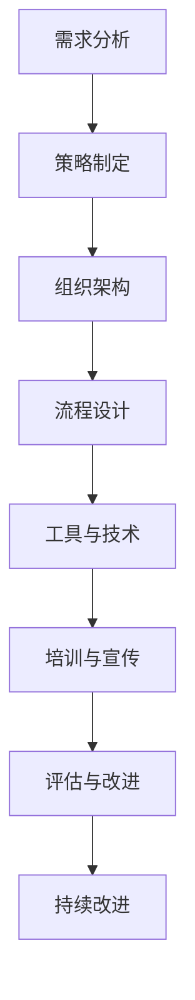

在数据治理中，数据治理流程和框架是确保数据治理有效实施的基础。通过清晰的流程和框架，组织可以更好地管理数据，提高数据质量和安全性，从而为业务决策提供有力支持。

接下来，我们将探讨数据治理中的数据资产管理，包括数据资产分类与评估、数据资产管理策略以及数据生命周期管理。

### 第2章：数据资产管理

数据资产管理是数据治理的核心环节之一，旨在确保数据资产的价值最大化。数据资产是指组织中所有形式的数据，包括结构化数据、半结构化数据和非结构化数据。有效的数据资产管理有助于提高数据的可用性、可靠性和安全性，从而支持组织的业务决策和运营优化。

##### 2.1 数据资产分类与评估

数据资产分类是数据资产管理的基础，有助于识别不同类型数据的重要性和价值。以下是常见的数据资产分类方法：

- **按数据类型分类**：
  - 结构化数据：存储在数据库和表格中的数据，如关系型数据库中的记录和列。
  - 半结构化数据：具有一定结构但不够严格的数据，如日志文件、XML文档等。
  - 非结构化数据：没有固定结构的数据，如文本、图像、音频和视频等。

- **按数据来源分类**：
  - 内部数据：来自组织内部系统生成的数据，如客户关系管理（CRM）系统、财务系统等。
  - 外部数据：来自组织外部的数据，如第三方数据提供商、公共数据等。

- **按数据生命周期分类**：
  - 动态数据：实时产生的数据，如交易数据、传感器数据等。
  - 静态数据：历史数据，如存档报告、年度总结等。
  - 归档数据：不再活跃使用但需要保存的数据，如旧的客户记录、历史交易记录等。

**数据资产评估方法**：

数据资产评估是衡量数据价值的重要手段，以下是一些常用的数据资产评估方法：

- **成本法**：基于数据收集、存储、处理和管理的成本来评估数据价值。
- **市场法**：参考市场上类似数据的价值来评估数据价值。
- **收益法**：基于数据带来的收益（如销售收入、节省成本、提高效率）来评估数据价值。
- **质量法**：基于数据质量（如完整性、准确性、一致性）来评估数据价值。

**数据资产管理策略**：

数据资产管理策略是确保数据资产有效利用和持续增值的关键。以下是常见的数据资产管理策略：

- **数据分类与标签**：对数据进行分类和标签，明确数据的重要性和用途。
- **数据存储与管理**：选择合适的数据存储和管理方案，确保数据的安全、可靠和高效。
- **数据备份与恢复**：制定数据备份和恢复策略，确保数据在灾难情况下可以快速恢复。
- **数据生命周期管理**：对数据进行全生命周期管理，包括数据生成、存储、使用、共享和销毁等环节。
- **数据共享与交换**：建立数据共享与交换机制，促进数据在不同部门和业务线之间的流通和利用。

**Mermaid流程图**：

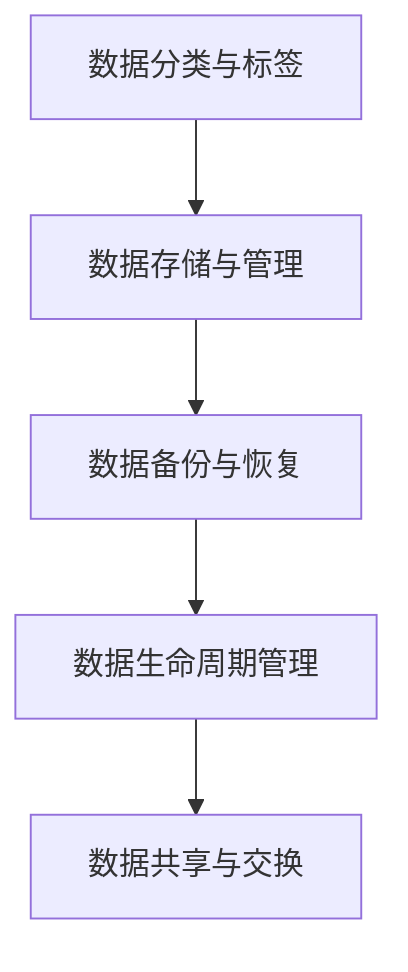

在数据治理中，数据资产管理是一个关键环节，它不仅关系到数据的质量和价值，还影响到整个组织的业务运作。有效的数据资产管理策略可以帮助组织充分利用数据资产，提高业务效率和竞争力。

接下来，我们将探讨数据质量管理，包括数据质量评估方法、数据质量控制措施和数据质量改进策略。

### 第3章：数据质量管理

数据质量管理是数据治理的核心任务之一，其目标是确保数据的一致性、准确性、完整性和及时性。高质量的数据是组织做出准确决策和提供优质服务的基础。本章将详细介绍数据质量管理的各个方面，包括评估方法、控制措施和改进策略。

##### 3.1 数据质量评估方法

数据质量评估是衡量数据质量的重要步骤，通过评估可以识别数据中的问题，从而采取措施进行改进。以下是一些常用的数据质量评估方法：

- **一致性检查**：检查数据在不同系统、表或列之间是否存在冲突或不一致的情况。例如，检查同一客户的姓名和地址在多个系统中的记录是否一致。
- **准确性检查**：评估数据是否符合预定的标准或规则。例如，检查电话号码的格式是否正确，或检查电子邮件地址是否有效。
- **完整性检查**：检查数据是否完整，是否有缺失值或空值。例如，检查客户表中是否所有的字段都有值，或检查订单表中是否所有的订单都有对应的客户。
- **及时性检查**：评估数据是否在规定的时间内更新或刷新。例如，检查销售数据是否每天更新，或检查财务报表是否在每月结束后的五个工作日内完成。

**数据质量评估工具**：

为了有效进行数据质量评估，可以使用以下几种工具：

- **数据质量管理平台**：如Informatica, Talend, IBM InfoSphere等，这些平台提供了一系列功能，包括数据质量监测、数据清洗、数据集成和数据治理等。
- **自助服务数据质量工具**：如Alteryx, Knime等，这些工具允许用户自定义数据质量检查规则，并对数据进行清洗和转换。
- **SQL查询和脚本**：使用SQL或其他编程语言编写查询和脚本，以检查数据的一致性、准确性和完整性。

**Mermaid流程图**：

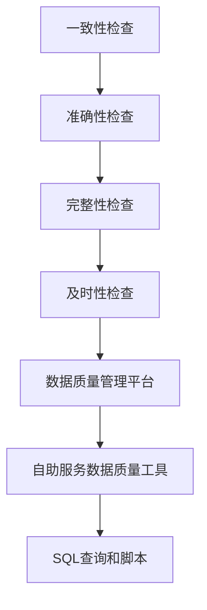

##### 3.2 数据质量控制措施

为了确保数据质量，需要采取一系列质量控制措施：

- **数据清洗**：在数据进入系统之前或之后，对数据进行清洗，以修复或删除错误、异常值和重复记录。
- **数据标准化**：确保数据遵循一致的格式和标准，例如，统一日期格式、电话号码格式和地址格式。
- **数据验证**：在数据录入或更新时，使用预定义的规则和约束来验证数据的准确性。
- **数据备份和恢复**：定期备份数据，并在数据丢失或损坏时能够快速恢复。
- **数据监控和报告**：建立数据监控机制，定期检查数据质量，并生成报告，以便及时发现和处理数据质量问题。

**Mermaid流程图**：

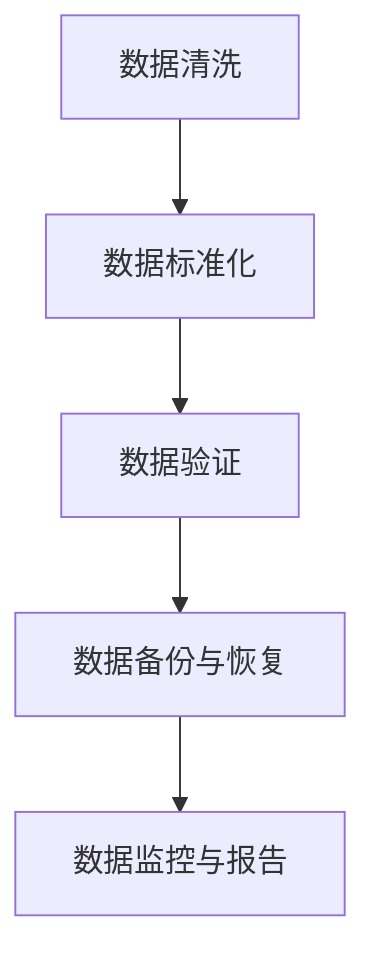

##### 3.3 数据质量改进策略

数据质量改进是一个持续的过程，需要组织在多个方面进行努力：

- **流程优化**：通过优化数据采集、处理和传输的流程，减少数据质量问题。
- **培训与宣传**：对员工进行数据质量管理培训，提高数据质量意识和技能。
- **技术更新**：使用先进的数据质量管理工具和技术，提高数据质量评估和控制能力。
- **数据治理文化**：建立数据治理文化，鼓励员工关注数据质量，并将数据质量作为业务决策的重要依据。

**Mermaid流程图**：

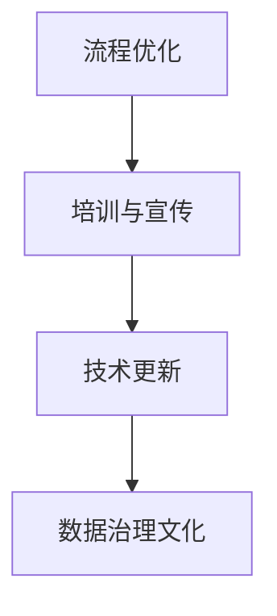

在数据治理中，数据质量管理是一个持续的过程，需要组织在多个方面进行努力。通过有效的数据质量评估方法和质量控制措施，组织可以确保数据的准确性、完整性、一致性和及时性，从而为业务决策提供可靠的数据支持。接下来，我们将探讨数据治理中的技术方面，包括数据治理工具与技术选型。

### 第4章：数据治理工具与技术

数据治理工具与技术是确保数据质量、安全性和合规性的关键。有效的数据治理工具和技术可以帮助组织管理大量数据，提高数据可用性和共享性。本章将详细介绍数据治理工具的概述、技术体系以及技术选型与实施。

##### 4.1 数据治理工具概述

数据治理工具是支持数据治理实施的关键组件，它们提供了一系列功能，包括数据质量监测、数据清洗、数据集成和数据治理等。以下是几种常见的数据治理工具：

- **数据质量管理工具**：如Informatica, Talend, IBM InfoSphere等，这些工具提供了数据质量监测、数据清洗、数据转换和数据集成等功能。
- **数据集成工具**：如Apache NiFi, Talend, Informatica等，这些工具支持数据收集、转换和加载，实现不同数据源之间的集成。
- **数据仓库工具**：如Apache Hadoop, Snowflake, Google BigQuery等，这些工具用于存储和管理大量数据，并提供强大的数据处理和分析功能。
- **元数据管理工具**：如IBM InfoSphere, Talend, SAP PowerDesigner等，这些工具用于管理数据字典、数据流和数据关系，确保数据的透明性和一致性。

**数据治理技术体系**：

数据治理技术体系包括以下几个方面：

- **数据质量管理技术**：包括数据质量评估、数据清洗、数据标准化和数据监控等。
- **数据集成技术**：包括数据抽取、转换和加载（ETL）、数据流处理和数据交换等。
- **元数据管理技术**：包括数据字典、数据流图、数据关系和业务规则管理等。
- **数据安全与隐私保护技术**：包括数据加密、访问控制、身份认证和数据脱敏等。

##### 4.1.1 数据治理技术选型与实施

在选型数据治理技术时，需要考虑以下因素：

- **组织需求**：根据组织的业务需求和数据治理目标，选择合适的技术。
- **技术成熟度**：考虑技术的成熟度和稳定性，避免选择过于前沿或尚未广泛应用的工具。
- **兼容性**：确保所选技术能够兼容现有系统和数据源。
- **成本效益**：考虑技术成本和长期维护成本，确保预算合理。

数据治理技术的实施步骤通常包括：

- **需求分析**：明确数据治理的目标、需求和关键指标。
- **技术选型**：根据需求分析结果，选择合适的数据治理工具和技术。
- **架构设计**：设计数据治理架构，包括数据源、数据存储、数据处理和数据监控等。
- **实施与部署**：根据架构设计，部署数据治理工具和技术，并进行配置和调试。
- **培训与宣传**：对组织成员进行数据治理培训，提高数据治理意识和技能。
- **监控与优化**：定期监控数据治理效果，并根据反馈进行持续优化。

**Mermaid流程图**：

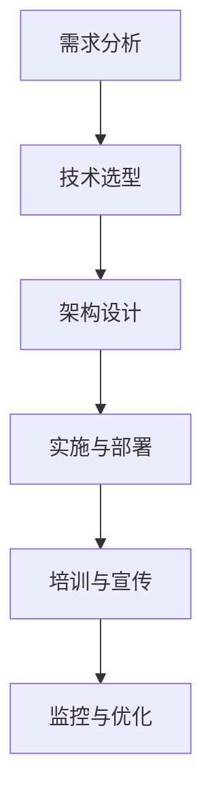

在数据治理中，数据治理工具和技术的选择与实施至关重要。通过合理的选型和实施，组织可以建立高效的数据治理体系，提高数据的可用性、共享性和安全性，从而为业务决策提供有力支持。接下来，我们将探讨数据治理中的数据安全与隐私保护方面。

### 第5章：数据安全与隐私

数据安全与隐私保护是数据治理的重要组成部分，确保数据在存储、处理和传输过程中的安全性和隐私性。随着数据量的不断增长和数据泄露事件的频发，数据安全和隐私保护变得日益重要。本章将详细讨论数据安全策略、隐私保护方法以及数据安全合规性要求。

##### 5.1 数据安全策略与措施

数据安全策略是确保数据安全的基础，包括一系列的安全措施和规范。以下是一些常见的数据安全策略与措施：

- **数据加密**：对敏感数据进行加密，确保数据在传输和存储过程中不被未授权访问。常用的加密算法包括AES（高级加密标准）和RSA（Rivest-Shamir-Adleman）。
- **访问控制**：通过访问控制机制，限制对数据的访问权限，确保只有授权用户才能访问敏感数据。常见的访问控制方法包括基于角色的访问控制（RBAC）和基于属性的访问控制（ABAC）。
- **身份认证**：使用身份认证机制，确保用户在访问数据前需要验证其身份，防止未授权访问。常用的身份认证方法包括密码认证、双因素认证（2FA）和多因素认证（MFA）。
- **数据备份与恢复**：定期备份数据，并确保在数据丢失或损坏时能够快速恢复。备份策略包括本地备份、远程备份和云备份。
- **网络安全**：使用防火墙、入侵检测系统和反病毒软件等网络安全措施，保护数据在传输过程中不受攻击。此外，还需要定期进行网络安全审计和漏洞扫描。

**Mermaid流程图**：

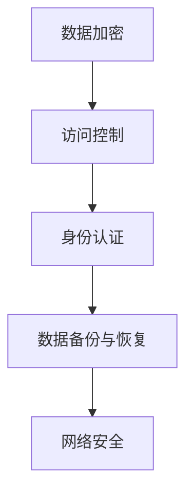

##### 5.2 数据隐私保护方法

数据隐私保护是确保个人数据的隐私和权益的关键。以下是一些常见的数据隐私保护方法：

- **数据匿名化**：通过匿名化技术，将个人数据中的敏感信息（如姓名、地址、电话等）替换为不可追踪的标识符，降低数据泄露的风险。常用的匿名化方法包括全匿名化和部分匿名化。
- **数据脱敏**：对敏感数据进行脱敏处理，使其在展示和传输过程中无法被直接识别，例如，将电话号码中间几位替换为星号。常用的脱敏方法包括掩码、混淆和替换。
- **数据访问日志**：记录数据访问和使用情况，以便在发生数据泄露时能够追踪和追溯责任。日志记录应包括访问时间、访问者信息和访问操作等。
- **隐私政策**：制定隐私政策，明确数据收集、存储、处理和使用的规则，确保用户知情同意。隐私政策应透明、易懂，并遵守相关法规和标准。

**Mermaid流程图**：

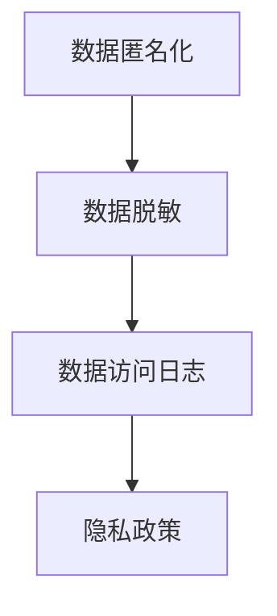

##### 5.3 数据安全合规性要求

数据安全合规性是确保组织遵守相关数据保护法规和标准的要求。以下是一些常见的数据安全合规性要求：

- **GDPR（欧盟通用数据保护条例）**：规定了个人数据的收集、处理和存储的严格要求，包括数据主体权利、数据安全保护和合规审计等。
- **CCPA（美国加利福尼亚州消费者隐私法案）**：规定了个人数据保护的标准，包括数据收集、使用和共享的要求，以及用户知情同意的权益。
- **ISO/IEC 27001**：是国际上广泛认可的信息安全管理体系标准，涵盖了数据安全管理的各个方面，包括风险管理、安全控制和安全审计。
- **SOX（萨班斯-奥克斯利法案）**：规定了企业财务报告的透明度和完整性要求，包括数据管理和内部控制等。

**Mermaid流程图**：

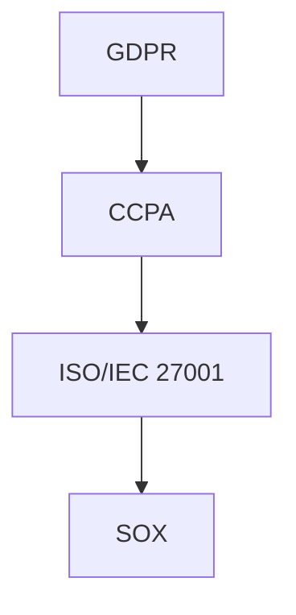

在数据治理中，数据安全与隐私保护至关重要。通过制定有效的安全策略、采用隐私保护方法和遵守合规性要求，组织可以确保数据的安全性和隐私性，提高用户的信任和满意度。接下来，我们将探讨数据治理的实际应用和实践经验。

### 第6章：数据治理实践

数据治理实践是确保数据治理策略和目标得到有效实施和实现的关键环节。通过实际应用和实践经验，组织可以不断优化数据治理流程，提高数据质量、安全性和合规性。本章将详细介绍数据治理项目规划与执行、数据治理案例研究以及数据治理挑战与解决方案。

##### 6.1 数据治理项目规划与执行

数据治理项目的成功实施需要详细的规划与执行。以下是一些关键步骤：

1. **项目立项**：确定数据治理项目的目标、范围和预期成果，并组建项目团队。
2. **需求分析**：深入了解组织的业务需求和数据现状，识别数据治理的关键问题和优先级。
3. **策略制定**：制定数据治理策略，包括数据分类、质量评估、安全与隐私保护等。
4. **流程设计**：设计数据治理流程，包括数据采集、存储、处理、共享和销毁等。
5. **技术选型**：根据需求分析和策略制定，选择合适的数据治理工具和技术。
6. **实施与部署**：根据设计文档，部署数据治理工具和技术，并进行配置和调试。
7. **培训与宣传**：对组织成员进行数据治理培训，提高数据治理意识和技能。
8. **监控与评估**：定期监控数据治理效果，并根据反馈进行持续改进。

**Mermaid流程图**：

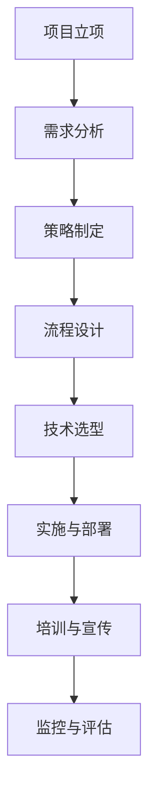

##### 6.2 数据治理案例研究

以下是一个数据治理案例研究，展示了数据治理项目从规划到实施的整个过程。

**案例背景**：某大型金融机构希望优化其数据治理流程，提高数据质量和合规性，以支持业务决策和风险控制。

**项目目标**：
- 建立数据治理框架，明确数据管理策略和流程。
- 提高数据质量，确保数据的准确性、完整性和一致性。
- 加强数据安全，保护敏感数据不被未授权访问。
- 确保数据合规，遵守相关数据保护法规和标准。

**项目实施步骤**：
1. **需求分析**：与业务部门沟通，了解数据治理的需求和目标。
2. **策略制定**：制定数据治理策略，包括数据分类、质量评估、安全与隐私保护等。
3. **流程设计**：设计数据治理流程，包括数据收集、清洗、存储、处理、共享和销毁等。
4. **技术选型**：选择数据质量管理平台、数据存储和处理框架等。
5. **实施与部署**：部署所选技术，并进行配置和调试。
6. **培训与宣传**：对员工进行数据治理培训，提高数据治理意识和技能。
7. **监控与评估**：定期检查数据治理效果，并根据反馈进行持续优化。

**项目成果**：
- 建立了完善的数据治理框架和流程。
- 数据质量显著提高，准确性、完整性和一致性得到保障。
- 数据安全得到加强，敏感数据得到有效保护。
- 数据合规性得到提升，遵守了相关法规和标准。

##### 6.3 数据治理挑战与解决方案

在数据治理实践中，组织可能会遇到各种挑战。以下是一些常见的数据治理挑战及其解决方案：

1. **数据质量问题**：
   - **挑战**：数据质量差，导致决策失误和业务效率低下。
   - **解决方案**：建立数据质量评估和控制机制，定期进行数据质量检查和修复，加强数据清洗和标准化工作。

2. **数据安全挑战**：
   - **挑战**：数据泄露和未授权访问风险增加。
   - **解决方案**：加强数据加密、访问控制和身份认证，定期进行网络安全审计和漏洞扫描，制定和执行数据安全策略。

3. **合规性挑战**：
   - **挑战**：难以满足相关数据保护法规和标准的要求。
   - **解决方案**：建立合规性评估和监控机制，定期进行合规审计，确保数据治理流程符合法规和标准要求。

4. **技术选型和实施难度**：
   - **挑战**：选择合适的数据治理工具和技术，并确保顺利实施。
   - **解决方案**：进行详细的需求分析和技术评估，选择成熟稳定的技术和工具，制定详细的实施计划，并进行充分的培训和测试。

通过数据治理实践，组织可以不断优化数据治理流程，提高数据质量、安全性和合规性，从而为业务决策和运营提供有力支持。在下一章中，我们将探讨数据治理的组织与人才建设。

### 第7章：组织与人才建设

有效的数据治理需要组织内部的支持和协调。数据治理的成功不仅取决于技术工具，还需要建立合适的组织架构、培养专业人才和建立数据治理文化。本章将详细讨论数据治理组织架构、人才队伍建设以及数据治理文化建设。

##### 7.1 数据治理组织架构

数据治理组织架构是确保数据治理策略和流程得到有效实施的关键。以下是一些常见的数据治理组织架构模式：

1. **中央化数据治理架构**：
   - **特点**：数据治理职能集中在中央部门，如数据治理办公室（DGO）或首席数据官（CDO）办公室。
   - **职责**：负责制定数据治理策略、规范和流程，并监督各部门的数据治理实施。

2. **分布式数据治理架构**：
   - **特点**：数据治理职能分布在各个业务部门，每个部门负责自身数据治理的实施，中央部门负责协调和监督。
   - **职责**：各部门负责本部门的数据治理，中央部门负责协调各部门之间的数据治理工作。

3. **矩阵式数据治理架构**：
   - **特点**：在中央数据治理机构和业务部门之间建立矩阵关系，中央数据治理机构负责制定数据治理策略和规范，业务部门负责具体实施。
   - **职责**：中央数据治理机构负责数据治理策略的制定和监督，业务部门负责数据治理的实施和执行。

**Mermaid流程图**：

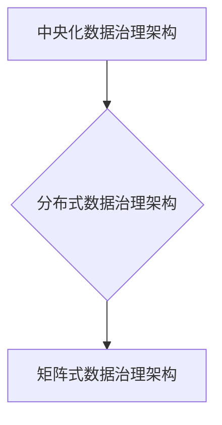

##### 7.2 数据治理人才队伍建设

数据治理人才是实施数据治理策略的核心力量。以下是一些关键角色及其职责：

1. **数据治理专员**：
   - **职责**：负责数据治理策略的制定、流程的优化和工具的实施。

2. **数据质量分析师**：
   - **职责**：负责数据质量的评估、监控和改进。

3. **数据安全专员**：
   - **职责**：负责数据安全策略的制定、安全措施的执行和合规性检查。

4. **数据合规专员**：
   - **职责**：负责确保组织遵守相关数据保护法规和政策。

5. **数据架构师**：
   - **职责**：负责数据架构的设计和优化，确保数据的一致性和可访问性。

6. **数据工程师**：
   - **职责**：负责数据存储、处理和传输的架构设计和实施。

**Mermaid流程图**：

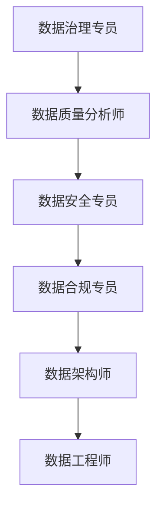

##### 7.3 数据治理文化建设

数据治理文化是确保数据治理策略和流程得到广泛认同和有效执行的基础。以下是一些关键措施：

1. **建立数据治理意识**：
   - **措施**：通过内部培训、会议和宣传，提高员工对数据治理的认识和理解。

2. **培养数据治理习惯**：
   - **措施**：在日常工作流程中嵌入数据治理要求，培养员工良好的数据治理习惯。

3. **建立数据治理激励制度**：
   - **措施**：对在数据治理工作中表现优秀的员工给予奖励和表彰，激励更多员工参与数据治理。

4. **加强跨部门协作**：
   - **措施**：促进不同部门之间的沟通和协作，确保数据治理策略和流程得到有效执行。

**Mermaid流程图**：

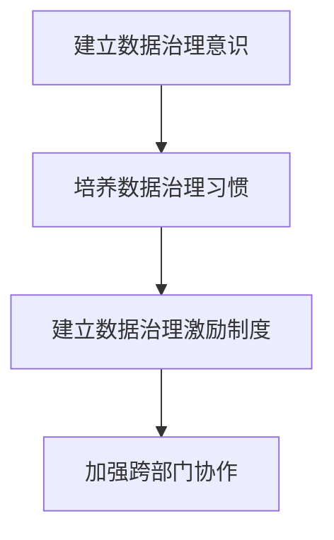

通过建立合适的组织架构、培养专业人才和建立数据治理文化，组织可以确保数据治理策略和流程得到有效实施，从而提高数据质量、安全性和合规性，为业务决策和运营提供有力支持。

### 第8章：数据治理制度与法规

数据治理制度与法规是确保数据治理策略和流程得到有效执行和合规的关键。有效的数据治理制度可以帮助组织规范数据管理行为，降低数据风险，确保数据质量和合规性。本章将详细讨论数据治理制度设计、法规与政策以及法规遵守与执行。

##### 8.1 数据治理制度设计

数据治理制度设计是确保数据治理策略和流程得到有效实施的重要环节。以下是一些关键要素：

1. **数据分类与标签**：
   - **目的**：根据数据的重要性和敏感性，对数据进行分类和标签，明确数据的使用权限和访问控制。
   - **方法**：制定数据分类标准，将数据分为公开数据、内部数据、敏感数据和高度敏感数据等。

2. **数据质量标准**：
   - **目的**：制定数据质量标准，确保数据满足业务需求。
   - **方法**：定义数据准确性、完整性、一致性、及时性和可用性的具体要求，建立数据质量评估机制。

3. **数据安全策略**：
   - **目的**：确保数据在存储、处理和传输过程中的安全性。
   - **方法**：制定数据加密、访问控制、身份认证、数据备份和恢复等安全措施。

4. **数据隐私保护政策**：
   - **目的**：保护个人数据的隐私和权益。
   - **方法**：制定个人数据收集、存储、处理和共享的规则，确保用户知情同意。

5. **数据生命周期管理**：
   - **目的**：确保数据在整个生命周期内得到有效管理。
   - **方法**：制定数据生成、存储、使用、共享和销毁的流程，确保数据的合规性。

**Mermaid流程图**：

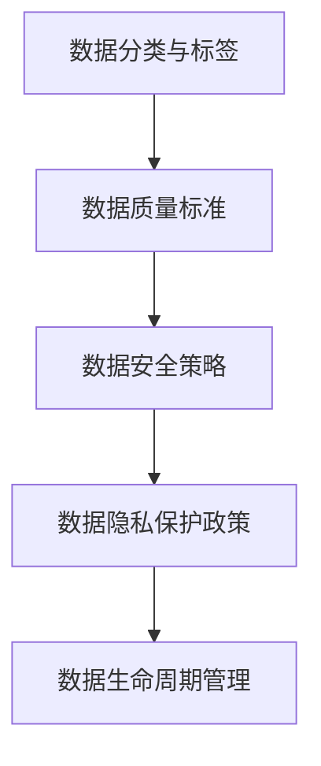

##### 8.2 数据治理法规与政策

数据治理法规与政策是确保数据治理合规性的重要依据。以下是一些重要的数据治理法规与政策：

1. **GDPR（欧盟通用数据保护条例）**：
   - **主要内容**：规定了个人数据的收集、处理和存储的严格要求，包括数据主体权利、数据安全保护和合规审计等。
   - **实施时间**：2018年5月25日。

2. **CCPA（美国加利福尼亚州消费者隐私法案）**：
   - **主要内容**：规定了个人数据保护的标准，包括数据收集、使用和共享的要求，以及用户知情同意的权益。
   - **实施时间**：2020年1月1日。

3. **ISO/IEC 27001**：
   - **主要内容**：是国际上广泛认可的信息安全管理体系标准，涵盖了数据安全管理的各个方面，包括风险管理、安全控制和安全审计。
   - **实施时间**：自2005年起。

4. **SOX（萨班斯-奥克斯利法案）**：
   - **主要内容**：规定了企业财务报告的透明度和完整性要求，包括数据管理和内部控制等。
   - **实施时间**：2002年。

**Mermaid流程图**：


##### 8.3 数据治理法规遵守与执行

遵守数据治理法规和政策是组织数据治理的重要任务。以下是一些关键步骤：

1. **法规培训**：
   - **目的**：提高员工对相关法规的认识和遵守能力。
   - **方法**：组织内部培训、外部培训课程和在线学习平台。

2. **合规审计**：
   - **目的**：评估组织的数据治理实践是否符合相关法规要求。
   - **方法**：定期进行内部和外部审计，发现并整改合规问题。

3. **内部审查**：
   - **目的**：确保组织的数据治理制度和流程得到有效执行。
   - **方法**：建立内部审查机制，定期检查数据治理流程的执行情况。

4. **合规报告**：
   - **目的**：向管理层和监管机构报告组织的合规情况。
   - **方法**：制定合规报告，确保透明度和可信度。

**Mermaid流程图**：

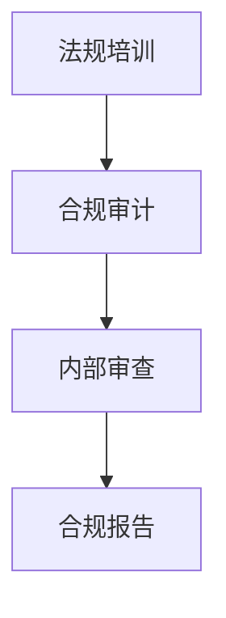

通过建立有效的数据治理制度、遵守相关法规和政策，组织可以确保数据治理策略和流程得到有效执行，提高数据质量、安全性和合规性，为业务决策和运营提供有力支持。

### 第9章：数据治理评估与改进

数据治理评估与改进是确保数据治理体系持续有效运行的关键。通过定期评估和改进，组织可以及时识别和解决数据治理中的问题，确保数据的质量、安全性和合规性。本章将详细讨论数据治理评估指标、改进策略以及持续优化实践。

##### 9.1 数据治理评估指标

数据治理评估指标是衡量数据治理成效的重要工具。以下是一些常用的数据治理评估指标：

1. **数据质量指标**：
   - **数据准确性**：衡量数据是否符合预期标准，例如，使用正确的电话号码或地址。
   - **数据完整性**：衡量数据是否完整，是否有缺失或空值。
   - **数据一致性**：衡量数据在不同系统和表中是否一致。
   - **数据及时性**：衡量数据是否在规定的时间内更新。

2. **数据安全指标**：
   - **数据泄露事件次数**：衡量数据泄露的频率和次数。
   - **安全事件响应时间**：衡量在发现安全事件后采取行动的平均时间。
   - **安全审计合规性**：衡量组织在安全审计中是否符合法规和标准。

3. **数据合规指标**：
   - **法规遵守率**：衡量组织在数据保护法规方面的遵守情况。
   - **合规审计发现问题率**：衡量在合规审计中发现的问题数量。

4. **数据治理效率指标**：
   - **项目完成率**：衡量数据治理项目按计划完成的比率。
   - **项目成本控制**：衡量项目成本是否在预算范围内。
   - **资源利用率**：衡量资源（如人力、技术）的使用效率。

**Mermaid流程图**：

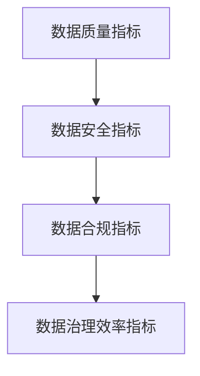

##### 9.2 数据治理改进策略

数据治理改进策略是确保数据治理体系持续优化和提升的关键。以下是一些常用的数据治理改进策略：

1. **流程优化**：
   - **目的**：通过流程分析，识别数据治理流程中的瓶颈和问题，优化流程以提高效率和质量。
   - **方法**：定期评估和审查数据治理流程，使用流程建模工具进行流程重构。

2. **技术更新**：
   - **目的**：根据数据治理需求和趋势，更新和升级数据治理工具和技术，确保其适应性和先进性。
   - **方法**：评估现有工具和技术，选择合适的新工具进行更新，并进行全面测试。

3. **人员培训**：
   - **目的**：提高数据治理团队成员的专业能力和实践技能。
   - **方法**：制定培训计划，提供内部和外部培训机会，鼓励员工参加相关认证考试。

4. **经验分享与知识积累**：
   - **目的**：促进团队之间的知识共享和经验积累。
   - **方法**：建立知识库，定期组织经验分享会议，鼓励团队成员撰写博客和文档。

**Mermaid流程图**：

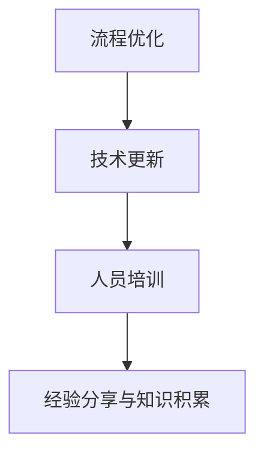

##### 9.3 数据治理持续优化实践

数据治理持续优化实践是确保数据治理体系长期有效的重要措施。以下是一些关键步骤：

1. **建立持续评估机制**：
   - **目的**：定期评估数据治理效果，及时发现和解决问题。
   - **方法**：制定评估计划，定期进行数据质量、安全性和合规性评估，并生成报告。

2. **建立反馈机制**：
   - **目的**：收集相关利益相关者的反馈，为改进提供依据。
   - **方法**：建立反馈渠道，定期收集员工、业务部门和客户的反馈，并进行分析。

3. **制定改进计划**：
   - **目的**：根据评估结果和反馈，制定具体的改进计划。
   - **方法**：分析评估结果和反馈，制定改进计划，包括改进措施、责任人和时间表。

4. **执行改进计划**：
   - **目的**：确保改进计划得到有效执行。
   - **方法**：根据改进计划，采取具体行动，监控进度，并根据实际情况进行调整。

**Mermaid流程图**：

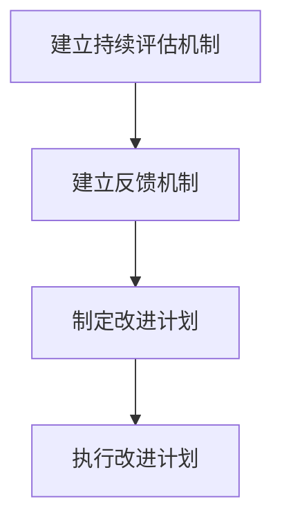

通过数据治理评估与改进的持续实践，组织可以不断提高数据治理水平，确保数据的可靠性、安全性和合规性，为业务决策和运营提供有力支持。

### 附录：数据治理相关资源

#### 附录A：数据治理工具与资源介绍

- **Informatica**：提供全面的数据质量管理、集成和治理解决方案。
- **Talend**：提供数据集成、数据质量和数据治理工具。
- **IBM InfoSphere**：提供数据仓库、数据管理和数据治理解决方案。
- **Apache NiFi**：开源的数据集成平台，用于数据流的抽取、转换和加载。
- **Alteryx**：提供数据集成、数据分析和数据治理工具。
- **Knime**：开源的数据分析和数据治理平台。

#### 附录B：数据治理相关法规与标准

- **GDPR（欧盟通用数据保护条例）**：规定了个人数据的收集、处理和存储的严格要求。
- **CCPA（美国加利福尼亚州消费者隐私法案）**：规定了个人数据保护的标准。
- **ISO/IEC 27001**：国际认可的信息安全管理体系标准。
- **SOX（萨班斯-奥克斯利法案）**：规定了企业财务报告的透明度和完整性要求。
- **FEDRAMP**：美国政府联邦风险与授权管理计划。

#### 附录C：数据治理案例研究文献

- **"Data Governance in Action: A Practical Guide for the Implementation and Management of Data Governance Programs"**：由Matt H Architect和Mark J. O'Keefe编写的实用指南，涵盖了数据治理的实施和管理。
- **"The Data Governance Handbook: Establishing, Planning, and Managing a Data Governance Program for Your Organization"**：由John L. Lally和Thomas W. Redman编写的详细指南，介绍了数据治理的建立、规划和执行。
- **"Data Governance Case Studies: Managing Data in the Real World"**：由Tom Redman和John L. Lally编写的案例研究，通过实际案例展示了数据治理的实施和效果。

---

附录部分提供了丰富的数据治理工具、法规和案例研究资源，帮助读者深入了解数据治理的实践和应用。通过这些资源和案例，读者可以更好地理解和实施数据治理策略，确保数据的可靠性、安全性和合规性。这些资源为数据治理的实践提供了宝贵的指导和参考。

### 附录：Mermaid流程图与伪代码示例

#### 附录D：数据治理流程Mermaid图示

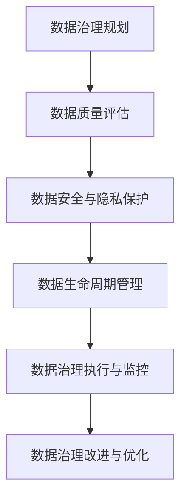

#### 附录E：数据质量评估伪代码示例

```python
# 数据质量评估伪代码示例

# 初始化数据集
data_set = load_data("data.csv")

# 数据清洗
clean_data_set = clean_data(data_set)

# 数据质量评估
quality_metrics = assess_data_quality(clean_data_set)

# 输出数据质量报告
print(quality_metrics)

# 数据清洗函数
def clean_data(data):
    # 删除空值
    data = data.dropna()
    # 标准化数据格式
    data['date'] = pd.to_datetime(data['date'])
    data['amount'] = data['amount'].astype(float)
    return data

# 数据质量评估函数
def assess_data_quality(data):
    # 数据完整性
    completeness = (data.count() / data.shape[0]) * 100
    # 数据准确性
    accuracy = (data.isnull().sum() == 0).mean() * 100
    # 数据一致性
    consistency = (data.duplicated().sum() == 0).mean() * 100
    return completeness, accuracy, consistency
```

#### 附录F：数据质量评估数学模型

$$
\text{数据质量评分} = \frac{\text{有效数据记录数}}{\text{总数据记录数}} \times 100\%
$$

#### 附录G：数据安全与隐私保护公式

$$
\text{数据泄露风险} = \text{数据敏感性} \times \text{数据访问频率} \times \text{安全措施有效性}
$$

#### 附录H：数据治理项目实战案例

以下是一个数据治理项目实战案例的简要描述：

**项目背景**：某大型零售企业希望建立一套完整的数据治理体系，以提高数据质量和合规性，支持业务决策和运营优化。

**项目目标**：
- 建立数据治理框架，明确数据管理策略和流程。
- 提高数据质量，确保数据的准确性、完整性和一致性。
- 加强数据安全，保护敏感数据不被未授权访问。
- 确保数据合规，遵守相关数据保护法规和标准。

**项目实施步骤**：
1. **需求分析**：与业务部门沟通，了解数据治理的需求和目标。
2. **策略制定**：制定数据治理策略，包括数据分类、质量评估、安全与隐私保护等。
3. **流程设计**：设计数据治理流程，包括数据收集、清洗、存储、处理、共享和销毁等。
4. **技术选型**：选择合适的数据治理工具和技术，如数据质量管理平台、数据存储和处理框架等。
5. **实施与部署**：部署所选工具和技术，进行数据治理流程的实施和配置。
6. **培训与宣传**：对员工进行数据治理培训，提高数据治理意识和技能。
7. **监控与评估**：定期监控数据治理效果，根据反馈进行持续改进。

#### 附录I：数据治理代码实现与分析

以下是一个简单的Python代码示例，用于数据清洗和数据质量评估：

```python
import pandas as pd

# 加载数据集
data_set = pd.read_csv("data.csv")

# 数据清洗
def clean_data(data):
    # 删除空值
    data = data.dropna()
    # 标准化数据格式
    data['date'] = pd.to_datetime(data['date'])
    data['amount'] = data['amount'].astype(float)
    return data

clean_data_set = clean_data(data_set)

# 数据质量评估
def assess_data_quality(data):
    # 数据完整性
    completeness = (data.count() / data.shape[0]) * 100
    # 数据准确性
    accuracy = (data.isnull().sum() == 0).mean() * 100
    # 数据一致性
    consistency = (data.duplicated().sum() == 0).mean() * 100
    return completeness, accuracy, consistency

completeness, accuracy, consistency = assess_data_quality(clean_data_set)

print(f"数据完整性：{completeness}%")
print(f"数据准确性：{accuracy}%")
print(f"数据一致性：{consistency}%")
```

**代码解读**：
- **数据加载**：使用Pandas库加载CSV文件，创建DataFrame对象。
- **数据清洗**：定义一个函数`clean_data`，用于处理以下任务：
  - 删除空值：`data = data.dropna()`。
  - 标准化日期格式：`data['date'] = pd.to_datetime(data['date'])`。
  - 将金额字段转换为浮点数：`data['amount'] = data['amount'].astype(float)`。
- **数据质量评估**：定义一个函数`assess_data_quality`，用于计算以下指标：
  - 数据完整性：计算非空值的比例。
  - 数据准确性：计算空值的比例。
  - 数据一致性：计算重复记录的比例。

#### 附录J：数据治理源代码解读

上述代码示例主要用于数据清洗和数据质量评估。具体解读如下：

- **数据加载**：使用Pandas库加载CSV文件，创建DataFrame对象。
- **数据清洗**：定义一个函数`clean_data`，用于处理以下任务：
  - 删除空值：`data = data.dropna()`。
    - 删除包含任何空值的行。
  - 标准化日期格式：`data['date'] = pd.to_datetime(data['date'])`。
    - 将日期列转换为日期时间格式。
  - 将金额字段转换为浮点数：`data['amount'] = data['amount'].astype(float)`。
    - 将金额列的值转换为浮点数。
- **数据质量评估**：定义一个函数`assess_data_quality`，用于计算以下指标：
  - 数据完整性：计算非空值的比例。
    - `completeness = (data.count() / data.shape[0]) * 100`。
      - `data.count()`计算非空值的数量。
      - `data.shape[0]`计算总记录数。
      - 计算比例并转换为百分比。
  - 数据准确性：计算空值的比例。
    - `accuracy = (data.isnull().sum() == 0).mean() * 100`。
      - `data.isnull().sum()`计算每个列的空值数量。
      - `data.isnull().sum() == 0`计算每个列是否没有空值。
      - `mean()`计算平均比例。
      - 计算比例并转换为百分比。
  - 数据一致性：计算重复记录的比例。
    - `consistency = (data.duplicated().sum() == 0).mean() * 100`。
      - `data.duplicated()`计算重复记录。
      - `data.duplicated().sum()`计算重复记录的数量。
      - `data.duplicated().sum() == 0`计算每个列是否没有重复记录。
      - `mean()`计算平均比例。
      - 计算比例并转换为百分比。

通过上述代码示例，读者可以了解如何使用Python进行数据清洗和数据质量评估。这些操作对于确保数据的质量和准确性至关重要，有助于支持有效的数据治理实践。

#### 附录K：数学模型和数学公式

以下是用于数据治理中的一些数学模型和公式：

##### 数据质量评估数学模型

1. **数据完整性**：

$$
\text{完整性} = \frac{\text{有效记录数}}{\text{总记录数}} \times 100\%
$$

2. **数据准确性**：

$$
\text{准确性} = \frac{\text{正确记录数}}{\text{总记录数}} \times 100\%
$$

3. **数据一致性**：

$$
\text{一致性} = \frac{\text{一致记录数}}{\text{总记录数}} \times 100\%
$$

##### 数据安全与隐私保护数学模型

1. **数据泄露风险**：

$$
\text{数据泄露风险} = \text{数据敏感性} \times \text{数据访问频率} \times \text{安全措施有效性}
$$

2. **数据隐私保护指数**：

$$
\text{隐私保护指数} = \frac{\text{隐私保护措施}}{\text{数据泄露风险}}
$$

这些数学模型和公式提供了量化的方法来评估数据的质量和安全水平，有助于组织在数据治理过程中制定更加科学的策略和决策。

---

附录部分提供了Mermaid流程图、伪代码示例、数学模型和实际代码案例，旨在帮助读者更深入地理解数据治理的各个环节和实践。通过这些资源和示例，读者可以更好地应用数据治理原则和方法，提高数据的质量、安全性和合规性，为组织的业务成功提供支持。

