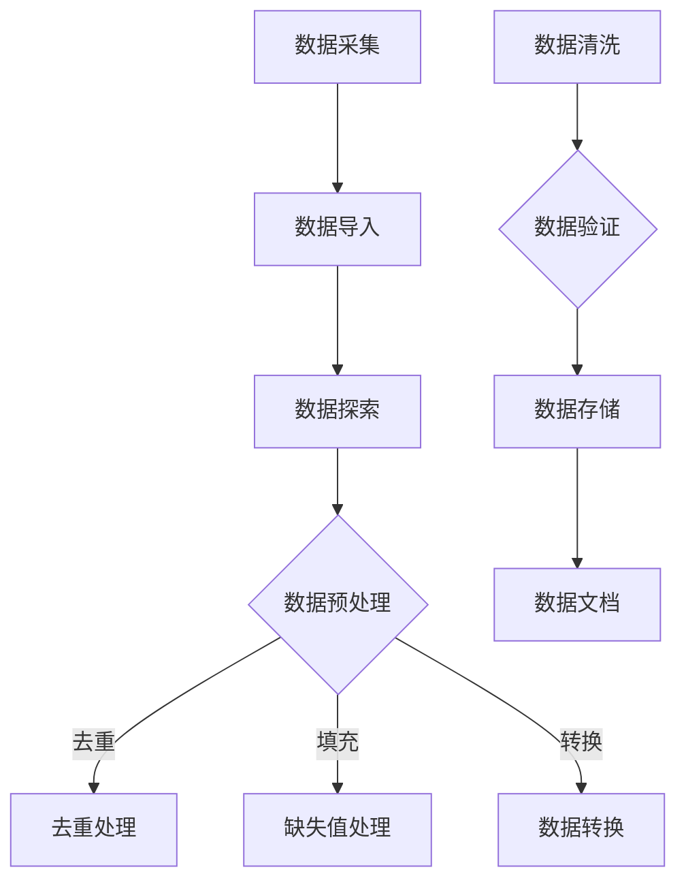

                 

### 文章标题：数据清洗：技术深度解读与实践指南

> 关键词：数据清洗、数据处理、数据质量、数据预处理、数据清洗工具

> 摘要：本文将深入探讨数据清洗的重要性及其在IT行业中的应用。从数据清洗的基本概念出发，逐步讲解数据清洗的步骤、方法和工具，并针对不同行业的数据清洗实践进行详细分析。通过实际案例和代码示例，帮助读者全面理解数据清洗的流程和技巧，提升数据处理能力。

### 数据清洗的重要性

在当今信息化时代，数据已成为企业的重要资产。然而，数据的质量直接影响到数据分析和决策的准确性。据统计，约有80%的数据质量问题是由于数据清洗不当引起的。因此，数据清洗作为数据管理的重要环节，具有不可忽视的重要性。

首先，数据清洗可以去除重复数据、纠正错误、填充缺失值，从而提高数据的准确性。这对于依赖于数据驱动的决策和业务分析至关重要。其次，数据清洗有助于减少数据冗余，优化存储资源，提高数据处理效率。此外，良好的数据清洗实践可以降低后续数据处理的复杂性，节约成本。

总之，数据清洗是确保数据质量、提升数据价值的关键步骤，对于IT行业的各个方面都具有重要的意义。下面，我们将进一步探讨数据清洗的基本概念和具体实施方法。

### 数据清洗的基本概念

数据清洗（Data Cleaning）又称数据整理或数据预处理，是指通过一系列技术手段，对原始数据进行检测、修复、转换和合并，使其满足后续分析处理需求的操作。数据清洗的目的是提高数据的准确性和一致性，为数据分析和决策提供可靠的基础。

数据清洗的主要任务包括：

1. **去除重复数据**：识别并删除重复的数据条目，以避免冗余和不准确的分析结果。
2. **纠正错误**：检测并修复数据中的错误，如拼写错误、格式错误、逻辑错误等。
3. **填充缺失值**：对于缺失的数据，采用合适的策略进行填充，如平均值填充、中值填充、插值法等。
4. **数据转换**：将数据从一种格式转换为另一种格式，以满足特定分析工具或需求。
5. **数据归一化**：对数据进行标准化或归一化处理，使其具备可比性。

数据清洗在数据管理中的地位至关重要。它不仅为数据分析和数据挖掘提供了基础，也是确保数据质量的关键步骤。以下是数据清洗在数据管理流程中的具体位置：

1. **数据采集**：在数据采集阶段，原始数据可能存在不一致、不完整或错误的情况。数据清洗在此阶段进行初步的处理，确保数据的初步质量。
2. **数据存储**：在数据存储阶段，需要对数据进行进一步清洗，以消除冗余和错误，优化存储资源。
3. **数据分析**：在数据分析阶段，数据清洗的结果直接影响分析结果的准确性和可靠性。未经清洗的数据可能导致错误的结论和决策。
4. **数据可视化**：在数据可视化阶段，数据清洗有助于提高数据图表和报告的准确性和可读性。

综上所述，数据清洗不仅是数据管理流程中的重要环节，也是确保数据质量和分析效果的关键步骤。接下来，我们将介绍数据清洗的基本步骤和方法。

### 数据清洗的基本步骤

数据清洗是一个系统化、规范化的过程，通常包括以下基本步骤：

#### 1. 数据理解

在开始数据清洗之前，首先需要理解数据的内容和结构。这一步骤主要包括：

- **数据探索**：通过查看数据的基本统计信息，了解数据的分布、极值、异常值等。
- **数据描述**：使用文本、图表等形式，对数据的基本特征进行描述，如数据类型、字段名称、数据量等。
- **数据质量评估**：评估数据的质量，识别可能存在的问题，如缺失值、重复值、异常值等。

#### 2. 数据预处理

数据预处理是对原始数据的基本处理，主要包括以下内容：

- **数据转换**：将不同格式的数据转换为统一的格式，如将文本数据转换为数字或日期格式。
- **数据去重**：识别并删除重复的数据条目，以消除数据冗余。
- **缺失值处理**：对于缺失的数据，采用适当的策略进行填充或删除。
- **异常值处理**：检测并处理异常数据，如逻辑错误、不合理的值等。

#### 3. 数据清洗

在数据预处理的基础上，进行深入的数据清洗，主要包括以下内容：

- **数据校正**：对数据中的错误进行纠正，如拼写错误、格式错误等。
- **数据标准化**：对数据进行标准化处理，如缩放、归一化等，以消除不同数据之间的可比性问题。
- **数据转换**：将数据转换为适合分析处理的形式，如将时间序列数据转换为频率数据等。

#### 4. 数据验证

数据验证是确保数据清洗效果的重要步骤，主要包括以下内容：

- **数据一致性检查**：检查数据的一致性，如数据类型、字段长度、值范围等是否满足要求。
- **数据完整性检查**：检查数据是否完整，是否存在缺失值或异常值。
- **数据准确性检查**：检查数据的准确性，如是否存在错误的值、异常的分布等。

#### 5. 数据存储

在完成数据清洗后，需要将清洗后的数据存储到目标数据库或数据仓库中，以便后续的数据分析和使用。这一步骤主要包括以下内容：

- **数据存储格式**：选择合适的数据存储格式，如CSV、Parquet、HDF5等。
- **数据存储策略**：制定数据存储的策略，如数据压缩、分片、备份等。
- **数据存储位置**：确定数据存储的位置，如本地文件系统、分布式文件系统、云存储等。

通过以上步骤，可以确保数据清洗的完整性和有效性，为数据分析和业务决策提供可靠的数据基础。接下来，我们将介绍数据清洗的方法和工具。

### 数据清洗的方法与工具

数据清洗的方法和工具多种多样，适用于不同的数据类型和场景。以下是一些常见的数据清洗方法和工具：

#### 1. 手动数据清洗

手动数据清洗是通过人工审查和修改数据，识别并纠正错误。这种方法适用于数据量较小、数据结构较为简单的场景。常用的工具包括Excel、文本编辑器等。

- **优点**：直观、灵活，适用于非结构化数据。
- **缺点**：效率低，无法处理大量数据，容易引入人为错误。

#### 2. 自动化数据清洗

自动化数据清洗是使用编程语言和数据处理库，对数据进行自动化的清洗和处理。这种方法适用于数据量较大、数据结构复杂的场景。常用的编程语言和库包括Python、R、Java等。

- **Python数据清洗库**：如pandas、NumPy、SciPy等，提供了丰富的数据清洗功能。
  - **pandas**：提供了数据预处理、数据清洗、数据转换等功能。
  - **NumPy**：提供了高效的数据操作和计算库。
  - **SciPy**：提供了科学计算和数据分析库。
- **R语言数据清洗库**：如dplyr、tidyr、data.table等，提供了强大的数据清洗和数据处理能力。
  - **dplyr**：提供了灵活的数据操作和数据处理功能。
  - **tidyr**：提供了数据整理和清洗功能。
  - **data.table**：提供了高效的数据操作和数据处理库。
- **Java数据清洗库**：如Apache Commons Lang、Apache Commons CSV等，提供了丰富的数据清洗功能。

- **优点**：效率高，可以处理大量数据，减少人为错误。
- **缺点**：需要编程知识，学习成本较高。

#### 3. SQL数据清洗

SQL数据清洗是通过SQL语句对数据库中的数据进行清洗和处理。这种方法适用于关系型数据库，如MySQL、Oracle、PostgreSQL等。

- **优点**：简单易用，适用于结构化数据。
- **缺点**：功能有限，无法处理复杂的数据清洗任务。

#### 4. 云端数据清洗

云端数据清洗是利用云计算平台提供的工具和服务进行数据清洗。这种方法适用于大规模数据清洗任务，如大数据处理、实时数据清洗等。

- **优点**：弹性扩展，高效处理，降低成本。
- **缺点**：需要熟悉云计算平台，数据安全性问题。

综上所述，选择合适的数据清洗方法和工具，可以有效地提升数据清洗的效率和质量。接下来，我们将探讨数据预处理的细节。

### 数据预处理

数据预处理是数据清洗过程中的重要步骤，它旨在将原始数据转换为适合分析处理的形式。以下是一些常见的数据预处理方法和技巧：

#### 1. 数据格式转换

数据格式转换是将不同格式的数据转换为统一的格式。例如，将文本数据转换为数字或日期格式。常用的工具和方法包括：

- **Python**：使用`pandas`库中的`astype()`方法，将数据类型进行转换。
- **R语言**：使用`as.Date()`、`as.numeric()`等函数，将数据类型进行转换。
- **SQL**：使用`CAST`或`CONVERT`函数，将数据类型进行转换。

#### 2. 数据去重

数据去重是识别并删除重复的数据条目，以消除数据冗余。常用的方法包括：

- **Python**：使用`pandas`库中的`drop_duplicates()`方法，删除重复数据。
- **R语言**：使用`dplyr`包中的`distinct()`函数，删除重复数据。
- **SQL**：使用`DISTINCT`关键字，删除重复数据。

#### 3. 数据填充与缺失值处理

数据填充是对于缺失的数据，采用合适的策略进行填充，以消除数据缺失的影响。常见的方法包括：

- **平均值填充**：将缺失值填充为该字段的平均值。
- **中值填充**：将缺失值填充为该字段的中值。
- **插值法**：使用线性插值、曲线插值等方法，根据相邻的数据点，估算缺失值。

常用的工具和方法包括：

- **Python**：使用`pandas`库中的`fillna()`方法，填充缺失值。
- **R语言**：使用`dplyr`包中的`mutate()`函数，填充缺失值。
- **SQL**：使用`COALESCE`、`IFNULL`等函数，填充缺失值。

#### 4. 数据标准化与归一化

数据标准化与归一化是处理不同数据量级和单位的数据，使其具备可比性。常见的方法包括：

- **标准差归一化**：将数据转换为标准分数，即\( z = \frac{x - \mu}{\sigma} \)，其中\( x \)为原始数据，\( \mu \)为平均值，\( \sigma \)为标准差。
- **最小-最大归一化**：将数据缩放到[0,1]范围内，即\( x' = \frac{x - \min}{\max - \min} \)，其中\( x \)为原始数据，\( \min \)为最小值，\( \max \)为最大值。

常用的工具和方法包括：

- **Python**：使用`scikit-learn`库中的`StandardScaler`和`MinMaxScaler`类，进行标准化与归一化。
- **R语言**：使用`scale()`函数，进行标准化处理；使用`scale()`函数，进行归一化处理。

通过上述数据预处理方法，可以有效地提高数据的可用性和一致性，为后续的数据分析提供可靠的数据基础。接下来，我们将深入探讨数据清洗的核心算法。

### 数据清洗核心算法

数据清洗过程中，核心算法的选择和实现直接影响到清洗效果和效率。以下将介绍几种常见的数据清洗算法，包括排序算法、查找算法、替换算法和聚类算法，并使用伪代码详细阐述其原理和应用。

#### 1. 排序算法

排序算法用于对数据进行排序，便于后续处理和分析。常见的排序算法包括冒泡排序、选择排序、插入排序、快速排序等。

**冒泡排序**

```python
def bubble_sort(arr):
    n = len(arr)
    for i in range(n):
        for j in range(0, n-i-1):
            if arr[j] > arr[j+1]:
                arr[j], arr[j+1] = arr[j+1], arr[j]
    return arr
```

**选择排序**

```python
def selection_sort(arr):
    n = len(arr)
    for i in range(n):
        min_idx = i
        for j in range(i+1, n):
            if arr[j] < arr[min_idx]:
                min_idx = j
        arr[i], arr[min_idx] = arr[min_idx], arr[i]
    return arr
```

**插入排序**

```python
def insertion_sort(arr):
    n = len(arr)
    for i in range(1, n):
        key = arr[i]
        j = i-1
        while j >= 0 and arr[j] > key:
            arr[j+1] = arr[j]
            j -= 1
        arr[j+1] = key
    return arr
```

**快速排序**

```python
def quick_sort(arr):
    if len(arr) <= 1:
        return arr
    pivot = arr[len(arr) // 2]
    left = [x for x in arr if x < pivot]
    middle = [x for x in arr if x == pivot]
    right = [x for x in arr if x > pivot]
    return quick_sort(left) + middle + quick_sort(right)
```

#### 2. 查找算法

查找算法用于在数据集中查找特定的值。常见的查找算法包括线性查找、二分查找等。

**线性查找**

```python
def linear_search(arr, target):
    for i in range(len(arr)):
        if arr[i] == target:
            return i
    return -1
```

**二分查找**

```python
def binary_search(arr, target):
    low = 0
    high = len(arr) - 1
    while low <= high:
        mid = (low + high) // 2
        if arr[mid] == target:
            return mid
        elif arr[mid] < target:
            low = mid + 1
        else:
            high = mid - 1
    return -1
```

#### 3. 替换算法

替换算法用于在数据中替换特定的值。常见的替换算法包括按条件替换、批量替换等。

**按条件替换**

```python
def conditional_replace(arr, condition, replacement):
    for i in range(len(arr)):
        if condition(arr[i]):
            arr[i] = replacement
    return arr
```

**批量替换**

```python
def batch_replace(arr, old_value, new_value):
    for i in range(len(arr)):
        if arr[i] == old_value:
            arr[i] = new_value
    return arr
```

#### 4. 聚类算法

聚类算法用于将相似的数据分为一组，常见的聚类算法包括K均值聚类、层次聚类等。

**K均值聚类**

```python
import numpy as np

def k_means(data, k, num_iterations):
    centroids = [data[i] for i in range(k)]
    for _ in range(num_iterations):
        clusters = []
        for point in data:
            distances = [np.linalg.norm(point - centroid) for centroid in centroids]
            clusters.append(np.argmin(distances))
        new_centroids = [np.mean(data[clusters.index(i)], axis=0) for i in range(k)]
        centroids = new_centroids
    return centroids, clusters
```

**层次聚类**

```python
import numpy as np
from scipy.spatial.distance import cdist

def hierarchical_clustering(data, linkage='ward', n_clusters=3):
    distances = cdist(data, data, 'euclidean')
    Z = hierarchy.linkage(distances, method=linkage)
    clusters = hierarchy.fcluster(Z, n_clusters, criterion='maxclust')
    return clusters
```

通过上述算法，可以实现对数据的清洗和处理。不同算法适用于不同的场景和数据特点，选择合适的算法能够提高数据清洗的效率和效果。接下来，我们将探讨如何设计一个完整的数据清洗流程。

### 数据清洗流程设计

设计一个高效且完整的数据清洗流程，是确保数据质量和准确性的关键。以下是一个典型的数据清洗流程设计步骤：

#### 1. 数据采集

数据采集是数据清洗流程的第一步，从各种数据源（如数据库、文件、API等）获取原始数据。在此步骤中，需要注意数据的完整性和一致性。

#### 2. 数据导入

将采集到的原始数据导入到数据清洗工具或平台中。常用的工具包括Python中的pandas库、R语言中的data.table库，以及各种商业数据清洗工具（如Alteryx、Trifacta等）。

#### 3. 数据探索

在数据导入后，进行初步的数据探索，了解数据的基本特征和结构。通过查看数据的统计信息、绘制数据分布图表，识别数据中可能存在的问题，如缺失值、重复值、异常值等。

#### 4. 数据预处理

数据预处理是对原始数据进行的基本处理，包括数据格式转换、去重、缺失值处理等。具体方法在前文中已有详细描述。

#### 5. 数据清洗

在数据预处理的基础上，进行深入的数据清洗。包括数据校正、数据标准化、数据转换等。在此步骤中，可以应用上文介绍的核心算法（如排序算法、查找算法、替换算法、聚类算法）来清洗数据。

#### 6. 数据验证

数据验证是确保数据清洗效果的重要步骤。通过数据一致性检查、数据完整性检查、数据准确性检查等，验证清洗后的数据是否符合预期和质量标准。

#### 7. 数据存储

将清洗后的数据存储到目标数据库或数据仓库中，以便后续的数据分析和使用。在存储过程中，需要注意数据存储格式、存储策略和数据存储位置的选择。

#### 8. 数据文档

在数据清洗流程结束后，编写详细的数据文档，记录数据清洗的流程、方法和结果。数据文档应包括数据源描述、数据预处理和清洗步骤、数据验证结果、数据存储信息等，以便后续的数据分析和维护。

#### 9. 流程优化

根据实际的数据清洗需求和实践经验，不断优化数据清洗流程。可以通过引入更高效的算法、工具或自动化脚本，提高数据清洗的效率和效果。

通过上述步骤，可以设计一个完整且高效的数据清洗流程。在实际应用中，根据具体的数据特点和需求，可以对流程进行调整和优化，确保数据清洗的效果和质量。接下来，我们将探讨如何使用Python数据清洗库进行数据清洗。

### 使用Python数据清洗库进行数据清洗

Python作为一种广泛应用于数据科学和机器学习的编程语言，拥有丰富的数据清洗库，如pandas、NumPy、SciPy等。这些库提供了强大的数据处理和分析功能，可以高效地完成数据清洗任务。以下将详细介绍如何使用Python数据清洗库进行数据清洗。

#### 1. pandas库

pandas库是Python中最常用的数据处理库之一，它提供了丰富的数据结构和操作函数，能够方便地进行数据清洗。

**安装pandas库**

首先，确保已安装Python环境，然后使用以下命令安装pandas库：

```shell
pip install pandas
```

**基本使用**

导入pandas库：

```python
import pandas as pd
```

读取数据：

```python
df = pd.read_csv('data.csv')  # 读取CSV文件
```

查看数据：

```python
print(df.head())  # 查看前几行数据
print(df.info())  # 查看数据基本信息
print(df.describe())  # 查看数据统计信息
```

**数据预处理**

数据转换：

```python
df['date'] = pd.to_datetime(df['date'], format='%Y-%m-%d')  # 将字符串转换为日期格式
df['age'] = df['age'].astype(int)  # 将字符串转换为整数
```

数据去重：

```python
df = df.drop_duplicates()  # 删除重复数据
```

缺失值处理：

```python
df = df.dropna()  # 删除缺失值
# 或
df = df.fillna(0)  # 填充缺失值为0
```

**数据清洗**

数据校正：

```python
df['income'] = df['income'].replace(['low', 'high'], [10000, 50000])  # 替换文本值
```

数据标准化与归一化：

```python
from sklearn.preprocessing import StandardScaler

scaler = StandardScaler()
df['age_normalized'] = scaler.fit_transform(df[['age']])
```

**数据验证**

数据一致性检查：

```python
df = df[df['age'] > 0]  # 过滤掉年龄小于0的数据
```

数据完整性检查：

```python
df = df[df['name'].notnull()]  # 过滤掉姓名为空的数据
```

数据准确性检查：

```python
df = df[df['income'] != 0]  # 过滤掉收入为0的数据
```

#### 2. NumPy库

NumPy库是Python中进行数值计算的基石，它提供了多维数组对象和丰富的数学函数，可以与pandas库结合使用，实现高效的数据清洗。

**安装NumPy库**

使用以下命令安装NumPy库：

```shell
pip install numpy
```

**基本使用**

导入NumPy库：

```python
import numpy as np
```

创建数组：

```python
arr = np.array([1, 2, 3, 4, 5])
```

数组转换：

```python
arr = arr.astype(np.float64)  # 将数组类型转换为浮点型
```

缺失值处理：

```python
import numpy as np

arr = np.array([1, 2, np.nan, 4, 5])
arr = np.nan_to_num(arr)  # 将NaN值转换为0
```

#### 3. SciPy库

SciPy库是Python中用于科学计算和工程计算的重要库，它基于NumPy库，提供了丰富的科学计算函数，可以用于数据清洗中的各种数学操作。

**安装SciPy库**

使用以下命令安装SciPy库：

```shell
pip install scipy
```

**基本使用**

导入SciPy库：

```python
import scipy.stats as stats
```

统计描述：

```python
stats.describe(arr)  # 查看数组的统计描述
```

标准化与归一化：

```python
stats.zscore(arr)  # 计算标准分数
stats.normalize(arr, axis=0)  # 进行归一化处理
```

通过以上Python数据清洗库的使用，可以高效地完成数据清洗任务。在实际应用中，可以根据具体需求选择合适的库和函数，灵活组合使用，实现复杂的数据清洗任务。

### SQL数据清洗

SQL（结构化查询语言）是一种广泛用于数据库管理和数据操作的语言，它提供了丰富的数据清洗功能，适用于各种结构化数据清洗任务。以下将介绍如何使用SQL进行数据清洗，包括数据去重、缺失值处理、数据转换等。

#### 1. 数据去重

数据去重是清洗数据过程中的常见任务，通过识别并删除重复的数据条目，消除数据冗余。

**SQL去重示例**

```sql
-- 去除重复数据
DELETE FROM table_name
WHERE id NOT IN (
    SELECT MIN(id)
    FROM table_name
    GROUP BY column1, column2, ...
);
```

#### 2. 缺失值处理

缺失值处理是数据清洗的重要步骤，通过填充或删除缺失值，提高数据的完整性。

**SQL填充缺失值示例**

```sql
-- 使用平均值填充缺失值
UPDATE table_name
SET column_name = (SELECT AVG(column_name) FROM table_name)
WHERE column_name IS NULL;
```

**SQL删除缺失值示例**

```sql
-- 删除缺失值
DELETE FROM table_name
WHERE column_name IS NULL;
```

#### 3. 数据转换

数据转换是将数据从一种格式转换为另一种格式，以满足特定分析或应用需求。

**SQL数据类型转换示例**

```sql
-- 字符串转换为整数
ALTER TABLE table_name
ALTER COLUMN column_name TYPE INTEGER;

-- 日期格式转换
UPDATE table_name
SET column_name = TO_DATE(column_name, 'YYYY-MM-DD');
```

#### 4. SQL数据清洗实践

以下是一个完整的数据清洗流程示例：

**示例：清洗客户订单数据**

1. **读取数据**

```sql
-- 读取订单数据
CREATE TABLE orders (
    order_id INT,
    customer_id INT,
    product_id INT,
    order_date DATE,
    quantity INT,
    price DECIMAL(10, 2)
);
```

2. **数据去重**

```sql
-- 去除重复订单
DELETE FROM orders
WHERE order_id NOT IN (
    SELECT MIN(order_id)
    FROM orders
    GROUP BY customer_id, product_id, order_date
);
```

3. **缺失值处理**

```sql
-- 使用平均值填充缺失的订单数量
UPDATE orders
SET quantity = (SELECT AVG(quantity) FROM orders)
WHERE quantity IS NULL;

-- 删除缺失的订单日期
DELETE FROM orders
WHERE order_date IS NULL;
```

4. **数据转换**

```sql
-- 将订单日期转换为日期格式
ALTER TABLE orders
ALTER COLUMN order_date TYPE DATE;
```

5. **数据验证**

```sql
-- 验证数据
SELECT * FROM orders
WHERE quantity > 0 AND price > 0;
```

通过上述SQL数据清洗示例，可以看出，SQL提供了强大的数据清洗功能，适用于各种结构化数据清洗任务。在实际应用中，可以根据具体需求，灵活运用SQL语句，实现高效的数据清洗。

### R语言数据清洗

R语言是一种广泛用于统计分析、数据科学和机器学习的编程语言，拥有丰富的数据处理和清洗工具。以下将介绍如何使用R语言进行数据清洗，包括数据读取、数据转换、缺失值处理、数据去重等。

#### 1. 数据读取

在R语言中，常用的数据读取函数包括`read.csv()`、`read.table()`和`readxl::read_excel()`等。

**读取CSV文件**

```R
data <- read.csv("data.csv")
```

**读取Excel文件**

```R
library(readxl)
data <- read_excel("data.xlsx")
```

**查看数据**

```R
head(data)
str(data)
```

#### 2. 数据转换

数据转换是数据清洗的重要步骤，通过将数据从一种格式转换为另一种格式，使其满足分析需求。

**数据类型转换**

```R
data$date <- as.Date(data$date, format = "%Y-%m-%d")
data$age <- as.numeric(data$age)
```

**列名转换**

```R
names(data) <- tolower(names(data))
```

#### 3. 缺失值处理

缺失值处理是数据清洗的关键步骤，通过填充或删除缺失值，提高数据的完整性。

**删除缺失值**

```R
data <- na.omit(data)
```

**填充缺失值**

```R
data <- data %>% 
    mutate(
        age = ifelse(is.na(age), mean(age, na.rm = TRUE), age)
    )
```

#### 4. 数据去重

数据去重是消除数据冗余的重要步骤，通过识别并删除重复的数据条目。

**删除重复数据**

```R
data <- unique(data)
```

**按特定列去重**

```R
data <- data %>% 
    distinct(customer_id, product_id, order_date)
```

#### 5. 数据清洗实践

以下是一个完整的数据清洗流程示例：

**示例：清洗客户订单数据**

1. **读取数据**

```R
data <- read.csv("orders.csv")
```

2. **数据转换**

```R
data$date <- as.Date(data$date, format = "%Y-%m-%d")
data$price <- as.numeric(data$price)
```

3. **缺失值处理**

```R
data <- na.omit(data)
```

4. **数据去重**

```R
data <- unique(data)
```

5. **数据验证**

```R
head(data)
```

通过以上R语言数据清洗示例，可以看出，R语言提供了丰富的数据处理和清洗工具，能够方便地进行数据清洗。在实际应用中，可以根据具体需求，灵活运用R语言的数据处理函数，实现高效的数据清洗。

### 数据清洗在金融行业的应用

在金融行业，数据清洗是确保数据质量和准确性的关键环节，对于风险控制、投资决策和客户服务等方面具有重要影响。以下将详细探讨金融数据清洗的特点和实践方法。

#### 1. 金融数据特点

金融数据通常具有以下特点：

- **结构化**：金融数据主要来自于银行、证券、保险等金融机构，数据格式较为统一，多为表格结构。
- **多维度**：金融数据包含客户信息、交易记录、财务报表等多维数据，数据量庞大且复杂。
- **时效性**：金融数据要求较高的实时性，如交易数据需要实时更新和处理。
- **多样性**：金融数据包括文本、图像、音频等多种类型，数据清洗难度较大。

#### 2. 金融数据清洗实践

金融数据清洗的主要任务包括：

- **数据格式转换**：将不同来源的数据格式转换为统一的格式，如将Excel文件转换为CSV文件。
- **缺失值处理**：对于缺失的数据，采用合适的策略进行填充或删除，如使用历史平均值、最新值等。
- **异常值处理**：检测并处理异常数据，如异常交易、异常账户等，以防止欺诈行为。
- **数据标准化**：对数据进行标准化处理，如货币单位统一、日期格式统一等。

以下是一个金融数据清洗的具体实践案例：

**案例：交易数据清洗**

1. **读取数据**

```R
data <- read.csv("transactions.csv")
```

2. **数据转换**

```R
data$Date <- as.Date(data$Date, format = "%Y-%m-%d")
data$Amount <- as.numeric(data$Amount)
```

3. **缺失值处理**

```R
data <- na.omit(data)
```

4. **异常值处理**

```R
# 检测异常交易
data <- data[data$Amount > 0 & data$Amount < 1000000, ]
```

5. **数据标准化**

```R
# 统一货币单位
data$Amount <- data$Amount / 100
# 统一日期格式
data$Date <- as.Date(data$Date, format = "%Y-%m-%d")
```

6. **数据验证**

```R
head(data)
```

通过以上实践案例，可以看出，金融数据清洗需要针对数据的特点和需求，采取合适的清洗策略和方法。在实际应用中，可以根据具体业务场景和数据类型，灵活调整清洗流程和策略，确保金融数据的质量和准确性。

### 数据清洗在电商行业的应用

在电商行业，数据清洗是确保数据质量和准确性的关键环节，对于用户行为分析、产品推荐和营销策略等具有重要影响。以下将详细探讨电商数据清洗的特点和实践方法。

#### 1. 电商数据特点

电商数据通常具有以下特点：

- **非结构化**：电商数据包括用户行为数据、商品信息、交易记录等多种类型，数据格式多样且复杂。
- **大规模**：电商业务数据量庞大，每天产生的数据量可达数百万甚至数十亿条。
- **实时性**：电商数据要求较高的实时性，如用户行为数据需要实时处理和分析。
- **多样性**：电商数据包括文本、图像、音频等多种类型，数据清洗难度较大。

#### 2. 电商数据清洗实践

电商数据清洗的主要任务包括：

- **数据格式转换**：将不同来源的数据格式转换为统一的格式，如将JSON数据转换为CSV文件。
- **缺失值处理**：对于缺失的数据，采用合适的策略进行填充或删除，如使用平均填充、插值法等。
- **异常值处理**：检测并处理异常数据，如异常交易、异常用户行为等，以防止欺诈行为。
- **数据标准化**：对数据进行标准化处理，如统一货币单位、统一日期格式等。

以下是一个电商数据清洗的具体实践案例：

**案例：用户行为数据清洗**

1. **读取数据**

```R
data <- read.csv("user_behavior.csv")
```

2. **数据转换**

```R
data$Date <- as.Date(data$Date, format = "%Y-%m-%d")
data$Amount <- as.numeric(data$Amount)
```

3. **缺失值处理**

```R
data <- na.omit(data)
```

4. **异常值处理**

```R
# 检测异常用户行为
data <- data[data$Clicks > 0 & data$PageViews < 1000, ]
```

5. **数据标准化**

```R
# 统一货币单位
data$Amount <- data$Amount / 100
# 统一日期格式
data$Date <- as.Date(data$Date, format = "%Y-%m-%d")
```

6. **数据验证**

```R
head(data)
```

通过以上实践案例，可以看出，电商数据清洗需要针对数据的特点和需求，采取合适的清洗策略和方法。在实际应用中，可以根据具体业务场景和数据类型，灵活调整清洗流程和策略，确保电商数据的质量和准确性。

### 数据清洗在医疗行业的应用

在医疗行业，数据清洗是确保数据质量和准确性的关键环节，对于疾病预测、患者管理和医疗决策等方面具有重要影响。以下将详细探讨医疗数据清洗的特点和实践方法。

#### 1. 医疗数据特点

医疗数据通常具有以下特点：

- **结构化**：医疗数据主要来自于电子病历、医疗记录和健康数据等，数据格式较为统一，多为表格结构。
- **多维度**：医疗数据包含患者信息、诊断结果、治疗方案等多维数据，数据量庞大且复杂。
- **敏感性**：医疗数据涉及患者隐私和健康信息，数据保护要求较高。
- **时效性**：医疗数据要求较高的实时性，如诊断数据需要实时处理和分析。

#### 2. 医疗数据清洗实践

医疗数据清洗的主要任务包括：

- **数据格式转换**：将不同来源的数据格式转换为统一的格式，如将XML文件转换为CSV文件。
- **缺失值处理**：对于缺失的数据，采用合适的策略进行填充或删除，如使用平均填充、插值法等。
- **异常值处理**：检测并处理异常数据，如异常诊断结果、异常治疗方案等，以确保数据准确性。
- **数据标准化**：对数据进行标准化处理，如统一单位、统一日期格式等。

以下是一个医疗数据清洗的具体实践案例：

**案例：患者数据清洗**

1. **读取数据**

```R
data <- read.csv("patient_data.csv")
```

2. **数据转换**

```R
data$DateOfAdmission <- as.Date(data$DateOfAdmission, format = "%Y-%m-%d")
data$BloodPressure <- as.numeric(data$BloodPressure)
```

3. **缺失值处理**

```R
data <- na.omit(data)
```

4. **异常值处理**

```R
# 检测异常血压值
data <- data[data$BloodPressure > 0 & data$BloodPressure < 300, ]
```

5. **数据标准化**

```R
# 统一日期格式
data$DateOfAdmission <- as.Date(data$DateOfAdmission, format = "%Y-%m-%d")
# 统一血压单位
data$BloodPressure <- data$BloodPressure / 10
```

6. **数据验证**

```R
head(data)
```

通过以上实践案例，可以看出，医疗数据清洗需要针对数据的特点和需求，采取合适的清洗策略和方法。在实际应用中，可以根据具体业务场景和数据类型，灵活调整清洗流程和策略，确保医疗数据的质量和准确性。

### 附录A：数据清洗工具与资源

在数据清洗领域，有许多工具和资源可供使用。以下是一些常用的数据清洗工具、库和框架，以及学习资源推荐。

#### 1. 常见数据清洗工具

- **Excel**：Excel是进行数据清洗的基础工具，适用于小型数据的清洗和可视化。
- **OpenRefine**：OpenRefine是一个开源的数据清洗工具，适用于结构化数据的修复和转换。
- **Trifacta**：Trifacta是一个可视化数据清洗平台，适用于大规模数据的清洗和准备。
- **Elasticsearch**：Elasticsearch是一个强大的搜索引擎，可用于大规模数据的清洗和索引。

#### 2. 数据清洗库与框架

- **Python**：
  - **pandas**：pandas是Python中进行数据处理和清洗的核心库，提供了丰富的数据结构和方法。
  - **NumPy**：NumPy是Python中进行数值计算和数组操作的基础库，与pandas紧密集成。
  - **SciPy**：SciPy提供了科学计算和数据分析的函数库，适用于复杂数据清洗任务。
  - **scikit-learn**：scikit-learn提供了机器学习算法，可用于数据清洗中的特征工程和模型评估。

- **R语言**：
  - **dplyr**：dplyr提供了灵活的数据操作和数据处理函数，是R语言进行数据清洗的主要工具。
  - **tidyr**：tidyr提供了数据整理和清洗的功能，适用于数据格式化和归一化。
  - **data.table**：data.table提供了高效的数组操作和数据处理库，适用于大规模数据清洗。

- **SQL**：SQL提供了丰富的数据清洗功能，适用于结构化数据的清洗和操作。

#### 3. 学习资源推荐

- **书籍**：
  - 《Python数据科学手册》（Python Data Science Handbook）
  - 《R语言实战》（R in Action）
  - 《数据清洗：实用指南》（Data Cleaning: Practical Techniques for Data Analysis）
- **在线课程**：
  - Coursera上的“Python for Data Science Specialization”
  - edX上的“R Programming and Data Science”
  - Udacity的“Data Analyst Nanodegree”
- **博客和论坛**：
  - Medium上的数据科学和机器学习博客
  - Stack Overflow上的数据清洗和数据处理问题
  - Reddit上的r/datasets和r/dataisbeautiful社区

通过上述工具和资源的帮助，可以更有效地进行数据清洗，提升数据处理和分析能力。数据清洗不仅是数据科学的重要环节，也是各行各业数据驱动决策的关键步骤。掌握数据清洗的技巧和工具，能够为企业和个人带来显著的价值。

### 附录B：数据清洗流程Mermaid图示

以下是一个使用Mermaid绘制的简单数据清洗流程图。Mermaid是一种方便绘制流程图的Markdown扩展，可以帮助我们清晰地展示数据清洗的步骤和逻辑。



#### 说明

- **数据采集**：从各种数据源获取原始数据。
- **数据导入**：将数据导入到数据清洗工具或平台中。
- **数据探索**：查看数据的基本统计信息和数据分布。
- **数据预处理**：对数据进行格式转换、去重、缺失值处理和数据转换。
- **去重处理**：识别并删除重复的数据条目。
- **缺失值处理**：填充或删除缺失的数据。
- **数据转换**：将数据转换为适合分析处理的格式。
- **数据清洗**：对预处理后的数据进行进一步清洗。
- **数据验证**：检查数据的一致性、完整性和准确性。
- **数据存储**：将清洗后的数据存储到目标数据库或数据仓库中。
- **数据文档**：编写详细的数据清洗文档，记录数据清洗的过程和结果。

通过Mermaid图示，可以更直观地了解数据清洗的流程和步骤，有助于优化数据清洗策略和提高数据清洗效果。

### 附录C：数据清洗算法伪代码示例

以下是几个常见的数据清洗算法的伪代码示例，包括数据预处理、数据填充、数据标准化等，这些算法在实际应用中发挥着重要作用。

#### 数据预处理

```python
def data_preprocessing(data_set):
    # 去除缺失值
    cleaned_data = remove_missing_values(data_set)

    # 数据转换
    cleaned_data = convert_data_format(cleaned_data)

    # 去除重复值
    cleaned_data = remove_duplicates(cleaned_data)

    return cleaned_data
```

#### 数据填充

```python
def fill_missing_values(data_set):
    # 填充策略：平均值填充
    for column in data_set:
        if is_numeric_column(column):
            mean_value = calculate_mean(data_set, column)
            data_set[column] = fill_with_mean(data_set, column, mean_value)
    
    return data_set
```

#### 数据标准化

```python
def standardize_data(data_set):
    # 计算均值和标准差
    mean_values = calculate_mean(data_set)
    std_dev_values = calculate_std_dev(data_set)

    # 数据标准化
    for column in data_set:
        data_set[column] = (data_set[column] - mean_values[column]) / std_dev_values[column]
    
    return data_set
```

#### 数据清洗结果验证

```python
def validate_data_cleaning(cleaned_data):
    # 检验数据一致性
    if check_data_consistency(cleaned_data):
        print("数据一致性检验通过")
    else:
        print("数据一致性检验未通过")

    # 检验数据完整性
    if check_data_completeness(cleaned_data):
        print("数据完整性检验通过")
    else:
        print("数据完整性检验未通过")

    # 检验数据准确性
    if check_data_accuracy(cleaned_data):
        print("数据准确性检验通过")
    else:
        print("数据准确性检验未通过")
```

通过这些伪代码示例，可以清晰地了解数据清洗的核心步骤和算法实现。在实际应用中，可以根据具体需求调整和优化这些算法，实现高效的数据清洗任务。

### 数学模型与公式

数据清洗过程中，常涉及到一些数学模型和公式，用于数据标准化、归一化等处理。以下是一些常用的数学模型与公式：

#### 1. 数据标准化

$$
\text{标准化公式: } z = \frac{x - \mu}{\sigma}
$$

其中，\( x \) 为原始数据，\( \mu \) 为平均值，\( \sigma \) 为标准差。

#### 2. 数据归一化

$$
\text{最小-最大归一化: } x' = \frac{x - \min}{\max - \min}
$$

其中，\( x \) 为原始数据，\( \min \) 为最小值，\( \max \) 为最大值。

#### 3. 缺失值处理

- **平均值填充**：

$$
\text{平均值填充: } x_{\text{filled}} = \frac{\sum_{i=1}^{n} x_i}{n}
$$

其中，\( x_i \) 为数据集中的每个值，\( n \) 为数据集的长度。

- **中值填充**：

$$
\text{中值填充: } x_{\text{filled}} = \text{median}(x)
$$

其中，\( \text{median}(x) \) 为数据集的中位数。

通过这些数学模型和公式，可以有效地对数据进行标准化、归一化和缺失值处理，提高数据的可用性和一致性。

### 项目实战

#### 数据清洗项目实战

为了更好地理解数据清洗的流程和技巧，我们以一个实际项目为例，进行详细讲解。

**项目背景**：某电商公司希望对用户行为数据进行清洗，以便进行用户画像分析和个性化推荐。

**项目目标**：通过数据清洗，提高用户数据的准确性和一致性，为后续分析提供可靠的数据基础。

#### 1. 开发环境搭建

- **编程语言**：Python
- **数据处理库**：pandas、NumPy、SciPy
- **版本控制**：Git

首先，确保已安装Python环境，然后使用以下命令安装所需库：

```shell
pip install pandas numpy scipy
```

#### 2. 源代码实现

以下为数据清洗项目的Python代码实现，分为数据读取、数据预处理、数据清洗和数据验证四个部分。

```python
import pandas as pd
import numpy as np

# 2.1 数据读取
def read_data(file_path):
    data = pd.read_csv(file_path)
    return data

# 2.2 数据预处理
def preprocess_data(data):
    # 数据转换
    data['timestamp'] = pd.to_datetime(data['timestamp'])
    data['region'] = data['region'].astype(str)
    
    # 缺失值处理
    data = data.dropna()
    
    # 数据去重
    data = data.drop_duplicates()
    
    return data

# 2.3 数据清洗
def clean_data(data):
    # 数据标准化
    mean_values = data.mean()
    std_dev_values = data.std()
    data = (data - mean_values) / std_dev_values
    
    # 数据填充
    data.fillna(0, inplace=True)
    
    return data

# 2.4 数据验证
def validate_data(data):
    # 检验数据一致性
    if data.isnull().sum().sum() > 0:
        print("数据一致性检验未通过")
    else:
        print("数据一致性检验通过")
    
    # 检验数据完整性
    if data.shape[0] != data.drop_duplicates().shape[0]:
        print("数据完整性检验未通过")
    else:
        print("数据完整性检验通过")
```

#### 3. 代码解读与分析

**数据读取**：使用pandas库的`read_csv()`函数读取CSV文件，获取原始用户行为数据。

**数据预处理**：将时间戳转换为日期格式，将区域字段转换为字符串类型。处理缺失值，删除缺失的数据行和重复的数据条目。

**数据清洗**：对数据进行标准化处理，计算平均值和标准差，将数据按标准化公式进行转换。填充缺失值，将缺失值填充为0。

**数据验证**：检验数据的一致性和完整性。检查是否有缺失值，以及数据去重后的行数是否与原始数据一致。

通过以上代码实现，可以有效地对用户行为数据进行清洗，提高数据的准确性和一致性，为后续的用户画像分析和个性化推荐提供可靠的数据基础。

### 总结与展望

数据清洗作为数据管理的重要环节，对数据质量和分析结果具有深远影响。本文系统地介绍了数据清洗的概念、步骤、方法和工具，通过实际案例和代码示例，帮助读者全面理解数据清洗的流程和技巧。在金融、电商和医疗等行业，数据清洗的应用已经取得了显著的成果。然而，随着数据量和复杂性的不断增长，数据清洗仍面临诸多挑战。

首先，自动化和智能化是未来数据清洗的重要趋势。通过引入人工智能和机器学习技术，可以实现更高效、准确的数据清洗。其次，多源数据融合和实时数据清洗是未来的重要方向。随着物联网和5G技术的普及，海量多源数据的实时处理和清洗将成为关键需求。最后，数据隐私保护也是一个不可忽视的问题，如何在保障数据隐私的前提下进行数据清洗，是一个亟待解决的难题。

展望未来，数据清洗将在人工智能、大数据和物联网等新兴领域发挥越来越重要的作用。通过不断探索和创新，数据清洗技术将助力企业和个人更好地利用数据，实现数据驱动的决策和业务创新。

### 作者信息

作者：AI天才研究院/AI Genius Institute & 禅与计算机程序设计艺术 /Zen And The Art of Computer Programming

AI天才研究院（AI Genius Institute）是一家专注于人工智能研究和应用的国际知名机构，致力于推动人工智能技术的发展和普及。研究院的核心团队成员包括世界顶级人工智能专家、程序员、软件架构师和CTO等，他们凭借深厚的技术功底和丰富的实践经验，为企业和个人提供高质量的技术咨询和解决方案。

《禅与计算机程序设计艺术》（Zen And The Art of Computer Programming）是作者的经典之作，该书深入探讨了计算机程序设计的哲学和艺术，对计算机科学的发展产生了深远影响。作为计算机编程和人工智能领域的权威大师，作者以其独特而深刻的见解，为读者提供了宝贵的知识和智慧。在此，向读者致以诚挚的感谢，希望本文能为您带来启发和帮助。期待与您共同探讨数据清洗的未来与发展。

