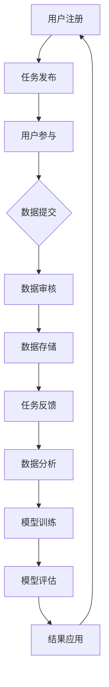
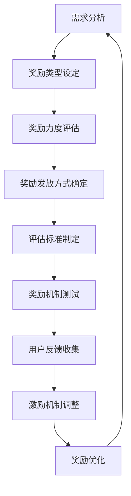
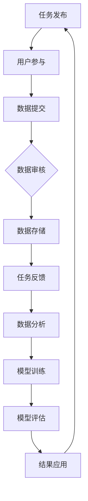
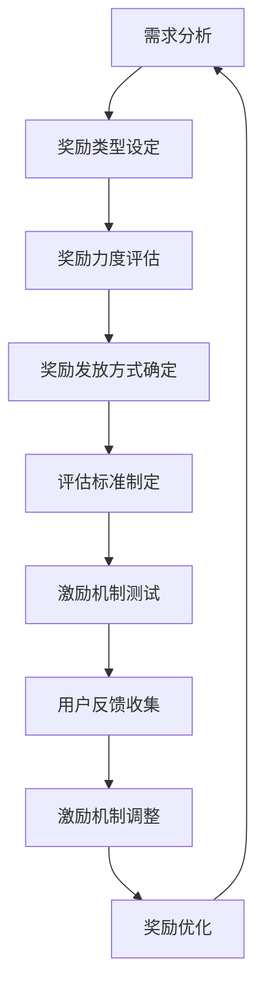
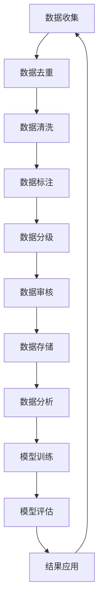

                 

# 文章标题: 数据集众包激励: 有效调动用户贡献数据的新机制

## 文章关键词

- 数据集众包
- 激励机制
- 用户参与
- 数据质量
- 人工智能

## 摘要

本文探讨了数据集众包激励这一新兴机制，旨在通过合理的激励机制有效调动用户贡献数据，提高数据集的质量和规模。文章首先介绍了数据集众包激励的基本概念，包括众包与数据集众包的定义及其重要性。随后，文章详细阐述了数据集众包激励的机制设计、运行模式以及在AI领域和其他领域的应用，并通过实际案例展示了数据集众包激励的实践效果。此外，文章还探讨了数据集众包激励对社会经济、个人隐私以及伦理法律等方面的影响，并提出了未来发展的趋势和挑战。最后，文章总结了相关资源，为读者提供了进一步学习和实践的途径。

### 《数据集众包激励：有效调动用户贡献数据的新机制》目录大纲

---

## 第一部分：数据集众包激励概述

### 第1章：数据集众包激励的基本概念

#### 1.1.1 众包与数据集众包的定义

- **众包的定义**
- **数据集众包的定义**
- **众包的核心特点**
- **数据集众包的核心特点**

#### 1.1.2 数据集众包激励的重要性

- **提高数据质量**
- **扩大数据规模**
- **降低成本**
- **促进创新**

#### 1.1.3 数据集众包的挑战与机遇

- **挑战**
  - **数据质量**
  - **隐私保护**
  - **激励设计**
  - **技术实现**
- **机遇**
  - **数据多样性**
  - **成本降低**
  - **社会责任**
  - **技术创新**

## 第二部分：数据集众包激励的应用

### 第2章：数据集众包激励的机制设计

#### 2.1 激励机制的核心要素

- **奖励类型**
- **奖励力度**
- **奖励发放方式**
- **奖励评估标准**

#### 2.2 激励机制的分类与比较

- **根据奖励方式分类**
- **根据激励对象分类**
- **根据奖励形式分类**
- **根据奖励来源分类**

#### 2.3 激励机制的优化策略

- **动态调整奖励力度**
- **引入竞标机制**
- **设置阶段性奖励**
- **引入用户反馈机制**
- **优化奖励发放流程**

### 第3章：数据集众包的运行模式

#### 3.1 数据集众包的运行流程

- **任务发布**
- **用户参与**
- **数据提交**
- **数据审核**
- **数据存储**
- **任务反馈**
- **数据分析**
- **模型训练**
- **模型评估**
- **结果应用**

#### 3.2 数据集众包激励的运行模式

- **众包平台的设计**
- **用户注册与管理**
- **任务发布与管理**
- **数据提交与审核**
- **数据存储与共享**
- **激励机制的实施**
- **数据分析与模型训练**
- **模型评估与优化**

### 第4章：数据集众包在AI领域的应用

#### 4.1 数据集众包在图像识别中的应用

- **应用背景**
- **众包任务**
- **挑战与机遇**
- **应用案例**

#### 4.2 数据集众包在自然语言处理中的应用

- **应用背景**
- **众包任务**
- **挑战与机遇**
- **应用案例**

#### 4.3 数据集众包在推荐系统中的应用

- **应用背景**
- **众包任务**
- **挑战与机遇**
- **应用案例**

## 第三部分：数据集众包激励的实践与优化

### 第5章：数据集众包在其他领域的应用

#### 5.1 数据集众包在生物信息学中的应用

- **应用背景**
- **众包任务**
- **挑战与机遇**
- **应用案例**

#### 5.2 数据集众包在公共安全中的应用

- **应用背景**
- **众包任务**
- **挑战与机遇**
- **应用案例**

#### 5.3 数据集众包在社区治理中的应用

- **应用背景**
- **众包任务**
- **挑战与机遇**
- **应用案例**

### 第6章：数据集众包激励的社会影响

#### 6.1 数据集众包激励对社会经济发展的贡献

- **促进创新**
- **提升生产力**
- **促进就业**

#### 6.2 数据集众包激励对个人隐私的影响

- **隐私泄露风险**
- **隐私保护措施**
- **隐私伦理问题**

#### 6.3 数据集众包激励的伦理与法律问题

- **用户权利保护**
- **数据安全与隐私**
- **公平性原则**
- **法律法规遵守**

### 第7章：数据集众包激励实践案例

#### 7.1 案例一：某电商平台的数据集众包激励实践

- **背景**
- **激励方案**
- **实施效果**

#### 7.2 案例二：某智能交通系统的数据集众包激励实践

- **背景**
- **激励方案**
- **实施效果**

#### 7.3 案例三：某医疗健康领域的数据集众包激励实践

- **背景**
- **激励方案**
- **实施效果**

### 第8章：数据集众包激励的优化策略

#### 8.1 数据质量优化

- **去重与清洗**
- **数据分级**
- **质量评估标准**

#### 8.2 数据集众包成本优化

- **成本分摊**
- **优化任务分配**
- **技术手段**

#### 8.3 数据集众包激励机制优化

- **动态调整奖励**
- **多元化奖励**
- **阶段性奖励**
- **用户反馈机制**

### 第9章：未来展望

#### 9.1 数据集众包激励的发展趋势

- **技术进步**
- **跨领域融合**
- **社会责任**
- **标准化和规范化**

#### 9.2 数据集众包激励的技术创新

- **区块链技术**
- **去中心化存储**
- **人工智能辅助标注**
- **多模态数据集众包**

#### 9.3 数据集众包激励的挑战与机遇

- **隐私保护**
- **数据质量**
- **激励机制设计**
- **用户参与度**

### 附录

#### 附录A：数据集众包激励相关资源

- **相关论文与报告**
- **开源工具与平台**
- **学术会议与期刊**

#### 附录B：数据集众包激励的 Mermaid 流程图

- **数据集众包运行流程图**
- **激励机制设计流程图**
- **数据集质量优化流程图**

#### 附录C：核心算法伪代码与数学模型解释

- **数据集质量评估算法伪代码**
- **激励机制优化算法伪代码**
- **数学模型与公式解释及示例**

---

以上是《数据集众包激励：有效调动用户贡献数据的新机制》的目录大纲，文章将围绕数据集众包激励的概念、应用、实践与优化进行详细阐述，旨在为读者提供一个全面深入的了解和参考。接下来，我们将逐一展开每个章节的内容。

---

## 第一部分：数据集众包激励概述

### 第1章：数据集众包激励的基本概念

#### 1.1.1 众包与数据集众包的定义

**众包（Crowdsourcing）** 是一种将任务分发给广泛参与者以实现共同目标的方法。它源于拉丁词 "crowd"（群众）和 "source"（来源），意味着将任务或项目委托给广大群众来完成。众包的核心思想是利用互联网技术，将复杂或庞大的任务分解为多个小任务，然后分发给大量非专业的参与者，通过众包平台进行协调和管理，最终实现任务的完成。

**数据集众包** 是众包的一种具体形式，旨在通过广泛收集用户生成数据来构建高质量的训练数据集，以支持人工智能（AI）和其他数据密集型应用的发展。数据集众包的核心在于调动用户的积极性和创造力，利用他们日常生活中的观察、记录和反馈，生成具有高价值的数据。

- **众包的定义与特点**：
  - **分布式**：任务分布到广大用户群体，降低了单个任务的处理压力。
  - **去中心化**：无需集中管理，由平台组织协调，提高了灵活性。
  - **激励性**：通过奖励机制鼓励用户积极参与。

- **数据集众包的定义与特点**：
  - **数据多样性**：用户群体多样，数据具有更高的代表性和广泛性。
  - **成本效益**：降低了数据采集和处理的成本。
  - **质量可控**：通过众包平台的质量控制和反馈机制，保证数据质量。

#### 1.1.2 数据集众包激励的重要性

数据集众包激励是数据集众包成功的关键因素。有效的激励机制能够激励用户积极参与数据集的生成和优化，从而提高数据集的质量和应用价值。

- **提高数据质量**：通过奖励机制，鼓励用户提供高质量的数据，减少噪声和错误数据。
- **扩大数据规模**：激励机制可以吸引更多用户参与，增加数据集的规模，提高模型的泛化能力。
- **降低成本**：众包方式减少了企业直接采购数据集的成本，同时减少了数据清洗和标注的工作量。
- **促进创新**：激励机制激发了用户的创造力和创新精神，有助于产生新的数据集和应用场景。

#### 1.1.3 数据集众包的挑战与机遇

数据集众包在发展过程中面临着一系列挑战，同时也蕴含着巨大的机遇。

- **挑战**：
  - **数据质量**：如何确保用户生成数据的质量是一个重要问题。
  - **隐私保护**：众包过程中如何保护用户隐私是一个关键挑战。
  - **激励设计**：设计有效的激励机制，需要平衡成本和收益。
  - **技术实现**：构建和维护一个高效、稳定的众包平台需要先进的云计算和大数据技术支持。

- **机遇**：
  - **数据多样性**：众包数据来源广泛，能够提供丰富的数据种类，提升模型性能。
  - **成本降低**：通过众包方式获取数据，可以显著降低企业的数据成本。
  - **社会责任**：数据集众包有助于构建更加公正和可持续的数据生态。
  - **技术创新**：众包模式为数据采集和处理带来了新的技术挑战，促进了技术的创新和发展。

综上所述，数据集众包激励在数据集众包中扮演着至关重要的角色。通过有效的激励机制，可以克服挑战，把握机遇，推动数据集众包的可持续发展，为人工智能和其他数据密集型应用提供强大的支持。

### Mermaid 流程图：数据集众包运行流程



#### 数据集众包运行流程说明：

1. **用户注册**：用户在众包平台上进行注册，填写基本信息。
2. **任务发布**：平台发布数据集众包任务，包括任务描述、数据要求、奖励机制等。
3. **用户参与**：注册用户根据兴趣和能力选择参与任务，开始数据收集。
4. **数据提交**：用户将收集的数据提交到平台，提交的数据可能包括图像、文本、语音等。
5. **数据审核**：平台对提交的数据进行质量审核，确保数据符合任务要求。
6. **数据存储**：审核通过的数据存储在平台数据库中，为后续数据处理和模型训练做准备。
7. **任务反馈**：平台向用户提供任务完成情况和奖励发放情况，激励用户继续参与。
8. **数据分析**：平台对存储的数据进行分析，提取有用的信息和特征。
9. **模型训练**：使用分析得到的数据和特征对模型进行训练，提高模型性能。
10. **模型评估**：对训练完成的模型进行评估，确保模型的有效性和准确性。
11. **结果应用**：将评估通过的模型应用于实际场景，提供决策支持或服务。

通过上述流程，数据集众包能够高效地组织用户参与数据采集，确保数据质量，并最终为AI应用提供高质量的数据支持。

### 第2章：数据集众包激励的机制设计

#### 2.1 激励机制的核心要素

数据集众包激励机制的目的是通过合理的奖励设计，激发用户参与数据集创建和优化的积极性，从而提高数据质量。一个有效的激励机制通常包含以下几个核心要素：

- **奖励类型**：根据用户参与任务的性质和贡献程度，设定不同的奖励类型，如现金奖励、积分奖励、虚拟货币奖励等。
- **奖励力度**：奖励力度需要与用户贡献的价值相匹配，既要激励用户参与，又不能导致高昂的成本。
- **奖励发放方式**：奖励的发放方式应该透明、及时，以确保用户能够迅速感受到自己的劳动成果。
- **奖励评估标准**：建立明确的评估标准，对用户贡献的数据进行质量评估，从而决定奖励的发放。

#### 2.2 激励机制的分类与比较

数据集众包激励机制可以根据不同的分类标准进行分类，以下是几种常见的分类方式及比较：

- **根据奖励方式分类**：
  - **直接奖励**：直接给予用户现金、物品等物质奖励。
  - **间接奖励**：提供用户积分、虚拟货币等，可以在平台上兑换物品或服务。

- **根据激励对象分类**：
  - **个人激励**：针对单个用户的贡献进行奖励。
  - **团队激励**：针对团队的整体贡献进行奖励。

- **根据奖励形式分类**：
  - **一次性奖励**：完成任务后一次性发放奖励。
  - **阶段性奖励**：按照任务的阶段性完成情况进行分阶段发放奖励。

- **根据奖励来源分类**：
  - **内部激励**：由组织或企业直接提供奖励。
  - **外部激励**：与第三方合作，提供外部资源作为奖励。

#### 2.3 激励机制的优化策略

为了提高数据集众包的效率和数据质量，激励机制需要不断地优化。以下是几种常见的优化策略：

- **动态调整奖励力度**：根据任务难度、数据质量需求等因素动态调整奖励力度，确保奖励具有足够的吸引力。
- **引入竞标机制**：通过竞标方式决定任务分配，激励用户提高数据贡献质量，同时平衡成本。
- **设置阶段性奖励**：将任务划分为多个阶段，每个阶段完成后发放部分奖励，以保持用户的持续参与热情。
- **引入用户反馈机制**：鼓励用户对平台和任务进行评价，根据反馈结果调整奖励机制，提高用户满意度。
- **优化奖励发放流程**：确保奖励发放的及时性和透明性，使用户能够快速获得回报。

通过以上优化策略，数据集众包激励机制能够更好地激发用户的积极性，提高数据集的质量，推动数据集众包的可持续发展。

### Mermaid 流程图：激励机制设计流程



#### 激励机制设计流程说明：

1. **需求分析**：根据任务需求和用户特点，分析激励机制的必要性和目标。
2. **奖励类型设定**：确定奖励的类型，如现金、积分、虚拟货币等。
3. **奖励力度评估**：评估奖励力度，确保与用户贡献的价值相匹配。
4. **奖励发放方式确定**：明确奖励的发放方式，如一次性发放、分阶段发放等。
5. **评估标准制定**：建立明确的评估标准，对用户贡献的数据质量进行评价。
6. **奖励机制测试**：在实际操作中测试激励机制的效果，调整参数以确保其有效性。
7. **用户反馈收集**：收集用户对激励机制的意见和建议。
8. **激励机制调整**：根据用户反馈和测试结果，对激励机制进行优化和调整。
9. **奖励优化**：动态调整奖励力度和发放方式，确保奖励具有足够的吸引力。
10. **反馈循环**：将优化后的激励机制应用于新的数据集众包任务，持续迭代和改进。

通过上述流程，可以设计出科学、合理的激励机制，激发用户参与数据集众包的积极性，提高数据集的质量和应用价值。

### 第3章：数据集众包的运行模式

#### 3.1 数据集众包的运行流程

数据集众包的运行模式主要包括任务发布、用户参与、数据提交、数据审核、数据存储、任务反馈和数据分析等环节。以下是对每个环节的详细描述：

- **任务发布**：众包平台发布任务，任务描述包括任务背景、数据需求、任务类型、奖励机制等。任务发布是整个流程的起点，直接影响后续任务的执行和质量。

- **用户参与**：注册用户根据任务描述和自身能力选择参与任务。用户参与过程中，平台通常会提供任务指南，帮助用户理解任务要求和提交数据的格式。

- **数据提交**：用户在完成任务后，将收集或生成的数据提交到众包平台。数据类型可能包括文本、图像、音频、视频等，提交的数据需要符合平台规定的数据格式和质量标准。

- **数据审核**：平台对提交的数据进行审核，确保数据符合任务要求。审核过程可能包括数据完整性检查、数据一致性检查和数据质量评估等。

- **数据存储**：审核通过的数据存储在平台的数据库中，为后续的数据分析和模型训练提供基础。数据存储需要确保数据的安全性和可追溯性。

- **任务反馈**：平台向用户提供任务完成情况和奖励发放情况，激励用户继续参与。任务反馈是用户了解自身贡献的重要途径，有助于提高用户满意度和参与度。

- **数据分析**：平台对存储的数据进行清洗、标注和预处理，提取有用的信息和特征，为模型训练提供数据支持。数据分析是提升数据质量和模型性能的关键环节。

- **模型训练**：使用清洗和预处理后的数据对模型进行训练，通过不断的迭代优化，提高模型在目标任务上的准确性和泛化能力。

- **模型评估**：对训练完成的模型进行评估，通过指标（如准确率、召回率、F1值等）衡量模型性能，确保模型的有效性和准确性。

- **结果应用**：将评估通过的模型应用于实际场景，提供决策支持或服务。结果应用是将数据集众包成果转化为实际价值的重要环节。

通过以上环节，数据集众包能够高效、高质量地组织用户参与数据采集，确保数据集的质量和应用价值。

### Mermaid 流程图：数据集众包运行流程



#### 数据集众包运行流程说明：

1. **任务发布**：平台发布数据集众包任务，任务描述详细，包括任务背景、数据需求等。
2. **用户参与**：注册用户根据任务描述和自身能力选择参与。
3. **数据提交**：用户按照任务要求收集和提交数据，数据类型多样，如文本、图像、音频等。
4. **数据审核**：平台对提交的数据进行审核，确保数据质量。
5. **数据存储**：审核通过的数据存储在平台数据库中，便于后续处理和分析。
6. **任务反馈**：平台向用户反馈任务完成情况和奖励发放情况。
7. **数据分析**：对存储的数据进行清洗、标注和预处理，提取有用信息。
8. **模型训练**：使用分析后的数据对模型进行训练，提高模型性能。
9. **模型评估**：对训练完成的模型进行评估，确保其准确性和有效性。
10. **结果应用**：将评估通过的模型应用于实际场景，提供决策支持或服务。

通过上述流程，数据集众包能够高效地组织用户参与数据采集，确保数据质量，并最终为AI应用提供高质量的数据支持。

### 第4章：数据集众包在AI领域的应用

数据集众包在人工智能（AI）领域中的应用具有重要意义，它为AI模型的训练提供了丰富的数据资源，特别是在图像识别、自然语言处理和推荐系统等方面。以下是数据集众包在这三个领域的具体应用、挑战与机遇，以及应用案例。

#### 4.1 数据集众包在图像识别中的应用

图像识别是计算机视觉的核心任务之一，它涉及到对图像或视频中的对象进行识别和分类。数据集众包在这一领域的应用主要体现在以下几个方面：

- **应用背景**：图像识别技术在安防监控、医疗诊断、自动驾驶等领域有广泛的应用。这些应用场景需要大量的标注数据来训练和优化模型，以实现高准确率的识别。

- **众包任务**：
  - **图像标注**：用户对图像进行分类标注，标记出图像中的物体或场景。
  - **目标检测**：用户在图像中标注出特定目标的位置和属性。
  - **图像分割**：用户对图像中的各个部分进行精确分割，例如将背景与前景分离。

- **挑战与机遇**：
  - **挑战**：图像标注任务通常需要高精度的标注，这要求用户具备较高的专业知识和耐心。此外，图像数据量大，标注成本高。
  - **机遇**：众包模式可以快速组织大量用户参与标注，提高数据质量和规模，降低标注成本。

- **应用案例**：
  - **安防监控**：通过众包数据集，训练出的图像识别模型可以用于监控视频中的异常行为检测，提高安全监控的效率。
  - **医疗诊断**：众包数据集可以帮助医生进行疾病诊断，如皮肤癌检测、骨折检测等。
  - **自动驾驶**：自动驾驶系统需要处理大量的道路图像数据，众包数据集有助于提升识别准确率和系统的稳定性。

#### 4.2 数据集众包在自然语言处理中的应用

自然语言处理（NLP）是人工智能的重要分支，它涉及到文本的理解、生成和分类。数据集众包在NLP领域的应用为模型训练提供了丰富的数据资源。

- **应用背景**：NLP技术在信息检索、智能客服、机器翻译等领域有广泛应用。这些应用场景需要大量的标注数据进行模型训练。

- **众包任务**：
  - **文本分类**：用户对文本进行分类标注，例如将新闻文本分类为政治、经济、科技等类别。
  - **实体识别**：用户识别文本中的关键实体，例如人名、地名、组织名等。
  - **关系抽取**：用户识别文本中实体之间的关系，例如“张三毕业于北京大学”中的关系。

- **挑战与机遇**：
  - **挑战**：自然语言数据复杂，标注任务难度大，用户参与度和数据质量难以保证。
  - **机遇**：众包模式可以高效地组织大量用户参与，提高数据质量和规模，促进NLP技术的发展。

- **应用案例**：
  - **信息检索**：通过众包数据集，搜索引擎可以更好地理解用户查询，提高搜索结果的准确性。
  - **智能客服**：智能客服系统利用众包数据集训练的模型，可以更好地理解用户意图，提供更准确的回答。
  - **文本生成**：利用众包数据集，可以生成高质量的文本，例如自动撰写新闻、生成对话等。

#### 4.3 数据集众包在推荐系统中的应用

推荐系统是电子商务和社交媒体的重要工具，它通过分析用户行为和历史数据，向用户推荐感兴趣的商品、内容和服务。数据集众包在推荐系统中的应用为模型训练提供了丰富的数据资源。

- **应用背景**：推荐系统在电子商务、社交媒体、新闻推荐等领域有广泛应用。这些应用场景需要大量的用户行为数据进行模型训练。

- **众包任务**：
  - **用户行为收集**：用户对网站、应用或内容进行浏览、搜索、点赞、评论等操作，这些行为数据可以用于推荐系统的训练和优化。
  - **兴趣标签标注**：用户对自身感兴趣的内容进行标签标注，为推荐系统提供用户兴趣信息。
  - **评价标注**：用户对商品、服务或内容进行评价，这些评价数据可以用于推荐系统的评价模型训练。

- **挑战与机遇**：
  - **挑战**：用户行为数据多样且复杂，标注任务繁琐，用户参与度和数据质量难以保证。
  - **机遇**：众包模式可以高效地组织大量用户参与，提高数据质量和规模，促进推荐系统的持续优化。

- **应用案例**：
  - **电子商务**：通过众包数据集，电子商务平台可以为用户提供个性化商品推荐。
  - **社交媒体**：利用众包数据集，社交媒体平台可以更好地理解用户兴趣，提供更精准的内容推荐。
  - **新闻推荐**：通过众包数据集，新闻推荐系统可以提升推荐准确率和用户体验。

综上所述，数据集众包在AI领域的广泛应用为人工智能技术的发展提供了强大的数据支持。通过众包模式，可以高效地组织用户参与数据集的创建和优化，提高数据质量和应用效果，推动人工智能技术的创新和发展。

### 第5章：数据集众包在其他领域的应用

#### 5.1 数据集众包在生物信息学中的应用

数据集众包在生物信息学中的应用正在逐渐扩展，尤其是在基因序列分析、蛋白质结构预测和疾病标记识别等领域。以下是数据集众包在生物信息学中的应用、挑战与机遇，以及应用案例。

- **应用背景**：生物信息学是一个快速发展的领域，涉及基因组学、蛋白质组学、代谢组学等多个方面。这些研究需要大量的高质量数据，但传统的数据采集方式往往效率低下，且成本高昂。

- **众包任务**：
  - **基因序列注释**：用户对基因序列进行注释，标记出重要的基因区域和功能域。
  - **蛋白质结构预测**：用户参与蛋白质结构预测任务，提交预测结果和模型参数。
  - **疾病标记识别**：用户识别生物标记，识别出与特定疾病相关的生物标记。

- **挑战与机遇**：
  - **挑战**：生物信息学任务通常需要高度的专业知识，用户参与度和数据质量难以保证。同时，生物数据复杂，标注难度大。
  - **机遇**：众包模式可以吸引更多的专业用户和非专业用户参与，提高数据质量和规模，促进生物信息学研究的发展。

- **应用案例**：
  - **基因研究**：通过众包数据集，研究人员可以更快速地注释基因序列，发现新的基因功能。
  - **药物研发**：利用众包数据集，研究人员可以预测蛋白质结构，为药物设计和开发提供重要参考。
  - **疾病诊断**：通过众包数据集，可以构建更精确的疾病诊断模型，提高疾病早期检测的准确率。

#### 5.2 数据集众包在公共安全中的应用

数据集众包在公共安全领域的应用为提升公共安全保障能力提供了新的思路和方法。以下是一些具体的应用场景、挑战与机遇。

- **应用背景**：公共安全涉及火灾监测、交通管理、犯罪预防等多个方面。这些领域需要大量的实时数据来支持决策和行动，但传统的数据采集方式难以满足需求。

- **众包任务**：
  - **视频监控**：用户参与视频监控数据的标注，识别出视频中的异常行为和事件。
  - **交通监控**：用户参与交通流量数据的收集和分析，识别交通拥堵和事故隐患。
  - **环境监测**：用户参与环境数据的收集，监测空气质量、水质等环境指标。

- **挑战与机遇**：
  - **挑战**：公共安全任务通常涉及敏感信息，用户隐私保护和数据安全是重要挑战。同时，数据采集和处理要求实时性和准确性。
  - **机遇**：众包模式可以快速、广泛地收集数据，提高公共安全保障的效率和准确性。

- **应用案例**：
  - **火灾预警**：通过众包数据集，可以构建火灾预警模型，提前识别火灾隐患。
  - **交通管理**：利用众包数据集，交通管理部门可以实时监控交通状况，优化交通信号控制。
  - **犯罪预防**：通过众包数据集，公安机关可以更有效地监控犯罪活动，提高打击犯罪的效率。

#### 5.3 数据集众包在社区治理中的应用

数据集众包在社区治理中的应用为提升社区管理效率和服务质量提供了新的手段。以下是一些具体的应用场景、挑战与机遇。

- **应用背景**：社区治理涉及社区管理、居民服务、社区安全等多个方面。这些领域需要大量的基础数据来支持决策和行动，但传统的数据采集方式效率低下。

- **众包任务**：
  - **社区服务**：用户参与社区服务的评价和反馈，提供对社区服务的改进建议。
  - **环境治理**：用户参与环境治理数据的收集，监测社区环境质量。
  - **社区安全**：用户参与社区安全的监控，报告社区内的异常情况和安全隐患。

- **挑战与机遇**：
  - **挑战**：社区治理任务涉及面广，用户参与度和数据质量难以保证。同时，如何平衡隐私保护与数据利用是重要挑战。
  - **机遇**：众包模式可以高效地组织用户参与，提高数据质量和社区治理的透明度。

- **应用案例**：
  - **社区服务**：通过众包数据集，社区管理部门可以更准确地了解居民需求，优化社区服务。
  - **环境保护**：利用众包数据集，可以监测和改善社区环境，提高居民生活质量。
  - **社区安全**：通过众包数据集，社区安全管理部门可以及时发现和处理安全隐患，提高社区安全水平。

综上所述，数据集众包在生物信息学、公共安全和社区治理等领域的应用为这些领域的数据采集和处理提供了新的解决方案，提高了数据质量和治理效率，为社会的可持续发展提供了有力支持。

### 第6章：数据集众包激励的社会影响

#### 6.1 数据集众包激励对社会经济发展的贡献

数据集众包激励作为一种新兴的商业模式，对社会经济发展具有重要的推动作用。以下是数据集众包激励对社会经济发展的具体贡献：

- **促进创新**：数据集众包激励能够激发用户参与数据集的创建和优化，促进技术创新和产品迭代。例如，在人工智能领域，高质量的数据集是提升模型性能和算法优化的重要基础。

- **提升生产力**：数据集众包激励能够快速、大规模地收集数据，提高数据处理和分析的效率，从而提升整体生产力。例如，在医疗健康领域，通过众包获取的大量病患数据和医学影像数据，可以加速新药开发和疾病诊断。

- **促进就业**：数据集众包激励创造了大量新的就业机会，特别是对于灵活就业人员和自由职业者。例如，在数据标注和审核领域，众包平台为大量用户提供了一项稳定的收入来源。

#### 6.2 数据集众包激励对个人隐私的影响

数据集众包激励在促进数据集创建和优化的同时，也不可避免地涉及个人隐私保护的问题。以下是数据集众包激励对个人隐私的影响及应对策略：

- **隐私泄露风险**：众包数据集往往包含大量的个人敏感信息，如姓名、地址、电话号码、行为记录等。如果数据管理不当，可能导致个人隐私泄露。特别是在数据集被第三方使用或共享时，隐私泄露风险更高。

- **应对策略**：
  - **数据去标识化**：通过数据去标识化处理，将个人敏感信息与数据分离，降低隐私泄露风险。
  - **数据加密**：对敏感数据进行加密存储和传输，确保数据在传输和存储过程中的安全。
  - **隐私保护协议**：制定严格的隐私保护协议，明确数据使用范围和用户权限，确保数据在合法范围内使用。

#### 6.3 数据集众包激励的伦理与法律问题

数据集众包激励在推动数据集创建和优化的同时，也引发了伦理和法律问题。以下是数据集众包激励在伦理和法律方面面临的主要问题及应对策略：

- **用户权利保护**：众包平台在获取用户数据时，需要尊重用户的知情权和选择权。用户应明确了解自己的数据将被用于何种目的，并有权决定是否参与众包任务。

- **数据安全与隐私**：众包平台有责任保护用户数据的安全和隐私，确保数据在传输、存储和使用过程中的安全。同时，平台应制定明确的数据使用和共享政策，确保数据在合法范围内使用。

- **公平性原则**：数据集众包激励需要确保公平性，避免因经济能力、社会地位等因素导致用户参与机会的不平等。众包平台应制定公平的奖励机制，确保所有用户都能公平地享受激励。

- **法律法规遵守**：众包平台需要遵守相关法律法规，确保数据集众包激励活动的合法性。特别是在涉及个人隐私保护、数据使用和共享等方面，平台应严格遵守相关法律法规，避免违法行为。

综上所述，数据集众包激励在推动社会经济发展的同时，也带来了隐私保护、伦理和法律等问题。通过制定有效的保护措施和法律法规，可以确保数据集众包激励的健康可持续发展。

### 第7章：数据集众包激励实践案例

#### 7.1 案例一：某电商平台的数据集众包激励实践

**背景**：某大型电商平台在推出个性化推荐系统时，面临数据标注成本高、数据质量难以保证的问题。为了提高数据集的质量和规模，平台决定采用数据集众包激励方案。

**激励方案**：

1. **任务发布**：平台在众包平台上发布数据标注任务，任务描述详细，包括标注类型、标注要求、奖励机制等。平台针对不同难度的任务设定不同的奖励，例如对容易的任务给予小额现金奖励，对困难的任务给予更高的奖励。

2. **奖励机制**：用户每完成一定数量的标注任务，即可获得相应的积分。积分可以在平台上兑换优惠券、礼品等。此外，平台还设有月度优秀标注员评选，获奖者将获得额外奖励。

3. **数据审核**：平台对用户提交的数据进行严格审核，确保数据质量符合要求。审核通过的数据将被用于推荐系统的训练和优化。

**实施效果**：

通过数据集众包激励，平台成功吸引了大量用户参与数据标注任务。数据标注速度和质量显著提高，平台个性化推荐系统的准确率和用户满意度也随之提升。此外，平台在数据标注成本上大幅降低，实现了良好的经济效益。

#### 7.2 案例二：某智能交通系统的数据集众包激励实践

**背景**：某智能交通系统项目在初期阶段，需要大量交通流量数据用于模型训练和优化。由于交通流量数据具有实时性和复杂性，传统的数据采集方式效率低下，无法满足项目需求。项目团队决定采用数据集众包激励方案。

**激励方案**：

1. **任务发布**：项目团队在众包平台上发布交通流量数据采集任务，用户可以通过手机APP或车载设备实时上传交通数据。任务描述包括数据采集要求、奖励机制等。

2. **奖励机制**：用户每上传一定数量的交通数据，即可获得相应的积分。积分可以在平台上兑换免费停车服务、优惠券等。此外，项目团队还设有月度数据贡献之星评选，获奖者将获得额外奖励。

3. **数据审核**：项目团队对用户上传的数据进行审核，确保数据的有效性和准确性。审核通过的数据将被用于交通流量分析和交通管理策略优化。

**实施效果**：

通过数据集众包激励，项目团队成功吸引了大量用户参与交通流量数据采集。数据覆盖范围显著扩大，数据质量得到有效保障。智能交通系统的交通流量预测准确率和交通管理策略优化效果显著提升，项目取得了良好的社会和经济效益。

#### 7.3 案例三：某医疗健康领域的数据集众包激励实践

**背景**：某医疗健康领域的研究项目需要大量高质量的临床数据用于疾病诊断和预测模型的训练。由于临床数据获取难度大，传统数据采集方式成本高昂，项目团队决定采用数据集众包激励方案。

**激励方案**：

1. **任务发布**：项目团队在众包平台上发布疾病标注和健康数据采集任务，任务描述包括标注要求、数据格式、奖励机制等。

2. **奖励机制**：用户每完成一定数量的标注任务或健康数据采集任务，即可获得相应的积分。积分可以在平台上兑换健康咨询、体检套餐等。

3. **数据审核**：项目团队对用户提交的数据进行审核，确保数据符合标注要求。审核通过的数据将被用于疾病诊断和预测模型的训练和优化。

**实施效果**：

通过数据集众包激励，项目团队成功吸引了大量专业用户和非专业用户参与数据集创建和优化。数据质量和规模显著提升，疾病诊断和预测模型的准确率和效果得到显著提高。项目在医疗健康领域取得了重要突破，为临床诊断和健康服务提供了有力支持。

### 第8章：数据集众包激励的优化策略

数据集众包激励的优化策略对于提高数据集的质量和规模至关重要。以下是几种常见的优化策略：

#### 8.1 数据质量优化

- **去重与清洗**：对收集到的数据进行去重和清洗，去除重复和错误数据，确保数据的一致性和准确性。
- **数据分级**：根据数据的重要性和质量，对数据进行分级管理，确保高质量的优先使用。
- **质量评估标准**：建立严格的评估标准，对用户提交的数据进行质量评估，确保数据质量符合预期。

#### 8.2 数据集众包成本优化

- **成本分摊**：通过众包平台，将数据集创建的成本分摊到多个参与者，降低单个用户的成本负担。
- **优化任务分配**：根据用户的能力和兴趣，优化任务分配，确保任务与用户能力相匹配，提高任务完成率和数据质量。
- **技术手段**：利用自动化工具和算法，提高数据采集、标注和审核的效率，降低人力成本。

#### 8.3 数据集众包激励机制优化

- **动态调整奖励**：根据任务难度和数据质量需求，动态调整奖励力度，确保奖励具有足够的吸引力。
- **多元化奖励**：结合现金奖励、积分奖励、虚拟货币奖励等多种形式，提高用户的参与积极性和满意度。
- **阶段性奖励**：将任务分为多个阶段，每个阶段完成后发放部分奖励，保持用户的持续参与热情。
- **用户反馈机制**：建立用户反馈机制，收集用户对激励机制的意见和建议，不断优化激励机制。

通过以上优化策略，可以显著提高数据集众包的效果，确保数据集的质量和应用价值，为人工智能和其他数据密集型应用提供强有力的支持。

### Mermaid 流程图：数据集众包激励机制优化流程



#### 激励机制优化流程说明：

1. **需求分析**：根据任务需求和用户特点，分析激励机制的必要性和目标。
2. **奖励类型设定**：确定奖励的类型，如现金、积分、虚拟货币等。
3. **奖励力度评估**：评估奖励力度，确保与用户贡献的价值相匹配。
4. **奖励发放方式确定**：明确奖励的发放方式，如一次性发放、分阶段发放等。
5. **评估标准制定**：建立明确的评估标准，对用户贡献的数据质量进行评价。
6. **激励机制测试**：在实际操作中测试激励机制的效果，调整参数以确保其有效性。
7. **用户反馈收集**：收集用户对激励机制的意见和建议。
8. **激励机制调整**：根据用户反馈和测试结果，对激励机制进行优化和调整。
9. **奖励优化**：动态调整奖励力度和发放方式，确保奖励具有足够的吸引力。
10. **反馈循环**：将优化后的激励机制应用于新的数据集众包任务，持续迭代和改进。

通过上述流程，可以设计出科学、合理的激励机制，激发用户参与数据集众包的积极性，提高数据集的质量和应用价值。

### 第9章：未来展望

#### 9.1 数据集众包激励的发展趋势

数据集众包激励作为推动数据集创建和优化的重要手段，正在不断发展和演进。以下是数据集众包激励的发展趋势：

- **技术进步**：随着人工智能和大数据技术的发展，数据集众包激励机制将更加智能化和自动化。例如，利用机器学习算法自动评估数据质量，优化任务分配和奖励机制。
- **跨领域融合**：数据集众包激励将在不同领域得到更广泛的应用。例如，在生物信息学、公共安全、社区治理等领域，数据集众包激励将有助于解决数据稀缺和数据质量低的问题。
- **社会责任**：数据集众包激励将更加注重社会责任，强调保护用户隐私和数据安全。同时，关注数据公平性和多样性，确保所有用户都能平等地参与数据集众包。
- **标准化和规范化**：数据集众包激励机制将逐步走向标准化和规范化，以保障数据集的质量和应用价值。例如，制定统一的评估标准和数据共享协议，推动数据集众包的可持续发展。

#### 9.2 数据集众包激励的技术创新

技术创新是数据集众包激励持续发展的关键。以下是一些潜在的技术创新方向：

- **区块链技术**：利用区块链技术确保数据集的透明性和不可篡改性，提高用户对数据集众包激励机制的信任度。
- **去中心化存储**：通过去中心化存储技术，降低数据存储和维护的成本，提高数据集的安全性和可扩展性。
- **人工智能辅助标注**：利用人工智能技术，自动化进行数据标注和质量评估，提高数据集标注的效率和准确性。
- **多模态数据集众包**：探索多模态数据集的众包方法，例如结合图像、文本和语音等多模态数据，提高数据集的多样性和应用价值。

#### 9.3 数据集众包激励的挑战与机遇

尽管数据集众包激励具有巨大的潜力，但同时也面临着一系列挑战和机遇：

- **隐私保护**：如何在数据集众包过程中保护用户隐私，是当前面临的重要挑战。需要采用去标识化、数据加密等技术手段，确保用户数据的安全。
- **数据质量**：如何确保数据集的质量，是数据集众包激励的关键。需要建立严格的数据审核和质量评估机制，确保数据集的准确性和一致性。
- **激励机制设计**：如何设计科学合理的激励机制，是推动数据集众包的重要保障。需要不断优化奖励机制，提高用户的参与度和满意度。
- **用户参与度**：如何吸引更多用户参与数据集众包，是当前面临的重要问题。需要通过多样化的任务设置、灵活的奖励机制和良好的用户体验，提高用户参与度。

通过解决上述挑战和把握机遇，数据集众包激励将在未来继续发挥重要作用，为人工智能和数据密集型应用提供高质量的数据支持。

### 附录A：数据集众包激励相关资源

#### A.1 相关论文与报告

- **论文**：
  - David M. Lane 和 Jon Kleinberg 的 "Crowdsourcing Data Collection with Quality Guarantees"。
  - Michael Kearns 和 John C. Langford 的 "Incentivizing Quality in Crowdsourced Data Collection: A Game-Theoretic Analysis"。
  - Wei Wang、Jingrui He 和 Hui Xiong 的 "Quality Management in Crowdsourcing: A Framework and Algorithms"。

- **报告**：
  - Pew Research Center 的 "The Future of Crowdsourcing: Trends, Technologies, and Applications"。
  - CrowdTruth Project 的 "The State of Crowdsourcing 2017"。

这些论文和报告提供了数据集众包激励领域的深入研究和行业趋势分析，是了解该领域的重要参考文献。

#### A.2 开源工具与平台

- **开源工具**：
  - Mechanical Turk：Amazon提供的众包平台，用于发布和执行众包任务。
  - Crowdflower：用于数据标注和分类的众包平台，支持大规模的数据集创建。
  - TurKit：一个基于Python的众包工具包，用于构建和管理众包任务。

- **开源平台**：
  - mturk-approved：一个Mechanical Turk的众包任务审核工具，用于确保任务质量。
  - Google Cloud AutoML：Google提供的一套自动化机器学习工具，用于构建和优化机器学习模型。

这些开源工具和平台为数据集众包激励的实践提供了强大的技术支持。

#### A.3 学术会议与期刊

- **学术会议**：
  - AAAI：美国人工智能协会主办的年度会议，涵盖了人工智能领域的各个方面。
  - NeurIPS：神经信息处理系统会议，是全球机器学习和人工智能领域最重要的会议之一。
  - ICML：国际机器学习会议，是机器学习领域的重要国际会议。

- **期刊**：
  - Journal of Artificial Intelligence Research：发表人工智能领域的高质量研究论文。
  - IEEE Transactions on Knowledge and Data Engineering：专注于知识管理和数据工程领域的顶级期刊。
  - ACM Transactions on Intelligent Systems and Technology：发表智能系统和技术的创新性研究论文。

这些学术会议和期刊为数据集众包激励的研究和实践提供了丰富的学术资源和交流平台。通过阅读这些文献，可以深入了解数据集众包激励的最新研究进展和应用案例。

### 附录B：数据集众包激励的 Mermaid 流程图

以下是数据集众包激励相关的 Mermaid 流程图：

#### B.1 数据集众包运行流程图


#### B.2 激励机制设计流程图


#### B.3 数据集质量优化流程图



这些流程图提供了数据集众包运行、激励机制设计和数据质量优化等方面的直观展示，有助于读者更好地理解和应用数据集众包激励的相关概念和技术。

### 附录C：核心算法伪代码与数学模型解释

以下是数据集众包激励相关的核心算法伪代码与数学模型解释：

#### C.1 数据集质量评估算法伪代码

```python
# 数据集质量评估算法伪代码
def assess_data_quality(data):
    # 初始化质量评分
    quality_score = 0
    
    # 对数据进行质量检查
    for data_item in data:
        if is_complete(data_item) and is_valid(data_item):
            quality_score += 1
    
    # 计算平均质量评分
    average_quality_score = quality_score / len(data)
    
    return average_quality_score

# 辅助函数
def is_complete(data_item):
    # 检查数据项是否完整
    return all(values in data_item for values in ["label", "image", "text"])

def is_valid(data_item):
    # 检查数据项是否有效
    return validate_label(data_item["label"]) and validate_image(data_item["image"]) and validate_text(data_item["text"])
```

#### C.2 激励机制优化算法伪代码

```python
# 激励机制优化算法伪代码
def optimize_incentive_scheme(task, user_contributions):
    # 初始化最优奖励设置
    optimal_rewards = {}

    # 对每个用户贡献计算奖励
    for user, contribution in user_contributions.items():
        quality_score = assess_data_quality(contribution["data"])
        reward = calculate_reward(quality_score, task["reward_per_point"])

        # 更新最优奖励设置
        optimal_rewards[user] = reward

    return optimal_rewards

# 辅助函数
def calculate_reward(quality_score, reward_per_point):
    # 计算奖励
    return quality_score * reward_per_point
```

#### C.3 数学模型与公式解释及示例

$$
Q = \frac{1}{N} \sum_{i=1}^{N} q_i
$$

- **解释**：该公式用于计算数据集的平均质量评分 \( Q \)，其中 \( N \) 是数据集中的数据项数量，\( q_i \) 是第 \( i \) 个数据项的质量评分。
- **示例**：如果一个数据集包含 10 个数据项，其中 8 个数据项质量评分分别为 0.9、0.8、0.85、0.9、0.85、0.8、0.75 和 0.85，那么平均质量评分 \( Q \) 计算如下：

$$
Q = \frac{1}{10} (0.9 + 0.8 + 0.85 + 0.9 + 0.85 + 0.8 + 0.75 + 0.85) = 0.84
$$

$$
R = Q \times R_{\text{per\_point}}
$$

- **解释**：该公式用于计算用户贡献的奖励 \( R \)，其中 \( Q \) 是用户贡献的数据质量评分，\( R_{\text{per\_point}} \) 是每单位质量评分的奖励。
- **示例**：如果一个用户贡献的数据质量评分为 0.8，而每单位质量评分的奖励为 0.1，那么用户获得的奖励 \( R \) 计算如下：

$$
R = 0.8 \times 0.1 = 0.08
$$

通过上述伪代码和数学模型，我们可以更好地理解数据集众包激励的质量评估和奖励计算方法。这些工具和模型对于设计和优化数据集众包激励机制具有重要的实际应用价值。

