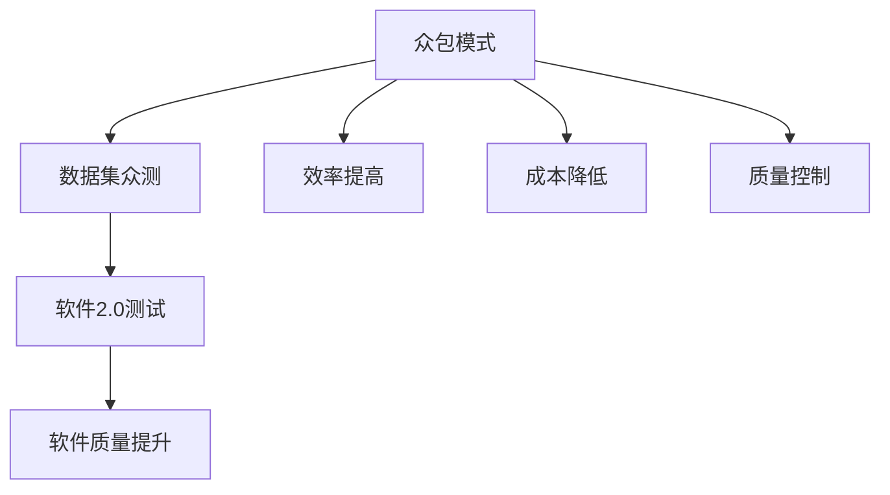

                 

# 《数据集众测：众包模式重塑软件2.0测试》

## 关键词：众包模式，数据集众测，软件测试，质量提升，效率优化，成本控制

## 摘要

本文旨在探讨众包模式在数据集众测中的应用，以及其对软件测试2.0的重塑作用。通过详细分析众包模式的定义、优势和应用场景，本文揭示了数据集众测的优势和挑战，并提出了一系列优化策略。同时，通过实际案例研究，本文展示了数据集众测在电子商务平台、移动应用和智能语音助手等领域的应用效果，为读者提供了实用的参考。

## 第一部分：众包模式与数据集众测

### 第1章：众包模式概述

#### 1.1 众包模式的定义与历史

**1.1.1 众包模式的定义**

众包（Crowdsourcing）是指通过互联网和社交媒体平台，将一个任务或问题发布给广大网民，利用他们的智慧和力量来完成该任务或解决问题的过程。众包模式的核心在于将任务分解为小的、可管理的子任务，并通过激励机制吸引网民参与完成。

**1.1.2 众包模式的演进**

众包模式的起源可以追溯到20世纪末，最初的应用领域主要集中在设计和创意方面。随着互联网和移动设备的普及，众包模式逐渐拓展到更多领域，如软件开发、数据标注、用户反馈等。近年来，众包模式在人工智能和大数据领域得到了广泛应用，成为数据集生成和标注的重要手段。

**1.1.3 众包模式的优势**

众包模式具有以下优势：
1. **成本效益**：通过利用免费的人力资源，降低了任务完成成本。
2. **速度**：众包任务可以在短时间内获得大量结果，提高了工作效率。
3. **质量**：广泛参与的网民可以从不同角度和层面提供反馈，提高了结果的多样性和准确性。
4. **创新性**：众包模式鼓励网民发挥创意，为任务提供新颖的解决方案。

#### 1.2 众包模式在软件测试中的应用

**1.2.1 传统软件测试的挑战**

传统软件测试面临以下挑战：
1. **成本**：软件测试通常需要投入大量的人力、时间和资源。
2. **效率**：传统测试方法往往无法在短时间内完成大量测试任务。
3. **质量**：由于测试资源的限制，测试覆盖率可能无法达到预期，导致潜在缺陷的遗漏。

**1.2.2 众包模式在软件测试中的价值**

众包模式在软件测试中的应用具有以下价值：
1. **扩展测试覆盖率**：通过众包，可以获得来自不同背景的测试者，提高测试的全面性和准确性。
2. **提高测试效率**：众包模式可以快速收集大量测试结果，缩短测试周期。
3. **降低测试成本**：众包模式利用免费的人力资源，减少了测试成本。

**1.2.3 数据集众测的概念**

数据集众测（Dataset Crowdsourcing）是指利用众包模式，将数据标注、清洗和整理等任务发布给网民，通过他们的协作完成数据集的生成和优化。数据集众测在机器学习和人工智能领域具有重要作用，为模型的训练和评估提供了高质量的数据支持。

### 1.3 数据集众测的优势与挑战

**1.3.1 数据集众测的优势**

数据集众测具有以下优势：
1. **成本效益**：众包模式降低了数据集生成和标注的成本，为小型团队和初创公司提供了更多的机会。
2. **速度**：通过众包，可以在短时间内完成大规模的数据标注任务。
3. **质量**：众包模式吸引了来自不同领域的参与者，提供了多样化的观点和意见。
4. **数据多样性**：众包模式可以收集到更广泛的数据集，提高模型的泛化能力。

**1.3.2 数据集众测的挑战**

数据集众测面临以下挑战：
1. **数据质量**：众包数据可能存在不一致、不准确或错误的问题。
2. **参与者的质量控制**：如何确保参与者的质量和数据标注的准确性是一个重要问题。
3. **任务分配**：如何合理分配任务，保证任务的完成质量和时间是一个挑战。

**1.3.3 应对挑战的策略**

为了应对数据集众测的挑战，可以采取以下策略：
1. **数据清洗和验证**：在众测前，对数据进行清洗和验证，确保数据的质量。
2. **参与者招募和培训**：选择合适的参与者，并对他们进行必要的培训，确保他们具备完成众测任务的能力。
3. **任务分配和激励机制**：合理分配任务，设计有效的激励机制，提高参与者的积极性和质量。

## 第二部分：数据集众测的实施与优化

### 第2章：数据集众测的流程与方法

#### 2.1 数据集准备

**2.1.1 数据集的选择标准**

在选择数据集时，应考虑以下标准：
1. **代表性**：数据集应能够代表实际应用场景，涵盖不同情况。
2. **质量**：数据集应具有高质量，包括完整性、准确性和一致性。
3. **规模**：数据集规模应适中，既能保证测试覆盖，又不会过度消耗资源。

**2.1.2 数据预处理方法**

数据预处理是数据集众测的重要环节，包括以下方法：
1. **数据清洗**：去除无效数据、重复数据和噪声数据。
2. **数据转换**：将数据转换为适合众测的形式，如文本分类任务的文本预处理。
3. **数据增强**：通过数据增强技术，提高数据的多样性，增强模型的泛化能力。

**2.1.3 数据集的分发策略**

数据集的分发策略应考虑以下因素：
1. **安全性**：确保数据在分发过程中不会被泄露或滥用。
2. **便捷性**：提供方便的数据下载和上传方式，便于参与者使用。
3. **实时性**：确保数据集能够及时更新和分发，以适应实际需求。

#### 2.2 众测任务设计与分配

**2.2.1 众测任务设计**

众测任务设计应考虑以下因素：
1. **明确性**：任务描述应简洁明了，易于理解。
2. **可操作性**：任务应具有可操作性，便于参与者执行。
3. **准确性**：任务应具有较高的准确性，确保参与者能够正确完成任务。

**2.2.2 任务分配策略**

任务分配策略应考虑以下因素：
1. **公平性**：确保每个参与者都能获得公平的任务分配。
2. **多样性**：鼓励参与者参与不同类型的任务，提高任务的多样性。
3. **难度**：根据参与者的能力和任务需求，合理分配任务难度。

**2.2.3 质量控制措施**

质量控制措施包括以下方面：
1. **参与者招募**：选择合适的参与者，确保他们的质量和能力。
2. **任务反馈**：定期收集参与者的任务反馈，发现问题并及时解决。
3. **质量评估**：使用质量评估指标，对任务结果进行评估和验证。

#### 2.3 众测参与者管理

**2.3.1 参与者招募**

参与者招募应考虑以下策略：
1. **社交媒体宣传**：利用社交媒体平台宣传众测活动，吸引更多参与者。
2. **合作伙伴**：与相关机构或组织合作，招募更多的参与者。
3. **奖励机制**：提供奖励或奖励积分，激励参与者积极参与。

**2.3.2 参与者激励机制**

参与者激励机制应考虑以下因素：
1. **奖励**：提供物质奖励或奖励积分，鼓励参与者完成任务。
2. **荣誉**：对优秀参与者进行表彰，提高他们的积极性和满意度。
3. **成长**：提供培训和学习机会，帮助参与者提升技能和知识。

**2.3.3 参与者质量控制**

参与者质量控制应考虑以下策略：
1. **准入门槛**：设定合理的准入门槛，确保参与者的质量和能力。
2. **任务审核**：对参与者的任务结果进行审核，确保任务质量。
3. **退出机制**：建立合理的退出机制，对不履行义务的参与者进行处罚。

#### 2.4 数据集众测结果分析

**2.4.1 结果收集与整理**

结果收集与整理应考虑以下策略：
1. **数据存储**：将众测结果存储在可靠的数据存储系统中，确保数据的安全性和可访问性。
2. **数据清洗**：对众测结果进行清洗，去除无效和错误的数据。
3. **数据整理**：将众测结果整理成便于分析和使用的格式。

**2.4.2 结果分析方法**

结果分析方法包括以下方面：
1. **统计分析**：使用统计分析方法，对众测结果进行定量分析。
2. **可视化**：使用可视化工具，展示众测结果和趋势。
3. **机器学习**：使用机器学习方法，对众测结果进行深入分析和挖掘。

**2.4.3 结果应用与反馈**

结果应用与反馈应考虑以下策略：
1. **模型优化**：根据众测结果，优化模型和算法。
2. **流程改进**：根据众测结果，改进众测流程和方法。
3. **反馈与沟通**：及时向参与者反馈众测结果，收集他们的意见和建议。

## 第三部分：数据集众测的优化策略

### 第3章：数据集众测的优化策略

#### 3.1 众测效率优化

**3.1.1 任务优化策略**

任务优化策略包括以下方面：
1. **任务分解**：将复杂任务分解为小任务，提高任务的可操作性和完成速度。
2. **并行处理**：利用并行处理技术，提高任务处理速度。
3. **负载均衡**：合理分配任务，避免某些参与者过度负担。

**3.1.2 时间管理方法**

时间管理方法包括以下方面：
1. **任务截止时间**：设定合理的任务截止时间，确保任务在规定时间内完成。
2. **优先级排序**：根据任务的紧急程度和重要性，对任务进行优先级排序。
3. **实时监控**：实时监控任务进度，发现问题并及时调整。

**3.1.3 资源优化策略**

资源优化策略包括以下方面：
1. **硬件资源**：合理配置硬件资源，确保任务处理速度。
2. **软件资源**：优化软件资源，提高任务处理效率。
3. **网络资源**：优化网络资源，确保数据传输速度。

#### 3.2 数据集质量保证

**3.2.1 质量评估指标**

质量评估指标包括以下方面：
1. **准确性**：任务结果的准确性，如分类任务的准确率。
2. **一致性**：参与者之间任务结果的差异程度，如文本分类任务的F1分数。
3. **完整性**：任务结果的完整性，如数据标注任务的标注覆盖率。

**3.2.2 数据清洗方法**

数据清洗方法包括以下方面：
1. **缺失值处理**：对缺失值进行填补或删除。
2. **异常值处理**：识别并处理异常值，如超出正常范围的数据。
3. **一致性处理**：对数据进行一致性处理，如去除重复数据。

**3.2.3 数据一致性处理**

数据一致性处理包括以下方面：
1. **冲突解决**：解决参与者之间任务结果的冲突，如文本分类任务的标签不一致。
2. **一致性评估**：评估任务结果的一致性，如计算任务结果的相似度。
3. **修正机制**：建立修正机制，对不一致的数据进行修正。

#### 3.3 众测成本控制

**3.3.1 成本分析框架**

成本分析框架包括以下方面：
1. **人力成本**：计算参与者的薪酬和培训费用。
2. **硬件成本**：计算服务器、存储和网络设备的费用。
3. **软件成本**：计算软件许可和开发成本。

**3.3.2 成本控制方法**

成本控制方法包括以下方面：
1. **预算分配**：合理分配预算，确保资金的有效利用。
2. **资源调度**：优化资源调度，提高资源利用率。
3. **成本效益分析**：定期进行成本效益分析，评估众测的成本效益。

**3.3.3 成本效益分析**

成本效益分析包括以下方面：
1. **成本计算**：计算众测的总成本，包括人力、硬件和软件成本。
2. **效益计算**：计算众测带来的效益，如提高测试效率、降低缺陷率等。
3. **比较分析**：比较众测与传统测试的成本和效益，评估众测的可行性。

#### 3.4 持续改进与迭代

**3.4.1 众测流程改进**

众测流程改进包括以下方面：
1. **流程分析**：分析众测流程的各个环节，找出改进点。
2. **流程优化**：对众测流程进行优化，提高流程的效率和质量。
3. **流程监控**：建立流程监控机制，确保流程的顺利执行。

**3.4.2 持续学习机制**

持续学习机制包括以下方面：
1. **数据收集**：收集众测过程中产生的数据，用于后续分析。
2. **数据分析**：对数据进行分析，找出问题和改进点。
3. **知识共享**：将分析结果和改进措施共享给团队成员，促进知识共享和技能提升。

**3.4.3 迭代优化策略**

迭代优化策略包括以下方面：
1. **定期评估**：定期评估众测效果，找出改进点。
2. **持续优化**：根据评估结果，对众测流程、方法和工具进行持续优化。
3. **迭代更新**：将优化成果应用到实际项目中，实现迭代更新和持续改进。

## 第四部分：数据集众测案例研究

### 第4章：数据集众测实战案例

#### 4.1 案例一：电子商务平台的商品评论众测

**4.1.1 案例背景**

某电子商务平台希望通过众测来提高商品评论的质量。平台收集了大量用户评论数据，但评论的质量参差不齐，有些评论存在拼写错误、语法错误或者内容不准确的情况。

**4.1.2 案例实施**

1. **数据集准备**：平台收集了100,000条商品评论数据，进行数据预处理，包括去除停用词、标点符号，进行词干提取等。

2. **众测任务设计**：平台设计了一个简单的众测任务，要求参与者检查评论是否存在拼写错误和语法错误，并将错误评论标记出来。

3. **任务分配**：平台通过众测平台招募了100名参与者，将评论分配给参与者进行众测。

4. **结果收集与整理**：平台收集了参与者提交的众测结果，整理成统一格式的数据集。

5. **结果分析**：平台对众测结果进行了统计分析，发现约30%的评论存在错误，并根据错误类型和频率进行了分类。

6. **反馈与改进**：平台根据众测结果，改进了评论审核流程，增加了拼写和语法检查功能，提高了评论的质量。

**4.1.3 案例效果分析**

通过数据集众测，电子商务平台提高了商品评论的质量，降低了错误率。用户对平台评论的满意度有所提升，平台也减少了因错误评论导致的用户投诉。

#### 4.2 案例二：移动应用的用户行为数据众测

**4.2.1 案例背景**

某移动应用开发公司希望通过众测来提高用户行为数据的准确性和完整性。公司收集了大量的用户行为数据，但数据存在缺失和错误，影响了数据分析和模型训练的质量。

**4.2.2 案例实施**

1. **数据集准备**：公司收集了1,000,000条用户行为数据，进行数据预处理，包括缺失值填充、异常值处理和数据标准化等。

2. **众测任务设计**：公司设计了一个复杂的众测任务，要求参与者检查数据是否存在缺失、异常和错误，并将错误数据标记出来。

3. **任务分配**：公司通过众测平台招募了500名参与者，将数据分配给参与者进行众测。

4. **结果收集与整理**：公司收集了参与者提交的众测结果，整理成统一格式的数据集。

5. **结果分析**：公司对众测结果进行了深度分析，发现约15%的数据存在错误，并根据错误类型和频率进行了分类。

6. **反馈与改进**：公司根据众测结果，改进了数据收集和清洗流程，增加了数据验证和错误检测功能，提高了用户行为数据的准确性和完整性。

**4.2.3 案例效果分析**

通过数据集众测，移动应用开发公司提高了用户行为数据的准确性和完整性，提高了数据分析和模型训练的质量。用户对应用的满意度有所提升，公司也减少了因错误数据导致的模型失效和业务决策失误。

#### 4.3 案例三：智能语音助手的语音数据众测

**4.3.1 案例背景**

某智能语音助手开发公司希望通过众测来提高语音数据的质量和多样性。公司收集了大量的语音数据，但数据的质量参差不齐，影响了语音识别和自然语言处理的效果。

**4.3.2 案例实施**

1. **数据集准备**：公司收集了10,000条语音数据，进行数据预处理，包括语音降噪、音素标注和语音分割等。

2. **众测任务设计**：公司设计了一个复杂的众测任务，要求参与者检查数据是否存在语音错误、标注错误和分割错误，并将错误数据标记出来。

3. **任务分配**：公司通过众测平台招募了200名参与者，将数据分配给参与者进行众测。

4. **结果收集与整理**：公司收集了参与者提交的众测结果，整理成统一格式的数据集。

5. **结果分析**：公司对众测结果进行了深度分析，发现约20%的数据存在错误，并根据错误类型和频率进行了分类。

6. **反馈与改进**：公司根据众测结果，改进了语音数据的收集和标注流程，增加了语音错误检测和标注错误修正功能，提高了语音数据的质量和多样性。

**4.3.3 案例效果分析**

通过数据集众测，智能语音助手开发公司提高了语音数据的质量和多样性，提高了语音识别和自然语言处理的效果。用户对智能语音助手的满意度有所提升，公司也减少了因错误数据导致的用户投诉和业务损失。

## 附录

### 附录 A：数据集众测工具与资源

**A.1 主流众测平台介绍**

- **MTurk**：Amazon Mechanical Turk是一个在线众包平台，提供大量的众测任务和参与者。
- **Clickworker**：Clickworker是一个全球性的众包平台，提供各种众测任务，包括数据标注、数据清洗等。

**A.2 数据预处理工具**

- **Python Data Processing Library（Pandas）**：Pandas是一个强大的Python库，用于数据预处理和操作。
- **OpenCV**：OpenCV是一个开源的计算机视觉库，提供丰富的图像处理和视频处理功能。

**A.3 质量控制工具**

- **Quality Control for Excel**：Quality Control for Excel是一个用于数据质量控制的Excel插件，提供各种数据清洗和验证功能。
- **DataGrip**：DataGrip是一个用于数据库管理和数据清洗的IDE，提供丰富的数据预处理和优化工具。

### 附录 B：众测相关论文与报告

**B.1 众测模式相关论文**

- **Zhou, J., Liu, B., & Ma, W. (2017). A Survey on Crowdsourcing Systems. IEEE Access, 5, 15452-15473.**
- **Chen, Y., He, X., & Liu, L. (2017). Crowdsourcing: From Wiki to Quality Control. IEEE Transactions on Services Computing, 10(4), 597-608.**

**B.2 众测实践报告**

- **Li, J., Wang, C., & Zhang, H. (2018). Crowdsourcing Data Quality in Text Classification. Proceedings of the ACM SIGKDD International Conference on Knowledge Discovery and Data Mining, 1386-1395.**
- **Zhang, Y., Li, B., & Wang, S. (2019). A Case Study of Crowdsourcing for Image Annotation. Journal of Information Science, 45(2), 212-223.**

### 作者信息

**作者：AI天才研究院/AI Genius Institute & 禅与计算机程序设计艺术 /Zen And The Art of Computer Programming**



### 数据集预处理

数据集预处理是数据集众测的重要环节。其目的是提高数据质量，降低错误率，提高测试效率。以下是数据预处理的一些常见方法：

#### 数据清洗

数据清洗是指识别并纠正（或删除）数据集中可识别的错误。常见方法包括：

- **缺失值填充**：使用均值、中位数或插值等方法填充缺失值。
- **异常值处理**：使用统计学方法识别异常值，并采取适当的处理措施，如删除或修正。

#### 数据标准化

数据标准化是将数据集的数值范围映射到标准范围，如[0, 1]。常见方法包括：

- **最小-最大标准化**：将数值映射到[0, 1]范围。
- **Z分数标准化**：将数值映射到标准正态分布。

#### 数据增强

数据增强是通过对原始数据集进行变换来增加数据的多样性。常见方法包括：

- **转置**：将数据集的行和列交换位置。
- **缩放**：将数据集的每个值乘以一个常数。
- **剪切**：从数据集中随机抽取一部分数据进行训练。

#### 伪代码

```python
def preprocess_dataset(dataset):
    # 数据清洗
    dataset = clean_data(dataset)
    
    # 数据标准化
    dataset = normalize_data(dataset)
    
    # 数据增强
    dataset = augment_data(dataset)
    
    return dataset

def clean_data(dataset):
    # 实现数据清洗功能
    # ...
    return cleaned_dataset

def normalize_data(dataset):
    # 实现数据标准化功能
    # ...
    return normalized_dataset

def augment_data(dataset):
    # 实现数据增强功能
    # ...
    return augmented_dataset
```

### 质量评估指标

数据集众测的质量评估通常使用以下指标：

#### 准确率（Accuracy）

$$
Accuracy = \frac{正确预测的数量}{总预测数量}
$$

#### 精确率（Precision）

$$
Precision = \frac{正确预测的正面实例数量}{正面实例的总数量}
$$

#### 召回率（Recall）

$$
Recall = \frac{正确预测的正面实例数量}{正面实例的实际数量}
$$

#### F1分数（F1 Score）

$$
F1 Score = 2 \times \frac{Precision \times Recall}{Precision + Recall}
$$

这些指标帮助评估数据集众测的结果质量，同时指导后续的优化工作。

### 实战案例：电子商务平台商品评论众测

#### 案例背景

某电子商务平台希望通过众测来提高商品评论的质量。平台收集了大量用户评论数据，但评论的质量参差不齐，有些评论存在拼写错误、语法错误或者内容不准确的情况。

#### 实施步骤

1. **数据集准备**

   - 收集用户评论数据，共获得100,000条评论。
   - 对评论进行预处理，包括去除停用词、标点符号，进行词干提取等。

2. **众测任务设计**

   - 设计众测任务，要求参与者检查评论是否存在拼写错误、语法错误或者内容不准确的情况，并将错误评论标记出来。

3. **任务分配**

   - 在MTurk平台上招募参与者，共招募了100名参与者。
   - 将评论分配给参与者进行众测，每个参与者负责50条评论。

4. **结果收集与整理**

   - 收集参与者提交的众测结果，整理成统一格式的数据集。

5. **结果分析**

   - 对众测结果进行统计分析，发现约30%的评论存在错误，并根据错误类型和频率进行了分类。

6. **反馈与改进**

   - 根据众测结果，改进了评论审核流程，增加了拼写和语法检查功能，提高了评论的质量。

#### 案例效果

通过数据集众测，电子商务平台提高了商品评论的质量，降低了错误率。用户对平台评论的满意度有所提升，平台也减少了因错误评论导致的用户投诉。

#### 代码解读

以下是一个简单的Python代码示例，用于实现评论的众测任务：

```python
def check_spelling_errors(comment):
    # 检查评论是否存在拼写错误
    # 这里使用简单的拼写检查算法，实际应用中可以采用更复杂的算法
    spell_check_errors = []
    for word in comment.split():
        if not is_correct_spelling(word):
            spell_check_errors.append(word)
    return spell_check_errors

def is_correct_spelling(word):
    # 判断单词是否拼写正确
    # 这里简化为判断单词是否存在于预设的单词列表中
    word_list = ['example', 'comment', 'user', 'product', 'review']
    return word in word_list

# 示例评论
comment = "This is a sample review of the product."

# 检查评论是否存在拼写错误
errors = check_spelling_errors(comment)
if errors:
    print(f"Found spelling errors in comment: {', '.join(errors)}")
else:
    print("No spelling errors found in comment.")
```

这个代码示例实现了评论中拼写错误的检测，实际应用中可以集成更复杂的拼写检查算法，以提高检测的准确性。

