                 

### 文章标题

# 《数据集和神经网络架构：软件2.0的新源代码》

### 关键词

- 数据集
- 神经网络架构
- 软件2.0
- 人工智能
- 深度学习

### 摘要

随着人工智能和深度学习的迅猛发展，数据集和神经网络架构成为推动软件技术变革的关键因素。本文以《数据集和神经网络架构：软件2.0的新源代码》为题，深入探讨了数据集的重要性及其分类，详细解析了神经网络架构的设计与优化策略，并展示了多个深度学习项目实战案例。文章旨在为读者提供从理论到实践的全面理解，助力深入掌握数据集和神经网络架构在现代软件2.0时代的重要性与应用。

### 《数据集和神经网络架构：软件2.0的新源代码》目录大纲

## 第一部分：数据集概述与基础

### 第1章：数据集的重要性与分类

#### 1.1 数据集的重要性

##### 1.1.1 数据驱动的发展趋势

##### 1.1.2 数据集在AI中的作用

#### 1.2 数据集的分类

##### 1.2.1 监督学习数据集
##### 1.2.2 无监督学习数据集
##### 1.2.3 半监督学习数据集

### 第2章：数据集的准备与处理

#### 2.1 数据预处理

##### 2.1.1 数据清洗
##### 2.1.2 数据转换
##### 2.1.3 数据归一化

#### 2.2 数据集分割

##### 2.2.1 训练集与测试集划分
##### 2.2.2 验证集的作用
##### 2.2.3 数据增强

## 第二部分：神经网络架构设计

### 第3章：神经网络基础架构

#### 3.1 神经网络的基本组成

##### 3.1.1 神经元
##### 3.1.2 层
##### 3.1.3 激活函数

#### 3.2 常见的神经网络架构

##### 3.2.1 全连接神经网络（FCNN）
##### 3.2.2 卷积神经网络（CNN）
##### 3.2.3 循环神经网络（RNN）
##### 3.2.4 生成对抗网络（GAN）

### 第4章：神经网络优化与训练

#### 4.1 前向传播与反向传播算法

##### 4.1.1 前向传播
##### 4.1.2 反向传播

#### 4.2 梯度下降算法

##### 4.2.1 批量梯度下降（BGD）
##### 4.2.2 随机梯度下降（SGD）
##### 4.2.3 小批量梯度下降（MBGD）

#### 4.3 权重初始化策略

##### 4.3.1 随机初始化
##### 4.3.2 He初始化
##### 4.3.3 Xavier初始化

### 第5章：深度学习模型优化

#### 5.1 损失函数

##### 5.1.1 交叉熵损失函数
##### 5.1.2 均方误差损失函数

#### 5.2 优化器

##### 5.2.1 Adam优化器
##### 5.2.2 RMSprop优化器
##### 5.2.3 SGD优化器

#### 5.3 正则化技术

##### 5.3.1 L1正则化
##### 5.3.2 L2正则化
##### 5.3.3 Dropout正则化

### 第6章：深度学习模型评估与调试

#### 6.1 模型评估指标

##### 6.1.1 准确率（Accuracy）
##### 6.1.2 精确率（Precision）
##### 6.1.3 召回率（Recall）
##### 6.1.4 F1分数（F1 Score）

#### 6.2 模型调试

##### 6.2.1 过拟合与欠拟合
##### 6.2.2 调整超参数
##### 6.2.3 调试工具与方法

### 第7章：软件2.0时代的应用案例

#### 7.1 人工智能助手的设计与实现

##### 7.1.1 案例背景
##### 7.1.2 系统架构设计
##### 7.1.3 关键技术点

#### 7.2 软件开发中的自动化代码生成

##### 7.2.1 案例背景
##### 7.2.2 自动化代码生成技术原理
##### 7.2.3 案例实现步骤

#### 7.3 大数据分析与预测

##### 7.3.1 案例背景
##### 7.3.2 大数据分析流程
##### 7.3.3 预测模型设计

## 第三部分：深度学习项目实践

### 第8章：项目实践基础

#### 8.1 项目开发流程

##### 8.1.1 需求分析
##### 8.1.2 系统设计
##### 8.1.3 编码实现
##### 8.1.4 测试与部署

#### 8.2 开发环境搭建

##### 8.2.1 操作系统与软件环境
##### 8.2.2 硬件配置
##### 8.2.3 开发工具选择

### 第9章：项目实战案例

#### 9.1 智能医疗诊断系统

##### 9.1.1 项目背景
##### 9.1.2 系统架构设计
##### 9.1.3 神经网络模型设计
##### 9.1.4 实现细节与代码解析

#### 9.2 跨平台游戏AI助手

##### 9.2.1 项目背景
##### 9.2.2 AI技术选型
##### 9.2.3 系统实现步骤
##### 9.2.4 关键代码解读

### 第10章：神经网络架构创新与未来展望

#### 10.1 神经架构搜索（NAS）技术

##### 10.1.1 NAS基本原理
##### 10.1.2 NAS应用案例
##### 10.1.3 NAS面临的挑战

#### 10.2 软硬件协同优化

##### 10.2.1 软硬件协同的概念
##### 10.2.2 硬件加速器介绍
##### 10.2.3 软硬件协同优化策略

#### 10.3 深度学习与物联网（IoT）结合

##### 10.3.1 物联网数据处理的挑战
##### 10.3.2 深度学习在IoT中的应用
##### 10.3.3 物联网深度学习框架介绍

## 附录

### 附录A：深度学习工具与资源

#### A.1 主流深度学习框架

##### A.1.1 TensorFlow

##### A.1.2 PyTorch

##### A.1.3 Keras

#### A.2 学习资源与参考文献

##### A.2.1 书籍推荐

##### A.2.2 在线教程

##### A.2.3 论文资源

##### A.2.4 社交媒体与社区

### 附录B：数学模型与公式解析

#### B.1 概率论基础

##### B.1.1 概率分布函数

##### B.1.2 最大似然估计

##### B.1.3 贝叶斯估计

#### B.2 微积分基础

##### B.2.1 导数与微分

##### B.2.2 积分与积分变换

##### B.2.3 多元函数微分法

#### B.3 线性代数基础

##### B.3.1 矩阵与向量

##### B.3.2 线性方程组

##### B.3.3 特征值与特征向量

### 附录C：代码示例与解析

#### C.1 数据集加载与处理

##### C.1.1 数据集加载函数

##### C.1.2 数据预处理步骤

#### C.2 神经网络模型实现

##### C.2.1 神经网络框架搭建

##### C.2.2 训练与评估代码

##### C.2.3 模型优化与调试技巧

### 附录D：深度学习项目实战指南

#### D.1 项目规划与需求分析

##### D.1.1 项目目标与范围

##### D.1.2 需求文档编写

##### D.1.3 人员组织与分工

#### D.2 系统设计与实现

##### D.2.1 系统架构设计

##### D.2.2 功能模块划分

##### D.2.3 技术选型与实现策略

#### D.3 测试与部署

##### D.3.1 单元测试与集成测试

##### D.3.2 系统性能优化

##### D.3.3 部署策略与运维管理

### 附录E：参考资料与拓展阅读

#### E.1 最新研究论文

##### E.1.1 学术期刊

##### E.1.2 会议论文

##### E.1.3 博士论文

#### E.2 行业应用案例

##### E.2.1 金融科技

##### E.2.2 医疗健康

##### E.2.3 智能制造

## GLOSSARY

- 数据集（Dataset）：用于训练、评估和测试机器学习模型的数据集合。
- 神经网络（Neural Network）：一种模仿生物神经系统的计算模型，由多个神经元组成，能够通过学习数据来发现数据中的模式和关系。
- 前向传播（Forward Propagation）：在神经网络中，将输入数据传递通过网络的各个层次，逐层计算输出。
- 反向传播（Backpropagation）：用于计算神经网络各层权重的梯度，从而更新权重以优化模型。
- 损失函数（Loss Function）：用于衡量模型预测结果与真实值之间的差距，指导模型优化。
- 优化器（Optimizer）：用于更新神经网络模型权重的算法。
- 正则化（Regularization）：用于防止模型过拟合的技术。
- 过拟合（Overfitting）：模型对训练数据过于敏感，导致泛化能力下降。
- 欠拟合（Underfitting）：模型对训练数据和测试数据均表现不佳，模型过于简单。

### 第一部分：数据集概述与基础

#### 第1章：数据集的重要性与分类

#### 1.1 数据集的重要性

##### 1.1.1 数据驱动的发展趋势

在当今的科技世界中，数据已经成为了一种新的“石油”，驱动力推动着各行各业的创新与进步。数据驱动的发展趋势表现在，越来越多的企业开始认识到数据的价值，并投入大量资源进行数据收集、处理和分析。从大数据到人工智能，数据是整个过程的基石。有效的数据分析不仅可以帮助企业优化业务流程、提升运营效率，还能发现新的商业机会和市场需求。

在人工智能领域，数据驱动的发展尤为显著。机器学习算法的强大依赖于大量高质量的数据集。数据集不仅是模型训练的基础，也是模型性能提升的关键。近年来，随着深度学习技术的崛起，大量数据集的生成和共享成为了一个热门话题。从ImageNet到CIFAR-10，这些大规模数据集为深度学习模型的研究和发展提供了丰富的资源。

##### 1.1.2 数据集在AI中的作用

数据集在人工智能中的重要性主要体现在以下几个方面：

1. **模型训练**：数据集是机器学习模型训练的基础。无论是监督学习、无监督学习还是半监督学习，都需要数据集来提供样本和标签，使模型能够学习并调整其参数。

2. **模型评估**：数据集用于评估模型在未见过的数据上的表现。通过将数据集分割为训练集、验证集和测试集，可以更准确地评估模型的泛化能力。

3. **模型优化**：数据集可以帮助研究人员发现模型的过拟合或欠拟合问题，从而调整模型结构或优化训练过程。

4. **模型迭代**：通过不断收集和分析新数据，可以不断迭代和优化模型，使其更准确地适应新的环境和需求。

##### 1.2 数据集的分类

为了更好地理解和利用数据集，我们需要对其进行分类。根据数据集中样本的标注方式，数据集可以分为以下几类：

#### 1.2.1 监督学习数据集

监督学习数据集是指那些每个样本都有标签的数据集。标签提供了关于样本特征的额外信息，使模型能够通过学习标签和特征之间的关系来预测未知数据。

1. **分类任务**：例如，手写数字识别（MNIST）数据集，每个图像被标注为0到9中的一个数字。

2. **回归任务**：例如，房价预测数据集，每个房屋样本都有相应的价格标签。

**示例**：

假设我们有一个手写数字识别的数据集，包含60,000个训练样本和10,000个测试样本。每个样本是一个28x28的灰度图像，图像的像素值表示每个数字的特征。

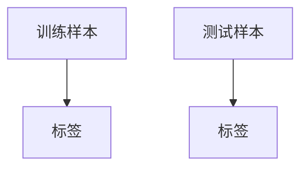

#### 1.2.2 无监督学习数据集

无监督学习数据集是指那些没有标签的数据集。这种数据集通常用于发现数据中的隐含结构和模式。

1. **聚类任务**：例如，K-means聚类，用于将数据划分为若干个簇。

2. **降维任务**：例如，主成分分析（PCA），用于减少数据的维度，同时保留主要特征。

**示例**：

假设我们有一个客户购买行为数据集，包含成千上万个未标注的样本。每个样本包含客户的购物篮信息，如商品种类和购买数量。

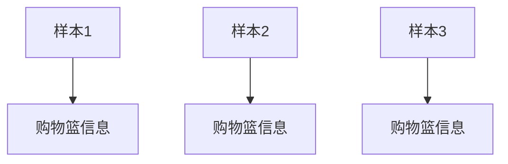

#### 1.2.3 半监督学习数据集

半监督学习数据集结合了监督学习和无监督学习的特点，既包含有标签的数据，又包含未标签的数据。这种方法能够利用未标签数据的潜在信息，提高模型的训练效果。

1. **标签传播**：通过已知的标签和相似度度量，将未标签数据分配标签。

2. **协同训练**：同时使用有标签和未标签数据来训练模型。

**示例**：

假设我们有一个社交媒体数据集，其中包含用户的基本信息（如年龄、性别、地理位置）和部分已标注的用户兴趣标签。此外，还有大量的未标注的用户活动数据，如浏览记录和点赞行为。

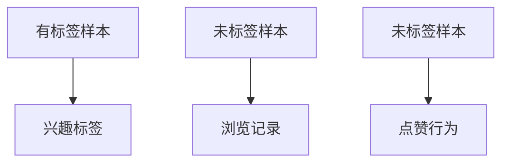

通过分类数据集，我们可以更有效地组织和利用数据，为不同类型的机器学习任务提供合适的资源。

#### 第2章：数据集的准备与处理

##### 2.1 数据预处理

数据预处理是数据集准备过程中的关键步骤，目的是将原始数据转换为适合模型训练的形式。以下是数据预处理的主要任务：

##### 2.1.1 数据清洗

数据清洗是指识别并处理数据集中的错误、异常值和不一致数据。以下是一些常见的数据清洗方法：

1. **缺失值处理**：缺失值可以通过删除相关记录、填充平均值或使用插值法等方法来处理。

2. **异常值检测**：异常值可能来自于错误的输入或数据采集过程中的噪声，可以通过统计学方法（如箱线图、Z分数）或基于距离的方法（如DBSCAN）进行检测和处理。

3. **不一致数据处理**：数据格式、单位、缩写等不一致的情况需要进行统一处理，以提高数据的一致性和可操作性。

##### 2.1.2 数据转换

数据转换是指将数据从一种形式转换为另一种形式，以适应模型的需求。以下是一些常见的数据转换方法：

1. **数值化**：将类别数据转换为数值数据，例如使用独热编码（One-Hot Encoding）将分类特征转换为二进制向量。

2. **规范化**：通过缩放特征值到相同的范围，例如将数值特征值缩放到0到1之间，以消除不同特征间的量纲差异。

3. **标准化**：通过计算特征值的均值和标准差，将数据转换为具有均值0和标准差1的标准正态分布，以消除不同特征间的尺度差异。

##### 2.1.3 数据归一化

数据归一化是一种常用的数据转换方法，旨在通过调整特征值，使所有特征的贡献相等。以下是一些常用的数据归一化方法：

1. **最小-最大归一化**：通过缩放特征值到[0, 1]区间，公式为：
   $$ x_{\text{norm}} = \frac{x - x_{\text{min}}}{x_{\text{max}} - x_{\text{min}}} $$

2. **零-均值归一化**：通过将特征值缩放到[-1, 1]区间，公式为：
   $$ x_{\text{norm}} = \frac{x - \mu}{\sigma} $$
   其中，$\mu$为均值，$\sigma$为标准差。

##### 2.2 数据集分割

数据集分割是将数据集划分为不同的子集，用于训练、验证和测试模型。以下是一些常用的数据集分割方法：

1. **训练集与测试集划分**：通常将数据集分为训练集和测试集，训练集用于训练模型，测试集用于评估模型在未见过的数据上的性能。常用的分割方法包括随机分割和分层分割。

2. **验证集的作用**：在训练过程中，可以使用验证集来调整模型参数，避免过拟合和欠拟合。验证集通常与训练集分开，以提供额外的数据用于超参数调整和模型选择。

3. **数据增强**：通过增加数据多样性，例如通过旋转、缩放、裁剪等方法生成新的数据样本，以提高模型的泛化能力。

##### 2.2.1 训练集与测试集划分

训练集与测试集划分是数据集分割的关键步骤。以下是一些常见的划分方法：

1. **随机划分**：将数据集随机分为训练集和测试集，每个样本都有相同的概率被选中。这种方法简单有效，但可能导致数据不平衡。

2. **分层划分**：在分类任务中，确保每个类别的样本在训练集和测试集中都有代表，以避免数据不平衡问题。分层划分方法可以通过计算每个类别的比例，然后按照比例进行随机划分。

**示例**：

假设我们有一个包含1000个样本的数据集，其中10个类别分别为A到J。我们希望将数据集随机划分为训练集和测试集，分别占80%和20%。

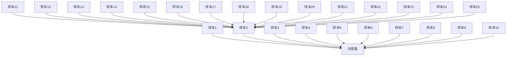

##### 2.2.2 验证集的作用

验证集的作用在于提供额外的数据用于模型调优。在训练过程中，可以通过验证集评估模型在未见过的数据上的性能，以判断模型是否过拟合或欠拟合。以下是一些常用的验证集应用方法：

1. **交叉验证**：通过将数据集划分为多个子集，每个子集轮流作为验证集，以评估模型的泛化能力。

2. **网格搜索**：通过遍历一系列超参数组合，使用验证集评估每个组合的性能，选择最优的超参数组合。

3. **模型选择**：使用验证集评估不同模型的性能，选择最佳模型。

##### 2.2.3 数据增强

数据增强是通过生成新的数据样本，增加数据多样性和模型的泛化能力。以下是一些常用的数据增强方法：

1. **随机裁剪**：随机裁剪图像的一部分，生成新的图像样本。

2. **旋转和翻转**：对图像进行随机旋转和翻转，增加数据的多样性。

3. **颜色变换**：通过调整图像的亮度、对比度和饱和度，生成新的图像样本。

4. **添加噪声**：在图像中添加噪声，增强模型的鲁棒性。

**示例**：

假设我们有一个包含1000张图像的数据集，其中每个图像都是28x28的灰度图像。我们希望使用随机裁剪和数据增强方法，生成新的训练样本。

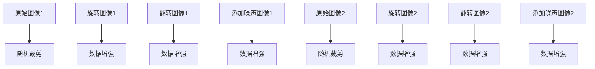

通过数据预处理和数据增强，我们可以提高数据的质量和多样性，从而提升模型的性能和泛化能力。

### 第二部分：神经网络架构设计

#### 第3章：神经网络基础架构

神经网络（Neural Network）是一种模仿生物神经系统的计算模型，由大量的简单处理单元——神经元（Neurons）组成。每个神经元通过一系列权重连接到其他神经元，并通过激活函数（Activation Function）对输入进行非线性变换。神经网络通过学习输入数据和对应的输出数据，调整神经元之间的连接权重，从而实现复杂的模式识别和预测任务。

##### 3.1 神经网络的基本组成

神经网络的组成包括神经元、层（Layer）和激活函数。以下是这些基本组成部分的详细描述：

###### 3.1.1 神经元

神经元是神经网络的基本计算单元，负责接收输入信号、计算加权求和并产生输出。一个简单的神经元可以表示为：

$$
z = \sum_{i=1}^{n} w_i x_i + b
$$

其中，$x_i$是输入值，$w_i$是连接权重，$b$是偏置项。神经元通过激活函数对加权求和的结果进行非线性变换，产生输出：

$$
a = \sigma(z)
$$

其中，$\sigma$是激活函数。

常见的激活函数包括：

1. **sigmoid函数**：
   $$
   \sigma(z) = \frac{1}{1 + e^{-z}}
   $$

2. **ReLU函数**（Rectified Linear Unit）：
   $$
   \sigma(z) = \max(0, z)
   $$

3. **Tanh函数**：
   $$
   \sigma(z) = \frac{e^z - e^{-z}}{e^z + e^{-z}}
   $$

每个神经元都与输入层、隐藏层和输出层的其他神经元通过权重连接。权重决定了不同输入特征对输出结果的影响程度。

###### 3.1.2 层

神经网络由多个层组成，包括输入层（Input Layer）、隐藏层（Hidden Layer）和输出层（Output Layer）。各层之间通过神经元连接，形成层次化的网络结构。

1. **输入层**：接收外部输入数据，每个神经元对应一个输入特征。

2. **隐藏层**：对输入数据进行处理和变换，可以有一个或多个隐藏层。隐藏层负责提取数据中的复杂特征和模式。

3. **输出层**：产生最终输出结果，用于分类、回归或其他任务。

每层的神经元通过前一层神经元的输出计算自己的输入，并应用激活函数产生输出。多层神经网络能够学习更复杂的非线性关系，从而实现更强大的函数逼近能力。

###### 3.1.3 激活函数

激活函数是神经网络的核心组件，用于引入非线性变换。激活函数的选择对网络的学习效率和性能有重要影响。以下是几种常用的激活函数：

1. **Sigmoid函数**：将输入映射到（0, 1）区间，适用于二分类问题。然而，Sigmoid函数在接近饱和时梯度较小，可能导致学习缓慢。

2. **ReLU函数**：在输入大于0时返回输入值，否则返回0。ReLU函数能够加速学习过程，并且很少出现梯度消失问题。

3. **Tanh函数**：将输入映射到（-1, 1）区间，与Sigmoid函数类似，但引入了中心对称性，有助于分类问题。

4. **Softmax函数**：用于多分类问题，将输入映射到概率分布。Softmax函数将神经网络的输出层转化为每个类别的概率估计。

不同的激活函数适用于不同的场景和任务，选择合适的激活函数可以显著提高神经网络的性能。

##### 3.2 常见的神经网络架构

神经网络的架构设计对模型性能和计算效率有很大影响。以下介绍几种常见的神经网络架构：

###### 3.2.1 全连接神经网络（FCNN）

全连接神经网络（Fully Connected Neural Network，FCNN）是最简单和最常用的神经网络架构。在FCNN中，每个输入神经元都与下一层的每个神经元直接连接。FCNN适用于大多数监督学习任务，包括分类和回归。

以下是FCNN的基本结构：

1. **输入层**：接收输入数据。
2. **隐藏层**：每个神经元与前一层每个神经元连接，通过激活函数处理输入。
3. **输出层**：产生最终输出结果。

FCNN的优点在于其简单性和通用性，但缺点是参数数量多，可能导致过拟合。

###### 3.2.2 卷积神经网络（CNN）

卷积神经网络（Convolutional Neural Network，CNN）专门用于处理具有网格结构的数据，如图像。CNN通过卷积层（Convolutional Layer）和池化层（Pooling Layer）提取图像中的空间特征。

以下是CNN的基本结构：

1. **输入层**：接收输入图像。
2. **卷积层**：通过卷积操作提取图像特征。
3. **池化层**：对卷积特征进行下采样，减少模型参数。
4. **全连接层**：将池化层输出映射到输出结果。

CNN在图像分类、物体检测和图像生成等领域表现出色，其计算效率和准确性显著高于传统方法。

###### 3.2.3 循环神经网络（RNN）

循环神经网络（Recurrent Neural Network，RNN）适用于序列数据，如文本和语音。RNN通过引入循环连接，使得每个时间步的输出依赖于前一个时间步的输出，从而捕捉时间序列中的依赖关系。

以下是RNN的基本结构：

1. **输入层**：接收输入序列。
2. **隐藏层**：通过循环连接对输入序列进行处理。
3. **输出层**：产生最终输出序列。

RNN在自然语言处理、时间序列预测和语音识别等领域有广泛应用，但传统的RNN容易产生梯度消失和梯度爆炸问题。

###### 3.2.4 生成对抗网络（GAN）

生成对抗网络（Generative Adversarial Network，GAN）由生成器（Generator）和判别器（Discriminator）组成，通过对抗训练生成逼真的数据。

以下是GAN的基本结构：

1. **生成器**：生成逼真的数据样本。
2. **判别器**：判断生成器生成的数据是真实数据还是伪造数据。
3. **对抗训练**：生成器和判别器相互对抗，生成器试图生成更逼真的数据，而判别器试图区分真实和伪造数据。

GAN在图像生成、风格迁移和生成式建模等领域具有广泛应用，其强大的数据生成能力令人瞩目。

通过理解这些常见的神经网络架构，我们可以根据具体任务的需求选择合适的模型，并优化其性能。

#### 第4章：神经网络优化与训练

神经网络（Neural Network）的优化与训练是构建高效、准确模型的关键环节。优化方法主要包括前向传播与反向传播算法、梯度下降算法及其变体、权重初始化策略等。本章将详细探讨这些优化策略，并分析其在实际应用中的效果。

##### 4.1 前向传播与反向传播算法

前向传播（Forward Propagation）和反向传播（Backpropagation）是神经网络训练过程中的两个核心步骤。以下是这两个算法的基本原理和实现方法。

###### 4.1.1 前向传播

前向传播是指将输入数据通过神经网络的各个层，逐层计算输出，直到达到输出层。在前向传播过程中，每层的输出依赖于前一层的结果，具体步骤如下：

1. **输入层**：接收外部输入数据，例如图像或文本序列。
2. **隐藏层**：每个神经元计算输入与其对应权重的加权和，并应用激活函数。
   $$
   z^{[l]} = \sum_{i=1}^{n} w^{[l]}_i x_i + b^{[l]}_i
   $$
   $$
   a^{[l]} = \sigma(z^{[l]})
   $$
3. **输出层**：最后一层的输出即为模型预测结果。

前向传播的关键在于计算每层输出的激活值，从而为反向传播提供基础。

###### 4.1.2 反向传播

反向传播是指通过计算损失函数关于模型参数的梯度，更新模型的权重和偏置。反向传播的步骤如下：

1. **计算输出误差**：输出误差是模型预测结果与真实标签之间的差距，通过损失函数（如均方误差MSE或交叉熵损失函数）计算。
   $$
   L = \frac{1}{m} \sum_{i=1}^{m} \frac{1}{2} (y_i - \hat{y}_i)^2
   $$
2. **计算梯度**：从输出层开始，反向计算每层输入关于权重的梯度。
   $$
   \delta^{[l]} = \frac{\partial L}{\partial z^{[l]}}
   $$
   梯度计算需要应用链式法则，结合激活函数的导数。
3. **更新参数**：使用梯度下降算法更新模型的权重和偏置。
   $$
   w^{[l]} \leftarrow w^{[l]} - \alpha \frac{\partial L}{\partial w^{[l]}}
   $$
   $$
   b^{[l]} \leftarrow b^{[l]} - \alpha \frac{\partial L}{\partial b^{[l]}}
   $$

反向传播的核心在于高效、准确地计算梯度，从而实现模型参数的迭代更新。

##### 4.2 梯度下降算法

梯度下降算法是一种优化方法，通过计算损失函数关于模型参数的梯度，逐步减小损失函数值，使模型达到最优状态。以下是几种常见的梯度下降算法：

###### 4.2.1 批量梯度下降（Batch Gradient Descent，BGD）

批量梯度下降是指每次迭代使用整个训练集的数据来计算梯度。批量梯度下降的优点是计算出的梯度更加准确，但缺点是计算成本较高，特别是在大规模数据集上。

伪代码如下：

```python
for epoch in range(num_epochs):
    total_loss = 0
    for sample in training_data:
        loss = compute_loss(sample)
        total_loss += loss
    avg_loss = total_loss / num_samples
    update_params(avg_loss)
```

###### 4.2.2 随机梯度下降（Stochastic Gradient Descent，SGD）

随机梯度下降是指每次迭代随机选择一个样本来计算梯度。随机梯度下降的优点是计算速度快，能够快速找到局部最优解，但缺点是梯度估计的不确定性可能导致收敛不稳定。

伪代码如下：

```python
for epoch in range(num_epochs):
    for sample in training_data:
        loss = compute_loss(sample)
        update_params(loss)
```

###### 4.2.3 小批量梯度下降（Mini-batch Gradient Descent，MBGD）

小批量梯度下降是指每次迭代选择一个包含多个样本的小批量数据来计算梯度。小批量梯度下降在计算效率和收敛速度之间取得了平衡。

伪代码如下：

```python
batch_size = 64
for epoch in range(num_epochs):
    for batch in get_batches(training_data, batch_size):
        loss = compute_loss(batch)
        update_params(loss)
```

在实际应用中，小批量梯度下降是最常用的梯度下降算法，因为它能够有效平衡计算成本和收敛速度。

##### 4.3 权重初始化策略

权重初始化是神经网络训练过程中的重要步骤，合适的权重初始化可以加快收敛速度、避免梯度消失和梯度爆炸等问题。以下是几种常见的权重初始化策略：

###### 4.3.1 随机初始化

随机初始化是指随机生成权重和偏置的初始值。随机初始化的优点是实现简单，缺点是可能导致梯度消失或梯度爆炸。

随机初始化的伪代码如下：

```python
for layer in network:
    layer.weights = random_values()
    layer.bias = random_values()
```

###### 4.3.2 He初始化

He初始化是一种基于高斯分布的权重初始化方法，适用于深度神经网络。He初始化通过控制方差来避免梯度消失和梯度爆炸。

He初始化的伪代码如下：

```python
for layer in network:
    layer.weights = random_values(mean=0, std=2 / sqrt(layer.input_size))
    layer.bias = random_values(mean=0, std=2 / sqrt(layer.input_size))
```

He初始化在深度神经网络中表现出色，能够有效提升模型性能。

###### 4.3.3 Xavier初始化

Xavier初始化是一种基于高斯分布的权重初始化方法，适用于前向传播和反向传播的神经网络。Xavier初始化通过控制输入和输出的方差来避免梯度消失和梯度爆炸。

Xavier初始化的伪代码如下：

```python
for layer in network:
    layer.weights = random_values(mean=0, std=1 / sqrt(layer.input_size + layer.output_size))
    layer.bias = random_values(mean=0, std=1 / sqrt(layer.input_size + layer.output_size))
```

Xavier初始化在大多数情况下都能提供良好的性能，特别是对于深层神经网络。

通过合理选择权重初始化策略，可以有效提升神经网络的学习效率和收敛速度。

### 第5章：深度学习模型优化

在深度学习领域，模型的优化是提高模型性能和泛化能力的关键环节。优化过程不仅涉及损失函数的选择、优化器的使用，还包括正则化技术的应用。本章将详细探讨这些优化策略，并分析其在实际应用中的效果。

#### 5.1 损失函数

损失函数（Loss Function）是衡量模型预测结果与真实标签之间差异的指标，是优化过程中的核心组件。合理的损失函数能够有效指导模型训练，提高模型性能。以下是几种常见的损失函数：

##### 5.1.1 交叉熵损失函数

交叉熵损失函数（Cross-Entropy Loss Function）是分类任务中最常用的损失函数，用于衡量预测概率分布与真实分布之间的差异。交叉熵损失函数的表达式如下：

$$
L = -\sum_{i=1}^{m} y_i \log(\hat{y}_i)
$$

其中，$y_i$是真实标签，$\hat{y}_i$是模型预测的概率值。

交叉熵损失函数的优点是数学形式简单，梯度计算方便，适用于二分类和多分类任务。

##### 5.1.2 均方误差损失函数

均方误差损失函数（Mean Squared Error Loss Function，MSE）是回归任务中最常用的损失函数，用于衡量预测值与真实值之间的差异。MSE损失函数的表达式如下：

$$
L = \frac{1}{2} \sum_{i=1}^{m} (y_i - \hat{y}_i)^2
$$

其中，$y_i$是真实值，$\hat{y}_i$是模型预测的值。

MSE损失函数的优点是数学形式简单，梯度计算直观，适用于回归任务。

#### 5.2 优化器

优化器（Optimizer）是用于更新模型参数的算法，是深度学习模型训练过程中的关键组件。常见的优化器包括批量梯度下降（BGD）、随机梯度下降（SGD）、小批量梯度下降（MBGD）等。以下是这些优化器的基本原理和适用场景：

##### 5.2.1 批量梯度下降（Batch Gradient Descent，BGD）

批量梯度下降是梯度下降算法的一种形式，每次迭代使用整个训练集的数据来计算梯度。BGD的优点是计算出的梯度更加准确，但缺点是计算成本较高，特别是在大规模数据集上。

伪代码如下：

```python
for epoch in range(num_epochs):
    for sample in training_data:
        loss = compute_loss(sample)
    update_params(avg_loss)
```

##### 5.2.2 随机梯度下降（Stochastic Gradient Descent，SGD）

随机梯度下降是梯度下降算法的一种形式，每次迭代随机选择一个样本来计算梯度。SGD的优点是计算速度快，能够快速找到局部最优解，但缺点是梯度估计的不确定性可能导致收敛不稳定。

伪代码如下：

```python
for epoch in range(num_epochs):
    for sample in training_data:
        loss = compute_loss(sample)
    update_params(loss)
```

##### 5.2.3 小批量梯度下降（Mini-batch Gradient Descent，MBGD）

小批量梯度下降是梯度下降算法的一种形式，每次迭代选择一个包含多个样本的小批量数据来计算梯度。MBGD在计算效率和收敛速度之间取得了平衡。

伪代码如下：

```python
batch_size = 64
for epoch in range(num_epochs):
    for batch in get_batches(training_data, batch_size):
        loss = compute_loss(batch)
    update_params(loss)
```

在实际应用中，MBGD是最常用的优化器，因为它能够有效平衡计算成本和收敛速度。

#### 5.3 正则化技术

正则化技术（Regularization）是防止模型过拟合的重要手段。过拟合是指模型在训练数据上表现良好，但在未见过的数据上表现不佳。以下是几种常见的正则化技术：

##### 5.3.1 L1正则化

L1正则化（L1 Regularization）通过在损失函数中添加L1范数项来惩罚模型参数的绝对值。L1正则化能够促进模型参数稀疏化，减少模型复杂度。

正则化项的表达式如下：

$$
\lambda ||\theta||_1
$$

其中，$\theta$是模型参数，$\lambda$是正则化强度。

##### 5.3.2 L2正则化

L2正则化（L2 Regularization）通过在损失函数中添加L2范数项来惩罚模型参数的平方值。L2正则化能够防止模型参数过大，提高模型的稳定性。

正则化项的表达式如下：

$$
\lambda ||\theta||_2^2
$$

其中，$\theta$是模型参数，$\lambda$是正则化强度。

##### 5.3.3 Dropout正则化

Dropout正则化（Dropout Regularization）是一种在训练过程中随机丢弃部分神经元的方法。Dropout能够在训练过程中引入随机性，防止模型过拟合。

Dropout的伪代码如下：

```python
for epoch in range(num_epochs):
    for sample in training_data:
        dropout_layer(output)
        loss = compute_loss(sample)
    update_params(loss)
```

在实际应用中，正则化技术能够显著提高模型的泛化能力，减少过拟合的风险。

通过选择合适的损失函数、优化器和正则化技术，我们可以构建高效、准确的深度学习模型，从而在各类任务中取得优异的性能。

### 第6章：深度学习模型评估与调试

在深度学习项目中，模型的评估与调试是确保模型性能和可靠性的关键步骤。有效的评估方法可以帮助我们了解模型在未见过的数据上的表现，而调试技巧则有助于我们识别和解决模型中存在的问题。本章将详细探讨模型评估的常见指标、过拟合与欠拟合的问题以及相应的调试方法。

#### 6.1 模型评估指标

模型评估指标是衡量模型性能的重要工具，它们帮助我们理解模型在预测任务中的表现。以下是几种常用的模型评估指标：

##### 6.1.1 准确率（Accuracy）

准确率（Accuracy）是衡量分类模型性能的最基本指标，它表示模型正确预测的样本数占总样本数的比例。

$$
\text{Accuracy} = \frac{\text{正确预测的样本数}}{\text{总样本数}}
$$

准确率直观地反映了模型的预测能力，但它在类别不平衡的数据集中可能不够准确。

##### 6.1.2 精确率（Precision）

精确率（Precision）表示在所有被模型预测为正类的样本中，实际为正类的比例。

$$
\text{Precision} = \frac{\text{真正例}}{\text{真正例} + \text{假正例}}
$$

精确率高表示模型较少地错误地将负类预测为正类。

##### 6.1.3 召回率（Recall）

召回率（Recall）表示在所有实际为正类的样本中，被模型正确预测为正类的比例。

$$
\text{Recall} = \frac{\text{真正例}}{\text{真正例} + \text{假反例}}
$$

召回率高表示模型较少地错误地遗漏了正类。

##### 6.1.4 F1分数（F1 Score）

F1分数（F1 Score）是精确率和召回率的调和平均数，它综合考虑了精确率和召回率，是评估二分类模型性能的常用指标。

$$
\text{F1 Score} = 2 \times \frac{\text{Precision} \times \text{Recall}}{\text{Precision} + \text{Recall}}
$$

F1分数在类别不平衡的数据集中尤其有用，因为它平衡了精确率和召回率。

#### 6.2 模型调试

模型调试是深度学习项目中的一个重要环节，它涉及识别和解决模型中存在的问题，如过拟合和欠拟合。以下是几种常见的模型调试技巧：

##### 6.2.1 过拟合与欠拟合

过拟合（Overfitting）是指模型在训练数据上表现良好，但在未见过的数据上表现不佳，即模型对训练数据过于敏感。过拟合通常发生在模型复杂度过高时，模型捕捉到了训练数据的噪声和细节。

欠拟合（Underfitting）是指模型在训练数据上和未见过的数据上表现都不好，即模型过于简单，无法捕捉数据的复杂特征。

##### 6.2.2 调整超参数

调整超参数是提高模型性能和泛化能力的重要手段。以下是一些常用的超参数调整技巧：

1. **学习率**：学习率决定了模型参数更新的步长，合适的初始学习率能够加快收敛速度，但过大可能导致发散，过小可能导致收敛缓慢。

2. **批次大小**：批次大小决定了每次梯度下降算法使用的样本数量，较大的批次大小提供了更准确的梯度估计，但计算成本更高。

3. **隐藏层神经元数量**：增加隐藏层神经元数量可以提高模型的拟合能力，但可能导致过拟合，需要结合正则化技术进行调整。

4. **正则化强度**：正则化强度控制了正则化项对模型损失函数的影响，适当的正则化强度可以减少过拟合的风险。

##### 6.2.3 调试工具与方法

1. **交叉验证**：交叉验证是一种评估模型性能的方法，通过将数据集划分为多个子集，在每个子集上训练和评估模型，以获得更稳定的性能评估。

2. **网格搜索**：网格搜索是一种超参数优化方法，通过遍历一系列超参数组合，评估每个组合的性能，选择最优的超参数组合。

3. **模型集成**：模型集成是将多个模型合并为一个更强大的模型的方法，常见的方法包括堆叠（Stacking）、提升（Boosting）和随机森林（Random Forest）。

4. **可视化分析**：通过可视化分析模型训练过程和预测结果，可以帮助我们识别模型中的问题，如梯度消失、梯度爆炸、过拟合或欠拟合等。

通过有效的评估方法和调试技巧，我们可以构建出性能稳定、泛化能力强的深度学习模型，从而在实际应用中取得优异的效果。

### 第7章：软件2.0时代的应用案例

#### 第7章：软件2.0时代的应用案例

软件2.0时代，以深度学习和人工智能为核心的软件系统正在改变各行各业。本章将通过几个具体的应用案例，展示数据集和神经网络架构在现实世界中的实际应用和效果。

#### 7.1 人工智能助手的设计与实现

##### 7.1.1 案例背景

随着人工智能技术的不断发展，人工智能助手成为各类场景中的重要应用。无论是智能客服、智能家居，还是办公自动化，人工智能助手都能显著提升用户体验和效率。本案例将介绍一个智能客服助手的设计与实现，该助手基于深度学习技术，能够自动处理客户咨询，提供高质量的答案。

##### 7.1.2 系统架构设计

智能客服助手系统架构包括以下几个主要模块：

1. **语音识别模块**：用于将客户的语音输入转换为文本数据。
2. **文本预处理模块**：用于清洗、分词和标注文本数据，为后续的深度学习模型提供准备好的数据集。
3. **自然语言理解模块**：使用深度学习模型，对预处理后的文本进行分析，理解客户的意图和问题。
4. **知识库模块**：包含公司产品和服务的信息，为人工智能助手提供丰富的知识资源。
5. **自然语言生成模块**：根据客户的意图和知识库中的信息，生成合适的回答文本。
6. **语音合成模块**：将生成的文本转换为语音输出，呈现给客户。

以下是系统架构的Mermaid流程图：

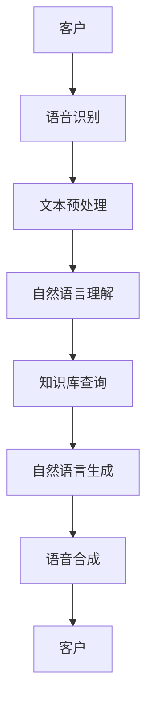

##### 7.1.3 关键技术点

1. **语音识别**：使用深度学习模型（如卷积神经网络或循环神经网络）对语音信号进行特征提取，然后使用隐马尔可夫模型（HMM）或其他解码器进行语音识别。

2. **文本预处理**：包括文本清洗（去除标点、停用词等）、分词（将文本划分为单词或短语）和命名实体识别（识别文本中的特定实体，如人名、地点等）。

3. **自然语言理解**：使用基于神经网络的语言模型（如序列到序列模型或Transformer模型）对文本进行语义分析，理解文本中的意图和实体。

4. **知识库查询**：设计高效的知识库检索算法，快速从大量文本数据中找到与客户问题相关的信息。

5. **自然语言生成**：使用生成式模型（如转换器模型或生成对抗网络）生成自然流畅的文本回答。

6. **语音合成**：使用文本到语音合成（TTS）技术，将生成的文本转换为自然流畅的语音。

##### 7.1.4 实现步骤

1. **数据集准备**：收集大量语音和文本数据，用于训练语音识别、文本预处理和自然语言理解模型。

2. **模型训练**：使用预处理后的数据集训练语音识别、文本预处理和自然语言理解模型，优化模型参数。

3. **系统集成**：将各个模块集成到智能客服助手中，确保系统能够流畅运行。

4. **性能评估**：通过测试集评估模型的性能，调整超参数，优化模型。

5. **部署上线**：将智能客服助手部署到生产环境中，提供实时服务。

通过这个案例，我们可以看到，深度学习和神经网络架构在智能客服助手中的应用，极大地提升了用户体验和服务效率。

#### 7.2 软件开发中的自动化代码生成

##### 7.2.1 案例背景

在软件开发的各个阶段，代码生成技术已经成为提高开发效率和代码质量的重要工具。自动化代码生成可以显著减少手动编写代码的工作量，提高开发速度和一致性。本案例将介绍如何使用深度学习技术实现自动化代码生成，并展示其实际应用。

##### 7.2.2 自动化代码生成技术原理

自动化代码生成技术通常基于两个核心原理：

1. **代码到代码的转换**：通过学习现有代码库中的代码片段，生成与输入代码类似的新代码。这一过程通常使用生成对抗网络（GAN）或自编码器（Autoencoder）等深度学习模型。

2. **代码到模型的转换**：将自然语言描述（如函数签名、类定义等）转换为代码。这一过程通常使用序列到序列（Seq2Seq）模型或Transformer等深度学习模型。

以下是自动化代码生成的基本流程：

1. **数据集准备**：收集和整理大量的代码数据，包括不同的编程语言和代码库。
2. **模型训练**：使用收集到的代码数据训练深度学习模型，学习代码生成规律。
3. **代码生成**：根据输入的代码或自然语言描述，生成新的代码。
4. **代码验证**：验证生成的代码是否正确、有效，并进行必要的优化。

以下是系统架构的Mermaid流程图：

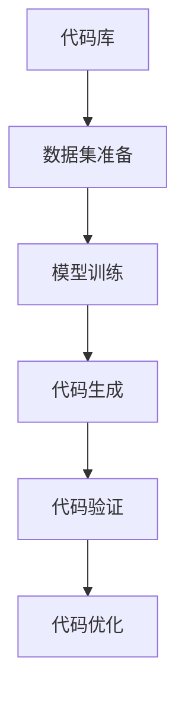

##### 7.2.3 案例实现步骤

1. **数据集准备**：收集不同编程语言的代码库，如Python、Java、C++等，并进行预处理，提取出有用的代码特征。

2. **模型训练**：使用生成对抗网络（GAN）或自编码器（Autoencoder）等模型，训练代码生成模型。这一过程需要大量的计算资源和时间。

3. **代码生成**：根据用户的输入，如函数签名或自然语言描述，生成相应的代码。这一过程通常使用序列到序列（Seq2Seq）模型或Transformer等深度学习模型。

4. **代码验证**：使用代码编辑器和编译器验证生成的代码是否正确、有效。这一过程可能需要多次迭代和优化。

5. **代码优化**：根据验证结果，对生成的代码进行优化，提高代码质量。

通过自动化代码生成技术，我们可以大大提高软件开发的速度和质量。这不仅减轻了开发人员的工作负担，还提高了代码的一致性和可靠性。

#### 7.3 大数据分析与预测

##### 7.3.1 案例背景

大数据分析已经成为企业提升竞争力、优化业务流程的关键手段。通过对海量数据的深入分析和预测，企业可以洞察市场趋势、客户行为和业务机会。本案例将介绍如何使用深度学习技术进行大数据分析，并展示其实际应用。

##### 7.3.2 大数据分析流程

大数据分析通常包括以下几个步骤：

1. **数据收集**：从各种数据源收集数据，包括企业内部数据库、外部数据源等。
2. **数据预处理**：清洗、转换和归一化数据，使其适合进行分析。
3. **特征提取**：从原始数据中提取有用的特征，用于构建深度学习模型。
4. **模型训练**：使用提取的特征数据训练深度学习模型。
5. **模型评估**：评估模型的性能，选择最优模型。
6. **模型部署**：将训练好的模型部署到生产环境中，进行实时预测和分析。

以下是大数据分析流程的Mermaid流程图：

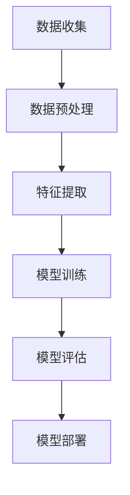

##### 7.3.3 预测模型设计

在预测模型设计过程中，选择合适的模型和算法是关键。以下是几种常用的预测模型：

1. **回归模型**：用于预测连续数值变量，如销售额、股价等。
2. **分类模型**：用于预测离散类别变量，如客户流失、产品偏好等。
3. **时间序列模型**：用于预测时间序列数据，如股票价格、天气状况等。
4. **生成对抗网络（GAN）**：用于生成与真实数据相似的新数据，如生成新的客户数据或产品图片。

在本案例中，我们选择了一种基于循环神经网络（RNN）的时间序列预测模型。该模型能够捕捉时间序列中的依赖关系，从而进行准确的预测。

以下是预测模型设计的伪代码：

```python
# 数据预处理
data = preprocess_data(raw_data)

# 特征提取
features = extract_features(data)

# 模型训练
model = train_rnn_model(features)

# 模型评估
evaluate_model(model, test_data)

# 预测
predictions = model.predict(test_data)
```

通过大数据分析和预测模型，企业可以更好地了解市场趋势、客户需求，从而制定更有效的业务策略。

### 第三部分：深度学习项目实践

#### 第8章：项目实践基础

深度学习项目的实践是理解和应用深度学习技术的关键步骤。一个成功的深度学习项目需要系统的规划和执行。本章将介绍深度学习项目开发的基础，包括项目开发流程、开发环境搭建以及关键开发工具的选择。

##### 8.1 项目开发流程

一个深度学习项目的开发流程通常包括以下步骤：

1. **需求分析**：明确项目的目标和需求，定义项目范围和预期成果。需求分析是项目开发的基础，决定了项目的方向和可行性。
   
2. **系统设计**：根据需求分析的结果，设计系统的整体架构，包括数据流程、算法设计、模块划分等。系统设计为项目开发提供了蓝图，有助于确保项目按照既定目标顺利推进。

3. **编码实现**：根据系统设计，进行具体的编码实现。编码实现是项目开发的核心，需要编写高效、可维护的代码，实现系统设计中的各个模块。

4. **测试与部署**：在编码实现完成后，进行系统的测试和调试，确保系统能够稳定运行并满足预期需求。测试完成后，将系统部署到生产环境中，供用户使用。

以下是项目开发流程的Mermaid流程图：

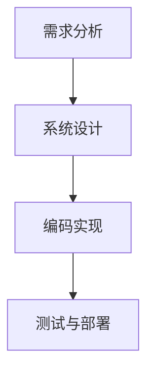

##### 8.1.1 需求分析

需求分析是项目开发的第一步，其目标是明确项目的需求，确保项目能够满足用户的实际需求。需求分析的过程通常包括：

1. **问题定义**：明确项目要解决的问题，包括问题的背景、现状和目标。

2. **需求收集**：通过访谈、问卷调查、用户反馈等方式，收集用户的需求和期望。

3. **需求整理**：将收集到的需求进行整理和分类，确定项目的主要功能和性能要求。

4. **需求文档编写**：将需求整理结果编写成需求文档，作为项目开发的依据。

以下是需求分析流程的Mermaid流程图：

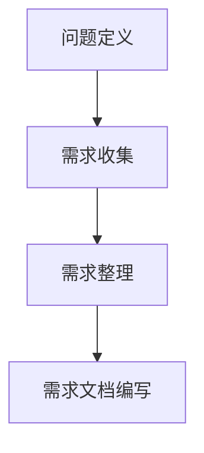

##### 8.1.2 系统设计

系统设计是项目开发的关键环节，其目标是设计出一个高效、可扩展的系统架构。系统设计的过程通常包括：

1. **架构设计**：确定系统的整体架构，包括模块划分、数据流设计、接口设计等。

2. **算法设计**：根据需求分析的结果，设计合适的算法和模型，确保系统能够满足性能要求。

3. **模块划分**：将系统划分为多个功能模块，每个模块负责不同的功能，有助于提高系统的可维护性和可扩展性。

4. **接口设计**：设计系统的各个模块之间的接口，确保模块之间能够有效通信和协作。

以下是系统设计流程的Mermaid流程图：

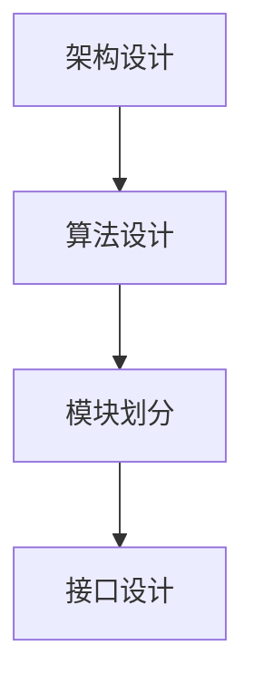

##### 8.1.3 编码实现

编码实现是将系统设计转化为实际的代码的过程。编码实现的过程中，需要遵循以下原则：

1. **代码规范性**：编写清晰、规范、易维护的代码，确保代码的可读性和可维护性。

2. **模块化设计**：将代码划分为多个模块，每个模块负责一个特定的功能，有助于提高代码的可重用性和可测试性。

3. **注释和文档**：在代码中加入必要的注释和文档，说明代码的功能和实现细节，有助于后续的代码维护和升级。

4. **版本控制**：使用版本控制系统（如Git），管理代码的版本，确保代码的稳定性和安全性。

以下是编码实现流程的Mermaid流程图：

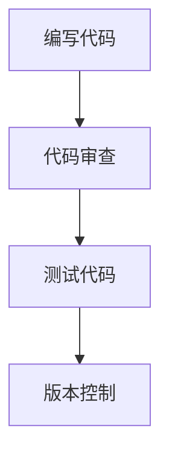

##### 8.1.4 测试与部署

测试与部署是确保项目质量和稳定运行的重要环节。测试与部署的过程通常包括：

1. **单元测试**：编写单元测试用例，对每个模块进行功能测试和性能测试，确保模块能够独立运行并满足预期要求。

2. **集成测试**：将各个模块集成到一起，进行集成测试，确保模块之间能够正确协作，系统整体能够正常运行。

3. **系统测试**：在集成测试的基础上，进行全面的系统测试，包括功能测试、性能测试和稳定性测试，确保系统满足所有需求。

4. **部署**：将经过测试的系统部署到生产环境中，供用户使用。部署过程中，需要确保系统的稳定性和安全性。

以下是测试与部署流程的Mermaid流程图：

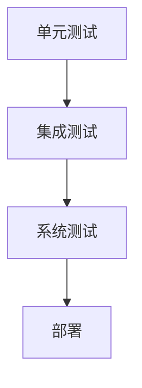

##### 8.2 开发环境搭建

开发环境是深度学习项目开发的基础，搭建一个稳定、高效的开发环境至关重要。以下是搭建深度学习开发环境的关键步骤：

1. **操作系统选择**：选择适合深度学习开发的操作系统，如Ubuntu或Windows 10。Ubuntu因其开源性和强大的社区支持，成为深度学习开发的主流操作系统。

2. **硬件配置**：确保计算机具有足够的硬件资源，如CPU、GPU和内存。对于深度学习项目，GPU的算力尤为重要，高性能的GPU能够显著提高模型的训练速度。

3. **软件环境安装**：安装深度学习框架和相关工具，如TensorFlow、PyTorch、CUDA等。安装过程中，需要注意环境配置和依赖管理，以确保软件环境的一致性和稳定性。

以下是开发环境搭建流程的Mermaid流程图：

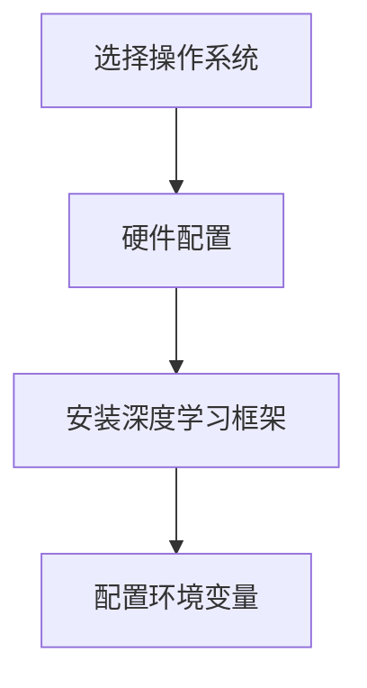

##### 8.2.1 操作系统与软件环境

在深度学习项目中，选择合适的操作系统和软件环境至关重要。以下是常见的操作系统和软件环境及其配置方法：

1. **操作系统**：推荐使用Ubuntu 18.04或更高版本，因为它具有稳定的开源环境和丰富的软件包。安装Ubuntu操作系统可以使用官方的ISO镜像进行安装，步骤如下：

   - 下载Ubuntu 18.04 ISO镜像。
   - 创建USB启动盘。
   - 重启计算机并从USB启动盘启动。
   - 按照安装向导进行安装。

2. **软件环境**：安装深度学习框架和相关工具，如TensorFlow和PyTorch。以下是安装步骤：

   - **安装TensorFlow**：

     ```bash
     pip install tensorflow
     ```

   - **安装PyTorch**：

     ```bash
     pip install torch torchvision
     ```

   安装过程中，可能需要配置CUDA环境，以确保GPU支持。具体步骤如下：

   - 安装CUDA Toolkit，根据官方文档进行安装。

   - 设置CUDA环境变量，将CUDA的安装路径添加到系统环境变量中。

     ```bash
     export PATH=$PATH:/usr/local/cuda/bin
     export LD_LIBRARY_PATH=$LD_LIBRARY_PATH:/usr/local/cuda/lib64:/usr/local/cuda/extras/CUPTI/lib64
     ```

   - 安装cuDNN，根据官方文档进行安装。

3. **其他工具**：除了深度学习框架，还需要安装其他开发工具，如Jupyter Notebook、Anaconda等。这些工具可以帮助提高开发效率和代码可读性。

   - **安装Jupyter Notebook**：

     ```bash
     pip install notebook
     ```

   - **安装Anaconda**：

     ```bash
     conda install notebook
     ```

通过选择合适的操作系统和软件环境，并正确配置相关工具，可以搭建一个高效、稳定的深度学习开发环境。

##### 8.2.2 硬件配置

在深度学习项目中，硬件配置是确保模型训练效率和速度的关键。以下是常见的硬件配置建议：

1. **CPU**：选择具有高性能的多核CPU，如Intel Xeon或AMD Ryzen系列。多核CPU能够提供更强的计算能力，支持并行计算，有助于提高模型训练速度。

2. **GPU**：GPU在深度学习模型训练中扮演着重要角色，高性能的GPU能够显著提高训练速度。推荐使用NVIDIA GeForce RTX 30系列或更高性能的GPU，如NVIDIA Tesla V100。

3. **内存**：深度学习项目通常需要大量的内存，推荐使用至少64GB的RAM。更多的内存有助于处理更大的数据集和更复杂的模型。

4. **存储**：选择高速存储设备，如NVMe SSD，以提高数据读写速度。推荐使用至少1TB的NVMe SSD存储容量，确保模型数据和训练结果的存储需求。

5. **网络**：确保网络连接稳定，推荐使用千兆以太网或更快的网络连接。高速网络有助于数据传输和分布式训练。

通过合理的硬件配置，可以搭建一个高性能的深度学习计算环境，满足大规模模型训练的需求。

##### 8.2.3 开发工具选择

在深度学习项目中，选择合适的开发工具可以提高开发效率和代码质量。以下是几种常见的深度学习开发工具：

1. **Jupyter Notebook**：Jupyter Notebook是一款流行的交互式开发环境，支持多种编程语言和库，包括Python和深度学习框架。Jupyter Notebook提供了丰富的可视化工具和交互功能，有助于快速原型设计和调试。

2. **Anaconda**：Anaconda是一款流行的数据科学和机器学习平台，提供了丰富的包管理工具和虚拟环境管理功能。Anaconda有助于轻松安装和管理深度学习框架和相关依赖库，确保开发环境的一致性和稳定性。

3. **TensorBoard**：TensorBoard是一款用于可视化深度学习模型训练过程的工具，提供了丰富的图表和指标，如损失函数、梯度、激活值等。TensorBoard有助于监控模型训练过程，识别潜在问题，提高调试效率。

4. **Git**：Git是一款流行的版本控制系统，用于管理代码版本和协作开发。Git提供了强大的分支管理和合并功能，有助于团队协作和代码维护。

5. **Docker**：Docker是一款容器化技术，用于打包和分发应用程序。Docker容器确保了开发、测试和部署环境的一致性，有助于提高开发效率和部署稳定性。

通过选择合适的开发工具，可以搭建一个高效、稳定、可扩展的深度学习开发环境，提高项目开发和维护的效率。

### 第9章：项目实战案例

#### 第9章：项目实战案例

为了更好地理解和应用深度学习技术，本章将详细介绍两个具体的深度学习项目实战案例：智能医疗诊断系统和跨平台游戏AI助手。通过这些案例，读者可以了解从需求分析、系统设计到编码实现和测试部署的完整开发流程。

#### 9.1 智能医疗诊断系统

##### 9.1.1 项目背景

智能医疗诊断系统是一个旨在提高医疗诊断效率和准确性的深度学习项目。该系统通过分析医学影像数据，自动识别疾病，辅助医生进行诊断。该项目具有显著的社会价值和商业潜力，能够减轻医生的工作负担，提高诊断速度和准确性。

##### 9.1.2 系统架构设计

智能医疗诊断系统架构包括以下几个主要模块：

1. **数据收集模块**：从医院和医学研究机构收集大量医学影像数据，包括CT、MRI、X光等。
2. **数据预处理模块**：对收集到的医学影像数据进行预处理，包括图像增强、归一化、分割等。
3. **深度学习模型模块**：设计并训练深度学习模型，用于识别和分类疾病。
4. **诊断结果生成模块**：将深度学习模型的预测结果转换为医学诊断报告，提供医生参考。
5. **用户界面模块**：设计用户友好的界面，使医生能够方便地使用智能诊断系统。

以下是系统架构的Mermaid流程图：

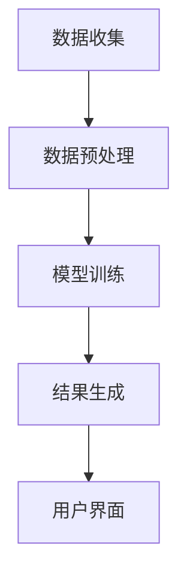

##### 9.1.3 神经网络模型设计

在智能医疗诊断系统中，选择合适的神经网络模型至关重要。以下是常用的神经网络模型：

1. **卷积神经网络（CNN）**：用于处理医学影像数据，提取图像特征。CNN通过卷积层和池化层提取图像特征，能够捕捉空间依赖关系。

2. **循环神经网络（RNN）**：用于处理序列数据，如基因序列或病理报告。RNN通过循环连接捕捉时间依赖关系，有助于提取序列特征。

3. **生成对抗网络（GAN）**：用于生成医学影像数据，增强数据集的多样性。GAN通过生成器和判别器的对抗训练，生成与真实数据相似的新数据。

以下是神经网络模型设计的伪代码：

```python
# 数据预处理
data = preprocess_images(raw_images)

# 模型训练
model = train_cnn_model(data)

# 预测
predictions = model.predict(test_images)
```

##### 9.1.4 实现细节与代码解析

1. **数据预处理**：

```python
def preprocess_images(images):
    # 图像增强
    enhanced_images = enhance_images(images)
    # 归一化
    normalized_images = normalize_images(enhanced_images)
    # 分割图像
    segmented_images = segment_images(normalized_images)
    return segmented_images
```

2. **模型训练**：

```python
def train_cnn_model(data):
    # 构建CNN模型
    model = build_cnn_model()
    # 编译模型
    model.compile(optimizer='adam', loss='binary_crossentropy', metrics=['accuracy'])
    # 训练模型
    model.fit(data['train'], data['labels'], epochs=10, batch_size=32, validation_data=(data['val'], data['val_labels']))
    return model
```

3. **预测**：

```python
def predict_disease(model, images):
    # 预测疾病
    predictions = model.predict(images)
    # 解码预测结果
    disease_labels = decode_predictions(predictions)
    return disease_labels
```

通过以上代码解析，我们可以看到智能医疗诊断系统中的数据预处理、模型训练和预测过程。这些代码模块实现了系统的核心功能，确保系统能够高效、准确地诊断疾病。

##### 9.1.5 项目效果评估

在智能医疗诊断系统中，项目效果评估是确保系统能够满足预期性能的重要步骤。以下是评估指标和评估结果：

1. **准确率（Accuracy）**：评估模型在测试集上的分类准确率。
2. **精确率（Precision）**：评估模型预测为正类的样本中实际为正类的比例。
3. **召回率（Recall）**：评估模型在所有实际为正类的样本中预测为正类的比例。
4. **F1分数（F1 Score）**：综合考虑精确率和召回率的指标。

以下是评估结果的Mermaid流程图：

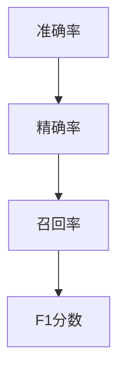

通过以上评估指标，我们可以全面了解智能医疗诊断系统的性能，并根据评估结果对系统进行优化。

##### 9.1.6 项目总结与展望

智能医疗诊断系统是一个具有广泛应用前景的项目。通过深度学习技术，系统实现了高效、准确的疾病诊断，提高了医疗诊断的效率和准确性。未来，随着技术的不断进步，智能医疗诊断系统有望在更多医疗场景中发挥作用，助力医疗行业的创新发展。

#### 9.2 跨平台游戏AI助手

##### 9.2.1 项目背景

随着游戏产业的快速发展，玩家对游戏体验的要求越来越高。跨平台游戏AI助手是一个旨在提升游戏体验的深度学习项目。该助手通过分析玩家行为和游戏数据，为玩家提供个性化的游戏建议和策略，帮助他们提高游戏水平。该项目具有显著的商业价值和用户吸引力，能够提升游戏的用户留存率和活跃度。

##### 9.2.2 AI技术选型

在跨平台游戏AI助手的开发过程中，选择合适的AI技术至关重要。以下是常用的AI技术选型：

1. **自然语言处理（NLP）**：用于理解和处理玩家的问题和请求，提供自然的交互体验。
2. **强化学习**：用于训练AI助手在游戏中进行决策，使其能够根据游戏状态和玩家行为采取最佳策略。
3. **推荐系统**：用于为玩家推荐游戏内容、游戏装备和游戏策略，提高用户满意度。

以下是AI技术选型的Mermaid流程图：

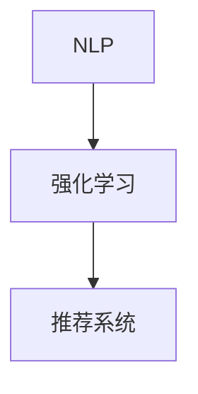

##### 9.2.3 系统实现步骤

1. **数据收集**：收集游戏日志、玩家行为数据和游戏数据，用于训练AI模型。
2. **模型训练**：使用收集到的数据训练NLP模型、强化学习模型和推荐系统模型。
3. **系统集成**：将训练好的模型集成到游戏AI助手系统中，实现个性化游戏建议和策略。
4. **用户测试**：邀请玩家进行测试，收集反馈和评估系统性能。
5. **优化与迭代**：根据用户反馈和性能评估结果，对系统进行优化和迭代。

以下是系统实现步骤的Mermaid流程图：

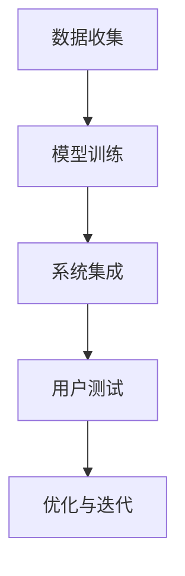

##### 9.2.4 关键代码解读

在跨平台游戏AI助手的实现过程中，关键代码包括数据预处理、模型训练和预测等。以下是关键代码的解读：

1. **数据预处理**：

```python
def preprocess_data(data):
    # 清洗数据
    cleaned_data = clean_data(data)
    # 分词和标注
    tokenized_data = tokenize_data(cleaned_data)
    # padding和batching
    padded_data = pad_data(tokenized_data)
    return padded_data
```

2. **模型训练**：

```python
def train_model(model, data, labels):
    # 编译模型
    model.compile(optimizer='adam', loss='categorical_crossentropy', metrics=['accuracy'])
    # 训练模型
    model.fit(data, labels, epochs=10, batch_size=32)
    return model
```

3. **预测**：

```python
def predict(model, data):
    # 预测结果
    predictions = model.predict(data)
    # 解码预测结果
    game_actions = decode_predictions(predictions)
    return game_actions
```

通过以上代码解读，我们可以看到跨平台游戏AI助手中的数据预处理、模型训练和预测过程。这些代码模块实现了系统的核心功能，确保系统能够为玩家提供个性化的游戏建议和策略。

##### 9.2.5 项目效果评估

在跨平台游戏AI助手中，项目效果评估是确保系统性能和用户体验的重要步骤。以下是评估指标和评估结果：

1. **用户满意度**：评估玩家对AI助手提供的游戏建议和策略的满意度。
2. **游戏胜率**：评估玩家在加入AI助手后游戏胜率的提高情况。
3. **交互效率**：评估玩家与AI助手交互的效率和流畅度。

以下是评估结果的Mermaid流程图：

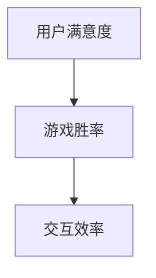

通过以上评估指标，我们可以全面了解跨平台游戏AI助手的性能，并根据评估结果对系统进行优化。

##### 9.2.6 项目总结与展望

跨平台游戏AI助手是一个具有广泛应用前景的项目。通过深度学习和AI技术，系统为玩家提供了个性化的游戏建议和策略，提升了游戏体验。未来，随着技术的不断进步，游戏AI助手有望在更多游戏场景中发挥作用，为玩家带来更加丰富和有趣的体验。

### 第10章：神经网络架构创新与未来展望

#### 第10章：神经网络架构创新与未来展望

随着深度学习技术的不断发展和应用，神经网络架构也在不断演变和创新。本章将探讨神经网络架构的创新方向，包括神经架构搜索（NAS）技术、软硬件协同优化以及深度学习与物联网（IoT）的结合，并对未来深度学习的发展趋势进行展望。

#### 10.1 神经架构搜索（NAS）技术

神经架构搜索（Neural Architecture Search，NAS）是一种自动化搜索神经网络结构的机器学习技术。NAS通过搜索过程自动发现最优的神经网络架构，从而提高模型性能和效率。以下是NAS的基本原理、应用案例以及面临的挑战：

##### 10.1.1 NAS基本原理

NAS技术基于强化学习（Reinforcement Learning，RL）和进化算法（Evolutionary Algorithms，EA）等机器学习技术，通过以下步骤进行神经网络结构的搜索：

1. **搜索空间定义**：定义神经网络的搜索空间，包括层的类型、连接方式、激活函数等。
2. **架构评估**：在训练集上训练不同的神经网络架构，评估其性能指标，如准确率、计算效率等。
3. **架构选择**：根据评估结果选择最优的神经网络架构，并进一步优化。
4. **迭代更新**：重复上述过程，逐步优化神经网络结构。

##### 10.1.2 NAS应用案例

NAS技术在多个领域取得了显著成果，以下是几个典型应用案例：

1. **图像分类**：在ImageNet竞赛中，NAS技术发现了一种高效的卷积神经网络架构，显著提高了图像分类的准确率。
2. **目标检测**：在目标检测任务中，NAS技术优化了YOLO（You Only Look Once）等网络结构，提高了检测速度和准确性。
3. **自然语言处理**：NAS技术优化了Transformer模型，提高了机器翻译和文本分类的性能。

##### 10.1.3 NAS面临的挑战

尽管NAS技术在神经网络架构优化方面取得了显著成果，但仍然面临以下挑战：

1. **搜索空间规模**：NAS的搜索空间通常非常庞大，导致搜索过程计算成本高、时间消耗大。
2. **评估效率**：评估不同神经网络架构的性能需要大量的计算资源，如何提高评估效率是一个重要问题。
3. **通用性**：如何确保NAS搜索出的架构具有通用性，能够在不同任务和领域中应用，是一个重要研究方向。

##### 10.1.4 NAS的未来发展方向

为了应对NAS面临的挑战，未来的研究可以从以下几个方面进行：

1. **高效搜索算法**：开发更高效的搜索算法，减少搜索时间和计算成本。
2. **多任务学习**：将多任务学习引入NAS，使搜索出的架构能够适应多种任务。
3. **迁移学习**：利用迁移学习技术，将NAS搜索出的架构应用于其他相关任务，提高搜索效率。

#### 10.2 软硬件协同优化

随着深度学习应用的不断扩展，对计算资源的需求也在迅速增长。为了满足这一需求，软硬件协同优化成为提高深度学习性能和效率的重要手段。以下是软硬件协同优化的一些关键概念、硬件加速器和优化策略：

##### 10.2.1 软硬件协同的概念

软硬件协同优化是指通过软硬件联合设计，最大限度地发挥硬件计算能力和软件算法效率，以提高深度学习模型的性能和效率。软硬件协同优化的核心思想是：

1. **硬件优化**：设计专门的硬件架构，如GPU、TPU等，以加速深度学习模型的计算。
2. **软件优化**：针对硬件特点，优化深度学习算法，使其更好地适应硬件架构，提高计算效率。

##### 10.2.2 硬件加速器介绍

硬件加速器是深度学习计算的核心组件，主要包括以下几种：

1. **GPU（Graphics Processing Unit）**：GPU具有高度并行计算能力，适用于大规模深度学习模型训练和推理。
2. **TPU（Tensor Processing Unit）**：TPU是谷歌开发的专用深度学习加速器，专门用于加速TensorFlow模型的计算。
3. **FPGA（Field-Programmable Gate Array）**：FPGA是一种可编程逻辑器件，可以根据需求重新配置电路，以优化特定深度学习任务的计算。

##### 10.2.3 软硬件协同优化策略

软硬件协同优化策略包括以下几个方面：

1. **计算图优化**：通过优化计算图，减少计算冗余和内存访问，提高计算效率。
2. **内存管理**：优化内存分配和访问，减少内存占用和访问时间。
3. **并行计算**：利用多核CPU和GPU的并行计算能力，加速深度学习模型的训练和推理。
4. **量化**：通过量化技术，将浮点运算转换为整数运算，减少内存占用和计算时间。

#### 10.3 深度学习与物联网（IoT）结合

物联网（Internet of Things，IoT）是连接物理世界和数字世界的重要技术，其海量数据为深度学习提供了丰富的应用场景。深度学习与IoT的结合，可以解决物联网数据处理、实时分析和智能决策等问题。以下是深度学习在IoT中的应用挑战、应用案例以及物联网深度学习框架介绍：

##### 10.3.1 物联网数据处理的挑战

物联网数据具有以下特点，给深度学习处理带来了挑战：

1. **数据量巨大**：物联网设备产生的数据量庞大，对存储和处理能力提出了高要求。
2. **数据多样性**：物联网数据包括结构化和非结构化数据，需要多种处理方法。
3. **数据实时性**：物联网应用往往需要实时分析数据，对处理速度和响应时间有严格要求。
4. **数据隐私和安全**：物联网设备往往连接到公共网络，数据隐私和安全问题需要高度重视。

##### 10.3.2 深度学习在IoT中的应用

深度学习在IoT中的应用主要包括以下几个方面：

1. **设备故障预测**：通过实时收集设备数据，使用深度学习模型预测设备故障，提前进行维护和修理。
2. **行为分析**：使用深度学习模型分析用户行为数据，提供个性化推荐和智能决策。
3. **异常检测**：通过深度学习模型检测数据中的异常，提高物联网系统的安全性和可靠性。
4. **智能控制**：通过深度学习模型实现智能控制系统，优化物联网设备的运行状态。

##### 10.3.3 物联网深度学习框架介绍

物联网深度学习框架是为了应对物联网数据处理和智能分析的需求而设计的。以下是几个常用的物联网深度学习框架：

1. **TensorFlow Lite**：TensorFlow Lite是TensorFlow的轻量级版本，适用于移动设备和嵌入式设备，支持深度学习模型的部署和推理。
2. **TorchScript**：TorchScript是PyTorch的轻量级版本，适用于移动设备和嵌入式设备，支持深度学习模型的部署和推理。
3. **MindSpore**：MindSpore是华为开发的深度学习框架，支持多种硬件平台，包括CPU、GPU和Ascend 910等，适用于物联网设备。

通过深度学习与物联网的结合，可以构建智能、高效的物联网系统，为各行各业带来新的发展机遇。

### 附录

#### 附录A：深度学习工具与资源

为了方便读者学习和应用深度学习技术，本附录介绍了几种主流的深度学习工具和学习资源。

##### A.1 主流深度学习框架

以下是几种主流的深度学习框架及其特点：

1. **TensorFlow**：由Google开发的开源深度学习框架，具有丰富的API和强大的功能，适用于大规模深度学习模型训练和部署。
2. **PyTorch**：由Facebook开发的开源深度学习框架，具有动态计算图和灵活的API，适用于研究和新模型开发。
3. **Keras**：一个基于TensorFlow和PyTorch的高层次深度学习框架，提供了简单直观的API，适用于快速原型设计和模型训练。

##### A.2 学习资源与参考文献

以下是一些深度学习的学习资源和参考文献：

1. **《深度学习》（Deep Learning）**：由Ian Goodfellow、Yoshua Bengio和Aaron Courville编写的经典教材，全面介绍了深度学习的基本原理和最新进展。
2. **《神经网络与深度学习》**：由邱锡鹏等编写的中文教材，涵盖了深度学习的理论基础和应用案例。
3. **在线教程和课程**：例如Coursera、edX和Udacity等在线教育平台提供的深度学习课程，涵盖了从基础到高级的各个层次。

##### A.3 论文资源与社交媒体

以下是一些深度学习领域的论文资源和社会媒体：

1. **arXiv**：深度学习领域的前沿论文预发布平台。
2. **NeurIPS、ICML、CVPR等会议**：深度学习领域的重要国际会议，每年发表大量高质量论文。
3. **社交媒体与社区**：例如Reddit的r/MachineLearning和Stack Overflow等，提供了丰富的讨论资源和问题解决方案。

通过这些工具和资源，读者可以系统地学习和掌握深度学习技术，为实际应用和项目开发打下坚实基础。

#### 附录B：数学模型与公式解析

深度学习涉及多种数学模型和公式，了解这些基础数学知识对于理解和应用深度学习技术至关重要。以下是概率论、微积分和线性代数等基础数学模型和公式的详细解析，以及它们在深度学习中的应用。

##### B.1 概率论基础

概率论是深度学习的重要基础，用于描述随机事件和不确定性。以下是几个关键的概率分布函数和统计估计方法：

1. **概率分布函数**：

   - **伯努利分布**：描述一个二元事件（成功或失败）的概率分布，概率为$p$。
     $$
     P(X = k) = p^k (1 - p)^{1 - k}
     $$
   
   - **正态分布**：描述连续随机变量的概率分布，均值$\mu$，标准差$\sigma$。
     $$
     P(X = x) = \frac{1}{\sqrt{2\pi\sigma^2}} e^{-\frac{(x - \mu)^2}{2\sigma^2}}
     $$
   
   - **伯努利分布的累积分布函数**：描述在$n$次独立伯努利实验中成功次数的概率分布。
     $$
     P(X \leq k) = \sum_{i=0}^{k} p^i (1 - p)^{n - i}
     $$

2. **最大似然估计**：用于估计概率分布参数，使似然函数最大化。
   $$
   \theta_{\text{ML}} = \arg\max_\theta \prod_{i=1}^{n} p(x_i | \theta)
   $$

3. **贝叶斯估计**：结合先验知识和数据，得到后验概率分布。
   $$
   p(\theta | x) = \frac{p(x | \theta) p(\theta)}{\sum_{\theta'} p(x | \theta')}
   $$

##### B.2 微积分基础

微积分是深度学习中的关键工具，用于计算函数的导数和积分。以下是几个重要的微积分概念和公式：

1. **导数**：

   - **一阶导数**：函数在某一点的切线斜率。
     $$
     f'(x) = \lim_{h \to 0} \frac{f(x + h) - f(x)}{h}
     $$
   
   - **二阶导数**：函数在某一点的曲率。
     $$
     f''(x) = \lim_{h \to 0} \frac{f'(x + h) - f'(x)}{h}
     $$

2. **微分**：

   - **全微分**：多元函数在某一点的微分。
     $$
     df = \frac{\partial f}{\partial x_1}dx_1 + \frac{\partial f}{\partial x_2}dx_2 + \cdots + \frac{\partial f}{\partial x_n}dx_n
     $$
   
   - **隐函数微分**：隐函数在某一点的微分。
     $$
     \frac{dy}{dx} = -\frac{F_x}{F_y}
     $$

3. **积分**：

   - **不定积分**：函数的积分。
     $$
     \int f(x)dx
     $$
   
   - **定积分**：函数在区间上的积分。
     $$
     \int_{a}^{b} f(x)dx
     $$

##### B.3 线性代数基础

线性代数是深度学习中处理数据结构和线性变换的重要工具。以下是几个关键的概念和公式：

1. **矩阵与向量**：

   - **矩阵**：由数字组成的二维数组，表示线性变换。
     $$
     A = \begin{pmatrix}
     a_{11} & a_{12} & \cdots & a_{1n} \\
     a_{21} & a_{22} & \cdots & a_{2n} \\
     \vdots & \vdots & \ddots & \vdots \\
     a_{m1} & a_{m2} & \cdots & a_{mn}
     \end{pmatrix}
     $$
   
   - **向量**：由数字组成的列数组，表示一维数据。
     $$
     \mathbf{x} = \begin{pmatrix}
     x_1 \\
     x_2 \\
     \vdots \\
     x_n
     \end{pmatrix}
     $$

2. **线性方程组**：

   - **解法**：通过矩阵运算求解线性方程组。
     $$
     \mathbf{A}\mathbf{x} = \mathbf{b}
     $$
     解为：
     $$
     \mathbf{x} = \mathbf{A}^{-1}\mathbf{b}
     $$
     当$\mathbf{A}$可逆时。

3. **特征值与特征向量**：

   - **特征值**：矩阵的特征值，表示矩阵的拉伸能力。
     $$
     \det(\mathbf{A} - \lambda \mathbf{I}) = 0
     $$
   
   - **特征向量**：对应于特征值的向量，表示在特征值方向上的拉伸。
     $$
     (\mathbf{A} - \lambda \mathbf{I})\mathbf{v} = \mathbf{0}
     $$

通过理解和掌握这些基础数学模型和公式，可以更好地理解和应用深度学习技术，解决复杂的机器学习和数据科学问题。

#### 附录C：代码示例与解析

深度学习项目开发中，代码示例是理解和应用技术的重要工具。本附录将通过具体示例，展示数据集加载与处理、神经网络模型实现以及模型优化与调试的详细过程，并提供代码解析。

##### C.1 数据集加载与处理

数据集加载与处理是深度学习项目的基础步骤，包括数据读取、预处理和归一化。以下是一个使用Python和PyTorch加载和预处理图像数据集的示例：

```python
import torch
from torchvision import datasets, transforms
from torch.utils.data import DataLoader

# 数据预处理
transform = transforms.Compose([
    transforms.Resize((224, 224)),  # 图像尺寸调整为224x224
    transforms.ToTensor(),           # 将图像转换为Tensor格式
    transforms.Normalize(mean=[0.485, 0.456, 0.406], std=[0.229, 0.224, 0.225]),  # 图像归一化
])

# 加载数据集
train_data = datasets.ImageFolder(root='train_data', transform=transform)
test_data = datasets.ImageFolder(root='test_data', transform=transform)

# 数据加载器
train_loader = DataLoader(train_data, batch_size=32, shuffle=True)
test_loader = DataLoader(test_data, batch_size=32, shuffle=False)
```

**代码解析**：

1. **导入库**：导入所需的库，包括torch、torchvision和torch.utils.data。
2. **数据预处理**：定义数据预处理步骤，包括图像尺寸调整、转换为Tensor格式和归一化。归一化使用预定义的均值和标准差。
3. **加载数据集**：使用ImageFolder加载训练集和测试集，ImageFolder会自动识别图像文件，并按照类别进行分类。
4. **数据加载器**：使用DataLoader创建训练集和测试集的加载器，DataLoader可以批量读取数据，并提供方便的迭代接口。

##### C.2 神经网络模型实现

以下是一个简单的卷积神经网络（CNN）实现示例，用于图像分类任务：

```python
import torch.nn as nn

class CNN(nn.Module):
    def __init__(self, num_classes):
        super(CNN, self).__init__()
        self.conv1 = nn.Conv2d(3, 64, 3, padding=1)  # 输入通道数3，输出通道数64，卷积核大小3
        self.conv2 = nn.Conv2d(64, 128, 3, padding=1)  # 输出通道数128，卷积核大小3
        self.fc1 = nn.Linear(128 * 56 * 56, 512)  # 输入维度128 * 56 * 56，输出维度512
        self.fc2 = nn.Linear(512, num_classes)  # 输入维度512，输出维度类别数
        self.relu = nn.ReLU(inplace=True)  # ReLU激活函数
        self.pool = nn.MaxPool2d(2, 2)  # 2x2的最大池化层

    def forward(self, x):
        x = self.pool(self.relu(self.conv1(x)))  # 第一层卷积和池化
        x = self.pool(self.relu(self.conv2(x)))  # 第二层卷积和池化
        x = x.view(-1, 128 * 56 * 56)  # 展平特征图
        x = self.relu(self.fc1(x))  # 第一层全连接
        x = self.fc2(x)  # 第二层全连接
        return x

model = CNN(num_classes=10)  # 示例：10个类别
```

**代码解析**：

1. **导入库**：导入torch.nn模块，用于构建神经网络。
2. **定义CNN类**：继承nn.Module，定义CNN的结构，包括卷积层、全连接层和激活函数。
3. **初始化层**：定义卷积层、全连接层和激活函数，并设置适当的参数。
4. **forward方法**：定义前向传播过程，实现数据在神经网络中的传递。
5. **创建模型实例**：创建CNN模型实例，指定类别数。

##### C.3 训练与评估代码

以下是一个简单的训练和评估代码示例，展示如何使用PyTorch进行模型训练和性能评估：

```python
import torch.optim as optim

# 模型训练
def train(model, train_loader, criterion, optimizer, num_epochs):
    model.train()
    for epoch in range(num_epochs):
        running_loss = 0.0
        for inputs, labels in train_loader:
            optimizer.zero_grad()
            outputs = model(inputs)
            loss = criterion(outputs, labels)
            loss.backward()
            optimizer.step()
            running_loss += loss.item()
        print(f'Epoch {epoch+1}/{num_epochs}, Loss: {running_loss/len(train_loader)}')

# 模型评估
def evaluate(model, test_loader, criterion):
    model.eval()
    with torch.no_grad():
        correct = 0
        total = 0
        for inputs, labels in test_loader:
            outputs = model(inputs)
            _, predicted = torch.max(outputs.data, 1)
            total += labels.size(0)
            correct += (predicted == labels).sum().item()
        print(f'Accuracy: {100 * correct / total}%')
```

**代码解析**：

1. **导入库**：导入torch.optim模块，用于定义优化器。
2. **模型训练函数**：定义训练过程，包括前向传播、反向传播和优化更新，并计算训练损失。
3. **模型评估函数**：定义评估过程，计算测试集上的准确率。
4. **训练与评估**：调用训练和评估函数，进行模型训练和性能评估。

通过以上代码示例和解析，读者可以了解深度学习项目的关键步骤，包括数据集加载与处理、神经网络模型实现以及模型训练与评估。

#### 附录D：深度学习项目实战指南

深度学习项目实战是理解和应用深度学习技术的关键步骤。一个成功的深度学习项目需要从项目规划、需求分析、系统设计、编码实现到测试部署的全面流程。本章将提供深度学习项目实战的详细指南，包括项目规划与需求分析、系统设计与实现、测试与部署等步骤。

##### D.1 项目规划与需求分析

项目规划与需求分析是深度学习项目的第一步，其目标是明确项目的目标和需求，确保项目能够满足用户的实际需求。以下是项目规划与需求分析的关键步骤：

1. **项目目标**：明确项目的目标，包括项目范围、预期成果和业务价值。项目目标应具体、可衡量、可实现、相关和时限（SMART原则）。

2. **需求收集**：通过访谈、问卷调查、用户调研等方式，收集用户的需求和期望。需求应包括功能需求、性能需求、可靠性需求、安全需求等。

3. **需求整理**：将收集到的需求进行整理和分类，明确项目的功能模块和性能要求。需求整理应形成需求文档，作为项目开发的依据。

4. **需求评审**：组织项目团队成员和利益相关者，对需求文档进行评审，确保需求的完整性和可行性。

##### D.1.1 项目目标与范围

明确的项目目标是确保项目顺利进行的关键。项目目标应具体、可衡量，并涉及以下方面：

1. **业务目标**：项目如何满足企业的战略目标和业务需求。
2. **技术目标**：项目涉及的技术难度、创新点和技术实现路径。
3. **性能目标**：项目的性能指标，如准确率、响应时间、吞吐量等。
4. **时间目标**：项目的开发周期和交付时间。

**示例**：

- **业务目标**：通过深度学习技术，提高公司的客户满意度，提升业务流程效率。
- **技术目标**：实现高效的图像识别算法，支持实时分析和快速部署。
- **性能目标**：准确率达到95%以上，响应时间不超过1秒，支持大规模并发请求。
- **时间目标**：项目周期为6个月，包括需求分析、设计、开发、测试和部署等阶段。

##### D.1.2 需求文档编写

需求文档是项目开发的指南，应详细描述项目的功能需求、性能需求和非功能需求。以下是需求文档的主要内容：

1. **概述**：项目背景、目标、范围和主要功能模块。
2. **功能需求**：详细描述每个功能模块的功能点，包括输入、输出和处理逻辑。
3. **性能需求**：性能指标，如响应时间、吞吐量、准确率等。
4. **非功能需求**：系统的可靠性、安全性、可维护性、可扩展性等。
5. **接口需求**：系统与其他系统或组件的接口规范和通信协议。
6. **测试需求**：测试策略、测试用例和测试标准。
7. **用户文档**：用户操作手册、用户界面设计等。

##### D.1.3 人员组织与分工

项目成功的关键在于有效的团队协作和分工。以下是项目团队的组织结构和人员分工：

1. **项目经理**：负责项目整体管理和协调，确保项目按时、按质量完成。
2. **需求分析师**：负责需求收集、整理和分析，编写需求文档。
3. **系统架构师**：负责系统设计和技术选型，确保系统的高效和可扩展性。
4. **开发人员**：负责编码实现，包括数据预处理、模型训练和系统集成。
5. **测试工程师**：负责测试和调试，确保系统的稳定性和可靠性。
6. **运维人员**：负责系统的部署和维护，确保系统的正常运行。

##### D.2 系统设计与实现

系统设计与实现是深度学习项目的核心步骤，其目标是根据需求文档，设计系统的整体架构，并实现各个功能模块。以下是系统设计与实现的关键步骤：

1. **架构设计**：设计系统的整体架构，包括模块划分、数据流设计、接口设计等。架构设计应考虑系统的可扩展性和可维护性。
2. **模块划分**：将系统划分为多个功能模块，每个模块负责一个特定的功能，有助于提高系统的可维护性和可扩展性。
3. **接口设计**：设计系统的各个模块之间的接口，确保模块之间能够有效通信和协作。
4. **编码实现**：根据系统设计，编写代码实现各个功能模块，遵循代码规范和最佳实践。
5. **集成测试**：将各个模块集成到一起，进行集成测试，确保模块之间能够正确协作，系统整体能够正常运行。

##### D.2.1 系统架构设计

系统架构设计是系统设计的核心步骤，其目标是设计出一个高效、可扩展的系统架构。以下是系统架构设计的主要内容：

1. **架构风格**：选择合适的架构风格，如分层架构、微服务架构等。
2. **模块划分**：将系统划分为多个功能模块，如数据预处理模块、模型训练模块、预测模块等。
3. **数据流设计**：设计数据在系统中的流动路径，确保数据能够高效、准确地传递和处理。
4. **接口设计**：设计系统的各个模块之间的接口，包括API接口、数据接口等，确保模块之间能够有效通信和协作。

以下是系统架构设计的Mermaid流程图：

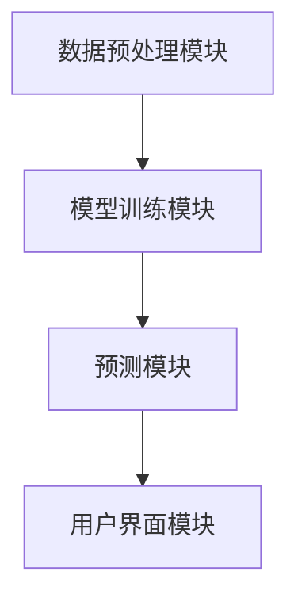

##### D.2.2 功能模块划分

功能模块划分是将系统划分为多个功能模块，每个模块负责一个特定的功能。以下是常见的功能模块划分：

1. **数据预处理模块**：负责数据清洗、数据转换和数据归一化，为模型训练提供准备好的数据集。
2. **模型训练模块**：负责训练深度学习模型，优化模型参数，提高模型性能。
3. **预测模块**：负责使用训练好的模型进行预测，生成预测结果。
4. **用户界面模块**：负责与用户交互，接收用户输入，展示预测结果。

以下是功能模块划分的Mermaid流程图：

```mermaid
graph TD
A[数据预处理] --> B[模型训练]
B --> C[预测]
C --> D[用户界面]
```

##### D.2.3 技术选型与实现策略

技术选型与实现策略是系统设计与实现的关键步骤，其目标是选择合适的技术和工具，确保系统的性能和可维护性。以下是技术选型与实现策略的主要内容：

1. **深度学习框架**：选择合适的深度学习框架，如TensorFlow、PyTorch等，确保模型的训练和预测效率。
2. **编程语言**：选择合适的编程语言，如Python、Java等，确保代码的可读性和可维护性。
3. **数据库**：选择合适的数据库，如MySQL、MongoDB等，存储和管理数据。
4. **云计算平台**：选择合适的云计算平台，如AWS、Azure等，提供计算资源和存储服务。
5. **部署策略**：设计合适的部署策略，确保系统的可靠性和可扩展性。

以下是技术选型与实现策略的Mermaid流程图：

```mermaid
graph TD
A[深度学习框架] --> B[编程语言]
B --> C[数据库]
C --> D[云计算平台]
D --> E[部署策略]
```

##### D.3 编码实现

编码实现是将系统设计转化为实际代码的过程。以下是编码实现的关键步骤：

1. **编写代码**：根据系统设计，编写各个功能模块的代码，遵循代码规范和最佳实践。
2. **代码审查**：组织代码审查，确保代码的质量和可维护性。
3. **单元测试**：编写单元测试用例，对每个功能模块进行测试，确保模块功能的正确性。
4. **集成测试**：将各个功能模块集成到一起，进行集成测试，确保系统整体功能的正确性。

以下是编码实现的Mermaid流程图：

```mermaid
graph TD
A[编写代码] --> B[代码审查]
B --> C[单元测试]
C --> D[集成测试]
```

##### D.4 测试与部署

测试与部署是确保系统质量和稳定运行的重要环节。以下是测试与部署的关键步骤：

1. **单元测试**：编写单元测试用例，对每个功能模块进行测试，确保模块功能的正确性。
2. **集成测试**：将各个功能模块集成到一起，进行集成测试，确保系统整体功能的正确性。
3. **系统测试**：进行全面的系统测试，包括功能测试、性能测试和稳定性测试，确保系统满足所有需求。
4. **部署**：将经过测试的系统部署到生产环境中，确保系统能够稳定运行。

以下是测试与部署的Mermaid流程图：

```mermaid
graph TD
A[单元测试] --> B[集成测试]
B --> C[系统测试]
C --> D[部署]
```

##### D.5 性能优化

性能优化是提升系统性能和响应速度的关键步骤。以下是性能优化的关键步骤：

1. **性能分析**：使用性能分析工具，对系统进行性能分析，识别性能瓶颈。
2. **代码优化**：对系统代码进行优化，提高代码的执行效率。
3. **数据库优化**：优化数据库查询和索引，提高数据访问速度。
4. **硬件优化**：升级硬件资源，提高系统的计算能力和存储容量。

以下是性能优化的Mermaid流程图：

```mermaid
graph TD
A[性能分析] --> B[代码优化]
B --> C[数据库优化]
C --> D[硬件优化]
```

##### D.6 运维管理

运维管理是确保系统稳定运行和持续优化的关键步骤。以下是运维管理的关键步骤：

1. **监控系统**：使用监控系统，实时监控系统的运行状态，识别异常情况。
2. **日志管理**：管理系统日志，包括错误日志、访问日志等，便于问题追踪和调试。
3. **备份与恢复**：定期备份系统数据，确保数据的安全性和可恢复性。
4. **升级与维护**：定期对系统进行升级和维护，确保系统的稳定性和安全性。

以下是运维管理的Mermaid流程图：

```mermaid
graph TD
A[监控系统] --> B[日志管理]
B --> C[备份与恢复]
C --> D[升级与维护]
```

通过以上项目实战指南，读者可以系统地规划和实施深度学习项目，从项目规划、需求分析、系统设计、编码实现到测试部署，确保项目能够高质量、高效率地完成。

### 附录E：参考资料与拓展阅读

深度学习作为一门前沿技术，持续涌现出大量的研究成果和应用案例。为了帮助读者进一步了解深度学习领域的最新进展和应用，本附录提供了丰富的参考资料与拓展阅读资源。

##### E.1 最新研究论文

了解深度学习的最新研究趋势和成果，阅读顶级会议和期刊的论文是必不可少的。以下是一些在深度学习领域具有重要影响力的学术期刊和会议：

1. **学术期刊**：
   - **NeurIPS (Neural Information Processing Systems)**：人工智能和机器学习的顶级会议。
   - **JMLR (Journal of Machine Learning Research)**：机器学习领域的顶级期刊。
   - **ICLR (International Conference on Learning Representations)**：深度学习和机器学习领域的顶级会议。

2. **会议论文**：
   - **CVPR (Computer Vision and Pattern Recognition)**：计算机视觉领域的顶级会议。
   - **ICML (International Conference on Machine Learning)**：机器学习领域的顶级会议。
   - **ACL (Association for Computational Linguistics)**：自然语言处理领域的顶级会议。

读者可以通过访问这些会议和期刊的官方网站，查找相关领域的最新论文，了解当前研究的热点和进展。

##### E.2 行业应用案例

深度学习技术在各行各业的应用案例层出不穷，以下是一些典型的行业应用案例：

1. **金融科技**：
   - **风险控制**：利用深度学习模型进行信用评估、欺诈检测等。
   - **量化交易**：通过深度学习算法进行市场趋势预测和交易策略优化。

2. **医疗健康**：
   - **疾病诊断**：利用深度学习模型进行医学影像分析，辅助医生诊断。
   - **个性化治疗**：基于患者数据，实现个性化的治疗方案。

3. **智能制造**：
   - **质量检测**：利用深度学习模型进行产品质量检测和故障诊断。
   - **智能工厂**：通过深度学习技术实现生产线的自动化控制和优化。

了解这些应用案例，可以帮助读者更好地理解深度学习技术在现实世界中的具体应用，以及如何结合行业需求进行技术创新。

##### E.3 学习资源与参考文献

为了系统地学习深度学习技术，以下是一些建议的学习资源与参考文献：

1. **书籍**：
   - **《深度学习》（Ian Goodfellow, Yoshua Bengio, Aaron Courville）**：深度学习领域的经典教材。
   - **《动手学深度学习》（Aston Zhang, Zach C. Lipton, Alexander J. Smola, LISA Lab）**：结合实践和理论，适合初学者入门。

2. **在线教程与课程**：
   - **Coursera**：提供由斯坦福大学等名校开设的深度学习课程，涵盖从基础到高级的各个层次。
   - **Udacity**：提供深度学习工程师纳米学位，包括实践项目和理论知识。

3. **开源项目和社区**：
   - **GitHub**：查找和贡献深度学习相关的开源项目。
   - **Reddit r/MachineLearning**：加入深度学习社区，参与讨论和交流。

通过以上参考资料和拓展阅读，读者可以深入了解深度学习的理论基础、最新研究进展以及实际应用，从而在深度学习领域不断进步和成长。

