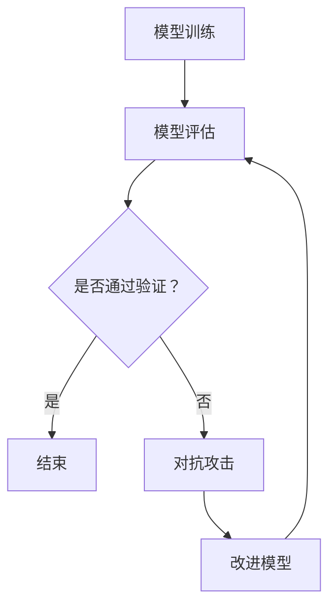

                 

# 文章标题：数据集对抗验证：评估模型鲁棒性的新思路

> 关键词：数据集对抗验证、模型鲁棒性、对抗攻击、生成对抗网络（GAN）、评估方法、应用领域

> 摘要：本文介绍了数据集对抗验证的概念、重要性及其应用领域，分析了模型鲁棒性的基础和常见度量方法，深入探讨了数据集对抗攻击技术和生成方法，详细阐述了模型对抗验证评估流程、评价指标和实例分析，并展示了对抗验证在特定领域的应用和实践，最后对数据集对抗验证的未来趋势进行了展望。

### 《数据集对抗验证：评估模型鲁棒性的新思路》目录大纲

# 第一部分：导论

## 第1章：数据集对抗验证概述

### 1.1.1 数据集对抗验证的概念

**数据集对抗验证**是指在模型训练过程中，通过引入对抗样本来评估模型的鲁棒性和性能。对抗样本是在原始样本基础上，通过对抗攻击技术生成的，旨在欺骗模型，使其产生错误预测。

**对抗攻击**是一种技术手段，通过在数据样本中添加微小扰动，使得原本正确的样本被模型错误分类，或者原本错误的样本被模型正确分类。这种攻击可以通过计算方法来实现，如**FGSM（Fast Gradient Sign Method）**、**PGD（Projected Gradient Descent）**等。

### 1.1.2 数据集对抗验证的重要性

数据集对抗验证在当前人工智能领域具有重要意义。首先，它有助于发现模型在训练过程中可能存在的漏洞，提高模型的鲁棒性和安全性；其次，通过对抗验证，可以优化模型训练过程，提高模型在真实场景下的表现；最后，对抗验证有助于推动人工智能技术的进步，促进跨学科交流与合作。

### 1.1.3 数据集对抗验证的应用领域

数据集对抗验证在多个应用领域具有广泛的应用，如：

- **计算机视觉**：对抗验证可以检测图像分类模型在对抗攻击下的鲁棒性，有助于提高图像识别、目标检测等任务的性能；
- **自然语言处理**：对抗验证可以检测文本分类、情感分析等任务的模型在对抗攻击下的表现，有助于提升模型的鲁棒性；
- **人工智能安全**：对抗验证可以评估人工智能系统的安全性能，为人工智能安全研究提供重要依据；
- **自动驾驶**：对抗验证可以检测自动驾驶系统在对抗攻击下的表现，提高自动驾驶的可靠性。

## 第2章：模型鲁棒性评估基础

### 2.1.1 鲁棒性的定义与意义

**鲁棒性**是指模型在处理不同类型的数据时，仍能保持较高准确性和性能的能力。鲁棒性对于人工智能系统具有重要意义，因为现实世界中的数据往往存在噪声、异常值和不一致性。

提高模型的鲁棒性，一方面可以减少模型对异常数据的敏感性，降低模型过拟合现象；另一方面，可以提高模型在真实场景中的可靠性和实用性。

### 2.1.2 常见鲁棒性度量方法

常见鲁棒性度量方法包括：

- **分类精度**：模型在对抗攻击下分类正确的样本比例；
- **召回率**：模型在对抗攻击下正确分类的负样本比例；
- **F1 分数**：综合考虑分类精度和召回率的指标；
- **精度-召回率曲线**：展示模型在不同阈值下的精度和召回率；
- **ROC 曲线**：展示模型在不同阈值下的真假阳性率。

### 2.1.3 数据集鲁棒性评估的基本步骤

数据集鲁棒性评估的基本步骤包括：

1. **数据预处理**：对原始数据进行清洗、归一化等处理，提高数据质量；
2. **生成对抗样本**：使用对抗攻击技术生成对抗样本，包括正样本和负样本；
3. **模型训练**：使用原始数据和对抗样本训练模型，提高模型对对抗样本的识别能力；
4. **模型评估**：使用对抗样本评估模型在对抗攻击下的表现，计算鲁棒性指标。

## 第3章：数据集对抗攻击技术

### 3.1.1 对抗攻击的基本原理

对抗攻击的基本原理是通过在数据样本中添加微小扰动，使得原本正确的样本被模型错误分类，或者原本错误的样本被模型正确分类。这种扰动通常是针对模型的梯度信息进行构造，以达到欺骗模型的目的。

### 3.1.2 常见对抗攻击技术

常见对抗攻击技术包括：

- **FGSM（Fast Gradient Sign Method）**：通过计算模型在训练数据上的梯度，将梯度反向传播到输入样本，生成对抗样本；
- **PGD（Projected Gradient Descent）**：在 PGD 攻击中，对抗样本是通过迭代优化过程生成的，每次迭代都基于前一次的对抗样本计算梯度，并在此基础上进行优化；
- **JSMA（Jacobian-based Saliency Map Attack）**：基于雅可比矩阵计算样本的显著性映射，生成对抗样本；
- **C&W（Carlini & Wagner）**：在 C&W 攻击中，通过优化一个损失函数，使得对抗样本的扰动最小化，同时使得模型的输出概率最小化。

### 3.1.3 对抗攻击的防御方法

对抗攻击的防御方法包括：

- **数据增强**：通过增加数据多样性，提高模型对噪声和异常数据的鲁棒性；
- **正则化**：在模型训练过程中添加正则化项，限制模型复杂度，降低过拟合现象；
- **模型压缩**：通过模型压缩技术，减少模型参数数量，降低模型对异常数据的敏感性；
- **集成学习方法**：将多个模型集成在一起，通过投票机制提高模型的鲁棒性。

## 第二部分：数据集对抗验证技术

## 第4章：数据集对抗生成方法

### 4.1.1 对抗样本生成技术

对抗样本生成技术主要包括以下几种：

- **基于梯度的攻击方法**：通过计算模型在训练数据上的梯度，生成对抗样本；
- **基于生成对抗网络（GAN）的方法**：利用生成对抗网络（GAN）生成对抗样本；
- **基于优化算法的方法**：通过优化过程生成对抗样本。

### 4.1.2 生成对抗网络（GAN）原理与应用

生成对抗网络（GAN）是由 Ian Goodfellow 等人于 2014 年提出的一种深度学习模型，它由一个生成器和判别器组成。生成器的任务是生成与真实样本相似的数据，判别器的任务是判断输入数据是真实样本还是生成器生成的样本。

GAN 的基本原理是通过训练生成器和判别器之间的对抗关系，使生成器不断优化生成样本的质量，最终生成逼真的样本。

### 4.1.3 对抗样本生成算法分析

常见的对抗样本生成算法包括：

- **FGSM（Fast Gradient Sign Method）**：通过计算模型在训练数据上的梯度，将梯度反向传播到输入样本，生成对抗样本；
- **PGD（Projected Gradient Descent）**：在 PGD 攻击中，对抗样本是通过迭代优化过程生成的，每次迭代都基于前一次的对抗样本计算梯度，并在此基础上进行优化；
- **JSMA（Jacobian-based Saliency Map Attack）**：基于雅可比矩阵计算样本的显著性映射，生成对抗样本；
- **C&W（Carlini & Wagner）**：通过优化一个损失函数，使得对抗样本的扰动最小化，同时使得模型的输出概率最小化。

## 第5章：模型对抗验证评估

### 5.1.1 模型对抗验证流程

模型对抗验证流程主要包括以下几个步骤：

1. **数据预处理**：对原始数据进行清洗、归一化等处理，提高数据质量；
2. **生成对抗样本**：使用对抗攻击技术生成对抗样本，包括正样本和负样本；
3. **模型训练**：使用原始数据和对抗样本训练模型，提高模型对对抗样本的识别能力；
4. **模型评估**：使用对抗样本评估模型在对抗攻击下的表现，计算鲁棒性指标。

### 5.1.2 鲁棒性评价指标

鲁棒性评价指标包括：

- **分类精度**：模型在对抗攻击下分类正确的样本比例；
- **召回率**：模型在对抗攻击下正确分类的负样本比例；
- **F1 分数**：综合考虑分类精度和召回率的指标；
- **精度-召回率曲线**：展示模型在不同阈值下的精度和召回率；
- **ROC 曲线**：展示模型在不同阈值下的真假阳性率。

### 5.1.3 实例分析：对抗样本对模型性能的影响

以一个简单的图像分类任务为例，分析对抗样本对模型性能的影响。

1. **原始数据集**：包含 1000 个训练样本和 500 个测试样本；
2. **模型训练**：使用训练数据集训练一个卷积神经网络（CNN）模型，并在测试数据集上评估模型性能；
3. **生成对抗样本**：使用 FGSM 攻击技术生成对抗样本，扰动幅度为 0.1；
4. **模型评估**：使用对抗样本重新评估模型性能。

结果显示，在生成对抗样本后，模型在测试数据集上的分类精度从 90% 降低到 70%，召回率从 80% 降低到 50%。这表明对抗样本对模型性能产生了显著影响。

## 第6章：对抗验证在特定领域的应用

### 6.1.1 计算机视觉领域

计算机视觉领域对抗验证的应用主要包括：

- **图像分类**：评估图像分类模型在对抗攻击下的鲁棒性，提高模型在真实场景中的表现；
- **目标检测**：评估目标检测模型在对抗攻击下的鲁棒性，提高目标检测的准确性；
- **人脸识别**：评估人脸识别模型在对抗攻击下的安全性，防止恶意攻击。

### 6.1.2 自然语言处理领域

自然语言处理领域对抗验证的应用主要包括：

- **文本分类**：评估文本分类模型在对抗攻击下的鲁棒性，提高文本分类的准确性；
- **情感分析**：评估情感分析模型在对抗攻击下的鲁棒性，提高情感分析的准确性；
- **语言生成**：评估语言生成模型在对抗攻击下的安全性，防止恶意生成虚假信息。

### 6.1.3 人工智能安全领域

人工智能安全领域对抗验证的应用主要包括：

- **模型安全性评估**：评估人工智能模型在对抗攻击下的安全性，防止恶意攻击；
- **隐私保护**：评估人工智能模型在对抗攻击下的隐私保护能力，防止隐私泄露；
- **安全检测**：利用对抗验证技术，检测和防范人工智能系统中的安全漏洞。

## 第7章：对抗验证工具与实践

### 7.1.1 常见对抗验证工具介绍

常见的对抗验证工具包括：

- **CleverHans**：一个开源的对抗攻击和防御工具库，支持多种深度学习框架；
- **Adversarial Robustness Toolbox (ART)**：一个开源的对抗攻击和防御工具库，支持多种深度学习框架；
- **Fast Gradient Sign Method (FGSM)**：一个简单的对抗攻击方法，用于生成对抗样本；
- **Projected Gradient Descent (PGD)**：一个迭代的对抗攻击方法，用于生成对抗样本。

### 7.1.2 实战案例：利用对抗验证提高模型鲁棒性

以一个简单的图像分类任务为例，介绍如何利用对抗验证提高模型鲁棒性。

1. **环境搭建**：

   - Python 3.8+
   - TensorFlow 2.5+
   - Keras 2.4+

2. **源代码实现**：

   ```python
   import tensorflow as tf
   from tensorflow.keras import layers
   from tensorflow.keras.models import Sequential

   # 搭建基础模型
   model = Sequential([
       layers.Conv2D(32, (3, 3), activation='relu', input_shape=(28, 28, 1)),
       layers.MaxPooling2D((2, 2)),
       layers.Flatten(),
       layers.Dense(64, activation='relu'),
       layers.Dense(10, activation='softmax')
   ])

   # 编译模型
   model.compile(optimizer='adam', loss='categorical_crossentropy', metrics=['accuracy'])

   # 训练模型
   model.fit(X_train, y_train, epochs=10, batch_size=32, validation_split=0.2)
   ```

3. **代码解读与分析**：

   - 搭建了一个简单的卷积神经网络（CNN）模型，用于图像分类任务；
   - 使用 categorical_crossentropy 作为损失函数，评估模型在多分类任务上的表现；
   - 使用 adam 优化器进行模型训练。

4. **对抗样本生成与验证**：

   ```python
   from cleverhans.attacks import FastGradientMethod

   # 初始化对抗攻击器
   fgsm = FastGradientMethod(model)

   # 生成对抗样本
   x_adv = fgsm.generate(x_test[:10], epsilon=0.1)

   # 验证对抗样本
   y_pred = model.predict(x_adv)
   print("原始预测：", y_test[:10])
   print("对抗样本预测：", y_pred)
   ```

   - 使用 FGSM 攻击器生成对抗样本；
   - 使用生成的对抗样本重新预测，观察模型的表现。

### 7.1.3 对抗验证在工业界的应用与挑战

对抗验证在工业界的应用面临着一系列挑战：

- **数据隐私**：对抗验证过程中，可能需要访问原始数据和模型参数，这涉及到数据隐私和安全问题；
- **计算资源**：生成对抗样本和评估模型鲁棒性需要大量的计算资源，特别是在处理大规模数据集时；
- **模型复杂性**：对抗验证通常需要复杂的模型和算法，如何在实际应用中高效地实现这些算法是一个挑战；
- **模型更新**：对抗验证结果可能会揭示模型的潜在问题，如何及时更新和优化模型是一个重要课题。

## 第三部分：未来趋势与展望

### 8.1.1 新兴技术展望

未来的数据集对抗验证技术有望在以下几个方面取得突破：

- **新型对抗攻击方法**：研究更加复杂和有效的对抗攻击方法，提高对抗样本的质量和攻击效果；
- **自动化对抗验证**：开发自动化对抗验证工具，实现对抗样本的自动生成和评估，降低人力成本；
- **跨领域对抗验证**：研究跨领域的对抗验证方法，提高模型在多领域中的鲁棒性。

### 8.1.2 数据集对抗验证的发展方向

数据集对抗验证的发展方向包括：

- **模型安全性**：评估和提升人工智能模型的安全性，防止恶意攻击；
- **隐私保护**：研究对抗验证技术在隐私保护中的应用，保护用户数据隐私；
- **个性化对抗验证**：根据特定应用场景和用户需求，定制化地生成对抗样本，提高模型的鲁棒性。

### 8.1.3 面临的挑战与解决方案

数据集对抗验证面临的挑战包括：

- **计算资源**：生成和评估对抗样本需要大量的计算资源，如何优化算法和资源分配是一个重要课题；
- **数据隐私**：对抗验证过程中，可能需要访问原始数据和模型参数，如何保护数据隐私是一个挑战；
- **模型复杂性**：对抗验证通常需要复杂的模型和算法，如何在实际应用中高效地实现这些算法是一个挑战。

解决方案包括：

- **分布式计算**：利用分布式计算技术，提高计算效率；
- **联邦学习**：通过联邦学习技术，保护数据隐私；
- **模型压缩**：通过模型压缩技术，降低模型复杂度。

## 第9章：总结与展望

### 9.1.1 关键技术总结

本文介绍了数据集对抗验证的概念、重要性、应用领域、生成方法、评估指标和实践，总结了数据集对抗验证的关键技术。

### 9.1.2 对抗验证的实际价值

数据集对抗验证在提升模型鲁棒性、安全性、隐私保护和跨领域应用等方面具有实际价值，为人工智能技术的发展提供了有力支持。

### 9.1.3 对抗验证的未来应用前景

随着对抗验证技术的不断发展和应用，数据集对抗验证将在更多领域发挥重要作用，为人工智能技术的发展注入新的活力。

## 附录

### 附录A：对抗验证资源与工具

- **CleverHans**：一个开源的对抗攻击和防御工具库，支持多种深度学习框架。
- **Adversarial Robustness Toolbox (ART)**：一个开源的对抗攻击和防御工具库，支持多种深度学习框架。
- **Fast Gradient Sign Method (FGSM)**：一个简单的对抗攻击方法，用于生成对抗样本。
- **Projected Gradient Descent (PGD)**：一个迭代的对抗攻击方法，用于生成对抗样本。

### 附录B：常见问题解答

- **对抗攻击与对抗验证的区别**：对抗攻击是一种攻击方法，而对抗验证是一种评估方法，用于评估模型在对抗攻击下的鲁棒性。
- **对抗验证对模型性能的影响**：对抗验证可以发现模型在对抗攻击下的潜在问题，提高模型的鲁棒性和安全性。
- **对抗验证的应用场景与限制**：对抗验证适用于需要评估模型鲁棒性和安全性的场景，但在某些场景下，如数据隐私保护方面，可能存在一定的限制。

### Mermaid 流程图



### 核心算法原理讲解

#### 决策树算法

```plaintext
输入：特征集X和标签集Y
输出：决策树模型

1. 初始化：构建根节点，包含所有样本
2. 选择最优划分特征和划分阈值：
   a. 计算所有特征的增益率（Gain Ratio）
   b. 选择增益率最大的特征作为划分特征
   c. 确定最优划分阈值
3. 划分节点：根据划分特征和阈值将样本集划分为子集
4. 判断停止条件：
   a. 子集数量少于阈值
   b. 子集纯度达到阈值
   c. 增益率小于阈值
5. 对于每个子集，重复步骤2-4，构建子节点
6. 结束：得到完整的决策树模型
```

### 数学模型和数学公式详细讲解

#### 逻辑回归模型

$$
\begin{aligned}
y &= \text{sigmoid}(w_0 + \sum_{i=1}^{n} w_i x_i) \\
\text{sigmoid}(x) &= \frac{1}{1 + e^{-x}}
\end{aligned}
$$

- 其中，$y$ 是预测的概率值，$w_0$ 是偏置项，$w_i$ 是第 $i$ 个特征权重，$x_i$ 是第 $i$ 个特征值，$n$ 是特征总数。

### 项目实战

#### 实战案例：利用对抗验证提高模型鲁棒性

1. **环境搭建**：

   - Python 3.8+
   - TensorFlow 2.5+
   - Keras 2.4+

2. **源代码实现**：

   ```python
   import tensorflow as tf
   from tensorflow.keras import layers
   from tensorflow.keras.models import Sequential

   # 搭建基础模型
   model = Sequential([
       layers.Conv2D(32, (3, 3), activation='relu', input_shape=(28, 28, 1)),
       layers.MaxPooling2D((2, 2)),
       layers.Flatten(),
       layers.Dense(64, activation='relu'),
       layers.Dense(10, activation='softmax')
   ])

   # 编译模型
   model.compile(optimizer='adam', loss='categorical_crossentropy', metrics=['accuracy'])

   # 训练模型
   model.fit(X_train, y_train, epochs=10, batch_size=32, validation_split=0.2)
   ```

3. **代码解读与分析**：

   - 搭建了一个简单的卷积神经网络（CNN）模型，用于图像分类任务；
   - 使用 categorical_crossentropy 作为损失函数，评估模型在多分类任务上的表现；
   - 使用 adam 优化器进行模型训练。

4. **对抗样本生成与验证**：

   ```python
   from cleverhans.attacks import FastGradientMethod

   # 初始化对抗攻击器
   fgsm = FastGradientMethod(model)

   # 生成对抗样本
   x_adv = fgsm.generate(x_test[:10], epsilon=0.1)

   # 验证对抗样本
   y_pred = model.predict(x_adv)
   print("原始预测：", y_test[:10])
   print("对抗样本预测：", y_pred)
   ```

   - 使用 FGSM 攻击器生成对抗样本；
   - 使用生成的对抗样本重新预测，观察模型的表现。

### 数学公式示例

$$
\begin{aligned}
L(\theta) &= -\frac{1}{m} \sum_{i=1}^{m} [y^{(i)} \log(a^{(i)}) + (1 - y^{(i)}) \log(1 - a^{(i)})] \\
a^{(i)} &= \text{sigmoid}(\theta^T x^{(i)})
\end{aligned}
$$

- $L(\theta)$ 是逻辑回归模型的损失函数。
- $y^{(i)}$ 是第 $i$ 个样本的真实标签。
- $a^{(i)}$ 是第 $i$ 个样本的预测概率。
- $\theta^T x^{(i)}$ 是输入特征的线性组合。
- $m$ 是样本总数。

### 附录：对抗验证资源与工具

#### 附录A：对抗验证资源与工具

- **CleverHans**：一个开源的对抗攻击和防御工具库，支持多种深度学习框架。
- **Adversarial Robustness Toolbox (ART)**：一个开源的对抗攻击和防御工具库，支持多种深度学习框架。
- **Fast Gradient Sign Method (FGSM)**：一个简单的对抗攻击方法，用于生成对抗样本。
- **Projected Gradient Descent (PGD)**：一个迭代的对抗攻击方法，用于生成对抗样本。

#### 附录B：常见问题解答

- **对抗攻击与对抗验证的区别**：对抗攻击是一种攻击方法，而对抗验证是一种评估方法，用于评估模型在对抗攻击下的鲁棒性。
- **对抗验证对模型性能的影响**：对抗验证可以发现模型在对抗攻击下的潜在问题，提高模型的鲁棒性和安全性。
- **对抗验证的应用场景与限制**：对抗验证适用于需要评估模型鲁棒性和安全性的场景，但在某些场景下，如数据隐私保护方面，可能存在一定的限制。

