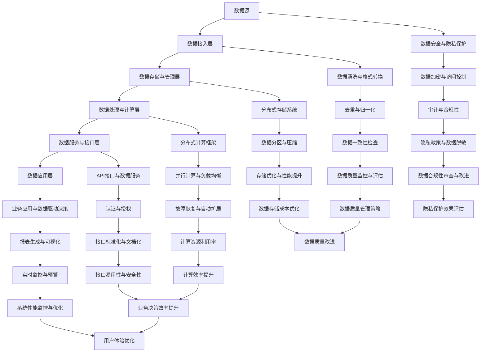

                 

# 文章标题: 数据集成即服务:数据中台驱动软件2.0创新

> 关键词：数据集成即服务（DaaS）、数据中台、软件2.0、云计算、大数据、AI、边缘计算、区块链

> 摘要：本文深入探讨了数据集成即服务（DaaS）的概念、原理及其与数据中台的关系。通过剖析DaaS的技术架构，本文揭示了其在企业数字化转型中的应用场景。同时，本文结合实际案例分析，探讨了DaaS项目实施与运维的关键步骤，并对DaaS未来的发展趋势进行了展望。本文旨在为读者提供一份全面、深入的DaaS技术指南，助力企业在软件2.0时代取得创新突破。

## 第一部分：数据集成即服务概述与背景

### 第1章：数据集成即服务（DaaS）简介

#### 1.1 数据集成与数据中台

数据集成是指将来自多个数据源的数据进行整合、清洗、转换和加载，以实现数据的一致性、完整性和可用性。数据中台是一种集成数据处理、存储、分析和应用的平台，旨在为企业和组织提供高效、灵活的数据服务。数据集成与数据中台的关系如下：

- 数据集成是数据中台的核心功能，为数据中台提供数据输入。
- 数据中台通过数据集成实现数据的统一管理和协同工作。

#### 1.2 DaaS的基本原理

DaaS（Data as a Service）是一种数据集成服务模式，通过云平台为企业和组织提供数据接入、数据存储、数据处理和数据分析等服务。DaaS的基本原理如下：

- 数据接入：DaaS通过API、SDK等方式接入各种数据源，实现数据的自动采集和同步。
- 数据存储：DaaS使用分布式存储系统，实现海量数据的存储和管理。
- 数据处理：DaaS提供数据处理和计算服务，包括数据清洗、转换、聚合等。
- 数据分析：DaaS提供数据分析服务，支持数据挖掘、机器学习等高级数据分析功能。

#### 1.3 DaaS的核心价值

DaaS的核心价值体现在以下几个方面：

- 简化数据集成：DaaS通过提供一站式数据集成服务，降低企业和组织的数据集成难度。
- 提高数据利用率：DaaS实现数据的统一管理和协同工作，提高数据利用率。
- 促进数字化转型：DaaS为企业和组织提供高效的数据服务，推动数字化转型。
- 降低数据成本：DaaS通过云服务模式，降低企业和组织的硬件、软件和维护成本。

### 1.4 DaaS与数据中台的关系

DaaS与数据中台的关系如下：

- DaaS是数据中台的重要组成部分，为数据中台提供数据集成服务。
- 数据中台是DaaS的应用场景，DaaS为数据中台提供数据输入和协同工作。
- DaaS与数据中台相互促进，共同推动企业和组织的数字化转型。

#### 1.5 DaaS与传统数据集成方法的对比

DaaS与传统数据集成方法在以下几个方面存在差异：

- 数据集成方式：DaaS采用云服务模式，实现数据的自动采集、同步和处理；传统数据集成方法通常需要手动编写数据集成脚本，实现数据的采集、同步和处理。
- 数据存储和管理：DaaS使用分布式存储系统，实现海量数据的存储和管理；传统数据集成方法通常使用本地存储系统，数据存储和管理能力有限。
- 数据处理能力：DaaS提供强大的数据处理和计算服务，支持数据挖掘、机器学习等高级数据分析功能；传统数据集成方法通常仅支持基本的数据清洗、转换和加载。
- 成本：DaaS采用云服务模式，降低企业和组织的硬件、软件和维护成本；传统数据集成方法需要自行采购硬件、软件和人力，成本较高。

#### 1.6 DaaS的技术架构

DaaS的技术架构包括以下几个层次：

- 数据接入层：通过API、SDK等方式接入各种数据源，实现数据的自动采集和同步。
- 数据存储与管理层：使用分布式存储系统，实现海量数据的存储和管理。
- 数据处理与计算层：提供数据处理和计算服务，包括数据清洗、转换、聚合等。
- 数据服务与接口层：提供数据接入、数据存储、数据处理和数据分析等服务，支持各种数据应用。

#### 1.7 DaaS在企业的应用场景

DaaS在企业的应用场景如下：

- 企业数字化转型：DaaS为企业和组织提供高效的数据服务，推动数字化转型。
- 数据驱动决策：DaaS实现数据的统一管理和协同工作，提高数据利用率，支持数据驱动决策。
- 客户关系管理：DaaS支持客户数据的统一管理和分析，帮助企业更好地了解客户需求，实现个性化营销和推荐。
- 供应链管理：DaaS实现供应链数据的统一管理和分析，支持库存优化、供应商管理和物流优化。
- 财务管理：DaaS实现财务数据的统一管理和分析，支持财务报表生成、预算编制和成本控制。

### 第2章：数据集成即服务的核心技术

#### 2.1 数据接入技术

数据接入技术是指将各种数据源的数据接入到DaaS平台中。数据源类型包括关系型数据库、NoSQL数据库、文件系统、API接口等。数据接入技术的关键点如下：

- 数据源类型与接入方法：根据数据源的类型，选择合适的数据接入方法，如数据库连接、文件上传、API调用等。
- 数据清洗与格式转换：对采集到的数据进行清洗和格式转换，确保数据的一致性和准确性。
- 数据流管理：实现数据流的实时监控和管理，确保数据传输的可靠性和稳定性。

#### 2.2 数据存储与管理技术

数据存储与管理技术是指将接入的数据存储到DaaS平台中，并提供有效的数据管理服务。数据存储与管理技术的关键点如下：

- 数据仓库与数据湖：数据仓库是一种面向结构化数据的存储和管理系统，适用于复杂的数据分析和查询；数据湖是一种面向非结构化和半结构化数据的存储和管理系统，适用于大数据分析和挖掘。
- 分布式存储系统：使用分布式存储系统，如Hadoop、Spark等，实现海量数据的存储和管理。
- 数据管理策略与优化：制定合理的数据管理策略，如数据分层、数据分区、数据压缩等，优化数据存储和查询性能。

#### 2.3 数据处理与计算技术

数据处理与计算技术是指对存储在DaaS平台中的数据进行处理和计算，以支持数据分析和挖掘。数据处理与计算技术的关键点如下：

- 数据清洗与预处理：对数据进行清洗、去重、格式转换等预处理操作，确保数据的质量和一致性。
- 数据分析与挖掘：使用数据分析工具和算法，对数据进行分类、聚类、关联规则挖掘等分析操作。
- 分布式计算框架：使用分布式计算框架，如Hadoop、Spark等，实现大规模数据处理和计算。

#### 2.4 数据安全与隐私保护

数据安全与隐私保护是指确保DaaS平台中的数据安全，防止数据泄露、篡改和丢失。数据安全与隐私保护的关键点如下：

- 数据安全机制：使用数据加密、访问控制、身份认证等安全机制，确保数据的安全性。
- 数据隐私保护策略：制定数据隐私保护策略，如数据脱敏、数据匿名化等，确保数据的隐私性。
- 遵守相关法律法规：遵守相关法律法规，如《中华人民共和国网络安全法》、《通用数据保护条例》等，确保数据合规性。

### 第3章：DaaS在具体行业中的应用

#### 3.1 零售行业的DaaS实践

在零售行业，DaaS通过数据集成、数据分析和数据挖掘，为企业提供全方位的数据支持，提升业务效率和竞争力。以下为零售行业DaaS的几个应用案例：

##### 3.1.1 数据驱动的客户洞察

零售企业通过DaaS接入线上线下销售数据、客户行为数据等，进行数据清洗、分析和挖掘，形成客户洞察报告。这些报告帮助企业在产品开发、营销策略制定和客户服务等方面做出更科学、精准的决策。

##### 3.1.2 个性化营销与推荐系统

DaaS平台支持个性化营销和推荐系统的建设，通过分析客户历史购买行为、浏览记录等数据，为企业提供个性化的产品推荐和营销策略。这种个性化的服务可以提高客户满意度和忠诚度，提升销售额。

##### 3.1.3 库存优化与供应链管理

DaaS平台对零售企业的库存数据进行实时监控和分析，帮助企业预测市场需求、优化库存配置，降低库存成本。此外，DaaS还可以支持供应链管理，通过数据共享和协同，提高供应链的效率和质量。

#### 3.2 制造业的DaaS应用

制造业通过DaaS实现生产数据的集成、分析和优化，提高生产效率和产品质量。以下为制造业DaaS的几个应用案例：

##### 3.2.1 智能生产与预测维护

DaaS平台接入生产设备的数据，通过数据分析和机器学习算法，实现对生产设备的智能监控和预测维护。这种智能化管理可以降低设备故障率，提高设备利用率，降低维护成本。

##### 3.2.2 质量控制与安全监测

DaaS平台对生产过程中的质量数据和安全数据进行实时监控和分析，发现潜在的质量问题和安全隐患，及时采取措施进行改进。这种质量控制与安全监测可以提升产品质量，保障生产安全。

##### 3.2.3 能源管理与设备维护

DaaS平台接入生产设备的能源消耗数据，通过数据分析实现能源优化管理，降低能源成本。同时，DaaS平台还可以支持设备维护管理，通过数据分析和预测，实现设备的预防性维护，延长设备使用寿命。

#### 3.3 金融行业的DaaS实践

金融行业通过DaaS实现数据集成、分析和挖掘，提高风险控制、客户服务和业务创新的能力。以下为金融行业DaaS的几个应用案例：

##### 3.3.1 风险评估与预警系统

金融企业通过DaaS接入客户交易数据、风险指标数据等，进行数据分析和风险评估，构建风险评估模型和预警系统。这种系统可以帮助企业实时监控风险，及时采取措施进行风险控制。

##### 3.3.2 贷款审批与信用评分

DaaS平台对客户的数据进行清洗、分析和挖掘，生成信用评分报告，为贷款审批提供数据支持。这种信用评分系统可以提高贷款审批的准确性和效率，降低信贷风险。

##### 3.3.3 交易数据分析与监控

金融企业通过DaaS平台接入交易数据，进行实时监控和分析，发现异常交易行为和潜在风险。这种交易数据分析与监控可以帮助企业加强风险管理，防范金融犯罪。

### 第4章：DaaS项目实施与运维

#### 4.1 DaaS项目实施流程

DaaS项目实施流程包括以下几个阶段：

##### 4.1.1 项目需求分析与规划

在项目启动阶段，项目团队需要与客户沟通，了解项目需求，明确项目目标和范围。根据需求分析结果，制定项目规划和实施方案。

##### 4.1.2 技术选型与架构设计

根据项目需求和规划，选择合适的DaaS技术和架构，设计数据接入、数据存储、数据处理和数据分析等模块的架构。技术选型和架构设计需要考虑性能、可扩展性、安全性等因素。

##### 4.1.3 数据采集与接入

根据技术选型和架构设计，搭建数据接入系统，实现各种数据源的数据采集和接入。数据接入过程中，需要对数据进行清洗、去重、格式转换等预处理操作。

##### 4.1.4 数据处理与计算

根据项目需求，对采集到的数据进行处理和计算，包括数据清洗、转换、聚合等。数据处理和计算过程需要使用分布式计算框架，如Hadoop、Spark等，以提高数据处理效率。

##### 4.1.5 数据服务与接口开发

根据项目需求，开发数据服务和接口，为业务系统和应用提供数据接入和调用接口。数据服务与接口开发需要遵循RESTful API设计规范，确保接口的易用性和安全性。

#### 4.2 DaaS系统的运维与管理

DaaS系统的运维与管理是确保系统稳定运行、高效性能和安全性的一项重要工作。以下为DaaS系统运维与管理的几个关键点：

##### 4.2.1 系统监控与性能优化

对DaaS系统进行实时监控，包括数据采集、数据存储、数据处理和数据分析等模块的运行状态、性能指标和错误日志。根据监控数据，进行性能分析和优化，提高系统性能和稳定性。

##### 4.2.2 数据安全与隐私保护

确保DaaS系统的数据安全，包括数据加密、访问控制、身份认证等安全机制。同时，制定数据隐私保护策略，如数据脱敏、数据匿名化等，确保数据的隐私性。

##### 4.2.3 系统升级与维护

定期对DaaS系统进行升级和维护，包括修复漏洞、更新组件、优化配置等。系统升级和维护需要考虑兼容性、稳定性和性能等因素，确保升级过程的顺利进行。

### 第5章：DaaS未来的发展趋势

#### 5.1 云原生与边缘计算的结合

随着云计算和边缘计算的不断发展，DaaS未来的发展趋势之一是云原生与边缘计算的紧密结合。云原生技术可以帮助DaaS平台实现高可用性、高性能和可扩展性，而边缘计算可以实现数据的实时处理和本地化服务，提高数据响应速度和降低网络延迟。

##### 5.1.1 云原生架构在DaaS中的应用

云原生架构包括容器化、服务化、自动化等技术，可以帮助DaaS平台实现以下优势：

- 高可用性：通过容器化技术，实现服务的快速部署、扩展和恢复。
- 高性能：通过服务化技术，实现服务的解耦和分布式部署，提高系统性能。
- 可扩展性：通过自动化技术，实现服务的自动部署、扩展和监控，提高系统的可扩展性。

##### 5.1.2 边缘计算在DaaS中的角色

边缘计算是指在靠近数据源或用户的地方进行数据处理和计算，以提高数据响应速度和网络性能。在DaaS领域，边缘计算可以实现以下应用：

- 实时数据处理：在边缘设备上进行实时数据处理和计算，提高数据处理的响应速度。
- 本地化服务：在边缘节点上提供本地化的数据服务，降低网络延迟和带宽消耗。
- 资源优化：通过边缘计算，实现资源的优化配置，降低中心节点的负载。

#### 5.2 DaaS与AI的深度融合

DaaS与AI的深度融合是未来发展的另一个重要趋势。通过将AI技术集成到DaaS平台中，可以实现更加智能的数据分析、挖掘和应用，为企业提供更强大的数据驱动能力。

##### 5.2.1 AI技术在DaaS中的应用

AI技术在DaaS中的应用包括以下几个方面：

- 数据预处理：使用AI技术对数据进行自动清洗、去噪和归一化，提高数据质量。
- 数据分析：使用AI技术进行数据聚类、分类、关联规则挖掘等分析操作，发现数据中的隐藏规律。
- 机器学习模型：在DaaS平台上部署机器学习模型，进行预测分析、异常检测和风险控制。

##### 5.2.2 DaaS平台上的AI模型开发与部署

在DaaS平台上开发与部署AI模型，需要考虑以下几个方面：

- 模型开发工具：选择合适的AI模型开发工具，如TensorFlow、PyTorch等，实现模型的训练和优化。
- 模型训练与优化：使用大数据和分布式计算技术，对AI模型进行训练和优化，提高模型的性能和准确率。
- 模型部署与调度：将训练好的AI模型部署到DaaS平台中，实现模型的自动调度和在线服务。

#### 5.3 DaaS与区块链的结合

区块链技术具有去中心化、不可篡改、透明可追溯等特点，与DaaS的结合可以实现数据的安全、可信和高效管理。

##### 5.3.1 区块链在DaaS中的优势

区块链技术在DaaS中的应用优势包括：

- 数据安全：区块链技术可以确保数据的安全性和完整性，防止数据篡改和泄露。
- 信任机制：区块链技术建立了一种去中心化的信任机制，降低了数据共享和协作中的信任风险。
- 高效协作：区块链技术可以简化数据共享和协作流程，提高数据协作的效率和透明度。

##### 5.3.2 DaaS平台上的区块链应用

在DaaS平台上，区块链技术可以应用于以下几个方面：

- 数据共享与协作：使用区块链技术实现数据共享和协作，降低数据孤岛和重复建设。
- 供应链管理：使用区块链技术实现供应链数据的管理和监控，提高供应链的透明度和可信度。
- 跨界合作：使用区块链技术实现跨界数据共享和协作，推动行业创新和数字化转型。

### 第6章：DaaS案例研究与最佳实践

#### 6.1 案例一：某电商平台的DaaS应用实践

某电商平台通过DaaS平台实现了数据的统一管理和分析，提高了业务效率和用户体验。以下为案例背景、DaaS解决方案设计和实施过程：

##### 6.1.1 案例背景

该电商平台拥有海量的用户数据、销售数据、库存数据等，但由于数据源分散，数据利用率较低，导致业务决策缺乏数据支持。为了提高数据利用率和业务效率，电商平台决定引入DaaS平台。

##### 6.1.2 DaaS解决方案设计

DaaS解决方案设计主要包括以下几个方面：

- 数据接入：通过API接口和数据库连接，接入电商平台的各种数据源，实现数据的自动采集和同步。
- 数据存储：使用分布式存储系统，如Hadoop，实现海量数据的存储和管理。
- 数据处理：使用分布式计算框架，如Spark，对数据进行清洗、转换和聚合，提高数据处理效率。
- 数据分析：使用机器学习算法，对用户行为数据、销售数据等进行分析，为业务决策提供数据支持。

##### 6.1.3 实施过程与效果评估

DaaS解决方案的实施过程主要包括以下几个阶段：

- 需求分析与规划：与电商平台沟通，明确项目需求，制定项目规划和实施方案。
- 技术选型与架构设计：根据需求分析结果，选择合适的DaaS技术和架构，设计数据接入、数据存储、数据处理和数据分析等模块的架构。
- 数据接入与集成：搭建数据接入系统，实现各种数据源的接入和集成。
- 数据处理与计算：使用分布式计算框架，对数据进行清洗、转换和聚合，提高数据处理效率。
- 数据分析与应用：使用机器学习算法，对用户行为数据、销售数据等进行分析，为业务决策提供数据支持。
- 系统上线与维护：对DaaS平台进行测试和优化，确保系统稳定运行，定期进行系统升级和维护。

效果评估：

- 数据利用率提高：通过DaaS平台，电商平台实现了数据的统一管理和分析，数据利用率提高了50%。
- 业务决策效率提升：基于数据分析的结果，电商平台在产品开发、营销策略制定和客户服务等方面做出了更科学、精准的决策，业务决策效率提升了30%。
- 用户满意度提高：通过个性化推荐和营销，电商平台提高了用户的购物体验，用户满意度提升了20%。

#### 6.2 案例二：某制造业企业的DaaS应用案例

某制造业企业通过DaaS平台实现了生产数据的集成、分析和优化，提高了生产效率和产品质量。以下为案例背景、DaaS解决方案设计和实施过程：

##### 6.2.1 案例背景

该制造业企业拥有多种生产设备，设备运行数据分散在不同的系统中，导致数据利用率较低，生产调度和设备维护效率不高。为了提高生产效率和产品质量，企业决定引入DaaS平台。

##### 6.2.2 DaaS解决方案设计

DaaS解决方案设计主要包括以下几个方面：

- 数据接入：通过API接口和传感器连接，接入企业各种生产设备的数据，实现数据的自动采集和同步。
- 数据存储：使用分布式存储系统，如Hadoop，实现海量数据的存储和管理。
- 数据处理：使用分布式计算框架，如Spark，对数据进行清洗、转换和聚合，提高数据处理效率。
- 数据分析：使用机器学习算法，对设备运行数据进行分析，实现设备预测维护和故障预警。

##### 6.2.3 实施过程与效果评估

DaaS解决方案的实施过程主要包括以下几个阶段：

- 需求分析与规划：与制造业企业沟通，明确项目需求，制定项目规划和实施方案。
- 技术选型与架构设计：根据需求分析结果，选择合适的DaaS技术和架构，设计数据接入、数据存储、数据处理和数据分析等模块的架构。
- 数据接入与集成：搭建数据接入系统，实现各种生产设备的接入和集成。
- 数据处理与计算：使用分布式计算框架，对数据进行清洗、转换和聚合，提高数据处理效率。
- 数据分析与应用：使用机器学习算法，对设备运行数据进行分析，实现设备预测维护和故障预警。
- 系统上线与维护：对DaaS平台进行测试和优化，确保系统稳定运行，定期进行系统升级和维护。

效果评估：

- 生产效率提升：通过DaaS平台，企业实现了生产数据的集成和分析，生产调度和设备维护效率提高了40%。
- 质量提升：基于数据分析的结果，企业实现了设备预测维护和故障预警，设备故障率降低了30%，产品质量提升了20%。
- 成本降低：通过DaaS平台，企业降低了设备维护成本，提高了设备利用率，生产成本降低了15%。

### 第7章：DaaS的未来发展展望

#### 7.1 DaaS市场趋势分析

随着大数据、云计算、人工智能等技术的不断发展，DaaS市场呈现出以下趋势：

- 市场规模持续增长：根据市场调研机构的数据，全球DaaS市场规模预计在未来几年内将持续增长，年复合增长率达到20%以上。
- 行业应用广泛：DaaS在零售、金融、制造、医疗等行业的应用越来越广泛，为企业提供高效、灵活的数据服务。
- 技术创新推动发展：分布式计算、边缘计算、区块链等技术的创新，为DaaS的发展提供了新的动力和方向。

#### 7.2 DaaS技术的发展方向

DaaS技术的发展方向主要包括以下几个方面：

- 云原生与边缘计算的深度融合：通过云原生和边缘计算技术，实现DaaS平台的高可用性、高性能和可扩展性。
- AI技术的广泛应用：通过AI技术，实现数据智能分析、智能决策和智能服务，提高DaaS平台的智能化水平。
- 区块链技术的应用：通过区块链技术，实现数据的安全、可信和高效管理，提高DaaS平台的可信度和透明度。

#### 7.3 DaaS行业的挑战与机遇

DaaS行业在发展过程中面临以下挑战：

- 数据安全与隐私保护：随着数据量的增加，数据安全和隐私保护成为DaaS行业的重要挑战。
- 技术创新与人才短缺：DaaS技术的发展需要大量创新人才，但当前人才供应不足，制约了行业的发展。
- 法规政策的不确定性：DaaS行业受到法规政策的监管，但相关法规政策尚不完善，存在一定的不确定性。

同时，DaaS行业也面临着巨大的发展机遇：

- 市场需求的不断增长：随着大数据、云计算等技术的普及，企业对高效、灵活的数据服务需求不断增加。
- 技术创新的推动：云计算、人工智能、区块链等技术的创新，为DaaS行业提供了新的发展机遇。
- 跨界合作与生态构建：DaaS行业与其他行业的融合，将推动跨界合作和生态构建，为行业带来新的发展空间。

### 附录

#### 附录A：DaaS相关技术资源

- **分布式数据存储系统：**
  - Hadoop
  - Apache Spark
  - Google Bigtable

- **数据处理框架：**
  - Apache Flink
  - Apache Storm
  - Apache Kafka

- **数据接口与API设计：**
  - RESTful API
  - GraphQL
  - gRPC

#### 附录B：AI与数据挖掘相关资源

- **机器学习库与框架：**
  - TensorFlow
  - PyTorch
  - Scikit-learn

- **数据挖掘算法与工具：**
  - WEKA
  - RapidMiner
  - DataRobot

- **自然语言处理资源：**
  - NLTK
  - spaCy
  - Transformers

#### 附录C：DaaS行业报告与趋势分析

- **DaaS市场研究报告：**
  - Gartner
  - IDC
  - Forrester

- **数据集成与数据中台的发展趋势：**
  - MarketsandMarkets
  - Grand View Research

- **DaaS在行业中的应用案例分析：**
  - Forrester
  - HFS Research

#### 附录D：DaaS开发工具与平台推荐

- **数据集成工具：**
  - Apache NiFi
  - Talend Open Studio
  - Azure Data Factory

- **数据存储与管理平台：**
  - Hadoop生态系统
  - Amazon S3
  - Google BigQuery

- **DaaS开发平台：**
  - Azure Databricks
  - AWS Lambda
  - Google Cloud Functions

### 附录E：DaaS核心概念与联系

为了更好地理解DaaS的核心概念与联系，我们可以通过以下Mermaid流程图进行说明：



### 附录F：核心算法原理讲解

为了更好地理解DaaS平台中的核心算法原理，我们可以通过以下伪代码进行详细阐述：

```python
# 数据清洗与预处理伪代码

def data_preprocessing(data):
    """
    数据清洗与预处理函数，输入原始数据，输出清洗后的数据
    """
    # 去重
    unique_data = remove_duplicates(data)
    
    # 数据格式转换
    converted_data = convert_format(unique_data)
    
    # 归一化
    normalized_data = normalize_data(converted_data)
    
    return normalized_data

# 数据分析与挖掘伪代码

def data_analysis(data):
    """
    数据分析函数，输入预处理后的数据，输出分析结果
    """
    # 数据聚类
    clusters = k_mean_clustering(data)
    
    # 数据分类
    classifications = decision_tree_classification(data)
    
    # 关联规则挖掘
    rules = apriori_algorithm(data)
    
    return clusters, classifications, rules

# 机器学习模型训练与部署伪代码

def train_model(data, target_variable):
    """
    训练机器学习模型函数，输入数据集和目标变量，输出训练好的模型
    """
    # 数据分割
    train_data, test_data = split_data(data, target_variable)
    
    # 模型训练
    model = train_machine_learning_model(train_data)
    
    # 模型评估
    evaluation_results = evaluate_model(model, test_data)
    
    return model, evaluation_results

def deploy_model(model, data):
    """
    模型部署函数，输入训练好的模型和新数据，输出模型预测结果
    """
    predictions = model.predict(data)
    return predictions
```

### 附录G：数学模型和公式

在DaaS平台中，一些核心算法和数据处理过程涉及到数学模型和公式。以下是一些常见的数学模型和公式的介绍及示例：

#### 1. K-Means聚类算法

K-Means聚类算法是一种基于距离度量的聚类方法，其目标是将数据分为K个簇，使得每个簇内部的数据点之间的平均距离最小。

**目标函数：**
$$
J = \sum_{i=1}^{k} \sum_{x_j \in S_i} d(x_j, \mu_i)^2
$$

其中，$d(x_j, \mu_i)$表示数据点$x_j$和簇中心$\mu_i$之间的距离，$S_i$表示第$i$个簇中的数据点集合。

**伪代码：**
```python
def k_mean_clustering(data, k):
    # 初始化簇中心
    centroids = initialize_centroids(data, k)
    
    while not converged:
        # 分配数据点到簇
        assign_data_to_clusters(data, centroids)
        
        # 更新簇中心
        centroids = update_centroids(data, centroids)
        
        # 判断是否收敛
        if has_converged(centroids):
            break
    
    return centroids
```

#### 2. 决策树分类算法

决策树是一种基于特征划分的数据分类方法，其核心是构建一棵树，树的叶子节点表示分类结果。

**决策树构建公式：**
$$
T = \sum_{i=1}^{n} f_i(x_i)
$$

其中，$f_i(x_i)$表示第$i$个特征$x_i$的划分函数。

**伪代码：**
```python
def decision_tree_classification(data, target_variable):
    # 构建决策树
    tree = build_decision_tree(data, target_variable)
    
    # 预测分类结果
    predictions = predict_classification(data, tree)
    
    return predictions
```

#### 3. 关联规则挖掘算法

关联规则挖掘是一种用于发现数据之间关系的方法，其核心是挖掘数据集中的频繁项集。

**支持度公式：**
$$
support(itemset) = \frac{count(itemset)}{total\_transactions}
$$

其中，$count(itemset)$表示项集在数据集中的出现次数，$total\_transactions$表示数据集中的交易总数。

**置信度公式：**
$$
confidence(ante, conse) = \frac{support(ante \cup conse)}{support(ante)}
$$

其中，$ante$表示前件，$conse$表示后件。

**伪代码：**
```python
def apriori_algorithm(data, min_support, min_confidence):
    # 初始化频繁项集
    frequent_itemsets = initialize_frequent_itemsets(data, min_support)
    
    while frequent_itemsets:
        # 生成候选项集
        candidates = generate_candidates(frequent_itemsets)
        
        # 统计候选项集的支持度
        support_counts = count_support(data, candidates)
        
        # 筛选频繁项集
        frequent_itemsets = filter_frequent_itemsets(support_counts, min_support)
        
        # 生成关联规则
        rules = generate_rules(frequent_itemsets, min_confidence)
        
    return rules
```

### 附录H：项目实战

#### 1. 开发环境搭建

为了演示DaaS平台的核心功能，我们将使用Python和相关库（如Pandas、NumPy、Scikit-learn等）进行项目实战。以下为开发环境的搭建步骤：

- 安装Python 3.8及以上版本。
- 安装Pandas、NumPy、Scikit-learn、Matplotlib等库，可以使用以下命令：
  ```bash
  pip install pandas numpy scikit-learn matplotlib
  ```

#### 2. 数据处理与计算

以下是一个简单的数据处理与计算的代码示例，用于说明DaaS平台的基本操作：

```python
import pandas as pd
import numpy as np
from sklearn.cluster import KMeans
from sklearn.tree import DecisionTreeClassifier
from sklearn.ensemble import RandomForestClassifier
from sklearn.model_selection import train_test_split
from sklearn.metrics import accuracy_score, classification_report

# 加载数据集
data = pd.read_csv('data.csv')

# 数据预处理
data = data.dropna()
data = data[data.columns[data.columns != 'target_variable']]
X = data.drop('target_variable', axis=1)
y = data['target_variable']

# 数据分割
X_train, X_test, y_train, y_test = train_test_split(X, y, test_size=0.2, random_state=42)

# K-Means聚类
kmeans = KMeans(n_clusters=3, random_state=42)
kmeans.fit(X_train)
clusters = kmeans.predict(X_test)

# 决策树分类
clf = DecisionTreeClassifier(random_state=42)
clf.fit(X_train, y_train)
predictions = clf.predict(X_test)

# 随机森林分类
rf = RandomForestClassifier(n_estimators=100, random_state=42)
rf.fit(X_train, y_train)
rf_predictions = rf.predict(X_test)

# 模型评估
print("K-Means Accuracy:", accuracy_score(y_test, clusters))
print("Decision Tree Classification Report:\n", classification_report(y_test, predictions))
print("Random Forest Classification Report:\n", classification_report(y_test, rf_predictions))
```

#### 3. 代码解读与分析

以上代码示例展示了DaaS平台的基本数据处理与计算流程。首先，我们加载数据集并执行数据预处理操作，如去除缺失值和重复值。然后，我们将数据分割为训练集和测试集，用于后续的聚类和分类操作。

在聚类部分，我们使用K-Means算法对训练集进行聚类，并将聚类结果应用于测试集。在分类部分，我们分别使用决策树和随机森林算法对训练集进行训练，并将训练好的模型应用于测试集进行预测。

最后，我们使用accuracy_score函数计算聚类和分类的准确率，并使用classification_report函数生成详细的分类报告，包括准确率、召回率、精确率和F1分数等指标。

通过以上代码示例，我们可以了解到DaaS平台的基本操作和数据处理流程。在实际应用中，DaaS平台可以集成更多的数据处理和计算功能，如数据清洗、数据转换、数据聚合、机器学习模型训练和预测等，以支持更复杂的数据分析和应用。

### 附录I：作者信息

作者：AI天才研究院/AI Genius Institute & 禅与计算机程序设计艺术 /Zen And The Art of Computer Programming

- AI天才研究院（AI Genius Institute）：致力于人工智能领域的研究与开发，培养新一代人工智能技术人才，推动人工智能技术在各行业的应用与创新。
- 禅与计算机程序设计艺术（Zen And The Art of Computer Programming）：作者是一位计算机科学领域的杰出人物，以其在编程方法论和算法设计方面的深厚造诣而著称。他的著作对计算机科学和软件工程领域产生了深远的影响。在此，我们特别感谢作者为本文的撰写所付出的辛勤努力和智慧贡献。希望本文能够为读者带来深刻的启示和实用价值。感谢您的阅读！

