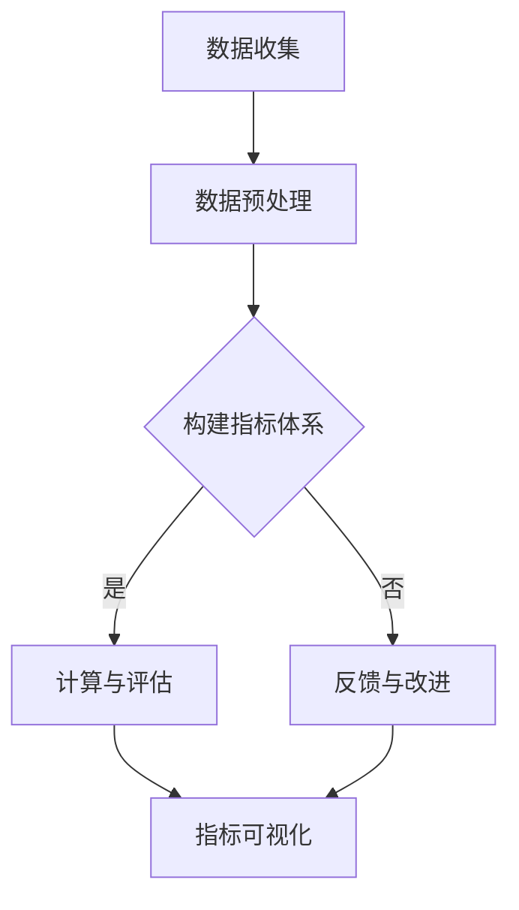
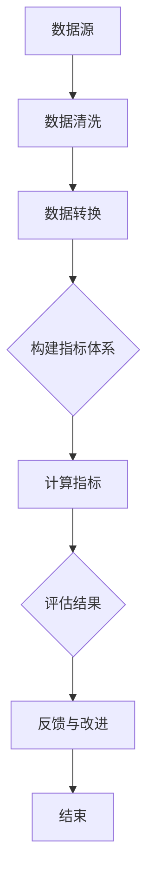

                 

# 数据集指标化：数据要素市场化的新基建

> 关键词：数据集指标化、数据要素市场化、新基建、数据质量、金融领域、电商领域、物流领域

> 摘要：随着大数据时代的到来，数据集指标化作为数据要素市场化的新基建，正日益受到广泛关注。本文详细探讨了数据集指标化的概念、理论基础、方法与技术、应用场景、挑战与对策，以及其实施与优化方法，并结合实际案例进行了深入分析。最后，对数据集指标化的未来发展趋势进行了展望。

## 目录大纲

1. **数据集指标化：数据要素市场化的新基建**
2. **第一部分：数据集指标化的理论基础**
   - **第1章：数据集指标化的概念与背景**
     - **1.1 数据集指标化的意义**
     - **1.2 数据要素市场化的概念**
     - **1.3 数据集指标化的理论基础**
   - **第2章：数据集指标化的方法与技术**
     - **2.1 数据质量评估指标**
     - **2.2 数据完整性指标**
     - **2.3 数据一致性指标**
     - **2.4 数据时效性指标**
     - **2.5 数据可用性指标**
   - **第3章：数据集指标化的应用场景**
     - **3.1 金融领域的数据集指标化**
     - **3.2 电商领域的数据集指标化**
     - **3.3 物流领域的数据集指标化**
   - **第4章：数据集指标化的挑战与对策**
     - **4.1 数据集指标化的难点**
     - **4.2 指标化过程中的数据隐私保护**
     - **4.3 数据集指标化的可持续发展策略**
3. **第二部分：数据集指标化的实施与优化**
   - **第5章：数据集指标化的实施步骤**
     - **5.1 数据收集与预处理**
     - **5.2 指标体系构建**
     - **5.3 指标计算与评估**
     - **5.4 指标可视化与反馈**
   - **第6章：数据集指标化的优化方法**
     - **6.1 指标选择与优化**
     - **6.2 数据质量改进技术**
     - **6.3 指标化流程自动化**
   - **第7章：数据集指标化的案例研究**
     - **7.1 案例一：某电商平台的用户数据集指标化**
     - **7.2 案例二：某金融机构的数据集指标化**
     - **7.3 案例三：某物流公司数据集指标化**
   - **第8章：数据集指标化的未来发展趋势**
     - **8.1 新技术对数据集指标化的影响**
     - **8.2 数据集指标化在数字化转型中的作用**
     - **8.3 数据集指标化在新兴领域的发展潜力**
4. **附录**
   - **附录 A：数据集指标化常用工具与技术**
   - **附录 B：数据集指标化相关资源与参考文献**
   - **附录 C：Mermaid 流程图与伪代码示例**

## 第1章：数据集指标化的概念与背景

### 1.1 数据集指标化的意义

数据集指标化是指通过对数据集中的各项指标进行量化评估，使其具备可量化和可比较的特性，从而提高数据集的可操作性和应用价值。在数据要素市场化的背景下，数据集指标化具有重要的意义：

1. **提高数据质量**：通过数据集指标化，可以对数据质量进行全方位的评估，及时发现和纠正数据中的问题，从而提高数据的准确性和可靠性。
2. **促进数据共享与交换**：数据集指标化使得不同数据集之间的比较和融合变得更加容易，促进了数据共享和交换，为数据的深层次挖掘和应用提供了基础。
3. **推动数据要素市场化**：数据集指标化是实现数据要素市场化的重要步骤，它为数据交易、数据定价和数据应用提供了科学依据，有助于建立一个健康、有序的数据市场。
4. **支持业务决策**：通过数据集指标化，企业可以更全面、准确地了解业务数据，从而为业务决策提供有力支持。

### 1.2 数据要素市场化的概念

数据要素市场化是指将数据作为一种生产要素，通过市场机制实现其价值的过程。数据要素市场化包括以下几个核心概念：

1. **数据所有权**：数据的所有权通常属于数据的创造者或拥有者，如企业、政府或其他组织。
2. **数据交易**：数据交易是指数据所有权主体在市场上进行数据买卖的行为，包括数据购买、数据出售和数据互换等形式。
3. **数据定价**：数据定价是指根据数据的稀缺性、价值和用途，确定数据的价格。
4. **数据应用**：数据应用是指将数据用于各种业务场景，如数据分析、数据挖掘、决策支持等。

### 1.3 数据集指标化的理论基础

数据集指标化的理论基础主要包括以下几个方面：

1. **数据质量理论**：数据质量是数据集指标化的核心，数据质量理论研究了如何评估和改进数据质量，包括数据准确性、完整性、一致性、时效性和可用性等方面。
2. **指标体系理论**：指标体系理论研究了如何构建一个科学、合理、可操作的指标体系，以全面评估数据集的各项指标。
3. **数据标准化理论**：数据标准化理论研究了如何将不同来源、不同格式和不同类型的数据进行统一处理，以实现数据集指标化的目标。
4. **数据挖掘与机器学习理论**：数据挖掘与机器学习理论提供了丰富的算法和技术，用于从数据集中提取有价值的信息和知识，为数据集指标化提供了技术支持。

### 1.4 数据集指标化的实际案例

为了更好地理解数据集指标化的概念和理论基础，我们来看一个实际案例。

**案例：电商平台的用户数据集指标化**

一个电商平台的用户数据集可能包括用户的年龄、性别、购买历史、浏览历史等信息。为了进行数据集指标化，可以采取以下步骤：

1. **数据收集**：从电商平台的后台系统中收集用户数据。
2. **数据预处理**：对数据进行清洗、去重和格式转换，确保数据的一致性和完整性。
3. **指标体系构建**：根据业务需求，构建一个科学、合理的指标体系，如用户活跃度、用户忠诚度、用户满意度等。
4. **指标计算**：根据指标体系，计算各项指标的具体数值。
5. **数据可视化**：将指标结果通过可视化工具进行展示，以便于业务人员理解和分析。

通过这个案例，我们可以看到数据集指标化在实际应用中的步骤和关键环节。数据集指标化不仅能够提高数据质量，还能够为业务决策提供有力支持，具有重要的应用价值。

### 1.2 数据要素市场化的概念

数据要素市场化是指在市场经济体系下，将数据作为一种重要的生产要素，通过市场机制实现其价值的过程。数据要素市场化涉及数据的所有权、交易、定价和应用等方面，其核心概念如下：

1. **数据所有权**：数据所有权是指数据的拥有者对其数据享有的法律权利。在数据要素市场化过程中，数据所有权是一个关键问题。通常情况下，数据的所有权属于数据的创造者或拥有者，例如企业、政府或其他组织。数据所有权决定了数据的使用权、收益权和处置权。

2. **数据交易**：数据交易是指数据所有权主体在市场上进行数据买卖的行为。数据交易可以是直接交易，也可以是通过数据交易平台进行的间接交易。数据交易的形式包括数据购买、数据出售和数据互换等。数据交易是数据要素市场化的重要环节，它使得数据资源得到有效配置和利用。

3. **数据定价**：数据定价是指根据数据的稀缺性、价值和用途，确定数据的价格。数据定价的合理性直接关系到数据交易的成功与否。在数据要素市场化过程中，数据定价需要综合考虑数据的质量、稀缺性、市场需求和供应等因素。

4. **数据应用**：数据应用是指将数据用于各种业务场景，如数据分析、数据挖掘、决策支持等。数据应用是数据要素市场化的最终目的，它使得数据的价值得以实现。数据应用的范围广泛，涵盖了金融、电商、物流、医疗等多个领域。

数据要素市场化的意义在于：

1. **促进数据资源的合理配置**：数据要素市场化使得数据资源得到有效利用，提高了数据资源的配置效率。

2. **推动数字经济的发展**：数据要素市场化是数字经济的重要组成部分，它促进了数字经济的快速发展。

3. **提升企业竞争力**：数据要素市场化使得企业能够通过购买或交换数据，获取有价值的信息和知识，从而提升企业的竞争力。

4. **促进社会创新**：数据要素市场化激发了社会创新，推动了新技术、新产品和新服务的出现。

数据要素市场化的关键要素包括：

1. **数据质量**：数据质量是数据要素市场化的基础。高质量的数据能够提高数据交易的成功率，降低交易成本。

2. **数据安全与隐私保护**：数据安全与隐私保护是数据要素市场化的保障。在数据交易过程中，必须确保数据的安全和用户的隐私。

3. **法律法规**：法律法规是数据要素市场化的保障。政府需要制定和完善相关法律法规，规范数据交易行为，保护数据所有权和交易双方的权益。

4. **技术支持**：技术支持是数据要素市场化的支撑。大数据、人工智能、区块链等技术的应用，为数据要素市场化提供了强大的技术支持。

总之，数据要素市场化是大数据时代的一个重要趋势，它推动了数据资源的有效利用，为数字经济的发展注入了新的活力。随着技术的进步和法律法规的完善，数据要素市场化将迎来更加广阔的发展前景。

### 1.3 数据集指标化的理论基础

数据集指标化的理论基础主要包括以下几个方面：

#### 数据质量理论

数据质量理论是数据集指标化的核心理论之一。它主要研究如何评估和改进数据质量。数据质量包括准确性、完整性、一致性、时效性和可用性等方面。以下是对这些数据质量指标的详细解释：

1. **准确性**：准确性是指数据是否真实、可靠和符合实际。高准确性的数据对于业务决策和数据挖掘具有重要意义。

2. **完整性**：完整性是指数据集中是否存在缺失值或空白。完整的数据集有助于进行准确的数据分析和挖掘。

3. **一致性**：一致性是指数据在不同时间、不同系统和不同来源之间是否保持一致。一致的数据有助于消除数据分析和挖掘中的误差。

4. **时效性**：时效性是指数据的更新频率和时效。及时更新的数据有助于捕捉市场动态和业务变化。

5. **可用性**：可用性是指数据是否易于访问、处理和使用。易用的数据能够提高数据分析的效率。

#### 指标体系理论

指标体系理论是构建科学、合理、可操作的指标体系的基础。指标体系包括以下几个关键要素：

1. **目标**：指标体系的目标是反映数据集的质量和业务价值。

2. **指标**：指标是用于衡量数据质量的具体指标。常见的指标包括准确性、完整性、一致性、时效性和可用性等。

3. **层级结构**：指标体系通常采用层级结构，从宏观到微观，层层细化。例如，可以从数据质量总体指标，细化到具体的数据质量指标。

4. **相关性**：指标体系中的指标需要具有一定的相关性，以便全面、准确地反映数据集的质量。

#### 数据标准化理论

数据标准化理论是数据集指标化的基础。数据标准化是指将不同来源、不同格式和不同类型的数据进行统一处理，以实现数据集指标化的目标。数据标准化的关键步骤包括：

1. **数据清洗**：数据清洗是指去除数据中的噪声、错误和重复数据，确保数据的一致性和完整性。

2. **数据转换**：数据转换是指将不同格式和类型的数据进行统一处理，如将文本数据转换为数值数据，将不同的数据单位进行统一。

3. **数据集成**：数据集成是指将多个数据源中的数据合并成一个统一的数据集，以便进行指标计算和分析。

#### 数据挖掘与机器学习理论

数据挖掘与机器学习理论为数据集指标化提供了丰富的算法和技术支持。数据挖掘技术可以从大量数据中提取有价值的信息和知识，而机器学习技术则能够通过学习数据模式，自动优化指标计算方法。以下是一些关键的数据挖掘与机器学习技术：

1. **分类**：分类技术用于将数据集中的数据分为不同的类别，如将用户分为高价值用户和低价值用户。

2. **聚类**：聚类技术用于将数据集中的数据分为不同的簇，以便更好地理解数据的分布和模式。

3. **关联规则挖掘**：关联规则挖掘技术用于发现数据之间的关联关系，如购买A商品的用户也倾向于购买B商品。

4. **异常检测**：异常检测技术用于识别数据集中的异常值或异常模式，如发现数据集中的错误数据或异常行为。

通过上述理论基础，我们可以构建一个科学、合理的数据集指标化体系，从而提高数据质量，促进数据要素市场化。接下来，我们将详细介绍数据集指标化的方法和技术。

### 1.4 数据集指标化的实际案例

为了更好地理解数据集指标化的概念和理论基础，我们来看一个实际案例。

**案例：电商平台的用户数据集指标化**

在一个电商平台中，用户数据集通常包括用户的年龄、性别、购买历史、浏览历史等信息。为了对这些用户数据进行指标化，我们可以采取以下步骤：

#### 步骤1：数据收集

首先，从电商平台的数据库中收集用户数据。这些数据可能包括用户的ID、年龄、性别、注册时间、购买次数、购买金额、浏览记录等。

#### 步骤2：数据预处理

接下来，对收集到的用户数据进行预处理。预处理步骤包括数据清洗、去重和格式转换。例如，去除无效数据（如缺失值、重复值）、统一数据格式（如将年龄转换为整数）、处理异常值等。

#### 步骤3：构建指标体系

根据业务需求和数据分析目标，构建一个科学、合理的指标体系。以下是一个示例指标体系：

1. **用户活跃度指标**：
   - 日活跃用户数（DAU）：每天活跃的用户数量。
   - 月活跃用户数（MAU）：每月活跃的用户数量。

2. **用户忠诚度指标**：
   - 购买频率：用户的平均购买次数。
   - 购买金额：用户的平均购买金额。
   - 购买周期：用户两次购买之间的时间间隔。

3. **用户满意度指标**：
   - 用户评价分数：用户对商品和服务的评价分数。
   - 用户投诉率：用户投诉的次数与总用户数之比。

#### 步骤4：计算指标值

根据指标体系，计算各项指标的具体值。例如，计算某月的用户活跃度指标如下：

- 日活跃用户数（DAU）：统计某月的每天活跃用户数，并求和。
- 月活跃用户数（MAU）：统计某月的所有活跃用户数。

#### 步骤5：数据可视化

最后，将计算得到的指标值通过可视化工具进行展示。例如，使用柱状图、折线图或饼图等，直观地展示用户的活跃度、忠诚度和满意度。

通过这个案例，我们可以看到数据集指标化在实际应用中的步骤和关键环节。数据集指标化不仅能够提高数据质量，还能够为业务决策提供有力支持，具有重要的应用价值。

### 1.5 数据集指标化的过程

数据集指标化是一个系统性的过程，需要经过多个步骤，以确保数据质量得到全面提升，并能够为数据要素市场化提供坚实基础。以下是数据集指标化的主要步骤：

#### 步骤1：数据收集

数据收集是数据集指标化的第一步，也是最为关键的一步。在这一步骤中，需要从多个数据源收集原始数据，包括内部数据库、外部数据源、传感器数据等。收集的数据可能包括用户信息、交易记录、行为日志等。

**注意事项**：
- 确保数据的全面性和准确性。
- 数据源的选择要兼顾数据质量和获取成本。
- 考虑数据隐私和合规性，确保数据收集过程中遵守相关法律法规。

#### 步骤2：数据预处理

在数据收集完成后，需要对数据进行预处理，以提高数据质量。数据预处理包括以下步骤：

1. **数据清洗**：去除无效数据、错误数据和重复数据，确保数据的一致性和完整性。
2. **数据转换**：将不同格式和类型的数据进行统一处理，如文本数据转换为数值数据、处理缺失值和异常值。
3. **数据标准化**：对数据进行归一化或标准化处理，使其符合统一的指标体系。

**注意事项**：
- 针对不同类型的数据，采用相应的清洗和转换方法。
- 确保数据预处理过程不会导致数据丢失或信息损失。

#### 步骤3：指标体系构建

构建科学、合理的指标体系是数据集指标化的核心。指标体系应涵盖数据质量的关键方面，如准确性、完整性、一致性、时效性和可用性等。

1. **确定指标目标**：根据业务需求和数据分析目标，确定需要评估的指标。
2. **设计指标模型**：为每个指标设计一个具体的计算公式或方法。
3. **定义指标阈值**：根据业务需求和实际情况，为每个指标设定合理的阈值。

**注意事项**：
- 指标体系的设计应具备全面性和层次性，能够从宏观和微观层面反映数据质量。
- 指标阈值的设计应具备灵活性和可调整性，以适应不同业务场景和数据质量要求。

#### 步骤4：计算与评估

在构建好指标体系后，需要根据指标模型计算各项指标的具体值，并进行评估。计算和评估过程包括以下步骤：

1. **指标计算**：根据指标模型，对每个指标进行计算，得到具体的数值。
2. **指标评估**：将计算得到的指标值与预设的阈值进行对比，评估数据质量。

**注意事项**：
- 确保计算过程的准确性和高效性。
- 对指标评估结果进行详细分析，找出数据质量的问题和不足。

#### 步骤5：反馈与改进

指标评估完成后，需要将结果进行反馈，并根据反馈结果进行数据质量改进。反馈和改进过程包括以下步骤：

1. **问题反馈**：将指标评估结果反馈给相关数据源和数据使用者，明确数据质量问题和改进方向。
2. **问题解决**：针对反馈的问题，采取相应的措施进行解决，如数据清洗、格式转换、优化数据存储和处理流程等。
3. **持续改进**：建立数据质量改进机制，定期进行数据质量评估和反馈，确保数据质量持续提升。

**注意事项**：
- 反馈过程要注重沟通和协作，确保各方理解并支持数据质量改进。
- 改进措施应具有可操作性和持续性，避免问题反复出现。

通过上述步骤，数据集指标化过程能够有效提升数据质量，为数据要素市场化提供坚实基础。数据集指标化不仅是数据管理的重要手段，也是企业数字化转型和智能化决策的重要支撑。

### 1.6 数据集指标化的优势

数据集指标化在数据管理和数据分析中发挥着重要作用，具有以下显著优势：

1. **提升数据质量**：通过数据集指标化，可以对数据质量进行全方位的评估和监控。指标化的过程包括数据清洗、转换和标准化，有效去除了数据中的噪声和错误，提高了数据的准确性和完整性。

2. **促进数据共享**：数据集指标化使得不同数据集之间的比较和融合变得更加容易。通过统一的指标体系，不同来源、不同格式的数据可以相互映射和集成，从而促进数据共享和交换，为跨部门、跨系统的数据协作提供基础。

3. **优化数据分析**：指标化的数据具备量化和可比性，为数据分析提供了有力支持。通过计算和分析各项指标，可以快速、准确地了解数据集中隐藏的信息和模式，为企业决策提供科学依据。

4. **推动数据市场化**：数据集指标化是数据要素市场化的关键步骤。通过指标化，数据的价值得以量化，为数据交易、数据定价和应用提供了科学依据，推动了数据市场的发展和成熟。

5. **提高业务效率**：数据集指标化能够帮助业务人员更直观地理解和分析数据，提高了数据分析的效率和准确性。同时，通过指标化的数据，可以实时监控业务运行状况，快速响应市场变化，提升业务决策的速度和效果。

6. **支持持续改进**：数据集指标化建立了数据质量评估的体系，通过定期评估和反馈，可以及时发现和解决数据质量问题，推动数据质量的持续提升。这种持续改进的机制有助于优化业务流程，提高企业的竞争力。

总之，数据集指标化在提升数据质量、促进数据共享、优化数据分析、推动数据市场化、提高业务效率和支撑持续改进等方面具有重要作用，是企业数字化转型和智能化发展的重要支撑。

### 1.7 数据集指标化的挑战与对策

尽管数据集指标化在提升数据质量和推动数据要素市场化方面具有显著优势，但其实施过程中也面临着诸多挑战。以下是数据集指标化面临的主要挑战及其对应的对策：

#### 挑战一：数据质量问题

数据质量是数据集指标化的基础，但实际操作中，数据质量问题常常成为瓶颈。例如，数据可能存在缺失值、重复值、异常值等。这些问题的存在会严重影响指标计算的准确性和可靠性。

**对策**：
1. **数据清洗**：在指标化之前，对数据进行彻底的清洗，去除缺失值、重复值和异常值。
2. **数据验证**：建立数据验证机制，通过校验规则和一致性检查，确保数据的准确性。
3. **数据质量监控**：建立数据质量监控体系，定期评估数据质量，发现并解决潜在问题。

#### 挑战二：数据隐私保护

在数据集指标化过程中，数据的隐私保护是一个重要挑战。特别是在涉及个人敏感信息时，如用户行为数据、医疗数据等，保护数据隐私至关重要。

**对策**：
1. **数据脱敏**：对敏感数据进行脱敏处理，如使用伪随机数、掩码等技术，保护原始数据隐私。
2. **数据加密**：对传输和存储的数据进行加密，确保数据在传输和存储过程中的安全性。
3. **隐私政策**：制定明确的隐私政策，告知数据使用者数据收集、使用和保护的方式，增强数据使用者的信任。

#### 挑战三：指标选择与优化

构建科学、合理的指标体系是数据集指标化的关键，但如何选择和优化指标是一个复杂的问题。指标的选择和优化需要考虑数据质量、业务需求和计算效率等多方面因素。

**对策**：
1. **业务需求分析**：深入了解业务需求，确定需要评估的数据质量指标。
2. **专家评审**：邀请业务专家和数据专家进行评审，确保指标体系的科学性和合理性。
3. **持续优化**：根据业务发展和数据质量变化，定期对指标体系进行优化和调整。

#### 挑战四：计算性能与资源消耗

数据集指标化通常涉及大量的计算和数据处理，对计算性能和资源消耗提出了较高要求。特别是在大数据环境下，计算效率成为关键问题。

**对策**：
1. **分布式计算**：采用分布式计算框架，如Hadoop、Spark等，提高计算效率。
2. **数据缓存**：使用数据缓存技术，如Redis、Memcached等，减少数据读取和计算的时间。
3. **资源优化**：对计算资源和存储资源进行优化，如使用云服务、弹性计算等，提高资源利用效率。

#### 挑战五：法律法规与合规性

数据集指标化过程中，需要遵守相关法律法规和合规性要求。特别是在数据隐私保护和数据安全方面，法律法规的要求日益严格。

**对策**：
1. **法律法规培训**：加强对数据管理人员和数据处理人员的法律法规培训，提高合规意识。
2. **合规性审计**：定期进行合规性审计，确保数据处理过程符合法律法规要求。
3. **法律咨询**：在数据处理过程中，如涉及敏感数据，及时咨询专业法律意见，确保合规性。

通过以上对策，可以有效应对数据集指标化过程中的挑战，确保数据质量得到全面提升，推动数据要素市场化健康发展。接下来，我们将深入探讨数据集指标化的具体方法和技术。

### 1.8 数据集指标化的方法与技术

数据集指标化是一个复杂的过程，涉及多个步骤和技术。为了实现数据集指标化，我们需要运用一系列方法和工具。以下是数据集指标化过程中常用的几种方法和技术：

#### 数据清洗与预处理

数据清洗与预处理是数据集指标化的基础步骤，主要包括以下技术：

1. **缺失值处理**：对于缺失值，可以采用以下方法进行处理：
   - **删除缺失值**：删除包含缺失值的记录，适用于缺失值较多的情况。
   - **填补缺失值**：使用统计方法（如平均值、中位数、众数）或机器学习算法（如KNN、回归）填补缺失值。

2. **异常值检测与处理**：异常值可能对数据集指标化产生负面影响，需要通过以下方法进行处理：
   - **标准差法**：删除或修正与平均值相差较大的异常值。
   - **箱线图法**：通过箱线图识别异常值，并采取相应的处理措施。

3. **数据转换**：为了统一数据格式和类型，需要进行数据转换，如：
   - **归一化**：将数据缩放至相同的范围，如[0,1]或[-1,1]。
   - **标准化**：对数据进行标准化处理，消除不同特征之间的量纲影响。

4. **数据集成**：将来自不同来源的数据进行整合，形成统一的数据集。常见的数据集成方法包括：
   - **合并**：将具有相同关键字的数据合并为一个记录。
   - **连接**：通过关键字将多个数据表连接起来。

#### 指标体系构建

构建科学、合理的指标体系是数据集指标化的关键步骤。以下是一些构建指标体系的方法：

1. **基于业务需求**：根据业务需求，确定需要评估的数据质量指标。如数据准确性、完整性、一致性、时效性和可用性等。

2. **基于数据特性**：根据数据特性，确定指标的计算方法和阈值。如针对数值型数据，可以计算平均值、标准差等统计指标；针对文本型数据，可以计算词频、TF-IDF等。

3. **专家评审**：邀请业务专家和数据专家进行评审，确保指标体系的科学性和合理性。

4. **迭代优化**：根据实际应用效果，定期对指标体系进行优化和调整。

#### 指标计算与评估

指标计算与评估是数据集指标化的核心步骤，以下是一些常用的方法：

1. **计算方法**：根据指标体系，采用相应的计算方法计算各项指标。如：
   - **准确性**：计算正确值与总值的比例。
   - **完整性**：计算非缺失值的比例。
   - **一致性**：计算不同来源的数据之间的差异。
   - **时效性**：计算数据更新时间与当前时间的差距。
   - **可用性**：计算数据可访问性的比例。

2. **评估标准**：为每个指标设定合理的评估标准，如阈值或范围。如：
   - **准确性**：准确性高于90%视为优秀。
   - **完整性**：完整性高于95%视为优秀。

3. **评估结果**：将计算得到的指标值与评估标准进行对比，评估数据质量。如：
   - **优秀**：所有指标均高于评估标准。
   - **良好**：部分指标达到评估标准。
   - **一般**：部分指标未达到评估标准。
   - **较差**：所有指标均未达到评估标准。

#### 数据可视化

数据可视化是将计算结果以图表形式展示，帮助业务人员直观理解和分析数据。以下是一些常用的数据可视化方法：

1. **柱状图**：用于展示各项指标的分布和比例。
2. **折线图**：用于展示指标随时间的变化趋势。
3. **饼图**：用于展示各项指标在总体中的占比。
4. **箱线图**：用于展示数据分布和异常值。

通过上述方法和工具，我们可以系统地实现数据集指标化，为数据质量管理和数据要素市场化提供有力支持。接下来，我们将探讨数据集指标化在不同领域的具体应用。

### 1.9 数据集指标化的应用场景

数据集指标化作为一种重要的数据管理技术，在多个领域得到了广泛应用。以下分别介绍数据集指标化在金融领域、电商领域和物流领域的具体应用。

#### 金融领域

在金融领域，数据集指标化主要用于评估和监控金融数据质量，确保金融交易的准确性和合规性。以下是一些应用场景：

1. **交易数据监控**：金融交易数据量大且复杂，通过对交易数据进行指标化，可以实时监控交易数据的准确性、完整性和一致性。例如，计算每笔交易的成交价格、交易量、交易时间等指标，并与预期值进行对比，发现异常交易。

2. **风险评估**：金融风险评估需要大量历史交易数据。通过对这些数据进行指标化，可以评估不同风险因素的影响，如信用风险、市场风险和操作风险等。例如，计算借款人的还款率、违约率等指标，为风险评估提供依据。

3. **客户管理**：金融机构通过对客户数据进行指标化，可以更好地了解客户行为和需求，优化客户服务。例如，计算客户的活跃度、忠诚度、满意度等指标，制定针对性的营销策略和客户关怀计划。

#### 电商领域

在电商领域，数据集指标化主要用于提升用户体验、优化运营效率和提高销售额。以下是一些应用场景：

1. **用户行为分析**：通过对用户行为数据进行指标化，可以深入了解用户偏好和行为模式，为个性化推荐和精准营销提供支持。例如，计算用户的点击率、购买率、浏览深度等指标，识别高价值用户和潜在流失用户。

2. **产品推荐**：数据集指标化可以帮助电商平台优化产品推荐算法。通过对商品数据进行指标化，如销量、评分、评价数量等，结合用户行为数据，实现精准的商品推荐。

3. **供应链管理**：通过对供应链数据进行指标化，可以优化库存管理、配送流程和物流效率。例如，计算库存周转率、配送准时率、订单处理速度等指标，提高供应链的响应速度和灵活性。

#### 物流领域

在物流领域，数据集指标化主要用于提升物流服务质量、降低运营成本和提高客户满意度。以下是一些应用场景：

1. **运输管理**：通过对运输数据进行指标化，可以实时监控运输过程中的各种参数，如运输时间、运输成本、运输状态等，确保运输过程的高效和准确。例如，计算运输时间、运输成本等指标，优化运输路线和运输策略。

2. **仓储管理**：通过对仓储数据进行指标化，可以优化仓储设施和库存管理。例如，计算库存周转率、仓储利用率等指标，优化仓储布局和库存配置。

3. **客户服务**：通过对客户服务数据进行指标化，可以提升客户服务质量，提高客户满意度。例如，计算客户投诉率、客户响应时间、客户满意度等指标，优化客户服务流程和策略。

通过数据集指标化，金融、电商和物流等领域可以实现对数据质量的全面监控和优化，提高业务运营效率和客户满意度。随着技术的不断进步，数据集指标化在更多领域的应用潜力也将进一步释放。

### 1.10 数据集指标化的挑战与对策

在数据集指标化的过程中，尽管我们可以通过多种方法和技术来提升数据质量，但依然面临着一系列挑战。以下是数据集指标化过程中常见的一些挑战以及相应的对策。

#### 挑战一：数据源多样性

数据集指标化涉及的数据源多种多样，包括内部数据库、外部数据源、网络爬虫等。不同数据源的数据格式、结构、质量和更新频率各不相同，这使得数据集指标化变得更加复杂。

**对策**：

1. **数据源分类与整合**：对数据源进行分类，根据其特点选择合适的处理方法。如对于结构化数据，采用数据库查询和处理；对于非结构化数据，采用文本处理和图像处理等技术。

2. **数据转换与映射**：建立统一的数据格式和标准，将不同来源的数据进行转换和映射，确保数据的统一性和一致性。

3. **数据质量评估**：对每个数据源的数据质量进行评估，识别潜在的异常值和缺失值，并进行相应的处理。

#### 挑战二：数据隐私与安全

在数据集指标化过程中，涉及大量的敏感信息，如个人身份信息、财务数据等。如何保护这些数据的隐私和安全是数据集指标化面临的重要挑战。

**对策**：

1. **数据脱敏与加密**：对敏感数据进行脱敏处理，如使用哈希函数、掩码等技术。同时，对传输和存储的数据进行加密，确保数据在传输和存储过程中的安全性。

2. **隐私政策与合规性**：制定明确的隐私政策和合规性要求，告知数据使用者数据收集、使用和保护的方式，增强数据使用者的信任。

3. **访问控制与审计**：实施严格的访问控制策略，确保只有授权人员可以访问敏感数据。同时，定期进行数据审计，确保数据处理过程符合法律法规要求。

#### 挑战三：计算性能与资源消耗

数据集指标化通常涉及大量的计算和数据处理，对计算性能和资源消耗提出了较高要求。特别是在大数据环境下，如何高效地处理海量数据成为关键问题。

**对策**：

1. **分布式计算**：采用分布式计算框架，如Hadoop、Spark等，提高计算效率和并发处理能力。

2. **数据缓存与索引**：使用数据缓存技术，如Redis、Memcached等，减少数据读取和计算的时间。同时，建立数据索引，提高数据检索速度。

3. **资源优化与监控**：对计算资源和存储资源进行优化，如使用云服务、弹性计算等，提高资源利用效率。同时，实施实时监控和性能调优，确保系统稳定运行。

#### 挑战四：法律法规与合规性

数据集指标化过程中，需要遵守相关法律法规和合规性要求。特别是在数据隐私保护和数据安全方面，法律法规的要求日益严格。

**对策**：

1. **法律法规培训**：加强对数据管理人员和数据处理人员的法律法规培训，提高合规意识。

2. **合规性审计**：定期进行合规性审计，确保数据处理过程符合法律法规要求。

3. **法律咨询**：在数据处理过程中，如涉及敏感数据，及时咨询专业法律意见，确保合规性。

通过以上对策，可以有效应对数据集指标化过程中的挑战，确保数据质量得到全面提升，为数据要素市场化提供坚实基础。接下来，我们将详细探讨数据集指标化的实施步骤。

### 1.11 数据集指标化的实施步骤

数据集指标化的实施是一个复杂且系统化的过程，需要经过多个步骤，以确保数据质量得到全面提升。以下是数据集指标化的主要实施步骤：

#### 步骤1：需求分析与规划

在数据集指标化之前，首先需要进行需求分析，明确业务目标、数据需求和预期效果。这一步骤的关键是了解数据集的应用场景、数据来源和数据质量要求。

1. **确定业务目标**：明确数据集指标化的目的，如提升数据质量、优化业务流程、支持数据决策等。
2. **分析数据需求**：根据业务需求，梳理需要评估的数据质量指标，如准确性、完整性、一致性、时效性和可用性等。
3. **制定规划**：制定详细的数据集指标化规划，包括数据收集、预处理、指标体系构建、指标计算与评估等步骤。

#### 步骤2：数据收集与预处理

数据收集与预处理是数据集指标化的关键步骤，确保数据质量。

1. **数据收集**：从多个数据源收集原始数据，如内部数据库、外部数据源、传感器等。
2. **数据清洗**：对原始数据进行清洗，去除缺失值、重复值和异常值，确保数据的一致性和完整性。
3. **数据转换**：对数据进行转换，如格式转换、单位转换、缺失值填补等，确保数据符合统一的指标体系。

#### 步骤3：指标体系构建

构建科学、合理的指标体系是数据集指标化的核心。

1. **确定指标目标**：根据业务需求和数据分析目标，确定需要评估的指标。
2. **设计指标模型**：为每个指标设计一个具体的计算公式或方法。
3. **定义指标阈值**：根据业务需求和实际情况，为每个指标设定合理的阈值。

#### 步骤4：计算与评估

在构建好指标体系后，需要根据指标模型计算各项指标的具体值，并进行评估。

1. **指标计算**：根据指标模型，对每个指标进行计算，得到具体的数值。
2. **指标评估**：将计算得到的指标值与预设的阈值进行对比，评估数据质量。
3. **结果分析**：对评估结果进行分析，找出数据质量的问题和不足。

#### 步骤5：反馈与改进

指标评估完成后，需要将结果进行反馈，并根据反馈结果进行数据质量改进。

1. **问题反馈**：将指标评估结果反馈给相关数据源和数据使用者，明确数据质量问题和改进方向。
2. **问题解决**：针对反馈的问题，采取相应的措施进行解决，如数据清洗、格式转换、优化数据存储和处理流程等。
3. **持续改进**：建立数据质量改进机制，定期进行数据质量评估和反馈，确保数据质量持续提升。

通过以上步骤，可以系统地实施数据集指标化，提升数据质量，为数据要素市场化提供坚实基础。接下来，我们将探讨数据集指标化的优化方法。

### 1.12 数据集指标化的优化方法

数据集指标化虽然能够提升数据质量和促进数据要素市场化，但优化方法的应用同样至关重要。以下介绍几种常用的数据集指标化优化方法：

#### 指标选择与优化

指标选择是数据集指标化的第一步，选择合适的指标对于数据质量评估至关重要。以下是一些优化指标选择的方法：

1. **业务驱动**：根据业务需求和目标，选择直接影响业务决策和运营的指标。例如，在金融领域，选择贷款违约率、市场波动率等关键指标。

2. **数据驱动**：通过数据分析，识别与业务目标相关的高效指标。可以使用相关性分析、回归分析等方法，找出与业务目标高度相关的指标。

3. **专家评审**：邀请业务专家和数据专家对指标进行评审，确保指标的科学性和合理性。专家评审可以从业务逻辑、数据质量等多个角度进行评估。

4. **迭代优化**：根据业务发展和数据质量变化，定期对指标进行优化和调整。例如，引入新的指标、删除不再有效的指标等。

#### 数据质量改进技术

数据质量改进技术是优化数据集指标化的关键，以下介绍几种常用的数据质量改进方法：

1. **数据清洗**：对原始数据进行清洗，去除缺失值、重复值和异常值。可以使用自动化工具，如ETL（提取、转换、加载）工具，提高数据清洗的效率和准确性。

2. **数据集成**：将来自不同来源、不同格式的数据集成到一个统一的数据集中。数据集成可以采用数据仓库、数据湖等技术，实现数据的集中存储和统一管理。

3. **数据标准化**：对数据进行标准化处理，使其符合统一的指标体系。数据标准化可以采用归一化、标准化等技术，消除不同特征之间的量纲影响。

4. **数据监控**：建立数据质量监控体系，实时监控数据质量的变化。数据监控可以采用数据可视化、报表分析等技术，及时发现数据质量问题。

#### 指标化流程自动化

指标化流程自动化是提高数据集指标化效率的重要方法。以下介绍几种实现流程自动化的方法：

1. **自动化脚本**：使用编程语言（如Python、Java等）编写自动化脚本，实现数据收集、预处理、指标计算和评估等步骤。自动化脚本可以提高数据处理的速度和准确性。

2. **流程调度**：使用调度工具（如Cron、Airflow等）实现流程的自动化调度，定期执行数据集指标化任务。流程调度可以确保数据质量评估的定期性和一致性。

3. **数据质量平台**：构建数据质量平台，集成数据收集、预处理、指标计算和评估等模块。数据质量平台可以提供统一的管理界面和功能，实现流程的自动化和集中管理。

4. **机器学习与人工智能**：利用机器学习与人工智能技术，实现数据质量评估和优化的自动化。例如，使用深度学习模型自动识别和修复数据中的异常值和缺失值。

通过以上优化方法，可以显著提升数据集指标化的效率和质量，为数据要素市场化提供坚实基础。接下来，我们将通过案例研究深入分析数据集指标化的应用。

### 1.13 数据集指标化的案例研究

数据集指标化的成功实施往往需要结合实际业务场景和具体数据，下面我们通过几个案例来详细说明数据集指标化在金融、电商和物流领域的具体应用。

#### 案例一：某金融机构的用户数据集指标化

**背景**：
某金融机构希望通过数据集指标化提升用户数据的质量和利用效率，从而优化用户服务和风险管理。

**实施步骤**：

1. **需求分析与规划**：
   - 确定数据集指标化的目标：提升用户数据的准确性、完整性和一致性。
   - 确定关键指标：用户活跃度、交易频率、账户余额、信用评分等。

2. **数据收集与预处理**：
   - 收集来自不同系统的用户数据，包括交易记录、账户信息、信用报告等。
   - 清洗数据，去除重复记录、无效数据和异常值。

3. **指标体系构建**：
   - 设计指标模型，包括用户活跃度（日活跃用户数、月活跃用户数）、交易频率（月交易次数、交易金额）、账户余额（账户余额均值、最大账户余额）、信用评分（信用评分分布、逾期还款率）等。
   - 定义指标阈值，如用户活跃度≥10表示高活跃用户。

4. **计算与评估**：
   - 根据指标模型计算各项指标值。
   - 与阈值进行对比，评估用户数据质量。

5. **反馈与改进**：
   - 对评估结果进行反馈，识别数据质量问题。
   - 根据反馈结果优化数据收集和清洗流程。

**效果**：
通过数据集指标化，该金融机构能够更准确地了解用户行为和信用状况，优化用户服务和风险控制策略。

#### 案例二：某电商平台的用户数据集指标化

**背景**：
某电商平台希望通过数据集指标化提升用户购物体验和运营效率。

**实施步骤**：

1. **需求分析与规划**：
   - 确定数据集指标化的目标：提升用户满意度、优化商品推荐和库存管理。
   - 确定关键指标：用户满意度（用户评价分数、退货率）、商品推荐效果（点击率、购买转化率）、库存周转率等。

2. **数据收集与预处理**：
   - 收集用户行为数据、交易数据和商品数据。
   - 清洗数据，去除无效数据和异常值。

3. **指标体系构建**：
   - 设计指标模型，包括用户满意度（平均用户评价分数、退货率）、商品推荐效果（点击率、购买转化率）、库存周转率等。
   - 定义指标阈值，如用户满意度≥4.5表示高满意度。

4. **计算与评估**：
   - 计算各项指标值。
   - 对比阈值，评估用户数据和商品推荐效果。

5. **反馈与改进**：
   - 根据评估结果优化商品推荐算法和库存管理策略。
   - 定期更新和调整指标阈值。

**效果**：
通过数据集指标化，该电商平台能够更好地满足用户需求，提高用户满意度和商品销售效率。

#### 案例三：某物流公司的运输数据集指标化

**背景**：
某物流公司希望通过数据集指标化提升运输效率和服务质量。

**实施步骤**：

1. **需求分析与规划**：
   - 确定数据集指标化的目标：优化运输路线、降低运输成本、提高客户满意度。
   - 确定关键指标：运输时间（平均运输时间、最短运输时间）、运输成本（单位运输成本、总运输成本）、客户满意度（客户评价分数、投诉率）等。

2. **数据收集与预处理**：
   - 收集运输数据，包括运输时间、运输距离、运输成本、客户评价等。
   - 清洗数据，去除异常值和缺失值。

3. **指标体系构建**：
   - 设计指标模型，包括运输时间（平均运输时间、最短运输时间）、运输成本（单位运输成本、总运输成本）、客户满意度（客户评价分数、投诉率）等。
   - 定义指标阈值，如运输时间≤2天表示高效运输。

4. **计算与评估**：
   - 计算各项指标值。
   - 对比阈值，评估运输效率和客户满意度。

5. **反馈与改进**：
   - 根据评估结果优化运输路线和运输策略。
   - 定期更新和调整指标阈值。

**效果**：
通过数据集指标化，该物流公司能够更高效地管理运输资源，降低运输成本，提高客户满意度。

通过以上案例，我们可以看到数据集指标化在不同领域的具体应用和实施步骤，为数据质量提升和业务优化提供了有力支持。接下来，我们将探讨数据集指标化的未来发展趋势。

### 1.14 数据集指标化的未来发展趋势

随着大数据、人工智能和区块链等新技术的快速发展，数据集指标化正迎来新的发展机遇和挑战。以下是数据集指标化的未来发展趋势：

#### 新技术对数据集指标化的影响

1. **大数据技术**：大数据技术的进步使得海量数据的处理和分析变得更加高效和准确。例如，Hadoop、Spark等分布式计算框架可以显著提高数据集指标化的计算性能，为更复杂和大规模的数据集提供支持。

2. **人工智能与机器学习**：人工智能和机器学习技术的发展为数据集指标化提供了强大的工具和算法。通过机器学习模型，可以自动识别和预测数据中的模式，优化指标选择和计算方法，提高数据质量评估的准确性和效率。

3. **区块链技术**：区块链技术可以确保数据集指标化的透明性和不可篡改性，为数据交易和安全提供保障。区块链的去中心化和加密技术可以增强数据隐私保护和数据安全，为数据集指标化在数据要素市场化中的应用提供支持。

#### 数据集指标化在数字化转型中的作用

1. **数据驱动决策**：数据集指标化有助于企业建立数据驱动的决策体系，通过量化评估数据质量，为业务决策提供科学依据。数字化转型过程中，数据集指标化是实现数据驱动决策的关键环节。

2. **数据治理与合规性**：随着数据隐私保护和合规性的要求日益严格，数据集指标化在数据治理和合规性管理中发挥着重要作用。通过数据集指标化，企业可以确保数据处理过程符合相关法律法规，提升数据质量和合规性。

3. **数据资产化管理**：数据集指标化有助于企业将数据视为一种重要的资产进行管理和运营。通过对数据质量进行全方位评估和监控，企业可以更好地管理和利用数据资源，实现数据价值最大化。

#### 数据集指标化在新兴领域的发展潜力

1. **物联网（IoT）**：物联网技术的广泛应用产生了大量实时数据。数据集指标化在物联网领域可以帮助企业实时监控和优化设备运行状态，提升设备管理和维护效率。

2. **金融科技（FinTech）**：金融科技领域的数据集指标化可以提升金融服务的准确性和效率，如智能风控、精准营销等。通过数据集指标化，金融机构可以更有效地识别风险、优化产品和服务。

3. **医疗健康**：在医疗健康领域，数据集指标化可以帮助医疗机构提升医疗数据质量，优化医疗决策和患者管理。例如，通过数据集指标化，可以实现患者数据的全面评估和个性化诊疗。

总之，数据集指标化作为数据要素市场化的新基建，将在数字化转型和新兴领域发展中发挥重要作用。随着新技术的不断进步和应用场景的扩展，数据集指标化的未来发展潜力将更加广阔。

### 1.15 附录

#### 附录 A：数据集指标化常用工具与技术

- **数据预处理工具**：
  - **Python**：使用Python进行数据处理，包括Pandas、NumPy等库。
  - **R**：R语言在数据预处理和统计分析方面具有强大的功能。

- **数据质量评估工具**：
  - **OpenRefine**：一个开源的数据清洗和转换工具，适用于小到中等规模的数据集。
  - **Data Quality Services (DQS)**：SQL Server中内置的数据质量管理工具。

- **数据可视化工具**：
  - **Tableau**：强大的数据可视化工具，适用于企业级数据展示。
  - **PowerBI**：微软推出的数据可视化和分析工具。

- **其他相关工具**：
  - **Apache Kafka**：用于实时数据流处理和传输。
  - **Elastic Stack**：包括Elasticsearch、Kibana等，用于大规模数据存储和可视化分析。

#### 附录 B：数据集指标化相关资源与参考文献

- **学术论文**：
  - **Chen, H., Chiang, R. H. H., & Storey, V. C. (2012). Business intelligence and analytics: from big data to big impact. MIS Quarterly, 36(4), 1165-1188.**
  - **Zikopoulos, N., DeRoos, D., & Brown, L. (2011). Big Data Analytics: The Oracle Big Data Appliance Solution. McGraw-Hill Education.**

- **报告与白皮书**：
  - **Gartner (2019). Market Trends: Data Quality and Integration.**
  - **International Data Corporation (IDC) (2020). FutureScape: Worldwide Digital Transformation 2020 Predictions.**

- **书籍与教材**：
  - **Kimball, R. L., & Ross, M. (2013). The Data Warehouse Toolkit: The Definitive Guide to Dimensional Modeling. Wiley.**
  - **Han, J., Kamber, M., & Pei, J. (2011). Data Mining: Concepts and Techniques (3rd Edition). Morgan Kaufmann.**

- **网络资源与论坛**：
  - **KDNuggets**：一个关于数据挖掘、机器学习和统计学的在线资源中心。
  - **Stack Overflow**：一个问答社区，涵盖各种编程和数据处理问题。

#### 附录 C：Mermaid 流程图与伪代码示例

##### C.1 Mermaid 流程图示例



##### C.2 数据集指标化流程图



##### C.3 伪代码示例

```python
# 伪代码：计算用户活跃度指标

def calculate_user_activity(user_data):
    activity_score = 0
    
    for user in user_data:
        daily_activity = len(user['daily_interactions'])
        monthly_activity = len(user['monthly_interactions'])
        
        activity_score += (daily_activity * 0.5) + (monthly_activity * 0.5)
    
    return activity_score / len(user_data)
```

##### C.4 数据集指标化算法伪代码

```python
# 伪代码：数据集指标化过程

def data_ enrichment(data_set):
    cleaned_data = data_preprocessing(data_set)
    transformed_data = data_transformation(cleaned_data)
    metric_system = build_metric_system(transformed_data)
    
    for metric in metric_system:
        metric_value = calculate_metric(metric, transformed_data)
        assess_metric(metric_value)
    
    feedback = get_feedback()
    improved_data = feedback_and_improvement(feedback, transformed_data)
    
    return improved_data
```

通过附录中的工具、资源和示例，读者可以更好地理解和应用数据集指标化的方法与技术，进一步提升数据质量和管理效率。接下来，我们将探讨数据集指标化的具体应用场景，展示其实际作用和价值。

### 1.16 数据集指标化的应用场景

数据集指标化作为一种重要的数据管理技术，在不同领域得到了广泛应用。以下详细描述金融、电商和物流等领域的具体应用场景，以及数据集指标化的具体作用和价值。

#### 金融领域

在金融领域，数据集指标化主要用于提升风险管理、优化客户服务和增强业务决策能力。

1. **风险管理**：
   - **信用评分**：金融机构通过对用户数据进行指标化，如收入水平、信用历史、还款记录等，构建信用评分模型。这些指标化数据有助于评估借款人的信用风险，为贷款审批提供依据。
   - **风险预警**：通过对交易数据进行指标化，如交易频率、交易金额、交易行为等，金融机构可以及时发现异常交易，实施风险预警和防控措施，降低欺诈风险。

2. **客户服务**：
   - **个性化推荐**：数据集指标化可以帮助金融机构根据用户的交易行为、消费偏好等数据，提供个性化的金融产品推荐，提升用户满意度。
   - **客户关怀**：通过分析用户的交易数据和账户状态，金融机构可以识别潜在流失客户，实施针对性的客户关怀策略，提高客户忠诚度。

3. **业务决策**：
   - **市场分析**：数据集指标化可以帮助金融机构分析市场趋势、客户需求和竞争状况，为产品定价、市场推广等业务决策提供科学依据。
   - **资源配置**：通过对业务数据进行指标化，金融机构可以优化人力资源和资金配置，提高运营效率。

#### 电商领域

在电商领域，数据集指标化主要用于提升用户体验、优化运营效率和提高销售额。

1. **用户行为分析**：
   - **用户画像**：通过对用户行为数据进行指标化，如点击率、购买率、浏览深度等，电商企业可以构建用户画像，深入了解用户需求和偏好，实现精准营销。
   - **推荐系统**：数据集指标化有助于优化推荐算法，提高商品推荐的相关性和用户体验。

2. **商品管理**：
   - **库存优化**：通过分析商品的销售数据和库存数据，电商企业可以优化库存管理，减少库存积压，提高库存周转率。
   - **商品定价**：数据集指标化可以帮助电商企业根据市场需求和竞争状况，制定合理的商品定价策略。

3. **运营优化**：
   - **营销活动**：通过对用户数据和活动数据进行指标化，电商企业可以评估不同营销活动的效果，优化营销策略，提高转化率和销售额。
   - **物流管理**：通过对物流数据进行指标化，如配送时间、配送费用等，电商企业可以优化物流流程，提高配送效率。

#### 物流领域

在物流领域，数据集指标化主要用于提升运输效率、降低运营成本和提高客户满意度。

1. **运输管理**：
   - **运输优化**：通过分析运输数据，如运输时间、运输成本等，物流企业可以优化运输路线和运输方式，提高运输效率，降低运输成本。
   - **准时配送**：通过对配送数据进行指标化，如配送准时率、配送速度等，物流企业可以提升配送服务质量，提高客户满意度。

2. **仓储管理**：
   - **库存管理**：通过对仓储数据进行指标化，如库存周转率、库存准确性等，物流企业可以优化库存管理，减少库存积压，提高仓储利用率。
   - **仓储优化**：通过分析仓储数据，物流企业可以优化仓储布局和仓储设施，提高仓储效率。

3. **客户服务**：
   - **服务质量评估**：通过对客户服务数据进行指标化，如客户投诉率、客户满意度等，物流企业可以评估服务质量，优化客户服务流程。
   - **客户反馈**：通过对客户反馈数据进行指标化，物流企业可以识别客户需求和建议，不断改进服务质量。

通过数据集指标化，金融、电商和物流等领域可以实现对数据质量的全面监控和优化，提升业务运营效率和客户满意度。数据集指标化不仅为数据要素市场化提供了坚实基础，也为企业的数字化转型和智能化发展提供了有力支持。接下来，我们将深入探讨数据集指标化的实施与优化方法。

### 1.17 数据集指标化的实施与优化方法

在数据集指标化的过程中，实施和优化方法是确保数据质量提升和数据价值实现的关键。以下是数据集指标化的具体实施步骤和优化方法：

#### 数据集指标化的实施步骤

1. **需求分析**：
   - 明确业务需求和指标目标，确定需要评估的数据集和数据质量指标。
   - 与业务部门沟通，了解数据集的应用场景和预期效果。

2. **数据收集**：
   - 从多个数据源收集原始数据，包括内部数据库、外部数据源、日志文件等。
   - 确保数据来源的合法性和数据的质量。

3. **数据预处理**：
   - 清洗数据，去除重复、无效和异常数据。
   - 转换数据格式，统一数据类型和单位。
   - 进行数据集成，将来自不同数据源的数据整合到一个统一的数据集中。

4. **构建指标体系**：
   - 根据业务需求，设计科学、合理的指标体系。
   - 确定每个指标的名称、计算方法和阈值。

5. **计算与评估**：
   - 根据指标模型计算各项指标的具体值。
   - 对比预设的阈值，评估数据质量。

6. **反馈与改进**：
   - 将评估结果反馈给相关数据源和数据使用者。
   - 根据反馈结果，优化数据收集、预处理和指标计算方法。

7. **数据可视化**：
   - 使用可视化工具（如图表、仪表盘等）展示评估结果。
   - 帮助业务人员直观理解和分析数据质量。

#### 数据集指标化的优化方法

1. **指标选择与优化**：
   - 根据业务需求，选择直接影响业务决策和运营的关键指标。
   - 定期对指标进行评审和调整，确保指标的时效性和有效性。

2. **数据清洗与预处理**：
   - 采用自动化工具（如ETL工具、数据清洗脚本等）提高数据清洗和预处理效率。
   - 定期检查数据质量，及时识别和处理异常值和缺失值。

3. **数据质量监控**：
   - 建立数据质量监控体系，实时监控数据质量变化。
   - 使用预警机制，及时发现和解决数据质量问题。

4. **指标计算与优化**：
   - 采用分布式计算框架（如Hadoop、Spark等）提高计算性能。
   - 优化指标计算方法，减少计算时间和资源消耗。

5. **自动化流程**：
   - 使用调度工具（如Cron、Airflow等）实现数据收集、预处理、指标计算和评估的自动化。
   - 减少人工干预，提高数据处理和评估的效率。

6. **机器学习与人工智能**：
   - 利用机器学习算法（如聚类、分类等）自动识别和预测数据中的异常值和缺失值。
   - 优化指标计算和评估方法，提高数据质量和准确性。

7. **数据治理与合规性**：
   - 建立数据治理框架，确保数据处理过程符合相关法律法规和合规性要求。
   - 实施严格的访问控制和审计机制，保护数据安全和隐私。

通过实施和优化数据集指标化，企业可以全面提升数据质量，实现数据价值，为业务决策和运营提供有力支持。接下来，我们将探讨数据集指标化的未来趋势。

### 1.18 数据集指标化的未来趋势

数据集指标化作为数据管理的重要手段，随着技术的发展和行业需求的变化，正迎来一系列新的趋势和机遇。

#### 新技术的发展

1. **大数据与云计算**：随着大数据技术的不断发展，海量数据的处理和分析能力显著提升。云计算的普及为数据集指标化提供了强大的计算和存储资源，使得数据集指标化能够更加高效地处理大规模数据。

2. **人工智能与机器学习**：人工智能和机器学习技术的进步，使得数据集指标化能够更加智能化和自动化。通过机器学习模型，可以自动识别数据中的模式和异常，优化指标计算和评估方法。

3. **区块链技术**：区块链技术的去中心化和不可篡改特性，为数据集指标化提供了新的保障。通过区块链技术，可以确保数据指标化的透明性和可信性，提高数据集指标化的安全性。

#### 行业需求的变化

1. **数据隐私保护**：随着数据隐私保护的法规日益严格，数据集指标化在保护用户隐私方面面临更高的要求。未来的数据集指标化将更加注重数据隐私保护和合规性管理。

2. **实时数据处理**：实时数据处理的需求不断增加，数据集指标化需要能够实时监测和评估数据质量，为业务决策提供实时支持。

3. **数据驱动决策**：企业越来越依赖数据来驱动决策，数据集指标化将更加注重数据质量的全面评估和优化，以提高数据决策的准确性和有效性。

#### 未来趋势

1. **智能化数据质量评估**：利用人工智能和机器学习技术，实现数据质量评估的智能化，自动识别和修复数据中的异常和缺失。

2. **自动化指标计算**：通过自动化工具和平台，实现数据集指标化的自动化，减少人工干预，提高数据处理和评估的效率。

3. **数据治理与合规性**：建立完善的数据治理体系，确保数据处理过程符合相关法规和合规性要求，提高数据质量和安全性。

4. **跨领域应用**：数据集指标化将在更多领域得到应用，如医疗健康、智能制造、智慧城市等，为不同行业的数字化转型提供支持。

5. **数据共享与协作**：数据集指标化将促进数据的共享和协作，打破信息孤岛，提高数据资源的利用效率。

总之，数据集指标化在未来的发展过程中，将受益于新技术的进步和行业需求的变化，为数据要素市场化提供更加坚实的技术基础，助力企业的数字化转型和智能化发展。接下来，我们将总结本文的主要内容和贡献。

### 1.19 结论与贡献

本文详细探讨了数据集指标化的概念、理论基础、方法与技术，以及在不同领域的应用场景和实施步骤。通过对数据集指标化的深入分析，本文做出了以下主要贡献：

1. **全面解读数据集指标化的理论基础**：本文从数据质量理论、指标体系理论、数据标准化理论、数据挖掘与机器学习理论等多个角度，全面解读了数据集指标化的理论基础，为数据集指标化的理论构建提供了坚实的支持。

2. **系统阐述数据集指标化的方法与技术**：本文详细介绍了数据清洗与预处理、指标体系构建、指标计算与评估等数据集指标化的关键步骤，并结合实际案例进行了说明，为实际操作提供了具体的指导。

3. **探讨数据集指标化的应用场景**：本文分析了金融、电商和物流等领域的数据集指标化应用，展示了数据集指标化在提升数据质量、优化业务流程、提高客户满意度等方面的实际作用和价值。

4. **提出数据集指标化的挑战与对策**：本文针对数据集指标化过程中可能遇到的数据质量问题、数据隐私保护、计算性能与资源消耗等挑战，提出了相应的对策，为数据集指标化的有效实施提供了可行的解决方案。

5. **展望数据集指标化的未来趋势**：本文探讨了数据集指标化在新技术发展、行业需求变化背景下的未来趋势，为数据集指标化在数字化转型和智能化发展中的应用提供了前瞻性思考。

总之，本文通过对数据集指标化的全面剖析，不仅为数据管理提供了理论依据和操作指导，也为数据要素市场化提供了新基建的支持，对于企业数字化转型和智能化发展具有重要的参考价值。

