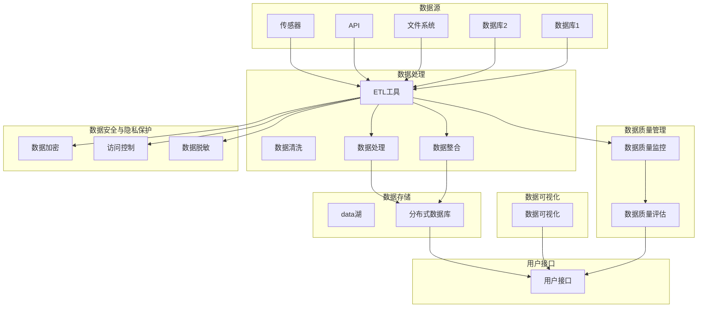
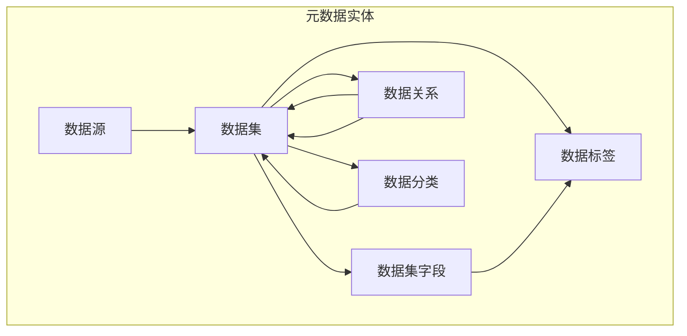

                 

## 文章标题：数据集管理系统：元数据时代的新主角

随着大数据时代的到来，数据已经成为现代社会的核心资源。数据集管理系统作为数据管理的重要工具，正逐步成为数据科学和人工智能领域的焦点。元数据，作为数据集管理系统的核心概念，正引领着数据集管理系统进入一个新的时代。本文将深入探讨数据集管理系统的背景与基础、设计与实现、应用场景与案例以及未来发展趋势，旨在揭示数据集管理系统在元数据时代的重要性与潜力。

关键词：数据集管理系统、元数据、数据质量管理、数据安全、智能服务

摘要：本文首先介绍了数据集管理系统的背景与基础，包括其重要性、发展历程和技术趋势。接着，详细阐述了数据集管理系统的核心概念和架构设计，重点分析了数据质量管理、数据安全与隐私保护等问题。随后，文章探讨了数据集管理系统在不同领域的应用，并提供了实际案例研究。最后，文章展望了数据集管理系统面临的挑战与机遇，探讨了其未来发展趋势。

## 第一部分：数据集管理系统的背景与基础

### 第1章：数据集管理系统的概述

#### 1.1 数据集管理系统的重要性

数据集管理系统（Dataset Management System，简称DMS）是用于收集、存储、管理、处理和分析数据集的一系列工具和技术的集合。随着大数据和人工智能技术的发展，数据集管理系统的地位日益重要。它不仅能够提高数据质量和数据利用率，还能够为数据科学家和研究人员提供便捷的数据访问和管理方式。

首先，数据集管理系统在数据质量管理方面具有重要作用。数据质量管理是数据科学和人工智能领域的关键环节，因为数据的质量直接影响模型的准确性和可靠性。数据集管理系统通过数据清洗、去重、标准化等手段，确保数据的一致性和准确性。

其次，数据集管理系统在数据整合方面发挥着关键作用。在现代社会中，数据来源多样化，包括社交媒体、传感器、企业内部系统等。数据集管理系统通过数据采集、数据整合和数据转换等功能，将来自不同来源的数据进行统一管理和处理，为数据科学家提供高质量的数据集。

此外，数据集管理系统在数据安全与隐私保护方面也具有重要价值。随着数据隐私问题的日益突出，如何保护数据的安全和隐私成为数据集管理系统需要解决的重要问题。数据集管理系统通过加密、访问控制、数据脱敏等技术手段，确保数据的安全性和隐私性。

#### 1.2 数据集管理系统的作用与价值

数据集管理系统的作用和价值主要体现在以下几个方面：

1. **提高数据利用率**：数据集管理系统通过统一管理和处理数据，提高了数据的利用率。研究人员可以轻松地访问和管理数据，从而更有效地利用数据资源。

2. **降低数据管理成本**：数据集管理系统通过自动化和智能化的手段，降低了数据管理成本。传统的数据管理方式往往需要大量的人力和时间，而数据集管理系统可以大幅度减少这些成本。

3. **确保数据质量**：数据集管理系统通过数据清洗、去重、标准化等技术手段，确保数据的一致性和准确性，从而提高了数据质量。

4. **支持数据科学和人工智能应用**：数据集管理系统为数据科学家和研究人员提供了高质量的数据集，支持数据挖掘、机器学习等数据科学和人工智能应用。

5. **促进数据共享与合作**：数据集管理系统通过提供便捷的数据访问和管理方式，促进了数据共享与合作，为科学研究、商业决策等提供了有力支持。

#### 1.3 数据集管理系统的定义

数据集管理系统（Dataset Management System，简称DMS）是一个集成化的数据管理平台，旨在为数据科学家和研究人员提供便捷的数据访问、管理和处理能力。DMS通常包括以下核心功能：

- **数据采集**：从各种数据源（如数据库、文件系统、API等）中收集数据。

- **数据整合**：将来自不同数据源的数据进行统一管理和处理，包括数据转换、数据清洗和去重等。

- **数据存储**：将处理后的数据存储在数据库或文件系统中，并提供高效的存储和检索机制。

- **数据质量管理**：通过数据清洗、标准化、去重等技术手段，确保数据的一致性和准确性。

- **数据安全与隐私保护**：通过加密、访问控制、数据脱敏等技术手段，确保数据的安全性和隐私性。

- **数据可视化**：提供数据可视化工具，帮助用户更好地理解和分析数据。

- **数据共享与合作**：提供数据共享机制，促进数据科学家和研究人员之间的合作。

#### 1.4 数据集管理系统的发展历程

数据集管理系统的发展历程可以分为以下几个阶段：

1. **初期阶段**：在早期，数据集管理主要依赖于文件系统和数据库管理系统。数据科学家和研究人员需要手动收集、整理和存储数据，数据管理成本较高。

2. **数据仓库阶段**：随着数据量的增加，数据仓库（Data Warehouse）技术开始应用。数据仓库通过集成多个数据源，提供统一的数据视图，提高了数据管理效率。

3. **数据湖阶段**：数据仓库技术虽然能够提高数据管理效率，但在处理大量非结构化和半结构化数据方面存在困难。数据湖（Data Lake）技术应运而生，它提供了一种更加灵活和高效的数据存储和管理方式。

4. **数据集管理系统阶段**：随着大数据和人工智能技术的发展，数据集管理系统逐渐成为数据管理的重要工具。DMS通过自动化和智能化的手段，提高了数据管理的效率和效果。

#### 1.5 当前数据集管理系统的技术趋势

当前，数据集管理系统正处于快速发展阶段，以下是一些重要的技术趋势：

1. **云计算和大数据技术**：云计算和大数据技术的应用，使得数据集管理系统能够更好地处理海量数据，并提供高效的数据存储和计算能力。

2. **自动化与智能化**：自动化和智能化技术正在改变数据集管理的方式。例如，自动数据清洗、自动模型选择等技术，提高了数据管理的效率。

3. **机器学习和人工智能**：机器学习和人工智能技术的应用，使得数据集管理系统能够更好地理解和分析数据，从而提供更加智能化的数据管理服务。

4. **数据安全和隐私保护**：随着数据隐私问题的日益突出，数据集管理系统在数据安全和隐私保护方面面临新的挑战。加密、访问控制、数据脱敏等技术正在得到广泛应用。

5. **开放性和可扩展性**：开放性和可扩展性是数据集管理系统的重要特点。通过支持各种数据源和数据处理技术，DMS能够更好地适应不断变化的数据管理需求。

### 第2章：数据集管理系统的核心概念

#### 2.1 数据集与元数据

数据集（Dataset）是数据集管理系统的核心概念之一。数据集是指一组相关数据的集合，通常用于数据分析和机器学习任务。数据集可以是结构化的，如关系数据库中的表；也可以是非结构化的，如图像、文本和音频。数据集的质量直接影响数据分析和机器学习模型的性能，因此数据集管理系统需要提供有效的数据管理功能。

元数据（Metadata）是关于数据的数据，它描述了数据集的结构、内容、来源和使用方式等信息。元数据通常包括数据集的描述、属性、分类、标签、数据源等信息。元数据在数据集管理系统中起着至关重要的作用，它不仅有助于数据的检索和分类，还能够提高数据质量和数据利用率。

1. **数据集的定义**：

   数据集是指一组相关数据的集合，这些数据可以用来进行数据分析和机器学习任务。数据集通常具有以下特点：

   - **结构性**：数据集可以是结构化的，如关系数据库中的表；也可以是非结构化的，如图像、文本和音频。

   - **规模性**：数据集的规模可以从几条记录到数百万甚至数亿条记录。

   - **多样性**：数据集可以包含各种类型的数据，如数值、文本、图像、音频等。

2. **数据集的作用**：

   数据集在数据分析和机器学习任务中起着至关重要的作用，具体作用如下：

   - **训练模型**：数据集是训练机器学习模型的基础，通过从数据集中提取特征，构建和训练模型，实现数据分析和预测。

   - **验证模型**：在训练模型后，使用验证集来评估模型的性能，通过比较预测结果和真实结果，调整模型参数，提高模型准确性。

   - **测试模型**：使用测试集来评估模型在未知数据上的性能，确保模型具有泛化能力。

   - **支持复现**：公开数据集支持其他研究人员复现研究，促进科学研究和知识共享。

3. **数据集的管理**：

   数据集管理是数据集管理系统的核心任务之一，主要包括以下方面：

   - **数据采集**：从各种数据源收集数据，包括数据库、文件系统、API等。

   - **数据整合**：将来自不同数据源的数据进行统一管理和处理，包括数据转换、数据清洗和去重等。

   - **数据存储**：将处理后的数据存储在数据库或文件系统中，并提供高效的存储和检索机制。

   - **数据备份与恢复**：确保数据的安全性和可靠性，防止数据丢失和损坏。

   - **数据质量控制**：通过数据清洗、标准化、去重等技术手段，确保数据的一致性和准确性。

#### 2.2 元数据的概念与作用

元数据是关于数据的数据，它描述了数据集的结构、内容、来源和使用方式等信息。元数据在数据集管理系统中起着至关重要的作用，它不仅有助于数据的检索和分类，还能够提高数据质量和数据利用率。

1. **元数据的定义**：

   元数据（Metadata）是指关于数据的数据，它描述了数据集的结构、内容、来源和使用方式等信息。元数据通常包括以下几类信息：

   - **描述性元数据**：描述数据集的基本信息，如数据集名称、数据集描述、创建者、创建时间等。

   - **结构性元数据**：描述数据集的结构信息，如数据表、字段、数据类型、关系等。

   - **管理性元数据**：描述数据集的管理信息，如数据存储位置、访问权限、备份策略等。

   - **技术性元数据**：描述数据集的技术信息，如数据格式、编码方式、数据源等。

2. **元数据的作用**：

   元数据在数据集管理系统中起着至关重要的作用，具体作用如下：

   - **数据检索**：通过元数据，用户可以快速找到所需的数据集，提高数据检索效率。

   - **数据分类**：元数据有助于对数据集进行分类和标签管理，方便用户管理和使用数据。

   - **数据质量管理**：元数据提供了数据集的质量信息，如数据源、数据采集时间等，有助于识别和解决数据质量问题。

   - **数据共享与合作**：元数据支持数据集的共享和合作，确保数据在不同用户和系统之间的一致性和准确性。

   - **支持复现**：元数据有助于其他研究人员复现研究，促进科学研究和知识共享。

3. **元数据管理**：

   元数据管理是数据集管理的重要组成部分，主要包括以下方面：

   - **元数据采集**：从各种数据源采集元数据，包括数据库、文件系统、API等。

   - **元数据存储**：将元数据存储在专门的元数据库或元数据存储系统中，并提供高效的存储和检索机制。

   - **元数据同步**：确保元数据与实际数据的一致性，如数据更新、数据删除等。

   - **元数据质量保证**：通过元数据清洗、标准化等技术手段，确保元数据的一致性和准确性。

   - **元数据可视化**：提供元数据可视化工具，帮助用户更好地理解和分析元数据。

### 第3章：数据质量管理

#### 3.1 数据质量的重要性

数据质量是数据集管理的关键因素，直接影响到数据分析和机器学习模型的准确性、可靠性和有效性。高质量的数据能够为决策提供可靠的依据，而低质量的数据则可能导致错误的结论和决策。因此，数据质量管理在数据集管理系统中具有至关重要的地位。

1. **数据质量的影响因素**：

   - **准确性**：数据准确性是指数据是否真实、可靠。不准确的数据会导致错误的决策和分析结果。

   - **完整性**：数据完整性是指数据是否完整，没有缺失或遗漏。不完整的数据会影响数据分析和模型的泛化能力。

   - **一致性**：数据一致性是指数据在不同系统、不同时间、不同数据源之间是否保持一致。不一致的数据会导致数据冲突和混乱。

   - **及时性**：数据及时性是指数据是否能够及时更新和提供。过时的数据会影响数据分析和决策的时效性。

2. **数据质量的重要性**：

   - **提高决策准确性**：高质量的数据能够为决策提供可靠依据，降低决策风险。

   - **提升模型性能**：高质量的数据有助于提高数据分析和机器学习模型的准确性、可靠性和有效性。

   - **降低成本**：数据质量问题的修复和纠正需要大量时间和资源。高质量的数据能够降低这些成本。

   - **增强数据信任度**：高质量的数据能够增强用户对数据和分析结果的信任，促进数据共享和合作。

#### 3.2 数据质量管理的原则与策略

数据质量管理是一个复杂的过程，需要综合考虑数据源、数据存储、数据处理和数据分析等多个方面。以下是一些数据质量管理的原则与策略：

1. **数据质量管理原则**：

   - **全面性**：数据质量管理应覆盖数据的整个生命周期，包括数据采集、存储、处理、分析和共享等各个环节。

   - **预防为主**：在数据采集、存储和处理阶段，应采取预防措施，减少数据质量问题的发生。

   - **持续改进**：数据质量管理是一个持续的过程，应不断评估数据质量，发现问题并改进。

   - **可追溯性**：数据质量管理应具备可追溯性，能够记录数据质量问题的来源和解决过程。

   - **透明性**：数据质量管理过程应公开透明，确保用户了解数据质量情况，增强数据信任度。

2. **数据质量管理策略**：

   - **数据源质量控制**：对数据源进行评估和筛选，确保数据源的质量和可靠性。

   - **数据采集质量控制**：在数据采集过程中，采取有效措施确保数据的准确性和完整性。

   - **数据存储质量控制**：在数据存储过程中，采取数据备份、数据恢复和数据同步等措施，确保数据的一致性和可靠性。

   - **数据处理质量控制**：在数据处理过程中，采取数据清洗、去重、标准化等技术手段，确保数据的准确性和一致性。

   - **数据分析质量控制**：在数据分析过程中，采取数据验证、数据校验和数据比对等措施，确保数据分析结果的准确性和可靠性。

#### 3.3 数据质量评估方法

数据质量评估是数据质量管理的重要环节，通过评估数据质量，可以及时发现和解决数据质量问题。以下是一些常用的数据质量评估方法：

1. **数据质量指标**：

   - **准确性**：数据准确性是指数据是否真实、可靠。准确性评估可以通过对比数据与原始数据进行判断。

   - **完整性**：数据完整性是指数据是否完整，没有缺失或遗漏。完整性评估可以通过计算数据缺失率或缺失比例进行。

   - **一致性**：数据一致性是指数据在不同系统、不同时间、不同数据源之间是否保持一致。一致性评估可以通过比较不同数据源之间的数据差异进行。

   - **及时性**：数据及时性是指数据是否能够及时更新和提供。及时性评估可以通过计算数据更新周期或数据滞后时间进行。

2. **数据质量评估方法**：

   - **统计分析**：通过统计分析方法，评估数据的分布、异常值、缺失值等特征，发现数据质量问题。

   - **数据比对**：通过比较不同数据源之间的数据，发现数据不一致的问题。

   - **数据验证**：使用预定义的规则或标准，对数据进行验证，确保数据的准确性、完整性和一致性。

   - **用户反馈**：通过用户反馈，收集数据质量问题报告，评估数据质量。

   - **数据可视化**：通过数据可视化方法，展示数据质量情况，帮助用户更好地理解和分析数据质量。

### 第4章：数据安全与隐私保护

#### 4.1 数据安全的挑战

随着数据集管理系统的广泛应用，数据安全成为了一个日益严峻的挑战。数据安全不仅涉及到数据本身的安全，还包括数据存储、传输和处理过程中的安全。以下是一些主要的数据安全挑战：

1. **数据泄露**：数据泄露是数据安全中最常见的问题之一。黑客攻击、内部泄露、软件漏洞等都可能导致敏感数据被非法访问和窃取。

2. **数据篡改**：数据篡改是指未经授权的用户对数据进行恶意修改，从而破坏数据的完整性和准确性。

3. **数据丢失**：数据丢失可能由于硬件故障、软件故障、人为错误或自然灾害等原因导致，对业务运营和决策产生严重影响。

4. **数据滥用**：数据滥用是指未经授权的用户对数据进行非法使用，如非法交易、恶意使用等，可能导致隐私泄露和声誉受损。

5. **分布式拒绝服务攻击（DDoS）**：DDoS攻击通过大量请求使系统资源耗尽，导致系统无法正常提供服务，从而影响数据集管理系统的稳定性和可用性。

#### 4.2 数据隐私保护的措施与方法

为了确保数据集管理系统中的数据安全与隐私，需要采取一系列有效的措施和方法。以下是一些常见的数据隐私保护措施：

1. **数据加密**：数据加密是一种常见的数据隐私保护方法，通过加密算法对数据进行加密，确保只有授权用户才能解密和访问数据。常用的加密算法包括对称加密（如AES）和非对称加密（如RSA）。

2. **访问控制**：访问控制是一种基于用户身份验证和授权的策略，确保只有授权用户才能访问特定数据。访问控制包括用户认证、用户权限管理和访问日志记录等功能。

3. **数据脱敏**：数据脱敏是一种对敏感数据进行匿名化处理的技术，通过替换、掩码或混淆等方法，使得敏感数据无法被直接识别或使用。常用的数据脱敏方法包括静态脱敏和动态脱敏。

4. **数据备份与恢复**：数据备份与恢复是一种确保数据安全性和可用性的措施，通过定期备份数据，可以在数据丢失或损坏时快速恢复数据。备份策略包括本地备份、远程备份和云备份等。

5. **安全审计**：安全审计是一种定期审查和评估数据集管理系统安全性的方法，通过记录和审查系统操作日志、用户行为等，及时发现和解决安全漏洞和风险。

6. **安全培训与意识提升**：定期进行安全培训，提高用户和数据管理者的安全意识，降低人为错误和安全风险。

#### 4.3 数据隐私保护的案例分析

以下是一个关于数据隐私保护的实际案例：

案例背景：某大型电商平台在其数据集管理系统中存储了大量用户个人信息，如姓名、地址、电话号码、购买记录等。由于数据泄露事件频发，该平台决定加强数据隐私保护措施。

实施措施：

1. **数据加密**：对用户个人信息进行加密处理，采用AES加密算法，确保数据在存储和传输过程中的安全性。

2. **访问控制**：对用户个人信息进行严格的访问控制，只有经过身份验证且具有相应权限的用户才能访问和操作数据。

3. **数据脱敏**：对用户个人信息进行脱敏处理，将敏感字段（如电话号码）进行掩码处理，使得数据在未授权情况下无法被直接识别。

4. **安全审计**：定期进行安全审计，记录和审查系统操作日志，及时发现和解决潜在的安全风险。

5. **安全培训**：定期进行安全培训，提高员工和数据管理者的安全意识，降低人为错误和安全风险。

效果评估：

通过实施上述措施，该电商平台成功降低了数据泄露风险，提高了用户对平台数据隐私保护的信任度。安全审计和用户反馈显示，系统在数据安全方面表现出色，用户满意度显著提高。

### 总结

数据安全与隐私保护是数据集管理系统必须关注的重要问题。通过采取有效的数据加密、访问控制、数据脱敏、数据备份与恢复等措施，以及进行安全审计和安全培训，可以有效降低数据泄露和隐私泄露风险。未来，随着数据隐私保护法规的不断完善，数据集管理系统在数据安全与隐私保护方面将面临更高的要求和挑战。只有持续关注和改进数据隐私保护措施，才能确保数据集管理系统的安全稳定运行。

## 第二部分：数据集管理系统的设计与实现

### 第3章：数据集管理系统架构设计

#### 3.1 数据集管理系统架构概述

数据集管理系统的架构设计是构建高效、稳定和可扩展的数据集管理平台的关键。合理的系统架构不仅能够满足当前的数据管理需求，还能够适应未来的技术发展和业务扩展。数据集管理系统的架构通常包括以下几个关键组成部分：

1. **数据源**：数据源是数据集管理系统的数据输入部分，包括各种数据采集渠道，如数据库、文件系统、API、传感器等。数据源需要能够支持多种数据格式的接入和转换。

2. **数据存储**：数据存储是数据集管理系统的核心组成部分，负责存储和管理采集到的数据。数据存储可以选择关系数据库、NoSQL数据库、数据湖或云存储等不同的存储方案，以满足不同类型数据的需求。

3. **数据处理**：数据处理模块负责对存储的数据进行清洗、转换、聚合等操作，以生成符合分析和挖掘需求的数据集。数据处理模块通常包括数据清洗工具、ETL（提取、转换、加载）工具和数据处理引擎等。

4. **元数据管理**：元数据管理模块负责存储、管理和检索与数据集相关的元数据信息，包括数据集的描述、结构、属性、标签等。元数据管理模块通常采用元数据库或NoSQL数据库来实现。

5. **数据质量监控**：数据质量监控模块负责实时监控数据质量，包括数据完整性、准确性、一致性等指标。数据质量监控模块可以通过日志记录、告警机制和自动化修复等功能来实现。

6. **数据安全与隐私保护**：数据安全与隐私保护模块负责确保数据在采集、存储、传输和处理过程中的安全性，包括数据加密、访问控制、数据脱敏和审计等功能。

7. **用户接口**：用户接口是数据集管理系统与用户之间的交互界面，提供数据检索、数据管理和数据可视化等功能。用户接口可以采用Web界面、桌面应用程序或移动应用程序等形式。

#### 3.2 常见架构模式分析

在数据集管理系统架构设计中，常见的架构模式包括以下几种：

1. **客户端-服务器架构**：

   客户端-服务器（Client-Server）架构是最传统的架构模式，其中客户端负责数据的输入和查询请求，服务器负责数据处理和响应。这种架构模式具有简单、稳定和易于扩展的特点，适用于小型数据集管理系统。

   - **优点**：

     - 系统结构简单，易于理解和维护。

     - 服务器端处理压力较小，适合小型数据集。

     - 客户端可独立开发，灵活性高。

   - **缺点**：

     - 数据存储和计算能力有限，不适合大规模数据集。

     - 客户端和服务器的通信效率较低，响应速度较慢。

2. **分布式架构**：

   分布式架构通过将系统功能分布在多个节点上，实现数据处理的并行化和负载均衡。分布式架构适用于大规模、高并发场景，能够提高系统的性能和可靠性。

   - **优点**：

     - 数据处理能力强，适合大规模数据集。

     - 负载均衡，提高系统性能和可用性。

     - 高度可扩展，易于实现横向扩展。

   - **缺点**：

     - 系统结构复杂，维护难度较大。

     - 需要解决分布式一致性、数据同步等问题。

3. **微服务架构**：

   微服务架构将系统功能划分为多个独立的微服务，每个微服务负责特定的业务功能。微服务之间通过API进行通信，具有高灵活性和高可扩展性。

   - **优点**：

     - 高度模块化，易于开发、部署和维护。

     - 灵活性高，可以独立扩展和升级。

     - 支持快速迭代和敏捷开发。

   - **缺点**：

     - 需要解决服务间通信和分布式一致性等问题。

     - 系统复杂度较高，需要更多管理和监控工具。

4. **云原生架构**：

   云原生架构利用云计算资源，实现数据的弹性扩展、自动化管理和高效利用。云原生架构适用于大规模、高并发的数据集管理系统。

   - **优点**：

     - 弹性扩展，根据需求自动调整资源。

     - 自动化管理，提高资源利用率。

     - 高效利用云资源，降低成本。

   - **缺点**：

     - 对云计算平台依赖较大，迁移成本较高。

     - 需要解决云平台的安全和隐私问题。

#### 3.3 系统架构设计的关键要素

在数据集管理系统架构设计过程中，以下关键要素需要充分考虑：

1. **数据流设计**：数据流设计是系统架构设计的基础，需要明确数据的输入、处理和输出流程。合理的数据流设计可以提高系统效率和数据处理速度。

2. **数据处理能力**：数据处理能力是衡量系统性能的关键指标，需要根据业务需求设计合适的处理能力。可以考虑使用分布式计算、并行处理等技术来提高数据处理速度。

3. **数据存储方案**：数据存储方案的选择取决于数据类型、规模和访问需求。可以采用关系数据库、NoSQL数据库、数据湖或云存储等多种存储方案。

4. **数据安全与隐私保护**：数据安全与隐私保护是系统架构设计的重要方面，需要采取数据加密、访问控制、数据脱敏等安全措施，确保数据的安全性和隐私性。

5. **系统扩展性和灵活性**：系统架构设计需要具备良好的扩展性和灵活性，能够适应业务发展和技术变化。可以通过模块化设计、服务化架构等方式实现。

6. **监控与运维**：系统架构设计需要考虑监控与运维需求，包括日志记录、告警机制、自动化部署和升级等功能，以提高系统运维效率和稳定性。

#### 3.4 系统架构设计案例

以下是一个典型的数据集管理系统架构设计案例：

1. **数据流设计**：

   - 数据输入：通过API、文件上传等方式接收数据。

   - 数据处理：使用分布式ETL工具对数据进行清洗、转换和聚合。

   - 数据存储：将处理后的数据存储在分布式数据库或数据湖中。

   - 数据检索与可视化：提供RESTful API和数据可视化界面，供用户查询和分析数据。

2. **数据处理能力**：

   - 采用分布式计算框架，如Hadoop、Spark等，实现并行数据处理。

   - 数据处理能力可根据需求动态调整，支持大规模数据集处理。

3. **数据存储方案**：

   - 数据存储采用分布式数据库，如HBase、Cassandra等，支持海量数据的存储和快速检索。

   - 对于非结构化数据，采用数据湖方案，如Hadoop HDFS、Amazon S3等，提供灵活的数据存储和访问方式。

4. **数据安全与隐私保护**：

   - 数据加密：采用AES加密算法对数据进行加密存储。

   - 访问控制：采用基于角色的访问控制（RBAC）机制，确保只有授权用户可以访问数据。

   - 数据脱敏：对敏感数据字段进行脱敏处理，如掩码、替换等。

5. **系统扩展性和灵活性**：

   - 模块化设计：系统功能模块化，支持独立扩展和升级。

   - 服务化架构：采用微服务架构，提高系统的灵活性和可扩展性。

6. **监控与运维**：

   - 日志记录：记录系统运行日志，用于故障排查和性能优化。

   - 告警机制：设置告警规则，及时发现和处理系统异常。

   - 自动化部署和升级：采用自动化工具实现系统部署和升级，提高运维效率。

通过以上架构设计，数据集管理系统可以实现高效、稳定和可靠的数据管理，满足各类数据分析和挖掘需求。

## 第4章：数据集管理系统功能实现

### 4.1 数据采集与整合

数据采集与整合是数据集管理系统功能实现的关键步骤，它涉及从各种数据源获取数据，并将其转换为适合分析和处理的形式。以下将详细探讨数据采集方法、数据整合流程和数据转换策略。

#### 4.1.1 数据采集方法

数据采集是数据集管理系统的第一步，其方法主要包括以下几种：

1. **API接入**：通过API（应用程序接口）与外部系统进行数据交换，适用于结构化数据和非结构化数据的采集。常见的API类型包括RESTful API、SOAP API等。

2. **Web爬虫**：使用爬虫技术自动从互联网上采集数据，适用于大规模非结构化数据的采集。常见的爬虫工具包括Scrapy、BeautifulSoup等。

3. **数据库连接**：通过数据库连接技术直接从关系数据库或其他数据库系统（如NoSQL数据库）中采集数据。常见的数据库连接技术包括JDBC、ODBC等。

4. **文件系统读取**：通过文件系统读取本地文件或远程文件，适用于静态数据的采集。常见的文件格式包括CSV、Excel、JSON等。

5. **传感器数据采集**：通过传感器设备采集实时数据，适用于物联网（IoT）和工业自动化场景。常见的传感器数据采集技术包括MQTT、CoAP等。

#### 4.1.2 数据整合流程

数据整合是将来自不同数据源的数据进行统一管理和处理的过程，主要包括以下步骤：

1. **数据接入**：从各种数据源采集数据，并将其存储在临时数据仓库中。

2. **数据清洗**：对采集到的数据进行预处理，包括去重、缺失值处理、数据类型转换等，确保数据的一致性和准确性。

3. **数据转换**：将不同数据源的数据转换为统一的格式和结构，以便后续的数据处理和分析。常见的转换操作包括数据格式转换、数据映射、数据聚合等。

4. **数据加载**：将处理后的数据加载到数据集管理系统的主数据仓库中，为数据分析和挖掘提供基础数据。

#### 4.1.3 数据转换策略

数据转换是数据整合的重要环节，其策略包括：

1. **数据格式转换**：将不同数据源的数据格式（如CSV、JSON、XML）转换为统一的数据格式（如CSV、JSON），以便于后续处理和分析。

2. **数据映射**：将不同数据源的字段映射到统一的数据结构中，确保数据的一致性和兼容性。例如，将不同数据库中的相似字段映射到同一名称和类型。

3. **数据聚合**：对具有相似属性的数据进行聚合操作，生成新的数据集。例如，将多个销售订单按时间、地区、产品等维度进行聚合，生成销售报表。

4. **数据标准化**：对数据进行标准化处理，确保数据的一致性和可比性。例如，将不同的单位（如长度、重量）转换为统一的单位（如米、千克）。

5. **数据清洗**：对数据进行清洗，包括去重、缺失值处理、异常值处理等，确保数据的质量。

### 4.2 数据清洗与预处理

数据清洗与预处理是数据集管理系统功能实现的核心环节，它直接影响到数据分析和挖掘的准确性和可靠性。以下将详细探讨数据清洗技术、数据预处理策略和数据质量评估方法。

#### 4.2.1 数据清洗技术

数据清洗是指对采集到的数据进行处理，以消除数据中的错误、缺失和异常。常见的数据清洗技术包括：

1. **去重**：识别和删除重复的数据记录，确保数据集的唯一性。

2. **缺失值处理**：对缺失的数据进行填充或删除，以减少数据缺失对分析和挖掘的影响。常见的缺失值处理方法包括：

   - **均值填充**：用数据记录的平均值填充缺失值。

   - **中值填充**：用数据记录的中位数填充缺失值。

   - **最大值/最小值填充**：用数据记录的最大值或最小值填充缺失值。

   - **插值法**：使用时间序列或空间序列的插值方法填充缺失值。

3. **异常值处理**：识别和删除异常数据记录，以减少异常数据对分析和挖掘的影响。常见的异常值处理方法包括：

   - **范围过滤**：删除落在特定范围之外的数据记录。

   - **箱型图法**：使用箱型图识别和删除异常值。

   - **基于统计方法的异常值检测**：如基于标准差的检测方法、基于聚类方法的异常值检测。

4. **数据规范化**：将不同量纲的数据转换为同一量纲，以便于数据分析和比较。常见的规范化方法包括：

   - **线性变换**：使用线性变换将不同量纲的数据映射到同一量纲。

   - **最小-最大规范化**：将数据缩放到[0,1]范围内。

   - **Z-Score规范化**：将数据缩放到标准正态分布范围内。

#### 4.2.2 数据预处理策略

数据预处理策略是指为了满足数据分析需求，对数据进行的一系列处理操作。常见的数据预处理策略包括：

1. **数据归一化**：将不同数据范围的数据转换为同一数据范围，以消除数据量级差异对分析和挖掘的影响。

2. **数据标准化**：将数据进行标准化处理，使数据的统计特性（如均值和标准差）符合特定分布，以提高模型的稳定性和准确性。

3. **特征工程**：提取和构造新的特征，以增强模型的表现能力。常见的特征工程方法包括：

   - **特征选择**：从原始特征中筛选出对模型表现有显著影响的特征。

   - **特征组合**：将多个原始特征组合成新的特征，以提高模型的预测能力。

   - **特征转换**：将原始特征转换为更适合模型处理的形式，如将分类特征转换为数值特征。

4. **时间序列处理**：对时间序列数据进行预处理，包括时间序列平稳性检验、时间序列分解和季节性调整等，以提高模型对时间序列数据的预测能力。

5. **空间数据处理**：对空间数据进行预处理，包括空间插值、空间聚类和空间分析等，以提高模型对空间数据的处理能力。

#### 4.2.3 数据质量评估方法

数据质量评估是确保数据满足分析和挖掘需求的重要步骤。常见的数据质量评估方法包括：

1. **准确性评估**：通过计算模型预测结果与真实结果的误差，评估数据集的准确性。

2. **完整性评估**：通过计算数据缺失率或缺失比例，评估数据集的完整性。

3. **一致性评估**：通过比较不同数据源之间的数据差异，评估数据集的一致性。

4. **及时性评估**：通过计算数据更新周期或数据滞后时间，评估数据集的及时性。

5. **用户反馈**：通过用户反馈，收集数据质量问题和改进建议，持续评估和提升数据质量。

通过以上数据清洗与预处理策略，可以显著提高数据集的质量，为后续的数据分析和挖掘提供可靠的数据基础。

## 第5章：元数据管理

### 5.1 元数据模型设计

元数据模型是数据集管理系统的核心组成部分，它定义了元数据的管理规则、存储结构和访问方式。一个良好的元数据模型能够提高数据集的可操作性、可扩展性和互操作性。以下将详细探讨元数据模型的构建方法、存储策略和管理策略。

#### 5.1.1 元数据模型的构建方法

构建元数据模型是元数据管理的第一步，其主要目标是定义元数据的结构、属性和关系。以下是一些常见的构建方法：

1. **自顶向下的方法**：自顶向下的方法是从总体架构出发，逐步细化到具体的元数据元素。这种方法通常由数据架构师或数据管理员主导，结合业务需求和系统设计，逐步构建元数据模型。

2. **自底向上的方法**：自底向上的方法是从具体的数据元素开始，逐步归纳和总结，形成完整的元数据模型。这种方法适用于已经积累了一定数据资产的组织，通过分析现有的数据，逐步构建元数据模型。

3. **混合方法**：混合方法是将自顶向下和自底向上的方法相结合，先进行总体架构的规划，再逐步细化到具体的数据元素。这种方法能够平衡系统的顶层设计和底层实施，提高元数据模型的实用性。

#### 5.1.2 元数据模型的核心元素

元数据模型的核心元素包括以下几个方面：

1. **数据元素**：数据元素是元数据模型的基础，描述了数据的基本属性，如数据类型、长度、精度等。数据元素是构建其他元数据元素的基础。

2. **数据集**：数据集是元数据模型中的一个重要组成部分，它描述了数据集合的基本属性，如数据集名称、描述、创建者、创建时间等。数据集是数据管理和分析的基本单位。

3. **数据字段**：数据字段是数据集中的基本组成部分，描述了数据集的具体字段信息，如字段名称、字段类型、字段长度、字段说明等。

4. **数据关系**：数据关系描述了不同数据集或数据字段之间的关联关系，如主外键关系、数据依赖关系等。数据关系有助于理解数据的整体结构和关联性。

5. **数据分类**：数据分类描述了数据的分类层次和分类标准，如数据类型分类、业务领域分类等。数据分类有助于数据的组织和检索。

6. **数据标签**：数据标签是附加在数据上的标识，用于描述数据的特点或用途，如标签、备注、标签类型等。数据标签有助于数据的筛选和使用。

#### 5.1.3 元数据模型的存储策略

元数据模型的存储策略决定了元数据的管理效率和访问性能。以下是一些常见的存储策略：

1. **关系数据库存储**：关系数据库存储是将元数据存储在关系数据库中，通过表结构定义元数据模型，使用SQL语句进行元数据的存储、检索和管理。关系数据库存储的优点是查询灵活、管理便捷，但需要较高的维护成本。

2. **NoSQL数据库存储**：NoSQL数据库存储是将元数据存储在NoSQL数据库中，如MongoDB、Cassandra等。NoSQL数据库存储的优点是扩展性强、性能高，但查询相对复杂。

3. **文件系统存储**：文件系统存储是将元数据以文件的形式存储在文件系统中，适用于小规模、结构简单的元数据管理。文件系统存储的优点是简单、灵活，但管理复杂度较高。

4. **分布式存储**：分布式存储是将元数据分布存储在多个节点上，通过分布式数据库或分布式文件系统进行管理。分布式存储的优点是高可用性、高扩展性，但需要解决分布式一致性、数据同步等问题。

#### 5.1.4 元数据管理策略

元数据管理策略是指为了确保元数据的质量、一致性和可用性，制定的一系列管理规则和操作方法。以下是一些常见的元数据管理策略：

1. **元数据采集**：元数据采集是指从各种数据源和系统中收集元数据，包括数据源信息、数据结构、数据关系等。元数据采集可以通过自动化工具、人工录入等方式进行。

2. **元数据存储**：元数据存储是指将采集到的元数据存储在元数据库或元数据存储系统中。元数据存储需要考虑存储结构、访问性能和数据安全性等问题。

3. **元数据同步**：元数据同步是指确保元数据在不同系统、不同数据库之间的一致性。元数据同步可以通过实时同步、定时同步等方式进行。

4. **元数据质量控制**：元数据质量控制是指对元数据的质量进行评估和监控，包括数据完整性、准确性、一致性等。元数据质量控制可以通过自动化工具、人工审核等方式进行。

5. **元数据共享与协作**：元数据共享与协作是指确保元数据在不同用户和系统之间的共享和协作，提高数据管理和分析效率。元数据共享与协作可以通过权限控制、数据交换接口等方式实现。

6. **元数据备份与恢复**：元数据备份与恢复是指确保元数据的安全性和可靠性，防止元数据丢失和损坏。元数据备份与恢复可以通过定期备份、增量备份等方式进行。

通过以上元数据模型设计方法、存储策略和管理策略，可以构建一个高效、稳定和可扩展的元数据管理体系，为数据集管理系统提供可靠的数据支持和管理基础。

### 5.2 元数据检索与索引

元数据检索与索引是数据集管理系统功能实现中的关键环节，它直接影响到元数据的使用效率和系统的响应速度。以下将详细探讨元数据检索方法、索引策略和元数据可视化技术。

#### 5.2.1 元数据检索方法

元数据检索是指从元数据库或元数据存储系统中查找和获取所需元数据信息的过程。以下是一些常见的元数据检索方法：

1. **基于关键字检索**：基于关键字检索是最简单和常用的元数据检索方法，通过输入关键字或关键词，从元数据库中查找相关的元数据记录。常用的关键字检索方法包括全文检索、模糊匹配等。

2. **基于条件检索**：基于条件检索是指通过指定多个检索条件，从元数据库中查找满足这些条件的元数据记录。条件检索可以基于元数据的各种属性，如数据集名称、数据集描述、创建时间等。

3. **基于分类检索**：基于分类检索是指通过元数据的分类信息，从元数据库中查找相关的元数据记录。分类检索可以基于数据类型、业务领域、数据来源等分类体系。

4. **基于标签检索**：基于标签检索是指通过元数据的标签信息，从元数据库中查找相关的元数据记录。标签检索可以基于自定义标签、系统默认标签等。

#### 5.2.2 索引策略

索引是提高元数据检索速度的重要技术手段，它通过构建索引结构，加速元数据的查找和访问。以下是一些常见的索引策略：

1. **全文索引**：全文索引是对元数据文本内容进行索引，实现快速全文检索。全文索引适用于文本类型元数据的检索，如数据集描述、标签说明等。

2. **分类索引**：分类索引是对元数据的分类信息进行索引，实现快速分类检索。分类索引适用于基于分类体系的元数据检索，如数据类型分类、业务领域分类等。

3. **标签索引**：标签索引是对元数据的标签信息进行索引，实现快速标签检索。标签索引适用于基于标签的元数据检索，如自定义标签、系统默认标签等。

4. **多索引策略**：多索引策略是将多种索引技术结合使用，以提高元数据检索的效率。例如，结合全文索引和分类索引，实现高效混合检索。

5. **动态索引**：动态索引是在元数据发生变化时，自动更新索引结构，确保索引的一致性和有效性。动态索引适用于元数据频繁更新的场景。

#### 5.2.3 元数据可视化技术

元数据可视化技术是指通过图形化方式展示元数据信息，帮助用户更好地理解和分析元数据。以下是一些常见的元数据可视化技术：

1. **表格视图**：表格视图是最常见的元数据可视化方式，通过表格形式展示元数据记录的详细信息。表格视图适用于展示结构化元数据，如数据集属性、字段定义等。

2. **图表视图**：图表视图通过图形化方式展示元数据的统计信息，如数据分布、数据依赖关系等。常见的图表类型包括柱状图、饼图、关系图等。

3. **树状视图**：树状视图通过层次结构展示元数据的分类和层次关系，如数据类型树、数据集分类树等。树状视图适用于展示分类体系和层次化元数据。

4. **地图视图**：地图视图通过地理信息展示元数据的空间分布，如数据来源地、数据分布地图等。地图视图适用于展示空间数据集和地理信息数据。

5. **交互式视图**：交互式视图通过用户与界面交互，动态展示和操作元数据信息。交互式视图适用于复杂元数据的展示和高级数据分析。

通过以上元数据检索、索引和可视化技术，数据集管理系统可以提供高效、灵活和易用的元数据管理功能，为数据科学家和研究人员提供强大的数据支持。

### 5.3 元数据可视化与交互

元数据可视化与交互是数据集管理系统中不可或缺的一部分，它通过图形化界面和用户交互机制，帮助用户更好地理解和利用元数据。以下将详细探讨元数据可视化技术、交互设计原则以及具体的实现方法。

#### 5.3.1 元数据可视化技术

元数据可视化是将元数据以图形化的形式展示出来，使其更加直观易懂。以下是一些常见的元数据可视化技术：

1. **表格视图**：表格视图是最基础的元数据可视化方式，它以表格形式展示元数据的详细信息，如数据集名称、描述、创建时间等。表格视图适用于展示结构化数据集的元数据信息。

2. **图表视图**：图表视图通过图表形式展示元数据的统计信息，如图表中的柱状图、饼图、折线图等。图表视图能够直观地展示数据的分布、趋势和关系，适用于展示数据的统计分析和结果。

3. **树状视图**：树状视图通过树形结构展示元数据的分类和层次关系，如数据类型树、数据集分类树等。树状视图能够清晰地展示数据的层次结构和分类关系，适用于展示组织化和层次化的元数据。

4. **地图视图**：地图视图通过地理信息展示元数据的空间分布，如数据来源地、数据分布地图等。地图视图能够直观地展示数据的地理分布，适用于展示空间数据集和地理信息数据。

5. **交互式视图**：交互式视图通过用户与界面的交互，动态展示和操作元数据信息。交互式视图能够提供更加灵活和丰富的用户体验，适用于复杂元数据的展示和高级数据分析。

#### 5.3.2 交互设计原则

交互设计是确保用户与系统之间高效、流畅交互的关键。以下是一些常见的交互设计原则：

1. **用户中心**：交互设计应以用户需求为中心，确保用户能够方便地完成所需任务，提供直观易懂的操作界面。

2. **简洁性**：交互设计应尽量简洁，避免过多的干扰和复杂性，使用户能够快速理解和使用系统。

3. **一致性**：交互设计应保持一致性，包括界面布局、交互元素、操作流程等，使用户能够快速适应和掌握系统。

4. **可发现性**：交互设计应确保用户能够发现系统提供的功能和服务，提供明显的提示和指导，减少用户的学习成本。

5. **反馈**：交互设计应提供及时的反馈，如操作成功、错误提示等，确保用户对系统的操作有清晰的反馈。

6. **灵活性**：交互设计应提供灵活的选项和设置，满足不同用户的需求和偏好，提供自定义界面和功能。

#### 5.3.3 元数据可视化与交互的具体实现方法

1. **用户界面设计**：用户界面设计是元数据可视化与交互的基础，包括界面布局、颜色搭配、字体选择等。设计应简洁明了，避免过多的干扰元素，提供清晰的导航和操作路径。

2. **交互元素设计**：交互元素设计包括按钮、输入框、下拉菜单等，它们是用户与系统交互的主要途径。设计应直观易懂，确保用户能够快速识别和操作。

3. **图表与表格设计**：图表与表格设计是元数据可视化的重要组成部分，应确保图表和表格的布局合理、数据清晰易读。选择适当的图表类型和配色方案，提高数据的可读性和吸引力。

4. **交互功能设计**：交互功能设计包括数据筛选、排序、过滤等，确保用户能够方便地操作和筛选数据。设计应提供灵活的选项和快捷键，提高用户操作效率。

5. **交互测试与优化**：交互测试与优化是确保交互设计质量的最后一步，通过用户测试和反馈，发现和解决交互设计中的问题。优化应基于用户反馈，不断提升交互设计的用户体验。

通过以上元数据可视化与交互的设计和实现方法，数据集管理系统可以提供高效、便捷和直观的用户体验，为用户的数据管理和分析提供有力支持。

## 第三部分：数据集管理系统的应用场景与案例

### 第6章：数据集管理系统在不同领域的应用

数据集管理系统（DMS）的应用领域广泛，涵盖数据挖掘、机器学习、业务智能和数据分析等多个领域。本文将详细探讨数据集管理系统在这些领域的应用，分析其具体作用和挑战。

### 6.1 数据挖掘与机器学习

数据挖掘和机器学习是数据集管理系统的典型应用领域。在数据挖掘和机器学习过程中，数据集的质量直接影响模型的性能和可靠性。数据集管理系统在以下方面发挥着关键作用：

#### 6.1.1 数据采集与整合

数据挖掘和机器学习通常需要大量的数据来源，包括企业内部数据库、外部数据源、社交媒体、传感器数据等。数据集管理系统通过数据采集模块，可以从各种数据源中收集数据，并进行整合和清洗，确保数据的统一性和准确性。

**应用案例**：

某金融公司利用数据集管理系统，从内部数据库、外部金融数据和社交媒体中采集数据，整合成统一的数据集。通过对这些数据集进行清洗和预处理，公司能够为数据挖掘和机器学习提供高质量的数据输入。

#### 6.1.2 数据质量管理

数据质量对数据挖掘和机器学习的准确性至关重要。数据集管理系统通过数据质量监控模块，对数据集进行实时质量评估，及时发现并修复数据质量问题，如缺失值、异常值等。

**应用案例**：

某电子商务公司使用数据集管理系统监控其销售数据的质量。通过实时监控和自动修复，公司确保了销售数据的一致性和准确性，从而提高了预测模型的准确性。

#### 6.1.3 数据预处理与特征工程

在数据挖掘和机器学习过程中，数据预处理和特征工程是关键步骤。数据集管理系统提供了丰富的数据处理工具，包括数据转换、缺失值处理、异常值处理、特征提取等，帮助用户快速构建高质量的数据集。

**应用案例**：

某医疗机构利用数据集管理系统对医疗数据集进行预处理和特征工程。通过对患者病历数据、医学图像数据进行清洗、转换和特征提取，医院能够为疾病预测模型提供可靠的数据支持。

#### 6.1.4 数据安全与隐私保护

数据挖掘和机器学习过程中，数据安全和隐私保护是重要问题。数据集管理系统通过数据加密、访问控制、数据脱敏等技术手段，确保数据在采集、存储、传输和处理过程中的安全性。

**应用案例**：

某政府机构使用数据集管理系统管理敏感的社会数据。通过数据加密和访问控制，政府机构确保了数据的安全和隐私，同时提供了便捷的数据访问和管理功能。

### 6.2 业务智能与数据分析

业务智能和数据分析是企业管理的重要工具，通过数据分析和挖掘，企业可以更好地了解业务运行状况，优化业务流程，提高决策质量。数据集管理系统在业务智能与数据分析中的应用包括以下几个方面：

#### 6.2.1 数据采集与整合

业务智能和数据分析通常涉及多种数据源，包括企业内部业务系统、外部市场数据、客户反馈数据等。数据集管理系统通过数据采集模块，可以从这些数据源中收集数据，并进行整合和清洗，为业务智能和分析提供统一的数据视图。

**应用案例**：

某零售公司使用数据集管理系统，从内部ERP系统、POS系统和外部市场数据中采集数据，整合成统一的数据集。通过对这些数据集进行分析，公司能够更好地了解市场需求和消费者行为，优化库存管理和销售策略。

#### 6.2.2 数据质量监控与改进

数据质量对业务智能和分析的准确性至关重要。数据集管理系统通过数据质量监控模块，对数据集进行实时质量评估，及时发现并修复数据质量问题，如缺失值、异常值等。

**应用案例**：

某制造公司使用数据集管理系统监控其生产数据的质量。通过实时监控和自动修复，公司确保了生产数据的一致性和准确性，从而提高了生产计划和库存管理的准确性。

#### 6.2.3 数据分析模型构建与优化

数据集管理系统提供了丰富的数据分析工具和算法库，支持用户快速构建和分析业务数据。用户可以通过数据集管理系统，利用机器学习、统计分析等方法，构建和优化业务分析模型。

**应用案例**：

某金融机构使用数据集管理系统，构建了客户行为分析模型和市场预测模型。通过对客户数据进行分析和挖掘，公司能够更好地了解客户需求和市场趋势，优化产品策略和市场营销策略。

#### 6.2.4 数据可视化与报告生成

数据集管理系统提供了强大的数据可视化工具，可以帮助用户将分析结果以图表、报表等形式展示出来。通过数据可视化，用户可以更直观地了解数据分析结果，便于决策和沟通。

**应用案例**：

某医疗公司使用数据集管理系统，将医疗数据分析和预测结果以图表和报表的形式展示给医疗团队。通过数据可视化，医疗团队能够更好地了解患者的健康状况和疾病趋势，制定更有效的治疗计划。

### 6.3 元数据驱动的智能服务

元数据驱动的智能服务是数据集管理系统的又一重要应用领域。通过元数据管理，数据集管理系统可以为智能服务提供全面的数据支持和智能决策。

#### 6.3.1 元数据管理与服务集成

元数据管理模块可以与智能服务系统集成，为智能服务提供数据描述、数据关系、数据标签等信息。通过元数据，智能服务可以更好地理解和利用数据，提高服务质量和用户体验。

**应用案例**：

某智能城市项目使用数据集管理系统，将城市监控数据、交通数据、环境数据等集成到智能服务中。通过元数据管理，智能服务能够更好地理解这些数据，提供交通预测、环境监测等智能服务。

#### 6.3.2 元数据驱动的个性化推荐

元数据驱动的个性化推荐是数据集管理系统的典型应用。通过分析用户数据和元数据，数据集管理系统可以为用户推荐个性化的产品、服务或内容。

**应用案例**：

某电子商务平台使用数据集管理系统，通过分析用户购买历史、浏览记录和元数据信息，为用户推荐个性化的商品。通过元数据驱动的个性化推荐，平台提高了用户满意度和转化率。

#### 6.3.3 元数据驱动的智能决策支持

元数据驱动的智能决策支持系统利用元数据管理模块，为决策者提供全面的数据分析和决策支持。通过元数据，决策者可以更好地了解数据来源、数据质量、数据关系等信息，提高决策的科学性和准确性。

**应用案例**：

某政府部门使用数据集管理系统，构建了元数据驱动的智能决策支持系统。通过分析各种社会数据、经济数据和环境数据，政府能够更好地了解社会运行状况，制定更有效的公共政策。

通过以上应用案例，可以看出数据集管理系统在不同领域都有着广泛的应用和显著的作用。未来，随着技术的不断发展和应用的深入，数据集管理系统将发挥更加重要的作用，推动各领域的数据科学和人工智能应用。

### 第7章：数据集管理系统案例研究

#### 7.1 案例背景与目标

为了更好地理解数据集管理系统（DMS）的实际应用效果，我们选择了一个实际案例进行研究。该案例涉及一家大型电商平台，其面临的核心问题是提高数据分析的效率和准确性，优化库存管理和客户体验。该电商平台拥有大量的商品数据、用户行为数据和销售数据，但这些数据分散在不同的系统中，缺乏统一的管理和整合。

**案例背景**：

电商平台在其运营过程中积累了大量的数据，包括商品信息、用户行为、销售记录等。这些数据分布在不同的系统中，如ERP系统、CRM系统、库存管理系统等。由于缺乏统一的数据管理和整合，数据分析和决策效率低下，导致库存管理问题突出、客户体验不佳。

**目标**：

通过引入数据集管理系统，电商平台希望实现以下目标：

1. **数据整合与标准化**：将分散在不同系统的数据整合到统一的数据存储中，实现数据标准化，提高数据分析的准确性和效率。

2. **数据质量管理**：建立数据质量管理机制，确保数据的一致性、准确性和完整性，提高数据质量。

3. **智能数据分析**：利用数据集管理系统提供的分析工具和算法库，构建智能数据分析模型，为库存管理和客户体验优化提供决策支持。

4. **数据可视化与报告**：通过数据可视化工具，将数据分析结果以图表、报表等形式展示，便于决策者和业务团队理解和应用。

#### 7.2 案例实施过程

为了实现上述目标，电商平台采取了以下实施步骤：

**1. 系统设计与开发**：

首先，电商平台进行了系统设计和开发。数据集管理系统包括数据采集模块、数据存储模块、数据处理模块、数据质量监控模块、元数据管理模块、数据分析模块和可视化模块。各模块之间通过接口进行通信，实现数据流的统一管理和处理。

**2. 数据采集与整合**：

电商平台使用数据采集模块，从ERP系统、CRM系统和库存管理系统中采集数据，并进行整合和清洗。数据采集模块支持多种数据源接入，包括关系数据库、NoSQL数据库、API等。通过数据整合，将不同系统的数据进行统一管理和处理，实现数据标准化。

**3. 数据质量管理**：

在数据整合过程中，电商平台利用数据质量监控模块，对数据进行实时质量评估，包括数据完整性、准确性、一致性等。通过数据质量监控，及时发现并修复数据质量问题，确保数据的一致性和准确性。

**4. 数据存储与管理**：

电商平台选择分布式数据库（如Hadoop HDFS）作为数据存储方案，以支持海量数据的存储和高效检索。数据存储模块实现了数据的高效存储和管理，确保数据的安全性和可靠性。

**5. 数据分析与模型构建**：

电商平台利用数据集管理系统提供的分析工具和算法库，构建了多个数据分析模型，包括客户行为分析模型、库存预测模型、销售预测模型等。这些模型基于高质量的数据集，能够提供准确的预测和决策支持。

**6. 数据可视化与报告**：

数据集管理系统提供了丰富的数据可视化工具，将数据分析结果以图表、报表等形式展示。电商平台通过数据可视化模块，将数据分析结果直观地展示给业务团队和决策者，便于他们理解和应用。

#### 7.3 案例效果评估

在数据集管理系统实施后，电商平台取得了显著的效果，具体如下：

**1. 数据整合与标准化**：

通过数据集管理系统，电商平台实现了数据的统一管理和处理，数据整合率和标准化程度显著提高。不同系统的数据可以方便地进行查询和分析，提高了数据分析的效率。

**2. 数据质量管理**：

数据集管理系统提供了完善的数据质量管理机制，通过数据质量监控模块，电商平台能够实时监控数据质量，确保数据的一致性、准确性和完整性。数据质量问题得到及时发现和修复，提高了数据质量。

**3. 智能数据分析**：

通过构建多个数据分析模型，电商平台能够准确预测客户行为、库存需求和销售趋势。这些模型为库存管理和客户体验优化提供了科学依据，帮助电商平台做出更准确的决策。

**4. 数据可视化与报告**：

数据集管理系统提供了丰富的数据可视化工具，将数据分析结果以直观的图表、报表等形式展示。业务团队和决策者能够轻松地理解和应用这些数据，提高了决策效率。

**5. 用户反馈**：

在数据集管理系统实施后，电商平台得到了用户的高度认可。用户对平台数据的准确性和实时性表示满意，客户体验显著提升。同时，业务团队和决策者也反馈，数据集管理系统提高了他们的工作效率和决策质量。

通过以上效果评估，可以看出数据集管理系统在电商平台的应用取得了显著成效，不仅提高了数据整合、数据质量和数据分析能力，还优化了库存管理和客户体验，为电商平台带来了实质性的业务价值。

### 总结

本案例研究展示了数据集管理系统在实际应用中的效果，通过数据整合、数据质量管理和智能数据分析，电商平台实现了数据的高效管理和利用，优化了业务流程和客户体验。数据集管理系统不仅提高了数据分析和决策的准确性，还提高了用户满意度和业务效率。未来，随着技术的不断进步和应用领域的拓展，数据集管理系统将在更多领域发挥重要作用，推动数据科学和人工智能的发展。

## 第四部分：数据集管理系统的未来发展趋势

### 第8章：数据集管理系统面临的挑战与机遇

随着大数据和人工智能技术的快速发展，数据集管理系统（DMS）正面临一系列新的挑战和机遇。以下将分析这些挑战，并探讨未来发展趋势。

#### 8.1 面临的挑战

1. **数据隐私保护**：随着数据隐私法规（如欧盟的《通用数据保护条例》（GDPR）和《加州消费者隐私法》（CCPA））的实施，数据集管理系统需要更加关注数据隐私保护。如何在保障用户隐私的同时，实现数据的高效管理和利用，成为一项重要挑战。

2. **数据质量管理**：随着数据来源的多样化和数据规模的增大，数据质量管理变得更加复杂。如何确保数据的一致性、准确性和完整性，成为数据集管理系统需要持续解决的问题。

3. **系统性能与扩展性**：随着数据集管理系统需要处理海量数据和高并发的请求，系统性能和扩展性成为关键挑战。如何在保证系统稳定性和可靠性的同时，实现高效的数据处理和存储，是未来需要解决的重要问题。

4. **跨平台兼容性**：随着数据集管理系统的应用场景不断扩展，跨平台兼容性成为重要挑战。如何实现不同平台、不同数据源之间的无缝连接和数据交换，需要考虑更多的技术和方案。

5. **安全威胁**：数据集管理系统面临着各种安全威胁，如数据泄露、数据篡改、分布式拒绝服务攻击（DDoS）等。如何确保系统的安全性和数据的安全性，是数据集管理系统需要持续关注的问题。

#### 8.2 发展趋势与展望

1. **云计算与边缘计算的结合**：随着云计算和边缘计算的普及，数据集管理系统将更多地利用云计算的弹性扩展能力和边缘计算的实时数据处理能力，实现高效、灵活的数据管理和处理。

2. **数据隐私保护技术的进步**：未来，数据集管理系统将采用更加先进的数据隐私保护技术，如联邦学习、差分隐私、区块链等，实现数据隐私保护与数据利用的平衡。

3. **智能化与自动化**：随着人工智能技术的发展，数据集管理系统将实现更多的智能化和自动化功能，如自动数据清洗、自动特征工程、自动模型选择等，提高数据管理和分析的效率。

4. **数据质量管理体系的完善**：未来，数据集管理系统将建立更加完善的数据质量管理框架，包括数据质量评估、数据质量监控、数据质量改进等，确保数据的一致性、准确性和完整性。

5. **跨平台与跨领域的集成**：未来，数据集管理系统将实现更加广泛的跨平台和跨领域集成，支持多种数据源、多种数据处理技术、多种应用场景，提供一体化的数据管理解决方案。

6. **安全防护技术的升级**：未来，数据集管理系统将采用更加先进的安全防护技术，如人工智能安全、云计算安全、区块链安全等，确保系统的安全性和数据的安全性。

通过以上分析，可以看出数据集管理系统在未来将面临新的挑战，同时也将迎来更多的发展机遇。随着技术的不断进步和应用场景的拓展，数据集管理系统将在数据科学和人工智能领域发挥更加重要的作用，推动各行业的数字化转型和创新。

### 总结

数据集管理系统作为大数据和人工智能领域的重要工具，正面临着一系列新的挑战和机遇。在数据隐私保护、数据质量管理、系统性能与扩展性、跨平台兼容性以及安全威胁等方面，数据集管理系统需要不断创新和进步。同时，云计算与边缘计算的结合、智能化与自动化的提升、数据质量管理体系的完善、跨平台与跨领域的集成以及安全防护技术的升级，将成为数据集管理系统未来发展的关键趋势。通过持续的技术创新和应用拓展，数据集管理系统将为各行业的数据科学和人工智能应用提供更加高效、可靠和安全的解决方案。

## 附录A：数据集管理系统开发工具与资源

### A.1 开发工具概述

在数据集管理系统（DMS）的开发过程中，选择合适的工具对于系统的构建和维护至关重要。以下是一些常用的开发工具及其特点：

1. **Hadoop**：Hadoop是Apache软件基金会的一个开源框架，用于处理和存储大规模数据。它包括两个核心组件：HDFS（Hadoop分布式文件系统）和MapReduce（一个编程模型，用于在集群上分布式处理数据）。Hadoop具有高扩展性、高可靠性和高吞吐量的特点，适合处理海量数据。

2. **Spark**：Spark是另一个流行的开源分布式计算框架，支持内存计算和大数据处理。与Hadoop相比，Spark在处理速度上有显著提升，因为它将数据处理过程保持在内存中，减少了磁盘I/O操作。Spark提供了丰富的API，包括Spark SQL、Spark MLlib和Spark Streaming等，适用于多种数据分析和机器学习任务。

3. **Flink**：Apache Flink是一个开源的流处理框架，支持批处理和实时数据处理。Flink具有高性能、低延迟和灵活性的特点，适用于需要实时处理和流处理应用场景。

4. **Elasticsearch**：Elasticsearch是一个高度可扩展的搜索和分析引擎，适用于大规模数据的快速搜索和分析。它支持复杂查询、实时分析和数据聚合，是数据集管理系统中的常用工具。

5. **Kafka**：Kafka是一个分布式消息系统，用于处理大规模数据流。它具有高吞吐量、持久性和可靠性特点，适用于构建实时数据处理和流处理应用。

### A.2 工具选型与对比

在选型过程中，应根据具体需求和场景选择合适的工具。以下是对常见开发工具的选型建议和对比：

1. **数据处理与存储**：

   - **Hadoop**：适合处理大规模数据集，特别适合离线批处理。
   - **Spark**：适合快速处理大规模数据集，特别适合内存计算和实时处理。
   - **Flink**：适合实时数据处理和流处理，特别适合需要低延迟和高吞吐量的应用。

2. **搜索与分析**：

   - **Elasticsearch**：适合处理复杂查询和实时分析，特别适合全文搜索和数据聚合。
   - **Apache Solr**：与Elasticsearch类似，但更加轻量级，适合中小规模数据集。

3. **消息系统**：

   - **Kafka**：适合处理大规模实时数据流，特别适合分布式系统中的数据传输。
   - **RabbitMQ**：适合中规模数据流和消息队列应用，具有较好的灵活性和可靠性。

### A.3 资源库与平台

以下是一些常用的数据集资源库和数据集平台，它们为数据科学家和研究人员提供了丰富的数据资源和工具：

1. **Kaggle**：Kaggle是一个知名的数据科学竞赛平台，提供了大量的数据集和比赛项目。用户可以在Kaggle上找到各种领域的数据集，进行数据分析和建模。

2. **UCI机器学习库**：UCI机器学习库是一个包含多个领域数据集的在线数据库，适用于教学和研究。数据集涵盖分类、回归、聚类等多个机器学习任务。

3. **Google Dataset Search**：Google Dataset Search是一个搜索引擎，用于查找各种领域的数据集。用户可以通过关键词搜索找到所需的数据集。

4. **UC San Diego机器学习库**：UC San Diego机器学习库是一个包含多种领域数据集的在线资源库，适用于教学和研究。数据集涵盖计算机视觉、自然语言处理、推荐系统等多个领域。

5. **Amazon S3**：Amazon S3是一个云存储服务，提供了大量的公开数据集。用户可以在Amazon S3上找到各种领域的数据集，并下载和使用。

通过使用这些开发工具和资源库，数据科学家和研究人员可以更有效地构建和管理数据集管理系统，推动数据科学和人工智能领域的发展。

## 附录B：核心概念与架构Mermaid图示

为了更好地理解和展示数据集管理系统的核心概念和架构，我们使用Mermaid语言绘制了以下两个图示：数据集管理系统的架构图和元数据模型图。

### B.1 数据集管理系统的架构图



### B.2 元数据模型图



通过上述Mermaid图示，我们可以清晰地看到数据集管理系统的架构和元数据模型。数据集管理系统的架构图展示了数据流、数据处理、数据质量监控、数据安全与隐私保护以及用户接口等核心组成部分之间的关系。元数据模型图则展示了数据集、数据字段、数据源、数据关系、数据分类和数据标签等核心元数据实体及其相互关系。这些图示有助于读者更好地理解和掌握数据集管理系统的核心概念和架构。

## 附录C：数据集管理系统的算法与数学模型

### C.1 数据质量评估算法

数据质量评估是数据集管理系统中的重要环节，用于评估数据的一致性、准确性和完整性。以下是一个简单的数据质量评估算法，使用伪代码进行描述：

```python
# 数据质量评估算法伪代码

def assess_data_quality(dataset):
    # 初始化评估结果
    assessment = {
        'accuracy': 0.0,
        'completeness': 0.0,
        'consistency': 0.0
    }
    
    # 计算准确性
    total_records = len(dataset)
    correct_records = count_correct_records(dataset)
    assessment['accuracy'] = correct_records / total_records
    
    # 计算完整性
    missing_values = count_missing_values(dataset)
    assessment['completeness'] = (total_records - missing_values) / total_records
    
    # 计算一致性
    inconsistent_values = count_inconsistent_values(dataset)
    assessment['consistency'] = (total_records - inconsistent_values) / total_records
    
    return assessment

def count_correct_records(dataset):
    # 计算数据集中的正确记录数量
    correct_records = 0
    for record in dataset:
        if is_correct(record):
            correct_records += 1
    return correct_records

def count_missing_values(dataset):
    # 计算数据集中的缺失值数量
    missing_values = 0
    for record in dataset:
        if has_missing_values(record):
            missing_values += 1
    return missing_values

def count_inconsistent_values(dataset):
    # 计算数据集中的不一致值数量
    inconsistent_values = 0
    for record in dataset:
        if has_inconsistent_values(record):
            inconsistent_values += 1
    return inconsistent_values

def is_correct(record):
    # 判断记录是否正确
    # 这里可以添加具体的校验逻辑
    return True

def has_missing_values(record):
    # 判断记录是否包含缺失值
    # 这里可以添加具体的缺失值判断逻辑
    return False

def has_inconsistent_values(record):
    # 判断记录是否包含不一致值
    # 这里可以添加具体的不一致值判断逻辑
    return False
```

### C.2 元数据检索算法

元数据检索是数据集管理系统中的关键功能，用于快速查找和获取所需的元数据信息。以下是一个简单的元数据检索算法，使用伪代码进行描述：

```python
# 元数据检索算法伪代码

def retrieve_metadata(metadata_database, query):
    # 初始化检索结果
    results = []

    # 检索元数据
    for metadata_record in metadata_database:
        if matches_query(metadata_record, query):
            results.append(metadata_record)

    return results

def matches_query(metadata_record, query):
    # 判断元数据记录是否匹配查询条件
    # 这里可以添加具体的匹配逻辑
    return True

# 示例：检索数据集名称包含"sales"的数据集元数据
metadata_results = retrieve_metadata(metadata_database, "dataSet_name: sales")

# 输出检索结果
for result in metadata_results:
    print(result)
```

### 详细讲解与举例说明

#### 数据质量评估算法详细讲解

数据质量评估算法的核心目标是计算数据集的准确性、完整性和一致性。算法首先初始化一个评估结果字典，然后依次计算每个指标：

1. **准确性计算**：通过遍历数据集中的每个记录，判断记录是否正确，并累计正确的记录数量。最后，计算正确记录数量与总记录数量的比值，得到准确性。

2. **完整性计算**：通过遍历数据集中的每个记录，判断记录是否包含缺失值，并累计包含缺失值的记录数量。最后，计算总记录数量减去缺失值记录数量，再除以总记录数量，得到完整性。

3. **一致性计算**：通过遍历数据集中的每个记录，判断记录是否包含不一致值，并累计包含不一致值的记录数量。最后，计算总记录数量减去不一致值记录数量，再除以总记录数量，得到一致性。

#### 元数据检索算法详细讲解

元数据检索算法的目标是根据查询条件快速查找和获取匹配的元数据记录。算法首先初始化一个空的结果列表，然后遍历元数据数据库中的每个记录，判断记录是否匹配查询条件：

1. **查询条件匹配**：通过自定义的匹配逻辑，判断元数据记录中的某个字段（如数据集名称）是否包含查询条件中的关键字。

2. **结果收集**：如果元数据记录匹配查询条件，则将其添加到结果列表中。

3. **返回结果**：算法最后返回结果列表，包含所有匹配的元数据记录。

#### 数学模型与公式

在某些情况下，数据质量评估可能需要用到数学模型和公式。以下是一些常用的数学模型和公式：

1. **数据准确性**（Accuracy）：
   $$ Accuracy = \frac{Correct\ Records}{Total\ Records} $$

2. **数据完整性**（Completeness）：
   $$ Completeness = \frac{Total\ Records - Missing\ Values}{Total\ Records} $$

3. **数据一致性**（Consistency）：
   $$ Consistency = \frac{Total\ Records - Inconsistent\ Values}{Total\ Records} $$

通过这些算法和数学模型，数据集管理系统可以更好地评估和管理数据质量，提高数据分析和挖掘的准确性。

## 附录D：数据集管理系统的代码实例解析

### D.1 数据采集与整合实例

在本实例中，我们将使用Python和Apache Kafka进行数据采集和整合。Kafka是一种分布式流处理平台，适用于大规模数据的实时处理和整合。

**环境搭建**：

1. 安装Kafka：
   ```shell
   pip install kafka-python
   ```

2. 创建Kafka生产者和消费者：

```python
from kafka import KafkaProducer, KafkaConsumer

# Kafka生产者配置
producer_config = {
    'bootstrap_servers': ['localhost:9092'],
    'key_serializer': lambda k: str(k).encode('utf-8'),
    'value_serializer': lambda v: str(v).encode('utf-8')
}

# Kafka消费者配置
consumer_config = {
    'bootstrap_servers': ['localhost:9092'],
    'group_id': 'my_group',
    'key_deserializer': lambda k: k.decode('utf-8'),
    'value_deserializer': lambda v: v.decode('utf-8')
}

# 创建Kafka生产者
producer = KafkaProducer(**producer_config)

# 创建Kafka消费者
consumer = KafkaConsumer(**consumer_config)
```

**数据采集**：

假设我们有一个日志文件，需要将其内容发送到Kafka topic：

```python
def send_data_to_kafka(file_path, topic):
    with open(file_path, 'r') as file:
        for line in file:
            producer.send(topic, key=b'log_key', value=line.strip())

# 发送日志数据到Kafka
send_data_to_kafka('logs/log.txt', 'log_topic')
```

**数据整合**：

在消费者端，我们将接收到的数据进行整合和清洗：

```python
def process_data_from_kafka(consumer, topic):
    for message in consumer:
        print(f"Received message: {message.value}")

# 消费Kafka数据并整合
process_data_from_kafka(consumer, 'log_topic')
```

**代码解读与分析**：

1. **环境搭建**：
   安装Kafka库，并配置Kafka生产者和消费者。

2. **数据采集**：
   使用`send_data_to_kafka`函数，从日志文件中读取数据，并将其发送到Kafka topic。

3. **数据整合**：
   使用`process_data_from_kafka`函数，从Kafka topic中消费数据，并进行整合和清洗。

通过以上实例，我们可以实现数据的采集和整合，为后续的数据处理和分析奠定基础。

### D.2 数据清洗与预处理实例

在本实例中，我们将使用Python和Pandas进行数据清洗与预处理。Pandas是一个强大的数据分析库，适用于结构化数据的清洗和预处理。

**环境搭建**：

1. 安装Pandas：
   ```shell
   pip install pandas
   ```

2. 读取数据：

```python
import pandas as pd

# 读取CSV文件
data = pd.read_csv('data.csv')
```

**数据清洗**：

```python
def clean_data(data):
    # 删除重复记录
    data.drop_duplicates(inplace=True)

    # 处理缺失值
    data.fillna(method='ffill', inplace=True)

    # 处理异常值
    for column in data.columns:
        if data[column].dtype == 'float64' or data[column].dtype == 'int64':
            data[column] = data[column].clip(lower=data[column].quantile(0.01), upper=data[column].quantile(0.99))

    return data

# 清洗数据
cleaned_data = clean_data(data)
```

**数据预处理**：

```python
def preprocess_data(data):
    # 转换数据类型
    data['date'] = pd.to_datetime(data['date'])

    # 创建新的特征
    data['month'] = data['date'].dt.month
    data['weekday'] = data['date'].dt.weekday

    # 删除无关特征
    data.drop(['date'], axis=1, inplace=True)

    return data

# 预处理数据
preprocessed_data = preprocess_data(cleaned_data)
```

**代码解读与分析**：

1. **环境搭建**：
   安装Pandas库，用于数据清洗与预处理。

2. **数据清洗**：
   - 删除重复记录：使用`drop_duplicates`方法。
   - 处理缺失值：使用`fillna`方法进行前向填充。
   - 处理异常值：使用`clip`方法限制异常值范围。

3. **数据预处理**：
   - 转换数据类型：使用`to_datetime`方法将日期字符串转换为日期类型。
   - 创建新特征：使用日期类型创建月份和星期几等特征。
   - 删除无关特征：使用`drop`方法删除不需要的特征。

通过以上实例，我们可以实现数据清洗与预处理，为后续的数据分析提供高质量的数据集。

### D.3 元数据管理实例

在本实例中，我们将使用Python和MongoDB进行元数据管理。MongoDB是一个分布式文档数据库，适用于存储和管理元数据。

**环境搭建**：

1. 安装MongoDB：
   ```shell
   pip install pymongo
   ```

2. 连接MongoDB数据库：

```python
from pymongo import MongoClient

# MongoDB配置
client = MongoClient('localhost', 27017)
db = client['metadata_db']
metadata_collection = db['metadata_collection']
```

**元数据添加**：

```python
def add_metadata(metadata):
    metadata_collection.insert_one(metadata)
    print(f"Metadata added successfully: {metadata}")

# 添加元数据
metadata = {
    'dataSet_name': 'sales_data',
    'description': 'Sales data for the past year',
    'source': 'ERP system',
    'created_at': '2023-03-15T10:30:00Z'
}
add_metadata(metadata)
```

**元数据查询**：

```python
def query_metadata(query):
    results = metadata_collection.find(query)
    for result in results:
        print(f"Metadata result: {result}")

# 查询元数据
query_metadata({'dataSet_name': 'sales_data'})
```

**代码解读与分析**：

1. **环境搭建**：
   安装MongoDB库，用于连接MongoDB数据库和操作元数据。

2. **元数据添加**：
   使用`insert_one`方法将元数据添加到MongoDB集合中。

3. **元数据查询**：
   使用`find`方法根据查询条件检索元数据。

通过以上实例，我们可以实现元数据的添加和查询，为数据集管理系统提供元数据管理功能。元数据管理是数据集管理的重要组成部分，有助于数据集的统一管理和高效使用。

